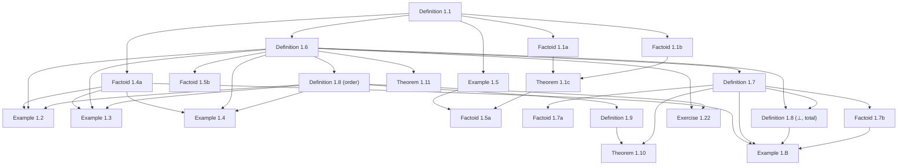

# Formalizing Dana Scott's 1980 Theory of Computation in Lean 4

## Abstract

In November 1969, Dana Scott formulated a mathematical program to construct the first non-degenerate, purely mathematical model ($D_\infty$) for Alonzo Church's untyped $\lambda$-calculus. He formally detailed this in his landmark 1972 paper *Continuous Lattices*, providing the foundational justification for denotational semantics. However, Scott's initial 1972 framework relied on dense, abstract point-set topology, which remained an intimidating barrier for computer scientists seeking a practical tool for everyday programming language design.

When Scott delivered his lectures at Oxford in 1980—subsequently published as *Lectures on a Mathematical Theory of Computation* (Technical Report PRG-19)—he made an intentional, systematic pivot from high topology back to constructive computer science infrastructure. He reframed domain theory around how computers process finite chunks of information. 

This Lean 4 formalization checks this constructive mathematical machinery: neighborhood systems (filters on a master set $\Delta$; domain elements as filters), approximable maps, and the full PRG-19 exercise spine through Lecture VII—capturing the precise moment where domain theory transitioned from pure mathematics into a practical engineering bedrock.

---

## Introduction

To make domain theory accessible, the 1980 monograph introduces three key conceptual and structural shifts:

### 1. The Information-Theoretic Ordering
In contrast to the topological open sets of 1972, the 1980 lectures treat domains strictly as partially ordered sets (posets) representing states of incomplete information. An element within a domain is framed as a "partial description" of a computation. The ordering relation ($\sqsubseteq$) is explicitly interpreted as approximation: $x \sqsubseteq y$ means $x$ contains less information than, or approximates, $y$.

### 2. Neighborhood Systems and Finite Approximations
To bypass the complexities of continuous geometric spaces, Scott introduced **Neighborhood Systems**. He recognized that real-world computing machines only ever interact with finite, checkable tokens of data. In this framework, an infinite computational process (such as an infinite stream or a complex recursive function) is defined as the limit of an ever-tightening sequence of these finite neighborhoods. This shifted the underlying mathematics away from general topology and toward formal logic and order theory.

### 3. Solving Universal Recursive Domain Equations
While Scott's 1969 discovery was a specialized solution to the specific self-referential equation $D \cong [D \to D]$, the 1980 monograph provides a universal factory blueprint. Scott uses inverse limits over Directed-Complete Partial Orders (CPOs) to solve arbitrary recursive domain equations. This generalized framework allowed computer scientists to give rigorous mathematical meaning to standard recursive computer data structures, such as lists, trees, and stream types.

### Formalization Target: Consolidating "Scott Domains"
This Lean 4 artifact formalizes the mathematical objects that these 1980 lectures ultimately standardized for the computer science community, known today as **Scott Domains**. A Scott Domain is characterized as a poset that is:
1. **Directed-Complete (CPO):** Every directed subset has a least upper bound, ensuring that infinite computations have well-defined limits.
2. **$\omega$-algebraic:** Every element in the domain can be represented as the supremum of a countable set of compact (finite) elements, mirroring how infinite data is built from finite tokens.
3. **Consistently Complete:** If any two pieces of information do not outright contradict each other, they possess a join (least upper bound), allowing consistent computation streams to merge safely.

---

## Methodology

This section records the proof-engineering conventions of the formalization—the parts of the
development workflow that are of general academic interest, distilled from the project's internal
handoff notes.

### Source material and inventory

The primary source is Dana Scott's *Lectures on a Mathematical Theory of Computation* (Oxford,
1980; Technical Report PRG-19). OCR transcriptions live in `sources/PRG19_vision.md`; the structured
inventory of every numbered Definition, Theorem, Example, and Exercise—with formalization status and
proof notes—is maintained in this document (`arxiv.md`). Each item is keyed to Scott's original
numbering and cross-linked to its Lean module. Status values distinguish **Pass** (mechanized, builds
green, zero `sorry`), **Partial** (substantial core done; documented gaps remain), **Not Yet**, and
**Deferred** (Lecture VIII and items beyond the current formalization frontier).

### Neighborhood systems as the uniform substrate

Following Scott's 1980 pivot away from point-set topology, domains are encoded uniformly as
**neighbourhood systems**: a master set Δ, a family 𝒟 of neighbourhoods (filters on Δ), and domain
elements as filters over 𝒟. Approximable maps, products, function spaces, sums, and fixed-point
combinators are built on this substrate in `Basic.lean`, `Approximable.lean`, `Product.lean`, and
`FunctionSpace.lean`. Positive systems (Exercise 1.19) and effectively given presentations
(Definition 7.1) are layered on top when Scott's exercises demand computability content.

### Custom recursion theory (Lecture VII)

For **effectively given** domains Scott requires two index relations to be *recursively decidable*:
(i) intersection equality `Xₙ ∩ Xₘ = X_k`, and (ii) consistency `∃ k. X_k ⊆ Xₙ ∩ X_m`. Rather than
mathlib's `Computable`/`ComputablePred` development—which pulls `Classical.choice` through tactics
such as `grind`, `lia`, and `Nat.unpair_pair`—we rebuilt the needed slice in `Recursive.lean`:

* `RecDecidable p := ∃ f, Nat.Primrec f ∧ ∀ n, p n ↔ f n = 1` (and the binary/ternary pair-codings
  `RecDecidable₂`, `RecDecidable₃`);
* choice-free correctness for `Nat.sqrt`, `Nat.pair`/`unpair`, and primitive-recursive `+`/`*`;
* closure lemmas (`RecDecidable.of_iff`, `.comp`, `.and`, `.or`, `.not`, bounded `∀`/`∃` via
  `bForallFn`/`bExistsFn`);
* r.e. layers `REPred`/`REPred₂` as projections of decidable relations.

**Target axiom footprint** for data constructions and core proofs: `⊆ {propext, Quot.sound}`.
`Classical.choice` is permitted only for genuinely unavoidable **Prop-level** steps (e.g. classical
case splits on membership in an arbitrary system) and is always called out in proof notes. Each
completed module is audited with `#print axioms`.

### Incremental proof development

Large exercises are decomposed into small, revert-safe sessions rather than monolithic proofs.
**Exercise 7.22** is the canonical example of this split: Scott's construction is **formalized**
(inventory rows **7.22a–h** and **7.22i(a)**, all **Pass**); what remains (**7.22i(b)1–8**, **7.22j–l**) is **integration** into
the repository's effectively-given framework (`RecDecidable₂`, `ComputablePresentation`) plus
optional extensions. We mechanize Scott's least positive neighbourhood system generated by
singleton languages under concatenation and consistent intersection; prove the induced semigroup
structure and embedding of the free monoid; construct executable automata-based consistency deciders;
and reduce the remaining effectively-given obligations to **primitive-recursive certification**
within `Recursive.lean`—not to further domain theory. See appendices A and B.

| Session | Goal | Status | Inventory |
|---------|------|--------|-----------|
| C1–C8 | Automata + Bool deciders + `SsysX` | ☑ | 7.22d–g |
| C11 | Infinite-word equations | ☑ | 7.22h |
| C12 | Inventory + axiom audit | ☑ | — |
| **C9a** | First missing **generic** `Nat.Primrec` lemma in `Recursive.lean` | ☑ | 7.22i(a) |
| **C9b** | `primrec_ssysConsChar` + `Ssys_cons_computable` (umbrella) | Not Yet | 7.22i(b) |
| **C9b1** | `decodeFuelOkChar` umbrella (**7.22i(b)1(a–e)**) | ☑ | 7.22i(b)1 |
| **C9b1a** | `mulBit` + `primrec` | ☑ | 7.22i(b)1(a) |
| **C9b1b** | `decodeFuelOkChar` + `primrec` | ☑ | 7.22i(b)1(b) |
| **C9b1c** | dispatch lemmas (`Body_eq`, `selectFn_isOne_…`) | ☑ | 7.22i(b)1(c) |
| **C9b1d** | `decodeListBool_isSome_iff` | ☑ | 7.22i(b)1(d) |
| **C9b1e** | `decodeFuelOkChar_eq_one_iff` | ☑ | 7.22i(b)1(e) |
| **C9b2** | `listLenChar` + `primrec` | ☑ | 7.22i(b)2 |
| **C9b3** | `listEqChar` + `primrec` | ☑ | 7.22i(b)3 |
| **C9b4** | `appendListCode`, `takeCode`, `dropCode` + `primrec` | Pass | 7.22i(b)4 |
| **C9b5** | `autStateCardFuelChar`, `matchesBChar` + `primrec` | Pass | 7.22i(b)5 |
| **C9b6** | `decideNonemptyBChar`, `consistentBChar` + `primrec` | Pass | 7.22i(b)6 |
| **C9b7** | `ssysConsistentBChar` + shallow Bool `_eq` lemmas | Pass | 7.22i(b)7 |
| **C9b8** | `primrec_ssysConsChar` → `Ssys_cons_computable` | Not Yet | 7.22i(b)8 |
| **C10** | `ComputablePresentation Ssys` / `IsEffectivelyGiven` | ☐ | 7.22j |
| C7b | Full relation (i) `interEq` decider | ☐ (optional) | 7.22k |

**C9 strategy (interface repair, not Scott):** mathematics and the Bool decider are complete
(`ssys_cons_char_iff`). Generic bridges `RecDecidable.of_zero_one_char` and
`RecDecidable₂.of_paired_zero_one_char` and the conditional
`Ssys_cons_computable_of_primrec_ssysConsChar` already exist. **Do not** rebuild the executable
semantics as a bespoke `primrec_*Char` tower in `Exercise722Presentation.lean`; prove reusable
primrec closure lemmas in `Recursive.lean` (fuel-bounded decode, structural folds via `foldCode` /
`existsListChar`), then instantiate in a few lines.

**Composer file map** (which module each session touches):

| File | Sessions |
|------|----------|
| `Exercise722Decide.lean` | C1–C2, C4–C7a |
| `Exercise722Words.lean` | C3–C5 |
| `Exercise722Presentation.lean` | C8–C10 |
| `Exercise722.lean` | C11 (`streamElem`, `streamElem_idempotent`, `example` checks) |
| `Recursive.lean` | C9a generic primrec lemmas; C9b bridge |

### Build and artifact hygiene

* **Build command:** `lake build Scott1980` (full package; filter CI noise with
  `grep -vE 'LEAN_PATH|trace:'`).
* **No `sorry`:** every Pass/Partial item in the inventory corresponds to modules that compile
  without placeholders.
* **Generated artifacts:** `arxiv_with_code.md` (Lean sources inlined for PDF pipeline) is produced by
  `scripts/generate_arxiv_with_code.py` and is intentionally gitignored between regenerations.
* **Inventory reconciliation:** `scripts/reconcile_arxiv_from_original.py` rebuilds goal-list rows from
  `arxiv_original.md` when the structured inventory needs to be resynchronized.

---

## Chronological Formalization Narrative

Below is the chronological narrative of the formalization, organized step-by-step using Dana Scott's original numbering system from the PRG-19 monograph.

### Lecture I: Domains by Neighborhoods



#### Definition 1.1
* **Mathematical Target:** `NeighborhoodSystem` (`mem`, `master`, `master_mem`, `inter_mem`, `sub_master`)
* **Lean File:** `Scott1980/Neighborhood/Basic.lean`
* **Proof Notes:** `NeighborhoodSystem` (`mem`, `master`, `master_mem`, `inter_mem`, `sub_master`)

`NeighborhoodSystem α` bundles a membership predicate `mem : Set α → Prop` (Scott's `X ∈ 𝒟`),
the master neighbourhood `master` (Scott's `Δ`, kept as a field rather than hard-wired to
`Set.univ`, for fidelity to the `Δ` notation), and Scott's two conditions: (i) `master_mem`
(`Δ ∈ 𝒟`) and (ii) `inter_mem` (consistent binary intersections stay in `𝒟`, the witness
`Z ⊆ X ∩ Y` passed explicitly). A fourth field `sub_master` records Scott's standing assumption
`𝒟 ⊆ 𝒫(Δ)` (every neighbourhood `X ⊆ Δ`); it is what gives the principal filter `↑X` its top
element `Δ` (Def 1.7) and underlies `⊥ = ↑Δ` (Def 1.8). Each finite example supplies it as
`fun _ => Set.subset_univ _` (their `master` is `Set.univ`). Scott's recursive **convention** for the finite intersection
`⋂_{i<n} Xᵢ` is the `def interUpTo` (`0 ↦ Δ`, `n+1 ↦ interUpTo n ∩ Xₙ`); **Factoids 1.1a/1.1b**
are its two defining equations, both `rfl`.


#### Factoid 1.1a
* **Mathematical Target:** `interUpTo`, `interUpTo_zero` (`⋂_{i<0} Xᵢ = Δ`)
* **Lean File:** `Scott1980/Neighborhood/Basic.lean`
* **Proof Notes:** `interUpTo`, `interUpTo_zero` (`⋂_{i<0} Xᵢ = Δ`)


#### Factoid 1.1b
* **Mathematical Target:** `interUpTo_succ` (`⋂_{i<n+1} Xᵢ = (⋂_{i<n} Xᵢ) ∩ Xₙ`)
* **Lean File:** `Scott1980/Neighborhood/Basic.lean`
* **Proof Notes:** `interUpTo_succ` (`⋂_{i<n+1} Xᵢ = (⋂_{i<n} Xᵢ) ∩ Xₙ`)


#### Theorem 1.1c
* **Mathematical Target:** `interUpTo_mem` (extend (ii) to finite seqs) + `consistent_iff_interUpTo_mem` (consistency ⟺ `⋂ ∈ 𝒟`); aux `Consistent`, `interUpTo_subset`
* **Lean File:** `Scott1980/Neighborhood/Basic.lean`
* **Proof Notes:** `interUpTo_mem` (extend (ii) to finite seqs) + `consistent_iff_interUpTo_mem` (consistency ⟺ `⋂ ∈ 𝒟`); aux `Consistent`, `interUpTo_subset`


#### Example 1.2
* **Mathematical Target:** `Δ={0,1}`, `𝒟={{0,1},{0},{1}}`; `neighborhoodSystem`, `element_classification` (exactly 3 filters), `bot_is_unique_partial` (one partial element)
* **Lean File:** — (see proof notes)
* **Proof Notes:** `Δ={0,1}`, `𝒟={{0,1},{0},{1}}`; `neighborhoodSystem`, `element_classification` (exactly 3 filters), `bot_is_unique_partial` (one partial element)

Scott's first worked example: `Δ = {0,1}` (`Token := Fin 2`, `master := Set.univ`),
`𝒟 = {Δ, {0}, {1}}`. We build `neighborhoodSystem : NeighborhoodSystem Token` — the only real
obligation is condition (ii), discharged by `inter_eq` (the nine pairwise intersections each reduce
to `Δ`, `{0}`, `{1}`, or `∅` via `master_inter`/`inter_master`/`Set.inter_self`/`zero_inter_one`),
the `∅` case being impossible since a witness `Z ⊆ ∅` would force `∅ ∈ 𝒟` (`not_mem_empty`).

The mathematical payoff is the **element classification** (`element_classification`): every filter
is one of exactly three — `bot = {Δ}`, `elemZero = {Δ,{0}}`, `elemOne = {Δ,{1}}`. The argument: a
filter `x` either contains `{0}` (then `up_mem`+`inter_mem` force `x = elemZero`; it cannot also
contain `{1}` since `{0} ∩ {1} = ∅ ∉ 𝒟`), or `{1}` (symmetric), or neither (then `x = bot`).
Hence `bot_is_unique_partial`: `⊥` is the sole *partial* element, with `bot_lt_elemZero`,
`bot_lt_elemOne` placing the two total elements strictly above it — exactly Scott's "there is only
one partial element". Being a concrete finite computation it leans on `Mathlib.Tactic`
(`fin_cases`/`simp`), so its footprint is the classical `[propext, Classical.choice, Quot.sound]`;
the constructive guarantee is reserved for the §1 *core* in `Basic.lean`.


#### Example 1.3
* **Mathematical Target:** `Δ={0,1,2}`, `𝒟={{0,1,2},{1,2},{2}}` (linear); `neighborhoodSystem`, `element_classification` (exactly 3 filters), `bot_lt_elemTwelve`, `elemTwelve_lt_elemTwo`, `elemTwo_maximal` (linear chain; token `2` total)
* **Lean File:** — (see proof notes)
* **Proof Notes:** `Δ={0,1,2}`, `𝒟={{0,1,2},{1,2},{2}}` (linear); `neighborhoodSystem`, `element_classification` (exactly 3 filters), `bot_lt_elemTwelve`, `elemTwelve_lt_elemTwo`, `elemTwo_maximal` (linear chain; token `2` total)

Scott's second worked example: `Δ = {0,1,2}` (`Token := Fin 3`, `master := Set.univ`),
`𝒟 = {Δ, {1,2}, {2}}` — a **linear chain** under reverse inclusion (more information =
smaller set). We build `neighborhoodSystem : NeighborhoodSystem Token`; condition (ii) is
discharged by `inter_eq` with only **three** outcomes (`Δ`, `{1,2}`, `{2}`) — every pairwise
intersection is nested, so there is no empty-intersection case (contrast Example 1.2's nine-case
analysis).

The element classification (`element_classification`) yields exactly three filters in a linear
chain: `bot = {Δ}`, `elemTwelve = {Δ,{1,2}}`, `elemTwo = {Δ,{1,2},{2}}`. The argument follows
the same "case on minimal non-master neighbourhood" pattern as 1.2: if `{2} ∈ x` then `x =
elemTwo`; else if `{1,2} ∈ x` then `x = elemTwelve`; else `x = bot`. Order lemmas
`bot_lt_elemTwelve`, `elemTwelve_lt_elemTwo`, and `elemTwo_maximal` capture Scott's narrative:
approximation proceeds in **two steps** to the total element (token `2`); tokens `0` and `1` are
not total (they appear in larger neighbourhoods but do not determine filters); the direction of
approximation is **unique** (no branching). Unlike 1.2 (one partial, two total), 1.3 has **two
partial** elements and **one total**. Footprint `[propext, Classical.choice, Quot.sound]`.


#### Example 1.4
* **Mathematical Target:** depth-2 binary tree `Δ={Λ,0,1,00,01,10,11}`; subtrees as neighbourhoods; `neighborhoodSystem`, `element_classification` (exactly 7 filters), branch `bot_lt_elemZero/elemOne`, `elemZero_lt_elem00/01`, `elemOne_lt_elem10/11`, four leaf `elemXY_maximal` (first branching; 4 total elements)
* **Lean File:** — (see proof notes)
* **Proof Notes:** depth-2 binary tree `Δ={Λ,0,1,00,01,10,11}`; subtrees as neighbourhoods; `neighborhoodSystem`, `element_classification` (exactly 7 filters), branch `bot_lt_elemZero/elemOne`, `elemZero_lt_elem00/01`, `elemOne_lt_elem10/11`, four leaf `elemXY_maximal` (first branching; 4 total elements)

Scott's third worked example and the first with **branching**: the depth-2 binary tree
`Δ = {Λ,0,1,00,01,10,11}` (`Token := Fin 7`, with `Λ=0,…,11=6`), neighbourhoods the subtrees
`𝒟 = {Δ, left={0,00,01}, right={1,10,11}, {00},{01},{10},{11}}` — encoded as `left={1,3,4}`,
`right={2,5,6}`, and the four leaf singletons. Condition (ii) reduces to the "nested-or-disjoint"
table: of the 49 pairwise intersections, each is again a neighbourhood or `∅`. Rather than search,
`inter_eq` rewrites `X ∩ Y` to its canonical value via a complete `simp only` set of the 24
distinct intersection lemmas (both orders) plus `master_inter`/`inter_master`/`Set.inter_self`,
so the matching disjunct closes by `rfl` — deterministic and fast (the naive 49×8 `first` ladder
times out). The `∅` outcomes are inadmissible in `inter_mem` because a witness `Z ⊆ ∅` would force
`∅ ∈ 𝒟` (`not_mem_empty`).

The payoff is the **seven-filter classification** (`element_classification`): the bottom `⊥={Δ}`,
two branch partials `elemZero={Δ,left}` / `elemOne={Δ,right}`, and four total leaf filters
`elem00,…,elem11`. The proof cases on the minimal non-master neighbourhood: a leaf in `x` pins the
total filter (`mem_leafXY_imp`, using that distinct leaves and cross-branch neighbourhoods
intersect to `∅`); otherwise `left`/`right` membership gives a branch partial, else `⊥`. The order
lemmas realize the **tree with choice**: `bot_lt_elemZero/elemOne` (two incomparable partials above
`⊥`), `elemZero_lt_elem00/01`, `elemOne_lt_elem10/11` (each partial below its two leaves), and
`elemXY_maximal` for the four leaves (each leaf filter is maximal — a total element). Contrast the
prior examples: 1.2 is a fork at the bottom (one partial, two total), 1.3 a linear chain (two
partial, one total), and 1.4 a genuine tree (three partial, four total) where branching encodes
the choice in extending a partial sequence. Footprint `[propext, Classical.choice, Quot.sound]`.


#### Factoid 1.4a
* **Mathematical Target:** `NestedOrDisjoint` + `NeighborhoodSystem.ofNestedOrDisjoint`: "*nested-or-disjoint*" ⟹ neighbourhood system (the "very special circumstance" of 1.2–1.4); choice-free
* **Lean File:** `Scott1980/Neighborhood/Basic.lean`
* **Proof Notes:** `NestedOrDisjoint` + `NeighborhoodSystem.ofNestedOrDisjoint`: "*nested-or-disjoint*" ⟹ neighbourhood system (the "very special circumstance" of 1.2–1.4); choice-free

Scott's "very special circumstance" after Examples 1.2–1.4 is the predicate `NestedOrDisjoint mem
:= ∀ X Y, mem X → mem Y → X ⊆ Y ∨ Y ⊆ X ∨ X ∩ Y = ∅`. The constructor
`NeighborhoodSystem.ofNestedOrDisjoint mem master master_mem hnd` then discharges condition (ii)
without choice by casing on `hnd`: if `X ⊆ Y` then `X ∩ Y = X` (`Set.inter_eq_left.mpr`) so the
intersection is `mem` by `hX`; symmetrically for `Y ⊆ X`; and if `X ∩ Y = ∅` the consistency
witness `Z ⊆ X ∩ Y = ∅` gives `Z = ∅` (`Set.subset_empty_iff`), so `X ∩ Y = ∅ = Z ∈ 𝒟`. This is
the uniform reason Examples 1.2 (fork), 1.3 (chain) and 1.4 (tree) are neighbourhood systems.
Footprint `[propext, Quot.sound]`.


#### Example 1.5
* **Mathematical Target:** `Δ={0,1,2,3}`, `𝒟 =` all non-empty subsets; `Example15.neighborhoodSystem` (`mem X := X.Nonempty`), `mem_iff_nonempty`
* **Lean File:** — (see proof notes)
* **Proof Notes:** `Δ={0,1,2,3}`, `𝒟 =` all non-empty subsets; `Example15.neighborhoodSystem` (`mem X := X.Nonempty`), `mem_iff_nonempty`

`Δ = {0,1,2,3}` (`Token := Fin 4`) with `𝒟` = all **non-empty** subsets (`mem X := X.Nonempty`,
`master := Set.univ`). Condition (ii) is immediate and choice-free: a non-empty witness `Z ⊆ X ∩ Y`
makes `X ∩ Y` non-empty (`obtain ⟨z, hz⟩ := hZ; exact ⟨z, hZsub hz⟩`). **Factoid 1.5a**
(`consistent_iff_inter_nonempty`) is Scott's remark that "sets are consistent iff they have a
non-empty intersection": reusing the `Basic` `Consistent`/`interUpTo` infrastructure, a prefix is
consistent (`∃ Z, Z.Nonempty ∧ Z ⊆ ⋂`) iff `⋂_{i<n} Xᵢ` is non-empty (`→` shrinks the witness, `←`
takes the intersection as its own witness). Notably this example needs **no** `fin_cases`/`decide`
and audits to `[propext]` (system) / `[propext, Quot.sound]` (Factoid 1.5a) — a fully constructive
contrast to the finite Examples 1.2–1.4.


#### Factoid 1.5a
* **Mathematical Target:** in 1.5: `consistent_iff_inter_nonempty` (consistent ⟺ non-empty intersection); `𝒟` is a system
* **Lean File:** — (see proof notes)
* **Proof Notes:** in 1.5: `consistent_iff_inter_nonempty` (consistent ⟺ non-empty intersection); `𝒟` is a system

`Δ = {0,1,2,3}` (`Token := Fin 4`) with `𝒟` = all **non-empty** subsets (`mem X := X.Nonempty`,
`master := Set.univ`). Condition (ii) is immediate and choice-free: a non-empty witness `Z ⊆ X ∩ Y`
makes `X ∩ Y` non-empty (`obtain ⟨z, hz⟩ := hZ; exact ⟨z, hZsub hz⟩`). **Factoid 1.5a**
(`consistent_iff_inter_nonempty`) is Scott's remark that "sets are consistent iff they have a
non-empty intersection": reusing the `Basic` `Consistent`/`interUpTo` infrastructure, a prefix is
consistent (`∃ Z, Z.Nonempty ∧ Z ⊆ ⋂`) iff `⋂_{i<n} Xᵢ` is non-empty (`→` shrinks the witness, `←`
takes the intersection as its own witness). Notably this example needs **no** `fin_cases`/`decide`
and audits to `[propext]` (system) / `[propext, Quot.sound]` (Factoid 1.5a) — a fully constructive
contrast to the finite Examples 1.2–1.4.


#### Factoid 1.5b
* **Mathematical Target:** `limitFamily`, `SeqEquiv`, `limitFamily_eq_iff`: limit-family `x = {Z∈𝒟 ∣ ∃n, Xₙ⊆Z}` equal ⟺ sequences equivalent; choice-free
* **Lean File:** — (see proof notes)
* **Proof Notes:** `limitFamily`, `SeqEquiv`, `limitFamily_eq_iff`: limit-family `x = {Z∈𝒟 ∣ ∃n, Xₙ⊆Z}` equal ⟺ sequences equivalent; choice-free

The prose motivating Definition 1.6: a descending sequence `⟨Xₙ⟩` of neighbourhoods determines the
limit family `limitFamily X = {Z ∈ 𝒟 ∣ ∃ n, Xₙ ⊆ Z}`, and two sequences are `SeqEquiv` ("equally
deep") when `∀ m, ∃ n, Xₙ ⊆ Yₘ` and `∀ n, ∃ m, Yₘ ⊆ Xₙ`. `limitFamily_eq_iff` proves
`limitFamily X = limitFamily Y ↔ SeqEquiv X Y` (assuming each term is a neighbourhood): `→` feeds
each `Yₘ ∈ limitFamily Y` through the family equality to extract `Xₙ ⊆ Yₘ` (and symmetrically);
`←` chains `Yₘ ⊆ Xₙ ⊆ Z` (and symmetrically) via transitivity. Antitonicity of the sequences is not
needed for the criterion itself. Footprint `[propext, Quot.sound]`.


#### Definition 1.6
* **Mathematical Target:** `Element` (filter: `sub`, `master_mem`, `inter_mem`, `up_mem`) + `Element.ext`; domain `\
* **Lean File:** — (see proof notes)
* **Proof Notes:** 𝒟\|` | **Pass**

`Element V` is Scott's filter (Def 1.6): a membership predicate `mem : Set α → Prop` with `sub`
(`x ⊆ 𝒟`), `master_mem` (`Δ ∈ x`), `inter_mem` (closed under `∩`), and `up_mem` (upward closed in
`𝒟`). Mirroring `InfoSys.Element`, the early helper `Element.ext` (membership-equality ⟹ equality,
proved by `rcases` on both structures + `funext`/`propext`, *not* `congr`) keeps the
`PartialOrder` instance (Def 1.8's approximation order `x ⊑ y ⟺ x ⊆ y`) choice-free: `le_antisymm`
is just `Element.ext fun X => ⟨h1 X, h2 X⟩`. Footprint `[propext, Quot.sound]`.


#### Definition 1.7
* **Mathematical Target:** `principal` `↑X = {Y∈𝒟 ∣ X⊆Y}` (`mem_principal`); the finite elements
* **Lean File:** — (see proof notes)
* **Proof Notes:** `principal` `↑X = {Y∈𝒟 ∣ X⊆Y}` (`mem_principal`); the finite elements

Scott's *principal filter* `↑X = {Y ∈ 𝒟 ∣ X ⊆ Y}` is `principal (hX : V.mem X) : V.Element`,
with `mem Y := V.mem Y ∧ X ⊆ Y`. The four filter laws: `sub` is the first projection;
`master_mem = ⟨V.master_mem, V.sub_master hX⟩` (this is where the new `sub_master` field earns its
keep — `X ⊆ Δ`); `inter_mem` combines `Set.subset_inter` (from `X ⊆ Y₁`, `X ⊆ Y₂`) with one use of
`V.inter_mem`, taking `X` itself as the consistency witness `X ⊆ Y₁ ∩ Y₂`; `up_mem` is `⊆`
transitivity. `mem_principal` is the membership `rfl`-unfolding.

**Factoid 1.7a (one-one + inclusion-reversing).** `principal_le_iff`:
`↑X ⊑ ↑Y ↔ Y ⊆ X` — Scott's `X ⊆ Y ⟺ ↑Y ⊑ ↑X`, the **variance flip** (smaller neighbourhood ⇒
larger principal filter ⇒ more information). `→` evaluates `⊑` at the token `X` (using `X ∈ ↑X`
since `X ⊆ X`) and reads `Y ⊆ X` off `X ∈ ↑Y`; `←` chains `Y ⊆ X ⊆ Z`. Injectivity
`principal_injective` (`↑X = ↑Y ⟹ X = Y`) feeds both `le_of_eq` directions through
`principal_le_iff` into `Set.Subset.antisymm`.

**Factoid 1.7b (density of finite elements).** `eq_iUnion_principal`:
`x.mem Z ↔ ∃ X, ∃ hX : x.mem X, (↑X).mem Z` — Scott's `x = ⋃ {↑X ∣ X ∈ x}` written as union
membership (concrete, avoiding `⋃` over a `Set (Set α)`). `→` uses `X = Z` (`Z ∈ ↑Z`); `←` is one
application of upward closure `x.up_mem` (`X ⊆ Z` with `Z ∈ 𝒟`). All five declarations audit to
`[propext, Quot.sound]`.


#### Factoid 1.7a
* **Mathematical Target:** "*obvious*": `X↦↑X` one-one & inclusion-**reversing** — `principal_le_iff` (`↑X⊑↑Y ⟺ Y⊆X`) + `principal_injective`
* **Lean File:** — (see proof notes)
* **Proof Notes:** "*obvious*": `X↦↑X` one-one & inclusion-**reversing** — `principal_le_iff` (`↑X⊑↑Y ⟺ Y⊆X`) + `principal_injective`

Scott's *principal filter* `↑X = {Y ∈ 𝒟 ∣ X ⊆ Y}` is `principal (hX : V.mem X) : V.Element`,
with `mem Y := V.mem Y ∧ X ⊆ Y`. The four filter laws: `sub` is the first projection;
`master_mem = ⟨V.master_mem, V.sub_master hX⟩` (this is where the new `sub_master` field earns its
keep — `X ⊆ Δ`); `inter_mem` combines `Set.subset_inter` (from `X ⊆ Y₁`, `X ⊆ Y₂`) with one use of
`V.inter_mem`, taking `X` itself as the consistency witness `X ⊆ Y₁ ∩ Y₂`; `up_mem` is `⊆`
transitivity. `mem_principal` is the membership `rfl`-unfolding.

**Factoid 1.7a (one-one + inclusion-reversing).** `principal_le_iff`:
`↑X ⊑ ↑Y ↔ Y ⊆ X` — Scott's `X ⊆ Y ⟺ ↑Y ⊑ ↑X`, the **variance flip** (smaller neighbourhood ⇒
larger principal filter ⇒ more information). `→` evaluates `⊑` at the token `X` (using `X ∈ ↑X`
since `X ⊆ X`) and reads `Y ⊆ X` off `X ∈ ↑Y`; `←` chains `Y ⊆ X ⊆ Z`. Injectivity
`principal_injective` (`↑X = ↑Y ⟹ X = Y`) feeds both `le_of_eq` directions through
`principal_le_iff` into `Set.Subset.antisymm`.

**Factoid 1.7b (density of finite elements).** `eq_iUnion_principal`:
`x.mem Z ↔ ∃ X, ∃ hX : x.mem X, (↑X).mem Z` — Scott's `x = ⋃ {↑X ∣ X ∈ x}` written as union
membership (concrete, avoiding `⋃` over a `Set (Set α)`). `→` uses `X = Z` (`Z ∈ ↑Z`); `←` is one
application of upward closure `x.up_mem` (`X ⊆ Z` with `Z ∈ 𝒟`). All five declarations audit to
`[propext, Quot.sound]`.


#### Factoid 1.7b
* **Mathematical Target:** "*also obvious*": `x = ⋃ {↑X ∣ X∈x}` for every `x∈\
* **Lean File:** — (see proof notes)
* **Proof Notes:** 𝒟\|` — `eq_iUnion_principal` | **Pass**

Scott's *principal filter* `↑X = {Y ∈ 𝒟 ∣ X ⊆ Y}` is `principal (hX : V.mem X) : V.Element`,
with `mem Y := V.mem Y ∧ X ⊆ Y`. The four filter laws: `sub` is the first projection;
`master_mem = ⟨V.master_mem, V.sub_master hX⟩` (this is where the new `sub_master` field earns its
keep — `X ⊆ Δ`); `inter_mem` combines `Set.subset_inter` (from `X ⊆ Y₁`, `X ⊆ Y₂`) with one use of
`V.inter_mem`, taking `X` itself as the consistency witness `X ⊆ Y₁ ∩ Y₂`; `up_mem` is `⊆`
transitivity. `mem_principal` is the membership `rfl`-unfolding.

**Factoid 1.7a (one-one + inclusion-reversing).** `principal_le_iff`:
`↑X ⊑ ↑Y ↔ Y ⊆ X` — Scott's `X ⊆ Y ⟺ ↑Y ⊑ ↑X`, the **variance flip** (smaller neighbourhood ⇒
larger principal filter ⇒ more information). `→` evaluates `⊑` at the token `X` (using `X ∈ ↑X`
since `X ⊆ X`) and reads `Y ⊆ X` off `X ∈ ↑Y`; `←` chains `Y ⊆ X ⊆ Z`. Injectivity
`principal_injective` (`↑X = ↑Y ⟹ X = Y`) feeds both `le_of_eq` directions through
`principal_le_iff` into `Set.Subset.antisymm`.

**Factoid 1.7b (density of finite elements).** `eq_iUnion_principal`:
`x.mem Z ↔ ∃ X, ∃ hX : x.mem X, (↑X).mem Z` — Scott's `x = ⋃ {↑X ∣ X ∈ x}` written as union
membership (concrete, avoiding `⋃` over a `Set (Set α)`). `→` uses `X = Z` (`Z ∈ ↑Z`); `←` is one
application of upward closure `x.up_mem` (`X ⊆ Z` with `Z ∈ 𝒟`). All five declarations audit to
`[propext, Quot.sound]`.


#### Definition 1.8 (order)
* **Mathematical Target:** approximation `x⊑y ⟺ x⊆y` — `instance : PartialOrder Element` (choice-free `le_antisymm` via `Element.ext`)
* **Lean File:** — (see proof notes)
* **Proof Notes:** approximation `x⊑y ⟺ x⊆y` — `instance : PartialOrder Element` (choice-free `le_antisymm` via `Element.ext`)

`Element V` is Scott's filter (Def 1.6): a membership predicate `mem : Set α → Prop` with `sub`
(`x ⊆ 𝒟`), `master_mem` (`Δ ∈ x`), `inter_mem` (closed under `∩`), and `up_mem` (upward closed in
`𝒟`). Mirroring `InfoSys.Element`, the early helper `Element.ext` (membership-equality ⟹ equality,
proved by `rcases` on both structures + `funext`/`propext`, *not* `congr`) keeps the
`PartialOrder` instance (Def 1.8's approximation order `x ⊑ y ⟺ x ⊆ y`) choice-free: `le_antisymm`
is just `Element.ext fun X => ⟨h1 X, h2 X⟩`. Footprint `[propext, Quot.sound]`.


#### Definition 1.8 (⊥, total)
* **Mathematical Target:** `bot := principal master_mem` (`⊥={Δ}=↑Δ`), `mem_bot` (`Y∈⊥ ⟺ Y=Δ`); `IsTotal x := ∀ y, x⊑y→y⊑x` (predicate only, existence = Ex 1.24, out of scope)
* **Lean File:** — (see proof notes)
* **Proof Notes:** `bot := principal master_mem` (`⊥={Δ}=↑Δ`), `mem_bot` (`Y∈⊥ ⟺ Y=Δ`); `IsTotal x := ∀ y, x⊑y→y⊑x` (predicate only, existence = Ex 1.24, out of scope)


#### Factoid 1.8a
* **Mathematical Target:** `bot_le` (`⊥⊑x` for all `x`) + `instance OrderBot Element`; constructive
* **Lean File:** — (see proof notes)
* **Proof Notes:** `bot_le` (`⊥⊑x` for all `x`) + `instance OrderBot Element`; constructive

Scott's bottom element `⊥ = {Δ}` is simply the principal filter of the master neighbourhood:
`bot := principal master_mem`, i.e. `⊥ = ↑Δ`. `mem_bot` shows it really is the *singleton* `{Δ}`:
`Y ∈ ⊥ ↔ Y = Δ`. The forward direction is where `sub_master` pays off — `Y ∈ ↑Δ` gives `Y ∈ 𝒟`
*and* `Δ ⊆ Y`, while `V.sub_master` supplies the reverse `Y ⊆ Δ`, so `Set.Subset.antisymm` collapses
`Y` to `Δ`. This is the *variance* curiosity (Pitfall 4): `⊥ = ↑Δ` is the *largest* principal filter
(`Δ` is the largest neighbourhood) yet the *least* element.

**Factoid 1.8a (`⊥` is least).** `bot_le : ∀ x, ⊥ ⊑ x`: a member `Y ∈ ⊥` is `Y = Δ` (`mem_bot`),
and `Δ ∈ x` is filter axiom (i) `x.master_mem`. Packaged as `instance : OrderBot V.Element` so the
`⊥` notation resolves to `{Δ}`; the instance stays `[propext, Quot.sound]`.

**Definition 1.8 (total elements).** `IsTotal x := ∀ y, x ⊑ y → y ⊑ x` — maximality under the
approximation order, kept as a *predicate*. Per Scott, the *existence* of total (maximal) elements
above a given `x` is the classical frontier (Exercise 1.24, needs Zorn/choice) and is deliberately
**not** proved here.

**Factoid 1.8b ("Examples 1.2–1.5 revisited": finite ⟹ principal).** Scott's prose "any explicitly
given filter `x` is principal … the minimal `X ∈ x` tells us all we need to know" is formalized as
`eq_principal_of_isMin`: if `x` has a `⊆`-minimum member `X` (one with `X ⊆ Y` for every `Y ∈ x`),
then `x = ↑X`. `⊆` is minimality, `⊇` is one `up_mem`. This is the constructive *core*; the step
"finite system ⟹ such a minimum exists" (take the intersection of the finitely many members, itself
in `x` by closure) is the only classical ingredient and is left implicit, so the stated lemma audits
to `[propext, Quot.sound]`. All four new declarations are constructive.


#### Factoid 1.8b
* **Mathematical Target:** `eq_principal_of_isMin` (filter with `⊆`-minimum member `X` is `↑X`) — constructive core of "finite ⟹ principal"; the finiteness⟹min step left implicit
* **Lean File:** — (see proof notes)
* **Proof Notes:** `eq_principal_of_isMin` (filter with `⊆`-minimum member `X` is `↑X`) — constructive core of "finite ⟹ principal"; the finiteness⟹min step left implicit

Scott's bottom element `⊥ = {Δ}` is simply the principal filter of the master neighbourhood:
`bot := principal master_mem`, i.e. `⊥ = ↑Δ`. `mem_bot` shows it really is the *singleton* `{Δ}`:
`Y ∈ ⊥ ↔ Y = Δ`. The forward direction is where `sub_master` pays off — `Y ∈ ↑Δ` gives `Y ∈ 𝒟`
*and* `Δ ⊆ Y`, while `V.sub_master` supplies the reverse `Y ⊆ Δ`, so `Set.Subset.antisymm` collapses
`Y` to `Δ`. This is the *variance* curiosity (Pitfall 4): `⊥ = ↑Δ` is the *largest* principal filter
(`Δ` is the largest neighbourhood) yet the *least* element.

**Factoid 1.8a (`⊥` is least).** `bot_le : ∀ x, ⊥ ⊑ x`: a member `Y ∈ ⊥` is `Y = Δ` (`mem_bot`),
and `Δ ∈ x` is filter axiom (i) `x.master_mem`. Packaged as `instance : OrderBot V.Element` so the
`⊥` notation resolves to `{Δ}`; the instance stays `[propext, Quot.sound]`.

**Definition 1.8 (total elements).** `IsTotal x := ∀ y, x ⊑ y → y ⊑ x` — maximality under the
approximation order, kept as a *predicate*. Per Scott, the *existence* of total (maximal) elements
above a given `x` is the classical frontier (Exercise 1.24, needs Zorn/choice) and is deliberately
**not** proved here.

**Factoid 1.8b ("Examples 1.2–1.5 revisited": finite ⟹ principal).** Scott's prose "any explicitly
given filter `x` is principal … the minimal `X ∈ x` tells us all we need to know" is formalized as
`eq_principal_of_isMin`: if `x` has a `⊆`-minimum member `X` (one with `X ⊆ Y` for every `Y ∈ x`),
then `x = ↑X`. `⊆` is minimality, `⊇` is one `up_mem`. This is the constructive *core*; the step
"finite system ⟹ such a minimum exists" (take the intersection of the finitely many members, itself
in `x` by closure) is the only classical ingredient and is left implicit, so the stated lemma audits
to `[propext, Quot.sound]`. All four new declarations are constructive.


#### Example 1.B
* **Mathematical Target:** `B = {σΣ* ∣ σ∈Σ*}` (binary), generalizing 1.4 — `Str := List Bool`, `cone σ = σΣ*`, `B` via `ofNestedOrDisjoint` from prefix `cone_trichotomy`
* **Lean File:** — (see proof notes)
* **Proof Notes:** `B = {σΣ* ∣ σ∈Σ*}` (binary), generalizing 1.4 — `Str := List Bool`, `cone σ = σΣ*`, `B` via `ofNestedOrDisjoint` from prefix `cone_trichotomy`


#### Exercise 1.B-sys
* **Mathematical Target:** "*should be done as an exercise*": `B` is a neighbourhood system — `nestedOrDisjoint` (cones pairwise nested-or-disjoint)
* **Lean File:** — (see proof notes)
* **Proof Notes:** "*should be done as an exercise*": `B` is a neighbourhood system — `nestedOrDisjoint` (cones pairwise nested-or-disjoint)


#### Exercise 1.B-elt
* **Mathematical Target:** "*an exercise here*": `σx ∈ \
* **Lean File:** — (see proof notes)
* **Proof Notes:** B\|` for `x∈\|B\|` — `sigmaElt σ x` (witness `σ(X₁∩X₂)` is a cone); `sigmaElt σ ⊥ = σ⊥` (`sigmaElt_bot`) | **Pass**


#### Factoid 1.B-mono
* **Mathematical Target:** `σ₀⊥ ⊆ σ₁⊥ ⟺ σ₀` is an initial segment of `σ₁` — `sigmaBot_le_iff` (`σ₀⊥⊑σ₁⊥ ⟺ σ₀<+:σ₁`)
* **Lean File:** — (see proof notes)
* **Proof Notes:** `σ₀⊥ ⊆ σ₁⊥ ⟺ σ₀` is an initial segment of `σ₁` — `sigmaBot_le_iff` (`σ₀⊥⊑σ₁⊥ ⟺ σ₀<+:σ₁`)


#### Factoid 1.B-lim
* **Mathematical Target:** `x = ⋃ₙ σₙ⊥` (element = limit of finite approx.) — `mem_iff_exists_sigmaBot` (union-of-`σ⊥` form; chain enumeration left to prose / choice)
* **Lean File:** — (see proof notes)
* **Proof Notes:** `x = ⋃ₙ σₙ⊥` (element = limit of finite approx.) — `mem_iff_exists_sigmaBot` (union-of-`σ⊥` form; chain enumeration left to prose / choice)


#### Definition 1.9
* **Mathematical Target:** `𝒟₀ ≅ 𝒟₁`: order-iso of `\
* **Lean File:** `Scott1980/Neighborhood/Basic.lean`
* **Proof Notes:** 𝒟₀\|` and `\|𝒟₁\|` — `DomainIso := V₀.Element ≃o V₁.Element`, `Isomorphic`/`≅ᴰ := Nonempty DomainIso` with `refl`/`symm`/`trans` (`Basic.lean`); `≃o` *reflects* `⊑` (`map_rel_iff`) = Scott's two-way inclusion-preservation | **Pass**


#### Theorem 1.10
* **Mathematical Target:** element-token system: `[X]={x ∣ X∈x}` (`bracket`); `tokenSystem : NeighborhoodSystem \
* **Lean File:** `Scott1980/Neighborhood/Theorem110.lean`
* **Proof Notes:** 𝒟\|`; `𝒟 ≅ᴰ tokenSystem` via `tokenIso`/`isomorphic_tokenSystem` (mutually-inverse `toToken`/`ofToken`). Facts: `bracket_master` (1), `bracket_inter_nonempty_iff` (2), `bracket_inter` (3), `principal_mem_bracket` (4); one-one `bracket_injective`, preserving `bracket_subset_iff` (`Theorem110.lean`) | **Pass**


#### Theorem 1.11
* **Mathematical Target:** `\
* **Lean File:** `Scott1980/Neighborhood/Theorem111.lean`
* **Proof Notes:** 𝒟\|` closed under countable `⋂` (`iInter`, no proviso) and ascending `⋃` (`iUnion`, `Monotone x`) — each again a filter; GLB `iInter_le`/`le_iInter`, LUB `le_iUnion`/`iUnion_le`; `mem_iInter`/`mem_iUnion` (`Theorem111.lean`) | **Pass**


#### Exercise 1.12
* **Mathematical Target:** `Δ=ℕ`, final-segment `tail n={m ∣ n≤m}`; `neighborhoodSystem` (chain via `ofNestedOrDisjoint`); finite elts `fin n=↑(tail n)` (`fin_strictMono`); unique limit/total `top` (`le_top`, `top_isTotal`, `isTotal_iff_top`); `element_eq` (every elt `fin n` or `top`, classical) (`Exercise112.lean`)
* **Lean File:** `Scott1980/Neighborhood/Exercise112.lean`
* **Proof Notes:** `Δ=ℕ`, final-segment `tail n={m ∣ n≤m}`; `neighborhoodSystem` (chain via `ofNestedOrDisjoint`); finite elts `fin n=↑(tail n)` (`fin_strictMono`); unique limit/total `top` (`le_top`, `top_isTotal`, `isTotal_iff_top`); `element_eq` (every elt `fin n` or `top`, classical) (`Exercise112.lean`)


#### Exercise 1.13
* **Mathematical Target:** assertions about `B` = `ExampleB.lean`; this file adds the **limit nodes**: `branch p = ⋃ₙ (p↾n)⊥` (via Thm 1.11 `iUnion`), `branch_mem_iff`, `branchSeq_le_branch`, and `branch_isTotal` (each infinite path is a total/maximal element) (`Exercise113.lean`)
* **Lean File:** `Scott1980/Neighborhood/ExampleB.lean`
* **Proof Notes:** assertions about `B` = `ExampleB.lean`; this file adds the **limit nodes**: `branch p = ⋃ₙ (p↾n)⊥` (via Thm 1.11 `iUnion`), `branch_mem_iff`, `branchSeq_le_branch`, and `branch_isTotal` (each infinite path is a total/maximal element) (`Exercise113.lean`)


#### Exercise 1.14
* **Mathematical Target:** `Δ=ℕ`, `𝒟 =` finite non-empty subsets `∪ {Δ}`; `neighborhoodSystem` (manual `inter_mem`, not nested-or-disjoint); finite elts `fin h=↑X`; total elts = singletons `singleton_isTotal` (`↑{n}` maximal) (`Exercise114.lean`)
* **Lean File:** `Scott1980/Neighborhood/Exercise114.lean`
* **Proof Notes:** `Δ=ℕ`, `𝒟 =` finite non-empty subsets `∪ {Δ}`; `neighborhoodSystem` (manual `inter_mem`, not nested-or-disjoint); finite elts `fin h=↑X`; total elts = singletons `singleton_isTotal` (`↑{n}` maximal) (`Exercise114.lean`)


#### Exercise 1.15
* **Mathematical Target:** two infinite finite-element domains: `flat` (`{ℕ}∪{{n}}`, fully classified: `flat_classify`, `flat_atom_maximal`, `flat_no_three_chain`, `flat_no_infinite_chain`, `flat_all_finite`) and `stem` (`{ℕ,{0,1}}∪{{n}}`, `stem_three_chain`); `not_isomorphic` (3-chain transports under `≃o`) (`Exercise115.lean`)
* **Lean File:** `Scott1980/Neighborhood/Exercise115.lean`
* **Proof Notes:** two infinite finite-element domains: `flat` (`{ℕ}∪{{n}}`, fully classified: `flat_classify`, `flat_atom_maximal`, `flat_no_three_chain`, `flat_no_infinite_chain`, `flat_all_finite`) and `stem` (`{ℕ,{0,1}}∪{{n}}`, `stem_three_chain`); `not_isomorphic` (3-chain transports under `≃o`) (`Exercise115.lean`)


#### Exercise 1.16
* **Mathematical Target:** `Δ=ℕ`, `𝒟 =` cofinite subsets; `\
* **Lean File:** `Scott1980/Neighborhood/Exercise116.lean`
* **Proof Notes:** 𝒟\| ≅ 𝒫(ℕ)` under `⊆` — `cofiniteSystem`, `ofExcluded`/`toExcluded`, `cofiniteIso` (excluded-point set), `mem_compl_of_finite` (`⋂_{n∈F}{n}ᶜ=Fᶜ`); total elt `ofExcluded ℕ` (`ofExcluded_univ_isTotal`); second `∩`-closed `fullSystem` (`Exercise116.lean`, `Cofinite` ns) | **Pass**


#### Exercise 1.17
* **Mathematical Target:** `Δ=ℝ`, `𝒟 =` rational open intervals `∪ {Δ}`; `ratIntervalSystem` (`inter_mem'` via `Ioo_inter_Ioo`+`max`/`min`), `filterAt t={X∣t∈X}` is a filter, `filterAt_injective` (`ℝ ↪ \
* **Lean File:** `Scott1980/Neighborhood/Exercise117.lean`
* **Proof Notes:** 𝒟\|`); full total-elt classification documented as out-of-scope (`Exercise117.lean`, `RatInterval` ns) | **Pass**


#### Exercise 1.18
* **Mathematical Target:** consistent `C⊆𝒟` (`FinitelyConsistent`); pairwise-but-not-jointly `triSys`/`family` (`family_pairwise_nonempty`, `not_finitelyConsistent`); `leastFilter` `⊇C` (`subset_leastFilter`/`leastFilter_le`, via `interUpTo_appendSeq`); `sInf` of a non-empty family of filters is a filter (`sInf_le`/`le_sInf`) (`Exercise118.lean`)
* **Lean File:** `Scott1980/Neighborhood/Exercise118.lean`
* **Proof Notes:** consistent `C⊆𝒟` (`FinitelyConsistent`); pairwise-but-not-jointly `triSys`/`family` (`family_pairwise_nonempty`, `not_finitelyConsistent`); `leastFilter` `⊇C` (`subset_leastFilter`/`leastFilter_le`, via `interUpTo_appendSeq`); `sInf` of a non-empty family of filters is a filter (`sInf_le`/`le_sInf`) (`Exercise118.lean`)


#### Exercise 1.19
* **Mathematical Target:** *positive* nbhd system (ii′: `X∩Y≠∅ ⟺ X∩Y∈𝒟`) — `IsPositive`, `ofPositive` (positive ⟹ system, in `Basic.lean`); positive `positiveExample`; non-positive `notPositiveSystem` (`{Δ,{0,1},{1,2}}`, intersection `{1}∉𝒟`; smaller than Hoare's `ℕ×ℕ`) `not_isPositive` (`Exercise119.lean`)
* **Lean File:** `Scott1980/Neighborhood/Exercise119.lean`
* **Proof Notes:** *positive* nbhd system (ii′: `X∩Y≠∅ ⟺ X∩Y∈𝒟`) — `IsPositive`, `ofPositive` (positive ⟹ system, in `Basic.lean`); positive `positiveExample`; non-positive `notPositiveSystem` (`{Δ,{0,1},{1,2}}`, intersection `{1}∉𝒟`; smaller than Hoare's `ℕ×ℕ`) `not_isPositive` (`Exercise119.lean`)


#### Exercise 1.20
* **Mathematical Target:** `Δ'=𝒟`, `𝒟'={↑X}` with `↑X={Y∈𝒟 ∣ Y⊆X}` (`upSet`, ≠ `principal`); `powerSystem`, `powerSystem_isPositive`; `\
* **Lean File:** `Scott1980/Neighborhood/Exercise120.lean`
* **Proof Notes:** 𝒟\|≅\|𝒟'\|` via `toPower`/`ofPower`/`powerIso`, `isomorphic_powerSystem`; tokens ↔ finite elements one-one (`toPower_principal`) (`Exercise120.lean`) | **Pass**


#### Exercise 1.21
* **Mathematical Target:** (detail Thm 1.10) `{[X]}` over `\
* **Lean File:** `Scott1980/Neighborhood/Exercise121.lean`
* **Proof Notes:** 𝒟\|` is *positive* (`tokenSystem_isPositive`) and *complete* (`IsComplete`, `tokenSystem_complete`: every filter fixed by a unique point `ofToken y`; `tokenSystem_toToken_bijective`); consistency `{Xᵢ∣i<n}` ⟺ `⋂_{i<n}[Xᵢ]≠∅` (`consistent_iff_iInter_bracket_nonempty`) (`Exercise121.lean`) | **Pass**


#### Exercise 1.22
* **Mathematical Target:** (for topologists) the `[X]` topologize `\
* **Lean File:** — (see proof notes)
* **Proof Notes:** 𝒟\|`; open sets `=` (i) `⊑`-upper `∧` (ii) basic-nbhd; `⊑` `=` specialization order — `basicOpen`, `instTopologicalSpaceElement`, `isOpen_basicOpen`, `isOpen_iff_upper_basic`, `le_iff_isOpen_imp`, `specializes_iff_le` | **Pass**


#### Exercise 1.23
* **Mathematical Target:** countable system (`enum`/`henum`/`hsurj`) + `[DecidablePred V.mem]` ⟹ greedy sequence `Yₙ`/`acc` gives a **total** element: `greedyElement`, `greedyElement_isTotal` (choice-free, `Y_prefix_consistent`); every filter is sequence-determined `filters_sequence_determined` (classical) (`Exercise123.lean`)
* **Lean File:** `Scott1980/Neighborhood/Exercise123.lean`
* **Proof Notes:** countable system (`enum`/`henum`/`hsurj`) + `[DecidablePred V.mem]` ⟹ greedy sequence `Yₙ`/`acc` gives a **total** element: `greedyElement`, `greedyElement_isTotal` (choice-free, `Y_prefix_consistent`); every filter is sequence-determined `filters_sequence_determined` (classical) (`Exercise123.lean`)


#### Exercise 1.24
* **Mathematical Target:** (set theorists) the union of a non-empty **chain** of filters is a filter — `chainUnion` (`inter_mem` via `IsChain.total`), `le_chainUnion`; **with Zorn** every element extends to a total one `exists_total_ge` (`zorn_le_nonempty_Ici₀`, `IsMax = IsTotal`) — **classical** (`Exercise124.lean`)
* **Lean File:** `Scott1980/Neighborhood/Exercise124.lean`
* **Proof Notes:** (set theorists) the union of a non-empty **chain** of filters is a filter — `chainUnion` (`inter_mem` via `IsChain.total`), `le_chainUnion`; **with Zorn** every element extends to a total one `exists_total_ge` (`zorn_le_nonempty_Ici₀`, `IsMax = IsTotal`) — **classical** (`Exercise124.lean`)


#### Exercise 1.25
* **Mathematical Target:** (set theorists) `Δ` linearly+well-ordered, `𝒟 =` non-empty upper sets (`finalSegmentSystem`); `\
* **Lean File:** `Scott1980/Neighborhood/Exercise125.lean`
* **Proof Notes:** 𝒟\| ≅ {non-empty lower sets}` under `⊆` — `finalSegmentClassify` (`lowerSetOf`/`ofLowerSet`); top element `topElement` is the unique total element (`topElement_isTotal`, `eq_topElement_of_isTotal`); with no maximum it is *not* finite/principal (`topElement_not_principal_of_noMax`) (`Exercise125.lean`) | **Pass**


#### Exercise 1.26
* **Mathematical Target:** (algebraists) commutative ring `A` (`[DecidableEq A]`), `Δ =` finite `F⊆A`, `I(F)={G ∣ F⊆⟨G⟩}` (`IFamily`, `IFamily_inter`); `ringSystem`; `\
* **Lean File:** `Scott1980/Neighborhood/Exercise126.lean`
* **Proof Notes:** 𝒟\| ≅` ideals of `A` under `⊆` — `ringIso` (`idealOf`/`ofIdeal` mutually inverse) (`Exercise126.lean`) | **Pass**


#### Exercise 1.27
* **Mathematical Target:** *bounded* `X⊆\
* **Lean File:** `Scott1980/Neighborhood/Exercise127.lean`
* **Proof Notes:** 𝒟\|` (`Bounded`, `sSup` = `sInf` of `upperBounds`, `le_sSup`/`sSup_le`); `{U,W}` consistent in `𝒟` ⟺ `{↑U,↑W}` bounded `consistent_pair_iff_bounded` (choice-free); `X` bounded ⟺ every finite subset bounded `bounded_iff_finite_bounded` (uses 1.18) (`Exercise127.lean`) | **Pass**


---

### Lecture II: Approximable Mappings

#### Definition 2.1
* **Mathematical Target:** `ApproximableMap`: relation `rel⊆𝒟₀×𝒟₁` (`rel_dom`/`rel_cod`) with (i) `master_rel`, (ii) `inter_right`, (iii) `mono`; relation-extensionality `ext` (`Approximable.lean`)
* **Lean File:** `Scott1980/Neighborhood/Approximable.lean`
* **Proof Notes:** `ApproximableMap`: relation `rel⊆𝒟₀×𝒟₁` (`rel_dom`/`rel_cod`) with (i) `master_rel`, (ii) `inter_right`, (iii) `mono`; relation-extensionality `ext` (`Approximable.lean`)


#### Proposition 2.2
* **Mathematical Target:** `toElementMap` (`f(x)={Y∣∃X∈x, X f Y}`, all of 2.1 used), `mem_toElementMap`, `rel_iff_mem_principal` (`X f Y ⟺ Y∈f(↑X)`), `toElementMap_mono`, `ext_of_toElementMap` (2.2(iv)) (`Approximable.lean`)
* **Lean File:** `Scott1980/Neighborhood/Approximable.lean`
* **Proof Notes:** `toElementMap` (`f(x)={Y∣∃X∈x, X f Y}`, all of 2.1 used), `mem_toElementMap`, `rel_iff_mem_principal` (`X f Y ⟺ Y∈f(↑X)`), `toElementMap_mono`, `ext_of_toElementMap` (2.2(iv)) (`Approximable.lean`)


#### Example 2.3
* **Mathematical Target:** `parityMap : B → T`: parity of 0's before first 1 via scanner `scan`/`valElt` (`scan_append` stability ⟹ `mono`); `T`=two-token domain of Ex 1.2 (`Example23.lean`)
* **Lean File:** `Scott1980/Neighborhood/Example23.lean`
* **Proof Notes:** `parityMap : B → T`: parity of 0's before first 1 via scanner `scan`/`valElt` (`scan_append` stability ⟹ `mono`); `T`=two-token domain of Ex 1.2 (`Example23.lean`)


#### Example 2.4
* **Mathematical Target:** `runMap : B → B`: eliminate first run of 1's via state machine `out`/`del`; `out_mono` (prefix-monotone) ⟹ `mono`; total `1`<sup>∞</sup> → partial `⊥` (`Example24.lean`, choice-free)
* **Lean File:** `Scott1980/Neighborhood/Example24.lean`
* **Proof Notes:** `runMap : B → B`: eliminate first run of 1's via state machine `out`/`del`; `out_mono` (prefix-monotone) ⟹ `mono`; total `1`<sup>∞</sup> → partial `⊥` (`Example24.lean`, choice-free)


#### Theorem 2.5
* **Mathematical Target:** category of nbhd systems + approximable maps: identity `idMap` (`X I_D Y ⟺ X⊆Y`), composition `comp g f` (`X g∘f Z ⟺ ∃Y, X f Y ∧ Y g Z`), laws `idMap_comp`/`comp_idMap`/`comp_assoc` (`Approximable.lean`)
* **Lean File:** `Scott1980/Neighborhood/Approximable.lean`
* **Proof Notes:** category of nbhd systems + approximable maps: identity `idMap` (`X I_D Y ⟺ X⊆Y`), composition `comp g f` (`X g∘f Z ⟺ ∃Y, X f Y ∧ Y g Z`), laws `idMap_comp`/`comp_idMap`/`comp_assoc` (`Approximable.lean`)


#### Proposition 2.6
* **Mathematical Target:** elementwise functor: `toElementMap_idMap` (`I_D(x)=x`), `toElementMap_comp` (`(g∘f)(x)=g(f(x))`) — concrete category of sets & functions (`Approximable.lean`)
* **Lean File:** `Scott1980/Neighborhood/Approximable.lean`
* **Proof Notes:** elementwise functor: `toElementMap_idMap` (`I_D(x)=x`), `toElementMap_comp` (`(g∘f)(x)=g(f(x))`) — concrete category of sets & functions (`Approximable.lean`)


#### Theorem 2.7
* **Mathematical Target:** every domain iso `e:\
* **Lean File:** `Scott1980/Neighborhood/Approximable.lean`
* **Proof Notes:** 𝒟₀\|≃o\|𝒟₁\|` comes from an approximable map `ofIso e` (`toElementMap_ofIso`: `(ofIso e)(x)=e(x)`; `exists_approximable_of_iso`); finite→finite `exists_principal_eq_apply_principal` via directed union `sSupDirected` (`Approximable.lean`, choice-free) | **Pass**


#### Exercise 2.8
* **Mathematical Target:** determined by finite elements `eq_of_toElementMap_principal`; any monotone fn on finite elements extends: `ofMono`, `toElementMap_ofMono_principal` (`ApproximableExercises.lean`)
* **Lean File:** `Scott1980/Neighborhood/ApproximableExercises.lean`
* **Proof Notes:** determined by finite elements `eq_of_toElementMap_principal`; any monotone fn on finite elements extends: `ofMono`, `toElementMap_ofMono_principal` (`ApproximableExercises.lean`)


#### Exercise 2.9
* **Mathematical Target:** approximable `f` satisfies `f(x)=⋃{f(↑X)∣X∈x}` — `toElementMap_mem_iff_principal` (`ApproximableExercises.lean`)
* **Lean File:** `Scott1980/Neighborhood/ApproximableExercises.lean`
* **Proof Notes:** approximable `f` satisfies `f(x)=⋃{f(↑X)∣X∈x}` — `toElementMap_mem_iff_principal` (`ApproximableExercises.lean`)


#### Exercise 2.10
* **Mathematical Target:** Prop 2.6 (done in `Approximable.lean`); pointwise **meet** `h(x)=f(x)∩g(x)` — `interMap`, `mem_toElementMap_interMap` (`ApproximableExercises.lean`)
* **Lean File:** `Scott1980/Neighborhood/ApproximableExercises.lean`
* **Proof Notes:** Prop 2.6 (done in `Approximable.lean`); pointwise **meet** `h(x)=f(x)∩g(x)` — `interMap`, `mem_toElementMap_interMap` (`ApproximableExercises.lean`)


#### Exercise 2.11
* **Mathematical Target:** directed `a:I→\
* **Lean File:** `Scott1980/Neighborhood/ApproximableExercises.lean`
* **Proof Notes:** D\|` ⟹ `⋃ᵢ a(i)` is a filter (`iSupDirected`, `mem`/`le`/`le_`); approximable maps preserve directed `⋃` — `toElementMap_iSupDirected` (`ApproximableExercises.lean`) | **Pass**


#### Exercise 2.12
* **Mathematical Target:** directed family `{fᵢ}` of approximable maps: pointwise union `⋃ᵢ fᵢ` approximable — `iSupMap`, `mem_toElementMap_iSupMap` (`ApproximableExercises.lean`)
* **Lean File:** `Scott1980/Neighborhood/ApproximableExercises.lean`
* **Proof Notes:** directed family `{fᵢ}` of approximable maps: pointwise union `⋃ᵢ fᵢ` approximable — `iSupMap`, `mem_toElementMap_iSupMap` (`ApproximableExercises.lean`)


#### Exercise 2.13
* **Mathematical Target:** (topologists) approximable maps = continuous maps between the `\
* **Lean File:** `Scott1980/Neighborhood/Exercise213.lean`
* **Proof Notes:** D\|` spaces of Ex 1.22 — `continuous_toElementMap`, `ofContinuous`, `toElementMap_ofContinuous`, `mem_iff_principal_of_continuous` (`Exercise213.lean`, choice-free) | **Pass**


#### Exercise 2.14
* **Mathematical Target:** domain iso `e` and nbhd correspondence `φ` from Thm 2.7; `phi`/`phi_spec`, `rel_ofIso_iff` (`(ofIso e).rel X Y ⟺ φX⊆Y`), `phi_inter` (`φ(X∩X')=φX∩φX'` for consistent `X,X'`) (`Exercise214.lean`)
* **Lean File:** `Scott1980/Neighborhood/Exercise214.lean`
* **Proof Notes:** domain iso `e` and nbhd correspondence `φ` from Thm 2.7; `phi`/`phi_spec`, `rel_ofIso_iff` (`(ofIso e).rel X Y ⟺ φX⊆Y`), `phi_inter` (`φ(X∩X')=φX∩φX'` for consistent `X,X'`) (`Exercise214.lean`)


#### Exercise 2.15
* **Mathematical Target:** (topologists) one-token Sierpiński system `O`; opens of `\
* **Lean File:** `Scott1980/Neighborhood/Exercise215.lean`
* **Proof Notes:** D\|` ↔ approximable maps `D→O` — `openToMap`/`mapToOpen`/`openSet_equiv_map` (`Exercise215.lean`, builds on 2.13) | **Pass**

The one-token system `O` (master `{*}`, neighbourhoods `{∅?,{*}}`) is Scott's Sierpiński domain: its
two elements are `⊥ ⊏ ⊤`. Building on Ex 2.13, open subsets of `|𝒟|` correspond bijectively to
approximable maps `𝒟 → O`: `openToMap`/`mapToOpen` are mutually inverse, packaged as the equivalence
`openSet_equiv_map`. The bijection uses choice (`equivSetNat`-style classical packaging of the open ↔
characteristic-map data), so the footprint is `[propext, Classical.choice, Quot.sound]`.


#### Exercise 2.16
* **Mathematical Target:** `σx` on `\
* **Lean File:** `Scott1980/Neighborhood/Exercise216.lean`
* **Proof Notes:** B\|` **is** approximable — `sigmaMap σ`, `toElementMap_sigmaMap` (= `sigmaElt σ`) (`Exercise216.lean`); uniqueness-by-equations clause deferred | **Pass**
* **Status:** Partial — see proof notes for completed vs open obligations

#### Exercise 2.17
* **Mathematical Target:** `g:B→B` of Ex 2.4 **is** approximable — `runMap` (`Example24.lean`); uniqueness/"some missing?" clause deferred
* **Lean File:** `Scott1980/Neighborhood/Example24.lean`
* **Proof Notes:** `g:B→B` of Ex 2.4 **is** approximable — `runMap` (`Example24.lean`); uniqueness/"some missing?" clause deferred


#### Exercise 2.18
* **Mathematical Target:** "spacing" map `h:B→B` (`b↦b0`) and left inverse `k`; `hMap`/`kMap`, `kMap_comp_hMap` (`k∘h=I_B`), `kMap_not_injective`, `hMap_not_surjective` (`h` not an iso) (`Exercise218.lean`, choice-free)
* **Lean File:** `Scott1980/Neighborhood/Exercise218.lean`
* **Proof Notes:** "spacing" map `h:B→B` (`b↦b0`) and left inverse `k`; `hMap`/`kMap`, `kMap_comp_hMap` (`k∘h=I_B`), `kMap_not_injective`, `hMap_not_surjective` (`h` not an iso) (`Exercise218.lean`, choice-free)


#### Exercise 2.19
* **Mathematical Target:** two-variable approximable maps `f:𝒟₀×𝒟₁→𝒟₂` as ternary relations — `ApproximableMap₂`, `toElementMap₂`, `rel₂_iff_mem_principal`, `toElementMap₂_mono` (`ApproximableExercises.lean`)
* **Lean File:** `Scott1980/Neighborhood/ApproximableExercises.lean`
* **Proof Notes:** two-variable approximable maps `f:𝒟₀×𝒟₁→𝒟₂` as ternary relations — `ApproximableMap₂`, `toElementMap₂`, `rel₂_iff_mem_principal`, `toElementMap₂_mono` (`ApproximableExercises.lean`)


#### Exercise 2.20
* **Mathematical Target:** powerset domain `𝒫` (cofinite nbhds over `ℕ`); `equivSetNat` (`\
* **Lean File:** `Scott1980/Neighborhood/Exercise220.lean`
* **Proof Notes:** 𝒫\|≃o Set ℕ`); `unionMap`/`interMap₂` (`∪`,`∩` via Ex 2.19), `succMap`/`predMap` (`x±1`) (`Exercise220.lean`) | **Pass**


#### Exercise 2.21
* **Mathematical Target:** system `C ⊇ B` with finite *and* infinite total sequences (terminator singletons `{σ}`); `isTotal_singletonElt`, `bot_lt_Lambda` (`⊥⊏Λ`); juxtaposition `juxtapose : C×C→C` with `juxtapose_cone` (left bias) / `juxtapose_singleton_mem` (`Exercise221.lean`, choice-free)
* **Lean File:** `Scott1980/Neighborhood/Exercise221.lean`
* **Proof Notes:** system `C ⊇ B` with finite *and* infinite total sequences (terminator singletons `{σ}`); `isTotal_singletonElt`, `bot_lt_Lambda` (`⊥⊏Λ`); juxtaposition `juxtapose : C×C→C` with `juxtapose_cone` (left bias) / `juxtapose_singleton_mem` (`Exercise221.lean`, choice-free)


#### Exercise 2.22
* **Mathematical Target:** (set theorists) any family `C` closed under non-empty `⋂` + directed `⋃` is inclusion-iso to a domain — closure `Cl`, `reprSystem` (nbhds `C(F)={G∣F⊆Ḡ}`), `reprIso : \
* **Lean File:** `Scott1980/Neighborhood/Exercise222.lean`
* **Proof Notes:** reprSystem\| ≃o C` (`Exercise222.lean`, classical) | **Pass**


---

### Lecture III: Domain Constructs

#### Definition 3.1
* **Mathematical Target:** `prod`, `prodNbhd` (`Sum.inl '' X ∪ Sum.inr '' Y`), element pairing `pair`, `Element.fst/snd` (`Product.lean`)
* **Lean File:** `Scott1980/Neighborhood/Product.lean`
* **Proof Notes:** `prod`, `prodNbhd` (`Sum.inl '' X ∪ Sum.inr '' Y`), element pairing `pair`, `Element.fst/snd` (`Product.lean`)


#### Proposition 3.2
* **Mathematical Target:** `prod` is a nbhd system; `prodEquiv : \
* **Lean File:** `Scott1980/Neighborhood/Product.lean`
* **Proof Notes:** 𝒟₀×𝒟₁\|≃o\|𝒟₀\|×\|𝒟₁\|`; `pair_le_pair_iff` (`Product.lean`) | **Pass**


#### Definition 3.3
* **Mathematical Target:** projections `proj₀`, `proj₁`; paired map `paired`; multivariate via `prod` (`Product.lean`)
* **Lean File:** `Scott1980/Neighborhood/Product.lean`
* **Proof Notes:** projections `proj₀`, `proj₁`; paired map `paired`; multivariate via `prod` (`Product.lean`)


#### Proposition 3.4
* **Mathematical Target:** `proj₀/proj₁/paired` approximable; `proj_comp_paired`; `toElementMap_paired_apply` (`⟨f,g⟩(w)=⟨f(w),g(w)⟩`) (`Product.lean`)
* **Lean File:** `Scott1980/Neighborhood/Product.lean`
* **Proof Notes:** `proj₀/proj₁/paired` approximable; `proj_comp_paired`; `toElementMap_paired_apply` (`⟨f,g⟩(w)=⟨f(w),g(w)⟩`) (`Product.lean`)


#### Theorem 3.5
* **Mathematical Target:** `toMap₂`/`ofMap₂`/`map₂Equiv`: `ApproximableMap (prod V₀ V₁) V₂ ≃ ApproximableMap₂ V₀ V₁ V₂` (joint ⟺ separate) (`Product.lean`)
* **Lean File:** `Scott1980/Neighborhood/Product.lean`
* **Proof Notes:** `toMap₂`/`ofMap₂`/`map₂Equiv`: `ApproximableMap (prod V₀ V₁) V₂ ≃ ApproximableMap₂ V₀ V₁ V₂` (joint ⟺ separate) (`Product.lean`)


#### Lemma 3.6
* **Mathematical Target:** constant map `constMap`; `toElementMap_constMap` (`Product.lean`)
* **Lean File:** `Scott1980/Neighborhood/Product.lean`
* **Proof Notes:** constant map `constMap`; `toElementMap_constMap` (`Product.lean`)


#### Proposition 3.7
* **Mathematical Target:** `substitution_toElementMap`: multivariate functions closed under substitution (`Product.lean`)
* **Lean File:** `Scott1980/Neighborhood/Product.lean`
* **Proof Notes:** `substitution_toElementMap`: multivariate functions closed under substitution (`Product.lean`)


#### Definition 3.8
* **Mathematical Target:** `step` (`[X,Y]={f∣X f Y}`), `stepFun`, `funSpace`; algebra `step_inter_right`/`step_subset`/`step_master_eq`/`step_mem` (`FunctionSpace.lean`)
* **Lean File:** `Scott1980/Neighborhood/FunctionSpace.lean`
* **Proof Notes:** `step` (`[X,Y]={f∣X f Y}`), `stepFun`, `funSpace`; algebra `step_inter_right`/`step_subset`/`step_master_eq`/`step_mem` (`FunctionSpace.lean`)


#### Proposition 3.9
* **Mathematical Target:** `interYs`, `leastMap` (cond. (ii) `X f₀ Y ⟺ ⋂{Yᵢ∣X⊆Xᵢ}⊆Y`), `leastMap_mem_stepFun`, `leastMap_le` (minimal element), `stepFun_subset_step_iff` (remark after 3.9) (`FunctionSpace.lean`)
* **Lean File:** `Scott1980/Neighborhood/FunctionSpace.lean`
* **Proof Notes:** `interYs`, `leastMap` (cond. (ii) `X f₀ Y ⟺ ⋂{Yᵢ∣X⊆Xᵢ}⊆Y`), `leastMap_mem_stepFun`, `leastMap_le` (minimal element), `stepFun_subset_step_iff` (remark after 3.9) (`FunctionSpace.lean`)


#### Theorem 3.10
* **Mathematical Target:** `funSpaceEquiv : \
* **Lean File:** `Scott1980/Neighborhood/FunctionSpace.lean`
* **Proof Notes:** 𝒟₀→𝒟₁\|≃o ApproximableMap V₀ V₁` (`toApproxMap`/`toFilter`); completeness, inclusion-preserving (`FunctionSpace.lean`) | **Pass**


#### Theorem 3.11
* **Mathematical Target:** `eval : ApproximableMap₂ (funSpace V₁ V₂) V₁ V₂`, `evalMap`; `evalMap_apply` (`eval(f,x)=f(x)`) (`FunctionSpace.lean`)
* **Lean File:** `Scott1980/Neighborhood/FunctionSpace.lean`
* **Proof Notes:** `eval : ApproximableMap₂ (funSpace V₁ V₂) V₁ V₂`, `evalMap`; `evalMap_apply` (`eval(f,x)=f(x)`) (`FunctionSpace.lean`)


#### Theorem 3.12
* **Mathematical Target:** `curry`, `uncurry`; `toElementMap_curry_apply`; `uncurry_curry`/`curry_uncurry`; `eval_comp_curry`/`curry_eval_comp`; `curryEquiv` (adjunction) (`FunctionSpace.lean`)
* **Lean File:** `Scott1980/Neighborhood/FunctionSpace.lean`
* **Proof Notes:** `curry`, `uncurry`; `toElementMap_curry_apply`; `uncurry_curry`/`curry_uncurry`; `eval_comp_curry`/`curry_eval_comp`; `curryEquiv` (adjunction) (`FunctionSpace.lean`)


#### Theorem 3.13(i)
* **Mathematical Target:** `le_iff_toElementMap_le` (`f⊑g ⟺ ∀x, f(x)⊑g(x)`) (`FunctionSpace.lean`)
* **Lean File:** `Scott1980/Neighborhood/FunctionSpace.lean`
* **Proof Notes:** `le_iff_toElementMap_le` (`f⊑g ⟺ ∀x, f(x)⊑g(x)`) (`FunctionSpace.lean`)


#### Theorem 3.13(ii)
* **Mathematical Target:** `mapsBounded_iff_pointwiseBounded` (`F` bounded ⟺ `{f(x)}` bounded ∀`x`) (`FunctionSpace.lean`)
* **Lean File:** `Scott1980/Neighborhood/FunctionSpace.lean`
* **Proof Notes:** `mapsBounded_iff_pointwiseBounded` (`F` bounded ⟺ `{f(x)}` bounded ∀`x`) (`FunctionSpace.lean`)


#### Theorem 3.13(iii)
* **Mathematical Target:** `sSupMaps` + `toElementMap_sSupMaps` (`(⊔F)(x) = ⊔{f(x)}`) (`FunctionSpace.lean`)
* **Lean File:** `Scott1980/Neighborhood/FunctionSpace.lean`
* **Proof Notes:** `sSupMaps` + `toElementMap_sSupMaps` (`(⊔F)(x) = ⊔{f(x)}`) (`FunctionSpace.lean`)


#### Exercise 3.14
* **Mathematical Target:** tagged product `0Δ₀∪1Δ₁` (disjointness unnecessary); `diag:D→D×D`; `n`-fold products
* **Lean File:** `Scott1980/Neighborhood/Exercise314.lean`
* **Proof Notes:** tagged product `0Δ₀∪1Δ₁` (disjointness unnecessary); `diag:D→D×D`; `n`-fold products


#### Exercise 3.15
* **Mathematical Target:** product isomorphisms: commutativity, associativity, empty product, functoriality
* **Lean File:** `Scott1980/Neighborhood/Exercise315.lean`
* **Proof Notes:** product isomorphisms: commutativity, associativity, empty product, functoriality


#### Exercise 3.16
* **Mathematical Target:** `𝒟`<sup>∞</sup> over `Δ`<sup>∞</sup>; 𝒟<sup>∞</sup>≅𝒟×𝒟<sup>∞</sup>; elements = infinite sequences of `\
* **Lean File:** `Scott1980/Neighborhood/Exercise316.lean`
* **Proof Notes:** 𝒟\|` elements | **Pass** (`Exercise316.lean`)


#### Exercise 3.17
* **Mathematical Target:** B→T<sup>∞</sup> and T<sup>∞</sup>→B approximable; section/retraction; iso questions
* **Lean File:** `Scott1980/Neighborhood/Exercise317.lean`
* **Proof Notes:** B→T<sup>∞</sup> and T<sup>∞</sup>→B approximable; section/retraction; iso questions


#### Exercise 3.18
* **Mathematical Target:** *sum* system `𝒟₀+𝒟₁`; injections `inᵢ`, projections `outᵢ`; `outᵢ∘inᵢ=I`; `n`-term sums
* **Lean File:** `Scott1980/Neighborhood/Exercise318.lean`
* **Proof Notes:** *sum* system `𝒟₀+𝒟₁`; injections `inᵢ`, projections `outᵢ`; `outᵢ∘inᵢ=I`; `n`-term sums


#### Exercise 3.19
* **Mathematical Target:** functorial `f×g` and `f+g` on products/sums; `f×g=⟨f∘p₀,g∘p₁⟩`; `outᵢ∘(f+g)∘inᵢ=f/g`
* **Lean File:** `Scott1980/Neighborhood/Exercise319.lean`
* **Proof Notes:** functorial `f×g` and `f+g` on products/sums; `f×g=⟨f∘p₀,g∘p₁⟩`; `outᵢ∘(f+g)∘inᵢ=f/g`


#### Exercise 3.20
* **Mathematical Target:** (category theorists) `+` and `×` are functors; `×` is the categorical product
* **Lean File:** `Scott1980/Neighborhood/Exercise319.lean`
* **Proof Notes:** (category theorists) `+` and `×` are functors; `×` is the categorical product


#### Exercise 3.21
* **Mathematical Target:** `[Y,Z]` in `(D₁→D₂)` uniquely determines `Y,Z` when `Z≠Δ₂`; edge case `Z=Δ₂`
* **Lean File:** `Scott1980/Neighborhood/Exercise321.lean`
* **Proof Notes:** `[Y,Z]` in `(D₁→D₂)` uniquely determines `Y,Z` when `Z≠Δ₂`; edge case `Z=Δ₂`


#### Exercise 3.22
* **Mathematical Target:** composition `comp:(D₁→D₂)×(D₀→D₁)→(D₀→D₂)` approximable; `comp(g,f)=g∘f`; from `eval`+`curry`
* **Lean File:** `Scott1980/Neighborhood/Exercise322.lean`
* **Proof Notes:** composition `comp:(D₁→D₂)×(D₀→D₁)→(D₀→D₂)` approximable; `comp(g,f)=g∘f`; from `eval`+`curry`


#### Exercise 3.23
* **Mathematical Target:** (category theorists) domains + approximable maps form a cartesian closed category (3.11, 3.12)
* **Lean File:** `Scott1980/Neighborhood/Exercise323.lean`
* **Proof Notes:** (category theorists) domains + approximable maps form a cartesian closed category (3.11, 3.12)


#### Exercise 3.24
* **Mathematical Target:** more function-space isos: (i) `(D₀→D₁×D₂)≅(D₀→D₁)×(D₀→D₂)`, (ii) (D₀→D₁<sup>∞</sup>)≅(D₀→D₁)<sup>∞</sup>; (iii)(iv) as canonical mapping relationships (separated-sum bottom obstructs iso)
* **Lean File:** `Scott1980/Neighborhood/Exercise324.lean`
* **Proof Notes:** more function-space isos: (i) `(D₀→D₁×D₂)≅(D₀→D₁)×(D₀→D₂)`, (ii) (D₀→D₁<sup>∞</sup>)≅(D₀→D₁)<sup>∞</sup>; (iii)(iv) as canonical mapping relationships (separated-sum bottom obstructs iso)


#### Exercise 3.25
* **Mathematical Target:** (topologists) open subsets of `\
* **Lean File:** `Scott1980/Neighborhood/Exercise325.lean`
* **Proof Notes:** D\|` form a domain (uses 3.10, Exercises 1.21 & 2.13) | **Pass** (`Exercise325.lean`)


#### Exercise 3.26
* **Mathematical Target:** conditional `cond:T×D×D→D` (`cond(true,x,y)=x`, etc.); sum variant `condSum:T×D₀×D₁→D₀+D₁`; `which:D₀+D₁→T` with `cond(which x,in₀ out₀ x,in₁ out₁ x)=x`
* **Lean File:** `Scott1980/Neighborhood/Exercise326.lean`
* **Proof Notes:** conditional `cond:T×D×D→D` (`cond(true,x,y)=x`, etc.); sum variant `condSum:T×D₀×D₁→D₀+D₁`; `which:D₀+D₁→T` with `cond(which x,in₀ out₀ x,in₁ out₁ x)=x`


#### Exercise 3.27
* **Mathematical Target:** (set theorists) alt proof `(D₀→D₁)` is a domain via Ex 2.22; compare with 3.9/3.10
* **Lean File:** `Scott1980/Neighborhood/Exercise327.lean`
* **Proof Notes:** (set theorists) alt proof `(D₀→D₁)` is a domain via Ex 2.22; compare with 3.9/3.10


#### Exercise 3.28
* **Mathematical Target:** minimal element of `⋂[Xᵢ,Yᵢ]` in function space: `f₀(x)=⊔{↑Yᵢ∣x∈[Xᵢ]}`
* **Lean File:** `Scott1980/Neighborhood/Exercise328.lean`
* **Proof Notes:** minimal element of `⋂[Xᵢ,Yᵢ]` in function space: `f₀(x)=⊔{↑Yᵢ∣x∈[Xᵢ]}`


---

### Lecture IV: Fixed Points and Recursion

#### Theorem 4.1
* **Mathematical Target:** every approximable `f:D→D` has a **least** fixed point `fix(f)=⊔ₙ fⁿ(⊥)`
* **Lean File:** `Scott1980/Neighborhood/Theorem41.lean`
* **Proof Notes:** every approximable `f:D→D` has a **least** fixed point `fix(f)=⊔ₙ fⁿ(⊥)`


#### Theorem 4.2
* **Mathematical Target:** the fixed-point operator `fix:(D→D)→D` is itself approximable; `fix(f)=⊔ₙ fⁿ(⊥)`
* **Lean File:** `Scott1980/Neighborhood/Theorem41.lean`
* **Proof Notes:** the fixed-point operator `fix:(D→D)→D` is itself approximable; `fix(f)=⊔ₙ fⁿ(⊥)`


#### Example 4.3
* **Mathematical Target:** the natural-number domain `N` (infinite generalization of Ex 1.2); `0`, successor, predecessor
* **Lean File:** `Scott1980/Neighborhood/Example43.lean`
* **Proof Notes:** the natural-number domain `N` (infinite generalization of Ex 1.2); `0`, successor, predecessor


#### Example 4.4
* **Mathematical Target:** the domain `C` of finite/infinite binary sequences (Ex 2.21) as a structured domain
* **Lean File:** `Scott1980/Neighborhood/Example44.lean`
* **Proof Notes:** the domain `C` of finite/infinite binary sequences (Ex 2.21) as a structured domain


#### Definition 4.5
* **Mathematical Target:** *model for Peano's Axioms* `⟨N,0,⁺⟩` (zero not a successor, successor injective, induction)
* **Lean File:** `Scott1980/Neighborhood/Theorem46.lean`
* **Proof Notes:** *model for Peano's Axioms* `⟨N,0,⁺⟩` (zero not a successor, successor injective, induction)


#### Theorem 4.6
* **Mathematical Target:** all models of Peano's Axioms are isomorphic
* **Lean File:** `Scott1980/Neighborhood/Theorem46.lean`
* **Proof Notes:** all models of Peano's Axioms are isomorphic


#### Exercise 4.7
* **Mathematical Target:** `a⊑f(a)` ⟹ is there a fixed point `x=f(x)` with `a⊑x`?
* **Lean File:** `Scott1980/Neighborhood/Exercise407.lean`
* **Proof Notes:** `, `fixAbove_isFixed`, `le_fixAbove`, `fixAbove_least`; choice-free)


#### Exercise 4.8
* **Mathematical Target:** `f:D→D`, `S⊆\
* **Lean File:** `Scott1980/Neighborhood/Exercise408.lean`
* **Proof Notes:** D\|` closure conditions for fixed points | **Pass** (`Exercise408.lean`: `fix_induction` (fixed-point induction) + the `S={x∣a(x)=b(x)}` corollary `fix_induction_eq`)


#### Exercise 4.9
* **Mathematical Target:** an approximable operator (least fixed point over a family)
* **Lean File:** `Scott1980/Neighborhood/Exercise409.lean`
* **Proof Notes:** ` with `bigPsi_apply : Ψ(θ)(f)=f(θ(f))`; `fix_eq_fixElement_bigPsi : fix = fix(Ψ)` via `bigPsi_fix`+`bigPsi_least`; operator data choice-free)


#### Exercise 4.10
* **Mathematical Target:** construct the relativized domain `Dₐ` (elements above `a`)
* **Lean File:** `Scott1980/Neighborhood/Exercise410.lean`
* **Proof Notes:** =a`, unique fixed point `relMap_unique_fixed`)


#### Exercise 4.11
* **Mathematical Target:** (Plotkin) `fix` uniquely determined by general conditions on `D⇝F_D`
* **Lean File:** `Scott1980/Neighborhood/Exercise411.lean`
* **Proof Notes:** ); `fix_unique_of_uniform` via the inclusion `inclMap : Dₐ↪D` + Ex 4.10's unique fixed point)


#### Exercise 4.12
* **Mathematical Target:** need `f` have a *maximum* fixed point? example with many fixed points
* **Lean File:** `Scott1980/Neighborhood/Exercise412.lean`
* **Proof Notes:** need `f` have a *maximum* fixed point? example with many fixed points


#### Exercise 4.13
* **Mathematical Target:** eliminate the apparent circularity between 4.1 and 4.6
* **Lean File:** `Scott1980/Neighborhood/Exercise413.lean`
* **Proof Notes:** `monoFix = ⋂{x∣f(x)⊑x}` least fixed point of monotone `f` (choice-free); (3) `exists_unique_nat_rec` primitive recursion; (4) `nat_iterate_unique`)


#### Exercise 4.14
* **Mathematical Target:** need monotone `f:PA→PA` have a maximum fixed point?
* **Lean File:** `Scott1980/Neighborhood/Exercise414.lean`
* **Proof Notes:** need monotone `f:PA→PA` have a maximum fixed point?


#### Exercise 4.15
* **Mathematical Target:** (set theorists) monotone `f:\
* **Lean File:** `Scott1980/Neighborhood/Exercise415.lean`
* **Proof Notes:** D\|→\|D\|` has a *maximal* fixed point (Zorn) | **Pass** (`Exercise415.lean`: `exists_maximal_fixedPoint` via `zorn_le₀` on post-fixed points + `chainUnion`; `exists_least_fixedPoint` via `monoFix`; classical)


#### Exercise 4.16
* **Mathematical Target:** (fixed-point nuts) the *optimal* fixed point
* **Lean File:** `Scott1980/Neighborhood/Exercise416.lean`
* **Proof Notes:** ⊑⋂S`; `optimalFix` below/consistent with every fixed point in `S` — `optimalFix_le`, `optimalFix_consistent`; choice-free data)


#### Exercise 4.17
* **Mathematical Target:** (algebraists) semigroup `⟨S,1,·⟩`, `PS` a domain; least `x`
* **Lean File:** `Scott1980/Neighborhood/Exercise417.lean`
* **Proof Notes:** ; non-unique — `Set.univ` also fixed (`fixedPoint_not_unique`))


#### Exercise 4.18
* **Mathematical Target:** verify the assertions about `N`, `F` in Example 4.3
* **Lean File:** `Scott1980/Neighborhood/Exercise418.lean`
* **Proof Notes:** verify the assertions about `N`, `F` in Example 4.3


#### Exercise 4.19
* **Mathematical Target:** verify Example 4.4; `one:C→T` from the rest by a fixed-point equation
* **Lean File:** `Scott1980/Neighborhood/Exercise419.lean`
* **Proof Notes:** verify Example 4.4; `one:C→T` from the rest by a fixed-point equation


#### Exercise 4.20
* **Mathematical Target:** `fix(f∘g)=f(fix(g∘f))`
* **Lean File:** `Scott1980/Neighborhood/Exercise420.lean`
* **Proof Notes:** `fix(f∘g)=f(fix(g∘f))`


#### Exercise 4.21
* **Mathematical Target:** `≤ ⊆ N×N` as a unique fixed-point equation; addition/multiplication
* **Lean File:** `Scott1980/Neighborhood/Exercise421.lean`
* **Proof Notes:** ; the up-sets `[m] = upSet m` with `upSet_zero`/`upSet_succ`/`upSet_unique` (4.13(3)); the addition iso `addIso : ℕ ≃ [m]` (`addIso_apply`/`_zero`/`_succ`); multiplication `mulOp_lfp_eq_multiples` (least solution = multiples))


#### Exercise 4.22
* **Mathematical Target:** `N*` satisfying (i)(ii) ⟹ subset `N` satisfying (i)(ii)(iii)?
* **Lean File:** `Scott1980/Neighborhood/Exercise422.lean`
* **Proof Notes:** `, `zero_mem_nats`/`succ_mem_nats`/`nats_induction`; `peanoSub : PeanoModel {m // m ∈ nats}` (all three axioms) ⟹ `exists_peano_submodel`; existence via the axiom of infinity `natPeano`)


#### Exercise 4.23
* **Mathematical Target:** (Eilenberg) unique fixed point under an approximation `aₙ` scheme
* **Lean File:** `Scott1980/Neighborhood/Exercise423.lean`
* **Proof Notes:** `a₀=⊥`, (ii)+(iii) pointwise `IsLUB`, (iv) `aₙ₊₁∘f=aₙ₊₁∘f∘aₙ`); choice-free)


#### Exercise 4.24
* **Mathematical Target:** (set theorists) Schröder–Bernstein via the fixed-point theorem (Tarski)
* **Lean File:** `Scott1980/Neighborhood/Exercise424.lean`
* **Proof Notes:** ∪g(f X))` (choice-free), bijection `sbFun` with `sbFun_injective`/`sbFun_surjective` ⟹ `schroeder_bernstein` + `schroeder_bernstein_equiv : A ≃ B`; classical)


#### Exercise 4.25
* **Mathematical Target:** the system `C₁` over `{1}*` analogous to `N`
* **Lean File:** `Scott1980/Neighborhood/Exercise425.lean`
* **Proof Notes:** , `oneElem`/`oneBot`, successor `consMap` (`consMap_oneElem`/`_oneBot`), the infinite fixed point infElt = 1<sup>∞</sup> (`infElt_eq`) distinguishing non-flat `C₁` from flat `N`, and the relating map `relateNToC1 : N → C₁`; data choice-free)


---

### Lecture V: Typed λ-Calculus

#### Theorem 5.1
* **Mathematical Target:** every typed `λ`-term defines an approximable function of its free variables
* **Lean File:** `Scott1980/Neighborhood/Theorem51.lean`
* **Proof Notes:** every typed `λ`-term defines an approximable function of its free variables


#### Theorem 5.2
* **Mathematical Target:** the conversion/substitution equation for suitably typed `λ`-terms
* **Lean File:** `Scott1980/Neighborhood/Theorem52.lean`
* **Proof Notes:** the conversion/substitution equation for suitably typed `λ`-terms


#### Proposition 5.3
* **Mathematical Target:** least fixed point of a pair-valued `λ`, coordinatewise (Bekić)
* **Lean File:** `Scott1980/Neighborhood/Proposition53.lean`
* **Proof Notes:** least fixed point of a pair-valued `λ`, coordinatewise (Bekić)


#### Proposition 5.4
* **Mathematical Target:** fixed-point equation for `g:(D→D)`
* **Lean File:** `Scott1980/Neighborhood/Proposition54.lean`
* **Proof Notes:** fixed-point equation for `g:(D→D)`


#### Table 5.5
* **Mathematical Target:** summary table: combinators defined via `λ`-notation
* **Lean File:** `Scott1980/Neighborhood/Table55.lean`
* **Proof Notes:** summary table: combinators defined via `λ`-notation


#### Theorem 5.6
* **Mathematical Target:** every partial recursive `h:N→N` is `λ`-definable (over primitives `cond/succ/pred/zero/0`)
* **Lean File:** `Scott1980/Neighborhood/Theorem56.lean`
* **Proof Notes:** **+ `Theorem56Full.lean`: the full closure `partrec_lamDef` wired against Mathlib `Nat.Primrec'`/`Nat.Partrec'` on the universal arg domain 𝒩=N<sup>∞</sup>, with rfind divergence via the directed-sup continuity, and Scott's 1-ary corollary `partrec_one`**


#### Exercise 5.7
* **Mathematical Target:** multi-variable `λ`/application from one-variable forms (`p₀`,`p₁`,`pair`)
* **Lean File:** `Scott1980/Neighborhood/Exercise507.lean`
* **Proof Notes:** multi-variable `λ`/application from one-variable forms (`p₀`,`p₁`,`pair`)


#### Exercise 5.8
* **Mathematical Target:** (combinator nuts) combinatory completeness: bracket abstraction (`I`/`K`/`S`) eliminates `λ`, `σ(τ)` only
* **Lean File:** `Scott1980/Neighborhood/Exercise508.lean`
* **Proof Notes:** (combinator nuts) combinatory completeness: bracket abstraction (`I`/`K`/`S`) eliminates `λ`, `σ(τ)` only


#### Exercise 5.9
* **Mathematical Target:** commuting `f,g` have a least common fixed point (cf. 4.20)
* **Lean File:** `Scott1980/Neighborhood/Exercise509.lean`
* **Proof Notes:** commuting `f,g` have a least common fixed point (cf. 4.20)


#### Exercise 5.10
* **Mathematical Target:** the *smash product* `D₀⊗D₁`, the *strict function space* `D₀→⊥D₁`, and the adjunction `(D₀⊗D₁)→⊥D₂ ≃ D₀→⊥(D₁→⊥D₂)`
* **Lean File:** `Scott1980/Neighborhood/Exercise510.lean`
* **Proof Notes:** the *smash product* `D₀⊗D₁`, the *strict function space* `D₀→⊥D₁`, and the adjunction `(D₀⊗D₁)→⊥D₂ ≃ D₀→⊥(D₁→⊥D₂)`


#### Exercise 5.11
* **Mathematical Target:** `D`<sup>∞</sup> as bottomless *stacks*; stack combinators (head/tail/push/diag/map)
* **Lean File:** `Scott1980/Neighborhood/Exercise511.lean`
* **Proof Notes:** `D`<sup>∞</sup> as bottomless *stacks*; stack combinators (head/tail/push/diag/map)


#### Exercise 5.12
* **Mathematical Target:** the `while` combinator on `D` by least fixed point
* **Lean File:** `Scott1980/Neighborhood/Exercise512.lean`
* **Proof Notes:** the `while` combinator on `D` by least fixed point


#### Exercise 5.13
* **Mathematical Target:** a one-one pairing `num:N×N→N`
* **Lean File:** `Scott1980/Neighborhood/Exercise513.lean`
* **Proof Notes:** (n+m+1)/2+m` (Cantor diagonal), the three recurrences + `num_injective`, the bijection `numEquiv:ℕ×ℕ≃ℕ` (choice-free inverse `unnum`); power-set domains as `(Set·,⊆)`, `setCongr` order-iso ⟹ `P N≅P(N×N)`, `P N≅P N×P N`, `P(N×N)≅P N×P N`; choice-free)


#### Exercise 5.14
* **Mathematical Target:** approximable `fun`/`graph` mappings
* **Lean File:** `Scott1980/Neighborhood/Exercise514.lean`
* **Proof Notes:** ×ℕ≃ℕ` (`tag_injective`; `tag_surjective` by strong induction, decreasing via `num_succ_left_gt`). With `Fun u x={m∣∃ns⊆x, tag ns m∈u}`, `Graph f={tag ns m∣m∈f(entries ns)}` and `IsApprox` (monotone + finite-approx): `Fun_Graph` (`fun∘graph=λf.f` for continuous `f`), `id_le_Graph_Fun` (`graph∘fun⊇λx.x`), `Fun_isApprox` (every `Fun u` is approximable); `Pω=(Set ℕ,⊆)` per 4.17/5.13; choice-free)


#### Exercise 5.15
* **Mathematical Target:** (algebraists) free semigroup `{0,1}*`, `P{0,1}*` as a domain
* **Lean File:** `Scott1980/Neighborhood/Exercise515.lean`
* **Proof Notes:** ` for any monoid `S`. `star z=⋃ₙ zⁿ` (recursive `kpow`, `star_eq: z*=Λ∪z·z*`). **Arden's lemma** `arden: lfpSet(λw.z·w∪v)=z*·v` (no `Monotone`). (1) `part1`: `lfpSet(λz.{e}·z∪{e'})=star{e}·{e'}` with `mem_star_singleton` (`e*={Λ,e,e²,…}`), specialised to `FreeMonoid Bool` (`part1_freeMonoid`). (2) David Park: `parkX=(a∪b·a*·b)*·(c∪b·a*·d)`, `parkY=a*·(b·x₀∪d)` — `park_solves` (solve the system) + `park_least` (below every solution = least), by Gaussian elimination via `arden`. Choice-free: reproves `mul_assoc`/dist (`smul_assoc`/`sunion_mul`/`smul_union`) at membership level since Mathlib's `Set` `*`-algebra, `⋃` order lemmas, `Set`-power, `mem_powers_iff` and `Monotone`-over-`Set` all pull `Classical.choice` here)


#### Exercise 5.16
* **Mathematical Target:** a fixed-point definition of `neg:C→C`
* **Lean File:** `Scott1980/Neighborhood/Exercise516.lean`
* **Proof Notes:** =x`, `tail(Λ)=⊥`, the item left to the reader) via `Exercise419.liftC`. `negMap:C→C` (`neg(0x)=1·neg(x)`, `neg(1x)=0·neg(x)`) solved in closed form (`neg(σ)=flip σ`, `flip=List.map not`) via `liftC`; recursion eqs `neg_cons_false`/`neg_cons_true` (so it is *the* solution) and **`negMap_negMap: neg(neg x)=x` for all `x∈|C|`** — proved by determination on the finite elements (`eq_of_toElementMap_principal`, Ex 2.8) where it is `flip∘flip=id`. `dMap:C→C` (bit-doubling `d(0x)=00·d(x)`) via `liftC` (`d(σ)=double σ`). `mergeMap:C×C→C` (`merge(εx,δy)=ε·δ·merge(x,y)`) built directly as an approximable map out of `prod C C` from an explicit interleave value function `mergeVal` on tagged strings `(b,σ)` (`b`=total/partial); the boundary Scott flags is resolved by the unique *monotone* convention (`merge(Λ,y)=Λ`, `merge(εx,y)=ε⊥` once `y` runs out), proved monotone (`mergeVal_SLe`/`mergeElem_mono`, the crux of approximability). Recursion eq `mergeMap_cons` (for all `x,y`, via product extensionality `prodMap_ext`) and **`mergeMap_diag: merge(x,x)=d(x)`**. All *data* choice-free `[propext,Quot.sound]`; map equalities use `Classical.choice` only via `eq_of_toElementMap_principal`. **The Thue–Morse properties of `t=0·merge(neg t,tail t)` are now done too:** `Exercise516ThueMorse.lean` defines `tmOp=Φ`, `tElt=t` (least fixed point), proves the unfolding `tElt_unfold` (`t=0·merge(neg t,tail t)`); the finite approximants `Φⁿ⁺¹(⊥)=(expandⁿ[0])⊥` are the Thue–Morse-morphism iterates (`expand`=`0↦01,1↦10`), and via the parity bit-function `tm n=⊕(binary digits of n)` (recurrences `tm(2n)=tm n`, `tm(2n+1)=¬tm n`) the bridge `expand_iterate_eq` shows `expandⁿ[0]=tmList(2ⁿ)`. **Property (a)** = `tElt_mem_cone_iff`: `σ` is a prefix of `t` iff `σ=tmList σ.length` (so the `n`-th digit of `t` is `tm n`, Lambek's digit-sum-mod-2 description) — fully choice-free `[propext,Quot.sound]`. `Exercise516Overlap.lean` proves **property (b)**, overlap-freeness, from scratch (no domain theory): `no_three_consec` (period-1), the descent on the period (even→half, odd≥5→a run of three), `no_overlap` (no factor of length `2p+1` with period `p`), and Scott's literal cube form `tElt_cube_free` (`t≠u·a·a·a·v` for nonempty `a`) via `no_cube`)


---

### Lecture VI: Domain Equations

#### Example 6.1
* **Mathematical Target:** iterating `D×D` indefinitely into a single domain (`D`<sup>∞</sup>-style construct)
* **Lean File:** `Scott1980/Neighborhood/Example61.lean`
* **Proof Notes:** . Tokens live in `Γ = {1,2}* 0 Δ`, modelled as `List Bool × α` with master `Γ = {t ∣ t.2 ∈ Δ}` (`true=1`, `false=2`); the three neighbourhood embeddings `embZero X = 0X`, `embL P = 1P`, `embR Q = 2Q`, `embPair P Q = 1P ∪ 2Q` with their intersection/subset/injectivity/disjointness API. `MemS D` is the inductive least family containing (i) `Γ`, (ii) `0X` for `X∈𝒟`, (iii) `1P∪2Q` for P,Q∈𝒟<sup>§</sup>; **`memS_inter`** is Scott's central closure-under-consistent-intersection proof by induction on the derivation (cross cases `0A∩(1P∪2Q)=∅` discharged via non-emptiness `memS_nonempty`, needing the standing `∅∉𝒟` as `hD`). `Dsharp D hD` packages the system. The **domain equation** `dsharp_domain_equation : Dsharp D hD ≅ᴰ sum D (prod (Dsharp D hD) (Dsharp D hD)) …` is built as the explicit order-iso `dsharpEquiv` (forward `toS`/inverse `fromS` filter maps, the inverse laws `fromS_toS`/`toS_fromS`, and `map_rel_iff'`), routed through the project's `+` (Ex 3.18) and `×` (Def 3.1) with the shape-inversion lemmas `memS_embZero_inv`/`memS_embPair_inv`/`sum_mem_inj₀_inv`/`sum_mem_inj₁_inv`. Also the isomorphic injections `inSharp` (x<sup>§</sup> = {Γ}∪{0X∣X∈x}, `inSharp_le_iff`) and `pairSharp` (`⟨x,y⟩ = {Γ}∪{1P∪2Q∣P∈x,Q∈y}`, `pairSharp_le_iff`); `⊥ = {Γ}` is the system's own `bot`. **Fully choice-free** `[propext, Quot.sound]` — even the equation iso and order-injection lemmas)


#### Example 6.2
* **Mathematical Target:** `B`, `C` as solutions of domain equations (isomorphisms)
* **Lean File:** `Scott1980/Neighborhood/Example62.lean`
* **Proof Notes:** over `Str = List Bool` with its intersection/subset/injectivity/disjointness API and the neighbourhood-shape classification `memB_cases` (master `Σ*`, `0X`, `1X`); the forward/inverse filter maps `toBB`/`fromBB` and the order-iso `bbEquiv : |B| ≃o |B + B|` against the project's `+` (Ex 3.18) give `B_domain_equation : B ≅ᴰ sum B B …`. `Example62C.lean` first builds the genuine **three-way separated sum** `sum3 V₀ V₁ V₂` over `Option (α ⊕ β ⊕ γ)` (tags `t0`/`t1`/`t2`, injections `j0`/`j1`/`j2`, `master3`, full `inter_mem`) — nesting the binary sum would add a spurious extra bottom — then the order-iso `ccEquiv : |C| ≃o |𝟙 + C + C|` (`toCC`/`fromCC`, with `𝟙 = unitSys` the `{{Λ}}` summand, the `{Λ} = {[]}` terminator going to the unit copy, `0X`/`1X` to the two `C` copies) giving `C_domain_equation : C ≅ᴰ sum3 unitSys C C …`. **Fully choice-free** `[propext, Quot.sound]`. The **`Aⁿ + Aⁿ` generalization** ("a simple, yet interesting generalization of `B`") is also done in `Example62A.lean`: the flat `n`-fold product `npow V n` over `Fin n × β` (neighbourhoods the proper products `prodN X = ⋃_j {j}×X_j`, componentwise `inter_mem`), Scott's domain `A` over `{0,1}*` as the inductive least family `MemA` with the slot encoding `embTuple i X = i ⋃_{j<n} 1ʲ0 X_j` (parsed via the uniqueness lemma `slotPre_inj`/`slot_list_inj`), the system `Asys n hn` (needs `0<n`), and the order-iso `aaEquiv : |A| ≃o |Aⁿ + Aⁿ|` giving `A_domain_equation : Asys n hn ≅ᴰ sum (npow A n) (npow A n) …` (choice-free `[propext, Quot.sound]`). The closing **eventually-periodic-tree ↔ regular-event** aside is `Example62Regular.lean`: Scott's `+/−`-labelled `n`-ary trees `Tree n = List (Fin n) → Bool` with `pos`, the subtree selector `select a σ` (Scott's `aσ`, recursion `aΛ=a`, `a(iσ)=(aᵢ)σ`), the language `treeLang a = L_a`, and the theorem `eventuallyPeriodic_iff_isRegular : EventuallyPeriodic a ↔ (treeLang a).IsRegular` together with `isRegular_iff_exists_eventuallyPeriodic` — exactly the **Myhill–Nerode theorem** (`treeLang_select` identifies `L_{aσ}` with the left quotient `σ⁻¹L_a`, so finitely many subtrees = finitely many left quotients = regular; Prop-level, uses `Classical.choice` via Mathlib's `Language.isRegular_iff_finite_range_leftQuotient`))


#### Definition 6.3
* **Mathematical Target:** a *functor* `T` on the category of domains
* **Lean File:** `Scott1980/Neighborhood/Definition63.lean`
* **Proof Notes:** , the witness instance on `DomainObj`/`ApproximableMap` (laws = Thm 2.5), and `Endofunctor` (the *endofunctor* of Def 6.3, with `map_id`/`map_comp`). **On not using Mathlib's `CategoryTheory.Category`:** it is structurally identical and *expressive enough* to state all of 6.3–6.7 (it has functors `⥤`, `Endofunctor.Algebra`/`Algebra.Hom`, `Limits.IsInitial`, even Lambek's lemma as `Endofunctor.Algebra.Initial.strInv`/`left_inv`/`right_inv`), and a bare `Category DomainObj` instance is itself choice-free `[propext, Quot.sound]` — so this is *not* a question of missing vocabulary. It is nonetheless avoided because its *content* is choice-bound: `Endofunctor.Algebra.Initial.left_inv` (the inverse half of Lambek = Scott's Prop 6.7) reports `[propext, Classical.choice, Quot.sound]` since Mathlib's `IsInitial` rides on the `Limits` framework, whereas the project's `lambek`/`initialIso` (Props 6.7/6.6) depend on **no axioms whatsoever**. Adopting Mathlib would therefore either inject `Classical.choice` into the flagship Lecture VI results (breaking the `#print axioms ⊆ {propext, Quot.sound}` discipline) or reuse only the bare class and re-prove 6.6–6.7 by hand anyway — paying a heavy transitive import and the `≫` (diagrammatic) vs `⊚` (Scott's "after") convention clash for no reusable content. Since Scott asks only for "a small amount of the terminology of category theory", the ~50-line bespoke class is kept; the full rationale and the empirical axiom comparison live in the module docstring.)


#### Definition 6.4
* **Mathematical Target:** a *`T`-algebra* `T(E)→E`
* **Lean File:** `Scott1980/Neighborhood/Definition63.lean`
* **Proof Notes:** : `structure TAlgebra T` = a carrier object `E` with a structure map `str : T(E) → E`; `structure AlgHom A B` = a morphism `hom : E → F` carrying the commuting-square field `comm : hom ⊚ A.str = B.str ⊚ T.map hom`. Scott's remark that the `T`-algebras *themselves form a category* is discharged by `AlgHom.id` (square closes via `id_comp`+`map_id`+`comp_id`) and `AlgHom.comp` (β after α; the composite square chains `assoc`→`α.comm`→`assoc`→`β.comm`→`assoc`→`map_comp`), with `@[simp]` projections `id_hom`/`comp_hom`. Stated over an arbitrary `Category`; `⊚` reads "`g` after `f`" (matching `ApproximableMap.comp`, deliberately *not* the diagrammatic `≫`). Choice-free `{propext, Quot.sound}`.


#### Definition 6.5
* **Mathematical Target:** an *initial* `T`-algebra
* **Lean File:** `Scott1980/Neighborhood/Definition63.lean`
* **Proof Notes:** : `structure IsInitial A` bundles the existence datum `desc : (B : TAlgebra T) → AlgHom A B` with the uniqueness field `uniq : ∀ B (h : AlgHom A B), h = desc B` — a *unique* homomorphism into every algebra. The companion `structure Iso X Y` (mutually inverse `hom`/`inv` with `hom_inv_id`/`inv_hom_id`) is defined here too, since 6.6/6.7 manufacture isomorphisms. All of it lives over an arbitrary `Category`, exactly as Scott stresses ("could be given for any category"); the concrete `instance : Category DomainObj` (objects = systems, homs = `ApproximableMap`, laws = Thm 2.5) witnesses non-vacuity. `IsInitial` itself depends on **no axioms**; module bound `{propext, Quot.sound}` (the `DomainObj` witness).


#### Proposition 6.6
* **Mathematical Target:** any two initial `T`-algebras are uniquely isomorphic
* **Lean File:** `Scott1980/Neighborhood/Proposition66.lean`
* **Proof Notes:** : the textbook diagram chase. For initial `A`,`B`, initiality gives unique homs each way; the helper `comp_desc_eq_id hA hB : (hB.desc A).comp (hA.desc B) = AlgHom.id A` holds because *both* sides are homs `A → A`, so `hA.uniq` forces each to equal `hA.desc A`. `initialIso hA hB : Iso A.carrier B.carrier` then sets `hom = (hA.desc B).hom`, `inv = (hB.desc A).hom`, and reads the two identity laws off `comp_desc_eq_id` in each direction via `congrArg AlgHom.hom`. Uniqueness of the realising hom is `iso_hom_unique := hA.uniq B h`. Verified to **depend on no axioms at all** (not even `propext`/`Quot.sound`) — purely the category laws; this is precisely *why* the project keeps a bespoke `Category` instead of Mathlib's choice-bound `Limits.IsInitial`.


#### Proposition 6.7
* **Mathematical Target:** `i:T(D)→D` initial ⟹ `T(i)` initial and `i` is an isomorphism
* **Lean File:** `Scott1980/Neighborhood/Proposition67.lean`
* **Proof Notes:** : formalises the decisive half — the structure map of an initial algebra is an iso. With `A=(D,i)`, the functor builds `tStr A = (T(D), T(i))` and `strHom A : (T(D),T(i)) → (D,i)` (square = `rfl`). Initiality returns the descent hom `j := (hA.desc (tStr A)).hom`; `str_comp_desc` proves `i ⊚ j = I_D` (again `(strHom A).comp j` and `id` are both homs `A→A`, so `uniq` collapses them). `lambek A hA : Iso (T(D)) D` packages `hom=i`, `inv=j`: `inv_hom_id` *is* `str_comp_desc`, and `hom_inv_id` (`j ⊚ i = I_{T(D)}`) is the calc `j⊚i = T(i)⊚T(j) = T(i⊚j) = T(I_D) = I_{T(D)}` using `j`'s square (`comm`), `(map_comp _ _).symm`, `str_comp_desc`, then `map_id`. This is Scott's point that "to have initial algebras at all we must satisfy `D ≅ T(D)`". Verified to **depend on no axioms at all**.


#### Definition 6.8
* **Mathematical Target:** a functor *continuous on maps*
* **Lean File:** `Scott1980/Neighborhood/Definition68.lean`
* **Proof Notes:** ` — for all domains `D, E` the induced action `λf. T(f)` on Scott's **strict** function space is approximable. Stated *verbatim* over the strict maps: the (co)domain `(D →⊥ E)` is the project's `strictFun D.sys E.sys` (Exercise 5.10), whose elements are exactly the strict approximable maps (`IsStrict f`, i.e. `f(⊥)=⊥`), with the representation `strictFunEquiv : \|D →⊥ E\| ≃o StrictMap D E` mirroring Theorem 3.10. "`λf.T(f)` is approximable" is rendered (Prop 2.2 / Thm 3.10) as the existence of a representing `Φ : ApproximableMap (strictFun D.sys E.sys) (strictFun (T.obj D).sys (T.obj E).sys)` whose elementwise action — transported through `toStrictFilter`/`toStrictMap` — reproduces `T` on underlying maps: `(toStrictMap (Φ.toElementMap (toStrictFilter f))).1 = T.map f.1`. Since the LHS is the underlying map of a `StrictMap`, the condition automatically forces `T(f)` strict whenever `f` is (`ContinuousOnMaps.isStrict_map`), so a continuous-on-maps `T` genuinely restricts to Scott's category of domains and strict maps. Non-vacuity: the identity functor is continuous on maps (`continuousOnMaps_id`, representing map = `idMap` on `strictFun`), built on the generic `idEndofunctor`. **Choice-free** `[propext, Quot.sound]`. *Design note:* Scott's category for 6.8 uses strict maps, but the project's abstract spine (Defs 6.3–6.7) uses the all-maps `DomainObj` category; this is bridged faithfully by keeping `T : Endofunctor DomainObj` (all maps) while stating the continuity condition over the strict function spaces and *deriving* strictness-preservation, rather than introducing a separate strict-category abstraction.)


#### Theorem 6.9
* **Mathematical Target:** continuous `T` with `D≅T(D)` ⟹ a homomorphism `D→E` to any `T`-algebra
* **Lean File:** `Scott1980/Neighborhood/Theorem69.lean`
* **Proof Notes:** (hT : ContinuousOnMaps T) (iso : Iso (T.obj D) D) (B : TAlgebra T) (hk : IsStrict B.str) : Nonempty (AlgHom ⟨D, iso.hom⟩ B)` — Scott's existence statement. Lets `i = iso.hom : T(D)→D`, `j = iso.inv : D→T(D)`; `j` is strict (`isStrict_of_comp_eq_id` from `j∘i=I`, any split iso preserves `⊥`), `k = B.str` strict by hypothesis (a morphism of Scott's strict category). A homomorphism `h` satisfies `h∘i=k∘T(h)`, i.e. the fixed-point equation `h = k∘T(h)∘j`. The operator `λh.k∘T(h)∘j` on the strict function space `(D→⊥E)` is `Op = homOp ∘ Φ`: `Φ` is Def 6.8's witness that `λf.T(f)` is approximable, and `homOp` (built by Ex 2.8 `ofMono`) is the post/pre-composition `g↦k∘g∘j : (T(D)→⊥T(E))→(D→⊥E)`, with `homOpComp` the strict composite and action lemma `homOp_apply_filter : homOp(f̂)=(k∘f∘j)^` (proved by reducing — through `strictFunEquiv` injectivity — to single step nbhds `[X,Z]`, the finite factoring being `N:=[Y₁,Y₂]`). `Op.fixElement` (Thm 4.1) represents `h := toStrictMap …`; `toElementMap_fixElement` + `Φ`'s defining eq + `homOp_apply_filter` give `h = k∘T(h)∘j`, which rearranges via `j∘i=I` (`comp_assoc`, `comp_idMap`) to the `AlgHom` square `h∘i=k∘T(h)`. Conclusion is `Nonempty` (a `Prop`), so `Φ` is extracted from the `Prop`-valued `ContinuousOnMaps` by `Exists.elim` — **fully choice-free** `[propext, Quot.sound]`. New reusable helpers: `isStrict_comp`, `isStrict_of_comp_eq_id`, `comp_mono_gen`, `toStrictMap_mono`, `toStrictFilter_mono`, `toStrictFilter_toStrictMap`.)


#### Definition 6.10
* **Mathematical Target:** the subsystem relation `D ◁ E`
* **Lean File:** `Scott1980/Neighborhood/Definition610.lean`
* **Proof Notes:** , `sub` (`D ⊆ E`: `D.mem X → E.mem X`), and the essential `inter_closed` (consistency is inherited from `E`: `D.mem X → D.mem Y → E.mem (X∩Y) → D.mem (X∩Y)`). Elementary API matching Scott's prose: `Subsystem.refl`/`Subsystem.trans` (the `inter_closed` clause threads through `E`) and antisymmetry `Subsystem.antisymm` (`D◁E` and `E◁D` ⟹ `D=E`, via the new `NeighborhoodSystem.ext`: equal `mem` + equal `master` ⟹ equal system, other fields `Prop`). **Scott's remark** `Subsystem.subsystem_iff_subset_of_common`: once `D₀◁E` and `D₁◁E`, the subdomain relation collapses to plain inclusion `D₀◁D₁ ↔ D₀⊆D₁` (the `←` `inter_closed` routes `X∩Y∈D₁⊆E` back into `D₀` via `D₀◁E`). Fully **choice-free** — `refl`/`subsystem_iff_subset_of_common` depend on *no* axioms, `antisymm`/`ext` on `[propext, Quot.sound]`.)


#### Proposition 6.11
* **Mathematical Target:** the subsystems of `E` form a domain
* **Lean File:** `Scott1980/Neighborhood/Proposition611.lean`
* **Proof Notes:** : {D // D ◁ E} ≃o \|reprSystem (subFam E) …\|` — the set of subsystems `{D ∣ D ◁ E}`, ordered by `◁`, *forms a domain* (Scott's one-line corollary of the directed-union remark). Route = the project's abstract representation theorem **Exercise 2.22** (`reprIso`), exactly as Ex 3.25/3.27. A subsystem `D◁E` is determined by its neighbourhood-family `{X ∣ D.mem X}` (via `NeighborhoodSystem.ext` + the standing `D.master=E.master`), so the poset is represented by `subFam E = {{X∣D.mem X} ∣ D◁E} ⊆ 𝒫(𝒫(Δ))` under `⊆`; `subIso : {D//D◁E} ≃o {𝒮//𝒮∈subFam E}` preserves/reflects order by Scott's remark `Subsystem.subsystem_iff_subset_of_common` (`◁` = `⊆` of neighbourhood-families). The two 2.22 closure hypotheses hold: **non-empty intersections** `subFam_sInter_mem` (the intersection subdomain `interSys` whose nbhds are the common ones) and **directed unions** `subFam_sUnion_mem` (the union subdomain `unionSys` — Scott's remark; directedness is used precisely to verify closure under consistent intersection). Helper lemmas `subFam_master_mem`/`subFam_mem_E`/`subFam_inter_closed` extract Definition 6.10's data from `subFam` membership; `ofMem`/`ofMem_subsystem` rebuild a subsystem from a neighbourhood-family. **Axioms:** the combinatorial core (`subFam`, `interSys`/`unionSys`, the closure lemmas, `subIso`) is **choice-free** — `subFam`/`interSys`/`unionSys` depend on *no* axioms, the rest on `[propext, Quot.sound]`; `subsystemReprIso` inherits `Classical.choice` *solely* through Exercise 2.22's `reprIso` (the documented "for set theorists" exercise), as Ex 3.27 does.)


#### Proposition 6.12
* **Mathematical Target:** `D◁E` ⟹ a projection pair `i,j`
* **Lean File:** `Scott1980/Neighborhood/Proposition612.lean`
* **Proof Notes:** ={Y∈E ∣ ∃X∈x, X⊆Y}` = `toElementMap_inj`) and `j = Subsystem.proj h : E→D` (rel `Y j X ↔ E.mem Y ∧ D.mem X ∧ Y⊆X`, element-wise `j(y)=y∩D` = `toElementMap_proj`). The `inter_right` law of `j` is exactly where Definition 6.10's `inter_closed` is used (`X,X'∈D`, `Y⊆X∩X'∈E` via `E.inter_mem` ⟹ `X∩X'∈D`). The two laws: `Subsystem.proj_comp_inj : j∘i = I_D` (both round trips `X⊆Y⊆Z` collapse to the identity relation `X⊆Z` on `D`; proved with the **choice-free** relational `ApproximableMap.ext`) and `Subsystem.inj_comp_proj_le : i∘j ⊆ I_E` (a round trip `Y⊆X⊆Y'` through a common `D`-nbhd is in particular `Y⊆Y'`; only an inclusion, not equality). Bundled as `Subsystem.ProjectionPair D E` (`inj`/`proj`/`proj_comp_inj`/`inj_comp_proj_le`) via `Subsystem.projectionPair`. **Fully choice-free** `[propext, Quot.sound]`.)


#### Definition 6.13
* **Mathematical Target:** a functor *monotone / continuous on domains*
* **Lean File:** `Scott1980/Neighborhood/Definition613.lean`
* **Proof Notes:** ◁T(E)` but the pair `i,j` of 6.12 is mapped to `T(i),T(j)`": `carrier_eq` (the two image carriers `(T.obj⟨α,E⟩).carrier`, `(T.obj⟨α,D⟩).carrier` coincide — needed since the abstract `T` may change token type, so `T(D)◁T(E)` only typechecks once carriers agree), `sub` (the transported `T(D)◁T(E)`), and `inj_heq`/`proj_heq` (the canonical 6.12 pair of `sub` is `(T.map h.inj, T.map h.proj)`, up to the carrier transport — hence `HEq`). **Continuous on domains** `ContinuousOnDomains T := ∃ hmono : MonotoneOnDomains T, ∀ …` = preservation of directed unions of subsystems: for any non-empty directed family `ℱ` of subsystems of `E` whose union is the subsystem `U`, the target-side neighbourhood family `targetFam T hmono (U◁E)` (the nbhds of `T(D)` pushed to `T(E)`'s carrier via `MonotoneAt.carrier_eq`) equals `⋃_{D∈ℱ} targetFam T hmono (D◁E)` — exactly the continuity Scott uses in 6.14 (`T(⋃ₙTⁿ{Γ})=⋃ₙT(Tⁿ⁺¹{Γ})`). Non-vacuity: `monotoneOnDomains_id`/`continuousOnDomains_id` (the identity functor; carrier_eq=`rfl`, `targetFam` collapses to the plain family so continuity is just the union hypothesis). **Fully choice-free** `[propext, Quot.sound]`.)


#### Theorem 6.14
* **Mathematical Target:** (main) continuous monotone `T` with a generating set `Γ` ⟹ solution `D≅T(D)`
* **Lean File:** `Scott1980/Neighborhood/Theorem614.lean`
* **Proof Notes:** : hypotheses bundled in `Setup` (`T` continuous on maps + monotone + continuous on domains, generating system `Γ` with `ceq`/`hsub` realizing `{Γ}◁T({Γ})`). The **iterated-functor tower** `iter`/`Dsys`/`Dceq`/`Dchain` builds `Tⁿ({Γ})` over the common token type `Tok` (carrier-type juggling via the choice-free transport lemmas `subsystem_cast`/`rec_trans`/`mem_cast`/`set_rec_trans` and `MonotoneAt.carrier_eq`), with `Dsys_master`/`chain_le` (the chain `Tⁿ◁Tᵐ`). The **colimit** `colim` = `𝒟=⋃ₙTⁿ({Γ})` (`inter_mem` via `chain_le`), `Dsys_sub_colim` (`Tⁿ◁𝒟`), `Tcolim`/`colimCeq` (= `T(𝒟)` over `Tok`), `Dsys_sub_Tcolim` (`Tⁿ⁺¹◁T(𝒟)`), `colim_sub_Tcolim` (easy `𝒟⊆T(𝒟)`) and the **continuity step** `Tcolim_sub_colim` (`T(𝒟)⊆𝒟`, the only use of `ContinuousOnDomains`, applied to `ℱ=range(Dsys)`). Hence `Tcolim_eq_colim : T(𝒟)=𝒟`, the `DomainObj` equality `colimObj_eq`, the identity iso `colimIso : Iso (T(𝒟)) 𝒟`, and the algebra `colimAlg`. **Existence** `nonempty_algHom` (homomorphism into every strict algebra, via **Theorem 6.9**) and the capstone `exists_algebra_with_hom`. The **`ρₙ=iₙ∘jₙ` projection chain** `rho`/`rho_rel`/`rho_mono` and `iSupRho_eq_id` (**`⋃ₙρₙ=I_𝒟`**, Scott's uniqueness engine) are also in place. **Uniqueness/initiality** is now complete: `key_rho : ρₙ₊₁ = colimIso.hom⊚T(ρₙ)⊚colimIso.inv` (Scott's `T(ρₙ)=ρₙ₊₁`) via the `HEq` toolkit `transport_heq`/`isoOfEq_conj`/`map_comp_proj_heq` (the crux: `subst` both carrier-eqs, then proof-irrelevance collapses the two `Subsystem` proofs so `eq_of_heq` closes) + `map_rho_heq` (`T.map_comp` then `MonotoneAt.inj_heq`/`proj_heq`). Then `gₙ=g∘ρₙ` is `g`-independent: base `rho_zero_rel`/`gcomp_rho_zero_indep` (needs **`{Γ}` one-point**, `hΓ`, giving `ρ₀=⊥`), step `gcomp_rho_succ : g∘ρₙ₊₁=k∘T(g∘ρₙ)∘j` (a `⊚`-level `calc` with `Category.assoc` + `g.comm` + `T.map_comp`, using `congrArg` so `calc` bridges by defeq). Hence `gcomp_eq` (`g=g∘I=g∘⋃ρₙ=⋃(g∘ρₙ)` via `iSupRho_eq_id`+`comp_idMap`), `algHom_unique`, and `exists_unique_strict_algHom` (the **initial** `T`-algebra among strict algebras — required strengthening Thm 6.9's `nonempty_algHom_of_continuousOnMaps` to return a *strict* hom). All **choice-free** `[propext, Quot.sound]` (incl. the `Prop`-level uniqueness)


#### Lemma 6.15
* **Mathematical Target:** projection pair `i,j` with `j∘i=I_D`, `i∘j⊑I_E` ⟹ `D⊴E` (converse to 6.12)
* **Lean File:** `Scott1980/Neighborhood/Lemma615.lean`
* **Proof Notes:** (j : E→D) (hji : j∘i=I_D) (hij : i∘j≤I_E) : D ⊴ E`, the converse of Prop 6.12, for `D, E` over **possibly different** token types. `D ⊴ E` (`Trianglelefteq`, Scott's `⊴`) `:= ∃ D'◁E, D ≅ᴰ D'`. Cleaner than Scott's filter-by-filter argument: isolate the relational predicate `IsGen i j X Y := X i Y ∧ Y j X` ("`Y` generates `i(↑X)`"). Three facts drive everything — `isGen_exists` (every `X∈D` has a generator: apply `j∘i=I` to `X I_D X`; uses `hji`), `isGen_mono`/`isGen_mono'` (the correspondence is `⊆`-monotone both ways, `Y⊆Y' ↔ X⊆X'`; use `hji`/`hij` resp.) ⟹ generators unique in each arg (`isGen_fst_unique`/`isGen_snd_unique`), and `isGen_inter` (generators closed under `∩` when `Y∩Y'∈E`; just `mono`/`inter_right`). The image system `Dprime i j` (`mem Y := ∃X, IsGen X Y`, `master := E.master`) is a nbhd system (`isGen_inter` gives (ii)) with `Dprime_subsystem : Dprime i j ◁ E` (its `inter_closed` clause **is** `isGen_inter`). The iso `dprimeEquiv : D ≅ Dprime` is `toEl x = {Y∣∃X∈x, IsGen X Y}` / `ofEl y = {X∣∃Y∈y, IsGen X Y}`, the inverse laws + `map_rel_iff'` from generator uniqueness + existence. Also `Subsystem.trianglelefteq : D◁E → D⊴E` (take `D'=D`), so `D⊴E ↔ ∃` projection pair `D⇄E`. **Fully choice-free** `[propext, Quot.sound]` — entirely at the level of Definition 2.1 relations.)


#### Theorem 6.16
* **Mathematical Target:** initial `T`-algebra `D` ⟹ `D ⊴ E` for any `E≅T(E)`
* **Lean File:** `Scott1980/Neighborhood/Theorem616.lean`
* **Proof Notes:** (hT : ContinuousOnMaps T) (Dalg) (hinit : IsInitial Dalg) (E) (isoE : Iso (T(E)) E) : D ⊴ E`. Scott's argument, reusing Theorem 6.9's operator `Op = (homOp T D E j k)⊚Φ` on the strict function space `D →⊥ E`. Lambek (Prop 6.7) gives `isoD : T(D)≅D` (so `i=isoD.hom=Dalg.str`, `j=isoD.inv`); `u=isoE.hom`, `v=isoE.inv`; all four are strict via `isStrict_of_comp_eq_id` on the split-iso laws. The Definition-6.8 witnesses `Φ` for the three hom-spaces `(D,E)`,`(E,D)`,`(E,E)` are `obtain`-ed (choice-free, `Prop` goal). The shared per-step computation is isolated as **`opStep`**: `toStrictMap(Op x).1 = k ⊚ T(toStrictMap x).1 ⊚ j` (just `homOp_apply_filter` + `Φ`'s defining eq `hΦ`). From it the three approximant chains `H,G,K n := toStrictMap(Op.iterElem n).1` satisfy `H₀=G₀=K₀=⊥` (`iterElem 0 = ⊥`, `botStrict_rel`: `⊥`'s strict map relates `X↦master`) and `Hₙ₊₁=u⊚T(Hₙ)⊚j`, etc. (`iterElem_succ`+`opStep`). The **ladder** `Hₙ⊚Gₙ=Kₙ` (induction; step uses `key : (u⊚a⊚j)⊚(i⊚b⊚v)=u⊚(a⊚b)⊚v` via `j⊚i=I` plus `T.map_comp` as `hTcomp`). `⊔`-decompositions `H_fix_rel`/`G_fix_rel`/`K_fix_rel` (`fixElement_eq_iSupDirected`+`mem_iSupDirected`) give `h⊚g=k` (`hgk`, diagonalizing the doubly-indexed family at `max m n` via `H_mono`/`G_mono`). `k⊑I_E` (`hk_le`) because `I_E` is a fixed point of `Op_k` (`opStep`+`T.map_id`+`u⊚v=I`, then `fixElement_le_of_toElementMap_le`). `g⊚h=I_D` (`hgh_id`) from initiality: `h,g` are `AlgHom`s (`h_comm`/`g_comm` from `h_fixeq`/`g_fixeq` via `toElementMap_fixElement`), so `g∘h` and `id` both `=hinit.desc`. Capstone via Lemma 6.15 `trianglelefteq_of_projectionPair h g hgh_id (h⊚g≤I_E)`. The whole `⊚`-vs-`.comp` friction handled by stating the iso/functor laws (`hji`,`hvu`,`huv`,`hmapid`,`hTcomp`) in `.comp` form (defeq copies). **Fully choice-free** `[propext, Quot.sound]` incl. the `Prop`-level initiality use.)


#### Exercise 6.17
* **Mathematical Target:** algebras for which `C` is initial
* **Lean File:** `Scott1980/Neighborhood/Exercise617.lean`
* **Proof Notes:** **Pass (both parts)** (`Exercise617.lean`, `Exercise617Gen.lean`): **`C` is the initial `T`-algebra for `T(X)=𝟙+X+X`** (`CisInitial : IsInitial Calg`). A **bespoke `∅`-free category** `StrictDomainObj` (token type + system + `∅∉𝒟`; morphisms = `StrictMap`) instantiates `Category` (Def 6.3) — needed because the separated sum `sum3` requires `∅∉𝒟`, so `T(X)=𝟙+X+X` is **not** a total endofunctor of `DomainObj` and Thm 6.14 can't be invoked directly (cf. Ex 6.19). The **endofunctor `Tc`** is complete: `tcObj` (reuses Example 6.2 `sum3`, `∅`-free by `sum3_nonempty`); the three-way sum map **`sumMap3`** `=f₀+f₁+f₂`, `isStrict_sumMap3`, functoriality `sumMap3_id`/`sumMap3_comp` ⟹ `Tc : Endofunctor`. `C` is the `Tc`-algebra `Calg=(Cobj, cStr)`, `cStr = ofIso ccEquiv.symm` (Example 6.2's iso `C≅𝟙+C+C`). **Existence:** `descMap : C→E` via `Exercise419.liftC` with the head-recursion `φ(Λ)=e`, `φ(b·x)=f_b(φ x)` (`e:=k(inj₀ ⊤)`, `f_b:=k∘inj_b`), choice-free. The **AlgHom square** `descComm` and **uniqueness** `descAlgHom_uniq` both reduce, via the C-extensionality `map_ext_C` (Ex 2.8) and the one-step lemma `genKey` (`k∘T(g)∘toCC∘(b·) = f_b∘g`), to the recursion equations; uniqueness uses `rec_determines` (any map satisfying the fixed-point recursion equals `descMap`). **Key infra:** separated-sum element-injections `sinj0/1/2`, their `sumMap3` action `sumMap3_sinjᵢ`, monotonicity, and `toCC∘consMap b = inj_b` / `toCC Λ̂ = inj₀`. **The algebras** (answer to part 1): `Tc`-algebras `k:𝟙+E+E→E` = a domain `E` with a distinguished point `e=k(inj₀)` and **two strict unary operations** `f₀,f₁:E→E`; `C` is initial because every finite/infinite binary sequence is the unique `f`-word over `e`/`⊥`. **Axioms:** data (`descMap`, `Calg`, `Tc`, `sumMap3`, `sinjᵢ`) is `[propext, Quot.sound]`; the Prop obligations (`descComm`, `descAlgHom_uniq`, `CisInitial`) inherit `Classical.choice` **only** from the project's foundational map-extensionality `ext_of_toElementMap`/`eq_of_toElementMap_principal` (choice-bound since nbhd-membership isn't decidable) — genuinely unavoidable, consistent with every map-equality result in the repo. **Part 2 (`Exercise617Gen.lean`, fully formalized):** the binary development is generalized over an **arbitrary alphabet** `A : Type` `[DecidableEq A]`. `Strn A := List A`, generic cones `coneN`/`memCn`, and the domain `Cn A : NeighborhoodSystem (Strn A)` of finite-or-infinite `A`-sequences; `consMapN a : Cn A → Cn A` prepends `a`. The endofunctor is the **`A`-indexed separated sum** `Tsig(X) = 𝟙 + Σ_{a:A} X` (`SigTok A β := Option (Unit ⊕ A×β)`, system `sumSig`, map `sumMapSig`, functoriality `sumMapSig_id`/`_comp` ⟹ `Tsig : Endofunctor StrictDomainObj`), reusing the same bespoke `∅`-free category. The **iso `Cn A ≅ 𝟙 + Σ_a Cn A`** (`ccEquiv : (Cn A).Element ≃o (CCn A).Element`, `toCC`/`fromCC`, domain equation `Cn_domain_equation`) gives the algebra `Cnalg`, and **initiality `CnisInitial : IsInitial Cnalg`** is proved by the same recursion skeleton (`liftCn`/`map_ext_Cn`/`genKey`/`rec_determines`), with `[Inhabited A]` supplying the witnesses (e.g. `singleton_nil_ne_univ`) that were concrete in the binary case. **Instantiation:** `A := Fin (n+1)` recovers Scott's `Cₙ` with `Cfin_domain_equation : Cn (Fin (n+1)) ≅ᴰ 𝟙 + (n+1)·Cₙ` and `CfinIsInitial`; `n=1` (`Fin 2 ≃ Bool`) reproduces the binary case. **The algebras** (part-2 answer): a `Tsig`-algebra is a domain `E` with a point `e` and **`A`-many strict unary ops** `(f_a)_{a:A}`; `Cn A` is initial because each sequence is the unique `f`-word over `e`/`⊥`. **Axioms:** data (`Cn`, `sumSig`, `sumMapSig`, `Tsig`, `ccEquiv`, `Cnalg`, `Cn_domain_equation`) is `[propext, Quot.sound]`; the Prop-level `descAlgHom`/`CnisInitial`/`CfinIsInitial` inherit `Classical.choice` only from the foundational map-extensionality, exactly as in part 1.


#### Exercise 6.18
* **Mathematical Target:** `D`<sup>∞</sup> (Ex 3.16) as an initial algebra / domain-equation solution
* **Lean File:** `Scott1980/Neighborhood/Exercise618.lean`
* **Proof Notes:** : `𝒟^∞` is the **initial algebra** of the product endofunctor `T(X)=𝒟×X` for a fixed `∅`-free `𝒟`; the **domain-equation half** `𝒟^∞≅𝒟×𝒟^∞` is Exercise 3.16 (`iter_isomorphic`/`iterProdIso`). Done in the bespoke `StrictDomainObj` category of Ex 6.17 (where `IsInitial` is Scott's universal property among strict algebras). **Theorem 6.14 does not apply**: `T(X)=𝒟×X` grows the token set `ℕ×Δ`, so its same-carrier colimit tower is impossible — `𝒟^∞` is built directly à la Ex 3.16. **Element layer:** `prod_nonempty`/`iterSys_nonempty` (`∅`-freeness preserved); head/tail reading `iterProdIso_apply` and inverse "cons" `iterProdIso_symm_pair` (via `consSeq`); `iterBot_eq`/`component_bot`/`pair_bot`. **Structure maps:** `jmap=ofIso iterProdIso`, `imap=ofIso iterProdIso⁻¹` (algebra map, `isStrict_imap`), `jmap_comp_imap : j∘i=I`. **Existence:** operator `descOp k f = k∘(id×f)∘j`, chain `descSeq` (`h₀=⊥`, `hₙ₊₁=descOp k hₙ`), and **`descMap=iSupMap descSeq` (choice-free data, `[propext, Quot.sound]`)**; `descMap_fix` (`descMap=descOp descMap`, via continuity of `k` over directed unions — reindex the suprema termwise with `kHead`), `descMap_strict`, and the square **`descMap_comm : descMap∘i=k∘T(descMap)`** (`descMap_fix`+`j∘i=I`, then `comp_assoc`/`comp_idMap`). **Uniqueness:** truncation chain `ρₙ=descSeq imap` with closed form `rho_apply : ρₙ(z)=⟨z₀,…,z_{n-1},⊥,…⟩` (induction, `consSeq`) and **`iSupRho_eq_id : ⋃ₙρₙ=I`** (cofinite-`Δ` structure: each nbhd of `z` is realized by a finite truncation `N` from `(iterSys).mem`'s `∃N` clause); `g`-independence `gcomp_rho_zero`/`gcomp_rho_succ : g∘ρₙ₊₁=Op_k(g∘ρₙ)` (a `comp_assoc`/`g.comm`/`prodMap_comp` calc) ⟹ **`comm_unique`** (two strict homs agree on every `ρₙ` via the rel-level `iSupMap` description, hence agree). **Packaging:** `isStrict_prodMap`, `prodObj`/`prodMapHom`/**`prodFunctor Dom : Endofunctor StrictDomainObj`** (`map_id`=`prodMap_id`, `map_comp`=`prodMap_comp`+`idMap_comp`), `iterObj`/**`iterAlg Dom`** (`(𝒟^∞,i)`), `descAlgHom`, and **`iterIsInitial Dom : IsInitial (iterAlg Dom)`**. **Axioms:** data (`descMap`, `prodFunctor`, `iterAlg`) is `[propext, Quot.sound]`; Prop-level `descMap_comm`/`comm_unique`/`iSupRho_eq_id`/`iterIsInitial` inherit `Classical.choice` only from the foundational directed-suprema membership lemmas — the **same precedent as Ex 6.17's `CisInitial`**.


#### Exercise 6.19
* **Mathematical Target:** sum & product on the category of strict maps
* **Lean File:** `Scott1980/Neighborhood/Exercise619.lean`
* **Proof Notes:** **Pass (both parts)** (`Exercise619.lean`, `Exercise619PartB.lean`): Scott's uniform token-level sum/product over `Δ ⊆ {0,1}*` (`Λ=[]`, `∅∉𝒟`) and the answer to *"correct up to isomorphism?"* — **yes**. **`sumTok D₀ D₁ h₀ h₁`**: `mem W := W={Λ}∪0Δ₀∪1Δ₁ ∨ (∃X∈𝒟₀,W=0X) ∨ (∃Y∈𝒟₁,W=1Y)` (`0X=embBit false X`, `1Y=embBit true Y` from Ex 6.2), master `insert [] (0Δ₀∪1Δ₁)`, `∅`-free; capstone **`sumTok_iso_sum : sumTok D₀ D₁ h₀ h₁ ≅ᴰ sum D₀ D₁ h₀ h₁`** (`sumTokEquiv` = `Example62.bbEquiv` generalised from `B` to arbitrary `∅`-free `D₀,D₁`: `toSum`/`fromSum`, `@[simp]` `toSum_mem_inj₀/₁`/`fromSum_mem_embF/T`, generic `sum_mem_inj₀_inv`/`inj₁_inv`/`sum_mem_nonempty`, `sumTok_mem_embF_inv/embT_inv`). **`prodTok D₀ D₁`**: `mem W := ∃X∈𝒟₀ Y∈𝒟₁, W={Λ}∪0X∪1Y` (`prodTokNbhd X Y := insert [] (0X∪1Y)`); `mem_prodTokNbhd_nil/false/true` ⟹ Scott (2) `prodTokNbhd_inter`, (1) `prodTokNbhd_subset_iff`, uniqueness `prodTokNbhd_injective`; `∅`-free; capstone **`prodTok_iso_prod : prodTok D₀ D₁ ≅ᴰ prod D₀ D₁`** via `prodTokEquiv.trans (prodEquiv …).symm` where `prodTokEquiv : \|prodTok\| ≃o \|D₀\|×\|D₁\|` mirrors Prop 3.2 (`fstTok`/`sndTok`, splitting `prodTok_mem_split`, `pairTok`, `pairTok_fstTok_sndTok`/`fstTok_pairTok`/`sndTok_pairTok`). All `⊆ {propext, Quot.sound}`. **Part B** (`Exercise619PartB.lean`): the functor algebra over the fixed token type `{0,1}*`, packaged as a concrete category `structure ScottSys` (`∅`-free systems over `Str`) so `◁` needs no carrier transport. Object actions `ScottSys.sum`/`prod`; map actions **`sumMapTok`**/**`prodMapTok`** (full `ApproximableMap`s, cases via new `embBit_not_subset_cross`), strictness `sumMapTok_isStrict` (always)/`prodMapTok_isStrict` (iff factors), bifunctor laws `sum/prodMapTok_id`/`_comp`. Grammar `inductive FExpr := const \| var \| sum \| prod`, `FExpr.obj`/`FExpr.map`. Scott's four properties, all by induction: **functors** `FExpr.map_id`/`map_comp`/`map_isStrict`; **continuous on maps** `FExpr.map_mono` + `FExpr.map_continuous` (monotone + preserves directed sups = approximable in `f`, Ex 2.13); **monotone on domains** `FExpr.obj_subsystem` (`X◁Y⟹T(X)◁T(Y)`, via `sum/prodTok_subsystem`); **continuous on domains** `FExpr.obj_continuous` (preserves directed unions of subsystems, the Thm 6.14 form). All `⊆ {propext, Quot.sound}`.)


#### Exercise 6.20
* **Mathematical Target:** the `tok(D)` function on systems
* **Lean File:** `Scott1980/Neighborhood/Exercise619PartB.lean`
* **Proof Notes:** : `λΓ. tok(T({Γ}))` is continuous on `{Γ ⊆ {0,1}* ∣ Λ∈Γ}`, hence a fixed point `Γ=tok(T({Γ}))` exists and `{Γ}◁T({Γ})` (so Thm 6.14 applies), for any `T` from 6.19. Here `tok(𝒟)=𝒟.master` (the master *is* `Δ`) and `{Γ}=singletonSys Γ` (one neighbourhood `Γ`, master `Γ`, `∅`-free iff `Γ≠∅`). **Key simplification:** the master of `T({Γ})` is a tiny token recursion `mFun` needing no system data — `const C↦C.master`, `var↦Γ`, and **both** `sum`/`prod ↦ insert Λ (0·mFun T₀ Γ ∪ 1·mFun T₁ Γ)` (since `sumTokMaster=prodTokNbhd` on masters); `mFun_eq_master : mFun T Γ = (T.obj {Γ}).sys.master`. `mFun T` is `mFun_mono` (monotone) and `mFun_continuous` (in fact fully additive: preserves arbitrary non-empty unions, a fortiori directed — proved via helper `insertTag_continuous`), so it is continuous on the subdomain. **Fixed point** is the explicit Kleene union `⋃ₙ mIter T n` with `mIter 0={Λ}`, `mIter (n+1)=mFun T (mIter n)`: `nil_mem_mIter`/`mIter_mono_step`/`mIter_mono` (chain `Λ∈`, increasing) feed `mFun_iter_fixed : mFun T (⋃ₙ mIter n)=⋃ₙ mIter n` (continuity applied to `range (mIter T)`). `FExpr.RootedConst` (every constant `C` has `Λ∈C.master`; free for sum/prod) keeps the chain in the domain. Capstones `exists_tok_fixedPoint` (`∃Γ, Λ∈Γ ∧ mFun T Γ=Γ`) and **`exists_singleton_subsystem : ∃Γ h, (singletonSys Γ h).sys ◁ (T.obj (singletonSys Γ h)).sys`**. All `⊆ {propext, Quot.sound}` (choice-free; needed hand-rolled `insertTag_mono` and `mIter_mono` since `Eq.le` on `Set` and `monotone_nat_of_le_succ` pull `Classical.choice`).


#### Exercise 6.21
* **Mathematical Target:** functors generated by the operations
* **Lean File:** `Scott1980/Neighborhood/Exercise621.lean`
* **Proof Notes:** : extends 6.19B/6.20 with the *coalesced* sum `⊕` and *smash* product `⊗`, and generalizes all of `+,×,⊕,⊗` to several terms. **Objects:** `oplusTok D₀ D₁ h₀ h₁` (= `sumTok` with the improper copies `0Δ₀,1Δ₁` deleted: `mem W := W=M ∨ (∃X∈𝒟₀, X≠Δ₀, W=0X) ∨ (∃Y∈𝒟₁, Y≠Δ₁, W=1Y)`, same master `M={Λ}∪0Δ₀∪1Δ₁`) and `otimesTok D₀ D₁` (`mem W := W=M ∨ (∃X∈𝒟₀ Y∈𝒟₁, X≠Δ₀, Y≠Δ₁, W=prodTokNbhd X Y)`); both `∅`-free (`oplusTok_nonempty`/`otimesTok_nonempty`), repackaged as `ScottSys.oplus`/`ScottSys.otimes`. Coalescence = the two bottoms are **identified** (`⊕`=coalesced sum, `⊗`=smash), vs `+,×` which keep them apart. Closure uses `inter_ne_of_ne_left/right` (`X⊆Δ, X≠Δ ⟹ X∩X'≠Δ`). **Monotone on domains:** `oplusTok_subsystem`/`otimesTok_subsystem` carry `◁` componentwise (inversions `oplusTok_mem_embF/T_inv`, `otimesTok_mem_prod_inv`). **Maps:** `oplusMapTok`/`otimesMapTok` are full `ApproximableMap`s; their relation adds a **master/collapse row** *(every `W` relates to the top `M`)* that absorbs a boundary hit `f₀(X)=Δ₀'` collapsing back to the shared bottom, plus `≠Δ` side-conditions on the proper rows. Both **always strict** (`oplus/otimesMapTok_isStrict`); identities `oplus/otimesMapTok_id`; **composition laws `oplus/otimesMapTok_comp` require `g₀,g₁` strict** — strictness of the outer map is exactly what prevents an intermediate top from being re-expanded, the categorical reason `⊕,⊗` are functors only on Scott's **strict-map** category; monotone `oplus/otimesMapTok_mono`. **Extended algebra** `inductive GExpr := const \| var \| sum \| prod \| oplus \| otimes` with `GExpr.obj`/`GExpr.map`, and the four properties by induction over all six constructors: **functors** `GExpr.map_id`/`map_comp` (`map_comp` carries `IsStrict g`, threaded through subexprs)/`map_isStrict`; **continuous on maps** `GExpr.map_mono`+`map_continuous`; **monotone on domains** `GExpr.obj_subsystem`; **continuous on domains** `GExpr.obj_continuous`. **6.20 for the extended algebra:** `gFun` (token-master recursion — all four binary ops share the body `insert Λ (0·gFun a ∪ 1·gFun b)` since `sumTokMaster=prodTokNbhd` on masters), `gFun_eq_master`, `gFun_mono`/`gFun_continuous` (reusing Part B's generic `insertTag_mono`/`insertTag_continuous`, `singletonSys`), Kleene `gIter`/`gFun_iter_fixed`, and capstones `gExists_tok_fixedPoint`, **`gExists_singleton_subsystem : ∃Γ h, (singletonSys Γ h).sys ◁ (T.obj (singletonSys Γ h)).sys`** (Thm 6.14 applies). **Several terms:** since `GExpr` is closed under the binary ops, every finite combination `T₀⋆T₁⋆⋯⋆Tₙ` is itself a `GExpr` and inherits all results; `GExpr.naryOp`/`narySum`/`naryProd`/`naryOplus`/`naryOtimes` package the n-ary right-nested folds, `naryOp_rootedConst` preserves the `Λ∈tok` side-condition, and `narySum/naryProd/naryOplus/naryOtimes_singleton_subsystem` give each n-ary construct a solution `Γ=tok(T({Γ}))`. All `⊆ {propext, Quot.sound}` (choice-free).


#### Exercise 6.22
* **Mathematical Target:** comment on given domain equations
* **Lean File:** `Scott1980/Neighborhood/Exercise622.lean`
* **Proof Notes:** : the "comment on" exercise, formalized as recognising each of the three equations as an instance of the 6.21/6.20 fixed-point machinery, so each has a solution (`Γ=tok(T({Γ}))`, `{Γ} ◁ T({Γ})`, Thm 6.14 applies). **Constants:** `Cnat = {{0},{0,Λ}}` — the two-point chain `{0}⊏Δ` (`0=[false]`, `Λ=[]`), built directly with nested-pair `inter_mem` via `inter_eq_self_of_subset_left/right`, `∅`-free + rooted (`nil_mem_Cnat`); `Cone = singletonSys {Λ}` = the one-point `𝟙` (`nil_mem_Cone`). **Equations:** `NExpr = ⊕(const Cnat, var)` (`N ≅ {{0},{0,Λ}}⊕N`, the **vertical naturals** — coalesced `⊕` collapses the per-step choice into a chain), `MExpr = +(const Cone, var)` (`M ≅ {{Λ}}+M`, the **lazy naturals** — separated `+` keeps stop/continue branching), `NStarExpr N = ⊕(const N, ⊗(const N, var))` (`N* ≅ N⊕(N⊗N*)`, **strict streams over N**: cons-cell functor with smash `⊗`). **Theorems:** `N_eq_solution`/`M_eq_solution`/`NStar_eq_solution N (hN:Λ∈tok N)` each `gExists_singleton_subsystem _ rooted`; `NStar_over_N_exists` chains eq-1's solution (a rooted domain, `Λ∈Γ₁`) as the datum domain of eq-3 via `gExists_tok_fixedPoint`. Axiom audit `⊆ {propext, Quot.sound}`.


#### Exercise 6.23
* **Mathematical Target:** the initial solution to a domain equation
* **Lean File:** `Scott1980/Neighborhood/Exercise623.lean`
* **Proof Notes:** **Pass — all 4 phases** (`Exercise623.lean`, namespace `Domain.Neighborhood.Exercise619`): the *concrete solution domain* `Exp` for `Exp ≅ N ⊕ ((Exp×Exp)+(Exp×Exp))`. Functor `Texp N = ⊕(const N, +(×(var,var), ×(var,var)))` as a `GExpr` (Ex 6.21). Built a **generic ScottSys colimit fixed point for any rooted `GExpr` `T`** (the concrete, carrier-fixed analogue of Theorem 6.14, so no `HEq` transport): `gFix T = ⋃ₙ gIterⁿ({Λ})` (the 6.20/6.21 token fixed point, as explicit data — choice-free), `gGen T = {Γ}`, `gBase : {Γ} ◁ T({Γ})`, the tower `gTower T n = Tⁿ({Γ})` with `gChain`/`gTower_le`/`gTower_master`, the colimit `gColim T hT = ⋃ₙ Tⁿ({Γ})` (∅-free system over `Str`), `gTower_sub_colim : Tⁿ({Γ}) ◁ 𝒟`, and the **structure equality** `gColim_obj_eq : T(𝒟)=𝒟` (via `GExpr.obj_continuous` for membership + `obj_subsystem` for the master; uses `ScottSys.ext`). Instantiated: `Exp N hN := gColim (Texp N) _` and `Exp_structure_eq : Texp(Exp)=Exp` (the domain-equation iso, structure map = identity). **Phase 2 DONE:** the strict-map `Category ScottSys` (objects = ∅-free systems over `Str`, morphisms = `StrictMap`; `id`/`comp` from Thm 2.5), every `GExpr` as an `Endofunctor` (`gFunctor`, via `map_id`/`map_comp`/`map_isStrict`), `TexpF N`, the structure iso `ExpIso : T(Exp)≅Exp` (`isoOfObjEq` of `Exp_structure_eq`), and the algebra `ExpAlg N hN : TAlgebra (TexpF N)`. **Phase 3 DONE (existence of `val`):** the Kleene iteration `descRel` (`val₀=⊥`, `valₙ₊₁=k∘T(valₙ)∘j`), `descMap = ⋃ₙ valₙ` (`iSupMap`), strict, with the fixed-point eq `descMap_fix` (uses `GExpr.map_continuous`) and homomorphism square `descComm`, packaged as `descAlgHom : AlgHom (ExpAlg N hN) B` for any algebra `B` — Scott's evaluation map. **Phase 4 DONE (uniqueness ⟹ initiality):** `algHom_fix`/`descMap_le_algHom` (`val` is the least hom), then the reverse via the **projection chain** `ρₙ = iₙ∘jₙ` (`Subsystem.inj`/`proj` of `expSub n : gTower(Texp N) n ◁ Exp`), `rho_rel`/`rho_mono`/`iSupRho`, **`iSupRho_eq_id : ⋃ₙρₙ = I_Exp`**, `rho_zero_rel` (`ρ₀=⊥`). The **crux** `GExpr.map_inj : T.map h.inj = (T.obj_subsystem h).inj` (+ `map_proj`) by induction over the 6 constructors, with the 8 token lemmas `sum/prod/oplus/otimesMapTok_inj`+`_proj` discharging the binary cases; whence `map_rho_eq : T(ρₙ)=i'ₙ∘j'ₙ` and **`key_rho : ρₙ₊₁ = expHom∘T(ρₙ)∘expInv`**. Then `gcomp_rho_zero/_succ/_eq` give `g∘ρₙ = descRel n` (`g`-independent, from the hom square + `key_rho`), so `descMap_eq_algHom : g.hom.1 = descMap` (via `iSupRho_eq_id`), and with `algHom_ext` ⟹ **`ExpInitial : IsInitial (ExpAlg N hN)`** — Scott's unique evaluation `val(s)`. Axiom audit `⊆ {propext, Quot.sound}` for the whole chain (`Eq.le` on `Set` was silently classical — use `Eq.subset`); full `Domain` green, zero `sorry`.


#### Exercise 6.24
* **Mathematical Target:** existence of domains satisfying given equations
* **Lean File:** `Scott1980/Neighborhood/Exercise624.lean`
* **Proof Notes:** : the **double fixed-point** method for the coupled system `D ≅ D+(D×E)`, `E ≅ D+E`. **Tokens decided:** both `D,E` are `∅`-free systems over the single type `Str={0,1}*` (Ex 6.19's uniform category). Since sum `+` and product `×` share the master shape `{Λ}∪0·(…)∪1·(…)` over `{0,1}*`, the two token recursions are `gTok p q = tok(D+E) = insert Λ (0p ∪ 1q)` and `fTok p q = tok(D+(D×E)) = gTok p (gTok p q)`. Both monotone (`gTok_mono`/`fTok_mono`) and **fully additive over a chain**: `mem_gTok_iUnion`/`mem_fTok_iUnion` show every token of `*Tok(⋃aₙ)(⋃bₙ)` lands in some single `*Tok aₙ bₙ` — **each token references at most one coordinate**, even in `fTok`'s nested `1(0p)` branch, so no directedness merge is needed. **Double fixed point:** the pair Kleene iteration `pIter : ℕ → Set Str × Set Str` (`Φ(p,q)=(fTok p q, gTok p q)` from `({Λ},{Λ})`), with component unions `GammaD=⋃ₙ(pIter n).1`, `GammaE=⋃ₙ(pIter n).2`; `fTok_GammaD_GammaE : fTok Γ_D Γ_E = Γ_D` and `gTok_GammaD_GammaE : gTok Γ_D Γ_E = Γ_E` (⊇ by `fTok_mono`+`pIter_fst_subset_GammaD`; ⊆ by the additivity lemma landing at stage `n+1`). Capstone `exists_double_fixedPoint`. **Object level:** `Dsol={Γ_D}`, `Esol={Γ_E}` (`singletonSys`), `Fsol D E = D.sum (D.prod E)`, `Gsol D E = D.sum E`; `master_Fsol`/`master_Gsol` are `rfl` (masters expand to `fTok`/`gTok`), so `Dsol_subsystem : {Γ_D} ◁ D+(D×E)` and `Esol_subsystem : {Γ_E} ◁ D+E` hold simultaneously (singleton-subsystem pattern as in 6.20). `exists_simultaneous_subsystems` packages both — **exactly the joint hypothesis of the simultaneous Theorem 6.14**, which then yields the two isos (matching the 6.20/6.21 precedent that delivers the `◁` hypothesis "so 6.14 applies"). **Choice discipline:** avoid `Set.subset_iUnion` (it is classical) — use the choice-free `pIter_*_subset_*` via `Set.mem_iUnion`. Axiom audit `⊆ {propext, Quot.sound}`.


#### Exercise 6.25
* **Mathematical Target:** projection-pair `g,h` identities on elements
* **Lean File:** `Scott1980/Neighborhood/Exercise625.lean`
* **Proof Notes:** `Exercise625.lean`, ns `Subsystem.ProjectionPair`. Galois conn. `galois : g(x)⊑y ↔ x⊑h(y)` from the two elementwise laws `proj_inj_apply : h(g x)=x` (`←toElementMap_comp`∘`proj_comp_inj`∘`toElementMap_idMap`) and `inj_proj_apply_le : g(h y)⊑y` (`le_iff_toElementMap_le.mp inj_comp_proj_le`), + `toElementMap_mono`. Extremal: `proj_eq_sSup : h(y)=⊔{x∣g(x)⊑y}` (`lowerSet` = down-set of `h(y)`; `lowerSet_bounded` by `h(y)`, `lowerSet_directed` via top `h(y)`; antisymm w/ `le_sSup`/`sSup_le`) and `inj_eq_sInf : g(x)=⊓{y∣x⊑h(y)}` (`upperSet` = up-set of `g(x)`; `upperSet_nonempty` contains `g(x)`; `sInf`/`le_sInf`/`sInf_le`). `g` preserves consistency `inj_bounded : D.Bounded S → E.Bounded (g''S)` (bound `g(b)`) and **all** lubs `inj_sSup : g(⊔S)=⊔(g''S)` (⊒ monotone; ⊑ via `galois`+`sSup_le`, each `g(s)⊑⊔(g''S)` by `le_sSup`). Choice-free `{propext, Quot.sound}`.


#### Exercise 6.26
* **Mathematical Target:** the lifting `𝒟_⊥` over `{0,1}*`
* **Lean File:** `Scott1980/Neighborhood/Exercise626.lean`
* **Proof Notes:** `Exercise626.lean`, ns `Exercise619`. `liftTok D _hD` = `{{Λ}∪0Δ}∪{0X∣X∈𝒟}` (master `liftTokMaster=insert [] (0Δ)`, proper `0X=embBit false X`), `∅`-free (`liftTok_nonempty`), packaged `ScottSys.lift`. **Elements** `\|𝒟_⊥\|≅\|𝒟\|_⊥`: fresh bottom `liftBot` (mem ↔ `=master`), embedding `liftUp x` (`{master}∪{0X∣X∈x}`); `liftBot_le`, `liftUp_le_liftUp_iff` (order embedding), `liftBot_lt_liftUp` (strict, via `embF_ne_liftTokMaster`), `unlift z hz`/`liftUp_unlift` (choice-free) and `eq_liftBot_or_exists_liftUp` (covering, lone `Classical.choice` for the `z.mem 0Δ?` split). **Functor** (yes, strict): `liftMapTok f` (rel: collapse-to-master row ∨ `0X→0X'` from `f.rel X X'`), `liftMapTok_isStrict` (any `f`), `liftMapTok_id`, `liftMapTok_comp` — mirrors `sumMapTok` with one summand. **`𝒟_⊥⊕ℰ_⊥≅ᴰ𝒟+ℰ`** (`lift_oplus_lift_iso_sum`): elementwise `OrderIso` `toSumLift`/`fromSumLift` deleting the inner `0` (`00X'↔0X'`,`10Y'↔1Y'`), cross-tags vanish by `∅`-freeness — mirrors 6.19 `toSum`/`fromSum`. **`𝒟_⊥⊗ℰ_⊥≅ᴰ(𝒟×ℰ)_⊥`** (`lift_otimes_lift_iso_lift_prod`, answer to Scott's `??`): `toLiftProd`/`fromLiftProd`, `prodTokNbhd(0X')(0Y')↔0(prodTokNbhd X' Y')`, purely rectangular (no cross-empties). Helpers `o_mem_embFF/TF(_inv)`, `ot_mem_prod(_inv)`, `lp_mem_embF`/`lp_prod_inv`. NB: `oplusTok`/`sumTok` membership lemmas need explicit `h₀ h₁`/`D₀ D₁` (the `.mem` predicate drops the nonempty proofs under unification). Choice-free `{propext, Quot.sound}` except the one covering lemma.


#### Exercise 6.27
* **Mathematical Target:** which subsystem relationships hold
* **Lean File:** `Scott1980/Neighborhood/Exercise627.lean`
* **Proof Notes:** `Exercise627.lean`, ns `Exercise627`. **Verdict: first five hold for all `𝒟,ℰ`; the sixth `𝒟 ⊴ 𝒟⊗ℰ` fails in general.** `⊴` is Lemma 6.15's *embeds-as-subdomain* (`Trianglelefteq`); concrete `{0,1}*` constructors `sumTok/prodTok/oplusTok/otimesTok` (Ex 6.19/6.21) + function spaces `funSpace`/`strictFun` (FunctionSpace, Ex 5.10). **(1) `(𝒟⊗ℰ)◁(𝒟×ℰ)`** (`otimesTok_subsystem_prodTok`⟹`otimes_trianglelefteq_prod`): smash is *literally* a subsystem — same master `prodTokNbhd Δ₀ Δ₁`, proper nbhds `prodTokNbhd X Y` are a sub-family, intersections stay off the boundary (`inter_ne_of_ne_left`). **(2) `𝒟 ⊴ 𝒟×ℰ`** (`fst_trianglelefteq_prod`): projection pair `fstInj X↦(X,Δ₁)`, `fstProj` via `prodTokNbhd_subset_iff`; `fstProj∘fstInj=I`, `fstInj∘fstProj⊑I`. **(3) `(𝒟⊕ℰ)◁(𝒟+ℰ)`** (`oplusTok_subsystem_sumTok`⟹`oplus_trianglelefteq_sum`): coalesced sum drops the improper copies `0Δ₀`,`1Δ₁`; cross-tag intersections are empty hence not sum-nbhds. **(4) `𝒟 ⊴ 𝒟⊕ℰ`** (`inl_trianglelefteq_oplus`): coalesced sum *glues bottoms*, so `leftN X = 0X` (proper) / `sumTokMaster` (`X=Δ₀`); projection pair `inlInj`/`inlProj`. The split `X=Δ₀?` is undecidable over an arbitrary system, so **`oplus_mem_leftN` (and only it) uses `Classical.em`** ⟹ this part depends on `Classical.choice` (genuinely unavoidable at this generality; flagged). **(5) `(𝒟→⊥ℰ)⊴(𝒟→ℰ)`** (`strictFun_trianglelefteq_funSpace`): inclusion `i`=`inclMap` and *strictification* retraction `j`=`strctMap` built by `ofMono` from the elementwise `incl=toFilter∘val∘toStrictMap`, `strct=toStrictFilter∘strictify∘toApproxMap`. New `strictifyMap g` (force `Δ₀↦Δ₁`): `strictifyMap_le`, `strictifyMap_of_isStrict`. Key `toElementMap_inclMap`/`toElementMap_strctMap` (the `ofMono`-on-principals union formulas, via `mem_stepFun_iff`/`mem_sstepFun_iff`); then `strct_incl : strct∘incl=id` and `incl_strct_le : incl∘strct⊑id` collapse cleanly using the equiv inverses (`toApproxMap_toFilter`/`toStrictMap_toStrictFilter`/…) + `strictifyMap_le`. Comp laws via a **choice-free** `ext_of_principal` (extracts `mem` from `rel_dom`, avoiding `ext_of_toElementMap`'s `by_cases`) and `le_iff_toElementMap_le`. **(6) `¬(𝒟 ⊴ 𝒟⊗ℰ)`** (`not_trianglelefteq_otimes`): counterexample `ℰ=𝟙` (`unitPt`) — `otimes_unitPt_collapse` shows `twoPt⊗𝟙` has only its master, so `subsingleton_element_of_only_master` ⟹ its element lattice is a point, but `twoPt` has two elements (`{[]}` vs master), contradicting injectivity of the iso. Axiom audit: parts 1–3,5,6 `⊆ {propext, Quot.sound}`; part 4 adds `Classical.choice` (documented). Full `Domain` green, zero `sorry`.


#### Exercise 6.28
* **Mathematical Target:** (Plotkin) finite systems `D,E`
* **Lean File:** `Scott1980/Neighborhood/Exercise628.lean`
* **Proof Notes:** `Exercise628.lean`, ns `Domain.Neighborhood`. **Finite Cantor–Schröder–Bernstein:** if `\|𝒟\|,\|ℰ\|` finite and `𝒟⊴ℰ⊴𝒟` then `𝒟≅ᴰℰ` (`isomorphic_of_trianglelefteq_both`); faithful "finite system" = finitely many nbhds version is `isomorphic_of_finite_system` (hyps `NeighborhoodSystem.IsFinite := Finite {X//D.mem X}`, via `finite_element_of_isFinite`: `x↦{p\|x.mem p.1}` injects `\|D\|` into `Set {X//D.mem X}`). **Crux:** `⊴` already gives an *order embedding* `\|D\|↪o\|E\|` (`Trianglelefteq.elementEmbedding`): unfold `⊴` to iso `e:\|D\|≅o\|D'\|` onto `D'◁E`, take Prop 6.12's pair `i,j` (`j∘i=I`), and `projElementEmbedding i j` is an embedding — monotone (`toElementMap_mono`) + order-reflecting via the monotone left inverse `j` (`i(a)⊑i(b)→j(i(a))⊑j(i(b))→a⊑b`, using `toElementMap_comp`/`hji`/`toElementMap_idMap`); compose with `e.toOrderEmbedding`. Then `orderIso_of_embeddings`: mutual order embeddings of *finite* types ⟹ iso (`f` injective + `Fintype.card` antisymm ⟹ `Fintype.bijective_iff_injective_and_card` ⟹ `f` bijective; build `OrderIso` from `Equiv.ofBijective f hbij` + `f.map_rel_iff'` — partial-order safe, unlike `orderIsoOfSurjective` which needs `LinearOrder`). **Need the same for infinite systems? No** — the proof is a finite cardinality count with no infinite analogue (mutual retracts of infinite dcpos need not be isomorphic, Eilenberg-swindle obstruction); counterexample left as prose. Axioms: `projElementEmbedding`,`Trianglelefteq.elementEmbedding` `⊆{propext,Quot.sound}`; `orderIso_of_embeddings`,`finite_element_of_isFinite` + main theorems add `Classical.choice` (extract `Fintype` from `Finite`; genuinely unavoidable). Full `Domain` green.


#### Exercise 6.29
* **Mathematical Target:** generalize `+`, `×` to infinitary operations
* **Lean File:** `Scott1980/Neighborhood/Exercise629.lean`
* **Proof Notes:** `Exercise629.lean`, ns `Exercise629`. **Verdict: `+`, `×`, `⊕` all generalize to an index family `D : ∀ i, 𝒟ᵢ` over `α i`; `⊗` does NOT (infinite smash degenerates).** Tokens: `Σ i, α i` (product-like) / `Option (Σ i, α i)` (sum-like, `none`=basepoint). **`∏_i D_i` (`iprod`)**: cylinders `iprodNbhd X = {p \| p.2 ∈ X p.1}` with `X i ∈ 𝒟ᵢ` master off a finite support. Finite support is `FinSupp D X := ∃ l:List ι, ∀ i, i∉l → X i = master` — the **positive `List` form** is the key choice-discipline move: it makes `FinSupp.inter` (master ∩ master outside `l++l'`) and reconstruction `z_mem_of_slices` constructive (the negative form `X i≠master→i∈l` needs DNE on undecidable set-equality → `Classical.choice`). Headline **infinitary Prop 3.2**: `iprodEquiv : \|∏_i D_i\| ≃o ∀ i,\|D_i\|` (pointwise order), via `proj`/`fromPi` round-trips `fromPi_toPi`/`proj_fromPi` + slice reconstruction `z_mem_iprodNbhd_restrictTo` (`List.rec` over support) and `iprodNbhd_injective`. **`∑_i D_i` (`isum`)**: basepoint master `sumMasterI` or one tagged copy `injI i X` (single coordinate ⟹ no support condition). `isum_trichotomy` (⊥ or exactly one summand), `isum_summand_unique`. **`⊕_i D_i` (`ioplus`)**: as `∑` minus improper copies (`X≠master`) — generalizes fine. **`⊗_i D_i` (`iotimes`)**: proper = *every* coordinate proper, which over infinite `ι` contradicts finite support ⟹ `iotimes_only_master`/`iotimes_subsingleton`: only the basepoint survives (one-point domain). **Choice-discipline GOTCHAs:** (a) `Function.update_eq_self` is classical — prove `updTuple D i master = (·master)` by `funext`+`by_cases`; (b) avoid `by_cases` on index `i=j` in `injI`-intersection `inter_mem` proofs — recover `i=j` constructively from the consistency witness `index_of_some_mem_injI`; (c) Mathlib's `Set.Finite`/`Function.update_eq_self`/`List.mem_toFinset`/`Finite.of_fintype` all pull `Classical.choice`. **Axioms:** data `iprod`,`isum`,`ioplus`,`iotimes`,`iprodEquiv` and `isum_summand_unique` all `⊆ {propext, Quot.sound}`; only `isum_trichotomy` (excluded middle: reaches-a-summand?) and the degeneracy `iotimes_subsingleton` (cardinality via classical `Set.Finite`) add `Classical.choice` — both Prop-level and flagged. Full `Domain` green, zero `sorry`.


---

### Lecture VII: Computability in Effectively Given Domains


Lecture VII establishes the recursion-theoretic foundations of domain theory.

#### Definition 7.1
* **Mathematical Target:** a *computable presentation* of a neighbourhood system
* **Lean File:** `Scott1980/Neighborhood/Definition71.lean`
* **Proof Notes:** `Definition71.lean` (+ `Recursive.lean`), ns `Domain.Neighborhood`. `ComputablePresentation V`: enumeration `X:ℕ→Set α` with `mem_X` (each `Xₙ∈𝒟`) + `surj` (onto 𝒟), and Scott's two relations as **bespoke choice-free** recursively-decidable predicates over the integer indices (tuples coded by `Nat.pair`): **(i)** `interEq_computable : RecDecidable₃ (fun n m k ↦ Xₙ∩Xₘ=X_k)` and **(ii)** `cons_computable : RecDecidable₂ (fun n m ↦ ∃k. X_k⊆Xₙ∩Xₘ)`. Only `X` is data; the rest are `Prop`. Scott's biconditional `Xₙ⊆Xₘ ↔ Xₙ∩Xₘ=Xₙ` gives **`incl_computable`** (reindex `(n,m)↦(n,m,n)` via `RecDecidable.comp` + `Set.inter_eq_left`), and `Xₙ=Xₘ ↔ Xₙ⊆Xₘ∧Xₘ⊆Xₙ` gives **`eq_computable`** (`RecDecidable.and` of `incl` with its `swapPair` reindex + `Set.Subset.antisymm_iff`). `NeighborhoodSystem.IsEffectivelyGiven V := Nonempty (ComputablePresentation V)`; sanity inhabitant **`unitSys_isEffectivelyGiven`** (`unitPresentation`, constant `Xₙ=Δ=univ`, both relations always-true via the constant-`1` decider `recDecidable_of_forall`). **Recursion-theory note — we roll our own and rejected Mathlib here because it opens Classical and we are avoiding that:** Mathlib's `ComputablePred`/`Primrec`/`Partrec` correctness lemmas are proved with `grind`/`lia` or the `@[simp]` `Nat.unpair_pair`, all of which pull `Classical.choice` (even `Computable.const` does). So we modelled "recursively decidable" as `Domain.Recursive.RecDecidable p := ∃ f, Nat.Primrec f ∧ ∀n, p n ↔ f n = 1` and rebuilt the needed slice choice-free in `Recursive.lean`: choice-free `Nat.sqrt` correctness (`sqrt_le`/`lt_succ_sqrt`/`sqrt_eq_of`, porting `iter_sq_le`/`lt_iter_succ_sq` with `grind`/`lia`→`omega`), the `Nat.pair`/`unpair` round-trips (`unpair_pair`/`pair_unpair`), and primitive-recursive `id`/`+`/`*` (`primrec_id`/`primrec_add`/`primrec_mul`, via the choice-free `Nat.Primrec` *constructors*). Result: **`#print axioms` of `incl_computable`/`eq_computable`/`unitPresentation`/`unitSys_isEffectivelyGiven` is `{propext, Quot.sound}`** — genuinely choice-free, no `Classical.choice`.


#### Definition 7.2
* **Mathematical Target:** *computable map* between recursively presented domains
* **Lean File:** `Scott1980/Neighborhood/Definition72.lean`
* **Proof Notes:** `Definition72.lean`, ns `Domain.Neighborhood`. **`IsComputableMap P Q f := REPred₂ (fun n m ↦ f.rel (Xₙ) (Yₘ))`**: relative to computable presentations `P` of `V`, `Q` of `W` (Def 7.1), an `ApproximableMap f:V→W` is *computable* iff its neighbourhood relation `Xₙ f Yₘ`, transported to integer indices, is **recursively enumerable**. **`IsComputableElement Q y := REPred (fun m ↦ y.mem (Yₘ))`** is Scott's *computable element* (the `𝟙→W` degeneration: the index set `{m∣Yₘ∈y}` is r.e.). Proved: **`idMap_isComputable`** (identity is computable — the identity half of Prop 7.3 — since `Xₙ I Xₘ ↔ Xₙ⊆Xₘ` is `incl_computable`, recursively *decidable* hence r.e. via `RecDecidable.re`), and **`principal_isComputableElement`** (every finite/principal element `↑Xₙ` is computable, since its index set `{m∣Xₙ⊆Xₘ}` is a recursive slice of `incl_computable` — reindex `m↦⟨n,m⟩` by the choice-free `Nat.Primrec.const n |>.pair primrec_id`; Scott: "if `y` were finite, the set of indices would be recursive"). **Recursion-theory (choice-free, in `Recursive.lean`):** modelled "recursively enumerable" as a **projection of a recursively decidable relation** — `REPred p := ∃ q, RecDecidable q ∧ ∀n, p n ↔ ∃i, q⟨i,n⟩` (the projection form represents the empty set too, unlike Scott's bare enumerator description `y={Y_{r(i)}}`; equivalent), `REPred₂` its `Nat.pair`-coding; `RecDecidable.re`/`RecDecidable₂.re` (drop the search var via `unpair.2` reindex, witness `i=0`), `REPred.of_iff` (transfer across `↔`), `rePred_of_forall`. `#print axioms`: `IsComputableMap`/`IsComputableElement`/`REPred`/`REPred.of_iff` depend on **no axioms**; `idMap_isComputable`/`principal_isComputableElement`/`RecDecidable.re`/`rePred_of_forall` are `{propext, Quot.sound}` — genuinely choice-free, no `Classical.choice`.


#### Proposition 7.3
* **Mathematical Target:** identity is computable; computable maps compose
* **Lean File:** `Scott1980/Neighborhood/Definition72.lean`
* **Proof Notes:** `Definition72.lean`, ns `Domain.Neighborhood`. Both halves + Scott's stated consequence. **`idMap_isComputable`** (identity computable — `Xₙ I Xₘ ↔ Xₙ⊆Xₘ`, recursively decidable hence r.e.). **`comp_isComputable`** (`hf : IsComputableMap P Q f`, `hg : IsComputableMap Q R g` ⟹ `IsComputableMap P R (g.comp f)`): `Xₙ(g∘f)Zₖ ↔ ∃Y, Xₙ f Y ∧ Y g Zₖ`, and `Q.surj` makes the middle `Y` range over indices `l` (`Y=Yₗ`, recovered from `g.rel_dom`), giving `∃l, Xₙ f Yₗ ∧ Yₗ g Zₖ`, r.e. by the new closure lemmas. **`apply_isComputableElement`** (the "immediate and useful consequence": `f` computable + `x` computable element ⟹ `f(x)` computable element; `f(x)={Yₘ∣∃Xₙ∈x, Xₙ f Yₘ}`, `P.surj` ranges `X` over `n`, r.e. by closure). **New choice-free r.e. closure layer in `Recursive.lean`** (projection-of-`RecDecidable` form): **`REPred.comp`** (reindex by a `Nat.Primrec g`: absorb `g` along `unpair.2`), **`REPred.and`** (pair the two search vars `i,j` into one `w`; decider via `RecDecidable.and` of two reindexed deciders), **`REPred.proj`** (`p` r.e. ⟹ `fun n↦∃i, p⟨i,n⟩` r.e.; fold `i` into the search var). Composition assembles as `((hf.comp hgf).and (hg.comp hgg)).proj` with primrec reindexers `u↦⟨u.2.1,u.1⟩`, `u↦⟨u.1,u.2.2⟩` (built from `Nat.Primrec.left/right/comp/pair`). `#print axioms` of `comp_isComputable`/`apply_isComputableElement`/`REPred.comp`/`.and`/`.proj` all `{propext, Quot.sound}` — choice-free.


#### Theorem 7.4
* **Mathematical Target:** `D₀+D₁` and `D₀×D₁` are effectively given if `D₀,D₁` are
* **Lean File:** `Scott1980/Neighborhood/Theorem74.lean`
* **Proof Notes:** `Theorem74.lean`, ns `Domain.Neighborhood`. **Product half (done):** **`prodPresentation P₀ P₁`** is a `ComputablePresentation` of `prod V₀ V₁` (over `α⊕β`, `Product.lean`) with `W_k = X⁰_{k.unpair.1} ∪ X¹_{k.unpair.2}` (Scott's `r=Nat.pair`, `p,q=unpair.1/2`). The product is uniform (no tag analysis), so 7.1(i)/(ii) each split via `prodNbhd_inter`/`prodNbhd_subset_iff` into a **conjunction** of the two factors' `interEq`/`cons` relations on reindexed indices — recursively decidable by `RecDecidable.and`/`.comp`/`.of_iff` (no new RT). **`prod_isEffectivelyGiven`**. Combinators: **`proj₀_isComputable`**/**`proj₁_isComputable`** (`(X⁰ₙ∪X¹ₘ) pᵢ Z ↔ (componentᵢ)⊆Z`, a recursive slice of `incl_computable`, Scott's worked example for `proj₁`); **`paired_isComputable`** (`Zₙ⟨f,g⟩(X⁰_k∪X¹_l) ↔ Zₙ f X⁰_k ∧ Zₙ g X¹_l`, conjunction of two r.e.); **`prodMap_isComputable`** (`f×g` computable, via `f×g=⟨f∘p₀,g∘p₁⟩` (Ex 3.19) + `comp_isComputable` (Prop 7.3)). All `⊆{propext,Quot.sound}`. **New choice-free RT layer in `Recursive.lean` (for the + half):** `primrec_pred`/`primrec_sub` (truncated subtraction via `prec`, mathlib's are classical); `RecDecidable.natEq` (`{0,1}`-char `1-((a-b)+(b-a))`; biconditional split into two `omega` *implications* since `omega` on an `↔` pulls `Classical.choice`!); `RecDecidable.not`; `RecDecidable.em` (decidability of an RD predicate, via `Nat.decEq` — `eq_or_ne` is classical); `RecDecidable.or` (choice-free De Morgan `p∨q↔¬(¬p∧¬q)` using `.em`); **`REPred.or`** (disjunction of r.e. is r.e.: witness carries a `{0,1}` tag selecting the disjunct). **Sum half (done):** **`sumPresentation P₀ P₁`** over `Option(α⊕β)` (`Exercise318.lean`) with a `Nat.pair` tag enumeration **`sumEnum`** (`tag 0↦inj₀X⁰_{k.2}`, `tag 1↦inj₁X¹_{k.2}`, `tag≥2↦sumMaster`). Equality of two sum-nbhds decoded by **`sumEnum_eq_iff`** → recursively decidable **`eqSEdec`**; the `interEq`/`cons` deciders are a 9-branch (tag_a × tag_b, with a 3-way tag_c split where needed) intersection-table case analysis (M∩M=M via `sumMaster_inter_sumEnum`, L∩L→`P₀.interEq`, L∩R=∅ impossible by nonemptiness, …) assembled from `RecDecidable.or`/`.not`/`.and`/`.natEq`. **`sum_isEffectivelyGiven`**. Combinators: **`inMap₀/₁_isComputable`** (`X⁰ₙ in₀ Z_m ↔ inj₀X⁰ₙ⊆Z_m`, tag-decoded), **`outMap₀/₁_isComputable`** (`Z_n out₀ X⁰_m ↔ leftPart Z_n⊆X⁰_m`, where `leftPart` is `X⁰_{n.2}` on a left copy and `Δ₀` (master index `k₀`) elsewhere), **`sumMap_isComputable`** (`f+g` computable directly: its relation tag-decodes to a 3-way disjunction — codomain master, or both-left+`f`, or both-right+`g` — r.e. by **`REPred.or`**). Needs the `∀X,V.mem X→X.Nonempty` hyps that `sum` requires. **Choice-discipline note:** `omega` on a *non-arithmetic* goal (e.g. a `Set` equality, even when closing it by a contradiction in the `ℕ` hyps) silently pulls `Classical.choice` — must `exfalso` first; likewise avoid `Set.Nonempty.ne_empty` (classical), derive `x∈∅` via `Set.notMem_empty`.


#### Theorem 7.5
* **Mathematical Target:** `(D₀→D₁)` is effectively given; `eval`/`curry` computable; computable elements = computable maps
* **Lean File:** `Scott1980/Neighborhood/Theorem75.lean`
* **Proof Notes:** `Theorem75.lean` (+ `Recursive.lean`), ns `Domain.Neighborhood`. **Math core (Prop 3.9(i), choice-free):** a function-space nbhd `⋂[Xᵢ,Yᵢ]` is non-empty iff for every sublist-selection whose inputs share a lower nbhd in `𝒟₀` the selected outputs are consistent in `𝒟₁`; modelled over **coded entry-lists** (`funPair P₀ P₁ e=(X₀_{e.1},Y₁_{e.2})`, `funListOf`, `stepFun_funListOf_nonempty_iff`), with the reverse built via `leastMap` + the **choice-free** `𝒟₀`-inclusion test (`P₀.incl_computable.em`, replacing the library `rel_interYs`'s classical `by_cases X⊆Xᵢ`). The consistency decision principle `consChain_iff` (a single `inter`-fold `idxchain` + one bounded inclusion check — since `X_{idxchain}` is always a nbhd) packages choice-free into `funCons_decidable` via a single-pass fold `consFold` over `decodeList c` threading the subset bitmask (read `%2`/halved), wrapped in `RecDecidable.bForall` (bound `2^c`). **Inclusion** `stepFun(funListOf ea)⊆stepFun(funListOf eb)` characterised by `stepFun_funListOf_subset_iff` (forward tests `leastMap`; backward uses the choice-free `rel_interYs_funList`), packaged into `subChar` (a conditional-`inter` `foldCode` computing `interYsIdx`). **Milestone 6 — `funPresentation P₀ P₁ gN incl0 incl1 eq1 …`** (`ComputablePresentation (funSpace V₀ V₁)`): enumeration `Xenum c = if gN c=1 then stepFun(funListOf(decodeList c)) else univ` (junk codes → master, keeping it choice-free *data*); `interEq`/`cons` via `interEqChar`/`consPairChar` (consistency of the `appendCode`), `eqEnumChar` (`subChar` both ways, guarded by `gN`/`trivialChar`), `inter=interIdx` (`appendCode`, `stepFun_funListOf_appendCode`), `masterIdx=0` (`Xenum 0=univ`); **`funSpace_isEffectivelyGiven`** extracts the concrete `incl0/incl1/eq1/fc0/fc1` chars from `P₀/P₁` inside the `Prop` goal. **Milestone 7 — `evalMap_isComputable`**: `(Xenum c, X₀ⱼ) eval Y₁ₘ ↔ ∀f∈Xenum c, f X₀ⱼ Y₁ₘ ↔ Xenum c⊆[X₀ⱼ,Y₁ₘ]` (`evalMap_rel_prodNbhd_iff`), and `[X₀ⱼ,Y₁ₘ]=Xenum(⟨⟨j,m⟩,0⟩+1)` (`Xenum_singleton`, a one-entry always-consistent code), so eval is the **decidable** `funPresentation.incl_computable` reindexed by a primrec singleton-code map (Scott's "`eval` is a recursive set"), hence r.e. **Milestone 8 — `Xenum_isComputableElement_iff`/`isComputableElement_funPresentation_iff`**: `φ∋Xenum c ↔ (gN c=1 → ∀e∈decodeList c, φ∋[X₀_{e.1},X₁_{e.2}])` (`mem_Xenum_iff`, via `mem_stepFun_iff`); element-side ⟹ map-side reindexes by the single-step code, map-side ⟹ element-side guards the bounded-`∀` by decidable `gN c=1` (`Decidable.imp_iff_not_or`). **Milestone 9 — `curry_isComputable`**: `(X₀ₙ) curry(g) (Xenum c) ↔ (gN c=1 → ∀⟨j,k⟩∈decodeList c, X₀ₙ∪X₁ⱼ g X₂ₖ)` (`curry_rel_Xenum_iff`, via `mem_Xenum_iff_map`+`gSection_rel`), a **parameterised** bounded-`∀` over the coded list, r.e. by `REPred.forall_mem_decodeList₂`, guarded by consistency. **New choice-free RT in `Recursive.lean`:** `REPred.forall_mem_decodeList` (bounded `∀ e∈decodeList c, p e` of r.e. `p` is r.e. — the finite witness tuple is packed into one search code `w` threaded by the `{0,1}` fold `reForallChar`), and its parameterised form **`REPred.forall_mem_decodeList₂`** (`∀e∈decodeList t.2, p t.1 e`, reduced to the former by primitively re-coding the list into the pairs `⟨t.1,e⟩` via `mapPairCode`/`mapPairStp`). `#print axioms` of `funSpace_isEffectivelyGiven`/`evalMap_isComputable`/`Xenum_isComputableElement_iff`/`curry_isComputable` (+ all helpers and both RT closures) is `{propext, Quot.sound}` — genuinely choice-free. **Choice gotcha:** the keystone `(stepFun L).Nonempty ↔ ∀X, V₁.mem(interYs Δ₁ L X)` via `rel_interYs` pulls `Classical.choice` (undecidable `X⊆p.1` `by_cases`); fixed by phrasing 3.9(i) over explicit finite selections and using the presentation's decidable inclusion. Also `Eq.le`/`.ge` on `Set` equalities route through the classical `Preorder` instance — use `Eq.subset`/`Eq.superset`.


#### Theorem 7.6
* **Mathematical Target:** `fix:(D→D)→D` is computable on effectively given `D`
* **Lean File:** `Scott1980/Neighborhood/Theorem76.lean`
* **Proof Notes:** `Theorem76.lean`, ns `Domain.Neighborhood`. **`fixMap_isComputable`**: relative to the function-space presentation `funPresentation P P …` (Theorem 7.5) and `P`, the combinator `fixMap : (𝒟→𝒟)→𝒟` (Theorem 4.2) is computable. Scott reads `fix` off the fixed-point construction: `⋂[X_{nᵢ},X_{mᵢ}] fix X_ℓ ↔ ∃` a finite sequence `Δ=X_{k₀},…,X_{k_p}` with each `⋂{X_{mᵢ}∣X_{kⱼ}⊆X_{nᵢ}}⊆X_{kⱼ₊₁}` — an `∃`-of-decidable, hence r.e. (genuinely r.e., not recursive: no length bound). **Math core (`fixMap_rel_iff`, choice-free):** the funSpace nbhd `F=Xenum c` has least map `ĝ=toApproxMap(↑F)`; `rel_iff_mem_principal`+`fixMap_toElementMap`+`mem_fixElement` reduce `(fixMap V).rel (Xenum c)(X_ℓ)` to `∃n, (ĝⁿ).rel Δ X_ℓ`. The one-step `ĝ.rel (X_a)(X_b) ↔ Xenum c ⊆ [X_a,X_b]` (`leastMap_Xenum_rel`) is **recursively decidable**, since `[X_a,X_b]=Xenum(codePair a b)` (one-entry always-consistent code, `Xenum_codePair`/`Xenum_singleton`), so the test is the decidable funSpace inclusion `Xenum c⊆Xenum(codePair a b)` (`funPresentation.incl_computable`). A finite `ĝ`-chain is modelled by an index **list** (`gStepsOK`/`gLastOf`, intermediate nbhds named via `P.surj`); `gStepsOK_sound`/`gStepsOK_complete` (induction on list/`n` using `iter_comm`'s `(ĝⁿ).comp ĝ` form) give `fixElement_mem_iff_chain`: `ĝ.fixElement.mem (X_ℓ) ↔ ∃full, gStepsOK ĝ P masterIdx full ∧ X_{gLastOf} ⊆ X_ℓ` (relaxed `⊆` endpoint handles the `n=0` base via upward closure). **r.e. packaging:** the `∃full` is realised as the r.e. `∃i, q(pair i n)` — `q` decodes `i`, runs a single primrec `foldCode` (`fixChainChar`, step `fixStp`/`fixPStep`) threading the previous index and a `{0,1}` consistency flag, and checks the flag (`fixPStep_foldl_snd`) AND the final inclusion `incl(pair lastIdx ℓ)=1` (`P.incl_computable`). `chainDec_iff_gStepsOK` bridges the fold's flag-chain (`chainDec`) to `gStepsOK`; `fixChainChar_spec` reads off `.unpair.1`=lastIdx, `.unpair.2`=flag. Reuses Theorem 7.5's `Xenum`/`funPresentation`/`Xenum_singleton` and `Recursive.lean`'s `foldCode`/`selectFn`/`isOne`/`RecDecidable.natEq`/`.and`/`decodeList`/`encodeList`; **no new recursion theory needed**. `#print axioms fixMap_isComputable`/`fixMap_rel_iff`/`fixElement_mem_iff_chain`/`fixChainChar_spec` is `{propext, Quot.sound}` — genuinely choice-free.


#### Proposition 7.7
* **Mathematical Target:** `D`<sup>§</sup> is effectively given; the Example 6.1 combinators are computable
* **Lean File:** `Scott1980/Neighborhood/Proposition77.lean`
* **Proof Notes:** `Proposition77.lean` + `Combinators77.lean`, ns `Domain.Neighborhood.Proposition77`, green, wired. **Clause 2 — combinators (Milestone 4, `Combinators77.lean`):** Scott treats "a selection". **`λx. x^§`** = `inSharpMap : ApproximableMap D (Dsharp D hD)`, relation `X (λx.x^§) W ↔ 0·X ⊆ W` (`embZero X ⊆ W`); `inSharpMap_toElementMap` proves its elementwise action is Example 6.1's `inSharp`. **`inSharp_isComputable`**: index relation `embZero(Xₙ)⊆V_m ↔ V_{2n+1}⊆V_m`, i.e. `dsharpPresentation.incl_computable` reindexed by primrec `(n,m)↦(2n+1,m)`, hence r.e. **`proj₀`** (first projection of the pair part) = `proj0Map : ApproximableMap (Dsharp D hD)(Dsharp D hD)`, relation `W proj₀ Z ↔ Z=Γ ∨ ∃P Q, W=1·P∪2·Q ∧ P⊆Z`; `proj0_toElementMap_pairSharp` proves `proj₀(⟨x,y⟩^§)=x`. **`proj0_isComputable`**: `proj0_rel_Vsharp_iff` reduces the index relation to `k=0 ∨ (m%2=0 ∧ m≠0 ∧ V_{(m/2-1).unpair.1}⊆V_k)` — disjunction of the equality decider (`k=0`), parity deciders (`%2`,`≠0`), and `incl_computable` reindexed by the primrec left-child map, all recursively decidable so `.re`. The `ApproximableMap` *data* and *both faithfulness theorems* audit `⊆{propext,Quot.sound}`; `inSharp_isComputable`/`proj0_isComputable` use `Classical.choice` (via `incl_computable`/set reasoning). **Clause 1 — `D`<sup>§</sup> effectively given (Milestones 1–3, `Proposition77.lean`):** **`dsharp_isEffectivelyGiven P hD`**: if `D` is effectively given (`ComputablePresentation D`) then so is `Dsharp D hD` (Example 6.1's `D`<sup>§</sup>≅`D+(D`<sup>§</sup>`×D`<sup>§</sup>`)`), via **`dsharpPresentation P hD : ComputablePresentation (Dsharp D hD)`**. Enumeration **`Vsharp D P`** of `MemS` nbhds over carrier `List Bool×α` (`V₀=Γ` master `masterIdx=0`; odd `2n+1↦embZero(Xₙ)` leaves; even `2n+2↦embPair V_{n.1} V_{n.2}` nodes); choice-free `mem_X`/`surj`/nonempty + per-parity `∩`-identities. **Deciders are primitive-recursive course-of-values on `w=pair n m`**, built by a **generic memo evaluator** (prototyped locally, not yet promoted to `Recursive.lean`): `listGet c i=(decodeList c).getD i 0`, reverse memo table `rtbl step` (`rtbl(w+1)=pair(step(pair w (rtbl step w)))(rtbl step w)+1`), `gOf step w=step(pair w (rtbl step w))`, with `listGet_rtbl : v<w → listGet (rtbl step w)(w-1-v)=gOf step v` (strong induction). **`dsharpStep fcons feq finter`** computes a **packed triple** `packT (eqBit)(consBit)(interIdx)` in one pass (accessors `eqB/consB/intI`, 9 parity cases via `selectFn`, no `if`; `primrec_dsharpStep`). Heart: **`dsharp_decider_spec`** — strong induction on `pair i j` (well-founded by `pair_lt_pair_of_lt`) proving simultaneously `consB=1↔∃l,Vₗ⊆Vᵢ∩Vⱼ`, `Vsharp(intI…)=Vᵢ∩Vⱼ` (when consistent), `eqB=1↔Vᵢ=Vⱼ`; uses `memS_sub_embZero`/`memS_sub_embPair`/`Vsharp_eq_Gamma_iff` inversions. Assembly: **`dsharp_intI_correct`** (`inter`-idx correctness, `fcons`/`feq` irrelevant — instantiated `fun _=>0`), **`dsharp_interEq_iff`** (7.1(i): `Vₙ∩Vₘ=Vₖ ↔ consB·eqB(intI,k)=1`), bundled with `cons_computable` from `dsharp_decider_spec` and `inter n m=intI(gOf(dsharpStep 0 0 P.inter)(pair n m))`. **Axioms:** all *data* (`Vsharp`/`dsharpStep`/`gOf`/`intI`) `⊆{propext,Quot.sound}`; the `Prop`-level correctness (`dsharp_decider_spec`/`dsharp_intI_correct`/`dsharp_isEffectivelyGiven`) pulls `Classical.choice` — **unavoidable** (reasons about `Set` equality/subset over an arbitrary carrier `α` with no `DecidableEq`).


#### Example 7.8
* **Mathematical Target:** the powerset `PN` is effectively given
* **Lean File:** `Scott1980/Neighborhood/Example78.lean`
* **Proof Notes:** `Example78.lean`, ns `Domain.Neighborhood.Example78`, green, wired. Scott's finite-set enumeration `Eₙ={k∣∃i,j. i<2ᵏ ∧ n=i+2ᵏ+j·2ᵏ⁺¹}` is exactly "`k` is a set bit of `n`" (`Nat.testBit n k`); neighbourhoods are the cofinite sets `nbhd n = ℕ∖Eₙ = {k∣n.testBit k=false}` (`nbhd 0=ℕ=Δ`, `nbhd_zero`). **`nbhd_inter`**: `nbhd n ∩ nbhd m = nbhd (n\|\|\|m)` (Scott's `Eₙ∪Eₘ=E_k`, via `Nat.testBit_lor`+`Bool.or_eq_false_iff`); **`nbhd_injective`** (`Nat.eq_of_testBit_eq`). The system **`PN`** over tokens `ℕ` (`mem Y := ∃n, Y=nbhd n`, master `Δ=ℕ`) is closed under ∩ by `nbhd_inter`, so *any two neighbourhoods are consistent* (`PN_consistent`). **`PNpres : ComputablePresentation PN`**: enumeration `nbhd`; intersection function = the bespoke **choice-free primitive-recursive bitwise OR `Recursive.myLor` (`= (·\|\|\|·)` by `myLor_eq_lor`, `primrec_myLor`)**; relation 7.1(i) `nbhd n∩nbhd m=nbhd k ↔ n\|\|\|m=k` decided by `RecDecidable.natEq` (equality of two primrec fns + `nbhd_injective`); 7.1(ii) consistency is always-true (`recDecidable_of_forall`). **`PN_isEffectivelyGiven`**. New RT layer in `Recursive.lean`: `myLor a b` iterates `lorStep` (strip the low bit of each arg, OR them, accumulate with a doubling weight) `a+b` times; correctness via the invariant `lorStep_iter_spec` (`acc + 2ᵏ·(a/2ᵏ \|\|\| b/2ᵏ) = a\|\|\|b`) + the one-step law `lor_low_rec` and `lowOr`/`lowOr_eq_mod`; `primrec_myLor` is built from `Nat.Primrec.prec` (`rec_const_iterate`). All audit `⊆{propext,Quot.sound}` (the only `omega`-on-`↔` choice trap in `lowOr_eq_mod` is avoided by an explicit `Nat.mod_two_eq_zero_or_one` case split).


#### Definition 7.9
* **Mathematical Target:** the power domain `PD`
* **Lean File:** `Scott1980/Neighborhood/Definition79.lean`
* **Proof Notes:** `Definition79.lean`, ns `Domain.Neighborhood.NeighborhoodSystem`, green, wired. The **Smyth power domain** `ℙ𝒟`: Scott's down-set `↓X = {Y∈𝒟∣Y⊆X}` is *exactly* Exercise 1.20's **`upSet`**, and the preparation `𝒟†={↓X∣X∈𝒟}` is *exactly* Ex 1.20's **`powerSystem`** (aliased **`dagger`**; `dagger_isomorphic : 𝒟≅ᴰ𝒟†` reuses `isomorphic_powerSystem`). The neighbourhood family **`PDmem W := ∃ L:List(Set α), (∀X∈L,𝒟.mem X) ∧ W=⋃_{X∈L}↓X`** (finite unions of down-sets; empty list `[]`⟹ empty union `∅`, Scott's `n=0`). Membership facts: **`mem_PDunion`** (`z∈⋃_{X∈L}↓X ↔ ∃X∈L,z∈↓X`), **`PDmem_empty`** (`∅∈ℙ𝒟`), **`PDmem_upSet`** (each `↓X∈ℙ𝒟`, `X∈𝒟`), **`PDmem_master`** (`↓Δ=𝒟∈ℙ𝒟`), **`PDmem_union`** (closed under binary—hence finite—union, via list `++`). **`PDmem_iff_fin`** rewrites the family with Scott's `⋃_{i<n}` (a `Fin n→Set α`), equivalent via `List.ofFn`/`List.get`. The two displayed remarks: **`upSet_inter_nonempty_iff`** (`↓X∩↓Y≠∅ ↔ {X,Y}` consistent, i.e. `∃Z∈𝒟,Z⊆X∩Y`) and **`dagger_upSet_inter`** (consistent case: `↓X∩↓Y=↓(X∩Y)∈𝒟†`); the unconditional `↓X∩↓Y=↓(X∩Y)` is Ex 1.20's `upSet_inter`. **That `ℙ𝒟` is itself a neighbourhood system, effectively given when `𝒟` is, is Prop 7.10 (deferred).** Choice-discipline: the empty/singleton membership proofs use explicit `cases hX` on `X∈[]` and `Set.notMem_empty` / `List.mem_singleton` (NOT `simp`, which here pulls `Classical.choice`); all decls audit `{propext,Quot.sound}`.
* **Status:** Partial — see proof notes for completed vs open obligations

#### Proposition 7.10
* **Mathematical Target:** `PD` is a neighbourhood system, effectively given if `D` is
* **Lean File:** `Scott1980/Neighborhood/Proposition710.lean`
* **Proof Notes:** `Proposition710.lean`, ns `Domain.Neighborhood.NeighborhoodSystem`, green, wired. **Part A** `PowerDomain : NeighborhoodSystem (Set α)` (`mem:=PDmem`, `master:=↓Δ`). Closure under `∩` (`PDmem_inter`) reduces, after distributing `∩` over the finite unions (`upSetUnion_cons`, `Set.*_inter_distrib_*`), to the single term `↓X∩↓Y = ↓(X∩Y)` (Ex 1.20 `upSet_inter`): if `X∩Y∈𝒟` it is one down-set (`PDmem_upSet`), else `↓(X∩Y)=∅` (`PDmem_empty`) since `inter_mem` forces any `Z⊆X∩Y` to witness `X∩Y∈𝒟`. The split `by_cases V.mem (X∩Y)` is the **sole `Classical` step**, genuinely unavoidable (membership in an arbitrary system is not decidable) and confined to the `inter_mem` **Prop** field — the data fields `mem`/`master` are choice-free. **Part B** `PowerDomain_isEffectivelyGiven : V.IsEffectivelyGiven → V.PowerDomain.IsEffectivelyGiven`, via `PDPresentation` (parametrised on `𝒟`'s primrec consistency decider `cons`, extracted choice-free from `P.cons_computable` inside the `Nonempty` proof). Enumeration **`Ypd c := ⋃_{a∈decodeList c} ↓X_a`** (`Ypd 0=∅`, `Ypd ⟨v,acc⟩+1 = ↓X_v ∪ Ypd acc`), surjective onto `PDmem` (`PDmem_exists_Ypd`). Relation (i): `Y_c⊆Y_k ↔ ∀a∈dl c,∃b∈dl k, X_a⊆X_b` (`Ypd_subset_iff`) is `RecDecidable₂` by new choice-free bounded `∀/∃`-over-`decodeList` combinators `RecDecidable₂.bForallList`/`bExistsList` in `Recursive.lean` over `P.incl_computable`; equality `eqCode_computable` is the antisymmetric `∧`. The **intersection code** `interCode cons n m` is a nested `foldCode` (outer over `dl n`, inner over `dl m`) prepending `P.inter a b` exactly on consistent pairs (`isOne (cons ⟨a,b⟩)`); `interCode` is axiom-free, `primrec_interCode` `⊆{propext,Quot.sound}`, correctness `Ypd_interCode : Y_{interCode n m}=Y_n∩Y_m` by `Ypd_innerstep`/`Ypd_innerfoldl`/`Ypd_outerfoldl`. `cons_computable` for `ℙ𝒟` is trivial (`∅∈ℙ𝒟` ⟹ every pair consistent, witness code `0`). The bundled `def`s carry `Classical.choice` only through Prop fields (`⊆{propext,Quot.sound}` for `Ypd`/`interCode`/`primrec_interCode`/`subCode_computable`).


#### Definition 7.11
* **Mathematical Target:** finite-element joins `{x₀,…,x_{n-1}}` in the power domain
* **Lean File:** `Scott1980/Neighborhood/Definition711.lean`
* **Proof Notes:** `Definition711.lean`, ns `Domain.Neighborhood.NeighborhoodSystem`, green, wired. Scott's `{x₀,…,x_{n-1}} = {z∈\|ℙ𝒟\| ∣ ∃X_i∈x_i. ⋃_{i<n}(↑X_i)⊆z}` formalized as a filter **`PDfinJoin n xs : V.PowerDomain.Element`** (`n=0` ⟹ **`PDfinJoinZero = ⊥`**; `n≥1` ⟹ **`PDfinJoinSucc`**). Membership **`PDmemFinJoin`**: `W∈{xs} ↔ ∃(X_i∈x_i). PD.mem W ∧ ∀i. ↓X_i⊆W` (Scott's union read as down-sets via **`upSet`**); **`PDmem_finJoin_iUnion`** rewrites the `∀i` conjunct as **`⋃_{i<n}↓X_i⊆W`**. Unary **`PDsingleton x = PDfinJoin 1 ![x]`** with **`PDmem_singleton`**. Filter axioms (`master_mem`/`inter_mem`/`up_mem`) proved choice-free (`⊆{propext,Quot.sound}`; intersection step uses Ex 1.20 **`upSet_inter`**). **`{↑X}=↑(↓X)`** (`PDsingleton_principal`) proved in **Prop 7.12**.


#### Proposition 7.12
* **Mathematical Target:** the union mapping on the power domain
* **Lean File:** `Scott1980/Neighborhood/Proposition712.lean`
* **Proof Notes:** **Pass (A/B/D proved; C = `D⊴ℙD` REFUTED with formalized counterexample)** — `Proposition712.lean`, ns `Domain.Neighborhood.NeighborhoodSystem` (+ counterexample ns `Domain.Neighborhood.Counterexample712C`), green, wired, zero `sorry`. **Part A:** **`PDsingletonApproxMap`** (`ofMono` on `↑X↦{↑X}`) with **`PDsingletonApproxMap_toElementMap`** (`(λx.{x})(x)={x}`) and **`PDsingleton_principal`** (`{↑X}=↑(↓X)` on finite elements). **Part B:** filter meet **`PDsingletonMeet`**; binary intersection law **`PDfinJoin_pair`** / **`PDfinJoin_inter_two`** (`{x,y}={x}∩{y}`); binary approximable map **`PDfinJoinApproxMap₂`** + product packaging **`finJoinMap_prod`** (`ofMap₂`). **Part C (`D⊴ℙD`) is FALSE in general** (it holds iff `\|𝒟\|` has a greatest element, e.g. `∅∈𝒟`): **`vshape_not_trianglelefteq_powerDomain : ¬(Vshape ⊴ Vshape.PowerDomain)`** for the flat two-point domain **`Vshape`** (`Bool`-tokens `{univ,{true},{false}}`, `{true}∩{false}=∅∉𝒟`). Invariant: **`HasTop`** (greatest element); `ℙ𝒟` is *unconditionally* ∩-closed (empty union always a witness, `PDmem_inter`) so `\|ℙ𝒟\|` has a top (**`improperTop`**/**`hasTop_of_inter_closed`**/**`powerDomain_hasTop`**); `◁` inherits ∩-closure (**`subsystem_inter_closed`**) and `≅ᴰ` transports `HasTop` (**`hasTop_of_iso`**), so `D⊴ℙ𝒟⟹HasTop D` (**`hasTop_of_trianglelefteq_powerDomain`**); but `Vshape` has two incomparable maximal points, **`Vshape_not_hasTop`**. The surviving injection half is `PDsingletonApproxMap`. **Part D:** against **`PDPresentation`**, **`singleton_isComputable`** (`∃b∈dl k, X_n⊆X_b` via `incl_computable.swap.bExistsList.swap`) and **`PDfinJoinApproxMap₂_isComputable`** (two independent singleton tests, `proj₀`-style reindexing). Audited: data `Vshape`/`improperTop` choice-free (`⊆{propext,Quot.sound}` / none); A/B/D + counterexample-Prop decls `⊆{propext,Quot.sound,Classical.choice}` (inherited from `PowerDomain.inter_mem`).


#### Exercise 7.13
* **Mathematical Target:** effectively given domain ↔ an `INCL(n,m)` relation on integers
* **Lean File:** `Scott1980/Neighborhood/Exercise713.lean`
* **Proof Notes:** `Exercise713.lean`, ns `Domain.Neighborhood.Exercise713`, green, wired, zero `sorry`. The abstract data **`InclStructure`** carries `INCL:ℕ→ℕ→Prop` with `INCL`/`CONS`/`MEET` recursively decidable (`RecDecidable₂`/`RecDecidable₂`/`RecDecidable₃`), a primrec meet function `meetIdx` + master code `topIdx` (faithful "effective" witnesses of Scott's `∃`-axioms (iii)/(iv), mirroring how `ComputablePresentation` carries `inter` as primrec data), reflexivity/transitivity, `topIdx_spec`, `meetIdx_spec`; derived **`CONS n m:=∃k,INCL k n∧INCL k m`**, **`MEET n m k:=∀j,INCL j k↔(INCL j n∧INCL j m)`**, Scott's axioms restated as **`axiom_i`..`axiom_iv`**. **(⇐)** Scott's hint system **`toNbhd n={m∣INCL m n}`** with key law **`toNbhd_subset_iff : Sₙ⊆Sₖ↔INCL n k`** (→ via `n∈Sₙ` by (i); ← by (ii)); **`toSystem`** (master `Δ=ℕ=S_{topIdx}` by `toNbhd_top`; `inter_mem` from (iv) via `MEET`) and **`toPresentation`** make it effectively given (**`toSystem_isEffectivelyGiven`**): rel 7.1(i) `Sₙ∩Sₘ=Sₖ ↔ MEET n m k` (**`toNbhd_inter_eq_iff`**, decided by `meet_dec`), rel 7.1(ii) consistency `↔ CONS` (`cons_dec`, via **`toNbhd_subset_inter_iff`**), `inter:=meetIdx`, `masterIdx:=topIdx`. **(⇒)** **`ofPresentation P`** turns any `ComputablePresentation V` into an `InclStructure` with `INCL n m:=Xₙ⊆Xₘ`: refl/trans of `⊆`, `topIdx:=masterIdx` (`Xₙ⊆Δ`), `meetIdx:=P.inter`; `INCL`/`CONS` deciders are `P.incl_computable`/`P.cons_computable`, and `MEET` decidability is the key lemma **`meet_iff_interEq : MEET(n,m,k) ↔ Xₙ∩Xₘ=Xₖ`** (⇒ a `MEET` witness at `j=k` makes `(n,m)` consistent ⟹ `Xₙ∩Xₘ∈𝒟` by `inter_mem`, `surj` enumerates it ⟹ `Xₙ∩Xₘ⊆Xₖ`; ⇐ `subset_inter_iff`) composed with `P.interEq_computable`. **Round-trip A** **`ofPresentation_toPresentation_INCL`** (`INCL↦𝒟↦INCL` recovers `INCL` exactly, via `toNbhd_subset_iff`). **Round-trip B** answers "is this essentially *any* effectively given system?" with **yes**: **`reconstruct_isomorphic : toSystem (ofPresentation P) ≅ᴰ V`** built from the mutually-inverse, order-preserving **`reconElem`** (`{Sₙ∣Xₙ∈x}`) / **`reconElemInv`** (`{Xₙ∣Sₙ∈y}`) packaged as **`reconIso : \|V\| ≃o \|reconstruct P\|`** (powerIso-style; `reconElemInv.inter_mem` derives V-consistency from the S-meet index `p∈Sₚ⊆Sₙ∩Sₘ` ⟹ `Xₚ⊆Xₙ∩Xₘ`). **`ofPresentation_toNbhd_eq_iff : Sₙ=Sₘ↔Xₙ=Xₘ`** glues the iso. The Ex-7.18 *effective* isomorphism would tighten "essentially". Choice-discipline win: `toNbhd_inter_eq_iff` uses `exact iff_comm` (NOT `tauto`, which silently pulls `Classical.choice`), so **all** decls — data and Prop — audit `⊆{propext,Quot.sound}`.


#### Exercise 7.14
* **Mathematical Target:** (recursion theorists) r.e. facts after Def 7.2; computable elements
* **Lean File:** `Scott1980/Neighborhood/Exercise714.lean`
* **Proof Notes:** `Exercise714.lean`, ns `Domain.Neighborhood.Exercise714`, green, wired, zero `sorry`. **Half 1 — "non-empty r.e. ⇔ range of a primrec function":** **`repred_range_primrec`** (range of primrec `r` is r.e.: `r i=n` is `RecDecidable.natEq`, `∃i,r i=n` its projection) and converse **`repred_exists_primrec_range`** (a non-empty `REPred p` with witness `a` is enumerated by `r w:=selectFn (isOne (qc w)) w.2 a` — returns `n` on a witnessing code `w=⟨i,n⟩`, else the fall-back `a∈p`; non-emptiness is exactly what the fall-back needs). Map form **`repred₂_exists_primrec_enum`** (`p n m↔∃i,s i=n∧r i=m` for primrec `s,r`, Scott's `f={(X_{s(i)},Y_{r(i)})}`: split the range fn of the `Nat.pair`-coded relation). **Half 2 — `computableElement_eq_decreasing_iUnion_principal`:** every computable element `y` (`IsComputableElement Q y`) is `y=⋃ᵢ↑Y_{t(i)}` with `t:ℕ→ℕ` **primrec** and **decreasing** `Q.X(t(i+1))⊆Q.X(t i)`. The index set `{m∣Yₘ∈y}` is r.e. + non-empty (contains `Δ` by `y.master_mem`), so Half 1 lists it as range of primrec `r₀`; running intersections `tFun Q r₀` (`t 0=r₀0`, `t(i+1)=Q.inter (t i) (r₀(i+1))`, primrec via `Nat.Primrec.prec`) give the decreasing chain — still in `y` (filter ∩-closed), still cofinal (`Q.X(t i)⊆Q.X(r₀ i)`), so `⋃↑` is unchanged. **All four headline decls audit `⊆{propext,Quot.sound}`** (Half 2 too).


#### Exercise 7.15
* **Mathematical Target:** finish 7.4 for `D₀⊗D₁`, `D₀⊕D₁`, `D`<sup>∞</sup>
* **Lean File:** `Scott1980/Neighborhood/Exercise715.lean`
* **Proof Notes:** `Exercise715.lean`, ns `Domain.Neighborhood`, green, wired, zero `sorry`. All three constructs effectively given. **`⊗`/`⊕` use Scott's *bare* Definition 7.1 (`ScottPresentation` = `ComputablePresentation` minus the primrec `inter` field), because the bottom-collapse makes a primrec `inter` provably impossible** (deciding `Xb=Δ₀`? is r.decidable but not primrec): **smash `smash_isEffectivelyGivenS`** (`smashEnum`/`smashPresentation`; relations (i),(ii) reduce to the components' deciders + properness tests; only the enumeration branches classically) and **coalesced `osum_isEffectivelyGivenS`** (`osum : NeighborhoodSystem (Option (α⊕β))`, `osumEnum`/`osumPresentation`; (i) reduces to `sumPresentation.interEq` via a primrec reindex, (ii) by direct case analysis). **`D`<sup>∞</sup> `= iterSys V` is *uniform* (no deletion) so it carries the project's *full* `ComputablePresentation` and is `iterSys_isEffectivelyGiven` — fully choice-free `⊆{propext,Quot.sound}`, *data and proofs*.** A `D`<sup>∞</sup>-code `t` codes a finite fiber-index list (`Recursive.decodeList`); fiber `j` `= P.X (iterIdx t j)` with `iterIdx t j := nthCode t j P.masterIdx` (default `Δ` beyond length). Relations (i),(ii) reduce to bounded coordinate checks over `j<n+m(+k)` (`iterEnum_inter_eq_iff`/`iterEnum_cons_iff` + `RecDecidable.bForall`); the **`inter` function `iterInter` tabulates `P.inter` coordinate-wise via `tabCode`**; `masterIdx:=0` (empty list ⟹ all-`Δ`); `surj` by `exists_list_fiber` (induction building the index list). **Combinator: `projN_isComputable`** — the coordinate projections `projN n` (Ex 3.16; `head=projN 0`) are computable (`W (projN n) X ↔ X_{iterIdx t n}⊆X_b`, a slice of `incl_computable`). New choice-free infra in `Recursive.lean`: `nthCode` (list-code indexing, `nthCode_eq` via `foldCode`/`nthCode_foldl`), `tabCode` (tabulation via `Nat.Primrec.prec`, `decodeList_tabCode`/`tabCode_nth_lt`/`tabCode_nth_ge`), and **choice-free re-proofs of the `grind`-tainted `List.getD` lemmas** (`getD_eq_default_cf`/`getD_append_cf`/`getD_append_right_cf`/`getD_map_range_cf`/`getD_eq_getElem_cf`) — the latter are what keep `D`<sup>∞</sup> at `⊆{propext,Quot.sound}`. **ALL combinators DONE — full Theorem-7.4 parity** (each `*_isComputable` via `IsComputableMapS`): **`⊕`** `osumInMap₀/₁` (in), `osumOutMap₀/₁` (out, via `leftPart`/`rightPart`), `osumMap` (`f⊕g`; `rel` = codomain-master collapse ∨ proper `inj₀`-pair·`f.rel` ∨ proper `inj₁`-pair·`g.rel`; helpers `osum_eq_master_of_inj₀/₁master`, `osum_mem_subset_inj₀/₁`); **`⊗`** `smashProj₀/₁` (proj — same `Sum.inl⁻¹'W⊆X'` relation as product `proj`, computable via `smashEnum_eq_eff`+`incl_computable`), `smashPaired` (`⟨a,b⟩⊗` strict pairing — proper image factors else master; computability is raw-index `¬proper(m)∨(proper(m)∧a.rel∧b.rel)`, no eff bridge), `smashMap` (`f⊗g`). **Axioms:** `projN_isComputable ⊆{propext,Quot.sound}`; the 5 `⊕` + 3 `⊗` combinators `={propext,Classical.choice,Quot.sound}` (`Classical.choice` Prop-level only, inherited from the classical `osumEnum`/`smashEnum` properness branch — *data* stays choice-free).


#### Exercise 7.16
* **Mathematical Target:** `curry` as a neighbourhood relation: recursive or r.e.?
* **Lean File:** `Scott1980/Neighborhood/Exercise716.lean`
* **Proof Notes:** `Exercise716.lean`, ns `Domain.Neighborhood`, green, wired, zero `sorry`, **fully choice-free `⊆{propext,Quot.sound}` (data *and* proofs)**. **Answer: `curry` is a *recursive* (recursively decidable) set, not merely r.e. — exactly as Scott shows for `eval`.** Reuses Table 5.5's combinator `curryC V₀ V₁ V₂ = ofIso (curryIso …)` (Thm 2.7 on Thm 3.12's order-iso; faithfulness `curryC_toApproxMap`) rather than redefining. **(1) `curry` written out as a relation between neighbourhoods (`curryComb_rel`):** `G curryC H ↔ mem G ∧ mem H ∧ ∀ g∈G, curry g∈H`. Forward uses the *least map* `toApproxMap ↑G` of `G` (new lemma `toApproxMap_principal_mem` — `↑G`'s least map lies in `G`), monotonicity of `curryEquiv`, and up-closure of `H`; backward applies the hypothesis to that least map. **(2) Recursive decidability (`curryComb_rel_recDecidable`/`curryComb_isComputable`):** relative to the Thm-7.5 function-space presentations `PA`=`(𝒟₀×𝒟₁→𝒟₂)`, `PB`=`(𝒟₀→(𝒟₁→𝒟₂))`, inner `Pc`=`(𝒟₁→𝒟₂)`, the relation on codes is `X_PA n curryC X_PB m ↔ gNb m=1 → ∀ e∈m, gNc e₂=1 → ∀ e'∈e₂, X_PA n ⊆ X_PA (curryStepCode e₁ e')`. Each `X_PA n ⊆ X_PA (step ⟨X_{e₁},Y_{e'₁}⟩ Z_{e'₂})` is product-function-space inclusion (`incl_computable`, recursively *decidable*); the step is a one-entry `Xenum`-singleton (`curryStepCode`, primrec via `primrec_curryStepCode`); the two `∀`s are *bounded* over `decodeList` (`RecDecidable₂.bForallList`), the `gN`-guards via `RecDecidable.natEq` + `Decidable.imp_iff_not_or`. Reductions: `mem_Xenum_iff_map`, `curry_rel_Xenum_iff`, `Xenum_singleton`, `prodPresentation_X`. Concludes `IsComputableMap PA PB (curryC …)` via `RecDecidable₂.re`.


#### Exercise 7.17
* **Mathematical Target:** finish 7.7 for `D`<sup>§</sup>; strict g:D<sup>§</sup>→E
* **Lean File:** `Scott1980/Neighborhood/Exercise717.lean`
* **Proof Notes:** `Exercise717.lean` (Part 1) + `Exercise717Part2.lean` (Part 2), ns `Domain.Neighborhood`/`…Exercise717`, green, wired, zero `sorry`. **Clause 1 of 7.17 = all Example 6.1 combinators of `D`<sup>§</sup> computable** (Scott prints "6.2"; it's 6.1, matching 7.7's own statement). `Combinators77.lean` did the selection `inSharp`(`λx.x`<sup>§</sup>)+`proj₀`; this file adds the rest: **`proj1Map`** (pair-part 2nd projection `D`<sup>§</sup>→`D`<sup>§</sup>; `proj1_toElementMap_pairSharp : proj₁(⟨x,y⟩`<sup>§</sup>`)=y`; `proj1_isComputable` — index rel `k=0 ∨ (m even≠0 ∧ V_{q(m/2-1)}⊆V_k)`, the *right*-child mirror of `proj0`) and **`pairSharpMap`** (the *joint* pairing constructor `pair:D`<sup>§</sup>`×D`<sup>§</sup>`→D`<sup>§</sup> as `ApproximableMap (prod (Dsharp)(Dsharp)) (Dsharp)`; `rel V W ↔ mem V ∧ mem W ∧ ∃A B, V=prodNbhd A B ∧ embPair A B⊆W`; `pairSharpMap_toElementMap : pair(x,y)↦⟨x,y⟩`<sup>§</sup> `=Example61.pairSharp`; `pairSharp_isComputable` — index rel reduces to `V_{2·t+2}⊆V_k` via `Vsharp_even`, a slice of `dsharpPresentation.incl_computable` reindexed by primrec `s↦⟨2·s.1+2,s.2⟩`). With `inSharpMap`/`proj0Map` this is the full combinator set of `D`<sup>§</sup> `≅ D+(D`<sup>§</sup>`×D`<sup>§</sup>`)` (injections `in`,`pair` + projections `proj₀`,`proj₁`). **Data + both faithfulness thms `⊆{propext,Quot.sound}`; the 2 `*_isComputable` carry `Classical.choice`** (set reasoning over arbitrary `α`, inherited from `incl_computable` — same as Combinators77). **Part 2** (`Exercise717Part2.lean`): E eff. given (pres. `Q`) + computable `u:D→E`,`v:E×E→E` ⟹ the unique strict catamorphism `g:D`<sup>§</sup>`→E` (`g(in x)=u(x)`, `g(pair y z)=v(g y,g z)`) is computable. Built `g` as a neighbourhood relation **`GRel u v`** (inductive: `Γ↦Δ_E`, `0·X↦u`, `1·P∪2·Q↦∃Z₁Z₂,P g Z₁∧Q g Z₂∧⟨Z₁,Z₂⟩v Z`) → `ApproximableMap` **`gMap`** (no separate top-clause: `gRel_master`=`GRel.gamma rfl`); inversion lemmas `gRel_{gamma,embZero,embPair}_inv` (need `hD`+`Classical`); faithfulness **`gMap_in`/`gMap_pair`** + **`gMap_strict`** (all `⊆{propext,Quot.sound}`). **Computability `gMap_isComputable`**: the index rel `GRel(Vₙ)(Yₘ)` is r.e. via a **certificate evaluator** `gEval=gOf(gStep …)` (a *fresh* course-of-values memo over `w=⟨n,cert⟩`, distinct from `dsharpStep` since the *same* sub-nbhd may fold to *different* outputs in different tree positions, so the cert mirrors the derivation tree). `cert` decodes to `⟨out,wit,lcert,rcert⟩`; `gStep` branches on the `Vsharp` shape (0/2a+1/2a+2) emitting `⟨okBit,out⟩`, node reading children from the memo table via `listGet_rtbl`. Needed `Nat.pair` monotonicity (`pair_lt_pair_left`/`pair_le_pair_right`/`pair_lt_pair_of_lt_le` + new `le_pair_left` in `Recursive.lean`) for the child-code `<w` measure. `gEval_sound`/`gEval_complete` (strong induction on `w`/`n`) give `GRel(Vₙ)(Yₘ)↔∃cert,gEval⟨n,cert⟩.ok=1∧Y_{cert.out}=Yₘ`; deciders `fe`/`fU`/`fV` read off `Q.eq_computable` and the r.e. relations of `u`/`v` (`prodPresentation_X` aligns `v`'s domain `⟨k1,k2⟩↦prodNbhd(Y_{k1})(Y_{k2})`), then `RecDecidable.and`/`.re`/`REPred.proj`/`REPred.of_iff`. **Data+equations `⊆{propext,Quot.sound}`; `gMap_isComputable` carries `Classical.choice`** (inherited from the `GRel` inversion lemmas' set reasoning over arbitrary `α`,`β` — same as Part 1's `*_isComputable`). `set_option maxHeartbeats 1000000` on `gEval_complete` (giant decoded-`cert` terms).


#### Exercise 7.18
* **Mathematical Target:** define *effective isomorphism*; effective `D∞ ≅ (D∞)∞`
* **Lean File:** `Scott1980/Neighborhood/Exercise718.lean`
* **Proof Notes:** `Exercise718.lean`, ns `Domain.Neighborhood.Exercise718`, green, wired, zero `sorry`. **Part 1 — "complete the sentence":** **`EffectiveIso P Q`** = a pair of mutually inverse approximable maps `toMap:D→E`, `invMap:E→D`, **both computable** (`IsComputableMap`, Def 7.2), with `invMap∘toMap=I_D`, `toMap∘invMap=I_E`; **`EffectivelyIsomorphic P Q := Nonempty (EffectiveIso P Q)`**. Derives a domain iso **`EffectiveIso.toDomainIso : \|D\|≃o\|E\|`** (elementwise maps inverse via `toElementMap_comp`/`toElementMap_idMap`, monotone via `toElementMap_mono`) ⟹ **`EffectivelyIsomorphic.isomorphic : D≅ᴰE`** (tightens Def 1.9's `≅`; with Ex 7.13's `reconstruct_isomorphic`, tightens "essentially the same"). **Part 2 — `D∞≅(D∞)∞` effective:** the index reindexing `x_k ↔ x_{(unpair k)}` (`x_{i,j}=x_{pair i j}`). Double-indexed fiber **`fiber2 S i j := fiber (fiber S i) j`**; forward/inverse maps **`Fmap`** (`W F S ↔ ∀i j, fiber W (pair i j)⊆fiber2 S i j`) / **`Gmap`** (`S G W ↔ ∀k, fiber2 S (unpair k)⊆fiber W k`). Inverse laws **`Gmap_comp_Fmap`/`Fmap_comp_Gmap`** proved directly on the relations via the reindex constructions **`reindexF`/`reindexG`** (`reindexF_subset_iff`/`reindexG_subset_iff`, membership `reindexF_mem`/`reindexG_mem`). The `reindexG` cofinite-`Δ` bound uses a **choice-free** `Prop`-level induction **`exists_inner_bound`** for the uniform inner max + a local strict `pair_lt_pair_of_lt` (no `Exists.choose`). **Computability** (`Fmap_isComputable`/`Gmap_isComputable`): over `iterPresentation P` / `iterPresentation (iterPresentation P)`, each rel reduces (`Fmap_rel_enum_iff`/`Gmap_rel_enum_iff`) to a **bounded** `incl_computable` check — `G` a single `bForall` over `k<n`, `F` a *nested* `bForall` over `i<m`, `j<iterIdx (iterᴾ) m i` (everything beyond the coded fiber lengths is `Δ`, trivially `⊆`); both are recursively *decidable*, hence `.re`. Packaged as **`iterIterEffectiveIso P`** ⟹ **`iterSys_effectivelyIsomorphic_iterIter`** + corollary **`iterSys_isomorphic_iterIter : D∞≅ᴰ(D∞)∞`**. Reuses `Exercise715.iterPresentation`/`iterEnum`/`iterIdx`/`fiber_iterEnum`/`iterIdx_ge`, `Exercise316` fiber lemmas, `Recursive.bForall`/`nthCode`/`le_pair_left/right`.


#### Exercise 7.19
* **Mathematical Target:** `D↦PD` is a functor
* **Lean File:** `Scott1980/Neighborhood/Exercise719.lean`
* **Proof Notes:** `Exercise719.lean`, ns `Domain.Neighborhood`, green, wired, zero `sorry`. Defines **`PFmap f : ℙD→ℙE`** (rep-independent `rel A B := PDmem A ∧ PDmem B ∧ ∀X∈A,∃Y∈B, X f Y`), full `ApproximableMap` (`master_rel`/`inter_right` via `f.inter_right`+downward-closure `PDmem_down`/`mono`). **Scott's display** `PFmap_rel_fin`: `(ℙf).rel (⋃_{X∈L₁}↓X)(⋃_{Y∈L₂}↓Y) ↔ ∀X∈L₁∃Y∈L₂, X f Y`. **Functor laws** `PFmap_idMap` (`ℙI_D=I_{ℙD}`, body↔`A⊆B` by downward closure) + `PFmap_comp` (`ℙ(g∘f)=ℙg∘ℙf`; fwd builds the middle nbhd `⋃_{Y∈M}↓Y` from a **choice-free** list recursion `comp_witness`). **Computable: yes** — `PFmap_isComputable_Ypd`/`PFmap_isComputable` over Prop-7.10 `PDPresentation`: `(ℙf).rel(Y_c)(Y_d) ↔ ∀a∈dl c,∃b∈dl d, Xₐ f Y_b` (`PFmap_rel_Ypd_iff`), r.e. via new `bExists_decodeList_re` (bounded `∃`, decidable list-membership ∧ r.e. body, `REPred.proj`) + `REPred.forall_mem_decodeList₂`. **`λf.ℙf`**: yes in spirit (monotone/continuous in `f`), full combinator deferred (à la Thm 7.4/Ex 7.21). **`ℙf({x,y})={f x,f x'}`** (image op, from `PFmap_rel_fin`). Axiom audit: all decls `⊆{propext,Classical.choice,Quot.sound}` — choice is **Prop-level, inherited** from `ℙ𝒟`'s ∩-closure (Prop 7.10 `PDmem_upSet_inter` `by_cases`); the new content adds none.
* **Status:** Partial — see proof notes for completed vs open obligations

#### Exercise 7.20
* **Mathematical Target:** a combinator of given type
* **Lean File:** `Scott1980/Neighborhood/Exercise720.lean`
* **Proof Notes:** `Exercise720.lean`, ns `Domain.Neighborhood`, green, wired, zero `sorry`. The **flattening combinator `union : ℙ(ℙD)→ℙD`** (Smyth power-domain monad multiplication `μ`). **`unionMap (V) : ApproximableMap V.PowerDomain.PowerDomain V.PowerDomain`**, rep-independent `rel A B := ℙℙD.PDmem A ∧ ℙD.PDmem B ∧ ∀S∈A,∀X∈S,∃Y∈B, X⊆Y`. Approximable: `master_rel` via `sub_master`; `inter_right` narrows witness to `Y∩Y'` (a `D`-nbhd by `V.inter_mem` since `X⊆Y∩Y'`, back in `B∩B'` by Ex-7.19 `PDmem_down`); `mono` immediate. **Scott's display** `unionMap_rel_fin`: for nested lists `LS:List(List 𝒟)`,`LY:List 𝒟`, `union.rel (⋃_{l∈LS}↓_{ℙD}(⋃_{X∈l}↓X)) (⋃_{Y∈LY}↓Y) ↔ ∀l∈LS,∀X∈l,∃Y∈LY, X⊆Y` (= `∀i<n∀j<m_i∃k<q. X_{ij}⊆Y_k`; coincide by `PDmem_down` at both levels). **Computable: YES — recursively decidable.** `unionMap_rel_Ypd_iff` reduces the relation on `ℙℙ𝒟`/`ℙ𝒟` codes to `∀c∈dl n,∀a∈dl c,∃b∈dl m, Xₐ⊆X_b`, `RecDecidable₂` via `(subCode_computable P).bForallList` (one extra `bForallList` over Prop 7.10), hence r.e. `unionMap_isComputable` packages `IsComputableMap` over a **double** `PDPresentation` (inner `ℙ𝒟`-cons `= fun _=>1`, correct since empty union `code 0`=`∅` is below every `ℙ𝒟`-nbhd via `Ypd_zero`). **Discussion:** `union({{x},{y,z}})={x,y,z}` (set-theoretic union of member-sets); **`ℙℙD ≇ ℙD` in general** (`ℙ` not idempotent — `union` sends `{{x},{y}}` and `{{x,y}}` to the same `{x,y}`). Axioms `⊆{propext,Classical.choice,Quot.sound}` — choice Prop-level, **inherited** from the power domain (Prop 7.10 `PDmem_upSet_inter` `by_cases`), none added (as in 7.19).


#### Exercise 7.21
* **Mathematical Target:** a non-trivial combinator of given type?
* **Lean File:** `Scott1980/Neighborhood/Exercise721.lean`
* **Proof Notes:** `Exercise721.lean`, ns `Domain.Neighborhood`, green, wired, zero `sorry`. Headline **Q1** `ℙ(D→E)→(ℙD→ℙE)`: **yes**, the Smyth power-domain lift of evaluation. **`papplyEval V W : ApproximableMap₂ ℙ(funSpace V W) ℙV ℙW`**, `rel Φ A B := ℙfun Φ ∧ ℙD A ∧ ℙE B ∧ ∀G∈Φ,∀X∈A,∃Y∈B, (eval V W).rel G X Y` (two-var analogue of Ex 7.19's `ℙf`). Approximable: `master_rel` (witness `Δ_E`), `inter_right` (`eval.inter_right`+downward-closure `PDmem_down`, witness `Y∩Y'`), `mono`. Made a product map **`papplyB = ofMap₂ papplyEval`** then **curried (Thm 3.12) to the exact type `papply = curry papplyB : ℙ(D→E)→(ℙD→ℙE)`**. **Non-trivial**: `papplyEval_step_witness` — `↓[X₀,Y₀] papply ↓X₀ ↦ ↓Y₀` for any `X₀∈D,Y₀∈E`. **Computable: yes when `eval` is** — `papplyEval_rel_Ypd_iff` reduces (Prop-7.10 codes) to `∀g∈dl Φc,∀x∈dl Ac,∃y∈dl Bc, eval(Pf.X g)(P.X x)(Q.X y)`; r.e. via new choice-free helper **`re_forallG_forallX_existsY`** (`⊆{propext,Quot.sound}`: layers `bExists_decodeList_re` (Ex 7.19) + `REPred.forall_mem_decodeList₂` twice, with 4 primrec re-indexings); base predicate `heval` = Thm 7.5 `evalMap_isComputable` transported through `funPresentation` (`papplyEval_isComputable`). **Discussion (docstring):** **Q2** isos among `(D→ℙE)`, `ℙ(D×E)`, `ℙD×ℙE` — *no in general* (Smyth `ℙ` doesn't distribute over `×`; `ℙ(D×E)→ℙD×ℙE` via `⟨ℙp₀,ℙp₁⟩` forgets correlation, e.g. `{(d₁,e₁),(d₂,e₂)}` vs `{(d₁,e₂),(d₂,e₁)}` share marginals); **Q3** `ℙ(D×E)×ℙ(E×F)→ℙ(D×F)` — *yes*, relational composition `R;S` (Smyth lift, middle witness via Ex-7.19 `comp_witness`), same recipe as `papply`; **Q4** `ℙN` vs `PN` — `ℙN⊴PN` (finitely generated/computable core, `PN` = ideal completion), not isomorphic. Axioms: helper `⊆{propext,Quot.sound}`; all other decls `={propext,Classical.choice,Quot.sound}` (choice Prop-level, inherited from the power domain Prop 7.10, none added — as in 7.19/7.20).


Scott's **Exercise 7.22** is split below into sub-rows **7.22a–h**, **7.22i(a)–i(b)**, **7.22j–l**
(proven blocks first, then open items with plans). Composer sessions **C1–C8**, **C11**, **C12**, and **C9a**
delivered **7.22a–h** and **7.22i(a)**; **7.22i(b)1–8** (Composer **C9b1–C9b8**) and **C10** / optional **C7b** remain for **7.22i(b)–k**.

#### Exercise 7.22a
* **Mathematical Target:** least-fixed-point family `S` over `{0,1}*` (`InS`)
* **Lean File:** `Scott1980/Neighborhood/Exercise722.lean`
* **Proof Notes:** Inductive **`InS`** with generators `univ` (`Σ=Set.univ`), `singleton σ`, `mul` (`concat X Y`), `inter` (non-empty `∩`). Bespoke **`concat X Y={a++b\|a∈X,b∈Y}`** with `concat_mono`/`concat_assoc`/`concat_singleton`/`concat_nonempty`. Tokens `Σ={0,1}*=List Bool`. Green, zero `sorry`, **choice-free `⊆{propext,Quot.sound}`**.
* **Status:** Pass

#### Exercise 7.22b
* **Mathematical Target:** `S` is a positive neighbourhood system
* **Lean File:** `Scott1980/Neighborhood/Exercise722.lean`
* **Proof Notes:** **`InS.nonempty`** ⟹ **`Ssys : NeighborhoodSystem (List Bool)`** via `ofPositive` (master `Δ=Σ=univ`); **`Ssys_isPositive`** proved directly. Green, zero `sorry`, choice-free.
* **Status:** Pass

#### Exercise 7.22c
* **Mathematical Target:** semigroup on `\|S\|` and embedding of the free monoid
* **Lean File:** `Scott1980/Neighborhood/Exercise722.lean`
* **Proof Notes:** **`mulElem`** (`xy={Z∈S\|∃X∈x∃Y∈y, XY⊆Z}`) a filter; **`mulElem_assoc`**. **`emb σ={X∈S\|σ∈X}`** with **`emb_mul`**, **`emb_injective`**. Green, zero `sorry`, choice-free.
* **Status:** Pass

#### Exercise 7.22d
* **Mathematical Target:** regular-event syntax; decidable membership (Scott's hint)
* **Lean File:** `Scott1980/Neighborhood/Exercise722Regular.lean`
* **Proof Notes:** **`SExpr`** (`sigma`/`single`/`cat`/`cap` — no `∪`/compl/`*`); **`denote`**; **`matchesB`/`matchesB_iff`** ⟹ `decidableMemDenote`. **`inS_iff_exists_denote`**, **`inS_eq_range_denote`**. Green, zero `sorry`, choice-free.
* **Status:** Pass

#### Exercise 7.22e
* **Mathematical Target:** automata recognition — every `SExpr` language is a `Fintype` automaton language
* **Lean File:** `Scott1980/Neighborhood/Exercise722DFA.lean`, `Exercise722Cat.lean`, `Exercise722Decide.lean`
* **Proof Notes:** Route A leaf DFAs (`sigmaDFA`, `singleDFA`, inter/compl choice-free); **`catEps`** + **`catEps_accepts`**; **`toNFA`**, **`toNFA_accepts : (toNFA e).accepts = denote e`**. **`denote_eq_empty_iff`** (reachability). Green, zero `sorry`, choice-free on data; no mathlib `accepts_inter`/`accepts_compl`.
* **Status:** Pass

#### Exercise 7.22f
* **Mathematical Target:** executable emptiness and consistency deciders (Def 7.1 (ii) on syntax)
* **Lean File:** `Scott1980/Neighborhood/Exercise722Decide.lean`, `Exercise722Words.lean`, `Exercise722Presentation.lean`
* **Proof Notes:** Composer **C1–C6**: `decideEmptyB`/`decideNonemptyB`/`consistentB`/`decidableEmptyDenote` (pumping + `wordsUpTo`); **`ssysConsistentB`**, **`ssys_cons_char_iff`** (Scott (ii) on `SsysX` indices). Audit: **`decideEmptyB_iff`/`consistentB_iff` ⊆ {propext, Classical.choice, Quot.sound}** (choice Prop-level only; Bool functions choice-free). Green, zero `sorry`.
* **Status:** Pass

#### Exercise 7.22g
* **Mathematical Target:** Gödel enumeration `SsysX : ℕ → Set (List Bool)` of `S`-members
* **Lean File:** `Scott1980/Neighborhood/Exercise722Presentation.lean`
* **Proof Notes:** **`SExpr.encode`/`decode`**, **`SsysX`**, **`SsysX_mem`**, **`SsysX_surj`**. Composer **C8**. Green, zero `sorry`.
* **Status:** Pass

#### Exercise 7.22h
* **Mathematical Target:** infinite-word equations (Scott's investigatory questions)
* **Lean File:** `Scott1980/Neighborhood/Exercise722.lean`
* **Proof Notes:** **`streamElem`** (`w⃗` as `{Z \| InS Z ∧ ∀n, wⁿ∈Z}`), **`powerLang`**, **`streamElem_powers_of_mul`**, **`streamElem_idempotent`** (`w⃗·w⃗=w⃗` when `InS (powerLang w)`). **`example`** checks: empty word idempotent; triple product via **`mulElem_assoc`**; `σ++[true]` and `01` four-fold cases conditional on `InS (powerLang …)`. Scott's `01⃗⁴=01⃗²` NO may diverge from the power-filter model if `(01)*∉S` — see **7.22l**. Green, zero `sorry`; axioms `⊆ {propext, Quot.sound}`.
* **Status:** Pass

#### Exercise 7.22i(a)
* **Mathematical Target:** generic primitive-recursive closure for Bool/char deciders (Composer **C9a**)
* **Lean File:** `Scott1980/Neighborhood/Recursive.lean`
* **Proof Notes:** **`isBinDigit`**, **`allBinDigitsChar`**, **`primrec_isBinDigit`**, **`primrec_allBinDigitsChar`** — `{0,1}` validation over **`decodeList`** via existing **`allListChar`**/`**foldCode**`. Reused by **`decodeFuelOkChar`** tag-1 (**7.22i(b)1(b)**). Green, zero `sorry`; primrec theorems `⊆ {propext, Quot.sound}`.
* **Status:** Pass

#### Exercise 7.22i(b)1(a)
* **Mathematical Target:** `{0,1}` AND — **`mulBit`**, **`mulBit_eq_one_iff`**, **`primrec_mulBit`**
* **Lean File:** `Scott1980/Neighborhood/Recursive.lean`
* **Proof Notes:** Used by `.cat`/`.cap` branches of **`decodeFuelOkCharBody`**. Green; **`primrec_mulBit` ⊆ {propext, Quot.sound}**.
* **Status:** Pass

#### Exercise 7.22i(b)1(b)
* **Mathematical Target:** fuel-bounded decode ok char — **`decodeFuelOkChar`**, **`decodeFuelOkCharBody`**, **`primrec_decodeFuelOkChar`**
* **Lean File:** `Scott1980/Neighborhood/Recursive.lean`
* **Proof Notes:** Tag dispatch via **`primrec_tagCase4`**; tag-0 uses **`isOne (1 - u)`** (matches **`decodeFuel`**); tag-1 reuses **7.22i(a)** **`allBinDigitsChar`**; tags 2/3 use **7.22i(b)1(a)** **`mulBit`**. Fuel induction on first argument. Green; zero `sorry`; **`primrec_decodeFuelOkChar` ⊆ {propext, Quot.sound}**.
* **Status:** Pass

#### Exercise 7.22i(b)1(c)
* **Mathematical Target:** tag-dispatch infrastructure for correctness link — **`decodeFuelOkCharBody_eq`**, **`selectFn_isOne_one_sub_sigma`**, **`isOne_one`/`isOne_zero`/`isOne_of_ne_one`**
* **Lean File:** `Scott1980/Neighborhood/Recursive.lean`
* **Proof Notes:** **`@[simp] isOne_one`/`isOne_zero`** + **`isOne_of_ne_one`** (no global **`simp [isOne]`**). **`decodeFuelOkCharBody_eq`**: **`match c.unpair.1`** with concrete **`Nat.sub`** per tag (0→σ-flag, 1→**`allBinDigitsChar`**, 2/3→**`mulBit`**, else 0). **`selectFn_isOne_one_sub_sigma`**: tag-0 bridge **`u = 0 ↔ char = 1`**. Green; zero `sorry`; all five ⊆ {propext, Quot.sound}.
* **Status:** Pass

#### Exercise 7.22i(b)1(d)
* **Mathematical Target:** list decode ok ↔ bin-digit char — **`decodeListBool_isSome_iff`** (`(decodeListBool n).isSome = true ↔ allBinDigitsChar n = 1`)
* **Lean File:** `Scott1980/Neighborhood/Exercise722Presentation.lean`
* **Proof Notes:** **`mapM_natBool_isSome_iff`**: induction on coded list with **`List.mapM_cons`** + case split on **`natBool`**/`**mapM**`. Links via **`allBinDigitsChar_eq_one_iff`**. Green; zero `sorry`; **`decodeListBool_isSome_iff` ⊆ {propext, Classical.choice, Quot.sound}** (choice inherited from C9a).
* **Status:** Pass

#### Exercise 7.22i(b)1(e)
* **Mathematical Target:** shallow decode link — **`decodeFuelOkChar_eq_one_iff`** (`decodeFuelOkChar fuel c = 1 ↔ (decodeFuel fuel c).isSome = true`)
* **Lean File:** `Scott1980/Neighborhood/Exercise722Presentation.lean`
* **Proof Notes:** Fuel induction; **`decodeFuelOkCharBody_eq`** + **`match c.unpair.1`**. Tag 0: **`selectFn_isOne_one_sub_sigma`**; tag 1: **(d)** + **`Option.isSome_map`**; tags 2/3: **`mulBit_eq_one_iff`** + **`decodeFuel_pair_*_isSome_iff`**; tag ≥4: both **`false`**. Green; zero `sorry`; **`decodeFuelOkChar_eq_one_iff` ⊆ {propext, Classical.choice, Quot.sound}** (choice inherited).
* **Status:** Pass

#### Exercise 7.22i(b)1
* **Mathematical Target:** fuel-bounded decode ok flag — **`decodeFuelOkChar`** + **`primrec_decodeFuelOkChar`**, then shallow link ↔ **`decodeFuel`**.**`isSome`**
* **Lean File:** `Scott1980/Neighborhood/Recursive.lean` (char + primrec); `Exercise722Presentation.lean` (link)
* **Proof Notes:** **All sub-rows (a–e) Pass.** Char + primrec in **`Recursive.lean`**; shallow link **`decodeFuelOkChar_eq_one_iff`** in **`Exercise722Presentation.lean`** (fuel induction + tag dispatch via **(c)**, tag-1 via **(d)**, tags 2/3 via **`mulBit_eq_one_iff`** + pair-**`isSome`** lemmas).
* **Status:** Pass

#### Exercise 7.22i(b)2
* **Mathematical Target:** coded list length — **`listLenChar`** + **`primrec_listLenChar`**
* **Lean File:** `Scott1980/Neighborhood/Recursive.lean`
* **Proof Notes:** **`listLenStp`** increments accumulator; **`listLenChar = foldCode listLenStp 0 0`**. **`listLenChar_eq`**: `(decodeList c).length`. Green; zero `sorry`; **`primrec_listLenChar` ⊆ {propext, Quot.sound}**.
* **Status:** Pass

#### Exercise 7.22i(b)3
* **Mathematical Target:** coded list equality — **`listEqChar`** + **`primrec_listEqChar`**
* **Lean File:** `Scott1980/Neighborhood/Recursive.lean`
* **Proof Notes:** **`natEqChar`** (factored `{0,1}` nat equality); synchronized **`foldCode`** over `c1` threading remainder-code of `c2` via **`listEqStp`**/**`listEqStpNonzero`** (no **`reForallChar`**/**`tabCode`** witness search). **`listEqChar_eq_one_iff`**: **`foldCode_eq'`** + **`listEq_foldl_end_iff`** (structural induction, same idiom as **`allList_foldl_eq_one_iff`**). Length mismatch caught inline (`remC2 = 0` stuck state + final **`isZero rem`**). Green; zero `sorry`; **`primrec_listEqChar` ⊆ {propext, Classical.choice, Quot.sound}** (choice inherited from **`omega`**/**`simp`** pipeline, same as other char-layer links).
* **Status:** Pass

#### Exercise 7.22i(b)4
* **Mathematical Target:** list append / take / drop on codes — **`appendListCode`**, **`takeCode`**, **`dropCode`** + `primrec`
* **Lean File:** `Scott1980/Neighborhood/Recursive.lean`
* **Proof Notes:** **`tabCode`**/`**nthCode**`/`**listLenChar**` (no snoc/reverse fold): **`appendListTabFn`** uses **`isZero ((i+1)-len1)`** branch + **`nthCode`**; **`takeCode`**/**`dropCode`** tabulate at **`min n len`**/**`len-n`**. Correctness via **`tabCode_nth_lt`**/**`nthCode_eq`** + choice-free **`getD_take_cf`**/**`getD_drop_cf`** (inductive). **`appendListCode_eq`**, **`takeCode_eq`**, **`dropCode_eq`**, **`primrec_*`**. **`⊆{propext,Classical.choice,Quot.sound}`** (`Classical.choice` from **`List.ext_getElem`** in **`list_eq_of_getD`**).
* **Status:** Pass

#### Exercise 7.22i(b)5
* **Mathematical Target:** numeric **`matchesB`** / state-card bound — **`autStateCardFuelChar`**, **`matchesBChar`** + `primrec`
* **Lean File:** `Scott1980/Neighborhood/Recursive.lean` (generic); mirrors **`Exercise722Regular.matchesB`** / **`Exercise722Decide.autStateCard`**
* **Proof Notes:** **`primrec_tagCase4`** fuel dispatch (tags 0–3); **`autStateCardFuelChar`** (sigma→1, single→**`listLenChar`+2**, cat→add, cap→mul); **`matchesBChar`** (sigma→1; single→**`listEqChar`**; cat→**`bExistsFn`** over **`takeCode`**/**`dropCode`** cut points via **`matchesBCatG`**+**`mulBit`**; cap→**`mulBit`** on packed subcode+word); local **`c9b5_sexprGodelEncode`**/**`c9b5_sexprDepth`** (Presentation link deferred). Correctness **`autStateCardFuelChar_eq_autStateCard`**, **`matchesBChar_eq_one_iff`** by SExpr induction. **`primrec_autStateCardFuelChar`**, **`primrec_matchesBChar`**. **`⊆{propext,Classical.choice,Quot.sound}`** (choice from list extensionality layer). Depends on **7.22i(b)1**, **7.22i(b)3–4**.
* **Status:** Pass

#### Exercise 7.22i(b)6
* **Mathematical Target:** emptiness / cap consistency chars — **`decideNonemptyBChar`**, **`consistentBChar`** + `primrec`
* **Lean File:** `Scott1980/Neighborhood/Recursive.lean`
* **Proof Notes:** Bounded *index* search, not a materialized **`wordsUpToCode`** (avoids the map/flatMap-over-coded-list combinator that sank **C9b3**'s first attempt). **`codeBound n`** (`0↦1`, `n+1↦pair 1 (codeBound n)+1`) is a closed-form certificate that any **`{0,1}`**-list of length `≤n` has Gödel code `<codeBound n` (**`codeBound_ge`**, induction via `decodeList_succ`/`_zero` + mathlib's `Nat.pair_lt_pair_left`/`_right`, cited not reproved); **`decideNonemptyBChar fuel c_e`** = **`bExistsFn`** over `mulBit (allBinDigitsChar i) (matchesBChar fuel c_e i)` for `i<codeBound (autStateCardFuelChar fuel c_e)`, with `i`/`c_e` threaded through `bExistsFn`'s own `n`-slot (`n:=c_e`) so the `primrec` proof composes directly (a fixed-`0`-slot design needed a costly defeq bridge that hit a `whnf` timeout). **`decideNonemptyBChar_eq_one_iff`** cites `denote_nonempty_iff_short` + `matchesB_iff` + `matchesBChar_eq_one_iff` (C9b5) as black boxes, bridging char↔Bool only; **`codeBound_ge`** is used solely for the ⟸ direction (a short word's code lies inside `bExistsFn`'s search range), the ⟹ direction needs no length bound. **`capCode a b:=pair 3 (pair a b)`** confirmed `rfl`-equal to `SExpr.encode`'s own `.cap` tag; **`consistentBChar fuel c1 c2:=decideNonemptyBChar fuel (capCode c1 c2)`**; **`consistentBChar_eq_one_iff`** takes a single fuel hypothesis on the *outer* `.cap a b` (matches the fuel convention elsewhere: `c9b5_sexprDepth(.cap a b)=1+max(depth a)(depth b)`, one more than either child alone needs) and reduces directly to `decideNonemptyBChar_eq_one_iff`. **`⊆{propext,Classical.choice,Quot.sound}`** (choice inherited from list extensionality layer, same as C9b4/C9b5). Depends on **7.22i(b)5**.
* **Status:** Pass

#### Exercise 7.22i(b)7
* **Mathematical Target:** index-level consistency char — **`ssysActiveChar`**, **`ssysConsistentBChar`** + shallow Bool links
* **Lean File:** `Scott1980/Neighborhood/Exercise722Presentation.lean` (+ 4 small generic boundedness lemmas in `Recursive.lean`)
* **Proof Notes:** `Recursive.lean`'s C9b5/C9b6 correctness theorems are stated against a **private-file-local** Gödel mirror (`c9b5_sexprGodelEncode`/`c9b5_sexprDepth`), not literally `SExpr.encode`/`sexprDepth` (`Recursive.lean` cannot import `Exercise722Presentation.lean` — would cycle via `Presentation → Definition71 → Recursive`). This session (i) **un-privates** the four small mirror defs (`c9b5_boolNat`/`c9b5_encodeListBool`/`c9b5_sexprDepth`/`c9b5_sexprGodelEncode`) in `Recursive.lean` so downstream code can see them, (ii) proves the bridge equalities **`c9b5_sexprGodelEncode_eq`**/**`c9b5_sexprDepth_eq`** (trivial structural induction, both sides literally the same recursive equations) here in `Exercise722Presentation.lean`, (iii) proves **decode soundness** — **`decodeFuel_sound`** (`decodeFuel fuel c = some e → c = SExpr.encode e`, via `Nat.pair_unpair` + injectivity of `decodeList`/`decodeListBool`) and **`decodeFuel_depth_le`** (`decodeFuel fuel c = some e → sexprDepth e ≤ fuel`), both by induction on `fuel` reusing the existing `decodeFuel_succ_*` case lemmas from C9b1. With these, **`ssysActiveChar n := mulBit (decodeFuelOkChar (n.unpair.2+1) n.unpair.1) (decideNonemptyBChar (n.unpair.2+1) n.unpair.1)`** and its **`_eq_one_iff`** bridge to `ssysActive` follow by citing C9b1's `decodeFuelOkChar_eq_one_iff` + C9b6's `decideNonemptyBChar_eq_one_iff` as black boxes (no WHNF unfold of `ssys_cons_char_iff`). **`ssysConsistentBChar n m := selectFn (mulBit (ssysActiveChar n) (ssysActiveChar m)) (consistentBChar (n.unpair.2+m.unpair.2+2) n.unpair.1 m.unpair.1) 1`** (fuel generous enough for either side); its **`_eq_one_iff`** case-splits on `ssysActive n`/`ssysActive m` and cites `consistentBChar_eq_one_iff` (C9b6) + `consistentB_iff` in the active-active case. New generic (choice-free) boundedness lemmas added to `Recursive.lean`: **`mulBit_le_one`**, **`allListChar_le_one`**, **`allBinDigitsChar_le_one`**, **`decodeFuelOkChar_le_one`** (needed to case-split `ssysActiveChar`'s value into exactly `{0,1}`). **`⊆{propext,Classical.choice,Quot.sound}`** (choice inherited from the list-extensionality layer, same as C9b4–C9b6). Depends on **7.22i(b)1**, **7.22i(b)6**.
* **Status:** Pass

#### Exercise 7.22i(b)8
* **Mathematical Target:** close **C9b** — **`primrec_ssysConsChar`**, **`Ssys_cons_computable`**
* **Lean File:** `Scott1980/Neighborhood/Exercise722Presentation.lean`
* **Proof Notes:** **`primrec_ssysConsChar : Nat.Primrec ssysConsChar`** (or **`ssysConsistentBChar`** packaged as **`ssysConsChar`**) then **`Ssys_cons_computable := Ssys_cons_computable_of_primrec_ssysConsChar primrec_ssysConsChar`**. Depends on **7.22i(b)7**.
* **Status:** Not Yet

#### Exercise 7.22i(b)
* **Mathematical Target:** primitive-recursive certification of consistency — `RecDecidable₂` for Def 7.1 (ii) (Composer **C9b** umbrella)
* **Lean File:** `Scott1980/Neighborhood/Exercise722Presentation.lean` (instantiation); generic lemmas in **`Recursive.lean`**
* **Proof Notes:** Mathematics done (`ssys_cons_char_iff`). Conditional closure (**`Ssys_cons_computable_of_primrec_ssysConsChar`**) in place. **Umbrella closes when sub-rows 7.22i(b)1–8 are all Pass.** One **slice per session**—do **not** rebuild the abandoned `Exercise722Primrec.lean` monolith. Bulk WIP (2026-06-30, not checked in) failed before step 8; retry incrementally.
* **Status:** Not Yet

#### Exercise 7.22j
* **Mathematical Target:** `ComputablePresentation Ssys` / `Ssys.IsEffectivelyGiven` (Def 7.1 packaging)
* **Lean File:** `Scott1980/Neighborhood/Exercise722Presentation.lean`
* **Proof Notes:** **Plan (Composer C10, after 7.22i(b)):** define **`SsysPres : ComputablePresentation …`** with enumeration `SsysX`, **`cons_computable := Ssys_cons_computable`**, and primrec `inter` if available; relation (i) **`interEq_computable`** only if **7.22k** done—else **`Ssys_partially_effectively_given`** carrying (ii) only (mirror **`Example78.lean`** / **`Exercise715.lean`** pattern).
* **Status:** Not Yet

#### Exercise 7.22k
* **Mathematical Target:** relation (i) — `interEq` / regular-language equivalence decider on indices
* **Lean File:** `Scott1980/Neighborhood/Exercise722Decide.lean` (extend) or new module
* **Proof Notes:** **C7a** documents gap: emptiness insufficient (`sigma_ne_containsZero`); (i) = language equivalence (`interEq_iff`). **Plan (Composer C7b, optional):** symmetric difference via **`complDFA`** + **`toNFA`**, or Myhill–Nerode bisimulation on `autState`; does **not** block **7.22i(b)–j** or the paper.
* **Status:** Not Yet

#### Exercise 7.22l
* **Mathematical Target:** complete infinite-word formalization (extension of Scott's investigations)
* **Lean File:** `Scott1980/Neighborhood/Exercise722.lean` (partial)
* **Proof Notes:** **Partial (7.22h):** power-filter `streamElem` + conditional idempotency. **Open:** prove or refute `InS (powerLang w)` for general `w` (e.g. `01`); reconcile Scott's `01⃗⁴≠01⃗²` with LFP vs power-filter readings; optional LFP stream elements `σ⃗=σσ⃗`.
* **Status:** Not Yet

#### Exercise 7.23
* **Mathematical Target:** finish `PN` (Ex 7.8); `fun`/`graph` computable
* **Lean File:** — (not yet started)
* **Proof Notes:** finish `PN` (Ex 7.8); `fun`/`graph` computable
* **Status:** Not Yet

#### Exercise 7.24
* **Mathematical Target:** (LUCID, Ashcroft–Wadge) stream operators
* **Lean File:** — (not yet started)
* **Proof Notes:** (LUCID, Ashcroft–Wadge) stream operators
* **Status:** Not Yet

---

### Lecture VIII: Retracts of the Universal Domain


Lecture VIII covers retractions, projections, and the construction of the universal domain $U$. Formalization for these items is deferred; they are cataloged below in the same structured format as the rest of the monograph.

#### Definition 8.1
* **Mathematical Target:** a *retraction* `a:E→E` with `a∘a=a`
* **Lean File:** — (Formalization deferred)
* **Proof Notes:** a *retraction* `a:E→E` with `a∘a=a`
* **Status:** Deferred

#### Proposition 8.2
* **Mathematical Target:** `D◁E` induces a retraction `a:E→E`
* **Lean File:** — (Formalization deferred)
* **Proof Notes:** `D◁E` induces a retraction `a:E→E`
* **Status:** Deferred

#### Definition 8.3
* **Mathematical Target:** a *projection* (retraction with `a⊑I`)
* **Lean File:** — (Formalization deferred)
* **Proof Notes:** a *projection* (retraction with `a⊑I`)
* **Status:** Deferred

#### Example 8.4
* **Mathematical Target:** the two-element system `O={{0},{0,1}}` arises from a retraction on any non-trivial `D`
* **Lean File:** — (Formalization deferred)
* **Proof Notes:** the two-element system `O={{0},{0,1}}` arises from a retraction on any non-trivial `D`
* **Status:** Deferred

#### Theorem 8.5
* **Mathematical Target:** equivalent characterizations of an approximable retraction `a:E→E`
* **Lean File:** — (Formalization deferred)
* **Proof Notes:** equivalent characterizations of an approximable retraction `a:E→E`
* **Status:** Deferred

#### Theorem 8.6
* **Mathematical Target:** the domain of retracts of `E`
* **Lean File:** — (Formalization deferred)
* **Proof Notes:** the domain of retracts of `E`
* **Status:** Deferred

#### Definition 8.7
* **Mathematical Target:** the universal domain `U` over the rationals `Q`
* **Lean File:** — (Formalization deferred)
* **Proof Notes:** the universal domain `U` over the rationals `Q`
* **Status:** Deferred

#### Theorem 8.8
* **Mathematical Target:** `U` is universal: every countable system `D ◁ U`
* **Lean File:** — (Formalization deferred)
* **Proof Notes:** `U` is universal: every countable system `D ◁ U`
* **Status:** Deferred

#### Definition 8.9
* **Mathematical Target:** fixed computable projection pairs `i_+,j_+,i_×,j_×,i_→,j_→` for `U`
* **Lean File:** — (Formalization deferred)
* **Proof Notes:** fixed computable projection pairs `i_+,j_+,i_×,j_×,i_→,j_→` for `U`
* **Status:** Deferred

#### Proposition 8.10
* **Mathematical Target:** `a+b`, `a×b`, `a→b` are projections (finitary if `a,b` are)
* **Lean File:** — (Formalization deferred)
* **Proof Notes:** `a+b`, `a×b`, `a→b` are projections (finitary if `a,b` are)
* **Status:** Deferred

#### Exercise 8.11
* **Mathematical Target:** a neighbourhood system over the rationals `Q`
* **Lean File:** — (Formalization deferred)
* **Proof Notes:** a neighbourhood system over the rationals `Q`
* **Status:** Deferred

#### Exercise 8.12
* **Mathematical Target:** generalize `2X+1` to sets
* **Lean File:** — (Formalization deferred)
* **Proof Notes:** generalize `2X+1` to sets
* **Status:** Deferred

#### Exercise 8.13
* **Mathematical Target:** (logicians) `U ≅` filters of the free Boolean algebra on `ℵ₀` generators
* **Lean File:** — (Formalization deferred)
* **Proof Notes:** (logicians) `U ≅` filters of the free Boolean algebra on `ℵ₀` generators
* **Status:** Deferred

#### Exercise 8.14
* **Mathematical Target:** *closure operators* (`I⊑a`); fixed-point set finitary
* **Lean File:** — (Formalization deferred)
* **Proof Notes:** *closure operators* (`I⊑a`); fixed-point set finitary
* **Status:** Deferred

#### Exercise 8.15
* **Mathematical Target:** `{X∣X◁D}` effectively presented if `D` is
* **Lean File:** — (Formalization deferred)
* **Proof Notes:** `{X∣X◁D}` effectively presented if `D` is
* **Status:** Deferred

#### Exercise 8.16
* **Mathematical Target:** finitary projections `a:E→E`
* **Lean File:** — (Formalization deferred)
* **Proof Notes:** finitary projections `a:E→E`
* **Status:** Deferred

#### Exercise 8.17
* **Mathematical Target:** projection pairs for `U+U`, `U×U`, `U→U`; a universal `V≠U`
* **Lean File:** — (Formalization deferred)
* **Proof Notes:** projection pairs for `U+U`, `U×U`, `U→U`; a universal `V≠U`
* **Status:** Deferred

#### Exercise 8.18
* **Mathematical Target:** establish the unproved cases of 8.10
* **Lean File:** — (Formalization deferred)
* **Proof Notes:** establish the unproved cases of 8.10
* **Status:** Deferred

#### Exercise 8.19
* **Mathematical Target:** consequences of two known facts
* **Lean File:** — (Formalization deferred)
* **Proof Notes:** consequences of two known facts
* **Status:** Deferred

#### Exercise 8.20
* **Mathematical Target:** `D ⊴ D+D`; what about other constructs?
* **Lean File:** — (Formalization deferred)
* **Proof Notes:** `D ⊴ D+D`; what about other constructs?
* **Status:** Deferred

#### Exercise 8.21
* **Mathematical Target:** a computable operator λa.a<sup>§</sup> on finitary projections
* **Lean File:** — (Formalization deferred)
* **Proof Notes:** a computable operator λa.a<sup>§</sup> on finitary projections
* **Status:** Deferred

#### Exercise 8.22
* **Mathematical Target:** which of two relations holds
* **Lean File:** — (Formalization deferred)
* **Proof Notes:** which of two relations holds
* **Status:** Deferred

#### Exercise 8.23
* **Mathematical Target:** construct `T` as a computable operator `(U→U)→(U→U)`
* **Lean File:** — (Formalization deferred)
* **Proof Notes:** construct `T` as a computable operator `(U→U)→(U→U)`
* **Status:** Deferred

#### Exercise 8.24
* **Mathematical Target:** binary constructs `S,T` ⟹ a pair of effectively presented domains
* **Lean File:** — (Formalization deferred)
* **Proof Notes:** binary constructs `S,T` ⟹ a pair of effectively presented domains
* **Status:** Deferred

#### Exercise 8.25
* **Mathematical Target:** non-trivial solutions of a domain equation
* **Lean File:** — (Formalization deferred)
* **Proof Notes:** non-trivial solutions of a domain equation
* **Status:** Deferred

#### Exercise 8.26
* **Mathematical Target:** untyped/typed `λ`-calculus translated into `U` via projections
* **Lean File:** — (Formalization deferred)
* **Proof Notes:** untyped/typed `λ`-calculus translated into `U` via projections
* **Status:** Deferred

#### Exercise 8.27
* **Mathematical Target:** (Donahue) —
* **Lean File:** — (Formalization deferred)
* **Proof Notes:** (Donahue) —
* **Status:** Deferred

---

## Build

```bash
lake exe cache get
lake build Scott1980
```

---

## References

* Scott, D. S. (1969). *Lattice-theoretic models for the $\lambda$-calculus* (Unpublished manuscript). University of Oxford.
* Scott, D. S. (1972). Continuous lattices. In F. W. Lawvere (Ed.), *Toposes, Algebraic Geometry and Logic* (Lecture Notes in Mathematics, Vol. 274, pp. 97–136). Springer, Berlin, Heidelberg.
* Scott, D. S. (1980). *Lectures on a mathematical theory of computation* (Technical Report no. PRG-19). Oxford University Computing Laboratory.
* Winskel, G. (1993). *The Formal Semantics of Programming Languages*. MIT Press.

---

## Lean Code

All **160** Lean 4 modules in the [scott1980](https://github.com/catskillsresearch/scott1980)
repository, grouped by role. Links point to the current `main` branch on GitHub. The import order
matches [`Scott1980.lean`](https://github.com/catskillsresearch/scott1980/blob/main/Scott1980.lean).

### Package

* [Scott1980.lean](https://github.com/catskillsresearch/scott1980/blob/main/Scott1980.lean)

### Core infrastructure

* [Approximable.lean](https://github.com/catskillsresearch/scott1980/blob/main/Scott1980/Neighborhood/Approximable.lean)
* [ApproximableExercises.lean](https://github.com/catskillsresearch/scott1980/blob/main/Scott1980/Neighborhood/ApproximableExercises.lean)
* [Basic.lean](https://github.com/catskillsresearch/scott1980/blob/main/Scott1980/Neighborhood/Basic.lean)
* [Combinators77.lean](https://github.com/catskillsresearch/scott1980/blob/main/Scott1980/Neighborhood/Combinators77.lean)
* [FunctionSpace.lean](https://github.com/catskillsresearch/scott1980/blob/main/Scott1980/Neighborhood/FunctionSpace.lean)
* [Product.lean](https://github.com/catskillsresearch/scott1980/blob/main/Scott1980/Neighborhood/Product.lean)
* [Recursive.lean](https://github.com/catskillsresearch/scott1980/blob/main/Scott1980/Neighborhood/Recursive.lean)

### Examples

* [Example12.lean](https://github.com/catskillsresearch/scott1980/blob/main/Scott1980/Neighborhood/Example12.lean)
* [Example13.lean](https://github.com/catskillsresearch/scott1980/blob/main/Scott1980/Neighborhood/Example13.lean)
* [Example14.lean](https://github.com/catskillsresearch/scott1980/blob/main/Scott1980/Neighborhood/Example14.lean)
* [Example15.lean](https://github.com/catskillsresearch/scott1980/blob/main/Scott1980/Neighborhood/Example15.lean)
* [Example23.lean](https://github.com/catskillsresearch/scott1980/blob/main/Scott1980/Neighborhood/Example23.lean)
* [Example24.lean](https://github.com/catskillsresearch/scott1980/blob/main/Scott1980/Neighborhood/Example24.lean)
* [Example43.lean](https://github.com/catskillsresearch/scott1980/blob/main/Scott1980/Neighborhood/Example43.lean)
* [Example44.lean](https://github.com/catskillsresearch/scott1980/blob/main/Scott1980/Neighborhood/Example44.lean)
* [Example61.lean](https://github.com/catskillsresearch/scott1980/blob/main/Scott1980/Neighborhood/Example61.lean)
* [Example62.lean](https://github.com/catskillsresearch/scott1980/blob/main/Scott1980/Neighborhood/Example62.lean)
* [Example62A.lean](https://github.com/catskillsresearch/scott1980/blob/main/Scott1980/Neighborhood/Example62A.lean)
* [Example62C.lean](https://github.com/catskillsresearch/scott1980/blob/main/Scott1980/Neighborhood/Example62C.lean)
* [Example62Regular.lean](https://github.com/catskillsresearch/scott1980/blob/main/Scott1980/Neighborhood/Example62Regular.lean)
* [Example78.lean](https://github.com/catskillsresearch/scott1980/blob/main/Scott1980/Neighborhood/Example78.lean)
* [ExampleB.lean](https://github.com/catskillsresearch/scott1980/blob/main/Scott1980/Neighborhood/ExampleB.lean)

### Definitions

* [Definition610.lean](https://github.com/catskillsresearch/scott1980/blob/main/Scott1980/Neighborhood/Definition610.lean)
* [Definition613.lean](https://github.com/catskillsresearch/scott1980/blob/main/Scott1980/Neighborhood/Definition613.lean)
* [Definition63.lean](https://github.com/catskillsresearch/scott1980/blob/main/Scott1980/Neighborhood/Definition63.lean)
* [Definition68.lean](https://github.com/catskillsresearch/scott1980/blob/main/Scott1980/Neighborhood/Definition68.lean)
* [Definition71.lean](https://github.com/catskillsresearch/scott1980/blob/main/Scott1980/Neighborhood/Definition71.lean)
* [Definition711.lean](https://github.com/catskillsresearch/scott1980/blob/main/Scott1980/Neighborhood/Definition711.lean)
* [Definition72.lean](https://github.com/catskillsresearch/scott1980/blob/main/Scott1980/Neighborhood/Definition72.lean)
* [Definition79.lean](https://github.com/catskillsresearch/scott1980/blob/main/Scott1980/Neighborhood/Definition79.lean)

### Theorems & Lemmas

* [Lemma615.lean](https://github.com/catskillsresearch/scott1980/blob/main/Scott1980/Neighborhood/Lemma615.lean)
* [Theorem110.lean](https://github.com/catskillsresearch/scott1980/blob/main/Scott1980/Neighborhood/Theorem110.lean)
* [Theorem111.lean](https://github.com/catskillsresearch/scott1980/blob/main/Scott1980/Neighborhood/Theorem111.lean)
* [Theorem41.lean](https://github.com/catskillsresearch/scott1980/blob/main/Scott1980/Neighborhood/Theorem41.lean)
* [Theorem46.lean](https://github.com/catskillsresearch/scott1980/blob/main/Scott1980/Neighborhood/Theorem46.lean)
* [Theorem51.lean](https://github.com/catskillsresearch/scott1980/blob/main/Scott1980/Neighborhood/Theorem51.lean)
* [Theorem52.lean](https://github.com/catskillsresearch/scott1980/blob/main/Scott1980/Neighborhood/Theorem52.lean)
* [Theorem56.lean](https://github.com/catskillsresearch/scott1980/blob/main/Scott1980/Neighborhood/Theorem56.lean)
* [Theorem56Full.lean](https://github.com/catskillsresearch/scott1980/blob/main/Scott1980/Neighborhood/Theorem56Full.lean)
* [Theorem614.lean](https://github.com/catskillsresearch/scott1980/blob/main/Scott1980/Neighborhood/Theorem614.lean)
* [Theorem616.lean](https://github.com/catskillsresearch/scott1980/blob/main/Scott1980/Neighborhood/Theorem616.lean)
* [Theorem69.lean](https://github.com/catskillsresearch/scott1980/blob/main/Scott1980/Neighborhood/Theorem69.lean)
* [Theorem74.lean](https://github.com/catskillsresearch/scott1980/blob/main/Scott1980/Neighborhood/Theorem74.lean)
* [Theorem75.lean](https://github.com/catskillsresearch/scott1980/blob/main/Scott1980/Neighborhood/Theorem75.lean)
* [Theorem76.lean](https://github.com/catskillsresearch/scott1980/blob/main/Scott1980/Neighborhood/Theorem76.lean)

### Propositions

* [Proposition53.lean](https://github.com/catskillsresearch/scott1980/blob/main/Scott1980/Neighborhood/Proposition53.lean)
* [Proposition54.lean](https://github.com/catskillsresearch/scott1980/blob/main/Scott1980/Neighborhood/Proposition54.lean)
* [Proposition611.lean](https://github.com/catskillsresearch/scott1980/blob/main/Scott1980/Neighborhood/Proposition611.lean)
* [Proposition612.lean](https://github.com/catskillsresearch/scott1980/blob/main/Scott1980/Neighborhood/Proposition612.lean)
* [Proposition66.lean](https://github.com/catskillsresearch/scott1980/blob/main/Scott1980/Neighborhood/Proposition66.lean)
* [Proposition67.lean](https://github.com/catskillsresearch/scott1980/blob/main/Scott1980/Neighborhood/Proposition67.lean)
* [Proposition710.lean](https://github.com/catskillsresearch/scott1980/blob/main/Scott1980/Neighborhood/Proposition710.lean)
* [Proposition712.lean](https://github.com/catskillsresearch/scott1980/blob/main/Scott1980/Neighborhood/Proposition712.lean)
* [Proposition77.lean](https://github.com/catskillsresearch/scott1980/blob/main/Scott1980/Neighborhood/Proposition77.lean)

### Exercises

* [Exercise112.lean](https://github.com/catskillsresearch/scott1980/blob/main/Scott1980/Neighborhood/Exercise112.lean)
* [Exercise113.lean](https://github.com/catskillsresearch/scott1980/blob/main/Scott1980/Neighborhood/Exercise113.lean)
* [Exercise114.lean](https://github.com/catskillsresearch/scott1980/blob/main/Scott1980/Neighborhood/Exercise114.lean)
* [Exercise115.lean](https://github.com/catskillsresearch/scott1980/blob/main/Scott1980/Neighborhood/Exercise115.lean)
* [Exercise116.lean](https://github.com/catskillsresearch/scott1980/blob/main/Scott1980/Neighborhood/Exercise116.lean)
* [Exercise117.lean](https://github.com/catskillsresearch/scott1980/blob/main/Scott1980/Neighborhood/Exercise117.lean)
* [Exercise118.lean](https://github.com/catskillsresearch/scott1980/blob/main/Scott1980/Neighborhood/Exercise118.lean)
* [Exercise119.lean](https://github.com/catskillsresearch/scott1980/blob/main/Scott1980/Neighborhood/Exercise119.lean)
* [Exercise120.lean](https://github.com/catskillsresearch/scott1980/blob/main/Scott1980/Neighborhood/Exercise120.lean)
* [Exercise121.lean](https://github.com/catskillsresearch/scott1980/blob/main/Scott1980/Neighborhood/Exercise121.lean)
* [Exercise122.lean](https://github.com/catskillsresearch/scott1980/blob/main/Scott1980/Neighborhood/Exercise122.lean)
* [Exercise123.lean](https://github.com/catskillsresearch/scott1980/blob/main/Scott1980/Neighborhood/Exercise123.lean)
* [Exercise124.lean](https://github.com/catskillsresearch/scott1980/blob/main/Scott1980/Neighborhood/Exercise124.lean)
* [Exercise125.lean](https://github.com/catskillsresearch/scott1980/blob/main/Scott1980/Neighborhood/Exercise125.lean)
* [Exercise126.lean](https://github.com/catskillsresearch/scott1980/blob/main/Scott1980/Neighborhood/Exercise126.lean)
* [Exercise127.lean](https://github.com/catskillsresearch/scott1980/blob/main/Scott1980/Neighborhood/Exercise127.lean)
* [Exercise213.lean](https://github.com/catskillsresearch/scott1980/blob/main/Scott1980/Neighborhood/Exercise213.lean)
* [Exercise214.lean](https://github.com/catskillsresearch/scott1980/blob/main/Scott1980/Neighborhood/Exercise214.lean)
* [Exercise215.lean](https://github.com/catskillsresearch/scott1980/blob/main/Scott1980/Neighborhood/Exercise215.lean)
* [Exercise216.lean](https://github.com/catskillsresearch/scott1980/blob/main/Scott1980/Neighborhood/Exercise216.lean)
* [Exercise218.lean](https://github.com/catskillsresearch/scott1980/blob/main/Scott1980/Neighborhood/Exercise218.lean)
* [Exercise220.lean](https://github.com/catskillsresearch/scott1980/blob/main/Scott1980/Neighborhood/Exercise220.lean)
* [Exercise221.lean](https://github.com/catskillsresearch/scott1980/blob/main/Scott1980/Neighborhood/Exercise221.lean)
* [Exercise222.lean](https://github.com/catskillsresearch/scott1980/blob/main/Scott1980/Neighborhood/Exercise222.lean)
* [Exercise314.lean](https://github.com/catskillsresearch/scott1980/blob/main/Scott1980/Neighborhood/Exercise314.lean)
* [Exercise315.lean](https://github.com/catskillsresearch/scott1980/blob/main/Scott1980/Neighborhood/Exercise315.lean)
* [Exercise316.lean](https://github.com/catskillsresearch/scott1980/blob/main/Scott1980/Neighborhood/Exercise316.lean)
* [Exercise317.lean](https://github.com/catskillsresearch/scott1980/blob/main/Scott1980/Neighborhood/Exercise317.lean)
* [Exercise318.lean](https://github.com/catskillsresearch/scott1980/blob/main/Scott1980/Neighborhood/Exercise318.lean)
* [Exercise319.lean](https://github.com/catskillsresearch/scott1980/blob/main/Scott1980/Neighborhood/Exercise319.lean)
* [Exercise319Sum.lean](https://github.com/catskillsresearch/scott1980/blob/main/Scott1980/Neighborhood/Exercise319Sum.lean)
* [Exercise321.lean](https://github.com/catskillsresearch/scott1980/blob/main/Scott1980/Neighborhood/Exercise321.lean)
* [Exercise322.lean](https://github.com/catskillsresearch/scott1980/blob/main/Scott1980/Neighborhood/Exercise322.lean)
* [Exercise323.lean](https://github.com/catskillsresearch/scott1980/blob/main/Scott1980/Neighborhood/Exercise323.lean)
* [Exercise324.lean](https://github.com/catskillsresearch/scott1980/blob/main/Scott1980/Neighborhood/Exercise324.lean)
* [Exercise324Distrib.lean](https://github.com/catskillsresearch/scott1980/blob/main/Scott1980/Neighborhood/Exercise324Distrib.lean)
* [Exercise324Iter.lean](https://github.com/catskillsresearch/scott1980/blob/main/Scott1980/Neighborhood/Exercise324Iter.lean)
* [Exercise325.lean](https://github.com/catskillsresearch/scott1980/blob/main/Scott1980/Neighborhood/Exercise325.lean)
* [Exercise326.lean](https://github.com/catskillsresearch/scott1980/blob/main/Scott1980/Neighborhood/Exercise326.lean)
* [Exercise326Sum.lean](https://github.com/catskillsresearch/scott1980/blob/main/Scott1980/Neighborhood/Exercise326Sum.lean)
* [Exercise327.lean](https://github.com/catskillsresearch/scott1980/blob/main/Scott1980/Neighborhood/Exercise327.lean)
* [Exercise328.lean](https://github.com/catskillsresearch/scott1980/blob/main/Scott1980/Neighborhood/Exercise328.lean)
* [Exercise407.lean](https://github.com/catskillsresearch/scott1980/blob/main/Scott1980/Neighborhood/Exercise407.lean)
* [Exercise408.lean](https://github.com/catskillsresearch/scott1980/blob/main/Scott1980/Neighborhood/Exercise408.lean)
* [Exercise409.lean](https://github.com/catskillsresearch/scott1980/blob/main/Scott1980/Neighborhood/Exercise409.lean)
* [Exercise410.lean](https://github.com/catskillsresearch/scott1980/blob/main/Scott1980/Neighborhood/Exercise410.lean)
* [Exercise411.lean](https://github.com/catskillsresearch/scott1980/blob/main/Scott1980/Neighborhood/Exercise411.lean)
* [Exercise412.lean](https://github.com/catskillsresearch/scott1980/blob/main/Scott1980/Neighborhood/Exercise412.lean)
* [Exercise413.lean](https://github.com/catskillsresearch/scott1980/blob/main/Scott1980/Neighborhood/Exercise413.lean)
* [Exercise414.lean](https://github.com/catskillsresearch/scott1980/blob/main/Scott1980/Neighborhood/Exercise414.lean)
* [Exercise415.lean](https://github.com/catskillsresearch/scott1980/blob/main/Scott1980/Neighborhood/Exercise415.lean)
* [Exercise416.lean](https://github.com/catskillsresearch/scott1980/blob/main/Scott1980/Neighborhood/Exercise416.lean)
* [Exercise417.lean](https://github.com/catskillsresearch/scott1980/blob/main/Scott1980/Neighborhood/Exercise417.lean)
* [Exercise418.lean](https://github.com/catskillsresearch/scott1980/blob/main/Scott1980/Neighborhood/Exercise418.lean)
* [Exercise419.lean](https://github.com/catskillsresearch/scott1980/blob/main/Scott1980/Neighborhood/Exercise419.lean)
* [Exercise420.lean](https://github.com/catskillsresearch/scott1980/blob/main/Scott1980/Neighborhood/Exercise420.lean)
* [Exercise421.lean](https://github.com/catskillsresearch/scott1980/blob/main/Scott1980/Neighborhood/Exercise421.lean)
* [Exercise422.lean](https://github.com/catskillsresearch/scott1980/blob/main/Scott1980/Neighborhood/Exercise422.lean)
* [Exercise423.lean](https://github.com/catskillsresearch/scott1980/blob/main/Scott1980/Neighborhood/Exercise423.lean)
* [Exercise424.lean](https://github.com/catskillsresearch/scott1980/blob/main/Scott1980/Neighborhood/Exercise424.lean)
* [Exercise425.lean](https://github.com/catskillsresearch/scott1980/blob/main/Scott1980/Neighborhood/Exercise425.lean)
* [Exercise507.lean](https://github.com/catskillsresearch/scott1980/blob/main/Scott1980/Neighborhood/Exercise507.lean)
* [Exercise508.lean](https://github.com/catskillsresearch/scott1980/blob/main/Scott1980/Neighborhood/Exercise508.lean)
* [Exercise509.lean](https://github.com/catskillsresearch/scott1980/blob/main/Scott1980/Neighborhood/Exercise509.lean)
* [Exercise510.lean](https://github.com/catskillsresearch/scott1980/blob/main/Scott1980/Neighborhood/Exercise510.lean)
* [Exercise511.lean](https://github.com/catskillsresearch/scott1980/blob/main/Scott1980/Neighborhood/Exercise511.lean)
* [Exercise512.lean](https://github.com/catskillsresearch/scott1980/blob/main/Scott1980/Neighborhood/Exercise512.lean)
* [Exercise513.lean](https://github.com/catskillsresearch/scott1980/blob/main/Scott1980/Neighborhood/Exercise513.lean)
* [Exercise514.lean](https://github.com/catskillsresearch/scott1980/blob/main/Scott1980/Neighborhood/Exercise514.lean)
* [Exercise515.lean](https://github.com/catskillsresearch/scott1980/blob/main/Scott1980/Neighborhood/Exercise515.lean)
* [Exercise516.lean](https://github.com/catskillsresearch/scott1980/blob/main/Scott1980/Neighborhood/Exercise516.lean)
* [Exercise516Overlap.lean](https://github.com/catskillsresearch/scott1980/blob/main/Scott1980/Neighborhood/Exercise516Overlap.lean)
* [Exercise516ThueMorse.lean](https://github.com/catskillsresearch/scott1980/blob/main/Scott1980/Neighborhood/Exercise516ThueMorse.lean)
* [Exercise617.lean](https://github.com/catskillsresearch/scott1980/blob/main/Scott1980/Neighborhood/Exercise617.lean)
* [Exercise617Gen.lean](https://github.com/catskillsresearch/scott1980/blob/main/Scott1980/Neighborhood/Exercise617Gen.lean)
* [Exercise618.lean](https://github.com/catskillsresearch/scott1980/blob/main/Scott1980/Neighborhood/Exercise618.lean)
* [Exercise619.lean](https://github.com/catskillsresearch/scott1980/blob/main/Scott1980/Neighborhood/Exercise619.lean)
* [Exercise619PartB.lean](https://github.com/catskillsresearch/scott1980/blob/main/Scott1980/Neighborhood/Exercise619PartB.lean)
* [Exercise621.lean](https://github.com/catskillsresearch/scott1980/blob/main/Scott1980/Neighborhood/Exercise621.lean)
* [Exercise622.lean](https://github.com/catskillsresearch/scott1980/blob/main/Scott1980/Neighborhood/Exercise622.lean)
* [Exercise623.lean](https://github.com/catskillsresearch/scott1980/blob/main/Scott1980/Neighborhood/Exercise623.lean)
* [Exercise624.lean](https://github.com/catskillsresearch/scott1980/blob/main/Scott1980/Neighborhood/Exercise624.lean)
* [Exercise625.lean](https://github.com/catskillsresearch/scott1980/blob/main/Scott1980/Neighborhood/Exercise625.lean)
* [Exercise626.lean](https://github.com/catskillsresearch/scott1980/blob/main/Scott1980/Neighborhood/Exercise626.lean)
* [Exercise627.lean](https://github.com/catskillsresearch/scott1980/blob/main/Scott1980/Neighborhood/Exercise627.lean)
* [Exercise628.lean](https://github.com/catskillsresearch/scott1980/blob/main/Scott1980/Neighborhood/Exercise628.lean)
* [Exercise629.lean](https://github.com/catskillsresearch/scott1980/blob/main/Scott1980/Neighborhood/Exercise629.lean)
* [Exercise713.lean](https://github.com/catskillsresearch/scott1980/blob/main/Scott1980/Neighborhood/Exercise713.lean)
* [Exercise714.lean](https://github.com/catskillsresearch/scott1980/blob/main/Scott1980/Neighborhood/Exercise714.lean)
* [Exercise715.lean](https://github.com/catskillsresearch/scott1980/blob/main/Scott1980/Neighborhood/Exercise715.lean)
* [Exercise716.lean](https://github.com/catskillsresearch/scott1980/blob/main/Scott1980/Neighborhood/Exercise716.lean)
* [Exercise717.lean](https://github.com/catskillsresearch/scott1980/blob/main/Scott1980/Neighborhood/Exercise717.lean)
* [Exercise717Part2.lean](https://github.com/catskillsresearch/scott1980/blob/main/Scott1980/Neighborhood/Exercise717Part2.lean)
* [Exercise718.lean](https://github.com/catskillsresearch/scott1980/blob/main/Scott1980/Neighborhood/Exercise718.lean)
* [Exercise719.lean](https://github.com/catskillsresearch/scott1980/blob/main/Scott1980/Neighborhood/Exercise719.lean)
* [Exercise720.lean](https://github.com/catskillsresearch/scott1980/blob/main/Scott1980/Neighborhood/Exercise720.lean)
* [Exercise721.lean](https://github.com/catskillsresearch/scott1980/blob/main/Scott1980/Neighborhood/Exercise721.lean)
* [Exercise722.lean](https://github.com/catskillsresearch/scott1980/blob/main/Scott1980/Neighborhood/Exercise722.lean) — algebraic core (`Ssys`, `mulElem`, `emb`; infinite-word discussion)
* [Exercise722Regular.lean](https://github.com/catskillsresearch/scott1980/blob/main/Scott1980/Neighborhood/Exercise722Regular.lean) — `SExpr` syntax, `denote`, `matchesB`, regular-event characterization
* [Exercise722DFA.lean](https://github.com/catskillsresearch/scott1980/blob/main/Scott1980/Neighborhood/Exercise722DFA.lean) — leaf DFAs (`sigmaDFA`, `singleDFA`, inter/compl)
* [Exercise722Cat.lean](https://github.com/catskillsresearch/scott1980/blob/main/Scott1980/Neighborhood/Exercise722Cat.lean) — concatenation εNFA (`catEps`)
* [Exercise722Decide.lean](https://github.com/catskillsresearch/scott1980/blob/main/Scott1980/Neighborhood/Exercise722Decide.lean) — uniform `toNFA`, emptiness/consistency Bool deciders
* [Exercise722Words.lean](https://github.com/catskillsresearch/scott1980/blob/main/Scott1980/Neighborhood/Exercise722Words.lean) — bounded word enumeration for search
* [Recursive.lean](https://github.com/catskillsresearch/scott1980/blob/main/Scott1980/Neighborhood/Recursive.lean) — **`isBinDigit`** / **`allBinDigitsChar`** (Composer **C9a** / **7.22i(a)**); future C9b generic primrec lemmas
* [Exercise722Presentation.lean](https://github.com/catskillsresearch/scott1980/blob/main/Scott1980/Neighborhood/Exercise722Presentation.lean) — `SsysX` enumeration, `ssysConsChar`, C9 `RecDecidable₂` bridge (partial; **`Ssys_cons_computable`** open — **7.22i(b)1–8**)

### Lecture V (misc)

* [Table55.lean](https://github.com/catskillsresearch/scott1980/blob/main/Scott1980/Neighborhood/Table55.lean)

### Documentation, tooling, and session playbooks

* [HANDOFF.md](https://github.com/catskillsresearch/scott1980/blob/main/HANDOFF.md) — agent handoff and dated checkpoints (operational; Methodology above distills the academic content)
* **Appendix A** — Exercise 7.22 Composer autorun (**7.22a–h**, **7.22i(a)** Pass; **7.22i(b)1–8** + **7.22j–l** open; C9b slice tracker)
* **Appendix B** — Exercise 7.22 Composer playbook (extended session reference)
* [scripts/generate_arxiv_with_code.py](https://github.com/catskillsresearch/scott1980/blob/main/scripts/generate_arxiv_with_code.py) — expands Lean Code links and appendix markdown into `arxiv_with_code.md` for PDF pipeline
* [scripts/reconcile_arxiv_from_original.py](https://github.com/catskillsresearch/scott1980/blob/main/scripts/reconcile_arxiv_from_original.py) — rebuilds inventory rows from `arxiv_original.md`

---

## Appendix A — Exercise 7.22 Composer autorun

[Exercise722-Composer-Run.md](https://github.com/catskillsresearch/scott1980/blob/main/Exercise722-Composer-Run.md)

## Appendix B — Exercise 7.22 Composer playbook

[Exercise722-Composer-Playbook.md](https://github.com/catskillsresearch/scott1980/blob/main/Exercise722-Composer-Playbook.md)
