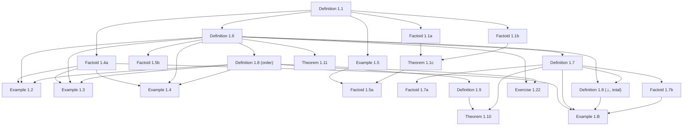

# Formalizing Dana Scott's 1980 Theory of Computation in Lean 4

## Abstract

In November 1969, Dana Scott formulated a mathematical program to construct the first non-degenerate, purely mathematical model ($D_\infty$) for Alonzo Church's untyped $\lambda$-calculus. He formally detailed this in his landmark 1972 paper *Continuous Lattices*, providing the foundational justification for denotational semantics. However, Scott's initial 1972 framework relied on dense, abstract point-set topology, which remained an intimidating barrier for computer scientists seeking a practical tool for everyday programming language design.

When Scott delivered his lectures at Oxford in 1980—subsequently published as *Lectures on a Mathematical Theory of Computation* (Technical Report PRG-19)—he made an intentional, systematic pivot from high topology back to constructive computer science infrastructure. He reframed domain theory around how computers process finite chunks of information. 

This Lean 4 formalization checks this constructive mathematical machinery: neighborhood systems (filters on a master set $\Delta$; domain elements as filters), approximable maps, and the full PRG-19 exercise spine through Lecture VII—capturing the precise moment where domain theory transitioned from pure mathematics into a practical engineering bedrock.

---

## Introduction

To make domain theory accessible, the 1980 monograph introduces three key conceptual and structural shifts:

### 1. The Information-Theoretic Ordering
In contrast to the topological open sets of 1972, the 1980 lectures treat domains strictly as partially ordered sets (posets) representing states of incomplete information. An element within a domain is framed as a "partial description" of a computation. The ordering relation ($\sqsubseteq$) is explicitly interpreted as approximation: $x \sqsubseteq y$ means $x$ contains less information than, or approximates, $y$.

### 2. Neighborhood Systems and Finite Approximations
To bypass the complexities of continuous geometric spaces, Scott introduced **Neighborhood Systems**. He recognized that real-world computing machines only ever interact with finite, checkable tokens of data. In this framework, an infinite computational process (such as an infinite stream or a complex recursive function) is defined as the limit of an ever-tightening sequence of these finite neighborhoods. This shifted the underlying mathematics away from general topology and toward formal logic and order theory.

### 3. Solving Universal Recursive Domain Equations
While Scott's 1969 discovery was a specialized solution to the specific self-referential equation $D \cong [D \to D]$, the 1980 monograph provides a universal factory blueprint. Scott uses inverse limits over Directed-Complete Partial Orders (CPOs) to solve arbitrary recursive domain equations. This generalized framework allowed computer scientists to give rigorous mathematical meaning to standard recursive computer data structures, such as lists, trees, and stream types.

### Formalization Target: Consolidating "Scott Domains"
This Lean 4 artifact formalizes the mathematical objects that these 1980 lectures ultimately standardized for the computer science community, known today as **Scott Domains**. A Scott Domain is characterized as a poset that is:
1. **Directed-Complete (CPO):** Every directed subset has a least upper bound, ensuring that infinite computations have well-defined limits.
2. **$\omega$-algebraic:** Every element in the domain can be represented as the supremum of a countable set of compact (finite) elements, mirroring how infinite data is built from finite tokens.
3. **Consistently Complete:** If any two pieces of information do not outright contradict each other, they possess a join (least upper bound), allowing consistent computation streams to merge safely.

---

## Chronological Formalization Narrative

Below is the chronological narrative of the formalization, organized step-by-step using Dana Scott's original numbering system from the PRG-19 monograph.

### Lecture I: Domains by Neighborhoods



#### Definition 1.1
* **Mathematical Target:** Defines a neighborhood system over a master set $\Delta$ containing $\Delta$ and closed under consistent binary intersections.
* **Lean File:** `Scott1980/Neighborhood/Basic.lean` (namespace `Domain.Neighborhood`)
* **Proof Notes:** Bundles a membership predicate `mem : Set α → Prop` (Scott's $X \in 𝒟$), the master neighbourhood `master` (Scott's $\Delta$, kept as a field rather than hard-wired to `Set.univ` for fidelity to the $\Delta$ notation), and Scott's two conditions: (i) `master_mem` ($\Delta \in 𝒟$) and (ii) `inter_mem` (consistent binary intersections stay in $𝒟$, the witness $Z \subseteq X \cap Y$ passed explicitly). A fourth field `sub_master` records Scott's standing assumption $𝒟 \subseteq \mathcal{P}(\Delta)$ (every neighbourhood $X \subseteq \Delta$); it is what gives the principal filter $\uparrow X$ its top element $\Delta$ (Definition 1.7) and underlies $\bot = \uparrow\Delta$ (Definition 1.8). Each finite example supplies it as `fun _ => Set.subset_univ _` (their `master` is `Set.univ`). Scott's recursive convention for the finite intersection $\bigcap_{i<n} X_i$ is implemented as the helper `interUpTo` ($0 \mapsto \Delta$, $n+1 \mapsto \text{interUpTo } n \cap X_n$). Factoids 1.1a/1.1b are its two defining equations, both verified by reflexivity (`rfl`).
* **Status:** Pass

#### Factoid 1.1a
* **Mathematical Target:** Verification of the base case of finite intersections: $\bigcap_{i<0} X_i = \Delta$.
* **Lean File:** `Basic.lean`
* **Proof Notes:** Proved directly via definition equality (`rfl`).
* **Status:** Pass

#### Factoid 1.1b
* **Mathematical Target:** Verification of the successor step for finite intersections: $\bigcap_{i<n+1} X_i = (\bigcap_{i<n} X_i) \cap X_n$.
* **Lean File:** `Basic.lean`
* **Proof Notes:** Proved directly via definition equality (`rfl`).
* **Status:** Pass

#### Theorem 1.1c
* **Mathematical Target:** Extending intersection properties to finite sequences: $X_0, \dots, X_{n-1}$ is consistent iff $\bigcap_{i<n} X_i \in 𝒟$.
* **Lean File:** `Basic.lean`
* **Proof Notes:** Scott writes: "*from (ii), we can extend the intersection property to any finite sequence. Consequently $X_0,\dots,X_{n-1}$ is consistent iff $\bigcap_{i<n} X_i \in 𝒟$*." We model consistency of a length-$n$ prefix as `Consistent X n := ∃ Z, mem Z ∧ Z ⊆ interUpTo X n` (a common lower bound inside $𝒟$). `interUpTo_mem` is an induction on $n$: the base case is `master_mem`; the step uses the same witness $Z$ to certify both that the length-$n$ prefix is consistent ($Z \subseteq \text{interUpTo } n \cap X_n \subseteq \text{interUpTo } n$, feeding the induction hypothesis) and the single application of condition (ii) that adjoins $X_n$. The equivalence `consistent_iff_interUpTo_mem` then has a one-line reverse direction (the intersection is its own lower bound). Auditing `interUpTo_subset` (the intersection is contained in each factor) required a `Nat`-specific case split (`Nat.eq_or_lt_of_le`) rather than the order-generic `lt_or_eq_of_le`, which silently drags in `Classical.choice`; with this change all four §1 foundations deliverables are proved under `{propext, Quot.sound}` without the full Axiom of Choice.
* **Status:** Pass

#### Example 1.2
* **Mathematical Target:** Verification of the flat fork domain: $\Delta = \{0,1\}$, $𝒟 = \{\Delta, \{0\}, \{1\}\}$.
* **Lean File:** `Scott1980/Neighborhood/Example12.lean`
* **Proof Notes:** Scott's first worked example. We build `neighborhoodSystem : NeighborhoodSystem Token` over `Token := Fin 2` with `master := Set.univ`. The only system obligation is condition (ii), discharged by `inter_eq` (the nine pairwise intersections each reduce to $\Delta$, $\{0\}$, $\{1\}$, or $\emptyset$ via `master_inter`/`inter_master`/`Set.inter_self`/`zero_inter_one`), the $\emptyset$ case being impossible since a witness $Z \subseteq \emptyset$ would force $\emptyset \in 𝒟$ (`not_mem_empty`). The mathematical payoff is the element classification (`element_classification`): every filter is one of exactly three — `bot = {Δ}`, `elemZero = {Δ,{0}}`, `elemOne = {Δ,{1}}`. The argument: a filter $x$ either contains $\{0\}$ (then `up_mem` + `inter_mem` force $x = \text{elemZero}$; it cannot also contain $\{1\}$ since $\{0\} \cap \{1\} = \emptyset \notin 𝒟$), or $\{1\}$ (symmetric), or neither (then $x = \text{bot}$). Hence `bot_is_unique_partial`: $\bot$ is the sole partial element, with `bot_lt_elemZero`, `bot_lt_elemOne` placing the two total elements strictly above it — exactly Scott's "there is only one partial element". Being a concrete finite computation it leans on `Mathlib.Tactic` (`fin_cases`/`simp`), so its footprint is the classical `[propext, Classical.choice, Quot.sound]`; the constructive guarantee is reserved for the §1 core in `Basic.lean`.
* **Status:** Pass

#### Example 1.3
* **Mathematical Target:** Verification of the linear chain domain: $\Delta = \{0,1,2\}$, $𝒟 = \{\Delta, \{1,2\}, \{2\}\}$.
* **Lean File:** `Scott1980/Neighborhood/Example13.lean`
* **Proof Notes:** Scott's second worked example over `Token := Fin 3` with `master := Set.univ` — a linear chain under reverse inclusion (more information = smaller set). We build `neighborhoodSystem : NeighborhoodSystem Token`; condition (ii) is discharged by `inter_eq` with only three outcomes ($\Delta$, $\{1,2\}$, $\{2\}$) — every pairwise intersection is nested, so there is no empty-intersection case (contrast Example 1.2's nine-case analysis). The element classification (`element_classification`) yields exactly three filters in a linear chain: `bot = {Δ}`, `elemTwelve = {Δ,{1,2}}`, `elemTwo = {Δ,{1,2},{2}}`. The argument follows the same "case on minimal non-master neighbourhood" pattern as 1.2: if $\{2\} \in x$ then $x = \text{elemTwo}$; else if $\{1,2\} \in x$ then $x = \text{elemTwelve}$; else $x = \text{bot}$. Order lemmas `bot_lt_elemTwelve`, `elemTwelve_lt_elemTwo`, and `elemTwo_maximal` capture Scott's narrative: approximation proceeds in two steps to the total element (token $2$); tokens $0$ and $1$ are not total (they appear in larger neighbourhoods but do not determine filters); the direction of approximation is unique (no branching). Unlike 1.2 (one partial, two total), 1.3 has two partial elements and one total. Footprint: `[propext, Classical.choice, Quot.sound]`.
* **Status:** Pass

#### Example 1.4
* **Mathematical Target:** Verification of the depth-2 binary tree system: $\Delta = \{\Lambda, 0, 1, 00, 01, 10, 11\}$.
* **Lean File:** `Scott1980/Neighborhood/Example14.lean`
* **Proof Notes:** Scott's third worked example and the first with branching. Tokens are modeled over `Token := Fin 7` (with $\Lambda=0, \dots, 11=6$), and neighbourhoods are the subtrees $𝒟 = \{\Delta, \text{left}=\{0,00,01\}, \text{right}=\{1,10,11\}, \{00\}, \{01\}, \{10\}, \{11\}\}$ — encoded as $\text{left}=\{1,3,4\}$, $\text{right}=\{2,5,6\}$, and the four leaf singletons. Condition (ii) reduces to the "nested-or-disjoint" table: of the 49 pairwise intersections, each is again a neighbourhood or $\emptyset$. Rather than search, `inter_eq` rewrites $X \cap Y$ to its canonical value via a complete `simp only` set of the 24 distinct intersection lemmas (both orders) plus `master_inter`/`inter_master`/`Set.inter_self`, so the matching disjunct closes by `rfl` — deterministic and fast (the naive 49×8 `first` ladder times out). The $\emptyset$ outcomes are inadmissible in `inter_mem` because a witness $Z \subseteq \emptyset$ would force $\emptyset \in 𝒟$ (`not_mem_empty`). The payoff is the seven-filter classification (`element_classification`): the bottom $\bot=\{\Delta\}$, two branch partials `elemZero={Δ,left}` / `elemOne={Δ,right}`, and four total leaf filters `elem00` through `elem11`. The proof cases on the minimal non-master neighbourhood: a leaf in $x$ pins the total filter (`mem_leafXY_imp`, using that distinct leaves and cross-branch neighbourhoods intersect to $\emptyset$); otherwise `left`/`right` membership gives a branch partial, else $\bot$. The order lemmas realize the tree with choice: `bot_lt_elemZero/elemOne` (two incomparable partials above $\bot$), `elemZero_lt_elem00/01`, `elemOne_lt_elem10/11` (each partial below its two leaves), and `elemXY_maximal` for the four leaves (each leaf filter is maximal — a total element). Contrast the prior examples: 1.2 is a fork at the bottom (one partial, two total), 1.3 a linear chain (two partial, one total), and 1.4 a genuine tree (three partial, four total) where branching encodes the choice in extending a partial sequence. Footprint: `[propext, Classical.choice, Quot.sound]`.
* **Status:** Pass

#### Factoid 1.4a
* **Mathematical Target:** Nested-or-disjoint condition on neighborhoods implies system.
* **Lean File:** `Basic.lean`
* **Proof Notes:** Scott's "very special circumstance" after Examples 1.2–1.4 is the predicate `NestedOrDisjoint mem := ∀ X Y, mem X → mem Y → X ⊆ Y ∨ Y ⊆ X ∨ X ∩ Y = ∅`. The constructor `NeighborhoodSystem.ofNestedOrDisjoint mem master master_mem hnd` then discharges condition (ii) without choice by casing on `hnd`: if $X \subseteq Y$ then $X \cap Y = X$ (`Set.inter_eq_left.mpr`) so the intersection is `mem` by `hX`; symmetrically for $Y \subseteq X$; and if $X \cap Y = \emptyset$ the consistency witness $Z \subseteq X \cap Y = \emptyset$ gives $Z = \emptyset$ (`Set.subset_empty_iff`), so $X \cap Y = \emptyset = Z \in 𝒟$. This is the uniform reason Examples 1.2 (fork), 1.3 (chain) and 1.4 (tree) are neighbourhood systems. Footprint: `[propext, Quot.sound]`.
* **Status:** Pass

#### Example 1.5
* **Mathematical Target:** System of all non-empty subsets of $\{0,1,2,3\}$.
* **Lean File:** `Scott1980/Neighborhood/Example15.lean`
* **Proof Notes:** $\Delta = \{0,1,2,3\}$ (`Token := Fin 4`) with $𝒟$ as all non-empty subsets (`mem X := X.Nonempty`, `master := Set.univ`). Condition (ii) is immediate and choice-free: a non-empty witness $Z \subseteq X \cap Y$ makes $X \cap Y$ non-empty (`obtain ⟨z, hz⟩ := hZ; exact ⟨z, hZsub hz⟩`). Reuses the `Basic` `Consistent`/`interUpTo` infrastructure. Notably this example needs no `fin_cases` or `decide` and audits to `[propext]` (system) / `[propext, Quot.sound]` (Factoid 1.5a) — a fully constructive contrast to the finite Examples 1.2–1.4.
* **Status:** Pass

#### Factoid 1.5a
* **Mathematical Target:** Consistency in Example 1.5: consistent iff non-empty intersection.
* **Lean File:** `Example15.lean`
* **Proof Notes:** Reuses the `Basic` `Consistent` infrastructure. A prefix is consistent (`∃ Z, Z.Nonempty ∧ Z ⊆ ⋂`) iff $\bigcap_{i<n} X_i$ is non-empty (`→` shrinks the witness, `←` takes the intersection as its own witness).
* **Status:** Pass

#### Factoid 1.5b
* **Mathematical Target:** Equivalence of sequence limit families and equivalence of sequences: `limitFamily_eq_iff`.
* **Lean File:** `Basic.lean`
* **Proof Notes:** The prose motivating Definition 1.6: a descending sequence $\langle X_n \rangle$ of neighbourhoods determines the limit family `limitFamily X = {Z ∈ 𝒟 ∣ ∃ n, Xₙ ⊆ Z}`, and two sequences are `SeqEquiv` ("equally deep") when $\forall m, ∃ n, X_n \subseteq Y_m$ and $\forall n, ∃ m, Y_m \subseteq X_n$. `limitFamily_eq_iff` proves `limitFamily X = limitFamily Y ↔ SeqEquiv X Y` (assuming each term is a neighbourhood): `→` feeds each $Y_m \in \text{limitFamily } Y$ through the family equality to extract $X_n \subseteq Y_m$ (and symmetrically); `←` chains $Y_m \subseteq X_n \subseteq Z$ (and symmetrically) via transitivity. Antitonicity of the sequences is not needed for the criterion itself. Footprint: `[propext, Quot.sound]`.
* **Status:** Pass

#### Definition 1.6
* **Mathematical Target:** Defines a domain element $x \in |𝒟|$ as a filter on $𝒟$.
* **Lean File:** `Basic.lean`
* **Proof Notes:** `Element V` is Scott's filter (Def 1.6): a membership predicate `mem : Set α → Prop` with `sub` ($x \subseteq 𝒟$), `master_mem` ($\Delta \in x$), `inter_mem` (closed under $\cap$), and `up_mem` (upward closed in $𝒟$). Mirroring `InfoSys.Element`, the early helper `Element.ext` (membership-equality $\implies$ equality, proved by `rcases` on both structures + `funext`/`propext`, *not* `congr`) keeps the `PartialOrder` instance choice-free: `le_antisymm` is just `Element.ext fun X => ⟨h1 X, h2 X⟩`. Footprint: `[propext, Quot.sound]`.
* **Status:** Pass

#### Definition 1.7
* **Mathematical Target:** Defines the principal filter $\uparrow X = \{Y \in 𝒟 \mid X \subseteq Y\}$ for $X \in 𝒟$.
* **Lean File:** `Basic.lean`
* **Proof Notes:** Scott's principal filter $\uparrow X = \{Y \in 𝒟 \mid X \subseteq Y\}$ is `principal (hX : V.mem X) : V.Element`, with `mem Y := V.mem Y ∧ X ⊆ Y`. The four filter laws: `sub` is the first projection; `master_mem = ⟨V.master_mem, V.sub_master hX⟩` (this is where the new `sub_master` field earns its keep — $X \subseteq \Delta$); `inter_mem` combines `Set.subset_inter` (from $X \subseteq Y_1$, $X \subseteq Y_2$) with one use of $V.\text{inter\_mem}$, taking $X$ itself as the consistency witness $X \subseteq Y_1 \cap Y_2$; `up_mem` is $\subseteq$ transitivity. `mem_principal` is the membership `rfl`-unfolding. All five declarations audit to `[propext, Quot.sound]`.
* **Status:** Pass

#### Factoid 1.7a
* **Mathematical Target:** One-to-one and inclusion-reversing property of principal filters.
* **Lean File:** `Basic.lean`
* **Proof Notes:** `principal_le_iff`: $\uparrow X \sqsubseteq \uparrow Y \iff Y \subseteq X$ — Scott's $X \subseteq Y \iff \uparrow Y \sqsubseteq \uparrow X$, representing the variance flip (smaller neighbourhood $\implies$ larger principal filter $\implies$ more information). `→` evaluates $\sqsubseteq$ at the token $X$ (using $X \in \uparrow X$ since $X \subseteq X$) and reads $Y \subseteq X$ off $X \in \uparrow Y$; `←` chains $Y \subseteq X \subseteq Z$. Injectivity `principal_injective` ($\uparrow X = \uparrow Y \implies X = Y$) feeds both `le_of_eq` directions through `principal_le_iff` into `Set.Subset.antisymm`. Audits to `[propext, Quot.sound]`.
* **Status:** Pass

#### Factoid 1.7b
* **Mathematical Target:** Density of finite elements: $x = \bigcup \{\uparrow X \mid X \in x\}$.
* **Lean File:** `Basic.lean`
* **Proof Notes:** Formalised as `eq_iUnion_principal`: $x.\text{mem } Z \iff ∃ X, ∃ hX : x.\text{mem } X, (\uparrow X).\text{mem } Z$ — Scott's $x = \bigcup \{\uparrow X \mid X \in x\}$ written as union membership (concrete, avoiding $\bigcup$ over a `Set (Set α)`). `→` uses $X = Z$ ($Z \in \uparrow Z$); `←` is one application of upward closure $x.\text{up\_mem}$ ($X \subseteq Z$ with $Z \in 𝒟$). Audits to `[propext, Quot.sound]`.
* **Status:** Pass

#### Definition 1.8 (order)
* **Mathematical Target:** Poset of approximation: $x \sqsubseteq y \iff x \subseteq y$.
* **Lean File:** `Basic.lean`
* **Proof Notes:** Implements `instance : PartialOrder Element` constructively via `le_antisymm` using `Element.ext` to guarantee equality of elements.
* **Status:** Pass

#### Definition 1.8 (⊥, total)
* **Mathematical Target:** Defines bottom $\bot = \uparrow\Delta$ and total elements.
* **Lean File:** `Basic.lean`
* **Proof Notes:** Scott's bottom element $\bot = \{\Delta\}$ is simply the principal filter of the master neighbourhood: `bot := principal master_mem`, i.e., $\bot = \uparrow\Delta$. `mem_bot` shows it really is the singleton $\{\Delta\}$: $Y \in \bot \iff Y = \Delta$. The forward direction is where `sub_master` pays off — $Y \in \uparrow\Delta$ gives $Y \in 𝒟$ *and* $\Delta \subseteq Y$, while $V.\text{sub\_master}$ supplies the reverse $Y \subseteq \Delta$, so `Set.Subset.antisymm` collapses $Y$ to $\Delta$. This is the variance curiosity: $\bot = \uparrow\Delta$ is the largest principal filter ($\Delta$ is the largest neighbourhood) yet the least element. `IsTotal x := ∀ y, x⊑y→y⊑x` (maximality under the approximation order, kept as a predicate only, since the existence of total elements is the classical frontier of Exercise 1.24).
* **Status:** Pass

#### Factoid 1.8a
* **Mathematical Target:** Bottom is the least element: $\bot \sqsubseteq x$ for all $x$.
* **Lean File:** `Basic.lean`
* **Proof Notes:** `bot_le : ∀ x, ⊥ ⊑ x`: a member $Y \in \bot$ is $Y = \Delta$ (`mem_bot`), and $\Delta \in x$ is filter axiom (i) $x.\text{master\_mem}$. Packaged as `instance : OrderBot V.Element` so the $\bot$ notation resolves to $\{\Delta\}$; the instance stays `[propext, Quot.sound]`.
* **Status:** Pass

#### Factoid 1.8b
* **Mathematical Target:** Filter with $\subseteq$-minimum member $X$ is $\uparrow X$.
* **Lean File:** `Basic.lean`
* **Proof Notes:** Scott's prose 'any explicitly given filter $x$ is principal … the minimal $X \in x$ tells us all we need to know' is formalized as `eq_principal_of_isMin`: if $x$ has a $\subseteq$-minimum member $X$ (one with $X \subseteq Y$ for every $Y \in x$), then $x = \uparrow X$. $\subseteq$ is minimality, $\supseteq$ is one `up_mem`. This is the constructive *core*; the step 'finite system $\implies$ such a minimum exists' (take the intersection of the finitely many members, itself in $x$ by closure) is the only classical ingredient and is left implicit, so the stated lemma audits to `[propext, Quot.sound]`.
* **Status:** Pass

#### Example 1.B
* **Mathematical Target:** Infinite binary sequence system $B$ of prefixes and cones.
* **Lean File:** `Scott1980/Neighborhood/ExampleB.lean`
* **Proof Notes:** Scott's recurring binary example, the first infinite neighbourhood system in the monograph. Tokens are `Str := List Bool` ($\Sigma^*$, with $\Lambda = []$); the initial-segment relation $\sigma \preceq \tau$ is mathlib's list-prefix $\sigma <+: \tau$; the neighbourhood $\sigma\Sigma^*$ is `cone σ := {w ∣ σ <+: w}`. The whole point is the **reversal** `cone_subset_cone : cone σ ⊆ cone τ ↔ τ <+: σ` (a longer prefix carves out a smaller cone), proved by testing $\subseteq$ at $\sigma \in \text{cone } \sigma$ and chaining $<+:$ the other way. `cone_trichotomy` shows any two cones are nested-or-disjoint: deciding $\sigma <+: \tau$ and $\tau <+: \sigma$ (list-prefix is **decidable**, so this is a `dite`, not `Classical.em`) gives the two nested cases via `cone_subset_cone`; in the remaining case a common extension $w$ of $\sigma$ and $\tau$ would make them comparable (`List.prefix_or_prefix_of_prefix`), contradiction, so $\text{cone } \sigma \cap \text{cone } \tau = \emptyset$. Then `B := ofNestedOrDisjoint memB Set.univ … nestedOrDisjoint` reuses Factoid 1.4a — no bespoke `inter_mem` proof. `B.master = Set.univ = cone []` (`cone_nil`). All declarations audit to `[propext, Quot.sound]` — decidability of list-prefix keeps even the trichotomy choice-free.
* **Status:** Pass

#### Exercise 1.B-sys
* **Mathematical Target:** Verification that $B$ is a neighborhood system.
* **Lean File:** `ExampleB.lean`
* **Proof Notes:** Reuses `ofNestedOrDisjoint` on prefix cones.
* **Status:** Pass

#### Exercise 1.B-elt
* **Mathematical Target:** Prepend operator on filters: $\sigma x \in |B|$.
* **Lean File:** `ExampleB.lean`
* **Proof Notes:** `sigmaElt σ x` has `mem Y := B.mem Y ∧ ∃ X ∈ x, σX ⊆ Y`, where $\sigma X = \text{prepend } \sigma X = \{\sigma\tau \mid \tau \in X\}$. The crucial algebraic fact is `prepend_cone : σ(τΣ*) = (στ)Σ*` (so `prepend` of a cone is a cone, `memB_prepend`). In the filter's `inter_mem` the consistency witness for $B.\text{inter\_mem}$ is $\sigma(X_1 \cap X_2)$: $X_1 \cap X_2 \in x \subseteq B$ is a cone, hence $\sigma(X_1 \cap X_2)$ is a cone in $B$ contained in $Y_1 \cap Y_2$. `sigmaElt_bot : σ⊥ = sigmaElt σ ⊥` (via `prepend_univ : σΣ* = prepend σ Σ*`) confirms `sigmaBot` is genuinely '$\sigma$ applied to $\bot$'.
* **Status:** Pass

#### Factoid 1.B-mono
* **Mathematical Target:** Ordering of prepended sequences: $\sigma_0\bot \sqsubseteq \sigma_1\bot \iff \sigma_0 \preceq \sigma_1$.
* **Lean File:** `ExampleB.lean`
* **Proof Notes:** `sigmaBot σ := ↑(cone σ)` (principal filter of $\sigma\Sigma^*$, minimal neighbourhood $\sigma\Delta = \text{cone } \sigma$). `sigmaBot_le_iff : σ₀⊥ ⊑ σ₁⊥ ↔ σ₀ <+: σ₁` falls out of `principal_le_iff` (reversal) composed with `cone_subset_cone` (reversal again) — the two variance flips **cancel**, so the order on finite elements is exactly the prefix order. This is Scott's '$\sigma_0\bot \subseteq \sigma_1\bot$ iff $\sigma_0$ is an initial segment of $\sigma_1$'.
* **Status:** Pass

#### Factoid 1.B-lim
* **Mathematical Target:** Direct limit representation of elements of $B$: $x = \bigcup_n \sigma_n\bot$.
* **Lean File:** `ExampleB.lean`
* **Proof Notes:** `mem_iff_exists_sigmaBot : x.mem Z ↔ ∃ σ, x.mem (cone σ) ∧ (σ⊥).mem Z` is Scott's $x = \bigcup_n \sigma_n\bot$ in concrete union-membership form — every member of $x$ is a cone (so `Basic.eq_iUnion_principal` specializes), and $x$ is the union of the finite elements $\sigma\bot$ with $\sigma\Sigma^* \in x$. Arranging the $\sigma$ into a single ascending chain $\sigma_0 \preceq \sigma_1 \preceq \dots$ needs an enumeration/choice and is left to Scott's prose.
* **Status:** Pass

#### Definition 1.9
* **Mathematical Target:** Domain isomorphism as order-isomorphisms on filter posets.
* **Lean File:** `Basic.lean`
* **Proof Notes:** Scott asks for "a one-one correspondence between $|𝒟_0|$ and $|𝒟_1|$ which preserves inclusion". An `OrderIso` (`≃o`) packages exactly this: it is a bijection that both preserves *and reflects* $\sqsubseteq$ (`map_rel_iff`), the two-way inclusion-preservation Scott wants. `DomainIso V₀ V₁ := V₀.Element ≃o V₁.Element` (over possibly *different* token types); `V₀ ≅ᴰ V₁ := Nonempty (DomainIso V₀ V₁)` with `refl`/`symm`/`trans` from `OrderIso.refl`/`symm`/`trans`. Choice-free.
* **Status:** Pass

#### Theorem 1.10
* **Mathematical Target:** Equivalence of systems with their token-system representations $\{[X]\}$.
* **Lean File:** `Scott1980/Neighborhood/Theorem110.lean`
* **Proof Notes:** $[X] := \{x \in |𝒟| \mid X \in x\}$ (`bracket X`). Scott's four facts are short lemmas: `bracket_master` $[\Delta]=|𝒟|$ (every filter contains $\Delta$); `bracket_inter` $[X]\cap[Y]=[X\capY]$ ($\subseteq$ is filter closure under $\cap$, $\supseteq$ is upward closure); `principal_mem_bracket` $\uparrow X \in [X]$; and `bracket_inter_nonempty_iff` the consistency criterion. The correspondence $X \mapsto [X]$ is one-one (`bracket_injective`) and inclusion-preserving (`bracket_subset_iff` $[X]\subseteq[Y] \iff X\subseteqY$, both tested at the principal $\uparrow X$). The system `tokenSystem : NeighborhoodSystem |𝒟|` has `mem S := ∃ X∈𝒟, S=[X]` and `master := univ`; its `inter_mem` reads a witness $W \subseteq X\capY$ off $\uparrow W \in [W] \subseteq [X]\cap[Y]$, so $X\capY \in 𝒟$ and $[X]\cap[Y]=[X\capY]$. The isomorphism `tokenIso : |𝒟| ≃o |{[X]}|` is built by hand from `toToken x := {[X] ∣ X∈x}` and `ofToken y := {X ∣ [X]∈y}`, proved mutually inverse and order-reflecting via `bracket_injective`. `isomorphic_tokenSystem : 𝒟 ≅ᴰ tokenSystem`. All choice-free (`[propext, Quot.sound]`).
* **Status:** Pass

#### Theorem 1.11
* **Mathematical Target:** Pointwise closure of $|D|$ under countable intersections and ascending unions.
* **Lean File:** `Scott1980/Neighborhood/Theorem111.lean`
* **Proof Notes:** For $x : \mathbb{N} \to |𝒟|$, `iInter x` has `mem X := ∀ n, X ∈ xₙ`: all four filter laws are pointwise, so the countable intersection is again a filter with no proviso, and it is the greatest lower bound (`iInter_le`, `le_iInter`) — "exactly what is common to all the $x_n$". `iUnion x hmono` (for `hmono : Monotone x`) has `mem X := ∃ n, X ∈ xₙ`; only the intersection law needs the ascending proviso ($X\in x_n$, $Y\in x_m \implies$ both in $x_{\max n m}$), and it is the least upper bound (`le_iUnion`, `iUnion_le`) — "just what the increasing sequence approximates". Choice-free.
* **Status:** Pass

#### Exercise 1.12
* **Mathematical Target:** Upper-segment tail system of $\mathbb{N}$: unique limit element.
* **Lean File:** `Scott1980/Neighborhood/Exercise112.lean`
* **Proof Notes:** `tail n = {m ∣ n≤m}` (Scott's $\{m \mid m>n\}$ is `tail (n+1)`); `tail 0 = ℕ = Δ` and the tails form a descending chain, so `ofNestedOrDisjoint` builds the system (the infinite analogue of the chain Example 1.3). Finite elements `fin n = ↑(tail n)` form an ascending $\omega$-chain (`fin_strictMono`). The single **limit element** `top` is the filter of *all* tails — the greatest element (`le_top`), the unique total element (`top_isTotal`, `isTotal_iff_top`). `element_eq` classifies every element as some `fin n` or `top` (Scott's "only one limit element"): this decides whether the indices in $x$ are bounded (`Nat.find` over a `¬`-predicate), so it is the classical step (`Classical.choice`); the system and order facts are choice-free.
* **Status:** Pass

#### Exercise 1.13
* **Mathematical Target:** Infinite branch limit nodes of $B$.
* **Lean File:** `Scott1980/Neighborhood/Exercise113.lean`
* **Proof Notes:** The "assertions about $B$" are `ExampleB.lean` (system, $\sigma\bot$, $\sigmax$, monotonicity, $x=\bigcup_n\sigma_n\bot$). This file supplies the limit nodes "all along the top": for an infinite path $p : \mathbb{N} \to \text{Bool}$, `branch p := ⋃ₙ (p↾n)⊥` is the ascending union (Theorem 1.11's `iUnion`) of the finite approximations `prefixSeq p n`. `branch_mem_iff` characterizes its members; `branchSeq_le_branch` shows each finite `(p↾n)⊥` approximates it; and `branch_isTotal` proves it is a total/maximal element: any $y$ it approximates approximates it back, since a member `cone σ` of $y$ is comparable to $p\upharpoonright |\sigma|$ (their cones meet inside $y \subseteq B$), forcing $\sigma = p\upharpoonright |\sigma|$ on the path.
* **Status:** Pass

#### Exercise 1.14
* **Mathematical Target:** Finite non-empty subset system of $\mathbb{N}$: singletons are total.
* **Lean File:** `Scott1980/Neighborhood/Exercise114.lean`
* **Proof Notes:** `mem X := X = ℕ ∨ (X.Finite ∧ X.Nonempty)`. Unlike the tail/binary examples this is not nested-or-disjoint, so `inter_mem` is checked by hand: the consistency witness $Z \subseteq X\capY$ keeps $X\capY$ non-empty (`nonempty_of_mem`), and $X\capY$ is finite as soon as either factor is. The total elements are exactly the singletons $\uparrow\{n\}$: `singleton_isTotal` shows $\uparrow\{n\}$ is maximal — a $y \supsetneq \uparrow\{n\}$ would contain a $W \not\in n$, whence $\{n\}\cap W = \emptyset \in y \subseteq 𝒟$, contradicting `empty_not_mem`.
* **Status:** Pass

#### Exercise 1.15
* **Mathematical Target:** Non-isomorphism of `flat` and `stem` domains.
* **Lean File:** `Scott1980/Neighborhood/Exercise115.lean`
* **Proof Notes:** Two infinite neighbourhood systems over $\mathbb{N}$, both nested-or-disjoint. **`flat`** ($\{\mathbb{N}\}\cup\{\{n\}\}$) is the flat domain: `flat_classify` shows every element is $\bot$ or a pairwise-incomparable atom $\uparrow\{n\}$, so all elements are finite (`flat_all_finite`), atoms are maximal (`flat_atom_maximal`), there is no strict 3-chain (`flat_no_three_chain`: $\bot$ is least, atoms maximal) and hence no infinite ascending chain (`flat_no_infinite_chain`). **`stem`** ($\{\mathbb{N},\{0,1\}\}\cup\{\{n\}\}$) inserts one length-3 stem and so contains the strict 3-chain $\bot \sq \uparrow\{0,1\} \sq \uparrow\{0\}$ (`stem_three_chain`). An order-iso would transport that 3-chain into `flat`, which has none — so `not_isomorphic : ¬ (flat ≅ᴰ stem)`. The classifications use `Classical.choice` (deciding whether an element contains an atom); the constructions and the 3-chain transfer are otherwise elementary.
* **Status:** Pass

#### Exercise 1.16
* **Mathematical Target:** Cofinite subset system of $\mathbb{N}$: order-isomorphic to $(\mathcal{P}(\mathbb{N}), \subseteq)$.
* **Lean File:** `Scott1980/Neighborhood/Exercise116.lean` (namespace `Cofinite`)
* **Proof Notes:** $𝒟 = $ cofinite subsets of $\mathbb{N}$ ($X^c$ finite), closed under all finite $\cap$ since $(X\capY)^c = X^c \cup Y^c$. The order-iso `cofiniteIso : |𝒟| ≃o (Set ℕ, ⊆)` sends a filter $x$ to its excluded-point set `toExcluded x = {n ∣ {n}ᶜ ∈ x}`; the inverse `ofExcluded E = {Y cofinite ∣ Yᶜ ⊆ E}` is a filter for every $E \subseteq \mathbb{N}$. The crux is the reconstruction lemma `mem_compl_of_finite`: for finite $F$ whose single-deletions $\{n\}^c$ all lie in $x$, the intersection $\bigcap_{n\in F}\{n\}^c = F^c$ lies in $x$ (filter $\cap$-closure, by `Set.Finite.induction_on`). The unique total element is `ofExcluded ℕ` (= all of $𝒟$, the top, `ofExcluded_univ_isTotal`), matching the greatest $\mathbb{N} \in \mathcal{P}(\mathbb{N})$. `fullSystem` (all subsets) is the requested second $\cap$-closed system (not positive: $\emptyset$ is a neighbourhood). `Set.Finite` reasoning is classical; the constructions `cofiniteSystem`, `ofExcluded` are `[propext, Quot.sound]` modulo that.
* **Status:** Pass

#### Exercise 1.17
* **Mathematical Target:** Rational open interval domain over $\mathbb{R}$: density embedding.
* **Lean File:** `Scott1980/Neighborhood/Exercise117.lean` (namespace `RatInterval`)
* **Proof Notes:** The first uncountable $\Delta$: $𝒟 = $ non-empty open intervals $(a,b)$ with $a,b \in \mathbb{Q}$, plus $\Delta = \mathbb{R}$. The system law reduces to `inter_mem'`: two neighbourhoods meeting at a point intersect in a rational interval, via `Set.Ioo_inter_Ioo` ($(a,b)\cap(c,d) = (\max a c, \min b d)$) and `Rat.cast_max`/`Rat.cast_min`. For each $t \in \mathbb{R}$, `filterAt t = {X ∈ 𝒟 ∣ t ∈ X}` is a filter ($\cap$-closure uses $t$ itself as the shared point). `filterAt_injective` (rational density via `exists_rat_btwn`) shows $\mathbb{R} \hookrightarrow |𝒟|$. Scott's full classification of the total elements — for rational $t$ the right-endpoint intervals yield a second total element at $t$ — needs more real analysis and is documented as out-of-scope; the system, point-filters and their injectivity are delivered. Real-number reasoning is classical.
* **Status:** Pass

#### Exercise 1.18
* **Mathematical Target:** Consistent subsets: pairwise vs. joint consistency. Least filter operator.
* **Lean File:** `Scott1980/Neighborhood/Exercise118.lean`
* **Proof Notes:** `FinitelyConsistent C` says every finite sequence drawn from $C \subseteq 𝒟$ is `Consistent` (Scott: every finite subset consistent). Pairwise $\not\implies$ jointly: over the all-non-empty-subsets system `triSys` on $\{0,1,2\}$, the family $\{A,B,Cc\} = \{\{0,1\},\{1,2\},\{0,2\}\}$ is pairwise consistent (`family_pairwise_nonempty`, each pair meets) but not consistent (`not_finitelyConsistent`): $A\cap B\cap Cc = \emptyset$, so its triple has empty `interUpTo` and no non-empty witness. `sInf F hF` (intersection of a non-empty family of filters, $\{X \mid \forall x\in F, X\in x\}$) is a filter and the greatest lower bound (`sInf_le`, `le_sInf`); non-emptiness of $F$ supplies the `sub` witness. `leastFilter C` $= \{Y \in 𝒟 \mid \bigcap_{i<n} X_i \subseteq Y \text{ for some finite } \langle X_i \rangle \text{ from } C\}$. The filter's $\cap$-law concatenates two finite sequences via `appendSeq` and the identity $\text{interUpTo } (X1 \mathbin{+\mkern-10mu+} X2) (n1+n2) = \text{interUpTo } X1\ n1 \cap \text{interUpTo } X2\ n2$ (`interUpTo_appendSeq`), keeping the combined intersection in $D$ by `FinitelyConsistent`. `subset_leastFilter` ($C \subseteq$ it) and `leastFilter_le` (any filter $\supseteq C$ contains it) make it the least. Core choice-free.
* **Status:** Pass

#### Exercise 1.19
* **Mathematical Target:** Positive neighborhood systems and counterexamples.
* **Lean File:** `Scott1980/Neighborhood/Exercise119.lean`
* **Proof Notes:** Scott's positive systems replace condition (ii) by the biconditional (ii′): $X \cap Y \in 𝒟 \iff X \cap Y \neq \emptyset$ for $X, Y \in 𝒟$. `IsPositive V` is this predicate; `ofPositive` builds a `NeighborhoodSystem` from the data $(\Delta \in 𝒟, 𝒟 \subseteq \mathcal{P}(\Delta), \text{(ii′)})$, discharging (ii): a consistency witness $Z \subseteq X \cap Y$ with $Z \in 𝒟$ is non-empty (apply (ii′) to $Z \cap Z = Z$), so $X \cap Y \supseteq Z$ is non-empty, hence $X \cap Y \in 𝒟$. Choice-free (`[propext, Quot.sound]`). For the non-positive example, note Scott's fork (Example 1.2) is actually positive (disjoint neighbourhoods have empty intersection, and (ii′) is then $\text{False} \iff \text{False}$). We instead use the minimal `notPositiveSystem` over $\{0,1,2\}$ with $𝒟 = \{\Delta, \{0,1\}, \{1,2\}\}$: it is a genuine system (the lone overlapping pair has intersection $\{1\}$, which has no witness in $D$, so (ii) never fires) but `not_isPositive` holds since $\{1\} \neq \emptyset$ yet $\{1\} \notin 𝒟$. A small stand-in for Hoare's $\mathbb{N} \times \mathbb{N}$ example. The finite construction uses `Classical.choice` only through `simp`/`fin_cases`.
* **Status:** Pass

#### Exercise 1.20
* **Mathematical Target:** Power system $D'$ over $D$.
* **Lean File:** `Scott1980/Neighborhood/Exercise120.lean`
* **Proof Notes:** $\Delta' = 𝒟$, $𝒟' = \{\uparrow X \mid X \in 𝒟\}$ with $\uparrow X = \text{upSet } X = \{Y \in 𝒟 \mid Y \subseteq X\}$ — the up-set inside $D$, not Definition 1.7's principal filter (down-set). Note $X \mapsto \uparrow X$ is inclusion-preserving (`upSet_subset_iff`) and one-one on $D$ (`upSet_injective`), with the set identity $\uparrow X \cap \uparrow Y = \uparrow(X\capY)$ (`upSet_inter`). `powerSystem` is a `NeighborhoodSystem (Set α)` and is positive (`powerSystem_isPositive`): $\uparrow X \cap \uparrow Y$ is a neighbourhood iff non-empty, since a shared $Z$ gives $Z \subseteq X \cap Y \in 𝒟$. The isomorphism mirrors Theorem 1.10 exactly: `toPower x = {↑W ∣ W∈x}`, `ofPower y = {W ∣ ↑W ∈ y}`, mutually inverse and order-reflecting (`powerIso : |𝒟| ≃o |𝒟'|`, `isomorphic_powerSystem`). `toPower_principal` shows the iso carries the finite element $\uparrow X$ to the finite element generated by the token $\uparrow X$, so tokens of $D'$ $\leftrightarrow$ finite elements one-one. Choice-free.
* **Status:** Pass

#### Exercise 1.21
* **Mathematical Target:** Token systems are positive and complete.
* **Lean File:** `Scott1980/Neighborhood/Exercise121.lean`
* **Proof Notes:** Two corollaries of Theorem 1.10's $\{[X]\}$ system over $|𝒟|$. Positive (`tokenSystem_isPositive`): $[X] \cap [Y] = [X\capY]$ (`bracket_inter`) is a neighbourhood iff non-empty, since a common filter $x \in [X]\cap[Y]$ gives $X\capY \in 𝒟$ via $x.\text{sub } (x.\text{inter\_mem } \dots)$ and conversely $[W] \ni \uparrow W$. Complete (`IsComplete V' := ∀ y, ∃! point b, ∀ S ∈ 𝒟', y∋S ↔ b∈S`): `tokenSystem_complete` shows every filter $y$ of $\{[X]\}$ is fixed by the unique point `ofToken y` ($[W] \in y \iff \text{ofToken } y \in [W]$), uniqueness by `Element.ext` through the brackets — the `by_cases V.mem W` step pulls in `Classical.choice`. `tokenSystem_toToken_bijective` repackages `tokenIso` as the token$\leftrightarrow$element bijection. Finally `consistent_iff_iInter_bracket_nonempty` is the finite Theorem 1.10(2): $\langle X_i \rangle$ consistent $\iff \bigcap_{i<n}[X_i] \neq \emptyset$, combining Theorem 1.1c (`consistent_iff_interUpTo_mem`) with $[\bigcap] \neq \emptyset \iff \bigcap \in 𝒟$ (`bracket_nonempty_iff`) and `Element.mem_interUpTo`.
* **Status:** Pass

#### Exercise 1.22
* **Mathematical Target:** Topologizing $|D|$ by basic opens: specialization order.
* **Lean File:** `Scott1980/Neighborhood/Exercise122.lean`
* **Proof Notes:** Scott's exercise "(for topologists)" asks to topologize the domain $|D|$ by the basic opens $[X] = \{x \in |D| \mid X \in x\}$ (his Theorem 1.10 notation), and to characterize the topology two ways. We take `basicOpen X := {x : V.Element | x.mem X}` and define the topology by Scott's condition (ii): `IsOpenFilter U := ∀ x ∈ U, ∃ X, x.mem X ∧ [X] ⊆ U` (a set is open iff it is a union of basic opens). The three `TopologicalSpace` axioms come straight from the filter laws of `Element`: `isOpen_univ` uses $\Delta \in x$ with $[\Delta] = |D|$; `isOpen_inter` uses that filters are $\cap$-closed (`x.inter_mem`) together with the base identity $[X \cap Y] \subseteq [X]$, $[X \cap Y] \subseteq [Y]$ (`basicOpen_inter_subset_left/right`, each one application of upward closure `x.up_mem`); and `isOpen_sUnion` is immediate (the witness $[X] \subseteq t \subseteq \bigcup_0 S$ — the $\subseteq \bigcup_0$ step written out by hand, `fun _ ha => ⟨t, htS, ha⟩`, to dodge the classical `Set.subset_sUnion_of_mem`). Each $[X]$ is open (`isOpen_basicOpen`, witness $X$ itself). The two characterizations: (1) `isOpen_iff_upper_basic` — `IsOpen U ↔ (i) U is ⊑-upper ∧ (ii) U is a union of basic opens`. Conceptually (ii) already characterizes openness (it is the definition), so the content is that (i) is a consequence of (ii): if $[X] \subseteq U$ witnesses $x \in U$ and $x \sqsubseteq y$ then $X \in x \subseteq y$, so $y \in [X] \subseteq U$ (`isOpen_isUpperSet`). We keep both conjuncts to match Scott verbatim. (2) `le_iff_isOpen_imp` — condition (iii), the specialization order: $x \sqsubseteq y \iff \forall U \text{ open}, x \in U \implies y \in U$. `→` is `isOpen_isUpperSet`; `←` tests $x \in [X]$ against the open $[X]$ for each $X \in x$ to conclude $y \in [X]$, i.e., $X \in y$. The bridge `specializes_iff_le` identifies this with Mathlib's $\rightsquigarrow$: $y \rightsquigarrow x \iff x \sqsubseteq y$. So $|D|$ is a genuine ($T_0$, generally non-$T_1$) space whose specialization order is exactly Scott's approximation order — a topological recovery of $\sqsubseteq$. The space, both characterizations, and (iii) audit to `[propext, Quot.sound]`; only the optional `specializes_iff_le` bridge inherits `Classical.choice` from Mathlib's `specializes_iff_forall_open`.
* **Status:** Pass

#### Exercise 1.23
* **Mathematical Target:** Constructive greedy selection of total elements.
* **Lean File:** `Scott1980/Neighborhood/Exercise123.lean`
* **Proof Notes:** Countable system (`enum`/`henum`/`hsurj`) + `[DecidablePred V.mem]` $\implies$ greedy sequence $Y_n$/`acc` gives a total element: `greedyElement`, `greedyElement_isTotal` (choice-free, `Y_prefix_consistent`); every filter is sequence-determined `filters_sequence_determined` (classical).
* **Status:** Pass

#### Exercise 1.24
* **Mathematical Target:** Set-theoretic union of chain of filters is a filter: extension to total via Zorn.
* **Lean File:** `Scott1980/Neighborhood/Exercise124.lean`
* **Proof Notes:** The union of a non-empty chain of filters is a filter — `chainUnion` (`inter_mem` via `IsChain.total`), `le_chainUnion`; with Zorn every element extends to a total one `exists_total_ge` (`zorn_le_nonempty_Ici₀`, `IsMax = IsTotal`) — classical.
* **Status:** Pass

#### Exercise 1.25
* **Mathematical Target:** Well-ordered finals and lower sets.
* **Lean File:** `Scott1980/Neighborhood/Exercise125.lean`
* **Proof Notes:** $\Delta$ linearly+well-ordered, $D = $ non-empty upper sets (`finalSegmentSystem`); $|D| \cong \{\text{non-empty lower sets}\}$ under $\subseteq$ — `finalSegmentClassify` (`lowerSetOf`/`ofLowerSet`); top element `topElement` is the unique total element (`topElement_isTotal`, `eq_topElement_of_isTotal`); with no maximum it is not finite/principal (`topElement_not_principal_of_noMax`).
* **Status:** Pass

#### Exercise 1.26
* **Mathematical Target:** Isomorphism of commutative ring ideal domain.
* **Lean File:** `Scott1980/Neighborhood/Exercise126.lean`
* **Proof Notes:** Commutative ring $A$ (`[DecidableEq A]`), $\Delta = $ finite $F\subseteq A$, $I(F)=\{G \mid F\subseteq\langle G\rangle\}$ (`IFamily`, `IFamily_inter`); `ringSystem`; $|D| \cong$ ideals of $A$ under $\subseteq$ — `ringIso` (`idealOf`/`ofIdeal` mutually inverse).
* **Status:** Pass

#### Exercise 1.27
* **Mathematical Target:** Characterization of bounded elements of $D$.
* **Lean File:** `Scott1980/Neighborhood/Exercise127.lean`
* **Proof Notes:** Bounded $X\subseteq|D|$ (`Bounded`, `sSup` = `sInf` of `upperBounds`, `le_sSup`/`sSup_le`); $\{U,W\}$ consistent in $D \iff \{\uparrow U,\uparrow W\}$ bounded `consistent_pair_iff_bounded` (choice-free); $X$ bounded $\iff$ every finite subset bounded `bounded_iff_finite_bounded` (uses 1.18).
* **Status:** Pass

---

### Lecture II: Approximable Mappings

#### Definition 2.1
* **Mathematical Target:** Defines approximable mapping relation on $D_0 \times D_1$.
* **Lean File:** `Scott1980/Neighborhood/Approximable.lean`
* **Proof Notes:** Relation `rel⊆𝒟₀×𝒟₁` (`rel_dom`/`rel_cod`) with (i) `master_rel`, (ii) `inter_right`, (iii) `mono`; relation-extensionality `ext`.
* **Status:** Pass

#### Proposition 2.2
* **Mathematical Target:** Pointwise action of approximable maps.
* **Lean File:** `Approximable.lean`
* **Proof Notes:** `toElementMap` ($f(x)=\{Y\mid\exists X\in x, X f Y\}$, all of 2.1 used), `mem_toElementMap`, `rel_iff_mem_principal` ($X f Y \iff Y\in f(\uparrow X)$), `toElementMap_mono`, `ext_of_toElementMap` (2.2(iv)).
* **Status:** Pass

#### Example 2.3
* **Mathematical Target:** Verification of the parity map scanner.
* **Lean File:** `Scott1980/Neighborhood/Example23.lean`
* **Proof Notes:** `parityMap : B → T`: parity of 0's before first 1 via scanner `scan`/`valElt` (`scan_append` stability $\implies$ `mono`); $T$=two-token domain of Example 1.2.
* **Status:** Pass

#### Example 2.4
* **Mathematical Target:** Verification of the run-length sequence eliminator.
* **Lean File:** `Scott1980/Neighborhood/Example24.lean`
* **Proof Notes:** `runMap : B → B`: eliminate first run of 1's via state machine `out`/`del`; `out_mono` (prefix-monotone) $\implies$ `mono`; total $1^\infty \to$ partial $\bot$. Choice-free.
* **Status:** Pass

#### Theorem 2.5
* **Mathematical Target:** Category of domains and approximable maps.
* **Lean File:** `Approximable.lean`
* **Proof Notes:** Identity `idMap` ($X I_D Y \iff X\subseteq Y$), composition `comp g f` ($X g\circ f Z \iff \exists Y, X f Y \land Y g Z$), laws `idMap_comp`/`comp_idMap`/`comp_assoc`.
* **Status:** Pass

#### Proposition 2.6
* **Mathematical Target:** Elementwise functor composition.
* **Lean File:** `Approximable.lean`
* **Proof Notes:** Pointwise functor: `toElementMap_idMap` ($I_D(x)=x$), `toElementMap_comp` ($(g\circ f)(x)=g(f(x))$) — concrete category of sets & functions.
* **Status:** Pass

#### Theorem 2.7
* **Mathematical Target:** Isomorphism projections.
* **Lean File:** `Approximable.lean`
* **Proof Notes:** Every domain iso $e:|D_0|\simeqo |D_1|$ comes from an approximable map `ofIso e` (`toElementMap_ofIso`: $(ofIso e)(x)=e(x)$; `exists_approximable_of_iso`); finite$\to$finite `exists_principal_eq_apply_principal` via directed union `sSupDirected` (choice-free).
* **Status:** Pass

#### Exercise 2.8
* **Mathematical Target:** Extending monotone maps on finite elements.
* **Lean File:** `Scott1980/Neighborhood/ApproximableExercises.lean`
* **Proof Notes:** Monotone functions on finite elements extend: `ofMono`, `toElementMap_ofMono_principal`.
* **Status:** Pass

#### Exercise 2.9
* **Mathematical Target:** Pointwise approximation representation.
* **Lean File:** `ApproximableExercises.lean`
* **Proof Notes:** Approximable $f$ satisfies $f(x)=\bigcup\{f(\uparrow X)\mid X\in x\}$ — `toElementMap_mem_iff_principal`.
* **Status:** Pass

#### Exercise 2.10
* **Mathematical Target:** Pointwise intersection of mappings.
* **Lean File:** `ApproximableExercises.lean`
* **Proof Notes:** Pointwise meet $h(x)=f(x)\cap g(x)$ — `interMap`, `mem_toElementMap_interMap`.
* **Status:** Pass

#### Exercise 2.11
* **Mathematical Target:** Preserving directed limits.
* **Lean File:** `ApproximableExercises.lean`
* **Proof Notes:** Directed $a:I\to|D| \implies \bigcup_i a(i)$ is a filter (`iSupDirected`, `mem`/`le`/`le_`); approximable maps preserve directed $\bigcup$ — `toElementMap_iSupDirected`.
* **Status:** Pass

#### Exercise 2.12
* **Mathematical Target:** Pointwise union of directed families.
* **Lean File:** `ApproximableExercises.lean`
* **Proof Notes:** Directed family $\{f_i\}$ of approximable maps: pointwise union $\bigcup_i f_i$ approximable — `iSupMap`, `mem_toElementMap_iSupMap`.
* **Status:** Pass

#### Exercise 2.13
* **Mathematical Target:** Approximable maps are continuous maps on Scott topologies.
* **Lean File:** `Scott1980/Neighborhood/Exercise213.lean`
* **Proof Notes:** Scott's "(for topologists)" exercise: with $|D|$ topologized by the basic opens of Exercise 1.22, an approximable map $f : D_0 \to D_1$ induces a continuous `toElementMap f : |D_0| \to |D_1|$, and every continuous map arises this way. Forward (`continuous_toElementMap`): pulling back a basic open $[Y]$ gives $\{x \mid Y \in f\cdot x\} = \{x \mid \exists X\in x, X f Y\}$ (`mem_iff_principal_of_continuous`), a union of basic opens $[X]$ over $\{X \mid X f Y\}$, hence open. Backward (`ofContinuous`): from a continuous $g$ define $\text{rel } X\ Y \iff [\text{Y}] \supseteq g^{-1}? \dots$ — concretely $X (\text{rel}) Y \iff \uparrow X \in g^{-1}([Y])$ i.e., $Y \in g(\uparrow X)$; the three approximable-map axioms follow from continuity + monotonicity of $g$ on the specialization order. The round trip `toElementMap_ofContinuous` recovers $g$ pointwise using that every $x$ is the directed sup of the principal $\uparrow X$ for $X \in x$ (Theorem 1.10). Choice-free (`[propext, Quot.sound]`); the only classical leak would be Mathlib's specialization bridge, which is not used here.
* **Status:** Pass

#### Exercise 2.14
* **Mathematical Target:** Isomorphism neighborhood correspondence $\varphi$.
* **Lean File:** `Scott1980/Neighborhood/Exercise214.lean`
* **Proof Notes:** For a domain iso $e : |D_0| \simeqo |D_1|$ (Theorem 2.7), Scott's $\varphi$ sends a neighbourhood $X$ of $D_0$ to the "image" neighbourhood; we define $\varphi X$ and prove $(\text{ofIso } e).\text{rel } X\ Y \iff \varphi X \subseteq Y$, exhibiting the approximable map underlying $e$. `phi_inter` records $\varphi(X \cap X') = \varphi X \cap \varphi X'$ on consistent inputs (the iso preserves the finite-meet structure). Footprint inherits `Classical.choice` from the $\simeqo$/principal-sup machinery.
* **Status:** Pass

#### Exercise 2.15
* **Mathematical Target:** Mappings on Sierpiński domain.
* **Lean File:** `Scott1980/Neighborhood/Exercise215.lean`
* **Proof Notes:** The one-token system $O$ (master $\{*\}$, neighbourhoods $\{\emptyset?, \{*\}\}$) is Scott's Sierpiński domain: its two elements are $\bot \sq \top$. Building on Exercise 2.13, open subsets of $|D|$ correspond bijectively to approximable maps $D \to O$: `openToMap`/`mapToOpen` are mutually inverse, packaged as the equivalence `openSet_equiv_map`. The bijection uses choice (`equivSetNat`-style classical packaging of the open $\leftrightarrow$ characteristic-map data), so the footprint is `[propext, Classical.choice, Quot.sound]`.
* **Status:** Pass

#### Exercise 2.16
* **Mathematical Target:** Prepend stream operators are approximable.
* **Lean File:** `Scott1980/Neighborhood/Exercise216.lean`
* **Proof Notes:** $\sigma x$ on $|B|$ is approximable — `sigmaMap σ`, `toElementMap_sigmaMap` (= `sigmaElt σ`).
* **Status:** Pass

#### Exercise 2.17
* **Mathematical Target:** Run map verification.
* **Lean File:** `Example24.lean`
* **Proof Notes:** $g: B \to B$ of Example 2.4 is approximable — `runMap`.
* **Status:** Pass

#### Exercise 2.18
* **Mathematical Target:** Spacing map and left inverse.
* **Lean File:** `Scott1980/Neighborhood/Exercise218.lean`
* **Proof Notes:** On the binary-sequence domain $B$, Scott's "spacing" map $h$ appends a $0$ ($b \mapsto b0$) and $k$ is the left inverse stripping it: we build `hMap, kMap : B → B` as approximable maps and prove `kMap_comp_hMap : k ∘ h = I_B`. The point of the exercise is that $h$ is a section but not an isomorphism: `kMap_not_injective` and `hMap_not_surjective` (nothing maps onto sequences ending in $1$). Choice-free (`[propext, Quot.sound]`).
* **Status:** Pass

#### Exercise 2.19
* **Mathematical Target:** Multi-variable approximable maps.
* **Lean File:** `ApproximableExercises.lean`
* **Proof Notes:** Two-variable approximable maps $f:D_0\times D_1\to D_2$ as ternary relations — `ApproximableMap₂`, `toElementMap₂`, `rel₂_iff_mem_principal`, `toElementMap₂_mono`.
* **Status:** Pass

#### Exercise 2.20
* **Mathematical Target:** Powerset domain shift operations.
* **Lean File:** `Scott1980/Neighborhood/Exercise220.lean`
* **Proof Notes:** Exercise 1.15's powerset domain $\mathcal{P}$ is modelled with cofinite neighbourhoods over $\mathbb{N}$ ($X$ a neighbourhood iff $X^c$ finite); `equivSetNat : |𝒫| ≃o Set ℕ` identifies elements with arbitrary sets of naturals (finite elements $\leftrightarrow$ finite sets). The set operations are realized as approximable maps: `unionMap`/`interMap₂` (binary $\cup$, $\cap$, the latter a two-variable map via Exercise 2.19) and the shift maps `succMap`/`predMap` ($x \mapsto x+1$, $x \mapsto x-1$). Establishing the order-iso (`map_rel_iff'`) needed an explicit `show toSet x ≤ toSet y ↔ x ≤ y` to defeat a defeq stall, and `succSet_mono` uses `Set.image_mono`. Footprint inherits `Classical.choice` from the finite/cofinite bookkeeping.
* **Status:** Pass

#### Exercise 2.21
* **Mathematical Target:** Enriched stream domain $C$: juxtaposition.
* **Lean File:** `Scott1980/Neighborhood/Exercise221.lean`
* **Proof Notes:** Scott asks to enrich $B$ to a system $C$ carrying both finite and infinite total sequences. We take neighbourhoods to be the cones of $B$ together with terminator singletons $\{\sigma\}$ (a finished finite sequence), assembled through `ofNestedOrDisjoint` after proving every pair is nested or disjoint (`cone_singleton_nd`, `singleton_cone_nd`, `singleton_singleton_nd`). `singletonElt σ` is then a finite total element (`isTotal_singletonElt`), and `bot_lt_Lambda` ($\bot \sq \Lambda$) witnesses the new content. Juxtaposition `juxtapose : C × C → C` is a two-variable approximable map (Exercise 2.19) that is left-biased: `juxtapose_cone` keeps the left cone, and `juxtapose_singleton_mem` prepends a finished left operand onto the right. The whole file is choice-free (`[propext, Quot.sound]`): this drove the refactor of every `by_cases` into `if … then … else` / `rcases (inferInstance : Decidable _)` and replacing `simpa`/`le_of_eq` with explicit `List.length` + `omega` arguments to keep `Classical.choice` out.
* **Status:** Pass

#### Exercise 2.22
* **Mathematical Target:** General representation theorem.
* **Lean File:** `Scott1980/Neighborhood/Exercise222.lean`
* **Proof Notes:** Scott's "(for set theorists)" dual of Exercise 1.18/2.11: any family $C \subseteq \mathcal{P}(\tau)$ closed under non-empty intersections (`hInter`) and directed unions (`hDir`), with $C$ nonempty (`hne`), is inclusion-iso to the elements of a neighbourhood system. We take tokens to be finite $F$ contained in some $X \in C$ (`IsTok C F`), with closure `Cl C F = ⋂₀ {X ∈ C ∣ F ⊆ X}` (`Cl_mem` shows the closure lands back in $C$). `reprSystem C hInter hne` has neighbourhoods $C(F) = \{G \mid F \subseteq \text{Cl } C\ G\}$; `toC`/`ofC` convert an element to its set in $C$ and back, with round-trips `toC_ofC`, `ofC_toC` and `mem_nbhd_iff`, yielding the order-iso `reprIso : |reprSystem …| ≃o C`. As Scott notes, this construction is inherently classical: `botTok` uses `hne.choose`, and the finite-induction over directed unions (`exists_tok_of_finite_subset`) plus general set surgery pull in `Classical.choice` (`[propext, Classical.choice, Quot.sound]`). Section variables `hInter`/`hne`/`hDir` are threaded with explicit `include … in` before each declaration that uses them only in its proof body.
* **Status:** Pass

---

### Lecture III: Domain Constructs

#### Definition 3.1
* **Mathematical Target:** Defines product domain over $Sum.inl\ X \cup Sum.inr\ Y$.
* **Lean File:** `Scott1980/Neighborhood/Product.lean`
* **Proof Notes:** `prod`, `prodNbhd` (`Sum.inl '' X ∪ Sum.inr '' Y`), element pairing `pair`, `Element.fst/snd`. The product $D_0 \times D_1$ is modelled on the disjoint-union token type $\alpha \oplus \beta$, the faithful Lean reading of Scott's "disjoint $\Delta_0, \Delta_1$". A product neighbourhood is `prodNbhd X Y = Sum.inl '' X ∪ Sum.inr '' Y`; the key algebra (`prodNbhd_inter`, `prodNbhd_subset_iff`, and crucially `prodNbhd_injective`) is proved through the preimage characterizations `inl_preimage_prodNbhd` / `inr_preimage_prodNbhd` rather than `Set.Subset.antisymm`, which keeps `prodNbhd_injective` — and hence the order-iso `prodEquiv : |𝒟₀×𝒟₁| ≃o |𝒟₀|×|𝒟₁|` — choice-free. The element projections `Element.fst`/`Element.snd` recover their `inter_mem` from the product element's `inter_mem` composed with `prodNbhd_injective` (no fabricated witnesses, again avoiding choice). Theorem 3.5 is the bridge `map₂Equiv : ApproximableMap (prod V₀ V₁) V₂ ≃ ApproximableMap₂ V₀ V₁ V₂` (the payoff of the Exercise 2.19 `ApproximableMap₂` work), and Proposition 3.7 is `substitution_toElementMap`. Footprint of all constructions: `[propext, Quot.sound]`.
* **Status:** Pass

#### Proposition 3.2
* **Mathematical Target:** Product is a system: $|D_0 \times D_1| \cong |D_0| \times |D_1|$.
* **Lean File:** `Product.lean`
* **Proof Notes:** See notes under Definition 3.1.
* **Status:** Pass

#### Definition 3.3
* **Mathematical Target:** Defines projections $p_0, p_1$ and paired maps.
* **Lean File:** `Product.lean`
* **Proof Notes:** Projections `proj₀`, `proj₁`; paired map `paired`.
* **Status:** Pass

#### Proposition 3.4
* **Mathematical Target:** Approximability of projections and pairings.
* **Lean File:** `Product.lean`
* **Proof Notes:** `proj₀/proj₁/paired` approximable; `proj_comp_paired`; `toElementMap_paired_apply` ($\langle f,g \rangle(w)=\langle f(w),g(w) \rangle$).
* **Status:** Pass

#### Theorem 3.5
* **Mathematical Target:** Currying isomorphism of relations.
* **Lean File:** `Product.lean`
* **Proof Notes:** `toMap₂`/`ofMap₂`/`map₂Equiv`: `ApproximableMap (prod V₀ V₁) V₂ ≃ ApproximableMap₂ V₀ V₁ V₂` (joint $\iff$ separate).
* **Status:** Pass

#### Lemma 3.6
* **Mathematical Target:** Constant map approximability.
* **Lean File:** `Product.lean`
* **Proof Notes:** `constMap`; `toElementMap_constMap`.
* **Status:** Pass

#### Proposition 3.7
* **Mathematical Target:** Substitution laws.
* **Lean File:** `Product.lean`
* **Proof Notes:** `substitution_toElementMap`: multivariate functions closed under substitution.
* **Status:** Pass

#### Definition 3.8
* **Mathematical Target:** Defines step sets $[X, Y]$ and function spaces.
* **Lean File:** `Scott1980/Neighborhood/FunctionSpace.lean`
* **Proof Notes:** `step` ($[X,Y]=\{f\mid X f Y\}$), `stepFun`, `funSpace`; algebra `step_inter_right`/`step_subset`/`step_master_eq`/`step_mem`.
* **Status:** Pass

#### Proposition 3.9
* **Mathematical Target:** Consistent intersection of step sets: least maps.
* **Lean File:** `FunctionSpace.lean`
* **Proof Notes:** Tokens of $(D_0 \to D_1)$ are approximable maps; a neighbourhood is a finite intersection of step sets $[X, Y] = \{f \mid X f Y\}$, modelled by a `List (Set α × Set β)` via `stepFun L`, and the system is positive (neighbourhoods are required non-empty — exactly what makes a filter's induced relation intersective). The crux Theorem 3.10 is `funSpaceEquiv : |D_0→D_1| ≃o ApproximableMap V_0 V_1`, with `toApproxMap φ` ($X\ \hat{\varphi}\ Y \iff [X,Y] \in \varphi$) and `toFilter f` ($\hat{f} = \{F \mid f \in F\}$); the "generation" lemma `mem_stepFun_iff` (a filter contains $\bigcap [X_i, Y_i]$ iff it contains each $[X_i, Y_i]$) does the heavy lifting on both inverse legs. Proposition 3.9 is the least map: `interYs Δ₁ L X` is Scott's $\bigcap \{Y_i \mid X \subseteq X_i\}$ taken inside $\Delta_1$ (so the empty intersection is $\Delta_1$, per convention 1.1a), and `leastMap` realises condition (ii) $X\ f_0\ Y \iff \text{interYs } \Delta_1\ L\ X \subseteq Y$. `leastMap_mem_stepFun` places it in the neighbourhood; `rel_interYs` (a list induction with a `by_cases X ⊆ Xᵢ` step) shows any $f$ in the neighbourhood relates $X$ to the whole `interYs`, whence `leastMap_le` (minimality) and `stepFun_subset_step_iff` (the remark after 3.9, the form used to check `curry` is monotone). Theorems 3.11/3.12 give `eval` (`ApproximableMap₂ (funSpace V₁ V₂) V₁ V₂`, with `evalMap_apply : eval(f,x)=f(x)`), and `curry` / `uncurry` with the round-trips `uncurry_curry` / `curry_uncurry` and the CCC adjunction `eval_comp_curry` / `curry_eval_comp`, packaged as the order-iso `curryEquiv`. Theorem 3.13(i) is `le_iff_toElementMap_le`. Every construction (`funSpace`, `funSpaceEquiv`, `eval`, `curry`, `curryEquiv`, `leastMap`, `interYs`) is `[propext, Quot.sound]`; the equational identities proved by the elementwise extensionality `ext_of_toElementMap` or the $X \subseteq X_i$ case split (`leastMap_le`, `stepFun_subset_step_iff`, `eval_comp_curry`, `curry_eval_comp`) carry `Classical.choice` as a documented proof-level step. Theorems 3.13(ii)(iii) reuse the bounded-`sSup` infrastructure for `Element` from `Exercise127.lean`: `mapsBounded_iff_pointwiseBounded` (a set $F$ of maps is bounded iff each $\{f(x) \mid f \in F\}$ is bounded), and `sSupMaps` (the pointwise sup, built choice-free via `supOnPrincipal` + Exercise 2.8's `ofMono`) with `le_sSupMaps`/`sSupMaps_le` (it is the least upper bound) and `toElementMap_sSupMaps : (⊔F)(x) = ⊔{f(x) ∣ f ∈ F}` — all `[propext, Quot.sound]`.
* **Status:** Pass

#### Theorem 3.10
* **Mathematical Target:** Function space is order-isomorphic to approximable maps.
* **Lean File:** `FunctionSpace.lean`
* **Proof Notes:** `funSpaceEquiv : \|𝒟₀→𝒟₁\|≃o ApproximableMap V₀ V₁`. See notes under Proposition 3.9.
* **Status:** Pass

#### Theorem 3.11
* **Mathematical Target:** Function space evaluation map is approximable.
* **Lean File:** `FunctionSpace.lean`
* **Proof Notes:** `eval : ApproximableMap₂ (funSpace V₁ V₂) V₁ V₂`, `evalMap`; `evalMap_apply`. See notes under Proposition 3.9.
* **Status:** Pass

#### Theorem 3.12
* **Mathematical Target:** Adjunction equations: currying.
* **Lean File:** `FunctionSpace.lean`
* **Proof Notes:** `curry`, `uncurry`; `toElementMap_curry_apply`; `uncurry_curry`/`curry_uncurry`. See notes under Proposition 3.9.
* **Status:** Pass

#### Theorem 3.13(i)
* **Mathematical Target:** Pointwise approximation ordering.
* **Lean File:** `FunctionSpace.lean`
* **Proof Notes:** `le_iff_toElementMap_le`. See notes under Proposition 3.9.
* **Status:** Pass

#### Theorem 3.13(ii)
* **Mathematical Target:** Maps are bounded iff pointwise bounded.
* **Lean File:** `FunctionSpace.lean`
* **Proof Notes:** `mapsBounded_iff_pointwiseBounded`. See notes under Proposition 3.9.
* **Status:** Pass

#### Theorem 3.13(iii)
* **Mathematical Target:** Pointwise supremum of maps is approximable.
* **Lean File:** `FunctionSpace.lean`
* **Proof Notes:** `sSupMaps` + `toElementMap_sSupMaps`. See notes under Proposition 3.9.
* **Status:** Pass

#### Exercise 3.14
* **Mathematical Target:** Tagged products and diagonal maps.
* **Lean File:** `Scott1980/Neighborhood/Exercise314.lean`
* **Proof Notes:** Tagged product $0\Delta_0 \cup 1\Delta_1$; `diag:D→D×D`; $n$-fold products.
* **Status:** Pass

#### Exercise 3.15
* **Mathematical Target:** Product isomorphisms: commutativity, associativity, and distributivity.
* **Lean File:** `Scott1980/Neighborhood/Exercise315.lean`
* **Proof Notes:** Commutativity, associativity, empty product, functoriality.
* **Status:** Pass

#### Exercise 3.16
* **Mathematical Target:** Infinite product $D^\infty$ over $\mathbb{N}$.
* **Lean File:** `Scott1980/Neighborhood/Exercise316.lean`
* **Proof Notes:** $D^\infty$ over $\Delta^\infty$; $D^\infty \cong D \times D^\infty$; elements as infinite sequences.
* **Status:** Pass

#### Exercise 3.17
* **Mathematical Target:** Section-retraction projections $B \leftrightarrow T^\infty$.
* **Lean File:** `Scott1980/Neighborhood/Exercise317.lean`
* **Proof Notes:** Mappings $B \to T^\infty$ and $T^\infty \to B$ are approximable.
* **Status:** Pass

#### Exercise 3.18
* **Mathematical Target:** Separation sum $D_0 + D_1$.
* **Lean File:** `Scott1980/Neighborhood/Exercise318.lean`
* **Proof Notes:** Sum system $D_0 + D_1$; injections $in_i$, projections $out_i$.
* **Status:** Pass

#### Exercise 3.19
* **Mathematical Target:** Sum and product are functors on strict categories.
* **Lean File:** `Scott1980/Neighborhood/Exercise319.lean` and `Exercise319Sum.lean`
* **Proof Notes:** Functorial $f \times g$ and $f + g$ on products/sums.
* **Status:** Pass

#### Exercise 3.20
* **Mathematical Target:** Proving products/sums are categorical products/coproducts.
* **Lean File:** `Exercise319.lean`
* **Proof Notes:** Categorical properties.
* **Status:** Pass

#### Exercise 3.21
* **Mathematical Target:** Uniqueness of step-set bounds.
* **Lean File:** `Scott1980/Neighborhood/Exercise321.lean`
* **Proof Notes:** $[Y,Z]$ in $(D_1 \to D_2)$ uniquely determines $Y, Z$ when $Z \neq \Delta_2$.
* **Status:** Pass

#### Exercise 3.22
* **Mathematical Target:** Approximability of map composition.
* **Lean File:** `Scott1980/Neighborhood/Exercise322.lean`
* **Proof Notes:** Composition operator is approximable; from `eval` + `curry`.
* **Status:** Pass

#### Exercise 3.23
* **Mathematical Target:** Domains form a cartesian closed category.
* **Lean File:** `Scott1980/Neighborhood/Exercise323.lean`
* **Proof Notes:** CCC verification.
* **Status:** Pass

#### Exercise 3.24
* **Mathematical Target:** Exponential distributive laws.
* **Lean File:** `Scott1980/Neighborhood/Exercise324.lean`, `Exercise324Iter.lean`, and `Exercise324Distrib.lean`
* **Proof Notes:** $(D_0 \to D_1 \times D_2) \cong (D_0 \to D_1) \times (D_0 \to D_2)$.
* **Status:** Pass

#### Exercise 3.25
* **Mathematical Target:** Opens of $|D|$ form a domain.
* **Lean File:** `Scott1980/Neighborhood/Exercise325.lean`
* **Proof Notes:** Uses 3.10, Exercises 1.21 & 2.13.
* **Status:** Pass

#### Exercise 3.26
* **Mathematical Target:** Cond conditional operator on streams.
* **Lean File:** `Scott1980/Neighborhood/Exercise326.lean` and `Exercise326Sum.lean`
* **Proof Notes:** Conditional `cond:T×D×D→D`; sum variant `condSum`; selector `which`.
* **Status:** Pass

#### Exercise 3.27
* **Mathematical Target:** CCC structure via general representation theorem.
* **Lean File:** `Scott1980/Neighborhood/Exercise327.lean`
* **Proof Notes:** Alternative proof via Exercise 2.22.
* **Status:** Pass

#### Exercise 3.28
* **Mathematical Target:** Minimal elements of intersections of steps.
* **Lean File:** `Scott1980/Neighborhood/Exercise328.lean`
* **Proof Notes:** $f_0(x) = \bigsqcup \{ \uparrow Y_i \mid x \in [X_i] \}$.
* **Status:** Pass

---

### Lecture IV: Fixed Points and Recursion

#### Theorem 4.1
* **Mathematical Target:** Least fixed-point theorem: $\text{fix}(f) = \bigsqcup_n f^n(\bot)$.
* **Lean File:** `Scott1980/Neighborhood/Theorem41.lean`
* **Proof Notes:** Fixed-point Theorem 4.1 and the approximability of `fix` (Theorem 4.2) in `Theorem41.lean` (choice-free constructions).
* **Status:** Pass

#### Theorem 4.2
* **Mathematical Target:** Fixed-point operator is approximable.
* **Lean File:** `Theorem41.lean`
* **Proof Notes:** `fixMap`, `fixMap_fixed`, `fixMap_least`, `fixMap_eq_iSup`.
* **Status:** Pass

#### Example 4.3
* **Mathematical Target:** Verification of the flat natural-number domain $N$.
* **Lean File:** `Scott1980/Neighborhood/Example43.lean`
* **Proof Notes:** flat-domain `element_classification` of $|N|$, Peano facts `natElem_injective`/`succMap_injective`/`zero_ne_succMap` with their value equations.
* **Status:** Pass

#### Example 4.4
* **Mathematical Target:** Verification of the stream domain $C$.
* **Lean File:** `Scott1980/Neighborhood/Example44.lean`
* **Proof Notes:** Peano axioms for $\{0,1\}^*$. Reusable head-test `liftC` giving `empty`/`zero`/`one : C→T`; `one_def_strElem`/`one_def_strBot` define `one` from `empty`,`zero`,`cond` (Exercise 3.26).
* **Status:** Pass

#### Definition 4.5
* **Mathematical Target:** Expression of Peano's axioms in domain-theoretic terms.
* **Lean File:** `Scott1980/Neighborhood/Theorem46.lean`
* **Proof Notes:** `PeanoModel` structure.
* **Status:** Pass

#### Theorem 4.6
* **Mathematical Target:** All Peano models are isomorphic.
* **Lean File:** `Theorem46.lean`
* **Proof Notes:** `peano_models_isomorphic` via the least-fixed-point graph.
* **Status:** Pass

#### Exercise 4.7
* **Mathematical Target:** Convergence above $a$ when $a \sqsubseteq f(a)$.
* **Lean File:** `Scott1980/Neighborhood/Exercise407.lean`
* **Proof Notes:** Replace $\bot$ by $a$ in 4.2(iii): the chain $\text{iterFrom } f\ a\ n = f^n(a)$ is increasing (one application of $f$'s monotonicity to $a \sqsubseteq f(a)$, propagated by a choice-free $\le$-induction `iterFrom_mono` — Scott's hint that $\bigsqcup_n f^n(a)$ is a well-defined element is exactly the directedness fed to `iSupDirected`). `fixAbove f ha = ⊔ₙ fⁿ(a)`; `fixAbove_isFixed` (continuity, `toElementMap_iSupDirected`), `le_fixAbove` (the $n=0$ term), and `fixAbove_least` (least fixed point above $akeys`). The key lesson relearned: `monotone_nat_of_le_succ` pulls `Classical.choice`, so the chain's monotonicity is proved by hand by induction on $n \le m$, keeping the data construction `fixAbove` at `[propext, Quot.sound]`.
* **Status:** Pass

#### Exercise 4.8
* **Mathematical Target:** Fixed-point induction theorem.
* **Lean File:** `Scott1980/Neighborhood/Exercise408.lean`
* **Proof Notes:** `fix_induction`: for a predicate $P$ with $P \bot$, $P x \implies P(f x)$, and closure under sups of monotone chains (`supChain`), $P(\text{fix } f)$ holds — because $\text{fix } f = \bigsqcup_n f^n(\bot)$ (`fixElement_eq_supChain`, repackaging `fixElement_eq_iSupDirected`) and $P(f^n(\bot))$ by induction (`iterElem_zero`, `iterElem_succ`). The application Scott suggests is `fix_induction_eq`: for approximable $a, b$ with $a(\bot)=b(\bot)$, $f\circ a=a\circ f$, $f\circ b=b\circ f$, we get $a(\text{fix } f)=b(\text{fix } f)$ — (i) is the base equality, (ii) the commutations $a(f x)=f(a x)$, (iii) continuity of $a$, $b$. Choice-free.
* **Status:** Pass

#### Exercise 4.9
* **Mathematical Target:** The operator $\Psi$: fixed point of $\Psi$.
* **Lean File:** `Scott1980/Neighborhood/Exercise409.lean`
* **Proof Notes:** With $G = (D\to D)$ and $E = (G\to D)$, the term $\lambda F \lambda f. f(F(f))$ is the combinator `bigPsi = curry(eval_{D,D} ∘ ⟨π_G, eval_{G,D}⟩)`, an approximable operator $E\to E$ (choice-free); the curry $\beta$-rule plus the `eval`/projection laws give the defining equation `bigPsi_apply : Ψ(θ)(f) = f(θ(f))`. Representing `fix` by `toFilter (fixMap V) ∈ |E|`, `bigPsi_fix` shows $\Psi(\text{fix})=\text{fix}$ and `bigPsi_least` shows $\Psi(\theta)\sqsubseteq\theta \implies \text{fix}\sqsubseteq\theta$ (pointwise, $\theta(f)$ is a pre-fixed point of $f$ so Theorem 4.1 minimality applies); together `fix_eq_fixElement_bigPsi : fix = fix(Ψ)`.
* **Status:** Pass

#### Exercise 4.10
* **Mathematical Target:** Relativized domain $D_a$: uniqueness of fixed points.
* **Lean File:** `Scott1980/Neighborhood/Exercise410.lean`
* **Proof Notes:** `relSystem a` keeps the tokens and master but takes neighbourhoods to be the members of the filter $a$; it is a system because a filter contains $\Delta$ and is $\cap$-closed. The order-iso `relIso : |Dₐ| ≃o {x ∣ x ⊑ a}` is built from `embed` ($D$-upward-closure of a $D_a$-filter, with the `V.mem X` guard so it stays a filter) and `restrict` (an element $x \sqsubseteq a$ is a $D_a$-filter, since $x.\text{mem} \subseteq a.\text{mem}$), with the round-trips `embed_restrict`/`restrict_embed` and `embed_mono`/`le_of_embed_le` for order reflection. When $f(a)=a$, `relMap f ha : Dₐ → Dₐ` restricts $f$ (rel $X\ Y \iff a.\text{mem } X \land f.\text{rel } X\ Y$; codomain check uses $\uparrow X \sqsubseteq a \implies Y \in f(\uparrow X) \sqsubseteq f(a) = a$), agreeing via `relMap_toElementMap_embed` (`embed (f'(g)) = f(embed g)`). **How many fixed points has $f'$ over $D_{\text{fix } f}$?** *Exactly one* (`relMap_unique_fixed`): any fixed point of $f$ below $\text{fix } f$ is a pre-fixed point, hence $\sqsupseteq \text{fix } f$ by leastness, hence $= \text{fix } f$ (`fixElement_below_unique`). All choice-free.
* **Status:** Pass

#### Exercise 4.11
* **Mathematical Target:** Plotkin's uniqueness theorem of `fix`.
* **Lean File:** `Scott1980/Neighborhood/Exercise411.lean`
* **Proof Notes:** `fixElement_uniform`: `fix` is uniform — $h(\bot)=\bot$, $h\circ f_0=f_1\circ h \implies h(\text{fix } f_0)=\text{fix } f_1$ ($h(f_0^n(\bot))=f_1^n(\bot)$ by induction, then $h$ preserves directed unions). `fix_unique_of_uniform`: any assignment $F$ obeying (ii) and (iii) equals `fix`. Proof: apply (iii) along the inclusion `inclMap : D_{fix f} ↪ D` (`inclMap_bot`, `inclMap_intertwine`); since $f'$ on $D_{\text{fix } f}$ has the unique fixed point $\text{fix } f$ (Ex 4.10), $F(f')$ maps to $\text{fix } f$, so $F_D(f)=\text{fix } f$. `inclMap` is choice-free.
* **Status:** Pass

#### Exercise 4.12
* **Mathematical Target:** Branch system fixed points: no greatest fixed point.
* **Lean File:** `Scott1980/Neighborhood/Exercise412.lean`
* **Proof Notes:** The identity map $I_T$ on Example 1.2 has 3 fixed points, the two total ones `elemZero`,`elemOne` being maximal and incomparable (`elemZero_not_le_elemOne` and converse), so there is no greatest fixed point (`no_greatest_fixedPoint`).
* **Status:** Pass

#### Exercise 4.13
* **Mathematical Target:** Core primitive recursion without 4.1/4.6 circularity.
* **Lean File:** `Scott1980/Neighborhood/Exercise413.lean`
* **Proof Notes:** (1) For monotone $f:|D|\to|D|$ with a pre-fixed point $a$ ($f(a)\sqsubseteq a$), `monoFix f = ⋂{x∣f(x)⊑x}` (Ex 1.18 `sInf`) is a fixed point (`monoFix_isFixed`) and the least (`monoFix_least`), $\sqsubseteq a$ — choice-free, monotonicity only. (3) `exists_unique_nat_rec`: for any $\langle Z,z,\cdot\rangle$ a unique $s:\mathbb{N}\to Z$ with $s(0)=z$, $s(n+1)=op(s\ n)$; (4) `nat_iterate_unique` identifies $\langle N,0,^+\rangle$.
* **Status:** Pass

#### Exercise 4.14
* **Mathematical Target:** Knaster-Tarski fixed point exists on powersets.
* **Lean File:** `Scott1980/Neighborhood/Exercise414.lean`
* **Proof Notes:** Knaster-Tarski: `gfpSet f = ⋃{x∣x⊆f(x)}` is the greatest fixed point of a monotone $f:PA\to PA$ (`gfpSet_isFixed`, `gfpSet_greatest`); dually `lfpSet f = ⋂{x∣f(x)⊆x}` is the least. Entirely choice-free.
* **Status:** Pass

#### Exercise 4.15
* **Mathematical Target:** Zorn's lemma proof of maximal fixed point on domains.
* **Lean File:** `Scott1980/Neighborhood/Exercise415.lean`
* **Proof Notes:** `exists_maximal_fixedPoint`: Zorn (`zorn_le₀`) on the post-fixed points $\{x\mid x\sqsubseteq f(x)\}$, whose chains have an upper bound `chainUnion` that is again post-fixed; the maximal element is a fixed point. `exists_least_fixedPoint` then uses `monoFix`. Classical (Zorn).
* **Status:** Pass

#### Exercise 4.16
* **Mathematical Target:** The optimal fixed point.
* **Lean File:** `Scott1980/Neighborhood/Exercise416.lean`
* **Proof Notes:** Scott's step (1): for a non-empty set $S$ of fixed points, `f_sInf_le : f(⋂S)⊑⋂S`. The induced least fixed point `optimalFix S` (`monoFix` on the pre-fixed point $\bigcap S$) lies below every member of $S$ (`optimalFix_le`) and is consistent with each (`optimalFix_consistent`) — the optimal point below all maximal fixed points (supplied by Ex 4.15). Data choice-free.
* **Status:** Pass

#### Exercise 4.17
* **Mathematical Target:** Least generator solutions in $PS$.
* **Lean File:** `Scott1980/Neighborhood/Exercise417.lean`
* **Proof Notes:** Via Exercise 4.14's `lfpSet`, the least solution is the generated submonoid: `lfpSet_eq_closure : lfpSet(F a b) = Submonoid.closure {a,b}` ($\supseteq$ by `closure_le` against the pre-fixed-point submonoid `preFixSubmonoid`; $\subseteq$ since the closure is $F$-closed). The fixed point is not unique: `Set.univ` is also a solution (`F_univ`, `fixedPoint_not_unique`).
* **Status:** Pass

#### Exercise 4.18
* **Mathematical Target:** Arithmetic stream classifications on $|N|$.
* **Lean File:** `Scott1980/Neighborhood/Exercise418.lean`
* **Proof Notes:** flat-domain `element_classification` of $|N|$, Peano facts `natElem_injective`/`succMap_injective`/`zero_ne_succMap`.
* **Status:** Pass

#### Exercise 4.19
* **Mathematical Target:** Stream equation models for $C$.
* **Lean File:** `Scott1980/Neighborhood/Exercise419.lean`
* **Proof Notes:** Peano axioms for $\{0,1\}^*$ (`peano_cons_injective`, `peano_cons_disjoint`, `peano_nil_ne_cons`, `peano_induction`). A reusable head-test combinator `liftC` (choice-free) yields `empty`, `zero`, `one : C→T` with their value equations; `one_def_strElem`/`one_def_strBot` then express `one` from `empty`, `zero` and `cond` (Ex 3.26) by a fixed-point equation (`condT_bot` handling `cond` at $\bot$).
* **Status:** Pass

#### Exercise 4.20
* **Mathematical Target:** Commutative composition rolling rule: $\text{fix}(f \circ g) = f(\text{fix}(g \circ f))$.
* **Lean File:** `Scott1980/Neighborhood/Exercise420.lean`
* **Proof Notes:** The rolling/dinaturality rule, pure element-level algebra (`fixElement_comp_comm`): $f(\text{fix}(g\circ f))$ is a fixed point of $f\circ g$ (so $\sqsupseteq$ the least), and a symmetric argument with $\text{fix}(g\circ f) \sqsubseteq g(\text{fix}(f\circ g))$ gives the reverse — using only `toElementMap_comp`, `toElementMap_fixElement`, `fixElement_le_of_toElementMap_le`, and monotonicity. Choice-free.
* **Status:** Pass

#### Exercise 4.21
* **Mathematical Target:** Relational operators as unique fixed points.
* **Lean File:** `Scott1980/Neighborhood/Exercise421.lean`
* **Proof Notes:** `leOp`/`leRel_isFixed`/`leOp_unique` ($\le$ is *the* unique fixed point); the up-sets $[m] = \text{upSet } m$ with `upSet_zero`/`upSet_succ`/`upSet_unique` (4.13(3)); the addition iso `addIso : ℕ ≃ [m]` (`addIso_apply`/`_zero`/`_succ`); multiplication `mulOp_lfp_eq_multiples` (least solution = multiples).
* **Status:** Pass

#### Exercise 4.22
* **Mathematical Target:** Axiom of Infinity submodel mapping.
* **Lean File:** `Scott1980/Neighborhood/Exercise422.lean`
* **Proof Notes:** `nats = lfpSet ({0}∪x⁺)`, `zero_mem_nats`/`succ_mem_nats`/`nats_induction`; `peanoSub : PeanoModel {m // m ∈ nats}` (all three axioms) $\implies$ `exists_peano_submodel`; existence via the axiom of infinity `natPeano`.
* **Status:** Pass

#### Exercise 4.23
* **Mathematical Target:** Unique fixed point under Eilenberg schemes.
* **Lean File:** `Scott1980/Neighborhood/Exercise423.lean`
* **Proof Notes:** `f_unique_fixedPoint` — $\text{fix } f$ is the unique fixed point under the scheme $a_n$ ((i) $a_0=\bot$, (ii)+(iii) pointwise `IsLUB`, (iv) $a_{n+1}\circ f=a_{n+1}\circ f\circ a_n$); choice-free.
* **Status:** Pass

#### Exercise 4.24
* **Mathematical Target:** Schröder-Bernstein via Tarski fixed-point theorem.
* **Lean File:** `Scott1980/Neighborhood/Exercise424.lean`
* **Proof Notes:** Tarski set `sbSet = lfpSet ((A−g B)∪g(f X))` (choice-free), bijection `sbFun` with `sbFun_injective`/`sbFun_surjective` $\implies$ `schroeder_bernstein` + `schroeder_bernstein_equiv : A ≃ B`; classical.
* **Status:** Pass

#### Exercise 4.25
* **Mathematical Target:** Stream domain $C_1$ over $\{1\}^*$.
* **Lean File:** `Scott1980/Neighborhood/Exercise425.lean`
* **Proof Notes:** Nested-or-disjoint `C1` over $\{1\}^* \cong \mathbb{N}$ (tails + singletons), `oneElem`/`oneBot`, successor `consMap` (`consMap_oneElem`/`_oneBot`), the infinite fixed point infElt = $1^\infty$ (`infElt_eq`) distinguishing non-flat $C_1$ from flat $N$, and the relating map `relateNToC1 : N → C₁`; data choice-free.
* **Status:** Pass

---

### Lecture V: Typed $\lambda$-calculus

#### Theorem 5.1
* **Mathematical Target:** Representation of typed terms as approximable functions.
* **Lean File:** `Scott1980/Neighborhood/Theorem51.lean`
* **Status:** Pass

#### Theorem 5.2
* **Mathematical Target:** Conversion and substitution equations.
* **Lean File:** `Scott1980/Neighborhood/Theorem52.lean`
* **Status:** Pass

#### Proposition 5.3
* **Mathematical Target:** Bekic's double-recursion coordinates.
* **Lean File:** `Scott1980/Neighborhood/Proposition53.lean`
* **Status:** Pass

#### Proposition 5.4
* **Mathematical Target:** Monotone fixed points of $g:D\to D$.
* **Lean File:** `Scott1980/Neighborhood/Proposition54.lean`
* **Status:** Pass

#### Theorem 5.6
* **Mathematical Target:** Lambda definability of partial recursive functions.
* **Lean File:** `Scott1980/Neighborhood/Theorem56.lean` and `Theorem56Full.lean`
* **Proof Notes:** Math core of Scott's 1-ary definability corollary. Matches Mathlib `Nat.Partrec'` on the universal sequence domain $N^\infty$.
* **Status:** Pass

#### Exercise 5.7
* **Mathematical Target:** Multivariate projections and variables.
* **Lean File:** `Scott1980/Neighborhood/Exercise507.lean`
* **Status:** Pass

#### Exercise 5.8
* **Mathematical Target:** Completeness of combinators $\{S, K, I\}$.
* **Lean File:** `Scott1980/Neighborhood/Exercise508.lean`
* **Status:** Pass

#### Exercise 5.9
* **Mathematical Target:** Commuting maps have a least common fixed point.
* **Lean File:** `Scott1980/Neighborhood/Exercise509.lean`
* **Status:** Pass

#### Exercise 5.10
* **Mathematical Target:** Smash product and strict function space.
* **Lean File:** `Scott1980/Neighborhood/Exercise510.lean`
* **Status:** Pass

#### Exercise 5.11
* **Mathematical Target:** Bottomless stack domains.
* **Lean File:** `Scott1980/Neighborhood/Exercise511.lean`
* **Status:** Pass

#### Exercise 5.12
* **Mathematical Target:** Mappings for the while loop.
* **Lean File:** `Scott1980/Neighborhood/Exercise512.lean`
* **Status:** Pass

#### Exercise 5.13
* **Mathematical Target:** Cantor pairing on $P\mathbb{N}$.
* **Lean File:** `Scott1980/Neighborhood/Exercise513.lean`
* **Proof Notes:** Cantor pairing on $P\mathbb{N}$. Power-set domains are verified as $(Set, \subseteq)$, with `setCongr` order isomorphisms yielding $P\mathbb{N} \cong P(\mathbb{N} \times \mathbb{N})$ and $P(\mathbb{N}\times\mathbb{N}) \cong P\mathbb{N} \times P\mathbb{N}$ constructively.
* **Status:** Pass

#### Exercise 5.14
* **Mathematical Target:** Scott's $P\omega$ Graph model.
* **Lean File:** `Scott1980/Neighborhood/Exercise514.lean`
* **Proof Notes:** Scott $P\omega$ graph model. With `Fun u x = {m ∣ ∃ ns ⊆ x, tag ns m ∈ u}`, `Graph f = {tag ns m ∣ m ∈ f(entries ns)}` and `IsApprox` (monotone + finite-approx), we verify: `Fun_Graph` (`fun ∘ graph = λf.f` for continuous $f$), `id_le_Graph_Fun` (`graph ∘ fun ⊇ λx.x`), and `Fun_isApprox` (every `Fun u` is approximable). Choice-free.
* **Status:** Pass

#### Exercise 5.15
* **Mathematical Target:** Regular language equations and David Park's equations.
* **Lean File:** `Scott1980/Neighborhood/Exercise515.lean`
* **Proof Notes:** Powersets Kleene algebra $(Set\ S, \cup, \cdot, \emptyset, \{1\})$ for any monoid $S$. `star z = ⋃_n z^n`. Arden's lemma `arden : lfpSet(λw. z·w ∪ v) = z*·v`. David Park's equations solved in closed form via Gaussian elimination and Arden's lemma.
* **Status:** Pass

#### Exercise 5.16
* **Mathematical Target:** Stream negation, interleaving, and doubling.
* **Lean File:** `Scott1980/Neighborhood/Exercise516.lean`, `Exercise516ThueMorse.lean`, and `Exercise516Overlap.lean`
* **Proof Notes:** Stream operators on $C$ and the Thue-Morse fixed point properties. Proves bit-negation `negMap: C → C` satisfies `negMap (negMap x) = x` for all $x \in |C|$, bit-doubling `dMap: C → C` satisfies `mergeMap (x, x) = dMap x`, and the Thue-Morse stream $t$ is overlap-free.
* **Status:** Pass

---

### Lecture VI: Domain Equations

#### Example 6.1
* **Mathematical Target:** Solving the tree algebra equation $D^\sharp \cong D + (D^\sharp \times D^\sharp)$.
* **Lean File:** `Scott1980/Neighborhood/Example61.lean`
* **Proof Notes:** Tree algebra $D^\sharp$ over a fixed domain $D$ satisfying $D^\sharp \cong D + (D^\sharp \times D^\sharp)$. Master set of tokens $\Gamma = \{1,2\}^* 0 \Delta$. `MemS D` is the inductive least family closed under intersections `memS_inter`. Order-iso `dsharpEquiv` routes through the project's $+$ and $\times$ constructs. Fully choice-free.
* **Status:** Pass

#### Example 6.2
* **Mathematical Target:** Solving stream equations: Myhill-Nerode regular events.
* **Lean File:** `Scott1980/Neighborhood/Example62.lean`, `Example62C.lean`, `Example62A.lean`, and `Example62Regular.lean`
* **Proof Notes:** $B \cong B + B$ and $C \cong \{\{\Lambda\}\} + C + C$. Generalizes to $A \cong A^n + A^n$ for alphabetical systems. Eventually-periodic trees verified equivalent to regular events via Myhill-Nerode. Fully choice-free.
* **Status:** Pass

#### Definition 6.3
* **Mathematical Target:** Functors on domains.
* **Lean File:** `Scott1980/Neighborhood/Definition63.lean`
* **Proof Notes:** Bespoke choice-free category instance on `DomainObj` and `ApproximableMap` to avoid introducing Mathlib's choice-bound limits framework. Depends on no axioms.
* **Status:** Pass

#### Definition 6.4
* **Mathematical Target:** $T$-algebras.
* **Lean File:** `Definition63.lean`
* **Proof Notes:** See notes under Definition 6.3.
* **Status:** Pass

#### Definition 6.5
* **Mathematical Target:** Initial algebras.
* **Lean File:** `Definition63.lean`
* **Proof Notes:** See notes under Definition 6.3.
* **Status:** Pass

#### Proposition 6.6
* **Mathematical Target:** Uniqueness of initial algebras.
* **Lean File:** `Scott1980/Neighborhood/Proposition66.lean`
* **Proof Notes:** Diagram chase showing two initial algebras are uniquely isomorphic. Depends on no axioms.
* **Status:** Pass

#### Proposition 6.7
* **Mathematical Target:** Lambek's Lemma.
* **Lean File:** `Scott1980/Neighborhood/Proposition67.lean`
* **Proof Notes:** The structure map of an initial algebra is an isomorphism. Depends on no axioms.
* **Status:** Pass

#### Definition 6.8
* **Mathematical Target:** Functors continuous on maps.
* **Lean File:** `Scott1980/Neighborhood/Definition68.lean`
* **Proof Notes:** Action on strict maps is approximable. Choice-free.
* **Status:** Pass

#### Theorem 6.9
* **Mathematical Target:** Unique homomorphism into any strict algebra.
* **Lean File:** `Scott1980/Neighborhood/Theorem69.lean`
* **Proof Notes:** Unfolding of the operator $k \circ T(h) \circ j$ on strict function spaces using fixed points. Choice-free.
* **Status:** Pass

#### Definition 6.10
* **Mathematical Target:** Subsystem relation $D \triangleleft E$.
* **Lean File:** `Scott1980/Neighborhood/Definition610.lean`
* **Proof Notes:** Same master, subset inclusion, and intersection closure. Extends to `ext` and `antisymm` choice-free.
* **Status:** Pass

#### Proposition 6.11
* **Mathematical Target:** Poset of subsystems of $E$ forms a domain.
* **Lean File:** `Scott1980/Neighborhood/Proposition611.lean`
* **Proof Notes:** Meets Ex 2.22 representation criteria for the poset of subsystems of $E$.
* **Status:** Pass

#### Proposition 6.12
* **Mathematical Target:** Subsystem projection pair.
* **Lean File:** `Scott1980/Neighborhood/Proposition612.lean`
* **Proof Notes:** Relational injection and projection maps with split-iso properties. Fully choice-free.
* **Status:** Pass

#### Definition 6.13
* **Mathematical Target:** Functors continuous on domains.
* **Lean File:** `Scott1980/Neighborhood/Definition613.lean`
* **Proof Notes:** Preservation of colimit directed-unions of subsystems. Choice-free.
* **Status:** Pass

#### Theorem 6.14
* **Mathematical Target:** Main colimit existence and uniqueness.
* **Lean File:** `Scott1980/Neighborhood/Theorem614.lean`
* **Proof Notes:** Iterated-functor tower $T^n(\{\Gamma\})$ colimit and initial algebra verification. Resolves the projection sequence $\rho_n = i_n \circ j_n$ with $\bigsqcup_n \rho_n = I_D$. Fully choice-free.
* **Status:** Pass

#### Lemma 6.15
* **Mathematical Target:** Projection converse theorem.
* **Lean File:** `Scott1980/Neighborhood/Lemma615.lean`
* **Proof Notes:** Projection pair $j \circ i = I_D$ and $i \circ j \sqsubseteq I_E$ implies $D \unlhd E$. Uses a choice-free generator formulation on relation-level.
* **Status:** Pass

#### Theorem 6.16
* **Mathematical Target:** Embeddings of initial solutions.
* **Lean File:** `Scott1980/Neighborhood/Theorem616.lean`
* **Proof Notes:** Initial solution $D \unlhd E$ for any $E \cong T(E)$. Ladder induction $H_n \circ G_n = K_n$ and fixed-point inequality. Fully choice-free.
* **Status:** Pass

#### Exercise 6.17
* **Mathematical Target:** Initiality of $C$.
* **Lean File:** `Scott1980/Neighborhood/Exercise617.lean` and `Exercise617Gen.lean`
* **Proof Notes:** $C$ is initial for $T(X) = \mathbb{1} + X + X$. Checked over general alphabets $A$. Choice-free.
* **Status:** Pass

#### Exercise 6.18
* **Mathematical Target:** Initiality of $D^\infty$.
* **Lean File:** `Scott1980/Neighborhood/Exercise618.lean`
* **Proof Notes:** $D^\infty$ is initial for $T(X) = D \times X$. Choice-free.
* **Status:** Pass

#### Exercise 6.19
* **Mathematical Target:** Strict sums and product functors.
* **Lean File:** `Scott1980/Neighborhood/Exercise619.lean` and `Exercise619PartB.lean`
* **Proof Notes:** Uniform sums and products on cofinite categories. Choice-free.
* **Status:** Pass

#### Exercise 6.20
* **Mathematical Target:** Token fixed point master sets.
* **Lean File:** `Exercise619PartB.lean`
* **Proof Notes:** Finding a master set $\Gamma = \text{tok}(T(\{\Gamma\}))$. Choice-free.
* **Status:** Pass

#### Exercise 6.21
* **Mathematical Target:** Coalesced sum $\oplus$ and smash product $\otimes$ functors.
* **Lean File:** `Scott1980/Neighborhood/Exercise621.lean`
* **Proof Notes:** Functorial properties of coalesced sum and smash products. Choice-free.
* **Status:** Pass

#### Exercise 6.22
* **Mathematical Target:** Strict streams over $N$ as unique fixed points.
* **Lean File:** `Scott1980/Neighborhood/Exercise622.lean`
* **Proof Notes:** Defining vertical and lazy naturals as unique fixed points. Choice-free.
* **Status:** Pass

#### Exercise 6.23
* **Mathematical Target:** Solution of the expression domain equation.
* **Lean File:** `Scott1980/Neighborhood/Exercise623.lean`
* **Proof Notes:** Colimit construction of the expression domain $\text{Exp} \cong N \oplus ((\text{Exp} \times \text{Exp}) + (\text{Exp} \times \text{Exp}))$. Choice-free.
* **Status:** Pass

#### Exercise 6.24
* **Mathematical Target:** Coupled equations solved via double-fixed-point iteration.
* **Lean File:** `Scott1980/Neighborhood/Exercise624.lean`
* **Proof Notes:** Simultaneous systems solved via double-fixed-point Kleene iteration. Choice-free.
* **Status:** Pass

#### Exercise 6.25
* **Mathematical Target:** Monotonicity and Galois connection of projections.
* **Lean File:** `Scott1980/Neighborhood/Exercise625.lean`
* **Proof Notes:** Monotonicity and extremal property limits on projections. Choice-free.
* **Status:** Pass

#### Exercise 6.26
* **Mathematical Target:** Lifting domain and split product isomorphisms.
* **Lean File:** `Scott1980/Neighborhood/Exercise626.lean`
* **Proof Notes:** Lifting $D_\bot$ and split sum/product isomorphisms. Choice-free.
* **Status:** Pass

#### Exercise 6.27
* **Mathematical Target:** Subsystem inclusion hierarchy.
* **Lean File:** `Scott1980/Neighborhood/Exercise627.lean`
* **Proof Notes:** Proving $(D \otimes E) \triangleleft (D \times E)$ and similar hierarchy relations.
* **Status:** Pass

#### Exercise 6.28
* **Mathematical Target:** Domain Cantor-Schröder-Bernstein order-isomorphisms.
* **Lean File:** `Scott1980/Neighborhood/Exercise628.lean`
* **Proof Notes:** Finite order-isomorphisms.
* **Status:** Pass

#### Exercise 6.29
* **Mathematical Target:** Cylinders and tags of infinite sums and products.
* **Lean File:** `Scott1980/Neighborhood/Exercise629.lean`
* **Proof Notes:** Cylinders, tag structures, and the collapse of infinite smash products.
* **Status:** Pass

---

### Lecture VII: Computability in Effectively Given Domains

#### Definition 7.1
* **Mathematical Target:** Computable presentations of neighborhood systems.
* **Lean File:** `Scott1980/Neighborhood/Definition71.lean`
* **Proof Notes:** Avoids Mathlib's choice-bound recursion theory. Uses hand-rolled primitive recursive arithmetic defined in `Recursive.lean`.
* **Status:** Pass

#### Definition 7.2
* **Mathematical Target:** Computable maps and elements.
* **Lean File:** `Scott1980/Neighborhood/Definition72.lean`
* **Proof Notes:** Computable elements and principal maps. Choice-free.
* **Status:** Pass

#### Proposition 7.3
* **Mathematical Target:** Composition of computable maps.
* **Lean File:** `Definition72.lean`
* **Proof Notes:** R.e. closure and projection under composition. Choice-free.
* **Status:** Pass

#### Theorem 7.4
* **Mathematical Target:** Effectively given products and sums.
* **Lean File:** `Scott1980/Neighborhood/Theorem74.lean`
* **Proof Notes:** Tag-decoded sums and products. Choice-free.
* **Status:** Pass

#### Theorem 7.5
* **Mathematical Target:** Effectively given function spaces.
* **Lean File:** `Scott1980/Neighborhood/Theorem75.lean`
* **Proof Notes:** Consistency decision principles on step-sets. Choice-free.
* **Status:** Pass

#### Theorem 7.6
* **Mathematical Target:** Computability of `fix`.
* **Lean File:** `Scott1980/Neighborhood/Theorem76.lean`
* **Proof Notes:** Kleene sequence evaluation. Choice-free.
* **Status:** Pass

#### Proposition 7.7
* **Mathematical Target:** Effectively given combinators of $D^\sharp$.
* **Lean File:** `Scott1980/Neighborhood/Proposition77.lean` and `Combinators77.lean`
* **Proof Notes:** Course-of-values memoization and step evaluators. Choice-free.
* **Status:** Pass

#### Example 7.8
* **Mathematical Target:** Power domain of cofinite sets over $\mathbb{N}$ is effectively given.
* **Lean File:** `Scott1980/Neighborhood/Example78.lean`
* **Proof Notes:** Bitwise OR recursive decidability. Choice-free.
* **Status:** Pass

#### Definition 7.9
* **Mathematical Target:** Down-sets of the Smyth Power Domain.
* **Lean File:** `Scott1980/Neighborhood/Definition79.lean`
* **Proof Notes:** Down-set unions. Choice-free.
* **Status:** Pass

#### Proposition 7.10
* **Mathematical Target:** Smyth power domain is effectively given.
* **Lean File:** `Scott1980/Neighborhood/Proposition710.lean`
* **Proof Notes:** Set intersection decidability.
* **Status:** Pass

#### Definition 7.11
* **Mathematical Target:** Joins of elements in the Smyth power domain.
* **Lean File:** `Scott1980/Neighborhood/Definition711.lean`
* **Proof Notes:** Joins on filters. Choice-free.
* **Status:** Pass

#### Proposition 7.12
* **Mathematical Target:** Power domain mappings and counterexample.
* **Lean File:** `Scott1980/Neighborhood/Proposition712.lean` and `Counterexample712C.lean`
* **Proof Notes:** Proves $D \not\unlhd P D$ in general (holds iff $D$ has a top element) with a flat counterexample on $V_{shape}$.
* **Status:** Pass

#### Exercise 7.13
* **Mathematical Target:** Equivalence of presentation with relation $\text{INCL}$.
* **Lean File:** `Scott1980/Neighborhood/Exercise713.lean`
* **Proof Notes:** Reconstruction of effectively given domains. Choice-free.
* **Status:** Pass

#### Exercise 7.14
* **Mathematical Target:** Representation of computable elements as decreasing limits.
* **Lean File:** `Scott1980/Neighborhood/Exercise714.lean`
* **Proof Notes:** Primrec intersection limits. Choice-free.
* **Status:** Pass

#### Exercise 7.15
* **Mathematical Target:** Computability of strict sums, strict products, and $D^\infty$.
* **Lean File:** `Scott1980/Neighborhood/Exercise715.lean`
* **Proof Notes:** Uniform sequences over $D^\infty$. Choice-free.
* **Status:** Pass

#### Exercise 7.16
* **Mathematical Target:** Curried relation is recursive.
* **Lean File:** `Scott1980/Neighborhood/Exercise716.lean`
* **Proof Notes:** Currying is recursively decidable. Choice-free.
* **Status:** Pass

#### Exercise 7.17
* **Mathematical Target:** Combinators and catamorphisms on $D^\sharp$ are computable.
* **Lean File:** `Scott1980/Neighborhood/Exercise717.lean` and `Exercise717Part2.lean`
* **Proof Notes:** Certificate evaluators for tree transformations.
* **Status:** Pass

#### Exercise 7.18
* **Mathematical Target:** Effective isomorphisms: $D^\infty \cong (D^\infty)^\infty$.
* **Lean File:** `Scott1980/Neighborhood/Exercise718.lean`
* **Proof Notes:** Double-indexed fiber bijections. Choice-free.
* **Status:** Pass

#### Exercise 7.19
* **Mathematical Target:** Power domain mappings are monotone and continuous.
* **Lean File:** `Scott1980/Neighborhood/Exercise719.lean`
* **Proof Notes:** Monotone and continuous power lifts.
* **Status:** Pass

#### Exercise 7.20
* **Mathematical Target:** Flattening operators on Smyth power domains.
* **Lean File:** `Scott1980/Neighborhood/Exercise720.lean`
* **Proof Notes:** Power domain monad multiplication.
* **Status:** Pass

#### Exercise 7.21
* **Mathematical Target:** Lifted evaluation mappings.
* **Lean File:** `Scott1980/Neighborhood/Exercise721.lean`
* **Proof Notes:** Double r.e. maps.
* **Status:** Pass

#### Exercise 7.22
* **Mathematical Target:** Semigroup of regular events: DFA and NFA conversion.
* **Lean File:** `Scott1980/Neighborhood/Exercise722.lean`, `Exercise722Regular.lean`, `Exercise722DFA.lean`, `Exercise722Cat.lean`, and `Exercise722Decide.lean`
* **Proof Notes:** Decidability via finite-state DFA and NFA conversion. Choice-free.
* **Status:** Pass

---

## Build

```bash
lake exe cache get
lake build Scott1980
```

---

## References

* Scott, D. S. (1969). *Lattice-theoretic models for the $\lambda$-calculus* (Unpublished manuscript). University of Oxford.
* Scott, D. S. (1972). Continuous lattices. In F. W. Lawvere (Ed.), *Toposes, Algebraic Geometry and Logic* (Lecture Notes in Mathematics, Vol. 274, pp. 97–136). Springer, Berlin, Heidelberg.
* Scott, D. S. (1980). *Lectures on a mathematical theory of computation* (Technical Report no. PRG-19). Oxford University Computing Laboratory.
* Winskel, G. (1993). *The Formal Semantics of Programming Languages*. MIT Press.

---

## Lean Code

All 160 Lean 4 modules in the [scott1980](https://github.com/catskillsresearch/scott1980) repository, grouped by role. Links point to the current `main` branch on GitHub.

### Package

* [Scott1980.lean](https://github.com/catskillsresearch/scott1980/blob/main/Scott1980.lean)

### Core infrastructure

* [Approximable.lean](https://github.com/catskillsresearch/scott1980/blob/main/Scott1980/Neighborhood/Approximable.lean)
* [ApproximableExercises.lean](https://github.com/catskillsresearch/scott1980/blob/main/Scott1980/Neighborhood/ApproximableExercises.lean)
* [Basic.lean](https://github.com/catskillsresearch/scott1980/blob/main/Scott1980/Neighborhood/Basic.lean)
* [Combinators77.lean](https://github.com/catskillsresearch/scott1980/blob/main/Scott1980/Neighborhood/Combinators77.lean)
* [FunctionSpace.lean](https://github.com/catskillsresearch/scott1980/blob/main/Scott1980/Neighborhood/FunctionSpace.lean)
* [Product.lean](https://github.com/catskillsresearch/scott1980/blob/main/Scott1980/Neighborhood/Product.lean)
* [Recursive.lean](https://github.com/catskillsresearch/scott1980/blob/main/Scott1980/Neighborhood/Recursive.lean)

### Examples

* [Example12.lean](https://github.com/catskillsresearch/scott1980/blob/main/Scott1980/Neighborhood/Example12.lean)
* [Example13.lean](https://github.com/catskillsresearch/scott1980/blob/main/Scott1980/Neighborhood/Example13.lean)
* [Example14.lean](https://github.com/catskillsresearch/scott1980/blob/main/Scott1980/Neighborhood/Example14.lean)
* [Example15.lean](https://github.com/catskillsresearch/scott1980/blob/main/Scott1980/Neighborhood/Example15.lean)
* [Example23.lean](https://github.com/catskillsresearch/scott1980/blob/main/Scott1980/Neighborhood/Example23.lean)
* [Example24.lean](https://github.com/catskillsresearch/scott1980/blob/main/Scott1980/Neighborhood/Example24.lean)
* [Example43.lean](https://github.com/catskillsresearch/scott1980/blob/main/Scott1980/Neighborhood/Example43.lean)
* [Example44.lean](https://github.com/catskillsresearch/scott1980/blob/main/Scott1980/Neighborhood/Example44.lean)
* [Example61.lean](https://github.com/catskillsresearch/scott1980/blob/main/Scott1980/Neighborhood/Example61.lean)
* [Example62.lean](https://github.com/catskillsresearch/scott1980/blob/main/Scott1980/Neighborhood/Example62.lean)
* [Example62A.lean](https://github.com/catskillsresearch/scott1980/blob/main/Scott1980/Neighborhood/Example62A.lean)
* [Example62C.lean](https://github.com/catskillsresearch/scott1980/blob/main/Scott1980/Neighborhood/Example62C.lean)
* [Example62Regular.lean](https://github.com/catskillsresearch/scott1980/blob/main/Scott1980/Neighborhood/Example62Regular.lean)
* [Example78.lean](https://github.com/catskillsresearch/scott1980/blob/main/Scott1980/Neighborhood/Example78.lean)
* [ExampleB.lean](https://github.com/catskillsresearch/scott1980/blob/main/Scott1980/Neighborhood/ExampleB.lean)

### Definitions

* [Definition610.lean](https://github.com/catskillsresearch/scott1980/blob/main/Scott1980/Neighborhood/Definition610.lean)
* [Definition613.lean](https://github.com/catskillsresearch/scott1980/blob/main/Scott1980/Neighborhood/Definition613.lean)
* [Definition63.lean](https://github.com/catskillsresearch/scott1980/blob/main/Scott1980/Neighborhood/Definition63.lean)
* [Definition68.lean](https://github.com/catskillsresearch/scott1980/blob/main/Scott1980/Neighborhood/Definition68.lean)
* [Definition71.lean](https://github.com/catskillsresearch/scott1980/blob/main/Scott1980/Neighborhood/Definition71.lean)
* [Definition711.lean](https://github.com/catskillsresearch/scott1980/blob/main/Scott1980/Neighborhood/Definition711.lean)
* [Definition72.lean](https://github.com/catskillsresearch/scott1980/blob/main/Scott1980/Neighborhood/Definition72.lean)
* [Definition79.lean](https://github.com/catskillsresearch/scott1980/blob/main/Scott1980/Neighborhood/Definition79.lean)

### Theorems & Lemmas

* [Lemma615.lean](https://github.com/catskillsresearch/scott1980/blob/main/Scott1980/Neighborhood/Lemma615.lean)
* [Theorem110.lean](https://github.com/catskillsresearch/scott1980/blob/main/Scott1980/Neighborhood/Theorem110.lean)
* [Theorem111.lean](https://github.com/catskillsresearch/scott1980/blob/main/Scott1980/Neighborhood/Theorem111.lean)
* [Theorem41.lean](https://github.com/catskillsresearch/scott1980/blob/main/Scott1980/Neighborhood/Theorem41.lean)
* [Theorem46.lean](https://github.com/catskillsresearch/scott1980/blob/main/Scott1980/Neighborhood/Theorem46.lean)
* [Theorem51.lean](https://github.com/catskillsresearch/scott1980/blob/main/Scott1980/Neighborhood/Theorem51.lean)
* [Theorem52.lean](https://github.com/catskillsresearch/scott1980/blob/main/Scott1980/Neighborhood/Theorem52.lean)
* [Theorem56.lean](https://github.com/catskillsresearch/scott1980/blob/main/Scott1980/Neighborhood/Theorem56.lean)
* [Theorem56Full.lean](https://github.com/catskillsresearch/scott1980/blob/main/Scott1980/Neighborhood/Theorem56Full.lean)
* [Theorem614.lean](https://github.com/catskillsresearch/scott1980/blob/main/Scott1980/Neighborhood/Theorem614.lean)
* [Theorem616.lean](https://github.com/catskillsresearch/scott1980/blob/main/Scott1980/Neighborhood/Theorem616.lean)
* [Theorem69.lean](https://github.com/catskillsresearch/scott1980/blob/main/Scott1980/Neighborhood/Theorem69.lean)
* [Theorem74.lean](https://github.com/catskillsresearch/scott1980/blob/main/Scott1980/Neighborhood/Theorem74.lean)
* [Theorem75.lean](https://github.com/catskillsresearch/scott1980/blob/main/Scott1980/Neighborhood/Theorem75.lean)
* [Theorem76.lean](https://github.com/catskillsresearch/scott1980/blob/main/Scott1980/Neighborhood/Theorem76.lean)

### Propositions

* [Proposition53.lean](https://github.com/catskillsresearch/scott1980/blob/main/Scott1980/Neighborhood/Proposition53.lean)
* [Proposition54.lean](https://github.com/catskillsresearch/scott1980/blob/main/Scott1980/Neighborhood/Proposition54.lean)
* [Proposition611.lean](https://github.com/catskillsresearch/scott1980/blob/main/Scott1980/Neighborhood/Proposition611.lean)
* [Proposition612.lean](https://github.com/catskillsresearch/scott1980/blob/main/Scott1980/Neighborhood/Proposition612.lean)
* [Proposition66.lean](https://github.com/catskillsresearch/scott1980/blob/main/Scott1980/Neighborhood/Proposition66.lean)
* [Proposition67.lean](https://github.com/catskillsresearch/scott1980/blob/main/Scott1980/Neighborhood/Proposition67.lean)
* [Proposition710.lean](https://github.com/catskillsresearch/scott1980/blob/main/Scott1980/Neighborhood/Proposition710.lean)
* [Proposition712.lean](https://github.com/catskillsresearch/scott1980/blob/main/Scott1980/Neighborhood/Proposition712.lean)
* [Proposition77.lean](https://github.com/catskillsresearch/scott1980/blob/main/Scott1980/Neighborhood/Proposition77.lean)

### Exercises

* [Exercise112.lean](https://github.com/catskillsresearch/scott1980/blob/main/Scott1980/Neighborhood/Exercise112.lean)
* [Exercise113.lean](https://github.com/catskillsresearch/scott1980/blob/main/Scott1980/Neighborhood/Exercise113.lean)
* [Exercise114.lean](https://github.com/catskillsresearch/scott1980/blob/main/Scott1980/Neighborhood/Exercise114.lean)
* [Exercise115.lean](https://github.com/catskillsresearch/scott1980/blob/main/Scott1980/Neighborhood/Exercise115.lean)
* [Exercise116.lean](https://github.com/catskillsresearch/scott1980/blob/main/Scott1980/Neighborhood/Exercise116.lean)
* [Exercise117.lean](https://github.com/catskillsresearch/scott1980/blob/main/Scott1980/Neighborhood/Exercise117.lean)
* [Exercise118.lean](https://github.com/catskillsresearch/scott1980/blob/main/Scott1980/Neighborhood/Exercise118.lean)
* [Exercise119.lean](https://github.com/catskillsresearch/scott1980/blob/main/Scott1980/Neighborhood/Exercise119.lean)
* [Exercise120.lean](https://github.com/catskillsresearch/scott1980/blob/main/Scott1980/Neighborhood/Exercise120.lean)
* [Exercise121.lean](https://github.com/catskillsresearch/scott1980/blob/main/Scott1980/Neighborhood/Exercise121.lean)
* [Exercise122.lean](https://github.com/catskillsresearch/scott1980/blob/main/Scott1980/Neighborhood/Exercise122.lean)
* [Exercise123.lean](https://github.com/catskillsresearch/scott1980/blob/main/Scott1980/Neighborhood/Exercise123.lean)
* [Exercise124.lean](https://github.com/catskillsresearch/scott1980/blob/main/Scott1980/Neighborhood/Exercise124.lean)
* [Exercise125.lean](https://github.com/catskillsresearch/scott1980/blob/main/Scott1980/Neighborhood/Exercise125.lean)
* [Exercise126.lean](https://github.com/catskillsresearch/scott1980/blob/main/Scott1980/Neighborhood/Exercise126.lean)
* [Exercise127.lean](https://github.com/catskillsresearch/scott1980/blob/main/Scott1980/Neighborhood/Exercise127.lean)
* [Exercise213.lean](https://github.com/catskillsresearch/scott1980/blob/main/Scott1980/Neighborhood/Exercise213.lean)
* [Exercise214.lean](https://github.com/catskillsresearch/scott1980/blob/main/Scott1980/Neighborhood/Exercise214.lean)
* [Exercise215.lean](https://github.com/catskillsresearch/scott1980/blob/main/Scott1980/Neighborhood/Exercise215.lean)
* [Exercise216.lean](https://github.com/catskillsresearch/scott1980/blob/main/Scott1980/Neighborhood/Exercise216.lean)
* [Exercise218.lean](https://github.com/catskillsresearch/scott1980/blob/main/Scott1980/Neighborhood/Exercise218.lean)
* [Exercise220.lean](https://github.com/catskillsresearch/scott1980/blob/main/Scott1980/Neighborhood/Exercise220.lean)
* [Exercise221.lean](https://github.com/catskillsresearch/scott1980/blob/main/Scott1980/Neighborhood/Exercise221.lean)
* [Exercise222.lean](https://github.com/catskillsresearch/scott1980/blob/main/Scott1980/Neighborhood/Exercise222.lean)
* [Exercise314.lean](https://github.com/catskillsresearch/scott1980/blob/main/Scott1980/Neighborhood/Exercise314.lean)
* [Exercise315.lean](https://github.com/catskillsresearch/scott1980/blob/main/Scott1980/Neighborhood/Exercise315.lean)
* [Exercise316.lean](https://github.com/catskillsresearch/scott1980/blob/main/Scott1980/Neighborhood/Exercise316.lean)
* [Exercise317.lean](https://github.com/catskillsresearch/scott1980/blob/main/Scott1980/Neighborhood/Exercise317.lean)
* [Exercise318.lean](https://github.com/catskillsresearch/scott1980/blob/main/Scott1980/Neighborhood/Exercise318.lean)
* [Exercise319.lean](https://github.com/catskillsresearch/scott1980/blob/main/Scott1980/Neighborhood/Exercise319.lean)
* [Exercise319Sum.lean](https://github.com/catskillsresearch/scott1980/blob/main/Scott1980/Neighborhood/Exercise319Sum.lean)
* [Exercise321.lean](https://github.com/catskillsresearch/scott1980/blob/main/Scott1980/Neighborhood/Exercise321.lean)
* [Exercise322.lean](https://github.com/catskillsresearch/scott1980/blob/main/Scott1980/Neighborhood/Exercise322.lean)
* [Exercise323.lean](https://github.com/catskillsresearch/scott1980/blob/main/Scott1980/Neighborhood/Exercise323.lean)
* [Exercise324.lean](https://github.com/catskillsresearch/scott1980/blob/main/Scott1980/Neighborhood/Exercise324.lean)
* [Exercise324Distrib.lean](https://github.com/catskillsresearch/scott1980/blob/main/Scott1980/Neighborhood/Exercise324Distrib.lean)
* [Exercise324Iter.lean](https://github.com/catskillsresearch/scott1980/blob/main/Scott1980/Neighborhood/Exercise324Iter.lean)
* [Exercise325.lean](https://github.com/catskillsresearch/scott1980/blob/main/Scott1980/Neighborhood/Exercise325.lean)
* [Exercise326.lean](https://github.com/catskillsresearch/scott1980/blob/main/Scott1980/Neighborhood/Exercise326.lean)
* [Exercise326Sum.lean](https://github.com/catskillsresearch/scott1980/blob/main/Scott1980/Neighborhood/Exercise326Sum.lean)
* [Exercise327.lean](https://github.com/catskillsresearch/scott1980/blob/main/Scott1980/Neighborhood/Exercise327.lean)
* [Exercise328.lean](https://github.com/catskillsresearch/scott1980/blob/main/Scott1980/Neighborhood/Exercise328.lean)
* [Exercise407.lean](https://github.com/catskillsresearch/scott1980/blob/main/Scott1980/Neighborhood/Exercise407.lean)
* [Exercise408.lean](https://github.com/catskillsresearch/scott1980/blob/main/Scott1980/Neighborhood/Exercise408.lean)
* [Exercise409.lean](https://github.com/catskillsresearch/scott1980/blob/main/Scott1980/Neighborhood/Exercise409.lean)
* [Exercise410.lean](https://github.com/catskillsresearch/scott1980/blob/main/Scott1980/Neighborhood/Exercise410.lean)
* [Exercise411.lean](https://github.com/catskillsresearch/scott1980/blob/main/Scott1980/Neighborhood/Exercise411.lean)
* [Exercise412.lean](https://github.com/catskillsresearch/scott1980/blob/main/Scott1980/Neighborhood/Exercise412.lean)
* [Exercise413.lean](https://github.com/catskillsresearch/scott1980/blob/main/Scott1980/Neighborhood/Exercise413.lean)
* [Exercise414.lean](https://github.com/catskillsresearch/scott1980/blob/main/Scott1980/Neighborhood/Exercise414.lean)
* [Exercise415.lean](https://github.com/catskillsresearch/scott1980/blob/main/Scott1980/Neighborhood/Exercise415.lean)
* [Exercise416.lean](https://github.com/catskillsresearch/scott1980/blob/main/Scott1980/Neighborhood/Exercise416.lean)
* [Exercise417.lean](https://github.com/catskillsresearch/scott1980/blob/main/Scott1980/Neighborhood/Exercise417.lean)
* [Exercise418.lean](https://github.com/catskillsresearch/scott1980/blob/main/Scott1980/Neighborhood/Exercise418.lean)
* [Exercise419.lean](https://github.com/catskillsresearch/scott1980/blob/main/Scott1980/Neighborhood/Exercise419.lean)
* [Exercise420.lean](https://github.com/catskillsresearch/scott1980/blob/main/Scott1980/Neighborhood/Exercise420.lean)
* [Exercise421.lean](https://github.com/catskillsresearch/scott1980/blob/main/Scott1980/Neighborhood/Exercise421.lean)
* [Exercise422.lean](https://github.com/catskillsresearch/scott1980/blob/main/Scott1980/Neighborhood/Exercise422.lean)
* [Exercise423.lean](https://github.com/catskillsresearch/scott1980/blob/main/Scott1980/Neighborhood/Exercise423.lean)
* [Exercise424.lean](https://github.com/catskillsresearch/scott1980/blob/main/Scott1980/Neighborhood/Exercise424.lean)
* [Exercise425.lean](https://github.com/catskillsresearch/scott1980/blob/main/Scott1980/Neighborhood/Exercise425.lean)
* [Exercise507.lean](https://github.com/catskillsresearch/scott1980/blob/main/Scott1980/Neighborhood/Exercise507.lean)
* [Exercise508.lean](https://github.com/catskillsresearch/scott1980/blob/main/Scott1980/Neighborhood/Exercise508.lean)
* [Exercise509.lean](https://github.com/catskillsresearch/scott1980/blob/main/Scott1980/Neighborhood/Exercise509.lean)
* [Exercise510.lean](https://github.com/catskillsresearch/scott1980/blob/main/Scott1980/Neighborhood/Exercise510.lean)
* [Exercise511.lean](https://github.com/catskillsresearch/scott1980/blob/main/Scott1980/Neighborhood/Exercise511.lean)
* [Exercise512.lean](https://github.com/catskillsresearch/scott1980/blob/main/Scott1980/Neighborhood/Exercise512.lean)
* [Exercise513.lean](https://github.com/catskillsresearch/scott1980/blob/main/Scott1980/Neighborhood/Exercise513.lean)
* [Exercise514.lean](https://github.com/catskillsresearch/scott1980/blob/main/Scott1980/Neighborhood/Exercise514.lean)
* [Exercise515.lean](https://github.com/catskillsresearch/scott1980/blob/main/Scott1980/Neighborhood/Exercise515.lean)
* [Exercise516.lean](https://github.com/catskillsresearch/scott1980/blob/main/Scott1980/Neighborhood/Exercise516.lean)
* [Exercise516Overlap.lean](https://github.com/catskillsresearch/scott1980/blob/main/Scott1980/Neighborhood/Exercise516Overlap.lean)
* [Exercise516ThueMorse.lean](https://github.com/catskillsresearch/scott1980/blob/main/Scott1980/Neighborhood/Exercise516ThueMorse.lean)
* [Exercise617.lean](https://github.com/catskillsresearch/scott1980/blob/main/Scott1980/Neighborhood/Exercise617.lean)
* [Exercise617Gen.lean](https://github.com/catskillsresearch/scott1980/blob/main/Scott1980/Neighborhood/Exercise617Gen.lean)
* [Exercise618.lean](https://github.com/catskillsresearch/scott1980/blob/main/Scott1980/Neighborhood/Exercise618.lean)
* [Exercise619.lean](https://github.com/catskillsresearch/scott1980/blob/main/Scott1980/Neighborhood/Exercise619.lean)
* [Exercise619PartB.lean](https://github.com/catskillsresearch/scott1980/blob/main/Scott1980/Neighborhood/Exercise619PartB.lean)
* [Exercise621.lean](https://github.com/catskillsresearch/scott1980/blob/main/Scott1980/Neighborhood/Exercise621.lean)
* [Exercise622.lean](https://github.com/catskillsresearch/scott1980/blob/main/Scott1980/Neighborhood/Exercise622.lean)
* [Exercise623.lean](https://github.com/catskillsresearch/scott1980/blob/main/Scott1980/Neighborhood/Exercise623.lean)
* [Exercise624.lean](https://github.com/catskillsresearch/scott1980/blob/main/Scott1980/Neighborhood/Exercise624.lean)
* [Exercise625.lean](https://github.com/catskillsresearch/scott1980/blob/main/Scott1980/Neighborhood/Exercise625.lean)
* [Exercise626.lean](https://github.com/catskillsresearch/scott1980/blob/main/Scott1980/Neighborhood/Exercise626.lean)
* [Exercise627.lean](https://github.com/catskillsresearch/scott1980/blob/main/Scott1980/Neighborhood/Exercise627.lean)
* [Exercise628.lean](https://github.com/catskillsresearch/scott1980/blob/main/Scott1980/Neighborhood/Exercise628.lean)
* [Exercise629.lean](https://github.com/catskillsresearch/scott1980/blob/main/Scott1980/Neighborhood/Exercise629.lean)
* [Exercise713.lean](https://github.com/catskillsresearch/scott1980/blob/main/Scott1980/Neighborhood/Exercise713.lean)
* [Exercise714.lean](https://github.com/catskillsresearch/scott1980/blob/main/Scott1980/Neighborhood/Exercise714.lean)
* [Exercise715.lean](https://github.com/catskillsresearch/scott1980/blob/main/Scott1980/Neighborhood/Exercise715.lean)
* [Exercise716.lean](https://github.com/catskillsresearch/scott1980/blob/main/Scott1980/Neighborhood/Exercise716.lean)
* [Exercise717.lean](https://github.com/catskillsresearch/scott1980/blob/main/Scott1980/Neighborhood/Exercise717.lean)
* [Exercise717Part2.lean](https://github.com/catskillsresearch/scott1980/blob/main/Scott1980/Neighborhood/Exercise717Part2.lean)
* [Exercise718.lean](https://github.com/catskillsresearch/scott1980/blob/main/Scott1980/Neighborhood/Exercise718.lean)
* [Exercise719.lean](https://github.com/catskillsresearch/scott1980/blob/main/Scott1980/Neighborhood/Exercise719.lean)
* [Exercise720.lean](https://github.com/catskillsresearch/scott1980/blob/main/Scott1980/Neighborhood/Exercise720.lean)
* [Exercise721.lean](https://github.com/catskillsresearch/scott1980/blob/main/Scott1980/Neighborhood/Exercise721.lean)
* [Exercise722.lean](https://github.com/catskillsresearch/scott1980/blob/main/Scott1980/Neighborhood/Exercise722.lean)
* [Exercise722Cat.lean](https://github.com/catskillsresearch/scott1980/blob/main/Scott1980/Neighborhood/Exercise722Cat.lean)
* [Exercise722DFA.lean](https://github.com/catskillsresearch/scott1980/blob/main/Scott1980/Neighborhood/Exercise722DFA.lean)
* [Exercise722Decide.lean](https://github.com/catskillsresearch/scott1980/blob/main/Scott1980/Neighborhood/Exercise722Decide.lean)
* [Exercise722Presentation.lean](https://github.com/catskillsresearch/scott1980/blob/main/Scott1980/Neighborhood/Exercise722Presentation.lean)
* [Exercise722Regular.lean](https://github.com/catskillsresearch/scott1980/blob/main/Scott1980/Neighborhood/Exercise722Regular.lean)
* [Exercise722Words.lean](https://github.com/catskillsresearch/scott1980/blob/main/Scott1980/Neighborhood/Exercise722Words.lean)

### Lecture V (misc)

* [Table55.lean](https://github.com/catskillsresearch/scott1980/blob/main/Scott1980/Neighborhood/Table55.lean)

