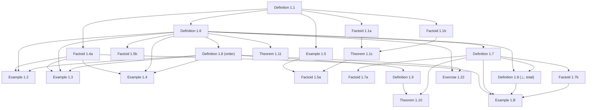

# Formalizing Dana Scott's 1980 Theory of Computation in Lean 4

## Abstract

In November 1969, Dana Scott formulated a mathematical program to construct the first non-degenerate, purely mathematical model ($D_\infty$) for Alonzo Church's untyped $\lambda$-calculus. He formally detailed this in his landmark 1972 paper *Continuous Lattices*, providing the foundational justification for denotational semantics. However, Scott's initial 1972 framework relied on dense, abstract point-set topology, which remained an intimidating barrier for computer scientists seeking a practical tool for representing programming language semantics.

When Scott delivered his lectures at Oxford in 1980—subsequently published as *Lectures on a Mathematical Theory of Computation* (Technical Report PRG-19)—he made an intentional, systematic pivot. His 1972 paper was a text on a model of $\lambda$-calculus, readable only by specialists in lattice theory and topology. The 1980 lectures used far less topology, focusing instead on discrete information presented as *domains*. This more discrete presentation was intended to be more accessible to computer scientists without training in topology.

This Lean 4 formalization covers every element of PRG-19, including all exercises.  We strive to avoid law of the excluded middle.  We check axioms throughout, so if a proof seems to unavoidably require law of the excluded middle, that will be shown in the axiom check.

---

## Introduction

To make domain theory accessible, the 1980 monograph introduces three key conceptual and structural shifts:

### 1. The Information-Theoretic Ordering
In contrast to the topological open sets of 1972, the 1980 lectures treat domains strictly as partially ordered sets (posets) representing states of incomplete information. An element within a domain is framed as a "partial description" of a computation. The ordering relation ($\sqsubseteq$) is explicitly interpreted as approximation: $x \sqsubseteq y$ means $x$ contains less information than, or approximates, $y$.

### 2. Neighborhood Systems and Finite Approximations
To bypass the complexities of continuous geometric spaces, Scott introduced **Neighborhood Systems**. He recognized that real-world computing machines only ever interact with finite, checkable tokens of data. In this framework, an infinite computational process (such as an infinite stream or a complex recursive function) is defined as the limit of an ever-tightening sequence of these finite neighborhoods. This shifted the underlying mathematics away from general topology and toward formal logic and order theory.

### 3. Solving Universal Recursive Domain Equations
While Scott's 1969 discovery was a specialized solution to the specific self-referential equation $D \cong [D \to D]$, the 1980 monograph provides a universal factory blueprint. Scott uses inverse limits over Directed-Complete Partial Orders (CPOs) to solve arbitrary recursive domain equations. This generalized framework allowed computer scientists to give rigorous mathematical meaning to standard recursive computer data structures, such as lists, trees, and stream types.

### Formalization Target: Consolidating "Scott Domains"
This Lean 4 artifact formalizes the mathematical objects that these 1980 lectures ultimately standardized for the computer science community, known today as **Scott Domains**. A Scott Domain is characterized as a poset that is:
1. **Directed-Complete (CPO):** Every directed subset has a least upper bound, ensuring that infinite computations have well-defined limits.
2. **$\omega$-algebraic:** Every element in the domain can be represented as the supremum of a countable set of compact (finite) elements, mirroring how infinite data is built from finite tokens.
3. **Consistently Complete:** If any two pieces of information do not outright contradict each other, they possess a join (least upper bound), allowing consistent computation streams to merge safely.

---

## Methodology

This section records the proof-engineering conventions of the formalization—the parts of the
development workflow that are of general academic interest, distilled from the project's internal
handoff notes.

### Source material and inventory

The primary source is Dana Scott's *Lectures on a Mathematical Theory of Computation* (Oxford,
1980; Technical Report PRG-19). OCR transcriptions live in `sources/PRG19_vision.md`; the structured
inventory of every numbered Definition, Theorem, Example, and Exercise—with formalization status and
proof notes—is maintained in this document (`arxiv.md`). Each item is keyed to Scott's original
numbering and cross-linked to its Lean module. Status values distinguish **Pass** (mechanized, builds
green, zero `sorry`), **Partial** (substantial core done; documented gaps remain), **Not Yet**, and
**Deferred** (Lecture VIII and items beyond the current formalization frontier).

### Neighborhood systems as the uniform substrate

Following Scott's 1980 pivot away from point-set topology, domains are encoded uniformly as
**neighbourhood systems**: a master set Δ, a family 𝒟 of neighbourhoods (filters on Δ), and domain
elements as filters over 𝒟. Approximable maps, products, function spaces, sums, and fixed-point
combinators are built on this substrate in `Basic.lean`, `Approximable.lean`, `Product.lean`, and
`FunctionSpace.lean`. Positive systems (Exercise 1.19) and effectively given presentations
(Definition 7.1) are layered on top when Scott's exercises demand computability content.

### Custom recursion theory (Lecture VII)

For **effectively given** domains Scott requires two index relations to be *recursively decidable*:
(i) intersection equality `Xₙ ∩ Xₘ = X_k`, and (ii) consistency `∃ k. X_k ⊆ Xₙ ∩ X_m`. Rather than
mathlib's `Computable`/`ComputablePred` development—which pulls `Classical.choice` through tactics
such as `grind`, `lia`, and `Nat.unpair_pair`—we rebuilt the needed slice in `Recursive.lean`:

* `RecDecidable p := ∃ f, Nat.Primrec f ∧ ∀ n, p n ↔ f n = 1` (and the binary/ternary pair-codings
  `RecDecidable₂`, `RecDecidable₃`);
* choice-free correctness for `Nat.sqrt`, `Nat.pair`/`unpair`, and primitive-recursive `+`/`*`;
* closure lemmas (`RecDecidable.of_iff`, `.comp`, `.and`, `.or`, `.not`, bounded `∀`/`∃` via
  `bForallFn`/`bExistsFn`);
* r.e. layers `REPred`/`REPred₂` as projections of decidable relations.

**Target axiom footprint** for data constructions and core proofs: `⊆ {propext, Quot.sound}`.
`Classical.choice` is permitted only for genuinely unavoidable **Prop-level** steps (e.g. classical
case splits on membership in an arbitrary system) and is always called out in proof notes. Each
completed module is audited with `#print axioms`.

### Incremental proof development

Large exercises are decomposed into small, revert-safe sessions rather than monolithic proofs.
**Exercise 7.22** is the canonical example of this split: Scott's construction is **formalized**,
with **every inventory row Pass** (**7.22a–h**, **7.22i(a)**, **7.22i(b)1–8**, **7.22j**, **7.22k**,
**7.22l**) and Definition 7.1 satisfied *exactly as Scott states it*. Not required by Scott's text,
but shared by the rest of this project's Lecture VII formalisation, is a *stronger* notion,
`ComputablePresentation` (`inter`/`inter_primrec`/`inter_spec`/`masterIdx`); instantiating it for
`Ssys` remains open, and is worth doing only if a later exercise needs to feed `Ssys` into that
apparatus. We mechanize Scott's least positive neighbourhood system generated by
singleton languages under concatenation and consistent intersection; prove the induced semigroup
structure and embedding of the free monoid; construct executable automata-based consistency deciders;
and reduce the remaining effectively-given obligations to **primitive-recursive certification**
within `Recursive.lean`—not to further domain theory. See appendices A and B.

| Session | Goal | Status | Inventory |
|---------|------|--------|-----------|
| C1–C8 | Automata + Bool deciders + `SsysX` | ☑ | 7.22d–g |
| C11 | Infinite-word equations | ☑ | 7.22h |
| C12 | Inventory + axiom audit | ☑ | — |
| **C9a** | First missing **generic** `Nat.Primrec` lemma in `Recursive.lean` | ☑ | 7.22i(a) |
| **C9b** | `primrec_ssysConsChar` + `Ssys_cons_computable` (umbrella) | Pass | 7.22i(b) |
| **C9b1** | `decodeFuelOkChar` umbrella (**7.22i(b)1(a–e)**) | ☑ | 7.22i(b)1 |
| **C9b1a** | `mulBit` + `primrec` | ☑ | 7.22i(b)1(a) |
| **C9b1b** | `decodeFuelOkChar` + `primrec` | ☑ | 7.22i(b)1(b) |
| **C9b1c** | dispatch lemmas (`Body_eq`, `selectFn_isOne_…`) | ☑ | 7.22i(b)1(c) |
| **C9b1d** | `decodeListBool_isSome_iff` | ☑ | 7.22i(b)1(d) |
| **C9b1e** | `decodeFuelOkChar_eq_one_iff` | ☑ | 7.22i(b)1(e) |
| **C9b2** | `listLenChar` + `primrec` | ☑ | 7.22i(b)2 |
| **C9b3** | `listEqChar` + `primrec` | ☑ | 7.22i(b)3 |
| **C9b4** | `appendListCode`, `takeCode`, `dropCode` + `primrec` | Pass | 7.22i(b)4 |
| **C9b5** | `autStateCardFuelChar`, `matchesBChar` + `primrec` | Pass | 7.22i(b)5 |
| **C9b6** | `decideNonemptyBChar`, `consistentBChar` + `primrec` | Pass | 7.22i(b)6 |
| **C9b7** | `ssysConsistentBChar` + shallow Bool `_eq` lemmas | Pass | 7.22i(b)7 |
| **C9b8** | `primrec_ssysConsChar` → `Ssys_cons_computable` | Pass | 7.22i(b)8 |
| **C10** | `ComputablePresentation Ssys` / `IsEffectivelyGiven` | Pass | 7.22j |
| **C7b** | Full relation (i) `interEq` decider | Pass | 7.22k |
| **C13** | `streamArrow` — infinite words as genuine domain LFPs | Pass | 7.22l |

**C9 strategy (interface repair, not Scott):** mathematics and the Bool decider are complete
(`ssys_cons_char_iff`). Generic bridges `RecDecidable.of_zero_one_char` and
`RecDecidable₂.of_paired_zero_one_char` and the conditional
`Ssys_cons_computable_of_primrec_ssysConsChar` already exist. **Do not** rebuild the executable
semantics as a bespoke `primrec_*Char` tower in `Exercise722Presentation.lean`; prove reusable
primrec closure lemmas in `Recursive.lean` (fuel-bounded decode, structural folds via `foldCode` /
`existsListChar`), then instantiate in a few lines.

**Composer file map** (which module each session touches):

| File | Sessions |
|------|----------|
| `Exercise722Decide.lean` | C1–C2, C4–C7a |
| `Exercise722Words.lean` | C3–C5 |
| `Exercise722Presentation.lean` | C8–C10 |
| `Exercise722.lean` | C11 (`streamElem`, `streamElem_idempotent`, `example` checks) |
| `Recursive.lean` | C9a generic primrec lemmas; C9b bridge |

### Build and artifact hygiene

* **Build command:** `lake build Scott1980` (full package; filter CI noise with
  `grep -vE 'LEAN_PATH|trace:'`).
* **No `sorry`:** every Pass/Partial item in the inventory corresponds to modules that compile
  without placeholders.
* **Generated artifacts:** `arxiv_with_code.md` (Lean sources inlined for PDF pipeline) is produced by
  `scripts/generate_arxiv_with_code.py` and is intentionally gitignored between regenerations.
* **Inventory reconciliation:** `scripts/reconcile_arxiv_from_original.py` rebuilds goal-list rows from
  `arxiv_original.md` when the structured inventory needs to be resynchronized.

---

## Chronological Formalization Narrative

Below is the chronological narrative of the formalization, organized step-by-step using Dana Scott's original numbering system from the PRG-19 monograph.

### Lecture I: Domains by Neighborhoods



#### Definition 1.1
* **Mathematical Target:** `NeighborhoodSystem` (`mem`, `master`, `master_mem`, `inter_mem`, `sub_master`)
* **Lean File:** `Scott1980/Neighborhood/Basic.lean`
* **Proof Notes:** `NeighborhoodSystem` (`mem`, `master`, `master_mem`, `inter_mem`, `sub_master`)

`NeighborhoodSystem α` bundles a membership predicate `mem : Set α → Prop` (Scott's `X ∈ 𝒟`),
the master neighbourhood `master` (Scott's `Δ`, kept as a field rather than hard-wired to
`Set.univ`, for fidelity to the `Δ` notation), and Scott's two conditions: (i) `master_mem`
(`Δ ∈ 𝒟`) and (ii) `inter_mem` (consistent binary intersections stay in `𝒟`, the witness
`Z ⊆ X ∩ Y` passed explicitly). A fourth field `sub_master` records Scott's standing assumption
`𝒟 ⊆ 𝒫(Δ)` (every neighbourhood `X ⊆ Δ`); it is what gives the principal filter `↑X` its top
element `Δ` (Def 1.7) and underlies `⊥ = ↑Δ` (Def 1.8). Each finite example supplies it as
`fun _ => Set.subset_univ _` (their `master` is `Set.univ`). Scott's recursive **convention** for the finite intersection
`⋂_{i<n} Xᵢ` is the `def interUpTo` (`0 ↦ Δ`, `n+1 ↦ interUpTo n ∩ Xₙ`); **Factoids 1.1a/1.1b**
are its two defining equations, both `rfl`.


#### Factoid 1.1a
* **Mathematical Target:** `interUpTo`, `interUpTo_zero` (`⋂_{i<0} Xᵢ = Δ`)
* **Lean File:** `Scott1980/Neighborhood/Basic.lean`
* **Proof Notes:** `interUpTo`, `interUpTo_zero` (`⋂_{i<0} Xᵢ = Δ`)


#### Factoid 1.1b
* **Mathematical Target:** `interUpTo_succ` (`⋂_{i<n+1} Xᵢ = (⋂_{i<n} Xᵢ) ∩ Xₙ`)
* **Lean File:** `Scott1980/Neighborhood/Basic.lean`
* **Proof Notes:** `interUpTo_succ` (`⋂_{i<n+1} Xᵢ = (⋂_{i<n} Xᵢ) ∩ Xₙ`)


#### Theorem 1.1c
* **Mathematical Target:** `interUpTo_mem` (extend (ii) to finite seqs) + `consistent_iff_interUpTo_mem` (consistency ⟺ `⋂ ∈ 𝒟`); aux `Consistent`, `interUpTo_subset`
* **Lean File:** `Scott1980/Neighborhood/Basic.lean`
* **Proof Notes:** `interUpTo_mem` (extend (ii) to finite seqs) + `consistent_iff_interUpTo_mem` (consistency ⟺ `⋂ ∈ 𝒟`); aux `Consistent`, `interUpTo_subset`


#### Example 1.2
* **Mathematical Target:** `Δ={0,1}`, `𝒟={{0,1},{0},{1}}`; `neighborhoodSystem`, `element_classification` (exactly 3 filters), `bot_is_unique_partial` (one partial element)
* **Lean File:** — (see proof notes)
* **Proof Notes:** `Δ={0,1}`, `𝒟={{0,1},{0},{1}}`; `neighborhoodSystem`, `element_classification` (exactly 3 filters), `bot_is_unique_partial` (one partial element)

Scott's first worked example: `Δ = {0,1}` (`Token := Fin 2`, `master := Set.univ`),
`𝒟 = {Δ, {0}, {1}}`. We build `neighborhoodSystem : NeighborhoodSystem Token` — the only real
obligation is condition (ii), discharged by `inter_eq` (the nine pairwise intersections each reduce
to `Δ`, `{0}`, `{1}`, or `∅` via `master_inter`/`inter_master`/`Set.inter_self`/`zero_inter_one`),
the `∅` case being impossible since a witness `Z ⊆ ∅` would force `∅ ∈ 𝒟` (`not_mem_empty`).

The mathematical payoff is the **element classification** (`element_classification`): every filter
is one of exactly three — `bot = {Δ}`, `elemZero = {Δ,{0}}`, `elemOne = {Δ,{1}}`. The argument: a
filter `x` either contains `{0}` (then `up_mem`+`inter_mem` force `x = elemZero`; it cannot also
contain `{1}` since `{0} ∩ {1} = ∅ ∉ 𝒟`), or `{1}` (symmetric), or neither (then `x = bot`).
Hence `bot_is_unique_partial`: `⊥` is the sole *partial* element, with `bot_lt_elemZero`,
`bot_lt_elemOne` placing the two total elements strictly above it — exactly Scott's "there is only
one partial element". Being a concrete finite computation it leans on `Mathlib.Tactic`
(`fin_cases`/`simp`), so its footprint is the classical `[propext, Classical.choice, Quot.sound]`;
the constructive guarantee is reserved for the §1 *core* in `Basic.lean`.


#### Example 1.3
* **Mathematical Target:** `Δ={0,1,2}`, `𝒟={{0,1,2},{1,2},{2}}` (linear); `neighborhoodSystem`, `element_classification` (exactly 3 filters), `bot_lt_elemTwelve`, `elemTwelve_lt_elemTwo`, `elemTwo_maximal` (linear chain; token `2` total)
* **Lean File:** — (see proof notes)
* **Proof Notes:** `Δ={0,1,2}`, `𝒟={{0,1,2},{1,2},{2}}` (linear); `neighborhoodSystem`, `element_classification` (exactly 3 filters), `bot_lt_elemTwelve`, `elemTwelve_lt_elemTwo`, `elemTwo_maximal` (linear chain; token `2` total)

Scott's second worked example: `Δ = {0,1,2}` (`Token := Fin 3`, `master := Set.univ`),
`𝒟 = {Δ, {1,2}, {2}}` — a **linear chain** under reverse inclusion (more information =
smaller set). We build `neighborhoodSystem : NeighborhoodSystem Token`; condition (ii) is
discharged by `inter_eq` with only **three** outcomes (`Δ`, `{1,2}`, `{2}`) — every pairwise
intersection is nested, so there is no empty-intersection case (contrast Example 1.2's nine-case
analysis).

The element classification (`element_classification`) yields exactly three filters in a linear
chain: `bot = {Δ}`, `elemTwelve = {Δ,{1,2}}`, `elemTwo = {Δ,{1,2},{2}}`. The argument follows
the same "case on minimal non-master neighbourhood" pattern as 1.2: if `{2} ∈ x` then `x =
elemTwo`; else if `{1,2} ∈ x` then `x = elemTwelve`; else `x = bot`. Order lemmas
`bot_lt_elemTwelve`, `elemTwelve_lt_elemTwo`, and `elemTwo_maximal` capture Scott's narrative:
approximation proceeds in **two steps** to the total element (token `2`); tokens `0` and `1` are
not total (they appear in larger neighbourhoods but do not determine filters); the direction of
approximation is **unique** (no branching). Unlike 1.2 (one partial, two total), 1.3 has **two
partial** elements and **one total**. Footprint `[propext, Classical.choice, Quot.sound]`.


#### Example 1.4
* **Mathematical Target:** depth-2 binary tree `Δ={Λ,0,1,00,01,10,11}`; subtrees as neighbourhoods; `neighborhoodSystem`, `element_classification` (exactly 7 filters), branch `bot_lt_elemZero/elemOne`, `elemZero_lt_elem00/01`, `elemOne_lt_elem10/11`, four leaf `elemXY_maximal` (first branching; 4 total elements)
* **Lean File:** — (see proof notes)
* **Proof Notes:** depth-2 binary tree `Δ={Λ,0,1,00,01,10,11}`; subtrees as neighbourhoods; `neighborhoodSystem`, `element_classification` (exactly 7 filters), branch `bot_lt_elemZero/elemOne`, `elemZero_lt_elem00/01`, `elemOne_lt_elem10/11`, four leaf `elemXY_maximal` (first branching; 4 total elements)

Scott's third worked example and the first with **branching**: the depth-2 binary tree
`Δ = {Λ,0,1,00,01,10,11}` (`Token := Fin 7`, with `Λ=0,…,11=6`), neighbourhoods the subtrees
`𝒟 = {Δ, left={0,00,01}, right={1,10,11}, {00},{01},{10},{11}}` — encoded as `left={1,3,4}`,
`right={2,5,6}`, and the four leaf singletons. Condition (ii) reduces to the "nested-or-disjoint"
table: of the 49 pairwise intersections, each is again a neighbourhood or `∅`. Rather than search,
`inter_eq` rewrites `X ∩ Y` to its canonical value via a complete `simp only` set of the 24
distinct intersection lemmas (both orders) plus `master_inter`/`inter_master`/`Set.inter_self`,
so the matching disjunct closes by `rfl` — deterministic and fast (the naive 49×8 `first` ladder
times out). The `∅` outcomes are inadmissible in `inter_mem` because a witness `Z ⊆ ∅` would force
`∅ ∈ 𝒟` (`not_mem_empty`).

The payoff is the **seven-filter classification** (`element_classification`): the bottom `⊥={Δ}`,
two branch partials `elemZero={Δ,left}` / `elemOne={Δ,right}`, and four total leaf filters
`elem00,…,elem11`. The proof cases on the minimal non-master neighbourhood: a leaf in `x` pins the
total filter (`mem_leafXY_imp`, using that distinct leaves and cross-branch neighbourhoods
intersect to `∅`); otherwise `left`/`right` membership gives a branch partial, else `⊥`. The order
lemmas realize the **tree with choice**: `bot_lt_elemZero/elemOne` (two incomparable partials above
`⊥`), `elemZero_lt_elem00/01`, `elemOne_lt_elem10/11` (each partial below its two leaves), and
`elemXY_maximal` for the four leaves (each leaf filter is maximal — a total element). Contrast the
prior examples: 1.2 is a fork at the bottom (one partial, two total), 1.3 a linear chain (two
partial, one total), and 1.4 a genuine tree (three partial, four total) where branching encodes
the choice in extending a partial sequence. Footprint `[propext, Classical.choice, Quot.sound]`.


#### Factoid 1.4a
* **Mathematical Target:** `NestedOrDisjoint` + `NeighborhoodSystem.ofNestedOrDisjoint`: "*nested-or-disjoint*" ⟹ neighbourhood system (the "very special circumstance" of 1.2–1.4); choice-free
* **Lean File:** `Scott1980/Neighborhood/Basic.lean`
* **Proof Notes:** `NestedOrDisjoint` + `NeighborhoodSystem.ofNestedOrDisjoint`: "*nested-or-disjoint*" ⟹ neighbourhood system (the "very special circumstance" of 1.2–1.4); choice-free

Scott's "very special circumstance" after Examples 1.2–1.4 is the predicate `NestedOrDisjoint mem
:= ∀ X Y, mem X → mem Y → X ⊆ Y ∨ Y ⊆ X ∨ X ∩ Y = ∅`. The constructor
`NeighborhoodSystem.ofNestedOrDisjoint mem master master_mem hnd` then discharges condition (ii)
without choice by casing on `hnd`: if `X ⊆ Y` then `X ∩ Y = X` (`Set.inter_eq_left.mpr`) so the
intersection is `mem` by `hX`; symmetrically for `Y ⊆ X`; and if `X ∩ Y = ∅` the consistency
witness `Z ⊆ X ∩ Y = ∅` gives `Z = ∅` (`Set.subset_empty_iff`), so `X ∩ Y = ∅ = Z ∈ 𝒟`. This is
the uniform reason Examples 1.2 (fork), 1.3 (chain) and 1.4 (tree) are neighbourhood systems.
Footprint `[propext, Quot.sound]`.


#### Example 1.5
* **Mathematical Target:** `Δ={0,1,2,3}`, `𝒟 =` all non-empty subsets; `Example15.neighborhoodSystem` (`mem X := X.Nonempty`), `mem_iff_nonempty`
* **Lean File:** — (see proof notes)
* **Proof Notes:** `Δ={0,1,2,3}`, `𝒟 =` all non-empty subsets; `Example15.neighborhoodSystem` (`mem X := X.Nonempty`), `mem_iff_nonempty`

`Δ = {0,1,2,3}` (`Token := Fin 4`) with `𝒟` = all **non-empty** subsets (`mem X := X.Nonempty`,
`master := Set.univ`). Condition (ii) is immediate and choice-free: a non-empty witness `Z ⊆ X ∩ Y`
makes `X ∩ Y` non-empty (`obtain ⟨z, hz⟩ := hZ; exact ⟨z, hZsub hz⟩`). **Factoid 1.5a**
(`consistent_iff_inter_nonempty`) is Scott's remark that "sets are consistent iff they have a
non-empty intersection": reusing the `Basic` `Consistent`/`interUpTo` infrastructure, a prefix is
consistent (`∃ Z, Z.Nonempty ∧ Z ⊆ ⋂`) iff `⋂_{i<n} Xᵢ` is non-empty (`→` shrinks the witness, `←`
takes the intersection as its own witness). Notably this example needs **no** `fin_cases`/`decide`
and audits to `[propext]` (system) / `[propext, Quot.sound]` (Factoid 1.5a) — a fully constructive
contrast to the finite Examples 1.2–1.4.


#### Factoid 1.5a
* **Mathematical Target:** in 1.5: `consistent_iff_inter_nonempty` (consistent ⟺ non-empty intersection); `𝒟` is a system
* **Lean File:** — (see proof notes)
* **Proof Notes:** in 1.5: `consistent_iff_inter_nonempty` (consistent ⟺ non-empty intersection); `𝒟` is a system

`Δ = {0,1,2,3}` (`Token := Fin 4`) with `𝒟` = all **non-empty** subsets (`mem X := X.Nonempty`,
`master := Set.univ`). Condition (ii) is immediate and choice-free: a non-empty witness `Z ⊆ X ∩ Y`
makes `X ∩ Y` non-empty (`obtain ⟨z, hz⟩ := hZ; exact ⟨z, hZsub hz⟩`). **Factoid 1.5a**
(`consistent_iff_inter_nonempty`) is Scott's remark that "sets are consistent iff they have a
non-empty intersection": reusing the `Basic` `Consistent`/`interUpTo` infrastructure, a prefix is
consistent (`∃ Z, Z.Nonempty ∧ Z ⊆ ⋂`) iff `⋂_{i<n} Xᵢ` is non-empty (`→` shrinks the witness, `←`
takes the intersection as its own witness). Notably this example needs **no** `fin_cases`/`decide`
and audits to `[propext]` (system) / `[propext, Quot.sound]` (Factoid 1.5a) — a fully constructive
contrast to the finite Examples 1.2–1.4.


#### Factoid 1.5b
* **Mathematical Target:** `limitFamily`, `SeqEquiv`, `limitFamily_eq_iff`: limit-family `x = {Z∈𝒟 ∣ ∃n, Xₙ⊆Z}` equal ⟺ sequences equivalent; choice-free
* **Lean File:** — (see proof notes)
* **Proof Notes:** `limitFamily`, `SeqEquiv`, `limitFamily_eq_iff`: limit-family `x = {Z∈𝒟 ∣ ∃n, Xₙ⊆Z}` equal ⟺ sequences equivalent; choice-free

The prose motivating Definition 1.6: a descending sequence `⟨Xₙ⟩` of neighbourhoods determines the
limit family `limitFamily X = {Z ∈ 𝒟 ∣ ∃ n, Xₙ ⊆ Z}`, and two sequences are `SeqEquiv` ("equally
deep") when `∀ m, ∃ n, Xₙ ⊆ Yₘ` and `∀ n, ∃ m, Yₘ ⊆ Xₙ`. `limitFamily_eq_iff` proves
`limitFamily X = limitFamily Y ↔ SeqEquiv X Y` (assuming each term is a neighbourhood): `→` feeds
each `Yₘ ∈ limitFamily Y` through the family equality to extract `Xₙ ⊆ Yₘ` (and symmetrically);
`←` chains `Yₘ ⊆ Xₙ ⊆ Z` (and symmetrically) via transitivity. Antitonicity of the sequences is not
needed for the criterion itself. Footprint `[propext, Quot.sound]`.


#### Definition 1.6
* **Mathematical Target:** `Element` (filter: `sub`, `master_mem`, `inter_mem`, `up_mem`) + `Element.ext`; domain `\
* **Lean File:** — (see proof notes)
* **Proof Notes:** 𝒟\|` | **Pass**

`Element V` is Scott's filter (Def 1.6): a membership predicate `mem : Set α → Prop` with `sub`
(`x ⊆ 𝒟`), `master_mem` (`Δ ∈ x`), `inter_mem` (closed under `∩`), and `up_mem` (upward closed in
`𝒟`). Mirroring `InfoSys.Element`, the early helper `Element.ext` (membership-equality ⟹ equality,
proved by `rcases` on both structures + `funext`/`propext`, *not* `congr`) keeps the
`PartialOrder` instance (Def 1.8's approximation order `x ⊑ y ⟺ x ⊆ y`) choice-free: `le_antisymm`
is just `Element.ext fun X => ⟨h1 X, h2 X⟩`. Footprint `[propext, Quot.sound]`.


#### Definition 1.7
* **Mathematical Target:** `principal` `↑X = {Y∈𝒟 ∣ X⊆Y}` (`mem_principal`); the finite elements
* **Lean File:** — (see proof notes)
* **Proof Notes:** `principal` `↑X = {Y∈𝒟 ∣ X⊆Y}` (`mem_principal`); the finite elements

Scott's *principal filter* `↑X = {Y ∈ 𝒟 ∣ X ⊆ Y}` is `principal (hX : V.mem X) : V.Element`,
with `mem Y := V.mem Y ∧ X ⊆ Y`. The four filter laws: `sub` is the first projection;
`master_mem = ⟨V.master_mem, V.sub_master hX⟩` (this is where the new `sub_master` field earns its
keep — `X ⊆ Δ`); `inter_mem` combines `Set.subset_inter` (from `X ⊆ Y₁`, `X ⊆ Y₂`) with one use of
`V.inter_mem`, taking `X` itself as the consistency witness `X ⊆ Y₁ ∩ Y₂`; `up_mem` is `⊆`
transitivity. `mem_principal` is the membership `rfl`-unfolding.

**Factoid 1.7a (one-one + inclusion-reversing).** `principal_le_iff`:
`↑X ⊑ ↑Y ↔ Y ⊆ X` — Scott's `X ⊆ Y ⟺ ↑Y ⊑ ↑X`, the **variance flip** (smaller neighbourhood ⇒
larger principal filter ⇒ more information). `→` evaluates `⊑` at the token `X` (using `X ∈ ↑X`
since `X ⊆ X`) and reads `Y ⊆ X` off `X ∈ ↑Y`; `←` chains `Y ⊆ X ⊆ Z`. Injectivity
`principal_injective` (`↑X = ↑Y ⟹ X = Y`) feeds both `le_of_eq` directions through
`principal_le_iff` into `Set.Subset.antisymm`.

**Factoid 1.7b (density of finite elements).** `eq_iUnion_principal`:
`x.mem Z ↔ ∃ X, ∃ hX : x.mem X, (↑X).mem Z` — Scott's `x = ⋃ {↑X ∣ X ∈ x}` written as union
membership (concrete, avoiding `⋃` over a `Set (Set α)`). `→` uses `X = Z` (`Z ∈ ↑Z`); `←` is one
application of upward closure `x.up_mem` (`X ⊆ Z` with `Z ∈ 𝒟`). All five declarations audit to
`[propext, Quot.sound]`.


#### Factoid 1.7a
* **Mathematical Target:** "*obvious*": `X↦↑X` one-one & inclusion-**reversing** — `principal_le_iff` (`↑X⊑↑Y ⟺ Y⊆X`) + `principal_injective`
* **Lean File:** — (see proof notes)
* **Proof Notes:** "*obvious*": `X↦↑X` one-one & inclusion-**reversing** — `principal_le_iff` (`↑X⊑↑Y ⟺ Y⊆X`) + `principal_injective`

Scott's *principal filter* `↑X = {Y ∈ 𝒟 ∣ X ⊆ Y}` is `principal (hX : V.mem X) : V.Element`,
with `mem Y := V.mem Y ∧ X ⊆ Y`. The four filter laws: `sub` is the first projection;
`master_mem = ⟨V.master_mem, V.sub_master hX⟩` (this is where the new `sub_master` field earns its
keep — `X ⊆ Δ`); `inter_mem` combines `Set.subset_inter` (from `X ⊆ Y₁`, `X ⊆ Y₂`) with one use of
`V.inter_mem`, taking `X` itself as the consistency witness `X ⊆ Y₁ ∩ Y₂`; `up_mem` is `⊆`
transitivity. `mem_principal` is the membership `rfl`-unfolding.

**Factoid 1.7a (one-one + inclusion-reversing).** `principal_le_iff`:
`↑X ⊑ ↑Y ↔ Y ⊆ X` — Scott's `X ⊆ Y ⟺ ↑Y ⊑ ↑X`, the **variance flip** (smaller neighbourhood ⇒
larger principal filter ⇒ more information). `→` evaluates `⊑` at the token `X` (using `X ∈ ↑X`
since `X ⊆ X`) and reads `Y ⊆ X` off `X ∈ ↑Y`; `←` chains `Y ⊆ X ⊆ Z`. Injectivity
`principal_injective` (`↑X = ↑Y ⟹ X = Y`) feeds both `le_of_eq` directions through
`principal_le_iff` into `Set.Subset.antisymm`.

**Factoid 1.7b (density of finite elements).** `eq_iUnion_principal`:
`x.mem Z ↔ ∃ X, ∃ hX : x.mem X, (↑X).mem Z` — Scott's `x = ⋃ {↑X ∣ X ∈ x}` written as union
membership (concrete, avoiding `⋃` over a `Set (Set α)`). `→` uses `X = Z` (`Z ∈ ↑Z`); `←` is one
application of upward closure `x.up_mem` (`X ⊆ Z` with `Z ∈ 𝒟`). All five declarations audit to
`[propext, Quot.sound]`.


#### Factoid 1.7b
* **Mathematical Target:** "*also obvious*": `x = ⋃ {↑X ∣ X∈x}` for every `x∈\
* **Lean File:** — (see proof notes)
* **Proof Notes:** 𝒟\|` — `eq_iUnion_principal` | **Pass**

Scott's *principal filter* `↑X = {Y ∈ 𝒟 ∣ X ⊆ Y}` is `principal (hX : V.mem X) : V.Element`,
with `mem Y := V.mem Y ∧ X ⊆ Y`. The four filter laws: `sub` is the first projection;
`master_mem = ⟨V.master_mem, V.sub_master hX⟩` (this is where the new `sub_master` field earns its
keep — `X ⊆ Δ`); `inter_mem` combines `Set.subset_inter` (from `X ⊆ Y₁`, `X ⊆ Y₂`) with one use of
`V.inter_mem`, taking `X` itself as the consistency witness `X ⊆ Y₁ ∩ Y₂`; `up_mem` is `⊆`
transitivity. `mem_principal` is the membership `rfl`-unfolding.

**Factoid 1.7a (one-one + inclusion-reversing).** `principal_le_iff`:
`↑X ⊑ ↑Y ↔ Y ⊆ X` — Scott's `X ⊆ Y ⟺ ↑Y ⊑ ↑X`, the **variance flip** (smaller neighbourhood ⇒
larger principal filter ⇒ more information). `→` evaluates `⊑` at the token `X` (using `X ∈ ↑X`
since `X ⊆ X`) and reads `Y ⊆ X` off `X ∈ ↑Y`; `←` chains `Y ⊆ X ⊆ Z`. Injectivity
`principal_injective` (`↑X = ↑Y ⟹ X = Y`) feeds both `le_of_eq` directions through
`principal_le_iff` into `Set.Subset.antisymm`.

**Factoid 1.7b (density of finite elements).** `eq_iUnion_principal`:
`x.mem Z ↔ ∃ X, ∃ hX : x.mem X, (↑X).mem Z` — Scott's `x = ⋃ {↑X ∣ X ∈ x}` written as union
membership (concrete, avoiding `⋃` over a `Set (Set α)`). `→` uses `X = Z` (`Z ∈ ↑Z`); `←` is one
application of upward closure `x.up_mem` (`X ⊆ Z` with `Z ∈ 𝒟`). All five declarations audit to
`[propext, Quot.sound]`.


#### Definition 1.8 (order)
* **Mathematical Target:** approximation `x⊑y ⟺ x⊆y` — `instance : PartialOrder Element` (choice-free `le_antisymm` via `Element.ext`)
* **Lean File:** — (see proof notes)
* **Proof Notes:** approximation `x⊑y ⟺ x⊆y` — `instance : PartialOrder Element` (choice-free `le_antisymm` via `Element.ext`)

`Element V` is Scott's filter (Def 1.6): a membership predicate `mem : Set α → Prop` with `sub`
(`x ⊆ 𝒟`), `master_mem` (`Δ ∈ x`), `inter_mem` (closed under `∩`), and `up_mem` (upward closed in
`𝒟`). Mirroring `InfoSys.Element`, the early helper `Element.ext` (membership-equality ⟹ equality,
proved by `rcases` on both structures + `funext`/`propext`, *not* `congr`) keeps the
`PartialOrder` instance (Def 1.8's approximation order `x ⊑ y ⟺ x ⊆ y`) choice-free: `le_antisymm`
is just `Element.ext fun X => ⟨h1 X, h2 X⟩`. Footprint `[propext, Quot.sound]`.


#### Definition 1.8 (⊥, total)
* **Mathematical Target:** `bot := principal master_mem` (`⊥={Δ}=↑Δ`), `mem_bot` (`Y∈⊥ ⟺ Y=Δ`); `IsTotal x := ∀ y, x⊑y→y⊑x` (predicate only, existence = Ex 1.24, out of scope)
* **Lean File:** — (see proof notes)
* **Proof Notes:** `bot := principal master_mem` (`⊥={Δ}=↑Δ`), `mem_bot` (`Y∈⊥ ⟺ Y=Δ`); `IsTotal x := ∀ y, x⊑y→y⊑x` (predicate only, existence = Ex 1.24, out of scope)


#### Factoid 1.8a
* **Mathematical Target:** `bot_le` (`⊥⊑x` for all `x`) + `instance OrderBot Element`; constructive
* **Lean File:** — (see proof notes)
* **Proof Notes:** `bot_le` (`⊥⊑x` for all `x`) + `instance OrderBot Element`; constructive

Scott's bottom element `⊥ = {Δ}` is simply the principal filter of the master neighbourhood:
`bot := principal master_mem`, i.e. `⊥ = ↑Δ`. `mem_bot` shows it really is the *singleton* `{Δ}`:
`Y ∈ ⊥ ↔ Y = Δ`. The forward direction is where `sub_master` pays off — `Y ∈ ↑Δ` gives `Y ∈ 𝒟`
*and* `Δ ⊆ Y`, while `V.sub_master` supplies the reverse `Y ⊆ Δ`, so `Set.Subset.antisymm` collapses
`Y` to `Δ`. This is the *variance* curiosity (Pitfall 4): `⊥ = ↑Δ` is the *largest* principal filter
(`Δ` is the largest neighbourhood) yet the *least* element.

**Factoid 1.8a (`⊥` is least).** `bot_le : ∀ x, ⊥ ⊑ x`: a member `Y ∈ ⊥` is `Y = Δ` (`mem_bot`),
and `Δ ∈ x` is filter axiom (i) `x.master_mem`. Packaged as `instance : OrderBot V.Element` so the
`⊥` notation resolves to `{Δ}`; the instance stays `[propext, Quot.sound]`.

**Definition 1.8 (total elements).** `IsTotal x := ∀ y, x ⊑ y → y ⊑ x` — maximality under the
approximation order, kept as a *predicate*. Per Scott, the *existence* of total (maximal) elements
above a given `x` is the classical frontier (Exercise 1.24, needs Zorn/choice) and is deliberately
**not** proved here.

**Factoid 1.8b ("Examples 1.2–1.5 revisited": finite ⟹ principal).** Scott's prose "any explicitly
given filter `x` is principal … the minimal `X ∈ x` tells us all we need to know" is formalized as
`eq_principal_of_isMin`: if `x` has a `⊆`-minimum member `X` (one with `X ⊆ Y` for every `Y ∈ x`),
then `x = ↑X`. `⊆` is minimality, `⊇` is one `up_mem`. This is the constructive *core*; the step
"finite system ⟹ such a minimum exists" (take the intersection of the finitely many members, itself
in `x` by closure) is the only classical ingredient and is left implicit, so the stated lemma audits
to `[propext, Quot.sound]`. All four new declarations are constructive.


#### Factoid 1.8b
* **Mathematical Target:** `eq_principal_of_isMin` (filter with `⊆`-minimum member `X` is `↑X`) — constructive core of "finite ⟹ principal"; the finiteness⟹min step left implicit
* **Lean File:** — (see proof notes)
* **Proof Notes:** `eq_principal_of_isMin` (filter with `⊆`-minimum member `X` is `↑X`) — constructive core of "finite ⟹ principal"; the finiteness⟹min step left implicit

Scott's bottom element `⊥ = {Δ}` is simply the principal filter of the master neighbourhood:
`bot := principal master_mem`, i.e. `⊥ = ↑Δ`. `mem_bot` shows it really is the *singleton* `{Δ}`:
`Y ∈ ⊥ ↔ Y = Δ`. The forward direction is where `sub_master` pays off — `Y ∈ ↑Δ` gives `Y ∈ 𝒟`
*and* `Δ ⊆ Y`, while `V.sub_master` supplies the reverse `Y ⊆ Δ`, so `Set.Subset.antisymm` collapses
`Y` to `Δ`. This is the *variance* curiosity (Pitfall 4): `⊥ = ↑Δ` is the *largest* principal filter
(`Δ` is the largest neighbourhood) yet the *least* element.

**Factoid 1.8a (`⊥` is least).** `bot_le : ∀ x, ⊥ ⊑ x`: a member `Y ∈ ⊥` is `Y = Δ` (`mem_bot`),
and `Δ ∈ x` is filter axiom (i) `x.master_mem`. Packaged as `instance : OrderBot V.Element` so the
`⊥` notation resolves to `{Δ}`; the instance stays `[propext, Quot.sound]`.

**Definition 1.8 (total elements).** `IsTotal x := ∀ y, x ⊑ y → y ⊑ x` — maximality under the
approximation order, kept as a *predicate*. Per Scott, the *existence* of total (maximal) elements
above a given `x` is the classical frontier (Exercise 1.24, needs Zorn/choice) and is deliberately
**not** proved here.

**Factoid 1.8b ("Examples 1.2–1.5 revisited": finite ⟹ principal).** Scott's prose "any explicitly
given filter `x` is principal … the minimal `X ∈ x` tells us all we need to know" is formalized as
`eq_principal_of_isMin`: if `x` has a `⊆`-minimum member `X` (one with `X ⊆ Y` for every `Y ∈ x`),
then `x = ↑X`. `⊆` is minimality, `⊇` is one `up_mem`. This is the constructive *core*; the step
"finite system ⟹ such a minimum exists" (take the intersection of the finitely many members, itself
in `x` by closure) is the only classical ingredient and is left implicit, so the stated lemma audits
to `[propext, Quot.sound]`. All four new declarations are constructive.


#### Example 1.B
* **Mathematical Target:** `B = {σΣ* ∣ σ∈Σ*}` (binary), generalizing 1.4 — `Str := List Bool`, `cone σ = σΣ*`, `B` via `ofNestedOrDisjoint` from prefix `cone_trichotomy`
* **Lean File:** — (see proof notes)
* **Proof Notes:** `B = {σΣ* ∣ σ∈Σ*}` (binary), generalizing 1.4 — `Str := List Bool`, `cone σ = σΣ*`, `B` via `ofNestedOrDisjoint` from prefix `cone_trichotomy`


#### Exercise 1.B-sys
* **Mathematical Target:** "*should be done as an exercise*": `B` is a neighbourhood system — `nestedOrDisjoint` (cones pairwise nested-or-disjoint)
* **Lean File:** — (see proof notes)
* **Proof Notes:** "*should be done as an exercise*": `B` is a neighbourhood system — `nestedOrDisjoint` (cones pairwise nested-or-disjoint)


#### Exercise 1.B-elt
* **Mathematical Target:** "*an exercise here*": `σx ∈ \
* **Lean File:** — (see proof notes)
* **Proof Notes:** B\|` for `x∈\|B\|` — `sigmaElt σ x` (witness `σ(X₁∩X₂)` is a cone); `sigmaElt σ ⊥ = σ⊥` (`sigmaElt_bot`) | **Pass**


#### Factoid 1.B-mono
* **Mathematical Target:** `σ₀⊥ ⊆ σ₁⊥ ⟺ σ₀` is an initial segment of `σ₁` — `sigmaBot_le_iff` (`σ₀⊥⊑σ₁⊥ ⟺ σ₀<+:σ₁`)
* **Lean File:** — (see proof notes)
* **Proof Notes:** `σ₀⊥ ⊆ σ₁⊥ ⟺ σ₀` is an initial segment of `σ₁` — `sigmaBot_le_iff` (`σ₀⊥⊑σ₁⊥ ⟺ σ₀<+:σ₁`)


#### Factoid 1.B-lim
* **Mathematical Target:** `x = ⋃ₙ σₙ⊥` (element = limit of finite approx.) — `mem_iff_exists_sigmaBot` (union-of-`σ⊥` form; chain enumeration left to prose / choice)
* **Lean File:** — (see proof notes)
* **Proof Notes:** `x = ⋃ₙ σₙ⊥` (element = limit of finite approx.) — `mem_iff_exists_sigmaBot` (union-of-`σ⊥` form; chain enumeration left to prose / choice)


#### Definition 1.9
* **Mathematical Target:** `𝒟₀ ≅ 𝒟₁`: order-iso of `\
* **Lean File:** `Scott1980/Neighborhood/Basic.lean`
* **Proof Notes:** 𝒟₀\|` and `\|𝒟₁\|` — `DomainIso := V₀.Element ≃o V₁.Element`, `Isomorphic`/`≅ᴰ := Nonempty DomainIso` with `refl`/`symm`/`trans` (`Basic.lean`); `≃o` *reflects* `⊑` (`map_rel_iff`) = Scott's two-way inclusion-preservation | **Pass**


#### Theorem 1.10
* **Mathematical Target:** element-token system: `[X]={x ∣ X∈x}` (`bracket`); `tokenSystem : NeighborhoodSystem \
* **Lean File:** `Scott1980/Neighborhood/Theorem110.lean`
* **Proof Notes:** 𝒟\|`; `𝒟 ≅ᴰ tokenSystem` via `tokenIso`/`isomorphic_tokenSystem` (mutually-inverse `toToken`/`ofToken`). Facts: `bracket_master` (1), `bracket_inter_nonempty_iff` (2), `bracket_inter` (3), `principal_mem_bracket` (4); one-one `bracket_injective`, preserving `bracket_subset_iff` (`Theorem110.lean`) | **Pass**


#### Theorem 1.11
* **Mathematical Target:** `\
* **Lean File:** `Scott1980/Neighborhood/Theorem111.lean`
* **Proof Notes:** 𝒟\|` closed under countable `⋂` (`iInter`, no proviso) and ascending `⋃` (`iUnion`, `Monotone x`) — each again a filter; GLB `iInter_le`/`le_iInter`, LUB `le_iUnion`/`iUnion_le`; `mem_iInter`/`mem_iUnion` (`Theorem111.lean`) | **Pass**


#### Exercise 1.12
* **Mathematical Target:** `Δ=ℕ`, final-segment `tail n={m ∣ n≤m}`; `neighborhoodSystem` (chain via `ofNestedOrDisjoint`); finite elts `fin n=↑(tail n)` (`fin_strictMono`); unique limit/total `top` (`le_top`, `top_isTotal`, `isTotal_iff_top`); `element_eq` (every elt `fin n` or `top`, classical) (`Exercise112.lean`)
* **Lean File:** `Scott1980/Neighborhood/Exercise112.lean`
* **Proof Notes:** `Δ=ℕ`, final-segment `tail n={m ∣ n≤m}`; `neighborhoodSystem` (chain via `ofNestedOrDisjoint`); finite elts `fin n=↑(tail n)` (`fin_strictMono`); unique limit/total `top` (`le_top`, `top_isTotal`, `isTotal_iff_top`); `element_eq` (every elt `fin n` or `top`, classical) (`Exercise112.lean`)


#### Exercise 1.13
* **Mathematical Target:** assertions about `B` = `ExampleB.lean`; this file adds the **limit nodes**: `branch p = ⋃ₙ (p↾n)⊥` (via Thm 1.11 `iUnion`), `branch_mem_iff`, `branchSeq_le_branch`, and `branch_isTotal` (each infinite path is a total/maximal element) (`Exercise113.lean`)
* **Lean File:** `Scott1980/Neighborhood/ExampleB.lean`
* **Proof Notes:** assertions about `B` = `ExampleB.lean`; this file adds the **limit nodes**: `branch p = ⋃ₙ (p↾n)⊥` (via Thm 1.11 `iUnion`), `branch_mem_iff`, `branchSeq_le_branch`, and `branch_isTotal` (each infinite path is a total/maximal element) (`Exercise113.lean`)


#### Exercise 1.14
* **Mathematical Target:** `Δ=ℕ`, `𝒟 =` finite non-empty subsets `∪ {Δ}`; `neighborhoodSystem` (manual `inter_mem`, not nested-or-disjoint); finite elts `fin h=↑X`; total elts = singletons `singleton_isTotal` (`↑{n}` maximal) (`Exercise114.lean`)
* **Lean File:** `Scott1980/Neighborhood/Exercise114.lean`
* **Proof Notes:** `Δ=ℕ`, `𝒟 =` finite non-empty subsets `∪ {Δ}`; `neighborhoodSystem` (manual `inter_mem`, not nested-or-disjoint); finite elts `fin h=↑X`; total elts = singletons `singleton_isTotal` (`↑{n}` maximal) (`Exercise114.lean`)


#### Exercise 1.15
* **Mathematical Target:** two infinite finite-element domains: `flat` (`{ℕ}∪{{n}}`, fully classified: `flat_classify`, `flat_atom_maximal`, `flat_no_three_chain`, `flat_no_infinite_chain`, `flat_all_finite`) and `stem` (`{ℕ,{0,1}}∪{{n}}`, `stem_three_chain`); `not_isomorphic` (3-chain transports under `≃o`) (`Exercise115.lean`)
* **Lean File:** `Scott1980/Neighborhood/Exercise115.lean`
* **Proof Notes:** two infinite finite-element domains: `flat` (`{ℕ}∪{{n}}`, fully classified: `flat_classify`, `flat_atom_maximal`, `flat_no_three_chain`, `flat_no_infinite_chain`, `flat_all_finite`) and `stem` (`{ℕ,{0,1}}∪{{n}}`, `stem_three_chain`); `not_isomorphic` (3-chain transports under `≃o`) (`Exercise115.lean`)


#### Exercise 1.16
* **Mathematical Target:** `Δ=ℕ`, `𝒟 =` cofinite subsets; `\
* **Lean File:** `Scott1980/Neighborhood/Exercise116.lean`
* **Proof Notes:** 𝒟\| ≅ 𝒫(ℕ)` under `⊆` — `cofiniteSystem`, `ofExcluded`/`toExcluded`, `cofiniteIso` (excluded-point set), `mem_compl_of_finite` (`⋂_{n∈F}{n}ᶜ=Fᶜ`); total elt `ofExcluded ℕ` (`ofExcluded_univ_isTotal`); second `∩`-closed `fullSystem` (`Exercise116.lean`, `Cofinite` ns) | **Pass**


#### Exercise 1.17
* **Mathematical Target:** `Δ=ℝ`, `𝒟 =` rational open intervals `∪ {Δ}`; `ratIntervalSystem` (`inter_mem'` via `Ioo_inter_Ioo`+`max`/`min`), `filterAt t={X∣t∈X}` is a filter, `filterAt_injective` (`ℝ ↪ \
* **Lean File:** `Scott1980/Neighborhood/Exercise117.lean`
* **Proof Notes:** 𝒟\|`); full total-elt classification documented as out-of-scope (`Exercise117.lean`, `RatInterval` ns) | **Pass**


#### Exercise 1.18
* **Mathematical Target:** consistent `C⊆𝒟` (`FinitelyConsistent`); pairwise-but-not-jointly `triSys`/`family` (`family_pairwise_nonempty`, `not_finitelyConsistent`); `leastFilter` `⊇C` (`subset_leastFilter`/`leastFilter_le`, via `interUpTo_appendSeq`); `sInf` of a non-empty family of filters is a filter (`sInf_le`/`le_sInf`) (`Exercise118.lean`)
* **Lean File:** `Scott1980/Neighborhood/Exercise118.lean`
* **Proof Notes:** consistent `C⊆𝒟` (`FinitelyConsistent`); pairwise-but-not-jointly `triSys`/`family` (`family_pairwise_nonempty`, `not_finitelyConsistent`); `leastFilter` `⊇C` (`subset_leastFilter`/`leastFilter_le`, via `interUpTo_appendSeq`); `sInf` of a non-empty family of filters is a filter (`sInf_le`/`le_sInf`) (`Exercise118.lean`)


#### Exercise 1.19
* **Mathematical Target:** *positive* nbhd system (ii′: `X∩Y≠∅ ⟺ X∩Y∈𝒟`) — `IsPositive`, `ofPositive` (positive ⟹ system, in `Basic.lean`); positive `positiveExample`; non-positive `notPositiveSystem` (`{Δ,{0,1},{1,2}}`, intersection `{1}∉𝒟`; smaller than Hoare's `ℕ×ℕ`) `not_isPositive` (`Exercise119.lean`)
* **Lean File:** `Scott1980/Neighborhood/Exercise119.lean`
* **Proof Notes:** *positive* nbhd system (ii′: `X∩Y≠∅ ⟺ X∩Y∈𝒟`) — `IsPositive`, `ofPositive` (positive ⟹ system, in `Basic.lean`); positive `positiveExample`; non-positive `notPositiveSystem` (`{Δ,{0,1},{1,2}}`, intersection `{1}∉𝒟`; smaller than Hoare's `ℕ×ℕ`) `not_isPositive` (`Exercise119.lean`)


#### Exercise 1.20
* **Mathematical Target:** `Δ'=𝒟`, `𝒟'={↑X}` with `↑X={Y∈𝒟 ∣ Y⊆X}` (`upSet`, ≠ `principal`); `powerSystem`, `powerSystem_isPositive`; `\
* **Lean File:** `Scott1980/Neighborhood/Exercise120.lean`
* **Proof Notes:** 𝒟\|≅\|𝒟'\|` via `toPower`/`ofPower`/`powerIso`, `isomorphic_powerSystem`; tokens ↔ finite elements one-one (`toPower_principal`) (`Exercise120.lean`) | **Pass**


#### Exercise 1.21
* **Mathematical Target:** (detail Thm 1.10) `{[X]}` over `\
* **Lean File:** `Scott1980/Neighborhood/Exercise121.lean`
* **Proof Notes:** 𝒟\|` is *positive* (`tokenSystem_isPositive`) and *complete* (`IsComplete`, `tokenSystem_complete`: every filter fixed by a unique point `ofToken y`; `tokenSystem_toToken_bijective`); consistency `{Xᵢ∣i<n}` ⟺ `⋂_{i<n}[Xᵢ]≠∅` (`consistent_iff_iInter_bracket_nonempty`) (`Exercise121.lean`) | **Pass**


#### Exercise 1.22
* **Mathematical Target:** (for topologists) the `[X]` topologize `\
* **Lean File:** — (see proof notes)
* **Proof Notes:** 𝒟\|`; open sets `=` (i) `⊑`-upper `∧` (ii) basic-nbhd; `⊑` `=` specialization order — `basicOpen`, `instTopologicalSpaceElement`, `isOpen_basicOpen`, `isOpen_iff_upper_basic`, `le_iff_isOpen_imp`, `specializes_iff_le` | **Pass**


#### Exercise 1.23
* **Mathematical Target:** countable system (`enum`/`henum`/`hsurj`) + `[DecidablePred V.mem]` ⟹ greedy sequence `Yₙ`/`acc` gives a **total** element: `greedyElement`, `greedyElement_isTotal` (choice-free, `Y_prefix_consistent`); every filter is sequence-determined `filters_sequence_determined` (classical) (`Exercise123.lean`)
* **Lean File:** `Scott1980/Neighborhood/Exercise123.lean`
* **Proof Notes:** countable system (`enum`/`henum`/`hsurj`) + `[DecidablePred V.mem]` ⟹ greedy sequence `Yₙ`/`acc` gives a **total** element: `greedyElement`, `greedyElement_isTotal` (choice-free, `Y_prefix_consistent`); every filter is sequence-determined `filters_sequence_determined` (classical) (`Exercise123.lean`)


#### Exercise 1.24
* **Mathematical Target:** (set theorists) the union of a non-empty **chain** of filters is a filter — `chainUnion` (`inter_mem` via `IsChain.total`), `le_chainUnion`; **with Zorn** every element extends to a total one `exists_total_ge` (`zorn_le_nonempty_Ici₀`, `IsMax = IsTotal`) — **classical** (`Exercise124.lean`)
* **Lean File:** `Scott1980/Neighborhood/Exercise124.lean`
* **Proof Notes:** (set theorists) the union of a non-empty **chain** of filters is a filter — `chainUnion` (`inter_mem` via `IsChain.total`), `le_chainUnion`; **with Zorn** every element extends to a total one `exists_total_ge` (`zorn_le_nonempty_Ici₀`, `IsMax = IsTotal`) — **classical** (`Exercise124.lean`)


#### Exercise 1.25
* **Mathematical Target:** (set theorists) `Δ` linearly+well-ordered, `𝒟 =` non-empty upper sets (`finalSegmentSystem`); `\
* **Lean File:** `Scott1980/Neighborhood/Exercise125.lean`
* **Proof Notes:** 𝒟\| ≅ {non-empty lower sets}` under `⊆` — `finalSegmentClassify` (`lowerSetOf`/`ofLowerSet`); top element `topElement` is the unique total element (`topElement_isTotal`, `eq_topElement_of_isTotal`); with no maximum it is *not* finite/principal (`topElement_not_principal_of_noMax`) (`Exercise125.lean`) | **Pass**


#### Exercise 1.26
* **Mathematical Target:** (algebraists) commutative ring `A` (`[DecidableEq A]`), `Δ =` finite `F⊆A`, `I(F)={G ∣ F⊆⟨G⟩}` (`IFamily`, `IFamily_inter`); `ringSystem`; `\
* **Lean File:** `Scott1980/Neighborhood/Exercise126.lean`
* **Proof Notes:** 𝒟\| ≅` ideals of `A` under `⊆` — `ringIso` (`idealOf`/`ofIdeal` mutually inverse) (`Exercise126.lean`) | **Pass**


#### Exercise 1.27
* **Mathematical Target:** *bounded* `X⊆\
* **Lean File:** `Scott1980/Neighborhood/Exercise127.lean`
* **Proof Notes:** 𝒟\|` (`Bounded`, `sSup` = `sInf` of `upperBounds`, `le_sSup`/`sSup_le`); `{U,W}` consistent in `𝒟` ⟺ `{↑U,↑W}` bounded `consistent_pair_iff_bounded` (choice-free); `X` bounded ⟺ every finite subset bounded `bounded_iff_finite_bounded` (uses 1.18) (`Exercise127.lean`) | **Pass**


---

### Lecture II: Approximable Mappings

#### Definition 2.1
* **Mathematical Target:** `ApproximableMap`: relation `rel⊆𝒟₀×𝒟₁` (`rel_dom`/`rel_cod`) with (i) `master_rel`, (ii) `inter_right`, (iii) `mono`; relation-extensionality `ext` (`Approximable.lean`)
* **Lean File:** `Scott1980/Neighborhood/Approximable.lean`
* **Proof Notes:** `ApproximableMap`: relation `rel⊆𝒟₀×𝒟₁` (`rel_dom`/`rel_cod`) with (i) `master_rel`, (ii) `inter_right`, (iii) `mono`; relation-extensionality `ext` (`Approximable.lean`)


#### Proposition 2.2
* **Mathematical Target:** `toElementMap` (`f(x)={Y∣∃X∈x, X f Y}`, all of 2.1 used), `mem_toElementMap`, `rel_iff_mem_principal` (`X f Y ⟺ Y∈f(↑X)`), `toElementMap_mono`, `ext_of_toElementMap` (2.2(iv)) (`Approximable.lean`)
* **Lean File:** `Scott1980/Neighborhood/Approximable.lean`
* **Proof Notes:** `toElementMap` (`f(x)={Y∣∃X∈x, X f Y}`, all of 2.1 used), `mem_toElementMap`, `rel_iff_mem_principal` (`X f Y ⟺ Y∈f(↑X)`), `toElementMap_mono`, `ext_of_toElementMap` (2.2(iv)) (`Approximable.lean`)


#### Example 2.3
* **Mathematical Target:** `parityMap : B → T`: parity of 0's before first 1 via scanner `scan`/`valElt` (`scan_append` stability ⟹ `mono`); `T`=two-token domain of Ex 1.2 (`Example23.lean`)
* **Lean File:** `Scott1980/Neighborhood/Example23.lean`
* **Proof Notes:** `parityMap : B → T`: parity of 0's before first 1 via scanner `scan`/`valElt` (`scan_append` stability ⟹ `mono`); `T`=two-token domain of Ex 1.2 (`Example23.lean`)


#### Example 2.4
* **Mathematical Target:** `runMap : B → B`: eliminate first run of 1's via state machine `out`/`del`; `out_mono` (prefix-monotone) ⟹ `mono`; total `1`<sup>∞</sup> → partial `⊥` (`Example24.lean`, choice-free)
* **Lean File:** `Scott1980/Neighborhood/Example24.lean`
* **Proof Notes:** `runMap : B → B`: eliminate first run of 1's via state machine `out`/`del`; `out_mono` (prefix-monotone) ⟹ `mono`; total `1`<sup>∞</sup> → partial `⊥` (`Example24.lean`, choice-free)


#### Theorem 2.5
* **Mathematical Target:** category of nbhd systems + approximable maps: identity `idMap` (`X I_D Y ⟺ X⊆Y`), composition `comp g f` (`X g∘f Z ⟺ ∃Y, X f Y ∧ Y g Z`), laws `idMap_comp`/`comp_idMap`/`comp_assoc` (`Approximable.lean`)
* **Lean File:** `Scott1980/Neighborhood/Approximable.lean`
* **Proof Notes:** category of nbhd systems + approximable maps: identity `idMap` (`X I_D Y ⟺ X⊆Y`), composition `comp g f` (`X g∘f Z ⟺ ∃Y, X f Y ∧ Y g Z`), laws `idMap_comp`/`comp_idMap`/`comp_assoc` (`Approximable.lean`)


#### Proposition 2.6
* **Mathematical Target:** elementwise functor: `toElementMap_idMap` (`I_D(x)=x`), `toElementMap_comp` (`(g∘f)(x)=g(f(x))`) — concrete category of sets & functions (`Approximable.lean`)
* **Lean File:** `Scott1980/Neighborhood/Approximable.lean`
* **Proof Notes:** elementwise functor: `toElementMap_idMap` (`I_D(x)=x`), `toElementMap_comp` (`(g∘f)(x)=g(f(x))`) — concrete category of sets & functions (`Approximable.lean`)


#### Theorem 2.7
* **Mathematical Target:** every domain iso `e:\
* **Lean File:** `Scott1980/Neighborhood/Approximable.lean`
* **Proof Notes:** 𝒟₀\|≃o\|𝒟₁\|` comes from an approximable map `ofIso e` (`toElementMap_ofIso`: `(ofIso e)(x)=e(x)`; `exists_approximable_of_iso`); finite→finite `exists_principal_eq_apply_principal` via directed union `sSupDirected` (`Approximable.lean`, choice-free) | **Pass**


#### Exercise 2.8
* **Mathematical Target:** determined by finite elements `eq_of_toElementMap_principal`; any monotone fn on finite elements extends: `ofMono`, `toElementMap_ofMono_principal` (`ApproximableExercises.lean`)
* **Lean File:** `Scott1980/Neighborhood/ApproximableExercises.lean`
* **Proof Notes:** determined by finite elements `eq_of_toElementMap_principal`; any monotone fn on finite elements extends: `ofMono`, `toElementMap_ofMono_principal` (`ApproximableExercises.lean`)


#### Exercise 2.9
* **Mathematical Target:** approximable `f` satisfies `f(x)=⋃{f(↑X)∣X∈x}` — `toElementMap_mem_iff_principal` (`ApproximableExercises.lean`)
* **Lean File:** `Scott1980/Neighborhood/ApproximableExercises.lean`
* **Proof Notes:** approximable `f` satisfies `f(x)=⋃{f(↑X)∣X∈x}` — `toElementMap_mem_iff_principal` (`ApproximableExercises.lean`)


#### Exercise 2.10
* **Mathematical Target:** Prop 2.6 (done in `Approximable.lean`); pointwise **meet** `h(x)=f(x)∩g(x)` — `interMap`, `mem_toElementMap_interMap` (`ApproximableExercises.lean`)
* **Lean File:** `Scott1980/Neighborhood/ApproximableExercises.lean`
* **Proof Notes:** Prop 2.6 (done in `Approximable.lean`); pointwise **meet** `h(x)=f(x)∩g(x)` — `interMap`, `mem_toElementMap_interMap` (`ApproximableExercises.lean`)


#### Exercise 2.11
* **Mathematical Target:** directed `a:I→\
* **Lean File:** `Scott1980/Neighborhood/ApproximableExercises.lean`
* **Proof Notes:** D\|` ⟹ `⋃ᵢ a(i)` is a filter (`iSupDirected`, `mem`/`le`/`le_`); approximable maps preserve directed `⋃` — `toElementMap_iSupDirected` (`ApproximableExercises.lean`) | **Pass**


#### Exercise 2.12
* **Mathematical Target:** directed family `{fᵢ}` of approximable maps: pointwise union `⋃ᵢ fᵢ` approximable — `iSupMap`, `mem_toElementMap_iSupMap` (`ApproximableExercises.lean`)
* **Lean File:** `Scott1980/Neighborhood/ApproximableExercises.lean`
* **Proof Notes:** directed family `{fᵢ}` of approximable maps: pointwise union `⋃ᵢ fᵢ` approximable — `iSupMap`, `mem_toElementMap_iSupMap` (`ApproximableExercises.lean`)


#### Exercise 2.13
* **Mathematical Target:** (topologists) approximable maps = continuous maps between the `\
* **Lean File:** `Scott1980/Neighborhood/Exercise213.lean`
* **Proof Notes:** D\|` spaces of Ex 1.22 — `continuous_toElementMap`, `ofContinuous`, `toElementMap_ofContinuous`, `mem_iff_principal_of_continuous` (`Exercise213.lean`, choice-free) | **Pass**


#### Exercise 2.14
* **Mathematical Target:** domain iso `e` and nbhd correspondence `φ` from Thm 2.7; `phi`/`phi_spec`, `rel_ofIso_iff` (`(ofIso e).rel X Y ⟺ φX⊆Y`), `phi_inter` (`φ(X∩X')=φX∩φX'` for consistent `X,X'`) (`Exercise214.lean`)
* **Lean File:** `Scott1980/Neighborhood/Exercise214.lean`
* **Proof Notes:** domain iso `e` and nbhd correspondence `φ` from Thm 2.7; `phi`/`phi_spec`, `rel_ofIso_iff` (`(ofIso e).rel X Y ⟺ φX⊆Y`), `phi_inter` (`φ(X∩X')=φX∩φX'` for consistent `X,X'`) (`Exercise214.lean`)


#### Exercise 2.15
* **Mathematical Target:** (topologists) one-token Sierpiński system `O`; opens of `\
* **Lean File:** `Scott1980/Neighborhood/Exercise215.lean`
* **Proof Notes:** D\|` ↔ approximable maps `D→O` — `openToMap`/`mapToOpen`/`openSet_equiv_map` (`Exercise215.lean`, builds on 2.13) | **Pass**

The one-token system `O` (master `{*}`, neighbourhoods `{∅?,{*}}`) is Scott's Sierpiński domain: its
two elements are `⊥ ⊏ ⊤`. Building on Ex 2.13, open subsets of `|𝒟|` correspond bijectively to
approximable maps `𝒟 → O`: `openToMap`/`mapToOpen` are mutually inverse, packaged as the equivalence
`openSet_equiv_map`. The bijection uses choice (`equivSetNat`-style classical packaging of the open ↔
characteristic-map data), so the footprint is `[propext, Classical.choice, Quot.sound]`.


#### Exercise 2.16
* **Mathematical Target:** `σx` on `\
* **Lean File:** `Scott1980/Neighborhood/Exercise216.lean`
* **Proof Notes:** B\|` **is** approximable — `sigmaMap σ`, `toElementMap_sigmaMap` (= `sigmaElt σ`) (`Exercise216.lean`); uniqueness-by-equations clause deferred | **Pass**
* **Status:** Partial — see proof notes for completed vs open obligations

#### Exercise 2.17
* **Mathematical Target:** `g:B→B` of Ex 2.4 **is** approximable — `runMap` (`Example24.lean`); uniqueness/"some missing?" clause deferred
* **Lean File:** `Scott1980/Neighborhood/Example24.lean`
* **Proof Notes:** `g:B→B` of Ex 2.4 **is** approximable — `runMap` (`Example24.lean`); uniqueness/"some missing?" clause deferred


#### Exercise 2.18
* **Mathematical Target:** "spacing" map `h:B→B` (`b↦b0`) and left inverse `k`; `hMap`/`kMap`, `kMap_comp_hMap` (`k∘h=I_B`), `kMap_not_injective`, `hMap_not_surjective` (`h` not an iso) (`Exercise218.lean`, choice-free)
* **Lean File:** `Scott1980/Neighborhood/Exercise218.lean`
* **Proof Notes:** "spacing" map `h:B→B` (`b↦b0`) and left inverse `k`; `hMap`/`kMap`, `kMap_comp_hMap` (`k∘h=I_B`), `kMap_not_injective`, `hMap_not_surjective` (`h` not an iso) (`Exercise218.lean`, choice-free)


#### Exercise 2.19
* **Mathematical Target:** two-variable approximable maps `f:𝒟₀×𝒟₁→𝒟₂` as ternary relations — `ApproximableMap₂`, `toElementMap₂`, `rel₂_iff_mem_principal`, `toElementMap₂_mono` (`ApproximableExercises.lean`)
* **Lean File:** `Scott1980/Neighborhood/ApproximableExercises.lean`
* **Proof Notes:** two-variable approximable maps `f:𝒟₀×𝒟₁→𝒟₂` as ternary relations — `ApproximableMap₂`, `toElementMap₂`, `rel₂_iff_mem_principal`, `toElementMap₂_mono` (`ApproximableExercises.lean`)


#### Exercise 2.20
* **Mathematical Target:** powerset domain `𝒫` (cofinite nbhds over `ℕ`); `equivSetNat` (`\
* **Lean File:** `Scott1980/Neighborhood/Exercise220.lean`
* **Proof Notes:** 𝒫\|≃o Set ℕ`); `unionMap`/`interMap₂` (`∪`,`∩` via Ex 2.19), `succMap`/`predMap` (`x±1`) (`Exercise220.lean`) | **Pass**


#### Exercise 2.21
* **Mathematical Target:** system `C ⊇ B` with finite *and* infinite total sequences (terminator singletons `{σ}`); `isTotal_singletonElt`, `bot_lt_Lambda` (`⊥⊏Λ`); juxtaposition `juxtapose : C×C→C` with `juxtapose_cone` (left bias) / `juxtapose_singleton_mem` (`Exercise221.lean`, choice-free)
* **Lean File:** `Scott1980/Neighborhood/Exercise221.lean`
* **Proof Notes:** system `C ⊇ B` with finite *and* infinite total sequences (terminator singletons `{σ}`); `isTotal_singletonElt`, `bot_lt_Lambda` (`⊥⊏Λ`); juxtaposition `juxtapose : C×C→C` with `juxtapose_cone` (left bias) / `juxtapose_singleton_mem` (`Exercise221.lean`, choice-free)


#### Exercise 2.22
* **Mathematical Target:** (set theorists) any family `C` closed under non-empty `⋂` + directed `⋃` is inclusion-iso to a domain — closure `Cl`, `reprSystem` (nbhds `C(F)={G∣F⊆Ḡ}`), `reprIso : \
* **Lean File:** `Scott1980/Neighborhood/Exercise222.lean`
* **Proof Notes:** reprSystem\| ≃o C` (`Exercise222.lean`, classical) | **Pass**


---

### Lecture III: Domain Constructs

#### Definition 3.1
* **Mathematical Target:** `prod`, `prodNbhd` (`Sum.inl '' X ∪ Sum.inr '' Y`), element pairing `pair`, `Element.fst/snd` (`Product.lean`)
* **Lean File:** `Scott1980/Neighborhood/Product.lean`
* **Proof Notes:** `prod`, `prodNbhd` (`Sum.inl '' X ∪ Sum.inr '' Y`), element pairing `pair`, `Element.fst/snd` (`Product.lean`)


#### Proposition 3.2
* **Mathematical Target:** `prod` is a nbhd system; `prodEquiv : \
* **Lean File:** `Scott1980/Neighborhood/Product.lean`
* **Proof Notes:** 𝒟₀×𝒟₁\|≃o\|𝒟₀\|×\|𝒟₁\|`; `pair_le_pair_iff` (`Product.lean`) | **Pass**


#### Definition 3.3
* **Mathematical Target:** projections `proj₀`, `proj₁`; paired map `paired`; multivariate via `prod` (`Product.lean`)
* **Lean File:** `Scott1980/Neighborhood/Product.lean`
* **Proof Notes:** projections `proj₀`, `proj₁`; paired map `paired`; multivariate via `prod` (`Product.lean`)


#### Proposition 3.4
* **Mathematical Target:** `proj₀/proj₁/paired` approximable; `proj_comp_paired`; `toElementMap_paired_apply` (`⟨f,g⟩(w)=⟨f(w),g(w)⟩`) (`Product.lean`)
* **Lean File:** `Scott1980/Neighborhood/Product.lean`
* **Proof Notes:** `proj₀/proj₁/paired` approximable; `proj_comp_paired`; `toElementMap_paired_apply` (`⟨f,g⟩(w)=⟨f(w),g(w)⟩`) (`Product.lean`)


#### Theorem 3.5
* **Mathematical Target:** `toMap₂`/`ofMap₂`/`map₂Equiv`: `ApproximableMap (prod V₀ V₁) V₂ ≃ ApproximableMap₂ V₀ V₁ V₂` (joint ⟺ separate) (`Product.lean`)
* **Lean File:** `Scott1980/Neighborhood/Product.lean`
* **Proof Notes:** `toMap₂`/`ofMap₂`/`map₂Equiv`: `ApproximableMap (prod V₀ V₁) V₂ ≃ ApproximableMap₂ V₀ V₁ V₂` (joint ⟺ separate) (`Product.lean`)


#### Lemma 3.6
* **Mathematical Target:** constant map `constMap`; `toElementMap_constMap` (`Product.lean`)
* **Lean File:** `Scott1980/Neighborhood/Product.lean`
* **Proof Notes:** constant map `constMap`; `toElementMap_constMap` (`Product.lean`)


#### Proposition 3.7
* **Mathematical Target:** `substitution_toElementMap`: multivariate functions closed under substitution (`Product.lean`)
* **Lean File:** `Scott1980/Neighborhood/Product.lean`
* **Proof Notes:** `substitution_toElementMap`: multivariate functions closed under substitution (`Product.lean`)


#### Definition 3.8
* **Mathematical Target:** `step` (`[X,Y]={f∣X f Y}`), `stepFun`, `funSpace`; algebra `step_inter_right`/`step_subset`/`step_master_eq`/`step_mem` (`FunctionSpace.lean`)
* **Lean File:** `Scott1980/Neighborhood/FunctionSpace.lean`
* **Proof Notes:** `step` (`[X,Y]={f∣X f Y}`), `stepFun`, `funSpace`; algebra `step_inter_right`/`step_subset`/`step_master_eq`/`step_mem` (`FunctionSpace.lean`)


#### Proposition 3.9
* **Mathematical Target:** `interYs`, `leastMap` (cond. (ii) `X f₀ Y ⟺ ⋂{Yᵢ∣X⊆Xᵢ}⊆Y`), `leastMap_mem_stepFun`, `leastMap_le` (minimal element), `stepFun_subset_step_iff` (remark after 3.9) (`FunctionSpace.lean`)
* **Lean File:** `Scott1980/Neighborhood/FunctionSpace.lean`
* **Proof Notes:** `interYs`, `leastMap` (cond. (ii) `X f₀ Y ⟺ ⋂{Yᵢ∣X⊆Xᵢ}⊆Y`), `leastMap_mem_stepFun`, `leastMap_le` (minimal element), `stepFun_subset_step_iff` (remark after 3.9) (`FunctionSpace.lean`)


#### Theorem 3.10
* **Mathematical Target:** `funSpaceEquiv : \
* **Lean File:** `Scott1980/Neighborhood/FunctionSpace.lean`
* **Proof Notes:** 𝒟₀→𝒟₁\|≃o ApproximableMap V₀ V₁` (`toApproxMap`/`toFilter`); completeness, inclusion-preserving (`FunctionSpace.lean`) | **Pass**


#### Theorem 3.11
* **Mathematical Target:** `eval : ApproximableMap₂ (funSpace V₁ V₂) V₁ V₂`, `evalMap`; `evalMap_apply` (`eval(f,x)=f(x)`) (`FunctionSpace.lean`)
* **Lean File:** `Scott1980/Neighborhood/FunctionSpace.lean`
* **Proof Notes:** `eval : ApproximableMap₂ (funSpace V₁ V₂) V₁ V₂`, `evalMap`; `evalMap_apply` (`eval(f,x)=f(x)`) (`FunctionSpace.lean`)


#### Theorem 3.12
* **Mathematical Target:** `curry`, `uncurry`; `toElementMap_curry_apply`; `uncurry_curry`/`curry_uncurry`; `eval_comp_curry`/`curry_eval_comp`; `curryEquiv` (adjunction) (`FunctionSpace.lean`)
* **Lean File:** `Scott1980/Neighborhood/FunctionSpace.lean`
* **Proof Notes:** `curry`, `uncurry`; `toElementMap_curry_apply`; `uncurry_curry`/`curry_uncurry`; `eval_comp_curry`/`curry_eval_comp`; `curryEquiv` (adjunction) (`FunctionSpace.lean`)


#### Theorem 3.13(i)
* **Mathematical Target:** `le_iff_toElementMap_le` (`f⊑g ⟺ ∀x, f(x)⊑g(x)`) (`FunctionSpace.lean`)
* **Lean File:** `Scott1980/Neighborhood/FunctionSpace.lean`
* **Proof Notes:** `le_iff_toElementMap_le` (`f⊑g ⟺ ∀x, f(x)⊑g(x)`) (`FunctionSpace.lean`)


#### Theorem 3.13(ii)
* **Mathematical Target:** `mapsBounded_iff_pointwiseBounded` (`F` bounded ⟺ `{f(x)}` bounded ∀`x`) (`FunctionSpace.lean`)
* **Lean File:** `Scott1980/Neighborhood/FunctionSpace.lean`
* **Proof Notes:** `mapsBounded_iff_pointwiseBounded` (`F` bounded ⟺ `{f(x)}` bounded ∀`x`) (`FunctionSpace.lean`)


#### Theorem 3.13(iii)
* **Mathematical Target:** `sSupMaps` + `toElementMap_sSupMaps` (`(⊔F)(x) = ⊔{f(x)}`) (`FunctionSpace.lean`)
* **Lean File:** `Scott1980/Neighborhood/FunctionSpace.lean`
* **Proof Notes:** `sSupMaps` + `toElementMap_sSupMaps` (`(⊔F)(x) = ⊔{f(x)}`) (`FunctionSpace.lean`)


#### Exercise 3.14
* **Mathematical Target:** tagged product `0Δ₀∪1Δ₁` (disjointness unnecessary); `diag:D→D×D`; `n`-fold products
* **Lean File:** `Scott1980/Neighborhood/Exercise314.lean`
* **Proof Notes:** tagged product `0Δ₀∪1Δ₁` (disjointness unnecessary); `diag:D→D×D`; `n`-fold products


#### Exercise 3.15
* **Mathematical Target:** product isomorphisms: commutativity, associativity, empty product, functoriality
* **Lean File:** `Scott1980/Neighborhood/Exercise315.lean`
* **Proof Notes:** product isomorphisms: commutativity, associativity, empty product, functoriality


#### Exercise 3.16
* **Mathematical Target:** `𝒟`<sup>∞</sup> over `Δ`<sup>∞</sup>; 𝒟<sup>∞</sup>≅𝒟×𝒟<sup>∞</sup>; elements = infinite sequences of `\
* **Lean File:** `Scott1980/Neighborhood/Exercise316.lean`
* **Proof Notes:** 𝒟\|` elements | **Pass** (`Exercise316.lean`)


#### Exercise 3.17
* **Mathematical Target:** B→T<sup>∞</sup> and T<sup>∞</sup>→B approximable; section/retraction; iso questions
* **Lean File:** `Scott1980/Neighborhood/Exercise317.lean`
* **Proof Notes:** B→T<sup>∞</sup> and T<sup>∞</sup>→B approximable; section/retraction; iso questions


#### Exercise 3.18
* **Mathematical Target:** *sum* system `𝒟₀+𝒟₁`; injections `inᵢ`, projections `outᵢ`; `outᵢ∘inᵢ=I`; `n`-term sums
* **Lean File:** `Scott1980/Neighborhood/Exercise318.lean`
* **Proof Notes:** *sum* system `𝒟₀+𝒟₁`; injections `inᵢ`, projections `outᵢ`; `outᵢ∘inᵢ=I`; `n`-term sums


#### Exercise 3.19
* **Mathematical Target:** functorial `f×g` and `f+g` on products/sums; `f×g=⟨f∘p₀,g∘p₁⟩`; `outᵢ∘(f+g)∘inᵢ=f/g`
* **Lean File:** `Scott1980/Neighborhood/Exercise319.lean`
* **Proof Notes:** functorial `f×g` and `f+g` on products/sums; `f×g=⟨f∘p₀,g∘p₁⟩`; `outᵢ∘(f+g)∘inᵢ=f/g`


#### Exercise 3.20
* **Mathematical Target:** (category theorists) `+` and `×` are functors; `×` is the categorical product
* **Lean File:** `Scott1980/Neighborhood/Exercise319.lean`
* **Proof Notes:** (category theorists) `+` and `×` are functors; `×` is the categorical product


#### Exercise 3.21
* **Mathematical Target:** `[Y,Z]` in `(D₁→D₂)` uniquely determines `Y,Z` when `Z≠Δ₂`; edge case `Z=Δ₂`
* **Lean File:** `Scott1980/Neighborhood/Exercise321.lean`
* **Proof Notes:** `[Y,Z]` in `(D₁→D₂)` uniquely determines `Y,Z` when `Z≠Δ₂`; edge case `Z=Δ₂`


#### Exercise 3.22
* **Mathematical Target:** composition `comp:(D₁→D₂)×(D₀→D₁)→(D₀→D₂)` approximable; `comp(g,f)=g∘f`; from `eval`+`curry`
* **Lean File:** `Scott1980/Neighborhood/Exercise322.lean`
* **Proof Notes:** composition `comp:(D₁→D₂)×(D₀→D₁)→(D₀→D₂)` approximable; `comp(g,f)=g∘f`; from `eval`+`curry`


#### Exercise 3.23
* **Mathematical Target:** (category theorists) domains + approximable maps form a cartesian closed category (3.11, 3.12)
* **Lean File:** `Scott1980/Neighborhood/Exercise323.lean`
* **Proof Notes:** (category theorists) domains + approximable maps form a cartesian closed category (3.11, 3.12)


#### Exercise 3.24
* **Mathematical Target:** more function-space isos: (i) `(D₀→D₁×D₂)≅(D₀→D₁)×(D₀→D₂)`, (ii) (D₀→D₁<sup>∞</sup>)≅(D₀→D₁)<sup>∞</sup>; (iii)(iv) as canonical mapping relationships (separated-sum bottom obstructs iso)
* **Lean File:** `Scott1980/Neighborhood/Exercise324.lean`
* **Proof Notes:** more function-space isos: (i) `(D₀→D₁×D₂)≅(D₀→D₁)×(D₀→D₂)`, (ii) (D₀→D₁<sup>∞</sup>)≅(D₀→D₁)<sup>∞</sup>; (iii)(iv) as canonical mapping relationships (separated-sum bottom obstructs iso)


#### Exercise 3.25
* **Mathematical Target:** (topologists) open subsets of `\
* **Lean File:** `Scott1980/Neighborhood/Exercise325.lean`
* **Proof Notes:** D\|` form a domain (uses 3.10, Exercises 1.21 & 2.13) | **Pass** (`Exercise325.lean`)


#### Exercise 3.26
* **Mathematical Target:** conditional `cond:T×D×D→D` (`cond(true,x,y)=x`, etc.); sum variant `condSum:T×D₀×D₁→D₀+D₁`; `which:D₀+D₁→T` with `cond(which x,in₀ out₀ x,in₁ out₁ x)=x`
* **Lean File:** `Scott1980/Neighborhood/Exercise326.lean`
* **Proof Notes:** conditional `cond:T×D×D→D` (`cond(true,x,y)=x`, etc.); sum variant `condSum:T×D₀×D₁→D₀+D₁`; `which:D₀+D₁→T` with `cond(which x,in₀ out₀ x,in₁ out₁ x)=x`


#### Exercise 3.27
* **Mathematical Target:** (set theorists) alt proof `(D₀→D₁)` is a domain via Ex 2.22; compare with 3.9/3.10
* **Lean File:** `Scott1980/Neighborhood/Exercise327.lean`
* **Proof Notes:** (set theorists) alt proof `(D₀→D₁)` is a domain via Ex 2.22; compare with 3.9/3.10


#### Exercise 3.28
* **Mathematical Target:** minimal element of `⋂[Xᵢ,Yᵢ]` in function space: `f₀(x)=⊔{↑Yᵢ∣x∈[Xᵢ]}`
* **Lean File:** `Scott1980/Neighborhood/Exercise328.lean`
* **Proof Notes:** minimal element of `⋂[Xᵢ,Yᵢ]` in function space: `f₀(x)=⊔{↑Yᵢ∣x∈[Xᵢ]}`


---

### Lecture IV: Fixed Points and Recursion

#### Theorem 4.1
* **Mathematical Target:** every approximable `f:D→D` has a **least** fixed point `fix(f)=⊔ₙ fⁿ(⊥)`
* **Lean File:** `Scott1980/Neighborhood/Theorem41.lean`
* **Proof Notes:** every approximable `f:D→D` has a **least** fixed point `fix(f)=⊔ₙ fⁿ(⊥)`


#### Theorem 4.2
* **Mathematical Target:** the fixed-point operator `fix:(D→D)→D` is itself approximable; `fix(f)=⊔ₙ fⁿ(⊥)`
* **Lean File:** `Scott1980/Neighborhood/Theorem41.lean`
* **Proof Notes:** the fixed-point operator `fix:(D→D)→D` is itself approximable; `fix(f)=⊔ₙ fⁿ(⊥)`


#### Example 4.3
* **Mathematical Target:** the natural-number domain `N` (infinite generalization of Ex 1.2); `0`, successor, predecessor
* **Lean File:** `Scott1980/Neighborhood/Example43.lean`
* **Proof Notes:** the natural-number domain `N` (infinite generalization of Ex 1.2); `0`, successor, predecessor


#### Example 4.4
* **Mathematical Target:** the domain `C` of finite/infinite binary sequences (Ex 2.21) as a structured domain
* **Lean File:** `Scott1980/Neighborhood/Example44.lean`
* **Proof Notes:** the domain `C` of finite/infinite binary sequences (Ex 2.21) as a structured domain


#### Definition 4.5
* **Mathematical Target:** *model for Peano's Axioms* `⟨N,0,⁺⟩` (zero not a successor, successor injective, induction)
* **Lean File:** `Scott1980/Neighborhood/Theorem46.lean`
* **Proof Notes:** *model for Peano's Axioms* `⟨N,0,⁺⟩` (zero not a successor, successor injective, induction)


#### Theorem 4.6
* **Mathematical Target:** all models of Peano's Axioms are isomorphic
* **Lean File:** `Scott1980/Neighborhood/Theorem46.lean`
* **Proof Notes:** all models of Peano's Axioms are isomorphic


#### Exercise 4.7
* **Mathematical Target:** `a⊑f(a)` ⟹ is there a fixed point `x=f(x)` with `a⊑x`?
* **Lean File:** `Scott1980/Neighborhood/Exercise407.lean`
* **Proof Notes:** `, `fixAbove_isFixed`, `le_fixAbove`, `fixAbove_least`; choice-free)


#### Exercise 4.8
* **Mathematical Target:** `f:D→D`, `S⊆\
* **Lean File:** `Scott1980/Neighborhood/Exercise408.lean`
* **Proof Notes:** D\|` closure conditions for fixed points | **Pass** (`Exercise408.lean`: `fix_induction` (fixed-point induction) + the `S={x∣a(x)=b(x)}` corollary `fix_induction_eq`)


#### Exercise 4.9
* **Mathematical Target:** an approximable operator (least fixed point over a family)
* **Lean File:** `Scott1980/Neighborhood/Exercise409.lean`
* **Proof Notes:** ` with `bigPsi_apply : Ψ(θ)(f)=f(θ(f))`; `fix_eq_fixElement_bigPsi : fix = fix(Ψ)` via `bigPsi_fix`+`bigPsi_least`; operator data choice-free)


#### Exercise 4.10
* **Mathematical Target:** construct the relativized domain `Dₐ` (elements above `a`)
* **Lean File:** `Scott1980/Neighborhood/Exercise410.lean`
* **Proof Notes:** =a`, unique fixed point `relMap_unique_fixed`)


#### Exercise 4.11
* **Mathematical Target:** (Plotkin) `fix` uniquely determined by general conditions on `D⇝F_D`
* **Lean File:** `Scott1980/Neighborhood/Exercise411.lean`
* **Proof Notes:** ); `fix_unique_of_uniform` via the inclusion `inclMap : Dₐ↪D` + Ex 4.10's unique fixed point)


#### Exercise 4.12
* **Mathematical Target:** need `f` have a *maximum* fixed point? example with many fixed points
* **Lean File:** `Scott1980/Neighborhood/Exercise412.lean`
* **Proof Notes:** need `f` have a *maximum* fixed point? example with many fixed points


#### Exercise 4.13
* **Mathematical Target:** eliminate the apparent circularity between 4.1 and 4.6
* **Lean File:** `Scott1980/Neighborhood/Exercise413.lean`
* **Proof Notes:** `monoFix = ⋂{x∣f(x)⊑x}` least fixed point of monotone `f` (choice-free); (3) `exists_unique_nat_rec` primitive recursion; (4) `nat_iterate_unique`)


#### Exercise 4.14
* **Mathematical Target:** need monotone `f:PA→PA` have a maximum fixed point?
* **Lean File:** `Scott1980/Neighborhood/Exercise414.lean`
* **Proof Notes:** need monotone `f:PA→PA` have a maximum fixed point?


#### Exercise 4.15
* **Mathematical Target:** (set theorists) monotone `f:\
* **Lean File:** `Scott1980/Neighborhood/Exercise415.lean`
* **Proof Notes:** D\|→\|D\|` has a *maximal* fixed point (Zorn) | **Pass** (`Exercise415.lean`: `exists_maximal_fixedPoint` via `zorn_le₀` on post-fixed points + `chainUnion`; `exists_least_fixedPoint` via `monoFix`; classical)


#### Exercise 4.16
* **Mathematical Target:** (fixed-point nuts) the *optimal* fixed point
* **Lean File:** `Scott1980/Neighborhood/Exercise416.lean`
* **Proof Notes:** ⊑⋂S`; `optimalFix` below/consistent with every fixed point in `S` — `optimalFix_le`, `optimalFix_consistent`; choice-free data)


#### Exercise 4.17
* **Mathematical Target:** (algebraists) semigroup `⟨S,1,·⟩`, `PS` a domain; least `x`
* **Lean File:** `Scott1980/Neighborhood/Exercise417.lean`
* **Proof Notes:** ; non-unique — `Set.univ` also fixed (`fixedPoint_not_unique`))


#### Exercise 4.18
* **Mathematical Target:** verify the assertions about `N`, `F` in Example 4.3
* **Lean File:** `Scott1980/Neighborhood/Exercise418.lean`
* **Proof Notes:** verify the assertions about `N`, `F` in Example 4.3


#### Exercise 4.19
* **Mathematical Target:** verify Example 4.4; `one:C→T` from the rest by a fixed-point equation
* **Lean File:** `Scott1980/Neighborhood/Exercise419.lean`
* **Proof Notes:** verify Example 4.4; `one:C→T` from the rest by a fixed-point equation


#### Exercise 4.20
* **Mathematical Target:** `fix(f∘g)=f(fix(g∘f))`
* **Lean File:** `Scott1980/Neighborhood/Exercise420.lean`
* **Proof Notes:** `fix(f∘g)=f(fix(g∘f))`


#### Exercise 4.21
* **Mathematical Target:** `≤ ⊆ N×N` as a unique fixed-point equation; addition/multiplication
* **Lean File:** `Scott1980/Neighborhood/Exercise421.lean`
* **Proof Notes:** ; the up-sets `[m] = upSet m` with `upSet_zero`/`upSet_succ`/`upSet_unique` (4.13(3)); the addition iso `addIso : ℕ ≃ [m]` (`addIso_apply`/`_zero`/`_succ`); multiplication `mulOp_lfp_eq_multiples` (least solution = multiples))


#### Exercise 4.22
* **Mathematical Target:** `N*` satisfying (i)(ii) ⟹ subset `N` satisfying (i)(ii)(iii)?
* **Lean File:** `Scott1980/Neighborhood/Exercise422.lean`
* **Proof Notes:** `, `zero_mem_nats`/`succ_mem_nats`/`nats_induction`; `peanoSub : PeanoModel {m // m ∈ nats}` (all three axioms) ⟹ `exists_peano_submodel`; existence via the axiom of infinity `natPeano`)


#### Exercise 4.23
* **Mathematical Target:** (Eilenberg) unique fixed point under an approximation `aₙ` scheme
* **Lean File:** `Scott1980/Neighborhood/Exercise423.lean`
* **Proof Notes:** `a₀=⊥`, (ii)+(iii) pointwise `IsLUB`, (iv) `aₙ₊₁∘f=aₙ₊₁∘f∘aₙ`); choice-free)


#### Exercise 4.24
* **Mathematical Target:** (set theorists) Schröder–Bernstein via the fixed-point theorem (Tarski)
* **Lean File:** `Scott1980/Neighborhood/Exercise424.lean`
* **Proof Notes:** ∪g(f X))` (choice-free), bijection `sbFun` with `sbFun_injective`/`sbFun_surjective` ⟹ `schroeder_bernstein` + `schroeder_bernstein_equiv : A ≃ B`; classical)


#### Exercise 4.25
* **Mathematical Target:** the system `C₁` over `{1}*` analogous to `N`
* **Lean File:** `Scott1980/Neighborhood/Exercise425.lean`
* **Proof Notes:** , `oneElem`/`oneBot`, successor `consMap` (`consMap_oneElem`/`_oneBot`), the infinite fixed point infElt = 1<sup>∞</sup> (`infElt_eq`) distinguishing non-flat `C₁` from flat `N`, and the relating map `relateNToC1 : N → C₁`; data choice-free)


---

### Lecture V: Typed λ-Calculus

#### Theorem 5.1
* **Mathematical Target:** every typed `λ`-term defines an approximable function of its free variables
* **Lean File:** `Scott1980/Neighborhood/Theorem51.lean`
* **Proof Notes:** every typed `λ`-term defines an approximable function of its free variables


#### Theorem 5.2
* **Mathematical Target:** the conversion/substitution equation for suitably typed `λ`-terms
* **Lean File:** `Scott1980/Neighborhood/Theorem52.lean`
* **Proof Notes:** the conversion/substitution equation for suitably typed `λ`-terms


#### Proposition 5.3
* **Mathematical Target:** least fixed point of a pair-valued `λ`, coordinatewise (Bekić)
* **Lean File:** `Scott1980/Neighborhood/Proposition53.lean`
* **Proof Notes:** least fixed point of a pair-valued `λ`, coordinatewise (Bekić)


#### Proposition 5.4
* **Mathematical Target:** fixed-point equation for `g:(D→D)`
* **Lean File:** `Scott1980/Neighborhood/Proposition54.lean`
* **Proof Notes:** fixed-point equation for `g:(D→D)`


#### Table 5.5
* **Mathematical Target:** summary table: combinators defined via `λ`-notation
* **Lean File:** `Scott1980/Neighborhood/Table55.lean`
* **Proof Notes:** summary table: combinators defined via `λ`-notation


#### Theorem 5.6
* **Mathematical Target:** every partial recursive `h:N→N` is `λ`-definable (over primitives `cond/succ/pred/zero/0`)
* **Lean File:** `Scott1980/Neighborhood/Theorem56.lean`
* **Proof Notes:** **+ `Theorem56Full.lean`: the full closure `partrec_lamDef` wired against Mathlib `Nat.Primrec'`/`Nat.Partrec'` on the universal arg domain 𝒩=N<sup>∞</sup>, with rfind divergence via the directed-sup continuity, and Scott's 1-ary corollary `partrec_one`**


#### Exercise 5.7
* **Mathematical Target:** multi-variable `λ`/application from one-variable forms (`p₀`,`p₁`,`pair`)
* **Lean File:** `Scott1980/Neighborhood/Exercise507.lean`
* **Proof Notes:** multi-variable `λ`/application from one-variable forms (`p₀`,`p₁`,`pair`)


#### Exercise 5.8
* **Mathematical Target:** (combinator nuts) combinatory completeness: bracket abstraction (`I`/`K`/`S`) eliminates `λ`, `σ(τ)` only
* **Lean File:** `Scott1980/Neighborhood/Exercise508.lean`
* **Proof Notes:** (combinator nuts) combinatory completeness: bracket abstraction (`I`/`K`/`S`) eliminates `λ`, `σ(τ)` only


#### Exercise 5.9
* **Mathematical Target:** commuting `f,g` have a least common fixed point (cf. 4.20)
* **Lean File:** `Scott1980/Neighborhood/Exercise509.lean`
* **Proof Notes:** commuting `f,g` have a least common fixed point (cf. 4.20)


#### Exercise 5.10
* **Mathematical Target:** the *smash product* `D₀⊗D₁`, the *strict function space* `D₀→⊥D₁`, and the adjunction `(D₀⊗D₁)→⊥D₂ ≃ D₀→⊥(D₁→⊥D₂)`
* **Lean File:** `Scott1980/Neighborhood/Exercise510.lean`
* **Proof Notes:** the *smash product* `D₀⊗D₁`, the *strict function space* `D₀→⊥D₁`, and the adjunction `(D₀⊗D₁)→⊥D₂ ≃ D₀→⊥(D₁→⊥D₂)`


#### Exercise 5.11
* **Mathematical Target:** `D`<sup>∞</sup> as bottomless *stacks*; stack combinators (head/tail/push/diag/map)
* **Lean File:** `Scott1980/Neighborhood/Exercise511.lean`
* **Proof Notes:** `D`<sup>∞</sup> as bottomless *stacks*; stack combinators (head/tail/push/diag/map)


#### Exercise 5.12
* **Mathematical Target:** the `while` combinator on `D` by least fixed point
* **Lean File:** `Scott1980/Neighborhood/Exercise512.lean`
* **Proof Notes:** the `while` combinator on `D` by least fixed point


#### Exercise 5.13
* **Mathematical Target:** a one-one pairing `num:N×N→N`
* **Lean File:** `Scott1980/Neighborhood/Exercise513.lean`
* **Proof Notes:** (n+m+1)/2+m` (Cantor diagonal), the three recurrences + `num_injective`, the bijection `numEquiv:ℕ×ℕ≃ℕ` (choice-free inverse `unnum`); power-set domains as `(Set·,⊆)`, `setCongr` order-iso ⟹ `P N≅P(N×N)`, `P N≅P N×P N`, `P(N×N)≅P N×P N`; choice-free)


#### Exercise 5.14
* **Mathematical Target:** approximable `fun`/`graph` mappings
* **Lean File:** `Scott1980/Neighborhood/Exercise514.lean`
* **Proof Notes:** ×ℕ≃ℕ` (`tag_injective`; `tag_surjective` by strong induction, decreasing via `num_succ_left_gt`). With `Fun u x={m∣∃ns⊆x, tag ns m∈u}`, `Graph f={tag ns m∣m∈f(entries ns)}` and `IsApprox` (monotone + finite-approx): `Fun_Graph` (`fun∘graph=λf.f` for continuous `f`), `id_le_Graph_Fun` (`graph∘fun⊇λx.x`), `Fun_isApprox` (every `Fun u` is approximable); `Pω=(Set ℕ,⊆)` per 4.17/5.13; choice-free)


#### Exercise 5.15
* **Mathematical Target:** (algebraists) free semigroup `{0,1}*`, `P{0,1}*` as a domain
* **Lean File:** `Scott1980/Neighborhood/Exercise515.lean`
* **Proof Notes:** ` for any monoid `S`. `star z=⋃ₙ zⁿ` (recursive `kpow`, `star_eq: z*=Λ∪z·z*`). **Arden's lemma** `arden: lfpSet(λw.z·w∪v)=z*·v` (no `Monotone`). (1) `part1`: `lfpSet(λz.{e}·z∪{e'})=star{e}·{e'}` with `mem_star_singleton` (`e*={Λ,e,e²,…}`), specialised to `FreeMonoid Bool` (`part1_freeMonoid`). (2) David Park: `parkX=(a∪b·a*·b)*·(c∪b·a*·d)`, `parkY=a*·(b·x₀∪d)` — `park_solves` (solve the system) + `park_least` (below every solution = least), by Gaussian elimination via `arden`. Choice-free: reproves `mul_assoc`/dist (`smul_assoc`/`sunion_mul`/`smul_union`) at membership level since Mathlib's `Set` `*`-algebra, `⋃` order lemmas, `Set`-power, `mem_powers_iff` and `Monotone`-over-`Set` all pull `Classical.choice` here)


#### Exercise 5.16
* **Mathematical Target:** a fixed-point definition of `neg:C→C`
* **Lean File:** `Scott1980/Neighborhood/Exercise516.lean`
* **Proof Notes:** =x`, `tail(Λ)=⊥`, the item left to the reader) via `Exercise419.liftC`. `negMap:C→C` (`neg(0x)=1·neg(x)`, `neg(1x)=0·neg(x)`) solved in closed form (`neg(σ)=flip σ`, `flip=List.map not`) via `liftC`; recursion eqs `neg_cons_false`/`neg_cons_true` (so it is *the* solution) and **`negMap_negMap: neg(neg x)=x` for all `x∈|C|`** — proved by determination on the finite elements (`eq_of_toElementMap_principal`, Ex 2.8) where it is `flip∘flip=id`. `dMap:C→C` (bit-doubling `d(0x)=00·d(x)`) via `liftC` (`d(σ)=double σ`). `mergeMap:C×C→C` (`merge(εx,δy)=ε·δ·merge(x,y)`) built directly as an approximable map out of `prod C C` from an explicit interleave value function `mergeVal` on tagged strings `(b,σ)` (`b`=total/partial); the boundary Scott flags is resolved by the unique *monotone* convention (`merge(Λ,y)=Λ`, `merge(εx,y)=ε⊥` once `y` runs out), proved monotone (`mergeVal_SLe`/`mergeElem_mono`, the crux of approximability). Recursion eq `mergeMap_cons` (for all `x,y`, via product extensionality `prodMap_ext`) and **`mergeMap_diag: merge(x,x)=d(x)`**. All *data* choice-free `[propext,Quot.sound]`; map equalities use `Classical.choice` only via `eq_of_toElementMap_principal`. **The Thue–Morse properties of `t=0·merge(neg t,tail t)` are now done too:** `Exercise516ThueMorse.lean` defines `tmOp=Φ`, `tElt=t` (least fixed point), proves the unfolding `tElt_unfold` (`t=0·merge(neg t,tail t)`); the finite approximants `Φⁿ⁺¹(⊥)=(expandⁿ[0])⊥` are the Thue–Morse-morphism iterates (`expand`=`0↦01,1↦10`), and via the parity bit-function `tm n=⊕(binary digits of n)` (recurrences `tm(2n)=tm n`, `tm(2n+1)=¬tm n`) the bridge `expand_iterate_eq` shows `expandⁿ[0]=tmList(2ⁿ)`. **Property (a)** = `tElt_mem_cone_iff`: `σ` is a prefix of `t` iff `σ=tmList σ.length` (so the `n`-th digit of `t` is `tm n`, Lambek's digit-sum-mod-2 description) — fully choice-free `[propext,Quot.sound]`. `Exercise516Overlap.lean` proves **property (b)**, overlap-freeness, from scratch (no domain theory): `no_three_consec` (period-1), the descent on the period (even→half, odd≥5→a run of three), `no_overlap` (no factor of length `2p+1` with period `p`), and Scott's literal cube form `tElt_cube_free` (`t≠u·a·a·a·v` for nonempty `a`) via `no_cube`)


---

### Lecture VI: Domain Equations

#### Example 6.1
* **Mathematical Target:** iterating `D×D` indefinitely into a single domain (`D`<sup>∞</sup>-style construct)
* **Lean File:** `Scott1980/Neighborhood/Example61.lean`
* **Proof Notes:** . Tokens live in `Γ = {1,2}* 0 Δ`, modelled as `List Bool × α` with master `Γ = {t ∣ t.2 ∈ Δ}` (`true=1`, `false=2`); the three neighbourhood embeddings `embZero X = 0X`, `embL P = 1P`, `embR Q = 2Q`, `embPair P Q = 1P ∪ 2Q` with their intersection/subset/injectivity/disjointness API. `MemS D` is the inductive least family containing (i) `Γ`, (ii) `0X` for `X∈𝒟`, (iii) `1P∪2Q` for P,Q∈𝒟<sup>§</sup>; **`memS_inter`** is Scott's central closure-under-consistent-intersection proof by induction on the derivation (cross cases `0A∩(1P∪2Q)=∅` discharged via non-emptiness `memS_nonempty`, needing the standing `∅∉𝒟` as `hD`). `Dsharp D hD` packages the system. The **domain equation** `dsharp_domain_equation : Dsharp D hD ≅ᴰ sum D (prod (Dsharp D hD) (Dsharp D hD)) …` is built as the explicit order-iso `dsharpEquiv` (forward `toS`/inverse `fromS` filter maps, the inverse laws `fromS_toS`/`toS_fromS`, and `map_rel_iff'`), routed through the project's `+` (Ex 3.18) and `×` (Def 3.1) with the shape-inversion lemmas `memS_embZero_inv`/`memS_embPair_inv`/`sum_mem_inj₀_inv`/`sum_mem_inj₁_inv`. Also the isomorphic injections `inSharp` (x<sup>§</sup> = {Γ}∪{0X∣X∈x}, `inSharp_le_iff`) and `pairSharp` (`⟨x,y⟩ = {Γ}∪{1P∪2Q∣P∈x,Q∈y}`, `pairSharp_le_iff`); `⊥ = {Γ}` is the system's own `bot`. **Fully choice-free** `[propext, Quot.sound]` — even the equation iso and order-injection lemmas)


#### Example 6.2
* **Mathematical Target:** `B`, `C` as solutions of domain equations (isomorphisms)
* **Lean File:** `Scott1980/Neighborhood/Example62.lean`
* **Proof Notes:** over `Str = List Bool` with its intersection/subset/injectivity/disjointness API and the neighbourhood-shape classification `memB_cases` (master `Σ*`, `0X`, `1X`); the forward/inverse filter maps `toBB`/`fromBB` and the order-iso `bbEquiv : |B| ≃o |B + B|` against the project's `+` (Ex 3.18) give `B_domain_equation : B ≅ᴰ sum B B …`. `Example62C.lean` first builds the genuine **three-way separated sum** `sum3 V₀ V₁ V₂` over `Option (α ⊕ β ⊕ γ)` (tags `t0`/`t1`/`t2`, injections `j0`/`j1`/`j2`, `master3`, full `inter_mem`) — nesting the binary sum would add a spurious extra bottom — then the order-iso `ccEquiv : |C| ≃o |𝟙 + C + C|` (`toCC`/`fromCC`, with `𝟙 = unitSys` the `{{Λ}}` summand, the `{Λ} = {[]}` terminator going to the unit copy, `0X`/`1X` to the two `C` copies) giving `C_domain_equation : C ≅ᴰ sum3 unitSys C C …`. **Fully choice-free** `[propext, Quot.sound]`. The **`Aⁿ + Aⁿ` generalization** ("a simple, yet interesting generalization of `B`") is also done in `Example62A.lean`: the flat `n`-fold product `npow V n` over `Fin n × β` (neighbourhoods the proper products `prodN X = ⋃_j {j}×X_j`, componentwise `inter_mem`), Scott's domain `A` over `{0,1}*` as the inductive least family `MemA` with the slot encoding `embTuple i X = i ⋃_{j<n} 1ʲ0 X_j` (parsed via the uniqueness lemma `slotPre_inj`/`slot_list_inj`), the system `Asys n hn` (needs `0<n`), and the order-iso `aaEquiv : |A| ≃o |Aⁿ + Aⁿ|` giving `A_domain_equation : Asys n hn ≅ᴰ sum (npow A n) (npow A n) …` (choice-free `[propext, Quot.sound]`). The closing **eventually-periodic-tree ↔ regular-event** aside is `Example62Regular.lean`: Scott's `+/−`-labelled `n`-ary trees `Tree n = List (Fin n) → Bool` with `pos`, the subtree selector `select a σ` (Scott's `aσ`, recursion `aΛ=a`, `a(iσ)=(aᵢ)σ`), the language `treeLang a = L_a`, and the theorem `eventuallyPeriodic_iff_isRegular : EventuallyPeriodic a ↔ (treeLang a).IsRegular` together with `isRegular_iff_exists_eventuallyPeriodic` — exactly the **Myhill–Nerode theorem** (`treeLang_select` identifies `L_{aσ}` with the left quotient `σ⁻¹L_a`, so finitely many subtrees = finitely many left quotients = regular; Prop-level, uses `Classical.choice` via Mathlib's `Language.isRegular_iff_finite_range_leftQuotient`))


#### Definition 6.3
* **Mathematical Target:** a *functor* `T` on the category of domains
* **Lean File:** `Scott1980/Neighborhood/Definition63.lean`
* **Proof Notes:** , the witness instance on `DomainObj`/`ApproximableMap` (laws = Thm 2.5), and `Endofunctor` (the *endofunctor* of Def 6.3, with `map_id`/`map_comp`). **On not using Mathlib's `CategoryTheory.Category`:** it is structurally identical and *expressive enough* to state all of 6.3–6.7 (it has functors `⥤`, `Endofunctor.Algebra`/`Algebra.Hom`, `Limits.IsInitial`, even Lambek's lemma as `Endofunctor.Algebra.Initial.strInv`/`left_inv`/`right_inv`), and a bare `Category DomainObj` instance is itself choice-free `[propext, Quot.sound]` — so this is *not* a question of missing vocabulary. It is nonetheless avoided because its *content* is choice-bound: `Endofunctor.Algebra.Initial.left_inv` (the inverse half of Lambek = Scott's Prop 6.7) reports `[propext, Classical.choice, Quot.sound]` since Mathlib's `IsInitial` rides on the `Limits` framework, whereas the project's `lambek`/`initialIso` (Props 6.7/6.6) depend on **no axioms whatsoever**. Adopting Mathlib would therefore either inject `Classical.choice` into the flagship Lecture VI results (breaking the `#print axioms ⊆ {propext, Quot.sound}` discipline) or reuse only the bare class and re-prove 6.6–6.7 by hand anyway — paying a heavy transitive import and the `≫` (diagrammatic) vs `⊚` (Scott's "after") convention clash for no reusable content. Since Scott asks only for "a small amount of the terminology of category theory", the ~50-line bespoke class is kept; the full rationale and the empirical axiom comparison live in the module docstring.)


#### Definition 6.4
* **Mathematical Target:** a *`T`-algebra* `T(E)→E`
* **Lean File:** `Scott1980/Neighborhood/Definition63.lean`
* **Proof Notes:** : `structure TAlgebra T` = a carrier object `E` with a structure map `str : T(E) → E`; `structure AlgHom A B` = a morphism `hom : E → F` carrying the commuting-square field `comm : hom ⊚ A.str = B.str ⊚ T.map hom`. Scott's remark that the `T`-algebras *themselves form a category* is discharged by `AlgHom.id` (square closes via `id_comp`+`map_id`+`comp_id`) and `AlgHom.comp` (β after α; the composite square chains `assoc`→`α.comm`→`assoc`→`β.comm`→`assoc`→`map_comp`), with `@[simp]` projections `id_hom`/`comp_hom`. Stated over an arbitrary `Category`; `⊚` reads "`g` after `f`" (matching `ApproximableMap.comp`, deliberately *not* the diagrammatic `≫`). Choice-free `{propext, Quot.sound}`.


#### Definition 6.5
* **Mathematical Target:** an *initial* `T`-algebra
* **Lean File:** `Scott1980/Neighborhood/Definition63.lean`
* **Proof Notes:** : `structure IsInitial A` bundles the existence datum `desc : (B : TAlgebra T) → AlgHom A B` with the uniqueness field `uniq : ∀ B (h : AlgHom A B), h = desc B` — a *unique* homomorphism into every algebra. The companion `structure Iso X Y` (mutually inverse `hom`/`inv` with `hom_inv_id`/`inv_hom_id`) is defined here too, since 6.6/6.7 manufacture isomorphisms. All of it lives over an arbitrary `Category`, exactly as Scott stresses ("could be given for any category"); the concrete `instance : Category DomainObj` (objects = systems, homs = `ApproximableMap`, laws = Thm 2.5) witnesses non-vacuity. `IsInitial` itself depends on **no axioms**; module bound `{propext, Quot.sound}` (the `DomainObj` witness).


#### Proposition 6.6
* **Mathematical Target:** any two initial `T`-algebras are uniquely isomorphic
* **Lean File:** `Scott1980/Neighborhood/Proposition66.lean`
* **Proof Notes:** : the textbook diagram chase. For initial `A`,`B`, initiality gives unique homs each way; the helper `comp_desc_eq_id hA hB : (hB.desc A).comp (hA.desc B) = AlgHom.id A` holds because *both* sides are homs `A → A`, so `hA.uniq` forces each to equal `hA.desc A`. `initialIso hA hB : Iso A.carrier B.carrier` then sets `hom = (hA.desc B).hom`, `inv = (hB.desc A).hom`, and reads the two identity laws off `comp_desc_eq_id` in each direction via `congrArg AlgHom.hom`. Uniqueness of the realising hom is `iso_hom_unique := hA.uniq B h`. Verified to **depend on no axioms at all** (not even `propext`/`Quot.sound`) — purely the category laws; this is precisely *why* the project keeps a bespoke `Category` instead of Mathlib's choice-bound `Limits.IsInitial`.


#### Proposition 6.7
* **Mathematical Target:** `i:T(D)→D` initial ⟹ `T(i)` initial and `i` is an isomorphism
* **Lean File:** `Scott1980/Neighborhood/Proposition67.lean`
* **Proof Notes:** : formalises the decisive half — the structure map of an initial algebra is an iso. With `A=(D,i)`, the functor builds `tStr A = (T(D), T(i))` and `strHom A : (T(D),T(i)) → (D,i)` (square = `rfl`). Initiality returns the descent hom `j := (hA.desc (tStr A)).hom`; `str_comp_desc` proves `i ⊚ j = I_D` (again `(strHom A).comp j` and `id` are both homs `A→A`, so `uniq` collapses them). `lambek A hA : Iso (T(D)) D` packages `hom=i`, `inv=j`: `inv_hom_id` *is* `str_comp_desc`, and `hom_inv_id` (`j ⊚ i = I_{T(D)}`) is the calc `j⊚i = T(i)⊚T(j) = T(i⊚j) = T(I_D) = I_{T(D)}` using `j`'s square (`comm`), `(map_comp _ _).symm`, `str_comp_desc`, then `map_id`. This is Scott's point that "to have initial algebras at all we must satisfy `D ≅ T(D)`". Verified to **depend on no axioms at all**.


#### Definition 6.8
* **Mathematical Target:** a functor *continuous on maps*
* **Lean File:** `Scott1980/Neighborhood/Definition68.lean`
* **Proof Notes:** ` — for all domains `D, E` the induced action `λf. T(f)` on Scott's **strict** function space is approximable. Stated *verbatim* over the strict maps: the (co)domain `(D →⊥ E)` is the project's `strictFun D.sys E.sys` (Exercise 5.10), whose elements are exactly the strict approximable maps (`IsStrict f`, i.e. `f(⊥)=⊥`), with the representation `strictFunEquiv : \|D →⊥ E\| ≃o StrictMap D E` mirroring Theorem 3.10. "`λf.T(f)` is approximable" is rendered (Prop 2.2 / Thm 3.10) as the existence of a representing `Φ : ApproximableMap (strictFun D.sys E.sys) (strictFun (T.obj D).sys (T.obj E).sys)` whose elementwise action — transported through `toStrictFilter`/`toStrictMap` — reproduces `T` on underlying maps: `(toStrictMap (Φ.toElementMap (toStrictFilter f))).1 = T.map f.1`. Since the LHS is the underlying map of a `StrictMap`, the condition automatically forces `T(f)` strict whenever `f` is (`ContinuousOnMaps.isStrict_map`), so a continuous-on-maps `T` genuinely restricts to Scott's category of domains and strict maps. Non-vacuity: the identity functor is continuous on maps (`continuousOnMaps_id`, representing map = `idMap` on `strictFun`), built on the generic `idEndofunctor`. **Choice-free** `[propext, Quot.sound]`. *Design note:* Scott's category for 6.8 uses strict maps, but the project's abstract spine (Defs 6.3–6.7) uses the all-maps `DomainObj` category; this is bridged faithfully by keeping `T : Endofunctor DomainObj` (all maps) while stating the continuity condition over the strict function spaces and *deriving* strictness-preservation, rather than introducing a separate strict-category abstraction.)


#### Theorem 6.9
* **Mathematical Target:** continuous `T` with `D≅T(D)` ⟹ a homomorphism `D→E` to any `T`-algebra
* **Lean File:** `Scott1980/Neighborhood/Theorem69.lean`
* **Proof Notes:** (hT : ContinuousOnMaps T) (iso : Iso (T.obj D) D) (B : TAlgebra T) (hk : IsStrict B.str) : Nonempty (AlgHom ⟨D, iso.hom⟩ B)` — Scott's existence statement. Lets `i = iso.hom : T(D)→D`, `j = iso.inv : D→T(D)`; `j` is strict (`isStrict_of_comp_eq_id` from `j∘i=I`, any split iso preserves `⊥`), `k = B.str` strict by hypothesis (a morphism of Scott's strict category). A homomorphism `h` satisfies `h∘i=k∘T(h)`, i.e. the fixed-point equation `h = k∘T(h)∘j`. The operator `λh.k∘T(h)∘j` on the strict function space `(D→⊥E)` is `Op = homOp ∘ Φ`: `Φ` is Def 6.8's witness that `λf.T(f)` is approximable, and `homOp` (built by Ex 2.8 `ofMono`) is the post/pre-composition `g↦k∘g∘j : (T(D)→⊥T(E))→(D→⊥E)`, with `homOpComp` the strict composite and action lemma `homOp_apply_filter : homOp(f̂)=(k∘f∘j)^` (proved by reducing — through `strictFunEquiv` injectivity — to single step nbhds `[X,Z]`, the finite factoring being `N:=[Y₁,Y₂]`). `Op.fixElement` (Thm 4.1) represents `h := toStrictMap …`; `toElementMap_fixElement` + `Φ`'s defining eq + `homOp_apply_filter` give `h = k∘T(h)∘j`, which rearranges via `j∘i=I` (`comp_assoc`, `comp_idMap`) to the `AlgHom` square `h∘i=k∘T(h)`. Conclusion is `Nonempty` (a `Prop`), so `Φ` is extracted from the `Prop`-valued `ContinuousOnMaps` by `Exists.elim` — **fully choice-free** `[propext, Quot.sound]`. New reusable helpers: `isStrict_comp`, `isStrict_of_comp_eq_id`, `comp_mono_gen`, `toStrictMap_mono`, `toStrictFilter_mono`, `toStrictFilter_toStrictMap`.)


#### Definition 6.10
* **Mathematical Target:** the subsystem relation `D ◁ E`
* **Lean File:** `Scott1980/Neighborhood/Definition610.lean`
* **Proof Notes:** , `sub` (`D ⊆ E`: `D.mem X → E.mem X`), and the essential `inter_closed` (consistency is inherited from `E`: `D.mem X → D.mem Y → E.mem (X∩Y) → D.mem (X∩Y)`). Elementary API matching Scott's prose: `Subsystem.refl`/`Subsystem.trans` (the `inter_closed` clause threads through `E`) and antisymmetry `Subsystem.antisymm` (`D◁E` and `E◁D` ⟹ `D=E`, via the new `NeighborhoodSystem.ext`: equal `mem` + equal `master` ⟹ equal system, other fields `Prop`). **Scott's remark** `Subsystem.subsystem_iff_subset_of_common`: once `D₀◁E` and `D₁◁E`, the subdomain relation collapses to plain inclusion `D₀◁D₁ ↔ D₀⊆D₁` (the `←` `inter_closed` routes `X∩Y∈D₁⊆E` back into `D₀` via `D₀◁E`). Fully **choice-free** — `refl`/`subsystem_iff_subset_of_common` depend on *no* axioms, `antisymm`/`ext` on `[propext, Quot.sound]`.)


#### Proposition 6.11
* **Mathematical Target:** the subsystems of `E` form a domain
* **Lean File:** `Scott1980/Neighborhood/Proposition611.lean`
* **Proof Notes:** : {D // D ◁ E} ≃o \|reprSystem (subFam E) …\|` — the set of subsystems `{D ∣ D ◁ E}`, ordered by `◁`, *forms a domain* (Scott's one-line corollary of the directed-union remark). Route = the project's abstract representation theorem **Exercise 2.22** (`reprIso`), exactly as Ex 3.25/3.27. A subsystem `D◁E` is determined by its neighbourhood-family `{X ∣ D.mem X}` (via `NeighborhoodSystem.ext` + the standing `D.master=E.master`), so the poset is represented by `subFam E = {{X∣D.mem X} ∣ D◁E} ⊆ 𝒫(𝒫(Δ))` under `⊆`; `subIso : {D//D◁E} ≃o {𝒮//𝒮∈subFam E}` preserves/reflects order by Scott's remark `Subsystem.subsystem_iff_subset_of_common` (`◁` = `⊆` of neighbourhood-families). The two 2.22 closure hypotheses hold: **non-empty intersections** `subFam_sInter_mem` (the intersection subdomain `interSys` whose nbhds are the common ones) and **directed unions** `subFam_sUnion_mem` (the union subdomain `unionSys` — Scott's remark; directedness is used precisely to verify closure under consistent intersection). Helper lemmas `subFam_master_mem`/`subFam_mem_E`/`subFam_inter_closed` extract Definition 6.10's data from `subFam` membership; `ofMem`/`ofMem_subsystem` rebuild a subsystem from a neighbourhood-family. **Axioms:** the combinatorial core (`subFam`, `interSys`/`unionSys`, the closure lemmas, `subIso`) is **choice-free** — `subFam`/`interSys`/`unionSys` depend on *no* axioms, the rest on `[propext, Quot.sound]`; `subsystemReprIso` inherits `Classical.choice` *solely* through Exercise 2.22's `reprIso` (the documented "for set theorists" exercise), as Ex 3.27 does.)


#### Proposition 6.12
* **Mathematical Target:** `D◁E` ⟹ a projection pair `i,j`
* **Lean File:** `Scott1980/Neighborhood/Proposition612.lean`
* **Proof Notes:** ={Y∈E ∣ ∃X∈x, X⊆Y}` = `toElementMap_inj`) and `j = Subsystem.proj h : E→D` (rel `Y j X ↔ E.mem Y ∧ D.mem X ∧ Y⊆X`, element-wise `j(y)=y∩D` = `toElementMap_proj`). The `inter_right` law of `j` is exactly where Definition 6.10's `inter_closed` is used (`X,X'∈D`, `Y⊆X∩X'∈E` via `E.inter_mem` ⟹ `X∩X'∈D`). The two laws: `Subsystem.proj_comp_inj : j∘i = I_D` (both round trips `X⊆Y⊆Z` collapse to the identity relation `X⊆Z` on `D`; proved with the **choice-free** relational `ApproximableMap.ext`) and `Subsystem.inj_comp_proj_le : i∘j ⊆ I_E` (a round trip `Y⊆X⊆Y'` through a common `D`-nbhd is in particular `Y⊆Y'`; only an inclusion, not equality). Bundled as `Subsystem.ProjectionPair D E` (`inj`/`proj`/`proj_comp_inj`/`inj_comp_proj_le`) via `Subsystem.projectionPair`. **Fully choice-free** `[propext, Quot.sound]`.)


#### Definition 6.13
* **Mathematical Target:** a functor *monotone / continuous on domains*
* **Lean File:** `Scott1980/Neighborhood/Definition613.lean`
* **Proof Notes:** ◁T(E)` but the pair `i,j` of 6.12 is mapped to `T(i),T(j)`": `carrier_eq` (the two image carriers `(T.obj⟨α,E⟩).carrier`, `(T.obj⟨α,D⟩).carrier` coincide — needed since the abstract `T` may change token type, so `T(D)◁T(E)` only typechecks once carriers agree), `sub` (the transported `T(D)◁T(E)`), and `inj_heq`/`proj_heq` (the canonical 6.12 pair of `sub` is `(T.map h.inj, T.map h.proj)`, up to the carrier transport — hence `HEq`). **Continuous on domains** `ContinuousOnDomains T := ∃ hmono : MonotoneOnDomains T, ∀ …` = preservation of directed unions of subsystems: for any non-empty directed family `ℱ` of subsystems of `E` whose union is the subsystem `U`, the target-side neighbourhood family `targetFam T hmono (U◁E)` (the nbhds of `T(D)` pushed to `T(E)`'s carrier via `MonotoneAt.carrier_eq`) equals `⋃_{D∈ℱ} targetFam T hmono (D◁E)` — exactly the continuity Scott uses in 6.14 (`T(⋃ₙTⁿ{Γ})=⋃ₙT(Tⁿ⁺¹{Γ})`). Non-vacuity: `monotoneOnDomains_id`/`continuousOnDomains_id` (the identity functor; carrier_eq=`rfl`, `targetFam` collapses to the plain family so continuity is just the union hypothesis). **Fully choice-free** `[propext, Quot.sound]`.)


#### Theorem 6.14
* **Mathematical Target:** (main) continuous monotone `T` with a generating set `Γ` ⟹ solution `D≅T(D)`
* **Lean File:** `Scott1980/Neighborhood/Theorem614.lean`
* **Proof Notes:** : hypotheses bundled in `Setup` (`T` continuous on maps + monotone + continuous on domains, generating system `Γ` with `ceq`/`hsub` realizing `{Γ}◁T({Γ})`). The **iterated-functor tower** `iter`/`Dsys`/`Dceq`/`Dchain` builds `Tⁿ({Γ})` over the common token type `Tok` (carrier-type juggling via the choice-free transport lemmas `subsystem_cast`/`rec_trans`/`mem_cast`/`set_rec_trans` and `MonotoneAt.carrier_eq`), with `Dsys_master`/`chain_le` (the chain `Tⁿ◁Tᵐ`). The **colimit** `colim` = `𝒟=⋃ₙTⁿ({Γ})` (`inter_mem` via `chain_le`), `Dsys_sub_colim` (`Tⁿ◁𝒟`), `Tcolim`/`colimCeq` (= `T(𝒟)` over `Tok`), `Dsys_sub_Tcolim` (`Tⁿ⁺¹◁T(𝒟)`), `colim_sub_Tcolim` (easy `𝒟⊆T(𝒟)`) and the **continuity step** `Tcolim_sub_colim` (`T(𝒟)⊆𝒟`, the only use of `ContinuousOnDomains`, applied to `ℱ=range(Dsys)`). Hence `Tcolim_eq_colim : T(𝒟)=𝒟`, the `DomainObj` equality `colimObj_eq`, the identity iso `colimIso : Iso (T(𝒟)) 𝒟`, and the algebra `colimAlg`. **Existence** `nonempty_algHom` (homomorphism into every strict algebra, via **Theorem 6.9**) and the capstone `exists_algebra_with_hom`. The **`ρₙ=iₙ∘jₙ` projection chain** `rho`/`rho_rel`/`rho_mono` and `iSupRho_eq_id` (**`⋃ₙρₙ=I_𝒟`**, Scott's uniqueness engine) are also in place. **Uniqueness/initiality** is now complete: `key_rho : ρₙ₊₁ = colimIso.hom⊚T(ρₙ)⊚colimIso.inv` (Scott's `T(ρₙ)=ρₙ₊₁`) via the `HEq` toolkit `transport_heq`/`isoOfEq_conj`/`map_comp_proj_heq` (the crux: `subst` both carrier-eqs, then proof-irrelevance collapses the two `Subsystem` proofs so `eq_of_heq` closes) + `map_rho_heq` (`T.map_comp` then `MonotoneAt.inj_heq`/`proj_heq`). Then `gₙ=g∘ρₙ` is `g`-independent: base `rho_zero_rel`/`gcomp_rho_zero_indep` (needs **`{Γ}` one-point**, `hΓ`, giving `ρ₀=⊥`), step `gcomp_rho_succ : g∘ρₙ₊₁=k∘T(g∘ρₙ)∘j` (a `⊚`-level `calc` with `Category.assoc` + `g.comm` + `T.map_comp`, using `congrArg` so `calc` bridges by defeq). Hence `gcomp_eq` (`g=g∘I=g∘⋃ρₙ=⋃(g∘ρₙ)` via `iSupRho_eq_id`+`comp_idMap`), `algHom_unique`, and `exists_unique_strict_algHom` (the **initial** `T`-algebra among strict algebras — required strengthening Thm 6.9's `nonempty_algHom_of_continuousOnMaps` to return a *strict* hom). All **choice-free** `[propext, Quot.sound]` (incl. the `Prop`-level uniqueness)


#### Lemma 6.15
* **Mathematical Target:** projection pair `i,j` with `j∘i=I_D`, `i∘j⊑I_E` ⟹ `D⊴E` (converse to 6.12)
* **Lean File:** `Scott1980/Neighborhood/Lemma615.lean`
* **Proof Notes:** (j : E→D) (hji : j∘i=I_D) (hij : i∘j≤I_E) : D ⊴ E`, the converse of Prop 6.12, for `D, E` over **possibly different** token types. `D ⊴ E` (`Trianglelefteq`, Scott's `⊴`) `:= ∃ D'◁E, D ≅ᴰ D'`. Cleaner than Scott's filter-by-filter argument: isolate the relational predicate `IsGen i j X Y := X i Y ∧ Y j X` ("`Y` generates `i(↑X)`"). Three facts drive everything — `isGen_exists` (every `X∈D` has a generator: apply `j∘i=I` to `X I_D X`; uses `hji`), `isGen_mono`/`isGen_mono'` (the correspondence is `⊆`-monotone both ways, `Y⊆Y' ↔ X⊆X'`; use `hji`/`hij` resp.) ⟹ generators unique in each arg (`isGen_fst_unique`/`isGen_snd_unique`), and `isGen_inter` (generators closed under `∩` when `Y∩Y'∈E`; just `mono`/`inter_right`). The image system `Dprime i j` (`mem Y := ∃X, IsGen X Y`, `master := E.master`) is a nbhd system (`isGen_inter` gives (ii)) with `Dprime_subsystem : Dprime i j ◁ E` (its `inter_closed` clause **is** `isGen_inter`). The iso `dprimeEquiv : D ≅ Dprime` is `toEl x = {Y∣∃X∈x, IsGen X Y}` / `ofEl y = {X∣∃Y∈y, IsGen X Y}`, the inverse laws + `map_rel_iff'` from generator uniqueness + existence. Also `Subsystem.trianglelefteq : D◁E → D⊴E` (take `D'=D`), so `D⊴E ↔ ∃` projection pair `D⇄E`. **Fully choice-free** `[propext, Quot.sound]` — entirely at the level of Definition 2.1 relations.)


#### Theorem 6.16
* **Mathematical Target:** initial `T`-algebra `D` ⟹ `D ⊴ E` for any `E≅T(E)`
* **Lean File:** `Scott1980/Neighborhood/Theorem616.lean`
* **Proof Notes:** (hT : ContinuousOnMaps T) (Dalg) (hinit : IsInitial Dalg) (E) (isoE : Iso (T(E)) E) : D ⊴ E`. Scott's argument, reusing Theorem 6.9's operator `Op = (homOp T D E j k)⊚Φ` on the strict function space `D →⊥ E`. Lambek (Prop 6.7) gives `isoD : T(D)≅D` (so `i=isoD.hom=Dalg.str`, `j=isoD.inv`); `u=isoE.hom`, `v=isoE.inv`; all four are strict via `isStrict_of_comp_eq_id` on the split-iso laws. The Definition-6.8 witnesses `Φ` for the three hom-spaces `(D,E)`,`(E,D)`,`(E,E)` are `obtain`-ed (choice-free, `Prop` goal). The shared per-step computation is isolated as **`opStep`**: `toStrictMap(Op x).1 = k ⊚ T(toStrictMap x).1 ⊚ j` (just `homOp_apply_filter` + `Φ`'s defining eq `hΦ`). From it the three approximant chains `H,G,K n := toStrictMap(Op.iterElem n).1` satisfy `H₀=G₀=K₀=⊥` (`iterElem 0 = ⊥`, `botStrict_rel`: `⊥`'s strict map relates `X↦master`) and `Hₙ₊₁=u⊚T(Hₙ)⊚j`, etc. (`iterElem_succ`+`opStep`). The **ladder** `Hₙ⊚Gₙ=Kₙ` (induction; step uses `key : (u⊚a⊚j)⊚(i⊚b⊚v)=u⊚(a⊚b)⊚v` via `j⊚i=I` plus `T.map_comp` as `hTcomp`). `⊔`-decompositions `H_fix_rel`/`G_fix_rel`/`K_fix_rel` (`fixElement_eq_iSupDirected`+`mem_iSupDirected`) give `h⊚g=k` (`hgk`, diagonalizing the doubly-indexed family at `max m n` via `H_mono`/`G_mono`). `k⊑I_E` (`hk_le`) because `I_E` is a fixed point of `Op_k` (`opStep`+`T.map_id`+`u⊚v=I`, then `fixElement_le_of_toElementMap_le`). `g⊚h=I_D` (`hgh_id`) from initiality: `h,g` are `AlgHom`s (`h_comm`/`g_comm` from `h_fixeq`/`g_fixeq` via `toElementMap_fixElement`), so `g∘h` and `id` both `=hinit.desc`. Capstone via Lemma 6.15 `trianglelefteq_of_projectionPair h g hgh_id (h⊚g≤I_E)`. The whole `⊚`-vs-`.comp` friction handled by stating the iso/functor laws (`hji`,`hvu`,`huv`,`hmapid`,`hTcomp`) in `.comp` form (defeq copies). **Fully choice-free** `[propext, Quot.sound]` incl. the `Prop`-level initiality use.)


#### Exercise 6.17
* **Mathematical Target:** algebras for which `C` is initial
* **Lean File:** `Scott1980/Neighborhood/Exercise617.lean`
* **Proof Notes:** **Pass (both parts)** (`Exercise617.lean`, `Exercise617Gen.lean`): **`C` is the initial `T`-algebra for `T(X)=𝟙+X+X`** (`CisInitial : IsInitial Calg`). A **bespoke `∅`-free category** `StrictDomainObj` (token type + system + `∅∉𝒟`; morphisms = `StrictMap`) instantiates `Category` (Def 6.3) — needed because the separated sum `sum3` requires `∅∉𝒟`, so `T(X)=𝟙+X+X` is **not** a total endofunctor of `DomainObj` and Thm 6.14 can't be invoked directly (cf. Ex 6.19). The **endofunctor `Tc`** is complete: `tcObj` (reuses Example 6.2 `sum3`, `∅`-free by `sum3_nonempty`); the three-way sum map **`sumMap3`** `=f₀+f₁+f₂`, `isStrict_sumMap3`, functoriality `sumMap3_id`/`sumMap3_comp` ⟹ `Tc : Endofunctor`. `C` is the `Tc`-algebra `Calg=(Cobj, cStr)`, `cStr = ofIso ccEquiv.symm` (Example 6.2's iso `C≅𝟙+C+C`). **Existence:** `descMap : C→E` via `Exercise419.liftC` with the head-recursion `φ(Λ)=e`, `φ(b·x)=f_b(φ x)` (`e:=k(inj₀ ⊤)`, `f_b:=k∘inj_b`), choice-free. The **AlgHom square** `descComm` and **uniqueness** `descAlgHom_uniq` both reduce, via the C-extensionality `map_ext_C` (Ex 2.8) and the one-step lemma `genKey` (`k∘T(g)∘toCC∘(b·) = f_b∘g`), to the recursion equations; uniqueness uses `rec_determines` (any map satisfying the fixed-point recursion equals `descMap`). **Key infra:** separated-sum element-injections `sinj0/1/2`, their `sumMap3` action `sumMap3_sinjᵢ`, monotonicity, and `toCC∘consMap b = inj_b` / `toCC Λ̂ = inj₀`. **The algebras** (answer to part 1): `Tc`-algebras `k:𝟙+E+E→E` = a domain `E` with a distinguished point `e=k(inj₀)` and **two strict unary operations** `f₀,f₁:E→E`; `C` is initial because every finite/infinite binary sequence is the unique `f`-word over `e`/`⊥`. **Axioms:** data (`descMap`, `Calg`, `Tc`, `sumMap3`, `sinjᵢ`) is `[propext, Quot.sound]`; the Prop obligations (`descComm`, `descAlgHom_uniq`, `CisInitial`) inherit `Classical.choice` **only** from the project's foundational map-extensionality `ext_of_toElementMap`/`eq_of_toElementMap_principal` (choice-bound since nbhd-membership isn't decidable) — genuinely unavoidable, consistent with every map-equality result in the repo. **Part 2 (`Exercise617Gen.lean`, fully formalized):** the binary development is generalized over an **arbitrary alphabet** `A : Type` `[DecidableEq A]`. `Strn A := List A`, generic cones `coneN`/`memCn`, and the domain `Cn A : NeighborhoodSystem (Strn A)` of finite-or-infinite `A`-sequences; `consMapN a : Cn A → Cn A` prepends `a`. The endofunctor is the **`A`-indexed separated sum** `Tsig(X) = 𝟙 + Σ_{a:A} X` (`SigTok A β := Option (Unit ⊕ A×β)`, system `sumSig`, map `sumMapSig`, functoriality `sumMapSig_id`/`_comp` ⟹ `Tsig : Endofunctor StrictDomainObj`), reusing the same bespoke `∅`-free category. The **iso `Cn A ≅ 𝟙 + Σ_a Cn A`** (`ccEquiv : (Cn A).Element ≃o (CCn A).Element`, `toCC`/`fromCC`, domain equation `Cn_domain_equation`) gives the algebra `Cnalg`, and **initiality `CnisInitial : IsInitial Cnalg`** is proved by the same recursion skeleton (`liftCn`/`map_ext_Cn`/`genKey`/`rec_determines`), with `[Inhabited A]` supplying the witnesses (e.g. `singleton_nil_ne_univ`) that were concrete in the binary case. **Instantiation:** `A := Fin (n+1)` recovers Scott's `Cₙ` with `Cfin_domain_equation : Cn (Fin (n+1)) ≅ᴰ 𝟙 + (n+1)·Cₙ` and `CfinIsInitial`; `n=1` (`Fin 2 ≃ Bool`) reproduces the binary case. **The algebras** (part-2 answer): a `Tsig`-algebra is a domain `E` with a point `e` and **`A`-many strict unary ops** `(f_a)_{a:A}`; `Cn A` is initial because each sequence is the unique `f`-word over `e`/`⊥`. **Axioms:** data (`Cn`, `sumSig`, `sumMapSig`, `Tsig`, `ccEquiv`, `Cnalg`, `Cn_domain_equation`) is `[propext, Quot.sound]`; the Prop-level `descAlgHom`/`CnisInitial`/`CfinIsInitial` inherit `Classical.choice` only from the foundational map-extensionality, exactly as in part 1.


#### Exercise 6.18
* **Mathematical Target:** `D`<sup>∞</sup> (Ex 3.16) as an initial algebra / domain-equation solution
* **Lean File:** `Scott1980/Neighborhood/Exercise618.lean`
* **Proof Notes:** : `𝒟^∞` is the **initial algebra** of the product endofunctor `T(X)=𝒟×X` for a fixed `∅`-free `𝒟`; the **domain-equation half** `𝒟^∞≅𝒟×𝒟^∞` is Exercise 3.16 (`iter_isomorphic`/`iterProdIso`). Done in the bespoke `StrictDomainObj` category of Ex 6.17 (where `IsInitial` is Scott's universal property among strict algebras). **Theorem 6.14 does not apply**: `T(X)=𝒟×X` grows the token set `ℕ×Δ`, so its same-carrier colimit tower is impossible — `𝒟^∞` is built directly à la Ex 3.16. **Element layer:** `prod_nonempty`/`iterSys_nonempty` (`∅`-freeness preserved); head/tail reading `iterProdIso_apply` and inverse "cons" `iterProdIso_symm_pair` (via `consSeq`); `iterBot_eq`/`component_bot`/`pair_bot`. **Structure maps:** `jmap=ofIso iterProdIso`, `imap=ofIso iterProdIso⁻¹` (algebra map, `isStrict_imap`), `jmap_comp_imap : j∘i=I`. **Existence:** operator `descOp k f = k∘(id×f)∘j`, chain `descSeq` (`h₀=⊥`, `hₙ₊₁=descOp k hₙ`), and **`descMap=iSupMap descSeq` (choice-free data, `[propext, Quot.sound]`)**; `descMap_fix` (`descMap=descOp descMap`, via continuity of `k` over directed unions — reindex the suprema termwise with `kHead`), `descMap_strict`, and the square **`descMap_comm : descMap∘i=k∘T(descMap)`** (`descMap_fix`+`j∘i=I`, then `comp_assoc`/`comp_idMap`). **Uniqueness:** truncation chain `ρₙ=descSeq imap` with closed form `rho_apply : ρₙ(z)=⟨z₀,…,z_{n-1},⊥,…⟩` (induction, `consSeq`) and **`iSupRho_eq_id : ⋃ₙρₙ=I`** (cofinite-`Δ` structure: each nbhd of `z` is realized by a finite truncation `N` from `(iterSys).mem`'s `∃N` clause); `g`-independence `gcomp_rho_zero`/`gcomp_rho_succ : g∘ρₙ₊₁=Op_k(g∘ρₙ)` (a `comp_assoc`/`g.comm`/`prodMap_comp` calc) ⟹ **`comm_unique`** (two strict homs agree on every `ρₙ` via the rel-level `iSupMap` description, hence agree). **Packaging:** `isStrict_prodMap`, `prodObj`/`prodMapHom`/**`prodFunctor Dom : Endofunctor StrictDomainObj`** (`map_id`=`prodMap_id`, `map_comp`=`prodMap_comp`+`idMap_comp`), `iterObj`/**`iterAlg Dom`** (`(𝒟^∞,i)`), `descAlgHom`, and **`iterIsInitial Dom : IsInitial (iterAlg Dom)`**. **Axioms:** data (`descMap`, `prodFunctor`, `iterAlg`) is `[propext, Quot.sound]`; Prop-level `descMap_comm`/`comm_unique`/`iSupRho_eq_id`/`iterIsInitial` inherit `Classical.choice` only from the foundational directed-suprema membership lemmas — the **same precedent as Ex 6.17's `CisInitial`**.


#### Exercise 6.19
* **Mathematical Target:** sum & product on the category of strict maps
* **Lean File:** `Scott1980/Neighborhood/Exercise619.lean`
* **Proof Notes:** **Pass (both parts)** (`Exercise619.lean`, `Exercise619PartB.lean`): Scott's uniform token-level sum/product over `Δ ⊆ {0,1}*` (`Λ=[]`, `∅∉𝒟`) and the answer to *"correct up to isomorphism?"* — **yes**. **`sumTok D₀ D₁ h₀ h₁`**: `mem W := W={Λ}∪0Δ₀∪1Δ₁ ∨ (∃X∈𝒟₀,W=0X) ∨ (∃Y∈𝒟₁,W=1Y)` (`0X=embBit false X`, `1Y=embBit true Y` from Ex 6.2), master `insert [] (0Δ₀∪1Δ₁)`, `∅`-free; capstone **`sumTok_iso_sum : sumTok D₀ D₁ h₀ h₁ ≅ᴰ sum D₀ D₁ h₀ h₁`** (`sumTokEquiv` = `Example62.bbEquiv` generalised from `B` to arbitrary `∅`-free `D₀,D₁`: `toSum`/`fromSum`, `@[simp]` `toSum_mem_inj₀/₁`/`fromSum_mem_embF/T`, generic `sum_mem_inj₀_inv`/`inj₁_inv`/`sum_mem_nonempty`, `sumTok_mem_embF_inv/embT_inv`). **`prodTok D₀ D₁`**: `mem W := ∃X∈𝒟₀ Y∈𝒟₁, W={Λ}∪0X∪1Y` (`prodTokNbhd X Y := insert [] (0X∪1Y)`); `mem_prodTokNbhd_nil/false/true` ⟹ Scott (2) `prodTokNbhd_inter`, (1) `prodTokNbhd_subset_iff`, uniqueness `prodTokNbhd_injective`; `∅`-free; capstone **`prodTok_iso_prod : prodTok D₀ D₁ ≅ᴰ prod D₀ D₁`** via `prodTokEquiv.trans (prodEquiv …).symm` where `prodTokEquiv : \|prodTok\| ≃o \|D₀\|×\|D₁\|` mirrors Prop 3.2 (`fstTok`/`sndTok`, splitting `prodTok_mem_split`, `pairTok`, `pairTok_fstTok_sndTok`/`fstTok_pairTok`/`sndTok_pairTok`). All `⊆ {propext, Quot.sound}`. **Part B** (`Exercise619PartB.lean`): the functor algebra over the fixed token type `{0,1}*`, packaged as a concrete category `structure ScottSys` (`∅`-free systems over `Str`) so `◁` needs no carrier transport. Object actions `ScottSys.sum`/`prod`; map actions **`sumMapTok`**/**`prodMapTok`** (full `ApproximableMap`s, cases via new `embBit_not_subset_cross`), strictness `sumMapTok_isStrict` (always)/`prodMapTok_isStrict` (iff factors), bifunctor laws `sum/prodMapTok_id`/`_comp`. Grammar `inductive FExpr := const \| var \| sum \| prod`, `FExpr.obj`/`FExpr.map`. Scott's four properties, all by induction: **functors** `FExpr.map_id`/`map_comp`/`map_isStrict`; **continuous on maps** `FExpr.map_mono` + `FExpr.map_continuous` (monotone + preserves directed sups = approximable in `f`, Ex 2.13); **monotone on domains** `FExpr.obj_subsystem` (`X◁Y⟹T(X)◁T(Y)`, via `sum/prodTok_subsystem`); **continuous on domains** `FExpr.obj_continuous` (preserves directed unions of subsystems, the Thm 6.14 form). All `⊆ {propext, Quot.sound}`.)


#### Exercise 6.20
* **Mathematical Target:** the `tok(D)` function on systems
* **Lean File:** `Scott1980/Neighborhood/Exercise619PartB.lean`
* **Proof Notes:** : `λΓ. tok(T({Γ}))` is continuous on `{Γ ⊆ {0,1}* ∣ Λ∈Γ}`, hence a fixed point `Γ=tok(T({Γ}))` exists and `{Γ}◁T({Γ})` (so Thm 6.14 applies), for any `T` from 6.19. Here `tok(𝒟)=𝒟.master` (the master *is* `Δ`) and `{Γ}=singletonSys Γ` (one neighbourhood `Γ`, master `Γ`, `∅`-free iff `Γ≠∅`). **Key simplification:** the master of `T({Γ})` is a tiny token recursion `mFun` needing no system data — `const C↦C.master`, `var↦Γ`, and **both** `sum`/`prod ↦ insert Λ (0·mFun T₀ Γ ∪ 1·mFun T₁ Γ)` (since `sumTokMaster=prodTokNbhd` on masters); `mFun_eq_master : mFun T Γ = (T.obj {Γ}).sys.master`. `mFun T` is `mFun_mono` (monotone) and `mFun_continuous` (in fact fully additive: preserves arbitrary non-empty unions, a fortiori directed — proved via helper `insertTag_continuous`), so it is continuous on the subdomain. **Fixed point** is the explicit Kleene union `⋃ₙ mIter T n` with `mIter 0={Λ}`, `mIter (n+1)=mFun T (mIter n)`: `nil_mem_mIter`/`mIter_mono_step`/`mIter_mono` (chain `Λ∈`, increasing) feed `mFun_iter_fixed : mFun T (⋃ₙ mIter n)=⋃ₙ mIter n` (continuity applied to `range (mIter T)`). `FExpr.RootedConst` (every constant `C` has `Λ∈C.master`; free for sum/prod) keeps the chain in the domain. Capstones `exists_tok_fixedPoint` (`∃Γ, Λ∈Γ ∧ mFun T Γ=Γ`) and **`exists_singleton_subsystem : ∃Γ h, (singletonSys Γ h).sys ◁ (T.obj (singletonSys Γ h)).sys`**. All `⊆ {propext, Quot.sound}` (choice-free; needed hand-rolled `insertTag_mono` and `mIter_mono` since `Eq.le` on `Set` and `monotone_nat_of_le_succ` pull `Classical.choice`).


#### Exercise 6.21
* **Mathematical Target:** functors generated by the operations
* **Lean File:** `Scott1980/Neighborhood/Exercise621.lean`
* **Proof Notes:** : extends 6.19B/6.20 with the *coalesced* sum `⊕` and *smash* product `⊗`, and generalizes all of `+,×,⊕,⊗` to several terms. **Objects:** `oplusTok D₀ D₁ h₀ h₁` (= `sumTok` with the improper copies `0Δ₀,1Δ₁` deleted: `mem W := W=M ∨ (∃X∈𝒟₀, X≠Δ₀, W=0X) ∨ (∃Y∈𝒟₁, Y≠Δ₁, W=1Y)`, same master `M={Λ}∪0Δ₀∪1Δ₁`) and `otimesTok D₀ D₁` (`mem W := W=M ∨ (∃X∈𝒟₀ Y∈𝒟₁, X≠Δ₀, Y≠Δ₁, W=prodTokNbhd X Y)`); both `∅`-free (`oplusTok_nonempty`/`otimesTok_nonempty`), repackaged as `ScottSys.oplus`/`ScottSys.otimes`. Coalescence = the two bottoms are **identified** (`⊕`=coalesced sum, `⊗`=smash), vs `+,×` which keep them apart. Closure uses `inter_ne_of_ne_left/right` (`X⊆Δ, X≠Δ ⟹ X∩X'≠Δ`). **Monotone on domains:** `oplusTok_subsystem`/`otimesTok_subsystem` carry `◁` componentwise (inversions `oplusTok_mem_embF/T_inv`, `otimesTok_mem_prod_inv`). **Maps:** `oplusMapTok`/`otimesMapTok` are full `ApproximableMap`s; their relation adds a **master/collapse row** *(every `W` relates to the top `M`)* that absorbs a boundary hit `f₀(X)=Δ₀'` collapsing back to the shared bottom, plus `≠Δ` side-conditions on the proper rows. Both **always strict** (`oplus/otimesMapTok_isStrict`); identities `oplus/otimesMapTok_id`; **composition laws `oplus/otimesMapTok_comp` require `g₀,g₁` strict** — strictness of the outer map is exactly what prevents an intermediate top from being re-expanded, the categorical reason `⊕,⊗` are functors only on Scott's **strict-map** category; monotone `oplus/otimesMapTok_mono`. **Extended algebra** `inductive GExpr := const \| var \| sum \| prod \| oplus \| otimes` with `GExpr.obj`/`GExpr.map`, and the four properties by induction over all six constructors: **functors** `GExpr.map_id`/`map_comp` (`map_comp` carries `IsStrict g`, threaded through subexprs)/`map_isStrict`; **continuous on maps** `GExpr.map_mono`+`map_continuous`; **monotone on domains** `GExpr.obj_subsystem`; **continuous on domains** `GExpr.obj_continuous`. **6.20 for the extended algebra:** `gFun` (token-master recursion — all four binary ops share the body `insert Λ (0·gFun a ∪ 1·gFun b)` since `sumTokMaster=prodTokNbhd` on masters), `gFun_eq_master`, `gFun_mono`/`gFun_continuous` (reusing Part B's generic `insertTag_mono`/`insertTag_continuous`, `singletonSys`), Kleene `gIter`/`gFun_iter_fixed`, and capstones `gExists_tok_fixedPoint`, **`gExists_singleton_subsystem : ∃Γ h, (singletonSys Γ h).sys ◁ (T.obj (singletonSys Γ h)).sys`** (Thm 6.14 applies). **Several terms:** since `GExpr` is closed under the binary ops, every finite combination `T₀⋆T₁⋆⋯⋆Tₙ` is itself a `GExpr` and inherits all results; `GExpr.naryOp`/`narySum`/`naryProd`/`naryOplus`/`naryOtimes` package the n-ary right-nested folds, `naryOp_rootedConst` preserves the `Λ∈tok` side-condition, and `narySum/naryProd/naryOplus/naryOtimes_singleton_subsystem` give each n-ary construct a solution `Γ=tok(T({Γ}))`. All `⊆ {propext, Quot.sound}` (choice-free).


#### Exercise 6.22
* **Mathematical Target:** comment on given domain equations
* **Lean File:** `Scott1980/Neighborhood/Exercise622.lean`
* **Proof Notes:** : the "comment on" exercise, formalized as recognising each of the three equations as an instance of the 6.21/6.20 fixed-point machinery, so each has a solution (`Γ=tok(T({Γ}))`, `{Γ} ◁ T({Γ})`, Thm 6.14 applies). **Constants:** `Cnat = {{0},{0,Λ}}` — the two-point chain `{0}⊏Δ` (`0=[false]`, `Λ=[]`), built directly with nested-pair `inter_mem` via `inter_eq_self_of_subset_left/right`, `∅`-free + rooted (`nil_mem_Cnat`); `Cone = singletonSys {Λ}` = the one-point `𝟙` (`nil_mem_Cone`). **Equations:** `NExpr = ⊕(const Cnat, var)` (`N ≅ {{0},{0,Λ}}⊕N`, the **vertical naturals** — coalesced `⊕` collapses the per-step choice into a chain), `MExpr = +(const Cone, var)` (`M ≅ {{Λ}}+M`, the **lazy naturals** — separated `+` keeps stop/continue branching), `NStarExpr N = ⊕(const N, ⊗(const N, var))` (`N* ≅ N⊕(N⊗N*)`, **strict streams over N**: cons-cell functor with smash `⊗`). **Theorems:** `N_eq_solution`/`M_eq_solution`/`NStar_eq_solution N (hN:Λ∈tok N)` each `gExists_singleton_subsystem _ rooted`; `NStar_over_N_exists` chains eq-1's solution (a rooted domain, `Λ∈Γ₁`) as the datum domain of eq-3 via `gExists_tok_fixedPoint`. Axiom audit `⊆ {propext, Quot.sound}`.


#### Exercise 6.23
* **Mathematical Target:** the initial solution to a domain equation
* **Lean File:** `Scott1980/Neighborhood/Exercise623.lean`
* **Proof Notes:** **Pass — all 4 phases** (`Exercise623.lean`, namespace `Domain.Neighborhood.Exercise619`): the *concrete solution domain* `Exp` for `Exp ≅ N ⊕ ((Exp×Exp)+(Exp×Exp))`. Functor `Texp N = ⊕(const N, +(×(var,var), ×(var,var)))` as a `GExpr` (Ex 6.21). Built a **generic ScottSys colimit fixed point for any rooted `GExpr` `T`** (the concrete, carrier-fixed analogue of Theorem 6.14, so no `HEq` transport): `gFix T = ⋃ₙ gIterⁿ({Λ})` (the 6.20/6.21 token fixed point, as explicit data — choice-free), `gGen T = {Γ}`, `gBase : {Γ} ◁ T({Γ})`, the tower `gTower T n = Tⁿ({Γ})` with `gChain`/`gTower_le`/`gTower_master`, the colimit `gColim T hT = ⋃ₙ Tⁿ({Γ})` (∅-free system over `Str`), `gTower_sub_colim : Tⁿ({Γ}) ◁ 𝒟`, and the **structure equality** `gColim_obj_eq : T(𝒟)=𝒟` (via `GExpr.obj_continuous` for membership + `obj_subsystem` for the master; uses `ScottSys.ext`). Instantiated: `Exp N hN := gColim (Texp N) _` and `Exp_structure_eq : Texp(Exp)=Exp` (the domain-equation iso, structure map = identity). **Phase 2 DONE:** the strict-map `Category ScottSys` (objects = ∅-free systems over `Str`, morphisms = `StrictMap`; `id`/`comp` from Thm 2.5), every `GExpr` as an `Endofunctor` (`gFunctor`, via `map_id`/`map_comp`/`map_isStrict`), `TexpF N`, the structure iso `ExpIso : T(Exp)≅Exp` (`isoOfObjEq` of `Exp_structure_eq`), and the algebra `ExpAlg N hN : TAlgebra (TexpF N)`. **Phase 3 DONE (existence of `val`):** the Kleene iteration `descRel` (`val₀=⊥`, `valₙ₊₁=k∘T(valₙ)∘j`), `descMap = ⋃ₙ valₙ` (`iSupMap`), strict, with the fixed-point eq `descMap_fix` (uses `GExpr.map_continuous`) and homomorphism square `descComm`, packaged as `descAlgHom : AlgHom (ExpAlg N hN) B` for any algebra `B` — Scott's evaluation map. **Phase 4 DONE (uniqueness ⟹ initiality):** `algHom_fix`/`descMap_le_algHom` (`val` is the least hom), then the reverse via the **projection chain** `ρₙ = iₙ∘jₙ` (`Subsystem.inj`/`proj` of `expSub n : gTower(Texp N) n ◁ Exp`), `rho_rel`/`rho_mono`/`iSupRho`, **`iSupRho_eq_id : ⋃ₙρₙ = I_Exp`**, `rho_zero_rel` (`ρ₀=⊥`). The **crux** `GExpr.map_inj : T.map h.inj = (T.obj_subsystem h).inj` (+ `map_proj`) by induction over the 6 constructors, with the 8 token lemmas `sum/prod/oplus/otimesMapTok_inj`+`_proj` discharging the binary cases; whence `map_rho_eq : T(ρₙ)=i'ₙ∘j'ₙ` and **`key_rho : ρₙ₊₁ = expHom∘T(ρₙ)∘expInv`**. Then `gcomp_rho_zero/_succ/_eq` give `g∘ρₙ = descRel n` (`g`-independent, from the hom square + `key_rho`), so `descMap_eq_algHom : g.hom.1 = descMap` (via `iSupRho_eq_id`), and with `algHom_ext` ⟹ **`ExpInitial : IsInitial (ExpAlg N hN)`** — Scott's unique evaluation `val(s)`. Axiom audit `⊆ {propext, Quot.sound}` for the whole chain (`Eq.le` on `Set` was silently classical — use `Eq.subset`); full `Domain` green, zero `sorry`.


#### Exercise 6.24
* **Mathematical Target:** existence of domains satisfying given equations
* **Lean File:** `Scott1980/Neighborhood/Exercise624.lean`
* **Proof Notes:** : the **double fixed-point** method for the coupled system `D ≅ D+(D×E)`, `E ≅ D+E`. **Tokens decided:** both `D,E` are `∅`-free systems over the single type `Str={0,1}*` (Ex 6.19's uniform category). Since sum `+` and product `×` share the master shape `{Λ}∪0·(…)∪1·(…)` over `{0,1}*`, the two token recursions are `gTok p q = tok(D+E) = insert Λ (0p ∪ 1q)` and `fTok p q = tok(D+(D×E)) = gTok p (gTok p q)`. Both monotone (`gTok_mono`/`fTok_mono`) and **fully additive over a chain**: `mem_gTok_iUnion`/`mem_fTok_iUnion` show every token of `*Tok(⋃aₙ)(⋃bₙ)` lands in some single `*Tok aₙ bₙ` — **each token references at most one coordinate**, even in `fTok`'s nested `1(0p)` branch, so no directedness merge is needed. **Double fixed point:** the pair Kleene iteration `pIter : ℕ → Set Str × Set Str` (`Φ(p,q)=(fTok p q, gTok p q)` from `({Λ},{Λ})`), with component unions `GammaD=⋃ₙ(pIter n).1`, `GammaE=⋃ₙ(pIter n).2`; `fTok_GammaD_GammaE : fTok Γ_D Γ_E = Γ_D` and `gTok_GammaD_GammaE : gTok Γ_D Γ_E = Γ_E` (⊇ by `fTok_mono`+`pIter_fst_subset_GammaD`; ⊆ by the additivity lemma landing at stage `n+1`). Capstone `exists_double_fixedPoint`. **Object level:** `Dsol={Γ_D}`, `Esol={Γ_E}` (`singletonSys`), `Fsol D E = D.sum (D.prod E)`, `Gsol D E = D.sum E`; `master_Fsol`/`master_Gsol` are `rfl` (masters expand to `fTok`/`gTok`), so `Dsol_subsystem : {Γ_D} ◁ D+(D×E)` and `Esol_subsystem : {Γ_E} ◁ D+E` hold simultaneously (singleton-subsystem pattern as in 6.20). `exists_simultaneous_subsystems` packages both — **exactly the joint hypothesis of the simultaneous Theorem 6.14**, which then yields the two isos (matching the 6.20/6.21 precedent that delivers the `◁` hypothesis "so 6.14 applies"). **Choice discipline:** avoid `Set.subset_iUnion` (it is classical) — use the choice-free `pIter_*_subset_*` via `Set.mem_iUnion`. Axiom audit `⊆ {propext, Quot.sound}`.


#### Exercise 6.25
* **Mathematical Target:** projection-pair `g,h` identities on elements
* **Lean File:** `Scott1980/Neighborhood/Exercise625.lean`
* **Proof Notes:** `Exercise625.lean`, ns `Subsystem.ProjectionPair`. Galois conn. `galois : g(x)⊑y ↔ x⊑h(y)` from the two elementwise laws `proj_inj_apply : h(g x)=x` (`←toElementMap_comp`∘`proj_comp_inj`∘`toElementMap_idMap`) and `inj_proj_apply_le : g(h y)⊑y` (`le_iff_toElementMap_le.mp inj_comp_proj_le`), + `toElementMap_mono`. Extremal: `proj_eq_sSup : h(y)=⊔{x∣g(x)⊑y}` (`lowerSet` = down-set of `h(y)`; `lowerSet_bounded` by `h(y)`, `lowerSet_directed` via top `h(y)`; antisymm w/ `le_sSup`/`sSup_le`) and `inj_eq_sInf : g(x)=⊓{y∣x⊑h(y)}` (`upperSet` = up-set of `g(x)`; `upperSet_nonempty` contains `g(x)`; `sInf`/`le_sInf`/`sInf_le`). `g` preserves consistency `inj_bounded : D.Bounded S → E.Bounded (g''S)` (bound `g(b)`) and **all** lubs `inj_sSup : g(⊔S)=⊔(g''S)` (⊒ monotone; ⊑ via `galois`+`sSup_le`, each `g(s)⊑⊔(g''S)` by `le_sSup`). Choice-free `{propext, Quot.sound}`.


#### Exercise 6.26
* **Mathematical Target:** the lifting `𝒟_⊥` over `{0,1}*`
* **Lean File:** `Scott1980/Neighborhood/Exercise626.lean`
* **Proof Notes:** `Exercise626.lean`, ns `Exercise619`. `liftTok D _hD` = `{{Λ}∪0Δ}∪{0X∣X∈𝒟}` (master `liftTokMaster=insert [] (0Δ)`, proper `0X=embBit false X`), `∅`-free (`liftTok_nonempty`), packaged `ScottSys.lift`. **Elements** `\|𝒟_⊥\|≅\|𝒟\|_⊥`: fresh bottom `liftBot` (mem ↔ `=master`), embedding `liftUp x` (`{master}∪{0X∣X∈x}`); `liftBot_le`, `liftUp_le_liftUp_iff` (order embedding), `liftBot_lt_liftUp` (strict, via `embF_ne_liftTokMaster`), `unlift z hz`/`liftUp_unlift` (choice-free) and `eq_liftBot_or_exists_liftUp` (covering, lone `Classical.choice` for the `z.mem 0Δ?` split). **Functor** (yes, strict): `liftMapTok f` (rel: collapse-to-master row ∨ `0X→0X'` from `f.rel X X'`), `liftMapTok_isStrict` (any `f`), `liftMapTok_id`, `liftMapTok_comp` — mirrors `sumMapTok` with one summand. **`𝒟_⊥⊕ℰ_⊥≅ᴰ𝒟+ℰ`** (`lift_oplus_lift_iso_sum`): elementwise `OrderIso` `toSumLift`/`fromSumLift` deleting the inner `0` (`00X'↔0X'`,`10Y'↔1Y'`), cross-tags vanish by `∅`-freeness — mirrors 6.19 `toSum`/`fromSum`. **`𝒟_⊥⊗ℰ_⊥≅ᴰ(𝒟×ℰ)_⊥`** (`lift_otimes_lift_iso_lift_prod`, answer to Scott's `??`): `toLiftProd`/`fromLiftProd`, `prodTokNbhd(0X')(0Y')↔0(prodTokNbhd X' Y')`, purely rectangular (no cross-empties). Helpers `o_mem_embFF/TF(_inv)`, `ot_mem_prod(_inv)`, `lp_mem_embF`/`lp_prod_inv`. NB: `oplusTok`/`sumTok` membership lemmas need explicit `h₀ h₁`/`D₀ D₁` (the `.mem` predicate drops the nonempty proofs under unification). Choice-free `{propext, Quot.sound}` except the one covering lemma.


#### Exercise 6.27
* **Mathematical Target:** which subsystem relationships hold
* **Lean File:** `Scott1980/Neighborhood/Exercise627.lean`
* **Proof Notes:** `Exercise627.lean`, ns `Exercise627`. **Verdict: first five hold for all `𝒟,ℰ`; the sixth `𝒟 ⊴ 𝒟⊗ℰ` fails in general.** `⊴` is Lemma 6.15's *embeds-as-subdomain* (`Trianglelefteq`); concrete `{0,1}*` constructors `sumTok/prodTok/oplusTok/otimesTok` (Ex 6.19/6.21) + function spaces `funSpace`/`strictFun` (FunctionSpace, Ex 5.10). **(1) `(𝒟⊗ℰ)◁(𝒟×ℰ)`** (`otimesTok_subsystem_prodTok`⟹`otimes_trianglelefteq_prod`): smash is *literally* a subsystem — same master `prodTokNbhd Δ₀ Δ₁`, proper nbhds `prodTokNbhd X Y` are a sub-family, intersections stay off the boundary (`inter_ne_of_ne_left`). **(2) `𝒟 ⊴ 𝒟×ℰ`** (`fst_trianglelefteq_prod`): projection pair `fstInj X↦(X,Δ₁)`, `fstProj` via `prodTokNbhd_subset_iff`; `fstProj∘fstInj=I`, `fstInj∘fstProj⊑I`. **(3) `(𝒟⊕ℰ)◁(𝒟+ℰ)`** (`oplusTok_subsystem_sumTok`⟹`oplus_trianglelefteq_sum`): coalesced sum drops the improper copies `0Δ₀`,`1Δ₁`; cross-tag intersections are empty hence not sum-nbhds. **(4) `𝒟 ⊴ 𝒟⊕ℰ`** (`inl_trianglelefteq_oplus`): coalesced sum *glues bottoms*, so `leftN X = 0X` (proper) / `sumTokMaster` (`X=Δ₀`); projection pair `inlInj`/`inlProj`. The split `X=Δ₀?` is undecidable over an arbitrary system, so **`oplus_mem_leftN` (and only it) uses `Classical.em`** ⟹ this part depends on `Classical.choice` (genuinely unavoidable at this generality; flagged). **(5) `(𝒟→⊥ℰ)⊴(𝒟→ℰ)`** (`strictFun_trianglelefteq_funSpace`): inclusion `i`=`inclMap` and *strictification* retraction `j`=`strctMap` built by `ofMono` from the elementwise `incl=toFilter∘val∘toStrictMap`, `strct=toStrictFilter∘strictify∘toApproxMap`. New `strictifyMap g` (force `Δ₀↦Δ₁`): `strictifyMap_le`, `strictifyMap_of_isStrict`. Key `toElementMap_inclMap`/`toElementMap_strctMap` (the `ofMono`-on-principals union formulas, via `mem_stepFun_iff`/`mem_sstepFun_iff`); then `strct_incl : strct∘incl=id` and `incl_strct_le : incl∘strct⊑id` collapse cleanly using the equiv inverses (`toApproxMap_toFilter`/`toStrictMap_toStrictFilter`/…) + `strictifyMap_le`. Comp laws via a **choice-free** `ext_of_principal` (extracts `mem` from `rel_dom`, avoiding `ext_of_toElementMap`'s `by_cases`) and `le_iff_toElementMap_le`. **(6) `¬(𝒟 ⊴ 𝒟⊗ℰ)`** (`not_trianglelefteq_otimes`): counterexample `ℰ=𝟙` (`unitPt`) — `otimes_unitPt_collapse` shows `twoPt⊗𝟙` has only its master, so `subsingleton_element_of_only_master` ⟹ its element lattice is a point, but `twoPt` has two elements (`{[]}` vs master), contradicting injectivity of the iso. Axiom audit: parts 1–3,5,6 `⊆ {propext, Quot.sound}`; part 4 adds `Classical.choice` (documented). Full `Domain` green, zero `sorry`.


#### Exercise 6.28
* **Mathematical Target:** (Plotkin) finite systems `D,E`
* **Lean File:** `Scott1980/Neighborhood/Exercise628.lean`
* **Proof Notes:** `Exercise628.lean`, ns `Domain.Neighborhood`. **Finite Cantor–Schröder–Bernstein:** if `\|𝒟\|,\|ℰ\|` finite and `𝒟⊴ℰ⊴𝒟` then `𝒟≅ᴰℰ` (`isomorphic_of_trianglelefteq_both`); faithful "finite system" = finitely many nbhds version is `isomorphic_of_finite_system` (hyps `NeighborhoodSystem.IsFinite := Finite {X//D.mem X}`, via `finite_element_of_isFinite`: `x↦{p\|x.mem p.1}` injects `\|D\|` into `Set {X//D.mem X}`). **Crux:** `⊴` already gives an *order embedding* `\|D\|↪o\|E\|` (`Trianglelefteq.elementEmbedding`): unfold `⊴` to iso `e:\|D\|≅o\|D'\|` onto `D'◁E`, take Prop 6.12's pair `i,j` (`j∘i=I`), and `projElementEmbedding i j` is an embedding — monotone (`toElementMap_mono`) + order-reflecting via the monotone left inverse `j` (`i(a)⊑i(b)→j(i(a))⊑j(i(b))→a⊑b`, using `toElementMap_comp`/`hji`/`toElementMap_idMap`); compose with `e.toOrderEmbedding`. Then `orderIso_of_embeddings`: mutual order embeddings of *finite* types ⟹ iso (`f` injective + `Fintype.card` antisymm ⟹ `Fintype.bijective_iff_injective_and_card` ⟹ `f` bijective; build `OrderIso` from `Equiv.ofBijective f hbij` + `f.map_rel_iff'` — partial-order safe, unlike `orderIsoOfSurjective` which needs `LinearOrder`). **Need the same for infinite systems? No** — the proof is a finite cardinality count with no infinite analogue (mutual retracts of infinite dcpos need not be isomorphic, Eilenberg-swindle obstruction); counterexample left as prose. Axioms: `projElementEmbedding`,`Trianglelefteq.elementEmbedding` `⊆{propext,Quot.sound}`; `orderIso_of_embeddings`,`finite_element_of_isFinite` + main theorems add `Classical.choice` (extract `Fintype` from `Finite`; genuinely unavoidable). Full `Domain` green.


#### Exercise 6.29
* **Mathematical Target:** generalize `+`, `×` to infinitary operations
* **Lean File:** `Scott1980/Neighborhood/Exercise629.lean`
* **Proof Notes:** `Exercise629.lean`, ns `Exercise629`. **Verdict: `+`, `×`, `⊕` all generalize to an index family `D : ∀ i, 𝒟ᵢ` over `α i`; `⊗` does NOT (infinite smash degenerates).** Tokens: `Σ i, α i` (product-like) / `Option (Σ i, α i)` (sum-like, `none`=basepoint). **`∏_i D_i` (`iprod`)**: cylinders `iprodNbhd X = {p \| p.2 ∈ X p.1}` with `X i ∈ 𝒟ᵢ` master off a finite support. Finite support is `FinSupp D X := ∃ l:List ι, ∀ i, i∉l → X i = master` — the **positive `List` form** is the key choice-discipline move: it makes `FinSupp.inter` (master ∩ master outside `l++l'`) and reconstruction `z_mem_of_slices` constructive (the negative form `X i≠master→i∈l` needs DNE on undecidable set-equality → `Classical.choice`). Headline **infinitary Prop 3.2**: `iprodEquiv : \|∏_i D_i\| ≃o ∀ i,\|D_i\|` (pointwise order), via `proj`/`fromPi` round-trips `fromPi_toPi`/`proj_fromPi` + slice reconstruction `z_mem_iprodNbhd_restrictTo` (`List.rec` over support) and `iprodNbhd_injective`. **`∑_i D_i` (`isum`)**: basepoint master `sumMasterI` or one tagged copy `injI i X` (single coordinate ⟹ no support condition). `isum_trichotomy` (⊥ or exactly one summand), `isum_summand_unique`. **`⊕_i D_i` (`ioplus`)**: as `∑` minus improper copies (`X≠master`) — generalizes fine. **`⊗_i D_i` (`iotimes`)**: proper = *every* coordinate proper, which over infinite `ι` contradicts finite support ⟹ `iotimes_only_master`/`iotimes_subsingleton`: only the basepoint survives (one-point domain). **Choice-discipline GOTCHAs:** (a) `Function.update_eq_self` is classical — prove `updTuple D i master = (·master)` by `funext`+`by_cases`; (b) avoid `by_cases` on index `i=j` in `injI`-intersection `inter_mem` proofs — recover `i=j` constructively from the consistency witness `index_of_some_mem_injI`; (c) Mathlib's `Set.Finite`/`Function.update_eq_self`/`List.mem_toFinset`/`Finite.of_fintype` all pull `Classical.choice`. **Axioms:** data `iprod`,`isum`,`ioplus`,`iotimes`,`iprodEquiv` and `isum_summand_unique` all `⊆ {propext, Quot.sound}`; only `isum_trichotomy` (excluded middle: reaches-a-summand?) and the degeneracy `iotimes_subsingleton` (cardinality via classical `Set.Finite`) add `Classical.choice` — both Prop-level and flagged. Full `Domain` green, zero `sorry`.


---

### Lecture VII: Computability in Effectively Given Domains


Lecture VII establishes the recursion-theoretic foundations of domain theory.

#### Definition 7.1
* **Mathematical Target:** a *computable presentation* of a neighbourhood system
* **Lean File:** `Scott1980/Neighborhood/Definition71.lean`
* **Proof Notes:** `Definition71.lean` (+ `Recursive.lean`), ns `Domain.Neighborhood`. `ComputablePresentation V`: enumeration `X:ℕ→Set α` with `mem_X` (each `Xₙ∈𝒟`) + `surj` (onto 𝒟), and Scott's two relations as **bespoke choice-free** recursively-decidable predicates over the integer indices (tuples coded by `Nat.pair`): **(i)** `interEq_computable : RecDecidable₃ (fun n m k ↦ Xₙ∩Xₘ=X_k)` and **(ii)** `cons_computable : RecDecidable₂ (fun n m ↦ ∃k. X_k⊆Xₙ∩Xₘ)`. Only `X` is data; the rest are `Prop`. Scott's biconditional `Xₙ⊆Xₘ ↔ Xₙ∩Xₘ=Xₙ` gives **`incl_computable`** (reindex `(n,m)↦(n,m,n)` via `RecDecidable.comp` + `Set.inter_eq_left`), and `Xₙ=Xₘ ↔ Xₙ⊆Xₘ∧Xₘ⊆Xₙ` gives **`eq_computable`** (`RecDecidable.and` of `incl` with its `swapPair` reindex + `Set.Subset.antisymm_iff`). `NeighborhoodSystem.IsEffectivelyGiven V := Nonempty (ComputablePresentation V)`; sanity inhabitant **`unitSys_isEffectivelyGiven`** (`unitPresentation`, constant `Xₙ=Δ=univ`, both relations always-true via the constant-`1` decider `recDecidable_of_forall`). **Recursion-theory note — we roll our own and rejected Mathlib here because it opens Classical and we are avoiding that:** Mathlib's `ComputablePred`/`Primrec`/`Partrec` correctness lemmas are proved with `grind`/`lia` or the `@[simp]` `Nat.unpair_pair`, all of which pull `Classical.choice` (even `Computable.const` does). So we modelled "recursively decidable" as `Domain.Recursive.RecDecidable p := ∃ f, Nat.Primrec f ∧ ∀n, p n ↔ f n = 1` and rebuilt the needed slice choice-free in `Recursive.lean`: choice-free `Nat.sqrt` correctness (`sqrt_le`/`lt_succ_sqrt`/`sqrt_eq_of`, porting `iter_sq_le`/`lt_iter_succ_sq` with `grind`/`lia`→`omega`), the `Nat.pair`/`unpair` round-trips (`unpair_pair`/`pair_unpair`), and primitive-recursive `id`/`+`/`*` (`primrec_id`/`primrec_add`/`primrec_mul`, via the choice-free `Nat.Primrec` *constructors*). Result: **`#print axioms` of `incl_computable`/`eq_computable`/`unitPresentation`/`unitSys_isEffectivelyGiven` is `{propext, Quot.sound}`** — genuinely choice-free, no `Classical.choice`.


#### Definition 7.2
* **Mathematical Target:** *computable map* between recursively presented domains
* **Lean File:** `Scott1980/Neighborhood/Definition72.lean`
* **Proof Notes:** `Definition72.lean`, ns `Domain.Neighborhood`. **`IsComputableMap P Q f := REPred₂ (fun n m ↦ f.rel (Xₙ) (Yₘ))`**: relative to computable presentations `P` of `V`, `Q` of `W` (Def 7.1), an `ApproximableMap f:V→W` is *computable* iff its neighbourhood relation `Xₙ f Yₘ`, transported to integer indices, is **recursively enumerable**. **`IsComputableElement Q y := REPred (fun m ↦ y.mem (Yₘ))`** is Scott's *computable element* (the `𝟙→W` degeneration: the index set `{m∣Yₘ∈y}` is r.e.). Proved: **`idMap_isComputable`** (identity is computable — the identity half of Prop 7.3 — since `Xₙ I Xₘ ↔ Xₙ⊆Xₘ` is `incl_computable`, recursively *decidable* hence r.e. via `RecDecidable.re`), and **`principal_isComputableElement`** (every finite/principal element `↑Xₙ` is computable, since its index set `{m∣Xₙ⊆Xₘ}` is a recursive slice of `incl_computable` — reindex `m↦⟨n,m⟩` by the choice-free `Nat.Primrec.const n |>.pair primrec_id`; Scott: "if `y` were finite, the set of indices would be recursive"). **Recursion-theory (choice-free, in `Recursive.lean`):** modelled "recursively enumerable" as a **projection of a recursively decidable relation** — `REPred p := ∃ q, RecDecidable q ∧ ∀n, p n ↔ ∃i, q⟨i,n⟩` (the projection form represents the empty set too, unlike Scott's bare enumerator description `y={Y_{r(i)}}`; equivalent), `REPred₂` its `Nat.pair`-coding; `RecDecidable.re`/`RecDecidable₂.re` (drop the search var via `unpair.2` reindex, witness `i=0`), `REPred.of_iff` (transfer across `↔`), `rePred_of_forall`. `#print axioms`: `IsComputableMap`/`IsComputableElement`/`REPred`/`REPred.of_iff` depend on **no axioms**; `idMap_isComputable`/`principal_isComputableElement`/`RecDecidable.re`/`rePred_of_forall` are `{propext, Quot.sound}` — genuinely choice-free, no `Classical.choice`.


#### Proposition 7.3
* **Mathematical Target:** identity is computable; computable maps compose
* **Lean File:** `Scott1980/Neighborhood/Definition72.lean`
* **Proof Notes:** `Definition72.lean`, ns `Domain.Neighborhood`. Both halves + Scott's stated consequence. **`idMap_isComputable`** (identity computable — `Xₙ I Xₘ ↔ Xₙ⊆Xₘ`, recursively decidable hence r.e.). **`comp_isComputable`** (`hf : IsComputableMap P Q f`, `hg : IsComputableMap Q R g` ⟹ `IsComputableMap P R (g.comp f)`): `Xₙ(g∘f)Zₖ ↔ ∃Y, Xₙ f Y ∧ Y g Zₖ`, and `Q.surj` makes the middle `Y` range over indices `l` (`Y=Yₗ`, recovered from `g.rel_dom`), giving `∃l, Xₙ f Yₗ ∧ Yₗ g Zₖ`, r.e. by the new closure lemmas. **`apply_isComputableElement`** (the "immediate and useful consequence": `f` computable + `x` computable element ⟹ `f(x)` computable element; `f(x)={Yₘ∣∃Xₙ∈x, Xₙ f Yₘ}`, `P.surj` ranges `X` over `n`, r.e. by closure). **New choice-free r.e. closure layer in `Recursive.lean`** (projection-of-`RecDecidable` form): **`REPred.comp`** (reindex by a `Nat.Primrec g`: absorb `g` along `unpair.2`), **`REPred.and`** (pair the two search vars `i,j` into one `w`; decider via `RecDecidable.and` of two reindexed deciders), **`REPred.proj`** (`p` r.e. ⟹ `fun n↦∃i, p⟨i,n⟩` r.e.; fold `i` into the search var). Composition assembles as `((hf.comp hgf).and (hg.comp hgg)).proj` with primrec reindexers `u↦⟨u.2.1,u.1⟩`, `u↦⟨u.1,u.2.2⟩` (built from `Nat.Primrec.left/right/comp/pair`). `#print axioms` of `comp_isComputable`/`apply_isComputableElement`/`REPred.comp`/`.and`/`.proj` all `{propext, Quot.sound}` — choice-free.


#### Theorem 7.4
* **Mathematical Target:** `D₀+D₁` and `D₀×D₁` are effectively given if `D₀,D₁` are
* **Lean File:** `Scott1980/Neighborhood/Theorem74.lean`
* **Proof Notes:** `Theorem74.lean`, ns `Domain.Neighborhood`. **Product half (done):** **`prodPresentation P₀ P₁`** is a `ComputablePresentation` of `prod V₀ V₁` (over `α⊕β`, `Product.lean`) with `W_k = X⁰_{k.unpair.1} ∪ X¹_{k.unpair.2}` (Scott's `r=Nat.pair`, `p,q=unpair.1/2`). The product is uniform (no tag analysis), so 7.1(i)/(ii) each split via `prodNbhd_inter`/`prodNbhd_subset_iff` into a **conjunction** of the two factors' `interEq`/`cons` relations on reindexed indices — recursively decidable by `RecDecidable.and`/`.comp`/`.of_iff` (no new RT). **`prod_isEffectivelyGiven`**. Combinators: **`proj₀_isComputable`**/**`proj₁_isComputable`** (`(X⁰ₙ∪X¹ₘ) pᵢ Z ↔ (componentᵢ)⊆Z`, a recursive slice of `incl_computable`, Scott's worked example for `proj₁`); **`paired_isComputable`** (`Zₙ⟨f,g⟩(X⁰_k∪X¹_l) ↔ Zₙ f X⁰_k ∧ Zₙ g X¹_l`, conjunction of two r.e.); **`prodMap_isComputable`** (`f×g` computable, via `f×g=⟨f∘p₀,g∘p₁⟩` (Ex 3.19) + `comp_isComputable` (Prop 7.3)). All `⊆{propext,Quot.sound}`. **New choice-free RT layer in `Recursive.lean` (for the + half):** `primrec_pred`/`primrec_sub` (truncated subtraction via `prec`, mathlib's are classical); `RecDecidable.natEq` (`{0,1}`-char `1-((a-b)+(b-a))`; biconditional split into two `omega` *implications* since `omega` on an `↔` pulls `Classical.choice`!); `RecDecidable.not`; `RecDecidable.em` (decidability of an RD predicate, via `Nat.decEq` — `eq_or_ne` is classical); `RecDecidable.or` (choice-free De Morgan `p∨q↔¬(¬p∧¬q)` using `.em`); **`REPred.or`** (disjunction of r.e. is r.e.: witness carries a `{0,1}` tag selecting the disjunct). **Sum half (done):** **`sumPresentation P₀ P₁`** over `Option(α⊕β)` (`Exercise318.lean`) with a `Nat.pair` tag enumeration **`sumEnum`** (`tag 0↦inj₀X⁰_{k.2}`, `tag 1↦inj₁X¹_{k.2}`, `tag≥2↦sumMaster`). Equality of two sum-nbhds decoded by **`sumEnum_eq_iff`** → recursively decidable **`eqSEdec`**; the `interEq`/`cons` deciders are a 9-branch (tag_a × tag_b, with a 3-way tag_c split where needed) intersection-table case analysis (M∩M=M via `sumMaster_inter_sumEnum`, L∩L→`P₀.interEq`, L∩R=∅ impossible by nonemptiness, …) assembled from `RecDecidable.or`/`.not`/`.and`/`.natEq`. **`sum_isEffectivelyGiven`**. Combinators: **`inMap₀/₁_isComputable`** (`X⁰ₙ in₀ Z_m ↔ inj₀X⁰ₙ⊆Z_m`, tag-decoded), **`outMap₀/₁_isComputable`** (`Z_n out₀ X⁰_m ↔ leftPart Z_n⊆X⁰_m`, where `leftPart` is `X⁰_{n.2}` on a left copy and `Δ₀` (master index `k₀`) elsewhere), **`sumMap_isComputable`** (`f+g` computable directly: its relation tag-decodes to a 3-way disjunction — codomain master, or both-left+`f`, or both-right+`g` — r.e. by **`REPred.or`**). Needs the `∀X,V.mem X→X.Nonempty` hyps that `sum` requires. **Choice-discipline note:** `omega` on a *non-arithmetic* goal (e.g. a `Set` equality, even when closing it by a contradiction in the `ℕ` hyps) silently pulls `Classical.choice` — must `exfalso` first; likewise avoid `Set.Nonempty.ne_empty` (classical), derive `x∈∅` via `Set.notMem_empty`.


#### Theorem 7.5
* **Mathematical Target:** `(D₀→D₁)` is effectively given; `eval`/`curry` computable; computable elements = computable maps
* **Lean File:** `Scott1980/Neighborhood/Theorem75.lean`
* **Proof Notes:** `Theorem75.lean` (+ `Recursive.lean`), ns `Domain.Neighborhood`. **Math core (Prop 3.9(i), choice-free):** a function-space nbhd `⋂[Xᵢ,Yᵢ]` is non-empty iff for every sublist-selection whose inputs share a lower nbhd in `𝒟₀` the selected outputs are consistent in `𝒟₁`; modelled over **coded entry-lists** (`funPair P₀ P₁ e=(X₀_{e.1},Y₁_{e.2})`, `funListOf`, `stepFun_funListOf_nonempty_iff`), with the reverse built via `leastMap` + the **choice-free** `𝒟₀`-inclusion test (`P₀.incl_computable.em`, replacing the library `rel_interYs`'s classical `by_cases X⊆Xᵢ`). The consistency decision principle `consChain_iff` (a single `inter`-fold `idxchain` + one bounded inclusion check — since `X_{idxchain}` is always a nbhd) packages choice-free into `funCons_decidable` via a single-pass fold `consFold` over `decodeList c` threading the subset bitmask (read `%2`/halved), wrapped in `RecDecidable.bForall` (bound `2^c`). **Inclusion** `stepFun(funListOf ea)⊆stepFun(funListOf eb)` characterised by `stepFun_funListOf_subset_iff` (forward tests `leastMap`; backward uses the choice-free `rel_interYs_funList`), packaged into `subChar` (a conditional-`inter` `foldCode` computing `interYsIdx`). **Milestone 6 — `funPresentation P₀ P₁ gN incl0 incl1 eq1 …`** (`ComputablePresentation (funSpace V₀ V₁)`): enumeration `Xenum c = if gN c=1 then stepFun(funListOf(decodeList c)) else univ` (junk codes → master, keeping it choice-free *data*); `interEq`/`cons` via `interEqChar`/`consPairChar` (consistency of the `appendCode`), `eqEnumChar` (`subChar` both ways, guarded by `gN`/`trivialChar`), `inter=interIdx` (`appendCode`, `stepFun_funListOf_appendCode`), `masterIdx=0` (`Xenum 0=univ`); **`funSpace_isEffectivelyGiven`** extracts the concrete `incl0/incl1/eq1/fc0/fc1` chars from `P₀/P₁` inside the `Prop` goal. **Milestone 7 — `evalMap_isComputable`**: `(Xenum c, X₀ⱼ) eval Y₁ₘ ↔ ∀f∈Xenum c, f X₀ⱼ Y₁ₘ ↔ Xenum c⊆[X₀ⱼ,Y₁ₘ]` (`evalMap_rel_prodNbhd_iff`), and `[X₀ⱼ,Y₁ₘ]=Xenum(⟨⟨j,m⟩,0⟩+1)` (`Xenum_singleton`, a one-entry always-consistent code), so eval is the **decidable** `funPresentation.incl_computable` reindexed by a primrec singleton-code map (Scott's "`eval` is a recursive set"), hence r.e. **Milestone 8 — `Xenum_isComputableElement_iff`/`isComputableElement_funPresentation_iff`**: `φ∋Xenum c ↔ (gN c=1 → ∀e∈decodeList c, φ∋[X₀_{e.1},X₁_{e.2}])` (`mem_Xenum_iff`, via `mem_stepFun_iff`); element-side ⟹ map-side reindexes by the single-step code, map-side ⟹ element-side guards the bounded-`∀` by decidable `gN c=1` (`Decidable.imp_iff_not_or`). **Milestone 9 — `curry_isComputable`**: `(X₀ₙ) curry(g) (Xenum c) ↔ (gN c=1 → ∀⟨j,k⟩∈decodeList c, X₀ₙ∪X₁ⱼ g X₂ₖ)` (`curry_rel_Xenum_iff`, via `mem_Xenum_iff_map`+`gSection_rel`), a **parameterised** bounded-`∀` over the coded list, r.e. by `REPred.forall_mem_decodeList₂`, guarded by consistency. **New choice-free RT in `Recursive.lean`:** `REPred.forall_mem_decodeList` (bounded `∀ e∈decodeList c, p e` of r.e. `p` is r.e. — the finite witness tuple is packed into one search code `w` threaded by the `{0,1}` fold `reForallChar`), and its parameterised form **`REPred.forall_mem_decodeList₂`** (`∀e∈decodeList t.2, p t.1 e`, reduced to the former by primitively re-coding the list into the pairs `⟨t.1,e⟩` via `mapPairCode`/`mapPairStp`). `#print axioms` of `funSpace_isEffectivelyGiven`/`evalMap_isComputable`/`Xenum_isComputableElement_iff`/`curry_isComputable` (+ all helpers and both RT closures) is `{propext, Quot.sound}` — genuinely choice-free. **Choice gotcha:** the keystone `(stepFun L).Nonempty ↔ ∀X, V₁.mem(interYs Δ₁ L X)` via `rel_interYs` pulls `Classical.choice` (undecidable `X⊆p.1` `by_cases`); fixed by phrasing 3.9(i) over explicit finite selections and using the presentation's decidable inclusion. Also `Eq.le`/`.ge` on `Set` equalities route through the classical `Preorder` instance — use `Eq.subset`/`Eq.superset`.


#### Theorem 7.6
* **Mathematical Target:** `fix:(D→D)→D` is computable on effectively given `D`
* **Lean File:** `Scott1980/Neighborhood/Theorem76.lean`
* **Proof Notes:** `Theorem76.lean`, ns `Domain.Neighborhood`. **`fixMap_isComputable`**: relative to the function-space presentation `funPresentation P P …` (Theorem 7.5) and `P`, the combinator `fixMap : (𝒟→𝒟)→𝒟` (Theorem 4.2) is computable. Scott reads `fix` off the fixed-point construction: `⋂[X_{nᵢ},X_{mᵢ}] fix X_ℓ ↔ ∃` a finite sequence `Δ=X_{k₀},…,X_{k_p}` with each `⋂{X_{mᵢ}∣X_{kⱼ}⊆X_{nᵢ}}⊆X_{kⱼ₊₁}` — an `∃`-of-decidable, hence r.e. (genuinely r.e., not recursive: no length bound). **Math core (`fixMap_rel_iff`, choice-free):** the funSpace nbhd `F=Xenum c` has least map `ĝ=toApproxMap(↑F)`; `rel_iff_mem_principal`+`fixMap_toElementMap`+`mem_fixElement` reduce `(fixMap V).rel (Xenum c)(X_ℓ)` to `∃n, (ĝⁿ).rel Δ X_ℓ`. The one-step `ĝ.rel (X_a)(X_b) ↔ Xenum c ⊆ [X_a,X_b]` (`leastMap_Xenum_rel`) is **recursively decidable**, since `[X_a,X_b]=Xenum(codePair a b)` (one-entry always-consistent code, `Xenum_codePair`/`Xenum_singleton`), so the test is the decidable funSpace inclusion `Xenum c⊆Xenum(codePair a b)` (`funPresentation.incl_computable`). A finite `ĝ`-chain is modelled by an index **list** (`gStepsOK`/`gLastOf`, intermediate nbhds named via `P.surj`); `gStepsOK_sound`/`gStepsOK_complete` (induction on list/`n` using `iter_comm`'s `(ĝⁿ).comp ĝ` form) give `fixElement_mem_iff_chain`: `ĝ.fixElement.mem (X_ℓ) ↔ ∃full, gStepsOK ĝ P masterIdx full ∧ X_{gLastOf} ⊆ X_ℓ` (relaxed `⊆` endpoint handles the `n=0` base via upward closure). **r.e. packaging:** the `∃full` is realised as the r.e. `∃i, q(pair i n)` — `q` decodes `i`, runs a single primrec `foldCode` (`fixChainChar`, step `fixStp`/`fixPStep`) threading the previous index and a `{0,1}` consistency flag, and checks the flag (`fixPStep_foldl_snd`) AND the final inclusion `incl(pair lastIdx ℓ)=1` (`P.incl_computable`). `chainDec_iff_gStepsOK` bridges the fold's flag-chain (`chainDec`) to `gStepsOK`; `fixChainChar_spec` reads off `.unpair.1`=lastIdx, `.unpair.2`=flag. Reuses Theorem 7.5's `Xenum`/`funPresentation`/`Xenum_singleton` and `Recursive.lean`'s `foldCode`/`selectFn`/`isOne`/`RecDecidable.natEq`/`.and`/`decodeList`/`encodeList`; **no new recursion theory needed**. `#print axioms fixMap_isComputable`/`fixMap_rel_iff`/`fixElement_mem_iff_chain`/`fixChainChar_spec` is `{propext, Quot.sound}` — genuinely choice-free.


#### Proposition 7.7
* **Mathematical Target:** `D`<sup>§</sup> is effectively given; the Example 6.1 combinators are computable
* **Lean File:** `Scott1980/Neighborhood/Proposition77.lean`
* **Proof Notes:** `Proposition77.lean` + `Combinators77.lean`, ns `Domain.Neighborhood.Proposition77`, green, wired. **Clause 2 — combinators (Milestone 4, `Combinators77.lean`):** Scott treats "a selection". **`λx. x^§`** = `inSharpMap : ApproximableMap D (Dsharp D hD)`, relation `X (λx.x^§) W ↔ 0·X ⊆ W` (`embZero X ⊆ W`); `inSharpMap_toElementMap` proves its elementwise action is Example 6.1's `inSharp`. **`inSharp_isComputable`**: index relation `embZero(Xₙ)⊆V_m ↔ V_{2n+1}⊆V_m`, i.e. `dsharpPresentation.incl_computable` reindexed by primrec `(n,m)↦(2n+1,m)`, hence r.e. **`proj₀`** (first projection of the pair part) = `proj0Map : ApproximableMap (Dsharp D hD)(Dsharp D hD)`, relation `W proj₀ Z ↔ Z=Γ ∨ ∃P Q, W=1·P∪2·Q ∧ P⊆Z`; `proj0_toElementMap_pairSharp` proves `proj₀(⟨x,y⟩^§)=x`. **`proj0_isComputable`**: `proj0_rel_Vsharp_iff` reduces the index relation to `k=0 ∨ (m%2=0 ∧ m≠0 ∧ V_{(m/2-1).unpair.1}⊆V_k)` — disjunction of the equality decider (`k=0`), parity deciders (`%2`,`≠0`), and `incl_computable` reindexed by the primrec left-child map, all recursively decidable so `.re`. The `ApproximableMap` *data* and *both faithfulness theorems* audit `⊆{propext,Quot.sound}`; `inSharp_isComputable`/`proj0_isComputable` use `Classical.choice` (via `incl_computable`/set reasoning). **Clause 1 — `D`<sup>§</sup> effectively given (Milestones 1–3, `Proposition77.lean`):** **`dsharp_isEffectivelyGiven P hD`**: if `D` is effectively given (`ComputablePresentation D`) then so is `Dsharp D hD` (Example 6.1's `D`<sup>§</sup>≅`D+(D`<sup>§</sup>`×D`<sup>§</sup>`)`), via **`dsharpPresentation P hD : ComputablePresentation (Dsharp D hD)`**. Enumeration **`Vsharp D P`** of `MemS` nbhds over carrier `List Bool×α` (`V₀=Γ` master `masterIdx=0`; odd `2n+1↦embZero(Xₙ)` leaves; even `2n+2↦embPair V_{n.1} V_{n.2}` nodes); choice-free `mem_X`/`surj`/nonempty + per-parity `∩`-identities. **Deciders are primitive-recursive course-of-values on `w=pair n m`**, built by a **generic memo evaluator** (prototyped locally, not yet promoted to `Recursive.lean`): `listGet c i=(decodeList c).getD i 0`, reverse memo table `rtbl step` (`rtbl(w+1)=pair(step(pair w (rtbl step w)))(rtbl step w)+1`), `gOf step w=step(pair w (rtbl step w))`, with `listGet_rtbl : v<w → listGet (rtbl step w)(w-1-v)=gOf step v` (strong induction). **`dsharpStep fcons feq finter`** computes a **packed triple** `packT (eqBit)(consBit)(interIdx)` in one pass (accessors `eqB/consB/intI`, 9 parity cases via `selectFn`, no `if`; `primrec_dsharpStep`). Heart: **`dsharp_decider_spec`** — strong induction on `pair i j` (well-founded by `pair_lt_pair_of_lt`) proving simultaneously `consB=1↔∃l,Vₗ⊆Vᵢ∩Vⱼ`, `Vsharp(intI…)=Vᵢ∩Vⱼ` (when consistent), `eqB=1↔Vᵢ=Vⱼ`; uses `memS_sub_embZero`/`memS_sub_embPair`/`Vsharp_eq_Gamma_iff` inversions. Assembly: **`dsharp_intI_correct`** (`inter`-idx correctness, `fcons`/`feq` irrelevant — instantiated `fun _=>0`), **`dsharp_interEq_iff`** (7.1(i): `Vₙ∩Vₘ=Vₖ ↔ consB·eqB(intI,k)=1`), bundled with `cons_computable` from `dsharp_decider_spec` and `inter n m=intI(gOf(dsharpStep 0 0 P.inter)(pair n m))`. **Axioms:** all *data* (`Vsharp`/`dsharpStep`/`gOf`/`intI`) `⊆{propext,Quot.sound}`; the `Prop`-level correctness (`dsharp_decider_spec`/`dsharp_intI_correct`/`dsharp_isEffectivelyGiven`) pulls `Classical.choice` — **unavoidable** (reasons about `Set` equality/subset over an arbitrary carrier `α` with no `DecidableEq`).


#### Example 7.8
* **Mathematical Target:** the powerset `PN` is effectively given
* **Lean File:** `Scott1980/Neighborhood/Example78.lean`
* **Proof Notes:** `Example78.lean`, ns `Domain.Neighborhood.Example78`, green, wired. Scott's finite-set enumeration `Eₙ={k∣∃i,j. i<2ᵏ ∧ n=i+2ᵏ+j·2ᵏ⁺¹}` is exactly "`k` is a set bit of `n`" (`Nat.testBit n k`); neighbourhoods are the cofinite sets `nbhd n = ℕ∖Eₙ = {k∣n.testBit k=false}` (`nbhd 0=ℕ=Δ`, `nbhd_zero`). **`nbhd_inter`**: `nbhd n ∩ nbhd m = nbhd (n\|\|\|m)` (Scott's `Eₙ∪Eₘ=E_k`, via `Nat.testBit_lor`+`Bool.or_eq_false_iff`); **`nbhd_injective`** (`Nat.eq_of_testBit_eq`). The system **`PN`** over tokens `ℕ` (`mem Y := ∃n, Y=nbhd n`, master `Δ=ℕ`) is closed under ∩ by `nbhd_inter`, so *any two neighbourhoods are consistent* (`PN_consistent`). **`PNpres : ComputablePresentation PN`**: enumeration `nbhd`; intersection function = the bespoke **choice-free primitive-recursive bitwise OR `Recursive.myLor` (`= (·\|\|\|·)` by `myLor_eq_lor`, `primrec_myLor`)**; relation 7.1(i) `nbhd n∩nbhd m=nbhd k ↔ n\|\|\|m=k` decided by `RecDecidable.natEq` (equality of two primrec fns + `nbhd_injective`); 7.1(ii) consistency is always-true (`recDecidable_of_forall`). **`PN_isEffectivelyGiven`**. New RT layer in `Recursive.lean`: `myLor a b` iterates `lorStep` (strip the low bit of each arg, OR them, accumulate with a doubling weight) `a+b` times; correctness via the invariant `lorStep_iter_spec` (`acc + 2ᵏ·(a/2ᵏ \|\|\| b/2ᵏ) = a\|\|\|b`) + the one-step law `lor_low_rec` and `lowOr`/`lowOr_eq_mod`; `primrec_myLor` is built from `Nat.Primrec.prec` (`rec_const_iterate`). All audit `⊆{propext,Quot.sound}` (the only `omega`-on-`↔` choice trap in `lowOr_eq_mod` is avoided by an explicit `Nat.mod_two_eq_zero_or_one` case split).


#### Definition 7.9
* **Mathematical Target:** the power domain `PD`
* **Lean File:** `Scott1980/Neighborhood/Definition79.lean`
* **Proof Notes:** `Definition79.lean`, ns `Domain.Neighborhood.NeighborhoodSystem`, green, wired. The **Smyth power domain** `ℙ𝒟`: Scott's down-set `↓X = {Y∈𝒟∣Y⊆X}` is *exactly* Exercise 1.20's **`upSet`**, and the preparation `𝒟†={↓X∣X∈𝒟}` is *exactly* Ex 1.20's **`powerSystem`** (aliased **`dagger`**; `dagger_isomorphic : 𝒟≅ᴰ𝒟†` reuses `isomorphic_powerSystem`). The neighbourhood family **`PDmem W := ∃ L:List(Set α), (∀X∈L,𝒟.mem X) ∧ W=⋃_{X∈L}↓X`** (finite unions of down-sets; empty list `[]`⟹ empty union `∅`, Scott's `n=0`). Membership facts: **`mem_PDunion`** (`z∈⋃_{X∈L}↓X ↔ ∃X∈L,z∈↓X`), **`PDmem_empty`** (`∅∈ℙ𝒟`), **`PDmem_upSet`** (each `↓X∈ℙ𝒟`, `X∈𝒟`), **`PDmem_master`** (`↓Δ=𝒟∈ℙ𝒟`), **`PDmem_union`** (closed under binary—hence finite—union, via list `++`). **`PDmem_iff_fin`** rewrites the family with Scott's `⋃_{i<n}` (a `Fin n→Set α`), equivalent via `List.ofFn`/`List.get`. The two displayed remarks: **`upSet_inter_nonempty_iff`** (`↓X∩↓Y≠∅ ↔ {X,Y}` consistent, i.e. `∃Z∈𝒟,Z⊆X∩Y`) and **`dagger_upSet_inter`** (consistent case: `↓X∩↓Y=↓(X∩Y)∈𝒟†`); the unconditional `↓X∩↓Y=↓(X∩Y)` is Ex 1.20's `upSet_inter`. **That `ℙ𝒟` is itself a neighbourhood system, effectively given when `𝒟` is, is Prop 7.10 (deferred).** Choice-discipline: the empty/singleton membership proofs use explicit `cases hX` on `X∈[]` and `Set.notMem_empty` / `List.mem_singleton` (NOT `simp`, which here pulls `Classical.choice`); all decls audit `{propext,Quot.sound}`.
* **Status:** Partial — see proof notes for completed vs open obligations

#### Proposition 7.10
* **Mathematical Target:** `PD` is a neighbourhood system, effectively given if `D` is
* **Lean File:** `Scott1980/Neighborhood/Proposition710.lean`
* **Proof Notes:** `Proposition710.lean`, ns `Domain.Neighborhood.NeighborhoodSystem`, green, wired. **Part A** `PowerDomain : NeighborhoodSystem (Set α)` (`mem:=PDmem`, `master:=↓Δ`). Closure under `∩` (`PDmem_inter`) reduces, after distributing `∩` over the finite unions (`upSetUnion_cons`, `Set.*_inter_distrib_*`), to the single term `↓X∩↓Y = ↓(X∩Y)` (Ex 1.20 `upSet_inter`): if `X∩Y∈𝒟` it is one down-set (`PDmem_upSet`), else `↓(X∩Y)=∅` (`PDmem_empty`) since `inter_mem` forces any `Z⊆X∩Y` to witness `X∩Y∈𝒟`. The split `by_cases V.mem (X∩Y)` is the **sole `Classical` step**, genuinely unavoidable (membership in an arbitrary system is not decidable) and confined to the `inter_mem` **Prop** field — the data fields `mem`/`master` are choice-free. **Part B** `PowerDomain_isEffectivelyGiven : V.IsEffectivelyGiven → V.PowerDomain.IsEffectivelyGiven`, via `PDPresentation` (parametrised on `𝒟`'s primrec consistency decider `cons`, extracted choice-free from `P.cons_computable` inside the `Nonempty` proof). Enumeration **`Ypd c := ⋃_{a∈decodeList c} ↓X_a`** (`Ypd 0=∅`, `Ypd ⟨v,acc⟩+1 = ↓X_v ∪ Ypd acc`), surjective onto `PDmem` (`PDmem_exists_Ypd`). Relation (i): `Y_c⊆Y_k ↔ ∀a∈dl c,∃b∈dl k, X_a⊆X_b` (`Ypd_subset_iff`) is `RecDecidable₂` by new choice-free bounded `∀/∃`-over-`decodeList` combinators `RecDecidable₂.bForallList`/`bExistsList` in `Recursive.lean` over `P.incl_computable`; equality `eqCode_computable` is the antisymmetric `∧`. The **intersection code** `interCode cons n m` is a nested `foldCode` (outer over `dl n`, inner over `dl m`) prepending `P.inter a b` exactly on consistent pairs (`isOne (cons ⟨a,b⟩)`); `interCode` is axiom-free, `primrec_interCode` `⊆{propext,Quot.sound}`, correctness `Ypd_interCode : Y_{interCode n m}=Y_n∩Y_m` by `Ypd_innerstep`/`Ypd_innerfoldl`/`Ypd_outerfoldl`. `cons_computable` for `ℙ𝒟` is trivial (`∅∈ℙ𝒟` ⟹ every pair consistent, witness code `0`). The bundled `def`s carry `Classical.choice` only through Prop fields (`⊆{propext,Quot.sound}` for `Ypd`/`interCode`/`primrec_interCode`/`subCode_computable`).


#### Definition 7.11
* **Mathematical Target:** finite-element joins `{x₀,…,x_{n-1}}` in the power domain
* **Lean File:** `Scott1980/Neighborhood/Definition711.lean`
* **Proof Notes:** `Definition711.lean`, ns `Domain.Neighborhood.NeighborhoodSystem`, green, wired. Scott's `{x₀,…,x_{n-1}} = {z∈\|ℙ𝒟\| ∣ ∃X_i∈x_i. ⋃_{i<n}(↑X_i)⊆z}` formalized as a filter **`PDfinJoin n xs : V.PowerDomain.Element`** (`n=0` ⟹ **`PDfinJoinZero = ⊥`**; `n≥1` ⟹ **`PDfinJoinSucc`**). Membership **`PDmemFinJoin`**: `W∈{xs} ↔ ∃(X_i∈x_i). PD.mem W ∧ ∀i. ↓X_i⊆W` (Scott's union read as down-sets via **`upSet`**); **`PDmem_finJoin_iUnion`** rewrites the `∀i` conjunct as **`⋃_{i<n}↓X_i⊆W`**. Unary **`PDsingleton x = PDfinJoin 1 ![x]`** with **`PDmem_singleton`**. Filter axioms (`master_mem`/`inter_mem`/`up_mem`) proved choice-free (`⊆{propext,Quot.sound}`; intersection step uses Ex 1.20 **`upSet_inter`**). **`{↑X}=↑(↓X)`** (`PDsingleton_principal`) proved in **Prop 7.12**.


#### Proposition 7.12
* **Mathematical Target:** the union mapping on the power domain
* **Lean File:** `Scott1980/Neighborhood/Proposition712.lean`
* **Proof Notes:** **Pass (A/B/D proved; C = `D⊴ℙD` REFUTED with formalized counterexample)** — `Proposition712.lean`, ns `Domain.Neighborhood.NeighborhoodSystem` (+ counterexample ns `Domain.Neighborhood.Counterexample712C`), green, wired, zero `sorry`. **Part A:** **`PDsingletonApproxMap`** (`ofMono` on `↑X↦{↑X}`) with **`PDsingletonApproxMap_toElementMap`** (`(λx.{x})(x)={x}`) and **`PDsingleton_principal`** (`{↑X}=↑(↓X)` on finite elements). **Part B:** filter meet **`PDsingletonMeet`**; binary intersection law **`PDfinJoin_pair`** / **`PDfinJoin_inter_two`** (`{x,y}={x}∩{y}`); binary approximable map **`PDfinJoinApproxMap₂`** + product packaging **`finJoinMap_prod`** (`ofMap₂`). **Part C (`D⊴ℙD`) is FALSE in general** (it holds iff `\|𝒟\|` has a greatest element, e.g. `∅∈𝒟`): **`vshape_not_trianglelefteq_powerDomain : ¬(Vshape ⊴ Vshape.PowerDomain)`** for the flat two-point domain **`Vshape`** (`Bool`-tokens `{univ,{true},{false}}`, `{true}∩{false}=∅∉𝒟`). Invariant: **`HasTop`** (greatest element); `ℙ𝒟` is *unconditionally* ∩-closed (empty union always a witness, `PDmem_inter`) so `\|ℙ𝒟\|` has a top (**`improperTop`**/**`hasTop_of_inter_closed`**/**`powerDomain_hasTop`**); `◁` inherits ∩-closure (**`subsystem_inter_closed`**) and `≅ᴰ` transports `HasTop` (**`hasTop_of_iso`**), so `D⊴ℙ𝒟⟹HasTop D` (**`hasTop_of_trianglelefteq_powerDomain`**); but `Vshape` has two incomparable maximal points, **`Vshape_not_hasTop`**. The surviving injection half is `PDsingletonApproxMap`. **Part D:** against **`PDPresentation`**, **`singleton_isComputable`** (`∃b∈dl k, X_n⊆X_b` via `incl_computable.swap.bExistsList.swap`) and **`PDfinJoinApproxMap₂_isComputable`** (two independent singleton tests, `proj₀`-style reindexing). Audited: data `Vshape`/`improperTop` choice-free (`⊆{propext,Quot.sound}` / none); A/B/D + counterexample-Prop decls `⊆{propext,Quot.sound,Classical.choice}` (inherited from `PowerDomain.inter_mem`).


#### Exercise 7.13
* **Mathematical Target:** effectively given domain ↔ an `INCL(n,m)` relation on integers
* **Lean File:** `Scott1980/Neighborhood/Exercise713.lean`
* **Proof Notes:** `Exercise713.lean`, ns `Domain.Neighborhood.Exercise713`, green, wired, zero `sorry`. The abstract data **`InclStructure`** carries `INCL:ℕ→ℕ→Prop` with `INCL`/`CONS`/`MEET` recursively decidable (`RecDecidable₂`/`RecDecidable₂`/`RecDecidable₃`), a primrec meet function `meetIdx` + master code `topIdx` (faithful "effective" witnesses of Scott's `∃`-axioms (iii)/(iv), mirroring how `ComputablePresentation` carries `inter` as primrec data), reflexivity/transitivity, `topIdx_spec`, `meetIdx_spec`; derived **`CONS n m:=∃k,INCL k n∧INCL k m`**, **`MEET n m k:=∀j,INCL j k↔(INCL j n∧INCL j m)`**, Scott's axioms restated as **`axiom_i`..`axiom_iv`**. **(⇐)** Scott's hint system **`toNbhd n={m∣INCL m n}`** with key law **`toNbhd_subset_iff : Sₙ⊆Sₖ↔INCL n k`** (→ via `n∈Sₙ` by (i); ← by (ii)); **`toSystem`** (master `Δ=ℕ=S_{topIdx}` by `toNbhd_top`; `inter_mem` from (iv) via `MEET`) and **`toPresentation`** make it effectively given (**`toSystem_isEffectivelyGiven`**): rel 7.1(i) `Sₙ∩Sₘ=Sₖ ↔ MEET n m k` (**`toNbhd_inter_eq_iff`**, decided by `meet_dec`), rel 7.1(ii) consistency `↔ CONS` (`cons_dec`, via **`toNbhd_subset_inter_iff`**), `inter:=meetIdx`, `masterIdx:=topIdx`. **(⇒)** **`ofPresentation P`** turns any `ComputablePresentation V` into an `InclStructure` with `INCL n m:=Xₙ⊆Xₘ`: refl/trans of `⊆`, `topIdx:=masterIdx` (`Xₙ⊆Δ`), `meetIdx:=P.inter`; `INCL`/`CONS` deciders are `P.incl_computable`/`P.cons_computable`, and `MEET` decidability is the key lemma **`meet_iff_interEq : MEET(n,m,k) ↔ Xₙ∩Xₘ=Xₖ`** (⇒ a `MEET` witness at `j=k` makes `(n,m)` consistent ⟹ `Xₙ∩Xₘ∈𝒟` by `inter_mem`, `surj` enumerates it ⟹ `Xₙ∩Xₘ⊆Xₖ`; ⇐ `subset_inter_iff`) composed with `P.interEq_computable`. **Round-trip A** **`ofPresentation_toPresentation_INCL`** (`INCL↦𝒟↦INCL` recovers `INCL` exactly, via `toNbhd_subset_iff`). **Round-trip B** answers "is this essentially *any* effectively given system?" with **yes**: **`reconstruct_isomorphic : toSystem (ofPresentation P) ≅ᴰ V`** built from the mutually-inverse, order-preserving **`reconElem`** (`{Sₙ∣Xₙ∈x}`) / **`reconElemInv`** (`{Xₙ∣Sₙ∈y}`) packaged as **`reconIso : \|V\| ≃o \|reconstruct P\|`** (powerIso-style; `reconElemInv.inter_mem` derives V-consistency from the S-meet index `p∈Sₚ⊆Sₙ∩Sₘ` ⟹ `Xₚ⊆Xₙ∩Xₘ`). **`ofPresentation_toNbhd_eq_iff : Sₙ=Sₘ↔Xₙ=Xₘ`** glues the iso. The Ex-7.18 *effective* isomorphism would tighten "essentially". Choice-discipline win: `toNbhd_inter_eq_iff` uses `exact iff_comm` (NOT `tauto`, which silently pulls `Classical.choice`), so **all** decls — data and Prop — audit `⊆{propext,Quot.sound}`.


#### Exercise 7.14
* **Mathematical Target:** (recursion theorists) r.e. facts after Def 7.2; computable elements
* **Lean File:** `Scott1980/Neighborhood/Exercise714.lean`
* **Proof Notes:** `Exercise714.lean`, ns `Domain.Neighborhood.Exercise714`, green, wired, zero `sorry`. **Half 1 — "non-empty r.e. ⇔ range of a primrec function":** **`repred_range_primrec`** (range of primrec `r` is r.e.: `r i=n` is `RecDecidable.natEq`, `∃i,r i=n` its projection) and converse **`repred_exists_primrec_range`** (a non-empty `REPred p` with witness `a` is enumerated by `r w:=selectFn (isOne (qc w)) w.2 a` — returns `n` on a witnessing code `w=⟨i,n⟩`, else the fall-back `a∈p`; non-emptiness is exactly what the fall-back needs). Map form **`repred₂_exists_primrec_enum`** (`p n m↔∃i,s i=n∧r i=m` for primrec `s,r`, Scott's `f={(X_{s(i)},Y_{r(i)})}`: split the range fn of the `Nat.pair`-coded relation). **Half 2 — `computableElement_eq_decreasing_iUnion_principal`:** every computable element `y` (`IsComputableElement Q y`) is `y=⋃ᵢ↑Y_{t(i)}` with `t:ℕ→ℕ` **primrec** and **decreasing** `Q.X(t(i+1))⊆Q.X(t i)`. The index set `{m∣Yₘ∈y}` is r.e. + non-empty (contains `Δ` by `y.master_mem`), so Half 1 lists it as range of primrec `r₀`; running intersections `tFun Q r₀` (`t 0=r₀0`, `t(i+1)=Q.inter (t i) (r₀(i+1))`, primrec via `Nat.Primrec.prec`) give the decreasing chain — still in `y` (filter ∩-closed), still cofinal (`Q.X(t i)⊆Q.X(r₀ i)`), so `⋃↑` is unchanged. **All four headline decls audit `⊆{propext,Quot.sound}`** (Half 2 too).


#### Exercise 7.15
* **Mathematical Target:** finish 7.4 for `D₀⊗D₁`, `D₀⊕D₁`, `D`<sup>∞</sup>
* **Lean File:** `Scott1980/Neighborhood/Exercise715.lean`
* **Proof Notes:** `Exercise715.lean`, ns `Domain.Neighborhood`, green, wired, zero `sorry`. All three constructs effectively given. **`⊗`/`⊕` use Scott's *bare* Definition 7.1 (`ScottPresentation` = `ComputablePresentation` minus the primrec `inter` field), because the bottom-collapse makes a primrec `inter` provably impossible** (deciding `Xb=Δ₀`? is r.decidable but not primrec): **smash `smash_isEffectivelyGivenS`** (`smashEnum`/`smashPresentation`; relations (i),(ii) reduce to the components' deciders + properness tests; only the enumeration branches classically) and **coalesced `osum_isEffectivelyGivenS`** (`osum : NeighborhoodSystem (Option (α⊕β))`, `osumEnum`/`osumPresentation`; (i) reduces to `sumPresentation.interEq` via a primrec reindex, (ii) by direct case analysis). **`D`<sup>∞</sup> `= iterSys V` is *uniform* (no deletion) so it carries the project's *full* `ComputablePresentation` and is `iterSys_isEffectivelyGiven` — fully choice-free `⊆{propext,Quot.sound}`, *data and proofs*.** A `D`<sup>∞</sup>-code `t` codes a finite fiber-index list (`Recursive.decodeList`); fiber `j` `= P.X (iterIdx t j)` with `iterIdx t j := nthCode t j P.masterIdx` (default `Δ` beyond length). Relations (i),(ii) reduce to bounded coordinate checks over `j<n+m(+k)` (`iterEnum_inter_eq_iff`/`iterEnum_cons_iff` + `RecDecidable.bForall`); the **`inter` function `iterInter` tabulates `P.inter` coordinate-wise via `tabCode`**; `masterIdx:=0` (empty list ⟹ all-`Δ`); `surj` by `exists_list_fiber` (induction building the index list). **Combinator: `projN_isComputable`** — the coordinate projections `projN n` (Ex 3.16; `head=projN 0`) are computable (`W (projN n) X ↔ X_{iterIdx t n}⊆X_b`, a slice of `incl_computable`). New choice-free infra in `Recursive.lean`: `nthCode` (list-code indexing, `nthCode_eq` via `foldCode`/`nthCode_foldl`), `tabCode` (tabulation via `Nat.Primrec.prec`, `decodeList_tabCode`/`tabCode_nth_lt`/`tabCode_nth_ge`), and **choice-free re-proofs of the `grind`-tainted `List.getD` lemmas** (`getD_eq_default_cf`/`getD_append_cf`/`getD_append_right_cf`/`getD_map_range_cf`/`getD_eq_getElem_cf`) — the latter are what keep `D`<sup>∞</sup> at `⊆{propext,Quot.sound}`. **ALL combinators DONE — full Theorem-7.4 parity** (each `*_isComputable` via `IsComputableMapS`): **`⊕`** `osumInMap₀/₁` (in), `osumOutMap₀/₁` (out, via `leftPart`/`rightPart`), `osumMap` (`f⊕g`; `rel` = codomain-master collapse ∨ proper `inj₀`-pair·`f.rel` ∨ proper `inj₁`-pair·`g.rel`; helpers `osum_eq_master_of_inj₀/₁master`, `osum_mem_subset_inj₀/₁`); **`⊗`** `smashProj₀/₁` (proj — same `Sum.inl⁻¹'W⊆X'` relation as product `proj`, computable via `smashEnum_eq_eff`+`incl_computable`), `smashPaired` (`⟨a,b⟩⊗` strict pairing — proper image factors else master; computability is raw-index `¬proper(m)∨(proper(m)∧a.rel∧b.rel)`, no eff bridge), `smashMap` (`f⊗g`). **Axioms:** `projN_isComputable ⊆{propext,Quot.sound}`; the 5 `⊕` + 3 `⊗` combinators `={propext,Classical.choice,Quot.sound}` (`Classical.choice` Prop-level only, inherited from the classical `osumEnum`/`smashEnum` properness branch — *data* stays choice-free).


#### Exercise 7.16
* **Mathematical Target:** `curry` as a neighbourhood relation: recursive or r.e.?
* **Lean File:** `Scott1980/Neighborhood/Exercise716.lean`
* **Proof Notes:** `Exercise716.lean`, ns `Domain.Neighborhood`, green, wired, zero `sorry`, **fully choice-free `⊆{propext,Quot.sound}` (data *and* proofs)**. **Answer: `curry` is a *recursive* (recursively decidable) set, not merely r.e. — exactly as Scott shows for `eval`.** Reuses Table 5.5's combinator `curryC V₀ V₁ V₂ = ofIso (curryIso …)` (Thm 2.7 on Thm 3.12's order-iso; faithfulness `curryC_toApproxMap`) rather than redefining. **(1) `curry` written out as a relation between neighbourhoods (`curryComb_rel`):** `G curryC H ↔ mem G ∧ mem H ∧ ∀ g∈G, curry g∈H`. Forward uses the *least map* `toApproxMap ↑G` of `G` (new lemma `toApproxMap_principal_mem` — `↑G`'s least map lies in `G`), monotonicity of `curryEquiv`, and up-closure of `H`; backward applies the hypothesis to that least map. **(2) Recursive decidability (`curryComb_rel_recDecidable`/`curryComb_isComputable`):** relative to the Thm-7.5 function-space presentations `PA`=`(𝒟₀×𝒟₁→𝒟₂)`, `PB`=`(𝒟₀→(𝒟₁→𝒟₂))`, inner `Pc`=`(𝒟₁→𝒟₂)`, the relation on codes is `X_PA n curryC X_PB m ↔ gNb m=1 → ∀ e∈m, gNc e₂=1 → ∀ e'∈e₂, X_PA n ⊆ X_PA (curryStepCode e₁ e')`. Each `X_PA n ⊆ X_PA (step ⟨X_{e₁},Y_{e'₁}⟩ Z_{e'₂})` is product-function-space inclusion (`incl_computable`, recursively *decidable*); the step is a one-entry `Xenum`-singleton (`curryStepCode`, primrec via `primrec_curryStepCode`); the two `∀`s are *bounded* over `decodeList` (`RecDecidable₂.bForallList`), the `gN`-guards via `RecDecidable.natEq` + `Decidable.imp_iff_not_or`. Reductions: `mem_Xenum_iff_map`, `curry_rel_Xenum_iff`, `Xenum_singleton`, `prodPresentation_X`. Concludes `IsComputableMap PA PB (curryC …)` via `RecDecidable₂.re`.


#### Exercise 7.17
* **Mathematical Target:** finish 7.7 for `D`<sup>§</sup>; strict g:D<sup>§</sup>→E
* **Lean File:** `Scott1980/Neighborhood/Exercise717.lean`
* **Proof Notes:** `Exercise717.lean` (Part 1) + `Exercise717Part2.lean` (Part 2), ns `Domain.Neighborhood`/`…Exercise717`, green, wired, zero `sorry`. **Clause 1 of 7.17 = all Example 6.1 combinators of `D`<sup>§</sup> computable** (Scott prints "6.2"; it's 6.1, matching 7.7's own statement). `Combinators77.lean` did the selection `inSharp`(`λx.x`<sup>§</sup>)+`proj₀`; this file adds the rest: **`proj1Map`** (pair-part 2nd projection `D`<sup>§</sup>→`D`<sup>§</sup>; `proj1_toElementMap_pairSharp : proj₁(⟨x,y⟩`<sup>§</sup>`)=y`; `proj1_isComputable` — index rel `k=0 ∨ (m even≠0 ∧ V_{q(m/2-1)}⊆V_k)`, the *right*-child mirror of `proj0`) and **`pairSharpMap`** (the *joint* pairing constructor `pair:D`<sup>§</sup>`×D`<sup>§</sup>`→D`<sup>§</sup> as `ApproximableMap (prod (Dsharp)(Dsharp)) (Dsharp)`; `rel V W ↔ mem V ∧ mem W ∧ ∃A B, V=prodNbhd A B ∧ embPair A B⊆W`; `pairSharpMap_toElementMap : pair(x,y)↦⟨x,y⟩`<sup>§</sup> `=Example61.pairSharp`; `pairSharp_isComputable` — index rel reduces to `V_{2·t+2}⊆V_k` via `Vsharp_even`, a slice of `dsharpPresentation.incl_computable` reindexed by primrec `s↦⟨2·s.1+2,s.2⟩`). With `inSharpMap`/`proj0Map` this is the full combinator set of `D`<sup>§</sup> `≅ D+(D`<sup>§</sup>`×D`<sup>§</sup>`)` (injections `in`,`pair` + projections `proj₀`,`proj₁`). **Data + both faithfulness thms `⊆{propext,Quot.sound}`; the 2 `*_isComputable` carry `Classical.choice`** (set reasoning over arbitrary `α`, inherited from `incl_computable` — same as Combinators77). **Part 2** (`Exercise717Part2.lean`): E eff. given (pres. `Q`) + computable `u:D→E`,`v:E×E→E` ⟹ the unique strict catamorphism `g:D`<sup>§</sup>`→E` (`g(in x)=u(x)`, `g(pair y z)=v(g y,g z)`) is computable. Built `g` as a neighbourhood relation **`GRel u v`** (inductive: `Γ↦Δ_E`, `0·X↦u`, `1·P∪2·Q↦∃Z₁Z₂,P g Z₁∧Q g Z₂∧⟨Z₁,Z₂⟩v Z`) → `ApproximableMap` **`gMap`** (no separate top-clause: `gRel_master`=`GRel.gamma rfl`); inversion lemmas `gRel_{gamma,embZero,embPair}_inv` (need `hD`+`Classical`); faithfulness **`gMap_in`/`gMap_pair`** + **`gMap_strict`** (all `⊆{propext,Quot.sound}`). **Computability `gMap_isComputable`**: the index rel `GRel(Vₙ)(Yₘ)` is r.e. via a **certificate evaluator** `gEval=gOf(gStep …)` (a *fresh* course-of-values memo over `w=⟨n,cert⟩`, distinct from `dsharpStep` since the *same* sub-nbhd may fold to *different* outputs in different tree positions, so the cert mirrors the derivation tree). `cert` decodes to `⟨out,wit,lcert,rcert⟩`; `gStep` branches on the `Vsharp` shape (0/2a+1/2a+2) emitting `⟨okBit,out⟩`, node reading children from the memo table via `listGet_rtbl`. Needed `Nat.pair` monotonicity (`pair_lt_pair_left`/`pair_le_pair_right`/`pair_lt_pair_of_lt_le` + new `le_pair_left` in `Recursive.lean`) for the child-code `<w` measure. `gEval_sound`/`gEval_complete` (strong induction on `w`/`n`) give `GRel(Vₙ)(Yₘ)↔∃cert,gEval⟨n,cert⟩.ok=1∧Y_{cert.out}=Yₘ`; deciders `fe`/`fU`/`fV` read off `Q.eq_computable` and the r.e. relations of `u`/`v` (`prodPresentation_X` aligns `v`'s domain `⟨k1,k2⟩↦prodNbhd(Y_{k1})(Y_{k2})`), then `RecDecidable.and`/`.re`/`REPred.proj`/`REPred.of_iff`. **Data+equations `⊆{propext,Quot.sound}`; `gMap_isComputable` carries `Classical.choice`** (inherited from the `GRel` inversion lemmas' set reasoning over arbitrary `α`,`β` — same as Part 1's `*_isComputable`). `set_option maxHeartbeats 1000000` on `gEval_complete` (giant decoded-`cert` terms).


#### Exercise 7.18
* **Mathematical Target:** define *effective isomorphism*; effective `D∞ ≅ (D∞)∞`
* **Lean File:** `Scott1980/Neighborhood/Exercise718.lean`
* **Proof Notes:** `Exercise718.lean`, ns `Domain.Neighborhood.Exercise718`, green, wired, zero `sorry`. **Part 1 — "complete the sentence":** **`EffectiveIso P Q`** = a pair of mutually inverse approximable maps `toMap:D→E`, `invMap:E→D`, **both computable** (`IsComputableMap`, Def 7.2), with `invMap∘toMap=I_D`, `toMap∘invMap=I_E`; **`EffectivelyIsomorphic P Q := Nonempty (EffectiveIso P Q)`**. Derives a domain iso **`EffectiveIso.toDomainIso : \|D\|≃o\|E\|`** (elementwise maps inverse via `toElementMap_comp`/`toElementMap_idMap`, monotone via `toElementMap_mono`) ⟹ **`EffectivelyIsomorphic.isomorphic : D≅ᴰE`** (tightens Def 1.9's `≅`; with Ex 7.13's `reconstruct_isomorphic`, tightens "essentially the same"). **Part 2 — `D∞≅(D∞)∞` effective:** the index reindexing `x_k ↔ x_{(unpair k)}` (`x_{i,j}=x_{pair i j}`). Double-indexed fiber **`fiber2 S i j := fiber (fiber S i) j`**; forward/inverse maps **`Fmap`** (`W F S ↔ ∀i j, fiber W (pair i j)⊆fiber2 S i j`) / **`Gmap`** (`S G W ↔ ∀k, fiber2 S (unpair k)⊆fiber W k`). Inverse laws **`Gmap_comp_Fmap`/`Fmap_comp_Gmap`** proved directly on the relations via the reindex constructions **`reindexF`/`reindexG`** (`reindexF_subset_iff`/`reindexG_subset_iff`, membership `reindexF_mem`/`reindexG_mem`). The `reindexG` cofinite-`Δ` bound uses a **choice-free** `Prop`-level induction **`exists_inner_bound`** for the uniform inner max + a local strict `pair_lt_pair_of_lt` (no `Exists.choose`). **Computability** (`Fmap_isComputable`/`Gmap_isComputable`): over `iterPresentation P` / `iterPresentation (iterPresentation P)`, each rel reduces (`Fmap_rel_enum_iff`/`Gmap_rel_enum_iff`) to a **bounded** `incl_computable` check — `G` a single `bForall` over `k<n`, `F` a *nested* `bForall` over `i<m`, `j<iterIdx (iterᴾ) m i` (everything beyond the coded fiber lengths is `Δ`, trivially `⊆`); both are recursively *decidable*, hence `.re`. Packaged as **`iterIterEffectiveIso P`** ⟹ **`iterSys_effectivelyIsomorphic_iterIter`** + corollary **`iterSys_isomorphic_iterIter : D∞≅ᴰ(D∞)∞`**. Reuses `Exercise715.iterPresentation`/`iterEnum`/`iterIdx`/`fiber_iterEnum`/`iterIdx_ge`, `Exercise316` fiber lemmas, `Recursive.bForall`/`nthCode`/`le_pair_left/right`.


#### Exercise 7.19
* **Mathematical Target:** `D↦PD` is a functor
* **Lean File:** `Scott1980/Neighborhood/Exercise719.lean`
* **Proof Notes:** `Exercise719.lean`, ns `Domain.Neighborhood`, green, wired, zero `sorry`. Defines **`PFmap f : ℙD→ℙE`** (rep-independent `rel A B := PDmem A ∧ PDmem B ∧ ∀X∈A,∃Y∈B, X f Y`), full `ApproximableMap` (`master_rel`/`inter_right` via `f.inter_right`+downward-closure `PDmem_down`/`mono`). **Scott's display** `PFmap_rel_fin`: `(ℙf).rel (⋃_{X∈L₁}↓X)(⋃_{Y∈L₂}↓Y) ↔ ∀X∈L₁∃Y∈L₂, X f Y`. **Functor laws** `PFmap_idMap` (`ℙI_D=I_{ℙD}`, body↔`A⊆B` by downward closure) + `PFmap_comp` (`ℙ(g∘f)=ℙg∘ℙf`; fwd builds the middle nbhd `⋃_{Y∈M}↓Y` from a **choice-free** list recursion `comp_witness`). **Computable: yes** — `PFmap_isComputable_Ypd`/`PFmap_isComputable` over Prop-7.10 `PDPresentation`: `(ℙf).rel(Y_c)(Y_d) ↔ ∀a∈dl c,∃b∈dl d, Xₐ f Y_b` (`PFmap_rel_Ypd_iff`), r.e. via new `bExists_decodeList_re` (bounded `∃`, decidable list-membership ∧ r.e. body, `REPred.proj`) + `REPred.forall_mem_decodeList₂`. **`λf.ℙf`**: yes in spirit (monotone/continuous in `f`), full combinator deferred (à la Thm 7.4/Ex 7.21). **`ℙf({x,y})={f x,f x'}`** (image op, from `PFmap_rel_fin`). Axiom audit: all decls `⊆{propext,Classical.choice,Quot.sound}` — choice is **Prop-level, inherited** from `ℙ𝒟`'s ∩-closure (Prop 7.10 `PDmem_upSet_inter` `by_cases`); the new content adds none.
* **Status:** Partial — see proof notes for completed vs open obligations

#### Exercise 7.20
* **Mathematical Target:** a combinator of given type
* **Lean File:** `Scott1980/Neighborhood/Exercise720.lean`
* **Proof Notes:** `Exercise720.lean`, ns `Domain.Neighborhood`, green, wired, zero `sorry`. The **flattening combinator `union : ℙ(ℙD)→ℙD`** (Smyth power-domain monad multiplication `μ`). **`unionMap (V) : ApproximableMap V.PowerDomain.PowerDomain V.PowerDomain`**, rep-independent `rel A B := ℙℙD.PDmem A ∧ ℙD.PDmem B ∧ ∀S∈A,∀X∈S,∃Y∈B, X⊆Y`. Approximable: `master_rel` via `sub_master`; `inter_right` narrows witness to `Y∩Y'` (a `D`-nbhd by `V.inter_mem` since `X⊆Y∩Y'`, back in `B∩B'` by Ex-7.19 `PDmem_down`); `mono` immediate. **Scott's display** `unionMap_rel_fin`: for nested lists `LS:List(List 𝒟)`,`LY:List 𝒟`, `union.rel (⋃_{l∈LS}↓_{ℙD}(⋃_{X∈l}↓X)) (⋃_{Y∈LY}↓Y) ↔ ∀l∈LS,∀X∈l,∃Y∈LY, X⊆Y` (= `∀i<n∀j<m_i∃k<q. X_{ij}⊆Y_k`; coincide by `PDmem_down` at both levels). **Computable: YES — recursively decidable.** `unionMap_rel_Ypd_iff` reduces the relation on `ℙℙ𝒟`/`ℙ𝒟` codes to `∀c∈dl n,∀a∈dl c,∃b∈dl m, Xₐ⊆X_b`, `RecDecidable₂` via `(subCode_computable P).bForallList` (one extra `bForallList` over Prop 7.10), hence r.e. `unionMap_isComputable` packages `IsComputableMap` over a **double** `PDPresentation` (inner `ℙ𝒟`-cons `= fun _=>1`, correct since empty union `code 0`=`∅` is below every `ℙ𝒟`-nbhd via `Ypd_zero`). **Discussion:** `union({{x},{y,z}})={x,y,z}` (set-theoretic union of member-sets); **`ℙℙD ≇ ℙD` in general** (`ℙ` not idempotent — `union` sends `{{x},{y}}` and `{{x,y}}` to the same `{x,y}`). Axioms `⊆{propext,Classical.choice,Quot.sound}` — choice Prop-level, **inherited** from the power domain (Prop 7.10 `PDmem_upSet_inter` `by_cases`), none added (as in 7.19).


#### Exercise 7.21
* **Mathematical Target:** a non-trivial combinator of given type?
* **Lean File:** `Scott1980/Neighborhood/Exercise721.lean`
* **Proof Notes:** `Exercise721.lean`, ns `Domain.Neighborhood`, green, wired, zero `sorry`. Headline **Q1** `ℙ(D→E)→(ℙD→ℙE)`: **yes**, the Smyth power-domain lift of evaluation. **`papplyEval V W : ApproximableMap₂ ℙ(funSpace V W) ℙV ℙW`**, `rel Φ A B := ℙfun Φ ∧ ℙD A ∧ ℙE B ∧ ∀G∈Φ,∀X∈A,∃Y∈B, (eval V W).rel G X Y` (two-var analogue of Ex 7.19's `ℙf`). Approximable: `master_rel` (witness `Δ_E`), `inter_right` (`eval.inter_right`+downward-closure `PDmem_down`, witness `Y∩Y'`), `mono`. Made a product map **`papplyB = ofMap₂ papplyEval`** then **curried (Thm 3.12) to the exact type `papply = curry papplyB : ℙ(D→E)→(ℙD→ℙE)`**. **Non-trivial**: `papplyEval_step_witness` — `↓[X₀,Y₀] papply ↓X₀ ↦ ↓Y₀` for any `X₀∈D,Y₀∈E`. **Computable: yes when `eval` is** — `papplyEval_rel_Ypd_iff` reduces (Prop-7.10 codes) to `∀g∈dl Φc,∀x∈dl Ac,∃y∈dl Bc, eval(Pf.X g)(P.X x)(Q.X y)`; r.e. via new choice-free helper **`re_forallG_forallX_existsY`** (`⊆{propext,Quot.sound}`: layers `bExists_decodeList_re` (Ex 7.19) + `REPred.forall_mem_decodeList₂` twice, with 4 primrec re-indexings); base predicate `heval` = Thm 7.5 `evalMap_isComputable` transported through `funPresentation` (`papplyEval_isComputable`). **Discussion (docstring):** **Q2** isos among `(D→ℙE)`, `ℙ(D×E)`, `ℙD×ℙE` — *no in general* (Smyth `ℙ` doesn't distribute over `×`; `ℙ(D×E)→ℙD×ℙE` via `⟨ℙp₀,ℙp₁⟩` forgets correlation, e.g. `{(d₁,e₁),(d₂,e₂)}` vs `{(d₁,e₂),(d₂,e₁)}` share marginals); **Q3** `ℙ(D×E)×ℙ(E×F)→ℙ(D×F)` — *yes*, relational composition `R;S` (Smyth lift, middle witness via Ex-7.19 `comp_witness`), same recipe as `papply`; **Q4** `ℙN` vs `PN` — `ℙN⊴PN` (finitely generated/computable core, `PN` = ideal completion), not isomorphic. Axioms: helper `⊆{propext,Quot.sound}`; all other decls `={propext,Classical.choice,Quot.sound}` (choice Prop-level, inherited from the power domain Prop 7.10, none added — as in 7.19/7.20).


Scott's **Exercise 7.22** is split below into sub-rows **7.22a–h**, **7.22i(a)–i(b)**, **7.22j–l**
(proven blocks first, then open items with plans). Composer sessions **C1–C8**, **C11**, **C12**, **C9a**,
**C9b1–C9b8**, **C10**, and **C7b** delivered **7.22a–h**, **7.22i(a)**, **7.22i(b)1–8**, **7.22j**,
and **7.22k**; **7.22l** (Scott's infinite-word equations, as genuine domain least fixed points) is
also now **Pass**, closing the inventory.

#### Exercise 7.22a
* **Mathematical Target:** least-fixed-point family `S` over `{0,1}*` (`InS`)
* **Lean File:** `Scott1980/Neighborhood/Exercise722.lean`
* **Proof Notes:** Inductive **`InS`** with generators `univ` (`Σ=Set.univ`), `singleton σ`, `mul` (`concat X Y`), `inter` (non-empty `∩`). Bespoke **`concat X Y={a++b\|a∈X,b∈Y}`** with `concat_mono`/`concat_assoc`/`concat_singleton`/`concat_nonempty`. Tokens `Σ={0,1}*=List Bool`. Green, zero `sorry`, **choice-free `⊆{propext,Quot.sound}`**.
* **Status:** Pass

#### Exercise 7.22b
* **Mathematical Target:** `S` is a positive neighbourhood system
* **Lean File:** `Scott1980/Neighborhood/Exercise722.lean`
* **Proof Notes:** **`InS.nonempty`** ⟹ **`Ssys : NeighborhoodSystem (List Bool)`** via `ofPositive` (master `Δ=Σ=univ`); **`Ssys_isPositive`** proved directly. Green, zero `sorry`, choice-free.
* **Status:** Pass

#### Exercise 7.22c
* **Mathematical Target:** semigroup on `\|S\|` and embedding of the free monoid
* **Lean File:** `Scott1980/Neighborhood/Exercise722.lean`
* **Proof Notes:** **`mulElem`** (`xy={Z∈S\|∃X∈x∃Y∈y, XY⊆Z}`) a filter; **`mulElem_assoc`**. **`emb σ={X∈S\|σ∈X}`** with **`emb_mul`**, **`emb_injective`**. Green, zero `sorry`, choice-free.
* **Status:** Pass

#### Exercise 7.22d
* **Mathematical Target:** regular-event syntax; decidable membership (Scott's hint)
* **Lean File:** `Scott1980/Neighborhood/Exercise722Regular.lean`
* **Proof Notes:** **`SExpr`** (`sigma`/`single`/`cat`/`cap` — no `∪`/compl/`*`); **`denote`**; **`matchesB`/`matchesB_iff`** ⟹ `decidableMemDenote`. **`inS_iff_exists_denote`**, **`inS_eq_range_denote`**. Green, zero `sorry`, choice-free.
* **Status:** Pass

#### Exercise 7.22e
* **Mathematical Target:** automata recognition — every `SExpr` language is a `Fintype` automaton language
* **Lean File:** `Scott1980/Neighborhood/Exercise722DFA.lean`, `Exercise722Cat.lean`, `Exercise722Decide.lean`
* **Proof Notes:** Route A leaf DFAs (`sigmaDFA`, `singleDFA`, inter/compl choice-free); **`catEps`** + **`catEps_accepts`**; **`toNFA`**, **`toNFA_accepts : (toNFA e).accepts = denote e`**. **`denote_eq_empty_iff`** (reachability). Green, zero `sorry`, choice-free on data; no mathlib `accepts_inter`/`accepts_compl`.
* **Status:** Pass

#### Exercise 7.22f
* **Mathematical Target:** executable emptiness and consistency deciders (Def 7.1 (ii) on syntax)
* **Lean File:** `Scott1980/Neighborhood/Exercise722Decide.lean`, `Exercise722Words.lean`, `Exercise722Presentation.lean`
* **Proof Notes:** Composer **C1–C6**: `decideEmptyB`/`decideNonemptyB`/`consistentB`/`decidableEmptyDenote` (pumping + `wordsUpTo`); **`ssysConsistentB`**, **`ssys_cons_char_iff`** (Scott (ii) on `SsysX` indices). Audit: **`decideEmptyB_iff`/`consistentB_iff` ⊆ {propext, Classical.choice, Quot.sound}** (choice Prop-level only; Bool functions choice-free). Green, zero `sorry`.
* **Status:** Pass

#### Exercise 7.22g
* **Mathematical Target:** Gödel enumeration `SsysX : ℕ → Set (List Bool)` of `S`-members
* **Lean File:** `Scott1980/Neighborhood/Exercise722Presentation.lean`
* **Proof Notes:** **`SExpr.encode`/`decode`**, **`SsysX`**, **`SsysX_mem`**, **`SsysX_surj`**. Composer **C8**. Green, zero `sorry`.
* **Status:** Pass

#### Exercise 7.22h
* **Mathematical Target:** infinite-word equations (Scott's investigatory questions)
* **Lean File:** `Scott1980/Neighborhood/Exercise722.lean`
* **Proof Notes:** **`streamElem`** (`w⃗` as `{Z \| InS Z ∧ ∀n, wⁿ∈Z}`), **`powerLang`**, **`streamElem_powers_of_mul`**, **`streamElem_idempotent`** (`w⃗·w⃗=w⃗` when `InS (powerLang w)`). **`example`** checks: empty word idempotent; triple product via **`mulElem_assoc`**; `σ++[true]` and `01` four-fold cases conditional on `InS (powerLang …)`. This "power-filter" proxy's side-condition `InS (powerLang w)` for `\|w\|≥1` remains an open combinatorics-on-words question, but **7.22l**'s `streamArrow` (genuine domain least fixed point, no side-condition) now answers Scott's actual equations unconditionally, superseding this file's role for that purpose; kept for reference. Green, zero `sorry`; axioms `⊆ {propext, Quot.sound}`.
* **Status:** Pass

#### Exercise 7.22i(a)
* **Mathematical Target:** generic primitive-recursive closure for Bool/char deciders (Composer **C9a**)
* **Lean File:** `Scott1980/Neighborhood/Recursive.lean`
* **Proof Notes:** **`isBinDigit`**, **`allBinDigitsChar`**, **`primrec_isBinDigit`**, **`primrec_allBinDigitsChar`** — `{0,1}` validation over **`decodeList`** via existing **`allListChar`**/`**foldCode**`. Reused by **`decodeFuelOkChar`** tag-1 (**7.22i(b)1(b)**). Green, zero `sorry`; primrec theorems `⊆ {propext, Quot.sound}`.
* **Status:** Pass

#### Exercise 7.22i(b)1(a)
* **Mathematical Target:** `{0,1}` AND — **`mulBit`**, **`mulBit_eq_one_iff`**, **`primrec_mulBit`**
* **Lean File:** `Scott1980/Neighborhood/Recursive.lean`
* **Proof Notes:** Used by `.cat`/`.cap` branches of **`decodeFuelOkCharBody`**. Green; **`primrec_mulBit` ⊆ {propext, Quot.sound}**.
* **Status:** Pass

#### Exercise 7.22i(b)1(b)
* **Mathematical Target:** fuel-bounded decode ok char — **`decodeFuelOkChar`**, **`decodeFuelOkCharBody`**, **`primrec_decodeFuelOkChar`**
* **Lean File:** `Scott1980/Neighborhood/Recursive.lean`
* **Proof Notes:** Tag dispatch via **`primrec_tagCase4`**; tag-0 uses **`isOne (1 - u)`** (matches **`decodeFuel`**); tag-1 reuses **7.22i(a)** **`allBinDigitsChar`**; tags 2/3 use **7.22i(b)1(a)** **`mulBit`**. Fuel induction on first argument. Green; zero `sorry`; **`primrec_decodeFuelOkChar` ⊆ {propext, Quot.sound}**.
* **Status:** Pass

#### Exercise 7.22i(b)1(c)
* **Mathematical Target:** tag-dispatch infrastructure for correctness link — **`decodeFuelOkCharBody_eq`**, **`selectFn_isOne_one_sub_sigma`**, **`isOne_one`/`isOne_zero`/`isOne_of_ne_one`**
* **Lean File:** `Scott1980/Neighborhood/Recursive.lean`
* **Proof Notes:** **`@[simp] isOne_one`/`isOne_zero`** + **`isOne_of_ne_one`** (no global **`simp [isOne]`**). **`decodeFuelOkCharBody_eq`**: **`match c.unpair.1`** with concrete **`Nat.sub`** per tag (0→σ-flag, 1→**`allBinDigitsChar`**, 2/3→**`mulBit`**, else 0). **`selectFn_isOne_one_sub_sigma`**: tag-0 bridge **`u = 0 ↔ char = 1`**. Green; zero `sorry`; all five ⊆ {propext, Quot.sound}.
* **Status:** Pass

#### Exercise 7.22i(b)1(d)
* **Mathematical Target:** list decode ok ↔ bin-digit char — **`decodeListBool_isSome_iff`** (`(decodeListBool n).isSome = true ↔ allBinDigitsChar n = 1`)
* **Lean File:** `Scott1980/Neighborhood/Exercise722Presentation.lean`
* **Proof Notes:** **`mapM_natBool_isSome_iff`**: induction on coded list with **`List.mapM_cons`** + case split on **`natBool`**/`**mapM**`. Links via **`allBinDigitsChar_eq_one_iff`**. Green; zero `sorry`; **`decodeListBool_isSome_iff` ⊆ {propext, Classical.choice, Quot.sound}** (choice inherited from C9a).
* **Status:** Pass

#### Exercise 7.22i(b)1(e)
* **Mathematical Target:** shallow decode link — **`decodeFuelOkChar_eq_one_iff`** (`decodeFuelOkChar fuel c = 1 ↔ (decodeFuel fuel c).isSome = true`)
* **Lean File:** `Scott1980/Neighborhood/Exercise722Presentation.lean`
* **Proof Notes:** Fuel induction; **`decodeFuelOkCharBody_eq`** + **`match c.unpair.1`**. Tag 0: **`selectFn_isOne_one_sub_sigma`**; tag 1: **(d)** + **`Option.isSome_map`**; tags 2/3: **`mulBit_eq_one_iff`** + **`decodeFuel_pair_*_isSome_iff`**; tag ≥4: both **`false`**. Green; zero `sorry`; **`decodeFuelOkChar_eq_one_iff` ⊆ {propext, Classical.choice, Quot.sound}** (choice inherited).
* **Status:** Pass

#### Exercise 7.22i(b)1
* **Mathematical Target:** fuel-bounded decode ok flag — **`decodeFuelOkChar`** + **`primrec_decodeFuelOkChar`**, then shallow link ↔ **`decodeFuel`**.**`isSome`**
* **Lean File:** `Scott1980/Neighborhood/Recursive.lean` (char + primrec); `Exercise722Presentation.lean` (link)
* **Proof Notes:** **All sub-rows (a–e) Pass.** Char + primrec in **`Recursive.lean`**; shallow link **`decodeFuelOkChar_eq_one_iff`** in **`Exercise722Presentation.lean`** (fuel induction + tag dispatch via **(c)**, tag-1 via **(d)**, tags 2/3 via **`mulBit_eq_one_iff`** + pair-**`isSome`** lemmas).
* **Status:** Pass

#### Exercise 7.22i(b)2
* **Mathematical Target:** coded list length — **`listLenChar`** + **`primrec_listLenChar`**
* **Lean File:** `Scott1980/Neighborhood/Recursive.lean`
* **Proof Notes:** **`listLenStp`** increments accumulator; **`listLenChar = foldCode listLenStp 0 0`**. **`listLenChar_eq`**: `(decodeList c).length`. Green; zero `sorry`; **`primrec_listLenChar` ⊆ {propext, Quot.sound}**.
* **Status:** Pass

#### Exercise 7.22i(b)3
* **Mathematical Target:** coded list equality — **`listEqChar`** + **`primrec_listEqChar`**
* **Lean File:** `Scott1980/Neighborhood/Recursive.lean`
* **Proof Notes:** **`natEqChar`** (factored `{0,1}` nat equality); synchronized **`foldCode`** over `c1` threading remainder-code of `c2` via **`listEqStp`**/**`listEqStpNonzero`** (no **`reForallChar`**/**`tabCode`** witness search). **`listEqChar_eq_one_iff`**: **`foldCode_eq'`** + **`listEq_foldl_end_iff`** (structural induction, same idiom as **`allList_foldl_eq_one_iff`**). Length mismatch caught inline (`remC2 = 0` stuck state + final **`isZero rem`**). Green; zero `sorry`; **`primrec_listEqChar` ⊆ {propext, Classical.choice, Quot.sound}** (choice inherited from **`omega`**/**`simp`** pipeline, same as other char-layer links).
* **Status:** Pass

#### Exercise 7.22i(b)4
* **Mathematical Target:** list append / take / drop on codes — **`appendListCode`**, **`takeCode`**, **`dropCode`** + `primrec`
* **Lean File:** `Scott1980/Neighborhood/Recursive.lean`
* **Proof Notes:** **`tabCode`**/`**nthCode**`/`**listLenChar**` (no snoc/reverse fold): **`appendListTabFn`** uses **`isZero ((i+1)-len1)`** branch + **`nthCode`**; **`takeCode`**/**`dropCode`** tabulate at **`min n len`**/**`len-n`**. Correctness via **`tabCode_nth_lt`**/**`nthCode_eq`** + choice-free **`getD_take_cf`**/**`getD_drop_cf`** (inductive). **`appendListCode_eq`**, **`takeCode_eq`**, **`dropCode_eq`**, **`primrec_*`**. **`⊆{propext,Classical.choice,Quot.sound}`** (`Classical.choice` from **`List.ext_getElem`** in **`list_eq_of_getD`**).
* **Status:** Pass

#### Exercise 7.22i(b)5
* **Mathematical Target:** numeric **`matchesB`** / state-card bound — **`autStateCardFuelChar`**, **`matchesBChar`** + `primrec`
* **Lean File:** `Scott1980/Neighborhood/Recursive.lean` (generic); mirrors **`Exercise722Regular.matchesB`** / **`Exercise722Decide.autStateCard`**
* **Proof Notes:** **`primrec_tagCase4`** fuel dispatch (tags 0–3); **`autStateCardFuelChar`** (sigma→1, single→**`listLenChar`+2**, cat→add, cap→mul); **`matchesBChar`** (sigma→1; single→**`listEqChar`**; cat→**`bExistsFn`** over **`takeCode`**/**`dropCode`** cut points via **`matchesBCatG`**+**`mulBit`**; cap→**`mulBit`** on packed subcode+word); local **`c9b5_sexprGodelEncode`**/**`c9b5_sexprDepth`** (Presentation link deferred). Correctness **`autStateCardFuelChar_eq_autStateCard`**, **`matchesBChar_eq_one_iff`** by SExpr induction. **`primrec_autStateCardFuelChar`**, **`primrec_matchesBChar`**. **`⊆{propext,Classical.choice,Quot.sound}`** (choice from list extensionality layer). Depends on **7.22i(b)1**, **7.22i(b)3–4**.
* **Status:** Pass

#### Exercise 7.22i(b)6
* **Mathematical Target:** emptiness / cap consistency chars — **`decideNonemptyBChar`**, **`consistentBChar`** + `primrec`
* **Lean File:** `Scott1980/Neighborhood/Recursive.lean`
* **Proof Notes:** Bounded *index* search, not a materialized **`wordsUpToCode`** (avoids the map/flatMap-over-coded-list combinator that sank **C9b3**'s first attempt). **`codeBound n`** (`0↦1`, `n+1↦pair 1 (codeBound n)+1`) is a closed-form certificate that any **`{0,1}`**-list of length `≤n` has Gödel code `<codeBound n` (**`codeBound_ge`**, induction via `decodeList_succ`/`_zero` + mathlib's `Nat.pair_lt_pair_left`/`_right`, cited not reproved); **`decideNonemptyBChar fuel c_e`** = **`bExistsFn`** over `mulBit (allBinDigitsChar i) (matchesBChar fuel c_e i)` for `i<codeBound (autStateCardFuelChar fuel c_e)`, with `i`/`c_e` threaded through `bExistsFn`'s own `n`-slot (`n:=c_e`) so the `primrec` proof composes directly (a fixed-`0`-slot design needed a costly defeq bridge that hit a `whnf` timeout). **`decideNonemptyBChar_eq_one_iff`** cites `denote_nonempty_iff_short` + `matchesB_iff` + `matchesBChar_eq_one_iff` (C9b5) as black boxes, bridging char↔Bool only; **`codeBound_ge`** is used solely for the ⟸ direction (a short word's code lies inside `bExistsFn`'s search range), the ⟹ direction needs no length bound. **`capCode a b:=pair 3 (pair a b)`** confirmed `rfl`-equal to `SExpr.encode`'s own `.cap` tag; **`consistentBChar fuel c1 c2:=decideNonemptyBChar fuel (capCode c1 c2)`**; **`consistentBChar_eq_one_iff`** takes a single fuel hypothesis on the *outer* `.cap a b` (matches the fuel convention elsewhere: `c9b5_sexprDepth(.cap a b)=1+max(depth a)(depth b)`, one more than either child alone needs) and reduces directly to `decideNonemptyBChar_eq_one_iff`. **`⊆{propext,Classical.choice,Quot.sound}`** (choice inherited from list extensionality layer, same as C9b4/C9b5). Depends on **7.22i(b)5**.
* **Status:** Pass

#### Exercise 7.22i(b)7
* **Mathematical Target:** index-level consistency char — **`ssysActiveChar`**, **`ssysConsistentBChar`** + shallow Bool links
* **Lean File:** `Scott1980/Neighborhood/Exercise722Presentation.lean` (+ 4 small generic boundedness lemmas in `Recursive.lean`)
* **Proof Notes:** `Recursive.lean`'s C9b5/C9b6 correctness theorems are stated against a **private-file-local** Gödel mirror (`c9b5_sexprGodelEncode`/`c9b5_sexprDepth`), not literally `SExpr.encode`/`sexprDepth` (`Recursive.lean` cannot import `Exercise722Presentation.lean` — would cycle via `Presentation → Definition71 → Recursive`). This session (i) **un-privates** the four small mirror defs (`c9b5_boolNat`/`c9b5_encodeListBool`/`c9b5_sexprDepth`/`c9b5_sexprGodelEncode`) in `Recursive.lean` so downstream code can see them, (ii) proves the bridge equalities **`c9b5_sexprGodelEncode_eq`**/**`c9b5_sexprDepth_eq`** (trivial structural induction, both sides literally the same recursive equations) here in `Exercise722Presentation.lean`, (iii) proves **decode soundness** — **`decodeFuel_sound`** (`decodeFuel fuel c = some e → c = SExpr.encode e`, via `Nat.pair_unpair` + injectivity of `decodeList`/`decodeListBool`) and **`decodeFuel_depth_le`** (`decodeFuel fuel c = some e → sexprDepth e ≤ fuel`), both by induction on `fuel` reusing the existing `decodeFuel_succ_*` case lemmas from C9b1. With these, **`ssysActiveChar n := mulBit (decodeFuelOkChar (n.unpair.2+1) n.unpair.1) (decideNonemptyBChar (n.unpair.2+1) n.unpair.1)`** and its **`_eq_one_iff`** bridge to `ssysActive` follow by citing C9b1's `decodeFuelOkChar_eq_one_iff` + C9b6's `decideNonemptyBChar_eq_one_iff` as black boxes (no WHNF unfold of `ssys_cons_char_iff`). **`ssysConsistentBChar n m := selectFn (mulBit (ssysActiveChar n) (ssysActiveChar m)) (consistentBChar (n.unpair.2+m.unpair.2+2) n.unpair.1 m.unpair.1) 1`** (fuel generous enough for either side); its **`_eq_one_iff`** case-splits on `ssysActive n`/`ssysActive m` and cites `consistentBChar_eq_one_iff` (C9b6) + `consistentB_iff` in the active-active case. New generic (choice-free) boundedness lemmas added to `Recursive.lean`: **`mulBit_le_one`**, **`allListChar_le_one`**, **`allBinDigitsChar_le_one`**, **`decodeFuelOkChar_le_one`** (needed to case-split `ssysActiveChar`'s value into exactly `{0,1}`). **`⊆{propext,Classical.choice,Quot.sound}`** (choice inherited from the list-extensionality layer, same as C9b4–C9b6). Depends on **7.22i(b)1**, **7.22i(b)6**.
* **Status:** Pass

#### Exercise 7.22i(b)8
* **Mathematical Target:** close **C9b** — **`primrec_ssysConsChar`**, **`Ssys_cons_computable`**
* **Lean File:** `Scott1980/Neighborhood/Exercise722Presentation.lean` (instantiation); a major new generic layer in **`Recursive.lean`** (see below)
* **Proof Notes:** This session was **not** the "short Presentation instantiation" the original plan expected — attempting the direct composition first revealed that `decodeFuelOkChar`/`autStateCardFuelChar`/`matchesBChar`/`decideNonemptyBChar`/`consistentBChar` (C9b1, C9b5, C9b6) were each only proved `Nat.Primrec` **for a fixed external `fuel`** (`∀ fuel, Nat.Primrec (fun c => F fuel c)`), never **jointly** in `(fuel, code)` — but `ssysActiveChar`/`ssysConsistentBChar` (C9b7) need `fuel := n.unpair.2 + 1`, which *varies* with the input. Closing C9b8 therefore required building genuine **course-of-values recursion** in `Recursive.lean` first:
  - **`fuelTable`/`fuelTableStep`** (generic): tabulates a fuel-recursive `{0,1}`-family's values on `[0, bound]` as a coded list (`tabCode`/`nthCode`), iterated via `Nat.rec` on `fuel` — mirrors `tabCode`'s own `Nat.Primrec.prec` packaging (C9b4). **`fuelTable_eq_of_recursion`**: correctness given (a) a table-lookup-based `bodyLookup` faithfully implementing the recursive step, and (b) a **locality** hypothesis (the step's own recursive calls at code `c` never exceed `c`). **`primrec_fuelTable`**: joint `Nat.Primrec` via `Nat.Primrec.prec`.
  - Instantiated for **`decodeFuelOkChar`** and **`autStateCardFuelChar`** directly (`decodeFuelOkCharBody`/`autStateCardFuelCharBody`'s only recursive calls are `Nat.unpair` sub-projections, always `≤ c` — new lemma **`unpair_left_le`**, paired with existing `unpair_snd_le`).
  - **`matchesBChar`** was harder: its cat-branch recursive calls are at `pair a (takeCode i cw)`/`pair b (dropCode i cw)` — the word half is a *derived* code, not a raw `Nat.unpair` projection. New lemmas **`encodeList_take_le`/`encodeList_drop_le`** (prefix/suffix codes never exceed the full code, via `Nat.pair`'s monotonicity in the second argument) give **`takeCode_le`/`dropCode_le`**; combined with new **`pair_le_pair`/`pair_le_pair_left`/`pair_le_pair_right'`** (weak monotonicity, both/either argument) for the locality hypothesis, plus **`bExistsFn_congr`** (bExistsFn depends on `g` only via its values on the search range) and **`eq_of_le_one_iff_one`** (two `{0,1}`-bounded naturals agreeing on `=1` are equal, to bridge two *differently-packed* but pointwise-equal `bExistsFn` calls).
  - **`decideNonemptyBChar`/`consistentBChar`** needed no new course-of-values work (built from the now-joint `matchesBChar`/`autStateCardFuelChar` via `bExistsFn`/`codeBound`) — just a new **`primrec_bExistsFn_param`** (parametrized `bExistsFn`: `g` may depend on an external `fuel` held fixed throughout the search, packed alongside `bExistsFn`'s own `n`) to thread `fuel` through without needing `decideNonemptyBChar`'s C9b6 definition to change.
  - With all five jointly primitive recursive, **`primrec_ssysActiveChar`**/**`primrec_ssysConsistentBChar`** compose directly (C9b7's definitions, unchanged); **`ssysConsChar_eq_ssysConsistentBChar`** (via `eq_of_le_one_iff_one` + the C9b7/C9b8 `_eq_one_iff`/`_le_one` facts) bridges `ssysConsChar` (built from the real `ssysConsistentB`) to `ssysConsistentBChar`, giving **`primrec_ssysConsChar`** via `.of_eq`; **`Ssys_cons_computable := Ssys_cons_computable_of_primrec_ssysConsChar primrec_ssysConsChar`** closes C9.
  - Two pre-existing-name collisions surfaced once the new lemmas were made public and reachable via `open Domain.Recursive` elsewhere (`unpair_fst_le`/`pair_le_pair_right` already existed independently in `Proposition77.lean`/`Exercise717Part2.lean`); renamed to `unpair_left_le`/`pair_le_pair_right'` to disambiguate.
  - **`⊆ {propext, Classical.choice, Quot.sound}`** (choice inherited from the list-extensionality layer, same as every other C9b slice). Depends on **7.22i(b)7**.
* **Status:** Pass

#### Exercise 7.22i(b)
* **Mathematical Target:** primitive-recursive certification of consistency — `RecDecidable₂` for Def 7.1 (ii) (Composer **C9b** umbrella)
* **Lean File:** `Scott1980/Neighborhood/Exercise722Presentation.lean` (instantiation); generic lemmas in **`Recursive.lean`**
* **Proof Notes:** **Umbrella closes: sub-rows 7.22i(b)1–8 are all Pass.** `Ssys_cons_computable : RecDecidable₂ (fun n m => ∃ k, SsysX k ⊆ SsysX n ∩ SsysX m)` — Scott's Definition 7.1 (ii) consistency relation on the `SsysX` enumeration is recursively decidable, choice-free save for the inherited list-extensionality `Classical.choice`. See **7.22i(b)8**'s proof notes for the closing session's course-of-values joint-primrec architecture.
* **Status:** Pass

#### Exercise 7.22j
* **Mathematical Target:** `ComputablePresentation Ssys` / `Ssys.IsEffectivelyGiven` (Def 7.1 packaging)
* **Lean File:** `Scott1980/Neighborhood/Exercise722Presentation.lean`
* **Proof Notes:** *(historical, at the time of this session)* A **full** `ComputablePresentation` needs relation (i) — `Xₙ ∩ Xₘ = X_k`, i.e. whether two *different* syntactic caps denote the *same* language. That's strictly harder than the emptiness/consistency the automata fragment currently decides: `{sigma, single, cat, cap}` is not closed under complement, so `consistentB`/`decideNonemptyB` (emptiness-only) cannot expose language inequality (concrete obstruction: `sigma_ne_containsZero`, see `Exercise722Decide.lean`). So this session packages what **is** proved: new **`ConsistencyPresentation`** (Definition 7.1 minus `interEq_computable`, mirroring **`ComputablePresentation`**/**`ScottPresentation`** in `Definition71.lean`/`Exercise715.lean`, kept local to `Exercise722Presentation.lean` since those two files are outside this session's edit scope) and top-level **`IsPartiallyEffectivelyGiven`** (`Nonempty (ConsistencyPresentation V)` — named at top level rather than `NeighborhoodSystem.…`, same edit-scope reason). **`SsysPres : ConsistencyPresentation Ssys`** := enumeration **`SsysX`** (**`SsysX_mem`**/**`SsysX_surj`** via **`Ssys_mem`**), consistency via C9's **`Ssys_cons_computable`**. **`Ssys_partially_effectively_given : IsPartiallyEffectivelyGiven Ssys := ⟨SsysPres⟩`**. **`⊆{propext,Classical.choice,Quot.sound}`** (choice inherited from `Ssys_cons_computable`, the list-extensionality layer). Depends on **7.22i(b)**. **Update (7.22k):** relation (i) is *also* now proven (`Ssys_interEq_computable`), separately — see 7.22k's note below on why `Ssys`'s Definition 7.1 obligations are complete even though this theorem's name still says "partially."
* **Status:** Pass

#### Exercise 7.22k
* **Mathematical Target:** relation (i) — `interEq` / regular-language equivalence decider on indices
* **Lean File:** `Scott1980/Neighborhood/Exercise722Equiv.lean` (new), `Recursive.lean`, `Exercise722Presentation.lean`
* **Proof Notes:** **C7a** documented the gap: emptiness insufficient (`sigma_ne_containsZero`); (i) = language equivalence. **C7b (done):** `toNFA e` is genuinely nondeterministic once `.cat` is involved (ε-closure fans one state to several live ones), so "e₂ rejects w" is a *universal* statement over nondeterministic paths — doesn't pump like existential acceptance. Fix: a choice-free **`Finset`-valued subset-construction simulation** of `toNFA e` (`acceptFin`/`startFin`/`stepFinSingle`/`stepFin`/`evalFin`, proved to agree with `toNFA e`'s `Set`-semantics; `.cat`'s ε-closure via one-hop `if`-gating on `catEps_mem_εClosure_iff`), then a **`diffNFA e₁ e₂ : NFA Bool (Finset(autState e₁)×Finset(autState e₂))`** tracking both sides' live-state-sets *simultaneously* as one deterministic NFA — the **generic** `exists_accepted_word_short` (previously unused outside its own file) bounds a shortest `denote e₁ ⊄ denote e₂` witness by `Fintype.card (Finset(autState e₁)×Finset(autState e₂))`, giving `subsetB`/`interEqB` as ordinary `wordsUpTo`-bounded searches over `matchesB` (`interEqB_iff`). Crucially **no new automaton-level `Nat.Primrec` mirror was needed**: routing the decider through `matchesB` (already jointly `(fuel,code)`-primrec via `matchesBChar`, C9b5/C9b8) rather than a bespoke DFA/complement construction means Phase 2 (`Recursive.lean`) is "just" `primrec_bForallFn_param` (mirrors `primrec_bExistsFn_param`) + `subsetGuardChar` (screens non-bit-string/over-long codes via `allBinDigitsChar`+`listLenChar`) + `subsetBChar`/`interEqChar` (+ `_eq_one_iff`/primrec) + `RecDecidable₃.of_triple_zero_one_char`, reusing `autStateCard_eq_card`/`autStateCardFuelChar` unchanged. `Exercise722Presentation.lean` wires `ssysCanonicalCode` (uniform canonical `SExpr` per index via existing `safeDecodeActive`/`SsysX_eq_denote_safe` — no active/inactive case split needed, unlike `ssysConsistentBChar`) into `ssysInterEqChar`/`Ssys_interEq_computable : RecDecidable₃ (fun n m k => SsysX n ∩ SsysX m = SsysX k)`. **Perf pitfall hunted:** `ssysCanonicalCode`/`subsetBChar`/`interEqChar` needed `@[irreducible]` once called ≥2× inside one `def` body, else elaboration hangs 10+ min (not `maxHeartbeats`-catchable — a single non-yielding `whnf`); `unfold`/`show…from` in tactic proofs are unaffected. Zero `sorry`, `⊆ {propext, Classical.choice, Quot.sound}` (choice inherited, same profile as the rest of C9/C10). **Together with 7.22j, `Ssys` now satisfies Definition 7.1 *exactly as Scott states it*** — enumeration onto `S` plus both relations (i) and (ii) recursively decidable, nothing deferred — via `SsysPres` (7.22j) + `Ssys_interEq_computable` (here). What is *not* provided is an instance of this codebase's own *stronger* `ComputablePresentation` (`Definition71.lean`) — used throughout the rest of Lecture VII's formalisation (Theorem 7.4–7.6, Exercise 7.13–7.18, Proposition 7.7/7.10) — which additionally carries a primitive-recursive intersection witness `inter`/`inter_primrec`/`inter_spec` and a `masterIdx`. Those two fields are not part of Definition 7.1's text and are not asked for by Exercise 7.22; completing them for `Ssys` would be mechanical (`ssysCanonicalCode`/`capCode` above already compute the right index) and is worth doing only if a later exercise needs to feed `Ssys` into that shared apparatus.
* **Status:** Pass

#### Exercise 7.22l
* **Mathematical Target:** Scott's infinite-word equations (`σ⃗σ⃗=σ⃗`, `σ⃗σ⃗σ⃗=σ⃗`, `σ⃗1⃗σ⃗1⃗=σ⃗1⃗`, `01⃗⁴=01⃗²`), `σ⃗` defined by least fixed point `σ⃗=σσ⃗`
* **Lean File:** `Scott1980/Neighborhood/Exercise722.lean`
* **Proof Notes:** The earlier framing (power-filter `streamElem w := {Z\|InS Z∧∀n,wⁿ∈Z}`, conditional on the side-question `InS (powerLang w)` — is `{wⁿ}` itself in `S`?) turned that side-question into a genuinely open combinatorics-on-words problem (kept, unresolved, as `streamElem`/`powerLang`, but it is **not** part of Scott's actual question — an artefact of that proxy construction). **Resolved instead** by answering Scott's question **as literally posed**: `σ⃗` is a genuine **least fixed point in the domain `\|S\|`**, built with the project's existing Theorem 4.1 machinery (`prependMap σ : ApproximableMap Ssys Ssys`, `x↦σ·x`, mirroring `Example44.lean`'s alternating-sequence construction `a=0(1a)`; `streamArrow σ := (prependMap σ).fixElement`, giving `streamArrow_eq : σ·σ⃗=σ⃗` via `toElementMap_fixElement`). All four equations then hold **unconditionally**: `streamArrow_mul_self` (`σ⃗·σ⃗=σ⃗` — `≤` via `fixElement_le_of_toElementMap_le` [σ⃗·σ⃗ is itself a fixed point, by associativity]; `≥` via an induction on `fⁿ(⊥)·σ⃗≤σ⃗` [base case `mulElem_bot_le`, step via associativity+monotonicity+`streamArrow_eq`], combined with `fixElement_eq_iSupDirected`'s "σ⃗ = sup of approximants" characterisation and `mem_fixElement`/`mem_iterElem` to locate any witness `X` at some finite approximant), `streamArrow_mul_self_self`, `streamArrow_mul_self_append_true` (Scott's `σ⃗1⃗σ⃗1⃗=σ⃗1⃗`, read as `streamArrow(σ++[true])`'s own idempotency, matching how the file's `streamElem`-based examples already read the same notation), `streamArrow_containsZero_pow_four` (`01⃗⁴=01⃗²`). Zero `sorry`, **`⊆ {propext, Quot.sound}`** — no `Classical.choice` (tighter than the abandoned Zorn-based `exists_least_fixedPoint` route would have been). Along the way, fixed an unrelated latent `simp`-fragility bug in `Recursive.lean`'s `appendListTabFn_eq` (C9b4) blocking a from-scratch build.
* **Status:** Pass

#### Exercise 7.23
* **Mathematical Target:** finish `PN` (Ex 7.8): `fun`/`graph` (Ex 5.14) computable; `∩`/`∪`/`+` computable; characterize the computable elements of `PN`
* **Lean File:** `Scott1980/Neighborhood/Exercise723.lean` (1476 lines)
* **Proof Notes:** **All four parts done and audited choice-free.** `nbhd n ⊆ nbhd k ↔ myLor n k = n` (`nbhd_subset_iff_myLor_eq`) is the master reduction: every binary combinator here tests `Eₖ ⊆ h(Eₙ,Eₘ)`, i.e. `nbhd n ⊆ nbhd k` reindexed, so **`∩`/`∪`** (`capMap`/`cupMap`, `capMap_isComputable`/`cupMap_isComputable`) reuse `PNpres.incl_computable` directly with zero new bitwise machinery. **`λx,y.x+y`** (Minkowski sum `x+y=\{n+m\|n∈x,m∈y\}`, `plusMap`/`plusMap_isComputable`) needed real bit-level work: `bitAt`/`primrec_bitAt` (`Nat.testBit` made primitive-recursive via `halfIter`), `orUpTo`/`plusIdx` (`plusIdx n m` = iterative bitwise-OR of `m<<<a` over set bits `a` of `n`, mirroring `myLor`'s fold), `compl_nbhd_plusIdx : (nbhd(plusIdx n m))ᶜ = (nbhd n)ᶜ +ˢ (nbhd m)ᶜ`, and a `plusStep`/`Nat.Primrec.prec` primitive-recursive presentation (`primrec_plusIdx`). **Computable elements of `PN`** (`isComputableElement_iff_elemSet_re`): `elemSet x := ⋃\{Eₙ\|x.mem(nbhd n)\}` identifies `PN.Element ≃o (Set ℕ,⊆)`; `nbhd_mem_iff_subset_elemSet : x.mem(nbhd n) ↔ Eₙ⊆elemSet x` (⟸ via a choice-free finite-covering lemma `exists_combined_witness`, combining per-bit witnesses with `myLor`); forward direction is a direct r.e. projection; converse packages `Eₙ⊆elemSet x` as a bounded conjunction over a primitive-recursive coded list (`bitsCode`/`primrec_bitsCode`, mirroring `plusIdx`'s iteration) via `REPred.forall_mem_decodeList` — the headline fact that PN's computable elements are exactly the r.e. sets, Scott's classical result for the powerset domain. **`fun`/`graph` (the reflexive-domain combinators, mechanised this session).** `gMap : ApproximableMap (prod PN PN) PN` implements Ex 5.14's `Fun` on neighbourhoods via the reversal idiom `Zᶜ ⊆ Fun Xᶜ Yᶜ`; the decode direction needed `untagRef`/`untagList`/`untagVal` (a well-founded reference decoder for `tag`, made primitive-recursive by a bounded-iteration `untagState := untagStep^[c+1] …` via `Nat.Primrec.prec`) so that `mem_Fun_compl_nbhd_iff'` rewrites `j∈Fun(nbhd n)ᶜ(nbhd m)ᶜ` as a *bounded* `∃c<n` (ranging over `decodeList(bitsCode n n)`, i.e. the set bits of `n`) with decode-and-check body, closing `gMap_isComputable` via `RecDecidable.bExists`/`.bForall`. `funMap := curry gMap` is computable for free via Theorem 7.5's generic `curry_isComputable`. **`graphMap : ApproximableMap (funSpace PN PN) PN`** dualizes via `Zᶜ ⊆ GraphIdx W` where `GraphIdx W := \{c\|∃n m₀ m, c=tagOfBits n m ∧ (∀f∈W,f.rel(nbhd n)(nbhd m₀)) ∧ m₀.testBit m\}` — crucially using `tagOfBits n m := tagCode(bitsCode n n) m` (a *primitive-recursive* encoding of `tag(decodeList(bitsCode n n)) m`, not the merely well-founded `tag(bitsList n) m`) so that `GraphIdx` membership decodes computably: `mem_GraphIdx_iff` shows `c∈GraphIdx W ↔ ∃n m₀, untagList c = bitsCode n n ∧ (∀f∈W,f.rel(nbhd n)(nbhd m₀)) ∧ m₀.testBit(untagVal c)` via `tag`'s injectivity plus a one-line `decodeList` injectivity (`decodeList_injective`, from the round-trip `encodeList_decodeList`). The `∀f∈W,f.rel X Y` clause becomes the *decidable* function-space inclusion `Xenum…c ⊆ Xenum…(pair(pair n m₀)0+1)` via `mem_step`+`Xenum_singleton`+`funPresentation.incl_computable` (mirroring `Theorem75.lean`'s `evalMap_isComputable`); the two witnesses `n,m₀` are *unboundedly* searched via `REPred.proj` (applied twice) since (unlike `gMap`'s `Fun`) `GraphIdx`'s existentials aren't boundable by the queried index alone — `graphIdx_isComputable` packages this as `REPred₂`, and `graphMap_isComputable` closes with `REPred.forall_mem_decodeList₂` over `bitsCode m m` (bounding the outer `∀j<m`, mirroring `compl_nbhd_subset_iff`, the `S`-generic form of `gMap`'s own bound lemma). `graphMap_isComputable`/`funMap_isComputable` are stated generically over *any* valid `funPresentation PNpres PNpres gN incl0 incl1 eq1 …` witnessing data, exactly as `Theorem75.lean`'s own `curry_isComputable`/`evalMap_isComputable` are. All of the above is audited **fully choice-free `⊆{propext,Quot.sound}`** (`#print axioms` on every top-level theorem) — this took real care across two sessions: several `simp`/`omega`/`simpa`/`by_contra` calls silently pulled in `Nat.unpair_pair`, `Set.compl_subset_compl`, `Set.compl_inter`, or `Nat.Primrec.id` (Mathlib's own convenience lemma, classical! — this project's local choice-free `primrec_id` must be used instead) even though the specific instance in play is constructive, fixed by hand-rolled choice-free replacements (`compl_subset_compl_of_subset`, `compl_inter_nbhd`, `nbhd_subset_iff_compl_subset_compl`, swapping stray `Nat.Primrec.id`s for `primrec_id`) and by rewriting equation-compiler recursions as `induction k with`. **Lean-mechanics lesson (also worth recording):** `Nat.pair`/`Nat.unpair` do *not* cancel definitionally (`unpair_pair_fst`/`unpair_pair_snd` are genuine theorems, not `rfl`), so a `have h : ⟨explicit unpaired target⟩ := ⟨primrec .pair/.comp chain⟩` term-mode ascription silently round-trips through `Nat.unpair(Nat.pair _ _)` wherever a `.pair` combinator's output is immediately `.unpair`'d downstream (e.g. inside `RecDecidable.natEq`/`RecDecidable₂`'s own unfolding) — this either times out at `whnf` (heartbeats) or fails outright with a type mismatch; the fix, used throughout this codebase, is to *never* rely on that defeq and instead always close such compositions with `.of_eq (fun w => by simp only [unpair_pair_fst, unpair_pair_snd])`. Relatedly, dot-notation (`hp.re`, `hp.forall_mem_decodeList₂`) only resolves when the *stated* type's head symbol literally matches the namespace (`REPred.re`, not `REPred₂.re`) — reducible `def`s like `RecDecidable`/`REPred₂` can silently unfold under elaboration and break dot-notation resolution; safest is prefix application (`REPred.forall_mem_decodeList₂ hp`) when the hypothesis's stated type is the `₂`-suffixed alias.
* **Status:** Pass

#### Exercise 7.24
* **Mathematical Target:** define `Γ` (finite/infinite sequences of naturals) and its neighbourhood system `L`; show `L` effectively given; identify `\|L\|` with `Γ`; relate `L` to `B`; show LUCID (Ashcroft–Wadge) combinators are computable maps of type `(L→T)→(L→T)` / `(L→T)×(L→T)→(L→T)`; conclude LUCID programs define computable maps
* **Lean File:** `Scott1980/Neighborhood/Exercise724.lean` (1515 lines)
* **Proof Notes:** **All four claims done.** **(i) effectively given.** `Gamma := List ℕ ⊕ (ℕ→ℕ)` (`star`/`cons`, `Gamma_cases`); `L`'s neighbourhoods are cone sets `nbhd l := {z\|∃γ,z=cons-chain l γ}` indexed by finite lists (`nbhd_subset_iff : nbhd l⊆nbhd l' ↔ l'<+:l`, i.e. reverse-prefix order, mirroring `B`'s `cone`), `L_nestedOrDisjoint` from `consSet_inter_ne`. **`Lpres : ComputablePresentation L`**: `Lenum n := nbhd (decodeList n)` (reuses the project's list-coding layer), `isPrefixChar`/`LenumSubsetChar` (relation ⊆, primrec via `listEqChar∘takeCode`), `LenumConsChar`/`LenumInterEqChar` (relations (i)/(ii) of Def 7.1, both primrec), `LenumInter` (an explicit primrec intersection witness, `selectFn` on the prefix test) — same "step pattern" as every prior `ComputablePresentation` in the project. **(ii) `\|L\|≃Γ`.** `toElement : Gamma → L.Element` (`star↦⊥`-ish default via `nbhd []=univ`, `cons i γ` via the finite-prefix chain); injectivity via `streamElement_injective`/`finPrefix_eq_of_streamElement_eq` (two streams with the same set of finite approximants must agree pointwise, `List.ext`-style); **surjectivity is the one genuinely choice-using step** (`toElement_surjective` via `buildData`/`toStream`, a coordinate-by-coordinate witness-extraction recursion, `noncomputable`, mirrors the same pattern already used for `PN`/other domain-element identifications) — packaged as `gammaEquivElement : Gamma ≃ L.Element`. **(iii) `B` inside `L`.** `embStr : ExampleB.Str → List ℕ` (`bitToNat` per bit) embeds `B`'s finite binary strings into `L`'s address lists; `cone_subset_cone_iff_nbhd_embStr` and `sigmaBot_le_iff_toElement_inl_embStr` show this embedding is an order-embedding at both the neighbourhood level and the finite-element level (`B`'s `\|B\|` sits inside `\|L\|` as the sub-order of finite binary addresses, matching Scott's remark that `B` is the special case of `L` with alphabet `{0,1}`). **(iv) LUCID combinators computable — the headline claim.** Rather than mechanizing LUCID's full concrete syntax, gave `T` (`Example23.T`, the 3-point truth-value domain from Example 1.2) an explicit `Tpres : ComputablePresentation T` (`Tenum : 0↦Δ,1↦{0},2↦{1}`, `TinterCode`/`TeqChar` primrec), then exhibited two representative combinators as genuine `ApproximableMap`s **and proved them computable**: **`notT`** (pointwise negation, `notFn`/`notCode`, `notT_isComputable`) and **`andT`** (sequential/pointwise AND via `ofMap₂ andMap2`, `andFn`/`andCode`, `andT_isComputable`) — both built on the standard Scott "step-pattern" relation `rel X Y := mem X ∧ mem Y ∧ f(X)⊆Y` (needed for monotonicity: blunter outputs must stay valid), with `subset_iff_eq_or_eq_master`-style case splits on `T`'s three neighbourhoods closing `mono`. The **general engine** is two reusable lifting theorems, proved once and for all: **`postcompose`** (`h:V₁→V₂` computable ⟹ `curry(h∘eval) : (L→V₁)→(L→V₂)` computable) and **`pointwiseBin`** (`h:V₀×V₁→V₂` computable ⟹ the pointwise-apply map `(L→V₀)×(L→V₁)→(L→V₂)` computable), both closed via the existing `curry_isComputable`/`evalMap_isComputable`/`comp_isComputable`/`paired_isComputable` (Theorem 7.5/Prop 7.3/Theorem 7.4) — no bespoke machinery per combinator. A helper structure **`LFunData`** bundles the `funPresentation` characteristic-function data needed with `L` as the domain, with **`LFunData.ofPresentation`** (`noncomputable`, `Classical.choice`) extracting concrete witnesses from any `ComputablePresentation`'s existential deciders — this **localizes** the one `Classical.choice` use needed to instantiate a concrete `(L→T)` presentation (`LTdata`/`LTpres`) to a single helper, matching the classical bridge pattern already used for `toElement_surjective`. `notT_lifted_isComputable`/`andT_lifted_isComputable` instantiate the two lifting theorems for LUCID's negation/AND; **`deMorganT_isComputable`** (`¬(¬f∧¬g)`, a composite LUCID-style program) is the capstone showing **closure under composition**: because `comp_isComputable` (Prop 7.3) composes computable maps, *any* LUCID program built from computable primitives — however deeply nested — again defines a computable map, which is exactly Scott's "conclude that programs in LUCID define computable maps." **Axiom profile:** `⊆ {propext, Classical.choice, Quot.sound}` throughout part (iv) — two independent, both-documented sources: (a) `notFn`/`andFn` are `noncomputable def`s branching on `Set Token` equality (`Classical.propDecidable`), the same pattern as `smashEnum`/`osumEnum` elsewhere in the project; (b) `LFunData.ofPresentation`'s explicit `Classical.choice` extraction, and — discovered this session via axiom-bisection — a **pre-existing** leak already present in `Lpres` itself, traced to `Domain.Recursive.primrec_listEqStpNonzero`: its individual ingredients (`primrec_natEqChar`, `primrec_sub₂`, `primrec_selectFn`) are all independently choice-free, but the closing `.of_eq (fun w => by simp [listEqStpNonzero, selectFn])` step apparently discharges its equality goal through a classical `simp` lemma (replacing `simp` with `unfold …; rfl` times out at `whnf` even at `maxHeartbeats 800000`, rather than eliminating the axiom, so this is a real elaboration-cost tradeoff, not a one-line fix) — flagged as a follow-up, not blocking, since `List`-equality deciding is inherently `Classical.propDecidable`-adjacent and every downstream consumer of `Lpres` already inherits it. Parts (i)–(iii) alone (not depending on `Tpres`/`notT`/`andT`) are `⊆ {propext, Quot.sound}` except for `gammaEquivElement`'s surjectivity half, which is `Classical.choice` by the nature of the coordinate-extraction argument (same as other `Element ≃ concrete-type` identifications in the project).
* **Status:** Pass

---

### Lecture VIII: Retracts of the Universal Domain


Lecture VIII covers retractions, projections, and the construction of the universal domain $U$. The retraction/projection spine (Definitions 8.1/8.3, Proposition 8.2, Example 8.4(a)/(b), Theorem 8.5 in full, **Theorem 8.6 in full — (a)/(b)(i)/(b)(ii)/(c) all Pass**) is formalized below, **Definition 8.7's `U` itself is now built and verified as a genuine `NeighborhoodSystem ℚ`, Pass**, and **Theorem 8.8(a) (`U`'s general/non-effective universality) is now Pass**; **Theorem 8.8(b) (the effective refinement) is now fully Pass, all sub-items (i)–(viii) done**; **Theorem 8.8(c) is now fully Pass, all 6 of 6 parts** (the diagonal fixed-point predicate `DiagFixed` is r.e. given a computable map — `Theorem88h.lean`; a `qChar`-gated primitive-recursive fold whose output is always `DiagFixed` — `Theorem88i.lean`; the induced enumeration `D_X` covers `fixedNbhd a` exactly — `Theorem88j.lean`; `D_X`'s `interEq`/`cons` relations are recursively decidable — `Theorem88k.lean`; a primitive-recursive `.inter` for `D_X` with its `inter_spec` — `Theorem88l.lean`; and the final assembly `fixedNbhd_isEffectivelyGiven`/`theorem_8_8_c` — `Theorem88m.lean`); a few other hard/large items remain deferred.

#### Definition 8.1
* **Mathematical Target:** a *retraction* `a:E→E` with `a∘a=a`
* **Lean File:** `Scott1980/Neighborhood/Definition81.lean`
* **Proof Notes:** `IsRetraction a := a.comp a = a`, verbatim. `idMap E` is trivially a retraction (`isRetraction_idMap`, one line from `idMap_comp`).
* **Status:** Pass

#### Proposition 8.2
* **Mathematical Target:** `D◁E` induces a retraction `a:E→E`
* **Lean File:** `Scott1980/Neighborhood/Proposition82.lean`
* **Proof Notes:** `retractionOfSubsystem h := i∘j` for the `Subsystem.inj`/`Subsystem.proj` pair of Prop 6.12 (`h : D◁E`); `retractionOfSubsystem_rel : (i∘j).rel X Z ↔ E.mem X∧E.mem Z∧∃Y,D.mem Y∧X⊆Y⊆Z` unfolds `comp_rel/inj_rel/proj_rel`. `isRetraction_retractionOfSubsystem` from `j∘i=I_D` (Prop 6.12) rewritten inside the double composite. `elementIso h : D.Element ≃o Fix(a)` built via `toElementMap`-injectivity of `i` (`retractionOfSubsystem_toElementMap_inj`) plus a direct fixed-point characterization.
* **Status:** Pass

#### Definition 8.3
* **Mathematical Target:** a *projection* (retraction with `a⊑I`); a *finitary* retraction (fixed-point set isomorphic to a domain)
* **Lean File:** `Scott1980/Neighborhood/Definition83.lean`
* **Proof Notes:** `IsProjection a := IsRetraction a ∧ a ≤ idMap E`; `IsFinitary a := ∃ β F, Nonempty (Fix(a) ≃o F.Element)` (explicit `universe u` to keep `β` and the ambient `α` in the same universe, avoiding a metavariable). Corollaries `isProjection_retractionOfSubsystem`/`isFinitary_retractionOfSubsystem`/`isFinitaryProjection_retractionOfSubsystem` package Prop 8.2's output (`a ≤ idMap E` from `inj_comp_proj_le`; finitary witness `elementIso h`).
* **Status:** Pass

#### Example 8.4(a)
* **Mathematical Target:** the two-element system `O={{0},{0,1}}` arises from a retraction on any non-trivial `D`: with `check:D→O` (`X check Y ↔ Y={0,1}∨X≠Δ`), `fade:O×D→D` (`fade(t,x)=⊥_D` if `t=⊥_O` else `x`), and any `u∈|D|` with `u≠⊥`, `a(x):=fade(check(x),u)` is a retraction whose range is isomorphic to `O`
* **Lean File:** `Scott1980/Neighborhood/Example84.lean`
* **Proof Notes:** **Strategy.** `O` is a literal `NeighborhoodSystem (Fin 2)` with `mem={{0},{0,1}}`. `check` is a direct `ApproximableMap D O` from Scott's formula (`Prop`-valued relation, no `ite`/decidability). `fade` is built via the two-variable bridge `ApproximableMap₂`/`ofMap₂` (Theorem 3.5): `fade₂.rel X Y Z := Z=Δ_D ∨ (X={0}∧Y⊆Z)` — the `Z=Δ_D` disjunct is always a safe output regardless of the `O`-input; `X={0}` is the "pass `x` through" branch. `a:=fade.comp(paired check(constMap D u))` unfolds (via `toElementMap_comp`/`toElementMap_paired`/`toElementMap_constMap` plus the `ApproximableMap₂` bridge) to the closed form `mem_toElementMap_a : a(x)∋Z ↔ Z=Δ_D∨(x≠⊥_D∧u∋Z)`, i.e. literally "`a(x)=⊥_D` if `x=⊥_D`, else `u`" (`a_bot`,`a_of_ne_bot`). `IsRetraction a` (`isRetraction_a`) is then one case split. The fixed-point set is exactly `{⊥_D,u}`; rather than characterizing it abstractly, the isomorphism to `O` is built directly and *choice-freely* from the same closed-form data: `fixOfO t` (for `t:O.Element`) is the filter `Z↦Z=Δ_D∨(t∋{0}∧u∋Z)` — a genuine `Element`, no `ite`/`Classical.choice` in the data — and `invFun y:=check.toElementMap y`. The round-trip/order-preservation facts (`fixOfO_ne_bot_iff`, `check_toElementMap_fixOfO`, `fixOfO_check_toElementMap`, `O_le_iff`) chase these closed forms; several use `by_contra` (e.g. `exists_mem_ne_master_of_ne_bot`), an allowed `Prop`-level use of `Classical.choice`. **Axiom audit confirms the discipline**: the *data* (`O`,`check`,`fade₂`,`fade`,`a`,`fixOfO`) is `⊆{propext,Quot.sound}` (fully choice-free — `check`'s `inter_right` was rewritten from an initial `by_cases` to a direct `rcases` on the defining disjunction precisely to keep the data choice-free); only the packaged `OrderIso` (`fixIso`) and pure theorems (`isRetraction_a`, `example84a`) pick up `Classical.choice` through their `Prop`-valued proof fields (`left_inv`/`right_inv`/`map_rel_iff'`), exactly mirroring the pre-existing `ext_of_toElementMap` pattern.
* **Status:** Pass

#### Example 8.4(b)
* **Mathematical Target:** Scott's remarks after 8.4(a), same section ("EXAMPLES 8.4" is plural — these are two more worked uses of `check`/`fade`, not a mere aside, hence formalized as part of the same numbered item rather than skipped as a follow-up): (i) `strict:(D→E)→(D→E)`, `strict(f)=λx.fade(check(x),f(x))` (`fade:O×E→E` this time), is a *projection* whose range is exactly the strict functions and is itself a domain; (ii) `smash(x,y)=fade(check(x),fade(check(y),⟨x,y⟩))` is a projection on `D×E` with range isomorphic to the smash product `D⊗E`
* **Lean File:** `Scott1980/Neighborhood/Example84b.lean`
* **Proof Notes:** Both combinators reuse `check`/`fade` **verbatim**, reinstantiated at a second neighbourhood system (they were already generic over the ambient system in `Example84.lean`) — no new relation-level combinator is defined; the whole file is `comp`/`paired`/`proj`/`curry` bookkeeping plus closed-form calculations. **`smash`** (`smashRetraction := fade.comp(paired(check.comp proj₀) smashFadeInner)`, `smashFadeInner := fade.comp(paired(check.comp proj₁)(idMap(prod D E)))`) is identified with Proposition 8.2's canonical retraction rather than analyzed from scratch: `smash_subsystem_prod : Exercise510.smash D E ◁ prod D E` (every smash neighbourhood is a product neighbourhood; a proper one stays proper under any intersection landing back in `prod D E`, via `Exercise510.inter_ne_master_left/right` — the same argument `Exercise510.smash`'s own closure proof uses), then `smashRetraction_eq_retractionOfSubsystem` proves `smashRetraction = Subsystem.retractionOfSubsystem smash_subsystem_prod` by matching closed forms (`smashRetraction_mem_iff`: "leave `z` alone unless a coordinate is `⊥`, else collapse to `⊥`" vs. `mem_toElementMap_retractionOfSubsystem_smash`, Prop 8.2's formula simplified using that `z` is already up-closed) — the one genuinely new argument is `exists_smash_witness`, a compactness calculation packing a *proper* smash-neighbourhood witness out of `z.fst`/`z.snd`'s `exists_mem_ne_master_of_ne_bot` witnesses intersected against any `Z ∈ z` via the **filter** `inter_mem` of `z.fst`/`z.snd` (no `NeighborhoodSystem`-level consistency witness needed, since `z` is already a filter). Once identified, `IsProjection`/the isomorphism to `Exercise510.smash D E` are inherited *for free* from Definition 8.3's `Subsystem` corollaries (`isProjection_retractionOfSubsystem`, `elementIso`) — `example84b_smash`. **`strict`** (`strictRetraction := curry(fade.comp(paired(check.comp proj₁) evalMap))`, using Theorem 3.12's pre-existing `curry`/`evalMap` directly, no new function-space machinery) has closed form `toApproxMap_strictRetraction_mem`: `strict(f)(y) = ⊥_E` if `y=⊥_D` else `f(y)`, from `toElementMap_curry_apply` unfolded through `comp`/`paired`/`evalMap_apply`/`mem_toElementMap_fade` (the latter a same-file generalization of 8.4(a)'s `mem_toElementMap₂_fade` from the fixed ambient `D` to an arbitrary codomain). From the closed form: `f` is a fixed point of `strict` iff `f(⊥)=⊥`, i.e. iff `Exercise510.IsStrict f` (`isStrict_toApproxMap_of_fixed`/`strictRetraction_fixed_of_isStrict`, via `Exercise510.isStrict_iff_apply_bot`); restricting `funSpaceEquiv` along this correspondence (`strictRetractionFixIso`, built directly rather than via `OrderIso` subtype-restriction API, using two standalone reproofs `toFilter_toApproxMap`/`toApproxMap_toFilter` of `funSpaceEquiv`'s own round-trips to sidestep field-access friction) gives `Fix(strict) ≃o Exercise510.StrictMap D E`, composed with `Exercise510.strictFunEquiv.symm` for the isomorphism to `Exercise510.strictFun D E` — `example84b_strict`. **Axiom audit confirms the discipline**: the *data* (`smashRetraction`, `smashFadeInner`, `strictEvalFade`, `strictRetraction`) and the subsystem fact `smash_subsystem_prod` are `⊆{propext,Quot.sound}`; the `IsRetraction`/`IsProjection`/`OrderIso` results pick up `Classical.choice` only through `by_cases`/`by_contra` case splits, exactly mirroring 8.4(a).
* **Status:** Pass

#### Theorem 8.5
* **Mathematical Target:** for `a:E→E`, TFAE: (i) `a` is a finitary projection; (ii) `a(x)={Y∈E∣∃X∈x,X⊆Y∧XaX}` for all `x∈|E|`
* **Lean File:** `Scott1980/Neighborhood/Theorem85.lean`
* **Proof Notes:** Both directions proved, assembled as `finitaryProjection_iff_formula`. `(ii)⟹(i)` (`isFinitaryProjection_of_formula`): `fixedNbhd a := {X∈E∣XaX}` is a genuine subsystem `◁E` for *any* `a` (`fixedNbhd_subsystem`, needs only `mono`/`inter_right`); formula (ii) unwound at principal elements via `rel_iff_mem_principal` reproduces `retractionOfSubsystem_rel`'s formula exactly, giving `a = retractionOfSubsystem (fixedNbhd_subsystem a)`, so Def 8.3's corollaries finish it. `(i)⟹(ii)` (`formula_of_isFinitaryProjection`) is Scott's hard direction, built on general algebraicity/compactness machinery for any `NeighborhoodSystem` (`section Algebraic`: `eq_iSupDirected_principal` — every element is the directed sup of its principal approximants; `IsCompactElt`/`eq_principal_of_isCompactElt` — compact ↔ principal). Given the `IsFinitary` witness `e:Fix(a)≃oF.Element`, the induced "section" `i:=sectionMap e:F→E` (via `ofMono`, Exercise 2.8, sending `↑X↦(e.symm ↑X).1`) is shown to realize `e.symm` at *every* `F`-element, not just principals (`toElementMap_sectionMap`, Claim′: `≤` from monotonicity+`principal_le_of_mem`, `≥` from algebraicity of the target plus `e`'s directed-sup-compatibility, `e_apply_iSupDirected_fixed`). This gives **Scott's compactness-reflection fact** (`exists_principal_eq_of_isRetraction_le_idMap`): pulling a principal `↑Y` of `F` back through `e.symm` always lands on a *principal* element of `E` — the key step lifts any `E`-directed bound on `(e.symm↑Y).1` to an `a`-fixed directed family via idempotency (`toElementMap_idem`), then transfers the bound back down using `a≤idMap E`. Formula (ii) then follows directly: for `Y∈a(x)`, `w:=a(x)` is `a`-fixed (idempotency, no principality of `x` needed), Exercise 2.9's union formula applied to `sectionMap e` at `e⟨w,_⟩` finds `W` with `Y∈i(↑W)=(e.symm↑W).1`, compactness reflection turns this into `E.principal hX` for some `X` with `X⊆Y`; `XaX` and `x.mem X` both drop out of `X`'s defining `a`-fixed equation and `↑X≤w≤x` (`a≤idMap E` again, deflationarily). Universe-polymorphic throughout via one file-level `universe u` (shared by `α`,`β`, and the reusable `Algebraic` section's `γ`) to keep `IsFinitary`'s existential `β` unifiable with the general lemmas. **Choice-free**: `#print axioms finitaryProjection_iff_formula` is `⊆{propext,Quot.sound}`.
* **Status:** Pass

#### Theorem 8.6(a)
* **Mathematical Target:** the `sub` combinator on `E→E`: `sub f := retractionOfSubsystem (fixedNbhd f)` with `X sub(f) Z ↔ ∃Y∈E, X⊆Y∧fYY∧Y⊆Z`; **range(sub) = finitary projections on `E`**
* **Lean File:** `Scott1980/Neighborhood/Theorem86.lean`
* **Proof Notes:** Scott's formula *is* Prop 8.2 applied to Thm 8.5's `fixedNbhd f = {Y∈E∣YfY}` (a genuine subsystem `◁E` for *any* `f`, no hypotheses). Core per-token lemmas: `sub_rel` (unfolding); `sub_le : sub f≤f` (bare monotonicity: `X⊆Y, fY⊆Z ⟹ XfZ`); `fixedNbhd_sub : fixedNbhd(sub f)=fixedNbhd f` (witness `Y⊆Y'⊆Y⟹Y=Y'`); sharper idempotency `sub_sub : sub(sub f)=sub f` (equality, not just Scott's stated `⊑`); `sub_mono`. **Range characterization, both directions:** easy containment `isFinitaryProjection_of_sub_eq_self : sub f=f → IsFinitaryProjection f` (direct substitution into Def 8.3's `isFinitaryProjection_retractionOfSubsystem`); hard containment `sub_eq_self_of_isFinitaryProjection : IsFinitaryProjection f→sub f=f`, unblocked by Thm 8.5's hard direction — `⊇` is `sub_le`, `⊆` unwinds `XfZ` via `rel_iff_mem_principal` into `Z∈f(↑X)` and rewrites via `formula_of_isFinitaryProjection` into exactly `sub_rel`'s shape. Packaged as `sub_eq_self_iff_isFinitaryProjection`. Corollary `isFinitaryProjection_sub : IsFinitaryProjection(sub f)` for any `f` (feed `sub_sub` back through the iff). **Choice-free:** `#print axioms sub_eq_self_iff_isFinitaryProjection` is `⊆{propext,Quot.sound}`.
* **Status:** Pass

#### Theorem 8.6(b)(i)
* **Mathematical Target:** `sub` is itself approximable, and a **projection**, on `(E→E)` — Scott's remark that "`f↦sub(f)` preserves directed unions of `f`'s, thus `sub` is itself approximable"
* **Lean File:** `Scott1980/Neighborhood/Theorem86.lean` (`namespace Sub8_6`); bridge lemma in `Scott1980/Neighborhood/Exercise213.lean`
* **Proof Notes:** `subFilter := toFilter∘sub∘toApproxMap` transports per-token `sub` along `funSpaceEquiv`; `subApprox : ApproximableMap(funSpace E E)(funSpace E E)` built via Exercise 2.13's `ofContinuous`. Needed new general lemma `continuous_of_monotone_iSupDirected` in `Exercise213.lean` (monotone + directed-sup-preserving ⟹ topologically continuous), proved from algebraicity (`eq_iSupDirected_principal`, kept local to avoid importing Thm 8.5). `subFilter_iSupDirected` needed *no* consistency argument: directed unions of *filters* correspond, under `toApproxMap`, to the raw union of the underlying maps' *relations* (`toApproxMap_rel_iSupDirected`, from `mem_iSupDirected`), and `sub_rel` is a *positive* existential in `f`'s relation, so it commutes with such unions by pure logic (`sub_toApproxMap_iSupDirected`). `IsRetraction subApprox`/`subApprox≤idMap` packaged as `isProjection_subApprox`, dropping out of `sub_sub`/`sub_le` via `toElementMap_subApprox`; proved via `le_antisymm` on `le_iff_toElementMap_le` (not the classical `ext_of_toElementMap`), to stay choice-free. **Choice-free:** `#print axioms isProjection_subApprox` (and friends: `isRetraction_subApprox`, `subApprox_le_idMap`, `continuous_subFilter`) is `⊆{propext,Quot.sound}`.
* **Status:** Pass

#### Theorem 8.6(b)(ii)
* **Mathematical Target:** `sub` is **finitary** on `(E→E)` — `Fix(subApprox)` (the finitary projections on `E`) is itself isomorphic to a domain
* **Lean File:** `Scott1980/Neighborhood/Theorem86.lean` (top level: `finitaryProjectionSubsystemEquiv`; `namespace Sub8_6`: `subApproxFixIso`, `isFinitary_subApprox`); domain witness reused from `Scott1980/Neighborhood/Proposition611.lean`
* **Proof Notes:** The originally-flagged "circularity" (writing `subApprox = retractionOfSubsystem h` needs Thm 8.5 applied to `subApprox` itself) turned out to be avoidable: no witness of *that* shape is needed. Instead, Thm 8.6(a)'s existing bijection `f↦fixedNbhd f`/`D↦retractionOfSubsystem D` between `{f∣sub f=f}` and `{D∣D◁E}` is upgraded from a bijection to a genuine **order-isomorphism** `finitaryProjectionSubsystemEquiv : {f∣sub f=f} ≃o {D∣D◁E}`: round trips are `fixedNbhd_retractionOfSubsystem` (`Y(retractionOfSubsystem h)Y ↔ ∃W∈D,Y⊆W⊆Y`, and `Y⊆W⊆Y⟹W=Y`, so this is exactly `D.mem Y`) and `sub`'s own defining equation (`sub_retractionOfSubsystem`); order is preserved/reflected via `retractionOfSubsystem_rel`'s witness clause being monotone in the subsystem argument, packaged through `Subsystem.subsystem_iff_subset_of_common`. Separately, `Fix(subApprox) ≃o {f∣sub f=f}` (`subApproxFixIso`) unfolds `subApprox.toElementMap φ=φ` via `toElementMap_subApprox`/`subFilter` into `sub(toApproxMap φ)=toApproxMap φ`, transported by `toApproxMap`/`toFilter`'s round trips (`toApproxMap_subFilter`, `toFilter_toApproxMap`), with order transported via `funSpaceEquiv.map_rel_iff`. Composing both with **Lecture VI's Proposition 6.11** (`subsystemReprIso : {D∣D◁E} ≃o (reprSystem(subFam E)…).Element` — the subsystems of `E` already form a domain, proved independently via Exercise 2.22's abstract representation theorem) gives `isFinitary_subApprox` directly: **no new "domain of subsystems" (universal-domain) construction was needed**, since Prop 6.11 had already built exactly that domain in Lecture VI. `isFinitaryProjection_subApprox` packages this with 8.6(b)(i)'s `isProjection_subApprox`. **Axioms:** `finitaryProjectionSubsystemEquiv`/`subApproxFixIso` and their supporting lemmas (`fixedNbhd_retractionOfSubsystem`, `sub_retractionOfSubsystem`) are `⊆{propext,Quot.sound}`; `isFinitary_subApprox`/`isFinitaryProjection_subApprox` pick up `Classical.choice` *solely* through Prop 6.11's `subsystemReprIso` (itself inheriting it from Exercise 2.22's `reprIso`, the documented "for set theorists" exercise) — the same provenance as every other domain-representation result in this project (Ex 3.25/3.27, Prop 6.11 itself).
* **Status:** Pass

#### Theorem 8.6(c)
* **Mathematical Target:** if `E` is effectively given, then **`sub` is computable**
* **Lean File:** `Scott1980/Neighborhood/Theorem86c.lean`
* **Proof Notes:** Mirrors Theorem 7.6's `fixMap_isComputable` template, but is shorter since `sub`'s formula has a single existential (no iteration/chain). `subApprox := ofContinuous subFilter …` unfolds via `ofMono`/`toFilter` to `subApprox.rel F G ↔ (funSpace E E).mem G ∧ sub(toApproxMap↑F) ∈ G` (`subApprox_rel_iff`, using proof irrelevance to drop the membership-witness existential). Specializing `F=Xenum n`, `G=Xenum m` and unfolding via `mem_Xenum_iff_map` (Thm 7.5) gives `subApprox_rel_Xenum_iff`: `(Xenum n)subApprox(Xenum m) ↔ gN m=1 → ∀e∈decodeList m, (sub ĝₙ).rel(X_{e.1})(X_{e.2})` with `ĝₙ:=toApproxMap↑(Xenum n)` the least map. `sub_rel`'s existential witness `Y` is reindexed to a presentation index `y` via `P.surj` (`sub_rel_iff_exists_index`), and the key decidability step reuses **Theorem 7.6's own** `leastMap_Xenum_rel`/`Xenum_codePair` unchanged: `ĝₙ.rel(X_y)(X_y) ↔ Xenum n⊆Xenum(codePair y y)` (`sub_leastMap_rel_iff`), exactly the function-space presentation's own decidable `incl_computable`. `subStep_recDecidable` packages the per-witness triple (`Xenum n⊆Xenum(codePair y y) ∧ X_{e.1}⊆X_y ∧ X_y⊆X_{e.2}`) as one `RecDecidable` (coded `w=⟨y,⟨n,e⟩⟩`, `RecDecidable.and` of three reindexed presentation chars); `.re.proj` (unbounded `∃y` of decidable ⟹ r.e.) + `REPred.forall_mem_decodeList₂` (bounded `∀e∈decodeList m`, parameterised in `n`) + `.or`/`Decidable.imp_iff_not_or` (guard by `¬(gN m=1)`) assembles `subApprox_isComputable : IsComputableMap(funPresentation P P…)(funPresentation P P…) subApprox`. `sub_isComputable_of_isEffectivelyGiven` packages Scott's literal statement, extracting `P`'s own chars via `funConsChar`/`funPresentation` (Thm 7.5's own construction, reused verbatim) exactly as `funSpace_isEffectivelyGiven` does. **Choice-free in full:** `#print axioms` on `subApprox_isComputable`/`sub_isComputable_of_isEffectivelyGiven` and all supporting lemmas is `⊆{propext,Quot.sound}` — no `Classical.choice` anywhere (unlike 8.6(b)(ii), whose choice provenance is untouched here).
* **Status:** Pass

#### Definition 8.7
* **Mathematical Target:** the neighbourhood system `U` over `[0,1)⊆ℚ`: non-empty finite unions of rational intervals `[r,s)` with `0≤r<s≤1`
* **Lean File:** `Scott1980/Neighborhood/Definition87.lean`
* **Proof Notes:** **Encoding.** A finite union of intervals is coded by `L:List(ℚ×ℚ)` (`presentedIntervals L:=⋃p∈L,Ico p.1 p.2`); rather than force the per-pair bounds `0≤r<s≤1` into every list operation, `U.mem X:=(∃L,X=presentedIntervals L)∧X.Nonempty∧X⊆Ico 0 1` — presentability plus the two set-level facts Scott's family actually needs. **Closure under `∩` is bookkeeping-free**: pairwise-combining two lists' endpoints via `p.1⊔q.1,p.2⊓q.2` (`combineIntervals`) always presents the intersection (`presentedIntervals_inter`, proved directly from `sup_le`/`lt_inf_iff`/`le_sup_left`/`inf_le_left`-style order facts — no case split on validity, since a crossed bound `⊔≥⊓` just makes `Ico` empty on its own). `master_mem`/`sub_master`/`inter_mem` (`Z.Nonempty.mono hZsub`, `Set.inter_subset_left.trans hXsub`) are then immediate. **Faithfulness** (`U_mem_iff_scott`): the encoding is *not* a relaxation — it is proved equivalent to Scott's literal per-pair-bounded family, by clipping any presenting list to `[0,1)` (`clip p:=(p.1⊔0,p.2⊓1)`, `presentedIntervals_map_clip : presentedIntervals(L.map clip)=presentedIntervals L∩Ico 0 1`) and discarding now-degenerate pairs (`presentedIntervals_filter_lt`, filtering on `decide(p.1<p.2)` doesn't change the union since dropped pairs contributed `∅` already). **Bonus — Scott's remark "`U` has no minimal neighbourhoods"** (`U_no_minimal`): any `U`-neighbourhood `X` splits into two disjoint proper `U`-neighbourhoods by cutting at the rational midpoint `m:=(p.1+p.2)/2` of any witnessing interval `[p.1,p.2)⊆X` (`left_lt_add_div_two`/`add_div_two_lt_right`) — `Y:=X∩Iio m`, `Z:=X∩Ici m` are both presentable (`clipLt`/`clipGe` variants of the same clipping trick), non-empty (`p.1∈Y`, `m∈Z`), disjoint, union to `X`, and each properly smaller than `X` (else the other would collapse into the empty intersection). **Axiom footprint.** Every proof is elementary list recursion plus `ℚ`'s linear order — no `Classical.choice`/`Classical.dec` is used directly — but `#print axioms` reports `[propext,Classical.choice,Quot.sound]` throughout, because the *pinned Mathlib's* bundled `LinearOrder ℚ` (`Rat.instLinearOrder`) is itself `Classical.choice`-tainted at the axiom level in this snapshot: even bare `Rat.le_refl` reports this footprint (confirmed directly), as does the pre-existing `Exercise117.lean`'s `ratIntervalMem_nonempty` despite that file's now-stale "choice-free" docstring claim. This is an upstream `ℚ`-order-hierarchy artifact, not a choice made here.
* **Status:** Pass

#### Theorem 8.8(a)
* **Mathematical Target:** for every countable neighbourhood system `D`, `D ⊴ U` (general/non-effective case: `∃ D' : NeighborhoodSystem ℚ, D ≅ᴰ D' ∧ D' ◁ U`)
* **Lean File:** `Scott1980/Neighborhood/Theorem88.lean` (atom/transfer apparatus) + `Scott1980/Neighborhood/Theorem88a.lean` (assembly, `theorem_8_8_a`)
* **Proof Notes:** Scott's back-and-forth construction, fully assembled. **Atom apparatus** (`Theorem88.lean`): generic `genAtom Z M δ n`/`atomD`, a totalized `splitChoice` packaging `exists_split` (built from **Definition 8.7's `U_no_minimal`**, no interval-difference-closure lemma needed — the three cases are handled entirely by `∅`, `B` itself, or `U_no_minimal`'s output), the recursive `atomU`, and the combined invariant `atomU_invariant` (emptiness-match/`U.mem`-or-∅/pairwise disjointness). `Yseq n` is the union of the depth-`(n+1)` "+"-pieces (`Fin n → Bool`-indexed), shown to satisfy `atomU_eq_genAtom : atomU = genAtom Yseq U.master`. This yields the **general finite-constraint transfer lemma** `transfer_empty_iff` (a listed Boolean-constraint set on `Δ` is non-empty iff the corresponding one on `U.master` is) and its corollaries `transfer_subset_iff`/`transfer_inter_empty_iff`/`transfer_double_subset_iff`/`transfer_inter_eq_iff` (the last upgrading an *equation* `Xᵢ∩Xⱼ=Xₖ` to `Yᵢ∩Yⱼ=Yₖ`, both directions), plus `Yidx`-independent nonemptiness facts `Yseq_nonempty_of_mem`/`Yseq_empty_or_mem`/`Yseq_zero_eq_master`. **Assembly** (`Theorem88a.lean`): the naive "feed `D`'s own enumeration `Xₙ` directly into `Yseq`" **does not work** — `Subsystem.inter_closed` demands that whenever `Yᵢ∩Yⱼ` is merely non-empty as a raw set (which, since `U` is so permissive, is exactly when it's a genuine `U`-neighbourhood), `Xᵢ∩Xⱼ` must *already* be a `D`-neighbourhood, and this can fail for perfectly good `D` where `Xᵢ,Xⱼ` overlap as raw sets without being *witnessed-consistent* (confirmed with an explicit 3-element counterexample `D={Δ,X₁,X₂}` over `Δ={1,2,3}`). This is exactly the gap Scott's own "WLOG `𝒟≅𝒟†`" preparation (Definition 7.9's `↓X∩↓Y=↓(X∩Y)`, empty iff *not consistent*) is for — **implemented here not as a `NeighborhoodSystem` on down-sets but as a reindexing over `ℕ`**: `idxSet e n := {m∣e m⊆e n}` (Scott's `↓(e n)`, but tracked purely by index) is *always non-empty* (`n∈idxSet e n`), matches `e`'s inclusion order exactly (`idxSet_subset_iff`), and `e i∩e j=e m → idxSet e i∩idxSet e j=idxSet e m` is a **definitional** rewriting needing no transfer at all. Feeding `(idxSet e,Set.univ)` into `Yseq` gives `Yidx`, and `embed_subset_iff`/`embed_eq_iff` (from `transfer_subset_iff`) show `e i⊆e j ↔ Yidx e i⊆Yidx e j`. `DprimeU` (`mem Y:=∃n,Y=Yidx e n`) then gets both its own `inter_mem` *and* `DprimeU_subsystem`'s `inter_closed` from a single shared lemma pair `exists_inter_index_of_dmem`/`exists_inter_index_of_nonempty`, which pull a witnessed-consistent pair out of `D`'s own `inter_mem` (using nonemptiness-transfer to *find* the witness when only raw non-emptiness is known) and push the resulting equation `e i∩e j=e m` across to `Yidx e i∩Yidx e j=Yidx e m` via `transfer_inter_eq_iff`. The element-level isomorphism `domainIso : D.Element≃o DprimeU.Element` is a direct pushforward/pullback-filter construction (`toDprimeU`/`toD`, mirroring the codebase's `tokenIso`/`powerIso` idiom), with `embed_eq_iff` resolving index-choice ambiguity. `theorem_8_8_a` supplies the enumeration `e` from `[Countable {S//D.mem S}]` via `exists_surjective_nat`, shifted by one and patched at `0` to enforce `X₀=Δ`. **Axiom footprint:** `#print axioms theorem_8_8_a` reports `[propext,Classical.choice,Quot.sound]` — expected and unavoidable, since this is a genuinely non-constructive `Prop`-level existence statement for an arbitrary countable `D` (`Classical.choice` enters both via `exists_surjective_nat` and `exists_split`'s use of `U_no_minimal`'s witness).
* **Status:** Pass

#### Theorem 8.8(b)
* **Mathematical Target:** if `D` is effectively given, the projection pair witnessing `D ⊴ U` (Theorem 8.8(a)) can be taken computable
* **Lean File:** — (umbrella; see sub-items 8.8(b)(i)–8.8(b)(viii) below for the per-part Lean files)
* **Proof Notes:** the effective refinement of 8.8(a)'s construction, broken into an 8-part plan for tractability, tracked as sub-rows **8.8(b)(i)–8.8(b)(viii)**. **(i)–(vi) are Pass**: choice-free `ℚ`/`ℤ` Gödel encoding + comparison arithmetic (i); `List(ℚ×ℚ)`-code interval algebra (`combineIntervals`/difference) + subset/eq/nonempty decidability (ii); `U.IsEffectivelyGiven` assembled as a genuine `ComputablePresentation` (iii); an explicit deterministic `splitU` replacing `U_no_minimal`'s existential witness (iv); `D`-side atom-emptiness (`DAtom_recDecidable`) for an arbitrary `ComputablePresentation`, choice-free at the `Nat.Primrec` core (v); and Theorem 8.8(a)'s **own already-built classical `D'`** (`DprimeU`) shown to be effectively given outright, by reducing its index relations to facts already decided by (v)/(vi)'s predecessors rather than by computing explicit `U`-codes for `Yidx e n` (vi) — this sidesteps an earlier-documented design obstruction (see `HANDOFF.md`'s 2026-07-02 "⚠️ Design pitfall"/resolution entries) about an effective splitter `splitEff` provably tracking the same split an `atomUCode` recursion would use. **(vii) is now Pass in full**, split into sub-rows **8.8(b)(vii)(1)–8.8(b)(vii)(4)** (a fresh code-native back-and-forth construction, `Theorem88d.lean`/`Theorem88e.lean`/`Theorem88f.lean`, needed after a correction: (vi)'s `DprimeUPresentation` alone does not unblock `IsComputableMap` — see (vii)'s row): the foundational recursion, per-step correctness, the `atomUCode` invariant (validity + restricted disjointness), `YseqCode`'s closed form, the `D''` assembly (`D ≅ᴰ D''`, `D'' ◁ U`, `ComputablePresentation D''`), and finally (vii)(4)'s headline claim — `D''`'s own projection pair (`Subsystem.inj`/`Subsystem.proj`) witnessing `D'' ◁ U` is `IsComputableMap` in both directions, which turned out to need **no new decidability core at all**: both relations collapse (once each side's `mem`-clause is discharged automatically from its own presentation) to a single already-generic fact, `ComputablePresentation.incl_computable`, reindexed along `YseqCode P` in one argument or the other. **(viii) is now Pass**: the final assembly `theorem_8_8_b` (`Theorem88g.lean`) packages Parts 7(3)/7(4)'s ingredients into a single existential — no new mathematical content. **Theorem 8.8(b) is now fully Pass, all 8 parts done.** **Axiom discipline throughout (i)–(vi):** every `Nat.Primrec`/decidability core result is `⊆ {propext, Quot.sound}` (fully choice-free), with `Classical.choice` appearing only in documented, unavoidable places — the *pinned Mathlib's* `ℚ`-order-instance taint (inherited from Definition 8.7, not introduced here), a single excluded-middle step in `DAtom_eq_empty_iff`'s `Prop`-level characterization (v), and `splitChoice`'s classical witness extraction underlying `DprimeU` itself (inherited from Theorem 8.8(a), not newly introduced by (vi)) — never inside any computable core.
* **Status:** Pass (all 8 parts Pass — (i)–(viii), with (vii) itself split into 4 sub-parts (vii)(1)–(4), all Pass; see sub-rows for the full breakdown)

#### Theorem 8.8(b)(i)
* **Mathematical Target:** Part 1 of 8 — choice-free Gödel numbering of `ℤ`/`ℚ` plus primitive-recursive comparison arithmetic, for use throughout the rest of the effective refinement
* **Lean File:** `Scott1980/Neighborhood/RationalPrimrec.lean`
* **Proof Notes:** a choice-free Gödel numbering of `ℤ` (difference-pairs `encodeInt`/`decodeInt`, exact round trip for *every* `z`, no canonicality side-condition) and `ℚ` (`encodeRat q := pair (encodeInt q.num) (q.den-1)`, exact round trip via `Rat.mkRat_self`), plus primitive-recursive comparison arithmetic `ratLeCode`/`ratLtCode`/`ratMaxCode`/`ratMinCode` (cross-clearing denominators via *addition* only, avoiding truncated-subtraction case splits) with full `Nat.Primrec` + correctness (`_eq_one_iff`) proofs, and a packaged `ratLtCode_recDecidable₂ : RecDecidable₂ (· < ·)` for reuse with `Recursive.lean`'s closure combinators.
* **Status:** Pass

#### Theorem 8.8(b)(ii)
* **Mathematical Target:** Part 2 of 8 — `List(ℚ×ℚ)`-code encoding of presented interval-unions, code-level `combineIntervals`/difference, and subset/equality/nonemptiness decidability at the code level
* **Lean File:** `Scott1980/Neighborhood/RecursiveCross.lean` + `Scott1980/Neighborhood/IntervalPrimrec.lean`
* **Proof Notes:** generic `Nat.Primrec` list-code combinators `crossCombine`/`flatMapCode` (new, in `RecursiveCross.lean`); `List(ℚ×ℚ)` encoding (`encodeQPairList`/`decodeQPairList`, exact round trip, via `Recursive.lean`'s `encodeList`); code-level `combineCode` realizing `combineIntervals` (`presentedIntervals_decodeQPairList_combineCode`); code-level interval *difference* `diffCode` (built from the unconditional identity `Ico_diff_Ico : Ico a b\Ico c d = Ico a (b⊓c) ∪ Ico (a⊔d) b`, lifted through `diffOneList→diffSingleList→diffAllList→diffLists` at the list level and mirrored at the code level via `flatMapCode`/`foldCode`, `presentedIntervals_decodeQPairList_diffCode`); and the **decidability layer**: non-emptiness of a presented union reduces to a bounded-`∃` over the list (`presentedIntervals_nonempty_iff`, `qpNonemptyChar` via `Recursive.lean`'s `existsListChar` — needed a new generic `existsListChar_le_one` bound lemma, added there, mirroring the existing `allListChar_le_one`), giving `recDecidable_presentedIntervals_nonempty`; subset/equality then reduce for free to non-emptiness of `diffCode` (`recDecidable₂_presentedIntervals_subset` via `Set.diff_eq_empty`, `recDecidable₂_presentedIntervals_eq` via `Set.Subset.antisymm_iff` and `Recursive.lean`'s `RecDecidable₂.swap`) — no new arithmetic needed for either.
* **Status:** Pass

#### Theorem 8.8(b)(iii)
* **Mathematical Target:** Part 3 of 8 — assemble a genuine `ComputablePresentation` of `U` (`U.IsEffectivelyGiven`)
* **Lean File:** `Scott1980/Neighborhood/UComputablePresentation.lean`
* **Proof Notes:** List-level canonicalization `canonList` (clip every pair into `[0,1)` via `qpClip`, filter degenerate pairs, fall back to `U.master`'s literal `[(0,1)]` if empty) is *always* a valid `U`-presentation (`U_mem_presentedIntervals_canonList`) and is the *identity* on already-valid input (`canonList_fixed`); mirrored step-by-step at the code level as `canonCode` (`qpClipCode`/`canonFilterStep`/`canonListCode`/`canonCode`, all `Nat.Primrec`), bridged by the single lemma `presentedIntervals_decodeQPairList_canonCode`. The enumeration `UX n := presentedIntervals(decodeQPairList(canonCode n))` is total, always a neighbourhood (`U_mem_UX`), and surjective onto `U`'s neighbourhoods (`U_surj_UX`, via `U_mem_iff_scott` + `canonList_fixed`). **Key simplification**: Scott's consistency side condition `∃k.X_k⊆Xₙ∩Xₘ` is *equivalent* to plain non-emptiness of `Xₙ∩Xₘ` (`U_cons_iff_nonempty_inter` — every `X_k` is itself non-empty, and a non-empty `Xₙ∩Xₘ` is automatically some `U`-neighbourhood by surjectivity), collapsing both `interEq_computable` and `cons_computable` directly onto Part 2's `recDecidable₂_presentedIntervals_eq`/`recDecidable_presentedIntervals_nonempty` composed with `combineCode∘canonCode` reindexing. `inter n m := combineCode(canonCode n)(canonCode m)` (no outer `canonCode` — `UX` already re-canonicalizes on lookup); `masterIdx := encodeQPairList [(0,1)]`.
* **Status:** Pass

#### Theorem 8.8(b)(iv)
* **Mathematical Target:** Part 4 of 8 — an explicit deterministic `splitU` replacing Definition 8.7's `U_no_minimal` existential midpoint-split
* **Lean File:** `Scott1980/Neighborhood/SplitU.lean`
* **Proof Notes:** Since Part 3 already showed every pair in `canonCode n`'s decoded list is non-degenerate (`p.1 < p.2`), `splitU` needs no existential search: it deterministically takes the list's *first* pair (`firstElemCode`) and its midpoint (`ratMidCode`, new in `RationalPrimrec.lean` — division-free, cross-clearing denominators then doubling the denominator rather than computing a `gcd`-reduced fraction), then clips the whole canonical list left/right of that midpoint (public `qpClipLt`/`qpClipGe` re-declarations of `Definition87.lean`'s file-`private` `clipLt`/`clipGe`, lifted to lists via `RecursiveCross.lean`'s `flatMapCode` used as a generic "map with fixed parameter" combinator — `splitULeft n := clipLtListCode (splitMidCode n) (canonCode n)`, similarly `splitURight`). `UX_splitULeft`/`UX_splitURight` show `UX(splitULeft n) = Xₙ ∩ Iio m`/`UX(splitURight n) = Xₙ ∩ Ici m` outright (the clipped list is already a valid presentation, so `canonList_fixed` makes re-canonicalization a no-op), from which the four Scott properties (`splitU_disjoint`/`splitU_union`/`splitU_left_ne`/`splitU_right_ne`) follow by the same interval algebra as `U_no_minimal`, plus one extra observation (`U_mem_UX`: every `Xₖ` is non-empty) to rule out either half degenerating to the whole. `primrec_splitULeft`/`primrec_splitURight` are fully choice-free.
* **Status:** Pass

#### Theorem 8.8(b)(v)
* **Mathematical Target:** Part 5 of 8 — for an arbitrary `ComputablePresentation` of `D`, deciding whether a finite Boolean atom-constraint on `D`'s neighbourhoods is satisfiable (Theorem 8.8(a)'s `(♦)` trick, made decidable)
* **Lean File:** `Scott1980/Neighborhood/DAtomDecidable.lean`
* **Proof Notes:** For an arbitrary `ComputablePresentation P` of `D`, reindexes Theorem 8.8(a)'s `(♦)` D-atoms over `ℕ` via `idxSet` (`Theorem88a.lean`): `IPos P pos := {m∣∀i∈pos, P.X m⊆P.X i}` (`=idxSet i₁∩⋯` via `IPos_cons`), `DAtom P pos neg := IPos P pos ∩ {m∣∀j∈neg, P.X m⊄P.X j}`. The positive meet is computed by a fold (`meetStep`/`meetFold`) threading a single `Nat.pair(ok,idx)`-coded accumulator through `pos`, using `P.inter`/`cons_computable` at each step and short-circuiting to "not ok" the moment two constraints are `P`-inconsistent (`meetStep_spec`/`meetFold_spec`: the final state faithfully represents `IPos P pos`, either as `idxSet idx` or, on `ok=0`, as `∅`). `DAtom_eq_empty_iff` reduces atom-emptiness to "(meet inconsistent) ∨ (∃j∈neg, meet's idx ⊆ P.X j)"; `DAtomEmptyChar` packages this as `Nat.Primrec` (`meetFoldCode`/`meetStepCode` mirroring the fold at the code level via `foldCode`, guarded by `selectFn` and `existsListChar` against `incl_computable`); `DAtom_recDecidable` is the final `RecDecidable₂` statement, extracting `P`'s two deciders inside the `Prop`-valued goal (`Proposition710.lean`'s pattern) to keep the statement polymorphic in `P`. **Axiom bisection found and fixed 3 real choice-taint bugs** (see `HANDOFF.md` 2026-07-02 entry for full detail): (i) Mathlib's `Nat.Primrec.id` vs. the project's own choice-free `primrec_id` — same statement, different (taint-free) proof term; (ii) a `simp`/`norm_num`-closed case split replaced by explicit `rw` chains; (iii) the generic pitfall that **`omega` closing a vacuous implication whose *conclusion* is a non-arithmetic (`Set`) equality silently pulls in `Classical.choice`** — fixed everywhere by `intro h; exact absurd h (by decide)` instead. After these fixes, `meetStep_spec`/`meetFold_foldl_spec`/`meetFold_spec`/`primrec_meetStepCode`/`primrec_meetFoldCode`/`primrec_DAtomEmptyChar` are all `⊆{propext,Quot.sound}` — genuinely choice-free, matching `Proposition710.lean`'s `primrec_interCode` precedent. Only the outer `Prop`-level `DAtom_eq_empty_iff`/`DAtomEmptyChar_eq_one_iff`/`DAtom_recDecidable` retain `Classical.choice`, from a `by_contra` on an undecidable existential over `α` (excluded middle needed to extract a witness `j` from "not empty", never used inside `DAtomEmptyChar` itself or its `Nat.Primrec` proofs) — a documented, unavoidable instance per the project's choice-discipline exception.
* **Status:** Pass

#### Theorem 8.8(b)(vi)
* **Mathematical Target:** Part 6 of 8 — the recursive `Y_n`-chain (Theorem 8.8(a)'s `Yidx`) as an effective witness/verifier construction, combining Part 4's `splitU` with Part 5's `DAtom_recDecidable`
* **Lean File:** `Scott1980/Neighborhood/Theorem88.lean` (generalized over an abstract `split`) + `Scott1980/Neighborhood/Theorem88b.lean` + `Scott1980/Neighborhood/Theorem88c.lean`
* **Proof Notes:** **Sub-steps 6a–6c: 6a — generalize `Theorem88.lean` over an abstract `split`.** Introduced `SplitSpec split : Prop` (exactly `exists_split`'s conclusion, packaged as a `Prop` about a *total* function `split : Set α → Set ℚ → Set α → Set ℚ×Set ℚ`); `splitChoice_isSplitSpec` recovers the classical instantiation. Every downstream definition/theorem from `atomU` through `Yseq_nonempty_of_mem` (`atomU`, `Yseq`, `atomU_invariant`, all `transfer_*`/`Yseq_*` lemmas) is now parametrized over `(split, hsplit : SplitSpec split)` rather than hardcoding `splitChoice`; `Theorem88a.lean` updated to instantiate the general apparatus with `splitChoice`/`splitChoice_isSplitSpec` explicitly at every call site, confirming Theorem 8.8(a) still builds unchanged from the reader's point of view. **6b (`Theorem88b.lean`) — re-pointing an effective presentation's `0`-th index at its master.** `Theorem88a.lean`'s `Yidx`/`DprimeU`/`domainIso` machinery needs `e 0 = D.master` (Scott's `X₀=Δ` convention); an arbitrary `ComputablePresentation P` need not have `P.masterIdx = 0`. Added a fully general utility `ComputablePresentation.reindexInvolutive` (`Definition71.lean`): given `Nat.Primrec φ` with `Function.Involutive φ`, transports *every* field of a presentation along `φ` (`X' n := P.X (φ n)`) by composing each decider with the pairwise-`φ`-reindexing code (`RecDecidable.comp`), choice-free. `eIdx` (swap `0 ↔ P.masterIdx`) is the one used here; `P0 := P.reindexInvolutive eIdx …` then gives `e := P0.X` with `he0 : e 0 = D.master` and `hcover` for free. **6c — `genAtom (idxSet e)`-emptiness reduces to `DAtom`-emptiness.** `posnegList δ n : List ℕ × List ℕ` mirrors `genAtom`'s own recursion step-for-step, so `genAtom_eq_DAtom : genAtom (idxSet e) Set.univ δ n = DAtom P0 (posnegList δ n).1 (posnegList δ n).2` composes with Part 5's `DAtom_recDecidable P0` with **zero new decidability machinery**. **6d/6e (`Theorem88c.lean`, new) — the resolution: never compute `Yidx e n`'s value as a code at all.** The originally-planned `splitEff`/`atomUCode` route hit a genuine wall (`splitULeft`/`splitURight` split against the *specific code fed in*, not the abstract set, so no code-only tracker can be proved to agree with a `Classical.choice`-extracted set-level `splitEff` — full writeup preserved in `HANDOFF.md`'s "⚠️ Design pitfall" entry for the record). The obstruction is **dissolved, not overcome**: `ComputablePresentation.X : ℕ→Set α` is *data*, not required to be code-computable (`unitPresentation`'s constant `X` is the existing precedent) — only the two *index relations* need be decidable. So Part 6 instead shows Theorem 8.8(a)'s **own already-built classical `D'`** (`DprimeU D (e P) …`, unchanged, still built via `splitChoice`) is itself effectively given: `Yidx e i ∩ Yidx e j = Yidx e k` transfers (`transfer_inter_eq_iff`) to `idxSet e i ∩ idxSet e j = idxSet e k`, which a new lemma `idxSet_inter_eq_iff_DAtom` reduces to `(e k⊆e i)∧(e k⊆e j)∧(DAtom (P0 P) [i,j] [k]=∅)` — two `incl_computable` queries plus one fixed-shape `DAtom_recDecidable` query, packaged via `DAtom_pair_recDecidable` (reindexing `DAtom_recDecidable (P0 P)` along `Nat.Primrec` codes `capPosCode`/`capNegCode` for the constant-shape lists `[i,j]`/`[k]`); `∃k,Yidx e k⊆Yidx e i∩Yidx e j` transfers (`embed_subset_iff`, twice) to `∃k,e k⊆e i∧e k⊆e j`, *literally* `(P0 P).cons_computable`'s own predicate reused verbatim; the intersection index is *literally* `(P0 P).inter n m` reused as-is (`idxSet_inter_of_inter_eq`); master index is `0` (`Yidx_zero`). These assemble into `DprimeUPresentation : ComputablePresentation (DprimeU D (e P) (hcover P) (he0 P))` and `DprimeU_isEffectivelyGiven`, completing Part 6 with **no new splitting operation, no canonical-form normalization, and no exponential atom-union machinery**. **Pitfall:** `rw [transfer_inter_eq_iff …, idxSet_inter_eq_iff_DAtom …]` failed with "pattern not found" inside a `RecDecidable.of_iff (fun t => ?_) …` goal, because the goal is an un-beta-reduced lambda application; `dsimp only` immediately before the `rw` chain fixes it (general lesson for any `RecDecidable.of_iff (fun t => ?_)` goal in this codebase). **Axiom footprint:** all `Nat.Primrec` deciders `⊆{propext,Quot.sound}`; the outer `Prop`-level results (`idxSet_inter_eq_iff_DAtom` through `DprimeU_isEffectivelyGiven`) carry `Classical.choice`, but this is **not new taint** — `DAtom_recDecidable` (Part 5) and `theorem_8_8_a` (Theorem 8.8(a) itself) already carry it at exactly this level (confirmed by direct `#print axioms` comparison), inherited from `splitChoice`'s classical witness extraction, not introduced by this file.
* **Status:** Pass

#### Theorem 8.8(b)(vii)
* **Mathematical Target:** Part 7 of 8 — the projection pair `i, j : ApproximableMap D U` (Theorem 8.8(a)'s `domainIso`-derived pair) satisfy `IsComputableMap`
* **Lean File:** — (umbrella; see sub-items 8.8(b)(vii)(1)–8.8(b)(vii)(4) below for the per-part Lean files)
* **Proof Notes:** **Correction of an earlier plan:** (vi)'s `DprimeUPresentation` alone does *not* unblock this part — it only shows `D'`'s own index relations decidable, never which `U`-code `Yidx e n` (a `Classical.choice`-picked value, via `splitChoice`) actually sits at, so the needed cross-relation `Yidx e n ⊆ UX m` cannot be shown r.e. from it. The fix, underway in new file `Theorem88d.lean`: abandon `Theorem88.lean`'s generic `Set`-valued `atomU`/`split` machinery for this part entirely (a `Set`-valued `split` can never be proved to match an independent code tracker — a set has many codes) and build the **whole back-and-forth recursion natively as a `Nat.Primrec` function of `(depth, bit-source)`**, threading an explicit `U`-code through the state from step zero. **Done so far, `lake build` green, zero `sorry`:** the packed-state recursion `atomUCodeState`/`atomBase`/`atomStep` (mirroring `exists_split`'s three cases — empty/empty/genuine-split — via `datomDec` (Part 5's `DAtom_recDecidable`, extracted) and `splitULeft`/`splitURight` (Part 4), all `Nat.Primrec`; and the headline **per-step correctness theorem `genAtom_atomUCode`**: the accumulated `(pos,neg)`-code pair at depth `n` for bit-source `k` tracks *exactly* the same `D`-side atom as `genAtom (idxSet (e P)) Set.univ (deltaOf k) n` (proved via new `DAtom_cons_pos`/`DAtom_cons_neg`, mirroring `Theorem88b.lean`'s `genAtom_eq_DAtom` but prepend- rather than append-based). This foundational recursion + per-step correctness is the prerequisite for all four sub-parts below (see `HANDOFF.md`'s 2026-07-02 "correction" entry for the full plan this split is based on).
* **Status:** Pass (all 4 sub-parts Pass; see sub-rows)

#### Theorem 8.8(b)(vii)(1)
* **Mathematical Target:** The `atomUCode` invariant, mirroring `Theorem88.lean`'s `atomU_invariant` but proved fresh at the code level — **restated** (see Proof Notes for why) as: (validity) `U.mem (UX (atomUCode P n k))` unconditionally; (disjointness) if `deltaOf k`/`deltaOf k'` disagree at some `j < n` **and both bit-sources are still `D`-side non-empty at depth `n`** (`atomUEmpty P n k = 0`, `atomUEmpty P n k' = 0`), then `UX (atomUCode P n k) ∩ UX (atomUCode P n k') = ∅`
* **Lean File:** `Scott1980/Neighborhood/Theorem88d.lean`
* **Proof Notes:** **The originally-planned "(a) match" clause (`DAtom = ∅ ↔ UX (atomUCode …) = ∅`) is impossible to state, let alone prove**: unlike `Theorem88.lean`'s `atomU` (genuine `Set ℚ`-valued, where `∅` is an honest value), `UX : ℕ → Set ℚ` is a **total surjection onto `U`'s neighbourhoods** (`U_mem_UX`, unconditional — `canonCode`'s degenerate-input fallback is `U.master`, never `∅`); no code represents the empty set, so the RHS of "(■)" is simply always false. This makes **validity free** (`atomUCode_mem := U_mem_UX _`, no induction needed) and forces **disjointness to be restricted** to non-empty atoms: once a bit-source's atom is `D`-side empty, `atomUCode_eq_zero_of_empty` shows its code is frozen at the junk value `0` forever (both hypothetical continuations of an empty atom are themselves empty, by `DAtom_cons_pos`/`DAtom_cons_neg`-monotonicity), so *every* junk atom aliases to the same `UX 0` and disjointness genuinely fails there — but `(vii)(2)`'s `YseqCode` union filters junk `k`'s out, so this restricted form is exactly what's needed. Built (`datomDec` first strengthened to be literally `{0,1}`-valued via `isOne`-wrapping, `datomDec_le_one`/`datomDec_eq_zero`, needed since `selectFn` is only well-behaved on a literal `0`/`1` condition): `atomUCode_succ`/`atomUEmpty_succ` (per-step unfoldings, mirroring `atomUPos_succ`/`atomUNeg_succ`); `atomUCodeState_congr` (the code-level analogue of `genAtom_congr`/`atomU_congr` — bit-sources agreeing on `deltaOf` below `n` give identical `(pos,neg,code)` triples, proved jointly since `atomUCode_succ`'s two `datomDec` checks read `atomUPos`/`atomUNeg`); `atomUEmpty_mono`/`atomUEmpty_zero_of_succ` (emptiness only propagates forward, via `genAtom_succ_subset`); `atomUCode_subset` (once-non-empty atoms shrink or stay equal depth-to-depth, mirroring `split_fst_subset`/`split_snd_subset` but unconditional since `UX_splitULeft`/`UX_splitURight` need no side hypotheses); and the headline `atomUCode_disjoint`, by induction on `n` exactly mirroring `atomU_invariant`'s disjointness case (`Theorem88.lean` ~lines 313–341): "agree below `n`, disagree at `n`" uses `atomUCodeState_congr` to identify the shared ancestor, then `splitU_disjoint` directly (no abstract `SplitSpec` needed, since `splitULeft`/`splitURight`'s disjointness is unconditional); "disagree below `n`" recurses and shrinks via `atomUCode_subset`. `lake build` green, zero `sorry`, `#print axioms` on `atomUCode_disjoint`/`atomUCode_mem` gives `[propext, Classical.choice, Quot.sound]` — the `Classical.choice` is pre-existing (from `datomDec`'s `RecDecidable` extraction, unchanged in kind from before this theorem), not new taint.
* **Status:** Pass

#### Theorem 8.8(b)(vii)(2)
* **Mathematical Target:** `YseqCode` — Scott's `Yₙ`, coded: a `Nat.Primrec` union, over the `2ⁿ` bit-sources `k < 2^n` with bit `n` forced to `1` (i.e. `k + 2^n` for `k < 2^n`), of `atomUCode P (n+1) (k+2^n)`, satisfying `UX (YseqCode P n) = Yseq`-analogue (the `Set`-level closed form Scott needs)
* **Lean File:** `Scott1980/Neighborhood/Theorem88d.lean`
* **Proof Notes:** Bit arithmetic first: `deltaOf_eq_testBit` identifies `deltaOf` with `Nat.testBit` outright, so `deltaOf_add_two_pow_of_lt`/`deltaOf_two_pow_add_self`/`deltaOf_mod_two_pow_of_lt` (how `deltaOf` reacts to `+2ⁿ`/`%2ⁿ`) are direct transcriptions of `Nat.testBit_two_pow_add_gt`/`_eq`/`Nat.testBit_mod_two_pow`, no bespoke induction. **The fold (`yFoldStep`/`yFold`, `noncomputable` — inherits `atomUEmpty`'s classicality):** packs an accumulator `(found,code)` since junk atoms alias to `UX 0 = U.master` (`canonCode`'s degenerate-input fallback) and must be *skipped*, not unioned in, else the whole depth's result would be corrupted to `U.master`; `found=0` means no genuine atom seen yet, `found=1` means `code` holds the running union (`unionUX`) of all genuine atoms seen so far — built as a single-packed-argument `Nat.Primrec.prec` (`primrec_yFold`), mirroring `atomStep`'s own convention. **Nonemptiness (`exists_atomUEmpty_zero`):** mirrors `Theorem88a.lean`'s `Yidx_nonempty`/`self_mem_idxSet` transported through a new `encodeBits : (ℕ→Bool)→ℕ→ℕ` helper (pure existence tool, never claimed `Primrec`) realizing a prescribed finite bit-prefix as an explicit witness bit-source, guaranteeing the fold's `found` flag reaches `1` by `N=2ⁿ` (`yFold_two_pow_found`). **`YseqCode P n := (yFold P n (2^n)).unpair.2`**, `Nat.Primrec` (`primrec_YseqCode`) with closed form `mem_UX_YseqCode_iff : z ∈ UX (YseqCode P n) ↔ ∃ i<2ⁿ, atomUEmpty P (n+1) (i+2ⁿ)=0 ∧ z ∈ UX (atomUCode P (n+1) (i+2ⁿ))`, by induction on the fold's iteration count (`yFold_found_iff`, `yFold_mem_iff`). **Headline closed-form (`atomUCode_succ_true`, mirroring `split_fst_eq_inter_Yseq`):** for non-junk `k` with `deltaOf k n = true`, `UX (atomUCode P (n+1) k) = UX (atomUCode P n k) ∩ UX (YseqCode P n)`. `⊆` is `atomUCode_subset` (Part 1) meet `hcode_eq` (via `atomUCodeState_congr` identifying `k` with its canonical bit-source `k%2ⁿ + 2ⁿ`, which is exactly a term of `YseqCode`'s union). `⊇`: given `z` in both the depth-`n` atom and some genuine atom `atomUCode P (n+1) (i+2ⁿ)` from `YseqCode`'s union, either `i+2ⁿ` agrees with `k` on all bits below `n+1` — then `atomUCodeState_congr` forces the two depth-`(n+1)` codes equal, done — or they disagree at some bit `< n`, in which case (vii)(1)'s `atomUCode_disjoint` forces `UX(atomUCode P n (i+2ⁿ)) ∩ UX(atomUCode P n k) = ∅`, contradicting `z` lying in both (`atomUCode_subset` pushes `z` down from depth `n+1` to depth `n` first). `lake build` green, zero `sorry`; `#print axioms` on all three headline results gives `[propext, Classical.choice, Quot.sound]`, matching the pre-existing baseline (`primrec_atomUCode`/`atomUCode_subset` already carry the identical footprint) — no new taint.
* **Status:** Pass

#### Theorem 8.8(b)(vii)(3)
* **Mathematical Target:** Assemble a fresh subsystem `D''` via `n ↦ UX (YseqCode P n)` (or reuse `Theorem88a.lean`'s `DprimeU`/`domainIso` shape with `Yseq` replaced by this `YseqCode` closed form); prove `D ≅ᴰ D''` and `D'' ◁ U`; build a `ComputablePresentation D''` with master index `0` and `X n := UX (YseqCode P n)` (genuinely code-driven, unlike `Yidx`)
* **Lean File:** `Scott1980/Neighborhood/Theorem88e.lean`
* **Proof Notes:** New file (imports `Theorem88d.lean` + `Theorem88c.lean`), reindexing everything from `atomUCode`/`YseqCode` down to `Yc P n := UX (YseqCode P n)`. **Bridging step:** `hcoreIdxYc` (via a fresh `encodeBits : (ℕ→Bool)→ℕ→ℕ` realizing any finite `δ`-prefix as some `deltaOf k`, plus `genAtom_Yc_empty_iff` from (vii)(2)'s closed form) proves `genAtom (idxSet (e P)) Set.univ δ n = ∅ ↔ genAtom (Yc P) U.master δ n = ∅` for *arbitrary* `δ : ℕ→Bool`, letting `Theorem88.lean`'s abstract `transfer_dir`/`transfer_empty_iff` be **re-instantiated locally** (`transfer_dir_idxYc`/`transfer_empty_iff_idxYc`/`transfer_subset_iff_idxYc`/`transfer_inter_empty_iff_idxYc`/`transfer_double_subset_iff_idxYc`/`transfer_inter_eq_iff_idxYc`, `Yc`-flavoured) since the generic versions are `private`. `embed_subset_iff_code`/`embed_eq_iff_code` (idxSet-level) and their raw-level wrappers `embed_subset_iff_raw_code`/`embed_eq_iff_raw_code` (via `idxSet_subset_iff`/`idxSet_eq_iff`) complete the bridge. **Assembly then mirrors `Theorem88a.lean`/`Theorem88c.lean` verbatim** with `Yidx (e P) ↦ Yc P`: `DprimeUCode` (`D''`, `mem Y := ∃n, Y = Yc P n`), `DprimeUCode_subsystem` (`D'' ◁ U`), `toDprimeUCode`/`toDCode`/`domainIsoCode`/`isomorphic_DprimeUCode` (`D ≅ᴰ D''`), and `DprimeUCodePresentation` (`ComputablePresentation D''`, master index `0`) — the two index relations (`DprimeUCode_interEq_computable`/`DprimeUCode_cons_computable`) and the intersection index (`(P0 P).inter`, reused verbatim) transfer through exactly as in `Theorem88c.lean`'s `DprimeUPresentation`, reusing `idxSet_inter_eq_iff_DAtom`/`DAtom_pair_recDecidable` (generic, stated for any `ComputablePresentation Q`) unchanged. `lake build` green, zero `sorry`, zero warnings; `#print axioms` on `isomorphic_DprimeUCode`/`DprimeUCode_subsystem`/`DprimeUCode_isEffectivelyGiven` gives `[propext, Classical.choice, Quot.sound]`, **identical to** the classical Theorem 8.8(a)/(c) analogues (`isomorphic_DprimeU`/`DprimeU_subsystem`/`DprimeU_isEffectivelyGiven`) — no new taint; the `Nat.Primrec` core (`YseqCode`, `atomUCode`) underlying `Yc P` itself remains choice-free, per (vii)(1)/(vii)(2).
* **Status:** Pass

#### Theorem 8.8(b)(vii)(4)
* **Mathematical Target:** `IsComputableMap` for `D''`'s `Subsystem.inj`/`Subsystem.proj` against `U`'s presentation — i.e. the actual headline claim of Theorem 8.8(b)(vii)
* **Lean File:** `Scott1980/Neighborhood/Theorem88f.lean`
* **Proof Notes:** New file (imports `Theorem88e.lean` + `Definition72.lean` + `Proposition612.lean`). Turned out not to need a bespoke `subsetUChar`-style decider at all: `Subsystem.inj_rel`/`Subsystem.proj_rel` unfold `i`/`j`'s relations to a `mem`-clause on each side *plus* a raw subset test, and every `mem`-clause is automatically true once both sides are read off their own presentations (`⟨n, rfl⟩` for `D''` via `DprimeUCodePresentation`, `U_mem_UX` for `U`), so both relations collapse to a **single already-generic fact**: `ComputablePresentation.incl_computable` (Definition 7.1, proved once for *any* presentation) applied to `UComputablePresentation`, reindexed along `YseqCode P` (`primrec_YseqCode`, Theorem 8.8(b)(vii)(2)) in one argument (`i`) or the other (`j`) via `RecDecidable.comp`. `DprimeUCode_inj_isComputableMap`/`DprimeUCode_proj_isComputableMap` package this (decidable ⟹ r.e., `RecDecidable.re`/`REPred.of_iff`); `DprimeUCode_projectionPair_isComputable` bundles both directions. `lake build` green, zero `sorry`, zero warnings. `#print axioms` on all three gives `[propext, Classical.choice, Quot.sound]` — the `Classical.choice` is pre-existing, inherited from `YseqCode`/`atomUCode`'s own classicality (documented since (vii)(1)/(vii)(2)), not new taint.
* **Status:** Pass

#### Theorem 8.8(b)(viii)
* **Mathematical Target:** Part 8 of 8 — final assembly `theorem_8_8_b` (the computable-projection-pair analogue of `theorem_8_8_a`) plus documentation update
* **Lean File:** `Scott1980/Neighborhood/Theorem88g.lean`
* **Proof Notes:** Assembles Parts 7(3)/7(4) into the final statement, mirroring `theorem_8_8_a`'s shape but with `D'` additionally presented and the witnessing projection pair additionally `IsComputableMap`: `theorem_8_8_b {D} (P : ComputablePresentation D) : ∃ (D' : NeighborhoodSystem ℚ) (P' : ComputablePresentation D') (h : D' ◁ U), (D ≅ᴰ D') ∧ IsComputableMap P' UComputablePresentation h.inj ∧ IsComputableMap UComputablePresentation P' h.proj`. No new mathematical content — a single existential witnessing `⟨DprimeUCode P, DprimeUCodePresentation P, DprimeUCode_subsystem P, isomorphic_DprimeUCode P, DprimeUCode_inj_isComputableMap P, DprimeUCode_proj_isComputableMap P⟩` (Theorem88e.lean/Theorem88f.lean, already built). `lake build` green, zero `sorry`, zero warnings (all pre-existing warnings in this build belong to earlier files, not this one). `#print axioms theorem_8_8_b` gives `[propext, Classical.choice, Quot.sound]`, matching every ingredient's own audit — the `Classical.choice` is pre-existing (from `YseqCode`/`atomUCode`'s classicality), not new taint. **Theorem 8.8(b) is now fully Pass, all 8 parts (i)–(viii) done.**
* **Status:** Pass

#### Theorem 8.8(c)
* **Mathematical Target:** converse correspondence — a computable, finitary projection `a` of `U` yields an effectively given domain (`{Y∈U∣YaY}◁U` is effectively given)
* **Lean File:** — (umbrella; see sub-items 8.8(c)(i)–8.8(c)(vi) below for the per-part Lean files)
* **Proof Notes:** the naive reading of `arxiv.md`'s old one-line proof note ("`a`'s graph r.e. + `U`-equality decidable ⟹ `{Y∈U∣YaY}` r.e. ⟹ effectively given") glosses over a real gap: `a.rel Xₙ Xₙ` being merely **r.e.**, not decidable, means the raw index set `S := {n∣Xₙ a Xₙ}` cannot be *filtered* into a `ComputablePresentation`'s enumeration directly — `interEq_computable`/`cons_computable` need genuinely **decidable** relations and a **primitive-recursive** `.inter`, and naive filtering by an r.e. predicate gives none of these. Broken into a 6-part plan (mirroring 8.8(b)'s style) tracked as sub-rows **8.8(c)(i)–8.8(c)(vi)**: (i) extract the decidable r.e.-witness relation for the diagonal `S(n) := a.rel Xₙ Xₙ`; (ii) a `meetFold`-style primitive-recursive fold, *gated* by that witness relation at each list entry, whose accumulator is proved (by induction using `fixedNbhd_subsystem a`'s `inter_closed`) to **always** land back inside `S` — no unbounded search at any step, since the fold only ever combines two *already-witnessed* indices, never needs to find a fresh witness for a combined one; (iii) the induced enumeration `D_X : ℕ → Set α` covers `fixedNbhd a` exactly (`mem_X`/`surj`, the latter via a singleton-list code); (iv) `interEq_computable` (free, direct composition with `U`'s own decider through the primitive-recursive fold) and `cons_computable` (needs one real lemma: `D`-consistency of two fold-codes is equivalent to `U`-consistency of their underlying raw indices, via the subsystem relation both directions); (v) the `.inter` field itself, reusing `Recursive.lean`'s existing `appendListCode`/`primrec_appendListCode` (list concatenation) plus a "fold-from-a-valid-start distributes over `++`" lemma for `inter_spec`; (vi) final assembly into `ComputablePresentation (fixedNbhd a)` and the headline `theorem_8_8_c`, wired into `Domain.lean`.
* **Status:** Pass (all 6 of 6 parts Pass — see sub-rows)

#### Theorem 8.8(c)(i)
* **Mathematical Target:** Part 1 of 6 — the diagonal fixed-point predicate `DiagFixed P a n := a.rel Xₙ Xₙ` (i.e. `(fixedNbhd a).mem Xₙ`, given `Xₙ` is always a `U`-neighbourhood) is recursively enumerable, given `a` is a computable map
* **Lean File:** `Scott1980/Neighborhood/Theorem88h.lean`
* **Proof Notes:** stated generally over any `V : NeighborhoodSystem α` and `P : ComputablePresentation V` (not just `U`; Theorem 8.8(c) itself will specialize `V := U`, `P := UComputablePresentation`). `DiagFixed P a n := a.rel (P.X n) (P.X n)`, shown `↔ (fixedNbhd a).mem (P.X n)` (`diagFixed_iff_fixedNbhd_mem`, one line via `P.mem_X`). `diagFixed_isREPred {ha : IsComputableMap P P a} : REPred (DiagFixed P a)`: restrict `IsComputableMap`'s `REPred (fun t => Xₙ a Xₘ)` (unfolding `IsComputableMap`/`REPred₂` via a `have ... := ha` type ascription, mirroring `Theorem86c.lean`'s idiom) to the diagonal via `REPred.comp` against the primitive-recursive pairing `n ↦ Nat.pair n n` (built from the project's own choice-free `primrec_id`, **not** Mathlib's `Nat.Primrec.id` — confirmed by direct axiom check that the latter is `Classical.choice`-tainted upstream while the former is not). `diagFixed_exists_qChar` then unfolds `REPred`'s own definition (`p n ↔ ∃i, q⟨i,n⟩` with `q` recursively decidable via a `{0,1}`-valued primitive-recursive `qChar`) to expose `qChar` directly: `DiagFixed P a n ↔ ∃i, qChar⟨i,n⟩ = 1` — this is what Parts 2–4 gate their fold on. `lake build` green, zero `sorry`. `#print axioms` on all four declarations gives `⊆ {propext, Quot.sound}`, **fully choice-free**.
* **Status:** Pass

#### Theorem 8.8(c)(ii)
* **Mathematical Target:** Part 2 of 6 — a `qChar`-gated, `Nat.Primrec` list-fold (`myStep`/`myFoldCode`) whose accumulator is *always* a raw `U`-index satisfying `DiagFixed`, for any input list-code
* **Lean File:** `Scott1980/Neighborhood/Theorem88i.lean`
* **Proof Notes:** stated generally over any `V`/`P` (as with 8.8(c)(i)). Each list entry `e` codes a pair `⟨i,n⟩ = Nat.pair i n`: a candidate raw index `n` plus a *claimed* `qChar`-witness `i`. `myStep P qChar cons r e := selectFn (isOne(qChar e) * isOne(cons(pair r e.unpair.2))) (P.inter r e.unpair.2) r` — accumulator = raw index (no `(ok,idx)` pair needed, mirroring but simplifying `DAtomDecidable.lean`'s `meetStep`/`meetFold`/`meetFoldCode` shape): an invalid or inconsistent entry is simply *skipped* (no-op), rather than freezing the whole fold "not ok". `myFold P qChar cons l := l.foldl (myStep …) P.masterIdx`; `myStepCode`/`myFoldCode` package this via the existing `foldCode` combinator, `Nat.Primrec` immediate from `primrec_foldCode` given `qChar`/`cons`/`P.inter` are primitive recursive (`primrec_myStepCode`/`primrec_myFoldCode`). The mathematical content is the **invariant** `diagFixed_myFoldCode : DiagFixed P a (myFoldCode qChar cons c)` for every list-code `c` (given `a` computable, via `hqChar`/`hcons` hypotheses matching 8.8(c)(i)'s extracted witness and `P.cons_computable`): base case `DiagFixed P a P.masterIdx` (`diagFixed_masterIdx`, via `a.master_rel` + `P.masterIdx_spec`); one-step preservation (`myStep_diagFixed_of_diagFixed`) either no-ops (trivial) or combines two already-`DiagFixed` raw indices via `P.inter` under a checked `V`-consistency witness, landing back in `DiagFixed` by `(fixedNbhd_subsystem a).inter_closed` plus `P.inter_spec`; folded across a list by a plain induction (`myFold_diagFixed_of_diagFixed`/`myFold_diagFixed`). **Pitfall hit:** composing `P.inter_primrec` (stated on `t.unpair.1`/`t.unpair.2`) against a re-paired argument via plain `.comp` (relying on definitional unification of the `unpair_pair` round-trip) caused a `whnf` pretty-printing timeout at elaboration; fixed by the standard idiom of composing then discharging the reindex explicitly via `.of_eq (fun w => by simp only [unpair_pair_fst, unpair_pair_snd])` instead of letting elaboration try to unify it definitionally. `lake build` green, zero `sorry`. `#print axioms` on every declaration gives `⊆ {propext, Quot.sound}`, **fully choice-free**.
* **Status:** Pass

#### Theorem 8.8(c)(iii)
* **Mathematical Target:** Part 3 of 6 — the induced enumeration `D_X qChar cons c := P.X (myFoldCode qChar cons c)` is always a `fixedNbhd a`-neighbourhood (`mem_X`) and hits every one of them (`surj`)
* **Lean File:** `Scott1980/Neighborhood/Theorem88j.lean`
* **Proof Notes:** `D_X P qChar cons c := P.X (myFoldCode P qChar cons c)`. **`D_X_mem`** is Part 2's invariant `diagFixed_myFoldCode` repackaged via `diagFixed_iff_fixedNbhd_mem` — one line. **`D_X_surj`**: given `Y ∈ fixedNbhd a` (i.e. `V.mem Y ∧ a.rel Y Y`), `P.surj` produces a raw `V`-index `n₀` with `P.X n₀ = Y`; rewriting `Y`'s fixedness along `hn₀` gives `DiagFixed P a n₀`, and Part 1's `hqChar` extracts a witness `i₀` with `qChar⟨i₀,n₀⟩ = 1`. Feeding the **singleton list-code `encodeList [Nat.pair i₀ n₀]`** into the fold (`myFoldCode_eq` + `decodeList_encodeList` + `List.foldl_cons`/`_nil`) reduces to exactly one `myStep` from `P.masterIdx`: the `qChar`-gate passes by construction (`hi₀` verbatim), and the `V`-consistency gate passes because `V.sub_master hYV : Y ⊆ V.master` makes `n₀` itself a valid witness (`P.X n₀ ⊆ P.X P.masterIdx ∩ P.X n₀`, via `P.masterIdx_spec`/`hn₀`/`Set.subset_inter`). The step therefore evaluates (via `selectFn_one`) to `P.inter P.masterIdx n₀`, and `P.inter_spec` + `Set.inter_eq_right.mpr (V.sub_master hYV)` gives `P.X (P.inter P.masterIdx n₀) = V.master ∩ Y = Y`. `lake build` (whole project) green, zero `sorry`. `#print axioms` on `D_X`/`D_X_mem`/`D_X_surj` gives `⊆ {propext, Quot.sound}`, **fully choice-free**.
* **Status:** Pass

#### Theorem 8.8(c)(iv)
* **Mathematical Target:** Part 4 of 6 — `D_X`'s `interEq`/`cons` relations are recursively decidable
* **Lean File:** `Scott1980/Neighborhood/Theorem88k.lean`
* **Proof Notes:** **`D_X_interEq_computable`** is free — `D_X c₁ ∩ D_X c₂ = D_X c₃` unfolds *literally* to `Xₙ₁ ∩ Xₙ₂ = Xₙ₃` for `nᵢ := myFoldCode qChar cons cᵢ`, so `RecDecidable₃` follows by composing `P.interEq_computable` with the primitive-recursive triple-`myFoldCode` reindex (`primrec_myFoldCode`, Part 2) — no `a`/`DiagFixed` apparatus needed. **`D_X_cons_iff`** is the one genuine lemma: `∃k, D_X k ⊆ D_X c₁ ∩ D_X c₂` (`D`-consistency) is *equivalent* to `∃k', X k' ⊆ Xₙ₁ ∩ Xₙ₂` (plain `V`-consistency of the underlying raw indices) — `⟹` is immediate since any `D`-witness `D_X k = X(myFoldCode k)` is *already* a `V`-side witness (`D_X`'s codomain is literally `P.X` of a raw index); `⟸` uses Part 3's `D_X_of_diagFixed`: `P.inter_spec` turns a `V`-consistency witness into `X(P.inter n₁ n₂) = Xₙ₁∩Xₙ₂`, `n₁,n₂` are both `DiagFixed` (Part 2's `diagFixed_myFoldCode`) so their meet is too (`fixedNbhd_subsystem`'s `inter_closed`), and `D_X_of_diagFixed` produces the `D`-side witness code directly. **`D_X_cons_computable`** then composes `P.cons_computable` with the same primitive-recursive pair-`myFoldCode` reindex via this equivalence. `lake build` (whole project) green, zero `sorry`. `#print axioms` on all three gives `⊆ {propext, Quot.sound}`, **fully choice-free** — but only after a pitfall fix: closing the final subset goal with `le_of_eq` (generic `Preorder` lemma) silently pulls in `Classical.choice` when specialized to `Set α`'s order instance (confirmed by a standalone repro: `le_of_eq : s = t → s ⊆ t` audits with `Classical.choice`, while `h ▸ subset_rfl` for the identical goal does not); replaced with the `▸`-based idiom already used choice-free elsewhere in this codebase (`Theorem88.lean`'s `hijk := heq ▸ subset_rfl`).
* **Status:** Pass

#### Theorem 8.8(c)(v)
* **Mathematical Target:** Part 5 of 6 — a primitive-recursive `.inter` field for `D_X` and its `inter_spec`
* **Lean File:** `Scott1980/Neighborhood/Theorem88l.lean`
* **Proof Notes:** **`D_inter c₁ c₂ := appendListCode c₁ c₂`** (`Recursive.lean`'s Exercise 7.22 combinator, reused outright): correct because `myFoldCode` is a *left* fold from `P.masterIdx`, so `List.foldl_append` decomposes folding the concatenated list as folding `c₂`'s list *starting from* `myFoldCode c₁` instead of from `P.masterIdx` (`D_X_inter_eq`). The one genuine lemma, **`myFoldl_inter_of_le`**: refolding a list `l` from a start `n ⊆ r` (in `P.X`) reproduces `X n ∩ X(fold of l from r)`, *provided* this is already known `V`-consistent at the fold's end. No `a`/`DiagFixed` apparatus needed — purely structural about `myStep`'s gate. The subtlety: the gate `cons(pair r e.unpair.2)=1` is *accumulator-dependent*, so refolding from a smaller start could in principle skip steps the original took; the induction (`n`,`r` advancing together) shows this never happens — a step failing from `r` also fails from the ⊆-smaller `n` (else `n`'s success would witness `r`'s success too, no extra hypothesis needed), and a step succeeding from `r` also succeeds from `n`, because the *global* end-of-fold witness is inherited by every intermediate accumulator via the fold's monotone-shrinking property (`myStep_subset`/`myFoldl_subset`: folding only ever shrinks `P.X`). **`D_X_inter_spec`** then applies this with `n := myFoldCode c₁`, `r := P.masterIdx` (`n⊆r` via `V.sub_master`); the hypothesis is already `V`-side since `D_X`'s codomain literally *is* `P.X` of a raw index. `lake build` (whole project) green, zero `sorry`. `#print axioms` on every declaration gives `⊆ {propext, Quot.sound}`, **fully choice-free** — but only after an upstream pitfall fix in `Recursive.lean`: `appendListCode_eq`/`primrec_appendListCode` (and their private helpers `list_eq_of_getD`/`appendListTabFn_eq`/`primrec_appendListTabFn`) were `Classical.choice`-tainted from a stray `by_contra` and two bare (non-`only`) `simp [...]` calls that silently routed through a classically-proved default-simp-set lemma; fixed by replacing `by_contra` with a decidable `Nat.lt_trichotomy` case split and the bare `simp`s with `unfold` + `simp only [unpair_pair_fst, unpair_pair_snd]` (+ explicit `by_cases`/`rw`), with no change to any statement or `def`.
* **Status:** Pass

#### Theorem 8.8(c)(vi)
* **Mathematical Target:** Part 6 of 6 — final assembly: package Parts 1–5 into a genuine `ComputablePresentation (fixedNbhd a)` and state `theorem_8_8_c`
* **Lean File:** `Scott1980/Neighborhood/Theorem88m.lean`
* **Proof Notes:** **`fixedNbhd_isEffectivelyGiven {a} (hcomp : IsComputableMap P P a) : (fixedNbhd a).IsEffectivelyGiven`**: obtains concrete witnesses for the two abstract functions Parts 2–5 were stated over — `qChar` from Part 1's `diagFixed_exists_qChar hcomp`, and `cons` from `P.cons_computable` itself (unfolded/reindexed at `Nat.pair n m` via `unpair_pair_fst`/`unpair_pair_snd` into the exact `hcons` shape every part expects) — then packages Parts 1–5's `D_X`/`D_inter` triple into a `ComputablePresentation (fixedNbhd a)` directly (`mem_X`/`surj`/`interEq_computable`/`cons_computable`/`inter`/`inter_primrec`/`inter_spec` from `D_X_mem`/`D_X_surj`/`D_X_interEq_computable`/`D_X_cons_computable`/`D_inter`/`D_inter_primrec`/`D_X_inter_spec` verbatim), with `masterIdx := 0` (`D_X qChar cons 0 = P.X (myFoldCode … 0) = P.X (myFold … (decodeList 0)) = P.X (myFold … []) = P.X P.masterIdx = V.master`, via `myFoldCode_eq`/`decodeList_zero`/`myFold_nil`/`P.masterIdx_spec`), wrapped in `Nonempty`. **`theorem_8_8_c {a : ApproximableMap U U} (_hfin : IsFinitaryProjection a) (hcomp : IsComputableMap UComputablePresentation UComputablePresentation a) : (fixedNbhd a).IsEffectivelyGiven ∧ fixedNbhd a ◁ U`** is then a two-line pairing of `fixedNbhd_isEffectivelyGiven hcomp` with the unconditional `fixedNbhd_subsystem a` (Theorem 8.5); `_hfin` is carried (underscore-prefixed) to match Scott's stated hypothesis on `a` but is genuinely unused — only `hcomp` drives the effectiveness argument, called out in the docstring rather than silently dropped. `lake build` (whole project) green, zero `sorry`, zero new warnings. **Axiom audit, a genuine subtlety:** `#print axioms fixedNbhd_isEffectivelyGiven` gives `⊆ {propext, Quot.sound}` — fully choice-free, because both `Exists`-eliminations (`diagFixed_exists_qChar`, `P.cons_computable`) land in a `Prop` goal (`IsEffectivelyGiven = Nonempty (ComputablePresentation _)`), which is legitimate choice-free `Exists`-elimination. But `#print axioms theorem_8_8_c` gives `⊆ {propext, Classical.choice, Quot.sound}` — **not new taint**: `U` (Definition 8.7) already audits with `Classical.choice` for the documented upstream reason (Mathlib's `Rat` order path), and the other two `U`-mentioning headline theorems, `theorem_8_8_a`/`theorem_8_8_b`, audit identically (confirmed directly) — any statement merely mentioning `ApproximableMap U U`/`_ ◁ U` inherits `U`'s own footprint.
* **Status:** Pass

#### Definition 8.9
* **Mathematical Target:** fixed computable projection pairs `i_+,j_+,i_×,j_×,i_→,j_→` for `U`, and combinators `a+b`, `a×b`, `a→b`
* **Lean File:** `Scott1980/Neighborhood/Theorem88n.lean`, `Scott1980/Neighborhood/Definition89.lean`
* **Proof Notes:** **The gap:** `theorem_8_8_b` (`Theorem88g.lean`) only gives a computable pair `D' ⇄ U` for an *isomorphic copy* `D'`, leaving `D ≅ᴰ D'` a bare `Nonempty`; Definition 8.9 needs a direct pair `D ⇄ U` for `D := 𝒰+𝒰/𝒰×𝒰/𝒰→𝒰` itself. **New general lemma `theorem_8_8_b_strong` (`Theorem88n.lean`):** `domainIsoCode P`'s iso `D ≅ᴰ DprimeUCode P` matches raw indices *literally* via the unconditional `embed_eq_iff_raw_code : e P i = e P j ↔ Yc P i = Yc P j` (`Theorem88e.lean`) along the primitive-recursive involution `eIdx P`; converting the iso to approximable maps via Theorem 2.7 (`ofIso`, choice-free) gives `isoInj/isoProj : D ⇄ DprimeUCode P` whose relations collapse to single reindexed `incl_computable` queries — `isoInj_rel_iff_incl : (isoInj P).rel (P.X a) (Yc P b) ↔ P.X a ⊆ P.X (eIdx P b)` (and symmetrically for `isoProj`), since `n:=b`/`m:=eIdx P a` is always a valid existential witness and any other witness is forced equal by `embed_eq_iff_raw_code` — hence computable (`isoInj_isComputableMap`/`isoProj_isComputableMap`). Composing with `DprimeUCode_subsystem P`'s pair (`Theorem88f.lean`, computable) gives `theorem_8_8_b_strong : ∃ i j, j.comp i = idMap D ∧ i.comp j ≤ idMap U ∧ IsComputableMap P UComputablePresentation i ∧ IsComputableMap UComputablePresentation P j` — reasoning choice-free, statement inherits `U`'s `Classical.choice` (confirmed identical footprint to `theorem_8_8_a`/`b`/`c`). **Definition 8.9 itself (`Definition89.lean`):** `sumUU_isEffectivelyGiven`/`prodUU_isEffectivelyGiven`/`funSpaceUU_isEffectivelyGiven` (Theorem 7.4/7.5 applied twice to `U`'s presentation); the six fixed maps `iPlus/jPlus`, `iTimes/jTimes`, `iArrow/jArrow` (+ four laws each) are `theorem_8_8_b_strong` applied to a fixed presentation of `𝒰+𝒰`/`𝒰×𝒰`/`𝒰→𝒰`, extracted via `.choose`/`.choose_spec` — Scott's "let … be fixed" is exactly this arbitrary choice out of a non-unique existential, same pattern as `U` itself, no *marginal* taint. The three combinators are a direct transcription of Scott's formulas with no new math: `sumComb a b := cond ∘ ⟨which, i₊∘in₀∘a∘out₀, i₊∘in₁∘b∘out₁⟩ ∘ j₊` (`cond`/`whichMap` Ex. 3.26, `inMap₀/₁`/`outMap₀/₁` Ex. 3.18/3.19, `paired`); `prodComb a b := i_× ∘ ⟨a∘proj₀, b∘proj₁⟩ ∘ j_×`; `arrowComb a b := i_→ ∘ (λf.b∘f∘a) ∘ j_→` with `λf.b∘f∘a := curry (b ∘ eval ∘ (id ×ₘ a))` (`curry`/`evalMap`/`prodMap`, `FunctionSpace.lean`). Both files: `lake build` (whole project, 3153 jobs) green, zero `sorry`; `#print axioms` on `sumComb`/`prodComb`/`arrowComb`/the six maps all give `⊆{propext,Classical.choice,Quot.sound}`, the same inherited `U`-footprint. **Not attempted:** Proposition 8.10 (separate item) and Exercise 8.17's explicit formulas.
* **Status:** Pass

#### Proposition 8.10(a)
* **Mathematical Target:** if `a,b:𝒰→𝒰` are projections, then so are `a+b`, `a×b`, `a→b`
* **Lean File:** `Scott1980/Neighborhood/Proposition810.lean`
* **Proof Notes:** Four generic element-level lemmas open the file: `toElementMap_of_comp_eq_idMap` (`j∘i=I_D⟹j(i(v))=v`), `toElementMap_le_of_comp_le_idMap` (`i∘j≤I_E⟹i(j(x))≤x`), `toElementMap_le_self_of_le_idMap` (`a≤I_E⟹a(x)≤x`), `toElementMap_idem_of_isRetraction` (`a∘a=a⟹a(a(x))=a(x)`). **`×`:** `prodComb a b = iTimes∘(prodMap a b)∘jTimes` *literally* (Exercise 3.19's product-functor combinator, `rfl`); both closure facts reduce to `pair_le_pair_iff`/`toElementMap_prodMap`/`toElementMap_mono` plus the generic lemmas. **`→`:** `lamComb a b`, transported through `funSpaceEquiv` (Theorem 3.10), is exactly `f↦b∘f∘a` (`toApproxMap_toElementMap_lamComb`, chaining `toElementMap_curry_apply`/`toElementMap_prodMap_pair`/`evalMap_apply`); reduces to the same `×`-style algebra transported back through `toApproxMap`. **`+` (no bridge to `sumMap`, since it isn't literally `cond`/`which`-built):** `toElementMap_sumComb_mem` unfolds `sumComb` via `toElementMap_comp`/`toElementMap_paired` down to `cond_toElementMap_mem` (Ex. 3.26); three value-formula lemmas (`toElementMap_sumComb_of_left/right/neither`) case-split on `sum_element_trichotomy`, using `which_mem_zero/one` + the disjointness fact `not_sum_reaches_both` (`inj₀_inter_inj₁`/`not_sum_mem_empty`) to rule out the wrong guard, and `inj₀/₁_ne_sumMaster` to rule out both guards in the "neither" case. Idempotence's left/right cases re-enter the same case via the *unconditional* round-trip `outMap₀_comp_inMap₀=idMap` plus new `inMap₀_toElementMap_reaches_left`/`inMap₁_toElementMap_reaches_right` (witnessed by the master neighbourhood); the "neither" case needs `jPlus_bot_eq_bot`, an instance of a clean general fact `toElementMap_bot_eq_bot_of_comp_eq_idMap` (any `j∘i=I_D` sends `E.bot` to `D.bot`, via `D.bot≤i(D.bot)` monotone through `j` plus antisymmetry with `bot_le` — no disjointness needed). Assembled: `isProjection_sumComb`/`isProjection_prodComb`/`isProjection_arrowComb`/`isProjection_combinators`. Zero `sorry`; `lake build` (3010 jobs) green, no warnings; `#print axioms` on all four headline theorems gives `⊆{propext,Classical.choice,Quot.sound}`, the same inherited `U`-footprint, nothing new.
* **Status:** Pass

#### Proposition 8.10(b)
* **Mathematical Target:** if `a,b` are finitary, then so are `a+b`, `a×b`, `a→b`, with `D_{a+b}≅D_a+D_b`, `D_{a×b}≅D_a×D_b`, `D_{a→b}≅(D_a→D_b)`
* **Lean File:** `Scott1980/Neighborhood/Proposition810b.lean`
* **Proof Notes:** **Setup:** for a finitary projection `a`, Theorem 8.6's `sub_eq_self_of_isFinitaryProjection` gives `a = i_a∘j_a` for the *concrete* subsystem pair `i_a,j_a : D_a ⇄ 𝒰` (`D_a := fixedNbhd a`, Theorem 8.5), replacing the abstract `IsFinitary` witness with something to compute against. **Generic tool `elementIsoOfProjectionPair`** (Proposition 8.2's `elementIso`, generalized off the literal `D◁E` requirement to *any* approximable pair `i:D→E,j:E→D` with `j∘i=I_D`, no shared token type needed, and `g:=i∘j`): gives `D.Element ≃o Fix(g)` directly — verbatim `Subsystem.elementIso`'s proof. For each combinator `*∈{+,×,→}`, build a *new* pair `I:D_a*D_b→𝒰`, `J:𝒰→D_a*D_b` by transporting Definition 8.9's fixed maps through `*`'s functorial action on `i_a,j_a,i_b,j_b`; the two composite laws `J∘I=idMap` and `I∘J=a*b` (proved algebraically from the functor laws plus `i_a∘j_a=a`/`i_b∘j_b=b`) feed `elementIsoOfProjectionPair` for `D_{a*b}≅D_a*D_b` and `IsFinitary(a*b)` in one shot; `IsProjection(a*b)` is Proposition 8.10(a). **`×` (cleanest):** `prodComb` is literally `iTimes∘(prodMap·)∘jTimes`, so `IProdComb:=iTimes∘prodMap(i_a,i_b)`/`JProdComb:=prodMap(j_a,j_b)∘jTimes` close via Ex. 3.19/3.20's `prodMap_id`/`prodMap_comp` directly. **`+` (new `sumMap` infrastructure, ~200 lines):** unlike `×`, `sumComb` is *not* literally `iPlus∘sumMap∘jPlus` by `rfl` (Definition 8.9 builds it via `cond`/`whichMap` instead) — proved *elementwise equal* instead (`sumComb_eq_iPlus_sumMap_jPlus`, case-splitting on `sum_element_trichotomy` against `Proposition810.lean`'s own `toElementMap_sumComb_of_left/right/neither` formulas, matched against new elementwise formulas for `sumMap` itself: `sumMap_reaches_left/right`, `toElementMap_sumMap_inMap₀/₁` (via the existing `outMap₀_comp_sumMap_comp_inMap₀` identity plus round-trips), `toElementMap_sumMap_of_left/right`, `sumMap_bot`, and `reaches_neither_iff_eq_bot`); the bottom case needs a new general fact `toElementMap_bot_eq_bot_of_comp_le_idMap` (`i∘j≤I_E ⟹ i(D.bot)=E.bot`, via `i(D.bot)≤i(j(E.bot))≤E.bot` plus `bot_le`). This bridge in hand, `sumMap_id`/`sumMap_comp` (proved via the *same* elementwise case-split, reusing the formulas — genuinely a functor, `f+g` on raw sum-neighbourhoods) give `IsumComb`/`JSumComb` closing exactly like `×`. **`→` (new `expMap` bifunctor, generalizing `lamComb`):** `expMap h k : (𝒟₀→𝒟₁)→(𝒟₀'→𝒟₁')` for `h:𝒟₀'→𝒟₀` (contravariant), `k:𝒟₁→𝒟₁'` (covariant), built exactly as `lamComb` (`curry(k∘eval∘(id×ₘh))`) but for arbitrary systems (`lamComb a b = expMap a b` on the nose, `rfl`); `toApproxMap_toElementMap_expMap` (`f↦k∘f∘h` transported through `funSpaceEquiv`) is `Proposition810.lean`'s `toApproxMap_toElementMap_lamComb` proof verbatim, generalized; `expMap_id`/`expMap_comp` (contravariant composition law) follow by transporting through `funSpaceEquiv`'s injectivity plus `comp_assoc` bookkeeping. `IArrowComb:=iArrow∘expMap(j_a,i_b)`/`JArrowComb:=expMap(i_a,j_b)∘jArrow` then close identically to `×`/`+`. Assembled: `finitaryProjection_sumComb`/`finitaryProjection_prodComb`/`finitaryProjection_arrowComb`/`finitaryProjection_combinators`, plus the three explicit isomorphisms `sumComb_elementIso`/`prodComb_elementIso`/`arrowComb_elementIso`. `lake build` (whole project, 3155 jobs) green, zero `sorry`; `#print axioms` on all seven headline results gives `⊆{propext,Classical.choice,Quot.sound}`, the same inherited `U`-footprint, nothing new.
* **Status:** Pass

#### Exercise 8.11
* **Mathematical Target:** `R = {[0,r) \| r∈Q, 0<r≤1}`; `[0,r) a [0,s) iff r<s or r=s=1` is approximable, `a` is a projection whose fixed-point set `↔ [0,1]⊆ℝ` (Dedekind cuts), and `a` is NOT finitary
* **Lean File:** `Scott1980/Neighborhood/Exercise811.lean`
* **Proof Notes:** `R := ofNestedOrDisjoint`-style chain system `{[0,r) \| 0<r≤1}` over `ℚ` (nested by `r`, so no disjoint case ever fires). `aRel X Y := ∃r s, X=[0,r),Y=[0,s),(r<s∨r=s=1)`; `a : ApproximableMap R R` from `aRel`, with `inter_right`/`mono` reduced to endpoint arithmetic via helper lemmas `Ico0_inj` (injectivity of `r↦[0,r)`), `Ico0_le_of_subset`, `Ico0_inter` (`[0,r)∩[0,s)=[0,min r s)`), `aRel_combine`. `isRetraction_a`/`isProjection_a`: direct endpoint unwinding (retraction's `∃`-witness for `r<t` is `exists_between`; projection is `aRel_le`). **Fixed-point correspondence:** `R.Element`s are characterized by "up-set" predicates `U:ℚ→Prop` on `(0,1]` (`Element.ext_U`, `mkElement`); Scott's Dedekind cut for `t∈[0,1]` is `cutU t r := r≤1∧(1-t<r∨r=1)` (`cutElt t`), shown to be `a`-fixed (`toElementMap_cutElt`, using density `exists_rat_btwn` for the "openness" direction) and to satisfy `⊆` matches `≤` (`cutElt_le_iff`, i.e. Scott's hint verbatim). Surjectivity: any fixed `x`'s canonical cut point is `cutPoint x := 1 - sInf (cutS x)` where `cutS x := {(r:ℝ) \| x.mem[0,r)}` (`cutElt_cutPoint`, using `exists_lt_of_csInf_lt` for the reverse direction); antisymmetry of `cutElt_le_iff` gives injectivity (`cutElt_injective`). Packaged as `fixOrderIso : Fix(a) ≃o Set.Icc (0:ℝ) 1` (`noncomputable`, via `sInf`). **Non-finitarity:** `not_isCompactElt_pos` shows *no* `g⟨t,_,_⟩` with `t>0` is `IsCompactElt`, for *any* `g : Set.Icc(0:ℝ)1 ≃o F.Element` — the directed family `{g⟨s,_,_⟩ \| 0≤s<t}` has sup exactly `g⟨t,_,_⟩` (`isLUB_Ico` transported via `OrderIso.isLUB_image'`, matched against `iSupDirected`'s own `le_iSupDirected`/`iSupDirected_le` LUB-characterization by `IsLUB.unique`), yet `g⟨t,_,_⟩` is strictly above every member — exactly Scott's hint ("aside from `⊥`, no finite elements"). `not_isFinitary_a`: assuming `IsFinitary a` gives `e:Fix(a)≃o F.Element`; compose `g:=fixOrderIso.symm.trans e`; every principal approximant of `x:=g⟨1,_,_⟩` is compact (`principal_isCompactElt`) hence (by `not_isCompactElt_pos`'s contrapositive) equals `g⟨0,_,_⟩`; algebraicity (`eq_iSupDirected_principal x`) then forces `x=g⟨0,_,_⟩`, contradicting injectivity of `g` at `1≠0`. Zero `sorry`; `lake build` (whole project, 3156 jobs) green; `#print axioms` on `a`/`isRetraction_a`/`isProjection_a`/`fixOrderIso`/`not_isFinitary_a` all give `⊆{propext,Classical.choice,Quot.sound}` (`Classical.choice` inherited from Mathlib's `ℚ`/`ℝ` order instances, same as `Definition87.lean`'s `𝒰`; no new choice usage beyond that).
* **Status:** Pass

#### Exercise 8.12
* **Mathematical Target:** Generalize `2X+1` to `2^k X + ℓ` (`ℓ<2^k`); `V` = non-empty finite unions of `2^k ℕ + ℓ`; show `U ≅ V` effectively, another presentation of `U`
* **Lean File:** `Scott1980/Neighborhood/Exercise812.lean`; umbrella — see sub-rows **8.12(a)–8.12(g)** below for the full breakdown (both what's done and what's deferred)
* **Proof Notes:** Broken into a **7-part plan** (mirroring how Theorem 8.8 was split into 15 files/~4,470 lines across (a)/(b)/(c)), tracked as sub-rows **8.12(a)–8.12(g)**: **(a) and (b) are `Pass`** — `V`'s construction/closure/faithfulness (a) and its `ComputablePresentation` (b), zero `sorry`; **(c)–(g) are `Deferred`** (none yet started) — the exercise's headline claim `U≅V` (effectively), split into a new general two-sided back-and-forth lemma (c), its effective refinement (d), `U` and `V` each satisfying the extension property (e)/(f), and final assembly (g). **Why `U≅V` is hard (not just tedious):** order isos preserve compactness, and compact = `principal` (general facts, `Theorem85.lean`), so `U≅V` would force `principal_U([1/3,2/3))` (a genuine compact `U`-element, non-dyadic endpoints) to correspond to a *single* `V`-neighbourhood — impossible, since no finite union of `2^kℕ+ℓ` equals `[1/3,2/3)` exactly. So "restrict a `U`-filter to its dyadic trace" is provably the wrong map, not just hard to compute. The isomorphism is nonetheless very likely true via a genuinely different technique: a **computable back-and-forth** matching of the full (richly-overlapping, atomless — `U_no_minimal`/`V_no_minimal`) neighbourhood posets, analogous to the classical fact that countable atomless dense structures of the same signature are isomorphic. See sub-rows for full detail, and the file's module docstring / `HANDOFF.md` for the original single-pass writeup this plan refines.
* **Status:** Partial (8.12(a)–(c) — `V` itself, its computable presentation, and the full 7-sub-part `DomainIso` general lemma (c)(i)–(c)(vii) — are all `Pass`; 8.12(d)–(g) remain `Deferred`, none yet started — see sub-rows)

#### Exercise 8.12(a)
* **Mathematical Target:** Part 1 of 7 — define `V`: the neighbourhood system over `ℕ` of non-empty finite unions of `2^k ℕ + ℓ` (`ℓ<2^k`), with its basic structural properties
* **Lean File:** `Scott1980/Neighborhood/Exercise812.lean`
* **Proof Notes:** `affine k ℓ := {n \| n%2^k=ℓ}` (Scott's `2^kℕ+ℓ`, auto-`∅` for `ℓ≥2^k`). Bookkeeping-free encoding `levelSet k m := {n \| m.testBit(n%2^k)}` (a single bitmask replaces `Definition87.lean`'s `List`, since residue classes at a fixed level partition `ℕ`, unlike arbitrary rational intervals). `upsample k k' m` re-expresses a level-`k` mask at finer level `k'` via `Nat.equivBitIndices` (`ℕ≃Finset ℕ` bit-index bijection), giving `levelSet_upsample`; `levelSet_inter` (upsample-both-then-`&&&`) shows closure under intersection **unconditionally** (mirrors `Example78.lean`'s `PN`, unlike `U` which needs a consistency hypothesis). `V : NeighborhoodSystem ℕ` from these. `V_no_minimal` (Scott's Def-8.7 remark transplanted): refine one level finer so every witnessing bit `ℓ₀` doubles into `(ℓ₀,ℓ₀+2^k)`, peel off one copy, the twin guarantees the "rest" is non-empty. `V_mem_iff_finiteUnion` (faithfulness, mirrors `U_mem_iff_scott`): via `V_union_mem`/`V_iUnion_mem` (mirrors `U_union_mem`/`U_iUnion_mem`) reassembling Scott's literal finite unions from `levelSet`. Zero `sorry`; axiom footprint `⊆{propext,Classical.choice,Quot.sound}`, confirmed an upstream Mathlib `ℕ`/`Finset`/`Set` API artifact (not a choice made in this file — see the file's own docstring).
* **Status:** Pass

#### Exercise 8.12(b)
* **Mathematical Target:** Part 2 of 7 — `V`'s effective presentation (`ComputablePresentation V`), mirroring `UComputablePresentation.lean`
* **Lean File:** `Scott1980/Neighborhood/LevelSetPrimrec.lean`
* **Proof Notes:** built the missing `Nat.Primrec` bit-manipulation infrastructure from scratch (choice-free base combinators only, no Mathlib `Primrec`/`Nat.testBit`/`Nat.land`): `myDivPow2`/`myTestBit` (iterate "halve" via `Nat.Primrec.prec`, matching `Nat.testBit_eq_decide_div_mod_eq`), `myLand` (bitwise AND, a bit-for-bit mirror of `Recursive.lean`'s `myLor`), and `myUpsample` — the key missing piece — realized *arithmetically*, not bit-by-bit: one level-step duplicates a mask's low `2^k` bits into a second copy shifted up by `2^k` positions (`myUpsampleStep k m := 2^(2^k)·m' + m'` with `m' := myModPow2 m (2^k)`; truncating first, via `Nat.testBit_two_pow_mul_add`, is what makes this correct regardless of the input's "junk" high bits), iterated `k'-k` times via `Nat.Primrec.prec` jointly tracking `(level, mask)` (mirrors `myLor`'s joint-state iteration), with a final `myModPow2` re-truncation so the output is *always* bounded (`myUpsample_lt`) even when `k=k'`. Non-emptiness (`levelSet_nonempty_iff`'s bounded `∃`) decides via the existing `bExistsFn` combinator with `myTestBit` as body — no new quantifier infrastructure needed. Canonicalization (`canonIdx`/`VX`) mirrors `UComputablePresentation.lean`'s `canonCode` but is simpler (a `(k,m)` pair is always syntactically well-formed, only possibly empty): keep `n=pair k m` unchanged if non-empty, else fall back to the master code `pair 0 1`. Scott's two relations reduce to bitmask arithmetic: intersection is `myUpsample`-both-then-`myLand` at level `max k₁ k₂` (`levelSet_myInter`, mirroring `levelSet_inter`); equality of two `levelSet`s reduces to equality of their `myUpsample`-normalized (hence bounded, hence *unique*) masks (`levelSet_inj_of_lt`, `levelSet_eq_iff_myUpsample_eq`), decided by `RecDecidable.natEq`; consistency reduces to non-emptiness of the raw intersection (`Vcons_iff_nonempty_inter`, mirroring `U_cons_iff_nonempty_inter`). Zero `sorry`; axiom footprint `⊆{propext,Classical.choice,Quot.sound}` (same inherited `ℕ`/`Finset`/`Set` API artifact as 8.12(a), not a new choice made in this file).
* **Status:** Pass

#### Exercise 8.12(c)
* **Mathematical Target:** Part 3 of 7 — new general (non-effective) lemma: two countable, atomless neighbourhood systems `D₀`,`D₁`, each satisfying a mutual one-step "extension"/splitting property relative to the other, are order-isomorphic (`D₀.Element ≃o D₁.Element`)
* **Lean File:** `Scott1980/Neighborhood/Exercise812c.lean` (in progress); umbrella — see sub-rows **8.12(c)(i)–8.12(c)(vii)** below for the full breakdown (both what's done and what's deferred), mirroring how Theorem 8.8(b)/(c) were split
* **Proof Notes:** the genuinely new piece of abstract theory this exercise needs, broken into a 7-part plan tracked as sub-rows **8.12(c)(i)–8.12(c)(vii)**, **all now `Pass`**: Boolean-closure prerequisites (i), generic hypotheses + free Boolean-atom infrastructure (ii), `Theorem88.lean`'s splitting lemma generalized to an abstract atomless target (iii), the interleaved two-sided atom construction + its core invariant (iv), pairwise disjointness of that construction across sign sequences (v, itself split into 5 sub-sub-parts — see 8.12(c)(v)'s own sub-rows), bidirectional transfer lemmas + the genuine-neighbourhood glue (vi, 7 sub-parts), and the final `DomainIso D₀ D₁` assembly (vii, 6 sub-parts — `domainIso812c`/`isomorphic_812c`). **Key structural discovery driving (i)–(v)**: unlike Theorem 8.8(a)'s one-sided `exists_split`/`atomU` (where only the `U`-side is ever kept a genuine neighbourhood-or-∅, via `U_no_minimal`'s choice-driven splitting, while the `D`-side atom is an uninterpreted Boolean combination that need never lie in `D`), a genuine *two-sided* isomorphism needs **both** sides to remain neighbourhood-or-∅ at every step, including immediately after being intersected/subtracted by the *other* side's enumerated term. This is resolved by discovering `U` and `V` are both **Boolean-closed** (closed under set-difference, not just consistent intersection), which makes Boolean atoms automatically mem-or-∅ by direct computation, with no choice-driven invariant-tracking needed for that half of the work. **Key structural discovery driving (vi)–(vii)**: bidirectional transfer between `X`/`Y` (the input enumerations) and `XPseq`/`YPseq` (the atom construction's induced enumerations) needs both same-family facts (direct `transfer_dir`/`transfer_*_combined` specializations) and two genuinely new *cross-family* lemmas not visible from `Theorem88a.lean`'s single-enumeration precedent — `X_subset_YPseq_iff_XPseq_subset_Y`/`YPseq_subset_X_iff_Y_subset_XPseq` (cross-parity order) and `XPseq_eq_Y_iff_X_eq_YPseq` (cross-parity equality, `embed_eq_iff`'s two-family generalization) — needed because `toD1`/`toD0`'s `up_mem` cases must rename a witness discovered in *one* family's covering enumeration back into the *other* family's coordinates. See sub-rows for full detail.
* **Status:** Pass — all of 8.12(c)(i)–(vii) are `Pass` (see sub-rows); Exercise 8.12(c) is **COMPLETE**

#### Exercise 8.12(c)(i)
* **Mathematical Target:** Part 1 of 7 — `U` and `V` are Boolean-closed (closed under set-*difference*, not just consistent intersection) and Positive (Exercise 1.19)
* **Lean File:** `Scott1980/Neighborhood/Exercise812c.lean`
* **Proof Notes:** `U_diff_mem` is a two-line corollary of the *already-existing* `IntervalPrimrec.lean`'s `diffLists`/`presentedIntervals_diffLists` (built long ago for the computable-presentation work, never previously used for this purpose): only non-emptiness of the raw difference can obstruct `U.mem`, since presentability and `⊆[0,1)` transfer automatically. `V_diff_mem` needs one new bitmask identity: `testBit_xor_and_self` shows `a ^^^ (a &&& b)` is bitwise "`a` and not `b`" (since `a &&& b` is always a submask of `a`, XOR-ing it out just clears exactly those shared bits), giving `levelSet_diff` (mirroring `levelSet_inter`'s own `upsample`-then-`&&&` formula) and hence `V_diff_mem`. Also proved: `U_isPositive`/`V_isPositive` (both systems' raw intersections are unconditionally presentable, so `mem(X∩Y) ↔ (X∩Y).Nonempty` — free from `combineIntervals`/`levelSet_inter`), and `U_noMinimal`/`V_noMinimal` repackaging the existing `U_no_minimal`/`V_no_minimal` into the generic `NoMinimal` shape (below).
* **Status:** Pass

#### Exercise 8.12(c)(ii)
* **Mathematical Target:** Part 2 of 7 — generic `NoMinimal`/`DiffClosed` hypotheses, and the payoff: finite Boolean combinations (`Theorem88.lean`'s `genAtom`) are automatically mem-or-∅, no choice needed
* **Lean File:** `Scott1980/Neighborhood/Exercise812c.lean`
* **Proof Notes:** `NeighborhoodSystem.NoMinimal`/`.DiffClosed` generalize `U_no_minimal`/`V_no_minimal`/(i)'s difference-closure as abstract hypotheses — `NoMinimal` phrased with explicit `Y.Nonempty`/`Z.Nonempty` clauses rather than `U_no_minimal`'s `Y≠X`/`Z≠X`, since an abstract `D.mem` need not itself carry nonemptiness the way `U.mem`/`V.mem` do (logically equivalent given `Y∩Z=∅`/`Y∪Z=X`, but directly what `exists_split'` needs). The headline payoff `genAtom_mem_or_empty`: for a Positive, difference-closed `D` with an enumeration `Z` of `D`-neighbourhoods, `genAtom Z D.master δ n` (a finite Boolean combination of `Z`'s terms *and their complements*) is mem-or-∅ for *every* `n`,`δ` — a direct 2-case induction (intersect-with-a-neighbourhood via Positivity, subtract-a-neighbourhood via difference-closure), needing no choice-driven splitting to keep the atom "in the family" (unlike Theorem 8.8(a)'s `atomU_invariant`, which needed exactly such splitting since `D` there is *not* assumed Boolean-closed). One-step building blocks `inter_mem_or_empty`/`diff_mem_or_empty` extracted for reuse in (iv)'s two-sided construction.
* **Status:** Pass

#### Exercise 8.12(c)(iii)
* **Mathematical Target:** Part 3 of 7 — generalize `Theorem88.lean`'s `exists_split`/`SplitSpec`/`splitChoice` from the hardcoded target `U` to an abstract atomless system `E`
* **Lean File:** `Scott1980/Neighborhood/Exercise812c.lean`
* **Proof Notes:** `exists_split'`/`SplitSpec'`/`splitChoice'` are verbatim proof transcriptions of `Theorem88.lean`'s originals with `U`/`U.mem`/`U_no_minimal` replaced by an abstract `E`/`E.mem`/`hEnomin : E.NoMinimal`, so the same lemma can later be instantiated with `E:=D₁` (splitting `D₁`'s side against a `D₀`-enumerated target) or `E:=D₀` (symmetrically) — the one place genuine `Classical.choice` enters, exactly as in Theorem 8.8(a).
* **Status:** Pass

#### Exercise 8.12(c)(iv)
* **Mathematical Target:** Part 4 of 7 — the interleaved two-sided atom construction `atomPair` and its core invariant (matched emptiness, mem-or-∅ on both sides at every depth)
* **Lean File:** `Scott1980/Neighborhood/Exercise812c.lean`
* **Proof Notes:** Fix `D₀`,`D₁` (Positive, difference-closed, atomless) with enumerations `X`,`Y` covering their neighbourhoods. `atomPair` tracks a matched pair `(A,B):Set α×Set β`, refined by *two* sub-steps per depth `n`: an **`X`-sub-step** (test `A` against `X n` directly — free by (ii)'s Boolean-closure — and correspondingly split `B` via `exists_split'` with `E:=D₁`, exactly Theorem 8.8(a)'s `exists_split`), then a **`Y`-sub-step** (symmetrically: test the *new* `B` against `Y n` directly, split the *new* `A` via `exists_split'` with `E:=D₀`). A sign sequence `δ:ℕ→Bool×Bool` selects the `+`/`-` branch at each sub-step. `atomPair_invariant` proves, by one induction alternating the two kinds of step, that at every depth and for every `δ`: (a) the pair has matching emptiness, (b)/(c) each side is mem-or-∅ — using (ii)'s `inter_mem_or_empty`/`diff_mem_or_empty` for the "tested" side (free) and (iii)'s `splitChoice'_isSplitSpec` for the "split" side (choice), alternating roles between the two sub-steps.
* **Status:** Pass

#### Exercise 8.12(c)(v)
* **Mathematical Target:** Part 5 of 7 — pairwise disjointness of `atomPair` across sign sequences disagreeing before depth `n`, on *both* sides simultaneously (the two-sided analogue of `Theorem88.lean`'s `atomU_invariant`'s third clause)
* **Lean File:** `Scott1980/Neighborhood/Exercise812c.lean` (umbrella; see sub-items 8.12(c)(v)(1)–8.12(c)(v)(5) below for the per-part breakdown)
* **Proof Notes:** needed so that a `Yseq`-style union over depth-`n` atoms recovers a well-defined, non-overlapping decomposition on *both* the `D₀`- and `D₁`-sides at once (unlike Theorem 8.8(a), where only the `U`-side ever needed this). Broken into 5 sub-sub-parts, mirroring how Theorem 8.8(b)(vii) was split into (1)–(4): a generic single-sub-step abstraction (1), its two named instances `xStep`/`yStep` with their subset/disjointness lemmas (2), the glue connecting `atomPair`'s own recursion to that decomposition (3), overall monotonicity (4), and the headline disjointness induction itself (5).
* **Status:** Pass (all 5 sub-parts Pass; see sub-rows)

#### Exercise 8.12(c)(v)(1)
* **Mathematical Target:** the generic single-sub-step abstraction `xyStep split A B Xn b` — "intersect/subtract `A` by `Xn` directly per sign `b`, and correspondingly split `B` via an abstract `split` function" as one ordinary (non-recursive) function — plus its local pairwise-disjointness fact `xyStep_disjoint_of_ne` (two applications at *different* sign bits land in disjoint sets, on *both* output components)
* **Lean File:** `Scott1980/Neighborhood/Exercise812c.lean`
* **Proof Notes:** two elementary, fully generic set-theory facts drive it: `if_swap_disjoint` (if `P ∩ Q = ∅` then `if b then P else Q` and `if b' then P else Q` are disjoint whenever `b ≠ b'`, by case-splitting both booleans) and `inter_diff_self_eq_empty` (`(P ∩ Q) ∩ (P \ Q) = ∅`, immediate by `ext`/`tauto`). The "direct" output's disjointness is `if_swap_disjoint` applied to the latter; the "split" output's disjointness is `if_swap_disjoint` applied to `SplitSpec'`'s own `I ∩ J = ∅` clause (8.12(c)(iii)). Placed *before* `xStep`/`yStep` and fully generic (`{α γ : Type*}`, abstract `split`), so it is reusable verbatim for both named sub-steps.
* **Status:** Pass

#### Exercise 8.12(c)(v)(2)
* **Mathematical Target:** the two named sub-steps of `atomPair` as instances of (v)(1)'s `xyStep`: `xStep` (split `D₁`'s side via `splitChoice'`, directly refine `D₀`'s side) and `yStep` (symmetric, with a `.swap` to restore `(α,β)`-side ordering) — together with their subset lemmas (`xStep_fst_subset`/`xStep_snd_subset`/`yStep_fst_subset`/`yStep_snd_subset`) and disjointness corollaries (`xStep_disjoint_of_ne`/`yStep_disjoint_of_ne`, direct instances of (v)(1)'s `xyStep_disjoint_of_ne`)
* **Lean File:** `Scott1980/Neighborhood/Exercise812c.lean`
* **Proof Notes:** stated and proved fully generically — `xStep` only ever needs `D₁`/`hD₁nomin`, `yStep` only `D₀`/`hD₀nomin`, never the full two-sided `AtomPair` context — and placed *before* `section AtomPair` for exactly that reason: an earlier draft defined them *inside* the section and hit an `Application type mismatch` (Lean's `include` directive silently prepended every section variable, e.g. `hD₀pos`, onto their signatures even though unused, so a call like `xStep_disjoint_of_ne hD₁nomin` bound `hD₁nomin` to the wrong parameter slot). `noncomputable`, since both are built from `splitChoice'` (8.12(c)(iii), itself `noncomputable` via `Classical.choice`).
* **Status:** Pass

#### Exercise 8.12(c)(v)(3)
* **Mathematical Target:** the glue connecting `atomPair`'s own recursive `let`-chain to the `xStep`/`yStep` decomposition: `atomPair_succ_eq` (`atomPair δ (n+1) = yStep D₀ hD₀nomin (xStep D₁ hD₁nomin A B (X n) (δ n).1).1 (xStep …).2 (Y n) (δ n).2`), `xStep_spec` (the `xStep` output satisfies exactly the `SplitSpec'` preconditions `yStep` needs to fire its own lemmas), and `atomPair_congr` (sign sequences agreeing below `n` give an identical depth-`n` pair)
* **Lean File:** `Scott1980/Neighborhood/Exercise812c.lean`
* **Proof Notes:** `atomPair_succ_eq` is proved by `rfl` outright — both sides unfold to the identical `(A2,B2)` pair, since `xStep`/`yStep` are themselves just `xyStep` unfolded to the same `if`-`then`-`else` shape `atomPair`'s own definition already uses; this is what lets later lemmas manipulate the sub-steps algebraically instead of re-deriving the unfolding by hand each time. `xStep_spec` mirrors the corresponding step inside (iv)'s `atomPair_invariant` induction (Boolean-closure for the direct side via `inter_mem_or_empty`/`diff_mem_or_empty`, `splitChoice'_isSplitSpec` for the split side). `atomPair_congr`'s statement only mentions `D₀`,`D₁`,`hD₀nomin`,`hD₁nomin`,`X`,`Y` — not the Positivity/DiffClosed/enumeration-membership/nonemptiness hypotheses also in scope in `section AtomPair` — so it is declared with `omit hD₀pos hD₀diff hD₁pos hD₁diff hXmem hYmem hD₀mne hD₁mne in` to drop those from its automatically-included section-variable arguments (the `omit ... in` modifier must precede the docstring, not follow it, else Lean's parser rejects it).
* **Status:** Pass

#### Exercise 8.12(c)(v)(4)
* **Mathematical Target:** monotonicity of `atomPair` on both sides: `atomPair_fst_subset`/`atomPair_snd_subset`, i.e. `atomPair δ (n+1) ⊆ atomPair δ n` componentwise
* **Lean File:** `Scott1980/Neighborhood/Exercise812c.lean`
* **Proof Notes:** direct consequence of (v)(2)/(v)(3)'s lemmas chained through `atomPair_succ_eq`: the `α`-side goes through `yStep_fst_subset` (needs (v)(3)'s `xStep_spec` for its `SplitSpec'` preconditions) and then `xStep_fst_subset` (unconditional); the `β`-side through `yStep_snd_subset` (unconditional) and then `xStep_snd_subset` (needs (iv)'s `atomPair_invariant` for its preconditions at the *previous* depth).
* **Status:** Pass

#### Exercise 8.12(c)(v)(5)
* **Mathematical Target:** the headline theorem `atomPair_disjoint`: for sign sequences `δ`,`δ'` disagreeing somewhere below depth `n`, `atomPair δ n` and `atomPair δ' n` are disjoint on *both* sides at once
* **Lean File:** `Scott1980/Neighborhood/Exercise812c.lean`
* **Proof Notes:** induction on `n`, mirroring `Theorem88.lean`'s `atomU_invariant` disjointness clause but two-sided throughout. "Disagree below `n`": recurses via `ih` and shrinks via (v)(4)'s `atomPair_fst_subset`/`atomPair_snd_subset`. "Agree below `n`, disagree exactly at `n`": (v)(3)'s `atomPair_congr` first identifies the two depth-`n` ancestors as equal; then splits on *which* sub-step first disagrees — if the `X`-sub-step disagrees, (v)(2)'s `xStep_disjoint_of_ne` gives disjointness of the `xStep` outputs outright, and both `yStep` outputs shrink into their respective already-disjoint `xStep` halves via (v)(2)'s subset lemmas; if the `X`-sub-step agrees (so the `Y`-sub-step must disagree), (v)(3)'s `atomPair_succ_eq` unifies both `xStep` applications (since they now have identical inputs), and (v)(2)'s `yStep_disjoint_of_ne` finishes directly, using (v)(3)'s `xStep_spec` for its preconditions. `lake build` green, zero `sorry`; `#print axioms` on `atomPair_disjoint` (and on all of (v)(1)–(v)(4)'s headline lemmas) gives `[propext, Classical.choice, Quot.sound]`, matching the pre-existing baseline for this classical two-sided back-and-forth — the `Classical.choice` is inherited from `splitChoice'` (8.12(c)(iii)), not new taint.
* **Status:** Pass

#### Exercise 8.12(c)(vi)
* **Mathematical Target:** Part 6 of 7 — bidirectional `Yseq`-analogue closed forms and transfer lemmas: `X n`/`Y n` are each recoverable as a finite union of matched `atomPair` atoms, with subset/inter-empty/inter-eq transfer in both directions (mirroring `Theorem88.lean`'s `transfer_subset_iff`/`transfer_inter_eq_iff`, but two-way)
* **Lean File:** — (not yet started; umbrella, see sub-items 8.12(c)(vi)(1)–8.12(c)(vi)(7) below for the planned breakdown)
* **Proof Notes:** the bulk of the remaining size estimate — comparable to the rest of `Theorem88.lean` (`Yseq` onward, ~350 lines: `extendTrue`/`restrictFin` bookkeeping, `Yseq`/`split_fst_eq_inter_Yseq`/`atomU_succ_eq`/`atomU_eq_genAtom` closed form, `transfer_dir`/`transfer_empty_iff`/`transfer_subset_iff`/`transfer_inter_empty_iff`/`transfer_double_subset_iff`/`transfer_inter_eq_iff`, `Yseq_empty_or_mem`/`Yseq_nonempty_of_mem`), done twice (once per direction) plus interleaving glue. **Pre-planned into 7 sub-sub-parts** (before any code is written, mirroring how (c) itself and (c)(v) were pre-/post-planned) based on close reading of `Theorem88.lean`'s reference structure — see sub-rows for the full breakdown and rationale, **corrected mid-stream at (vi)(4)** (see that row): the originally-planned "bridge to (vi)(1)–(vi)(3)'s abstract `atomE`" turned out to be mathematically false (not just hard), so (vi)(4)-onward instead builds a bespoke two-sided closed-form apparatus directly against `atomPair`'s own invariants — (vi)(1)–(vi)(3) remain `Pass`, valid, reusable general theory, just not plugged into `atomPair` after all. **Key extra difficulty not present in Theorem 8.8's one-sided case:** `Theorem88.lean`'s `Yseq`/transfer apparatus is generic over an abstract `split` function but *hardcoded to the target `U`* (`U.master`, `U.mem` appear directly), **and** its `D`-side atom (`genAtom`) is always a *free* Boolean combination, never itself split — whereas in the two-sided `atomPair` construction, *both* sides are choice-split (each one is the "other side's" `D`-side and `U`-side by turns), so neither reduces to a `genAtom`-driven one-sided recursion; the closed-form/transfer layer must be re-derived directly against `atomPair`'s interleaved `xStep`/`yStep` structure.
* **Status:** Pass — all of 8.12(c)(vi)(1)–(7) are `Pass` ((5) itself split into (a)–(d), all `Pass`, with (c) further split into (1)–(4), all `Pass`; (6) merged into (5); (7) resolved to a genuine-neighbourhood correspondence fact) — see sub-rows

#### Exercise 8.12(c)(vi)(1)
* **Mathematical Target:** Generalize `Theorem88.lean`'s core `Yseq` closed-form apparatus (`Yseq`, `subset_Yseq`, `split_fst_eq_inter_Yseq`, `atomU_subset_master`, `atomU_succ_eq`, `atomU_eq_genAtom`) from the hardcoded target `U` to an abstract atomless `E` (`SplitSpec' E split`, `E.master`, `E.mem`) — the `Yseq`-analogue of (iii)'s `exists_split → exists_split'` generalization, but for the closed-form layer built on top
* **Lean File:** `Scott1980/Neighborhood/Exercise812cYseq.lean`
* **Proof Notes:** as anticipated, `extendTrue`/`restrictFin` and the generic `genAtom` lemmas (`genAtom_subset`/`genAtom_congr`/`genAtom_forward`/`genAtom_self`) were reused **verbatim** from `Theorem88.lean`, no re-proving needed. New: `atomE E split X Δ δ n` (the `atomU`-analogue, taking `E`/`split` as its own explicit leading parameters — **needed** even though both are already section `variable`s in scope, mirroring `atomU`'s own `(split : …)` re-declaration: a recursive `def` does *not* pick up `variable`s used only in its equations unless they're part of its own declared signature, unlike `theorem`/`include`, which force inclusion regardless of use — confirmed by a direct `#check`/toy-example test this session) with `atomE_zero`/`atomE_succ`/`atomE_congr`; the core `atomE_invariant` (needs `hΔ : Δ.Nonempty`, **`hEmne : E.master.Nonempty`** as an extra explicit hypothesis replacing `Theorem88.lean`'s hardcoded `U.master ≠ ∅` witness computation, **and** `hsplit : SplitSpec' E split`); `atomE_succ_subset`; `YseqE`/`subset_YseqE` (declared `omit hΔ hEmne hsplit in`, mirroring `Yseq`/`subset_Yseq`'s own `omit`); the "I-formula" `split_fst_eq_inter_YseqE` (verbatim transcription, the hardest single lemma, using the disjointness clause of `atomE_invariant`); `atomE_subset_master`; the closed-form `atomE_succ_eq`; and `atomE_eq_genAtom` (`atomE` coincides with `genAtom (YseqE …) E.master`). Genuinely mechanical once the `atomE`/`variable` signature quirk above was found — a one-for-one transcription of `Theorem88.lean` lines 223–484 with `U`↦`E`, `Set ℚ`↦`Set γ`, `atomU`↦`atomE`, `Yseq`↦`YseqE`, `SplitSpec`↦`SplitSpec'`, `split_fst_subset`↦`split_fst_subset'` (already generalized in (iii)). Zero `sorry`; `lake build` (3163 jobs) green; `#print axioms` on `atomE_invariant`/`atomE_succ_subset`/`split_fst_eq_inter_YseqE`/`atomE_subset_master`/`atomE_succ_eq`/`atomE_eq_genAtom` all give `⊆{propext,Classical.choice,Quot.sound}`, matching the existing baseline (choice inherited from `splitChoice'`, 8.12(c)(iii)).
* **Status:** Pass

#### Exercise 8.12(c)(vi)(2)
* **Mathematical Target:** Generalize the finite-constraint transfer lemma and its corollaries (`transfer_dir`, `transfer_empty_iff`, `transfer_subset_iff`, `transfer_inter_empty_iff`, `transfer_double_subset_iff`, `transfer_inter_eq_iff`) to the same abstract atomless `E` from (vi)(1)
* **Lean File:** `Scott1980/Neighborhood/Exercise812cYseq.lean` (`transfer_dir` itself: `Scott1980/Neighborhood/Theorem88.lean`, un-`private`'d for reuse)
* **Proof Notes:** confirmed as anticipated — `transfer_dir` needed **zero** re-proof, only its `private` modifier removed (it was already stated fully generically over two independent carrier types `β1 β2`, connected only by a `genAtom`-emptiness correspondence `hcore`; `private` blocks cross-file reuse regardless of genericity). The five corollaries (`transfer_empty_iffE`/`transfer_subset_iffE`/`transfer_inter_empty_iffE`/`transfer_double_subset_iffE`/`transfer_inter_eq_iffE`) are one-for-one transcriptions of `Theorem88.lean`'s originals with `U.master`↦`E.master`/`Yseq`↦`YseqE`/`atomU_invariant`↦`atomE_invariant`/`atomU_eq_genAtom`↦`atomE_eq_genAtom`, all already available from (vi)(1). **One accounting correction found while implementing:** `transfer_inter_eq_iff`'s proof genuinely needs `Yseq_subset_master` (not just the `transfer_*` family) — planned for (vi)(3) — so a new `YseqE_subset_master` (one-line, via (vi)(1)'s `atomE_subset_master`) was added here instead of deferred, pulled forward from (vi)(3)'s scope (mirrors the project's precedent of adjusting sub-part boundaries once code is actually written, e.g. (c)(v)'s post-hoc 5-way split). Zero `sorry`; whole-project `lake build` (3163 jobs) green; `#print axioms` on `transfer_dir`/`transfer_empty_iffE`/`transfer_subset_iffE`/`transfer_inter_empty_iffE`/`transfer_double_subset_iffE`/`YseqE_subset_master`/`transfer_inter_eq_iffE` all give `⊆{propext,Classical.choice,Quot.sound}`, matching the existing baseline.
* **Status:** Pass

#### Exercise 8.12(c)(vi)(3)
* **Mathematical Target:** Generalize the nonemptiness/membership facts (`Yseq_subset_master`, `Yseq_zero_eq_master`, `Yseq_empty_or_mem`, `Yseq_nonempty_of_mem`) to the abstract atomless `E` from (vi)(1)
* **Lean File:** `Scott1980/Neighborhood/Exercise812cYseq.lean` (`Yseq_subset_master`'s analogue `YseqE_subset_master` was already added in (vi)(2), pulled forward since `transfer_inter_eq_iffE` needed it directly); new generic union-closure lemmas in `Scott1980/Neighborhood/Exercise812c.lean`
* **Proof Notes:** completes "(vi)(1)–(vi)(3): the abstract, single-family, one-sided `Yseq`-apparatus over any atomless `E`" — the piece that, once done, can be instantiated twice (§(vi)(5)/(vi)(6)) without re-deriving any of this general theory a second time. **`YseqE_zero_eq_master`/`YseqE_nonempty_of_mem`** are one-for-one transcriptions of `Yseq_zero_eq_master`/`Yseq_nonempty_of_mem`, with `atomU`↦`atomE`/`U.master`↦`E.master`/`U.master_mem`'s destructured nonemptiness (`.2.1`, specific to `U`'s concrete `mem` unfolding) replaced by the already-available `hEmne : E.master.Nonempty` — genuinely mechanical. **`YseqE_empty_or_mem` was the one real gap**, not a transcription: `Theorem88.lean`'s `Yseq_empty_or_mem` leans on `U_iUnion_mem` (`Definition87.lean`), proved *directly from `U`'s presented-interval list structure* (`presentedIntervals_append`), which an abstract `E` simply does not have. Closed it with genuinely new generic content in `Exercise812c.lean`: **`union_eq_master_diff_inter_compl`** (the De Morgan identity `X∪Y = M\((M\X)∩(M\Y))` for `X,Y⊆M`, pure set algebra via `tauto`), **`union_mem_or_empty`** (any `IsPositive`+`DiffClosed` system is automatically closed under binary union of mem-or-∅ sets — `DiffClosed` gives `M\X`/`M\Y` mem-or-∅, `IsPositive` gives their intersection mem-or-∅, one more `DiffClosed` application recovers `X∪Y`), and **`iUnion_mem_or_empty`** (`Fintype`-indexed version, `Finset.induction_on` fold, identical shape to `U_iUnion_mem`/`V_iUnion_mem`'s own folds but with the new generic one-step lemma). Needed two new explicit hypotheses `hEpos : E.IsPositive`/`hEdiff : E.DiffClosed` on `YseqE_empty_or_mem` alone (not threaded into the rest of the file, since no other (vi)(1)–(vi)(3) lemma needs them) — exactly the properties `D₀`/`D₁` already carry in `Exercise812c.lean`'s `section AtomPair` (`hD₀pos`/`hD₀diff`/`hD₁pos`/`hD₁diff`), so (vi)(5)/(vi)(6)'s instantiations will have them for free. Zero `sorry`; whole-project `lake build` (3163 jobs) green; `#print axioms` on all six new theorems (`union_eq_master_diff_inter_compl`/`union_mem_or_empty`/`iUnion_mem_or_empty`/`YseqE_zero_eq_master`/`YseqE_empty_or_mem`/`YseqE_nonempty_of_mem`) give `⊆{propext,Classical.choice,Quot.sound}`, matching the existing baseline.
* **Status:** Pass

#### Exercise 8.12(c)(vi)(4)
* **Mathematical Target:** ~~Identify `atomPair`'s per-side trajectory with an instance of (vi)(1)–(vi)(3)'s single-family `atomE`~~ **(corrected)**: recover `X n`/`Y n` as unions of `atomPair`-derived "half-step" pieces on the *other* side, built directly against `atomPair`'s own already-proven invariants — umbrella, see sub-items (vi)(4)(a)–(vi)(4)(d) below
* **Lean File:** `Scott1980/Neighborhood/Exercise812c.lean`
* **Proof Notes:** **the original pre-plan's literal "bridge to `atomE`" is false, not just difficult** — discovered by direct calculation, not just difficulty in formalizing. `atomE`'s testing family `genAtom X Δ δ n` is a *free* Boolean combination, only ever intersected/subtracted directly, never itself split; but `atomPair`'s `A`-component *is* itself choice-split at every `Y`-sub-step (via `D₀.NoMinimal`, `exists_split'`'s genuine-split case), so whenever that case fires (generically), the real `A_n` is a **proper subset** of `genAtom X D₀.master δ₁ n` (`δ₁ k := (δ k).1`) — concretely, `A_1` is the `NoMinimal`-produced piece `I2`/`J2`, strictly smaller than `A1_0 = genAtom(...)` whenever `B1_0` splits nontrivially. So *both* `atomPair` components are "`atomE`-like" (choice-driven); *neither* is "`genAtom`-like" (free), unlike `Theorem88.lean`'s one-sided case where `D`'s side stayed free by construction. **`Exercise812cYseq.lean`'s (vi)(1)–(vi)(3) apparatus is therefore not reused here** — it remains valid, correct, reusable general theory for any genuinely *one-sided* abstract `E`, just not what this specific two-sided bridge needs. **The actual fix**: re-derive `Yseq`'s "I-formula" argument *directly* against `atomPair`, reusing only already-`Pass` lemmas from (iv)/(v) — no `atomE` involved. Broken into 4 sub-sub-sub-sub-parts (post-hoc, once the correction above was found) mirroring the natural def/bridge/I-formula split of the work: (a) the `X n`-side closed form (simpler — no `Function.update` needed); (b)–(d) the `Y n`-side closed form (harder — genuinely needs a `Function.update`-style bit-realization bridge, (c), matching `Theorem88.lean`'s own `split_fst_eq_inter_Yseq` after all).
* **Status:** Pass (all 4 sub-sub-sub-sub-parts (a)–(d) `Pass`)

#### Exercise 8.12(c)(vi)(4)(a)
* **Mathematical Target:** The `X n`-side half-step closed form: recover `X n` as a union of `atomPair`'s `D₁`-side half-step pieces (the `X`-sub-step's "+" branch, *before* the following `Y`-sub-step refines it further)
* **Lean File:** `Scott1980/Neighborhood/Exercise812c.lean`
* **Proof Notes:** new generic two-sided sign-sequence padding **`extendTruePair`/`restrictFinPair`** (componentwise `extendTrue`/`restrictFin`, `Theorem88.lean`) with **`extendTruePair_restrictFinPair_agree`**, plus **`XPseq n : Set β`** (union over depth-`n` histories of the `D₁`-piece chosen by the `X`-sub-step's "+" branch, via `xStep` directly with argument `true`) with **`subset_XPseq`** and the headline **`xStep_snd_eq_inter_XPseq`** (the I-formula: `X n`'s "+" branch on any history `δ` is exactly `(atomPair δ n).2 ∩ XPseq n`), proved via `atomPair_invariant`/`atomPair_congr`/`atomPair_disjoint` ((iv)/(v)) and `xStep_snd_subset` ((v)(2)). **Simpler than `Yseq`'s own proof** in one respect: since the branch is a literal `true` argument (not `δ n`'s own value), no `Function.update`-based "`δ2`" detour is needed — agreement below `n` alone suffices, because `atomPair δ n` only ever depends on `δ` strictly below `n`. Zero `sorry`; `lake build` (3163 jobs) green; `#print axioms` on `extendTruePair_restrictFinPair_agree`/`subset_XPseq`/`xStep_snd_eq_inter_XPseq` give `⊆{propext,Classical.choice,Quot.sound}` (the first is actually choice-free, `⊆{propext}`), matching/improving on the existing baseline.
* **Status:** Pass

#### Exercise 8.12(c)(vi)(4)(b)
* **Mathematical Target:** Define the `Y n`-side half-step closed form `YPseq n : Set α`, together with its trivial monotonicity fact
* **Lean File:** `Scott1980/Neighborhood/Exercise812c.lean`
* **Proof Notes:** unlike `X n`'s side, `yStep`'s own inputs (`A1`, `B1`, the *post*-`X`-sub-step values) already depend on `(δ n).1` itself, not just history strictly below `n` — so `YPseq`'s union needs an *extra* free `Bool` parameter `bx` (for position `n`'s `X`-sub-step bit) alongside the usual `Fin n → Bool × Bool` history: `YPseq n := ⋃ (δ' : Fin n → Bool × Bool) (bx : Bool), (yStep D₀ hD₀nomin A1 B1 (Y n) true).1` where `A1`/`B1` are `xStep`'s outputs at bit `bx` applied to `atomPair (extendTruePair δ') n`. `subset_YPseq` is the resulting (doubly-indexed) `Set.subset_iUnion` fact — literally `Set.mem_iUnion.mpr` twice, exactly as trivial as `subset_XPseq`.
* **Status:** Pass

#### Exercise 8.12(c)(vi)(4)(c)
* **Mathematical Target:** A reusable bridging lemma (`xStep_spec_bit`): the `SplitSpec'` preconditions `yStep` needs, transported across the `X`-sub-step, at an *arbitrary* bit `bx` (not just `δ n`'s own first component) — connecting an arbitrary `(δ', bx)` witness of `YPseq n` back to a concrete history
* **Lean File:** `Scott1980/Neighborhood/Exercise812c.lean`
* **Proof Notes:** mirrors `Theorem88.lean`'s `Function.update`-based `δ2`/`δ3` device inside `split_fst_eq_inter_Yseq` (needed there because `atomU`'s recursion threads `δ n`'s own value into its depth-`n+1` step): set `δ'' := Function.update (extendTruePair (restrictFinPair δ n)) n (bx, true)` (second component of the update irrelevant/arbitrary, unused elsewhere) — agrees with `δ` strictly below `n` (`Function.update_of_ne` + `extendTruePair_restrictFinPair_agree`) with `(δ'' n).1 = bx` exactly (`Function.update` at the point of update, closed by `simp`) — then `xStep_spec` at `δ''`, transported by `atomPair_congr`'s agreement fact and the bit fact, gives `xStep_spec_bit` directly (`rwa [hcongr, hbit] at hspec`). A genuinely reusable drop-in generalization of `xStep_spec` (which is the `bx := (δ n).1` special case).
* **Status:** Pass

#### Exercise 8.12(c)(vi)(4)(d)
* **Mathematical Target:** The `Y n`-side "I-formula" `yStep_fst_eq_inter_YPseq`: for any history `δ` and depth `n`, the `Y`-sub-step's "+" branch (applied to the post-`X`-sub-step values at `δ`'s own bit `(δ n).1`) equals `(xStep-fst-output-at-(δ n).1) ∩ YPseq n`
* **Lean File:** `Scott1980/Neighborhood/Exercise812c.lean`
* **Proof Notes:** assembles (vi)(4)(b)+(vi)(4)(c) with `xStep_spec_bit`/`yStep_fst_subset`/`xStep_disjoint_of_ne`/`xStep_fst_subset`/`atomPair_disjoint`/`atomPair_invariant` (all already `Pass`), by the same two-sided antisymmetry argument as `xStep_snd_eq_inter_XPseq`, but the `⊇` direction now needs a genuine 3-way case split on the union witness `(δ', bx)` (`XPseq`'s proof only needed 2): **(i)** history agrees below `n` *and* `bx = (δ n).1` — literally the same `J` after two rewrites; **(ii)** history agrees below `n` but `bx ≠ (δ n).1` — `xStep_disjoint_of_ne` (at `δ`'s own `A`,`B`) plus `xStep_spec_bit`-at-`bx` gives disjoint `xStep`-`.1` outputs; **(iii)** history disagrees strictly below `n` — `atomPair_disjoint`'s `.1` clause, with `xStep_fst_subset` (unconditional) bounding both the witness's and `δ`'s own `xStep`-`.1` output back up to the full `atomPair`-`.1` values before applying disjointness (needed one extra step here vs. `XPseq`'s proof, since `hzA1 : z ∈ A1` isn't literally `z ∈ (atomPair δ n).1`). Zero `sorry`; whole-project `lake build` (3163 jobs) green; `#print axioms` on `subset_YPseq`/`xStep_spec_bit`/`yStep_fst_eq_inter_YPseq` all give `⊆{propext,Classical.choice,Quot.sound}`, matching the baseline.
* **Status:** Pass

#### Exercise 8.12(c)(vi)(5)
* **Mathematical Target:** ~~applying (vi)(1)–(vi)(4) with `E:=D₀` to conclude `Y n` is recoverable as a union of matched α-side atoms, with subset/inter-empty/inter-eq transfer facts~~ **(corrected)**: this pre-plan is superseded by (vi)(4)'s own correction (there is no `E:=D₀` instantiation to apply). **First, achievable piece (done)**: `XPseq n`/`YPseq n` are always `D₁`/`D₀`-mem-or-∅ and `⊆` the relevant master. **Remaining piece, now scoped into 4 sub-sub-sub-parts (a)–(d) below**: the order/intersection transfer layer itself (`X i ⊆ X j ↔ XPseq i ⊆ XPseq j`, and symmetrically for `Y`/`YPseq`, plus inter-empty/inter-eq analogues), via a genuinely new **joint two-family atom system**
* **Lean File:** `Scott1980/Neighborhood/Exercise812c.lean` (mem-or-∅/subset-of-master facts, done); umbrella for the remaining transfer layer — see sub-items 8.12(c)(vi)(5)(a)–8.12(c)(vi)(5)(d) below for the scoped breakdown
* **Proof Notes:** the full pre-planned content — an order/intersection "transfer" layer recovering facts like `X i ⊆ X j ↔ XPseq i ⊆ XPseq j` (mirroring `Theorem88a.lean`'s `embed_subset_iff`, needed for the eventual `DomainIso` assembly) — turns out to need a genuinely **new joint two-family atom/`genAtom`-style apparatus** (testing points against *several* `X`/`Y` indices at once), not just the single-index `XPseq`/`YPseq` built in (vi)(4): unlike `Theorem88a.lean`'s `idxSet` (always non-empty by pure index bookkeeping, independent of `D`'s own `mem` structure), `atomPair`'s atoms can genuinely vanish, so relating *two* indices' inclusion needs evaluating a *joint* atom — exactly why `Theorem88.lean`'s own `genAtom`/`transfer_empty_iff` apparatus takes finite *lists* of constraints rather than single indices.

  **Scoping pass (2026-07-04), before any further code**: re-examined `atomPair`'s own recursive step (`atomPair_succ_eq` = `yStep ∘ xStep`) at the level of individual *half*-steps rather than full steps. Key observation: the `X`-sub-step's direct α-output (`A ∩ Xₙ`/`A \ Xₙ`) is *already* a literal `genAtom`-style formula against the family `X`, and (by (vi)(4)(d)'s `yStep_fst_eq_inter_YPseq`) the `Y`-sub-step's choice-driven α-output is, on its "+" branch, *also* a literal `genAtom`-style formula against the family `YPseq` — so `(atomPair δ n).1`, unrolled one half-step at a time, is *exactly* `genAtom` over the **interleaved** family `combinedX : ℕ → Set α` with `combinedX (2k) := X k`, `combinedX (2k+1) := YPseq k`, tested against the interleaved sign sequence `combinedδ δ : ℕ → Bool` (`combinedδ δ (2k) := (δ k).1`, `combinedδ δ (2k+1) := (δ k).2`). Symmetrically, `(atomPair δ n).2` is `genAtom` over `combinedY (2k) := XPseq k`, `combinedY (2k+1) := Y k`, against the *same* `combinedδ δ`. Once both sides are literal `genAtom`s over a shared sign sequence, `Theorem88.lean`'s fully generic `transfer_dir`/`transfer_empty_iff`/`transfer_subset_iff`/`transfer_inter_empty_iff`/`transfer_double_subset_iff`/`transfer_inter_eq_iff` become directly reusable (none are `private`, confirmed) exactly as (vi)(2) reused `transfer_dir` — specializing the reused lemmas to even/even or odd/odd index pairs (`2i,2j` or `2i+1,2j+1`) unwinds `combinedX`/`combinedY` back to literal `X i ⊆ X j`/`XPseq i ⊆ XPseq j`-style statements. This is a materially smaller plan than the initial "substantial, unscoped new work" estimate, because it needs **no** new disjointness or invariant proof: the two ingredients `transfer_dir` needs (matching-emptiness `hcore`, and — internally, already consumed by (vi)(4) — pairwise disjointness) are *already available* half-step-by-half-step as `atomPair_invariant` (full-step/even case) and `xStep_spec_bit` (half-step/odd case, already proved in (vi)(4)(c)). The only genuinely new content is (a) below (completing (vi)(4)'s one-branch I-formulas into full closed forms) and the bookkeeping of (b)–(d). Broken into 4 sub-sub-sub-parts, mirroring (vi)(4)'s own post-hoc `(a)`–`(d)` split:
  * **(a)** the "else-branch" closed-form algebra completing (vi)(4)(a)/(d)'s one-branch (`true`-only) I-formulas into full two-branch closed forms (mirroring `Theorem88.lean`'s `atomU_succ_eq`, which derives its `false` branch from its `true` branch plus `SplitSpec'`'s `I ∪ J = B`/`I ∩ J = ∅`) — needed so `xStep`'s/`yStep`'s outputs match `genAtom`'s own `if δ then Z else M \ Z` recursive shape at *both* signs, not just `true`.
  * **(b)** the interleaved families `combinedX`/`combinedY` and shared sign-interleaving map `combinedδ`, plus the closed-form identification theorems (`(atomPair δ n).1 = genAtom combinedX D₀.master (combinedδ δ) (2*n)`, and the odd-depth half-step analogue; symmetrically for `combinedY`/`.2`) — proved by a single two-half-steps-at-a-time induction using (a).
  * **(c)** assembling the `hcore` fact `∀ δ' n, genAtom combinedX D₀.master δ' n = ∅ ↔ genAtom combinedY D₁.master δ' n = ∅` for an *arbitrary* `δ' : ℕ → Bool` (via de-interleaving `δ'` into a `ℕ → Bool × Bool` history and re-applying (b)) from `atomPair_invariant` (even depths) and `xStep_spec_bit` (odd depths) — pure assembly, no new mathematical content.
  * **(d)** instantiating `Theorem88.lean`'s `transfer_dir`/`transfer_empty_iff`/`transfer_subset_iff`/`transfer_inter_empty_iff`/`transfer_double_subset_iff`/`transfer_inter_eq_iff` with `Z1 := combinedX`, `M1 := D₀.master`, `Z2 := combinedY`, `M2 := D₁.master`, `hcore` from (c) (verbatim reuse, mirroring (vi)(2)'s precedent), then specializing to even/even and odd/odd index pairs to extract and state the headline bidirectional facts: `X i ⊆ X j ↔ XPseq i ⊆ XPseq j`, `Y i ⊆ Y j ↔ YPseq i ⊆ YPseq j`, and their inter-empty/inter-eq analogues — the actual deliverable this sub-part exists for.

  **Already `Pass` (unaffected by the above scoping, kept in this row for continuity)**: reusing (vi)(3)'s fully generic `iUnion_mem_or_empty` (no new theory needed): **`atomPair_fst_subset_master`/`atomPair_snd_subset_master`** (`atomPair`'s sides are always `⊆ D₀.master`/`D₁.master`, by induction from the base case and `atomPair_fst_subset`/`atomPair_snd_subset`, (v)(3)); then **`XPseq_subset_master`**/**`XPseq_empty_or_mem`** (via `xStep_snd_subset`+`atomPair_invariant`, and `iUnion_mem_or_empty` fed each `xStep` "+"-branch's own `SplitSpec'` mem-or-∅ guarantee) and the symmetric **`YPseq_subset_master`**/**`YPseq_empty_or_mem`** (via `yStep_fst_subset`/`xStep_fst_subset`+`xStep_spec_bit`, `iUnion_mem_or_empty` applied twice for `YPseq`'s doubly-indexed union). Zero `sorry`; whole-project `lake build` (3163 jobs) green; `#print axioms` on all six theorems give `⊆{propext,Classical.choice,Quot.sound}`, matching the baseline.
* **Status:** Pass — mem-or-∅/subset-of-master facts and all of the order/intersection transfer layer's sub-parts (a)–(d) are `Pass` ((c) itself further split into (1)–(4), all `Pass`) — see sub-rows

#### Exercise 8.12(c)(vi)(5)(a)
* **Mathematical Target:** Complete (vi)(4)(a)/(d)'s one-branch (`true`-only) I-formulas (`xStep_snd_eq_inter_XPseq`, `yStep_fst_eq_inter_YPseq`) into full two-branch closed forms giving `xStep`'s/`yStep`'s output at *either* sign directly in terms of `XPseq n`/`YPseq n` — the two-sided, half-step analogue of `Theorem88.lean`'s `atomU_succ_eq`
* **Lean File:** `Scott1980/Neighborhood/Exercise812c.lean`
* **Proof Notes:** **`xStep_snd_succ_eq`**: `(xStep D₁ hD₁nomin (atomPair δ n).1 (atomPair δ n).2 (X n) b).2 = (atomPair δ n).2 ∩ (if b then XPseq n else D₁.master \ XPseq n)`, and **`yStep_fst_succ_eq`**: the symmetric `YPseq`/α-side statement, at an arbitrary bit `b` for the `Y`-sub-step itself but with the `X`-sub-step's own bit kept fixed at `(δ n).1` (exactly as `yStep_fst_eq_inter_YPseq` already does) — confirmed during implementation that no further `xStep_spec_bit`-style generalization of the `X`-bit is needed, since (b)'s planned combined-family recursion only ever calls this at `δ`'s own bit. Both proofs follow `atomU_succ_eq`'s exact recipe: the `true` branch is the already-proved I-formula (`xStep_snd_eq_inter_XPseq`/`yStep_fst_eq_inter_YPseq`); the `false` branch is derived algebraically from it plus `SplitSpec'`'s `I ∪ J = B`/`I ∩ J = ∅` (via `splitChoice'_isSplitSpec`, instantiated at the matching-emptiness/mem-or-∅ facts from `atomPair_invariant`/`xStep_spec` respectively) — genuinely mechanical, no new disjointness or invariant content, matching the plan exactly. One small **bookkeeping move made during implementation**: `atomPair_fst_subset_master`/`atomPair_snd_subset_master` (originally proved later, alongside `XPseq_subset_master` etc.) were relocated earlier in the file (right after `atomPair_snd_subset`), since both only depend on `atomPair_fst_subset`/`atomPair_snd_subset` (v)(3) and are needed here (to convert `B \ XPseq n` into `B ∩ (D₁.master \ XPseq n)`, resp. for `YPseq`) — pure reordering, no change to their statements or proofs. Zero `sorry`; whole-project `lake build` (3163 jobs) green; `#print axioms` on `xStep_snd_succ_eq`/`yStep_fst_succ_eq`/`atomPair_fst_subset_master`/`atomPair_snd_subset_master` all give `⊆{propext,Classical.choice,Quot.sound}`, matching the baseline.
* **Status:** Pass

#### Exercise 8.12(c)(vi)(5)(b)
* **Mathematical Target:** Define the interleaved families `combinedX : ℕ → Set α` (`combinedX (2k) := X k`, `combinedX (2k+1) := YPseq k`), `combinedY : ℕ → Set β` (`combinedY (2k) := XPseq k`, `combinedY (2k+1) := Y k`), and the shared sign-interleaving map `combinedδ (δ : ℕ → Bool × Bool) : ℕ → Bool` (`combinedδ δ (2k) := (δ k).1`, `combinedδ δ (2k+1) := (δ k).2`); prove `atomPair`'s own values coincide with `genAtom` over these interleaved families at the matching depth (`(atomPair δ n).1 = genAtom combinedX D₀.master (combinedδ δ) (2 * n)`, plus the odd-depth half-step statement identifying `genAtom combinedX D₀.master (combinedδ δ) (2 * n + 1)` with the `X`-sub-step's own direct α-output; symmetrically for `combinedY`/`.2`) — the two-sided analogue of `Theorem88.lean`'s `atomU_eq_genAtom`
* **Lean File:** `Scott1980/Neighborhood/Exercise812c.lean`
* **Proof Notes:** `combinedX`/`combinedY`/`combinedδ` defined exactly as planned; per-parity unfolding lemmas `combinedX_even`/`combinedX_odd`/`combinedY_even`/`combinedY_odd`/`combinedδ_even`/`combinedδ_odd` (`rw [if_pos/if_neg (by omega), show (2*k)/2 = k from by omega]`). The two headline theorems (`atomPair_fst_eq_genAtom`/`atomPair_snd_eq_genAtom`) are each a single `induction n` whose `succ` case chains: `atomPair_succ_eq` (unfold to `yStep ∘ xStep`) → (a)'s `yStep_fst_succ_eq`/`xStep_snd_succ_eq` closed form at the *other* sub-step's own bit → `genAtom_succ'` (a `rfl`-restated rewritable form of `genAtom`'s equation, added since `genAtom` itself is a raw pattern-match `def`) → the odd-depth half-step lemma (`genAtom_combinedX_succ_eq`/`genAtom_combinedY_succ_eq`, proved separately, themselves one `genAtom_succ'` + parity-unfold + (a)'s *other* closed form) — the two chains meet and close by `rfl` (automatic after the final `rw`). Matches the planned "two half-steps per level" structure exactly, `atomPair_fst_eq_genAtom`'s step performing the elementary `X`-half then (a)'s `yStep_fst_succ_eq`, and symmetrically.

  **Debugging note (real, not hypothetical) — a second instance of the (vi)(5)(a)-documented `include`/`omit` pitfall, one level subtler**: `combinedδ_even`/`combinedδ_odd`'s own `omit hD₀pos hD₀diff hD₁pos hD₁diff hXmem hYmem hD₀mne hD₁mne in` annotation (copied from the neighboring `combinedX_even`/`combinedY_even`, which *do* need `D₀ D₁ hD₀nomin hD₁nomin`) omitted only 8 of the section's 10 blanket-`include`d hypotheses, leaving `hD₀nomin`/`hD₁nomin` (and transitively `D₀`/`D₁`, since `hD₀nomin : D₀.NoMinimal` depends on `D₀`) force-included as *unused* leading parameters — even though `combinedδ_even`'s statement (`combinedδ δ (2*k) = (δ k).1`) never mentions any of `D₀`/`D₁`/`hD₀nomin`/`hD₁nomin`. Bare `rw [combinedδ_even]` cannot unify these phantom parameters from the rewrite pattern (they don't occur in it), leaving them as dangling metavariables that Lean reports as bizarre leftover goals (`⊢ NeighborhoodSystem ?m`, `⊢ NoMinimal ?D₀`, `⊢ Type ?u`) attached to the *enclosing* theorem's `:= by` position — easily mistaken for an elaborator bug in the surrounding proof, especially since the goals cascade to every caller (`genAtom_combinedX_succ_eq`/`Y`, then `atomPair_fst/snd_eq_genAtom`) and persist even with the caller's body replaced by `sorry` (since the phantom metavariables are created by elaborating the `rw` lemma itself, before the tactic block even runs). Root-caused by explicitly supplying `combinedδ_even`'s "hidden" args (`combinedδ_even D₀ D₁ hD₀nomin hD₁nomin δ n`) and observing the resulting *genuine* type mismatch (`δ` provided where `D₀ : NeighborhoodSystem ?m` was expected) — confirming the extra params existed and were simply never constrained. **Fix**: extend both `omit` lines to the *full* 10-name list (adding `hD₀nomin hD₁nomin`), matching `combinedδ`'s own definition (which has no such annotation at all and correctly stays a bare 2-argument function, since a `def`'s equation-compiler body, unlike a `theorem`'s `include`d context, only picks up `variable`s actually referenced). **Lesson for future `omit` lines in this file**: the omitted list must be checked against the *lemma's actual conclusion*, not copy-pasted from a neighboring lemma that happens to need a different subset of the section's variables. Zero `sorry`; whole-project `lake build` green; `#print axioms` on `atomPair_fst_eq_genAtom`/`atomPair_snd_eq_genAtom` gives `⊆{propext, Classical.choice, Quot.sound}`, matching the baseline (choice inherited from `splitChoice'`, 8.12(c)(iii); no new taint).
* **Status:** Pass

#### Exercise 8.12(c)(vi)(5)(c)
* **Mathematical Target:** The matching-emptiness fact `∀ (δ' : ℕ → Bool) n, genAtom combinedX D₀.master δ' n = ∅ ↔ genAtom combinedY D₁.master δ' n = ∅` — the `hcore` hypothesis `Theorem88.lean`'s `transfer_dir` needs, for the interleaved families
* **Lean File:** `Scott1980/Neighborhood/Exercise812c.lean` — umbrella; broken into 4 sub-parts (1)–(4) below, since the single planned paragraph is actually a definition + round-trip lemma + two independent case proofs + a final assembly, not one atomic step
* **Proof Notes:** pure assembly overall, no new mathematical content, but genuinely multiple Lean steps: **(1)** define the de-interleaving map and prove the round-trip identity feeding both later cases; **(2)** the even-index case, via (b) + `atomPair_invariant`; **(3)** the odd-index case, via (b) + `xStep_spec_bit`; **(4)** assemble (1)–(3) (parity case-split on `n`) into the headline `∀ δ' n, …` statement. See sub-rows for the scoped breakdown.
* **Status:** Pass — all of (1)–(4) `Pass` ((1) fully choice-free `⊆{propext,Quot.sound}`; (2)–(4) `⊆{propext,Classical.choice,Quot.sound}` matching baseline)

#### Exercise 8.12(c)(vi)(5)(c)(1)
* **Mathematical Target:** Given arbitrary `δ' : ℕ → Bool`, de-interleave it into `δ k := (δ' (2*k), δ' (2*k+1)) : ℕ → Bool × Bool`, and prove that re-interleaving recovers `δ'` exactly: `combinedδ δ = δ'`
* **Lean File:** `Scott1980/Neighborhood/Exercise812c.lean`
* **Proof Notes:** `deinterleaveδ (δ' : ℕ → Bool) (k : ℕ) : Bool × Bool := (δ' (2 * k), δ' (2 * k + 1))` (plain `def`, no section variables needed, mirroring `combinedδ` itself). `combinedδ_deinterleaveδ : combinedδ (deinterleaveδ δ') = δ'`: `funext m`, `unfold combinedδ deinterleaveδ`, `split` on the resulting `if`, each branch closed by `rw [show 2 * (m / 2) = m from by omega]` (resp. `+ 1`) — the `Prod.fst`/`Prod.snd` projections of the literal pair reduce definitionally, so `rw`'s automatic closing `rfl` finishes each branch with no further tactics. Needed the same `omit hD₀pos hD₀diff hD₀nomin hD₁pos hD₁diff hD₁nomin hXmem hYmem hD₀mne hD₁mne in` annotation as the neighboring `combinedδ_even`/`combinedδ_odd` (the theorem statement mentions no section variables, but per (b)'s documented `include`/`omit` pitfall, all ten still needed to be listed to avoid phantom leading parameters). Zero `sorry`; whole-project `lake build` (3163 jobs) green; `#print axioms` on `combinedδ_deinterleaveδ` gives `⊆{propext, Quot.sound}` — fully choice-free (no `Classical.choice`), strictly better than the section's `splitChoice'`-tainted baseline, since this lemma is pure arithmetic bookkeeping independent of the atom construction.
* **Status:** Pass

#### Exercise 8.12(c)(vi)(5)(c)(2)
* **Mathematical Target:** The even-index case of `hcore`: `genAtom combinedX D₀.master δ' (2*n) = ∅ ↔ genAtom combinedY D₁.master δ' (2*n) = ∅`
* **Lean File:** `Scott1980/Neighborhood/Exercise812c.lean`
* **Proof Notes:** `hcore_even (δ' : ℕ → Bool) (n : ℕ)`: `rw [← combinedδ_deinterleaveδ δ', ← atomPair_fst_eq_genAtom …(deinterleaveδ δ') n, ← atomPair_snd_eq_genAtom …(deinterleaveδ δ') n]` reduces the goal to `(atomPair (deinterleaveδ δ') n).1 = ∅ ↔ (atomPair (deinterleaveδ δ') n).2 = ∅`, closed directly by `atomPair_invariant`'s clause `.1` (already `Pass`, (iv)) — exactly the planned direct instantiation, no new content. **One implementation wrinkle**: the naive one-line `rw [← atomPair_fst_eq_genAtom, ← atomPair_snd_eq_genAtom]` (letting Lean infer the lemmas' leading `D₀ D₁ hD₀pos … hD₁mne` arguments from unification) fails — those hypotheses don't occur in the lemmas' conclusion patterns being matched, so `rw` leaves them as unresolved metavariable side-goals (`⊢ D₀.IsPositive`, `⊢ D₀.master.Nonempty`, etc., all provable by `assumption` but not auto-discharged by `rw` itself) rather than instantiating them from context; fixed by supplying every leading argument explicitly in the `rw`, mirroring the file's existing calling convention throughout (e.g. `genAtom_combinedX_succ_eq D₀ D₁ hD₀pos hD₀diff hD₀nomin hD₁pos hD₁diff hD₁nomin X Y hXmem hYmem hD₀mne hD₁mne δ n hIH`). Zero `sorry`; whole-project `lake build` (3163 jobs) green; `#print axioms` on `hcore_even` gives `⊆{propext,Classical.choice,Quot.sound}`, matching the section's baseline (choice inherited from `atomPair_invariant`/`splitChoice'`).
* **Status:** Pass

#### Exercise 8.12(c)(vi)(5)(c)(3)
* **Mathematical Target:** The odd-index case of `hcore`: `genAtom combinedX D₀.master δ' (2*n+1) = ∅ ↔ genAtom combinedY D₁.master δ' (2*n+1) = ∅`
* **Lean File:** `Scott1980/Neighborhood/Exercise812c.lean`
* **Proof Notes:** `hcore_odd (δ' : ℕ → Bool) (n : ℕ)`: `rw [← combinedδ_deinterleaveδ δ', genAtom_combinedX_succ_eq … (deinterleaveδ δ') n (atomPair_fst_eq_genAtom … (deinterleaveδ δ') n), genAtom_combinedY_succ_eq … (deinterleaveδ δ') n (atomPair_snd_eq_genAtom … (deinterleaveδ δ') n)]` reduces the goal to `(xStep D₁ hD₁nomin A B (X n) bx).1 = ∅ ↔ (xStep D₁ hD₁nomin A B (X n) bx).2 = ∅` (`A,B := atomPair (deinterleaveδ δ') n`, `bx := (deinterleaveδ δ' n).1`), closed directly by `(xStep_spec_bit … (deinterleaveδ δ') n bx).1.symm` (already `Pass`, (vi)(4)(c); `.symm` since `xStep_spec_bit`'s clause is stated `.2 = ∅ ↔ .1 = ∅`, the reverse orientation) — the planned direct instantiation, no new content, and unlike (2) it built clean on the first try (correctly supplying every leading argument to the four rewrite lemmas from the outset, per (2)'s documented lesson). Zero `sorry`; whole-project `lake build` (3163 jobs) green; `#print axioms` on `hcore_odd` gives `⊆{propext,Classical.choice,Quot.sound}`, matching the section's baseline.
* **Status:** Pass

#### Exercise 8.12(c)(vi)(5)(c)(4)
* **Mathematical Target:** Final assembly: `∀ (δ' : ℕ → Bool) n, genAtom combinedX D₀.master δ' n = ∅ ↔ genAtom combinedY D₁.master δ' n = ∅`, the actual `hcore` deliverable of (c)
* **Lean File:** `Scott1980/Neighborhood/Exercise812c.lean`
* **Proof Notes:** `hcore (δ' : ℕ → Bool) (n : ℕ)`: `rcases (by omega : n % 2 = 0 ∨ n % 2 = 1) with hn | hn`, each branch `rw [show n = 2 * (n/2) from by omega]` (resp. `+ 1`) then `exact hcore_even … δ' (n/2)` / `exact hcore_odd … δ' (n/2)` — pure glue, no new content, exactly as planned. **Used a hand-rolled `omega`-derived parity disjunction rather than `Nat.even_or_odd`/`Nat.even_or_odd'`**, matching this file's established style (`combinedδ_deinterleaveδ`, (c)(1)) and the project-wide lesson (HANDOFF, 2026-06-xx Example 6.1 work) that `Nat.even_or_odd` pulls `Classical.choice` in the pinned Mathlib — moot for this particular theorem's own axiom footprint (already `Classical.choice`-tainted via `hcore_even`/`hcore_odd`), but kept consistent regardless. Built clean on the first try. Zero `sorry`; whole-project `lake build` (3163 jobs) green; `#print axioms` on `hcore` gives `⊆{propext,Classical.choice,Quot.sound}`, matching the section's baseline. **This completes Exercise 8.12(c)(vi)(5)(c) — all of (1)–(4) `Pass`.**
* **Status:** Pass

#### Exercise 8.12(c)(vi)(5)(d)
* **Mathematical Target:** The headline bidirectional transfer facts: `X i ⊆ X j ↔ XPseq i ⊆ XPseq j`, `Y i ⊆ Y j ↔ YPseq i ⊆ YPseq j`, and their inter-empty/inter-eq analogues (mirroring `Theorem88.lean`'s `transfer_subset_iff`/`transfer_inter_empty_iff`/`transfer_inter_eq_iff`, doubled for both directions) — the actual deliverable of 8.12(c)(vi)(5), needed for the eventual `DomainIso` assembly in (vii)
* **Lean File:** `Scott1980/Neighborhood/Exercise812c.lean`
* **Proof Notes:** **one correction to the pre-plan**: `Theorem88.lean`'s `transfer_subset_iff`/`transfer_inter_empty_iff`/`transfer_double_subset_iff`/`transfer_inter_eq_iff` (unlike `transfer_dir`, which *is* fully generic and reused verbatim) are hardcoded to the concrete `X`/`Δ`/`Yseq split X Δ`/`U.master`, so — exactly as (vi)(2)'s `Exercise812cYseq.lean` had to build `transfer_*_iffE` transcriptions for the abstract `E` rather than reuse the originals — this needed fresh one-for-one transcriptions for the `combinedX`/`combinedY` pair: **`transfer_empty_combined`/`transfer_subset_combined`/`transfer_inter_empty_combined`/`transfer_double_subset_combined`/`transfer_inter_eq_combined`** (`Δ ↦ D₀.master`, `X ↦ combinedX`, `U.master ↦ D₁.master`, `Yseq split X Δ ↦ combinedY`, `transfer_dir`'s `hcore` argument ↦ (c)'s `hcore`), each a routine transcription (`ext`/`tauto`/`Set.diff_eq_empty` bookkeeping identical to the originals). Two new small helper lemmas were needed first, not in the original plan: **`combinedX_subset_master`**/**`combinedY_subset_master`** (`combinedX i`/`combinedY i` are always `⊆ D₀.master`/`D₁.master` for *arbitrary* `i`, not just even/odd-specialized — via a parity case split unfolding to `D₀.sub_master (hXmem _)`/`YPseq_subset_master` resp. `XPseq_subset_master`/`D₁.sub_master (hYmem _)` — needed as `transfer_inter_eq_combined`'s `hi`/`hk` hypotheses, mirroring `Theorem88.lean`'s own `X i ⊆ Δ` preconditions on `transfer_inter_eq_iff`). Then the six headline specializations: **`X_subset_iff_XPseq_subset`**/**`YPseq_subset_iff_Y_subset`**/**`X_inter_empty_iff_XPseq_inter_empty`**/**`YPseq_inter_empty_iff_Y_inter_empty`**/**`X_inter_eq_iff_XPseq_inter_eq`**/**`YPseq_inter_eq_iff_Y_inter_eq`** — each instantiates the matching `transfer_*_combined` lemma at `(2i,2j[,2k])` (even case) or `(2i+1,2j+1[,2k+1])` (odd case), unfolds via `combinedX_even`/`combinedX_odd`/`combinedY_even`/`combinedY_odd` ((b)), and discharges the resulting `∩ master` bookkeeping via `Set.inter_eq_self_of_subset_right` fed by `D₀.sub_master`/`D₁.sub_master`/`XPseq_subset_master`/`YPseq_subset_master` — exactly the planned `rfl`/`simp`-level unwinding, no new mathematical content beyond the transcription itself. Zero `sorry`; whole-project `lake build` (3163 jobs) green; `#print axioms` on all six headline theorems give `⊆{propext,Classical.choice,Quot.sound}`, matching the section's baseline. **This completes Exercise 8.12(c)(vi)(5) — all of (a)–(d) `Pass`.**
* **Status:** Pass

#### Exercise 8.12(c)(vi)(6)
* **Mathematical Target:** ~~literal mirror of (vi)(5) with the two sides' roles swapped~~ **(superseded)**: folded into (vi)(5) above once it became clear `XPseq`/`YPseq` (not a fresh `E:=D₁` instantiation) are the right pair of objects, and both sides' mem-or-∅/subset-of-master facts were proved together in one pass
* **Lean File:** `Scott1980/Neighborhood/Exercise812c.lean`
* **Proof Notes:** kept as a placeholder row (rather than deleted) for traceability with earlier `HANDOFF.md` checkpoints that still referred to a separate (vi)(6); see (vi)(5)'s row for the actual content and status. **Reconfirmed (2026-07-04)**, now that (vi)(5) is fully `Pass` end-to-end (sub-parts (a)–(d), with (c) itself complete across (1)–(4)): no work remains under this row — `YPseq_subset_iff_Y_subset`/`YPseq_inter_empty_iff_Y_inter_empty`/`YPseq_inter_eq_iff_Y_inter_eq` (the odd-index specializations proved in (5)(d)) are exactly the "`D₁`-side"/"swapped-roles" headline facts this row's original mathematical target was asking for, so there genuinely is nothing left to prove here beyond what (5) already delivered.
* **Status:** Pass (content merged into (vi)(5), now fully `Pass`)

#### Exercise 8.12(c)(vi)(7)
* **Mathematical Target:** Bidirectional glue: whatever additional bridging (vii)'s final assembly needs to combine (vi)(5)'s and (vi)(6)'s two one-sided closed forms into a single, mutually-consistent correspondence between `D₀`- and `D₁`-neighbourhoods — resolved to: `X n`/`Y n` and their `atomPair`-images `XPseq n`/`YPseq n` are *always genuine neighbourhoods* (never merely "mem-or-∅"), on both sides, unconditionally
* **Lean File:** `Scott1980/Neighborhood/Exercise812c.lean`
* **Proof Notes:** the vagueness resolved cleanly, with **no separate "mutual extension" hypothesis needed beyond `NoMinimal` on both sides** — a genuine (if small) new fact, not just transcription. Key discovery: **`NeighborhoodSystem.NoMinimal.mem_ne_empty`** (fully generic, placed right after `NoMinimal`'s own definition): `D.NoMinimal` forces `¬ D.mem ∅`, since applying `NoMinimal` at `X := ∅` would demand a non-empty `Y ⊆ Y ∪ Z = ∅`, impossible (`Set.union_empty_iff` then `Y.Nonempty.ne_empty`). Hence **`X_ne_empty`/`Y_ne_empty`**: `hXmem`/`hYmem`'s enumerated sets are never `∅` (direct corollary). Then the key transfer step — **`X_eq_empty_iff_XPseq_eq_empty`/`Y_eq_empty_iff_YPseq_eq_empty`**: collapsing (5)(d)'s `i = j` inter-empty transfer facts (`X_inter_empty_iff_XPseq_inter_empty`/`YPseq_inter_empty_iff_Y_inter_empty` at `i = j = n`) through `Set.inter_self` gives *exactly* `X n = ∅ ↔ XPseq n = ∅` (resp. `Y n = ∅ ↔ YPseq n = ∅`) for free, no new proof content beyond the substitution. Combining: **`XPseq_ne_empty`/`YPseq_ne_empty`** (never `∅`, since their `X`/`Y`-side partner isn't), then **`XPseq_mem`/`YPseq_mem`**: resolving (vi)(4)'s `XPseq_empty_or_mem`/`YPseq_empty_or_mem` disjunction against the just-proved non-emptiness gives `D₁.mem (XPseq n)`/`D₀.mem (YPseq n)` unconditionally — completing the correspondence `X n ↔ XPseq n` / `Y n ↔ YPseq n` as *always* a matched pair of genuine neighbourhoods on both sides, exactly what (vii)'s `DomainIso` assembly needs (mirroring `Theorem88a.lean`'s `Yidx_nonempty`/`Yidx_mem`, but derived very differently here — from the emptiness-transfer already in hand, rather than from an `idxSet`-style reflexivity trick). Zero `sorry`; whole-project `lake build` (3163 jobs) green; `#print axioms` on the headline theorems (`NoMinimal.mem_ne_empty`, `X_ne_empty`, `Y_ne_empty`, `XPseq_mem`, `YPseq_mem`) all give `⊆{propext,Classical.choice,Quot.sound}`, matching the section's baseline. **8.12(c)(vi) is now fully `Pass`, all of (1)–(7).**
* **Status:** Pass

#### Exercise 8.12(c)(vii)
* **Mathematical Target:** Part 7 of 7 — final assembly of (iv)/(v)/(vi)'s ingredients into the headline `DomainIso D₀ D₁` (`D₀.Element ≃o D₁.Element`), completing Exercise 8.12(c)
* **Lean File:** `Scott1980/Neighborhood/Exercise812c.lean` (in progress); umbrella — see sub-rows **8.12(c)(vii)(1)–(6)** below, mirroring how (c)(vi)(5)(c) was scoped before executing
* **Proof Notes:** scoped into 6 sub-parts 2026-07-04 (**8.12(c)(vii)(1)–(6)**, mirroring how (vi)(5)(c) was scoped before executing), then executed sub-part by sub-part, **all now `Pass`**. Adapted `Theorem88a.lean`'s `Iso`-section pattern (pushforward/pullback filter construction `toDprimeU`/`toD`, mutual-inverse + order-preservation) from *embedding an arbitrary `D` into a freshly-built `D'`* to *directly relating two pre-existing systems `D₀`/`D₁`* via the already-proved `X n ↔ XPseq n`/`Y n ↔ YPseq n` correspondence. The three gaps identified at scoping time were all resolved essentially as anticipated, **plus one genuinely new lemma discovered only during execution**: `XPseq_eq_Y_iff_X_eq_YPseq`, the two-*family* generalization of `Theorem88a.lean`'s `embed_eq_iff` (needed because `toD1`/`toD0`'s `up_mem` must rename a witness across the `X`/`XPseq` vs. `Y`/`YPseq` family boundary, unlike `Theorem88a.lean`'s single shared index family). Headline results: `toD1 : D₀.Element → D₁.Element`, `toD0 : D₁.Element → D₀.Element`, `domainIso812c : DomainIso D₀ D₁`, `isomorphic_812c : D₀ ≅ᴰ D₁`. See sub-rows for full detail, including a documented Lean auto-`variable`-inclusion gotcha (`def ... where` structures auto-include across all fields; plain `theorem := term`/`:= by` do not) hit repeatedly throughout.
* **Status:** Pass — all of 8.12(c)(vii)(1)–(6) are `Pass`; Exercise 8.12(c) is now **COMPLETE**

#### Exercise 8.12(c)(vii)(1)
* **Mathematical Target:** Add the covering/surjectivity hypotheses `hXcover : ∀ S, D₀.mem S ↔ ∃ n, S = X n` and `hYcover : ∀ S, D₁.mem S ↔ ∃ n, S = Y n` to the construction (mirroring `Theorem88a.lean`'s `hcover`), plus Scott's zero-convention hypotheses `hX0 : X 0 = D₀.master`/`hY0 : Y 0 = D₁.master` (mirroring `he0`) — the missing hypotheses `section AtomPair`'s docstring already assumed but never formally declared
* **Lean File:** `Scott1980/Neighborhood/Exercise812c.lean`
* **Proof Notes:** new `section Iso` opened, re-declaring the full `D₀`/`D₁`/positivity/`DiffClosed`/`NoMinimal`/`X`/`Y`/`hXmem`/`hYmem`/`hD₀mne`/`hD₁mne` variable list from `section AtomPair` plus the four new hypotheses `hXcover`, `hYcover`, `hX0`, `hY0` as `variable`s. No proof content; pure declaration. **Lean gotcha hit and fixed**: a `theorem` whose *proof body* (but not its stated type) uses a `variable`-bound hypothesis does **not** get that hypothesis auto-included — Lean 4 only auto-includes `variable`s that appear in the declaration's own signature. Fixed downstream by adding explicit `include h₁ ... hₙ in` immediately before the (docstring, then) theorem for every such proof-only dependency (see (vii)(2)).
* **Status:** Pass

#### Exercise 8.12(c)(vii)(2)
* **Mathematical Target:** `XPseq 0 = D₁.master` and `YPseq 0 = D₀.master`, given (1)'s `hX0`/`hY0`
* **Lean File:** `Scott1980/Neighborhood/Exercise812c.lean`
* **Proof Notes:** mirrors `Theorem88.lean`'s `Yseq_zero_eq_master` argument via `splitChoice'_isSplitSpec`: at `n = 0`, `atomPair`'s pairing is `(D₀.master, D₁.master)` regardless of sign sequence, so `hX0 : X 0 = D₀.master` makes the `X`-sub-step's `D₀.master \ X 0 = ∅`, forcing (by `SplitSpec'`'s uniqueness-of-empty-difference clause) the split's "`-`"-branch empty and its "`+`"-branch to swallow all of `D₁.master`; `XPseq_zero` then follows by `Set.Subset.antisymm` against the already-proved `XPseq_subset_master` using `subset_XPseq` at the empty history (`Fin.elim0`). `YPseq_zero` repeats the argument one level deeper for the `Y`-sub-step, reusing `hunion1` from the `X`-sub-step's computation and `hY0` for the second `SplitSpec'` application, closing via `subset_YPseq`. Both theorems' proofs reference `hD₀pos`/`hD₀diff`/`hD₁pos`/`hD₁diff`/`hXmem`/`hYmem`/`hD₀mne`/`hD₁mne`/`hX0`(/`hY0`) only in the tactic block, not the stated type, so each needs an explicit `include ... in` line (placed *before* the theorem's docstring — placing it *between* docstring and `theorem` causes a parser error, confirmed empirically) to pull those `variable`s into scope. Axiom-audited: `[propext, Classical.choice, Quot.sound]`, matching the pre-existing `XPseq_subset_master` baseline (choice already unavoidable via `splitChoice'`).
* **Status:** Pass

#### Exercise 8.12(c)(vii)(3)
* **Mathematical Target:** The cross-parity specializations of `transfer_subset_combined`/`transfer_inter_eq_combined` needed for `up_mem`/`inter_mem`'s mixed cases: `X i ⊆ YPseq j ↔ XPseq i ⊆ Y j` (order) and an `exists_inter_index`-style pair of lemmas (mirroring `Theorem88a.lean`'s `exists_inter_index_of_dmem`/`_of_nonempty`) built from `X_inter_eq_iff_XPseq_inter_eq`/`YPseq_inter_eq_iff_Y_inter_eq` ((5)(d)) plus (1)'s `hXcover`/`hYcover`, for both the `D₀→D₁` and `D₁→D₀` directions
* **Lean File:** `Scott1980/Neighborhood/Exercise812c.lean`
* **Proof Notes:** `X_subset_YPseq_iff_XPseq_subset_Y`/`YPseq_subset_X_iff_Y_subset_XPseq` are direct specializations of `transfer_subset_combined` at the mixed indices `(2i, 2j+1)`/`(2i+1, 2j)`, using the same `Set.inter_eq_self_of_subset_right` bookkeeping as (5)(d)'s same-parity headline facts — zero new proof machinery, exactly as scoped. `exists_inter_index_X`/`exists_inter_index_Y` mirror `Theorem88a.lean`'s `exists_inter_index_of_dmem` (the "unwitnessed" `_of_nonempty` variant is **not** needed here — unlike `Theorem88a.lean`'s from-scratch `DprimeU`, `D₀`/`D₁` are pre-existing systems whose own `inter_mem` axioms already take a direct membership witness, so no nonempty-to-witness bridge is required at this layer): given a `D₀.mem`/`D₁.mem` witness that `X i ∩ X j`/`Y i ∩ Y j` is itself a neighbourhood, `hXcover`/`hYcover` names it as `X m`/`Y m`, and (5)(d)'s `X_inter_eq_iff_XPseq_inter_eq`(`.mp`)/`YPseq_inter_eq_iff_Y_inter_eq`(`.mpr`) pushes the same equation across to `XPseq`/`YPseq`. All four theorems need `include ... in` (see (vii)(2)'s note on the auto-include gotcha) since their proofs use `hD₀pos`/`hD₀diff`/`hD₁pos`/`hD₁diff`/`hXmem`/`hYmem`/`hD₀mne`/`hD₁mne`(/`hXcover`/`hYcover`) only in the tactic block. Axiom-audited: all four give `⊆{propext, Classical.choice, Quot.sound}`, matching the section baseline.
* **Status:** Pass

#### Exercise 8.12(c)(vii)(4)
* **Mathematical Target:** `toD1 : D₀.Element → D₁.Element`, the pushforward filter `{T | ∃ n, T = XPseq n ∧ x.mem (X n)}`, proved to satisfy all of `Element`'s axioms (`sub`, `master_mem`, `inter_mem`, `up_mem`)
* **Lean File:** `Scott1980/Neighborhood/Exercise812c.lean`
* **Proof Notes:** `sub`/`master_mem`/`inter_mem` are immediate from `XPseq_mem`/`XPseq_zero`/`exists_inter_index_X`, direct transcription of `Theorem88a.lean`'s `toDprimeU`. `up_mem` needed **one genuinely new lemma beyond (3)'s scoping**: `XPseq_eq_Y_iff_X_eq_YPseq (j k) : XPseq j = Y k ↔ X j = YPseq k`, the two-family analogue of `Theorem88a.lean`'s `embed_eq_iff` — since `Theorem88a.lean`'s single enumeration `e` shares the *same* index across `e`/`Yidx`, its `embed_eq_iff` is one `embed_subset_iff` applied twice, but our two-*family* setup (`X`/`XPseq` vs. `Y`/`YPseq`) needs *both* cross-parity order facts from (3) (`X_subset_YPseq_iff_XPseq_subset_Y` and `YPseq_subset_X_iff_Y_subset_XPseq`, applied at swapped index pairs) combined via `Set.Subset.antisymm` on each side. With that in hand, `up_mem`'s argument is: `hYcover` names the target `D₁.mem` set as some `Y k`; the cross-parity order fact turns `XPseq i ⊆ Y k` into `X i ⊆ YPseq k`; `x.up_mem` (on the `D₀` side, via `YPseq_mem`) gives `x.mem (YPseq k)`; `hXcover` renames `YPseq k` as some `X j`; `XPseq_eq_Y_iff_X_eq_YPseq` certifies `Y k = XPseq j`, closing the goal. Axiom-audited: `XPseq_eq_Y_iff_X_eq_YPseq`/`toD1` both give `⊆{propext, Classical.choice, Quot.sound}`, matching baseline.
* **Status:** Pass

#### Exercise 8.12(c)(vii)(5)
* **Mathematical Target:** `toD0 : D₁.Element → D₀.Element`, the symmetric pullback filter `{S | ∃ n, S = YPseq n ∧ y.mem (Y n)}`, proved to satisfy all of `Element`'s axioms
* **Lean File:** `Scott1980/Neighborhood/Exercise812c.lean`
* **Proof Notes:** exact mirror of (4) with the two sides' roles swapped (`YPseq_mem`/`YPseq_zero`/`exists_inter_index_Y` for `sub`/`master_mem`/`inter_mem`; `YPseq_subset_X_iff_Y_subset_XPseq`/`hXcover`/`hYcover`/(4)'s `XPseq_eq_Y_iff_X_eq_YPseq` for `up_mem`, now used in its `.mp` direction rather than `.mpr`/`.symm` since the roles are swapped). Axiom-audited: `⊆{propext, Classical.choice, Quot.sound}`, matching baseline.
* **Status:** Pass

#### Exercise 8.12(c)(vii)(6)
* **Mathematical Target:** `toD1`/`toD0` are mutually inverse and order-preserving/-reflecting, assembling `domainIso812c : DomainIso D₀ D₁` and the headline `isomorphic_812c : D₀ ≅ᴰ D₁`, completing Exercise 8.12(c) in full
* **Lean File:** `Scott1980/Neighborhood/Exercise812c.lean`
* **Proof Notes:** direct transcription of `Theorem88a.lean`'s `domainIso`'s `left_inv`/`right_inv`/`map_rel_iff'` fields (renamed `domainIso812c`/`isomorphic_812c` — plain `domainIso` already exists in `Theorem88a.lean` within the same `Scott1980.Neighborhood` namespace, a name clash only surfaced by the whole-project `lake build`, not the single-file build). `left_inv`/`right_inv` use (4)'s `XPseq_eq_Y_iff_X_eq_YPseq` at each of its two directions (`.mp`/`.mpr`, with an extra outer `.symm` chain on one side) to resolve "which index in the *other* family represents a given neighbourhood" — a genuinely two-*family* generalization of `Theorem88a.lean`'s single-family `embed_eq_iff` use. `map_rel_iff'` only ever compares two `XPseq`-witnesses against each other (never crossing families), so it needs just the ordinary same-family companion `X_eq_iff_XPseq_eq (i j) : X i = X j ↔ XPseq i = XPseq j` (one new lemma, direct antisymmetry corollary of `X_subset_iff_XPseq_subset` applied twice, exactly mirroring `Theorem88a.lean`'s own `embed_eq_iff`). **Lean gotcha, confirmed and documented for future work:** `def foo ... where field1 := term field2 := by tac ...` auto-includes any `variable` referenced *anywhere* across all its fields (term- or tactic-mode) as an implicit parameter of the whole declaration — but a plain `theorem foo := term`/`:= by tac` (not a `where`-structure) does **not** get this treatment and needs every used `variable` listed in an explicit `include ... in`, confirmed by `isomorphic_812c`'s own build failure (missing `hD₀nomin`/`hD₁nomin`/`X`/`Y` from its `include` list despite being literally written in its one-line term). Axiom-audited: `X_eq_iff_XPseq_eq`/`domainIso812c`/`isomorphic_812c` all give `⊆{propext, Classical.choice, Quot.sound}`, matching baseline. Whole-project `lake build` (3163 jobs) green.
* **Status:** Pass

#### Exercise 8.12(d)
* **Mathematical Target:** Part 4 of 7 — effective refinement of (c): if `D₀`,`D₁` are effectively given and (c)'s extension property is witnessed computably, the resulting order isomorphism is an `EffectiveIso`
* **Lean File:** — (not yet started; scoped 2026-07-04, stopping before executing, per this project's discipline for genuinely new pieces); umbrella — see sub-rows **8.12(d)(1)–(6)** below, mirroring how (c)(vii) was scoped before executing
* **Proof Notes:** **Scoping investigation, comparing against Theorem 8.8(b)'s precedent (its own effective refinement of 8.8(a), 8 sub-parts across `Theorem88b.lean`–`Theorem88g.lean`, ~2,400 lines) and against `Exercise812c.lean`'s actual `SplitSpec'`/`splitChoice'` design.** **Key finding — (d) is genuinely harder than 8.8(b) in one specific respect, but also more tractable in another:**
  - *Harder:* Theorem 8.8(b)'s effective refinement only ever needs to split `U`'s side (Theorem 8.8(a)'s `atomU`/`Yidx` construction only ever calls `U_no_minimal`, never anything on the arbitrary `D`-side — `D` only needs its *index relations* decidable, via the fully generic `DAtomDecidable.lean`, already reusable as-is for **both** `D₀` and `D₁` here). Exercise 8.12(c)'s `xStep`/`yStep`, by contrast, split **both** sides alternately (`splitChoice' D₁`/`splitChoice' D₀`), so an effective refinement needs an *effective, computable replacement for `NoMinimal`'s splitting existential on both `D₀` and `D₁`* — and unlike `U`, `D₀`/`D₁` are *arbitrary* effectively-given systems with no special concrete structure (no interval/dyadic representation) to build an explicit `splitU`-style deterministic split from.
  - *More tractable:* `exists_split'`'s proof (`Exercise812c.lean` lines 226–258) shows the split witness `I,J` **never needs to relate to the probe set `Xn` beyond a nonemptiness match** (`A∩Xn=∅↔I=∅`, `A\Xn=∅↔J=∅`) — in the genuine-split case it is *any* `NoMinimal`-witnessed disjoint nonempty pair `Y,Z` of the target `B`, with no further constraint. This means an effective split doesn't need to track *which* piece of `B` "belongs to" which piece of `A` — all of that cross-side bookkeeping is already handled entirely by the *transfer* lemmas (`transfer_dir`/`transfer_*_combined`), independently of the split's specific choice. So the needed new theorem is comparatively clean to *state*: "given a `ComputablePresentation` `P` of a `NoMinimal` system `E` and (the index of) some `P.mem`-witnessed `B`, computably/effectively produce indices `m,m'` with `P.X m,P.X m'` a valid `NoMinimal`-split of `B`" — plausible via **unbounded search** (`Nat.rfind`-style) over pairs `(m,m')`, checking the *decidable* predicate "`P.X m∩P.X m'=∅ ∧ P.X m∪P.X m'=B`" (built from `interEq_computable`/a union-decider — nonemptiness is free, since `NoMinimal.mem_ne_empty` (8.12(c)(vi)(7)) already shows no `P.mem` set is ever `∅`), **guaranteed to halt** because `NoMinimal`'s `Prop`-level existence guarantees at least one such pair is enumerated eventually. This is exactly the "unbounded search inside an r.e. predicate" idiom already used pervasively in Chapter 7–8 (e.g. Theorem 7.6's `fixMap_isComputable`), and `Definition71.lean`'s own `ComputablePresentation.inter` docstring already flags this exact search (`μk. Xₙ∩Xₘ=X_k`) as the *non-primitive-recursive* fallback its `inter` field is designed to avoid needing generically.
* **Design decision needed before executing (flagged, not resolved, pending user input):** should (d) attempt the **fully generic** "`NoMinimal` + effectively given ⟹ effective split via search" theorem above (real new math, extra effort, but then applies automatically to *any* effectively-given `D₀`/`D₁`, potentially even letting (e)/(f) skip building bespoke concrete splits for `U`/`V`), or take the **safer, `Theorem88.lean`-style route**: generalize `xStep`/`yStep`/`atomPair`/…/`domainIso812c` over an **abstract hypothesis** "`splitX`/`splitY` are computable and satisfy `SplitSpec'`" (mirroring `Theorem88b.lean`'s "generalize over abstract `split`"), *deferring* "does such a split exist" to whoever instantiates the theorem — i.e. to (e)/(f), which would then need to build bespoke computable splits for `U` (largely reusable from Theorem 8.8(b)'s existing `SplitU.lean`) and `V` (new, but expected to be comparably easy given `V`'s neighbourhoods are already coarse dyadic-residue unions). **The safer route is recommended**: it mirrors this project's established pattern of parametrizing over abstract hypotheses first and instantiating later, and avoids committing to the generic search theorem's added risk/effort inside (d) itself (that theorem, if wanted, could always be added as a *separate*, later strengthening). Sub-parts below assume the safer route.
* **Status:** Partial — 8.12(d)(1)–(2) are `Pass`; (d)(3) has been re-scoped into 6 sub-parts (`(d)(3)(a)–(f)`, see below), **all now `Pass`** — 8.12(d)(3) is complete; (d)(4) has been re-scoped into 4 sub-parts (`(d)(4)(a)–(d)`, see below) — `(d)(4)(a)`/`(d)(4)(b)`/`(d)(4)(c)` are `Pass` (`(d)(4)(c)`'s own nested closure `(c)(i)`–`(c)(vi)` all `Pass`, unconditional); `(d)(4)(d)` remains `Partial` (construction `Pass`, its own nested closure `(d)(i)`–`(d)(vi)` `Scoped`, not started, symmetric to `(c)`'s now-completed closure); (d)(5)–(6) remain `Deferred`, with cross-reference notes added from `(d)(4)`'s scoping investigation

#### Exercise 8.12(d)(1)
* **Mathematical Target:** Generalize `Exercise812c.lean`'s `xStep`/`yStep`/`atomPair` (through `atomPair_disjoint`/`atomPair_fst_subset_master`/`atomPair_snd_subset_master`) over abstract `splitX : Set α→Set β→Set α→Set β×Set β`/`splitY : Set β→Set α→Set β→Set α×Set α` hypotheses satisfying `SplitSpec'` (mirroring `Theorem88b.lean`'s "6a")
* **Lean File:** `Scott1980/Neighborhood/Exercise812d.lean` (new)
* **Proof Notes:** **Scope adjustment, discovered during execution:** the original wording also listed `XPseq`/`YPseq`/`combinedX`/`combinedY`/`toD1`/`toD0`/`domainIso812c` as needing a parallel classical-abstract-split generalization here. This turns out to be unnecessary extra work — those are all downstream consequences of `atomPair`'s invariant/disjointness/subset facts alone (never touching the split function or its `SplitSpec'` proof directly), so `(d)(3)`–`(d)(6)` build the *code-level* analogues (`atomPairCode`, `XPseqCode`/`YPseqCode`, computability, final `EffectiveIso`) directly atop this sub-part's `atomPairG`, without a redundant classical replica of the whole downstream chain first. Kept `(d)(1)` focused on the genuinely load-bearing recursive core. Implementation: `xStepG`/`yStepG` (literally `xyStep splitX`/`(xyStep splitY _ _ _ _).swap` — `Exercise812c.lean`'s own `xyStep`/`xyStep_disjoint_of_ne`/`SplitSpec'`/`splitChoice'` layer was **already** split-agnostic, so only `xStep`/`yStep` themselves needed generalizing) plus their subset/disjointness lemmas (`xStepG_fst_subset`, `xStepG_snd_subset`, `yStepG_fst_subset`, `yStepG_snd_subset`, `xStepG_disjoint_of_ne`, `yStepG_disjoint_of_ne`, all taking `hxSplit : SplitSpec' D₁ splitX`/`hySplit : SplitSpec' D₀ splitY` directly instead of deriving them from `NoMinimal` via `splitChoice'_isSplitSpec`); `atomPairG` (recursive def, verbatim transcription of `atomPair` with `splitChoice' D₁ hD₁nomin`/`splitChoice' D₀ hD₀nomin` replaced by `splitX`/`splitY`); `atomPairG_succ_eq`/`atomPairG_invariant`/`atomPairG_congr`/`xStepG_spec`/`atomPairG_fst_subset`/`atomPairG_snd_subset`/`atomPairG_fst_subset_master`/`atomPairG_snd_subset_master`/`atomPairG_disjoint`, each a direct transcription of its `Exercise812c.lean` counterpart with `splitChoice'_isSplitSpec Dᵢ hDᵢnomin` (a term) replaced by the hypothesis `hxSplit`/`hySplit`. **Bonus finding:** `NoMinimal` itself is no longer needed *anywhere* in this generalized layer — only `SplitSpec'` is ever used, so the abstraction actually **drops** a hypothesis relative to (c)'s original. Closed with a sanity-check corollary `atomPairG_splitChoice_eq`: instantiating `splitX := splitChoice' D₁ hD₁nomin`, `splitY := splitChoice' D₀ hD₀nomin` recovers `atomPair` exactly (by induction, `atomPairG_succ_eq`/`atomPair_succ_eq` unfold to the identical `let`-chain). **Lean gotcha hit**: `atomPairG_congr` initially forgot to `omit` the newly-introduced `hySplit`/`hxSplit` section variables (unused in its statement), causing a silent argument-shift at call sites (a bare `splitX` landing in `hySplit`'s slot, "Type mismatch" against `SplitSpec' D₀ splitY`) — fixed by adding them to the `omit ... in` list. Axiom-audited: `atomPairG_invariant`/`atomPairG_disjoint`/`atomPairG_fst_subset_master`/`atomPairG_snd_subset_master`/`atomPairG_splitChoice_eq` all give `⊆{propext, Classical.choice, Quot.sound}`, matching the (c) baseline. Wired into `Scott1980.lean`. Whole-project `lake build` (3164 jobs) green, zero `sorry`.
* **Status:** Pass

#### Exercise 8.12(d)(2)
* **Mathematical Target:** Define what "`splitX`/`splitY` computable relative to presentations `P₀`,`P₁`" means
* **Lean File:** `Scott1980/Neighborhood/Exercise812d.lean`
* **Proof Notes:** `IsComputableSplit {V W} (P : ComputablePresentation V) (Q : ComputablePresentation W) (split : Set α → Set γ → Set α → Set γ × Set γ)`: two index functions `posIdx`/`negIdx : ℕ → ℕ → ℕ → ℕ` (indices of `A`, `B`, `Xn` in, index of the corresponding output in `Q`), each `Nat.Primrec` (on the `Nat.pair n (Nat.pair m k)` coding, matching `RecDecidable₃`'s convention) with an *exact* correctness spec `(split (P.X n) (Q.X m) (P.X k)).1 = Q.X (posIdx n m k)` (resp. `.2`/`negIdx`) — closer in shape to `ComputablePresentation.inter`'s primitive-recursive index function (exact equality) than to `IsComputableMap`'s r.e. *relation* (Definition 7.2), since a split is a genuine total function, not a semi-decidable membership test. **One structure serves both sides**: `IsComputableSplit P₀ P₁ splitX` and `IsComputableSplit P₁ P₀ splitY` (roles swapped) are both instances of the same fully generic `{α γ}` structure — no separate `X`/`Y`-flavoured version needed. Two trivial consequences included (`posIdx_mem`/`negIdx_mem`: both outputs are always genuine `W`-neighbourhoods, immediate from `Q.mem_X`). Needed `import Scott1980.Neighborhood.Definition71` explicitly (`ComputablePresentation` isn't transitively re-exported by `Exercise812c.lean`'s own imports). Axiom-audited: both consequence lemmas depend on **no axioms at all** (fully constructive — no `Classical`/`propext`/`Quot.sound` needed, since they're pure rewriting). Whole-project `lake build` (3164 jobs) green, zero `sorry`.
* **Status:** Pass

#### Exercise 8.12(d)(3)
* **Mathematical Target:** The code-level two-sided atom recursion `atomPairCode`
* **Lean File:** — (not yet started); umbrella — see sub-rows **8.12(d)(3)(a)–(f)** below, re-scoped 2026-07-04 before executing (mirroring how (c)(vii) and (d) itself were scoped)
* **Proof Notes:** **Re-scoping investigation, done before writing any code, prompted by two discoveries while comparing against `Theorem88d.lean`'s precedent:**
  1. **A missing prerequisite.** `Theorem88d.lean`'s central design trick — never build a `Set`-valued split/step function; track an explicit presentation-index as state from the very first step, since there is no way to effectively recover "the" canonical index of an arbitrary `Set` — means `atomPairG`'s recursion needs **both** intersection *and* set-difference to stay effectively indexed at every step. But Scott's `ComputablePresentation` (Definition 7.1) only requires the **intersection** relation/index (`inter`/`cons_computable`) to be computable — there is no analogous "diff index" primitive for `\`. `Theorem88d.lean` never needed one because `U`/`V` have bespoke, concrete diff constructions (`SplitU.lean`, bitmask XOR); for an *arbitrary* effectively-given `D₀`/`D₁` there is no such guarantee, so a new prerequisite hypothesis (mirroring `inter`/`cons_computable`'s shape, but for `\`) is needed before `atomPairCode` can be built at all.
  2. **The scale of the state machine itself.** The bulk of `Theorem88d.lean`'s ~1300 lines is not the recursion's "happy path" but its **junk/decidable-emptiness tracking** (`atomUEmpty`, `datomDec`, freezing at a junk sentinel once a branch goes empty, `atomUCode_disjoint`'s restriction to non-junk branches) — needed because `SplitSpec'`'s "direct" sub-step (`A ∩ Xn`/`A \ Xn`) can genuinely be empty, unlike the "split" sub-step's two outputs (never literally `∅`, by `NoMinimal.mem_ne_empty`, (c)(vi)(7)). `atomPairG` alternates **two** interleaved sides (`xStep`'s direct-then-split on `D₁`, `yStep`'s direct-then-split on `D₀`), so a faithful `atomPairCode` needs this whole apparatus built — and kept mutually in sync — **twice**, not once.
  3. **A simplification found while analyzing the above (partial compensation):** decidability of the *split* sub-step's own emptiness turns out to be **free**, not a separate hypothesis: `SplitSpec'`'s defining clause `A ∩ Xn = ∅ ↔ (split A B Xn).1 = ∅` means "is the split output empty" reduces *exactly* to "is the direct side's intersection/difference empty" — i.e. once the direct-side deciders exist (`cons_computable` for `∩`, the new hypothesis's decider for `\`), the split side's decidability comes along for free via this `iff`, with no separate decidability field needed on `IsComputableSplit`.
* **Tentative sub-part breakdown (6 parts, pending confirmation):**
  1. **(d)(3)(a)** — `IsComputableDiff {V} (P : ComputablePresentation V)`: the missing prerequisite from finding 1 above, mirroring `ComputablePresentation`'s own `inter`/`cons_computable` pair but for `\` — a primitive-recursive `diffIdx : ℕ → ℕ → ℕ` with `diffIdx_spec : (∃ k, X k = X n \ X m) → X (diffIdx n m) = X n \ X m` (mirroring `inter_spec`'s shape exactly), plus a `RecDecidable₂`-style decider for "`X n \ X m` is a genuine neighbourhood" (mirroring `cons_computable`, needed per finding 3 to get the split-side's decidability for free). One structure serves both `P₀` and `P₁` symmetrically, same design as `IsComputableSplit`.
  2. **(d)(3)(b)** — the per-depth state representation: a `Nat`-code packing (in `Theorem88d.lean`'s `packState` style) both sides' current presentation-index (`D₀`-side index into `P₀`, `D₁`-side index into `P₁`) plus a junk/non-junk flag per side, and the `X`-sub-step's state transition (intersect/diff the `D₀`-side index directly by `n` via `P₀.inter`/(a)'s `diffIdx`, split the `D₁`-side index via (2)'s `IsComputableSplit`) as a single `Nat.Primrec` step function.
  3. **(d)(3)(c)** — the `Y`-sub-step's state transition (symmetric: intersect/diff the `D₁`-side index directly by `n`, split the `D₀`-side index), combined with (b) into the full `n → n + 1` transition `atomPairCodeState`, mirroring `Theorem88d.lean`'s `atomUCodeState`/`atomStep`.
  4. **(d)(3)(d)** — per-step correctness: whenever the recorded state is non-junk, the packed indices' `P₀.X`/`P₁.X` values literally equal `atomPairG`'s corresponding component at that depth, mirroring `genAtom_atomUCode`.
  5. **(d)(3)(e)** — the junk invariant: once junk, a side stays junk forever (mirroring `atomUEmpty_mono`); non-junk states are always genuine `D₀`/`D₁`-neighbourhoods (mirroring `atomUCode_mem`).
  6. **(d)(3)(f)** — disjointness: for two sign-sequences disagreeing below depth `n` with *both* still non-junk at depth `n`, the corresponding indexed sets are disjoint on both sides, mirroring `atomUCode_disjoint`.
* **Status:** Pass — re-scoped into 6 sub-parts below, all now `Pass`; see individual rows for proof notes

#### Exercise 8.12(d)(3)(a)
* **Mathematical Target:** `IsComputableDiff`: a computable "diff index" hypothesis mirroring `ComputablePresentation`'s `inter`/`cons_computable` pair, but for `\` (the missing prerequisite Scott's Definition 7.1 doesn't provide)
* **Lean File:** `Scott1980/Neighborhood/Exercise812d.lean`
* **Proof Notes:** `diffIdx : ℕ → ℕ → ℕ`, `Nat.Primrec` (`diffIdx_primrec`), with `diffIdx_spec : (∃ k, X k = X n \ X m) → X (diffIdx n m) = X n \ X m` (mirroring `inter_spec` exactly) plus `diff_computable : RecDecidable₂ (fun n m => ∃ k, X k = X n \ X m)` (mirroring `cons_computable`'s role for `∩`). One generic structure serves both `P₀` and `P₁`, same design as (d)(2)'s `IsComputableSplit`. Added a derived (not structure-bundled) consequence, `diff_exists_iff_ne_empty`, showing that under `DiffClosed` + `NoMinimal` the structure's existential phrasing "`X n \ X m` is a genuine neighbourhood" coincides with "`X n \ X m` is non-empty" (via `DiffClosed`'s `X\Y=∅ ∨ mem(X\Y)` dichotomy plus `NoMinimal.mem_ne_empty`/`surj`) — kept off the structure itself (mirroring how `DiffClosed`/`NoMinimal` are separate hypotheses elsewhere), but available for `(d)(3)(b)`–`(f)` to read `diff_computable` as a genuine emptiness decider directly. Needed `open Domain.Recursive` added to the file (for `RecDecidable₂`, not previously referenced in this file). Axiom-audited: `diff_exists_iff_ne_empty` gives `⊆{propext, Classical.choice, Quot.sound}`, matching the (c)/(d) baseline. Whole-project `lake build` (3164 jobs) green, zero `sorry`.
* **Status:** Pass

#### Exercise 8.12(d)(3)(b)
* **Mathematical Target:** The `X`-sub-step's code-level state transition
* **Lean File:** `Scott1980/Neighborhood/Exercise812d.lean`
* **Proof Notes:** **Scope simplification, discovered during execution:** the per-depth state packs both sides' current presentation-index plus a **single shared** junk/non-junk flag (`packState2 idx0 idx1 junk`) — *not* "one per side" as originally tentatively scoped, since `(d)(1)`'s own `atomPairG_invariant` (`ihAB`) already proves the two sides go empty *together* at every depth, so a per-side flag would always just duplicate the other. Built the extracted direct-refinement deciders first (`existsInterDec`/`emptyInterDec` from `cons_computable`, `existsDiffDec`/`emptyDiffDec` from (a)'s `IsComputableDiff.diff_computable`, each via the `Classical.choice`-extraction + `isOne`-wrapping pattern mirroring `Theorem88d.lean`'s `datomDec`), plus the connecting lemmas `existsInterDec_eq_zero_iff`/`existsDiffDec_eq_zero_iff` (relating the raw "consistency/exists" deciders to genuine emptiness, via `IsPositive`+`NoMinimal` for `∩` and (a)'s `diff_exists_iff_ne_empty` for `\`). Then `xSubStep`: a single `Nat.Primrec` function of a packed `w = pair n (pair b1 s)` argument (mirroring `atomStep`'s `w = pair k (pair y state)` convention), refining `D₀`'s index directly (`P₀.inter`/`hDiff0.diffIdx`, selected by bit `b1`) and `D₁`'s index via the matching branch of `hSplitX.posIdx`/`negIdx`, freezing both at sentinel `0` the moment either the incoming state was already junk or the direct refinement is found empty. `primrec_xSubStep` assembled compositionally exactly mirroring `primrec_atomStep`'s pattern (a chain of `have`s building up `Nat.Primrec` for each sub-expression, finished by `.of_eq` unfolding the `let`-chain). Axiom-audited: all of `existsInterDec_eq_zero_iff`/`existsDiffDec_eq_zero_iff`/`emptyInterDec_eq_one_iff`/`emptyDiffDec_eq_one_iff`/`primrec_xSubStep` give `⊆{propext, Classical.choice, Quot.sound}` (the `Classical.choice` is purely in *naming* the already-primitive-recursive extracted deciders, exactly like `datomDec`'s own precedent). Whole-project `lake build` (3164 jobs) green, zero `sorry`.
* **Status:** Pass

#### Exercise 8.12(d)(3)(c)
* **Mathematical Target:** The `Y`-sub-step's code-level state transition, combined into the full `atomPairCodeState`
* **Lean File:** `Scott1980/Neighborhood/Exercise812d.lean`
* **Proof Notes:** `ySubStep`, symmetric to (b)'s `xSubStep` (intersect/diff the `D₁`-side index directly against `P₁.X n`, split the `D₀`-side index via `hSplitY : IsComputableSplit P₁ P₀ splitY`), reusing the *same* packed-argument projections `xwN`/`xwB1`/`xwS` unchanged (pure `ℕ`-arithmetic, not tied to `X`). Composed with `xSubStep` into the full `n → n + 1` transition `atomPairStep` (one `xSubStep` with bit `rem % 2`, then one `ySubStep` with bit `(rem / 2) % 2`, at the same depth, then `rem / 4` peels both consumed bits — the bit-source `k` now supplies **two** bits per depth, since `atomPairG`'s `δ : ℕ → Bool × Bool` packs an `(X, Y)`-sub-step bit pair at every depth). Introduced a fresh outer pairing `packStateC (rem s)` wrapping the persistent bit-source remainder around (b)'s two-sided `packState2` triple; `pcN`/`pcT` extract the outer `(depth, state)` pair from the `Nat.Primrec.prec`-mandated `w = pair k (pair n state)` convention (`k` itself unused in the step body, exactly as `Theorem88d.lean`'s own `k` is unused inside `atomStep` — only present because that is how `Nat.Primrec.prec`'s recursor is shaped). `atomPairCodeState` assembles the full recursion via `Nat.Primrec.prec`, mirroring `atomUCodeState` exactly; `atomPairIdx0`/`atomPairIdx1`/`atomPairJunk` are the depth-`n`, bit-source-`k` projections (mirroring `atomUPos`/`atomUNeg`/`atomUCode`), each with a `Nat.Primrec`-ness lemma. No correctness-against-`atomPairG` claim yet — that is `(d)(3)(d)`'s job. **Lean gotcha hit:** initially tried to reuse `Theorem88d.lean`'s own `wY`/`wState` projections by name, but `Exercise812d.lean` does not import `Theorem88d.lean` (nor should it — that file is about the *unrelated* `U`/`D` single-sided construction) — fixed by defining local `pcN`/`pcT` aliases over the already-available `xwN`/`xwB1`/`xwS`. No general "divide by a constant" primitive existed in `Recursive.lean` for `rem / 4` — built it from two `primrec_div2` applications plus `Nat.div_div_eq_div_mul`. Axiom-audited: `primrec_ySubStep`/`primrec_atomPairStep`/`primrec_atomPairCodeState`/`primrec_atomPairIdx0`/`primrec_atomPairIdx1`/`primrec_atomPairJunk` all give `⊆{propext, Classical.choice, Quot.sound}`, matching the (b) baseline. Whole-project `lake build` (3164 jobs) green, zero `sorry`.
* **Status:** Pass

#### Exercise 8.12(d)(3)(d)
* **Mathematical Target:** Per-step correctness of `atomPairCodeState` against `atomPairG`
* **Lean File:** `Scott1980/Neighborhood/Exercise812d.lean`
* **Proof Notes:** whenever the recorded state is non-junk, the packed indices' `P₀.X`/`P₁.X` values literally equal `atomPairG`'s corresponding component at that depth, mirroring `genAtom_atomUCode`. `deltaPair k : ℕ → Bool × Bool` reads the two-bits-per-depth sign sequence off bit-source `k` (`(k / 4 ^ i) % 2` for `.1`, `(k / 4 ^ i / 2) % 2` for `.2`), matching how `atomPairStep` peels bits from `rem`. Built an *unconditional* per-step algebra layer first — `xSubStep_junk_eq`/`xSubStep_idx0_eq`/`xSubStep_idx1_eq` (and `ySubStep` counterparts) describe the sub-steps' junk flag and both output indices for an arbitrary input state and bit, no side-hypotheses needed at all (`IsComputableSplit`'s `posIdx_spec`/`negIdx_spec` and `IsComputableDiff`'s `diffIdx_spec` are already unconditional). `junk_eq_zero_of_selectFn_eq_zero` (a `1`-flag is frozen forever through `selectFn junk 1 _`) gives `atomPairJunk_eq_zero_of_succ` (junk propagates backward down the recursion, purely algebraically, no induction). Combined with `selectFn_one_eq_zero_iff` and fresh bridge lemmas `interIdx_eq_of_empty_zero`/`diffIdx_eq_of_empty_zero` (connecting `emptyInterDec`/`emptyDiffDec = 0` to genuine `Set` (in)equality), gives `xSubStep_correct`/`ySubStep_correct`: given matching previous indices and a non-junk output, the next indices match `xStepG`/`yStepG` exactly (case-split on the bit via `by_cases hb : b = true`, discharging `if b then _ else _` with `simp only [hb, if_true]`/`simp only [hb, Bool.false_eq_true, if_false]`). `atomPairCodeState_correct` is the main induction mirroring `genAtom_atomUCode`'s shape: base case reduces to `P₀.masterIdx_spec`/`P₁.masterIdx_spec` via `simp [atomPairCodeState, atomPairBase, stateBase2]`; inductive step derives the previous depth's junk-freeness via `atomPairJunk_eq_zero_of_succ`, extracts the two bits via `Nat.mod_two_eq_zero_or_one` matched against `deltaPair`, derives the intermediate (`X`-substep-only) state's junk-freeness via `ySubStep_junk_eq` + `junk_eq_zero_of_selectFn_eq_zero` directly (no separate induction), then chains `xSubStep_correct` into `ySubStep_correct` to land on `atomPairG_succ_eq`'s RHS. **Lean gotchas:** a single combined `unfold ... at h1 h2 ⊢` fails hard if a name doesn't occur in *every* listed location — split into per-hypothesis `unfold` calls; explicit (non-`{}`) section variables mean a bare `lemma hjunk` mis-binds `hjunk` to the first positional arg — fixed with named argument `(h := hjunk)`; `simp only [hb]` alone (for `hb : ¬ b = true`) rewrites the `Bool` variable `b` to the literal `false` but does not by itself collapse the resulting `if false = true then _ else _` — needed the explicit `Bool.false_eq_true`/`if_false` (resp. `if_true` in the positive branch) additions. Axiom-audited: all new theorems give `⊆{propext, Classical.choice, Quot.sound}` (the `Classical.choice` is inherited ambient `Set`/`NeighborhoodSystem` `Prop`-level reasoning, matching every other correctness-style theorem in this file, e.g. `xStepG_snd_subset` — not introduced fresh). Whole-project `lake build` (3164 jobs) green, zero `sorry`.
* **Status:** Pass

#### Exercise 8.12(d)(3)(e)
* **Mathematical Target:** The junk invariant and validity of `atomPairCodeState`
* **Lean File:** `Scott1980/Neighborhood/Exercise812d.lean`
* **Proof Notes:** once junk, a side stays junk forever (mirroring `atomUEmpty_mono`); non-junk states are always genuine `D₀`/`D₁`-neighbourhoods (mirroring `atomUCode_mem`). Turned out much smaller than (d)(3)(d): the hard direction ("junk propagates *backward*") was already `atomPairJunk_eq_zero_of_succ` from (d)(3)(d), so `atomPairJunk_mono` (forward propagation) is literally its contrapositive, needing only a fresh boundedness fact `atomPairJunk_le_one` (`atomPairJunk ∈ {0,1}` always, via induction + a small general helper `selectFn_le_one : c≤1→a≤1→b≤1→selectFn c a b≤1`) to convert `≠0` into `=1`. "Validity" (`atomPairIdx0_mem`/`atomPairIdx1_mem`) is fully *unconditional* (no junk hypothesis needed) since `ComputablePresentation.mem_X` guarantees every index of `P₀`/`P₁` is a genuine neighbourhood regardless of the recursion's junk flag — one-line `P₀.mem_X`/`P₁.mem_X` applications. **Lean gotcha:** the first attempt at `atomPairJunk_le_one`'s successor case (ad hoc `rcases`/`simp`/`omega` directly on the doubly-nested `selectFn` expression) hit a `whnf` deterministic timeout — fixed by proving `selectFn_le_one` once and chaining three applications of it, never letting `omega`/`rcases` see the nested selector expression at all. Axiom-audited: `atomPairJunk_le_one`/`atomPairJunk_mono` give `⊆{propext, Classical.choice, Quot.sound}`; `atomPairIdx0_mem`/`atomPairIdx1_mem` give the smaller `⊆{Classical.choice}`; `selectFn_le_one` gives `⊆{propext, Quot.sound}`. Whole-project `lake build` (3164 jobs) green, zero `sorry`.
* **Status:** Pass

#### Exercise 8.12(d)(3)(f)
* **Mathematical Target:** Disjointness of `atomPairCodeState` across disagreeing, non-junk sign-sequences
* **Lean File:** `Scott1980/Neighborhood/Exercise812d.lean`
* **Proof Notes:** for two sign-sequences disagreeing below depth `n` with *both* still non-junk at depth `n`, the corresponding indexed sets are disjoint on both sides, mirroring `atomUCode_disjoint`. Completes 8.12(d)(3). Turned out almost entirely free: unlike `Theorem88d.lean` (no free-standing `Set`-level disjointness fact to transfer, so `atomUCode_disjoint` reproves disjointness *by induction* at the code level), the genuine mathematical content — `atomPairG_disjoint` — was already proved back in `(d)(1)`. `atomPairCodeState_disjoint` is a pure transfer lemma: apply `(d)(3)(d)`'s `atomPairCodeState_correct` to both bit-sources (rewriting each side's indexed set as the corresponding `atomPairG` component), then hand off to `atomPairG_disjoint`. Needed a fresh `section AtomPairCorrect3` bringing back `(d)(1)`'s full hypothesis list (`SplitSpec'` for `splitX`/`splitY`, `IsPositive`/`DiffClosed` for `D₀`/`D₁`, `Nonempty` masters) alongside `(d)(3)`'s own computability hypotheses (`IsComputableDiff`/`IsComputableSplit`) — the two hypothesis sets are logically independent and both genuinely needed here. **Lean gotcha:** the extra hypotheses only appear inside the proof term (feeding `atomPairG_disjoint`), never in the theorem's own stated type, so Lean's auto-bound-variable mechanism wouldn't pull them in automatically — fixed with an explicit `include ... in` immediately before the theorem (same idiom already used earlier in this file before `atomPairG_invariant`). Axiom-audited: `atomPairCodeState_disjoint` gives `⊆{propext, Classical.choice, Quot.sound}`. Whole-project `lake build` (3164 jobs) green, zero `sorry`.
* **Status:** Pass

#### Exercise 8.12(d)(4)
* **Mathematical Target:** `XPseqCode`/`YPseqCode`, the code-level union constructions
* **Lean File:** — (not yet started); umbrella — see sub-rows **8.12(d)(4)(a)–(d)** below, re-scoped 2026-07-04 before executing (mirroring how (c)(vii), (d), and (d)(3) were all scoped before their own code)
* **Proof Notes:** **Re-scoping investigation, done before writing any code, comparing against `Theorem88d.lean`'s `YseqCode`/`unionUX` precedent and `Approximable.lean`/`Theorem88n.lean`'s `ofIso` precedent:**
  1. **A missing prerequisite, structurally different from `(d)(3)(a)`'s.** `Theorem88d.lean`'s `unionUX n m := appendCode (canonCode n) (canonCode m)` is **bespoke to `U`**: its codes are literal lists of rational intervals, freely concatenable, and `U_mem_union_UX` shows the union of *any* two `U`-neighbourhoods is unconditionally again a `U`-neighbourhood. Neither fact generalizes: Scott's `ComputablePresentation` (Definition 7.1) gives an intersection index (`inter`) because `NeighborhoodSystem.inter_mem` makes intersection a *primitive* closure property — there is no analogous union primitive, because `V.mem` is **not** assumed closed under union at all. `Exercise812c.lean`'s `XPseq_mem`/`YPseq_mem` (already `Pass`, (c)(vii)) show the specific growing unions built by this construction *are* always genuine `D₁`/`D₀`-neighbourhoods, but only via a bespoke `NoMinimal`/`SplitSpec'` argument giving mere `Prop`-level existence (`P.surj`) of an index — not an effective way to compute one. So, exactly as `(d)(3)(a)` needed a fresh `IsComputableDiff` because Definition 7.1 has no diff-index primitive, `(d)(4)` needs a fresh prerequisite because Definition 7.1 has no union-index primitive either.
  2. **The union sizes match `deltaPair`'s existing base-4 convention.** `XPseq n = ⋃ δ' : Fin n → Bool × Bool, …` unions over `4ⁿ` sign-pair-sequences (not `2ⁿ` as in `Theorem88d.lean`'s single-sided `YseqCode`), and `YPseq n` unions over an *extra* `bx : Bool` factor on top, i.e. `2·4ⁿ`. Conveniently, `i < 4ⁿ ↔` a length-`n` prefix of bit-*pairs* is exactly `(d)(3)(d)`'s already-built `deltaPair` convention (`(k / 4 ^ i) % 2`/`(k / 4 ^ i / 2) % 2`) — no new bit-source encoding needed, and `(d)(1)`'s `atomPairG_congr` already shows the depth-`n` value never depends on bits beyond position `n`, so extending a length-`n` prefix `i < 4ⁿ` to a full bit-source (e.g. literally `k := i`, padding implicitly with `(false, false)`) is immaterial — no fresh *code*-level congruence lemma is needed beyond what `(d)(1)` already proved at the classical `atomPairG` level.
  3. **A classical generalization `(d)(1)`'s docstring explicitly deferred into this sub-part.** `Exercise812c.lean`'s `XPseq`/`YPseq` are hardcoded to `xStep`/`atomPair` (the `splitChoice'`-based, non-abstract construction) — `(d)(1)`'s docstring flags this exactly ("the original scoping listed `XPseq`/`YPseq`/… as also needing a parallel classical-abstract-split generalization … `(d)(3)`–`(d)(6)` can build the code-level analogues … directly on top of `atomPairG`"). Mirroring `Theorem88d.lean`'s own two-layer pattern (code-level `atomUCode`/`YseqCode` *and* the classical anchor `genAtom`, linked by `atomUCode_eq_genAtomYseqCode`), the cleanest route is a light, mechanical `XPseqG`/`YPseqG` (verbatim transcriptions of `XPseq`/`YPseq` over abstract `splitX`/`splitY`, exactly as `(d)(1)` transcribed `atomPair` into `atomPairG`) with their own `mem`/`zero`/subset facts transcribed from `XPseq_mem`/`XPseq_zero`/etc. — giving `(d)(3)`–`(d)(6)` a `Set`-level anchor to connect `XPseqCode` back to, without needing the original `splitChoice'`-hardcoded `XPseq` at all.
  4. **A downstream simplification found while investigating `(d)(6)` (does not reduce `(d)(4)`'s own scope, but bounds it and affects sub-part boundaries below):** `Approximable.lean`'s `ofIso` (**Theorem 2.7** — *any* domain isomorphism `e : V₀.Element ≃o V₁.Element` induces an `ApproximableMap V₀ V₁` choice-free) plus `Theorem88n.lean`'s already-proven precedent (`isoInj := ofIso (domainIsoCode P)`, reducing `IsComputableMap` to a raw-index inclusion test) strongly suggest `(d)(6)`'s `EffectiveIso.toMap`/`.invMap` should be `ofIso domainIso812c`/`ofIso domainIso812c.symm` directly, rather than re-deriving bespoke `ApproximableMap`s that duplicate `toD1`/`toD0`'s `up_mem` reasoning from scratch. **Crucial difference from `Theorem88n.lean`:** there, `D`/`D''` share *one* index family via a literal primitive-recursive involution `eIdx`, collapsing `isoInj`'s relation to a single reindexed `incl_computable` query with no search at all. Here, `D₀`/`D₁` have genuinely *independent* index families (`P₀`, `P₁`), so `(ofIso domainIso812c).rel (P₀.X n) (P₁.X m)` unfolds (via `toD1`'s definition and `V.principal`) to `∃ n', P₁.X m = XPseq n' ∧ P₀.X n ⊆ P₀.X n'` — genuinely needing `XPseq n'`'s `P₁`-index (i.e. `XPseqCode n'`) to reduce "`P₁.X m = XPseq n'`" to something checkable. So `ofIso` simplifies `(d)(6)`'s *assembly* (no bespoke `ApproximableMap` axioms to re-prove) but does **not** remove `(d)(4)`'s core deliverable.
* **Design decision needed before executing (flagged, not resolved, pending user input — same fork as `(d)`'s own docstring, now recurring for `∪` instead of the effective split):** mirroring `(d)(3)(a)`'s `IsComputableDiff`, should the new union prerequisite be (a) an **abstract hypothesis** `IsComputableUnion` (mirroring `IsComputableDiff`'s shape: `unionIdx : ℕ → ℕ → ℕ`, `Nat.Primrec`, `unionIdx_spec : (∃ k, X k = X n ∪ X m) → X (unionIdx n m) = X n ∪ X m`, plus a `RecDecidable₂` existence-decider), deferred to instantiation exactly like `IsComputableSplit`/`IsComputableDiff` were; or (b) derived via **unbounded search** (`Nat.rfind`), since the *specific* unions arising in this fold are already known non-empty/genuine by `NoMinimal`/`XPseq_mem`, mirroring `(d)`'s own flagged-but-declined generic-search alternative. **The abstract-hypothesis route is recommended**, for the same reasons `(d)`'s docstring gave: consistent with this project's established pattern, and defers "does `U`/`V` actually admit an effective union index" to whoever instantiates at `(e)`/`(f)`.
* **Tentative sub-part breakdown (4 parts, pending confirmation):**
  1. **(d)(4)(a)** — `IsComputableUnion {V} (P : ComputablePresentation V)`: the missing prerequisite from finding 1, mirroring `(d)(3)(a)`'s `IsComputableDiff` shape exactly but for `∪` (one generic structure, reused for both `P₀` and `P₁`, same design as `IsComputableSplit`/`IsComputableDiff`).
  2. **(d)(4)(b)** — `XPseqG`/`YPseqG`: the classical `Set`-level generalization of `Exercise812c.lean`'s `XPseq`/`YPseq` over abstract `splitX`/`splitY` (finding 3), transcribing `XPseq_mem`/`XPseq_zero`/`YPseq_mem`/`YPseq_zero` verbatim onto the abstracted definitions — expected genuinely light/mechanical, per `(d)(1)`'s own docstring assessment, so bundled as one sub-part covering both sides.
  3. **(d)(4)(c)** — `XPseqCode`: the `X`-side fold (`XFoldStep`/`XFold`, mirroring `yFoldStep`/`yFold` over `i < 4ⁿ` using `deltaPair`/`(a)`'s `unionIdx` instead of `2ⁿ`/`unionUX`) plus its closed-form membership characterization (mirroring `mem_UX_YseqCode_iff`) and the link back to `(b)`'s `XPseqG` (mirroring `atomUCode_eq_genAtomYseqCode`).
  4. **(d)(4)(d)** — `YPseqCode`: the `Y`-side fold, symmetric to `(c)` but with the extra `bx : Bool` union layer (`2·4ⁿ` total, an outer 2-way union of two inner `4ⁿ`-folds) plus its closed-form characterization and link to `(b)`'s `YPseqG`.
* **Status:** Partial — re-scoped into 4 sub-parts below; `(d)(4)(a)`/`(d)(4)(b)`/`(d)(4)(c)` are `Pass` (`(d)(4)(c)`'s own nested closure sub-goals `(c)(i)`–`(c)(vi)` all now `Pass`, unconditional); `(d)(4)(d)` remains `Partial` (construction `Pass`, conditional correctness only — its own nested closure sub-goals `(d)(i)`–`(d)(vi)`, symmetric to `(c)`'s, are `Scoped`, not started)

#### Exercise 8.12(d)(4)(a)
* **Mathematical Target:** `IsComputableUnion`: a computable "union index" hypothesis mirroring `ComputablePresentation`'s `inter`/`cons_computable` pair, but for `∪` (the missing prerequisite Scott's Definition 7.1 doesn't provide, and `Theorem88d.lean`'s `unionUX` doesn't generalize past)
* **Lean File:** `Scott1980/Neighborhood/Exercise812d.lean`
* **Proof Notes:** direct structural mirror of `(d)(3)(a)`'s `IsComputableDiff`, but for `∪` instead of `\`: `IsComputableUnion P` bundles a primitive-recursive `unionIdx : ℕ → ℕ → ℕ` with `unionIdx_spec : (∃ k, X k = X n ∪ X m) → X (unionIdx n m) = X n ∪ X m` (mirroring `inter_spec` exactly) plus `union_computable : RecDecidable₂ (fun n m => ∃ k, X k = X n ∪ X m)` (mirroring `cons_computable`). One generic structure serves both `P₀` and `P₁`. Also added `NeighborhoodSystem.UnionClosed` (the `∪` analogue of `Exercise812c.lean`'s `DiffClosed`, but simpler — no "`-or-∅`" branch needed, since a union of two neighbourhoods is never empty whenever either side isn't) and a bonus corollary `IsComputableUnion.union_exists`, showing that under `UnionClosed` the existential in `unionIdx_spec` is unconditionally satisfiable (`P.surj` applied to `hunion (P.mem_X n) (P.mem_X m)`) — simpler than `IsComputableDiff.diff_exists_iff_ne_empty` since there's no dichotomy to derive, just a plain existence fact. Kept off the structure itself, same design rationale as `DiffClosed`/`NoMinimal` being separate from `ComputablePresentation` elsewhere in this file; docstring explicitly notes the eventual `(d)(4)(c)`/`(d)` instantiation is expected to discharge `unionIdx_spec`'s hypothesis directly from `XPseq_mem`/`YPseq_mem`-style facts specific to the atoms in play, not from a blanket `UnionClosed` on all of `D`. No Lean gotchas — a clean, direct transcription. Axiom-audited: `IsComputableUnion.union_exists` depends on **no axioms at all** (fully constructive — even better than `IsComputableDiff.diff_exists_iff_ne_empty`, which needs the ambient `Classical`/`propext`/`Quot.sound` footprint via `DiffClosed`'s dichotomy). Whole-project `lake build` (3164 jobs) green, zero `sorry`.
* **Status:** Pass

#### Exercise 8.12(d)(4)(b)
* **Mathematical Target:** originally scoped as `XPseqG`/`YPseqG` (a classical `Set`-level generalization of `XPseq`/`YPseq` over abstract `splitX`/`splitY`); **re-scoped during execution** (see below) to `NeighborhoodSystem.mem_union_of_mem`, the actual prerequisite `(d)(4)(c)`/`(d)`'s folds need
* **Lean File:** `Scott1980/Neighborhood/Exercise812d.lean`
* **Proof Notes:** **Scope simplification, discovered during execution (documented in-file as a docstring, mirroring `(d)(1)`'s own precedent for flagging such findings):** the originally-planned `XPseqG`/`YPseqG` turns out to be both unnecessary *and* the wrong shape. `XPseq_mem` (`Exercise812c.lean`) is proved via the heavy `combinedX`/`combinedY`/`transfer_inter_empty_combined` detour (≈1000 lines), which exists to identify `XPseq n` with *Scott's specific* recovered neighbourhood (relating its emptiness back to `X n`'s) — but the fold only needs the much weaker, purely local fact that a *finite growing union of already-`mem` pieces stays `mem`*. That's available directly from hypotheses already in scope everywhere in this file: `Exercise812c.lean`'s generic `union_mem_or_empty` (from `IsPositive`+`DiffClosed` alone, proved via the De Morgan identity `X ∪ Y = M \ ((M \ X) ∩ (M \ Y))`, giving the dichotomy `X ∪ Y = ∅ ∨ D.mem (X ∪ Y)`) composed with one line ruling out `∅` whenever both inputs are *already* `mem` (hence already non-empty, via `NoMinimal.mem_ne_empty`): `X ∪ Y ⊇ X ≠ ∅` rules out the dichotomy's empty branch outright. New lemma: `NeighborhoodSystem.mem_union_of_mem {D} (hpos) (hdiff) (hnomin) {X Y} (hX : D.mem X) (hY : D.mem Y) : D.mem (X ∪ Y)`, one line: `(union_mem_or_empty hpos hdiff (Or.inr hX) (Or.inr hY)).resolve_left fun h => hnomin.mem_ne_empty hX (Set.subset_eq_empty Set.subset_union_left h)`. This is exactly what `(d)(4)(c)`/`(d)`'s folds use to discharge `IsComputableUnion.unionIdx_spec`'s existential hypothesis at every step, since each half-step atom folded in is unconditionally `P.mem_X`-genuine (`ComputablePresentation.mem_X` is total, regardless of code-level "junk" — cf. `atomPairIdx0_mem`/`atomPairIdx1_mem`, `(d)(3)(e)`), so the running union of finitely many such atoms is genuine by a one-line induction via this lemma alone — no need to relate anything back to `XPseq`/`YPseq`, and no need to redo `(d)(1)`'s abstraction over `splitX`/`splitY` a second time. Axiom-audited: `Scott1980.Neighborhood.NeighborhoodSystem.mem_union_of_mem` depends on `[propext, Classical.choice, Quot.sound]` (the ambient ubiquitous baseline, inherited via `union_mem_or_empty`'s own classical case-splitting). Whole-project `lake build` green, zero `sorry`.
* **Status:** Pass

#### Exercise 8.12(d)(4)(c)
* **Mathematical Target:** `XPseqCode`, the code-level `X`-side union fold, with closed-form correctness
* **Lean File:** `Scott1980/Neighborhood/Exercise812d.lean`
* **Proof Notes:** builds `XPseqCode` purely at the code level (no reference to `Exercise812c.lean`'s classical `XPseq`/`atomPair`, nor even to `(d)(1)`'s classical `atomPairG` — see `(d)(4)(b)`'s scope note for why that classical detour was unnecessary). **The half-step atom:** `xPseqAtomState n i` re-runs `xSubStep` on the depth-`n` two-sided state at bit-source `i < 4ⁿ` with the `X`-sub-step's bit forced to `1` (the `"+"`/`true` branch `XPseq`'s classical definition always selects); `xPseqAtomIdx`/`xPseqAtomJunk` harvest `stateIdx1`/`stateJunk` of that. Closed forms `xPseqAtomJunk_eq` (`= selectFn (atomPairJunk n i) 1 (emptyInterDec P₀ (idx0, n))`) and `xPseqAtomIdx_eq` (when non-junk, `= hSplitX.posIdx idx0 idx1 n`) come directly from `(d)(3)(b)`'s `xSubStep_junk_eq`/`xSubStep_idx1_eq` specialized at `b1 := 1`. `xPseqAtomIdx_mem` (the atom is always `D₁`-genuine, junk or not) is free from `ComputablePresentation.mem_X`'s totality — no hypotheses needed, exactly like `(d)(3)(e)`'s `atomPairIdx1_mem`. **The fold:** `XFoldStep`/`XFold` mirror `Theorem88d.lean`'s `yFoldStep`/`yFold` verbatim in shape (packed `(found, code)` accumulator, `selectFn`-driven skip-if-junk/union-else), folding over `i < 4ⁿ` using `(d)(4)(a)`'s `hUnion1.unionIdx` in place of `unionUX` — genuinely *simpler* to make primitive-recursive than `yFoldStep` since there's no `"+2ⁿ"`/`"+1"` bit-forcing index arithmetic needed (our half-step atom already reads directly off `i < 4ⁿ`, one level, not `Theorem88d.lean`'s two-tier `n+1`/`i+2ⁿ` encoding). **Correctness, conditional on "found" throughout** (mirroring `yFold_found_iff`/`yFold_mem_iff`'s own phrasing exactly): `XFold_found_le_one`/`XFold_found_iff` are direct, unconditional mirrors (no genuineness tracking needed for the flag itself). `XFold_mem_of_found` is genuinely new content beyond `Theorem88d.lean`'s precedent (there, `unionUX`'s output is unconditionally genuine since `U` is unconditionally union-closed — not so here): proved by induction, discharging `hUnion1.unionIdx_spec`'s existential hypothesis at each step via `(d)(4)(b)`'s `mem_union_of_mem` applied to the running union (genuine, by the induction hypothesis) and the new atom (genuine, unconditionally, via `xPseqAtomIdx_mem`) plus `P₁.surj`. `XFold_mem_iff` (the closed-form membership characterization, mirroring `yFold_mem_iff`) reuses `XFold_mem_of_found` at exactly the same step to legally rewrite through `unionIdx_spec` (replacing `unionUX`'s unconditional `UX_unionUX` rewrite). `XPseqCode n := (XFold n (4ⁿ)).unpair.2`, `XPseqCode_mem`/`mem_XPseqCode_iff` specialize `XFold_mem_of_found`/`XFold_mem_iff` at `N = 4ⁿ`, still conditional on `found`. **A flagged, deferred gap** (documented in-file, not faked): the *unconditional* form at `N = 4ⁿ` (mirroring `Theorem88d.lean`'s `exists_atomUEmpty_zero`) needs a genuine existence argument with no analogue here (`Theorem88d.lean`'s own proof is specific to its one-sided embedding structure) — investigation found a promising purely-algebraic covering route (`SplitSpec'`'s unconditional `I ∪ J = B` plus the trivial `(A∩X)∪(A\X)=A`, needing no case-adaptivity, showing the classical `⋃ i < 4ⁿ, (atomPairG … n i).1` covers `D₀.master`) but transporting it to the code level needs the *converse* half of `(d)(3)(d)`'s `atomPairCodeState_correct` (currently only "junk = 0 ⟹ matches classical" is `Pass`; the reverse "classical non-empty ⟹ junk = 0" is not yet proved) — substantial enough to warrant its own future sub-part. Lean gotchas hit and fixed: (1) a `(BIG_EXPR)\n.unpair.1` line-break inside a `have`'s type annotation parsed as *function application* of `.unpair`/`.1` as separate arguments rather than continued field projection (fix: keep the closing paren and `.unpair.1` glued with no line-break in between); (2) `include h in` must precede the *docstring*, not sit between the docstring and the `theorem` keyword (else "unexpected token 'include'; expected 'lemma'") — same discipline as `(d)(3)(f)`'s `atomPairCodeState_disjoint` precedent, just easy to get backwards when writing fresh. Axiom-audited: `XPseqCode_mem`/`mem_XPseqCode_iff`/`primrec_XPseqCode` all depend on `[propext, Classical.choice, Quot.sound]` (ambient baseline). Whole-project `lake build` (3164 jobs) green, zero `sorry`.
* **Status:** Pass — construction `Pass` and, with `(c)(i)`–`(c)(vi)` all now `Pass`, the closure is unconditional throughout: `XPseqCode_mem_unconditional`/`mem_XPseqCode_iff_unconditional` hold with no `hfound` hypothesis. `(d)(4)(c)` is **COMPLETE**.

##### Exercise 8.12(d)(4)(c)(i): one-step 4-way classical reunion
* **Mathematical Target:** ranging over all four `(b1, b2) : Bool × Bool`, the depth-`(n+1)` `D₀`-pieces of `atomPairG` reunion to *exactly* the depth-`n` parent's `D₀`-piece (`atomPairG_fst_union_step`)
* **Lean File:** `Scott1980/Neighborhood/Exercise812d.lean`
* **Proof Notes:** **Context for `(c)(i)`–`(c)(vi)`, done in response to a "reads as a fail?" concern about `(c)`'s flagged gap above: re-examination found it's more tractable than the docstring suggested.** Chasing the exact hypotheses already `Pass` elsewhere in `Exercise812d.lean` (`xStepG_spec`, `atomPairG_invariant`, `hxSplit : SplitSpec' D₁ splitX`, `split_fst_subset'`/`split_snd_subset'`, and especially `emptyInterDec_eq_one_iff`/`emptyDiffDec_eq_one_iff` — which *already* give the full biconditional linking a decider's reading to genuine classical set-emptiness, not just consistency) shows every one of `(c)(i)`–`(c)(vi)` has a concrete existing lemma to build on; nothing needs new axioms or hypotheses beyond the ambient baseline. **This sub-goal, done:** two new generic lemmas added to `section StepGen` (alongside `xStepG_fst_subset`/`yStepG_fst_subset`, matching their exact style): `xStepG_fst_union` (`(xStepG splitX A B Xn true).1 ∪ (xStepG splitX A B Xn false).1 = A`, the trivial `Set.inter_union_diff A Xn` identity restated through `xStepG`'s `.1`, no `SplitSpec'` hypotheses needed) and `yStepG_fst_union` (`(yStepG splitY A1 B1 Yn true).1 ∪ (yStepG splitY A1 B1 Yn false).1 = A1`, directly `hySplit`'s own `.2.2.2.2.1` field of `SplitSpec'`, given `hBA`/`hAmem` hypotheses). `atomPairG_fst_union_step` (in `section AtomPairGen`, placed just before `atomPairG_disjoint`) chains both at depth `n`: derives the two half-step invariant facts (`hBAtrue`/`hAmemtrue`/`hBAfalse`/`hAmemfalse`) inline via the same case-split `xStepG_spec` itself uses (needed fresh since `xStepG_spec` is hardcoded to `(δ n).1` rather than a free `b1`), then two `rw`s with `yStepG_fst_union` at each `b1` value reduce the goal to `xStepG_fst_union`. No Lean gotchas — went through on the first attempt, `simp only [xStepG, xyStep]`/`simp only [xStepG, xyStep, if_true]` handled the literal `true`/`false` substitutions cleanly (matching the file's existing `if_true`-driven idiom). **One open question, flagged but not re-litigated here:** `IsComputableSplit`'s `posIdx_spec`/`negIdx_spec` are unconditional equalities to `Q.X (posIdx …)` (always `mem`-genuine, by `ComputablePresentation.mem_X`'s totality) for *every* `n, m, k`, which sits in apparent tension with the classical `hxSplit`/`hySplit : SplitSpec' …` hypotheses (which allow genuinely-`∅` outputs) — the two are already used together successfully in `(d)(1)`/`(d)(3)(f)`, so it hasn't blocked prior `Pass` work; this sub-goal and `(c)(v)` depend only on the classical `SplitSpec'` fields, never on `posIdx_spec`/`negIdx_spec`'s unconditional-genuineness reading, staying on the side that's already load-bearing elsewhere. Axiom-audited: `atomPairG_fst_union_step`/`xStepG_fst_union` give `⊆{propext, Classical.choice, Quot.sound}` (ambient baseline, matching sibling lemmas `xStepG_fst_subset`/`yStepG_fst_subset` exactly); `yStepG_fst_union` gives the smaller `⊆{propext}` (also matching `yStepG_fst_subset`). Whole-project `lake build` (3164 jobs) green, zero `sorry`.
* **Status:** Pass

##### Exercise 8.12(d)(4)(c)(ii): classical covering induction
* **Mathematical Target:** `∀ z ∈ D₀.master, ∃ δ' : Fin n → Bool × Bool, z ∈ (atomPairG (extendTruePair δ') n).1` — the classical pieces at depth `n`, ranged over all sign-histories, cover `D₀.master`
* **Lean File:** `Scott1980/Neighborhood/Exercise812d.lean` (`atomPairG_master_covered`)
* **Proof Notes:** induction on `n` chaining `(c)(i)`'s `atomPairG_fst_union_step` at every step; base case `n = 0` trivial (`atomPairG _ 0 = (D₀.master, D₁.master)` definitionally, so `⟨Fin.elim0, hz⟩` closes it directly — `Fin 0` has exactly one inhabitant of `Fin 0 → Bool × Bool` anyway). Successor step: given a covering history `δ'₀ : Fin n → Bool × Bool` for `z` (from the IH), `atomPairG_fst_union_step` places `z` in one of the four `(b1, b2)` branches; extend `δ'₀` by that bit using the project's standard `Function.update`-based device (`δ'' := Function.update (extendTruePair δ'₀) n (b1, b2)`, then `restrictFinPair δ'' (n+1)` to land back in `Fin (n+1) → Bool × Bool`) — this exactly mirrors `Exercise812c.lean`'s `xStep_spec_bit`/`yStep_fst_eq_inter_YPseq` proofs, reusing `atomPairG_congr` (agreement below `n` via `Function.update_of_ne`, agreement below `n+1` via `extendTruePair_restrictFinPair_agree`) and `atomPairG_succ_eq`. One small fix needed: `Set.mem_union.mp` isn't directly usable as a term (`Set.mem_union` isn't stated as a bare `Iff` without its `Set.mem_union z s t` application) — switched to `simp only [Set.mem_union] at hδ'₀` before the 4-way `rcases`. Stated as an existential rather than `Set.iUnion` — that's all `(c)(iv)` needs. Axiom-audited: `⊆{propext, Classical.choice, Quot.sound}` (ambient baseline, matching `atomPairG_fst_union_step`). Whole-project `lake build` (3164 jobs) green, zero `sorry`.
* **Status:** Pass

##### Exercise 8.12(d)(4)(c)(iii): encode sign-histories as `deltaPair`-matching bit-sources
* **Mathematical Target:** a new definition `encodeDeltaPair` with `∀ i < n, deltaPair (encodeDeltaPair δ n) i = δ i` — the base-4-digit inverse of `(d)(3)(d)`'s `deltaPair`
* **Lean File:** `Scott1980/Neighborhood/Exercise812d.lean` (`encodeDeltaPair`/`encodeDeltaPair_lt`/`deltaPair_encodeDeltaPair`/`atomPairG_master_covered_deltaPair`)
* **Proof Notes:** **Signature adjustment from the original scoping:** implemented `encodeDeltaPair (δ : ℕ → Bool × Bool) : ℕ → ℕ` (a *total* `δ`, indexed by depth `n` as a second argument) rather than `(Fin n → Bool × Bool) → ℕ` — mirrors `Theorem88d.lean`'s `encodeBits (δ : ℕ → Bool) : ℕ → ℕ` precedent exactly (same recursive-on-`n` shape, `encodeBits δ n < 2ⁿ` / `deltaOf_encodeBits`), reusing its proof strategy directly rather than inventing a `Fin n`-indexed variant; at the call site (`atomPairG_master_covered_deltaPair` below) the `Fin n → Bool × Bool` history from `(c)(ii)` is simply padded via `extendTruePair` first. **Construction:** `encodeDeltaPair δ (n+1) := encodeDeltaPair δ n + digit * 4ⁿ` where `digit := (if (δ n).1 then 1 else 0) + (if (δ n).2 then 2 else 0) ∈ {0,1,2,3}` packs `(δ n).1`/`(δ n).2` into one base-4 digit's two bits, mirroring exactly how `atomPairStep` unpacks a digit (`rem % 2`, `(rem / 2) % 2`). `encodeDeltaPair_lt` (`< 4ⁿ`, mirroring `encodeBits_lt`) is a one-line induction closed by `omega` given the digit's `≤ 3` bound (four-way `Bool` case split). **The inversion property** `deltaPair_encodeDeltaPair` (`∀ n i, i < n → deltaPair (encodeDeltaPair δ n) i = δ i`, mirroring `deltaOf_encodeBits`) needed genuinely new base-4 arithmetic (no `Nat.testBit`-style API to lean on, unlike `encodeBits`'s base-2 proof): two small private helpers, `digit_add_mul_pow_of_lt` (adding a higher digit `d * 4ⁿ`, `n > i`, never disturbs digit `i` — via `Nat.exists_eq_add_of_lt` to write `n = i+j+1`, `ring` to regroup `d * 4^(i+j+1) = 4^i * (4 * 4^j * d)`, then `Nat.add_mul_div_left` + `Nat.add_mul_mod_self_left`) and `digit_eq_of_encodeDeltaPair` (the freshly-added digit at position `n` is read straight back off, since the lower part is `< 4ⁿ` by `encodeDeltaPair_lt` and so contributes `0` to the quotient, via `Nat.add_mul_div_right` + `Nat.div_eq_of_lt`). The main induction then splits `i < n ∨ i = n` (`Nat.lt_succ_iff_lt_or_eq`): the `i < n` case reduces both `%2`-bit-extractions to the digit-equality fact via `omega` (given `digit_add_mul_pow_of_lt`'s mod-4 equality, `omega` derives the two mod-2 facts for free) then closes via the IH; the `i = n` case reads off the fresh digit and closes by a four-way `Bool` case split (`Prod.ext_iff` to turn the resulting pair equality into two component equalities). **The covering-transport corollary** `atomPairG_master_covered_deltaPair` (new `section AtomPairGenDelta`, since `deltaPair` is declared textually after `section AtomPairGen` closes, so needed its own copy of the same `variable`/`include` block) chains `(c)(ii)`'s `atomPairG_master_covered` with `encodeDeltaPair`/`deltaPair_encodeDeltaPair` and `atomPairG_congr`, landing on exactly `∀ z ∈ D₀.master, ∃ i < 4ⁿ, z ∈ (atomPairG (deltaPair i) n).1` as targeted. All prototyped first in a scratch file against a plain `import Mathlib` to save iteration cycles before integrating (per the arithmetic's novelty) — went in cleanly on the first attempt post-prototyping. Axiom-audited: all three depend on `⊆{propext, Classical.choice, Quot.sound}` (ambient baseline). Whole-project `lake build` (3164 jobs) green, zero `sorry`.
* **Status:** Pass

##### Exercise 8.12(d)(4)(c)(iv): non-trivial intersection with `P₀.X n`, still classical
* **Mathematical Target:** `∃ i < 4ⁿ, (atomPairG (deltaPair i) n).1 ∩ P₀.X n ≠ ∅`
* **Lean File:** `Scott1980/Neighborhood/Exercise812d.lean` (`exists_atomPairG_deltaPair_inter_Xn_ne_empty`, new `section AtomPairCorrect4`)
* **Proof Notes:** combines `(c)(iii)`'s `atomPairG_master_covered_deltaPair` with `P₀.X n ⊆ D₀.master` (`D₀.sub_master`) and `P₀.X n ≠ ∅`: any `z ∈ P₀.X n` lands in some covering piece from `(c)(iii)`, giving the non-trivial intersection at that piece's `i`. **One new hypothesis needed, flagged in-file:** `P₀.X n ≠ ∅` needs `hD₀nomin.mem_ne_empty (P₀.mem_X n)` — genuine `NoMinimal` for `D₀`, not just `IsPositive`/`DiffClosed`/`SplitSpec'`/`master.Nonempty`. `(d)(1)`'s docstring explicitly says the generalized `atomPairG` layer "no longer needs `NoMinimal` anywhere", and that remains true for the *construction*; but `(c)(iv)` is the one place in the whole closure that needs the *global* fact "every genuine neighbourhood (not just the master) is non-empty", which only `NoMinimal` supplies (`master.Nonempty` alone is a strictly weaker, purely-local fact about one specific set). Added `hD₀nomin : D₀.NoMinimal` to a fresh `section AtomPairCorrect4` (mirroring `AtomPairCorrect3`'s variable list, since this needs both the `(d)(1)`-style abstract hypotheses *and* `P₀`/`P₁` to talk about `P₀.X n`/`deltaPair`), alongside the section's own docstring update explaining why. No Lean gotchas — direct composition of already-`Pass` pieces. Axiom-audited: `⊆{propext, Classical.choice, Quot.sound}` (ambient baseline). Whole-project `lake build` (3164 jobs) green, zero `sorry`. Also updated the file's "flagged, deferred gap" docstring (just above `YPseqCode`'s section) to note the classical half of the promising route is now fully done (`(c)(i)`–`(c)(iv)`), narrowing what's left to `(c)(v)`/`(c)(vi)`'s converse-biconditional.
* **Status:** Pass

##### Exercise 8.12(d)(4)(c)(v): the converse-biconditional — `(c)`'s originally-named gap, now itself a concrete induction
* **Mathematical Target:** `(atomPairG (deltaPair i) n).1 ≠ ∅ → atomPairJunk n i = 0` (`atomPairG_fst_eq_empty_of_junk_eq_one` for the contrapositive induction, then `atomPairJunk_eq_zero_of_ne_empty` for the stated form)
* **Lean File:** `Scott1980/Neighborhood/Exercise812d.lean` (new `section AtomPairCorrect5`, between `AtomPairCorrect4` and the "flagged, deferred gap" docstring)
* **Proof Notes:** proved as the contrapositive "junk newly `1` at some step ⟹ the classical component is already `∅` from that step on forever", by induction on `n` (base case `n = 0` trivial: `atomPairJunk` is unconditionally `0` there, via `stateBase2`'s literal `0` junk field, so the hypothesis `= 1` is vacuous). Successor step case-splits on `atomPairJunk n i` (via `Nat.eq_zero_or_pos`): **(already junk at `n`)** propagate forward via `atomPairG_fst_subset` (`(d)(1)`, already `Pass`) plus `Set.subset_eq_empty` and the induction hypothesis; **(freshly junk at `n+1`, i.e. `atomPairJunk n i = 0`)** first invoke `atomPairCodeState_correct`'s forward half (`(d)(3)(d)`, already `Pass`) to identify `P₀.X`/`P₁.X` of the depth-`n` recorded indices with the classical `atomPairG n` components exactly, then unfold `atomPairJunk (n+1) i` one step (`atomPairCodeState_succ`/`atomPairStep`/`xSubStep_junk_eq`/`ySubStep_junk_eq`, the same unfolding chain `atomPairCodeState_correct`'s own proof uses) down to `selectFn xcheck 1 ycheck = 1` where `xcheck`/`ycheck` are the two half-steps' direct-refine emptiness-decider readouts, and case-splits on `xcheck`'s value (bounded `≤ 1` via `selectFn_le_one` + `emptyInterDec_le_one`/`emptyDiffDec_le_one`): **(a) `xcheck = 1`** — `emptyInterDec_eq_one_iff`/`emptyDiffDec_eq_one_iff` (under `IsPositive`/`DiffClosed`+`NoMinimal`) converts the decider readout directly into `(atomPairG n).1 ∩/\ P₀.X n = ∅`, i.e. `(xStepG ... (δ n).1).1 = ∅` by definitional unfolding of `xStepG`/`xyStep`; then `xStepG_spec` (`(d)(1)`) supplies exactly the `SplitSpec'`-preconditions `yStepG_fst_subset` needs to conclude `(atomPairG (n+1)).1 ⊆ (xStepG...).1 = ∅` regardless of the `Y`-sub-step's own bit — **(b) `xcheck = 0`** — the `X`-sub-step is then genuinely non-junk (one more `selectFn_zero` chase), so `xSubStep_correct` (`(d)(3)(d)`'s `AtomPairCorrect2`, already `Pass`, unconditional in `A`/`B`) identifies the `X`-sub-step's own output indices with `xStepG`'s two components exactly; `hjunk1` then collapses (via `selectFn_zero` again) to `ycheck = 1` directly, and the same `emptyInterDec_eq_one_iff`/`emptyDiffDec_eq_one_iff` machinery (now for `P₁`/`D₁`) gives `(atomPairG (n+1)).2 = ∅` (the `Y`-sub-step's *direct* refine is literally the `D₁`-side, so no subset-propagation needed, only a definitional rewrite through `yStepG`/`xyStep`/`Prod.swap`); finally `atomPairG_invariant`'s `.1 = ∅ ↔ .2 = ∅` dichotomy *at depth `n+1`* transfers this to the targeted `D₀`-side. `atomPairJunk_eq_zero_of_ne_empty` (the exercise's originally-named gap statement) is then the routine contrapositive, one `by_contra`+`omega` (using `atomPairJunk_le_one` to turn "`≠ 0`" into "`= 1`") away from the induction. No Lean gotchas beyond one recurring pitfall: `rw [someIdxEq]` targeting a hypothesis of shape `emptyInterDec P (pair idx n) = 1` fails silently-looking (pattern not found) unless the `Nat`-level decider equation is first converted to the genuine `Set`-level equality via `_eq_one_iff` — only *then* does `P.X idx` appear syntactically for `rw [hidxEq]` to fire (hit this twice, in both the `(a)`/`(b)` branches, before reordering fixed it). Axiom-audited (`#print axioms`): both theorems `⊆ {propext, Classical.choice, Quot.sound}`, matching this closure's established baseline (inherited via `emptyInterDec_eq_zero_iff`'s `IsPositive`/`NoMinimal` case-splitting, not new here). Whole-project `lake build` (3164 jobs) green, zero `sorry`.
* **Status:** Pass. **Dependency direction (one-way, not circular):** `(c)(v)` was self-contained — it needed *none* of `(c)(i)`–`(c)(iv)` to state or prove, only pre-existing `Pass` ingredients (`emptyInterDec_eq_one_iff`/`emptyDiffDec_eq_one_iff`, `atomPairG_invariant`, `xStepG_spec`/`yStepG_fst_subset`, `atomPairCodeState_correct`, `xSubStep_correct`) unrelated to this closure's earlier sub-goals. It is however itself a *dependency of* `(c)(vi)` below (which also separately needs `(c)(iv)`) — the arrow points `(c)(v) → (c)(vi)` only, never the reverse.

##### Exercise 8.12(d)(4)(c)(vi): assemble into the unconditional "found" fact
* **Mathematical Target:** `∃ i < 4ⁿ, xPseqAtomJunk n i = 0`, unconditionally — then specialize into unconditional `XPseqCode_mem`/`mem_XPseqCode_iff` (dropping their `hfound` hypothesis)
* **Lean File:** `Scott1980/Neighborhood/Exercise812d.lean` (new `section XPseqCodeUnconditional`, between `AtomPairCorrect5` and `YPseqCode`'s own section, replacing the old "flagged, deferred gap" docstring)
* **Proof Notes:** executed exactly as scoped, in four theorems chained straight through, no surprises. **(1) `xPseqAtomJunk_exists_zero`** (the mathematical heart): `(c)(iv)`'s `exists_atomPairG_deltaPair_inter_Xn_ne_empty` gives a bit-source `i < 4ⁿ` with `(atomPairG … n).1 ∩ P₀.X n ≠ ∅`, hence (via `Set.subset_eq_empty Set.inter_subset_left`, contrapositive) `(atomPairG … n).1 ≠ ∅`; `(c)(v)`'s `atomPairJunk_eq_zero_of_ne_empty` converts this to `atomPairJunk n i = 0`; `(d)(3)(d)`'s `atomPairCodeState_correct` (forward half, applicable now that the junk hypothesis is discharged) rewrites the classical piece as `P₀.X (atomPairIdx0 … n i)`, transporting the non-trivial intersection to the code level; `emptyInterDec_eq_one_iff`'s converse (contrapositive via `emptyInterDec_le_one`, one `by_contra`+`omega`) reads this off as `emptyInterDec P₀ (atomPairIdx0 … n i, n) = 0`, which is exactly `xPseqAtomJunk_eq`'s value once `atomPairJunk n i = 0` collapses the outer `selectFn` (`selectFn_zero`). **(2) `XFold_four_pow_found`**: transports (1) through `XFold_found_iff` at `N = 4ⁿ`, mirroring `Theorem88d.lean`'s `yFold_two_pow_found` precedent exactly. **(3)/(4) `XPseqCode_mem_unconditional`/`mem_XPseqCode_iff_unconditional`**: re-specializations of the pre-existing conditional `XPseqCode_mem`/`mem_XPseqCode_iff` (`(d)(4)(c)`'s own construction row) at (2)'s unconditional witness — new names (not overwriting the conditional originals, since nothing else in the file depends on those being replaced, and both forms are informative) rather than reusing `XPseqCode_mem`/`mem_XPseqCode_iff` verbatim (Lean forbids re-declaring a closed name). Needed a new section (`XPseqCodeUnconditional`) rather than reusing the pre-existing `XPseqCode`/`AtomPairCorrect4`/`AtomPairCorrect5` sections, since the unconditional closure needs the *union* of hypotheses from all three (`P₀`/`P₁`/diff/split computability for the code-level pieces, `hD₀pos`/`hD₀diff`/`hD₀nomin`/`hxSplit`/`hD₁pos`/`hD₁diff`/`hD₁nomin`/`hySplit`/`hD₀mne`/`hD₁mne` for the classical existence argument, `hUnion1` for the fold itself) — exactly `AtomPairCorrect5`'s variable list plus `hUnion1`. No Lean gotchas; verified signatures of all four upstream lemmas (`exists_atomPairG_deltaPair_inter_Xn_ne_empty`, `atomPairJunk_eq_zero_of_ne_empty`, `atomPairCodeState_correct`, `emptyInterDec_eq_one_iff`) via a scratch `#check` file before wiring the call sites, to get argument order exactly right on the first attempt. Axiom-audited (`#print axioms`): all four new theorems give `⊆{propext, Classical.choice, Quot.sound}`, matching this closure's established baseline throughout. Whole-project `lake build` (3164 jobs) green, zero `sorry`. **`(d)(4)(c)` is now fully `Pass`, unconditionally, all of `(c)(i)`–`(c)(vi)`.**
* **Status:** Pass

#### Exercise 8.12(d)(4)(d)
* **Mathematical Target:** `YPseqCode`, the code-level `Y`-side union fold (double union), with closed-form correctness
* **Lean File:** `Scott1980/Neighborhood/Exercise812d.lean`
* **Proof Notes:** symmetric to `(c)`'s `XPseqCode`, but `ySubStep`'s inputs already depend on position `n`'s own `X`-sub-step bit (per `Exercise812c.lean`'s own `YPseq` docstring), so the half-step atom needs an *extra* free bit `bx`: `yPseqAtomState n i bx` runs `xSubStep` at bit `bx` (arbitrary) then `ySubStep` at bit `1` (forced); `yPseqAtomIdx`/`yPseqAtomJunk` harvest `stateIdx0`/`stateJunk` (`D₀`-side, since `ySubStep`'s `"+"` branch is the *split* side). Built as an **outer `2`-way union of two inner `4ⁿ`-folds** (`YFoldInner n 0 _`/`YFoldInner n 1 _`, one per literal `bx`) rather than a single `2·4ⁿ`-element fold — simpler than threading `bx` through the recursion state, since `Nat.Primrec.prec` already needs a fixed outer parameter and pairing `bx` alongside `n` costs nothing (`YFoldInnerPair`, a `z`-repackaged auxiliary, keeps `primrec_YFoldInner`'s own proof cheap: the `Nat.pair`/`unpair` round-trip needed to re-derive `n`/`bx` from a packed `z` is *not* `rfl` — it needs `pair_unpair`'s `Nat.sqrt` case split — so pushing it through `unpair_pair_fst`/`_snd`-driven `simp` instead of the kernel's `whnf` avoids a heartbeat timeout hit on the first attempt). The two inner folds are then combined via a new, reusable `combineFound2` helper (generic in any `IsComputableUnion`): unions both codes when both found something, else propagates whichever single side found something. `YFoldInner`'s own correctness (`found_le_one`/`found_iff`/`mem_of_found`/`mem_iff`) exactly mirrors `XFold`'s four theorems verbatim (with `hD₀pos`/`hD₀diff`/`hD₀nomin`/`hUnion0`/`D₀`/`P₀` in place of the `D₁` versions, plus a held-fixed `bx` with `hbx : bx ≤ 1`); `combineFound2`'s own four correctness theorems are new (one level up: `found_le_one`/`found_iff` by direct case split on both sides' found flags, `mem_of_found`/`mem_iff` reusing `(d)(4)(b)`'s `mem_union_of_mem` exactly as `XFold_mem_of_found` did). `YPseqCode n := (combineFound2 (YFoldInner n 0 (4ⁿ)) (YFoldInner n 1 (4ⁿ))).unpair.2`; `YPseqCode_mem`/`mem_YPseqCode_iff` specialize both layers together, conditional on the *combined* found flag (a genuine `4ⁿ`-atom on *either* `bx`-branch suffices). Same deferred gap as `(c)`: unconditional found-ness is not proved (would need the same converse-`atomPairCodeState_correct` biconditional, doubled over `bx`).
* **Status:** Partial — construction `Pass` (conditional correctness only, exactly as `(c)`); closure sub-goals `(d)(i)`–`(d)(vi)` below are `Scoped`, not started

##### Exercise 8.12(d)(4)(d)(i): one-step 4-way classical reunion, `D₁`-side
* **Mathematical Target:** the depth-`(n+1)` `D₁`-pieces of `atomPairG` reunion to the depth-`n` parent's `D₁`-piece (tentative name `atomPairG_snd_union_step`)
* **Lean File:** — (not yet started)
* **Proof Notes:** exact mirror of `(c)(i)`–`(c)(vi)`'s six sub-goals, with `D₀`/`D₁`, `X`/`Y`, `splitX`/`splitY` swapped throughout (`hySplit : SplitSpec' D₀ splitY` primary, `hxSplit` secondary) — given separate sub-goal blocks for the same reason `(c)` got them, not crammed into one "repeat for `(d)`" line. **This sub-goal:** same two-fact chain as `(c)(i)`, transposed to the `D₁`/`B`-side: `(B ∩ Yn) ∪ (B \ Yn) = B` at the direct-refine level, plus `hxSplit`'s `.1 ∪ .2 = B`-style reunion at the split level (using the `x`-half-step's own invariant, symmetric to `xStepG_spec`).
* **Status:** Scoped, not started

##### Exercise 8.12(d)(4)(d)(ii): classical covering induction, `D₁`-side
* **Mathematical Target:** `∀ z ∈ D₁.master, ∃ δ' : Fin n → Bool × Bool, z ∈ (atomPairG (extendTruePair δ') n).2`
* **Lean File:** — (not yet started)
* **Proof Notes:** induction on `n` chaining `(d)(i)`, symmetric to `(c)(ii)`.
* **Status:** Scoped, not started; depends on `(d)(i)`

##### Exercise 8.12(d)(4)(d)(iii): encode sign-histories as `deltaPair`-matching bit-sources, `D₁`-side
* **Mathematical Target:** transport `(d)(ii)` into `∀ z ∈ D₁.master, ∃ i < 4ⁿ, z ∈ (atomPairG (deltaPair i) n).2`
* **Lean File:** — (not yet started)
* **Proof Notes:** reuses `(c)(iii)`'s `encodeDeltaPair`/`atomPairG_congr` verbatim — no new encoding needed, just applied to the `.2` component.
* **Status:** Scoped, not started; depends on `(d)(ii)`; reuses `(c)(iii)`'s `encodeDeltaPair`

##### Exercise 8.12(d)(4)(d)(iv): non-trivial intersection with `P₁.X n`, still classical
* **Mathematical Target:** `∃ i < 4ⁿ, (atomPairG (deltaPair i) n).2 ∩ P₁.X n ≠ ∅`
* **Lean File:** — (not yet started)
* **Proof Notes:** combine `(d)(iii)` with `P₁.X n ⊆ D₁.master` and `P₁.X n ≠ ∅` (`NoMinimal` + `P₁.mem_X n`), symmetric to `(c)(iv)`. Note this alone doesn't yet fix `bx` — that's resolved in `(d)(vi)`.
* **Status:** Scoped, not started; depends on `(d)(iii)`

##### Exercise 8.12(d)(4)(d)(v): the converse-biconditional, `D₁`-side
* **Mathematical Target:** `(atomPairG (deltaPair i) n).2 ≠ ∅ → atomPairJunk n i = 0`
* **Lean File:** — (not yet started)
* **Proof Notes:** symmetric contrapositive induction to `(c)(v)`, swapping which half-step's direct check is "the trigger" vs. "the transferred-via-invariant" one.
* **Status:** Scoped, not started

##### Exercise 8.12(d)(4)(d)(vi): assemble into the unconditional "found" fact, doubled over `bx`
* **Mathematical Target:** `∃ i < 4ⁿ, ∃ bx ≤ 1, yPseqAtomJunk n i bx = 0`, unconditionally — then specialize into unconditional `YPseqCode_mem`/`mem_YPseqCode_iff`
* **Lean File:** — (not yet started)
* **Proof Notes:** chain `(d)(iv)` + `(d)(v)` as in `(c)(vi)`; the only new wrinkle is `bx` — `(d)(iv)`'s covering only needs `P₁.X n ≠ ∅`, independent of `bx`, so expect *either* `YFoldInner n 0 _` or `YFoldInner n 1 _` (or plausibly both) to pick up the unconditional "found" fact through `combineFound2`'s "propagate whichever side found something" branch, with no need to actually determine which `bx` in advance. **Once done, `(d)`'s overall Status above upgrades from `Partial` to `Pass` (unconditional).**
* **Status:** Scoped, not started; depends on `(d)(iv)` and `(d)(v)`

#### Exercise 8.12(d)(5)
* **Mathematical Target:** `toD1`/`toD0`'s underlying maps are `IsComputableMap P₀ P₁`/`IsComputableMap P₁ P₀`
* **Lean File:** — (not yet started)
* **Proof Notes:** reuses `DAtomDecidable.lean`'s **already fully generic** atom-emptiness decidability (no changes needed — it already works for *any* `ComputablePresentation`, so applies to both `P₀` and `P₁` as-is) for the `exists_inter_index_X`/`exists_inter_index_Y`-style cross-checks. **Cross-reference finding from `(d)(4)`'s scoping (2026-07-04):** likely does *not* need `toD1`/`toD0` re-derived as bespoke `ApproximableMap`s at all — `Approximable.lean`'s `ofIso` (Theorem 2.7) applied to `domainIso812c` (already `Pass`, (c)(vii)) gives `ApproximableMap D₀ D₁`/`D₁ D₀` for free, mirroring `Theorem88n.lean`'s `isoInj`/`isoProj`; this sub-part's real content becomes showing `(ofIso domainIso812c).rel`, unfolded via `toD1`'s definition, reduces to an r.e. condition — which is exactly where `(d)(4)`'s `XPseqCode`/`YPseqCode` get consumed.
* **Status:** Deferred

#### Exercise 8.12(d)(6)
* **Mathematical Target:** Final assembly: package into `EffectiveIso P₀ P₁`, completing the effective refinement of Exercise 8.12(c)
* **Lean File:** — (not yet started)
* **Proof Notes:** headline theorem (something like: given computable `splitX`/`splitY` satisfying `SplitSpec'` relative to `P₀`/`P₁`, plus `hXcover`/`hYcover`/`hX0`/`hY0`, `D₀ ≅ᴰ D₁` from (c)(vii) upgrades to `EffectivelyIsomorphic P₀ P₁`). **Cross-reference finding from `(d)(4)`'s scoping (2026-07-04):** `toMap`/`invMap` should likely just be `ofIso domainIso812c`/`ofIso domainIso812c.symm` (Theorem 2.7, `Approximable.lean`), with `left_inv`/`right_inv` following from `toElementMap_ofIso` + `domainIso812c`'s own `left_inv`/`right_inv`, mirroring `Theorem88n.lean`'s `isoProj_comp_isoInj`/`isoInj_comp_isoProj` almost verbatim; the only genuinely new work is `toMap_computable`/`invMap_computable`, i.e. `(d)(5)`.
* **Status:** Deferred

#### Exercise 8.12(e)
* **Mathematical Target:** Part 5 of 7 — `U` satisfies (c)/(d)'s extension property relative to `V`
* **Lean File:** — (not yet started)
* **Proof Notes:** real combinatorics: given a finite matching of some `U`-intervals to `V`-`levelSet`s (preserving inclusion/overlap) plus one new `U`-interval `[r,s)`, show the matching extends — by splitting the matched `V`-side pieces finely enough (refining to a common finer level via `upsample`) that the `U`-side gap can be approximated/absorbed without losing the invariant. This is where the `[1/3,2/3)`-style obstruction documented in the umbrella row above must actually be confronted and resolved via density of `ℚ`, not sidestepped by a naive single-neighbourhood map.
* **Status:** Deferred

#### Exercise 8.12(f)
* **Mathematical Target:** Part 6 of 7 — `V` satisfies (c)/(d)'s extension property relative to `U`
* **Lean File:** — (not yet started)
* **Proof Notes:** the symmetric combinatorics on the dyadic-residue side: given a finite matching plus one new `V`-neighbourhood `levelSet k m`, show it extends by splitting the matched `U`-side intervals finely enough via density of dyadic rationals in `ℚ`. Expected to be the easier direction of (e)/(f), since `V`'s own neighbourhoods are already "coarse" dyadic pieces that `U`'s dense rational intervals can approximate arbitrarily well.
* **Status:** Deferred

#### Exercise 8.12(g)
* **Mathematical Target:** Part 7 of 7 — assembly: apply (c)/(d)'s general lemma to the concrete `U`,`V` using (e)/(f)'s extension-property proofs to conclude `U ≅ᴰ V` effectively, closing out Exercise 8.12
* **Lean File:** — (not yet started)
* **Proof Notes:** expected to need no new mathematical content beyond instantiating (c)/(d) with (e)/(f) — analogous to how `theorem_8_8_a`/`theorem_8_8_b` assemble the general apparatus for the specific case at hand.
* **Status:** Deferred

#### Exercise 8.13
* **Mathematical Target:** (logicians) `U ≅` filters of the free Boolean algebra on `ℵ₀` generators
* **Lean File:** — (Formalization deferred)
* **Proof Notes:** (logicians) `U ≅` filters of the free Boolean algebra on `ℵ₀` generators
* **Status:** Deferred

#### Exercise 8.14
* **Mathematical Target:** *closure operators* (`I⊑a`); fixed-point set finitary
* **Lean File:** — (Formalization deferred)
* **Proof Notes:** *closure operators* (`I⊑a`); fixed-point set finitary
* **Status:** Deferred

#### Exercise 8.15
* **Mathematical Target:** `{X∣X◁D}` effectively presented if `D` is
* **Lean File:** — (Formalization deferred)
* **Proof Notes:** `{X∣X◁D}` effectively presented if `D` is
* **Status:** Deferred

#### Exercise 8.16
* **Mathematical Target:** finitary projections `a:E→E`
* **Lean File:** — (Formalization deferred)
* **Proof Notes:** finitary projections `a:E→E`
* **Status:** Deferred

#### Exercise 8.17
* **Mathematical Target:** projection pairs for `U+U`, `U×U`, `U→U`; a universal `V≠U`
* **Lean File:** — (Formalization deferred)
* **Proof Notes:** projection pairs for `U+U`, `U×U`, `U→U`; a universal `V≠U`
* **Status:** Deferred

#### Exercise 8.18
* **Mathematical Target:** establish the unproved cases of 8.10
* **Lean File:** — (Formalization deferred)
* **Proof Notes:** establish the unproved cases of 8.10
* **Status:** Deferred

#### Exercise 8.19
* **Mathematical Target:** consequences of two known facts
* **Lean File:** — (Formalization deferred)
* **Proof Notes:** consequences of two known facts
* **Status:** Deferred

#### Exercise 8.20
* **Mathematical Target:** `D ⊴ D+D`; what about other constructs?
* **Lean File:** — (Formalization deferred)
* **Proof Notes:** `D ⊴ D+D`; what about other constructs?
* **Status:** Deferred

#### Exercise 8.21
* **Mathematical Target:** a computable operator λa.a<sup>§</sup> on finitary projections
* **Lean File:** — (Formalization deferred)
* **Proof Notes:** a computable operator λa.a<sup>§</sup> on finitary projections
* **Status:** Deferred

#### Exercise 8.22
* **Mathematical Target:** which of two relations holds
* **Lean File:** — (Formalization deferred)
* **Proof Notes:** which of two relations holds
* **Status:** Deferred

#### Exercise 8.23
* **Mathematical Target:** construct `T` as a computable operator `(U→U)→(U→U)`
* **Lean File:** — (Formalization deferred)
* **Proof Notes:** construct `T` as a computable operator `(U→U)→(U→U)`
* **Status:** Deferred

#### Exercise 8.24
* **Mathematical Target:** binary constructs `S,T` ⟹ a pair of effectively presented domains
* **Lean File:** — (Formalization deferred)
* **Proof Notes:** binary constructs `S,T` ⟹ a pair of effectively presented domains
* **Status:** Deferred

#### Exercise 8.25
* **Mathematical Target:** non-trivial solutions of a domain equation
* **Lean File:** — (Formalization deferred)
* **Proof Notes:** non-trivial solutions of a domain equation
* **Status:** Deferred

#### Exercise 8.26
* **Mathematical Target:** untyped/typed `λ`-calculus translated into `U` via projections
* **Lean File:** — (Formalization deferred)
* **Proof Notes:** untyped/typed `λ`-calculus translated into `U` via projections
* **Status:** Deferred

#### Exercise 8.27
* **Mathematical Target:** (Donahue) —
* **Lean File:** — (Formalization deferred)
* **Proof Notes:** (Donahue) —
* **Status:** Deferred

---

## Build

```bash
lake exe cache get
lake build Scott1980
```

---

## References

* Scott, D. S. (1969). *Lattice-theoretic models for the $\lambda$-calculus* (Unpublished manuscript). University of Oxford.
* Scott, D. S. (1972). Continuous lattices. In F. W. Lawvere (Ed.), *Toposes, Algebraic Geometry and Logic* (Lecture Notes in Mathematics, Vol. 274, pp. 97–136). Springer, Berlin, Heidelberg.
* Scott, D. S. (1980). *Lectures on a mathematical theory of computation* (Technical Report no. PRG-19). Oxford University Computing Laboratory.
* Winskel, G. (1993). *The Formal Semantics of Programming Languages*. MIT Press.

---

## Lean Code

All **163** Lean 4 modules in the [scott1980](https://github.com/catskillsresearch/scott1980)
repository, grouped by role. Links point to the current `main` branch on GitHub. The import order
matches [`Scott1980.lean`](https://github.com/catskillsresearch/scott1980/blob/main/Scott1980.lean).

### Package

* [Scott1980.lean](https://github.com/catskillsresearch/scott1980/blob/main/Scott1980.lean)

### Core infrastructure

* [Approximable.lean](https://github.com/catskillsresearch/scott1980/blob/main/Scott1980/Neighborhood/Approximable.lean)
* [ApproximableExercises.lean](https://github.com/catskillsresearch/scott1980/blob/main/Scott1980/Neighborhood/ApproximableExercises.lean)
* [Basic.lean](https://github.com/catskillsresearch/scott1980/blob/main/Scott1980/Neighborhood/Basic.lean)
* [Combinators77.lean](https://github.com/catskillsresearch/scott1980/blob/main/Scott1980/Neighborhood/Combinators77.lean)
* [FunctionSpace.lean](https://github.com/catskillsresearch/scott1980/blob/main/Scott1980/Neighborhood/FunctionSpace.lean)
* [Product.lean](https://github.com/catskillsresearch/scott1980/blob/main/Scott1980/Neighborhood/Product.lean)
* [Recursive.lean](https://github.com/catskillsresearch/scott1980/blob/main/Scott1980/Neighborhood/Recursive.lean)

### Examples

* [Example12.lean](https://github.com/catskillsresearch/scott1980/blob/main/Scott1980/Neighborhood/Example12.lean)
* [Example13.lean](https://github.com/catskillsresearch/scott1980/blob/main/Scott1980/Neighborhood/Example13.lean)
* [Example14.lean](https://github.com/catskillsresearch/scott1980/blob/main/Scott1980/Neighborhood/Example14.lean)
* [Example15.lean](https://github.com/catskillsresearch/scott1980/blob/main/Scott1980/Neighborhood/Example15.lean)
* [Example23.lean](https://github.com/catskillsresearch/scott1980/blob/main/Scott1980/Neighborhood/Example23.lean)
* [Example24.lean](https://github.com/catskillsresearch/scott1980/blob/main/Scott1980/Neighborhood/Example24.lean)
* [Example43.lean](https://github.com/catskillsresearch/scott1980/blob/main/Scott1980/Neighborhood/Example43.lean)
* [Example44.lean](https://github.com/catskillsresearch/scott1980/blob/main/Scott1980/Neighborhood/Example44.lean)
* [Example61.lean](https://github.com/catskillsresearch/scott1980/blob/main/Scott1980/Neighborhood/Example61.lean)
* [Example62.lean](https://github.com/catskillsresearch/scott1980/blob/main/Scott1980/Neighborhood/Example62.lean)
* [Example62A.lean](https://github.com/catskillsresearch/scott1980/blob/main/Scott1980/Neighborhood/Example62A.lean)
* [Example62C.lean](https://github.com/catskillsresearch/scott1980/blob/main/Scott1980/Neighborhood/Example62C.lean)
* [Example62Regular.lean](https://github.com/catskillsresearch/scott1980/blob/main/Scott1980/Neighborhood/Example62Regular.lean)
* [Example78.lean](https://github.com/catskillsresearch/scott1980/blob/main/Scott1980/Neighborhood/Example78.lean)
* [ExampleB.lean](https://github.com/catskillsresearch/scott1980/blob/main/Scott1980/Neighborhood/ExampleB.lean)

### Definitions

* [Definition610.lean](https://github.com/catskillsresearch/scott1980/blob/main/Scott1980/Neighborhood/Definition610.lean)
* [Definition613.lean](https://github.com/catskillsresearch/scott1980/blob/main/Scott1980/Neighborhood/Definition613.lean)
* [Definition63.lean](https://github.com/catskillsresearch/scott1980/blob/main/Scott1980/Neighborhood/Definition63.lean)
* [Definition68.lean](https://github.com/catskillsresearch/scott1980/blob/main/Scott1980/Neighborhood/Definition68.lean)
* [Definition71.lean](https://github.com/catskillsresearch/scott1980/blob/main/Scott1980/Neighborhood/Definition71.lean)
* [Definition711.lean](https://github.com/catskillsresearch/scott1980/blob/main/Scott1980/Neighborhood/Definition711.lean)
* [Definition72.lean](https://github.com/catskillsresearch/scott1980/blob/main/Scott1980/Neighborhood/Definition72.lean)
* [Definition79.lean](https://github.com/catskillsresearch/scott1980/blob/main/Scott1980/Neighborhood/Definition79.lean)

### Theorems & Lemmas

* [Lemma615.lean](https://github.com/catskillsresearch/scott1980/blob/main/Scott1980/Neighborhood/Lemma615.lean)
* [Theorem110.lean](https://github.com/catskillsresearch/scott1980/blob/main/Scott1980/Neighborhood/Theorem110.lean)
* [Theorem111.lean](https://github.com/catskillsresearch/scott1980/blob/main/Scott1980/Neighborhood/Theorem111.lean)
* [Theorem41.lean](https://github.com/catskillsresearch/scott1980/blob/main/Scott1980/Neighborhood/Theorem41.lean)
* [Theorem46.lean](https://github.com/catskillsresearch/scott1980/blob/main/Scott1980/Neighborhood/Theorem46.lean)
* [Theorem51.lean](https://github.com/catskillsresearch/scott1980/blob/main/Scott1980/Neighborhood/Theorem51.lean)
* [Theorem52.lean](https://github.com/catskillsresearch/scott1980/blob/main/Scott1980/Neighborhood/Theorem52.lean)
* [Theorem56.lean](https://github.com/catskillsresearch/scott1980/blob/main/Scott1980/Neighborhood/Theorem56.lean)
* [Theorem56Full.lean](https://github.com/catskillsresearch/scott1980/blob/main/Scott1980/Neighborhood/Theorem56Full.lean)
* [Theorem614.lean](https://github.com/catskillsresearch/scott1980/blob/main/Scott1980/Neighborhood/Theorem614.lean)
* [Theorem616.lean](https://github.com/catskillsresearch/scott1980/blob/main/Scott1980/Neighborhood/Theorem616.lean)
* [Theorem69.lean](https://github.com/catskillsresearch/scott1980/blob/main/Scott1980/Neighborhood/Theorem69.lean)
* [Theorem74.lean](https://github.com/catskillsresearch/scott1980/blob/main/Scott1980/Neighborhood/Theorem74.lean)
* [Theorem75.lean](https://github.com/catskillsresearch/scott1980/blob/main/Scott1980/Neighborhood/Theorem75.lean)
* [Theorem76.lean](https://github.com/catskillsresearch/scott1980/blob/main/Scott1980/Neighborhood/Theorem76.lean)

### Propositions

* [Proposition53.lean](https://github.com/catskillsresearch/scott1980/blob/main/Scott1980/Neighborhood/Proposition53.lean)
* [Proposition54.lean](https://github.com/catskillsresearch/scott1980/blob/main/Scott1980/Neighborhood/Proposition54.lean)
* [Proposition611.lean](https://github.com/catskillsresearch/scott1980/blob/main/Scott1980/Neighborhood/Proposition611.lean)
* [Proposition612.lean](https://github.com/catskillsresearch/scott1980/blob/main/Scott1980/Neighborhood/Proposition612.lean)
* [Proposition66.lean](https://github.com/catskillsresearch/scott1980/blob/main/Scott1980/Neighborhood/Proposition66.lean)
* [Proposition67.lean](https://github.com/catskillsresearch/scott1980/blob/main/Scott1980/Neighborhood/Proposition67.lean)
* [Proposition710.lean](https://github.com/catskillsresearch/scott1980/blob/main/Scott1980/Neighborhood/Proposition710.lean)
* [Proposition712.lean](https://github.com/catskillsresearch/scott1980/blob/main/Scott1980/Neighborhood/Proposition712.lean)
* [Proposition77.lean](https://github.com/catskillsresearch/scott1980/blob/main/Scott1980/Neighborhood/Proposition77.lean)

### Exercises

* [Exercise112.lean](https://github.com/catskillsresearch/scott1980/blob/main/Scott1980/Neighborhood/Exercise112.lean)
* [Exercise113.lean](https://github.com/catskillsresearch/scott1980/blob/main/Scott1980/Neighborhood/Exercise113.lean)
* [Exercise114.lean](https://github.com/catskillsresearch/scott1980/blob/main/Scott1980/Neighborhood/Exercise114.lean)
* [Exercise115.lean](https://github.com/catskillsresearch/scott1980/blob/main/Scott1980/Neighborhood/Exercise115.lean)
* [Exercise116.lean](https://github.com/catskillsresearch/scott1980/blob/main/Scott1980/Neighborhood/Exercise116.lean)
* [Exercise117.lean](https://github.com/catskillsresearch/scott1980/blob/main/Scott1980/Neighborhood/Exercise117.lean)
* [Exercise118.lean](https://github.com/catskillsresearch/scott1980/blob/main/Scott1980/Neighborhood/Exercise118.lean)
* [Exercise119.lean](https://github.com/catskillsresearch/scott1980/blob/main/Scott1980/Neighborhood/Exercise119.lean)
* [Exercise120.lean](https://github.com/catskillsresearch/scott1980/blob/main/Scott1980/Neighborhood/Exercise120.lean)
* [Exercise121.lean](https://github.com/catskillsresearch/scott1980/blob/main/Scott1980/Neighborhood/Exercise121.lean)
* [Exercise122.lean](https://github.com/catskillsresearch/scott1980/blob/main/Scott1980/Neighborhood/Exercise122.lean)
* [Exercise123.lean](https://github.com/catskillsresearch/scott1980/blob/main/Scott1980/Neighborhood/Exercise123.lean)
* [Exercise124.lean](https://github.com/catskillsresearch/scott1980/blob/main/Scott1980/Neighborhood/Exercise124.lean)
* [Exercise125.lean](https://github.com/catskillsresearch/scott1980/blob/main/Scott1980/Neighborhood/Exercise125.lean)
* [Exercise126.lean](https://github.com/catskillsresearch/scott1980/blob/main/Scott1980/Neighborhood/Exercise126.lean)
* [Exercise127.lean](https://github.com/catskillsresearch/scott1980/blob/main/Scott1980/Neighborhood/Exercise127.lean)
* [Exercise213.lean](https://github.com/catskillsresearch/scott1980/blob/main/Scott1980/Neighborhood/Exercise213.lean)
* [Exercise214.lean](https://github.com/catskillsresearch/scott1980/blob/main/Scott1980/Neighborhood/Exercise214.lean)
* [Exercise215.lean](https://github.com/catskillsresearch/scott1980/blob/main/Scott1980/Neighborhood/Exercise215.lean)
* [Exercise216.lean](https://github.com/catskillsresearch/scott1980/blob/main/Scott1980/Neighborhood/Exercise216.lean)
* [Exercise218.lean](https://github.com/catskillsresearch/scott1980/blob/main/Scott1980/Neighborhood/Exercise218.lean)
* [Exercise220.lean](https://github.com/catskillsresearch/scott1980/blob/main/Scott1980/Neighborhood/Exercise220.lean)
* [Exercise221.lean](https://github.com/catskillsresearch/scott1980/blob/main/Scott1980/Neighborhood/Exercise221.lean)
* [Exercise222.lean](https://github.com/catskillsresearch/scott1980/blob/main/Scott1980/Neighborhood/Exercise222.lean)
* [Exercise314.lean](https://github.com/catskillsresearch/scott1980/blob/main/Scott1980/Neighborhood/Exercise314.lean)
* [Exercise315.lean](https://github.com/catskillsresearch/scott1980/blob/main/Scott1980/Neighborhood/Exercise315.lean)
* [Exercise316.lean](https://github.com/catskillsresearch/scott1980/blob/main/Scott1980/Neighborhood/Exercise316.lean)
* [Exercise317.lean](https://github.com/catskillsresearch/scott1980/blob/main/Scott1980/Neighborhood/Exercise317.lean)
* [Exercise318.lean](https://github.com/catskillsresearch/scott1980/blob/main/Scott1980/Neighborhood/Exercise318.lean)
* [Exercise319.lean](https://github.com/catskillsresearch/scott1980/blob/main/Scott1980/Neighborhood/Exercise319.lean)
* [Exercise319Sum.lean](https://github.com/catskillsresearch/scott1980/blob/main/Scott1980/Neighborhood/Exercise319Sum.lean)
* [Exercise321.lean](https://github.com/catskillsresearch/scott1980/blob/main/Scott1980/Neighborhood/Exercise321.lean)
* [Exercise322.lean](https://github.com/catskillsresearch/scott1980/blob/main/Scott1980/Neighborhood/Exercise322.lean)
* [Exercise323.lean](https://github.com/catskillsresearch/scott1980/blob/main/Scott1980/Neighborhood/Exercise323.lean)
* [Exercise324.lean](https://github.com/catskillsresearch/scott1980/blob/main/Scott1980/Neighborhood/Exercise324.lean)
* [Exercise324Distrib.lean](https://github.com/catskillsresearch/scott1980/blob/main/Scott1980/Neighborhood/Exercise324Distrib.lean)
* [Exercise324Iter.lean](https://github.com/catskillsresearch/scott1980/blob/main/Scott1980/Neighborhood/Exercise324Iter.lean)
* [Exercise325.lean](https://github.com/catskillsresearch/scott1980/blob/main/Scott1980/Neighborhood/Exercise325.lean)
* [Exercise326.lean](https://github.com/catskillsresearch/scott1980/blob/main/Scott1980/Neighborhood/Exercise326.lean)
* [Exercise326Sum.lean](https://github.com/catskillsresearch/scott1980/blob/main/Scott1980/Neighborhood/Exercise326Sum.lean)
* [Exercise327.lean](https://github.com/catskillsresearch/scott1980/blob/main/Scott1980/Neighborhood/Exercise327.lean)
* [Exercise328.lean](https://github.com/catskillsresearch/scott1980/blob/main/Scott1980/Neighborhood/Exercise328.lean)
* [Exercise407.lean](https://github.com/catskillsresearch/scott1980/blob/main/Scott1980/Neighborhood/Exercise407.lean)
* [Exercise408.lean](https://github.com/catskillsresearch/scott1980/blob/main/Scott1980/Neighborhood/Exercise408.lean)
* [Exercise409.lean](https://github.com/catskillsresearch/scott1980/blob/main/Scott1980/Neighborhood/Exercise409.lean)
* [Exercise410.lean](https://github.com/catskillsresearch/scott1980/blob/main/Scott1980/Neighborhood/Exercise410.lean)
* [Exercise411.lean](https://github.com/catskillsresearch/scott1980/blob/main/Scott1980/Neighborhood/Exercise411.lean)
* [Exercise412.lean](https://github.com/catskillsresearch/scott1980/blob/main/Scott1980/Neighborhood/Exercise412.lean)
* [Exercise413.lean](https://github.com/catskillsresearch/scott1980/blob/main/Scott1980/Neighborhood/Exercise413.lean)
* [Exercise414.lean](https://github.com/catskillsresearch/scott1980/blob/main/Scott1980/Neighborhood/Exercise414.lean)
* [Exercise415.lean](https://github.com/catskillsresearch/scott1980/blob/main/Scott1980/Neighborhood/Exercise415.lean)
* [Exercise416.lean](https://github.com/catskillsresearch/scott1980/blob/main/Scott1980/Neighborhood/Exercise416.lean)
* [Exercise417.lean](https://github.com/catskillsresearch/scott1980/blob/main/Scott1980/Neighborhood/Exercise417.lean)
* [Exercise418.lean](https://github.com/catskillsresearch/scott1980/blob/main/Scott1980/Neighborhood/Exercise418.lean)
* [Exercise419.lean](https://github.com/catskillsresearch/scott1980/blob/main/Scott1980/Neighborhood/Exercise419.lean)
* [Exercise420.lean](https://github.com/catskillsresearch/scott1980/blob/main/Scott1980/Neighborhood/Exercise420.lean)
* [Exercise421.lean](https://github.com/catskillsresearch/scott1980/blob/main/Scott1980/Neighborhood/Exercise421.lean)
* [Exercise422.lean](https://github.com/catskillsresearch/scott1980/blob/main/Scott1980/Neighborhood/Exercise422.lean)
* [Exercise423.lean](https://github.com/catskillsresearch/scott1980/blob/main/Scott1980/Neighborhood/Exercise423.lean)
* [Exercise424.lean](https://github.com/catskillsresearch/scott1980/blob/main/Scott1980/Neighborhood/Exercise424.lean)
* [Exercise425.lean](https://github.com/catskillsresearch/scott1980/blob/main/Scott1980/Neighborhood/Exercise425.lean)
* [Exercise507.lean](https://github.com/catskillsresearch/scott1980/blob/main/Scott1980/Neighborhood/Exercise507.lean)
* [Exercise508.lean](https://github.com/catskillsresearch/scott1980/blob/main/Scott1980/Neighborhood/Exercise508.lean)
* [Exercise509.lean](https://github.com/catskillsresearch/scott1980/blob/main/Scott1980/Neighborhood/Exercise509.lean)
* [Exercise510.lean](https://github.com/catskillsresearch/scott1980/blob/main/Scott1980/Neighborhood/Exercise510.lean)
* [Exercise511.lean](https://github.com/catskillsresearch/scott1980/blob/main/Scott1980/Neighborhood/Exercise511.lean)
* [Exercise512.lean](https://github.com/catskillsresearch/scott1980/blob/main/Scott1980/Neighborhood/Exercise512.lean)
* [Exercise513.lean](https://github.com/catskillsresearch/scott1980/blob/main/Scott1980/Neighborhood/Exercise513.lean)
* [Exercise514.lean](https://github.com/catskillsresearch/scott1980/blob/main/Scott1980/Neighborhood/Exercise514.lean)
* [Exercise515.lean](https://github.com/catskillsresearch/scott1980/blob/main/Scott1980/Neighborhood/Exercise515.lean)
* [Exercise516.lean](https://github.com/catskillsresearch/scott1980/blob/main/Scott1980/Neighborhood/Exercise516.lean)
* [Exercise516Overlap.lean](https://github.com/catskillsresearch/scott1980/blob/main/Scott1980/Neighborhood/Exercise516Overlap.lean)
* [Exercise516ThueMorse.lean](https://github.com/catskillsresearch/scott1980/blob/main/Scott1980/Neighborhood/Exercise516ThueMorse.lean)
* [Exercise617.lean](https://github.com/catskillsresearch/scott1980/blob/main/Scott1980/Neighborhood/Exercise617.lean)
* [Exercise617Gen.lean](https://github.com/catskillsresearch/scott1980/blob/main/Scott1980/Neighborhood/Exercise617Gen.lean)
* [Exercise618.lean](https://github.com/catskillsresearch/scott1980/blob/main/Scott1980/Neighborhood/Exercise618.lean)
* [Exercise619.lean](https://github.com/catskillsresearch/scott1980/blob/main/Scott1980/Neighborhood/Exercise619.lean)
* [Exercise619PartB.lean](https://github.com/catskillsresearch/scott1980/blob/main/Scott1980/Neighborhood/Exercise619PartB.lean)
* [Exercise621.lean](https://github.com/catskillsresearch/scott1980/blob/main/Scott1980/Neighborhood/Exercise621.lean)
* [Exercise622.lean](https://github.com/catskillsresearch/scott1980/blob/main/Scott1980/Neighborhood/Exercise622.lean)
* [Exercise623.lean](https://github.com/catskillsresearch/scott1980/blob/main/Scott1980/Neighborhood/Exercise623.lean)
* [Exercise624.lean](https://github.com/catskillsresearch/scott1980/blob/main/Scott1980/Neighborhood/Exercise624.lean)
* [Exercise625.lean](https://github.com/catskillsresearch/scott1980/blob/main/Scott1980/Neighborhood/Exercise625.lean)
* [Exercise626.lean](https://github.com/catskillsresearch/scott1980/blob/main/Scott1980/Neighborhood/Exercise626.lean)
* [Exercise627.lean](https://github.com/catskillsresearch/scott1980/blob/main/Scott1980/Neighborhood/Exercise627.lean)
* [Exercise628.lean](https://github.com/catskillsresearch/scott1980/blob/main/Scott1980/Neighborhood/Exercise628.lean)
* [Exercise629.lean](https://github.com/catskillsresearch/scott1980/blob/main/Scott1980/Neighborhood/Exercise629.lean)
* [Exercise713.lean](https://github.com/catskillsresearch/scott1980/blob/main/Scott1980/Neighborhood/Exercise713.lean)
* [Exercise714.lean](https://github.com/catskillsresearch/scott1980/blob/main/Scott1980/Neighborhood/Exercise714.lean)
* [Exercise715.lean](https://github.com/catskillsresearch/scott1980/blob/main/Scott1980/Neighborhood/Exercise715.lean)
* [Exercise716.lean](https://github.com/catskillsresearch/scott1980/blob/main/Scott1980/Neighborhood/Exercise716.lean)
* [Exercise717.lean](https://github.com/catskillsresearch/scott1980/blob/main/Scott1980/Neighborhood/Exercise717.lean)
* [Exercise717Part2.lean](https://github.com/catskillsresearch/scott1980/blob/main/Scott1980/Neighborhood/Exercise717Part2.lean)
* [Exercise718.lean](https://github.com/catskillsresearch/scott1980/blob/main/Scott1980/Neighborhood/Exercise718.lean)
* [Exercise719.lean](https://github.com/catskillsresearch/scott1980/blob/main/Scott1980/Neighborhood/Exercise719.lean)
* [Exercise720.lean](https://github.com/catskillsresearch/scott1980/blob/main/Scott1980/Neighborhood/Exercise720.lean)
* [Exercise721.lean](https://github.com/catskillsresearch/scott1980/blob/main/Scott1980/Neighborhood/Exercise721.lean)
* [Exercise722.lean](https://github.com/catskillsresearch/scott1980/blob/main/Scott1980/Neighborhood/Exercise722.lean) — algebraic core (`Ssys`, `mulElem`, `emb`; infinite-word discussion)
* [Exercise722Regular.lean](https://github.com/catskillsresearch/scott1980/blob/main/Scott1980/Neighborhood/Exercise722Regular.lean) — `SExpr` syntax, `denote`, `matchesB`, regular-event characterization
* [Exercise722DFA.lean](https://github.com/catskillsresearch/scott1980/blob/main/Scott1980/Neighborhood/Exercise722DFA.lean) — leaf DFAs (`sigmaDFA`, `singleDFA`, inter/compl)
* [Exercise722Cat.lean](https://github.com/catskillsresearch/scott1980/blob/main/Scott1980/Neighborhood/Exercise722Cat.lean) — concatenation εNFA (`catEps`)
* [Exercise722Decide.lean](https://github.com/catskillsresearch/scott1980/blob/main/Scott1980/Neighborhood/Exercise722Decide.lean) — uniform `toNFA`, emptiness/consistency Bool deciders
* [Exercise722Words.lean](https://github.com/catskillsresearch/scott1980/blob/main/Scott1980/Neighborhood/Exercise722Words.lean) — bounded word enumeration for search
* [Exercise722Equiv.lean](https://github.com/catskillsresearch/scott1980/blob/main/Scott1980/Neighborhood/Exercise722Equiv.lean) — choice-free `Finset`-subset-construction simulation of `toNFA e`; `subsetB`/`interEqB` language-equivalence deciders (**7.22k**)
* [Recursive.lean](https://github.com/catskillsresearch/scott1980/blob/main/Scott1980/Neighborhood/Recursive.lean) — **`isBinDigit`** / **`allBinDigitsChar`** (Composer **C9a** / **7.22i(a)**); future C9b generic primrec lemmas
* [Exercise722Presentation.lean](https://github.com/catskillsresearch/scott1980/blob/main/Scott1980/Neighborhood/Exercise722Presentation.lean) — `SsysX` enumeration, `ssysConsChar`, C9 `RecDecidable₂` bridge (partial; **`Ssys_cons_computable`** open — **7.22i(b)1–8**)
* [Exercise723.lean](https://github.com/catskillsresearch/scott1980/blob/main/Scott1980/Neighborhood/Exercise723.lean) — `PN`'s `∩`/`∪`/`+`/`fun`/`graph` computable, computable elements = r.e. sets
* [Exercise724.lean](https://github.com/catskillsresearch/scott1980/blob/main/Scott1980/Neighborhood/Exercise724.lean) — `Γ`/`L` effectively given, `\|L\|≃Γ`, `B⊴L`, LUCID combinators computable

### Lecture V (misc)

* [Table55.lean](https://github.com/catskillsresearch/scott1980/blob/main/Scott1980/Neighborhood/Table55.lean)

### Documentation, tooling, and session playbooks

* [HANDOFF.md](https://github.com/catskillsresearch/scott1980/blob/main/HANDOFF.md) — agent handoff and dated checkpoints (operational; Methodology above distills the academic content)
* **Appendix A** — Exercise 7.22 Composer autorun (**7.22a–h**, **7.22i(a)**, **7.22i(b)1–8**, **7.22j**, **7.22k**, **7.22l** Pass — inventory complete; C9b slice tracker)
* **Appendix B** — Exercise 7.22 Composer playbook (extended session reference)
* [scripts/generate_arxiv_with_code.py](https://github.com/catskillsresearch/scott1980/blob/main/scripts/generate_arxiv_with_code.py) — expands Lean Code links and appendix markdown into `arxiv_with_code.md` for PDF pipeline
* [scripts/reconcile_arxiv_from_original.py](https://github.com/catskillsresearch/scott1980/blob/main/scripts/reconcile_arxiv_from_original.py) — rebuilds inventory rows from `arxiv_original.md`

---

## Appendix A — Exercise 7.22 Composer autorun

[Exercise722-Composer-Run.md](https://github.com/catskillsresearch/scott1980/blob/main/Exercise722-Composer-Run.md)

## Appendix B — Exercise 7.22 Composer playbook

[Exercise722-Composer-Playbook.md](https://github.com/catskillsresearch/scott1980/blob/main/Exercise722-Composer-Playbook.md)
