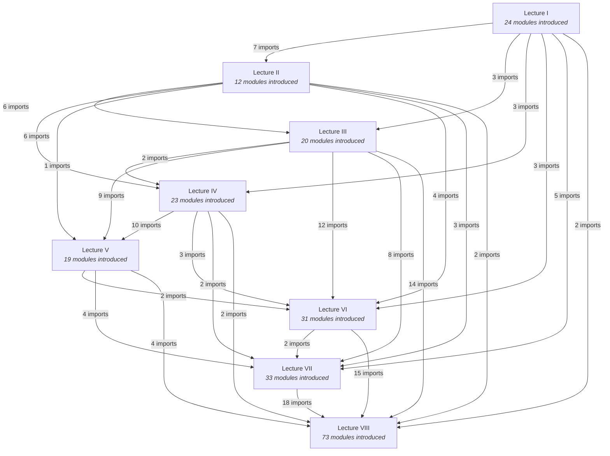
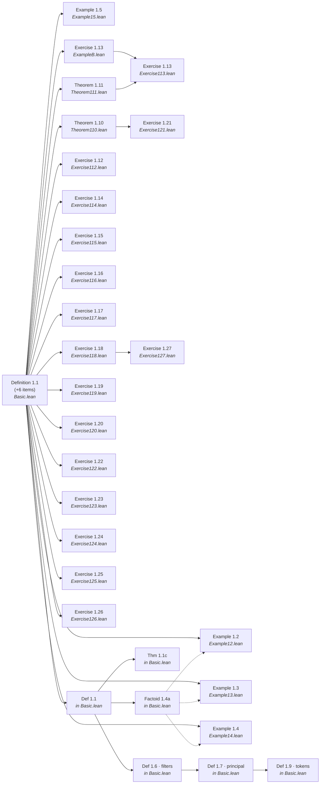
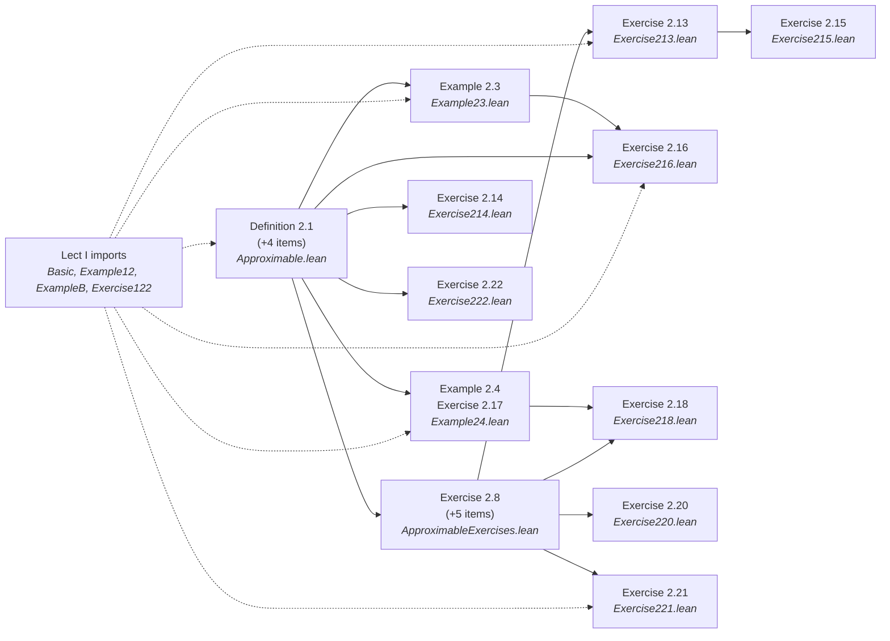
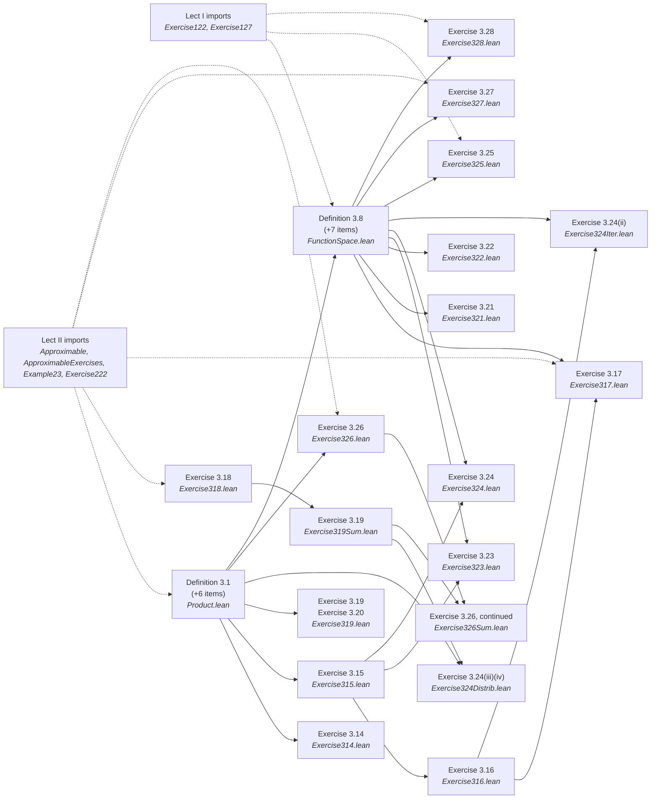
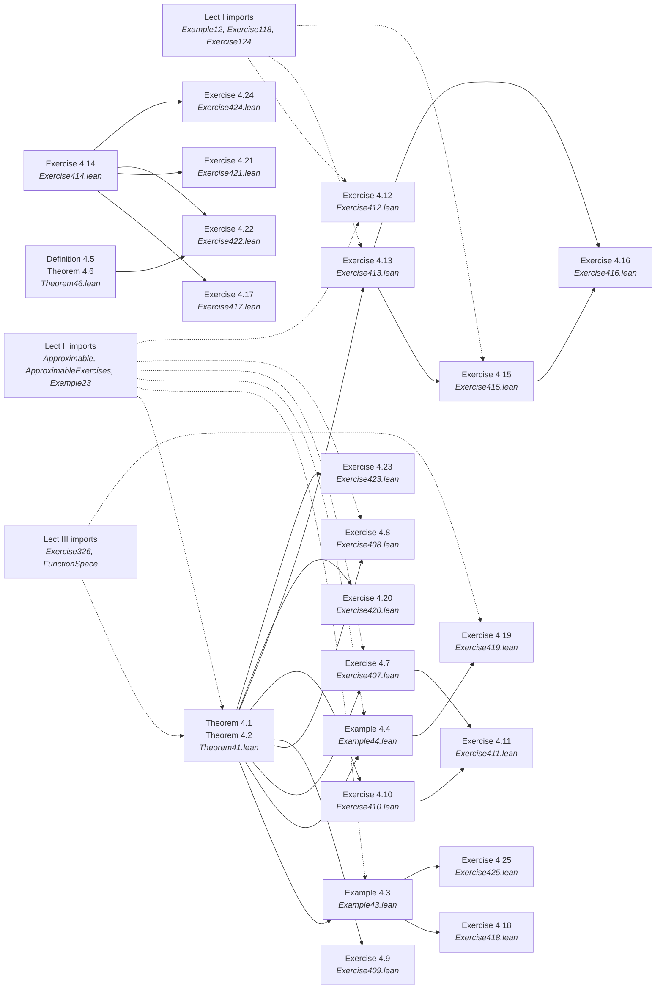
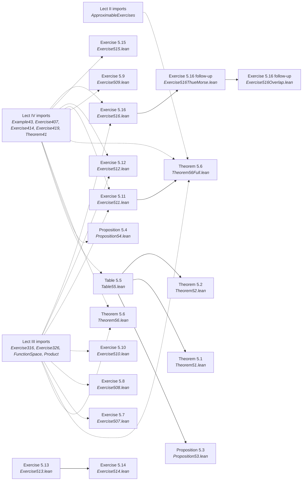
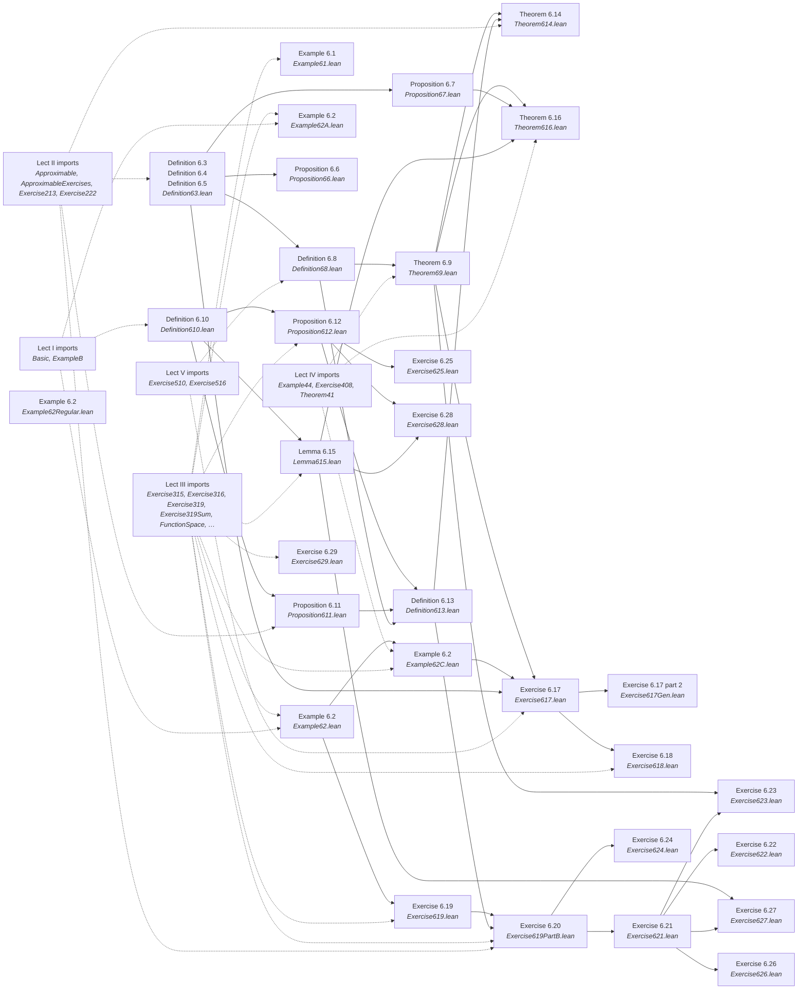
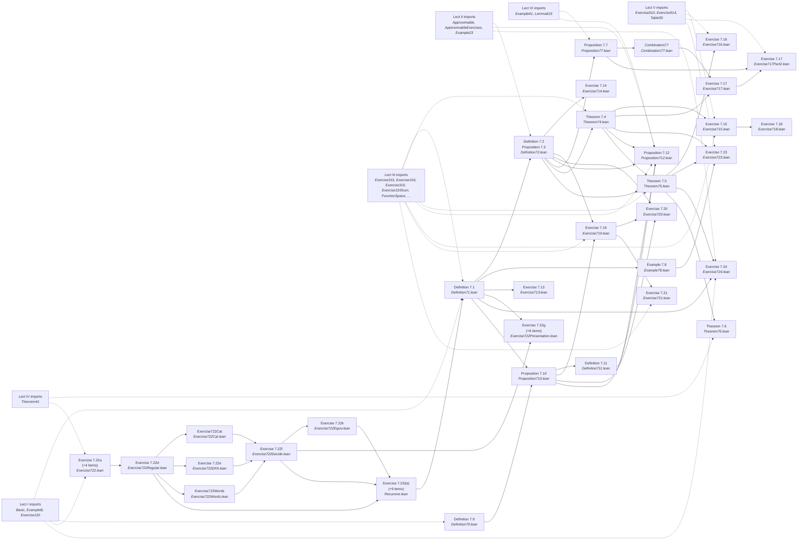
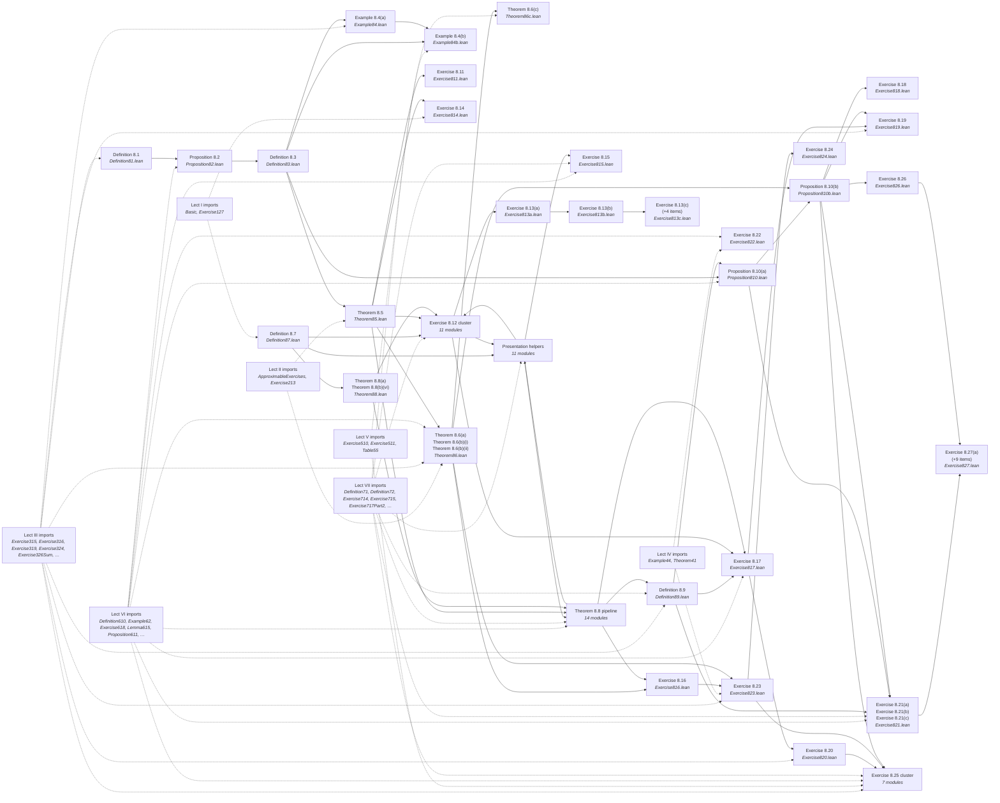

# A Lean 4 Certificate of Scott's Lectures on a Mathematical Theory of Computation (1981) generated by LLM and registered by Palomar
---

## Abstract

In November 1969, Dana Scott formulated a mathematical program to construct a non-degenerate, purely mathematical model ($D_\infty$) for Alonzo Church's untyped $\lambda$-calculus — the construction later published in *Continuous Lattices* (1972). That paper is often described as giving the first such model; this formalization does not adjudicate historical priority. Scott's 1972 framework relied on point-set topology, which remained a barrier for computer scientists seeking a practical tool for programming-language semantics.

When Scott delivered his Oxford lectures in Michaelmas Term 1980 — published May 1981 as *Lectures on a Mathematical Theory of Computation* (Technical Monograph PRG-19) — he pivoted to discrete information presented as *domains*. That presentation was intended to be more accessible without training in point-set topology and lattice theory.

This Lean 4 library formalizes the numbered definitions, theorems, examples, and exercises of PRG-19, with one documented deferral: Exercise 8.17 Part 2 (whether $\mathcal{U}+\mathcal{U}$, $\mathcal{U}\times\mathcal{U}$, or $\mathcal{U}\to\mathcal{U}$ is isomorphic to $\mathcal{U}$), which Scott himself left unresolved for the function-space case. Data constructions are kept choice-free where possible. Prop-level results may use `Classical.choice`; axiom audits record the footprint. Palomar Comparator selects the principal sourced theorem `theorem_8_8` and two new formal corollaries, `P4_embeds` and `Ssys_embeds`; their permitted footprint is `{propext, Classical.choice, Quot.sound}`.

Proofs in this note are summarized at the level of their main constructions. Short representative Lean fragments are copied from the library. The Appendix gives a short description of each library file and a link to that file in the Palomar-preserved copy of this repository.

### Palomar compared claim (first sentence of Theorem 8.8)

The principal sourced result is **only the first sentence of Theorem 8.8**: every countable neighbourhood system $\mathcal{D}$ embeds as a subdomain of $\mathcal{U}$ ($\mathcal{D}\trianglelefteq\mathcal{U}$, Lean `theorem_8_8`). Comparator additionally selects two new formal corollaries, not separately stated by Scott: specializing the theorem to Example 1.5 gives `P4_embeds`, and specializing it to Exercise 7.22's system $S$ gives `Ssys_embeds`. Scott's effective projection-pair sentence and finitary-projection correspondence are proved in the library as `theorem_8_8_b` / `theorem_8_8_c` but are **not** Comparator targets. Scott assumes from the outset that the master token set $\Delta$ is non-empty; `NeighborhoodSystem.master_nonempty` now enforces that assumption structurally. See `Challenge.lean` and `formalization.yaml`.

---

## Introduction

To make domain theory accessible, the 1980 monograph introduces three key conceptual and structural shifts:

### 1. The Information-Theoretic Ordering
In contrast to the topological open sets of 1972, the 1980 lectures treat domains strictly as partially ordered sets (posets) representing states of incomplete information. An element within a domain is framed as a "partial description" of a computation. The ordering relation ($\sqsubseteq$) is explicitly interpreted as approximation: $x \sqsubseteq y$ means $x$ contains less information than, or approximates, $y$.

### 2. Neighbourhood Systems and Finite Approximations
To bypass the complexities of continuous geometric spaces, Scott introduced **Neighbourhood Systems**. He recognized that real-world computing machines only ever interact with finite, checkable tokens of data. In this framework, an infinite computational process (such as an infinite stream or a complex recursive function) is defined as the limit of an ever-tightening sequence of these finite neighbourhoods. This shifted the underlying mathematics away from general topology and toward formal logic and order theory.

### 3. Solving Universal Recursive Domain Equations
While Scott's 1969 discovery was a specialized solution to the specific self-referential equation $D \cong [D \to D]$, the 1980 monograph provides a universal factory blueprint. Scott uses inverse limits over Directed-Complete Partial Orders (CPOs) to solve arbitrary recursive domain equations. This generalized framework allowed computer scientists to give rigorous mathematical meaning to standard recursive computer data structures, such as lists, trees, and stream types.

### Formalization Target: Consolidating "Scott Domains"
This Lean 4 artifact formalizes the mathematical objects that these 1980 lectures ultimately standardized for the computer science community, known today as **Scott Domains**. A Scott Domain is characterized as a poset that is:
1. **Directed-Complete (CPO):** Every directed subset has a least upper bound, ensuring that infinite computations have well-defined limits.
2. **$\omega$-algebraic:** Every element in the domain can be represented as the supremum of a countable set of compact (finite) elements, mirroring how infinite data is built from finite tokens.
3. **Consistently Complete:** If any two pieces of information do not outright contradict each other, they possess a join (least upper bound), allowing consistent computation streams to merge safely.

### A caveat: topology gives way to recursion-theoretic bookkeeping, not to simplicity

Scott's 1980 pivot (§1–3 above) trades point-set topology for order theory and finite tokens, and for
most of the monograph that trade genuinely simplifies the formalization: neighbourhood systems,
approximable maps, and the domain-equation solutions of Lectures I–VI are combinatorial objects with
comparatively little topological machinery behind them. But it would be a mistake to read this as "the
1980 lectures are elementary throughout." From Lecture VII onward, Scott's subject is **computability
*in* domains** — effectively given presentations, computable elements, computable maps — and this
content is intrinsically recursion theory, not topology. Mechanizing it honestly means mechanizing
recursion theory, and that turns out to be the more expensive half of this formalization by a wide
margin, for a reason specific to this project's foundational choices rather than to Scott's mathematics:

Mathlib's own recursion theory (`Nat.Primrec`, `Primrec`, `Partrec`, `ComputablePred`) is unusable here
because its correctness lemmas are proved via tactics (`grind`, `lia`, the `Nat.unpair_pair` simp set)
that route through `Classical.choice`, which would silently taint every downstream computability result
in this project with an axiom this formalization otherwise avoids (see the choice discipline below).
The practical consequence is that `Recursive.lean` — a *from-scratch*, choice-free recursion theory
(primitive-recursive `Nat.pair`/`unpair` round-trips, `Nat.sqrt` correctness, recursively-decidable
predicates and their closure lemmas, course-of-values recursion via fuel-indexed tables) — is now
**4,000+ lines**, roughly **9× the size of `Basic.lean`** (450 lines), the file containing the actual
domain-theoretic definitions (neighbourhood systems, elements, subsystems) that this whole
formalization is nominally *about*. A representative data point: Exercise 8.15's "computable elements
correspond to effectively presented domains" half needed perhaps 30–40 lines of genuine
neighbourhood-system reasoning (an intersection dichotomy, a filter-closure invariant), sitting on top
of 250+ lines encoding finite binary trees as `Nat.pair`-coded naturals and proving their evaluation is
primitive recursive — a fact any computability textbook states in one sentence, made expensive here
purely because Lean's `Nat.pair`/`Nat.unpair` are not kernel-reducible and Mathlib's off-the-shelf
apparatus is off-limits by this project's own discipline.

In short: the 1980 lectures did succeed in retiring topology as the dominant technical overhead, but
Lecture VII onward replaces it with a different overhead — recursion-theoretic encoding and
course-of-values bookkeeping — that is, in this formalization, actually the larger of the two by line
count. This is a cost of the choice-free discipline adopted below, not a property of Scott's
mathematics; a formalization willing to inherit `Classical.choice` through Mathlib's recursion theory
would find Lecture VII's exercises considerably shorter.


### Chapter inclusion hierarchy (Lean imports)

Each node is a lecture (Scott chapter) at the point its Lean modules are first introduced. An edge $A \to B$ means some module belonging to lecture $B$ has a direct `import` of a module belonging to lecture $A$ (transitive imports through intermediate lectures are *not* drawn). Edge labels count those direct import sites. This is the dependency picture relevant to splitting the monograph into separate arXiv papers.


```mermaid
flowchart TB
  %% Node = lecture where modules are newly introduced;
  %% edge A --> B = some B-module directly imports a module from A.
  L1["Lecture I<br/><i>24 modules introduced</i>"]
  L2["Lecture II<br/><i>12 modules introduced</i>"]
  L3["Lecture III<br/><i>20 modules introduced</i>"]
  L4["Lecture IV<br/><i>23 modules introduced</i>"]
  L5["Lecture V<br/><i>19 modules introduced</i>"]
  L6["Lecture VI<br/><i>31 modules introduced</i>"]
  L7["Lecture VII<br/><i>33 modules introduced</i>"]
  L8["Lecture VIII<br/><i>73 modules introduced</i>"]
  L1 -->|7 imports| L2
  L1 -->|3 imports| L3
  L1 -->|3 imports| L4
  L1 -->|3 imports| L6
  L1 -->|5 imports| L7
  L1 -->|2 imports| L8
  L2 -->|6 imports| L3
  L2 -->|6 imports| L4
  L2 -->|1 imports| L5
  L2 -->|4 imports| L6
  L2 -->|3 imports| L7
  L2 -->|2 imports| L8
  L3 -->|2 imports| L4
  L3 -->|9 imports| L5
  L3 -->|12 imports| L6
  L3 -->|8 imports| L7
  L3 -->|14 imports| L8
  L4 -->|10 imports| L5
  L4 -->|3 imports| L6
  L4 -->|2 imports| L7
  L4 -->|2 imports| L8
  L5 -->|2 imports| L6
  L5 -->|4 imports| L7
  L5 -->|4 imports| L8
  L6 -->|2 imports| L7
  L6 -->|15 imports| L8
  L7 -->|18 imports| L8
```

---

## Methodology

This section records the proof-engineering conventions of the formalization—the parts of the
development workflow that are of general academic interest, distilled from the project's internal
handoff notes.

### Source material and inventory

The primary source is Dana Scott's *Lectures on a Mathematical Theory of Computation* (Oxford,
1980; Technical Report PRG-19). OCR transcriptions live in `sources/PRG19_vision.md`; the structured
inventory of every numbered Definition, Theorem, Example, and Exercise—with formalization status and
proof notes—is maintained in this document (`arxiv.md`). Each item is keyed to Scott's original
numbering and cross-linked to its Lean module. Status values distinguish **Pass** (mechanized, builds
green, zero `sorry`). Remaining mismatches versus the monograph are documented deferrals or
expository items (Exercise 8.17 Part 2; Exercise 8.15 item 6g; pictures / “discuss” prompts),
not unfinished numbered proofs. The older **Partial** / **Not Yet** / **Deferred** legend
described an earlier inventory state.

### Neighbourhood systems as the uniform substrate

Following Scott's 1980 pivot away from point-set topology, domains are encoded uniformly as
**neighbourhood systems**: a master set Δ, a family 𝒟 of neighbourhoods (filters on Δ), and domain
elements as filters over 𝒟. Approximable maps, products, function spaces, sums, and fixed-point
combinators are built on this substrate in `Basic.lean`, `Approximable.lean`, `Product.lean`, and
`FunctionSpace.lean`. Positive systems (Exercise 1.19) and effectively given presentations
(Definition 7.1) are layered on top when Scott's exercises demand computability content.

### Custom recursion theory (Lecture VII)

For **effectively given** domains Scott requires two index relations to be *recursively decidable*:
(i) intersection equality `Xₙ ∩ Xₘ = X_k`, and (ii) consistency `∃ k. X_k ⊆ Xₙ ∩ X_m`. Rather than
mathlib's `Computable`/`ComputablePred` development—which pulls `Classical.choice` through tactics
such as `grind`, `lia`, and `Nat.unpair_pair`—we rebuilt the needed slice in `Recursive.lean`:

* `RecDecidable p := ∃ f, Nat.Primrec f ∧ ∀ n, p n ↔ f n = 1` (and the binary/ternary pair-codings
  `RecDecidable₂`, `RecDecidable₃`);
* choice-free correctness for `Nat.sqrt`, `Nat.pair`/`unpair`, and primitive-recursive `+`/`*`;
* closure lemmas (`RecDecidable.of_iff`, `.comp`, `.and`, `.or`, `.not`, bounded `∀`/`∃` via
  `bForallFn`/`bExistsFn`);
* r.e. layers `REPred`/`REPred₂` as projections of decidable relations.

**Target axiom footprint** for data constructions and core proofs: `⊆ {propext, Quot.sound}`.
`Classical.choice` is permitted only for genuinely unavoidable **Prop-level** steps (e.g. classical
case splits on membership in an arbitrary system) and is always called out in proof notes. Each
completed module is audited with `#print axioms`.

### Incremental proof development

Large exercises are decomposed into small, revert-safe sessions rather than monolithic proofs.
The inventory's granularity — how far a single numbered item is split into lettered or numbered
sub-goals before being discharged — was set by hand, session by session, rather than by a fixed
rule. Some exercises (Exercise 7.22's fifteen-plus sub-items above are the extreme case) were
deliberately drilled down into small, independently provable pieces *before* any Lean was written,
because the informal statement was large enough that a single monolithic proof attempt would have
wasted effort on a failing whole-proof search. Others were left as a single inventory row even
though the underlying Lean proof has considerable internal structure, because the statement was
small enough that further decomposition would only add bookkeeping without changing how the proof
was actually attacked. The deciding factors were pragmatic and varied by session: the size and
combinatorial shape of the informal statement, the point at which further upfront planning showed
diminishing returns, and how much compute budget seemed prudent to spend on decomposition versus a
direct proof attempt. Consequently, the depth of decomposition visible in the inventory does not
track a formal complexity metric of Scott's original exercises; it is an artefact of session-by-
session engineering judgment and should be read as such, not as a claim about which parts of
PRG-19 are intrinsically harder to formalize.


## Chronological Formalization Narrative

Below is the chronological narrative of the formalization, organized step-by-step using Dana Scott's original numbering system from the PRG-19 monograph.

### Lecture I: Domains by Neighbourhoods


```mermaid
flowchart LR
  Basic["Definition 1.1<br/>(+6 items)<br/><i>Basic.lean</i>"]
  Example12["Example 1.2<br/><i>Example12.lean</i>"]
  Example13["Example 1.3<br/><i>Example13.lean</i>"]
  Example14["Example 1.4<br/><i>Example14.lean</i>"]
  Example15["Example 1.5<br/><i>Example15.lean</i>"]
  ExampleB["Exercise 1.13<br/><i>ExampleB.lean</i>"]
  Theorem110["Theorem 1.10<br/><i>Theorem110.lean</i>"]
  Theorem111["Theorem 1.11<br/><i>Theorem111.lean</i>"]
  Exercise112["Exercise 1.12<br/><i>Exercise112.lean</i>"]
  Exercise113["Exercise 1.13<br/><i>Exercise113.lean</i>"]
  Exercise114["Exercise 1.14<br/><i>Exercise114.lean</i>"]
  Exercise115["Exercise 1.15<br/><i>Exercise115.lean</i>"]
  Exercise116["Exercise 1.16<br/><i>Exercise116.lean</i>"]
  Exercise117["Exercise 1.17<br/><i>Exercise117.lean</i>"]
  Exercise118["Exercise 1.18<br/><i>Exercise118.lean</i>"]
  Exercise119["Exercise 1.19<br/><i>Exercise119.lean</i>"]
  Exercise120["Exercise 1.20<br/><i>Exercise120.lean</i>"]
  Exercise121["Exercise 1.21<br/><i>Exercise121.lean</i>"]
  Exercise122["Exercise 1.22<br/><i>Exercise122.lean</i>"]
  Exercise123["Exercise 1.23<br/><i>Exercise123.lean</i>"]
  Exercise124["Exercise 1.24<br/><i>Exercise124.lean</i>"]
  Exercise125["Exercise 1.25<br/><i>Exercise125.lean</i>"]
  Exercise126["Exercise 1.26<br/><i>Exercise126.lean</i>"]
  Exercise127["Exercise 1.27<br/><i>Exercise127.lean</i>"]
  Basic --> Example12
  Basic --> Example13
  Basic --> Example14
  Basic --> Example15
  Basic --> ExampleB
  Basic --> Exercise112
  Basic --> Exercise114
  Basic --> Exercise115
  Basic --> Exercise116
  Basic --> Exercise117
  Basic --> Exercise118
  Basic --> Exercise119
  Basic --> Exercise120
  Basic --> Exercise122
  Basic --> Exercise123
  Basic --> Exercise124
  Basic --> Exercise125
  Basic --> Exercise126
  Basic --> Theorem110
  Basic --> Theorem111
  ExampleB --> Exercise113
  Exercise118 --> Exercise127
  Theorem110 --> Exercise121
  Theorem111 --> Exercise113
  Basic_concept_D11["Def 1.1<br/><i>in Basic.lean</i>"]
  Basic_concept_D16["Def 1.6 · filters<br/><i>in Basic.lean</i>"]
  Basic_concept_D17["Def 1.7 · principal<br/><i>in Basic.lean</i>"]
  Basic_concept_D19["Def 1.9 · tokens<br/><i>in Basic.lean</i>"]
  Basic_concept_T11c["Thm 1.1c<br/><i>in Basic.lean</i>"]
  Basic_concept_F14a["Factoid 1.4a<br/><i>in Basic.lean</i>"]
  Basic --> Basic_concept_D11
  Basic_concept_D11 --> Basic_concept_T11c
  Basic_concept_D11 --> Basic_concept_F14a
  Basic_concept_D11 --> Basic_concept_D16
  Basic_concept_D16 --> Basic_concept_D17
  Basic_concept_D17 --> Basic_concept_D19
  Basic_concept_F14a -.-> Example12
  Basic_concept_F14a -.-> Example13
  Basic_concept_F14a -.-> Example14
```


#### Definition 1.1

A neighbourhood system is a membership predicate on sets together with
Scott's master neighbourhood $\Delta$ and the two closure conditions.
Lean keeps $\Delta$ as a field (`master`) rather than hard-wiring
`Set.univ`, and records that $\Delta$ is non-empty (`master_nonempty`).
Finite intersection is the recursive convention `interUpTo`
($0\mapsto\Delta$, successor intersects the next set).

```lean
structure NeighborhoodSystem (α : Type*) where
  mem : Set α → Prop
  master : Set α
  master_nonempty : master.Nonempty
  master_mem : mem master
  inter_mem : ∀ {X Y Z : Set α}, mem X → mem Y → mem Z →
    Z ⊆ X ∩ Y → mem (X ∩ Y)
  sub_master : ∀ {X : Set α}, mem X → X ⊆ master
```

#### Factoid 1.1a

`interUpTo`, `interUpTo_zero` (`⋂_{i<0} Xᵢ = Δ`).

#### Factoid 1.1b

`interUpTo_succ` (`⋂_{i<n+1} Xᵢ = (⋂_{i<n} Xᵢ) ∩ Xₙ`).

#### Theorem 1.1c

`interUpTo_mem` (extend (ii) to finite seqs) + `consistent_iff_interUpTo_mem` (consistency ⟺ `⋂ ∈ 𝒟`); aux `Consistent`, `interUpTo_subset`.

#### Example 1.2

Scott's first worked example: `Δ = {0,1}` (`Token := Fin 2`, `master := Set.univ`),
`𝒟 = {Δ, {0}, {1}}`. We build `neighborhoodSystem : NeighborhoodSystem Token` — the only real
obligation is condition (ii), discharged by `inter_eq` (the nine pairwise intersections each reduce
to `Δ`, `{0}`, `{1}`, or `∅` via `master_inter`/`inter_master`/`Set.inter_self`/`zero_inter_one`),
the `∅` case being impossible since a witness `Z ⊆ ∅` would force `∅ ∈ 𝒟` (`not_mem_empty`).

The mathematical payoff is the **element classification** (`element_classification`): every filter
is one of exactly three — `bot = {Δ}`, `elemZero = {Δ,{0}}`, `elemOne = {Δ,{1}}`. The argument: a
filter `x` either contains `{0}` (then `up_mem`+`inter_mem` force `x = elemZero`; it cannot also
contain `{1}` since `{0} ∩ {1} = ∅ ∉ 𝒟`), or `{1}` (symmetric), or neither (then `x = bot`).
Hence `bot_is_unique_partial`: `⊥` is the sole *partial* element, with `bot_lt_elemZero`,
`bot_lt_elemOne` placing the two total elements strictly above it — exactly Scott's "there is only
one partial element". Being a concrete finite computation it leans on `Mathlib.Tactic`
(`fin_cases`/`simp`), so its footprint is the classical `[propext, Classical.choice, Quot.sound]`;
the constructive guarantee is reserved for the §1 *core* in `Basic.lean`.

#### Example 1.3

Scott's second worked example: `Δ = {0,1,2}` (`Token := Fin 3`, `master := Set.univ`),
`𝒟 = {Δ, {1,2}, {2}}` — a **linear chain** under reverse inclusion (more information =
smaller set). We build `neighborhoodSystem : NeighborhoodSystem Token`; condition (ii) is
discharged by `inter_eq` with only **three** outcomes (`Δ`, `{1,2}`, `{2}`) — every pairwise
intersection is nested, so there is no empty-intersection case (contrast Example 1.2's nine-case
analysis).

The element classification (`element_classification`) yields exactly three filters in a linear
chain: `bot = {Δ}`, `elemTwelve = {Δ,{1,2}}`, `elemTwo = {Δ,{1,2},{2}}`. The argument follows
the same "case on minimal non-master neighbourhood" pattern as 1.2: if `{2} ∈ x` then `x =
elemTwo`; else if `{1,2} ∈ x` then `x = elemTwelve`; else `x = bot`. Order lemmas
`bot_lt_elemTwelve`, `elemTwelve_lt_elemTwo`, and `elemTwo_maximal` capture Scott's narrative:
approximation proceeds in **two steps** to the total element (token `2`); tokens `0` and `1` are
not total (they appear in larger neighbourhoods but do not determine filters); the direction of
approximation is **unique** (no branching). Unlike 1.2 (one partial, two total), 1.3 has **two
partial** elements and **one total**.

#### Example 1.4

Scott's third worked example and the first with **branching**: the depth-2 binary tree
`Δ = {Λ,0,1,00,01,10,11}` (`Token := Fin 7`, with `Λ=0,…,11=6`), neighbourhoods the subtrees
`𝒟 = {Δ, left={0,00,01}, right={1,10,11}, {00},{01},{10},{11}}` — encoded as `left={1,3,4}`,
`right={2,5,6}`, and the four leaf singletons. Condition (ii) reduces to the "nested-or-disjoint"
table: of the 49 pairwise intersections, each is again a neighbourhood or `∅`. Rather than search,
`inter_eq` rewrites `X ∩ Y` to its canonical value via a complete `simp only` set of the 24
distinct intersection lemmas (both orders) plus `master_inter`/`inter_master`/`Set.inter_self`,
so the matching disjunct closes by `rfl` — deterministic and fast (the naive 49×8 `first` ladder
times out). The `∅` outcomes are inadmissible in `inter_mem` because a witness `Z ⊆ ∅` would force
`∅ ∈ 𝒟` (`not_mem_empty`).

The payoff is the **seven-filter classification** (`element_classification`): the bottom `⊥={Δ}`,
two branch partials `elemZero={Δ,left}` / `elemOne={Δ,right}`, and four total leaf filters
`elem00,…,elem11`. The proof cases on the minimal non-master neighbourhood: a leaf in `x` pins the
total filter (`mem_leafXY_imp`, using that distinct leaves and cross-branch neighbourhoods
intersect to `∅`); otherwise `left`/`right` membership gives a branch partial, else `⊥`. The order
lemmas realize the **tree with choice**: `bot_lt_elemZero/elemOne` (two incomparable partials above
`⊥`), `elemZero_lt_elem00/01`, `elemOne_lt_elem10/11` (each partial below its two leaves), and
`elemXY_maximal` for the four leaves (each leaf filter is maximal — a total element). Contrast the
prior examples: 1.2 is a fork at the bottom (one partial, two total), 1.3 a linear chain (two
partial, one total), and 1.4 a genuine tree (three partial, four total) where branching encodes
the choice in extending a partial sequence.

#### Factoid 1.4a

`NestedOrDisjoint` + `NeighborhoodSystem.ofNestedOrDisjoint`: "*nested-or-disjoint*" ⟹ neighbourhood system (the "very special circumstance" of 1.2–1.4); choice-free.

#### Example 1.5

`Δ = {0,1,2,3}` (`Token := Fin 4`) with `𝒟` = all **non-empty** subsets (`P4Mem X := X.Nonempty`,
`master := Set.univ`). Condition (ii) is immediate and choice-free: a non-empty witness `Z ⊆ X ∩ Y`
makes `X ∩ Y` non-empty (`P4_inter_mem`). **Factoid 1.5a**
(`consistent_iff_inter_nonempty`) is Scott's remark that "sets are consistent iff they have a
non-empty intersection": reusing the `Basic` `Consistent`/`interUpTo` infrastructure, a prefix is
consistent (`∃ Z, Z.Nonempty ∧ Z ⊆ ⋂`) iff `⋂_{i<n} Xᵢ` is non-empty (`→` shrinks the witness, `←`
takes the intersection as its own witness). Notably this example needs **no** `fin_cases`/`decide`
This is a constructive
contrast to the finite Examples 1.2–1.4. Palomar compares `P4_embeds : neighborhoodSystem ⊴ U`.

#### Factoid 1.5a

in 1.5: `consistent_iff_inter_nonempty` (consistent ⟺ non-empty intersection); `𝒟` is a system.

#### Factoid 1.5b

`limitFamily`, `SeqEquiv`, `limitFamily_eq_iff`: limit-family `x = {Z∈𝒟 ∣ ∃n, Xₙ⊆Z}` equal ⟺ sequences equivalent; choice-free.

#### Definition 1.6

`Element V` is Scott's filter (Def 1.6): a membership predicate `mem : Set α → Prop` with `sub`
(`x ⊆ 𝒟`), `master_mem` (`Δ ∈ x`), `inter_mem` (closed under `∩`), and `up_mem` (upward closed in
`𝒟`). Mirroring `InfoSys.Element`, the early helper `Element.ext` (membership-equality ⟹ equality,
proved by `rcases` on both structures + `funext`/`propext`, *not* `congr`) keeps the
`PartialOrder` instance (Def 1.8's approximation order `x ⊑ y ⟺ x ⊆ y`) choice-free: `le_antisymm`
is just `Element.ext fun X => ⟨h1 X, h2 X⟩`.

#### Definition 1.7

Scott's *principal filter* `↑X = {Y ∈ 𝒟 ∣ X ⊆ Y}` is `principal (hX : V.mem X) : V.Element`,
with `mem Y := V.mem Y ∧ X ⊆ Y`. The four filter laws: `sub` is the first projection;
`master_mem = ⟨V.master_mem, V.sub_master hX⟩` (this is where the new `sub_master` field earns its
keep — `X ⊆ Δ`); `inter_mem` combines `Set.subset_inter` (from `X ⊆ Y₁`, `X ⊆ Y₂`) with one use of
`V.inter_mem`, taking `X` itself as the consistency witness `X ⊆ Y₁ ∩ Y₂`; `up_mem` is `⊆`
transitivity. `mem_principal` is the membership `rfl`-unfolding.

**Factoid 1.7a (one-one + inclusion-reversing).** `principal_le_iff`:
`↑X ⊑ ↑Y ↔ Y ⊆ X` — Scott's `X ⊆ Y ⟺ ↑Y ⊑ ↑X`, the **variance flip** (smaller neighbourhood ⇒
larger principal filter ⇒ more information). `→` evaluates `⊑` at the token `X` (using `X ∈ ↑X`
since `X ⊆ X`) and reads `Y ⊆ X` off `X ∈ ↑Y`; `←` chains `Y ⊆ X ⊆ Z`. Injectivity
`principal_injective` (`↑X = ↑Y ⟹ X = Y`) feeds both `le_of_eq` directions through
`principal_le_iff` into `Set.Subset.antisymm`.

**Factoid 1.7b (density of finite elements).** `eq_iUnion_principal`:
`x.mem Z ↔ ∃ X, ∃ hX : x.mem X, (↑X).mem Z` — Scott's `x = ⋃ {↑X ∣ X ∈ x}` written as union
membership (concrete, avoiding `⋃` over a `Set (Set α)`). `→` uses `X = Z` (`Z ∈ ↑Z`); `←` is one
application of upward closure `x.up_mem` (`X ⊆ Z` with `Z ∈ 𝒟`).

#### Factoid 1.7a

"*obvious*": `X↦↑X` one-one & inclusion-**reversing** — `principal_le_iff` (`↑X⊑↑Y ⟺ Y⊆X`) + `principal_injective`.

#### Factoid 1.7b

"*also obvious*": `x = ⋃ {↑X ∣ X∈x}` for every `x∈|𝒟|` — `eq_iUnion_principal`.

#### Definition 1.8 (order)

`Element V` is Scott's filter (Def 1.6): a membership predicate `mem : Set α → Prop` with `sub`
(`x ⊆ 𝒟`), `master_mem` (`Δ ∈ x`), `inter_mem` (closed under `∩`), and `up_mem` (upward closed in
`𝒟`). Mirroring `InfoSys.Element`, the early helper `Element.ext` (membership-equality ⟹ equality,
proved by `rcases` on both structures + `funext`/`propext`, *not* `congr`) keeps the
`PartialOrder` instance (Def 1.8's approximation order `x ⊑ y ⟺ x ⊆ y`) choice-free: `le_antisymm`
is just `Element.ext fun X => ⟨h1 X, h2 X⟩`.

#### Definition 1.8 (⊥, total)

`bot := principal master_mem` (`⊥={Δ}=↑Δ`), `mem_bot` (`Y∈⊥ ⟺ Y=Δ`); `IsTotal x := ∀ y, x⊑y→y⊑x` (predicate only, existence = Ex 1.24, out of scope).

#### Factoid 1.8a

`bot_le` (`⊥⊑x` for all `x`) + `instance OrderBot Element`; constructive.

#### Factoid 1.8b

`eq_principal_of_isMin` (filter with `⊆`-minimum member `X` is `↑X`) — constructive core of "finite ⟹ principal"; the finiteness⟹min step left implicit.

#### Example 1.B

`B = {σΣ* ∣ σ∈Σ*}` (binary), generalizing 1.4 — `Str := List Bool`, `cone σ = σΣ*`, `B` via `ofNestedOrDisjoint` from prefix `cone_trichotomy`.

#### Exercise 1.B-sys

"*should be done as an exercise*": `B` is a neighbourhood system — `nestedOrDisjoint` (cones pairwise nested-or-disjoint).

#### Exercise 1.B-elt

"*an exercise here*": `σx ∈ |B|` for `x∈|B|` — `sigmaElt σ x` (witness `σ(X₁∩X₂)` is a cone); `sigmaElt σ ⊥ = σ⊥` (`sigmaElt_bot`).

#### Factoid 1.B-mono

`σ₀⊥ ⊆ σ₁⊥ ⟺ σ₀` is an initial segment of `σ₁` — `sigmaBot_le_iff` (`σ₀⊥⊑σ₁⊥ ⟺ σ₀<+:σ₁`).

#### Factoid 1.B-lim

`x = ⋃ₙ σₙ⊥` (element = limit of finite approx.) — `mem_iff_exists_sigmaBot` (union-of-`σ⊥` form; chain enumeration left to prose / choice).

#### Definition 1.9

`𝒟₀ ≅ 𝒟₁`: order-iso of `|𝒟₀|` and `|𝒟₁|` — `DomainIso := V₀.Element ≃o V₁.Element`, `Isomorphic`/`≅ᴰ := Nonempty DomainIso` with `refl`/`symm`/`trans`; `≃o` *reflects* `⊑` (`map_rel_iff`) = Scott's two-way inclusion-preservation.

```lean
def Isomorphic {α β : Type*} (V₀ : NeighborhoodSystem α) (V₁ : NeighborhoodSystem β) : Prop :=
```

#### Theorem 1.10

element-token system: `[X]={x ∣ X∈x}` (`bracket`); `tokenSystem : NeighborhoodSystem |𝒟|`; `𝒟 ≅ᴰ tokenSystem` via `tokenIso`/`isomorphic_tokenSystem` (mutually-inverse `toToken`/`ofToken`). Facts: `bracket_master` (1), `bracket_inter_nonempty_iff` (2), `bracket_inter` (3), `principal_mem_bracket` (4); one-one `bracket_injective`, preserving `bracket_subset_iff`.

```lean
theorem isomorphic_tokenSystem : V ≅ᴰ V.tokenSystem
```

#### Theorem 1.11

`|𝒟|` closed under countable `⋂` (`iInter`, no proviso) and ascending `⋃` (`iUnion`, `Monotone x`) — each again a filter; GLB `iInter_le`/`le_iInter`, LUB `le_iUnion`/`iUnion_le`; `mem_iInter`/`mem_iUnion`.

```lean
def iInter (x : ℕ → V.Element) : V.Element where
```

#### Exercise 1.12

`Δ=ℕ`, final-segment `tail n={m ∣ n≤m}`; `neighborhoodSystem` (chain via `ofNestedOrDisjoint`); finite elts `fin n=↑(tail n)` (`fin_strictMono`); unique limit/total `top` (`le_top`, `top_isTotal`, `isTotal_iff_top`); `element_eq` (every elt `fin n` or `top`, classical) (`Exercise112.lean`).

```lean
def neighborhoodSystem : NeighborhoodSystem ℕ :=
```

#### Exercise 1.13

assertions about `B` = `ExampleB.lean`; this file adds the **limit nodes**: `branch p = ⋃ₙ (p↾n)⊥` (via Thm 1.11 `iUnion`), `branch_mem_iff`, `branchSeq_le_branch`, and `branch_isTotal` (each infinite path is a total/maximal element) (`Exercise113.lean`).

```lean
def B : NeighborhoodSystem Str :=
```

#### Exercise 1.14

`Δ=ℕ`, `𝒟 =` finite non-empty subsets `∪ {Δ}`; `neighborhoodSystem` (manual `inter_mem`, not nested-or-disjoint); finite elts `fin h=↑X`; total elts = singletons `singleton_isTotal` (`↑{n}` maximal) (`Exercise114.lean`).

```lean
def neighborhoodSystem : NeighborhoodSystem ℕ where
```

#### Exercise 1.15

two infinite finite-element domains: `flat` (`{ℕ}∪{{n}}`, fully classified: `flat_classify`, `flat_atom_maximal`, `flat_no_three_chain`, `flat_no_infinite_chain`, `flat_all_finite`) and `stem` (`{ℕ,{0,1}}∪{{n}}`, `stem_three_chain`); `not_isomorphic` (3-chain transports under `≃o`) (`Exercise115.lean`).

```lean
def flat : NeighborhoodSystem ℕ :=
```

#### Exercise 1.16

`Δ=ℕ`, `𝒟 =` cofinite subsets; `|𝒟| ≅ 𝒫(ℕ)` under `⊆` — `cofiniteSystem`, `ofExcluded`/`toExcluded`, `cofiniteIso` (excluded-point set), `mem_compl_of_finite` (`⋂_{n∈F}{n}ᶜ=Fᶜ`); total elt `ofExcluded ℕ` (`ofExcluded_univ_isTotal`); second `∩`-closed `fullSystem` (`Cofinite` ns).

```lean
def cofiniteSystem : NeighborhoodSystem ℕ where
```

#### Exercise 1.17

`Δ=ℝ`, `𝒟 =` rational open intervals `∪ {Δ}`; `ratIntervalSystem` (`inter_mem'` via `Ioo_inter_Ioo`+`max`/`min`), `filterAt t={X∣t∈X}` is a filter, `filterAt_injective` (`ℝ ↪ |𝒟|`); full total-elt classification documented as out-of-scope (`RatInterval` ns).

```lean
def ratIntervalSystem : NeighborhoodSystem ℝ where
```

#### Exercise 1.18

consistent `C⊆𝒟` (`FinitelyConsistent`); pairwise-but-not-jointly `triSys`/`family` (`family_pairwise_nonempty`, `not_finitelyConsistent`); `leastFilter` `⊇C` (`subset_leastFilter`/`leastFilter_le`, via `interUpTo_appendSeq`); `sInf` of a non-empty family of filters is a filter (`sInf_le`/`le_sInf`) (`Exercise118.lean`).

```lean
def FinitelyConsistent (C : Set (Set α)) : Prop :=
  ∀ (n : ℕ) (X : ℕ → Set α), (∀ i, i < n → X i ∈ C) → V.Consistent X n
```

#### Exercise 1.19

*positive* nbhd system (ii′: `X∩Y≠∅ ⟺ X∩Y∈𝒟`) — `IsPositive`, `ofPositive` (positive ⟹ system, in `Basic.lean`); positive `positiveExample`; non-positive `notPositiveSystem` (`{Δ,{0,1},{1,2}}`, intersection `{1}∉𝒟`; smaller than Hoare's `ℕ×ℕ`) `not_isPositive` (`Exercise119.lean`).

```lean
def positiveExample : NeighborhoodSystem (Fin 2) :=
```

#### Exercise 1.20

`Δ'=𝒟`, `𝒟'={↑X}` with `↑X={Y∈𝒟 ∣ Y⊆X}` (`upSet`, ≠ `principal`); `powerSystem`, `powerSystem_isPositive`; `|𝒟|≅|𝒟'|` via `toPower`/`ofPower`/`powerIso`, `isomorphic_powerSystem`; tokens ↔ finite elements one-one (`toPower_principal`).

```lean
def upSet (X : Set α) : Set (Set α)
```

#### Exercise 1.21

(detail Thm 1.10) `{[X]}` over `|𝒟|` is *positive* (`tokenSystem_isPositive`) and *complete* (`IsComplete`, `tokenSystem_complete`: every filter fixed by a unique point `ofToken y`; `tokenSystem_toToken_bijective`); consistency `{Xᵢ∣i<n}` ⟺ `⋂_{i<n}[Xᵢ]≠∅` (`consistent_iff_iInter_bracket_nonempty`).

```lean
theorem tokenSystem_isPositive : V.tokenSystem.IsPositive
```

#### Exercise 1.22

(for topologists) the `[X]` topologize `|𝒟|`; open sets `=` (i) `⊑`-upper `∧` (ii) basic-nbhd; `⊑` `=` specialization order — `basicOpen`, `instTopologicalSpaceElement`, `isOpen_basicOpen`, `isOpen_iff_upper_basic`, `le_iff_isOpen_imp`, `specializes_iff_le`.

#### Exercise 1.23

countable system (`enum`/`henum`/`hsurj`) + `[DecidablePred V.mem]` ⟹ greedy sequence `Yₙ`/`acc` gives a **total** element: `greedyElement`, `greedyElement_isTotal` (choice-free, `Y_prefix_consistent`); every filter is sequence-determined `filters_sequence_determined` (classical) (`Exercise123.lean`).

```lean
def acc (n : ℕ) : Set α
```

#### Exercise 1.24

(set theorists) the union of a non-empty **chain** of filters is a filter — `chainUnion` (`inter_mem` via `IsChain.total`), `le_chainUnion`; **with Zorn** every element extends to a total one `exists_total_ge` (`zorn_le_nonempty_Ici₀`, `IsMax = IsTotal`) — **classical** (`Exercise124.lean`).

```lean
def chainUnion (C : Set V.Element) (hne : C.Nonempty) (hchain : IsChain (· ≤ ·) C) : V.Element where
```

#### Exercise 1.25

(set theorists) `Δ` linearly+well-ordered, `𝒟 =` non-empty upper sets (`finalSegmentSystem`); `|𝒟| ≅ {non-empty lower sets}` under `⊆` — `finalSegmentClassify` (`lowerSetOf`/`ofLowerSet`); top element `topElement` is the unique total element (`topElement_isTotal`, `eq_topElement_of_isTotal`); with no maximum it is *not* finite/principal (`topElement_not_principal_of_noMax`).

```lean
def finalSegmentSystem (Δ : Type*) [LinearOrder Δ] [Nonempty Δ] : NeighborhoodSystem Δ :=
```

#### Exercise 1.26

(algebraists) commutative ring `A` (`[DecidableEq A]`), `Δ =` finite `F⊆A`, `I(F)={G ∣ F⊆⟨G⟩}` (`IFamily`, `IFamily_inter`); `ringSystem`; `|𝒟| ≅` ideals of `A` under `⊆` — `ringIso` (`idealOf`/`ofIdeal` mutually inverse).

```lean
def IFamily (F : Finset A) : Set (Finset A)
```

#### Exercise 1.27

*bounded* `X⊆|𝒟|` (`Bounded`, `sSup` = `sInf` of `upperBounds`, `le_sSup`/`sSup_le`); `{U,W}` consistent in `𝒟` ⟺ `{↑U,↑W}` bounded `consistent_pair_iff_bounded` (choice-free); `X` bounded ⟺ every finite subset bounded `bounded_iff_finite_bounded` (uses 1.18).

```lean
def Bounded (X : Set V.Element) : Prop
```

---

### Lecture II: Approximable Mappings


```mermaid
flowchart LR
  L1core["Lect I imports<br/><i>Basic, Example12, ExampleB, Exercise122</i>"]
  Approximable["Definition 2.1<br/>(+4 items)<br/><i>Approximable.lean</i>"]
  ApproximableExercises["Exercise 2.8<br/>(+5 items)<br/><i>ApproximableExercises.lean</i>"]
  Example23["Example 2.3<br/><i>Example23.lean</i>"]
  Example24["Example 2.4<br/>Exercise 2.17<br/><i>Example24.lean</i>"]
  Exercise213["Exercise 2.13<br/><i>Exercise213.lean</i>"]
  Exercise214["Exercise 2.14<br/><i>Exercise214.lean</i>"]
  Exercise215["Exercise 2.15<br/><i>Exercise215.lean</i>"]
  Exercise216["Exercise 2.16<br/><i>Exercise216.lean</i>"]
  Exercise218["Exercise 2.18<br/><i>Exercise218.lean</i>"]
  Exercise220["Exercise 2.20<br/><i>Exercise220.lean</i>"]
  Exercise221["Exercise 2.21<br/><i>Exercise221.lean</i>"]
  Exercise222["Exercise 2.22<br/><i>Exercise222.lean</i>"]
  L1core -.-> Approximable
  L1core -.-> Example23
  L1core -.-> Example24
  L1core -.-> Exercise213
  L1core -.-> Exercise216
  L1core -.-> Exercise221
  Approximable --> ApproximableExercises
  Approximable --> Example23
  Approximable --> Example24
  Approximable --> Exercise214
  Approximable --> Exercise216
  Approximable --> Exercise222
  ApproximableExercises --> Exercise213
  ApproximableExercises --> Exercise218
  ApproximableExercises --> Exercise220
  ApproximableExercises --> Exercise221
  Example23 --> Exercise216
  Example24 --> Exercise218
  Exercise213 --> Exercise215
```


#### Definition 2.1

`ApproximableMap`: relation `rel⊆𝒟₀×𝒟₁` (`rel_dom`/`rel_cod`) with (i) `master_rel`, (ii) `inter_right`, (iii) `mono`; relation-extensionality `ext` (`Approximable.lean`).

```lean
structure ApproximableMap (V₀ : NeighborhoodSystem α) (V₁ : NeighborhoodSystem β) where
  rel : Set α → Set β → Prop
  rel_dom : ∀ {X Y}, rel X Y → V₀.mem X
  rel_cod : ∀ {X Y}, rel X Y → V₁.mem Y
  master_rel : rel V₀.master V₁.master
  inter_right : ∀ {X Y Y'}, rel X Y → rel X Y' → rel X (Y ∩ Y')
```

#### Proposition 2.2

`toElementMap` (`f(x)={Y∣∃X∈x, X f Y}`, all of 2.1 used), `mem_toElementMap`, `rel_iff_mem_principal` (`X f Y ⟺ Y∈f(↑X)`), `toElementMap_mono`, `ext_of_toElementMap` (2.2(iv)) (`Approximable.lean`).

```lean
def toElementMap (f : ApproximableMap V₀ V₁) (x : V₀.Element) : V₁.Element where
```

#### Example 2.3

`parityMap : B → T`: parity of 0's before first 1 via scanner `scan`/`valElt` (`scan_append` stability ⟹ `mono`); `T`=two-token domain of Ex 1.2 (`Example23.lean`).

```lean
def scan : Str → Option Bool
```

#### Example 2.4

`runMap : B → B`: eliminate first run of 1's via state machine `out`/`del`; `out_mono` (prefix-monotone) ⟹ `mono`; total `1`<sup>∞</sup> → partial `⊥` (`Example24.lean`, choice-free).

```lean
def out : Str → Str
```

#### Theorem 2.5

category of nbhd systems + approximable maps: identity `idMap` (`X I_D Y ⟺ X⊆Y`), composition `comp g f` (`X g∘f Z ⟺ ∃Y, X f Y ∧ Y g Z`), laws `idMap_comp`/`comp_idMap`/`comp_assoc` (`Approximable.lean`).

```lean
def idMap (V : NeighborhoodSystem α) : ApproximableMap V V where
```

#### Proposition 2.6

elementwise functor: `toElementMap_idMap` (`I_D(x)=x`), `toElementMap_comp` (`(g∘f)(x)=g(f(x))`) — concrete category of sets & functions (`Approximable.lean`).

```lean
theorem toElementMap_comp (g : ApproximableMap V₁ V₂) (f : ApproximableMap V₀ V₁) (x : V₀.Element) :
```

#### Theorem 2.7

every domain iso `e:|𝒟₀|≃o|𝒟₁|` comes from an approximable map `ofIso e` (`toElementMap_ofIso`: `(ofIso e)(x)=e(x)`; `exists_approximable_of_iso`); finite→finite `exists_principal_eq_apply_principal` via directed union `sSupDirected` (choice-free).

```lean
theorem toElementMap_ofIso (e : V₀.Element ≃o V₁.Element) (x : V₀.Element) :
```

#### Exercise 2.8

determined by finite elements `eq_of_toElementMap_principal`; any monotone fn on finite elements extends: `ofMono`, `toElementMap_ofMono_principal` (`ApproximableExercises.lean`).

```lean
theorem eq_of_toElementMap_principal {f g : ApproximableMap V₀ V₁}
    (h : ∀ (X : Set α) (hX : V₀.mem X),
```

#### Exercise 2.9

approximable `f` satisfies `f(x)=⋃{f(↑X)∣X∈x}` — `toElementMap_mem_iff_principal` (`ApproximableExercises.lean`).

```lean
theorem toElementMap_mem_iff_principal (f : ApproximableMap V₀ V₁) (x : V₀.Element) {Y : Set β} :
```

#### Exercise 2.10

Prop 2.6 (done in `Approximable.lean`); pointwise **meet** `h(x)=f(x)∩g(x)` — `interMap`, `mem_toElementMap_interMap` (`ApproximableExercises.lean`).

```lean
def interMap (f g : ApproximableMap V₀ V₁) : ApproximableMap V₀ V₁ where
```

#### Exercise 2.11

directed `a:I→|D|` ⟹ `⋃ᵢ a(i)` is a filter (`iSupDirected`, `mem`/`le`/`le_`); approximable maps preserve directed `⋃` — `toElementMap_iSupDirected`.

```lean
def iSupDirected {α : Type*} {V : NeighborhoodSystem α} {I : Type*} [Nonempty I]
    (a : I → V.Element) (hdir : ∀ i j, ∃ k, a i ≤ a k ∧ a j ≤ a k) : V.Element :=
```

#### Exercise 2.12

directed family `{fᵢ}` of approximable maps: pointwise union `⋃ᵢ fᵢ` approximable — `iSupMap`, `mem_toElementMap_iSupMap` (`ApproximableExercises.lean`).

```lean
def iSupMap {I : Type*} [Nonempty I] (f : I → ApproximableMap V₀ V₁)
    (hdir : ∀ i j, ∃ k, (∀ X Y, (f i).rel X Y → (f k).rel X Y) ∧
      (∀ X Y, (f j).rel X Y → (f k).rel X Y)) : ApproximableMap V₀ V₁ where
```

#### Exercise 2.13

(topologists) approximable maps = continuous maps between the `|D|` spaces of Ex 1.22 — `continuous_toElementMap`, `ofContinuous`, `toElementMap_ofContinuous`, `mem_iff_principal_of_continuous` (choice-free).

```lean
theorem continuous_toElementMap (f : ApproximableMap V₀ V₁) :
```

#### Exercise 2.14

domain iso `e` and nbhd correspondence `φ` from Thm 2.7; `phi`/`phi_spec`, `rel_ofIso_iff` (`(ofIso e).rel X Y ⟺ φX⊆Y`), `phi_inter` (`φ(X∩X')=φX∩φX'` for consistent `X,X'`) (`Exercise214.lean`).

```lean
theorem phi_spec (e : V₀.Element ≃o V₁.Element) {X : Set α} (hX : V₀.mem X) :
```

#### Exercise 2.15

The one-token system `O` (master `{*}`, neighbourhoods `{∅?,{*}}`) is Scott's Sierpiński domain: its
two elements are `⊥ ⊏ ⊤`. Building on Ex 2.13, open subsets of `|𝒟|` correspond bijectively to
approximable maps `𝒟 → O`: `openToMap`/`mapToOpen` are mutually inverse, packaged as the equivalence
`openSet_equiv_map`. The bijection uses choice (`equivSetNat`-style classical packaging of the open ↔
characteristic-map data), so the footprint is `[propext, Classical.choice, Quot.sound]`.

```lean
def O : NeighborhoodSystem (Fin 1) :=
```

#### Exercise 2.16

`x↦σx` on `|B|` **is** approximable; the parity map `f:B→T` of Ex 2.3 is **uniquely** determined among approximable maps by `f(1x)=true`, `f(01x)=false`, `f(00x)=f(x)`.

*First half:* `sigmaMap σ : ApproximableMap B B`, `toElementMap_sigmaMap` (`(sigmaMap σ)(x) = σx = sigmaElt σ x`).

```lean
theorem toElementMap_sigmaMap (σ : Str) (x : B.Element) :
```

#### Exercise 2.17

`g:B→B` of Ex 2.4 **is** approximable (`runMap`); `runMap` is **uniquely** determined among approximable maps by `g(0x)=0g(x)`, `g(11x)=g(1x)`, `g(10x)=0x`, `g(1)=⊥` — no equation is missing.

*First half:* `runMap:ApproximableMap B B`, relation `X g Y ↔ ∃σ,X=σΣ*∧Y∈B∧(outσ)Σ*⊆Y`. *Second half (uniqueness):* `SatisfiesRunEquations` packages Scott's four equations (the last, `g(1)=⊥`, is a *value* equation at `x=⊥` only, not quantified over `x`); `runMap_satisfies` confirms `runMap` itself meets them via two "shift formulas" — `runMap_toElementMap_sigmaElt` (input-side: `g(σx)` depends on `x` only through some cone `coneτ∈x`, at `out(σ++τ)`)

```lean
def runMap : ApproximableMap B B where
```

#### Exercise 2.18

"spacing" map `h:B→B` (`b↦b0`) and left inverse `k`; `hMap`/`kMap`, `kMap_comp_hMap` (`k∘h=I_B`), `kMap_not_injective`, `hMap_not_surjective` (`h` not an iso) (`Exercise218.lean`, choice-free).

```lean
def hMap : ApproximableMap B B where
```

#### Exercise 2.19

two-variable approximable maps `f:𝒟₀×𝒟₁→𝒟₂` as ternary relations — `ApproximableMap₂`, `toElementMap₂`, `rel₂_iff_mem_principal`, `toElementMap₂_mono` (`ApproximableExercises.lean`).

```lean
theorem mem_iSupDirected {α : Type*} {V : NeighborhoodSystem α} {I : Type*} [Nonempty I]
    (a : I → V.Element) (hdir : ∀ i j, ∃ k, a i ≤ a k ∧ a j ≤ a k) {Z : Set α} :
```

#### Exercise 2.20

powerset domain `𝒫` (cofinite nbhds over `ℕ`); `equivSetNat` (`|𝒫|≃o Set ℕ`); `unionMap`/`interMap₂` (`∪`,`∩` via Ex 2.19), `succMap`/`predMap` (`x±1`).

```lean
def equivSetNat : powerSet.Element ≃o Set ℕ where
```

#### Exercise 2.21

system `C ⊇ B` with finite *and* infinite total sequences (terminator singletons `{σ}`); `isTotal_singletonElt`, `bot_lt_Lambda` (`⊥⊏Λ`); juxtaposition `juxtapose : C×C→C` with `juxtapose_cone` (left bias) / `juxtapose_singleton_mem` (`Exercise221.lean`, choice-free).

```lean
theorem isTotal_singletonElt (σ : Str) : C.IsTotal (singletonElt σ)
```

#### Exercise 2.22

(set theorists) any family `C` closed under non-empty `⋂` + directed `⋃` is inclusion-iso to a domain — closure `Cl`, `reprSystem` (nbhds `C(F)={G∣F⊆Ḡ}`), `reprIso : |reprSystem| ≃o C` (classical).

```lean
def Cl (F : Set τ) : Set τ
```

---

### Lecture III: Domain Constructs


```mermaid
flowchart LR
  L1core["Lect I imports<br/><i>Exercise122, Exercise127</i>"]
  L2core["Lect II imports<br/><i>Approximable, ApproximableExercises, Example23, Exercise222</i>"]
  Product["Definition 3.1<br/>(+6 items)<br/><i>Product.lean</i>"]
  FunctionSpace["Definition 3.8<br/>(+7 items)<br/><i>FunctionSpace.lean</i>"]
  Exercise314["Exercise 3.14<br/><i>Exercise314.lean</i>"]
  Exercise315["Exercise 3.15<br/><i>Exercise315.lean</i>"]
  Exercise318["Exercise 3.18<br/><i>Exercise318.lean</i>"]
  Exercise319["Exercise 3.19<br/>Exercise 3.20<br/><i>Exercise319.lean</i>"]
  Exercise319Sum["Exercise 3.19<br/><i>Exercise319Sum.lean</i>"]
  Exercise321["Exercise 3.21<br/><i>Exercise321.lean</i>"]
  Exercise322["Exercise 3.22<br/><i>Exercise322.lean</i>"]
  Exercise323["Exercise 3.23<br/><i>Exercise323.lean</i>"]
  Exercise324["Exercise 3.24<br/><i>Exercise324.lean</i>"]
  Exercise316["Exercise 3.16<br/><i>Exercise316.lean</i>"]
  Exercise317["Exercise 3.17<br/><i>Exercise317.lean</i>"]
  Exercise324Iter["Exercise 3.24(ii)<br/><i>Exercise324Iter.lean</i>"]
  Exercise324Distrib["Exercise 3.24(iii)(iv)<br/><i>Exercise324Distrib.lean</i>"]
  Exercise325["Exercise 3.25<br/><i>Exercise325.lean</i>"]
  Exercise327["Exercise 3.27<br/><i>Exercise327.lean</i>"]
  Exercise326["Exercise 3.26<br/><i>Exercise326.lean</i>"]
  Exercise326Sum["Exercise 3.26, continued<br/><i>Exercise326Sum.lean</i>"]
  Exercise328["Exercise 3.28<br/><i>Exercise328.lean</i>"]
  L1core -.-> FunctionSpace
  L1core -.-> Exercise325
  L1core -.-> Exercise328
  L2core -.-> Product
  L2core -.-> Exercise318
  L2core -.-> Exercise317
  L2core -.-> Exercise327
  L2core -.-> Exercise326
  Exercise315 --> Exercise316
  Exercise315 --> Exercise323
  Exercise315 --> Exercise324
  Exercise316 --> Exercise317
  Exercise316 --> Exercise324Iter
  Exercise318 --> Exercise319Sum
  Exercise319Sum --> Exercise324Distrib
  Exercise319Sum --> Exercise326Sum
  Exercise326 --> Exercise326Sum
  FunctionSpace --> Exercise317
  FunctionSpace --> Exercise321
  FunctionSpace --> Exercise322
  FunctionSpace --> Exercise323
  FunctionSpace --> Exercise324
  FunctionSpace --> Exercise324Iter
  FunctionSpace --> Exercise325
  FunctionSpace --> Exercise327
  FunctionSpace --> Exercise328
  Product --> Exercise314
  Product --> Exercise315
  Product --> Exercise319
  Product --> Exercise324Distrib
  Product --> Exercise326
  Product --> FunctionSpace
```


#### Definition 3.1

`prod`, `prodNbhd` (`Sum.inl '' X ∪ Sum.inr '' Y`), element pairing `pair`, `Element.fst/snd` (`Product.lean`).

```lean
def prod (V₀ : NeighborhoodSystem α) (V₁ : NeighborhoodSystem β) : NeighborhoodSystem (α ⊕ β) where
```

#### Proposition 3.2

`prod` is a nbhd system; `prodEquiv : |𝒟₀×𝒟₁|≃o|𝒟₀|×|𝒟₁|`; `pair_le_pair_iff`.

```lean
def prod (V₀ : NeighborhoodSystem α) (V₁ : NeighborhoodSystem β) : NeighborhoodSystem (α ⊕ β) where
```

#### Definition 3.3

projections `proj₀`, `proj₁`; paired map `paired`; multivariate via `prod` (`Product.lean`).

```lean
def paired (f : ApproximableMap V₂ V₀) (g : ApproximableMap V₂ V₁) :
```

#### Proposition 3.4

`proj₀/proj₁/paired` approximable; `proj_comp_paired`; `toElementMap_paired_apply` (`⟨f,g⟩(w)=⟨f(w),g(w)⟩`) (`Product.lean`).

```lean
theorem prodNbhd_inter (X X' : Set α) (Y Y' : Set β) :
```

#### Theorem 3.5

`toMap₂`/`ofMap₂`/`map₂Equiv`: `ApproximableMap (prod V₀ V₁) V₂ ≃ ApproximableMap₂ V₀ V₁ V₂` (joint ⟺ separate) (`Product.lean`).

```lean
theorem prodNbhd_inter (X X' : Set α) (Y Y' : Set β) :
```

#### Lemma 3.6

constant map `constMap`; `toElementMap_constMap` (`Product.lean`).

```lean
def constMap (V₀ : NeighborhoodSystem α) (b : V₁.Element) : ApproximableMap V₀ V₁ where
```

#### Proposition 3.7

`substitution_toElementMap`: multivariate functions closed under substitution (`Product.lean`).

```lean
theorem substitution_toElementMap (F : ApproximableMap (prod V₀ V₁) V₂)
    (a : ApproximableMap V₃ V₀) (b : ApproximableMap V₃ V₁) (w : V₃.Element) :
```

#### Definition 3.8

`step` (`[X,Y]={f∣X f Y}`), `stepFun`, `funSpace`; algebra `step_inter_right`/`step_subset`/`step_master_eq`/`step_mem` (`FunctionSpace.lean`).

```lean
def step (X : Set α) (Y : Set β) : Set (ApproximableMap V₀ V₁)
```

#### Proposition 3.9

`interYs`, `leastMap` (cond. (ii) `X f₀ Y ⟺ ⋂{Yᵢ∣X⊆Xᵢ}⊆Y`), `leastMap_mem_stepFun`, `leastMap_le` (minimal element), `stepFun_subset_step_iff` (remark after 3.9) (`FunctionSpace.lean`).

```lean
def interYs (m : Set β) : List (Set α × Set β) → Set α → Set β
```

#### Theorem 3.10

`funSpaceEquiv : |𝒟₀→𝒟₁|≃o ApproximableMap V₀ V₁` (`toApproxMap`/`toFilter`); completeness, inclusion-preserving.

```lean
def toApproxMap (φ : (funSpace V₀ V₁).Element) : ApproximableMap V₀ V₁ where
```

#### Theorem 3.11

`eval : ApproximableMap₂ (funSpace V₁ V₂) V₁ V₂`, `evalMap`; `evalMap_apply` (`eval(f,x)=f(x)`) (`FunctionSpace.lean`).

```lean
def evalMap (V₁ : NeighborhoodSystem β) (V₂ : NeighborhoodSystem γ) :
```

#### Theorem 3.12

`curry`, `uncurry`; `toElementMap_curry_apply`; `uncurry_curry`/`curry_uncurry`; `eval_comp_curry`/`curry_eval_comp`; `curryEquiv` (adjunction) (`FunctionSpace.lean`).

```lean
def curry (g : ApproximableMap (prod V₀ V₁) V₂) : ApproximableMap V₀ (funSpace V₁ V₂) where
```

#### Theorem 3.13(i)

`le_iff_toElementMap_le` (`f⊑g ⟺ ∀x, f(x)⊑g(x)`) (`FunctionSpace.lean`).

```lean
theorem le_iff_toElementMap_le {f g : ApproximableMap V₀ V₁} :
```

#### Theorem 3.13(ii)

`mapsBounded_iff_pointwiseBounded` (`F` bounded ⟺ `{f(x)}` bounded ∀`x`) (`FunctionSpace.lean`).

```lean
theorem mapsBounded_iff_pointwiseBounded {F : Set (ApproximableMap V₀ V₁)} :
```

#### Theorem 3.13(iii)

`sSupMaps` + `toElementMap_sSupMaps` (`(⊔F)(x) = ⊔{f(x)}`) (`FunctionSpace.lean`).

```lean
def sSupMaps (F : Set (ApproximableMap V₀ V₁)) (hF : PointwiseBounded F) : ApproximableMap V₀ V₁ :=
```

#### Exercise 3.14

tagged product `0Δ₀∪1Δ₁` (disjointness unnecessary); `diag:D→D×D`; `n`-fold products.

```lean
theorem proj₀_comp_diag : (proj₀ V V).comp (diag V) = idMap V :=
```

#### Exercise 3.15

product isomorphisms: commutativity, associativity, empty product, functoriality.

```lean
theorem prod_comm_isomorphic : prod V₀ V₁ ≅ᴰ prod V₁ V₀
```

#### Exercise 3.16

`𝒟`<sup>∞</sup> over `Δ`<sup>∞</sup>; 𝒟<sup>∞</sup>≅𝒟×𝒟<sup>∞</sup>; elements = infinite sequences of `|𝒟|` elements.

```lean
theorem fiber_mono {W W' : Set (ℕ × α)} (h : W ⊆ W') (i : ℕ) : fiber W i ⊆ fiber W' i :=
```

#### Exercise 3.17

B→T<sup>∞</sup> and T<sup>∞</sup>→B approximable; section/retraction; iso questions.

```lean
theorem bitNbhd_mem (b : Bool) : T.mem (bitNbhd b)
```

#### Exercise 3.18

*sum* system `𝒟₀+𝒟₁`; injections `inᵢ`, projections `outᵢ`; `outᵢ∘inᵢ=I`; `n`-term sums.

```lean
theorem inj₀_inter (X X' : Set α) :
```

#### Exercise 3.19

functorial `f×g` and `f+g` on products/sums; `f×g=⟨f∘p₀,g∘p₁⟩`; `outᵢ∘(f+g)∘inᵢ=f/g`.

```lean
theorem toElementMap_prodMap (f : ApproximableMap V₀ V₀') (g : ApproximableMap V₁ V₁')
    (w : (prod V₀ V₁).Element) :
```

#### Exercise 3.20

(category theorists) `+` and `×` are functors; `×` is the categorical product.

```lean
theorem toElementMap_prodMap (f : ApproximableMap V₀ V₀') (g : ApproximableMap V₁ V₁')
    (w : (prod V₀ V₁).Element) :
```

#### Exercise 3.21

`[Y,Z]` in `(D₁→D₂)` uniquely determines `Y,Z` when `Z≠Δ₂`; edge case `Z=Δ₂`.

```lean
theorem interYs_single_subset_eq {YX : Set α} {Z : Set β} {X : Set α} (hZ : V₁.mem Z)
```

#### Exercise 3.22

composition `comp:(D₁→D₂)×(D₀→D₁)→(D₀→D₂)` approximable; `comp(g,f)=g∘f`; from `eval`+`curry`.

```lean
theorem toElementMap_compApp (Gφ : (funSpace V₁ V₂).Element) (Fφ : (funSpace V₀ V₁).Element)
    (x : V₀.Element) :
```

#### Exercise 3.23

(category theorists) domains + approximable maps form a cartesian closed category (3.11, 3.12).

```lean
theorem toUnit_unique (f : ApproximableMap V unitSys) : f = toUnit V
```

#### Exercise 3.24

more function-space isos: (i) `(D₀→D₁×D₂)≅(D₀→D₁)×(D₀→D₂)`, (ii) (D₀→D₁<sup>∞</sup>)≅(D₀→D₁)<sup>∞</sup>; (iii)(iv) as canonical mapping relationships (separated-sum bottom obstructs iso).

```lean
theorem funProd_isomorphic :
```

#### Exercise 3.25

(topologists) open subsets of `|D|` form a domain (uses 3.10, Exercises 1.21 & 2.13).

```lean
theorem mapOfOpen_rel_empty (U : Set V.Element) (X : Set α) :
```

#### Exercise 3.26

conditional `cond:T×D×D→D` (`cond(true,x,y)=x`, etc.); sum variant `condSum:T×D₀×D₁→D₀+D₁`; `which:D₀+D₁→T` with `cond(which x,in₀ out₀ x,in₁ out₁ x)=x`.

```lean
theorem zero_ne_one : (Example12.zero : Set Example12.Token) ≠ Example12.one
```

#### Exercise 3.27

(set theorists) alt proof `(D₀→D₁)` is a domain via Ex 2.22; compare with 3.9/3.10.

```lean
theorem graph_injective : Function.Injective (graph (V₀
```

#### Exercise 3.28

minimal element of `⋂[Xᵢ,Yᵢ]` in function space: `f₀(x)=⊔{↑Yᵢ∣x∈[Xᵢ]}`.

```lean
theorem Element.mem_interYs_of (z : V₁.Element) {L : List (Set α × Set β)} {X : Set α}
```

---

### Lecture IV: Fixed Points and Recursion


```mermaid
flowchart LR
  L1core["Lect I imports<br/><i>Example12, Exercise118, Exercise124</i>"]
  L2core["Lect II imports<br/><i>Approximable, ApproximableExercises, Example23</i>"]
  L3core["Lect III imports<br/><i>Exercise326, FunctionSpace</i>"]
  Theorem41["Theorem 4.1<br/>Theorem 4.2<br/><i>Theorem41.lean</i>"]
  Example43["Example 4.3<br/><i>Example43.lean</i>"]
  Example44["Example 4.4<br/><i>Example44.lean</i>"]
  Theorem46["Definition 4.5<br/>Theorem 4.6<br/><i>Theorem46.lean</i>"]
  Exercise407["Exercise 4.7<br/><i>Exercise407.lean</i>"]
  Exercise408["Exercise 4.8<br/><i>Exercise408.lean</i>"]
  Exercise409["Exercise 4.9<br/><i>Exercise409.lean</i>"]
  Exercise410["Exercise 4.10<br/><i>Exercise410.lean</i>"]
  Exercise411["Exercise 4.11<br/><i>Exercise411.lean</i>"]
  Exercise412["Exercise 4.12<br/><i>Exercise412.lean</i>"]
  Exercise413["Exercise 4.13<br/><i>Exercise413.lean</i>"]
  Exercise414["Exercise 4.14<br/><i>Exercise414.lean</i>"]
  Exercise415["Exercise 4.15<br/><i>Exercise415.lean</i>"]
  Exercise416["Exercise 4.16<br/><i>Exercise416.lean</i>"]
  Exercise417["Exercise 4.17<br/><i>Exercise417.lean</i>"]
  Exercise418["Exercise 4.18<br/><i>Exercise418.lean</i>"]
  Exercise419["Exercise 4.19<br/><i>Exercise419.lean</i>"]
  Exercise420["Exercise 4.20<br/><i>Exercise420.lean</i>"]
  Exercise421["Exercise 4.21<br/><i>Exercise421.lean</i>"]
  Exercise422["Exercise 4.22<br/><i>Exercise422.lean</i>"]
  Exercise423["Exercise 4.23<br/><i>Exercise423.lean</i>"]
  Exercise424["Exercise 4.24<br/><i>Exercise424.lean</i>"]
  Exercise425["Exercise 4.25<br/><i>Exercise425.lean</i>"]
  L1core -.-> Exercise412
  L1core -.-> Exercise413
  L1core -.-> Exercise415
  L2core -.-> Theorem41
  L2core -.-> Example43
  L2core -.-> Example44
  L2core -.-> Exercise407
  L2core -.-> Exercise408
  L2core -.-> Exercise412
  L3core -.-> Theorem41
  L3core -.-> Exercise419
  Example43 --> Exercise418
  Example43 --> Exercise425
  Example44 --> Exercise419
  Exercise407 --> Exercise411
  Exercise410 --> Exercise411
  Exercise413 --> Exercise415
  Exercise413 --> Exercise416
  Exercise414 --> Exercise417
  Exercise414 --> Exercise421
  Exercise414 --> Exercise422
  Exercise414 --> Exercise424
  Exercise415 --> Exercise416
  Theorem41 --> Example43
  Theorem41 --> Example44
  Theorem41 --> Exercise407
  Theorem41 --> Exercise408
  Theorem41 --> Exercise409
  Theorem41 --> Exercise410
  Theorem41 --> Exercise413
  Theorem41 --> Exercise420
  Theorem41 --> Exercise423
  Theorem46 --> Exercise422
```


#### Theorem 4.1

every approximable `f:D→D` has a **least** fixed point `fix(f)=⊔ₙ fⁿ(⊥)`.

```lean
theorem toElementMap_fixElement (f : ApproximableMap V V) :
```

#### Theorem 4.2

the fixed-point operator `fix:(D→D)→D` is itself approximable; `fix(f)=⊔ₙ fⁿ(⊥)`.

```lean
def fixMap (V : NeighborhoodSystem α) : ApproximableMap (funSpace V V) V :=
```

#### Example 4.3

the natural-number domain `N` (infinite generalization of Ex 1.2); `0`, successor, predecessor.

```lean
abbrev N : NeighborhoodSystem ℕ :=
```

#### Example 4.4

the domain `C` of finite/infinite binary sequences (Ex 2.21) as a structured domain.

```lean
abbrev C : NeighborhoodSystem Str :=
```

#### Definition 4.5

*model for Peano's Axioms* `⟨N,0,⁺⟩` (zero not a successor, successor injective, induction).

```lean
theorem Graph.swap {P : PeanoModel M} {Q : PeanoModel N} {m : M} {n : N}
```

#### Theorem 4.6

all models of Peano's Axioms are isomorphic.

```lean
theorem Graph.swap {P : PeanoModel M} {Q : PeanoModel N} {m : M} {n : N}
```

#### Exercise 4.7

`a⊑f(a)` ⟹ is there a fixed point `x=f(x)` with `a⊑x`?.

**Yes** — replace `⊥` by `a`: the chain `a⊑f(a)⊑f²(a)⊑…` is increasing hence directed, so `fixAbove a f := ⊔ₙ fⁿ(a)` is a genuine element (approximable maps preserve directed unions, `toElementMap_iSupDirected`), giving a fixed point above `a` — `fixAbove_isFixed`, `le_fixAbove`, `fixAbove_least`; choice-free)

```lean
theorem fixAbove_isFixed (f : ApproximableMap V V) {a : V.Element} (ha : a ≤ f.toElementMap a) :
```

#### Exercise 4.8

`f:D→D`, `S⊆|D|` closure conditions for fixed points — `fix_induction` (fixed-point induction) + the `S={x∣a(x)=b(x)}` corollary `fix_induction_eq`.

```lean
theorem fix_induction (f : ApproximableMap V V) (P : V.Element → Prop)
    (hbot : P V.bot)
    (hstep : ∀ x, P x → P (f.toElementMap x))
    (hsup : ∀ (s : ℕ → V.Element) (hmono : Monotone s), (∀ n, P (s n)) → P (supChain s hmono)) :
```

#### Exercise 4.9

an approximable operator (least fixed point over a family).

the operator `Ψ : ((𝒟→𝒟)→𝒟)→((𝒟→𝒟)→𝒟)`, built from the cartesian-closed combinators as `Ψ=curry Φ` (`bigPsi`) with `bigPsi_apply : Ψ(θ)(f)=f(θ(f))`; `fix_eq_fixElement_bigPsi : fix = fix(Ψ)` via `bigPsi_fix`+`bigPsi_least`; operator data choice-free)

```lean
def bigPsi (V : NeighborhoodSystem α) :
```

#### Exercise 4.10

construct the relativized domain `Dₐ` (elements above `a`).

`relSystem a` (`mem X := a.mem X`) is order-isomorphic to `{x∈|𝒟| ∣ x⊑a}` via `relIso`; if `f(a)=a` (e.g.

```lean
def relIso (a : V.Element) : (relSystem a).Element ≃o {x : V.Element // x ≤ a} where
```

#### Exercise 4.11

(Plotkin) `fix` uniquely determined by general conditions on `D⇝F_D`.

`fix` satisfies uniformity (`fixElement_uniform`: `h∘f₀=f₁∘h`, `h(⊥)=⊥` ⟹ `h(fix f₀)=fix f₁`, by induction + preservation of directed unions); `fix_unique_of_uniform` via the inclusion `inclMap : Dₐ↪D` + Ex 4.10's unique fixed point)

```lean
theorem fixElement_uniform {β γ : Type*} {W₀ : NeighborhoodSystem β} {W₁ : NeighborhoodSystem γ}
    (f₀ : ApproximableMap W₀ W₀) (f₁ : ApproximableMap W₁ W₁) (h : ApproximableMap W₀ W₁)
    (hbot : h.toElementMap W₀.bot = W₁.bot)
    (hintw : ∀ x, h.toElementMap (f₀.toElementMap x) = f₁.toElementMap (h.toElementMap x)) :
```

#### Exercise 4.12

need `f` have a *maximum* fixed point? example with many fixed points.

```lean
theorem elemOne_not_le_elemZero : ¬ elemOne ≤ elemZero
```

#### Exercise 4.13

eliminate the apparent circularity between 4.1 and 4.6.

`monoFix = ⋂{x∣f(x)⊑x}` least fixed point of monotone `f` (choice-free); (3) `exists_unique_nat_rec` primitive recursion; (4)

```lean
theorem exists_unique_nat_rec {Z : Type*} (z : Z) (op : Z → Z) :
```

#### Exercise 4.14

need monotone `f:PA→PA` have a maximum fixed point?.

```lean
theorem subset_gfpSet (f : Set A → Set A) {x : Set A} (hx : x ⊆ f x) : x ⊆ gfpSet f :=
```

#### Exercise 4.15

(set theorists) monotone `f:|D|→|D|` has a *maximal* fixed point (Zorn) — `exists_maximal_fixedPoint` via `zorn_le₀` on post-fixed points + `chainUnion`; `exists_least_fixedPoint` via `monoFix`; classical.

```lean
theorem exists_maximal_fixedPoint (f : V.Element → V.Element) (hf : Monotone f) :
```

#### Exercise 4.16

(fixed-point nuts) the *optimal* fixed point.

for non-empty `S` a set of fixed points of monotone `f`, `f(⋂S)⊑⋂S` (`f_sInf_le`), so `⋂S` carries a least fixed point `optimalFix S`, itself `⊑⋂S`; `optimalFix` below/consistent with every fixed point in `S` — `optimalFix_le`, `optimalFix_consistent`; choice-free data)

```lean
theorem f_sInf_le (f : V.Element → V.Element) (hf : Monotone f) (S : Set V.Element)
```

#### Exercise 4.17

(algebraists) semigroup `⟨S,1,·⟩`, `PS` a domain; least `x`.

the least `x` with `x={1}∪{a,b}∪x·x` is the submonoid generated by `{a,b}` — `lfpSet (F a b) = ⟨{a,b}⟩` (`lfpSet_eq_closure`), Knaster–Tarski via Ex 4.14; non-unique — `Set.univ` also fixed (`fixedPoint_not_unique`))

```lean
theorem lfpSet_eq_closure (a b : S) :
```

#### Exercise 4.18

verify the assertions about `N`, `F` in Example 4.3.

```lean
theorem not_N_mem_empty : ¬ N.mem (∅ : Set ℕ)
```

#### Exercise 4.19

verify Example 4.4; `one:C→T` from the rest by a fixed-point equation.

```lean
theorem peano_nil_ne_cons (b : Bool) (σ : Str) : ([] : Str) ≠ b :: σ
```

#### Exercise 4.20

`fix(f∘g)=f(fix(g∘f))`.

```lean
theorem comp_fixElement_isFixed (f g : ApproximableMap V V) :
```

#### Exercise 4.21

`≤ ⊆ N×N` as a unique fixed-point equation; addition/multiplication.

`≤` is the unique fixed point of `ℓ={(n,n)}∪{(n,m⁺)∣(n,m)∈ℓ}` in `P(N×N)` — `leRel_isFixed` + uniqueness `leOp_unique` (induction on the second coordinate); the up-sets `[m] = upSet m` with `upSet_zero`/`upSet_succ`/`upSet_unique` (4.13(3)); the addition iso `addIso : ℕ ≃ [m]` (`addIso_apply`/`_zero`/`_succ`); multiplication `mulOp_lfp_eq_multiples` (least solution = multiples))

```lean
theorem leRel_isFixed : leOp leRel = leRel
```

#### Exercise 4.22

`N*` satisfying (i)(ii) ⟹ subset `N` satisfying (i)(ii)(iii)?.

**Yes** — the least fixed point `nats` of `g(x)={0}∪x⁺` in `P(N*)` (Knaster–Tarski, Ex 4.14) is the smallest subset containing `0` and closed under `⁺`, `zero_mem_nats`/`succ_mem_nats`/`nats_induction`; `peanoSub : PeanoModel {m // m ∈ nats}` (all three axioms)

```lean
def nats : Set M
```

#### Exercise 4.23

(Eilenberg) unique fixed point under an approximation `aₙ` scheme.

given `f` approximable and a sequence `aₙ` with (i) `a₀=⊥`, (ii)+(iii)

```lean
theorem f_unique_fixedPoint (f : ApproximableMap V V) (a : ℕ → ApproximableMap V V)
    (ha0 : ∀ x, (a 0).toElementMap x = V.bot)
    (hlub : ∀ x, IsLUB {y | ∃ n, y = (a n).toElementMap x} x)
    (hcomm : ∀ n x, (a (n + 1)).toElementMap (f.toElementMap x) =
```

#### Exercise 4.24

(set theorists) Schröder–Bernstein via the fixed-point theorem (Tarski).

for one-one `f:A→B`, `g:B→A`, a fixed point `X` of `T(X)=(A−g(B))∪g(f(X))` in `P A` (Knaster–Tarski, Ex 4.14) splits `A` into `h(a)=f(a)` on `X`, `h(a)=g⁻¹(a)` off `X` (choice-free), bijection `sbFun` with `sbFun_injective`/`sbFun_surjective` ⟹ `schroeder_bernstein` + `schroeder_bernstein_equiv : A ≃ B`; classical)

```lean
theorem sbFun_injective (hf : Injective f) : Injective (sbFun f g)
```

#### Exercise 4.25

the system `C₁` over `{1}*` analogous to `N`.

`C₁ = {tail n} ∪ {{1ⁿ}}` (nested-or-disjoint over unary strings `1ⁿ↔n`), total elements `oneElem`/partial `oneBot`, successor `consMap` (`consMap_oneElem`/`_oneBot`), the infinite fixed point `infElt = 1`<sup>∞</sup> (`infElt_eq`) distinguishing non-flat `C₁` from flat `N`, and the relating map `relateNToC1 : N → C₁`; data choice-free `oneElem`/`oneBot`, successor `consMap` (`consMap_oneElem`/`_oneBot`), the infinite fixed point infElt = 1<sup>∞</sup> (`infElt_eq`)

```lean
def oneElem (n : ℕ) : C1.Element
```

---

### Lecture V: Typed λ-Calculus


```mermaid
flowchart LR
  L2core["Lect II imports<br/><i>ApproximableExercises</i>"]
  L3core["Lect III imports<br/><i>Exercise316, Exercise326, FunctionSpace, Product</i>"]
  L4core["Lect IV imports<br/><i>Example43, Exercise407, Exercise414, Exercise419, Theorem41</i>"]
  Table55["Table 5.5<br/><i>Table55.lean</i>"]
  Theorem51["Theorem 5.1<br/><i>Theorem51.lean</i>"]
  Theorem52["Theorem 5.2<br/><i>Theorem52.lean</i>"]
  Proposition53["Proposition 5.3<br/><i>Proposition53.lean</i>"]
  Proposition54["Proposition 5.4<br/><i>Proposition54.lean</i>"]
  Theorem56["Theorem 5.6<br/><i>Theorem56.lean</i>"]
  Theorem56Full["Theorem 5.6<br/><i>Theorem56Full.lean</i>"]
  Exercise507["Exercise 5.7<br/><i>Exercise507.lean</i>"]
  Exercise508["Exercise 5.8<br/><i>Exercise508.lean</i>"]
  Exercise509["Exercise 5.9<br/><i>Exercise509.lean</i>"]
  Exercise510["Exercise 5.10<br/><i>Exercise510.lean</i>"]
  Exercise511["Exercise 5.11<br/><i>Exercise511.lean</i>"]
  Exercise512["Exercise 5.12<br/><i>Exercise512.lean</i>"]
  Exercise513["Exercise 5.13<br/><i>Exercise513.lean</i>"]
  Exercise514["Exercise 5.14<br/><i>Exercise514.lean</i>"]
  Exercise515["Exercise 5.15<br/><i>Exercise515.lean</i>"]
  Exercise516["Exercise 5.16<br/><i>Exercise516.lean</i>"]
  Exercise516ThueMorse["Exercise 5.16 follow-up<br/><i>Exercise516ThueMorse.lean</i>"]
  Exercise516Overlap["Exercise 5.16 follow-up<br/><i>Exercise516Overlap.lean</i>"]
  L2core -.-> Theorem56Full
  L3core -.-> Theorem56
  L3core -.-> Theorem56Full
  L3core -.-> Exercise507
  L3core -.-> Exercise508
  L3core -.-> Exercise510
  L3core -.-> Exercise511
  L3core -.-> Exercise512
  L3core -.-> Exercise516
  L4core -.-> Table55
  L4core -.-> Proposition54
  L4core -.-> Theorem56
  L4core -.-> Theorem56Full
  L4core -.-> Exercise509
  L4core -.-> Exercise511
  L4core -.-> Exercise512
  L4core -.-> Exercise515
  L4core -.-> Exercise516
  Exercise511 --> Theorem56Full
  Exercise513 --> Exercise514
  Exercise516 --> Exercise516ThueMorse
  Exercise516ThueMorse --> Exercise516Overlap
  Table55 --> Proposition53
  Table55 --> Theorem51
  Table55 --> Theorem52
```


#### Theorem 5.1

every typed `λ`-term defines an approximable function of its free variables.

```lean
theorem var_fst (x : V₀.Element) (y : V₁.Element) :
```

#### Theorem 5.2

the conversion/substitution equation for suitably typed `λ`-terms.

```lean
theorem subst_value (g : ApproximableMap (prod V₀ V₁) V₂) (v : V₀.Element) (x : V₁.Element) :
```

#### Proposition 5.3

least fixed point of a pair-valued `λ`, coordinatewise (Bekić).

```lean
theorem sectionX_apply (τ : ApproximableMap (prod V₀ V₁) V₀) (y : V₁.Element) (x : V₀.Element) :
```

#### Proposition 5.4

fixed-point equation for `g:(D→D)`.

```lean
theorem section₂_apply (τ : ApproximableMap (prod V V) V) (x y : V.Element) :
```

#### Table 5.5

summary table: combinators defined via `λ`-notation.

```lean
theorem pairC_apply (x : V₀.Element) (y : V₁.Element) :
```

#### Theorem 5.6

every partial recursive `h:N→N` is `λ`-definable (over primitives `cond/succ/pred/zero/0`).

**+ `Theorem56Full.lean`: the full closure `partrec_lamDef` wired against Mathlib `Nat.Primrec'`/`Nat.Partrec'` on the universal arg domain 𝒩=N<sup>∞</sup>, with rfind divergence via the directed-sup continuity, and Scott's 1-ary corollary `partrec_one`**

```lean
theorem T_bot_eq : (Example43.T).bot = Example23.botElt :=
```

#### Exercise 5.7

multi-variable `λ`/application from one-variable forms (`p₀`,`p₁`,`pair`).

```lean
theorem surjective_pairing (z : (prod V₀ V₁).Element) :
```

#### Exercise 5.8

(combinator nuts) combinatory completeness: bracket abstraction (`I`/`K`/`S`) eliminates `λ`, `σ(τ)` only.

```lean
theorem toApproxMap_toFilter {V₀ : NeighborhoodSystem α} {V₁ : NeighborhoodSystem β}
```

#### Exercise 5.9

commuting `f,g` have a least common fixed point (cf. 4.20).

```lean
theorem commute_apply {f g : ApproximableMap V V} (hcomm : f.comp g = g.comp f) (x : V.Element) :
```

#### Exercise 5.10

the *smash product* `D₀⊗D₁`, the *strict function space* `D₀→⊥D₁`, and the adjunction `(D₀⊗D₁)→⊥D₂ ≃ D₀→⊥(D₁→⊥D₂)`.

```lean
theorem inter_ne_master_left {X X' : Set α} (hX : V₀.mem X) (hXne : X ≠ V₀.master) :
```

#### Exercise 5.11

`D`<sup>∞</sup> as bottomless *stacks*; stack combinators (head/tail/push/diag/map).

```lean
theorem iterProdIso_apply (z : (iterSys V).Element) :
```

#### Exercise 5.12

the `while` combinator on `D` by least fixed point.

```lean
theorem bodyMap_apply (w : (funSpace V V).Element) (x : V.Element) :
```

#### Exercise 5.13

a one-one pairing `num:N×N→N`.

closed form `num(n,m) = (n+m)(n+m+1)/2+m` (Cantor diagonal), the three recurrences + `num_injective`, the bijection `numEquiv:ℕ×ℕ≃ℕ` (choice-free inverse `unnum`); power-set domains as `(Set·,⊆)`, `setCongr` order-iso ⟹ `P N≅P(N×N)`, `P N≅P N×P N`, `P(N×N)≅P N×P N`; choice-free)

```lean
theorem num_injective : Function.Injective numP
```

#### Exercise 5.14

approximable `fun`/`graph` mappings.

the tag coding `[n₀,…,n_k]=num(n₀,[n₁,…,n_k])`, packaged as `tag:List ℕ×ℕ≃ℕ` (`tag_injective`; `tag_surjective` by strong induction, decreasing via `num_succ_left_gt`). With `Fun u x={m∣∃ns⊆x, tag ns m∈u}`, `Graph f={tag ns m∣m∈f(entries ns)}` and `IsApprox` (monotone + finite-approx): `Fun_Graph` (`fun∘graph=λf.f` for continuous `f`), `id_le_Graph_Fun` (`graph∘fun⊇λx.x`), `Fun_isApprox` (every `Fun u` is approximable); `Pω=(Set ℕ,⊆)` per 4.17/5.13; choice-free)

```lean
theorem tag_injective : ∀ {ns₁ ns₂ : List ℕ} {m₁ m₂ : ℕ},
```

#### Exercise 5.15

(algebraists) free semigroup `{0,1}*`, `P{0,1}*` as a domain.

the powerset domain `P S=(Set S,⊆)` of a monoid `S`, pointwise product `s·t={u·v∣u∈s,v∈t}`, as a fact about the Kleene algebra `(Set S,∪,·,∅,{1})` for any monoid `S`. `star z=⋃ₙ zⁿ` (recursive `kpow`, `star_eq: z*=Λ∪z·z*`).

```lean
def kpow (z : Set S) : ℕ → Set S
```

#### Exercise 5.16

a fixed-point definition of `neg:C→C`.

`tail:C→C` (`tail(bx)=x`, `tail(Λ)=⊥`, the item left to the reader) via `Exercise419.liftC`.

```lean
theorem neg_cons_false : negMap.comp (consMap false) = (consMap true).comp negMap
```

---

### Lecture VI: Domain Equations


```mermaid
flowchart LR
  L1core["Lect I imports<br/><i>Basic, ExampleB</i>"]
  L2core["Lect II imports<br/><i>Approximable, ApproximableExercises, Exercise213, Exercise222</i>"]
  L3core["Lect III imports<br/><i>Exercise315, Exercise316, Exercise319, Exercise319Sum, FunctionSpace, …</i>"]
  L4core["Lect IV imports<br/><i>Example44, Exercise408, Theorem41</i>"]
  L5core["Lect V imports<br/><i>Exercise510, Exercise516</i>"]
  Example61["Example 6.1<br/><i>Example61.lean</i>"]
  Example62["Example 6.2<br/><i>Example62.lean</i>"]
  Example62C["Example 6.2<br/><i>Example62C.lean</i>"]
  Example62A["Example 6.2<br/><i>Example62A.lean</i>"]
  Example62Regular["Example 6.2<br/><i>Example62Regular.lean</i>"]
  Definition63["Definition 6.3<br/>Definition 6.4<br/>Definition 6.5<br/><i>Definition63.lean</i>"]
  Proposition66["Proposition 6.6<br/><i>Proposition66.lean</i>"]
  Proposition67["Proposition 6.7<br/><i>Proposition67.lean</i>"]
  Definition68["Definition 6.8<br/><i>Definition68.lean</i>"]
  Theorem69["Theorem 6.9<br/><i>Theorem69.lean</i>"]
  Definition610["Definition 6.10<br/><i>Definition610.lean</i>"]
  Proposition611["Proposition 6.11<br/><i>Proposition611.lean</i>"]
  Proposition612["Proposition 6.12<br/><i>Proposition612.lean</i>"]
  Definition613["Definition 6.13<br/><i>Definition613.lean</i>"]
  Theorem614["Theorem 6.14<br/><i>Theorem614.lean</i>"]
  Lemma615["Lemma 6.15<br/><i>Lemma615.lean</i>"]
  Theorem616["Theorem 6.16<br/><i>Theorem616.lean</i>"]
  Exercise617["Exercise 6.17<br/><i>Exercise617.lean</i>"]
  Exercise617Gen["Exercise 6.17 part 2<br/><i>Exercise617Gen.lean</i>"]
  Exercise618["Exercise 6.18<br/><i>Exercise618.lean</i>"]
  Exercise619["Exercise 6.19<br/><i>Exercise619.lean</i>"]
  Exercise619PartB["Exercise 6.20<br/><i>Exercise619PartB.lean</i>"]
  Exercise621["Exercise 6.21<br/><i>Exercise621.lean</i>"]
  Exercise622["Exercise 6.22<br/><i>Exercise622.lean</i>"]
  Exercise623["Exercise 6.23<br/><i>Exercise623.lean</i>"]
  Exercise624["Exercise 6.24<br/><i>Exercise624.lean</i>"]
  Exercise625["Exercise 6.25<br/><i>Exercise625.lean</i>"]
  Exercise626["Exercise 6.26<br/><i>Exercise626.lean</i>"]
  Exercise627["Exercise 6.27<br/><i>Exercise627.lean</i>"]
  Exercise628["Exercise 6.28<br/><i>Exercise628.lean</i>"]
  Exercise629["Exercise 6.29<br/><i>Exercise629.lean</i>"]
  L1core -.-> Example62
  L1core -.-> Example62A
  L1core -.-> Definition610
  L2core -.-> Definition63
  L2core -.-> Proposition611
  L2core -.-> Theorem614
  L2core -.-> Exercise619PartB
  L3core -.-> Example61
  L3core -.-> Example62
  L3core -.-> Example62C
  L3core -.-> Example62A
  L3core -.-> Proposition612
  L3core -.-> Lemma615
  L3core -.-> Exercise618
  L3core -.-> Exercise619
  L3core -.-> Exercise619PartB
  L3core -.-> Exercise629
  L4core -.-> Example62C
  L4core -.-> Theorem69
  L4core -.-> Theorem616
  L5core -.-> Definition68
  L5core -.-> Exercise617
  Definition610 --> Lemma615
  Definition610 --> Proposition611
  Definition610 --> Proposition612
  Definition613 --> Exercise619PartB
  Definition613 --> Theorem614
  Definition63 --> Definition68
  Definition63 --> Exercise617
  Definition63 --> Proposition66
  Definition63 --> Proposition67
  Definition68 --> Definition613
  Definition68 --> Theorem69
  Example62 --> Example62C
  Example62 --> Exercise619
  Example62C --> Exercise617
  Exercise617 --> Exercise617Gen
  Exercise617 --> Exercise618
  Exercise619 --> Exercise619PartB
  Exercise619PartB --> Exercise621
  Exercise619PartB --> Exercise624
  Exercise621 --> Exercise622
  Exercise621 --> Exercise623
  Exercise621 --> Exercise626
  Exercise621 --> Exercise627
  Lemma615 --> Exercise627
  Lemma615 --> Exercise628
  Lemma615 --> Theorem616
  Proposition611 --> Definition613
  Proposition612 --> Definition613
  Proposition612 --> Exercise625
  Proposition612 --> Exercise628
  Proposition67 --> Theorem616
  Theorem69 --> Exercise617
  Theorem69 --> Exercise623
  Theorem69 --> Theorem614
  Theorem69 --> Theorem616
```


#### Example 6.1

iterating `D×D` indefinitely into a single domain (`D`<sup>∞</sup>-style construct).

`D^§`, the tree algebra over `D`, solving `D^§ ≅ D + (D^§ × D^§)`. Tokens live in `Γ = {1,2}* 0 Δ`, modelled as `List Bool × α` with master `Γ = {t ∣ t.2 ∈ Δ}` (`true=1`, `false=2`); the three neighbourhood embeddings `embZero X = 0X`, `embL P = 1P`, `embR Q = 2Q`, `embPair P Q = 1P ∪ 2Q` with their intersection/subset/injectivity/disjointness API.

```lean
theorem memS_inter {D : NeighborhoodSystem α} (hD : ∀ X, D.mem X → X.Nonempty) :
    ∀ {X : Set (List Bool × α)}, MemS D X → ∀ {Y : Set (List Bool × α)}, MemS D Y →
```

#### Example 6.2

`B`, `C` as solutions of domain equations (isomorphisms).

`B ≅ B+B` and `C ≅ {{Λ}}+C+C`, both presented over `Str = List Bool` with its intersection/subset/injectivity/disjointness API and the neighbourhood-shape classification `memB_cases` (master `Σ*`, `0X`, `1X`); the forward/inverse filter maps `toBB`/`fromBB` and the order-iso `bbEquiv : |B| ≃o |B + B|` against the project's `+` (Ex 3.18) give `B_domain_equation : B ≅ᴰ sum B B …`.

```lean
theorem memB_cases {W : Set Str} (hW : B.mem W) :
```

#### Definition 6.3

a *functor* `T` on the category of domains.

a small, self-contained `Category`/`Functor` abstraction, generic over an arbitrary category as Scott stresses, the witness instance on `DomainObj`/`ApproximableMap` (laws = Thm 2.5), and `Endofunctor` (the *endofunctor* of Def 6.3, with `map_id`/`map_comp`).

```lean
class Category (Obj : Type u) where
  Hom : Obj → Obj → Type v
  id : (X : Obj) → Hom X X
  comp : {X Y Z : Obj} → Hom Y Z → Hom X Y → Hom X Z
  id_comp : ∀ {X Y : Obj} (f : Hom X Y), comp (id Y) f = f
  comp_id : ∀ {X Y : Obj} (f : Hom X Y), comp f (id X) = f
  assoc : ∀ {W X Y Z : Obj} (h : Hom Y Z) (g : Hom X Y) (f : Hom W X),
```

#### Definition 6.4

a *`T`-algebra* `T(E)→E`.

`structure TAlgebra T` = a carrier object `E` with a structure map `str : T(E) → E`; `structure AlgHom A B` = a morphism `hom : E → F` carrying the commuting-square field `comm : hom ⊚ A.str = B.str ⊚ T.map hom`.

```lean
class Category (Obj : Type u) where
  Hom : Obj → Obj → Type v
  id : (X : Obj) → Hom X X
  comp : {X Y Z : Obj} → Hom Y Z → Hom X Y → Hom X Z
  id_comp : ∀ {X Y : Obj} (f : Hom X Y), comp (id Y) f = f
  comp_id : ∀ {X Y : Obj} (f : Hom X Y), comp f (id X) = f
  assoc : ∀ {W X Y Z : Obj} (h : Hom Y Z) (g : Hom X Y) (f : Hom W X),
```

#### Definition 6.5

an *initial* `T`-algebra.

`structure IsInitial A` bundles the existence datum `desc : (B : TAlgebra T) → AlgHom A B` with the uniqueness field `uniq : ∀ B (h : AlgHom A B), h = desc B` — a *unique* homomorphism into every algebra.

```lean
class Category (Obj : Type u) where
  Hom : Obj → Obj → Type v
  id : (X : Obj) → Hom X X
  comp : {X Y Z : Obj} → Hom Y Z → Hom X Y → Hom X Z
  id_comp : ∀ {X Y : Obj} (f : Hom X Y), comp (id Y) f = f
  comp_id : ∀ {X Y : Obj} (f : Hom X Y), comp f (id X) = f
  assoc : ∀ {W X Y Z : Obj} (h : Hom Y Z) (g : Hom X Y) (f : Hom W X),
```

#### Proposition 6.6

any two initial `T`-algebras are uniquely isomorphic.

the textbook diagram chase. For initial `A`,`B`, initiality gives unique homs each way; the helper `comp_desc_eq_id hA hB : (hB.desc A).comp (hA.desc B)

```lean
theorem comp_desc_eq_id (hA : IsInitial A) (hB : IsInitial B) :
```

#### Proposition 6.7

`i:T(D)→D` initial ⟹ `T(i)` initial and `i` is an isomorphism.

formalises the decisive half — the structure map of an initial algebra is an iso. With `A=(D,i)`, the functor builds `tStr A = (T(D), T(i))` and `strHom A : (T(D),T(i))

```lean
theorem str_comp_desc (A : TAlgebra T) (hA : IsInitial A) :
```

#### Definition 6.8

a functor *continuous on maps*.

`ContinuousOnMaps T` — for all domains `D, E` the induced action `λf. T(f)` on Scott's **strict** function space is approximable.

```lean
theorem continuousOnMaps_id : ContinuousOnMaps (idEndofunctor DomainObj)
```

#### Theorem 6.9

continuous `T` with `D≅T(D)` ⟹ a homomorphism `D→E` to any `T`-algebra.

`nonempty_algHom_of_continuousOnMaps (hT : ContinuousOnMaps T) (iso : Iso (T.obj D)

```lean
theorem nonempty_algHom_of_continuousOnMaps
    (T : Endofunctor DomainObj) (hT : ContinuousOnMaps T)
    {D : DomainObj} (iso : Iso (T.obj D) D)
    (B : TAlgebra T) (hk : IsStrict B.str) :
```

#### Definition 6.10

the subsystem relation `D ◁ E`.

`structure Subsystem D E` bundles `sub` (`D ⊆ E`: `D.mem X → E.mem X`), and the essential `inter_closed` (consistency is inherited from `E`: `D.mem X → D.mem Y → E.mem (X∩Y) → D.mem (X∩Y)`).

```lean
theorem refl (D : NeighborhoodSystem α) : D ◁ D where
```

#### Proposition 6.11

the subsystems of `E` form a domain.

`subsystemReprIso : {D // D ◁ E} ≃o |reprSystem (subFam E) …|` — the set of subsystems `{D ∣ D ◁ E}`, ordered by `◁`, *forms a domain* (Scott's one-line corollary of the directed-union remark).

```lean
theorem subFam_sInter_mem (E : NeighborhoodSystem α) (ℱ : Set (Set (Set α)))
    (hne : ℱ.Nonempty) (hℱ : ℱ ⊆ subFam E) : ⋂₀ ℱ ∈ subFam E :=
```

#### Proposition 6.12

`D◁E` ⟹ a projection pair `i,j`.

`i = Subsystem.inj h : D→E` (element-wise `i(x)={Y∈E ∣ ∃X∈x, X⊆Y}` = `toElementMap_inj`) and `j = Subsystem.proj h : E→D` (rel `Y j X ↔ E.mem Y ∧ D.mem X ∧ Y⊆X`, element-wise `j(y)=y∩D` = `toElementMap_proj`).

```lean
theorem toElementMap_inj (h : D ◁ E) (x : D.Element) {Y : Set α} :
```

#### Definition 6.13

a functor *monotone / continuous on domains*.

`MonotoneOnDomains T := ∀ D E, D◁E → T(D)◁T(E)` but the pair `i,j` of 6.12 is mapped to `T(i),T(j)`": `carrier_eq` (the two image carriers `(T.obj⟨α,E⟩).carrier`, `(T.obj⟨α,D⟩).carrier` coincide — needed since the abstract `T` may change token type, so `T(D)◁T(E)` only typechecks once carriers agree), `sub` (the transported `T(D)◁T(E)`), and `inj_heq`/`proj_heq` (the canonical 6.12 pair of `sub` is `(T.map h.inj, T.map h.proj)`, up to the carrier transport — hence `HEq`).

```lean
theorem monotoneOnDomains_id : MonotoneOnDomains (idEndofunctor DomainObj.{w})
```

#### Theorem 6.14

(main) continuous monotone `T` with a generating set `Γ` ⟹ solution `D≅T(D)`.

hypotheses bundled in `Setup` (`T` continuous on maps + monotone + continuous on domains, generating system `Γ` with `ceq`/`hsub` realizing `{Γ}◁T({Γ})`). The **iterated-functor tower** `iter`/`Dsys`/`Dceq`/`Dchain` builds `Tⁿ({Γ})` over the common token type `Tok` (carrier-type juggling via the choice-free transport lemmas `subsystem_cast`/`rec_trans`/`mem_cast`/`set_rec_trans` and `MonotoneAt.carrier_eq`), with `Dsys_master`/`chain_le` (the chain `Tⁿ◁Tᵐ`).

```lean
structure Setup where
  T : Endofunctor DomainObj.{w}
  hmaps : ContinuousOnMaps T
  hmono : MonotoneOnDomains T
  hcont : ContinuousOnDomains T
```

#### Lemma 6.15

projection pair `i,j` with `j∘i=I_D`, `i∘j⊑I_E` ⟹ `D⊴E` (converse to 6.12).

`trianglelefteq_of_projectionPair (i : D→E) (j : E→D)

```lean
theorem trianglelefteq_of_projectionPair (hji : j.comp i = idMap D)
    (hij : i.comp j ≤ idMap E) : D ⊴ E :=
```

#### Theorem 6.16

initial `T`-algebra `D` ⟹ `D ⊴ E` for any `E≅T(E)`.

`trianglelefteq_of_isInitial (hT : ContinuousOnMaps T) (Dalg)

```lean
theorem trianglelefteq_of_isInitial
    (T : Endofunctor DomainObj.{w}) (hT : ContinuousOnMaps T)
    (Dalg : TAlgebra T) (hinit : IsInitial Dalg)
    (E : DomainObj.{w}) (isoE : Iso (T.obj E) E) :
```

#### Exercise 6.17

algebras for which `C` is initial.

**Pass (both parts)** (`Exercise617.lean`, `Exercise617Gen.lean`): **`C` is the initial `T`-algebra for `T(X)=𝟙+X+X`** (`CisInitial : IsInitial Calg`). A **bespoke `∅`-free category** `StrictDomainObj` (token type + system + `∅∉𝒟`; morphisms = `StrictMap`)

```lean
structure StrictDomainObj : Type (w + 1) where
  carrier : Type w
  sys : NeighborhoodSystem carrier
  nonempty : ∀ X, sys.mem X → X.Nonempty
```

#### Exercise 6.18

`D`<sup>∞</sup> (Ex 3.16) as an initial algebra / domain-equation solution.

`𝒟^∞` is the **initial algebra** of the product endofunctor `T(X)=𝒟×X` for a fixed `∅`-free `𝒟`; the **domain-equation half** `𝒟^∞≅𝒟×𝒟^∞` is Exercise 3.16 (`iter_isomorphic`/`iterProdIso`). Done in the bespoke `StrictDomainObj` category of Ex 6.17 (where `IsInitial` is Scott's universal property among strict algebras).

```lean
theorem prod_nonempty {α β : Type*} {V₀ : NeighborhoodSystem α} {V₁ : NeighborhoodSystem β}
    (h₀ : ∀ X, V₀.mem X → X.Nonempty) (_h₁ : ∀ Y, V₁.mem Y → Y.Nonempty) :
```

#### Exercise 6.19

sum & product on the category of strict maps.

**Pass (both parts)** (`Exercise619.lean`, `Exercise619PartB.lean`): Scott's uniform token-level sum/product over `Δ ⊆ {0,1}*` (`Λ=[]`, `∅∉𝒟`) and the answer to *"correct up to isomorphism?"* — **yes**.

```lean
def sumTokEquiv : (sumTok D₀ D₁ h₀ h₁).Element ≃o (sum D₀ D₁ h₀ h₁).Element where
```

#### Exercise 6.20

the `tok(D)` function on systems.

`λΓ. tok(T({Γ}))` is continuous on `{Γ ⊆ {0,1}* ∣ Λ∈Γ}`, hence a fixed point `Γ=tok(T({Γ}))` exists and `{Γ}◁T({Γ})` (so Thm 6.14 applies), for any `T` from 6.19.

```lean
def mFun : FExpr → Set Str → Set Str
```

#### Exercise 6.21

functors generated by the operations.

extends 6.19B/6.20 with the *coalesced* sum `⊕` and *smash* product `⊗`, and generalizes all of `+,×,⊕,⊗` to several terms. **Objects:** `oplusTok D₀ D₁ h₀ h₁` (= `sumTok` with the improper copies `0Δ₀,1Δ₁` deleted: `mem W := W=M ∨ (∃X∈𝒟₀, X≠Δ₀, W=0X)

```lean
theorem oplusTok_nonempty : ∀ W, (oplusTok D₀ D₁ h₀ h₁).mem W → W.Nonempty
```

#### Exercise 6.22

comment on given domain equations.

the "comment on" exercise, formalized as recognising each of the three equations as an instance of the 6.21/6.20 fixed-point machinery, so each has a solution (`Γ=tok(T({Γ}))`, `{Γ} ◁ T({Γ})`, Thm 6.14 applies). **Constants:** `Cnat = {{0},{0,Λ}}` — the two-point chain `{0}⊏Δ` (`0=[false]`, `Λ=[]`), built directly with nested-pair `inter_mem` via `inter_eq_self_of_subset_left/right`, `∅`-free + rooted (`nil_mem_Cnat`); `Cone = singletonSys {Λ}` = the one-point `𝟙` (`nil_mem_Cone`).

```lean
theorem nil_mem_Cnat : ([] : Str) ∈ Cnat.sys.master
```

#### Exercise 6.23

the initial solution to a domain equation.

**Pass — all 4 phases** (`Exercise623.lean`, namespace `Domain.Neighborhood.Exercise619`): the *concrete solution domain* `Exp` for `Exp ≅ N ⊕ ((Exp×Exp)+(Exp×Exp))`. Functor `Texp N = ⊕(const N, +(×(var,var), ×(var,var)))` as a `GExpr` (Ex 6.21).

```lean
def Exp (N : ScottSys) (hN : ([] : Str) ∈ N.sys.master) : ScottSys :=
```

#### Exercise 6.24

existence of domains satisfying given equations.

the **double fixed-point** method for the coupled system `D ≅ D+(D×E)`, `E ≅ D+E`. **Tokens decided:** both `D,E` are `∅`-free systems over the single type `Str={0,1}*` (Ex 6.19's uniform category).

```lean
theorem gTok_mono {p p' q q' : Set Str} (hp : p ⊆ p') (hq : q ⊆ q') : gTok p q ⊆ gTok p' q'
```

#### Exercise 6.25

projection-pair `g,h` identities on elements.

`Exercise625.lean`, ns `Subsystem.ProjectionPair`. Galois conn.

```lean
def lowerSet (P : ProjectionPair D E) (y : E.Element) : Set D.Element :=
```

#### Exercise 6.26

the lifting `𝒟_⊥` over `{0,1}*`.

`Exercise626.lean`, ns `Exercise619`. `liftTok D _hD` = `{{Λ}∪0Δ}∪{0X∣X∈𝒟}` (master `liftTokMaster=insert [] (0Δ)`, proper `0X=embBit false X`), `∅`-free (`liftTok_nonempty`), packaged `ScottSys.lift`.

```lean
theorem liftTok_nonempty (hD : ∀ X, D.mem X → X.Nonempty) :
```

#### Exercise 6.27

which subsystem relationships hold.

`Exercise627.lean`, ns `Exercise627`. **Verdict: first five hold for all `𝒟,ℰ`; the sixth `𝒟 ⊴ 𝒟⊗ℰ` fails in general.** `⊴` is Lemma 6.15's *embeds-as-subdomain* (`Trianglelefteq`); concrete `{0,1}*` constructors `sumTok/prodTok/oplusTok/otimesTok` (Ex 6.19/6.21)

```lean
theorem otimesTok_subsystem_prodTok (D₀ D₁ : NeighborhoodSystem Str) :
```

#### Exercise 6.28

(Plotkin) finite systems `D,E`.

`Exercise628.lean`, ns `Domain.Neighborhood`. **Finite Cantor–Schröder–Bernstein:** if `|𝒟|,|ℰ|` finite and `𝒟⊴ℰ⊴𝒟` then `𝒟≅ᴰℰ` (`isomorphic_of_trianglelefteq_both`); faithful "finite system" = finitely many nbhds version is `isomorphic_of_finite_system` (hyps `NeighborhoodSystem.IsFinite := Finite {X//D.mem X}`, via `finite_element_of_isFinite`: `x↦{p|x.mem p.1}` injects `|D|` into `Set {X//D.mem X}`).

```lean
theorem isomorphic_of_trianglelefteq_both [Finite D.Element] [Finite E.Element]
```

#### Exercise 6.29

generalize `+`, `×` to infinitary operations.

`Exercise629.lean`, ns `Exercise629`. **Verdict: `+`, `×`, `⊕` all generalize to an index family `D : ∀ i, 𝒟ᵢ` over `α i`; `⊗` does NOT (infinite smash degenerates).** Tokens: `Σ i, α i` (product-like)

```lean
def iprod : NeighborhoodSystem (Σ i, α i) where
```

---

### Lecture VII: Computability in Effectively Given Domains


```mermaid
flowchart LR
  L1core["Lect I imports<br/><i>Basic, ExampleB, Exercise120</i>"]
  L2core["Lect II imports<br/><i>Approximable, ApproximableExercises, Example23</i>"]
  L3core["Lect III imports<br/><i>Exercise315, Exercise316, Exercise319, Exercise319Sum, FunctionSpace, …</i>"]
  L4core["Lect IV imports<br/><i>Theorem41</i>"]
  L5core["Lect V imports<br/><i>Exercise510, Exercise514, Table55</i>"]
  L6core["Lect VI imports<br/><i>Example61, Lemma615</i>"]
  Recursive["Exercise 7.22i(a)<br/>(+9 items)<br/><i>Recursive.lean</i>"]
  Definition71["Definition 7.1<br/><i>Definition71.lean</i>"]
  Definition72["Definition 7.2<br/>Proposition 7.3<br/><i>Definition72.lean</i>"]
  Theorem74["Theorem 7.4<br/><i>Theorem74.lean</i>"]
  Theorem75["Theorem 7.5<br/><i>Theorem75.lean</i>"]
  Theorem76["Theorem 7.6<br/><i>Theorem76.lean</i>"]
  Proposition77["Proposition 7.7<br/><i>Proposition77.lean</i>"]
  Combinators77["Combinators77<br/><i>Combinators77.lean</i>"]
  Example78["Example 7.8<br/><i>Example78.lean</i>"]
  Definition79["Definition 7.9<br/><i>Definition79.lean</i>"]
  Proposition710["Proposition 7.10<br/><i>Proposition710.lean</i>"]
  Definition711["Definition 7.11<br/><i>Definition711.lean</i>"]
  Proposition712["Proposition 7.12<br/><i>Proposition712.lean</i>"]
  Exercise713["Exercise 7.13<br/><i>Exercise713.lean</i>"]
  Exercise714["Exercise 7.14<br/><i>Exercise714.lean</i>"]
  Exercise715["Exercise 7.15<br/><i>Exercise715.lean</i>"]
  Exercise716["Exercise 7.16<br/><i>Exercise716.lean</i>"]
  Exercise717["Exercise 7.17<br/><i>Exercise717.lean</i>"]
  Exercise717Part2["Exercise 7.17<br/><i>Exercise717Part2.lean</i>"]
  Exercise718["Exercise 7.18<br/><i>Exercise718.lean</i>"]
  Exercise719["Exercise 7.19<br/><i>Exercise719.lean</i>"]
  Exercise720["Exercise 7.20<br/><i>Exercise720.lean</i>"]
  Exercise721["Exercise 7.21<br/><i>Exercise721.lean</i>"]
  Exercise722["Exercise 7.22a<br/>(+4 items)<br/><i>Exercise722.lean</i>"]
  Exercise722Regular["Exercise 7.22d<br/><i>Exercise722Regular.lean</i>"]
  Exercise722DFA["Exercise 7.22e<br/><i>Exercise722DFA.lean</i>"]
  Exercise722Cat["Exercise722Cat<br/><i>Exercise722Cat.lean</i>"]
  Exercise722Decide["Exercise 7.22f<br/><i>Exercise722Decide.lean</i>"]
  Exercise722Words["Exercise722Words<br/><i>Exercise722Words.lean</i>"]
  Exercise722Equiv["Exercise 7.22k<br/><i>Exercise722Equiv.lean</i>"]
  Exercise722Presentation["Exercise 7.22g<br/>(+6 items)<br/><i>Exercise722Presentation.lean</i>"]
  Exercise723["Exercise 7.23<br/><i>Exercise723.lean</i>"]
  Exercise724["Exercise 7.24<br/><i>Exercise724.lean</i>"]
  L1core -.-> Definition71
  L1core -.-> Definition79
  L1core -.-> Exercise722
  L1core -.-> Exercise724
  L2core -.-> Definition72
  L2core -.-> Proposition712
  L2core -.-> Exercise724
  L3core -.-> Definition71
  L3core -.-> Theorem74
  L3core -.-> Theorem75
  L3core -.-> Proposition712
  L3core -.-> Exercise715
  L3core -.-> Exercise719
  L3core -.-> Exercise721
  L4core -.-> Theorem76
  L4core -.-> Exercise722
  L5core -.-> Exercise715
  L5core -.-> Exercise716
  L5core -.-> Exercise717Part2
  L5core -.-> Exercise723
  L6core -.-> Proposition77
  L6core -.-> Proposition712
  Combinators77 --> Exercise717
  Definition71 --> Definition72
  Definition71 --> Example78
  Definition71 --> Exercise713
  Definition71 --> Exercise722Presentation
  Definition71 --> Exercise724
  Definition71 --> Proposition710
  Definition711 --> Proposition712
  Definition72 --> Exercise714
  Definition72 --> Exercise719
  Definition72 --> Exercise720
  Definition72 --> Proposition712
  Definition72 --> Proposition77
  Definition72 --> Theorem74
  Definition72 --> Theorem75
  Definition79 --> Proposition710
  Example78 --> Exercise723
  Exercise715 --> Exercise718
  Exercise717 --> Exercise717Part2
  Exercise719 --> Exercise720
  Exercise719 --> Exercise721
  Exercise722 --> Exercise722Regular
  Exercise722Cat --> Exercise722Decide
  Exercise722DFA --> Exercise722Decide
  Exercise722Decide --> Exercise722Equiv
  Exercise722Decide --> Exercise722Presentation
  Exercise722Decide --> Recursive
  Exercise722Equiv --> Recursive
  Exercise722Regular --> Exercise722Cat
  Exercise722Regular --> Exercise722DFA
  Exercise722Regular --> Exercise722Words
  Exercise722Regular --> Recursive
  Exercise722Words --> Exercise722Decide
  Proposition710 --> Definition711
  Proposition710 --> Exercise719
  Proposition710 --> Exercise720
  Proposition710 --> Proposition712
  Proposition77 --> Combinators77
  Proposition77 --> Exercise717Part2
  Recursive --> Definition71
  Theorem74 --> Exercise715
  Theorem74 --> Exercise717
  Theorem74 --> Exercise723
  Theorem74 --> Proposition712
  Theorem74 --> Theorem75
  Theorem75 --> Exercise716
  Theorem75 --> Exercise723
  Theorem75 --> Exercise724
  Theorem75 --> Theorem76
```


Lecture VII establishes the recursion-theoretic foundations of domain theory.


#### Definition 7.1

a *computable presentation* of a neighbourhood system.

`Definition71.lean` (+ `Recursive.lean`), ns `Domain.Neighborhood`. `ComputablePresentation V`: enumeration `X:ℕ→Set α` with `mem_X` (each `Xₙ∈𝒟`)

```lean
structure ComputablePresentation (V : NeighborhoodSystem α) where
  X : ℕ → Set α
  mem_X : ∀ n, V.mem (X n)
  surj : ∀ {Y : Set α}, V.mem Y → ∃ n, X n = Y
  interEq_computable : RecDecidable₃ (fun n m k => X n ∩ X m = X k)
  cons_computable : RecDecidable₂ (fun n m => ∃ k, X k ⊆ X n ∩ X m)
```

#### Definition 7.2

*computable map* between recursively presented domains.

`Definition72.lean`, ns `Domain.Neighborhood`. **`IsComputableMap P Q f := REPred₂ (fun n m ↦ f.rel (Xₙ)

```lean
theorem idMap_isComputable (P : ComputablePresentation V) :
```

#### Proposition 7.3

identity is computable; computable maps compose.

`Definition72.lean`, ns `Domain.Neighborhood`. Both halves + Scott's stated consequence.

```lean
theorem idMap_isComputable (P : ComputablePresentation V) :
```

#### Theorem 7.4

`D₀+D₁` and `D₀×D₁` are effectively given if `D₀,D₁` are.

`Theorem74.lean`, ns `Domain.Neighborhood`. **Product half (done):** **`prodPresentation P₀ P₁`** is a `ComputablePresentation` of `prod V₀ V₁` (over `α⊕β`, `Product.lean`)

```lean
theorem prod_isEffectivelyGiven (h₀ : V₀.IsEffectivelyGiven) (h₁ : V₁.IsEffectivelyGiven) :
```

#### Theorem 7.5

`(D₀→D₁)` is effectively given; `eval`/`curry` computable; computable elements = computable maps.

`Theorem75.lean` (+ `Recursive.lean`), ns `Domain.Neighborhood`. **Math core (Prop 3.9(i), choice-free):** a function-space nbhd `⋂[Xᵢ,Yᵢ]` is non-empty iff for every sublist-selection whose inputs share a lower nbhd in `𝒟₀` the selected outputs are consistent in `𝒟₁`; modelled over **coded entry-lists** (`funPair P₀ P₁ e=(X₀_{e.1},Y₁_{e.2})`, `funListOf`, `stepFun_funListOf_nonempty_iff`), with the reverse built via `leastMap` + the **choice-free** `𝒟₀`-inclusion test (`P₀.incl_computable.em`, replacing the library `rel_interYs`'s classical `by_cases X⊆Xᵢ`).

```lean
def funListOf (el : List ℕ) : List (Set α × Set β)
```

#### Theorem 7.6

`fix:(D→D)→D` is computable on effectively given `D`.

`Theorem76.lean`, ns `Domain.Neighborhood`. **`fixMap_isComputable`**: relative to the function-space presentation `funPresentation P P …` (Theorem 7.5)

```lean
theorem fixMap_isComputable
    (gN incl eq : ℕ → ℕ)
    (hgN : ∀ c, gN c = 1 ↔ (stepFun (funListOf P P (decodeList c))
      : Set (ApproximableMap V V)).Nonempty) (hgNp : Nat.Primrec gN)
    (hincl : ∀ s, incl s = 1 ↔ P.X s.unpair.1 ⊆ P.X s.unpair.2) (hinclp : Nat.Primrec incl)
    (heq : ∀ s, eq s = 1 ↔ P.X s.unpair.1 = P.X s.unpair.2) (heqp : Nat.Primrec eq) :
```

#### Proposition 7.7

`D`<sup>§</sup> is effectively given; the Example 6.1 combinators are computable.

`Proposition77.lean` + `Combinators77.lean`, ns `Domain.Neighborhood.Proposition77`, green, wired. **`λx.

```lean
theorem primrec_dsharpStep (hfcons : Nat.Primrec fcons) (hfeq : Nat.Primrec feq)
```

#### Example 7.8

the powerset `PN` is effectively given.

`Example78.lean`, ns `Domain.Neighborhood.Example78`, green, wired. Scott's finite-set enumeration `Eₙ={k∣∃i,j.

```lean
def PN : NeighborhoodSystem ℕ where
```

#### Definition 7.9

the power domain `PD`.

`Definition79.lean`, ns `Domain.Neighborhood.NeighborhoodSystem`, green, wired. The **Smyth power domain** `ℙ𝒟`: Scott's down-set `↓X = {Y∈𝒟∣Y⊆X}` is *exactly* Exercise 1.20's **`upSet`**, and the preparation `𝒟†={↓X∣X∈𝒟}` is *exactly* Ex 1.20's **`powerSystem`** (aliased **`dagger`**; `dagger_isomorphic : 𝒟≅ᴰ𝒟†` reuses `isomorphic_powerSystem`).

```lean
abbrev dagger : NeighborhoodSystem (Set α)
```

#### Proposition 7.10

`PD` is a neighbourhood system, effectively given if `D` is.

`Proposition710.lean`, ns `Domain.Neighborhood.NeighborhoodSystem`, green, wired. **Part A** `PowerDomain : NeighborhoodSystem (Set α)` (`mem:=PDmem`, `master:=↓Δ`).

```lean
theorem PDmem_inter {W₁ W₂ : Set (Set α)} (h₁ : V.PDmem W₁) (h₂ : V.PDmem W₂) :
```

#### Definition 7.11

finite-element joins `{x₀,…,x_{n-1}}` in the power domain.

`Definition711.lean`, ns `Domain.Neighborhood.NeighborhoodSystem`, green, wired. Scott's `{x₀,…,x_{n-1}} = {z∈|ℙ𝒟| ∣ ∃X_i∈x_i.

```lean
def PDfinJoinSucc {m : ℕ} (xs : Fin (m + 1) → V.Element) : V.PowerDomain.Element where
```

#### Proposition 7.12

the union mapping on the power domain.

**Pass (A/B/D proved; C = `D⊴ℙD` REFUTED with formalized counterexample)** — `Proposition712.lean`, ns `Domain.Neighborhood.NeighborhoodSystem` (+ counterexample ns `Domain.Neighborhood.Counterexample712C`), green, wired, zero `sorry`. **Part A:** **`PDsingletonApproxMap`** (`ofMono` on `↑X↦{↑X}`)

```lean
def PDsingletonApproxMap : ApproximableMap V V.PowerDomain :=
```

#### Exercise 7.13

effectively given domain ↔ an `INCL(n,m)` relation on integers.

`Exercise713.lean`, ns `Domain.Neighborhood.Exercise713`, green, wired, zero `sorry`.

```lean
structure InclStructure where
  INCL : ℕ → ℕ → Prop
  meetIdx : ℕ → ℕ → ℕ
  topIdx : ℕ
  incl_dec : RecDecidable₂ INCL
  cons_dec : RecDecidable₂ (fun n m => ∃ k, INCL k n ∧ INCL k m)
  meet_dec : RecDecidable₃ (fun n m k => ∀ j, INCL j k ↔ (INCL j n ∧ INCL j m))
  meetIdx_primrec : Nat.Primrec (fun t => meetIdx t.unpair.1 t.unpair.2)
  incl_refl : ∀ n, INCL n n
  incl_trans : ∀ {n m k}, INCL n m → INCL m k → INCL n k
  topIdx_spec : ∀ n, INCL n topIdx
  meetIdx_spec : ∀ {n m}, (∃ k, INCL k n ∧ INCL k m) →
```

#### Exercise 7.14

(recursion theorists) r.e. facts after Def 7.2; computable elements.

`Exercise714.lean`, ns `Domain.Neighborhood.Exercise714`, green, wired, zero `sorry`. **Half 1 — "non-empty r.e.

```lean
theorem repred_range_primrec {r : ℕ → ℕ} (hr : Nat.Primrec r) :
```

#### Exercise 7.15

finish 7.4 for `D₀⊗D₁`, `D₀⊕D₁`, `D`<sup>∞</sup>.

`Exercise715.lean`, ns `Domain.Neighborhood`, green, wired, zero `sorry`. All three constructs effectively given.

```lean
structure ScottPresentation (V : NeighborhoodSystem α) where
  X : ℕ → Set α
  mem_X : ∀ n, V.mem (X n)
  surj : ∀ {Y : Set α}, V.mem Y → ∃ n, X n = Y
  interEq_computable : RecDecidable₃ (fun n m k => X n ∩ X m = X k)
  cons_computable : RecDecidable₂ (fun n m => ∃ k, X k ⊆ X n ∩ X m)
```

#### Exercise 7.16

`curry` as a neighbourhood relation: recursive or r.e.?.

`Exercise716.lean`, ns `Domain.Neighborhood`, green, wired, zero `sorry`, **fully choice-free `⊆{propext,Quot.sound}` (data *and* proofs)**. **Answer: `curry` is a *recursive* (recursively decidable)

```lean
theorem curryComb_rel {G : Set (ApproximableMap (prod V₀ V₁) V₂)}
    {H : Set (ApproximableMap V₀ (funSpace V₁ V₂))} :
```

#### Exercise 7.17

finish 7.7 for `D`<sup>§</sup>; strict g:D<sup>§</sup>→E.

`Exercise717.lean` (Part 1) + `Exercise717Part2.lean` (Part 2), ns `Domain.Neighborhood`/`…Exercise717`, green, wired, zero `sorry`.

```lean
def proj1Map : ApproximableMap (Dsharp D hD) (Dsharp D hD) where
```

#### Exercise 7.18

define *effective isomorphism*; effective `D∞ ≅ (D∞)∞`.

`Exercise718.lean`, ns `Domain.Neighborhood.Exercise718`, green, wired, zero `sorry`. **Part 1 — "complete the sentence":** **`EffectiveIso P Q`** = a pair of mutually inverse approximable maps `toMap:D→E`, `invMap:E→D`, **both computable** (`IsComputableMap`, Def 7.2), with `invMap∘toMap=I_D`, `toMap∘invMap=I_E`; **`EffectivelyIsomorphic P Q := Nonempty (EffectiveIso P Q)`**.

```lean
def Fmap (V : NeighborhoodSystem α) : ApproximableMap (iterSys V) (iterSys (iterSys V)) where
```

#### Exercise 7.19

`D↦PD` is a functor.

`Exercise719.lean`, ns `Domain.Neighborhood`, green, wired, zero `sorry`. Defines **`PFmap f : ℙD→ℙE`** (rep-independent `rel A B := PDmem A ∧ PDmem B ∧ ∀X∈A,∃Y∈B, X f Y`), full `ApproximableMap` (`master_rel`/`inter_right` via `f.inter_right`+downward-closure `PDmem_down`/`mono`).

```lean
theorem PDmem_down {A : Set (Set α)} (hA : V.PDmem A) {Z X : Set α}
```

#### Exercise 7.20

a combinator of given type.

`Exercise720.lean`, ns `Domain.Neighborhood`, green, wired, zero `sorry`. The **flattening combinator `union : ℙ(ℙD)→ℙD`** (Smyth power-domain monad multiplication `μ`).

```lean
theorem unionMap_rel_fin (V : NeighborhoodSystem α) {LS : List (List (Set α))} {LY : List (Set α)}
    (hLS : ∀ l ∈ LS, ∀ X ∈ l, V.mem X) (hLY : ∀ Y ∈ LY, V.mem Y) :
```

#### Exercise 7.21

Scott's **Exercise 7.22** is split below into sub-rows **7.22a–h**, **7.22i(a)–i(b)**, **7.22j–l**.
Composer sessions **C1–C8**, **C11**, **C12**, **C9a**, **C9b1–C9b8**, **C10**, and **C7b** delivered
**7.22a–h**, **7.22i(a)**, **7.22i(b)1–8**, **7.22j**, and **7.22k**; **7.22l** (Scott's infinite-word
equations, as genuine domain least fixed points) is also **Pass**, closing the inventory. Palomar
compares `Ssys_embeds : Ssys ⊴ U` (`PalomarExamples.lean`).

```lean
theorem papplyEval_step_witness {V : NeighborhoodSystem α} {W : NeighborhoodSystem β}
    {X₀ : Set α} {Y₀ : Set β} (hX₀ : V.mem X₀) (hY₀ : W.mem Y₀) :
```

#### Exercise 7.22a

least-fixed-point family `S` over `{0,1}*` (`InS`).

Inductive **`InS`** with generators `univ` (`Σ=Set.univ`), `singleton σ`, `mul` (`concat X Y`), `inter` (non-empty `∩`). Bespoke **`concat X Y={a++b|a∈X,b∈Y}`** with `concat_mono`/`concat_assoc`/`concat_singleton`/`concat_nonempty`.

#### Exercise 7.22b

`S` is a positive neighbourhood system.

**`InS.nonempty`** ⟹ **`Ssys : NeighborhoodSystem (List Bool)`** via `ofPositive` (master `Δ=Σ=univ`); **`Ssys_isPositive`** proved directly. Green, zero `sorry`, choice-free.

#### Exercise 7.22c

semigroup on `|S|` and embedding of the free monoid.

**`mulElem`** (`xy={Z∈S|∃X∈x∃Y∈y, XY⊆Z}`) a filter; **`mulElem_assoc`**.

#### Exercise 7.22d

regular-event syntax; decidable membership (Scott's hint).

**`SExpr`** (`sigma`/`single`/`cat`/`cap` — no `∪`/compl/`*`); **`denote`**; **`matchesB`/`matchesB_iff`** ⟹ `decidableMemDenote`. **`inS_iff_exists_denote`**, **`inS_eq_range_denote`**.

#### Exercise 7.22e

automata recognition — every `SExpr` language is a `Fintype` automaton language.

Route A leaf DFAs (`sigmaDFA`, `singleDFA`, inter/compl choice-free); **`catEps`** + **`catEps_accepts`**; **`toNFA`**, **`toNFA_accepts : (toNFA e).accepts = denote e`**. **`denote_eq_empty_iff`** (reachability).

#### Exercise 7.22f

executable emptiness and consistency deciders (Def 7.1 (ii) on syntax).

on `SsysX` indices). Audit: **`decideEmptyB_iff`/`consistentB_iff` ⊆ {propext, Classical.choice, Quot.sound}** (choice Prop-level only; Bool functions choice-free).

#### Exercise 7.22g

Gödel enumeration `SsysX : ℕ → Set (List Bool)` of `S`-members.

**`SExpr.encode`/`decode`**, **`SsysX`**, **`SsysX_mem`**, **`SsysX_surj`**. Green, zero `sorry`.

#### Exercise 7.22h

infinite-word equations (Scott's investigatory questions).

**`streamElem`** (`w⃗` as `{Z | InS Z ∧ ∀n, wⁿ∈Z}`), **`powerLang`**, **`streamElem_powers_of_mul`**, **`streamElem_idempotent`** (`w⃗·w⃗=w⃗` when `InS (powerLang w)`). **`example`** checks: empty word idempotent; triple product via **`mulElem_assoc`**; `σ++[true]` and `01` four-fold cases conditional on `InS (powerLang …)`.

#### Exercise 7.22i(a)

generic primitive-recursive closure for Bool/char deciders (Composer **C9a**).

**`isBinDigit`**, **`allBinDigitsChar`**, **`primrec_isBinDigit`**, **`primrec_allBinDigitsChar`** — `{0,1}` validation over **`decodeList`** via existing **`allListChar`**/`**foldCode**`. Reused by **`decodeFuelOkChar`** tag-1 (**7.22i(b)1(b)**).

#### Exercise 7.22i(b)1(a)

`{0,1}` AND — **`mulBit`**, **`mulBit_eq_one_iff`**, **`primrec_mulBit`**.

Used by `.cat`/`.cap` branches of **`decodeFuelOkCharBody`**. Green; **`primrec_mulBit` ⊆ {propext, Quot.sound}**.

#### Exercise 7.22i(b)1(b)

fuel-bounded decode ok char — **`decodeFuelOkChar`**, **`decodeFuelOkCharBody`**, **`primrec_decodeFuelOkChar`**.

Tag dispatch via **`primrec_tagCase4`**; tag-0 uses **`isOne (1 - u)`** (matches **`decodeFuel`**); tag-1 reuses **7.22i(a)** **`allBinDigitsChar`**; tags 2/3 use **7.22i(b)1(a)** **`mulBit`**. Fuel induction on first argument.

#### Exercise 7.22i(b)1(c)

tag-dispatch infrastructure for correctness link — **`decodeFuelOkCharBody_eq`**, **`selectFn_isOne_one_sub_sigma`**, **`isOne_one`/`isOne_zero`/`isOne_of_ne_one`**.

**`@[simp] isOne_one`/`isOne_zero`** + **`isOne_of_ne_one`** (no global **`simp [isOne]`**). **`decodeFuelOkCharBody_eq`**: **`match c.unpair.1`** with concrete **`Nat.sub`** per tag (0→σ-flag, 1→**`allBinDigitsChar`**, 2/3→**`mulBit`**, else 0).

#### Exercise 7.22i(b)1(d)

list decode ok ↔ bin-digit char — **`decodeListBool_isSome_iff`** (`(decodeListBool n).isSome = true ↔ allBinDigitsChar n = 1`).

**`mapM_natBool_isSome_iff`**: induction on coded list with **`List.mapM_cons`** + case split on **`natBool`**/`**mapM**`. Links via **`allBinDigitsChar_eq_one_iff`**.

#### Exercise 7.22i(b)1(e)

shallow decode link — **`decodeFuelOkChar_eq_one_iff`** (`decodeFuelOkChar fuel c = 1 ↔ (decodeFuel fuel c).isSome = true`).

Fuel induction; **`decodeFuelOkCharBody_eq`** + **`match c.unpair.1`**. Tag 0: **`selectFn_isOne_one_sub_sigma`**; tag 1: **(d)** + **`Option.isSome_map`**; tags 2/3: **`mulBit_eq_one_iff`** + **`decodeFuel_pair_*_isSome_iff`**; tag ≥4: both **`false`**.

#### Exercise 7.22i(b)1

fuel-bounded decode ok flag — **`decodeFuelOkChar`** + **`primrec_decodeFuelOkChar`**, then shallow link ↔ **`decodeFuel`**.**`isSome`**.

**All sub-rows (a–e) Pass.** Char + primrec in **`Recursive.lean`**; shallow link **`decodeFuelOkChar_eq_one_iff`** in **`Exercise722Presentation.lean`** (fuel induction + tag dispatch via **(c)**, tag-1 via **(d)**, tags 2/3 via **`mulBit_eq_one_iff`** + pair-**`isSome`** lemmas).

#### Exercise 7.22i(b)2

coded list length — **`listLenChar`** + **`primrec_listLenChar`**.

**`listLenStp`** increments accumulator; **`listLenChar = foldCode listLenStp 0 0`**. **`listLenChar_eq`**: `(decodeList c).length`.

#### Exercise 7.22i(b)3

coded list equality — **`listEqChar`** + **`primrec_listEqChar`**.

**`natEqChar`** (factored `{0,1}` nat equality); synchronized **`foldCode`** over `c1` threading remainder-code of `c2` via **`listEqStp`**/**`listEqStpNonzero`** (no **`reForallChar`**/**`tabCode`** witness search). **`listEqChar_eq_one_iff`**: **`foldCode_eq'`** + **`listEq_foldl_end_iff`** (structural induction, same idiom as **`allList_foldl_eq_one_iff`**).

#### Exercise 7.22i(b)4

list append / take / drop on codes — **`appendListCode`**, **`takeCode`**, **`dropCode`** + `primrec`.

**`tabCode`**/`**nthCode**`/`**listLenChar**` (no snoc/reverse fold): **`appendListTabFn`** uses **`isZero ((i+1)-len1)`** branch + **`nthCode`**; **`takeCode`**/**`dropCode`** tabulate at **`min n len`**/**`len-n`**. Correctness via **`tabCode_nth_lt`**/**`nthCode_eq`** + choice-free **`getD_take_cf`**/**`getD_drop_cf`** (inductive).

#### Exercise 7.22i(b)5

numeric **`matchesB`** / state-card bound — **`autStateCardFuelChar`**, **`matchesBChar`** + `primrec`.

**`primrec_tagCase4`** fuel dispatch (tags 0–3); **`autStateCardFuelChar`** (sigma→1, single→**`listLenChar`+2**, cat→add, cap→mul); **`matchesBChar`** (sigma→1; single→**`listEqChar`**; cat→**`bExistsFn`** over **`takeCode`**/**`dropCode`** cut points via **`matchesBCatG`**+**`mulBit`**; cap→**`mulBit`** on packed subcode+word); local **`c9b5_sexprGodelEncode`**/**`c9b5_sexprDepth`** (Presentation link deferred). Correctness **`autStateCardFuelChar_eq_autStateCard`**, **`matchesBChar_eq_one_iff`** by SExpr induction.

#### Exercise 7.22i(b)6

emptiness / cap consistency chars — **`decideNonemptyBChar`**, **`consistentBChar`** + `primrec`.

Bounded *index* search, not a materialized **`wordsUpToCode`** (avoids the map/flatMap-over-coded-list combinator that sank **C9b3**'s first attempt). **`codeBound n`** (`0↦1`, `n+1↦pair 1 (codeBound n)+1`)

#### Exercise 7.22i(b)7

index-level consistency char — **`ssysActiveChar`**, **`ssysConsistentBChar`** + shallow Bool links.

`Recursive.lean`'s C9b5/C9b6 correctness theorems are stated against a **private-file-local** Gödel mirror (`c9b5_sexprGodelEncode`/`c9b5_sexprDepth`), not literally `SExpr.encode`/`sexprDepth` (`Recursive.lean` cannot import `Exercise722Presentation.lean` — would cycle via `Presentation → Definition71 → Recursive`). **un-privates** the four small mirror defs (`c9b5_boolNat`/`c9b5_encodeListBool`/`c9b5_sexprDepth`/`c9b5_sexprGodelEncode`)

#### Exercise 7.22i(b)8

- **`fuelTable`/`fuelTableStep`** (generic): tabulates a fuel-recursive `{0,1}`-family's values on `[0, bound]` as a coded list (`tabCode`/`nthCode`), iterated via `Nat.rec` on `fuel` — mirrors `tabCode`'s own `Nat.Primrec.prec` packaging (C9b4). **`fuelTable_eq_of_recursion`**: correctness given (a) a table-lookup-based `bodyLookup` faithfully implementing the recursive step, and (b) a **locality** hypothesis (the step's own recursive calls at code `c` never exceed `c`). **`primrec_fuelTable`**: joint `Nat.Primrec` via `Nat.Primrec.prec`.
  - Instantiated for **`decodeFuelOkChar`** and **`autStateCardFuelChar`** directly (`decodeFuelOkCharBody`/`autStateCardFuelCharBody`'s only recursive calls are `Nat.unpair` sub-projections, always `≤ c` — new lemma **`unpair_left_le`**, paired with existing `unpair_snd_le`).
  - **`matchesBChar`** was harder: its cat-branch recursive calls are at `pair a (takeCode i cw)`/`pair b (dropCode i cw)` — the word half is a *derived* code, not a raw `Nat.unpair` projection. New lemmas **`encodeList_take_le`/`encodeList_drop_le`** (prefix/suffix codes never exceed the full code, via `Nat.pair`'s monotonicity in the second argument) give **`takeCode_le`/`dropCode_le`**; combined with new **`pair_le_pair`/`pair_le_pair_left`/`pair_le_pair_right'`** (weak monotonicity, both/either argument) for the locality hypothesis, plus **`bExistsFn_congr`** (bExistsFn depends on `g` only via its values on the search range) and **`eq_of_le_one_iff_one`** (two `{0,1}`-bounded naturals agreeing on `=1` are equal, to bridge two *differently-packed* but pointwise-equal `bExistsFn` calls).
  - **`decideNonemptyBChar`/`consistentBChar`** needed no new course-of-values work (built from the now-joint `matchesBChar`/`autStateCardFuelChar` via `bExistsFn`/`codeBound`) — just a new **`primrec_bExistsFn_param`** (parametrized `bExistsFn`: `g` may depend on an external `fuel` held fixed throughout the search, packed alongside `bExistsFn`'s own `n`) to thread `fuel` through without needing `decideNonemptyBChar`'s C9b6 definition to change.
  - With all five jointly primitive recursive, **`primrec_ssysActiveChar`**/**`primrec_ssysConsistentBChar`** compose directly (C9b7's definitions, unchanged); **`ssysConsChar_eq_ssysConsistentBChar`** (via `eq_of_le_one_iff_one` + the C9b7/C9b8 `_eq_one_iff`/`_le_one` facts) bridges `ssysConsChar` (built from the real `ssysConsistentB`) to `ssysConsistentBChar`, giving **`primrec_ssysConsChar`** via `.of_eq`; **`Ssys_cons_computable := Ssys_cons_computable_of_primrec_ssysConsChar primrec_ssysConsChar`** closes C9.
  - Two pre-existing-name collisions surfaced once the new lemmas were made public and reachable via `open Domain.Recursive` elsewhere (`unpair_fst_le`/`pair_le_pair_right` already existed independently in `Proposition77.lean`/`Exercise717Part2.lean`); renamed to `unpair_left_le`/`pair_le_pair_right'` to disambiguate.
  - **`⊆ {propext, Classical.choice, Quot.sound}`** (choice inherited from the list-extensionality layer, same as every other C9b slice). Depends on **7.22i(b)7**.

#### Exercise 7.22i(b)

primitive-recursive certification of consistency — `RecDecidable₂` for Def 7.1 (ii) (Composer **C9b** umbrella).

**Umbrella closes: sub-rows 7.22i(b)1–8 are all Pass.** `Ssys_cons_computable : RecDecidable₂ (fun n m => ∃ k, SsysX k ⊆ SsysX n ∩ SsysX m)` — Scott's Definition 7.1 (ii) consistency relation on the `SsysX` enumeration is recursively decidable, choice-free save for the inherited list-extensionality `Classical.choice`.

#### Exercise 7.22j

`ComputablePresentation Ssys` / `Ssys.IsEffectivelyGiven` (Def 7.1 packaging).

— `Xₙ ∩ Xₘ = X_k`, i.e. whether two *different* syntactic caps denote the *same* language.

#### Exercise 7.22k

relation (i) — `interEq` / regular-language equivalence decider on indices.

**C7a** documented the gap: emptiness insufficient (`sigma_ne_containsZero`); (i) = language equivalence.

#### Exercise 7.22l

Scott's infinite-word equations (`σ⃗σ⃗=σ⃗`, `σ⃗σ⃗σ⃗=σ⃗`, `σ⃗1⃗σ⃗1⃗=σ⃗1⃗`, `01⃗⁴=01⃗²`), `σ⃗` defined by least fixed point `σ⃗=σσ⃗`.

The earlier framing (power-filter `streamElem w := {Z|InS Z∧∀n,wⁿ∈Z}`, conditional on the side-question `InS (powerLang w)` — is `{wⁿ}` itself in `S`?) turned that side-question into a genuinely open combinatorics-on-words problem (kept, unresolved, as `streamElem`/`powerLang`, but it is **not** part of Scott's actual question — an artefact of that proxy construction).

#### Exercise 7.23

finish `PN` (Ex 7.8): `fun`/`graph` (Ex 5.14) computable; `∩`/`∪`/`+` computable; characterize the computable elements of `PN`.

**All four parts done and audited choice-free.** `nbhd n ⊆ nbhd k ↔ myLor n k = n` (`nbhd_subset_iff_myLor_eq`) is the master reduction: every binary combinator here tests `Eₖ ⊆ h(Eₙ,Eₘ)`, i.e.

```lean
theorem nbhd_subset_iff_myLor_eq (n k : ℕ) : nbhd n ⊆ nbhd k ↔ myLor n k = n
```

#### Exercise 7.24

define `Γ` (finite/infinite sequences of naturals) and its neighbourhood system `L`; show `L` effectively given; identify `|L|` with `Γ`; relate `L` to `B`; show LUCID (Ashcroft–Wadge) combinators are computable maps of type `(L→T)→(L→T)` / `(L→T)×(L→T)→(L→T)`; conclude LUCID programs define computable maps.

**All four claims done.** **(i) effectively given.** `Gamma := List ℕ ⊕ (ℕ→ℕ)` (`star`/`cons`, `Gamma_cases`); `L`'s neighbourhoods are cone sets `nbhd l := {z|∃γ,z=cons-chain l γ}` indexed by finite lists (`nbhd_subset_iff : nbhd l⊆nbhd l' ↔ l'<+:l`, i.e.

```lean
abbrev L : NeighborhoodSystem Gamma :=
```

---

### Lecture VIII: Retracts of the Universal Domain


```mermaid
flowchart LR
  L1core["Lect I imports<br/><i>Basic, Exercise127</i>"]
  L2core["Lect II imports<br/><i>ApproximableExercises, Exercise213</i>"]
  L3core["Lect III imports<br/><i>Exercise315, Exercise316, Exercise319, Exercise324, Exercise326Sum, …</i>"]
  L4core["Lect IV imports<br/><i>Example44, Theorem41</i>"]
  L5core["Lect V imports<br/><i>Exercise510, Exercise511, Table55</i>"]
  L6core["Lect VI imports<br/><i>Definition610, Example62, Exercise618, Lemma615, Proposition611, …</i>"]
  L7core["Lect VII imports<br/><i>Definition71, Definition72, Exercise714, Exercise715, Exercise717Part2, …</i>"]
  Definition81["Definition 8.1<br/><i>Definition81.lean</i>"]
  Proposition82["Proposition 8.2<br/><i>Proposition82.lean</i>"]
  Definition83["Definition 8.3<br/><i>Definition83.lean</i>"]
  Theorem85["Theorem 8.5<br/><i>Theorem85.lean</i>"]
  Theorem86["Theorem 8.6(a)<br/>Theorem 8.6(b)(i)<br/>Theorem 8.6(b)(ii)<br/><i>Theorem86.lean</i>"]
  Theorem86c["Theorem 8.6(c)<br/><i>Theorem86c.lean</i>"]
  Example84["Example 8.4(a)<br/><i>Example84.lean</i>"]
  Example84b["Example 8.4(b)<br/><i>Example84b.lean</i>"]
  Definition87["Definition 8.7<br/><i>Definition87.lean</i>"]
  Theorem88["Theorem 8.8(a)<br/>Theorem 8.8(b)(vi)<br/><i>Theorem88.lean</i>"]
  Definition89["Definition 8.9<br/><i>Definition89.lean</i>"]
  Proposition810["Proposition 8.10(a)<br/><i>Proposition810.lean</i>"]
  Proposition810b["Proposition 8.10(b)<br/><i>Proposition810b.lean</i>"]
  Exercise811["Exercise 8.11<br/><i>Exercise811.lean</i>"]
  Exercise813a["Exercise 8.13(a)<br/><i>Exercise813a.lean</i>"]
  Exercise813b["Exercise 8.13(b)<br/><i>Exercise813b.lean</i>"]
  Exercise813c["Exercise 8.13(c)<br/>(+4 items)<br/><i>Exercise813c.lean</i>"]
  Exercise814["Exercise 8.14<br/><i>Exercise814.lean</i>"]
  Exercise815["Exercise 8.15<br/><i>Exercise815.lean</i>"]
  Exercise816["Exercise 8.16<br/><i>Exercise816.lean</i>"]
  Exercise817["Exercise 8.17<br/><i>Exercise817.lean</i>"]
  Exercise818["Exercise 8.18<br/><i>Exercise818.lean</i>"]
  Exercise819["Exercise 8.19<br/><i>Exercise819.lean</i>"]
  Exercise820["Exercise 8.20<br/><i>Exercise820.lean</i>"]
  Exercise821["Exercise 8.21(a)<br/>Exercise 8.21(b)<br/>Exercise 8.21(c)<br/><i>Exercise821.lean</i>"]
  Exercise822["Exercise 8.22<br/><i>Exercise822.lean</i>"]
  Exercise823["Exercise 8.23<br/><i>Exercise823.lean</i>"]
  Exercise824["Exercise 8.24<br/><i>Exercise824.lean</i>"]
  Exercise826["Exercise 8.26<br/><i>Exercise826.lean</i>"]
  Exercise827["Exercise 8.27(a)<br/>(+9 items)<br/><i>Exercise827.lean</i>"]
  Ex812["Exercise 8.12 cluster<br/><i>11 modules</i>"]
  Ex825["Exercise 8.25 cluster<br/><i>7 modules</i>"]
  Lect8helpers["Presentation helpers<br/><i>11 modules</i>"]
  Thm88chain["Theorem 8.8 pipeline<br/><i>14 modules</i>"]
  L1core -.-> Definition87
  L1core -.-> Exercise814
  L2core -.-> Theorem85
  L2core -.-> Theorem86
  L3core -.-> Definition81
  L3core -.-> Theorem86
  L3core -.-> Example84
  L3core -.-> Definition89
  L3core -.-> Exercise819
  L3core -.-> Exercise820
  L3core -.-> Exercise823
  L3core -.-> Ex825
  L4core -.-> Exercise822
  L4core -.-> Exercise823
  L5core -.-> Example84b
  L5core -.-> Ex825
  L6core -.-> Proposition82
  L6core -.-> Theorem86
  L6core -.-> Thm88chain
  L6core -.-> Proposition810
  L6core -.-> Exercise815
  L6core -.-> Exercise817
  L6core -.-> Exercise821
  L6core -.-> Exercise822
  L6core -.-> Ex825
  L7core -.-> Theorem86c
  L7core -.-> Lect8helpers
  L7core -.-> Thm88chain
  L7core -.-> Definition89
  L7core -.-> Ex812
  L7core -.-> Exercise815
  L7core -.-> Exercise821
  L7core -.-> Ex825
  Definition81 --> Proposition82
  Definition83 --> Example84
  Definition83 --> Example84b
  Definition83 --> Proposition810
  Definition83 --> Theorem85
  Definition87 --> Ex812
  Definition87 --> Lect8helpers
  Definition87 --> Theorem88
  Definition89 --> Exercise817
  Definition89 --> Exercise821
  Definition89 --> Proposition810
  Ex812 --> Exercise813a
  Ex812 --> Exercise817
  Ex812 --> Lect8helpers
  Example84 --> Example84b
  Exercise813a --> Exercise813b
  Exercise813b --> Exercise813c
  Exercise816 --> Exercise823
  Exercise817 --> Exercise819
  Exercise817 --> Exercise820
  Exercise820 --> Ex825
  Exercise821 --> Exercise827
  Exercise823 --> Ex825
  Exercise823 --> Exercise824
  Exercise826 --> Exercise827
  Lect8helpers --> Ex812
  Lect8helpers --> Exercise815
  Lect8helpers --> Thm88chain
  Proposition810 --> Exercise821
  Proposition810 --> Proposition810b
  Proposition810b --> Ex825
  Proposition810b --> Exercise818
  Proposition810b --> Exercise819
  Proposition810b --> Exercise821
  Proposition810b --> Exercise826
  Proposition82 --> Definition83
  Theorem85 --> Ex812
  Theorem85 --> Exercise811
  Theorem85 --> Exercise814
  Theorem85 --> Theorem86
  Theorem85 --> Thm88chain
  Theorem86 --> Exercise816
  Theorem86 --> Exercise823
  Theorem86 --> Proposition810b
  Theorem86 --> Theorem86c
  Theorem88 --> Ex812
  Theorem88 --> Thm88chain
  Thm88chain --> Definition89
  Thm88chain --> Exercise816
  Thm88chain --> Exercise817
  Thm88chain --> Lect8helpers
```


Lecture VIII covers retractions, projections, and the construction of the universal domain $U$. Scott prints Theorem 8.8 as one unlettered three-sentence theorem; for inventory and Lean-name purposes only, this narrative calls its sentences 8.8(a), 8.8(b), and 8.8(c). Those labels are editorial, not Scott's. The retraction/projection spine (Definitions 8.1/8.3, Proposition 8.2, Example 8.4(a)/(b), Theorem 8.5 in full, **Theorem 8.6 in full — (a)/(b)(i)/(b)(ii)/(c) all Pass**) is formalized below, **Definition 8.7's `U` itself is now built and verified as a genuine `NeighborhoodSystem ℚ`, Pass**, and **the first sentence of Theorem 8.8 (`U`'s general/non-effective universality) is now Pass**; **the second sentence (the effective refinement) is now fully Pass, all internal sub-items (i)–(viii) done**; **the third sentence is now fully Pass, all 6 internal parts** (the diagonal fixed-point predicate `DiagFixed` is r.e. given a computable map — `Theorem88h.lean`; a `qChar`-gated primitive-recursive fold whose output is always `DiagFixed` — `Theorem88i.lean`; the induced enumeration `D_X` covers `fixedNbhd a` exactly — `Theorem88j.lean`; `D_X`'s `interEq`/`cons` relations are recursively decidable — `Theorem88k.lean`; a primitive-recursive `.inter` for `D_X` with its `inter_spec` — `Theorem88l.lean`; and the final assembly `fixedNbhd_isEffectivelyGiven`/`theorem_8_8_c` — `Theorem88m.lean`); a few other hard/large items remain deferred.


#### Definition 8.1

a *retraction* `a:E→E` with `a∘a=a`.

`IsRetraction a := a.comp a = a`, verbatim. `idMap E` is trivially a retraction (`isRetraction_idMap`, one line from `idMap_comp`).

```lean
def IsRetraction (a : ApproximableMap E E) : Prop
```

#### Proposition 8.2

`D◁E` induces a retraction `a:E→E`.

`retractionOfSubsystem h := i∘j` for the `Subsystem.inj`/`Subsystem.proj` pair of Prop 6.12 (`h : D◁E`); `retractionOfSubsystem_rel : (i∘j).rel X Z ↔ E.mem X∧E.mem Z∧∃Y,D.mem Y∧X⊆Y⊆Z` unfolds `comp_rel/inj_rel/proj_rel`. `isRetraction_retractionOfSubsystem` from `j∘i=I_D` (Prop 6.12)

```lean
theorem isRetraction_retractionOfSubsystem (h : D ◁ E) :
```

#### Definition 8.3

a *projection* (retraction with `a⊑I`); a *finitary* retraction (fixed-point set isomorphic to a domain).

`IsProjection a := IsRetraction a ∧ a ≤ idMap E`; `IsFinitary a := ∃ β F, Nonempty (Fix(a) ≃o F.Element)` (explicit `universe u` to keep `β` and the ambient `α` in the same universe, avoiding a metavariable).

```lean
def IsProjection (a : ApproximableMap E E) : Prop
```

#### Example 8.4(a)

the two-element system `O={{0},{0,1}}` arises from a retraction on any non-trivial `D`: with `check:D→O` (`X check Y ↔ Y={0,1}∨X≠Δ`), `fade:O×D→D` (`fade(t,x)=⊥_D` if `t=⊥_O` else `x`), and any `u∈|D|` with `u≠⊥`, `a(x):=fade(check(x),u)` is a retraction whose range is isomorphic to `O`.

**Strategy.** `O` is a literal `NeighborhoodSystem (Fin 2)` with `mem={{0},{0,1}}`. `check` is a direct `ApproximableMap D O` from Scott's formula (`Prop`-valued relation, no `ite`/decidability).

```lean
def O : NeighborhoodSystem (Fin 2) where
```

#### Example 8.4(b)

Scott's remarks after 8.4(a), same section ("EXAMPLES 8.4" is plural — these are two more worked uses of `check`/`fade`, not a mere aside, hence formalized as part of the same numbered item rather than skipped as a follow-up): (i) `strict:(D→E)→(D→E)`, `strict(f)=λx.fade(check(x),f(x))` (`fade:O×E→E` this time), is a *projection* whose range is exactly the strict functions and is itself a domain; (ii) `smash(x,y)=fade(check(x),fade(check(y),⟨x,y⟩))` is a projection on `D×E` with range isomorphic to the smash product `D⊗E`.

Both combinators reuse `check`/`fade` **verbatim**, reinstantiated at a second neighbourhood system (they were already generic over the ambient system in `Example84.lean`) — no new relation-level combinator is defined; the whole file is `comp`/`paired`/`proj`/`curry` bookkeeping plus closed-form calculations.

```lean
theorem smashRetraction_eq_retractionOfSubsystem :
```

#### Theorem 8.5

for `a:E→E`, TFAE: (i) `a` is a finitary projection; (ii) `a(x)={Y∈E∣∃X∈x,X⊆Y∧XaX}` for all `x∈|E|`.

Both directions proved, assembled as `finitaryProjection_iff_formula`. `(ii)⟹(i)` (`isFinitaryProjection_of_formula`): `fixedNbhd a := {X∈E∣XaX}` is a genuine subsystem `◁E` for *any* `a` (`fixedNbhd_subsystem`, needs only `mono`/`inter_right`); formula (ii)

```lean
theorem finitaryProjection_iff_formula (a : ApproximableMap E E) :
    IsFinitaryProjection a ↔ ∀ (x : E.Element) {Y : Set α}, (a.toElementMap x).mem Y ↔
```

#### Theorem 8.6(a)

the `sub` combinator on `E→E`: `sub f := retractionOfSubsystem (fixedNbhd f)` with `X sub(f) Z ↔ ∃Y∈E, X⊆Y∧fYY∧Y⊆Z`; **range(sub) = finitary projections on `E`**.

Scott's formula *is* Prop 8.2 applied to Thm 8.5's `fixedNbhd f = {Y∈E∣YfY}` (a genuine subsystem `◁E` for *any* `f`, no hypotheses). Core per-token lemmas: `sub_rel` (unfolding); `sub_le : sub f≤f` (bare monotonicity: `X⊆Y, fY⊆Z ⟹ XfZ`); `fixedNbhd_sub : fixedNbhd(sub f)=fixedNbhd f` (witness `Y⊆Y'⊆Y⟹Y=Y'`); sharper idempotency `sub_sub : sub(sub f)=sub f` (equality, not just Scott's stated `⊑`); `sub_mono`.

```lean
def sub (f : ApproximableMap E E) : ApproximableMap E E :=
```

#### Theorem 8.6(b)(i)

`sub` is itself approximable, and a **projection**, on `(E→E)` — Scott's remark that "`f↦sub(f)` preserves directed unions of `f`'s, thus `sub` is itself approximable".

`subFilter := toFilter∘sub∘toApproxMap` transports per-token `sub` along `funSpaceEquiv`; `subApprox : ApproximableMap(funSpace E E)(funSpace E E)` built via Exercise 2.13's `ofContinuous`. Needed new general lemma `continuous_of_monotone_iSupDirected` in `Exercise213.lean` (monotone + directed-sup-preserving ⟹ topologically continuous), proved from algebraicity (`eq_iSupDirected_principal`, kept local to avoid importing Thm 8.5).

#### Theorem 8.6(b)(ii)

`sub` is **finitary** on `(E→E)` — `Fix(subApprox)` (the finitary projections on `E`) is itself isomorphic to a domain.

The originally-flagged "circularity" (writing `subApprox = retractionOfSubsystem h` needs Thm 8.5 applied to `subApprox` itself) turned out to be avoidable: no witness of *that* shape is needed.

#### Theorem 8.6(c)

if `E` is effectively given, then **`sub` is computable**.

Mirrors Theorem 7.6's `fixMap_isComputable` template, but is shorter since `sub`'s formula has a single existential (no iteration/chain). `subApprox := ofContinuous subFilter …` unfolds via `ofMono`/`toFilter` to `subApprox.rel F G ↔ (funSpace E E).mem G ∧ sub(toApproxMap↑F)

```lean
theorem subApprox_rel_iff {F G : Set (ApproximableMap E E)} (hF : (funSpace E E).mem F) :
```

#### Definition 8.7

the neighbourhood system `U` over `[0,1)⊆ℚ`: non-empty finite unions of rational intervals `[r,s)` with `0≤r<s≤1`.

**Encoding.** A finite union of intervals is coded by `L:List(ℚ×ℚ)` (`presentedIntervals L:=⋃p∈L,Ico p.1 p.2`); rather than force the per-pair bounds `0≤r<s≤1` into every list operation, `U.mem X:=(∃L,X=presentedIntervals L)∧X.Nonempty∧X⊆Ico 0 1` — presentability plus the two set-level facts Scott's family actually needs. **Closure under `∩` is bookkeeping-free**: pairwise-combining two lists' endpoints via `p.1⊔q.1,p.2⊓q.2` (`combineIntervals`)

```lean
def U : NeighborhoodSystem ℚ where
```

#### Theorem 8.8, first sentence (editorial label 8.8(a))

for every countable neighbourhood system `D`, `D ⊴ U` (general/non-effective case: `∃ D' : NeighborhoodSystem ℚ, D ≅ᴰ D' ∧ D' ◁ U`).

Scott's back-and-forth construction, fully assembled. **Atom apparatus** (`Theorem88.lean`): generic `genAtom Z M δ n`/`atomD`, a totalized `splitChoice` packaging `exists_split` (built from **Definition 8.7's `U_no_minimal`**, no interval-difference-closure lemma needed — the three cases are handled entirely by `∅`, `B` itself, or `U_no_minimal`'s output), the recursive `atomU`, and the combined invariant `atomU_invariant` (emptiness-match/`U.mem`-or-∅/pairwise disjointness).

#### Theorem 8.8(b)

if `D` is effectively given, the projection pair witnessing `D ⊴ U` (Theorem 8.8(a)) can be taken computable.

the effective refinement of 8.8(a)'s construction, broken into an 8-part plan for tractability, tracked as sub-rows **8.8(b)(i)–8.8(b)(viii)**. **(i)–(vi)

#### Theorem 8.8(b)(i)

Part 1 of 8 — choice-free Gödel numbering of `ℤ`/`ℚ` plus primitive-recursive comparison arithmetic, for use throughout the rest of the effective refinement.

a choice-free Gödel numbering of `ℤ` (difference-pairs `encodeInt`/`decodeInt`, exact round trip for *every* `z`, no canonicality side-condition) and `ℚ` (`encodeRat q := pair (encodeInt q.num)

#### Theorem 8.8(b)(ii)

Part 2 of 8 — `List(ℚ×ℚ)`-code encoding of presented interval-unions, code-level `combineIntervals`/difference, and subset/equality/nonemptiness decidability at the code level.

generic `Nat.Primrec` list-code combinators `crossCombine`/`flatMapCode` (new, in `RecursiveCross.lean`); `List(ℚ×ℚ)` encoding (`encodeQPairList`/`decodeQPairList`, exact round trip, via `Recursive.lean`'s `encodeList`); code-level `combineCode` realizing `combineIntervals` (`presentedIntervals_decodeQPairList_combineCode`); code-level interval *difference* `diffCode` (built from the unconditional identity `Ico_diff_Ico : Ico a b ∖ Ico c d = Ico a (b⊓c) ∪ Ico (a⊔d) …`).

#### Theorem 8.8(b)(iii)

Part 3 of 8 — assemble a genuine `ComputablePresentation` of `U` (`U.IsEffectivelyGiven`).

List-level canonicalization `canonList` (clip every pair into `[0,1)` via `qpClip`, filter degenerate pairs, fall back to `U.master`'s literal `[(0,1)]` if empty) is *always* a valid `U`-presentation (`U_mem_presentedIntervals_canonList`)

#### Theorem 8.8(b)(iv)

Part 4 of 8 — an explicit deterministic `splitU` replacing Definition 8.7's `U_no_minimal` existential midpoint-split.

Since Part 3 already showed every pair in `canonCode n`'s decoded list is non-degenerate (`p.1 < p.2`), `splitU` needs no existential search: it deterministically takes the list's *first* pair (`firstElemCode`)

#### Theorem 8.8(b)(v)

Part 5 of 8 — for an arbitrary `ComputablePresentation` of `D`, deciding whether a finite Boolean atom-constraint on `D`'s neighbourhoods is satisfiable (Theorem 8.8(a)'s `(♦)` trick, made decidable).

For an arbitrary `ComputablePresentation P` of `D`, reindexes Theorem 8.8(a)'s `(♦)` D-atoms over `ℕ` via `idxSet` (`Theorem88a.lean`): `IPos P pos := {m∣∀i∈pos, P.X m⊆P.X i}` (`=idxSet i₁∩⋯` via `IPos_cons`), `DAtom P pos neg := IPos P pos ∩ {m∣∀j∈neg, P.X m⊄P.X j}`. The positive meet is computed by a fold (`meetStep`/`meetFold`)

#### Theorem 8.8(b)(vi)

Part 6 of 8 — the recursive `Y_n`-chain (Theorem 8.8(a)'s `Yidx`) as an effective witness/verifier construction, combining Part 4's `splitU` with Part 5's `DAtom_recDecidable`.

**Sub-steps 6a–6c: 6a — generalize `Theorem88.lean` over an abstract `split`.** Introduced `SplitSpec split : Prop` (exactly `exists_split`'s conclusion, packaged as a `Prop` about a *total* function `split : Set α → Set ℚ → Set α → Set ℚ×Set ℚ`); `splitChoice_isSplitSpec` recovers the classical instantiation. Every downstream definition/theorem from `atomU` through `Yseq_nonempty_of_mem` (`atomU`, `Yseq`, `atomU_invariant`, all `transfer_*`/`Yseq_*` lemmas)

#### Theorem 8.8(b)(vii)

Part 7 of 8 — the projection pair `i, j : ApproximableMap D U` (Theorem 8.8(a)'s `domainIso`-derived pair) satisfy `IsComputableMap`.

**Correction of an earlier plan:** (vi)'s `DprimeUPresentation` alone does *not* unblock this part — it only shows `D'`'s own index relations decidable, never which `U`-code `Yidx e n` (a `Classical.choice`-picked value, via `splitChoice`) actually sits at, so the needed cross-relation `Yidx e n ⊆ UX m` cannot be shown r.e.

#### Theorem 8.8(b)(vii)(1)

The `atomUCode` invariant, mirroring `Theorem88.lean`'s `atomU_invariant` but proved fresh at the code level — **restated** (see Proof Notes for why) as: (validity) `U.mem (UX (atomUCode P n k))` unconditionally; (disjointness) if `deltaOf k`/`deltaOf k'` disagree at some `j < n` **and both bit-sources are still `D`-side non-empty at depth `n`** (`atomUEmpty P n k = 0`, `atomUEmpty P n k' = 0`), then `UX (atomUCode P n k) ∩ UX (atomUCode P n k') = ∅`.

**The originally-planned "(a) match" clause (`DAtom = ∅ ↔ UX (atomUCode …)

#### Theorem 8.8(b)(vii)(2)

`YseqCode` — Scott's `Yₙ`, coded: a `Nat.Primrec` union, over the `2ⁿ` bit-sources `k < 2^n` with bit `n` forced to `1` (i.e. `k + 2^n` for `k < 2^n`), of `atomUCode P (n+1) (k+2^n)`, satisfying `UX (YseqCode P n) = Yseq`-analogue (the `Set`-level closed form Scott needs).

Bit arithmetic first: `deltaOf_eq_testBit` identifies `deltaOf` with `Nat.testBit` outright, so `deltaOf_add_two_pow_of_lt`/`deltaOf_two_pow_add_self`/`deltaOf_mod_two_pow_of_lt` (how `deltaOf` reacts to `+2ⁿ`/`%2ⁿ`) are direct transcriptions of `Nat.testBit_two_pow_add_gt`/`_eq`/`Nat.testBit_mod_two_pow`, no bespoke induction.

#### Theorem 8.8(b)(vii)(3)

Assemble a fresh subsystem `D''` via `n ↦ UX (YseqCode P n)` (or reuse `Theorem88a.lean`'s `DprimeU`/`domainIso` shape with `Yseq` replaced by this `YseqCode` closed form); prove `D ≅ᴰ D''` and `D'' ◁ U`; build a `ComputablePresentation D''` with master index `0` and `X n := UX (YseqCode P n)` (genuinely code-driven, unlike `Yidx`).

New file (imports `Theorem88d.lean` + `Theorem88c.lean`), reindexing everything from `atomUCode`/`YseqCode` down to `Yc P n := UX (YseqCode P n)`. **Bridging step:** `hcoreIdxYc` (via a fresh `encodeBits : (ℕ→Bool)→ℕ→ℕ` realizing any finite `δ`-prefix as some `deltaOf k`, plus `genAtom_Yc_empty_iff` from (vii)(2)'s closed form)

#### Theorem 8.8(b)(vii)(4)

`IsComputableMap` for `D''`'s `Subsystem.inj`/`Subsystem.proj` against `U`'s presentation — i.e. the actual headline claim of Theorem 8.8(b)(vii).

New file (imports `Theorem88e.lean` + `Definition72.lean` + `Proposition612.lean`). Turned out not to need a bespoke `subsetUChar`-style decider at all: `Subsystem.inj_rel`/`Subsystem.proj_rel` unfold `i`/`j`'s relations to a `mem`-clause on each side *plus* a raw subset test, and every `mem`-clause is automatically true once both sides are read off their own presentations (`⟨n, rfl⟩` for `D''` via `DprimeUCodePresentation`, `U_mem_UX` for `U`), so both relations collapse to a **single already-generic fact**: `ComputablePresentation.incl_computable` (Definition 7.1, proved once for *any* presentation)

#### Theorem 8.8(b)(viii)

Part 8 of 8 — final assembly `theorem_8_8_b` (the computable-projection-pair analogue of `theorem_8_8_a`) plus documentation update.

Assembles Parts 7(3)/7(4) into the final statement, mirroring `theorem_8_8_a`'s shape but with `D'` additionally presented and the witnessing projection pair additionally `IsComputableMap`: `theorem_8_8_b {D} (P : ComputablePresentation D)

#### Theorem 8.8(c)

converse correspondence — a computable, finitary projection `a` of `U` yields an effectively given domain (`{Y∈U∣YaY}◁U` is effectively given).

the naive reading of `arxiv.md`'s old one-line proof note ("`a`'s graph r.e. + `U`-equality decidable ⟹ `{Y∈U∣YaY}` r.e.

#### Theorem 8.8(c)(i)

Part 1 of 6 — the diagonal fixed-point predicate `DiagFixed P a n := a.rel Xₙ Xₙ` (i.e. `(fixedNbhd a).mem Xₙ`, given `Xₙ` is always a `U`-neighbourhood) is recursively enumerable, given `a` is a computable map.

stated generally over any `V : NeighborhoodSystem α` and `P : ComputablePresentation V` (not just `U`; Theorem 8.8(c) itself will specialize `V := U`, `P := UComputablePresentation`).

#### Theorem 8.8(c)(ii)

Part 2 of 6 — a `qChar`-gated, `Nat.Primrec` list-fold (`myStep`/`myFoldCode`) whose accumulator is *always* a raw `U`-index satisfying `DiagFixed`, for any input list-code.

stated generally over any `V`/`P` (as with 8.8(c)(i)). Each list entry `e` codes a pair `⟨i,n⟩ = Nat.pair i n`: a candidate raw index `n` plus a *claimed* `qChar`-witness `i`.

#### Theorem 8.8(c)(iii)

Part 3 of 6 — the induced enumeration `D_X qChar cons c := P.X (myFoldCode qChar cons c)` is always a `fixedNbhd a`-neighbourhood (`mem_X`) and hits every one of them (`surj`).

`D_X P qChar cons c := P.X (myFoldCode P qChar cons c)`. **`D_X_mem`** is Part 2's invariant `diagFixed_myFoldCode` repackaged via `diagFixed_iff_fixedNbhd_mem` — one line.

#### Theorem 8.8(c)(iv)

Part 4 of 6 — `D_X`'s `interEq`/`cons` relations are recursively decidable.

**`D_X_interEq_computable`** is free — `D_X c₁ ∩ D_X c₂ = D_X c₃` unfolds *literally* to `Xₙ₁ ∩ Xₙ₂ = Xₙ₃` for `nᵢ := myFoldCode qChar cons cᵢ`, so `RecDecidable₃` follows by composing `P.interEq_computable` with the primitive-recursive triple-`myFoldCode` reindex (`primrec_myFoldCode`, Part 2) — no `a`/`DiagFixed` apparatus needed.

#### Theorem 8.8(c)(v)

Part 5 of 6 — a primitive-recursive `.inter` field for `D_X` and its `inter_spec`.

**`D_inter c₁ c₂ := appendListCode c₁ c₂`** (`Recursive.lean`'s Exercise 7.22 combinator, reused outright): correct because `myFoldCode` is a *left* fold from `P.masterIdx`, so `List.foldl_append` decomposes folding the concatenated list as folding `c₂`'s list *starting from* `myFoldCode c₁` instead of from `P.masterIdx` (`D_X_inter_eq`). The one genuine lemma, **`myFoldl_inter_of_le`**: refolding a list `l` from a start `n ⊆ r` (in `P.X`)

#### Theorem 8.8(c)(vi)

Part 6 of 6 — final assembly: package Parts 1–5 into a genuine `ComputablePresentation (fixedNbhd a)` and state `theorem_8_8_c`.

**`fixedNbhd_isEffectivelyGiven {a} (hcomp : IsComputableMap P P a) : (fixedNbhd a).IsEffectivelyGiven`**: obtains concrete witnesses for the two abstract functions Parts 2–5 were stated over — `qChar` from Part 1's `diagFixed_exists_qChar hcomp`, and `cons` from `P.cons_computable` itself (unfolded/reindexed at `Nat.pair n m` via `unpair_pair_fst`/`unpair_pair_snd` into the exact `hcons` shape every part expects)

#### Definition 8.9

fixed computable projection pairs `i_+,j_+,i_×,j_×,i_→,j_→` for `U`, and combinators `a+b`, `a×b`, `a→b`.

**The gap:** `theorem_8_8_b` (`Theorem88g.lean`) only gives a computable pair `D' ⇄ U` for an *isomorphic copy* `D'`, leaving `D ≅ᴰ D'` a bare `Nonempty`; Definition 8.9 needs a direct pair `D ⇄ U` for `D := 𝒰+𝒰/𝒰×𝒰/𝒰→𝒰` itself.

```lean
theorem theorem_8_8_b_strong :
    ∃ (i : ApproximableMap D U) (j : ApproximableMap U D),
```

#### Proposition 8.10(a)

if `a,b:𝒰→𝒰` are projections, then so are `a+b`, `a×b`, `a→b`.

Four generic element-level lemmas open the file: `toElementMap_of_comp_eq_idMap` (`j∘i=I_D⟹j(i(v))=v`), `toElementMap_le_of_comp_le_idMap` (`i∘j≤I_E⟹i(j(x))≤x`), `toElementMap_le_self_of_le_idMap` (`a≤I_E⟹a(x)≤x`), `toElementMap_idem_of_isRetraction` (`a∘a=a⟹a(a(x))=a(x)`). **`×`:** `prodComb a b = iTimes∘(prodMap a b)∘jTimes` *literally* (Exercise 3.19's product-functor combinator, `rfl`); both closure facts reduce to `pair_le_pair_iff`/`toElementMap_prodMap`/`toElementMap_mono` plus the generic lemmas.

```lean
theorem toElementMap_of_comp_eq_idMap {i : ApproximableMap D E} {j : ApproximableMap E D}
```

#### Proposition 8.10(b)

if `a,b` are finitary, then so are `a+b`, `a×b`, `a→b`, with `D_{a+b}≅D_a+D_b`, `D_{a×b}≅D_a×D_b`, `D_{a→b}≅(D_a→D_b)`.

**Setup:** for a finitary projection `a`, Theorem 8.6's `sub_eq_self_of_isFinitaryProjection` gives `a = i_a∘j_a` for the *concrete* subsystem pair `i_a,j_a : D_a ⇄ 𝒰` (`D_a := fixedNbhd a`, Theorem 8.5), replacing the abstract `IsFinitary` witness with something to compute against. **Generic tool `elementIsoOfProjectionPair`** (Proposition 8.2's `elementIso`, generalized off the literal `D◁E` requirement to *any* approximable pair `i:D→E,j:E→D` with `j∘i=I_D`, no shared token type needed, and `g:=i∘j`): gives `D.Element ≃o Fix(g)` directly — verbatim `Subsystem.elementIso`'s proof.

```lean
def elementIsoOfProjectionPair (i : ApproximableMap D E) (j : ApproximableMap E D)
    (hji : j.comp i = idMap D) {g : ApproximableMap E E} (hg : g = i.comp j) :
    D.Element ≃o {y : E.Element // g.toElementMap y = y} where
```

#### Exercise 8.11

`R = {[0,r) | r∈Q, 0<r≤1}`; `[0,r) a [0,s) iff r<s or r=s=1` is approximable, `a` is a projection whose fixed-point set `↔ [0,1]⊆ℝ` (Dedekind cuts), and `a` is NOT finitary.

`R := ofNestedOrDisjoint`-style chain system `{[0,r) | 0<r≤1}` over `ℚ` (nested by `r`, so no disjoint case ever fires).

```lean
def a : ApproximableMap R R where
```

#### Exercise 8.12

Generalize `2X+1` to `2^k X + ℓ` (`ℓ<2^k`); `V` = non-empty finite unions of `2^k ℕ + ℓ`; show `U ≅ V` effectively, another presentation of `U`.

Broken into a **7-part plan** (mirroring how Theorem 8.8 was split into 15 files/~4,470 lines across (a)/(b)/(c)), tracked as sub-rows **8.12(a)–8.12(g)**, **all now `Pass`**: `V`'s construction/closure/faithfulness (a), its `ComputablePresentation` (b), the general two-sided back-and-forth lemma (c), its effective refinement (d), `U`/`V` each satisfying the extension property relative to the other (e)/(f), and the final assembly (g) — zero `sorry` project-wide.

```lean
def V : NeighborhoodSystem ℕ where
```

#### Exercise 8.12(a)

Part 1 of 7 — define `V`: the neighbourhood system over `ℕ` of non-empty finite unions of `2^k ℕ + ℓ` (`ℓ<2^k`), with its basic structural properties.

`affine k ℓ := {n | n%2^k=ℓ}` (Scott's `2^kℕ+ℓ`, auto-`∅` for `ℓ≥2^k`). Bookkeeping-free encoding `levelSet k m := {n | m.testBit(n%2^k)}` (a single bitmask replaces `Definition87.lean`'s `List`, since residue classes at a fixed level partition `ℕ`, unlike arbitrary rational intervals).

```lean
def V : NeighborhoodSystem ℕ where
```

#### Exercise 8.12(b)

Part 2 of 7 — `V`'s effective presentation (`ComputablePresentation V`), mirroring `UComputablePresentation.lean`.

built the missing `Nat.Primrec` bit-manipulation infrastructure from scratch (choice-free base combinators only, no Mathlib `Primrec`/`Nat.testBit`/`Nat.land`): `myDivPow2`/`myTestBit` (iterate "halve" via `Nat.Primrec.prec`, matching `Nat.testBit_eq_decide_div_mod_eq`), `myLand` (bitwise AND, a bit-for-bit mirror of `Recursive.lean`'s `myLor`), and `myUpsample` — the key missing piece — realized *arithmetically*, not bit-by-bit: one level-step duplicates a mask's low `2^k` bits into a second copy shifted up by `2^k` positions (`myUpsampleStep k m := 2^(2^k)·m' + m'` with `m' := myModPow2 m (2^k)`; truncating first, via `Nat.testBit_two_pow_mul_add`, is what makes this correct regardless of the input's "junk" high bits), iterated `k'-k` times via `Nat.Primrec.prec` jointly tracking `(level, mask)` (mirrors `myLor`'s joint-state iteration), with a final `myModPow2` re-truncation so the output is *always* bounded (`myUpsample_lt`)

```lean
def myDivPow2 (m ℓ : ℕ) : ℕ
```

#### Exercise 8.12(c)

Part 3 of 7 — new general (non-effective) lemma: two countable, atomless neighbourhood systems `D₀`,`D₁`, each satisfying a mutual one-step "extension"/splitting property relative to the other, are order-isomorphic (`D₀.Element ≃o D₁.Element`).

the genuinely new piece of abstract theory this exercise needs, broken into a 7-part plan tracked as sub-rows **8.12(c)(i)–8.12(c)(vii)**, **all now `Pass`**: Boolean-closure prerequisites (i), generic hypotheses + free Boolean-atom infrastructure (ii), `Theorem88.lean`'s splitting lemma generalized to an abstract atomless target (iii), the interleaved two-sided atom construction + its core invariant (iv), pairwise disjointness of that construction across sign sequences (v, itself split into 5 sub-sub-parts — see 8.12(c)(v)'s own sub-rows), bidirectional transfer lemmas + the genuine-neighbourhood glue (vi, 7 sub-parts), and the final `DomainIso D₀ D₁` assembly (vii, 6 sub-parts — `domainIso812c`/`isomorphic_812c`).

```lean
theorem isomorphic_812c : D₀ ≅ᴰ D₁ :=
```

#### Exercise 8.12(c)(i)

Part 1 of 7 — `U` and `V` are Boolean-closed (closed under set-*difference*, not just consistent intersection) and Positive (Exercise 1.19).

`U_diff_mem` is a two-line corollary of the *already-existing* `IntervalPrimrec.lean`'s `diffLists`/`presentedIntervals_diffLists` (built long ago for the computable-presentation work, never previously used for this purpose): only non-emptiness of the raw difference can obstruct `U.mem`, since presentability and `⊆[0,1)` transfer automatically.

#### Exercise 8.12(c)(ii)

Part 2 of 7 — generic `NoMinimal`/`DiffClosed` hypotheses, and the payoff: finite Boolean combinations (`Theorem88.lean`'s `genAtom`) are automatically mem-or-∅, no choice needed.

`NeighborhoodSystem.NoMinimal`/`.DiffClosed` generalize `U_no_minimal`/`V_no_minimal`/(i)'s difference-closure as abstract hypotheses — `NoMinimal` phrased with explicit `Y.Nonempty`/`Z.Nonempty` clauses rather than `U_no_minimal`'s `Y≠X`/`Z≠X`, since an abstract `D.mem` need not itself carry nonemptiness the way `U.mem`/`V.mem` do (logically equivalent given `Y∩Z=∅`/`Y∪Z=X`, but directly what `exists_split'` needs).

#### Exercise 8.12(c)(iii)

Part 3 of 7 — generalize `Theorem88.lean`'s `exists_split`/`SplitSpec`/`splitChoice` from the hardcoded target `U` to an abstract atomless system `E`.

`exists_split'`/`SplitSpec'`/`splitChoice'` are verbatim proof transcriptions of `Theorem88.lean`'s originals with `U`/`U.mem`/`U_no_minimal` replaced by an abstract `E`/`E.mem`/`hEnomin : E.NoMinimal`, so the same lemma can later be instantiated with `E:=D₁` (splitting `D₁`'s side against a `D₀`-enumerated target) or `E:=D₀` (symmetrically)

#### Exercise 8.12(c)(iv)

Part 4 of 7 — the interleaved two-sided atom construction `atomPair` and its core invariant (matched emptiness, mem-or-∅ on both sides at every depth).

Fix `D₀`,`D₁` (Positive, difference-closed, atomless) with enumerations `X`,`Y` covering their neighbourhoods.

#### Exercise 8.12(c)(v)

Part 5 of 7 — pairwise disjointness of `atomPair` across sign sequences disagreeing before depth `n`, on *both* sides simultaneously (the two-sided analogue of `Theorem88.lean`'s `atomU_invariant`'s third clause).

needed so that a `Yseq`-style union over depth-`n` atoms recovers a well-defined, non-overlapping decomposition on *both* the `D₀`- and `D₁`-sides at once (unlike Theorem 8.8(a), where only the `U`-side ever needed this). Broken into 5 sub-sub-parts, mirroring how Theorem 8.8(b)(vii)

#### Exercise 8.12(c)(v)(1)

the generic single-sub-step abstraction `xyStep split A B Xn b` — "intersect/subtract `A` by `Xn` directly per sign `b`, and correspondingly split `B` via an abstract `split` function" as one ordinary (non-recursive) function — plus its local pairwise-disjointness fact `xyStep_disjoint_of_ne` (two applications at *different* sign bits land in disjoint sets, on *both* output components).

two elementary, fully generic set-theory facts drive it: `if_swap_disjoint` (if `P ∩ Q = ∅` then `if b then P else Q` and `if b' then P else Q` are disjoint whenever `b ≠ b'`, by case-splitting both booleans) and `inter_diff_self_eq_empty` (`(P ∩ Q)

#### Exercise 8.12(c)(v)(2)

the two named sub-steps of `atomPair` as instances of (v)(1)'s `xyStep`: `xStep` (split `D₁`'s side via `splitChoice'`, directly refine `D₀`'s side) and `yStep` (symmetric, with a `.swap` to restore `(α,β)`-side ordering) — together with their subset lemmas (`xStep_fst_subset`/`xStep_snd_subset`/`yStep_fst_subset`/`yStep_snd_subset`) and disjointness corollaries (`xStep_disjoint_of_ne`/`yStep_disjoint_of_ne`, direct instances of (v)(1)'s `xyStep_disjoint_of_ne`).

stated and proved fully generically — `xStep` only ever needs `D₁`/`hD₁nomin`, `yStep` only `D₀`/`hD₀nomin`, never the full two-sided `AtomPair` context — and placed *before* `section AtomPair` for exactly that reason: an earlier draft defined them *inside* the section and hit an `Application type mismatch` (Lean's `include` directive silently prepended every section variable, e.g. `hD₀pos`, onto their signatures even though unused, so a call like `xStep_disjoint_of_ne hD₁nomin` bound `hD₁nomin` to the wrong parameter slot).

#### Exercise 8.12(c)(v)(3)

the glue connecting `atomPair`'s own recursive `let`-chain to the `xStep`/`yStep` decomposition: `atomPair_succ_eq` (`atomPair δ (n+1) = yStep D₀ hD₀nomin (xStep D₁ hD₁nomin A B (X n) (δ n).1).1 (xStep …).2 (Y n) (δ n).2`), `xStep_spec` (the `xStep` output satisfies exactly the `SplitSpec'` preconditions `yStep` needs to fire its own lemmas), and `atomPair_congr` (sign sequences agreeing below `n` give an identical depth-`n` pair).

`atomPair_succ_eq` is proved by `rfl` outright — both sides unfold to the identical `(A2,B2)` pair, since `xStep`/`yStep` are themselves just `xyStep` unfolded to the same `if`-`then`-`else` shape `atomPair`'s own definition already uses; this is what lets later lemmas manipulate the sub-steps algebraically instead of re-deriving the unfolding by hand each time. `xStep_spec` mirrors the corresponding step inside (iv)'s `atomPair_invariant` induction (Boolean-closure for the direct side via `inter_mem_or_empty`/`diff_mem_or_empty`, `splitChoice'_isSplitSpec` for the split side).

#### Exercise 8.12(c)(v)(4)

monotonicity of `atomPair` on both sides: `atomPair_fst_subset`/`atomPair_snd_subset`, i.e. `atomPair δ (n+1) ⊆ atomPair δ n` componentwise.

direct consequence of (v)(2)/(v)(3)'s lemmas chained through `atomPair_succ_eq`: the `α`-side goes through `yStep_fst_subset` (needs (v)(3)'s `xStep_spec` for its `SplitSpec'` preconditions) and then `xStep_fst_subset` (unconditional); the `β`-side through `yStep_snd_subset` (unconditional)

#### Exercise 8.12(c)(v)(5)

the headline theorem `atomPair_disjoint`: for sign sequences `δ`,`δ'` disagreeing somewhere below depth `n`, `atomPair δ n` and `atomPair δ' n` are disjoint on *both* sides at once.

induction on `n`, mirroring `Theorem88.lean`'s `atomU_invariant` disjointness clause but two-sided throughout. "Disagree below `n`": recurses via `ih` and shrinks via (v)(4)'s `atomPair_fst_subset`/`atomPair_snd_subset`.

#### Exercise 8.12(c)(vi)

Part 6 of 7 — bidirectional `Yseq`-analogue closed forms and transfer lemmas: `X n`/`Y n` are each recoverable as a finite union of matched `atomPair` atoms, with subset/inter-empty/inter-eq transfer in both directions (mirroring `Theorem88.lean`'s `transfer_subset_iff`/`transfer_inter_eq_iff`, but two-way).

the bulk of the remaining size estimate — comparable to the rest of `Theorem88.lean` (`Yseq` onward, ~350 lines: `extendTrue`/`restrictFin` bookkeeping, `Yseq`/`split_fst_eq_inter_Yseq`/`atomU_succ_eq`/`atomU_eq_genAtom` closed form, `transfer_dir`/`transfer_empty_iff`/`transfer_subset_iff`/`transfer_inter_empty_iff`/`transfer_double_subset_iff`/`transfer_inter_eq_iff`, `Yseq_empty_or_mem`/`Yseq_nonempty_of_mem`), done twice (once per direction) plus interleaving glue.

#### Exercise 8.12(c)(vi)(1)

Generalize `Theorem88.lean`'s core `Yseq` closed-form apparatus (`Yseq`, `subset_Yseq`, `split_fst_eq_inter_Yseq`, `atomU_subset_master`, `atomU_succ_eq`, `atomU_eq_genAtom`) from the hardcoded target `U` to an abstract atomless `E` (`SplitSpec' E split`, `E.master`, `E.mem`) — the `Yseq`-analogue of (iii)'s `exists_split → exists_split'` generalization, but for the closed-form layer built on top.

as anticipated, `extendTrue`/`restrictFin` and the generic `genAtom` lemmas (`genAtom_subset`/`genAtom_congr`/`genAtom_forward`/`genAtom_self`) were reused **verbatim** from `Theorem88.lean`, no re-proving needed.

#### Exercise 8.12(c)(vi)(2)

Generalize the finite-constraint transfer lemma and its corollaries (`transfer_dir`, `transfer_empty_iff`, `transfer_subset_iff`, `transfer_inter_empty_iff`, `transfer_double_subset_iff`, `transfer_inter_eq_iff`) to the same abstract atomless `E` from (vi)(1).

confirmed as anticipated — `transfer_dir` needed **zero** re-proof, only its `private` modifier removed (it was already stated fully generically over two independent carrier types `β1 β2`, connected only by a `genAtom`-emptiness correspondence `hcore`; `private` blocks cross-file reuse regardless of genericity). The five corollaries (`transfer_empty_iffE`/`transfer_subset_iffE`/`transfer_inter_empty_iffE`/`transfer_double_subset_iffE`/`transfer_inter_eq_iffE`)

#### Exercise 8.12(c)(vi)(3)

Generalize the nonemptiness/membership facts (`Yseq_subset_master`, `Yseq_zero_eq_master`, `Yseq_empty_or_mem`, `Yseq_nonempty_of_mem`) to the abstract atomless `E` from (vi)(1).

completes "(vi)(1)–(vi)(3): the abstract, single-family, one-sided `Yseq`-apparatus over any atomless `E`" — the piece that, once done, can be instantiated twice (§(vi)(5)/(vi)(6)) without re-deriving any of this general theory a second time.

#### Exercise 8.12(c)(vi)(4)

Identify `atomPair`'s per-side trajectory with an instance of (vi)(1)–(vi)(3)'s single-family `atomE` **(corrected)**: recover `X n`/`Y n` as unions of `atomPair`-derived "half-step" pieces on the *other* side, built directly against `atomPair`'s own already-proven invariants — umbrella, see sub-items (vi)(4)(a)–(vi)(4)(d) below.

**the original pre-plan's literal "bridge to `atomE`" is false, not just difficult** — discovered by direct calculation, not just difficulty in formalizing. `atomE`'s testing family `genAtom X Δ δ n` is a *free* Boolean combination, only ever intersected/subtracted directly, never itself split; but `atomPair`'s `A`-component *is* itself choice-split at every `Y`-sub-step (via `D₀.NoMinimal`, `exists_split'`'s genuine-split case), so whenever that case fires (generically), the real `A_n` is a **proper subset** of `genAtom X D₀.master δ₁ n` (`δ₁ k := (δ k).1`)

#### Exercise 8.12(c)(vi)(4)(a)

The `X n`-side half-step closed form: recover `X n` as a union of `atomPair`'s `D₁`-side half-step pieces (the `X`-sub-step's "+" branch, *before* the following `Y`-sub-step refines it further).

new generic two-sided sign-sequence padding **`extendTruePair`/`restrictFinPair`** (componentwise `extendTrue`/`restrictFin`, `Theorem88.lean`) with **`extendTruePair_restrictFinPair_agree`**, plus **`XPseq n : Set β`** (union over depth-`n` histories of the `D₁`-piece chosen by the `X`-sub-step's "+" branch, via `xStep` directly with argument `true`)

#### Exercise 8.12(c)(vi)(4)(b)

Define the `Y n`-side half-step closed form `YPseq n : Set α`, together with its trivial monotonicity fact.

unlike `X n`'s side, `yStep`'s own inputs (`A1`, `B1`, the *post*-`X`-sub-step values) already depend on `(δ n).1` itself, not just history strictly below `n` — so `YPseq`'s union needs an *extra* free `Bool` parameter `bx` (for position `n`'s `X`-sub-step bit)

#### Exercise 8.12(c)(vi)(4)(c)

A reusable bridging lemma (`xStep_spec_bit`): the `SplitSpec'` preconditions `yStep` needs, transported across the `X`-sub-step, at an *arbitrary* bit `bx` (not just `δ n`'s own first component) — connecting an arbitrary `(δ', bx)` witness of `YPseq n` back to a concrete history.

mirrors `Theorem88.lean`'s `Function.update`-based `δ2`/`δ3` device inside `split_fst_eq_inter_Yseq` (needed there because `atomU`'s recursion threads `δ n`'s own value into its depth-`n+1` step): set `δ'' := Function.update (extendTruePair (restrictFinPair δ n)) n (bx, true)` (second component of the update irrelevant/arbitrary, unused elsewhere)

#### Exercise 8.12(c)(vi)(4)(d)

The `Y n`-side "I-formula" `yStep_fst_eq_inter_YPseq`: for any history `δ` and depth `n`, the `Y`-sub-step's "+" branch (applied to the post-`X`-sub-step values at `δ`'s own bit `(δ n).1`) equals `(xStep-fst-output-at-(δ n).1) ∩ YPseq n`.

assembles (vi)(4)(b)+(vi)(4)(c) with `xStep_spec_bit`/`yStep_fst_subset`/`xStep_disjoint_of_ne`/`xStep_fst_subset`/`atomPair_disjoint`/`atomPair_invariant` (all already `Pass`), by the same two-sided antisymmetry argument as `xStep_snd_eq_inter_XPseq`, but the `⊇` direction now needs a genuine 3-way case split on the union witness `(δ', bx)` (`XPseq`'s proof only needed 2): **(i)** history agrees below `n` *and* `bx = (δ n).1` — literally the same `J` after two rewrites; **(ii)** history agrees below `n` but `bx ≠ (δ n).1` — `xStep_disjoint_of_ne` (at `δ`'s own `A`,`B`)

#### Exercise 8.12(c)(vi)(5)

**Scoping pass (2026-07-04), before any further code**: re-examined `atomPair`'s own recursive step (`atomPair_succ_eq` = `yStep ∘ xStep`) at the level of individual *half*-steps rather than full steps. Key observation: the `X`-sub-step's direct α-output (`A ∩ Xₙ`/`A \ Xₙ`) is *already* a literal `genAtom`-style formula against the family `X`, and (by (vi)(4)(d)'s `yStep_fst_eq_inter_YPseq`) the `Y`-sub-step's choice-driven α-output is, on its "+" branch, *also* a literal `genAtom`-style formula against the family `YPseq` — so `(atomPair δ n).1`, unrolled one half-step at a time, is *exactly* `genAtom` over the **interleaved** family `combinedX : ℕ → Set α` with `combinedX (2k) := X k`, `combinedX (2k+1) := YPseq k`, tested against the interleaved sign sequence `combinedδ δ : ℕ → Bool` (`combinedδ δ (2k) := (δ k).1`, `combinedδ δ (2k+1) := (δ k).2`). Symmetrically, `(atomPair δ n).2` is `genAtom` over `combinedY (2k) := XPseq k`, `combinedY (2k+1) := Y k`, against the *same* `combinedδ δ`. Once both sides are literal `genAtom`s over a shared sign sequence, `Theorem88.lean`'s fully generic `transfer_dir`/`transfer_empty_iff`/`transfer_subset_iff`/`transfer_inter_empty_iff`/`transfer_double_subset_iff`/`transfer_inter_eq_iff` become directly reusable (none are `private`, confirmed) exactly as (vi)(2) reused `transfer_dir` — specializing the reused lemmas to even/even or odd/odd index pairs (`2i,2j` or `2i+1,2j+1`) unwinds `combinedX`/`combinedY` back to literal `X i ⊆ X j`/`XPseq i ⊆ XPseq j`-style statements. This is a materially smaller plan than the initial "substantial, unscoped new work" estimate, because it needs **no** new disjointness or invariant proof: the two ingredients `transfer_dir` needs (matching-emptiness `hcore`, and — internally, already consumed by (vi)(4) — pairwise disjointness) are *already available* half-step-by-half-step as `atomPair_invariant` (full-step/even case) and `xStep_spec_bit` (half-step/odd case, already proved in (vi)(4)(c)). The only genuinely new content is (a) below (completing (vi)(4)'s one-branch I-formulas into full closed forms) and the bookkeeping of (b)–(d). Broken into 4 sub-sub-sub-parts, mirroring (vi)(4)'s own post-hoc `(a)`–`(d)` split:
  * **(a)** the "else-branch" closed-form algebra completing (vi)(4)(a)/(d)'s one-branch (`true`-only) I-formulas into full two-branch closed forms (mirroring `Theorem88.lean`'s `atomU_succ_eq`, which derives its `false` branch from its `true` branch plus `SplitSpec'`'s `I ∪ J = B`/`I ∩ J = ∅`) — needed so `xStep`'s/`yStep`'s outputs match `genAtom`'s own `if δ then Z else M \ Z` recursive shape at *both* signs, not just `true`.
  * **(b)** the interleaved families `combinedX`/`combinedY` and shared sign-interleaving map `combinedδ`, plus the closed-form identification theorems (`(atomPair δ n).1 = genAtom combinedX D₀.master (combinedδ δ) (2*n)`, and the odd-depth half-step analogue; symmetrically for `combinedY`/`.2`) — proved by a single two-half-steps-at-a-time induction using (a).
  * **(c)** assembling the `hcore` fact `∀ δ' n, genAtom combinedX D₀.master δ' n = ∅ ↔ genAtom combinedY D₁.master δ' n = ∅` for an *arbitrary* `δ' : ℕ → Bool` (via de-interleaving `δ'` into a `ℕ → Bool × Bool` history and re-applying (b)) from `atomPair_invariant` (even depths) and `xStep_spec_bit` (odd depths) — pure assembly, no new mathematical content.
  * **(d)** instantiating `Theorem88.lean`'s `transfer_dir`/`transfer_empty_iff`/`transfer_subset_iff`/`transfer_inter_empty_iff`/`transfer_double_subset_iff`/`transfer_inter_eq_iff` with `Z1 := combinedX`, `M1 := D₀.master`, `Z2 := combinedY`, `M2 := D₁.master`, `hcore` from (c) (verbatim reuse, mirroring (vi)(2)'s precedent), then specializing to even/even and odd/odd index pairs to extract and state the headline bidirectional facts: `X i ⊆ X j ↔ XPseq i ⊆ XPseq j`, `Y i ⊆ Y j ↔ YPseq i ⊆ YPseq j`, and their inter-empty/inter-eq analogues — the actual deliverable this sub-part exists for.

  **Already `Pass` (unaffected by the above scoping, kept in this row for continuity)**: reusing (vi)(3)'s fully generic `iUnion_mem_or_empty` (no new theory needed): **`atomPair_fst_subset_master`/`atomPair_snd_subset_master`** (`atomPair`'s sides are always `⊆ D₀.master`/`D₁.master`, by induction from the base case and `atomPair_fst_subset`/`atomPair_snd_subset`, (v)(3)); then **`XPseq_subset_master`**/**`XPseq_empty_or_mem`** (via `xStep_snd_subset`+`atomPair_invariant`, and `iUnion_mem_or_empty` fed each `xStep` "+"-branch's own `SplitSpec'` mem-or-∅ guarantee) and the symmetric **`YPseq_subset_master`**/**`YPseq_empty_or_mem`** (via `yStep_fst_subset`/`xStep_fst_subset`+`xStep_spec_bit`, `iUnion_mem_or_empty` applied twice for `YPseq`'s doubly-indexed union). Zero `sorry`; whole-project `lake build` (3163 jobs) green; `#print axioms` on all six theorems give `⊆{propext,Classical.choice,Quot.sound}`, matching the baseline.

#### Exercise 8.12(c)(vi)(5)(a)

Complete (vi)(4)(a)/(d)'s one-branch (`true`-only) I-formulas (`xStep_snd_eq_inter_XPseq`, `yStep_fst_eq_inter_YPseq`) into full two-branch closed forms giving `xStep`'s/`yStep`'s output at *either* sign directly in terms of `XPseq n`/`YPseq n` — the two-sided, half-step analogue of `Theorem88.lean`'s `atomU_succ_eq`.

**`xStep_snd_succ_eq`**: `(xStep D₁ hD₁nomin (atomPair δ n).1 (atomPair δ n).2 (X n) b).2 = (atomPair δ n).2 ∩ (if b then XPseq n else D₁.master \ XPseq n)`, and **`yStep_fst_succ_eq`**: the symmetric `YPseq`/α-side statement, at an arbitrary bit `b` for the `Y`-sub-step itself but with the `X`-sub-step's own bit kept fixed at `(δ n).1` (exactly as `yStep_fst_eq_inter_YPseq` already does)

#### Exercise 8.12(c)(vi)(5)(b)

**Debugging note (real, not hypothetical) — a second instance of the (vi)(5)(a)-documented `include`/`omit` pitfall, one level subtler**: `combinedδ_even`/`combinedδ_odd`'s own `omit hD₀pos hD₀diff hD₁pos hD₁diff hXmem hYmem hD₀mne hD₁mne in` annotation (copied from the neighboring `combinedX_even`/`combinedY_even`, which *do* need `D₀ D₁ hD₀nomin hD₁nomin`) omitted only 8 of the section's 10 blanket-`include`d hypotheses, leaving `hD₀nomin`/`hD₁nomin` (and transitively `D₀`/`D₁`, since `hD₀nomin : D₀.NoMinimal` depends on `D₀`) force-included as *unused* leading parameters — even though `combinedδ_even`'s statement (`combinedδ δ (2*k) = (δ k).1`) never mentions any of `D₀`/`D₁`/`hD₀nomin`/`hD₁nomin`. Bare `rw [combinedδ_even]` cannot unify these phantom parameters from the rewrite pattern (they don't occur in it), leaving them as dangling metavariables that Lean reports as bizarre leftover goals (`⊢ NeighborhoodSystem ?m`, `⊢ NoMinimal ?D₀`, `⊢ Type ?u`) attached to the *enclosing* theorem's `:= by` position — easily mistaken for an elaborator bug in the surrounding proof, especially since the goals cascade to every caller (`genAtom_combinedX_succ_eq`/`Y`, then `atomPair_fst/snd_eq_genAtom`) and persist even with the caller's body replaced by `sorry` (since the phantom metavariables are created by elaborating the `rw` lemma itself, before the tactic block even runs). Root-caused by explicitly supplying `combinedδ_even`'s "hidden" args (`combinedδ_even D₀ D₁ hD₀nomin hD₁nomin δ n`) and observing the resulting *genuine* type mismatch (`δ` provided where `D₀ : NeighborhoodSystem ?m` was expected) — confirming the extra params existed and were simply never constrained. **Fix**: extend both `omit` lines to the *full* 10-name list (adding `hD₀nomin hD₁nomin`), matching `combinedδ`'s own definition (which has no such annotation at all and correctly stays a bare 2-argument function, since a `def`'s equation-compiler body, unlike a `theorem`'s `include`d context, only picks up `variable`s actually referenced). **Lesson for future `omit` lines in this file**: the omitted list must be checked against the *lemma's actual conclusion*, not copy-pasted from a neighboring lemma that happens to need a different subset of the section's variables. Zero `sorry`; whole-project `lake build` green; `#print axioms` on `atomPair_fst_eq_genAtom`/`atomPair_snd_eq_genAtom` gives `⊆{propext, Classical.choice, Quot.sound}`, matching the baseline (choice inherited from `splitChoice'`, 8.12(c)(iii); no new taint).

#### Exercise 8.12(c)(vi)(5)(c)

The matching-emptiness fact `∀ (δ' : ℕ → Bool) n, genAtom combinedX D₀.master δ' n = ∅ ↔ genAtom combinedY D₁.master δ' n = ∅` — the `hcore` hypothesis `Theorem88.lean`'s `transfer_dir` needs, for the interleaved families.

pure assembly overall, no new mathematical content, but genuinely multiple Lean steps: **(1)** define the de-interleaving map and prove the round-trip identity feeding both later cases; **(2)** the even-index case, via (b) + `atomPair_invariant`; **(3)** the odd-index case, via (b)

#### Exercise 8.12(c)(vi)(5)(c)(1)

Given arbitrary `δ' : ℕ → Bool`, de-interleave it into `δ k := (δ' (2*k), δ' (2*k+1)) : ℕ → Bool × Bool`, and prove that re-interleaving recovers `δ'` exactly: `combinedδ δ = δ'`.

`deinterleaveδ (δ' : ℕ → Bool) (k : ℕ)

#### Exercise 8.12(c)(vi)(5)(c)(2)

The even-index case of `hcore`: `genAtom combinedX D₀.master δ' (2*n) = ∅ ↔ genAtom combinedY D₁.master δ' (2*n) = ∅`.

`hcore_even (δ' : ℕ → Bool) (n : ℕ)`: `rw [← combinedδ_deinterleaveδ δ', ← atomPair_fst_eq_genAtom …(deinterleaveδ δ')

#### Exercise 8.12(c)(vi)(5)(c)(3)

The odd-index case of `hcore`: `genAtom combinedX D₀.master δ' (2*n+1) = ∅ ↔ genAtom combinedY D₁.master δ' (2*n+1) = ∅`.

`hcore_odd (δ' : ℕ → Bool) (n : ℕ)`: `rw [← combinedδ_deinterleaveδ δ', genAtom_combinedX_succ_eq … (deinterleaveδ δ')

#### Exercise 8.12(c)(vi)(5)(c)(4)

Final assembly: `∀ (δ' : ℕ → Bool) n, genAtom combinedX D₀.master δ' n = ∅ ↔ genAtom combinedY D₁.master δ' n = ∅`, the actual `hcore` deliverable of (c).

`hcore (δ' : ℕ → Bool) (n : ℕ)`: `rcases (by omega : n % 2 = 0 ∨ n % 2 = 1)

#### Exercise 8.12(c)(vi)(5)(d)

The headline bidirectional transfer facts: `X i ⊆ X j ↔ XPseq i ⊆ XPseq j`, `Y i ⊆ Y j ↔ YPseq i ⊆ YPseq j`, and their inter-empty/inter-eq analogues (mirroring `Theorem88.lean`'s `transfer_subset_iff`/`transfer_inter_empty_iff`/`transfer_inter_eq_iff`, doubled for both directions) — the actual deliverable of 8.12(c)(vi)(5), needed for the eventual `DomainIso` assembly in (vii).

**one correction to the pre-plan**: `Theorem88.lean`'s `transfer_subset_iff`/`transfer_inter_empty_iff`/`transfer_double_subset_iff`/`transfer_inter_eq_iff` (unlike `transfer_dir`, which *is* fully generic and reused verbatim)

#### Exercise 8.12(c)(vi)(6)

literal mirror of (vi)(5) with the two sides' roles swapped **(superseded)**: folded into (vi)(5) above once it became clear `XPseq`/`YPseq` (not a fresh `E:=D₁` instantiation) are the right pair of objects, and both sides' mem-or-∅/subset-of-master facts were proved together in one pass.

kept as a placeholder row (rather than deleted) for traceability with earlier `HANDOFF.md` checkpoints that still referred to a separate (vi)(6); see (vi)(5)'s row for the actual content and status.

#### Exercise 8.12(c)(vi)(7)

Bidirectional glue: whatever additional bridging (vii)'s final assembly needs to combine (vi)(5)'s and (vi)(6)'s two one-sided closed forms into a single, mutually-consistent correspondence between `D₀`- and `D₁`-neighbourhoods — resolved to: `X n`/`Y n` and their `atomPair`-images `XPseq n`/`YPseq n` are *always genuine neighbourhoods* (never merely "mem-or-∅"), on both sides, unconditionally.

the vagueness resolved cleanly, with **no separate "mutual extension" hypothesis needed beyond `NoMinimal` on both sides** — a genuine (if small) new fact, not just transcription.

#### Exercise 8.12(c)(vii)

Part 7 of 7 — final assembly of (iv)/(v)/(vi)'s ingredients into the headline `DomainIso D₀ D₁` (`D₀.Element ≃o D₁.Element`), completing Exercise 8.12(c).

scoped into 6 sub-parts 2026-07-04 (**8.12(c)(vii)(1)–(6)**, mirroring how (vi)(5)(c) was scoped before executing), then executed sub-part by sub-part, **all now `Pass`**.

#### Exercise 8.12(c)(vii)(1)

Add the covering/surjectivity hypotheses `hXcover : ∀ S, D₀.mem S ↔ ∃ n, S = X n` and `hYcover : ∀ S, D₁.mem S ↔ ∃ n, S = Y n` to the construction (mirroring `Theorem88a.lean`'s `hcover`), plus Scott's zero-convention hypotheses `hX0 : X 0 = D₀.master`/`hY0 : Y 0 = D₁.master` (mirroring `he0`) — the missing hypotheses `section AtomPair`'s docstring already assumed but never formally declared.

new `section Iso` opened, re-declaring the full `D₀`/`D₁`/positivity/`DiffClosed`/`NoMinimal`/`X`/`Y`/`hXmem`/`hYmem`/`hD₀mne`/`hD₁mne` variable list from `section AtomPair` plus the four new hypotheses `hXcover`, `hYcover`, `hX0`, `hY0` as `variable`s. No proof content; pure declaration.

#### Exercise 8.12(c)(vii)(2)

`XPseq 0 = D₁.master` and `YPseq 0 = D₀.master`, given (1)'s `hX0`/`hY0`.

mirrors `Theorem88.lean`'s `Yseq_zero_eq_master` argument via `splitChoice'_isSplitSpec`: at `n = 0`, `atomPair`'s pairing is `(D₀.master, D₁.master)` regardless of sign sequence, so `hX0 : X 0 = D₀.master` makes the `X`-sub-step's `D₀.master \ X 0 = ∅`, forcing (by `SplitSpec'`'s uniqueness-of-empty-difference clause) the split's "`-`"-branch empty and its "`+`"-branch to swallow all of `D₁.master`; `XPseq_zero` then follows by `Set.Subset.antisymm` against the already-proved `XPseq_subset_master` using `subset_XPseq` at the empty history (`Fin.elim0`).

#### Exercise 8.12(c)(vii)(3)

The cross-parity specializations of `transfer_subset_combined`/`transfer_inter_eq_combined` needed for `up_mem`/`inter_mem`'s mixed cases: `X i ⊆ YPseq j ↔ XPseq i ⊆ Y j` (order) and an `exists_inter_index`-style pair of lemmas (mirroring `Theorem88a.lean`'s `exists_inter_index_of_dmem`/`_of_nonempty`) built from `X_inter_eq_iff_XPseq_inter_eq`/`YPseq_inter_eq_iff_Y_inter_eq` ((5)(d)) plus (1)'s `hXcover`/`hYcover`, for both the `D₀→D₁` and `D₁→D₀` directions.

`X_subset_YPseq_iff_XPseq_subset_Y`/`YPseq_subset_X_iff_Y_subset_XPseq` are direct specializations of `transfer_subset_combined` at the mixed indices `(2i, 2j+1)`/`(2i+1, 2j)`, using the same `Set.inter_eq_self_of_subset_right` bookkeeping as (5)(d)'s same-parity headline facts — zero new proof machinery, exactly as scoped.

#### Exercise 8.12(c)(vii)(4)

`toD1 : D₀.Element → D₁.Element`, the pushforward filter `{T | ∃ n, T = XPseq n ∧ x.mem (X n)}`, proved to satisfy all of `Element`'s axioms (`sub`, `master_mem`, `inter_mem`, `up_mem`).

`sub`/`master_mem`/`inter_mem` are immediate from `XPseq_mem`/`XPseq_zero`/`exists_inter_index_X`, direct transcription of `Theorem88a.lean`'s `toDprimeU`. `up_mem` needed **one genuinely new lemma beyond (3)'s scoping**: `XPseq_eq_Y_iff_X_eq_YPseq (j k)

#### Exercise 8.12(c)(vii)(5)

`toD0 : D₁.Element → D₀.Element`, the symmetric pullback filter `{S | ∃ n, S = YPseq n ∧ y.mem (Y n)}`, proved to satisfy all of `Element`'s axioms.

exact mirror of (4) with the two sides' roles swapped (`YPseq_mem`/`YPseq_zero`/`exists_inter_index_Y` for `sub`/`master_mem`/`inter_mem`; `YPseq_subset_X_iff_Y_subset_XPseq`/`hXcover`/`hYcover`/(4)'s `XPseq_eq_Y_iff_X_eq_YPseq` for `up_mem`, now used in its `.mp` direction rather than `.mpr`/`.symm` since the roles are swapped).

#### Exercise 8.12(c)(vii)(6)

`toD1`/`toD0` are mutually inverse and order-preserving/-reflecting, assembling `domainIso812c : DomainIso D₀ D₁` and the headline `isomorphic_812c : D₀ ≅ᴰ D₁`, completing Exercise 8.12(c) in full.

direct transcription of `Theorem88a.lean`'s `domainIso`'s `left_inv`/`right_inv`/`map_rel_iff'` fields (renamed `domainIso812c`/`isomorphic_812c` — plain `domainIso` already exists in `Theorem88a.lean` within the same `Scott1980.Neighborhood` namespace, a name clash only surfaced by the whole-project `lake build`, not the single-file build). `left_inv`/`right_inv` use (4)'s `XPseq_eq_Y_iff_X_eq_YPseq` at each of its two directions (`.mp`/`.mpr`, with an extra outer `.symm` chain on one side)

#### Exercise 8.12(d)

- *Harder:* Theorem 8.8(b)'s effective refinement only ever needs to split `U`'s side (Theorem 8.8(a)'s `atomU`/`Yidx` construction only ever calls `U_no_minimal`, never anything on the arbitrary `D`-side — `D` only needs its *index relations* decidable, via the fully generic `DAtomDecidable.lean`, already reusable as-is for **both** `D₀` and `D₁` here). Exercise 8.12(c)'s `xStep`/`yStep`, by contrast, split **both** sides alternately (`splitChoice' D₁`/`splitChoice' D₀`), so an effective refinement needs an *effective, computable replacement for `NoMinimal`'s splitting existential on both `D₀` and `D₁`* — and unlike `U`, `D₀`/`D₁` are *arbitrary* effectively-given systems with no special concrete structure (no interval/dyadic representation) to build an explicit `splitU`-style deterministic split from.
  - *More tractable:* `exists_split'`'s proof (`Exercise812c.lean` lines 226–258) shows the split witness `I,J` **never needs to relate to the probe set `Xn` beyond a nonemptiness match** (`A∩Xn=∅↔I=∅`, `A ∖ Xn=∅↔J=∅`) — in the genuine-split case it is *any* `NoMinimal`-witnessed disjoint nonempty pair `Y,Z` of the target `B`, with no further constraint. This means an effective split doesn't need to track *which* piece of `B` "belongs to" which piece of `A` — all of that cross-side bookkeeping is already handled entirely by the *transfer* lemmas (`transfer_dir`/`transfer_*_combined`), independently of the split's specific choice. So the needed new theorem is comparatively clean to *state*: "given a `ComputablePresentation` `P` of a `NoMinimal` system `E` and (the index of) some `P.mem`-witnessed `B`, computably/effectively produce indices `m,m'` with `P.X m,P.X m'` a valid `NoMinimal`-split of `B`" — plausible via **unbounded search** (`Nat.rfind`-style) over pairs `(m,m')`, checking the *decidable* predicate "`P.X m∩P.X m'=∅ ∧ P.X m∪P.X m'=B`" (built from `interEq_computable`/a union-decider — nonemptiness is free, since `NoMinimal.mem_ne_empty` (8.12(c)(vi)(7)) already shows no `P.mem` set is ever `∅`), **guaranteed to halt** because `NoMinimal`'s `Prop`-level existence guarantees at least one such pair is enumerated eventually. This is exactly the "unbounded search inside an r.e. predicate" idiom already used pervasively in Chapter 7–8 (e.g. Theorem 7.6's `fixMap_isComputable`), and `Definition71.lean`'s own `ComputablePresentation.inter` docstring already flags this exact search (`μk. Xₙ∩Xₘ=X_k`) as the *non-primitive-recursive* fallback its `inter` field is designed to avoid needing generically.
* **Design decision needed before executing (flagged, not resolved, pending user input):** should (d) attempt the **fully generic** "`NoMinimal` + effectively given ⟹ effective split via search" theorem above (real new math, extra effort, but then applies automatically to *any* effectively-given `D₀`/`D₁`, potentially even letting (e)/(f) skip building bespoke concrete splits for `U`/`V`), or take the **safer, `Theorem88.lean`-style route**: generalize `xStep`/`yStep`/`atomPair`/…/`domainIso812c` over an **abstract hypothesis** "`splitX`/`splitY` are computable and satisfy `SplitSpec'`" (mirroring `Theorem88b.lean`'s "generalize over abstract `split`"), *deferring* "does such a split exist" to whoever instantiates the theorem — i.e. to (e)/(f), which would then need to build bespoke computable splits for `U` (largely reusable from Theorem 8.8(b)'s existing `SplitU.lean`) and `V` (new, but expected to be comparably easy given `V`'s neighbourhoods are already coarse dyadic-residue unions). **The safer route is recommended**: it mirrors this project's established pattern of parametrizing over abstract hypotheses first and instantiating later, and avoids committing to the generic search theorem's added risk/effort inside (d) itself (that theorem, if wanted, could always be added as a *separate*, later strengthening). Sub-parts below assume the safer route.

#### Exercise 8.12(d)(1)

Generalize `Exercise812c.lean`'s `xStep`/`yStep`/`atomPair` (through `atomPair_disjoint`/`atomPair_fst_subset_master`/`atomPair_snd_subset_master`) over abstract `splitX : Set α→Set β→Set α→Set β×Set β`/`splitY : Set β→Set α→Set β→Set α×Set α` hypotheses satisfying `SplitSpec'` (mirroring `Theorem88b.lean`'s "6a").

**Scope adjustment, discovered during execution:** the original wording also listed `XPseq`/`YPseq`/`combinedX`/`combinedY`/`toD1`/`toD0`/`domainIso812c` as needing a parallel classical-abstract-split generalization here. This turns out to be unnecessary extra work — those are all downstream consequences of `atomPair`'s invariant/disjointness/subset facts alone (never touching the split function or its `SplitSpec'` proof directly), so `(d)(3)`–`(d)(6)` build the *code-level* analogues (`atomPairCode`, `XPseqCode`/`YPseqCode`, computability, final `EffectiveIso`)

#### Exercise 8.12(d)(2)

Define what "`splitX`/`splitY` computable relative to presentations `P₀`,`P₁`" means.

`IsComputableSplit {V W} (P : ComputablePresentation V) (Q : ComputablePresentation W)

#### Exercise 8.12(d)(3)

1. **A missing prerequisite.** `Theorem88d.lean`'s central design trick — never build a `Set`-valued split/step function; track an explicit presentation-index as state from the very first step, since there is no way to effectively recover "the" canonical index of an arbitrary `Set` — means `atomPairG`'s recursion needs **both** intersection *and* set-difference to stay effectively indexed at every step. But Scott's `ComputablePresentation` (Definition 7.1) only requires the **intersection** relation/index (`inter`/`cons_computable`) to be computable — there is no analogous "diff index" primitive for `\`. `Theorem88d.lean` never needed one because `U`/`V` have bespoke, concrete diff constructions (`SplitU.lean`, bitmask XOR); for an *arbitrary* effectively-given `D₀`/`D₁` there is no such guarantee, so a new prerequisite hypothesis (mirroring `inter`/`cons_computable`'s shape, but for `\`) is needed before `atomPairCode` can be built at all.
  2. **The scale of the state machine itself.** The bulk of `Theorem88d.lean`'s ~1300 lines is not the recursion's "happy path" but its **junk/decidable-emptiness tracking** (`atomUEmpty`, `datomDec`, freezing at a junk sentinel once a branch goes empty, `atomUCode_disjoint`'s restriction to non-junk branches) — needed because `SplitSpec'`'s "direct" sub-step (`A ∩ Xn`/`A \ Xn`) can genuinely be empty, unlike the "split" sub-step's two outputs (never literally `∅`, by `NoMinimal.mem_ne_empty`, (c)(vi)(7)). `atomPairG` alternates **two** interleaved sides (`xStep`'s direct-then-split on `D₁`, `yStep`'s direct-then-split on `D₀`), so a faithful `atomPairCode` needs this whole apparatus built — and kept mutually in sync — **twice**, not once.
  3. **A simplification found while analyzing the above (partial compensation):** decidability of the *split* sub-step's own emptiness turns out to be **free**, not a separate hypothesis: `SplitSpec'`'s defining clause `A ∩ Xn = ∅ ↔ (split A B Xn).1 = ∅` means "is the split output empty" reduces *exactly* to "is the direct side's intersection/difference empty" — i.e. once the direct-side deciders exist (`cons_computable` for `∩`, the new hypothesis's decider for `\`), the split side's decidability comes along for free via this `iff`, with no separate decidability field needed on `IsComputableSplit`.
* **Tentative sub-part breakdown (6 parts, pending confirmation):**
  1. **(d)(3)(a)** — `IsComputableDiff {V} (P : ComputablePresentation V)`: the missing prerequisite from finding 1 above, mirroring `ComputablePresentation`'s own `inter`/`cons_computable` pair but for `\` — a primitive-recursive `diffIdx : ℕ → ℕ → ℕ` with `diffIdx_spec : (∃ k, X k = X n \ X m) → X (diffIdx n m) = X n \ X m` (mirroring `inter_spec`'s shape exactly), plus a `RecDecidable₂`-style decider for "`X n \ X m` is a genuine neighbourhood" (mirroring `cons_computable`, needed per finding 3 to get the split-side's decidability for free). One structure serves both `P₀` and `P₁` symmetrically, same design as `IsComputableSplit`.
  2. **(d)(3)(b)** — the per-depth state representation: a `Nat`-code packing (in `Theorem88d.lean`'s `packState` style) both sides' current presentation-index (`D₀`-side index into `P₀`, `D₁`-side index into `P₁`) plus a junk/non-junk flag per side, and the `X`-sub-step's state transition (intersect/diff the `D₀`-side index directly by `n` via `P₀.inter`/(a)'s `diffIdx`, split the `D₁`-side index via (2)'s `IsComputableSplit`) as a single `Nat.Primrec` step function.
  3. **(d)(3)(c)** — the `Y`-sub-step's state transition (symmetric: intersect/diff the `D₁`-side index directly by `n`, split the `D₀`-side index), combined with (b) into the full `n → n + 1` transition `atomPairCodeState`, mirroring `Theorem88d.lean`'s `atomUCodeState`/`atomStep`.
  4. **(d)(3)(d)** — per-step correctness: whenever the recorded state is non-junk, the packed indices' `P₀.X`/`P₁.X` values literally equal `atomPairG`'s corresponding component at that depth, mirroring `genAtom_atomUCode`.
  5. **(d)(3)(e)** — the junk invariant: once junk, a side stays junk forever (mirroring `atomUEmpty_mono`); non-junk states are always genuine `D₀`/`D₁`-neighbourhoods (mirroring `atomUCode_mem`).
  6. **(d)(3)(f)** — disjointness: for two sign-sequences disagreeing below depth `n` with *both* still non-junk at depth `n`, the corresponding indexed sets are disjoint on both sides, mirroring `atomUCode_disjoint`.

#### Exercise 8.12(d)(3)(a)

`IsComputableDiff`: a computable "diff index" hypothesis mirroring `ComputablePresentation`'s `inter`/`cons_computable` pair, but for `\` (the missing prerequisite Scott's Definition 7.1 doesn't provide).

`diffIdx : ℕ → ℕ → ℕ`, `Nat.Primrec` (`diffIdx_primrec`), with `diffIdx_spec : (∃ k, X k = X n \ X m) → X (diffIdx n m)

#### Exercise 8.12(d)(3)(b)

The `X`-sub-step's code-level state transition.

**Scope simplification, discovered during execution:** the per-depth state packs both sides' current presentation-index plus a **single shared** junk/non-junk flag (`packState2 idx0 idx1 junk`) — *not* "one per side" as originally tentatively scoped, since `(d)(1)`'s own `atomPairG_invariant` (`ihAB`)

#### Exercise 8.12(d)(3)(c)

The `Y`-sub-step's code-level state transition, combined into the full `atomPairCodeState`.

`ySubStep`, symmetric to (b)'s `xSubStep` (intersect/diff the `D₁`-side index directly against `P₁.X n`, split the `D₀`-side index via `hSplitY : IsComputableSplit P₁ P₀ splitY`), reusing the *same* packed-argument projections `xwN`/`xwB1`/`xwS` unchanged (pure `ℕ`-arithmetic, not tied to `X`). Composed with `xSubStep` into the full `n → n + 1` transition `atomPairStep` (one `xSubStep` with bit `rem % 2`, then one `ySubStep` with bit `(rem / 2)

#### Exercise 8.12(d)(3)(d)

Per-step correctness of `atomPairCodeState` against `atomPairG`.

whenever the recorded state is non-junk, the packed indices' `P₀.X`/`P₁.X` values literally equal `atomPairG`'s corresponding component at that depth, mirroring `genAtom_atomUCode`. `deltaPair k : ℕ → Bool × Bool` reads the two-bits-per-depth sign sequence off bit-source `k` (`(k / 4 ^ i)

#### Exercise 8.12(d)(3)(e)

The junk invariant and validity of `atomPairCodeState`.

once junk, a side stays junk forever (mirroring `atomUEmpty_mono`); non-junk states are always genuine `D₀`/`D₁`-neighbourhoods (mirroring `atomUCode_mem`). Turned out much smaller than (d)(3)(d): the hard direction ("junk propagates *backward*")

#### Exercise 8.12(d)(3)(f)

Disjointness of `atomPairCodeState` across disagreeing, non-junk sign-sequences.

for two sign-sequences disagreeing below depth `n` with *both* still non-junk at depth `n`, the corresponding indexed sets are disjoint on both sides, mirroring `atomUCode_disjoint`. Completes 8.12(d)(3).

#### Exercise 8.12(d)(4)

1. **A missing prerequisite, structurally different from `(d)(3)(a)`'s.** `Theorem88d.lean`'s `unionUX n m := appendCode (canonCode n) (canonCode m)` is **bespoke to `U`**: its codes are literal lists of rational intervals, freely concatenable, and `U_mem_union_UX` shows the union of *any* two `U`-neighbourhoods is unconditionally again a `U`-neighbourhood. Neither fact generalizes: Scott's `ComputablePresentation` (Definition 7.1) gives an intersection index (`inter`) because `NeighborhoodSystem.inter_mem` makes intersection a *primitive* closure property — there is no analogous union primitive, because `V.mem` is **not** assumed closed under union at all. `Exercise812c.lean`'s `XPseq_mem`/`YPseq_mem` (already `Pass`, (c)(vii)) show the specific growing unions built by this construction *are* always genuine `D₁`/`D₀`-neighbourhoods, but only via a bespoke `NoMinimal`/`SplitSpec'` argument giving mere `Prop`-level existence (`P.surj`) of an index — not an effective way to compute one. So, exactly as `(d)(3)(a)` needed a fresh `IsComputableDiff` because Definition 7.1 has no diff-index primitive, `(d)(4)` needs a fresh prerequisite because Definition 7.1 has no union-index primitive either.
  2. **The union sizes match `deltaPair`'s existing base-4 convention.** `XPseq n = ⋃ δ' : Fin n → Bool × Bool, …` unions over `4ⁿ` sign-pair-sequences (not `2ⁿ` as in `Theorem88d.lean`'s single-sided `YseqCode`), and `YPseq n` unions over an *extra* `bx : Bool` factor on top, i.e. `2·4ⁿ`. Conveniently, `i < 4ⁿ ↔` a length-`n` prefix of bit-*pairs* is exactly `(d)(3)(d)`'s already-built `deltaPair` convention (`(k / 4 ^ i) % 2`/`(k / 4 ^ i / 2) % 2`) — no new bit-source encoding needed, and `(d)(1)`'s `atomPairG_congr` already shows the depth-`n` value never depends on bits beyond position `n`, so extending a length-`n` prefix `i < 4ⁿ` to a full bit-source (e.g. literally `k := i`, padding implicitly with `(false, false)`) is immaterial — no fresh *code*-level congruence lemma is needed beyond what `(d)(1)` already proved at the classical `atomPairG` level.
  3. **A classical generalization `(d)(1)`'s docstring explicitly deferred into this sub-part.** `Exercise812c.lean`'s `XPseq`/`YPseq` are hardcoded to `xStep`/`atomPair` (the `splitChoice'`-based, non-abstract construction) — `(d)(1)`'s docstring flags this exactly ("the original scoping listed `XPseq`/`YPseq`/… as also needing a parallel classical-abstract-split generalization … `(d)(3)`–`(d)(6)` can build the code-level analogues … directly on top of `atomPairG`"). Mirroring `Theorem88d.lean`'s own two-layer pattern (code-level `atomUCode`/`YseqCode` *and* the classical anchor `genAtom`, linked by `atomUCode_eq_genAtomYseqCode`), the cleanest route is a light, mechanical `XPseqG`/`YPseqG` (verbatim transcriptions of `XPseq`/`YPseq` over abstract `splitX`/`splitY`, exactly as `(d)(1)` transcribed `atomPair` into `atomPairG`) with their own `mem`/`zero`/subset facts transcribed from `XPseq_mem`/`XPseq_zero`/etc. — giving `(d)(3)`–`(d)(6)` a `Set`-level anchor to connect `XPseqCode` back to, without needing the original `splitChoice'`-hardcoded `XPseq` at all.
  4. **A downstream simplification found while investigating `(d)(6)` (does not reduce `(d)(4)`'s own scope, but bounds it and affects sub-part boundaries below):** `Approximable.lean`'s `ofIso` (**Theorem 2.7** — *any* domain isomorphism `e : V₀.Element ≃o V₁.Element` induces an `ApproximableMap V₀ V₁` choice-free) plus `Theorem88n.lean`'s already-proven precedent (`isoInj := ofIso (domainIsoCode P)`, reducing `IsComputableMap` to a raw-index inclusion test) strongly suggest `(d)(6)`'s `EffectiveIso.toMap`/`.invMap` should be `ofIso domainIso812c`/`ofIso domainIso812c.symm` directly, rather than re-deriving bespoke `ApproximableMap`s that duplicate `toD1`/`toD0`'s `up_mem` reasoning from scratch. **Crucial difference from `Theorem88n.lean`:** there, `D`/`D''` share *one* index family via a literal primitive-recursive involution `eIdx`, collapsing `isoInj`'s relation to a single reindexed `incl_computable` query with no search at all. Here, `D₀`/`D₁` have genuinely *independent* index families (`P₀`, `P₁`), so `(ofIso domainIso812c).rel (P₀.X n) (P₁.X m)` unfolds (via `toD1`'s definition and `V.principal`) to `∃ n', P₁.X m = XPseq n' ∧ P₀.X n ⊆ P₀.X n'` — genuinely needing `XPseq n'`'s `P₁`-index (i.e. `XPseqCode n'`) to reduce "`P₁.X m = XPseq n'`" to something checkable. So `ofIso` simplifies `(d)(6)`'s *assembly* (no bespoke `ApproximableMap` axioms to re-prove) but does **not** remove `(d)(4)`'s core deliverable. **Correction (2026-07-05, `(d)(5)`'s scoping):** the specific claim above that `ofIso domainIso812c` is the right map to make computable is **wrong** — `domainIso812c`'s `XPseq`/`YPseq` are hardcoded to the classical, non-computable `splitChoice'`, disconnected from this track's effective `splitX`/`splitY`; `(d)(5)` needs a *fresh* order-iso built directly on `atomPairG`/`XPseqCode`/`YPseqCode` instead (see `(d)(5)`'s row, finding 1, for the full correction). The `∃ n', P₁.X m = […] n' ∧ P₀.X n ⊆ P₀.X n'` unfolding shape and "`XPseqCode`/`YPseqCode` get consumed" punchline above are otherwise directionally correct, once `XPseq n'` is replaced by `P₁.X (XPseqCode n')`.
* **Design decision needed before executing (flagged, not resolved, pending user input — same fork as `(d)`'s own docstring, now recurring for `∪` instead of the effective split):** mirroring `(d)(3)(a)`'s `IsComputableDiff`, should the new union prerequisite be (a) an **abstract hypothesis** `IsComputableUnion` (mirroring `IsComputableDiff`'s shape: `unionIdx : ℕ → ℕ → ℕ`, `Nat.Primrec`, `unionIdx_spec : (∃ k, X k = X n ∪ X m) → X (unionIdx n m) = X n ∪ X m`, plus a `RecDecidable₂` existence-decider), deferred to instantiation exactly like `IsComputableSplit`/`IsComputableDiff` were; or (b) derived via **unbounded search** (`Nat.rfind`), since the *specific* unions arising in this fold are already known non-empty/genuine by `NoMinimal`/`XPseq_mem`, mirroring `(d)`'s own flagged-but-declined generic-search alternative. **The abstract-hypothesis route is recommended**, for the same reasons `(d)`'s docstring gave: consistent with this project's established pattern, and defers "does `U`/`V` actually admit an effective union index" to whoever instantiates at `(e)`/`(f)`.
* **Tentative sub-part breakdown (4 parts, pending confirmation):**
  1. **(d)(4)(a)** — `IsComputableUnion {V} (P : ComputablePresentation V)`: the missing prerequisite from finding 1, mirroring `(d)(3)(a)`'s `IsComputableDiff` shape exactly but for `∪` (one generic structure, reused for both `P₀` and `P₁`, same design as `IsComputableSplit`/`IsComputableDiff`).
  2. **(d)(4)(b)** — `XPseqG`/`YPseqG`: the classical `Set`-level generalization of `Exercise812c.lean`'s `XPseq`/`YPseq` over abstract `splitX`/`splitY` (finding 3), transcribing `XPseq_mem`/`XPseq_zero`/`YPseq_mem`/`YPseq_zero` verbatim onto the abstracted definitions — expected genuinely light/mechanical, per `(d)(1)`'s own docstring assessment, so bundled as one sub-part covering both sides.
  3. **(d)(4)(c)** — `XPseqCode`: the `X`-side fold (`XFoldStep`/`XFold`, mirroring `yFoldStep`/`yFold` over `i < 4ⁿ` using `deltaPair`/`(a)`'s `unionIdx` instead of `2ⁿ`/`unionUX`) plus its closed-form membership characterization (mirroring `mem_UX_YseqCode_iff`) and the link back to `(b)`'s `XPseqG` (mirroring `atomUCode_eq_genAtomYseqCode`).
  4. **(d)(4)(d)** — `YPseqCode`: the `Y`-side fold, symmetric to `(c)` but with the extra `bx : Bool` union layer (`2·4ⁿ` total, an outer 2-way union of two inner `4ⁿ`-folds) plus its closed-form characterization and link to `(b)`'s `YPseqG`.

#### Exercise 8.12(d)(4)(a)

`IsComputableUnion`: a computable "union index" hypothesis mirroring `ComputablePresentation`'s `inter`/`cons_computable` pair, but for `∪` (the missing prerequisite Scott's Definition 7.1 doesn't provide, and `Theorem88d.lean`'s `unionUX` doesn't generalize past).

direct structural mirror of `(d)(3)(a)`'s `IsComputableDiff`, but for `∪` instead of `\`: `IsComputableUnion P` bundles a primitive-recursive `unionIdx : ℕ → ℕ → ℕ` with `unionIdx_spec : (∃ k, X k = X n ∪ X m) → X (unionIdx n m)

#### Exercise 8.12(d)(4)(b)

originally scoped as `XPseqG`/`YPseqG` (a classical `Set`-level generalization of `XPseq`/`YPseq` over abstract `splitX`/`splitY`); **re-scoped during execution** (see below) to `NeighborhoodSystem.mem_union_of_mem`, the actual prerequisite `(d)(4)(c)`/`(d)`'s folds need.

**Scope simplification, discovered during execution (documented in-file as a docstring, mirroring `(d)(1)`'s own precedent for flagging such findings):** the originally-planned `XPseqG`/`YPseqG` turns out to be both unnecessary *and* the wrong shape. `XPseq_mem` (`Exercise812c.lean`)

#### Exercise 8.12(d)(4)(c)

##### Exercise 8.12(d)(4)(c)(i): one-step 4-way classical reunion

##### Exercise 8.12(d)(4)(c)(ii): classical covering induction

##### Exercise 8.12(d)(4)(c)(iii): encode sign-histories as `deltaPair`-matching bit-sources

##### Exercise 8.12(d)(4)(c)(iv): non-trivial intersection with `P₀.X n`, still classical

##### Exercise 8.12(d)(4)(c)(v): the converse-biconditional — `(c)`'s originally-named gap, now itself a concrete induction

##### Exercise 8.12(d)(4)(c)(vi): assemble into the unconditional "found" fact

#### Exercise 8.12(d)(4)(d)

##### Exercise 8.12(d)(4)(d)(i): one-step 4-way classical reunion, `D₁`-side

##### Exercise 8.12(d)(4)(d)(ii): classical covering induction, `D₁`-side

##### Exercise 8.12(d)(4)(d)(iii): encode sign-histories as `deltaPair`-matching bit-sources, `D₁`-side

##### Exercise 8.12(d)(4)(d)(iv): non-trivial intersection with `P₁.X n`, still classical

##### Exercise 8.12(d)(4)(d)(v): the converse-biconditional, `D₁`-side

##### Exercise 8.12(d)(4)(d)(vi): assemble into the unconditional "found" fact, doubled over `bx`

#### Exercise 8.12(d)(5)

1. **Correction to the `(d)(4)`/`(d)(6)` cross-reference notes below (flagged 2026-07-04, found wrong on inspection 2026-07-05): `domainIso812c` cannot be reused as-is.** Those notes proposed `toMap := ofIso domainIso812c`, betting that `(ofIso domainIso812c).rel`'s unfolding would land on `XPseqCode`/`YPseqCode`. It does not: `domainIso812c`'s `toD1`/`toD0` are defined via `XPseq`/`YPseq` (`Exercise812c.lean`), which are hardcoded (through `atomPair`) to the *classical, choice-derived* split `splitChoice' D₁ hD₁nomin`/`splitChoice' D₀ hD₀nomin` — a **specific, non-constructive** witness of `NoMinimal`'s splitting existential, fixed once `hD₀nomin`/`hD₁nomin` are given, with **no reason to coincide** with whatever effectively-computable `splitX`/`splitY` (satisfying `SplitSpec'`) this sub-part is handed. `SplitSpec'` does not pin down a *unique* split of a given set — different valid splits generally carve out different disjoint nonempty pieces — so `atomPairG`'s (hence `XPseqCode`'s/`YPseqCode`'s) recovered neighbourhoods are, in general, literally different sets from `XPseq`'s/`YPseq`'s. Reusing `domainIso812c` would leave `(ofIso domainIso812c).rel (P₀.X n) (P₁.X m)`'s unfolding stuck on `∃ k, P₁.X m = XPseq D₀ D₁ hD₀nomin hD₁nomin P₀.X P₁.X k ∧ P₀.X n ⊆ P₀.X k` — a condition about `splitChoice'`'s *classical* recovered sets, with no bridge to the *effective* `splitX`/`splitY`/`XPseqCode`/`YPseqCode` apparatus this whole `(d)` track exists to build. **`(d)(4)`'s and `(d)(6)`'s rows have been annotated with a pointer to this correction.**
  2. **The right fix: a fresh, generalized order-iso, built directly on `atomPairG`/`XPseqCode`/`YPseqCode`, mirroring `Exercise812c.lean`'s *entire* `§AtomPair`(vi)(5)(b)–(6) interleaving layer *and* `§Iso` assembly (c)(vii), generalized over `splitX`/`splitY`.** Unlike `(d)(4)(c)`/`(d)(4)(d)`'s code-level folds — which bypassed that classical interleaving machinery entirely (per `(d)(4)`'s own finding 3: `XPseq_mem`'s heavy `combinedX`/`combinedY`/`transfer_inter_empty_combined` detour is unneeded for bare genuineness) — this sub-part's *cross-family order comparisons* (`up_mem`'s core content) have no such shortcut found yet: they inherently compare an arbitrary raw index `P₀.X i` against a recovered union `P₁.X (YPseqCode j)`'s "other side", which is exactly what `Exercise812c.lean`'s `combinedX`/`combinedY`/`combinedδ`/`genAtom`-interleaving/`transfer_subset_combined`/`transfer_inter_eq_combined` machinery (~300 lines, (c)(vi)(5)(b)–(vi)(6)) was built to handle. **Grep-confirmed**: `Exercise812d.lean` currently has *zero* generalized analogues of any of this (`combinedXG`/`genAtomG`/`transfer_*G` all absent) — it is unstarted, not merely deferred.
  3. **A genuine simplification specific to `(d)` (not available to `(c)(vii)`'s bare-enumeration setting): `inter_mem`/`exists_inter_index_X`/`exists_inter_index_Y` need no interleaving detour at all.** `(c)(vii)`'s `toD1`/`toD0` needed `exists_inter_index_X`/`Y` (via `hXcover`/`hYcover` plus the transfer layer) *only* because their `X`/`Y` parameters are bare index-enumeration functions with no built-in intersection primitive. Here, `P₀`/`P₁` are full `ComputablePresentation`s (Definition 7.1): `P₀.inter`/`P₁.inter` (with `inter_spec`, `inter_primrec`) already hand back a primitive-recursive intersection index directly. So the generalized `toD1Code`/`toD0Code`'s `inter_mem` field can cite `P₁.inter i j`/`inter_spec` directly, with **no classical existence detour and no `hXcover`/`hYcover` hypotheses needed for this field at all** — a genuine scope reduction versus `(c)(vii)`'s own proof, not just a mechanical transcription.
  4. **The zero/master facts likely need no interleaving either.** `(c)(vi)(2)`'s `XPseq_zero`/`YPseq_zero` are proved directly from `atomPair`'s own `n = 0` unfolding plus `SplitSpec'` (not via `combinedX`/`genAtom`) — the generalized `atomPairG`/`XPseqCode`/`YPseqCode` analogues should transcribe the same direct argument, expected light.
  5. **The exercise's actual literal target, once the order-iso exists, is a clean `Theorem88n.lean`-style computability proof — genuinely new content, not yet attempted.** With a generalized `domainIsoCode812d : DomainIso D₀ D₁` in hand (built from `toD1Code`/`toD0Code`), `ofIso domainIsoCode812d`'s relation unfolds (via `toD1Code`'s definition and `V.principal`, mirroring `isoInj_rel_iff_incl`) to `∃ k, P₁.X m = P₁.X (XPseqCode k) ∧ P₀.X n ⊆ P₀.X k` — now genuinely checkable: `P₁.X m = P₁.X (XPseqCode k)` is `P₁.eq_computable` (Definition 7.1, generic on any `ComputablePresentation`) reindexed by the already-`Nat.Primrec` `XPseqCode` (`primrec_XPseqCode`, `(d)(4)(c)`), conjoined with `P₀.incl_computable`; the outer `∃ k` over a decidable body is `REPred.of_iff`-r.e., exactly `isoInj_isComputableMap`'s pattern. Symmetric for the `D₁ → D₀` direction via `YPseqCode`.
* **Design decision needed before executing (flagged, not resolved, pending user input):** should `(d)(5)`'s cross-family order facts (finding 2) be built by a **full, careful generalization** of `Exercise812c.lean`'s `combinedX`/`combinedY`/`genAtom`-interleaving/`transfer_*` chain (the *safe*, guaranteed-to-work route, directly mirroring ~300 lines of already-correct precedent line-for-line with `splitChoice'`→`splitX`/`splitY` and `atomPair`→`atomPairG` substitutions), or should the first executing session **first spend a bounded effort searching for a shortcut** directly from already-proven `atomPairG`-level facts (`atomPairG_disjoint`, `atomPairG_invariant`, `xStepG_snd_union`, `(d)(4)(c)`/`(d)(4)(d)`'s `mem_XPseqCode_iff_unconditional`/`mem_YPseqCode_iff_unconditional`) that might avoid rebuilding the interleaving layer wholesale? **The bounded-search-then-fallback route is recommended**: this project's own history (`(d)(4)(b)`'s `XPseqG`/`YPseqG` "unnecessary and not the right shape" finding) shows the heavy classical detours from `(c)` are sometimes avoidable once code-level closed forms are already in hand, so a short investigation is cheap insurance before committing to the larger transcription — but the full-transcription route remains the fallback of known, bounded size if no shortcut turns up.
* **Sub-part breakdown:** re-scoped into 6 dependent sub-goals, `(d)(5)(a)`–`(f)` below, each its own block (`(a) → (b) → (c) → (d) → (e) → (f)`, strictly sequential — every later block's target hypothesis-list is a strict superset of the ones before it, exactly as `(d)(4)(c)`'s `(c)(i)`–`(vi)` chain was).

#### Exercise 8.12(d)(5)(a): zero/master facts for `XPseqCode`/`YPseqCode`

- `hX0 : P₀.X 0 = D₀.master`, `hY0 : P₁.X 0 = D₁.master` (new section hypotheses, threaded through every later sub-part).
  - `theorem XPseqCode_zero : P₁.X (XPseqCode P₀ P₁ hDiff0 hDiff1 splitX hSplitX splitY hSplitY hUnion1 0) = D₁.master`
  - `theorem YPseqCode_zero : P₀.X (YPseqCode P₀ P₁ hDiff0 hDiff1 splitX hSplitX splitY hSplitY hUnion0 0) = D₀.master`
  1. **New generic helper `atomPairJunk_zero (k) : atomPairJunk … 0 k = 0`** (`atomPairCodeState`'s base clause `stateBase2` hardcodes junk `0` regardless of bit-source `k`; proved by `unfold atomPairJunk; simp [atomPairCodeState, atomPairBase, stateBase2]`), feeding `atomPairCodeState_correct … 0 0 (atomPairJunk_zero …)` unconditionally to get `P₀.X (atomPairIdx0 … 0 0) = D₀.master`/`P₁.X (atomPairIdx1 … 0 0) = D₁.master` (`atomPairG`'s own `n = 0` clause is defeq `(D₀.master, D₁.master)`, so `hcs.1`/`hcs.2` typecheck directly against those ascribed types with no further unfolding needed).
  2. **`xPseqAtomJunk … 0 0 = 0` and `P₁.X (xPseqAtomIdx … 0 0) = D₁.master`** exactly by `XPseq_zero`'s own `SplitSpec'` argument, transcribed line-for-line: `hxSplit` applied at `A = D₀.master, B = D₁.master, Xn = D₀.master` (using `hX0` to identify `Xn` with `P₀.X 0`) gives the "−"-branch `= ∅` (`Set.diff_self` on `D₀.master \ D₀.master`) forcing the "+"-branch/`posIdx` — via `IsComputableSplit.posIdx_spec` — to the full union `D₁.master`; the junk-freeness itself falls out of `emptyInterDec_eq_one_iff`'s contrapositive (`D₀.master ∩ D₀.master = D₀.master ≠ ∅` by `hD₀mne`).
  3. **New generic helper `xPseqAtomIdx0_eq`** (the `stateIdx0`/direct-refine twin of the pre-existing `xPseqAtomIdx_eq`, same proof shape via `xSubStep_idx0_eq` instead of `xSubStep_idx1_eq`) plus `ComputablePresentation.inter_spec` (witness `k := atomPairIdx0 … 0 0` itself, since `P₀.X k ⊆ P₀.X k ∩ P₀.X 0` is an equality once both sides read `D₀.master`) gives the companion fact `P₀.X (stateIdx0 (xPseqAtomState … 0 0)) = D₀.master` — the "`B`"-input `Y`-side's own split needs.
  4. **Key shortcut (avoids rebuilding `ySubStep`/`xSubStep` unfolding machinery for the `Y`-side from scratch): `yPseqAtomState`'s inner `xSubStep` call at bit `bx = 1` is *definitionally* `xPseqAtomState`** (`Nat.pair n (Nat.pair 1 (packState2 (atomPairIdx0 n i) (atomPairIdx1 n i) (atomPairJunk n i)))` is literally the same term whether the `1` comes from `xPseqAtomState`'s hardcoded bit or `yPseqAtomState`'s `bx` substituted with `1`) — so `stateJunk`/`stateIdx1` of that inner call are `rfl`-equal to `xPseqAtomJunk`/`xPseqAtomIdx … 0 0`, letting `ySubStep_junk_eq`/`ySubStep_idx0_eq` at `bx = 1` reuse finding 2/3's already-established facts directly (via `show`/type-ascription defeq, exactly `xPseqAtomIdx_eq`'s own `have h' : … := h` technique) rather than re-deriving them. The same `SplitSpec'` argument (`hySplit` at `A = D₁.master, B = D₀.master, Xn = D₁.master`) then gives `yPseqAtomJunk … 0 0 1 = 0` and `P₀.X (yPseqAtomIdx … 0 0 1) = D₀.master`.
  5. **The `⊆ D₁.master`/`⊆ D₀.master` half of each equality needs no witness/case-analysis on `i` at all** (a further simplification over the original plan's "unique bit-source `i = 0`" framing): every half-step atom is `mem`-genuine *unconditionally*, regardless of junk status or bit-source (`xPseqAtomIdx_mem`/`yPseqAtomIdx_mem`, both pre-existing), so `D₁.sub_master`/`D₀.sub_master` closes that direction immediately from `mem_XPseqCode_iff_unconditional`/`mem_YPseqCode_iff_unconditional`'s raw existential with no need to pin `i = 0` — only the *reverse* (`⊇`) direction needs the explicit `i = 0` witness with `0 < 4⁰`.
  Both headline theorems assembled via `Set.Subset.antisymm`. Zero `sorry`; `lake build` (3165 jobs) and `lake env lean Exercise812d.lean` both clean (no new warnings, no unused-variable/unused-`include` lint hits). `#print axioms` on both gives `⊆ {propext, Classical.choice, Quot.sound}`, matching this section's established baseline (e.g. `mem_XPseqCode_iff_unconditional`, `atomPairCodeState_correct` carry the identical footprint) — no new choice introduced.

#### Exercise 8.12(d)(5)(b): the interleaving/order layer, generalized

- `theorem X_subset_iff_XPseqCode_subset (i j : ℕ) : P₀.X i ⊆ P₀.X j ↔ P₁.X (XPseqCode … i) ⊆ P₁.X (XPseqCode … j)`
  - `theorem YPseqCode_subset_iff_Y_subset (i j : ℕ) : P₀.X (YPseqCode … i) ⊆ P₀.X (YPseqCode … j) ↔ P₁.X i ⊆ P₁.X j`
  - `theorem X_inter_eq_iff_XPseqCode_inter_eq (i j k : ℕ) : P₀.X i ∩ P₀.X j = P₀.X k ↔ P₁.X (XPseqCode … i) ∩ P₁.X (XPseqCode … j) = P₁.X (XPseqCode … k)`
  - `theorem YPseqCode_inter_eq_iff_Y_inter_eq (i j k : ℕ) : P₀.X (YPseqCode … i) ∩ P₀.X (YPseqCode … j) = P₀.X (YPseqCode … k) ↔ P₁.X i ∩ P₁.X j = P₁.X k`
* **Design decision (RESOLVED 2026-07-05, after the bounded-search investigation the `(d)(5)` row asked for):** **Route 1 is necessary** — `X_subset_iff_XPseqCode_subset` etc. compare `P₀.X i`/`P₀.X j`, *raw* mutually-unrelated enumeration indices that are never themselves outputs of any `atomPairG` recursion (they are only ever *fed into* it as the `Xn`/`Yn` step argument), so there is no way to transport a subset/inter fact between two arbitrary such indices through `atomPairG_disjoint`/`atomPairG_invariant`/`xStepG_snd_union` alone: those facts are all *single-depth* invariants of one fixed recursion run, not a same-family relation between two different indices. Route 2's candidate shortcut does not exist; the full `combinedX`/`combinedY`/`genAtom`-interleaving apparatus (generalized) is needed, exactly as the `(d)(5)` row's finding 2 anticipated. **However, a genuine, non-trivial simplification survives**: `Exercise812c.lean`'s own `xStep_snd_eq_inter_XPseq`/`yStep_fst_eq_inter_YPseq` "I-formula" lemmas (~270 lines, needed to seed the interleaved family's odd-depth half-steps) are hard classically only because `XPseq`/`YPseq` union over the *uncountable* `δ' : ℕ → Bool × Bool`; at the code level `XPseqCode`/`YPseqCode` union over *at most `4ⁿ` literally distinct* bit-sources, and any two distinct bit-sources both `< 4ⁿ` are *automatically* distinguished somewhere below `n` (new lemma `exists_deltaPair_ne_of_lt_of_ne`, via `Nat.eq_of_testBit_eq` reading `deltaPair` as two `testBit`s per depth) — so the classical proof's entire "does `δ'` agree with `δ` through `n`?" case split never arises, collapsing ~60 lines of case analysis per I-formula to a single disjointness appeal (`atomPairCodeState_disjoint`). Re-scoped into 4 further sub-goals, `(b)(i)`–`(b)(iv)`, strictly sequential.

##### Exercise 8.12(d)(5)(b)(iv): the headline transfer theorems

#### Exercise 8.12(d)(5)(c): cross-family order and equality facts

- `theorem X_subset_YPseqCode_iff_XPseqCode_subset_Y (i j : ℕ) : P₀.X i ⊆ P₀.X (YPseqCode … j) ↔ P₁.X (XPseqCode … i) ⊆ P₁.X j`
  - `theorem YPseqCode_subset_X_iff_Y_subset_XPseqCode (i j : ℕ) : P₀.X (YPseqCode … i) ⊆ P₀.X j ↔ P₁.X i ⊆ P₁.X (XPseqCode … j)`
  - `theorem XPseqCode_eq_Y_iff_X_eq_YPseqCode (j k : ℕ) : P₁.X (XPseqCode … j) = P₁.X k ↔ P₀.X j = P₀.X (YPseqCode … k)`

##### Exercise 8.12(d)(5)(c)(i): the cross-parity order fact, `even`/`odd` mix
  - `theorem X_subset_YPseqCode_iff_XPseqCode_subset_Y (i j : ℕ) : P₀.X i ⊆ P₀.X (YPseqCode … j) ↔ P₁.X (XPseqCode … i) ⊆ P₁.X j`

##### Exercise 8.12(d)(5)(c)(ii): the cross-parity order fact, `odd`/`even` mix
  - `theorem YPseqCode_subset_X_iff_Y_subset_XPseqCode (i j : ℕ) : P₀.X (YPseqCode … i) ⊆ P₀.X j ↔ P₁.X i ⊆ P₁.X (XPseqCode … j)`

##### Exercise 8.12(d)(5)(c)(iii): the cross-parity `embed_eq_iff` analogue
  - `theorem XPseqCode_eq_Y_iff_X_eq_YPseqCode (j k : ℕ) : P₁.X (XPseqCode … j) = P₁.X k ↔ P₀.X j = P₀.X (YPseqCode … k)`

#### Exercise 8.12(d)(5)(d): `toD1Code`/`toD0Code`, the generalized elementwise maps

- `def toD1Code (x : D₀.Element) : D₁.Element where mem T := ∃ n, T = P₁.X (XPseqCode … n) ∧ x.mem (P₀.X n); …`
  - `def toD0Code (y : D₁.Element) : D₀.Element where mem S := ∃ n, S = P₀.X (YPseqCode … n) ∧ y.mem (P₁.X n); …`
  - **A second, sharper simplification found (2026-07-05, on close inspection before executing): `up_mem`'s *own* body needs only *one* `surj` call, not two.** `Exercise812c.lean`'s `toD1.up_mem` performs *two* renamings: first `hYcover T2` names the arbitrary target `T2` as some `Y k`; then, after transporting `x`'s membership across via the cross-parity order fact, `hXcover` renames the *resulting* set `YPseq k` as some fresh `X j` (needed only because `YPseq k`, a priori just some `D₀.mem` set, is not *literally* a value of the enumeration `X` — genuine search required). At the code level this second search is **not needed**: `YPseqCode`/`XPseqCode` are already `ℕ`-valued, so `P₀.X (YPseqCode … k)` (resp. `P₁.X (XPseqCode … k)`) is *already*, syntactically, `P₀.X j` for the explicit witness `j := YPseqCode … k` — no covering search is needed to "find" it, it is handed over for free. The only remaining obligation is the *equation* linking this free index back to the original target index `k` (i.e. `P₁.X k = P₁.X (XPseqCode … (YPseqCode … k))`, resp. `P₀.X k = P₀.X (YPseqCode … (XPseqCode … k))`), and this drops out of `(c)(iii)`'s `XPseqCode_eq_Y_iff_X_eq_YPseqCode` applied at the *self-referential* pair `(YPseqCode … k, k)` (resp. `(k, XPseqCode … k)`), whose "other side" is trivially `rfl` (`P₀.X (YPseqCode … k) = P₀.X (YPseqCode … k)`, resp. `P₁.X (XPseqCode … k) = P₁.X (XPseqCode … k)`). So `toD1Code`/`toD0Code`'s `up_mem` needs exactly *one* `P₀.surj`/`P₁.surj` call each (to name the arbitrary target `T2`/`S2` as some code-level index in the first place), not two — a genuine simplification over `Exercise812c.lean`'s two-search argument, verified by hand-tracing the full proof term before writing any Lean.
* **Sub-part breakdown:** re-scoped into 4 sub-parts, `(d)(5)(d)(i)`–`(iv)` below, mirroring `Exercise812c.lean`'s own `Element`-field structure: the two easy fields (`sub`, `master_mem`) and the `inter_mem`/`up_mem` fields all being one-liners except `up_mem` (the only field needing genuinely chained reasoning), each half (`toD1Code`, `toD0Code`) is split into its own standalone `up_mem` helper lemma — stated at the literal type the `Element.up_mem` field needs, so it plugs directly into the final structure literal — followed by the full assembly `def` (which discharges `sub`/`master_mem`/`inter_mem` inline, since each really is a one-liner not worth its own row).

##### Exercise 8.12(d)(5)(d)(i): `toD1Code`'s `up_mem` helper
  - `theorem toD1Code_up_mem (x : D₀.Element) {T1 T2 : Set β} (h1 : ∃ n, T1 = P₁.X (XPseqCode … n) ∧ x.mem (P₀.X n)) (hD1T2 : D₁.mem T2) (hT1T2 : T1 ⊆ T2) : ∃ n, T2 = P₁.X (XPseqCode … n) ∧ x.mem (P₀.X n)`

##### Exercise 8.12(d)(5)(d)(ii): `toD1Code`, full assembly
  - `def toD1Code (x : D₀.Element) : D₁.Element where mem T := ∃ n, T = P₁.X (XPseqCode … n) ∧ x.mem (P₀.X n); …`

##### Exercise 8.12(d)(5)(d)(iii): `toD0Code`'s `up_mem` helper
  - `theorem toD0Code_up_mem (y : D₁.Element) {S1 S2 : Set α} (h1 : ∃ n, S1 = P₀.X (YPseqCode … n) ∧ y.mem (P₁.X n)) (hD0S2 : D₀.mem S2) (hS1S2 : S1 ⊆ S2) : ∃ n, S2 = P₀.X (YPseqCode … n) ∧ y.mem (P₁.X n)`

##### Exercise 8.12(d)(5)(d)(iv): `toD0Code`, full assembly
  - `def toD0Code (y : D₁.Element) : D₀.Element where mem S := ∃ n, S = P₀.X (YPseqCode … n) ∧ y.mem (P₁.X n); …`

#### Exercise 8.12(d)(5)(e): `domainIsoCode812d`, the generalized order isomorphism

- `theorem X_eq_iff_XPseqCode_eq (i j : ℕ) : P₀.X i = P₀.X j ↔ P₁.X (XPseqCode … i) = P₁.X (XPseqCode … j)` (same-family "embed_eq_iff" companion, needed by `map_rel_iff'`, packaged from `(d)(5)(b)`'s subset facts via `Set.Subset.antisymm` in each direction, mirroring `X_eq_iff_XPseq_eq`)
  - `noncomputable def domainIsoCode812d : DomainIso D₀ D₁ where toFun := toD1Code …; invFun := toD0Code …; left_inv := …; right_inv := …; map_rel_iff' := …`
  - `theorem isomorphic_812d : D₀ ≅ᴰ D₁ := ⟨domainIsoCode812d …⟩`
  1. **`left_inv`/`right_inv` are genuinely two-directional mutual-inverse content, not one-liners, but the same `up_mem`-style simplification applies to them, hand-traced below.** `domainIso812c.left_inv x` (`Exercise812c.lean` lines 2054–2073) needs **two** covering searches per direction (`hXcover`/`hYcover`, mirroring `toD1.up_mem`'s two-search argument) to show `toD0 (toD1 x) = x` as `Element`s. At the code level, hand-tracing `toD0Code (toD1Code x) = x` (via `Element.ext`, unfolding both `mem` predicates to `∃ m n, S = P₀.X (YPseqCode … m) ∧ P₁.X m = P₁.X (XPseqCode … n) ∧ x.mem (P₀.X n) ↔ x.mem S`) shows it collapses to **one** `P₀.surj` call exactly as `toD1Code_up_mem` did: given `x.mem S`, `x.sub`/`P₀.surj` names `S` as some `P₀.X n` outright; take `m := XPseqCode … n` (handed over for free, no search); `P₁.X m = P₁.X (XPseqCode … n)` is `rfl`; and `(d)(5)(c)(iii)`'s `XPseqCode_eq_Y_iff_X_eq_YPseqCode n (XPseqCode … n) |>.mp rfl : P₀.X n = P₀.X (YPseqCode … (XPseqCode … n))` supplies the closing `S = P₀.X (YPseqCode … m)` equation for free. The converse direction (consuming an arbitrary witness `⟨m, n, hS, hmn, hxn⟩`) is pure bookkeeping: `XPseqCode_eq_Y_iff_X_eq_YPseqCode n m` transports `hmn` into `P₀.X n = P₀.X (YPseqCode … m)`, combines with `hS` to get `S = P₀.X n`, and rewrites `hxn` into `x.mem S`. `right_inv` (`toD1Code (toD0Code y) = y`) is the exact mirror via `P₁.surj`/`YPseqCode … m := YPseqCode`-then-`XPseqCode`.
  2. **`map_rel_iff'` needs the same one-search simplification.** `domainIso812c.map_rel_iff'` (lines 2094–2108) splits into an easy `mpr` direction (`x ≤ x2 → toD1 x ≤ toD1 x2`, pure unfolding, no search) and a harder `mp` direction (`toD1 x ≤ toD1 x2 → x ≤ x2`) needing `hXcover` to name an arbitrary `S` with `x.mem S` as some `X n`, then `hle` at `XPseq n` plus `X_eq_iff_XPseq_eq` to transport the resulting index equality back to `S`. At the code level the `hXcover` search is again just `P₀.surj`, and `X_eq_iff_XPseqCode_eq` (finding 3 below) plays `X_eq_iff_XPseq_eq`'s role — no other change needed, direct transcription otherwise.
  3. **`X_eq_iff_XPseqCode_eq` itself is a clean, short packaging lemma**, exactly mirroring `X_eq_iff_XPseq_eq` — `Set.Subset.antisymm` of `(d)(5)(b)`'s `X_subset_iff_XPseqCode_subset` applied in each direction (`i j`/`j i`), no new content.
* **Sub-part breakdown:** re-scoped into 4 sub-parts, `(e)(i)`–`(iv)` below, mirroring `(d)(5)(d)`'s helper-lemma-then-assembly pattern (applied here to `left_inv`/`right_inv` instead of `up_mem`, one standalone lemma per direction) plus a leading small packaging lemma and a trailing full assembly: `(e)(i)` the `X_eq_iff_XPseqCode_eq` packaging lemma (finding 3); `(e)(ii)`/`(e)(iii)` the `left_inv`/`right_inv` mutual-inverse content as standalone lemmas (finding 1), one per direction; `(e)(iv)` the full `domainIsoCode812d`/`isomorphic_812d` assembly, discharging `toFun`/`invFun`/`map_rel_iff'` inline (the latter short enough per finding 2 not to need its own row, same call as `(d)(5)(d)(ii)`'s `inter_mem`) and citing `(e)(ii)`/`(e)(iii)` for `left_inv`/`right_inv`.

##### Exercise 8.12(d)(5)(e)(i): `X_eq_iff_XPseqCode_eq`, the same-family `embed_eq_iff` companion

##### Exercise 8.12(d)(5)(e)(ii): the `left_inv` content, `toD0Code (toD1Code x) = x`

##### Exercise 8.12(d)(5)(e)(iii): the `right_inv` content, `toD1Code (toD0Code y) = y`

##### Exercise 8.12(d)(5)(e)(iv): `domainIsoCode812d`/`isomorphic_812d`, full assembly

#### Exercise 8.12(d)(5)(f): computability — the exercise's literal target

- `theorem toD1Code_rel_iff (n m : ℕ) : (ofIso (domainIsoCode812d …)).rel (P₀.X n) (P₁.X m) ↔ ∃ k, P₁.X m = P₁.X (XPseqCode … k) ∧ P₀.X n ⊆ P₀.X k` (mirroring `isoInj_rel_iff_incl`)
  - `theorem toD0Code_rel_iff (m n : ℕ) : (ofIso (domainIsoCode812d …).symm).rel (P₁.X m) (P₀.X n) ↔ ∃ k, P₀.X n = P₀.X (YPseqCode … k) ∧ P₁.X m ⊆ P₁.X k` (mirroring `isoProj_rel_iff_incl`)
  - `theorem domainIsoCode812d_isComputableMap : IsComputableMap P₀ P₁ (ofIso (domainIsoCode812d …))`
  - `theorem domainIsoCode812d_symm_isComputableMap : IsComputableMap P₁ P₀ (ofIso (domainIsoCode812d …).symm)`
* **Re-scoping investigation (2026-07-05), done before writing any code, hand-tracing the exact unfolding against `Approximable.lean`'s `ofIso`/`Basic.lean`'s `mem_principal` and `Definition72.lean`'s `comp_isComputable`/`apply_isComputableElement` (the *actual* r.e.-existential-closure precedent — see finding 2 below, correcting this row's own original proof-note):**
  1. **`toD1Code_rel_iff`'s unfolding confirmed by hand.** `(ofIso e).rel X Y := ∃ _ : D₀.mem X, (e (D₀.principal ‹D₀.mem X›)).mem Y` (`Approximable.lean`). At `X := P₀.X n`, `e := domainIsoCode812d`, `e (D₀.principal hXn) = toD1Code … (D₀.principal hXn)` (since `domainIsoCode812d.toFun = toD1Code …`), whose `mem` predicate (`(d)(5)(d)(ii)`) is `fun T => ∃ k, T = P₁.X (XPseqCode … k) ∧ (D₀.principal hXn).mem (P₀.X k)`; `mem_principal` turns the inner membership into `D₀.mem (P₀.X k) ∧ P₀.X n ⊆ P₀.X k`, and `D₀.mem (P₀.X k)` is automatically `P₀.mem_X k` (droppable). Net: `(ofIso domainIsoCode812d).rel (P₀.X n) (P₁.X m) ↔ ∃ k, P₁.X m = P₁.X (XPseqCode … k) ∧ P₀.X n ⊆ P₀.X k`, exactly the stated target — confirms the plan's claimed shape is correct, and the proof is a short, direct unfold (no search, no case split), genuinely mirroring `Theorem88n.lean`'s `isoInj_rel_iff_incl`/`isoProj_rel_iff_incl` proof *shape* (unfold `ofIso`/the map's `mem` field/`mem_principal`, `constructor`, `rintro`/`exact`). `toD0Code_rel_iff` is the exact mirror via `domainIsoCode812d.symm.toFun = domainIsoCode812d.invFun = toD0Code …`.
  2. **Correction to this row's own original proof-note: the computability half does *not* mirror `isoInj_isComputableMap`'s proof shape "line-for-line".** `isoInj_isComputableMap` (`Theorem88n.lean`) has *no* unbounded existential in its target relation (`isoInj_rel_iff_incl`'s RHS is the bare inclusion `P.X a ⊆ P.X (eIdx P b)`, since `eIdx` is a deterministic involution supplying the *unique* witness directly) — its proof is a single `RecDecidable.of_iff`/`.re` step. Our `toD1Code_rel_iff`'s RHS, by contrast, retains a **genuine unbounded `∃ k`** (`XPseqCode` is not known to be surjective/invertible the way `eIdx` is), so the correct precedent is `Definition72.lean`'s `comp_isComputable`/`apply_isComputableElement`: reindex the two decidable pieces (`P₁.X m = P₁.X (XPseqCode … k)` — `P₁.eq_computable` reindexed along the primitive-recursive `XPseqCode` via `RecDecidable.comp`/`primrec_XPseqCode`, `(d)(4)(c)`; `P₀.X n ⊆ P₀.X k` — `P₀.incl_computable` directly) up to `REPred` via `.re`, combine with `REPred.and`, and close the outer `∃ k` with `REPred.proj`, then `REPred.of_iff` to match `toD1Code_rel_iff`'s exact shape — mirroring `comp_isComputable`'s `(hf'.comp hgf).and (hg'.comp hgg)).proj` assembly line-for-line, not `isoInj_isComputableMap`'s single-step `RecDecidable.re`. Symmetric for `domainIsoCode812d_symm_isComputableMap` via `toD0Code_rel_iff`/`YPseqCode`/`P₀.eq_computable`/`P₁.incl_computable`.
  3. **Once this lands, `(d)(5)` is complete** and `(d)(6)` (final `EffectiveIso` assembly) becomes close to immediate, per `(d)(6)`'s own (corrected) proof note.
* **Sub-part breakdown:** re-scoped into 4 sub-parts, `(f)(i)`–`(iv)` below, mirroring `(d)(5)(d)`'s per-direction pairing (one `rel_iff` lemma then one `IsComputableMap` theorem consuming it, done twice — once per direction) rather than `(d)(5)(e)`'s single dependent chain, since the two directions (`toD1Code`/`toD0Code`) are otherwise fully independent of each other here: `(f)(i)` `toD1Code_rel_iff`; `(f)(ii)` `domainIsoCode812d_isComputableMap` (depends on `(f)(i)`); `(f)(iii)` `toD0Code_rel_iff` (mirror of `(f)(i)`, independent of `(f)(ii)`); `(f)(iv)` `domainIsoCode812d_symm_isComputableMap` (depends on `(f)(iii)`, mirror of `(f)(ii)`).

##### Exercise 8.12(d)(5)(f)(i): `toD1Code_rel_iff`

##### Exercise 8.12(d)(5)(f)(ii): `domainIsoCode812d_isComputableMap`

##### Exercise 8.12(d)(5)(f)(iii): `toD0Code_rel_iff`

##### Exercise 8.12(d)(5)(f)(iv): `domainIsoCode812d_symm_isComputableMap`

#### Exercise 8.12(d)(6)

**Re-scoping investigation (2026-07-05, now that `(d)(5)` is complete), done before writing any code:**
  1. **Correction to the "further correction" above: `SplitSpec'` (`hxSplit`/`hySplit`) is *not* droppable — it is already a load-bearing hypothesis of `(d)(5)`'s own theorems, contradicting `(e)`'s finding 1.** `(e)`'s finding 1 is about `AtomPairCode`/`XPseqCode`/`YPseqCode`'s *bare index formulas*, which indeed only cite `IsComputableSplit` directly. But grep-confirmed: `hxSplit`/`hySplit` (`SplitSpec' D₁ splitX`/`SplitSpec' D₀ splitY`) genuinely appear inside the proof terms of the `(b)` interleaving layer's disjointness facts (e.g. `xStepG_disjoint_of_ne hxSplit …` at `Exercise812d.lean:4150,4162,4600,4631`) — the "different atoms are disjoint" arguments `up_mem`/`toD1Code`/`toD0Code`/`domainIsoCode812d` all transitively depend on. Confirmed independently by Lean's own `linter.unusedSectionVars`: every `(d)(5)(f)` theorem's `include hxSplit … hySplit …` list was accepted with **zero** unused-variable warning on `hxSplit`/`hySplit` specifically (only `hD₀nomin`/`hD₁nomin`, in one unrelated pre-existing theorem, are ever flagged) — if `hxSplit`/`hySplit` were truly dead weight the same linter would have caught it, exactly as it did for `hD₀nomin`/`hD₁nomin`. **Net correction: this row's hypothesis list is simply identical to `(d)(5)(f)`'s own `include` list (`P₀ P₁ hDiff0 hDiff1 splitX hSplitX splitY hSplitY hD₀pos hD₀diff hD₀nomin hxSplit hD₁pos hD₁diff hD₁nomin hySplit hD₀mne hD₁mne hUnion0 hUnion1 hX0 hY0`) — no reduction, no addition, and (contra the previous note) no new "`SplitSpec'` relative to `P₀`/`P₁`" concept is needed; `hxSplit : SplitSpec' D₁ splitX`/`hySplit : SplitSpec' D₀ splitY` are literally the plain, already-`include`d hypotheses.** `(e)`'s own finding 1 stands unaffected for *its* actual question (whether a *concrete* `U`/`V`-side `splitX`/`splitY` can be built satisfying literal `SplitSpec'` — it cannot, for the stated `Q.X`-valued-output reason) — that is a question about *constructing* a witness, orthogonal to this row's question of what hypotheses the *abstract* `(d)(6)` theorem needs to be *handed*.
  2. **The assembly itself needs no new mathematical content beyond `(d)(5)`'s already-`Pass` lemmas — confirmed by direct analogy with `Theorem88n.lean`'s `isoProj_comp_isoInj`/`isoInj_comp_isoProj`, which are *generic* facts about `ofIso` of any `OrderIso` and its `.symm`, needing nothing about the specific iso beyond its bare `OrderIso` structure.** With `e := domainIsoCode812d …` in hand: `toMap := ofIso e`, `invMap := ofIso e.symm` (`ApproximableMap D₀ D₁`/`ApproximableMap D₁ D₀`, `Approximable.lean`'s Theorem 2.7); `toMap_computable`/`invMap_computable` are *literally* `(d)(5)(f)`'s `domainIsoCode812d_isComputableMap`/`domainIsoCode812d_symm_isComputableMap` (no further work); `left_inv`/`right_inv` (`ApproximableMap`-level, `invMap.comp toMap = idMap D₀`/`toMap.comp invMap = idMap D₁`) are `ext_of_toElementMap` reduced (via `toElementMap_comp`) to `toElementMap_ofIso` twice plus `OrderIso.symm_apply_apply`/`OrderIso.apply_symm_apply` (a bare Mathlib `OrderIso` fact) plus `toElementMap_idMap` — *exactly* `isoProj_comp_isoInj`/`isoInj_comp_isoProj`'s own four-line proof shape (`Theorem88n.lean` lines 59–75), substituting `domainIsoCode812d` for `domainIsoCode P`. **Crucially, this route needs *none* of `(d)(5)(e)`'s `toD0Code_toD1Code`/`toD1Code_toD0Code` directly** — those were needed to construct `domainIsoCode812d` itself (as `OrderIso`'s own `left_inv`/`right_inv` fields), and once `domainIsoCode812d : DomainIso D₀ D₁` exists as a bona fide `OrderIso`, the `ApproximableMap`-level mutual-inverse facts follow generically from `ofIso`/`OrderIso.symm_apply_apply` alone, with zero re-derivation.
  3. **Once `left_inv`/`right_inv` and the two `_computable` facts are in hand, `effectiveIso812d : EffectiveIso P₀ P₁`/`effectivelyIsomorphic_812d : EffectivelyIsomorphic P₀ P₁` are one-`where`-block/one-line packaging**, exactly mirroring `(d)(5)(e)(iv)`'s `domainIsoCode812d`/`isomorphic_812d` assembly pattern.
* **Sub-part breakdown:** re-scoped into 3 sub-parts, `(d)(6)(a)`–`(c)` below, mirroring `(d)(5)(e)`'s `(e)(ii)`/`(e)(iii)`/`(e)(iv)` pattern (one standalone lemma per mutual-inverse direction, then a final assembly) rather than `(d)(5)(f)`'s per-direction-pairing (since here there is no analogous `rel_iff`/`_isComputableMap` split — the two `_computable` fields are direct citations, not new proofs): `(d)(6)(a)` `invMap_comp_toMap` (the `left_inv` content, mirroring `isoProj_comp_isoInj`); `(d)(6)(b)` `toMap_comp_invMap` (the `right_inv` content, mirroring `isoInj_comp_isoProj`, independent of `(a)`); `(d)(6)(c)` the full `effectiveIso812d`/`effectivelyIsomorphic_812d` assembly (depends on `(a)`/`(b)` plus `(d)(5)(f)`'s `domainIsoCode812d_isComputableMap`/`domainIsoCode812d_symm_isComputableMap`).

##### Exercise 8.12(d)(6)(a): `invMap_comp_toMap`, the `left_inv` content

##### Exercise 8.12(d)(6)(b): `toMap_comp_invMap`, the `right_inv` content

##### Exercise 8.12(d)(6)(c): `effectiveIso812d`/`effectivelyIsomorphic_812d`, final assembly

#### Exercise 8.12(e)

1. **Correction to `(d)(6)`'s note below (flagged, needs re-verification): the concrete `splitX`/`splitY` this track needs almost certainly do *not* need to satisfy the classical `SplitSpec'` at all — only `IsComputableSplit`.** Grep-confirmed: the `AtomPairCode`/`XPseqCode`/`YPseqCode` sections of `Exercise812d.lean` (which `(d)(5)`'s `domainIsoCode812d` is built on) take `hSplitX : IsComputableSplit P₀ P₁ splitX`/`hSplitY : IsComputableSplit P₁ P₀ splitY` as their *only* split-related hypotheses — `SplitSpec'`/`hxSplit`/`hySplit` never appear in that chain (they belong to a *different*, `SplitSpec'`-based `atomPairG`, used only by `(c)`'s fully classical, non-effective machinery). Moreover a literal `SplitSpec' V splitX` for a *`Q.X`-valued* `splitX` would be internally inconsistent: `posIdx_spec`/`negIdx_spec` force every output to equal some `Q.X k`, and `V.mem`/`U.mem` both bake in `Set.Nonempty` (`V.mem X := ∃ k m, X = levelSet k m ∧ X.Nonempty`, similarly `U.mem`), so `Q.X k` is *never* literally `∅` — but `SplitSpec'` demands literal `∅` outputs in some genuine cases. So `SplitSpec'` and `IsComputableSplit` cannot both hold of the *same* `Q.X`-valued split function; only `IsComputableSplit` is actually consumed downstream.
  2. **Tracing `xSubStep`'s body resolves *why* this is fine**: `newJunk := selectFn junk 1 directEmpty` then both indices are overwritten to the sentinel `0` whenever `newJunk = 1` (`selectFn newJunk 0 directIdx`/`selectFn newJunk 0 splitIdx`), where `directEmpty` is decided *purely from the prober side* via the already-generic `emptyInterDec`/`emptyDiffDec` (`(d)(2)`, `Pass`). So the split's chosen-branch index is only ever *retained* (not junk-masked) exactly when the prober-side direct refinement is already known nonempty — `IsComputableSplit`'s bare index-equation is the only obligation the code layer ever imposes; a "should be `∅`" branch's *actual* index value is irrelevant once masked.
  3. **But a fully context-blind split (ignoring `Xn`/`A` entirely, e.g. always bisecting `B` by a fixed rule) is ruled out**, not merely unnecessary: `XPseqCode` always forces the "+" sub-bit, so a context-blind split's `V`-side values would form a single ⊆-chain (nested bisection depths) for *every* `n` — but `U`'s `⊆` order is not a chain (two disjoint rational intervals are incomparable), so `XPseqCode` could never be order-reflecting against a chain-only image. Genuine `Xn`-dependence, via the prober's own deciders, is unavoidable.
  4. **The one piece of genuinely new combinatorics the exercise originally anticipated — a computable canonical bisection of a single `V`-neighbourhood into two disjoint (hence, since `V.mem → Nonempty`, automatically nonempty) proper `V`-pieces — is exactly `V_no_minimal`'s proof (`Exercise812.lean`), which is *already fully constructive* (refine one level finer via `upsample`, peel off one witnessing bit, its twin guarantees the rest is nonempty).** Mirrors `SplitU.lean`'s existing `splitULeft`/`splitURight` for `U` almost exactly; just not yet extracted into `Nat.Primrec` form. This — not the `[1/3,2/3)`-density argument the exercise's original combinatorial framing (now superseded by `(c)`/`(d)`'s abstract back-and-forth) anticipated — is the actual new content `(e)` needs.
  5. **`(f)` (below) turns out to need *no* new bisection at all** — it reuses `SplitU.lean` (`U`'s own canonical midpoint bisection, already `Pass` from Theorem 8.8(b)) directly, confirming the old "`(f)` expected easier" intuition, for a sharper reason than originally guessed (not `V`'s coarseness, but that `U`'s own bisection already exists).
* **Sub-part breakdown:** 4 dependent sub-goals, `(e)(a)`–`(d)` below, strictly sequential. **Policy note (2026-07-05):** every sub-goal below is now stated as a genuine Lean declaration; "Pass" means it typechecks (zero `sorry` for theorems) — no more prose-only "scoping" rows without a corresponding Lean artifact.

#### Exercise 8.12(e)(a): the split's contract, as Lean declarations

- `structure ComputableBisection {W} (Q : ComputablePresentation W) where left right : ℕ → ℕ; left_primrec; right_primrec; disjoint : ∀ k, Q.X (left k) ∩ Q.X (right k) = ∅; union : ∀ k, Q.X (left k) ∪ Q.X (right k) = Q.X k; left_congr : ∀ k k', Q.X k = Q.X k' → Q.X (left k) = Q.X (left k'); right_congr : ∀ k k', Q.X k = Q.X k' → Q.X (right k) = Q.X (right k')`
  - `noncomputable def ComputableBisection.posIdxFromBisection (n m k : ℕ) : ℕ := selectFn (emptyInterDec P (Nat.pair n k)) m (selectFn (emptyDiffDec P hDiff (Nat.pair n k)) m (B.left m))`
  - `noncomputable def ComputableBisection.negIdxFromBisection (n m k : ℕ) : ℕ := selectFn (emptyInterDec P (Nat.pair n k)) m (selectFn (emptyDiffDec P hDiff (Nat.pair n k)) m (B.right m))`

#### Exercise 8.12(e)(b): `SplitV.lean` — a computable canonical bisection for `V`

- `theorem splitV_disjoint (n : ℕ) : VX (splitVLeft n) ∩ VX (splitVRight n) = ∅`
  - `theorem splitV_union (n : ℕ) : VX (splitVLeft n) ∪ VX (splitVRight n) = VX n`

  (nonemptiness of both pieces is free from `V.mem → Nonempty`, unlike `SplitU.lean`'s own extra `splitU_left_ne`/`splitU_right_ne` properness lemmas, which nothing downstream here actually needs).
* **Sub-part breakdown:** 4 sequential sub-goals, `(e)(b)(i)`–`(iv)` below, mirroring `SplitU.lean`'s own natural separation (search/arithmetic primitives → definitions → correctness).

##### Exercise 8.12(e)(b)(i): `myFirstBit` — the least-set-bit search combinator
  - `theorem primrec_myFirstBit : Nat.Primrec (fun t => myFirstBit t.unpair.1 t.unpair.2)`
  - `theorem myFirstBit_lt {m N : ℕ} (h : ∃ ℓ < N, m.testBit ℓ = true) : myFirstBit m N < N`
  - `theorem myFirstBit_testBit {m N : ℕ} (h : ∃ ℓ < N, m.testBit ℓ = true) : m.testBit (myFirstBit m N) = true`

##### Exercise 8.12(e)(b)(ii): a computable "clear one bit" / xor-with-power-of-2 primitive
  - `theorem primrec_myClearBit : Nat.Primrec (fun t => myClearBit t.unpair.1 t.unpair.2)`
  - `theorem myClearBit_eq_xor {m ℓ : ℕ} (h : m.testBit ℓ = true) : myClearBit m ℓ = m ^^^ 2 ^ ℓ` (or the corresponding direct `testBit`-level correctness spec, whichever is more convenient downstream)

##### Exercise 8.12(e)(b)(iii): `splitVLeft`/`splitVRight` definitions and `Nat.Primrec`
  - `def splitVLeft (n : ℕ) : ℕ := Nat.pair (k + 1) (2 ^ ℓ₀)`
  - `def splitVRight (n : ℕ) : ℕ := Nat.pair (k + 1) (myClearBit (myUpsample k (k+1) m) ℓ₀)`
  - `theorem primrec_splitVLeft : Nat.Primrec splitVLeft`
  - `theorem primrec_splitVRight : Nat.Primrec splitVRight`

##### Exercise 8.12(e)(b)(iv): correctness — `VX_splitVLeft`/`VX_splitVRight`, `splitV_disjoint`, `splitV_union`
  - `theorem VX_splitVLeft (n : ℕ) : VX (splitVLeft n) = levelSet (k+1) (2^ℓ₀)` (i.e. `= Y` from `V_no_minimal`'s proof, at code-level indices)
  - `theorem VX_splitVRight (n : ℕ) : VX (splitVRight n) = levelSet (k+1) (myUpsample k (k+1) m ^^^ 2^ℓ₀)` (i.e. `= Z`)
  - `theorem splitV_disjoint (n : ℕ) : VX (splitVLeft n) ∩ VX (splitVRight n) = ∅`
  - `theorem splitV_union (n : ℕ) : VX (splitVLeft n) ∪ VX (splitVRight n) = VX n`

#### Exercise 8.12(e)(c): generic decider+bisection → `IsComputableSplit` construction

- `noncomputable def splitFromBisection {P Q} (hpos : _.IsPositive) (hnomin : _.NoMinimal) (hdiff : IsComputableDiff P) (B : ComputableBisection Q) : Set α → Set γ → Set α → Set γ × Set γ`, defined via `Classical.choose` inversion (`∃ n k m, A = P.X n ∧ Xn = P.X k ∧ B' = Q.X m`) plus `(e)(a)`'s same case split, landing on `Q.X (posIdxFromBisection …)`/`Q.X (negIdxFromBisection …)` — well-defined as a genuine function of the *sets* `A`/`Xn`/`B'` (not just of one arbitrarily-chosen representative index) precisely because `emptyInterDec`/`emptyDiffDec` are already set-level-invariant (`emptyInterDec_eq_one_iff` et al., `(d)(2)`) and `ComputableBisection.left_congr`/`right_congr` (`(e)(a)`) make `B.left`/`B.right` set-level-invariant too
  - `theorem isComputableSplit_ofBisection : IsComputableSplit P Q (splitFromBisection hpos hnomin hdiff B)`
* **Sub-part breakdown:** 2 sequential sub-goals, `(e)(c)(i)`–`(ii)` below.

##### Exercise 8.12(e)(c)(i): decider congruence and `posIdxFromBisection`/`negIdxFromBisection` well-definedness
  - `theorem emptyInterDec_congr (hpos : V.IsPositive) (hnomin : V.NoMinimal) {n n' k k' : ℕ} (hn : P.X n = P.X n') (hk : P.X k = P.X k') : emptyInterDec P (Nat.pair n k) = emptyInterDec P (Nat.pair n' k')`
  - `theorem emptyDiffDec_congr (hdiffClosed : V.DiffClosed) (hnomin : V.NoMinimal) {n n' k k' : ℕ} (hn : P.X n = P.X n') (hk : P.X k = P.X k') : emptyDiffDec P hDiff (Nat.pair n k) = emptyDiffDec P hDiff (Nat.pair n' k')` — note the new `hdiffClosed : V.DiffClosed` hypothesis, absent from `(e)(c)`'s draft signature (see this row's finding 2)
  - `theorem posIdxFromBisection_congr (hpos) (hnomin) (hdiffClosed) {n n' k k' m m' : ℕ} (hn : P.X n = P.X n') (hk : P.X k = P.X k') (hm : Q.X m = Q.X m') : Q.X (posIdxFromBisection P hDiff B n m k) = Q.X (posIdxFromBisection P hDiff B n' m' k')`
  - `theorem negIdxFromBisection_congr` — same shape, for `negIdxFromBisection`

##### Exercise 8.12(e)(c)(ii): `splitFromBisection` and `isComputableSplit_ofBisection`
  - `noncomputable def splitFromBisection {P Q} (hpos) (hnomin) (hdiffClosed : V.DiffClosed) (hdiff : IsComputableDiff P) (B : ComputableBisection Q) : Set α → Set γ → Set α → Set γ × Set γ`
  - `theorem isComputableSplit_ofBisection : IsComputableSplit P Q (splitFromBisection hpos hnomin hdiffClosed hdiff B)`

#### Exercise 8.12(e)(d): instantiate for `U`↔`V` — `splitX812e`, the exercise's literal target

- `theorem isComputableSplit_812e : IsComputableSplit UComputablePresentation VComputablePresentation splitX812e`, via `isComputableSplit_ofBisection` fed `U_isPositive`/`U_noMinimal`/`U`'s diff-closedness
* **Sub-part breakdown:** 3 sequential sub-goals, `(e)(d)(i)`–`(iii)` below.

##### Exercise 8.12(e)(d)(i): minimal-level canonicalization for `V`'s codes
  - `def isPeriodicMask (k j m : ℕ) : ℕ` (`{0,1}`-valued) — decides whether `levelSet k m` is also presentable at level `j ≤ k`, via the canonical witness `myModPow2 m (2 ^ j)` (`m`'s own low bits)
  - `def minLevel (k m : ℕ) : ℕ` — the smallest `j ≤ k` with `isPeriodicMask k j m = 1`
  - `def minMask (k m : ℕ) : ℕ := myModPow2 m (2 ^ minLevel k m)`
  - `theorem primrec_minLevel`/`primrec_minMask : Nat.Primrec …`
  - `theorem levelSet_minLevel (k m : ℕ) : levelSet (minLevel k m) (minMask k m) = levelSet k m`
  - `theorem minLevel_unique {k₁ m₁ k₂ m₂ : ℕ} (h : levelSet k₁ m₁ = levelSet k₂ m₂) : minLevel k₁ m₁ = minLevel k₂ m₂ ∧ minMask k₁ m₁ = minMask k₂ m₂` — the crux fact that actually delivers `left_congr`/`right_congr` in `(e)(d)(ii)`

##### Exercise 8.12(e)(d)(ii): redefine `splitVLeft`/`splitVRight` via the minimal presentation; `left_congr`/`right_congr`
  - redefined `splitVLeft`/`splitVRight` (same shape as `(e)(b)(iii)`, but built from `(minLevel (canonIdx n).1 (canonIdx n).2, minMask …)` in place of `(canonIdx n).1, (canonIdx n).2` directly)
  - re-derived `VX_splitVLeft`/`VX_splitVRight`/`splitV_disjoint`/`splitV_union` (expected light re-derivations — same shape as `(e)(b)(iv)`, just fed the canonical presentation)
  - `theorem splitVLeft_congr (hn : VX n = VX n') : VX (splitVLeft n) = VX (splitVLeft n')` (and `splitVRight_congr`), from `(e)(d)(i)`'s `minLevel_unique` applied to `canonIdx n`/`canonIdx n'`

##### Exercise 8.12(e)(d)(iii): package as `ComputableBisection`; instantiate for `U`↔`V`
  - `def B812e : ComputableBisection VComputablePresentation` (from redefined `splitVLeft`/`splitVRight`, `splitV_disjoint`/`splitV_union`, `splitVLeft_congr`/`splitVRight_congr`)
  - `def splitX812e := splitFromBisection UComputablePresentation (U's `IsComputableDiff`) B812e`
  - `theorem isComputableSplit_812e : IsComputableSplit UComputablePresentation VComputablePresentation splitX812e`

#### Exercise 8.12(f)

- `UBisection2 : ComputableBisection UComputablePresentation` (fixed bisection, `left := splitU2Left`, `right := splitU2Right`, `left_congr`/`right_congr` now genuinely proved)
  - `splitX812f := ComputableBisection.splitFromBisection VComputablePresentation V_isComputableDiff UBisection2`
  - `isComputableSplit_812f := ComputableBisection.isComputableSplit_ofBisection VComputablePresentation V_isComputableDiff UBisection2 V_isPositive V_noMinimal V_diffClosed`

```lean
theorem hySplit812f : SplitSpec' U splitX812f :=
```

#### Exercise 8.12(g)

Part 7 of 7 — assembly: apply (c)/(d)'s general lemma to the concrete `U`,`V` using (e)/(f)'s extension-property proofs to conclude `U ≅ᴰ V` effectively, closing out Exercise 8.12.

**Scoping investigation (2026-07-06), then executed in full across three follow-up sessions.** The original "no new mathematical content, pure instantiation" guess (like the analogous guess for `(f)` that turned out wrong twice) was **also wrong here on first pass**: `effectiveIso812d` (`Exercise812d.lean`'s actual final-assembly theorem)

```lean
theorem U_master_nonempty : U.master.Nonempty
```

#### Exercise 8.12(g)(1)

The small assembly prerequisites `effectiveIso812d` needs beyond (c)/(d)/(e)/(f)'s own headline facts: `U.master.Nonempty`/`V.master.Nonempty` (`hD₀mne`/`hD₁mne`) and `UX 0 = U.master`/`VX 0 = V.master` (`hX0`/`hY0`).

**Re-scoped 2026-07-06, verified directly against source (not guesswork) before writing any code.** All four facts are confirmed short/mechanical with zero new mathematical content, but they decompose along **two genuinely independent chains, one per system** (`U`'s rational-interval representation vs.

#### Exercise 8.12(g)(1)(a)

`U`-side of (g)(1): `U.master.Nonempty` (`hD₀mne`) and `UX 0 = U.master` (`hX0`).

Matched the scoping plan exactly, no surprises. `U_master_nonempty : U.master.Nonempty := ⟨0, by norm_num [U]⟩` (needs `[U]` in the `norm_num` simp-set to unfold the structure projection `U.master` down to `Set.Ico 0 1` — plain `norm_num` alone leaves `0 ∈ U.master` unsolved, the one real gotcha, found immediately by `lake build`, not anticipated in the scoping note).

#### Exercise 8.12(g)(1)(b)

`V`-side of (g)(1): `V.master.Nonempty` (`hD₁mne`) and `VX 0 = V.master` (`hY0`).

Matched the scoping plan exactly, no surprises (unlike `(g)(1)(a)`'s one `norm_num [U]` gotcha, this side had none). `V_master_nonempty : V.master.Nonempty := Set.univ_nonempty` (`V.master = Set.univ` is definitional, no unfolding lemma needed at all).

#### Exercise 8.12(g)(2)

`IsComputableUnion UComputablePresentation` and `IsComputableUnion VComputablePresentation` (`Exercise812d.lean`'s `(d)(3)(a)`-shaped structure for `∪` instead of `\`) — never instantiated for either concrete system.

Matched the scoping plan closely — indeed the easiest of the four sub-parts, purely mechanical, no new mathematical content — with three small execution-time gotchas, none a real gap: (1) a naming clash — `Definition87.lean` already has a `U_union_mem` (the `= ∅ ∨ mem`-dichotomy lemma for raw `U.mem`, unrelated), so the new unconditional `UX`-level fact is named `U_union_UX_mem` instead.

#### Exercise 8.12(g)(3)

1. `splitX812e := ComputableBisection.splitFromBisection UComputablePresentation U_isComputableDiff B812e`. Its two outputs were, by `IsComputableSplit`'s *original, unconditional* contract (`posIdx_spec`/`negIdx_spec`, `Exercise812d.lean` `(d)(2)`), *always* literally `Q.X (posIdxFromBisection …)` / `Q.X (negIdxFromBisection …)` where `Q := VComputablePresentation`.
  2. `Q.X j` is **never `∅`, for any `j`** — `Q.mem_X : ∀ n, V.mem (Q.X n)` and `V.mem X := ∃ k m, X = levelSet k m ∧ X.Nonempty` (`Exercise812.lean` line 199) structurally *requires* nonempty; the mirror fact holds for `U`/`UComputablePresentation` (`U.mem X := … ∧ X.Nonempty ∧ …`, `Definition87.lean` line 96).
  3. `posIdxFromBisection`/`negIdxFromBisection` (`Exercise812e.lean`) *by design* both evaluate to `m` (i.e. literally `B` itself, not `∅`) whenever **either** `emptyInterDec`/`emptyDiffDec` fires.
  4. Concretely: whenever `A ∩ Xn = ∅` while `B ≠ ∅` (routine and unavoidable), `SplitSpec'` demands `(splitX812e A B Xn).1 = ∅`, but by (1)–(3) the actual value was `Q.X m = B ≠ ∅`. A genuine contradiction under the *original* unconditional `posIdx_spec`/`negIdx_spec`.
  5. Not sidesteppable by supplying a *different* already-available split: `effectiveIso812d`/`domainIsoCode812d` (`Exercise812d.lean` `(d)(6)`) bind `hxSplit : SplitSpec' D₁ splitX` to the **same** `splitX` as `hSplitX : IsComputableSplit P₀ P₁ splitX`, and the choice-based `splitChoice'` (`Exercise812c.lean`) satisfies `SplitSpec'` but cannot satisfy `IsComputableSplit` (not primitive recursive).
  6. **The repair (part 2):** weakened `IsComputableSplit.posIdx_spec`/`negIdx_spec` from unconditional `(split …).1 = Q.X (posIdx …)` to conditional `(split …).1 ≠ ∅ → (split …).1 = Q.X (posIdx …)` (symmetrically for `negIdx_spec`/`.2`) — exactly the fix sketched in part 1's root-cause note. Propagated through `Exercise812d.lean`: `posIdx_mem`/`negIdx_mem` corollaries gained the same `hne` hypothesis; `xSubStep_correct`/`ySubStep_correct` (`(d)(3)(b)`) now derive the needed non-emptiness from `SplitSpec'`'s own "empty iff empty" conjunct plus `emptyInterDec_eq_one_iff`/`emptyDiffDec_eq_one_iff` (needing `atomPairG_invariant`-style `hAB`/`hBmem` preconditions threaded in from every call site) before invoking `posIdx_spec`/`negIdx_spec`, rather than getting the equality for free; the same pattern (derive `≠ ∅` from the junk-flag being `0` via `selectFn_one_eq_zero_iff` + the relevant `*Dec_eq_one_iff`, then feed `SplitSpec'`'s `.2.2.1`/`.2.2.2.1` conjunct) recurs through `atomPairCodeState_correct`, `xPseqAtomIdx_subset_atomPairIdx1`, `xPseqAtomIdx_eq_inter_XPseqCode`, `yPseqAtomIdx_subset_xStepGFst`, `xStepG_snd_eq_inter_XPseqCode`, and `yStepG_fst_eq_inter_YPseqCode`'s closed forms (`(d)(5)`) — a genuinely mechanical but *wide* ripple (every call site of the three theorems needed the extra hypotheses threaded through explicitly, since Lean's `include`-based implicit-argument mechanism only auto-supplies section variables *within* the section that declares them, not across section boundaries at a call site). `Exercise812e.lean`'s `isComputableSplit_ofBisection` updated to match (`posIdx_spec`/`negIdx_spec` fields now take an unused `_hne` parameter).
  7. **The concrete construction (part 3, 2026-07-06): `splitFromBisection` itself redesigned.** Key realization: `posIdxFromBisection`/`negIdxFromBisection` (the *index*-level `ℕ`-valued functions) needed **no change at all** — they already compute exactly the right index in the "genuinely nonempty" branch of each field and an unread junk placeholder (`m`) in the "should be `∅`" branch. The bug was purely that `splitFromBisection` (the *set*-level function) wrapped **both** branches in `Q.X (⋯)`, which is never literally `∅`. Fix: route the same two deciders through a three-way `if`/`else if`/`else` directly at the `Set γ × Set γ` level — `emptyInterDec` fires ⟹ `(∅, B')`; else `emptyDiffDec` fires ⟹ `(B', ∅)`; else the genuine bisection `(Q.X (B.left m), Q.X (B.right m))` — proved well-defined (independent of which witness `Classical.choose` picks for the "presented" existential) via a new bridging lemma `splitFromBisection_eq` (built from `emptyInterDec_congr`/`emptyDiffDec_congr`/`B.left_congr`/`B.right_congr`, the same congruence lemmas `(e)(c)(i)` already supplied). Also generalized the previous "not presented → junk `(B', B')`" fallback (provably wrong in general: `.1 ∩.2 = B' ∩ B' = B'`, not `∅`, unless `B' = ∅`) to the classical `splitChoice'` (`Exercise812c.lean`) — needed since `SplitSpec'` is stated for **every** `A`/`Xn : Set α`, not just presented ones, but only free to change since `IsComputableSplit`'s own `posIdx_spec`/`negIdx_spec` only ever constrain the presented case. `splitFromBisection` gained one new parameter, `hWnomin : W.NoMinimal` (needed to build the `splitChoice'` fallback), threaded through `isComputableSplit_ofBisection` and the concrete instantiations (`Exercise812eD.lean`'s `V_noMinimal`, `Exercise812f.lean`'s `U_noMinimal`). The new `splitFromBisection_isSplitSpec'` theorem needs exactly one hypothesis beyond `isComputableSplit_ofBisection`'s own: `hQne : ∀ j, Q.X j ≠ ∅`, used **only** in the "neither decider fires" branch (to show the bisection's two halves are each individually non-empty, matching `A ∩ Xn ≠ ∅ ↔.1 ≠ ∅`/`A \ Xn ≠ ∅ ↔.2 ≠ ∅`) — not derivable from `ComputableBisection`'s abstract fields alone (nothing there rules out `Q.X (B.left m) = ∅` for an arbitrary `W`), but immediate for both concrete systems from step 2's "`Q.X j` never `∅`" fact (`fun j => (VX_nonempty j).ne_empty` for `V`, `fun j => (U_mem_UX j).2.1.ne_empty` for `U`). The two decider-fires branches need no such hypothesis at all — `.1`/`.2` there are literally `∅`/`B'`, and the requisite `↔`s reduce to `hAB` via the algebraic facts `A ∩ Xn = ∅ → A \ Xn = A` (resp. `A \ Xn = ∅ → A ∩ Xn = A`). Concrete instances: `hxSplit812e : SplitSpec' V splitX812e` (`Exercise812eD.lean`) and `hySplit812f : SplitSpec' U splitX812f` (`Exercise812f.lean`), each a direct application of `splitFromBisection_isSplitSpec'` fed the relevant `NoMinimal`/`IsPositive`/`DiffClosed` facts plus the nonemptiness closure. `lake build` (3175 jobs) clean, zero `sorry` project-wide; `#print axioms` on `hxSplit812e`/`hySplit812f`/`splitFromBisection_isSplitSpec'` all give `⊆ {propext, Classical.choice, Quot.sound}` (`Classical.choice` pre-existing throughout this file's `open scoped Classical` — not a new leak).

#### Exercise 8.12(g)(4)

Final assembly — instantiate `Exercise812d.lean`'s `effectiveIso812d` with `D₀ := U`, `D₁ := V` and (g)(1)–(3)'s facts, concluding `UComputablePresentation ≅ᵉ VComputablePresentation` and closing out Exercise 8.12 in full.

Fully mechanical, exactly as scoped — a single field-by-field instantiation of `effectiveIso812d` (22 positional arguments: `UComputablePresentation VComputablePresentation U_isComputableDiff V_isComputableDiff splitX812e isComputableSplit_812e splitX812f isComputableSplit_812f U_isPositive U_diffClosed U_noMinimal hxSplit812e V_isPositive V_diffClosed V_noMinimal hySplit812f U_master_nonempty V_master_nonempty U_isComputableUnion V_isComputableUnion UX_zero VX_zero`), no new proof content of its own — every subgoal `effectiveIso812d` demands was already discharged by `(c)`–`(g)(3)`.

#### Exercise 8.13

**Open scoping decision (needs user input before starting code):** how far to push the "= Lindenbaum algebra of propositional calculus" identification literally. **Option A (semantic, smaller):** define the Lindenbaum algebra *directly* as (the quotient of) `Formula ℕ` (a small inductive AST — `var n`/`⊤`/`⊥`/`¬`/`∧`/`∨` — over countably many propositional variables) by **semantic** equivalence (`φ ~ ψ := ∀ v : ℕ → Bool, eval v φ = eval v ψ`), justified by soundness+completeness of classical propositional logic (a standard fact, not reproved) identifying semantic equivalence with provable equivalence — then show `[φ] ↦ {v : eval v φ = true}` is a Boolean-algebra isomorphism onto `Lindenbaum`'s underlying algebra. Modest addition (`Formula`/`eval` is a short inductive + recursive `Bool`-eval, no proof calculus needed). **Option B (syntactic, much larger):** build an actual Hilbert-style (or natural-deduction) proof system for propositional logic with `⊢`, then prove soundness *and* completeness w.r.t. `eval`, *then* define the Lindenbaum algebra as the genuine syntactic quotient by `⊢`-provable-equivalence. This is effectively a full propositional-logic metatheory formalization — likely bigger than `8.12` on its own — and Option A already delivers the *same* final algebra (by the completeness theorem Option B would have to prove anyway) with none of the added machinery. **Recommend Option A** unless the user specifically wants the proof-theoretic development as its own exercise.
  **Topologists' half — a genuine finding, not yet a plan:** the literal reading "`Lindenbaum.Element` (proper filters) `≃o` non-empty open subsets of `2^ℕ`" is **false** as stated, for a structural reason worth recording: every `Element` (Scott filter) contains `V.master`/`Lindenbaum.master` (`Element.master_mem` is a required field, `Basic.lean` line 216), so the naive map `x ↦ ⋃ {X : x.mem X}` is constant (always the whole space) — filters do **not** correspond to open sets via *union*. Working out the correct correspondence (via the *opposite* direction, `x ↦ ⋂ {X : x.mem X}`, using that basic neighbourhoods are clopen in a *compact* space): this **does** biject `Element` with non-empty **closed** sets that are intersections of clopens (all of them, in a zero-dimensional compact space) — order-*reversing* (`x ≤ y ↔ Z(y) ⊆ Z(x)`), proved via a genuine finite-intersection-property/compactness argument (`Z(x) ⊆ X → X ∈ x`, for `X` a basic neighbourhood, via extracting a finite subcover of `X`'s complement from `x`'s "witnessing" family and closing under `x`'s existing finite-meet/upward closure — a real two-line-of-math but not-yet-formalized argument). This exactly reflects `8.12`'s own aside ("compact = principal"): the **compact/principal** elements are precisely the ones whose `Z(x)` is clopen (hence open), matching `Definition 1.7`'s `principal X ↦ X` on the nose; *general* (non-compact) elements correspond to closed, not open, sets. Two live options for what to actually formalize: **(i)** the precise closed-set duality above (mathematically the "real" content, but doesn't literally match "open subsets" as worded — would need dualizing via complementation, which turns "non-empty" into "proper" and vice-versa, so *still* doesn't literally match); **(ii)** a much more modest (and easily achievable) reading: show `Lindenbaum`'s basic neighbourhoods (`cylinderSet`) are exactly the clopen basis generating Mathlib's standard product topology on `ℕ → Bool` (`Pi.topologicalSpace`/discrete `Bool` factors) — i.e. literally exhibit `{X | Lindenbaum.mem X} ∪ {∅}` as `IsTopologicalBasis` for that topology — connecting the algebraic (`𝒟`) and topological (open sets = arbitrary unions of `𝒟`) pictures without a false isomorphism claim. **Needs a user decision before any code is written** (see `HANDOFF.md`'s matching checkpoint / the chat where this was scoped).

#### Exercise 8.13(a)

`V` (`Exercise812.lean`) *is* the domain of proper filters of the free Boolean algebra on `ℵ₀` (independent) generators; hence `U ≅ᴰ` that domain.

Landed **simpler than even the already-optimistic scoping estimate**: no new `NeighborhoodSystem` was needed at all — `V` itself (on `ℕ`, not `ℕ → Bool`) already *is* the algebra, avoiding every bit of `cylinderSet`/Cantor-space bookkeeping the scoping row anticipated.

```lean
theorem levelSet_compl (k m : ℕ) :
```

#### Exercise 8.13(b)

Justify the "`= Lindenbaum algebra of propositional calculus`" identification: a `Formula`/propositional-syntax bridge from `8.13(a)`'s concrete `{X | GeneratedBy generator X}` to an actual quotient of propositional formulas.

Implemented "Option A" (semantic-equivalence quotient, no full proof calculus/soundness/completeness needed). `Formula` (a minimal `var`/`bot`/`top`/`neg`/`and`/`or` AST over `ℕ`-indexed variables)

```lean
theorem generatedBy_iff_exists_evalSet {X : Set ℕ} :
```

#### Exercise 8.13(c)

(topologists) Connect `8.13(a)`'s filter-domain representation of `U` with the non-empty open subsets of Cantor space `2^ℕ` (`ℕ → Bool` with the product topology).

The literal "proper filters `≃o` non-empty opens" reading is **false** (every filter contains `master`, so `⋃`-of-filter is constant; filters correspond, order-*reversingly*, to non-empty **closed** sets via `x ↦ ⋂{X : x.mem X}`, using compactness). The reading that actually lands on "opens" (matching Scott's literal word)

```lean
def genPoint (i : ℕ) : Set (ℕ → Bool)
```

#### Exercise 8.13(c1)

Cantor space `2^ℕ`'s clopen algebra is exactly `GeneratedBy genPoint` (`genPoint i := {x : ℕ → Bool | x i = true}`), and every open set is a union of such clopens.

`genPoint i := (fun x => x i) ⁻¹' {true}` — literal transcription of `8.13(a)`'s `generator i` onto carrier `ℕ → Bool`; `isClopen_genPoint` via `isClopen_discrete {true}` (`Bool`'s `DiscreteTopology`)

```lean
theorem isClopen_genPoint (i : ℕ) : IsClopen (genPoint i) :=
  (isClopen_discrete ({true} : Set Bool)).preimage (continuous_apply i)
```

#### Exercise 8.13(c2)

`generator`(`ℕ`)/`genPoint`(`ℕ → Bool`) realize the same abstract free Boolean algebra on `ℵ₀` generators — an explicit order-isomorphism `{X | GeneratedBy generator X} ≃o {Y | GeneratedBy genPoint Y}`, mediated by `8.13(b)`'s `Lindenbaum` quotient (a second evaluation `evalSet'`).

`evalSet' : Formula → Set (ℕ → Bool)` (`8.13(b)`'s `Formula`, evaluated via `genPoint` instead of `generator`) — *simpler* than `evalSet`: `mem_evalSet'_iff` needs no bit-encoding step (`x : ℕ → Bool` already *is* a valuation, contrast `evalSet`'s `n ↦ fun i => n.testBit i`), so `semanticEquiv_iff_evalSet'_eq`/`entails_iff_evalSet'_subset` need no finitary agreement argument either (both direct `rw`/case-split, no `exists_bitsOf_agree`-style lemma).

```lean
def genPoint (i : ℕ) : Set (ℕ → Bool)
```

#### Exercise 8.13(c3)

For a Boolean subalgebra of sets closed under complement, `I` is a proper ideal iff `{Yᶜ : Y ∈ I}` is a proper filter.

A `g`-generic toolkit (not Cantor-specific — works for any `{α : Type*}`/`g : ℕ → Set α`): `dualFilter x := {Y | Yᶜ ∈ x}` (`Y ↦ Yᶜ` applied to a whole family; `dualFilter_dualFilter` records it as its own inverse).

```lean
theorem generatedBy_of_mem_dualFilter {α : Type*} {g : ℕ → Set α} {x : Set (Set α)}
```

#### Exercise 8.13(c4)

Assembly: non-empty open `O ⊆ 2^ℕ ↦ idealOf O ↦` (c3) dual filter `↦` (c2) filter of `ℕ`-clopens `= V.Element ↦` (`8.13a`) element of `U`.

`idealOf O := {Y | GeneratedBy genPoint Y ∧ Y ⊆ O}` (the clopens inside `O`) is a proper ideal exactly when `O ≠ Set.univ` (`empty_mem_idealOf`, `univ_not_mem_idealOf`, `union_mem_idealOf`, `down_mem_idealOf`); dualizing (`8.13(c3)`'s toolkit)

```lean
theorem empty_mem_idealOf (O : Set (ℕ → Bool)) : (∅ : Set (ℕ → Bool)) ∈ idealOf O :=
```

#### Exercise 8.14

*closure operators* (`I⊑a`); fixed-point set finitary; what are the finite elements.

`IsClosureOperator a := IsRetraction a ∧ idMap E ≤ a` (`I_E ⊑ a`, i.e. `a` inflationary — `le_toElementMap_of_isClosureOperator`).

```lean
theorem le_toElementMap_of_isClosureOperator (h : IsClosureOperator a) (y : E.Element) :
```

#### Exercise 8.15

is. (Hint: the finite elements of the domain correspond exactly to the finite systems `X ◁ D`.)
  For `D = 𝒰`, show the computable elements correspond exactly to the effectively presented domains
  (up to effective isomorphism).
  modulo the pre-existing `UX` artifact; 6g deliberately out of scope, documented in-file)
  For a finite index list `js : List ℕ`, the *finitely generated subsystem* `Fin(js) := {Y ∣ ∃ sub
  ⊑ js, D.mem Y ∧ Y = interFrom P D.master sub}` (reusing `Theorem75.lean`'s `interFrom`) is itself a
  subsystem `finGenSys(js) ◁ D` (closure under consistent intersection: combine two sub-selections by
  list-`filter`, no bitmask needed at this layer). The **key algebraic fact**
  (`Fin_concat_le_iff`): for any `D' ◁ D`, `Fin(js₁ ++ js₂) ⊆ D'.mem ↔ Fin(js₁) ⊆ D'.mem ∧ Fin(js₂) ⊆
  D'.mem` — proved via `interFrom_mem_of_witness` (any intermediate partial meet along a consistent
  chain is itself consistent, using the *full* meet as the witness) + `D'.inter_closed`. Iterating
  over singletons gives **`Fin_le_iff_forall_mem`**: `Fin(js) ⊆ D'.mem ↔ ∀ i ∈ js, D'.mem (P.X i)` —
  the workhorse for everything downstream.

**The domain.** Token type `List ℕ`; `SubD.mem N := ∃ js, N = nbhd(js)` where `nbhd(js) := {js' ∣
  Fin(js) ⊆ Fin(js')}` (anti-monotone principal up-set, mirroring `Exercise222.nbhd`).
  `nbhd(js₁) ∩ nbhd(js₂) = nbhd(js₁ ++ js₂)` is exactly `Fin_concat_le_iff` instantiated at
  `D' := finGenSys(js')`. `nbhd(a) = nbhd(b) ↔ Fin(a) = Fin(b)` (antisymmetry, `a ∈ nbhd(a)` reflexive).

```lean
theorem master_mem_finGen (js : List ℕ) : D.master ∈ finGen P js :=
```

#### Exercise 8.16

for finitary projections `a,b:E→E`, `a ⊑ b ↔ D_a ◁ D_b` where `D_a = {X ∈ E | X ⊑ aX}`; if `E` is effectively given and `a:E→E` is computable, then `D_a` is effectively given.

Both halves were already (nearly) proved by existing machinery, so this is a thin assembly.

```lean
theorem isFinitaryProjection_le_iff_fixedNbhd_subsystem {a b : ApproximableMap E E}
    (ha : IsFinitaryProjection a) (hb : IsFinitaryProjection b) :
```

#### Exercise 8.17

find explicit projection pairs for `𝒰+𝒰`, `𝒰×𝒰`, `𝒰→𝒰` needed for 8.9; are any of these isomorphic to `𝒰`?; find a universal domain `V ≠ 𝒰`.

**Part 1** (projection pairs) was already answered by `Definition89.lean`'s `iPlus/jPlus`, `iTimes/jTimes`, `iArrow/jArrow` (via `theorem_8_8_b_strong`); this file restates them under 8.17's name and adds the free bonus corollary `sumUU_trianglelefteq_U`/`prodUU_trianglelefteq_U`/`funSpaceUU_trianglelefteq_U : (·)

```lean
theorem sumUU_trianglelefteq_U : sum U U U_mem_nonempty U_mem_nonempty ⊴ U :=
```

#### Exercise 8.18

establish the unproved cases of 8.10.

**Every case of Proposition 8.10 — all three combinators `+`/`×`/`→`, both halves (projection-preservation and finitary-preservation-with-isomorphism) — was already fully established** by `Proposition810.lean` (`isProjection_sumComb`/`isProjection_prodComb`/`isProjection_arrowComb`/`isProjection_combinators`)

```lean
theorem exercise_8_18 {a b : ApproximableMap U U} (ha : IsProjection a) (hb : IsProjection b) :
```

#### Exercise 8.19

consequences of two known facts.

Reading "we know `T`" as "`T ⊴ E`" (the natural companion to `E→E ⊴ E`), the answer is **yes**, both `E+E ⊴ E` and `E×E ⊴ E` follow. **Products:** `T ⊴ E` gives `E×E ⊴ (T→E)` via pairing-up-as-a-`T`-indexed-function (`pairToFun`/`funToPair`, using Exercise 3.26's `cond`), and `T ⊴ E` gives `(T→E)

```lean
theorem expMap_mono_left {V0 : NeighborhoodSystem α} {V1 : NeighborhoodSystem β}
    {V0' : NeighborhoodSystem γ} {V1' : NeighborhoodSystem δ}
    {h h' : ApproximableMap V0' V0} (hh : h ≤ h') (k : ApproximableMap V1 V1') :
```

#### Exercise 8.20

`D ⊴ D+D`; what about other constructs?.

`D ⊴ D×D` and `D ⊴ (D→D)` both hold **unconditionally, for every domain `D`** (no hypotheses needed, unlike Exercise 8.19's `E×E ⊴ E`), by the simplest possible combinator recipes, formalized slightly generally over two domains `A`,`B`: **product** — embed `a ↦ ⟨a,⊥⟩`/`b ↦ ⟨⊥,b⟩` (`paired (idMap _) (constMap _ bot)`), retract with `proj₀`/`proj₁` (`trianglelefteq_prod_fst`/`trianglelefteq_prod_snd`, `Proposition 3.2(i)`'s `pair_le_pair_iff` reduces the inequality half to `⊥ ≤ z.snd`); **function space** — embed `b ↦ (λ_.

```lean
theorem trianglelefteq_prod_fst : A ⊴ prod A B :=
```

#### Exercise 8.21

a computable operator λa.a<sup>§</sup> on finitary projections, with `D_{a§} ≅ (D_a)§`.

split into **8.21(a)** (construction + computability + half of projection-closure — **Pass**), **8.21(b)** (the other half of projection-closure, idempotence — **Pass**), and **8.21(c)** (the headline isomorphism `D_{a§}≅(D_a)§` — **Pass**). See sub-rows for full detail.

#### Exercise 8.21(a)

construct `λa.a§`, show it is computable, and prove `a≤I ⟹ a§≤I` (half of "`a` a projection ⟹ `a§` a projection").

The construction of `a§` and its tractable properties. **`U§ ⊴ U`** (`dsharpU_trianglelefteq_U`): `dsharpPresentation` (Prop 7.7)

```lean
theorem dsharpU_trianglelefteq_U : Dsharp U U_mem_nonempty ⊴ U :=
```

#### Exercise 8.21(b)

the other half of "`a` a projection ⟹ `a§` a projection" — idempotence `a=a∘a ⟹ a§=a§∘a§`, completing `isProjection_aSharp` (Proposition 8.10's recipe, transcribed to `§`, for the retraction half rather than the `≤I` half already done in 8.21(a)).

Unlike `×`/`→`/`+` in `Proposition810.lean`, there is no elementwise closed form for `gMap`'s action on a *general* element of `D§` (its elements can be infinite trees, unlike `pair`/`fst`/`snd` or `curry`/`eval`, which have one-step defining equations valid everywhere), so this needs a genuine catamorphism-uniqueness lemma. All four planned sub-steps closed: **8.21(b)(1)

```lean
theorem isProjection_aSharp {a : ApproximableMap U U} (ha : IsProjection a) :
```

#### Exercise 8.21(c)

the headline isomorphism `D_{a§} ≅ (D_a)§` for `a` a finitary projection of `U`.

The originally-planned route (via `fixedNbhd`-level transport plus a Theorem-6.14-style initial-algebra uniqueness argument on the sub-tree-algebra cut out by `a`'s fixed points) turned out to be avoidable entirely, by noticing `D ↦ D§` is *functorial on morphisms*, not just on domains — reducing 8.21(c)

```lean
theorem dsharpMap_self_eq_aSharpInner (a : ApproximableMap U U) :
```

#### Exercise 8.22

which of `B ⊴ C`/`C ⊴ B` holds for Example 6.2's `B ≅ B+B`, `C ≅ 𝟙+C+C`; the general `D=T(D)+S(D)`, `E=T(E)` case; the projections visible in 6.2.

**Both directions hold.** `B ⊴ C` (`B_trianglelefteq_C`): `B`/`C` share tokens `Str` with `B.mem ⊆ C.mem` (every `B`-cone is already a `C`-neighbourhood), so `B` is a *literal* subsystem `B ◁ C` (Definition 6.10) — `inter_closed` follows from `cone_trichotomy` plus `C_nonempty` ruling out the disjoint case — and `Lemma615.Subsystem.trianglelefteq` hands us `B ⊴ C` directly; the projection pair is the identity inclusion `i:B→C` and the "collapse completions back onto their cone" retraction `j:C→B`, exactly Scott's hinted projection.

```lean
theorem B_trianglelefteq_C : B ⊴ C :=
```

#### Exercise 8.23

if `t:(U→U)→(U→U)` is computable, sends finitary projections `a` to finitary projections `t(a)` with `D_{t(a)} ≅ T(D_a)`, does `‖t‖=fix(t)` solve `D_{‖t‖}≅T(D_{‖t‖})` initially w.r.t. projections, effectively?.

**Yes to all three, two formalized in full, one in prose.** `t` is modelled as an approximable self-map of the function space `t : ApproximableMap (funSpace E E) (funSpace E E)` (general `E`, not just `U`), with `tOp t a := toApproxMap (t.toElementMap (toFilter a))` the induced operator on actual maps and `fixOp t := toApproxMap t.fixElement` (Theorem 4.1)

```lean
theorem isFinitaryProjection_fixOp (t : ApproximableMap (funSpace E E) (funSpace E E))
    (ht : ∀ a, IsFinitaryProjection a → IsFinitaryProjection (tOp t a)) :
```

#### Exercise 8.24

binary constructs `S,T` ⟹ a pair of effectively presented domains.

**The two-variable generalization of Exercise 8.23, reduced to a single instance of Exercise 8.23's own machinery run on the product function space.** Scott's `s,t : (E→E)×(E→E) → (E→E)` are modelled as approximable maps `s t : ApproximableMap PairSpace (funSpace E E)` out of the pair space `PairSpace := prod (funSpace E E)

```lean
theorem isFinitaryProjection_aStar_bStar (s t : ApproximableMap (PairSpace (E
    (hst : ∀ a b, IsFinitaryProjection a → IsFinitaryProjection b →
```

#### Exercise 8.25

a non-trivial domain `D` (`D ≇ 𝟙`) with `D ≅ D → D`; is `D` effectively given?.

**Follows Scott's own hint chain exactly, six steps.** **(1) the "obvious" solution is trivial** (`Exercise825Unit.lean`): `funSpace_unitSys_isomorphic : (𝟙→𝟙)

```lean
theorem exercise_8_25 :
```

#### Exercise 8.26

discuss the "pay-off" for `U` — untyped `λ`-calculus translated into `U` via the end-of-Definition-8.9 equations, and the whole of typed `λ`-calculus retranslated back into `U` "with the aid of projections" (hint: `f:D_a→D_b` becomes `f=b∘f∘a`; `λx^{D_a}.σ` becomes `λx.b(σ'[a(x)/x])`, checking this "has the right type").

**A genuinely expository exercise** ("discuss in more detail"), unlike 8.17–8.25's crisp existence claims — formalized as the three checkable pieces of Scott's already-sketched scheme. **(1)

```lean
theorem translateAbs_sandwich {a b body : ApproximableMap E E}
    (ha : IsRetraction a) (hb : IsRetraction b) :
```

#### Exercise 8.27

(Suggested by James Donahue.) Define computable *infinite* cartesian products over `U`. Regard `sub` (Theorem 8.6) as a finitary projection of `U` whose fixed points are exactly all the finitary projections; a map `d = sub∘d∘sub` is a "polymorphic type" (since `t` a finitary projection `⟹` `d(t)` one too). The *continuous product* of all these types is `{x ∣ ∀t, x(t) = d(t)(x(t))}`. Define `Π = λd.λx.λt. sub(d(sub(t)))(x(sub(t)))`. Show that for `d` a polymorphic type, `Π(d)` is a type (hint: `Π(d)` is easily a projection; the hard part is showing it is *finitary*). This is the **last exercise in the book** (the text ends immediately after it).

Fully closed, and in fact **strictly stronger than asked**: `isFinitaryProjection_piU` proves `Π(d)` is a type for *every* `d : 𝒰→𝒰`, not only polymorphic `d` — `IsPolymorphicType`/`polymorphicType_apply_mem_fix` are formalized (Scott's own justification for the exercise's setup) but never needed by the finitary-ness proof itself.

```lean
theorem isFinitaryProjection_piU (d : ApproximableMap U U) : IsFinitaryProjection (piU d) :=
```

#### Exercise 8.27(a)

"It is easy to check that `Π(d)` is a projection" (Scott's own hint) — established *unconditionally for every* `d : 𝒰 → 𝒰`, not only polymorphic `d`; includes the exercise's opening sentence (`sub` regarded as a finitary projection of `𝒰` itself, fixed points = exactly the finitary projections) and the construction of `Π` as a combinator.

*(1) `sub` regarded as a combinator on `𝒰`*: `subU := i_→∘subApprox∘j_→` (conjugating Thm 8.6(b)'s `subApprox:(𝒰→𝒰)→(𝒰→𝒰)` through the fixed pair `i_→,j_→` of Def 8.9, the *same* recipe Def 8.9 itself uses for `a→b`).

```lean
theorem isProjection_conjArrow {H : ApproximableMap (funSpace U U) (funSpace U U)}
    (hH : IsProjection H) : IsProjection (iArrow.comp (H.comp jArrow)) :=
```

#### Exercise 8.27(b)

"The problem is to show it is *finitary*" (Scott's own hint) — for `d` a polymorphic type, `Π(d)` (equivalently `piU d`) is finitary, i.e. `IsFinitary (piU d)`; combined with 8.27(a)'s `isProjection_piU`, this completes the exercise's statement "`Π(d)` is a type.".

Closed via the strategic pivot described below, **without ever needing a fresh dependent-product `NeighborhoodSystem`** and, remarkably, **without ever needing `d`'s polymorphism**: `isFinitaryProjection_piD`/`isFinitaryProjection_piU` hold for *every* `d : 𝒰→𝒰`. Also addresses, in `Exercise827.lean`'s module docstring (no separate lemma needed), Scott's parenthetical "why does this equation mean `x` is in the product?" — `x(t)=d(t)(x(t))` unwinds via Ex 8.26's `Uapply` to `x(t)∈Fix(D_{d(t)})`, i.e.

```lean
theorem isProjection_piU (d : ApproximableMap U U) : IsProjection (piU d) :=
```

#### Exercise 8.27(b)(0)

`Fix(piU d) ≃o Fix(piD d)` — reduces "`piU d` is finitary" to "`piD d` is finitary.".

Cheap, mechanical: `piUFixIso` copies Step 1's `subUFixIso` recipe verbatim, substituting `piD d`/`piU d` for `subApprox`/`subU` (both built by the identical `i_→∘(-)∘j_→` conjugation, so every step transfers unchanged) — `toElementMap_piU`/`piD_fix_of_piU_fix`/`piU_fix_of_piD_fix` mirror `toElementMap_subU`/`subApprox_fix_of_subU_fix`/`subU_fix_of_subApprox_fix` line-for-line.

#### Exercise 8.27(b)(1)

Reduce "`piD d` is finitary" to Scott's Theorem 8.5 step-closure formula (ii): `(piD d).toElementMap x = {Y ∈ (funSpace U U).mem ∣ ∃X, x.mem X ∧ X⊆Y ∧ X(piD d)X}`, for every `x`.

A direct specialization of `Theorem85.lean`'s general `isFinitaryProjection_of_formula` (`E := funSpace U U`, `a := piD d`) — no new proof needed beyond the specialization itself.

#### Exercise 8.27(b)(2)

Unwind `piD d = curry (piDUncurried d)`'s neighbourhood-level relation `X (piD d) Y` between `funSpace U U`-nbhds, down to a formula in terms of `subU`'s and `d`'s own relations plus `evalMap`'s abstract defining relation.

*(2a)* `curry_rel` (`FunctionSpace.lean`, pre-existing — the abstract layer, not the Ex 7.16 coded one) already reduces `(piD d).rel X W` to a literal set-membership test `gSection (piDUncurried d)

#### Exercise 8.27(b)(3)

Prove Scott's formula (ii) for `piD d` (per (b)(1)), using (b)(2)'s `.rel` formula.

Split into (a) the reduction + the unconditional `⟸` half and (b)

#### Exercise 8.27(b)(3)(a)

Reduce `hii`'s LHS to a literal membership test, and close the `⟸` half of formula (ii) for `piD d` unconditionally (for any `d`, not just polymorphic).

**`piD_toElementMap_mem_iff`** reduces `hii`'s LHS to a literal membership test `piDApply d (toApproxMap x) ∈ Y`, no abstract element-reasoning left, via `Sub8_6.toFilter_toApproxMap`/`mem_toFilter` + the already-proven `toApproxMap_toElementMap_piD`.

#### Exercise 8.27(b)(3)(b)

Close the `⟹` half of formula (ii) for `piD d`: given `piDApply d (toApproxMap x) ∈ Y`, construct `X` with `x.mem X`, `X⊆Y`, `(piD d).rel X X`.

**This is the actual mathematical content of "the problem" — closed, for every `d`.** The obstruction diagnosed in the prior checkpoint (chasing a *single* domain witness `T_i⊇Y_i` forces the wrong, strictly weaker type-projection when testing `X`'s self-relation) is resolved by a compactness-descent argument mirroring `Theorem85.lean`'s own `(i)⟹(ii)` hard direction: `t := subU(↑Y₀)` is *itself* the directed sup of its own `subU`-self-consistent approximants `scPrincipal : scFamily t → U.Element` (`eq_iSupDirected_scPrincipal`, cofinal by `exists_rel_self_subset_of_mem` — formula (ii)

#### Exercise 8.27(b)(4)

Assemble (b)(0)–(b)(3) into `IsFinitaryProjection (piU d)` for `d` polymorphic — the full statement of Exercise 8.27.

**`hii_piD`** combines (b)(3)(a)/(b)'s two halves into the full formula-(ii) iff for `piD d`; **`isFinitaryProjection_piD`** applies (b)(1)'s `isFinitaryProjection_piD_of_formula`; **`isFinitaryProjection_piU`** combines with (b)(0)'s `isFinitary_piU_of_isFinitary_piD` and (a)'s `isProjection_piU` — Exercise 8.27, in full, for *every* `d` (polymorphism not required).

#### Exercise 8.27(b)(5)

Exercise 8.27(b) is closed: `isFinitaryProjection_piU` holds for every `d`, not only polymorphic `d`.

## Acknowledgments

- **Dana Scott** — *Lectures on a Mathematical Theory of Computation* (PRG-19) **[Sco81]**, the
  monograph this development formalizes in full, including every exercise.

### AI-assisted development

The human author retains sole responsibility for the mathematical content, the choice of
formalization route, and every formal claim in this work. Following standard publisher practice
(e.g., COPE guidance on authorship and AI tools **[COPE24]**), **no large language model is listed
as a co-author** — authorship implies an accountability that automated systems cannot bear.

We gratefully acknowledge assistance from the following tools (auto-generated from
`scripts/ai_model_cards.py` when building `arxiv.tex`):

<!-- AI_MODEL_TOOL_BULLETS -->
<!-- /AI_MODEL_TOOL_BULLETS -->

All definitions, constructivity audits, and final prose were reviewed by the human author, who takes
full responsibility for them.

### Artifact availability

The development **[ER80]** is at
[`github.com/catskillsresearch/scott1980`](https://github.com/catskillsresearch/scott1980).
The Palomar-preserved copy linked in the Appendix is
https://github.com/PalomarArchive/catskillsresearch--scott1980--01865c711747/tree/ef6c05671582b7883ecd40b7081b642ce5351963.
Rebuild the formalization and this document with:

```bash
lake exe cache get
lake build Scott1980
python3 scripts/generate_lecture_mermaid.py --write   # sync chapter + per-lecture mermaid blocks in arxiv.md
bash scripts/build_arxiv_pdf.sh            # narrative + Palomar-link appendix → arxiv.pdf
bash scripts/build_arxiv_pdf.sh --pdf-only # PDF only when arxiv.tex already current
```

---

## References

* **[Sco69]** D. S. Scott. *Lattice-theoretic models for the $\lambda$-calculus* (Unpublished manuscript). University of Oxford, 1969.
* **[Sco72]** D. S. Scott. Continuous lattices. In F. W. Lawvere (Ed.), *Toposes, Algebraic Geometry and Logic* (Lecture Notes in Mathematics, Vol. 274, pp. 97–136). Springer, Berlin, Heidelberg, 1972.
* **[Sco81]** D. S. Scott. *Lectures on a mathematical theory of computation* (Technical Monograph PRG-19). Oxford University Computing Laboratory, Programming Research Group, May 1981. Lectures delivered Michaelmas Term 1980.
* **[Win93]** G. Winskel. *The Formal Semantics of Programming Languages*. MIT Press, 1993.
* **[ER80]** Lars Warren Ericson. *scott1980* (this work). <https://github.com/catskillsresearch/scott1980>.
* **[COPE24]** Committee on Publication Ethics (COPE). *Authorship and AI tools: COPE position statement*. 2024. <https://publicationethics.org/guidance/cope-position/authorship-and-ai-tools>
<!-- AI_MODEL_REFERENCES -->
<!-- /AI_MODEL_REFERENCES -->

---

## Appendix. Lean sources in the Palomar archive

The complete Lean sources are not reproduced in this note. Each library file
below is the copy preserved by Palomar at commit
`ef6c05671582b7883ecd40b7081b642ce5351963`. The archive tree is
https://github.com/PalomarArchive/catskillsresearch--scott1980--01865c711747/tree/ef6c05671582b7883ecd40b7081b642ce5351963.
The working repository is https://github.com/catskillsresearch/scott1980.

### [`Scott1980.lean`](https://github.com/PalomarArchive/catskillsresearch--scott1980--01865c711747/blob/ef6c05671582b7883ecd40b7081b642ce5351963/Scott1980.lean)

Root import module. It loads the neighbourhood-system library in `Scott1980.lean` import order so that `import Scott1980` typechecks the complete sorry-free development.

### [`Scott1980/Neighborhood/Basic.lean`](https://github.com/PalomarArchive/catskillsresearch--scott1980--01865c711747/blob/ef6c05671582b7883ecd40b7081b642ce5351963/Scott1980/Neighborhood/Basic.lean)

Lecture I core: `NeighborhoodSystem`, filters `Element`, principal filters, the approximation order, and the nested-or-disjoint constructor.

### [`Scott1980/Neighborhood/Example12.lean`](https://github.com/PalomarArchive/catskillsresearch--scott1980--01865c711747/blob/ef6c05671582b7883ecd40b7081b642ce5351963/Scott1980/Neighborhood/Example12.lean)

Example 1.2 of PRG-19, as formalized in this module.

### [`Scott1980/Neighborhood/Example13.lean`](https://github.com/PalomarArchive/catskillsresearch--scott1980--01865c711747/blob/ef6c05671582b7883ecd40b7081b642ce5351963/Scott1980/Neighborhood/Example13.lean)

Example 1.3 of PRG-19, as formalized in this module.

### [`Scott1980/Neighborhood/Example14.lean`](https://github.com/PalomarArchive/catskillsresearch--scott1980--01865c711747/blob/ef6c05671582b7883ecd40b7081b642ce5351963/Scott1980/Neighborhood/Example14.lean)

Example 1.4 of PRG-19, as formalized in this module.

### [`Scott1980/Neighborhood/Example15.lean`](https://github.com/PalomarArchive/catskillsresearch--scott1980--01865c711747/blob/ef6c05671582b7883ecd40b7081b642ce5351963/Scott1980/Neighborhood/Example15.lean)

Example 1.5 of PRG-19, as formalized in this module.

### [`Scott1980/Neighborhood/ExampleB.lean`](https://github.com/PalomarArchive/catskillsresearch--scott1980--01865c711747/blob/ef6c05671582b7883ecd40b7081b642ce5351963/Scott1980/Neighborhood/ExampleB.lean)

Support module `ExampleB` of the Scott 1981 formalization.

### [`Scott1980/Neighborhood/Theorem110.lean`](https://github.com/PalomarArchive/catskillsresearch--scott1980--01865c711747/blob/ef6c05671582b7883ecd40b7081b642ce5351963/Scott1980/Neighborhood/Theorem110.lean)

Theorem 1.10 of PRG-19, as formalized in this module.

### [`Scott1980/Neighborhood/Theorem111.lean`](https://github.com/PalomarArchive/catskillsresearch--scott1980--01865c711747/blob/ef6c05671582b7883ecd40b7081b642ce5351963/Scott1980/Neighborhood/Theorem111.lean)

Theorem 1.11 of PRG-19, as formalized in this module.

### [`Scott1980/Neighborhood/Exercise112.lean`](https://github.com/PalomarArchive/catskillsresearch--scott1980--01865c711747/blob/ef6c05671582b7883ecd40b7081b642ce5351963/Scott1980/Neighborhood/Exercise112.lean)

Exercise 1.12 of PRG-19, as formalized in this module.

### [`Scott1980/Neighborhood/Exercise113.lean`](https://github.com/PalomarArchive/catskillsresearch--scott1980--01865c711747/blob/ef6c05671582b7883ecd40b7081b642ce5351963/Scott1980/Neighborhood/Exercise113.lean)

Exercise 1.13 of PRG-19, as formalized in this module.

### [`Scott1980/Neighborhood/Exercise114.lean`](https://github.com/PalomarArchive/catskillsresearch--scott1980--01865c711747/blob/ef6c05671582b7883ecd40b7081b642ce5351963/Scott1980/Neighborhood/Exercise114.lean)

Exercise 1.14 of PRG-19, as formalized in this module.

### [`Scott1980/Neighborhood/Exercise115.lean`](https://github.com/PalomarArchive/catskillsresearch--scott1980--01865c711747/blob/ef6c05671582b7883ecd40b7081b642ce5351963/Scott1980/Neighborhood/Exercise115.lean)

Exercise 1.15 of PRG-19, as formalized in this module.

### [`Scott1980/Neighborhood/Exercise116.lean`](https://github.com/PalomarArchive/catskillsresearch--scott1980--01865c711747/blob/ef6c05671582b7883ecd40b7081b642ce5351963/Scott1980/Neighborhood/Exercise116.lean)

Exercise 1.16 of PRG-19, as formalized in this module.

### [`Scott1980/Neighborhood/Exercise117.lean`](https://github.com/PalomarArchive/catskillsresearch--scott1980--01865c711747/blob/ef6c05671582b7883ecd40b7081b642ce5351963/Scott1980/Neighborhood/Exercise117.lean)

Exercise 1.17 of PRG-19, as formalized in this module.

### [`Scott1980/Neighborhood/Exercise118.lean`](https://github.com/PalomarArchive/catskillsresearch--scott1980--01865c711747/blob/ef6c05671582b7883ecd40b7081b642ce5351963/Scott1980/Neighborhood/Exercise118.lean)

Exercise 1.18 of PRG-19, as formalized in this module.

### [`Scott1980/Neighborhood/Exercise119.lean`](https://github.com/PalomarArchive/catskillsresearch--scott1980--01865c711747/blob/ef6c05671582b7883ecd40b7081b642ce5351963/Scott1980/Neighborhood/Exercise119.lean)

Exercise 1.19 of PRG-19, as formalized in this module.

### [`Scott1980/Neighborhood/Exercise120.lean`](https://github.com/PalomarArchive/catskillsresearch--scott1980--01865c711747/blob/ef6c05671582b7883ecd40b7081b642ce5351963/Scott1980/Neighborhood/Exercise120.lean)

Exercise 1.20 of PRG-19, as formalized in this module.

### [`Scott1980/Neighborhood/Exercise121.lean`](https://github.com/PalomarArchive/catskillsresearch--scott1980--01865c711747/blob/ef6c05671582b7883ecd40b7081b642ce5351963/Scott1980/Neighborhood/Exercise121.lean)

Exercise 1.21 of PRG-19, as formalized in this module.

### [`Scott1980/Neighborhood/Exercise122.lean`](https://github.com/PalomarArchive/catskillsresearch--scott1980--01865c711747/blob/ef6c05671582b7883ecd40b7081b642ce5351963/Scott1980/Neighborhood/Exercise122.lean)

Exercise 1.22 of PRG-19, as formalized in this module.

### [`Scott1980/Neighborhood/Exercise123.lean`](https://github.com/PalomarArchive/catskillsresearch--scott1980--01865c711747/blob/ef6c05671582b7883ecd40b7081b642ce5351963/Scott1980/Neighborhood/Exercise123.lean)

Exercise 1.23 of PRG-19, as formalized in this module.

### [`Scott1980/Neighborhood/Exercise124.lean`](https://github.com/PalomarArchive/catskillsresearch--scott1980--01865c711747/blob/ef6c05671582b7883ecd40b7081b642ce5351963/Scott1980/Neighborhood/Exercise124.lean)

Exercise 1.24 of PRG-19, as formalized in this module.

### [`Scott1980/Neighborhood/Exercise125.lean`](https://github.com/PalomarArchive/catskillsresearch--scott1980--01865c711747/blob/ef6c05671582b7883ecd40b7081b642ce5351963/Scott1980/Neighborhood/Exercise125.lean)

Exercise 1.25 of PRG-19, as formalized in this module.

### [`Scott1980/Neighborhood/Exercise126.lean`](https://github.com/PalomarArchive/catskillsresearch--scott1980--01865c711747/blob/ef6c05671582b7883ecd40b7081b642ce5351963/Scott1980/Neighborhood/Exercise126.lean)

Exercise 1.26 of PRG-19, as formalized in this module.

### [`Scott1980/Neighborhood/Exercise127.lean`](https://github.com/PalomarArchive/catskillsresearch--scott1980--01865c711747/blob/ef6c05671582b7883ecd40b7081b642ce5351963/Scott1980/Neighborhood/Exercise127.lean)

Exercise 1.27 of PRG-19, as formalized in this module.

### [`Scott1980/Neighborhood/Approximable.lean`](https://github.com/PalomarArchive/catskillsresearch--scott1980--01865c711747/blob/ef6c05671582b7883ecd40b7081b642ce5351963/Scott1980/Neighborhood/Approximable.lean)

Lecture II: approximable maps as relations, `toElementMap`, identity, composition, and maps induced by order isomorphisms.

### [`Scott1980/Neighborhood/ApproximableExercises.lean`](https://github.com/PalomarArchive/catskillsresearch--scott1980--01865c711747/blob/ef6c05671582b7883ecd40b7081b642ce5351963/Scott1980/Neighborhood/ApproximableExercises.lean)

Lecture II exercises on approximable maps: monotonicity, directed suprema, and the `ofMono` / `ofContinuous` constructors.

### [`Scott1980/Neighborhood/Example23.lean`](https://github.com/PalomarArchive/catskillsresearch--scott1980--01865c711747/blob/ef6c05671582b7883ecd40b7081b642ce5351963/Scott1980/Neighborhood/Example23.lean)

Example 2.3 of PRG-19, as formalized in this module.

### [`Scott1980/Neighborhood/Example24.lean`](https://github.com/PalomarArchive/catskillsresearch--scott1980--01865c711747/blob/ef6c05671582b7883ecd40b7081b642ce5351963/Scott1980/Neighborhood/Example24.lean)

Example 2.4 of PRG-19, as formalized in this module.

### [`Scott1980/Neighborhood/Exercise213.lean`](https://github.com/PalomarArchive/catskillsresearch--scott1980--01865c711747/blob/ef6c05671582b7883ecd40b7081b642ce5351963/Scott1980/Neighborhood/Exercise213.lean)

Exercise 2.13 of PRG-19, as formalized in this module.

### [`Scott1980/Neighborhood/Exercise214.lean`](https://github.com/PalomarArchive/catskillsresearch--scott1980--01865c711747/blob/ef6c05671582b7883ecd40b7081b642ce5351963/Scott1980/Neighborhood/Exercise214.lean)

Exercise 2.14 of PRG-19, as formalized in this module.

### [`Scott1980/Neighborhood/Exercise215.lean`](https://github.com/PalomarArchive/catskillsresearch--scott1980--01865c711747/blob/ef6c05671582b7883ecd40b7081b642ce5351963/Scott1980/Neighborhood/Exercise215.lean)

Exercise 2.15 of PRG-19, as formalized in this module.

### [`Scott1980/Neighborhood/Exercise216.lean`](https://github.com/PalomarArchive/catskillsresearch--scott1980--01865c711747/blob/ef6c05671582b7883ecd40b7081b642ce5351963/Scott1980/Neighborhood/Exercise216.lean)

Exercise 2.16 of PRG-19, as formalized in this module.

### [`Scott1980/Neighborhood/Exercise218.lean`](https://github.com/PalomarArchive/catskillsresearch--scott1980--01865c711747/blob/ef6c05671582b7883ecd40b7081b642ce5351963/Scott1980/Neighborhood/Exercise218.lean)

Exercise 2.18 of PRG-19, as formalized in this module.

### [`Scott1980/Neighborhood/Exercise220.lean`](https://github.com/PalomarArchive/catskillsresearch--scott1980--01865c711747/blob/ef6c05671582b7883ecd40b7081b642ce5351963/Scott1980/Neighborhood/Exercise220.lean)

Exercise 2.20 of PRG-19, as formalized in this module.

### [`Scott1980/Neighborhood/Exercise221.lean`](https://github.com/PalomarArchive/catskillsresearch--scott1980--01865c711747/blob/ef6c05671582b7883ecd40b7081b642ce5351963/Scott1980/Neighborhood/Exercise221.lean)

Exercise 2.21 of PRG-19, as formalized in this module.

### [`Scott1980/Neighborhood/Exercise222.lean`](https://github.com/PalomarArchive/catskillsresearch--scott1980--01865c711747/blob/ef6c05671582b7883ecd40b7081b642ce5351963/Scott1980/Neighborhood/Exercise222.lean)

Exercise 2.22 of PRG-19, as formalized in this module.

### [`Scott1980/Neighborhood/Product.lean`](https://github.com/PalomarArchive/catskillsresearch--scott1980--01865c711747/blob/ef6c05671582b7883ecd40b7081b642ce5351963/Scott1980/Neighborhood/Product.lean)

Lecture III product of neighbourhood systems, pairing, and the projections of Proposition 3.2.

### [`Scott1980/Neighborhood/FunctionSpace.lean`](https://github.com/PalomarArchive/catskillsresearch--scott1980--01865c711747/blob/ef6c05671582b7883ecd40b7081b642ce5351963/Scott1980/Neighborhood/FunctionSpace.lean)

Lecture III function space of approximable maps, `eval`/`curry`, and the cartesian-closed structure.

### [`Scott1980/Neighborhood/Exercise314.lean`](https://github.com/PalomarArchive/catskillsresearch--scott1980--01865c711747/blob/ef6c05671582b7883ecd40b7081b642ce5351963/Scott1980/Neighborhood/Exercise314.lean)

Exercise 3.14 of PRG-19, as formalized in this module.

### [`Scott1980/Neighborhood/Exercise315.lean`](https://github.com/PalomarArchive/catskillsresearch--scott1980--01865c711747/blob/ef6c05671582b7883ecd40b7081b642ce5351963/Scott1980/Neighborhood/Exercise315.lean)

Exercise 3.15 of PRG-19, as formalized in this module.

### [`Scott1980/Neighborhood/Exercise318.lean`](https://github.com/PalomarArchive/catskillsresearch--scott1980--01865c711747/blob/ef6c05671582b7883ecd40b7081b642ce5351963/Scott1980/Neighborhood/Exercise318.lean)

Exercise 3.18 of PRG-19, as formalized in this module.

### [`Scott1980/Neighborhood/Exercise319.lean`](https://github.com/PalomarArchive/catskillsresearch--scott1980--01865c711747/blob/ef6c05671582b7883ecd40b7081b642ce5351963/Scott1980/Neighborhood/Exercise319.lean)

Exercise 3.19 of PRG-19, as formalized in this module.

### [`Scott1980/Neighborhood/Exercise319Sum.lean`](https://github.com/PalomarArchive/catskillsresearch--scott1980--01865c711747/blob/ef6c05671582b7883ecd40b7081b642ce5351963/Scott1980/Neighborhood/Exercise319Sum.lean)

Exercise 3.19Sum of PRG-19, as formalized in this module.

### [`Scott1980/Neighborhood/Exercise321.lean`](https://github.com/PalomarArchive/catskillsresearch--scott1980--01865c711747/blob/ef6c05671582b7883ecd40b7081b642ce5351963/Scott1980/Neighborhood/Exercise321.lean)

Exercise 3.21 of PRG-19, as formalized in this module.

### [`Scott1980/Neighborhood/Exercise322.lean`](https://github.com/PalomarArchive/catskillsresearch--scott1980--01865c711747/blob/ef6c05671582b7883ecd40b7081b642ce5351963/Scott1980/Neighborhood/Exercise322.lean)

Exercise 3.22 of PRG-19, as formalized in this module.

### [`Scott1980/Neighborhood/Exercise323.lean`](https://github.com/PalomarArchive/catskillsresearch--scott1980--01865c711747/blob/ef6c05671582b7883ecd40b7081b642ce5351963/Scott1980/Neighborhood/Exercise323.lean)

Exercise 3.23 of PRG-19, as formalized in this module.

### [`Scott1980/Neighborhood/Exercise324.lean`](https://github.com/PalomarArchive/catskillsresearch--scott1980--01865c711747/blob/ef6c05671582b7883ecd40b7081b642ce5351963/Scott1980/Neighborhood/Exercise324.lean)

Exercise 3.24 of PRG-19, as formalized in this module.

### [`Scott1980/Neighborhood/Exercise316.lean`](https://github.com/PalomarArchive/catskillsresearch--scott1980--01865c711747/blob/ef6c05671582b7883ecd40b7081b642ce5351963/Scott1980/Neighborhood/Exercise316.lean)

Exercise 3.16 of PRG-19, as formalized in this module.

### [`Scott1980/Neighborhood/Exercise317.lean`](https://github.com/PalomarArchive/catskillsresearch--scott1980--01865c711747/blob/ef6c05671582b7883ecd40b7081b642ce5351963/Scott1980/Neighborhood/Exercise317.lean)

Exercise 3.17 of PRG-19, as formalized in this module.

### [`Scott1980/Neighborhood/Exercise324Iter.lean`](https://github.com/PalomarArchive/catskillsresearch--scott1980--01865c711747/blob/ef6c05671582b7883ecd40b7081b642ce5351963/Scott1980/Neighborhood/Exercise324Iter.lean)

Exercise 3.24Iter of PRG-19, as formalized in this module.

### [`Scott1980/Neighborhood/Exercise324Distrib.lean`](https://github.com/PalomarArchive/catskillsresearch--scott1980--01865c711747/blob/ef6c05671582b7883ecd40b7081b642ce5351963/Scott1980/Neighborhood/Exercise324Distrib.lean)

Exercise 3.24Distrib of PRG-19, as formalized in this module.

### [`Scott1980/Neighborhood/Exercise325.lean`](https://github.com/PalomarArchive/catskillsresearch--scott1980--01865c711747/blob/ef6c05671582b7883ecd40b7081b642ce5351963/Scott1980/Neighborhood/Exercise325.lean)

Exercise 3.25 of PRG-19, as formalized in this module.

### [`Scott1980/Neighborhood/Exercise327.lean`](https://github.com/PalomarArchive/catskillsresearch--scott1980--01865c711747/blob/ef6c05671582b7883ecd40b7081b642ce5351963/Scott1980/Neighborhood/Exercise327.lean)

Exercise 3.27 of PRG-19, as formalized in this module.

### [`Scott1980/Neighborhood/Exercise326.lean`](https://github.com/PalomarArchive/catskillsresearch--scott1980--01865c711747/blob/ef6c05671582b7883ecd40b7081b642ce5351963/Scott1980/Neighborhood/Exercise326.lean)

Exercise 3.26 of PRG-19, as formalized in this module.

### [`Scott1980/Neighborhood/Exercise326Sum.lean`](https://github.com/PalomarArchive/catskillsresearch--scott1980--01865c711747/blob/ef6c05671582b7883ecd40b7081b642ce5351963/Scott1980/Neighborhood/Exercise326Sum.lean)

Exercise 3.26Sum of PRG-19, as formalized in this module.

### [`Scott1980/Neighborhood/Exercise328.lean`](https://github.com/PalomarArchive/catskillsresearch--scott1980--01865c711747/blob/ef6c05671582b7883ecd40b7081b642ce5351963/Scott1980/Neighborhood/Exercise328.lean)

Exercise 3.28 of PRG-19, as formalized in this module.

### [`Scott1980/Neighborhood/Theorem41.lean`](https://github.com/PalomarArchive/catskillsresearch--scott1980--01865c711747/blob/ef6c05671582b7883ecd40b7081b642ce5351963/Scott1980/Neighborhood/Theorem41.lean)

Theorem 4.1 of PRG-19, as formalized in this module.

### [`Scott1980/Neighborhood/Example43.lean`](https://github.com/PalomarArchive/catskillsresearch--scott1980--01865c711747/blob/ef6c05671582b7883ecd40b7081b642ce5351963/Scott1980/Neighborhood/Example43.lean)

Example 4.3 of PRG-19, as formalized in this module.

### [`Scott1980/Neighborhood/Example44.lean`](https://github.com/PalomarArchive/catskillsresearch--scott1980--01865c711747/blob/ef6c05671582b7883ecd40b7081b642ce5351963/Scott1980/Neighborhood/Example44.lean)

Example 4.4 of PRG-19, as formalized in this module.

### [`Scott1980/Neighborhood/Theorem46.lean`](https://github.com/PalomarArchive/catskillsresearch--scott1980--01865c711747/blob/ef6c05671582b7883ecd40b7081b642ce5351963/Scott1980/Neighborhood/Theorem46.lean)

Theorem 4.6 of PRG-19, as formalized in this module.

### [`Scott1980/Neighborhood/Exercise407.lean`](https://github.com/PalomarArchive/catskillsresearch--scott1980--01865c711747/blob/ef6c05671582b7883ecd40b7081b642ce5351963/Scott1980/Neighborhood/Exercise407.lean)

Exercise 4.07 of PRG-19, as formalized in this module.

### [`Scott1980/Neighborhood/Exercise408.lean`](https://github.com/PalomarArchive/catskillsresearch--scott1980--01865c711747/blob/ef6c05671582b7883ecd40b7081b642ce5351963/Scott1980/Neighborhood/Exercise408.lean)

Exercise 4.08 of PRG-19, as formalized in this module.

### [`Scott1980/Neighborhood/Exercise409.lean`](https://github.com/PalomarArchive/catskillsresearch--scott1980--01865c711747/blob/ef6c05671582b7883ecd40b7081b642ce5351963/Scott1980/Neighborhood/Exercise409.lean)

Exercise 4.09 of PRG-19, as formalized in this module.

### [`Scott1980/Neighborhood/Exercise410.lean`](https://github.com/PalomarArchive/catskillsresearch--scott1980--01865c711747/blob/ef6c05671582b7883ecd40b7081b642ce5351963/Scott1980/Neighborhood/Exercise410.lean)

Exercise 4.10 of PRG-19, as formalized in this module.

### [`Scott1980/Neighborhood/Exercise411.lean`](https://github.com/PalomarArchive/catskillsresearch--scott1980--01865c711747/blob/ef6c05671582b7883ecd40b7081b642ce5351963/Scott1980/Neighborhood/Exercise411.lean)

Exercise 4.11 of PRG-19, as formalized in this module.

### [`Scott1980/Neighborhood/Exercise412.lean`](https://github.com/PalomarArchive/catskillsresearch--scott1980--01865c711747/blob/ef6c05671582b7883ecd40b7081b642ce5351963/Scott1980/Neighborhood/Exercise412.lean)

Exercise 4.12 of PRG-19, as formalized in this module.

### [`Scott1980/Neighborhood/Exercise413.lean`](https://github.com/PalomarArchive/catskillsresearch--scott1980--01865c711747/blob/ef6c05671582b7883ecd40b7081b642ce5351963/Scott1980/Neighborhood/Exercise413.lean)

Exercise 4.13 of PRG-19, as formalized in this module.

### [`Scott1980/Neighborhood/Exercise414.lean`](https://github.com/PalomarArchive/catskillsresearch--scott1980--01865c711747/blob/ef6c05671582b7883ecd40b7081b642ce5351963/Scott1980/Neighborhood/Exercise414.lean)

Exercise 4.14 of PRG-19, as formalized in this module.

### [`Scott1980/Neighborhood/Exercise415.lean`](https://github.com/PalomarArchive/catskillsresearch--scott1980--01865c711747/blob/ef6c05671582b7883ecd40b7081b642ce5351963/Scott1980/Neighborhood/Exercise415.lean)

Exercise 4.15 of PRG-19, as formalized in this module.

### [`Scott1980/Neighborhood/Exercise416.lean`](https://github.com/PalomarArchive/catskillsresearch--scott1980--01865c711747/blob/ef6c05671582b7883ecd40b7081b642ce5351963/Scott1980/Neighborhood/Exercise416.lean)

Exercise 4.16 of PRG-19, as formalized in this module.

### [`Scott1980/Neighborhood/Exercise417.lean`](https://github.com/PalomarArchive/catskillsresearch--scott1980--01865c711747/blob/ef6c05671582b7883ecd40b7081b642ce5351963/Scott1980/Neighborhood/Exercise417.lean)

Exercise 4.17 of PRG-19, as formalized in this module.

### [`Scott1980/Neighborhood/Exercise418.lean`](https://github.com/PalomarArchive/catskillsresearch--scott1980--01865c711747/blob/ef6c05671582b7883ecd40b7081b642ce5351963/Scott1980/Neighborhood/Exercise418.lean)

Exercise 4.18 of PRG-19, as formalized in this module.

### [`Scott1980/Neighborhood/Exercise419.lean`](https://github.com/PalomarArchive/catskillsresearch--scott1980--01865c711747/blob/ef6c05671582b7883ecd40b7081b642ce5351963/Scott1980/Neighborhood/Exercise419.lean)

Exercise 4.19 of PRG-19, as formalized in this module.

### [`Scott1980/Neighborhood/Exercise420.lean`](https://github.com/PalomarArchive/catskillsresearch--scott1980--01865c711747/blob/ef6c05671582b7883ecd40b7081b642ce5351963/Scott1980/Neighborhood/Exercise420.lean)

Exercise 4.20 of PRG-19, as formalized in this module.

### [`Scott1980/Neighborhood/Exercise421.lean`](https://github.com/PalomarArchive/catskillsresearch--scott1980--01865c711747/blob/ef6c05671582b7883ecd40b7081b642ce5351963/Scott1980/Neighborhood/Exercise421.lean)

Exercise 4.21 of PRG-19, as formalized in this module.

### [`Scott1980/Neighborhood/Exercise422.lean`](https://github.com/PalomarArchive/catskillsresearch--scott1980--01865c711747/blob/ef6c05671582b7883ecd40b7081b642ce5351963/Scott1980/Neighborhood/Exercise422.lean)

Exercise 4.22 of PRG-19, as formalized in this module.

### [`Scott1980/Neighborhood/Exercise423.lean`](https://github.com/PalomarArchive/catskillsresearch--scott1980--01865c711747/blob/ef6c05671582b7883ecd40b7081b642ce5351963/Scott1980/Neighborhood/Exercise423.lean)

Exercise 4.23 of PRG-19, as formalized in this module.

### [`Scott1980/Neighborhood/Exercise424.lean`](https://github.com/PalomarArchive/catskillsresearch--scott1980--01865c711747/blob/ef6c05671582b7883ecd40b7081b642ce5351963/Scott1980/Neighborhood/Exercise424.lean)

Exercise 4.24 of PRG-19, as formalized in this module.

### [`Scott1980/Neighborhood/Exercise425.lean`](https://github.com/PalomarArchive/catskillsresearch--scott1980--01865c711747/blob/ef6c05671582b7883ecd40b7081b642ce5351963/Scott1980/Neighborhood/Exercise425.lean)

Exercise 4.25 of PRG-19, as formalized in this module.

### [`Scott1980/Neighborhood/Table55.lean`](https://github.com/PalomarArchive/catskillsresearch--scott1980--01865c711747/blob/ef6c05671582b7883ecd40b7081b642ce5351963/Scott1980/Neighborhood/Table55.lean)

Lecture V Table 5.5: combinators written in $\lambda$-notation.

### [`Scott1980/Neighborhood/Theorem51.lean`](https://github.com/PalomarArchive/catskillsresearch--scott1980--01865c711747/blob/ef6c05671582b7883ecd40b7081b642ce5351963/Scott1980/Neighborhood/Theorem51.lean)

Theorem 5.1 of PRG-19, as formalized in this module.

### [`Scott1980/Neighborhood/Theorem52.lean`](https://github.com/PalomarArchive/catskillsresearch--scott1980--01865c711747/blob/ef6c05671582b7883ecd40b7081b642ce5351963/Scott1980/Neighborhood/Theorem52.lean)

Theorem 5.2 of PRG-19, as formalized in this module.

### [`Scott1980/Neighborhood/Proposition53.lean`](https://github.com/PalomarArchive/catskillsresearch--scott1980--01865c711747/blob/ef6c05671582b7883ecd40b7081b642ce5351963/Scott1980/Neighborhood/Proposition53.lean)

Proposition 5.3 of PRG-19, as formalized in this module.

### [`Scott1980/Neighborhood/Proposition54.lean`](https://github.com/PalomarArchive/catskillsresearch--scott1980--01865c711747/blob/ef6c05671582b7883ecd40b7081b642ce5351963/Scott1980/Neighborhood/Proposition54.lean)

Proposition 5.4 of PRG-19, as formalized in this module.

### [`Scott1980/Neighborhood/Theorem56.lean`](https://github.com/PalomarArchive/catskillsresearch--scott1980--01865c711747/blob/ef6c05671582b7883ecd40b7081b642ce5351963/Scott1980/Neighborhood/Theorem56.lean)

Theorem 5.6 of PRG-19, as formalized in this module.

### [`Scott1980/Neighborhood/Theorem56Full.lean`](https://github.com/PalomarArchive/catskillsresearch--scott1980--01865c711747/blob/ef6c05671582b7883ecd40b7081b642ce5351963/Scott1980/Neighborhood/Theorem56Full.lean)

Theorem 5.6Full of PRG-19, as formalized in this module.

### [`Scott1980/Neighborhood/Exercise507.lean`](https://github.com/PalomarArchive/catskillsresearch--scott1980--01865c711747/blob/ef6c05671582b7883ecd40b7081b642ce5351963/Scott1980/Neighborhood/Exercise507.lean)

Exercise 5.07 of PRG-19, as formalized in this module.

### [`Scott1980/Neighborhood/Exercise508.lean`](https://github.com/PalomarArchive/catskillsresearch--scott1980--01865c711747/blob/ef6c05671582b7883ecd40b7081b642ce5351963/Scott1980/Neighborhood/Exercise508.lean)

Exercise 5.08 of PRG-19, as formalized in this module.

### [`Scott1980/Neighborhood/Exercise509.lean`](https://github.com/PalomarArchive/catskillsresearch--scott1980--01865c711747/blob/ef6c05671582b7883ecd40b7081b642ce5351963/Scott1980/Neighborhood/Exercise509.lean)

Exercise 5.09 of PRG-19, as formalized in this module.

### [`Scott1980/Neighborhood/Exercise510.lean`](https://github.com/PalomarArchive/catskillsresearch--scott1980--01865c711747/blob/ef6c05671582b7883ecd40b7081b642ce5351963/Scott1980/Neighborhood/Exercise510.lean)

Exercise 5.10 of PRG-19, as formalized in this module.

### [`Scott1980/Neighborhood/Exercise511.lean`](https://github.com/PalomarArchive/catskillsresearch--scott1980--01865c711747/blob/ef6c05671582b7883ecd40b7081b642ce5351963/Scott1980/Neighborhood/Exercise511.lean)

Exercise 5.11 of PRG-19, as formalized in this module.

### [`Scott1980/Neighborhood/Exercise512.lean`](https://github.com/PalomarArchive/catskillsresearch--scott1980--01865c711747/blob/ef6c05671582b7883ecd40b7081b642ce5351963/Scott1980/Neighborhood/Exercise512.lean)

Exercise 5.12 of PRG-19, as formalized in this module.

### [`Scott1980/Neighborhood/Exercise513.lean`](https://github.com/PalomarArchive/catskillsresearch--scott1980--01865c711747/blob/ef6c05671582b7883ecd40b7081b642ce5351963/Scott1980/Neighborhood/Exercise513.lean)

Exercise 5.13 of PRG-19, as formalized in this module.

### [`Scott1980/Neighborhood/Exercise514.lean`](https://github.com/PalomarArchive/catskillsresearch--scott1980--01865c711747/blob/ef6c05671582b7883ecd40b7081b642ce5351963/Scott1980/Neighborhood/Exercise514.lean)

Exercise 5.14 of PRG-19, as formalized in this module.

### [`Scott1980/Neighborhood/Exercise515.lean`](https://github.com/PalomarArchive/catskillsresearch--scott1980--01865c711747/blob/ef6c05671582b7883ecd40b7081b642ce5351963/Scott1980/Neighborhood/Exercise515.lean)

Exercise 5.15 of PRG-19, as formalized in this module.

### [`Scott1980/Neighborhood/Exercise516.lean`](https://github.com/PalomarArchive/catskillsresearch--scott1980--01865c711747/blob/ef6c05671582b7883ecd40b7081b642ce5351963/Scott1980/Neighborhood/Exercise516.lean)

Exercise 5.16 of PRG-19, as formalized in this module.

### [`Scott1980/Neighborhood/Exercise516ThueMorse.lean`](https://github.com/PalomarArchive/catskillsresearch--scott1980--01865c711747/blob/ef6c05671582b7883ecd40b7081b642ce5351963/Scott1980/Neighborhood/Exercise516ThueMorse.lean)

Exercise 5.16ThueMorse of PRG-19, as formalized in this module.

### [`Scott1980/Neighborhood/Exercise516Overlap.lean`](https://github.com/PalomarArchive/catskillsresearch--scott1980--01865c711747/blob/ef6c05671582b7883ecd40b7081b642ce5351963/Scott1980/Neighborhood/Exercise516Overlap.lean)

Exercise 5.16Overlap of PRG-19, as formalized in this module.

### [`Scott1980/Neighborhood/Example61.lean`](https://github.com/PalomarArchive/catskillsresearch--scott1980--01865c711747/blob/ef6c05671582b7883ecd40b7081b642ce5351963/Scott1980/Neighborhood/Example61.lean)

Example 6.1 of PRG-19, as formalized in this module.

### [`Scott1980/Neighborhood/Example62.lean`](https://github.com/PalomarArchive/catskillsresearch--scott1980--01865c711747/blob/ef6c05671582b7883ecd40b7081b642ce5351963/Scott1980/Neighborhood/Example62.lean)

Example 6.2 of PRG-19, as formalized in this module.

### [`Scott1980/Neighborhood/Example62C.lean`](https://github.com/PalomarArchive/catskillsresearch--scott1980--01865c711747/blob/ef6c05671582b7883ecd40b7081b642ce5351963/Scott1980/Neighborhood/Example62C.lean)

Example 6.2C of PRG-19, as formalized in this module.

### [`Scott1980/Neighborhood/Example62A.lean`](https://github.com/PalomarArchive/catskillsresearch--scott1980--01865c711747/blob/ef6c05671582b7883ecd40b7081b642ce5351963/Scott1980/Neighborhood/Example62A.lean)

Example 6.2A of PRG-19, as formalized in this module.

### [`Scott1980/Neighborhood/Example62Regular.lean`](https://github.com/PalomarArchive/catskillsresearch--scott1980--01865c711747/blob/ef6c05671582b7883ecd40b7081b642ce5351963/Scott1980/Neighborhood/Example62Regular.lean)

Example 6.2Regular of PRG-19, as formalized in this module.

### [`Scott1980/Neighborhood/Definition63.lean`](https://github.com/PalomarArchive/catskillsresearch--scott1980--01865c711747/blob/ef6c05671582b7883ecd40b7081b642ce5351963/Scott1980/Neighborhood/Definition63.lean)

Definition 6.3 of PRG-19, as formalized in this module.

### [`Scott1980/Neighborhood/Proposition66.lean`](https://github.com/PalomarArchive/catskillsresearch--scott1980--01865c711747/blob/ef6c05671582b7883ecd40b7081b642ce5351963/Scott1980/Neighborhood/Proposition66.lean)

Proposition 6.6 of PRG-19, as formalized in this module.

### [`Scott1980/Neighborhood/Proposition67.lean`](https://github.com/PalomarArchive/catskillsresearch--scott1980--01865c711747/blob/ef6c05671582b7883ecd40b7081b642ce5351963/Scott1980/Neighborhood/Proposition67.lean)

Proposition 6.7 of PRG-19, as formalized in this module.

### [`Scott1980/Neighborhood/Definition68.lean`](https://github.com/PalomarArchive/catskillsresearch--scott1980--01865c711747/blob/ef6c05671582b7883ecd40b7081b642ce5351963/Scott1980/Neighborhood/Definition68.lean)

Definition 6.8 of PRG-19, as formalized in this module.

### [`Scott1980/Neighborhood/Theorem69.lean`](https://github.com/PalomarArchive/catskillsresearch--scott1980--01865c711747/blob/ef6c05671582b7883ecd40b7081b642ce5351963/Scott1980/Neighborhood/Theorem69.lean)

Theorem 6.9 of PRG-19, as formalized in this module.

### [`Scott1980/Neighborhood/Definition610.lean`](https://github.com/PalomarArchive/catskillsresearch--scott1980--01865c711747/blob/ef6c05671582b7883ecd40b7081b642ce5351963/Scott1980/Neighborhood/Definition610.lean)

Definition 6.10 of PRG-19, as formalized in this module.

### [`Scott1980/Neighborhood/Proposition611.lean`](https://github.com/PalomarArchive/catskillsresearch--scott1980--01865c711747/blob/ef6c05671582b7883ecd40b7081b642ce5351963/Scott1980/Neighborhood/Proposition611.lean)

Proposition 6.11 of PRG-19, as formalized in this module.

### [`Scott1980/Neighborhood/Proposition612.lean`](https://github.com/PalomarArchive/catskillsresearch--scott1980--01865c711747/blob/ef6c05671582b7883ecd40b7081b642ce5351963/Scott1980/Neighborhood/Proposition612.lean)

Proposition 6.12 of PRG-19, as formalized in this module.

### [`Scott1980/Neighborhood/Definition613.lean`](https://github.com/PalomarArchive/catskillsresearch--scott1980--01865c711747/blob/ef6c05671582b7883ecd40b7081b642ce5351963/Scott1980/Neighborhood/Definition613.lean)

Definition 6.13 of PRG-19, as formalized in this module.

### [`Scott1980/Neighborhood/Theorem614.lean`](https://github.com/PalomarArchive/catskillsresearch--scott1980--01865c711747/blob/ef6c05671582b7883ecd40b7081b642ce5351963/Scott1980/Neighborhood/Theorem614.lean)

Theorem 6.14 of PRG-19, as formalized in this module.

### [`Scott1980/Neighborhood/Lemma615.lean`](https://github.com/PalomarArchive/catskillsresearch--scott1980--01865c711747/blob/ef6c05671582b7883ecd40b7081b642ce5351963/Scott1980/Neighborhood/Lemma615.lean)

Lemma 6.15 of PRG-19, as formalized in this module.

### [`Scott1980/Neighborhood/Theorem616.lean`](https://github.com/PalomarArchive/catskillsresearch--scott1980--01865c711747/blob/ef6c05671582b7883ecd40b7081b642ce5351963/Scott1980/Neighborhood/Theorem616.lean)

Theorem 6.16 of PRG-19, as formalized in this module.

### [`Scott1980/Neighborhood/Exercise617.lean`](https://github.com/PalomarArchive/catskillsresearch--scott1980--01865c711747/blob/ef6c05671582b7883ecd40b7081b642ce5351963/Scott1980/Neighborhood/Exercise617.lean)

Exercise 6.17 of PRG-19, as formalized in this module.

### [`Scott1980/Neighborhood/Exercise617Gen.lean`](https://github.com/PalomarArchive/catskillsresearch--scott1980--01865c711747/blob/ef6c05671582b7883ecd40b7081b642ce5351963/Scott1980/Neighborhood/Exercise617Gen.lean)

Exercise 6.17Gen of PRG-19, as formalized in this module.

### [`Scott1980/Neighborhood/Exercise618.lean`](https://github.com/PalomarArchive/catskillsresearch--scott1980--01865c711747/blob/ef6c05671582b7883ecd40b7081b642ce5351963/Scott1980/Neighborhood/Exercise618.lean)

Exercise 6.18 of PRG-19, as formalized in this module.

### [`Scott1980/Neighborhood/Exercise619.lean`](https://github.com/PalomarArchive/catskillsresearch--scott1980--01865c711747/blob/ef6c05671582b7883ecd40b7081b642ce5351963/Scott1980/Neighborhood/Exercise619.lean)

Exercise 6.19 of PRG-19, as formalized in this module.

### [`Scott1980/Neighborhood/Exercise619PartB.lean`](https://github.com/PalomarArchive/catskillsresearch--scott1980--01865c711747/blob/ef6c05671582b7883ecd40b7081b642ce5351963/Scott1980/Neighborhood/Exercise619PartB.lean)

Exercise 6.19PartB of PRG-19, as formalized in this module.

### [`Scott1980/Neighborhood/Exercise621.lean`](https://github.com/PalomarArchive/catskillsresearch--scott1980--01865c711747/blob/ef6c05671582b7883ecd40b7081b642ce5351963/Scott1980/Neighborhood/Exercise621.lean)

Exercise 6.21 of PRG-19, as formalized in this module.

### [`Scott1980/Neighborhood/Exercise622.lean`](https://github.com/PalomarArchive/catskillsresearch--scott1980--01865c711747/blob/ef6c05671582b7883ecd40b7081b642ce5351963/Scott1980/Neighborhood/Exercise622.lean)

Exercise 6.22 of PRG-19, as formalized in this module.

### [`Scott1980/Neighborhood/Exercise623.lean`](https://github.com/PalomarArchive/catskillsresearch--scott1980--01865c711747/blob/ef6c05671582b7883ecd40b7081b642ce5351963/Scott1980/Neighborhood/Exercise623.lean)

Exercise 6.23 of PRG-19, as formalized in this module.

### [`Scott1980/Neighborhood/Exercise624.lean`](https://github.com/PalomarArchive/catskillsresearch--scott1980--01865c711747/blob/ef6c05671582b7883ecd40b7081b642ce5351963/Scott1980/Neighborhood/Exercise624.lean)

Exercise 6.24 of PRG-19, as formalized in this module.

### [`Scott1980/Neighborhood/Exercise625.lean`](https://github.com/PalomarArchive/catskillsresearch--scott1980--01865c711747/blob/ef6c05671582b7883ecd40b7081b642ce5351963/Scott1980/Neighborhood/Exercise625.lean)

Exercise 6.25 of PRG-19, as formalized in this module.

### [`Scott1980/Neighborhood/Exercise626.lean`](https://github.com/PalomarArchive/catskillsresearch--scott1980--01865c711747/blob/ef6c05671582b7883ecd40b7081b642ce5351963/Scott1980/Neighborhood/Exercise626.lean)

Exercise 6.26 of PRG-19, as formalized in this module.

### [`Scott1980/Neighborhood/Exercise627.lean`](https://github.com/PalomarArchive/catskillsresearch--scott1980--01865c711747/blob/ef6c05671582b7883ecd40b7081b642ce5351963/Scott1980/Neighborhood/Exercise627.lean)

Exercise 6.27 of PRG-19, as formalized in this module.

### [`Scott1980/Neighborhood/Exercise628.lean`](https://github.com/PalomarArchive/catskillsresearch--scott1980--01865c711747/blob/ef6c05671582b7883ecd40b7081b642ce5351963/Scott1980/Neighborhood/Exercise628.lean)

Exercise 6.28 of PRG-19, as formalized in this module.

### [`Scott1980/Neighborhood/Exercise629.lean`](https://github.com/PalomarArchive/catskillsresearch--scott1980--01865c711747/blob/ef6c05671582b7883ecd40b7081b642ce5351963/Scott1980/Neighborhood/Exercise629.lean)

Exercise 6.29 of PRG-19, as formalized in this module.

### [`Scott1980/Neighborhood/Recursive.lean`](https://github.com/PalomarArchive/catskillsresearch--scott1980--01865c711747/blob/ef6c05671582b7883ecd40b7081b642ce5351963/Scott1980/Neighborhood/Recursive.lean)

Choice-free recursion theory used from Lecture VII: `Nat.Primrec` pairing, `RecDecidable`/`REPred`, and their closure lemmas.

### [`Scott1980/Neighborhood/Definition71.lean`](https://github.com/PalomarArchive/catskillsresearch--scott1980--01865c711747/blob/ef6c05671582b7883ecd40b7081b642ce5351963/Scott1980/Neighborhood/Definition71.lean)

Definition 7.1 of PRG-19, as formalized in this module.

### [`Scott1980/Neighborhood/Definition72.lean`](https://github.com/PalomarArchive/catskillsresearch--scott1980--01865c711747/blob/ef6c05671582b7883ecd40b7081b642ce5351963/Scott1980/Neighborhood/Definition72.lean)

Definition 7.2 of PRG-19, as formalized in this module.

### [`Scott1980/Neighborhood/Theorem74.lean`](https://github.com/PalomarArchive/catskillsresearch--scott1980--01865c711747/blob/ef6c05671582b7883ecd40b7081b642ce5351963/Scott1980/Neighborhood/Theorem74.lean)

Theorem 7.4 of PRG-19, as formalized in this module.

### [`Scott1980/Neighborhood/Theorem75.lean`](https://github.com/PalomarArchive/catskillsresearch--scott1980--01865c711747/blob/ef6c05671582b7883ecd40b7081b642ce5351963/Scott1980/Neighborhood/Theorem75.lean)

Theorem 7.5 of PRG-19, as formalized in this module.

### [`Scott1980/Neighborhood/Theorem76.lean`](https://github.com/PalomarArchive/catskillsresearch--scott1980--01865c711747/blob/ef6c05671582b7883ecd40b7081b642ce5351963/Scott1980/Neighborhood/Theorem76.lean)

Theorem 7.6 of PRG-19, as formalized in this module.

### [`Scott1980/Neighborhood/Proposition77.lean`](https://github.com/PalomarArchive/catskillsresearch--scott1980--01865c711747/blob/ef6c05671582b7883ecd40b7081b642ce5351963/Scott1980/Neighborhood/Proposition77.lean)

Proposition 7.7 of PRG-19, as formalized in this module.

### [`Scott1980/Neighborhood/Combinators77.lean`](https://github.com/PalomarArchive/catskillsresearch--scott1980--01865c711747/blob/ef6c05671582b7883ecd40b7081b642ce5351963/Scott1980/Neighborhood/Combinators77.lean)

Proposition 7.7 combinators: the computable maps used to close effectively given domains under the Lecture III constructs.

### [`Scott1980/Neighborhood/Example78.lean`](https://github.com/PalomarArchive/catskillsresearch--scott1980--01865c711747/blob/ef6c05671582b7883ecd40b7081b642ce5351963/Scott1980/Neighborhood/Example78.lean)

Example 7.8 of PRG-19, as formalized in this module.

### [`Scott1980/Neighborhood/Definition79.lean`](https://github.com/PalomarArchive/catskillsresearch--scott1980--01865c711747/blob/ef6c05671582b7883ecd40b7081b642ce5351963/Scott1980/Neighborhood/Definition79.lean)

Definition 7.9 of PRG-19, as formalized in this module.

### [`Scott1980/Neighborhood/Proposition710.lean`](https://github.com/PalomarArchive/catskillsresearch--scott1980--01865c711747/blob/ef6c05671582b7883ecd40b7081b642ce5351963/Scott1980/Neighborhood/Proposition710.lean)

Proposition 7.10 of PRG-19, as formalized in this module.

### [`Scott1980/Neighborhood/Definition711.lean`](https://github.com/PalomarArchive/catskillsresearch--scott1980--01865c711747/blob/ef6c05671582b7883ecd40b7081b642ce5351963/Scott1980/Neighborhood/Definition711.lean)

Definition 7.11 of PRG-19, as formalized in this module.

### [`Scott1980/Neighborhood/Proposition712.lean`](https://github.com/PalomarArchive/catskillsresearch--scott1980--01865c711747/blob/ef6c05671582b7883ecd40b7081b642ce5351963/Scott1980/Neighborhood/Proposition712.lean)

Proposition 7.12 of PRG-19, as formalized in this module.

### [`Scott1980/Neighborhood/Exercise713.lean`](https://github.com/PalomarArchive/catskillsresearch--scott1980--01865c711747/blob/ef6c05671582b7883ecd40b7081b642ce5351963/Scott1980/Neighborhood/Exercise713.lean)

Exercise 7.13 of PRG-19, as formalized in this module.

### [`Scott1980/Neighborhood/Exercise714.lean`](https://github.com/PalomarArchive/catskillsresearch--scott1980--01865c711747/blob/ef6c05671582b7883ecd40b7081b642ce5351963/Scott1980/Neighborhood/Exercise714.lean)

Exercise 7.14 of PRG-19, as formalized in this module.

### [`Scott1980/Neighborhood/Exercise715.lean`](https://github.com/PalomarArchive/catskillsresearch--scott1980--01865c711747/blob/ef6c05671582b7883ecd40b7081b642ce5351963/Scott1980/Neighborhood/Exercise715.lean)

Exercise 7.15 of PRG-19, as formalized in this module.

### [`Scott1980/Neighborhood/Exercise716.lean`](https://github.com/PalomarArchive/catskillsresearch--scott1980--01865c711747/blob/ef6c05671582b7883ecd40b7081b642ce5351963/Scott1980/Neighborhood/Exercise716.lean)

Exercise 7.16 of PRG-19, as formalized in this module.

### [`Scott1980/Neighborhood/Exercise717.lean`](https://github.com/PalomarArchive/catskillsresearch--scott1980--01865c711747/blob/ef6c05671582b7883ecd40b7081b642ce5351963/Scott1980/Neighborhood/Exercise717.lean)

Exercise 7.17 of PRG-19, as formalized in this module.

### [`Scott1980/Neighborhood/Exercise717Part2.lean`](https://github.com/PalomarArchive/catskillsresearch--scott1980--01865c711747/blob/ef6c05671582b7883ecd40b7081b642ce5351963/Scott1980/Neighborhood/Exercise717Part2.lean)

Support module `Exercise717Part2` of the Scott 1981 formalization.

### [`Scott1980/Neighborhood/Exercise718.lean`](https://github.com/PalomarArchive/catskillsresearch--scott1980--01865c711747/blob/ef6c05671582b7883ecd40b7081b642ce5351963/Scott1980/Neighborhood/Exercise718.lean)

Exercise 7.18 of PRG-19, as formalized in this module.

### [`Scott1980/Neighborhood/Exercise719.lean`](https://github.com/PalomarArchive/catskillsresearch--scott1980--01865c711747/blob/ef6c05671582b7883ecd40b7081b642ce5351963/Scott1980/Neighborhood/Exercise719.lean)

Exercise 7.19 of PRG-19, as formalized in this module.

### [`Scott1980/Neighborhood/Exercise720.lean`](https://github.com/PalomarArchive/catskillsresearch--scott1980--01865c711747/blob/ef6c05671582b7883ecd40b7081b642ce5351963/Scott1980/Neighborhood/Exercise720.lean)

Exercise 7.20 of PRG-19, as formalized in this module.

### [`Scott1980/Neighborhood/Exercise721.lean`](https://github.com/PalomarArchive/catskillsresearch--scott1980--01865c711747/blob/ef6c05671582b7883ecd40b7081b642ce5351963/Scott1980/Neighborhood/Exercise721.lean)

Exercise 7.21 of PRG-19, as formalized in this module.

### [`Scott1980/Neighborhood/Exercise722.lean`](https://github.com/PalomarArchive/catskillsresearch--scott1980--01865c711747/blob/ef6c05671582b7883ecd40b7081b642ce5351963/Scott1980/Neighborhood/Exercise722.lean)

Exercise 7.22 algebraic core: `Ssys`, multiplication, and the embedding into streams.

### [`Scott1980/Neighborhood/Exercise722Regular.lean`](https://github.com/PalomarArchive/catskillsresearch--scott1980--01865c711747/blob/ef6c05671582b7883ecd40b7081b642ce5351963/Scott1980/Neighborhood/Exercise722Regular.lean)

Exercise 7.22 regular events: `SExpr` syntax, denotation, and the regular-event characterization.

### [`Scott1980/Neighborhood/Exercise722DFA.lean`](https://github.com/PalomarArchive/catskillsresearch--scott1980--01865c711747/blob/ef6c05671582b7883ecd40b7081b642ce5351963/Scott1980/Neighborhood/Exercise722DFA.lean)

Exercise 7.22 leaf DFAs and boolean combinations.

### [`Scott1980/Neighborhood/Exercise722Cat.lean`](https://github.com/PalomarArchive/catskillsresearch--scott1980--01865c711747/blob/ef6c05671582b7883ecd40b7081b642ce5351963/Scott1980/Neighborhood/Exercise722Cat.lean)

Exercise 7.22 concatenation $\varepsilon$NFA.

### [`Scott1980/Neighborhood/Exercise722Decide.lean`](https://github.com/PalomarArchive/catskillsresearch--scott1980--01865c711747/blob/ef6c05671582b7883ecd40b7081b642ce5351963/Scott1980/Neighborhood/Exercise722Decide.lean)

Exercise 7.22 emptiness and consistency deciders.

### [`Scott1980/Neighborhood/Exercise722Words.lean`](https://github.com/PalomarArchive/catskillsresearch--scott1980--01865c711747/blob/ef6c05671582b7883ecd40b7081b642ce5351963/Scott1980/Neighborhood/Exercise722Words.lean)

Exercise 7.22 bounded word enumeration.

### [`Scott1980/Neighborhood/Exercise722Equiv.lean`](https://github.com/PalomarArchive/catskillsresearch--scott1980--01865c711747/blob/ef6c05671582b7883ecd40b7081b642ce5351963/Scott1980/Neighborhood/Exercise722Equiv.lean)

Exercise 7.22 language-equivalence deciders (`subsetB` / `interEqB`).

### [`Scott1980/Neighborhood/Exercise722Presentation.lean`](https://github.com/PalomarArchive/catskillsresearch--scott1980--01865c711747/blob/ef6c05671582b7883ecd40b7081b642ce5351963/Scott1980/Neighborhood/Exercise722Presentation.lean)

Exercise 7.22 computable presentation of `Ssys`.

### [`Scott1980/Neighborhood/Exercise723.lean`](https://github.com/PalomarArchive/catskillsresearch--scott1980--01865c711747/blob/ef6c05671582b7883ecd40b7081b642ce5351963/Scott1980/Neighborhood/Exercise723.lean)

Exercise 7.23: computable operations on the powerset domain `PN`.

### [`Scott1980/Neighborhood/Exercise724.lean`](https://github.com/PalomarArchive/catskillsresearch--scott1980--01865c711747/blob/ef6c05671582b7883ecd40b7081b642ce5351963/Scott1980/Neighborhood/Exercise724.lean)

Exercise 7.24: the LUCID domain $L$, the isomorphism $\|L\|\simeq\Gamma$, and computable combinators.

### [`Scott1980/Neighborhood/Definition81.lean`](https://github.com/PalomarArchive/catskillsresearch--scott1980--01865c711747/blob/ef6c05671582b7883ecd40b7081b642ce5351963/Scott1980/Neighborhood/Definition81.lean)

Definition 8.1 of PRG-19, as formalized in this module.

### [`Scott1980/Neighborhood/Proposition82.lean`](https://github.com/PalomarArchive/catskillsresearch--scott1980--01865c711747/blob/ef6c05671582b7883ecd40b7081b642ce5351963/Scott1980/Neighborhood/Proposition82.lean)

Proposition 8.2 of PRG-19, as formalized in this module.

### [`Scott1980/Neighborhood/Definition83.lean`](https://github.com/PalomarArchive/catskillsresearch--scott1980--01865c711747/blob/ef6c05671582b7883ecd40b7081b642ce5351963/Scott1980/Neighborhood/Definition83.lean)

Definition 8.3 of PRG-19, as formalized in this module.

### [`Scott1980/Neighborhood/Theorem85.lean`](https://github.com/PalomarArchive/catskillsresearch--scott1980--01865c711747/blob/ef6c05671582b7883ecd40b7081b642ce5351963/Scott1980/Neighborhood/Theorem85.lean)

Theorem 8.5 of PRG-19, as formalized in this module.

### [`Scott1980/Neighborhood/Theorem86.lean`](https://github.com/PalomarArchive/catskillsresearch--scott1980--01865c711747/blob/ef6c05671582b7883ecd40b7081b642ce5351963/Scott1980/Neighborhood/Theorem86.lean)

Theorem 8.6 of PRG-19, as formalized in this module.

### [`Scott1980/Neighborhood/Theorem86c.lean`](https://github.com/PalomarArchive/catskillsresearch--scott1980--01865c711747/blob/ef6c05671582b7883ecd40b7081b642ce5351963/Scott1980/Neighborhood/Theorem86c.lean)

Theorem 8.6c of PRG-19, as formalized in this module.

### [`Scott1980/Neighborhood/Example84.lean`](https://github.com/PalomarArchive/catskillsresearch--scott1980--01865c711747/blob/ef6c05671582b7883ecd40b7081b642ce5351963/Scott1980/Neighborhood/Example84.lean)

Example 8.4 of PRG-19, as formalized in this module.

### [`Scott1980/Neighborhood/Example84b.lean`](https://github.com/PalomarArchive/catskillsresearch--scott1980--01865c711747/blob/ef6c05671582b7883ecd40b7081b642ce5351963/Scott1980/Neighborhood/Example84b.lean)

Example 8.4b of PRG-19, as formalized in this module.

### [`Scott1980/Neighborhood/Definition87.lean`](https://github.com/PalomarArchive/catskillsresearch--scott1980--01865c711747/blob/ef6c05671582b7883ecd40b7081b642ce5351963/Scott1980/Neighborhood/Definition87.lean)

Definition 8.7 of PRG-19, as formalized in this module.

### [`Scott1980/Neighborhood/RationalPrimrec.lean`](https://github.com/PalomarArchive/catskillsresearch--scott1980--01865c711747/blob/ef6c05671582b7883ecd40b7081b642ce5351963/Scott1980/Neighborhood/RationalPrimrec.lean)

A choice-free Gödel numbering of $\mathbb{Q}$ with primitive-recursive comparison.

### [`Scott1980/Neighborhood/RecursiveCross.lean`](https://github.com/PalomarArchive/catskillsresearch--scott1980--01865c711747/blob/ef6c05671582b7883ecd40b7081b642ce5351963/Scott1980/Neighborhood/RecursiveCross.lean)

A choice-free primitive-recursive combination of two coded lists.

### [`Scott1980/Neighborhood/IntervalPrimrec.lean`](https://github.com/PalomarArchive/catskillsresearch--scott1980--01865c711747/blob/ef6c05671582b7883ecd40b7081b642ce5351963/Scott1980/Neighborhood/IntervalPrimrec.lean)

Theorem 8.8(b): primitive-recursive interval-code arithmetic for $\mathcal{U}$.

### [`Scott1980/Neighborhood/UComputablePresentation.lean`](https://github.com/PalomarArchive/catskillsresearch--scott1980--01865c711747/blob/ef6c05671582b7883ecd40b7081b642ce5351963/Scott1980/Neighborhood/UComputablePresentation.lean)

Theorem 8.8(b): $\mathcal{U}$ is effectively given.

### [`Scott1980/Neighborhood/SplitU.lean`](https://github.com/PalomarArchive/catskillsresearch--scott1980--01865c711747/blob/ef6c05671582b7883ecd40b7081b642ce5351963/Scott1980/Neighborhood/SplitU.lean)

Theorem 8.8(b): an explicit deterministic bisection of $\mathcal{U}$.

### [`Scott1980/Neighborhood/DAtomDecidable.lean`](https://github.com/PalomarArchive/catskillsresearch--scott1980--01865c711747/blob/ef6c05671582b7883ecd40b7081b642ce5351963/Scott1980/Neighborhood/DAtomDecidable.lean)

Theorem 8.8(b): decidable emptiness of $D$-side atoms.

### [`Scott1980/Neighborhood/Theorem88.lean`](https://github.com/PalomarArchive/catskillsresearch--scott1980--01865c711747/blob/ef6c05671582b7883ecd40b7081b642ce5351963/Scott1980/Neighborhood/Theorem88.lean)

Theorem 8.8 of PRG-19, as formalized in this module.

### [`Scott1980/Neighborhood/Theorem88a.lean`](https://github.com/PalomarArchive/catskillsresearch--scott1980--01865c711747/blob/ef6c05671582b7883ecd40b7081b642ce5351963/Scott1980/Neighborhood/Theorem88a.lean)

Theorem 8.8a of PRG-19, as formalized in this module.

### [`Scott1980/Neighborhood/Theorem88b.lean`](https://github.com/PalomarArchive/catskillsresearch--scott1980--01865c711747/blob/ef6c05671582b7883ecd40b7081b642ce5351963/Scott1980/Neighborhood/Theorem88b.lean)

Theorem 8.8b of PRG-19, as formalized in this module.

### [`Scott1980/Neighborhood/Theorem88c.lean`](https://github.com/PalomarArchive/catskillsresearch--scott1980--01865c711747/blob/ef6c05671582b7883ecd40b7081b642ce5351963/Scott1980/Neighborhood/Theorem88c.lean)

Theorem 8.8c of PRG-19, as formalized in this module.

### [`Scott1980/Neighborhood/Theorem88d.lean`](https://github.com/PalomarArchive/catskillsresearch--scott1980--01865c711747/blob/ef6c05671582b7883ecd40b7081b642ce5351963/Scott1980/Neighborhood/Theorem88d.lean)

Theorem 8.8d of PRG-19, as formalized in this module.

### [`Scott1980/Neighborhood/Theorem88e.lean`](https://github.com/PalomarArchive/catskillsresearch--scott1980--01865c711747/blob/ef6c05671582b7883ecd40b7081b642ce5351963/Scott1980/Neighborhood/Theorem88e.lean)

Theorem 8.8e of PRG-19, as formalized in this module.

### [`Scott1980/Neighborhood/Theorem88f.lean`](https://github.com/PalomarArchive/catskillsresearch--scott1980--01865c711747/blob/ef6c05671582b7883ecd40b7081b642ce5351963/Scott1980/Neighborhood/Theorem88f.lean)

Theorem 8.8f of PRG-19, as formalized in this module.

### [`Scott1980/Neighborhood/Theorem88g.lean`](https://github.com/PalomarArchive/catskillsresearch--scott1980--01865c711747/blob/ef6c05671582b7883ecd40b7081b642ce5351963/Scott1980/Neighborhood/Theorem88g.lean)

Theorem 8.8g of PRG-19, as formalized in this module.

### [`Scott1980/Neighborhood/Theorem88h.lean`](https://github.com/PalomarArchive/catskillsresearch--scott1980--01865c711747/blob/ef6c05671582b7883ecd40b7081b642ce5351963/Scott1980/Neighborhood/Theorem88h.lean)

Theorem 8.8h of PRG-19, as formalized in this module.

### [`Scott1980/Neighborhood/Theorem88i.lean`](https://github.com/PalomarArchive/catskillsresearch--scott1980--01865c711747/blob/ef6c05671582b7883ecd40b7081b642ce5351963/Scott1980/Neighborhood/Theorem88i.lean)

Theorem 8.8i of PRG-19, as formalized in this module.

### [`Scott1980/Neighborhood/Theorem88j.lean`](https://github.com/PalomarArchive/catskillsresearch--scott1980--01865c711747/blob/ef6c05671582b7883ecd40b7081b642ce5351963/Scott1980/Neighborhood/Theorem88j.lean)

Theorem 8.8j of PRG-19, as formalized in this module.

### [`Scott1980/Neighborhood/Theorem88k.lean`](https://github.com/PalomarArchive/catskillsresearch--scott1980--01865c711747/blob/ef6c05671582b7883ecd40b7081b642ce5351963/Scott1980/Neighborhood/Theorem88k.lean)

Theorem 8.8k of PRG-19, as formalized in this module.

### [`Scott1980/Neighborhood/Theorem88l.lean`](https://github.com/PalomarArchive/catskillsresearch--scott1980--01865c711747/blob/ef6c05671582b7883ecd40b7081b642ce5351963/Scott1980/Neighborhood/Theorem88l.lean)

Theorem 8.8l of PRG-19, as formalized in this module.

### [`Scott1980/Neighborhood/Theorem88m.lean`](https://github.com/PalomarArchive/catskillsresearch--scott1980--01865c711747/blob/ef6c05671582b7883ecd40b7081b642ce5351963/Scott1980/Neighborhood/Theorem88m.lean)

Theorem 8.8m of PRG-19, as formalized in this module.

### [`Scott1980/Neighborhood/Theorem88n.lean`](https://github.com/PalomarArchive/catskillsresearch--scott1980--01865c711747/blob/ef6c05671582b7883ecd40b7081b642ce5351963/Scott1980/Neighborhood/Theorem88n.lean)

Theorem 8.8n of PRG-19, as formalized in this module.

### [`Scott1980/Neighborhood/Definition89.lean`](https://github.com/PalomarArchive/catskillsresearch--scott1980--01865c711747/blob/ef6c05671582b7883ecd40b7081b642ce5351963/Scott1980/Neighborhood/Definition89.lean)

Definition 8.9 of PRG-19, as formalized in this module.

### [`Scott1980/Neighborhood/Proposition810.lean`](https://github.com/PalomarArchive/catskillsresearch--scott1980--01865c711747/blob/ef6c05671582b7883ecd40b7081b642ce5351963/Scott1980/Neighborhood/Proposition810.lean)

Proposition 8.10 of PRG-19, as formalized in this module.

### [`Scott1980/Neighborhood/Proposition810b.lean`](https://github.com/PalomarArchive/catskillsresearch--scott1980--01865c711747/blob/ef6c05671582b7883ecd40b7081b642ce5351963/Scott1980/Neighborhood/Proposition810b.lean)

Proposition 8.10b of PRG-19, as formalized in this module.

### [`Scott1980/Neighborhood/Exercise811.lean`](https://github.com/PalomarArchive/catskillsresearch--scott1980--01865c711747/blob/ef6c05671582b7883ecd40b7081b642ce5351963/Scott1980/Neighborhood/Exercise811.lean)

Exercise 8.11 of PRG-19, as formalized in this module.

### [`Scott1980/Neighborhood/Exercise812.lean`](https://github.com/PalomarArchive/catskillsresearch--scott1980--01865c711747/blob/ef6c05671582b7883ecd40b7081b642ce5351963/Scott1980/Neighborhood/Exercise812.lean)

Exercise 8.12 of PRG-19, as formalized in this module.

### [`Scott1980/Neighborhood/LevelSetPrimrec.lean`](https://github.com/PalomarArchive/catskillsresearch--scott1980--01865c711747/blob/ef6c05671582b7883ecd40b7081b642ce5351963/Scott1980/Neighborhood/LevelSetPrimrec.lean)

Exercise 8.12(b): a computable presentation of $V$.

### [`Scott1980/Neighborhood/MinLevel.lean`](https://github.com/PalomarArchive/catskillsresearch--scott1980--01865c711747/blob/ef6c05671582b7883ecd40b7081b642ce5351963/Scott1980/Neighborhood/MinLevel.lean)

Exercise 8.12: minimal-level canonicalization.

### [`Scott1980/Neighborhood/Exercise812c.lean`](https://github.com/PalomarArchive/catskillsresearch--scott1980--01865c711747/blob/ef6c05671582b7883ecd40b7081b642ce5351963/Scott1980/Neighborhood/Exercise812c.lean)

Exercise 8.12c of PRG-19, as formalized in this module.

### [`Scott1980/Neighborhood/Exercise812cYseq.lean`](https://github.com/PalomarArchive/catskillsresearch--scott1980--01865c711747/blob/ef6c05671582b7883ecd40b7081b642ce5351963/Scott1980/Neighborhood/Exercise812cYseq.lean)

Exercise 8.12cYseq of PRG-19, as formalized in this module.

### [`Scott1980/Neighborhood/Exercise812d.lean`](https://github.com/PalomarArchive/catskillsresearch--scott1980--01865c711747/blob/ef6c05671582b7883ecd40b7081b642ce5351963/Scott1980/Neighborhood/Exercise812d.lean)

Exercise 8.12d of PRG-19, as formalized in this module.

### [`Scott1980/Neighborhood/Exercise812e.lean`](https://github.com/PalomarArchive/catskillsresearch--scott1980--01865c711747/blob/ef6c05671582b7883ecd40b7081b642ce5351963/Scott1980/Neighborhood/Exercise812e.lean)

Exercise 8.12e of PRG-19, as formalized in this module.

### [`Scott1980/Neighborhood/Exercise812eD.lean`](https://github.com/PalomarArchive/catskillsresearch--scott1980--01865c711747/blob/ef6c05671582b7883ecd40b7081b642ce5351963/Scott1980/Neighborhood/Exercise812eD.lean)

Exercise 8.12eD of PRG-19, as formalized in this module.

### [`Scott1980/Neighborhood/SplitV.lean`](https://github.com/PalomarArchive/catskillsresearch--scott1980--01865c711747/blob/ef6c05671582b7883ecd40b7081b642ce5351963/Scott1980/Neighborhood/SplitV.lean)

Exercise 8.12: a computable canonical bisection of $V$.

### [`Scott1980/Neighborhood/VDiff.lean`](https://github.com/PalomarArchive/catskillsresearch--scott1980--01865c711747/blob/ef6c05671582b7883ecd40b7081b642ce5351963/Scott1980/Neighborhood/VDiff.lean)

Exercise 8.12: a computable $V$-side set difference.

### [`Scott1980/Neighborhood/UBisection2.lean`](https://github.com/PalomarArchive/catskillsresearch--scott1980--01865c711747/blob/ef6c05671582b7883ecd40b7081b642ce5351963/Scott1980/Neighborhood/UBisection2.lean)

Exercise 8.12(f): a presentation-independent canonical bisection of $\mathcal{U}$.

### [`Scott1980/Neighborhood/Exercise812f.lean`](https://github.com/PalomarArchive/catskillsresearch--scott1980--01865c711747/blob/ef6c05671582b7883ecd40b7081b642ce5351963/Scott1980/Neighborhood/Exercise812f.lean)

Exercise 8.12f of PRG-19, as formalized in this module.

### [`Scott1980/Neighborhood/Exercise812g1a.lean`](https://github.com/PalomarArchive/catskillsresearch--scott1980--01865c711747/blob/ef6c05671582b7883ecd40b7081b642ce5351963/Scott1980/Neighborhood/Exercise812g1a.lean)

Support module `Exercise812g1a` of the Scott 1981 formalization.

### [`Scott1980/Neighborhood/Exercise812g1b.lean`](https://github.com/PalomarArchive/catskillsresearch--scott1980--01865c711747/blob/ef6c05671582b7883ecd40b7081b642ce5351963/Scott1980/Neighborhood/Exercise812g1b.lean)

Support module `Exercise812g1b` of the Scott 1981 formalization.

### [`Scott1980/Neighborhood/Exercise812g2.lean`](https://github.com/PalomarArchive/catskillsresearch--scott1980--01865c711747/blob/ef6c05671582b7883ecd40b7081b642ce5351963/Scott1980/Neighborhood/Exercise812g2.lean)

Support module `Exercise812g2` of the Scott 1981 formalization.

### [`Scott1980/Neighborhood/Exercise812g4.lean`](https://github.com/PalomarArchive/catskillsresearch--scott1980--01865c711747/blob/ef6c05671582b7883ecd40b7081b642ce5351963/Scott1980/Neighborhood/Exercise812g4.lean)

Support module `Exercise812g4` of the Scott 1981 formalization.

### [`Scott1980/Neighborhood/Exercise813a.lean`](https://github.com/PalomarArchive/catskillsresearch--scott1980--01865c711747/blob/ef6c05671582b7883ecd40b7081b642ce5351963/Scott1980/Neighborhood/Exercise813a.lean)

Exercise 8.13a of PRG-19, as formalized in this module.

### [`Scott1980/Neighborhood/Exercise813b.lean`](https://github.com/PalomarArchive/catskillsresearch--scott1980--01865c711747/blob/ef6c05671582b7883ecd40b7081b642ce5351963/Scott1980/Neighborhood/Exercise813b.lean)

Exercise 8.13b of PRG-19, as formalized in this module.

### [`Scott1980/Neighborhood/Exercise813c.lean`](https://github.com/PalomarArchive/catskillsresearch--scott1980--01865c711747/blob/ef6c05671582b7883ecd40b7081b642ce5351963/Scott1980/Neighborhood/Exercise813c.lean)

Exercise 8.13c of PRG-19, as formalized in this module.

### [`Scott1980/Neighborhood/Exercise814.lean`](https://github.com/PalomarArchive/catskillsresearch--scott1980--01865c711747/blob/ef6c05671582b7883ecd40b7081b642ce5351963/Scott1980/Neighborhood/Exercise814.lean)

Exercise 8.14 of PRG-19, as formalized in this module.

### [`Scott1980/Neighborhood/Exercise815.lean`](https://github.com/PalomarArchive/catskillsresearch--scott1980--01865c711747/blob/ef6c05671582b7883ecd40b7081b642ce5351963/Scott1980/Neighborhood/Exercise815.lean)

Exercise 8.15 of PRG-19, as formalized in this module.

### [`Scott1980/Neighborhood/Exercise816.lean`](https://github.com/PalomarArchive/catskillsresearch--scott1980--01865c711747/blob/ef6c05671582b7883ecd40b7081b642ce5351963/Scott1980/Neighborhood/Exercise816.lean)

Exercise 8.16 of PRG-19, as formalized in this module.

### [`Scott1980/Neighborhood/Exercise817.lean`](https://github.com/PalomarArchive/catskillsresearch--scott1980--01865c711747/blob/ef6c05671582b7883ecd40b7081b642ce5351963/Scott1980/Neighborhood/Exercise817.lean)

Exercise 8.17 of PRG-19, as formalized in this module.

### [`Scott1980/Neighborhood/Exercise818.lean`](https://github.com/PalomarArchive/catskillsresearch--scott1980--01865c711747/blob/ef6c05671582b7883ecd40b7081b642ce5351963/Scott1980/Neighborhood/Exercise818.lean)

Exercise 8.18 of PRG-19, as formalized in this module.

### [`Scott1980/Neighborhood/Exercise819.lean`](https://github.com/PalomarArchive/catskillsresearch--scott1980--01865c711747/blob/ef6c05671582b7883ecd40b7081b642ce5351963/Scott1980/Neighborhood/Exercise819.lean)

Exercise 8.19 of PRG-19, as formalized in this module.

### [`Scott1980/Neighborhood/Exercise820.lean`](https://github.com/PalomarArchive/catskillsresearch--scott1980--01865c711747/blob/ef6c05671582b7883ecd40b7081b642ce5351963/Scott1980/Neighborhood/Exercise820.lean)

Exercise 8.20 of PRG-19, as formalized in this module.

### [`Scott1980/Neighborhood/Exercise821.lean`](https://github.com/PalomarArchive/catskillsresearch--scott1980--01865c711747/blob/ef6c05671582b7883ecd40b7081b642ce5351963/Scott1980/Neighborhood/Exercise821.lean)

Exercise 8.21 of PRG-19, as formalized in this module.

### [`Scott1980/Neighborhood/Exercise822.lean`](https://github.com/PalomarArchive/catskillsresearch--scott1980--01865c711747/blob/ef6c05671582b7883ecd40b7081b642ce5351963/Scott1980/Neighborhood/Exercise822.lean)

Exercise 8.22 of PRG-19, as formalized in this module.

### [`Scott1980/Neighborhood/Exercise823.lean`](https://github.com/PalomarArchive/catskillsresearch--scott1980--01865c711747/blob/ef6c05671582b7883ecd40b7081b642ce5351963/Scott1980/Neighborhood/Exercise823.lean)

Exercise 8.23 of PRG-19, as formalized in this module.

### [`Scott1980/Neighborhood/Exercise824.lean`](https://github.com/PalomarArchive/catskillsresearch--scott1980--01865c711747/blob/ef6c05671582b7883ecd40b7081b642ce5351963/Scott1980/Neighborhood/Exercise824.lean)

Exercise 8.24 of PRG-19, as formalized in this module.

### [`Scott1980/Neighborhood/Exercise825Unit.lean`](https://github.com/PalomarArchive/catskillsresearch--scott1980--01865c711747/blob/ef6c05671582b7883ecd40b7081b642ce5351963/Scott1980/Neighborhood/Exercise825Unit.lean)

Exercise 8.25Unit of PRG-19, as formalized in this module.

### [`Scott1980/Neighborhood/Exercise825Congr.lean`](https://github.com/PalomarArchive/catskillsresearch--scott1980--01865c711747/blob/ef6c05671582b7883ecd40b7081b642ce5351963/Scott1980/Neighborhood/Exercise825Congr.lean)

Exercise 8.25Congr of PRG-19, as formalized in this module.

### [`Scott1980/Neighborhood/Exercise825Closing.lean`](https://github.com/PalomarArchive/catskillsresearch--scott1980--01865c711747/blob/ef6c05671582b7883ecd40b7081b642ce5351963/Scott1980/Neighborhood/Exercise825Closing.lean)

Exercise 8.25Closing of PRG-19, as formalized in this module.

### [`Scott1980/Neighborhood/Exercise825Pow.lean`](https://github.com/PalomarArchive/catskillsresearch--scott1980--01865c711747/blob/ef6c05671582b7883ecd40b7081b642ce5351963/Scott1980/Neighborhood/Exercise825Pow.lean)

Exercise 8.25Pow of PRG-19, as formalized in this module.

### [`Scott1980/Neighborhood/Exercise825Embed.lean`](https://github.com/PalomarArchive/catskillsresearch--scott1980--01865c711747/blob/ef6c05671582b7883ecd40b7081b642ce5351963/Scott1980/Neighborhood/Exercise825Embed.lean)

Exercise 8.25Embed of PRG-19, as formalized in this module.

### [`Scott1980/Neighborhood/Exercise825FixedPoint.lean`](https://github.com/PalomarArchive/catskillsresearch--scott1980--01865c711747/blob/ef6c05671582b7883ecd40b7081b642ce5351963/Scott1980/Neighborhood/Exercise825FixedPoint.lean)

Exercise 8.25FixedPoint of PRG-19, as formalized in this module.

### [`Scott1980/Neighborhood/Exercise825.lean`](https://github.com/PalomarArchive/catskillsresearch--scott1980--01865c711747/blob/ef6c05671582b7883ecd40b7081b642ce5351963/Scott1980/Neighborhood/Exercise825.lean)

Exercise 8.25 of PRG-19, as formalized in this module.

### [`Scott1980/Neighborhood/Exercise826.lean`](https://github.com/PalomarArchive/catskillsresearch--scott1980--01865c711747/blob/ef6c05671582b7883ecd40b7081b642ce5351963/Scott1980/Neighborhood/Exercise826.lean)

Exercise 8.26 of PRG-19, as formalized in this module.

### [`Scott1980/Neighborhood/Exercise827.lean`](https://github.com/PalomarArchive/catskillsresearch--scott1980--01865c711747/blob/ef6c05671582b7883ecd40b7081b642ce5351963/Scott1980/Neighborhood/Exercise827.lean)

Exercise 8.27 of PRG-19, as formalized in this module.

### [`Scott1980/Neighborhood/PalomarExamples.lean`](https://github.com/PalomarArchive/catskillsresearch--scott1980--01865c711747/blob/ef6c05671582b7883ecd40b7081b642ce5351963/Scott1980/Neighborhood/PalomarExamples.lean)

Palomar corollaries `P4_embeds` and `Ssys_embeds`: Theorem 8.8 specialized to Example 1.5 and Exercise 7.22's system $S$.

### [`Challenge.lean`](https://github.com/PalomarArchive/catskillsresearch--scott1980--01865c711747/blob/ef6c05671582b7883ecd40b7081b642ce5351963/Challenge.lean)

Palomar statement of record. It locks the first sentence of Theorem 8.8 as `theorem_8_8` together with the new formal corollaries `P4_embeds` and `Ssys_embeds`, using only Mathlib.

### [`Solution.lean`](https://github.com/PalomarArchive/catskillsresearch--scott1980--01865c711747/blob/ef6c05671582b7883ecd40b7081b642ce5351963/Solution.lean)

Palomar realization. It imports `Scott1980.Neighborhood.PalomarExamples` so the compared declarations are the sorry-free library proofs.

