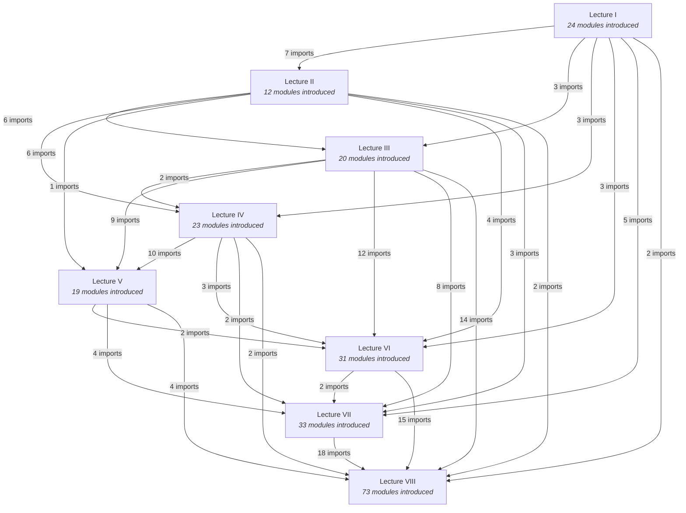
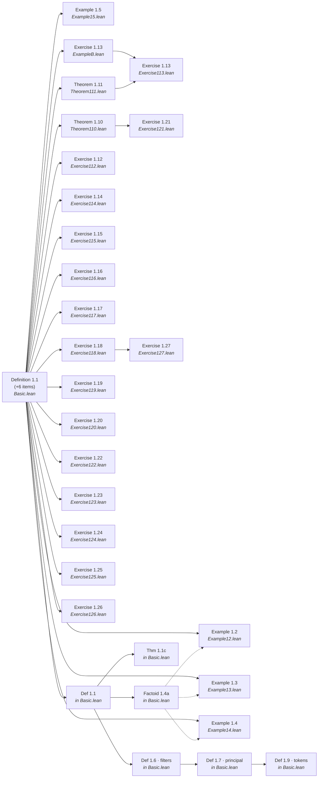
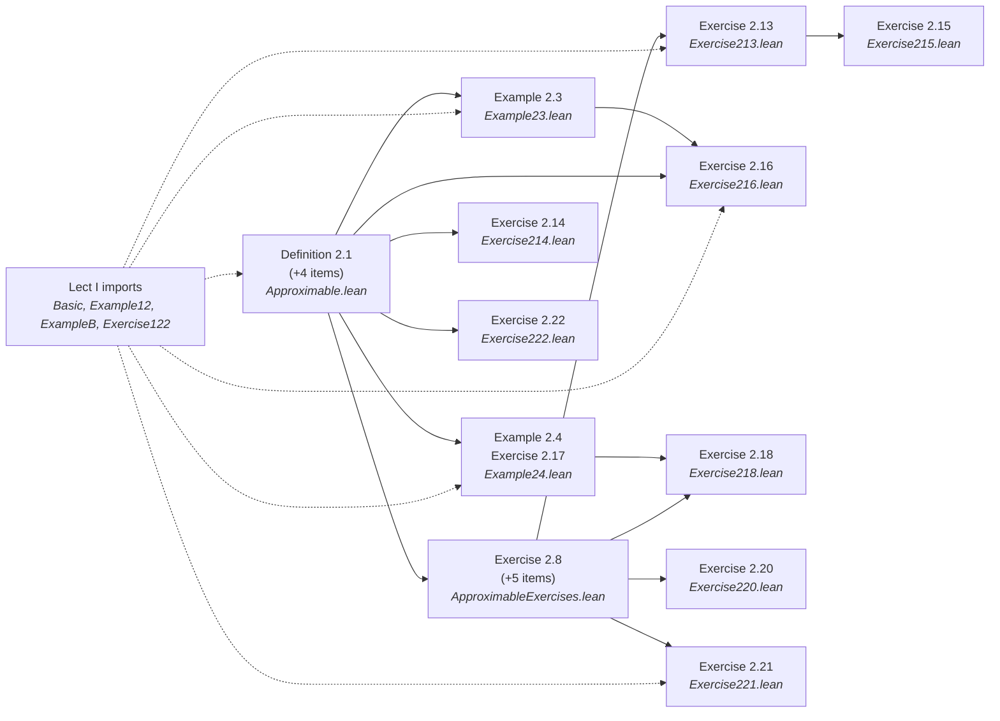
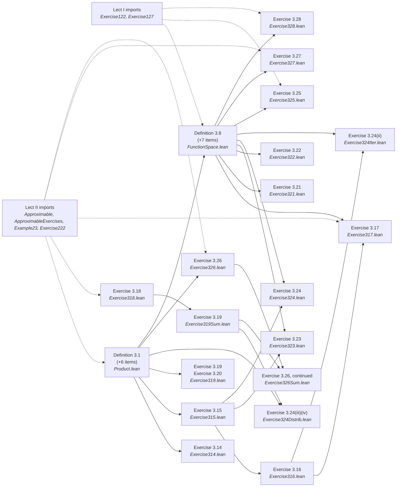
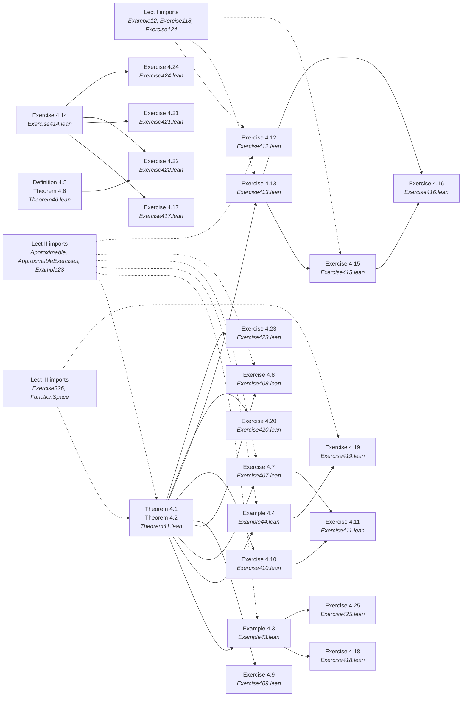
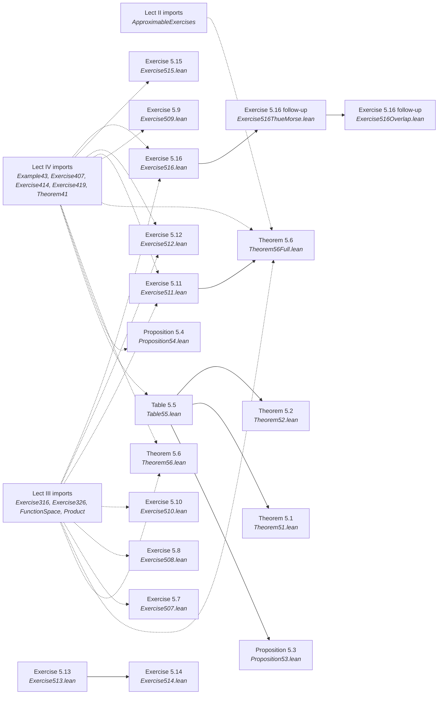
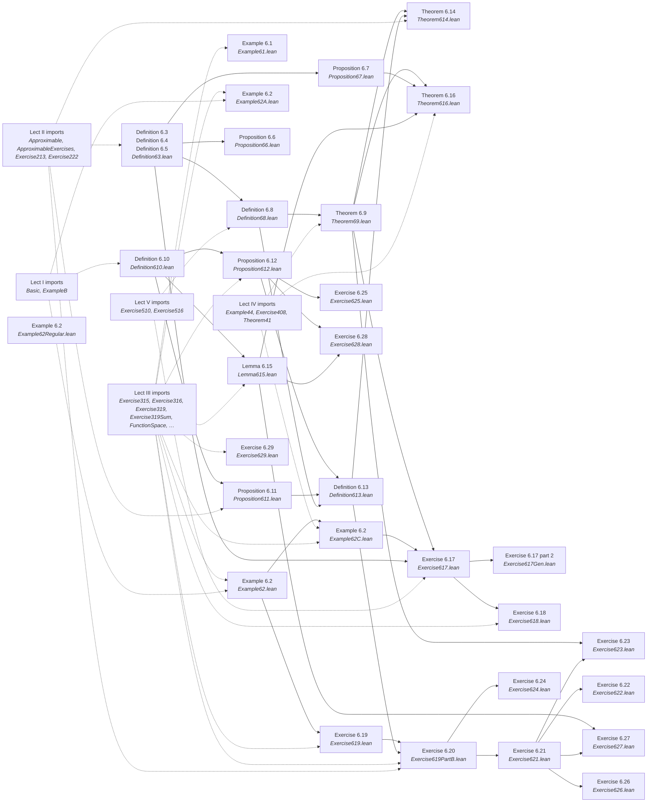
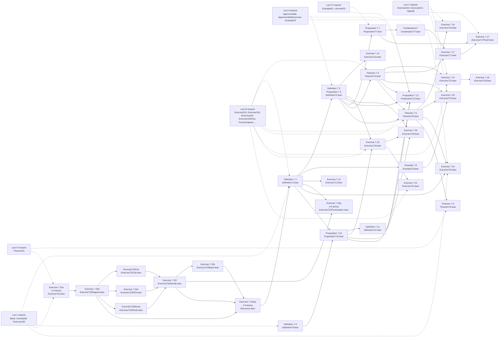
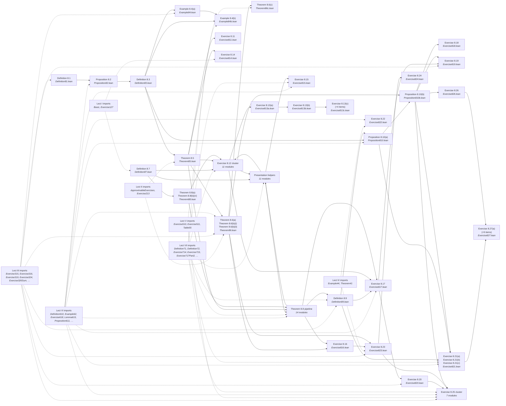

# A Lean 4 Certificate of Scott's Lectures on a Mathematical Theory of Computation (1981) generated by LLM and registered by Palomar
---

## Abstract

In November 1969, Dana Scott formulated a mathematical program to construct a non-degenerate, purely mathematical model ($D_\infty$) for Alonzo Church's untyped $\lambda$-calculus — the construction later published in *Continuous Lattices* (1972). That paper is often described as giving the first such model; this formalization does not adjudicate historical priority. Scott's 1972 framework relied on point-set topology, which remained a barrier for computer scientists seeking a practical tool for programming-language semantics.

When Scott delivered his Oxford lectures in Michaelmas Term 1980 — published May 1981 as *Lectures on a Mathematical Theory of Computation* (Technical Monograph PRG-19) — he pivoted to discrete information presented as *domains*. That presentation was intended to be more accessible without training in point-set topology and lattice theory.

This Lean 4 library formalizes the numbered definitions, theorems, examples, and exercises of PRG-19, with one documented deferral: Exercise 8.17 Part 2 (whether $\mathcal{U}+\mathcal{U}$, $\mathcal{U}\times\mathcal{U}$, or $\mathcal{U}\to\mathcal{U}$ is isomorphic to $\mathcal{U}$), which Scott himself left unresolved for the function-space case. Data constructions are kept choice-free where possible. Prop-level results may use `Classical.choice`; axiom audits record the footprint. Palomar Comparator selects the principal sourced theorem `theorem_8_8` and two new formal corollaries, `P4_embeds` and `Ssys_embeds`; their permitted footprint is `{propext, Classical.choice, Quot.sound}`.

Proofs in this note are summarized at the level of their main constructions. Short representative Lean fragments are copied from the library. The Appendix gives a short description of each library file and a link to that file in the Palomar-preserved copy of this repository.

### Palomar compared claim (first sentence of Theorem 8.8)

The principal sourced result is **only the first sentence of Theorem 8.8**: every countable neighbourhood system $\mathcal{D}$ embeds as a subdomain of $\mathcal{U}$ ($\mathcal{D}\trianglelefteq\mathcal{U}$, Lean `theorem_8_8`). Comparator additionally selects two new formal corollaries, not separately stated by Scott: specializing the theorem to Example 1.5 gives `P4_embeds`, and specializing it to Exercise 7.22's system $S$ gives `Ssys_embeds`. Scott's effective projection-pair sentence and finitary-projection correspondence are proved in the library as `theorem_8_8_b` / `theorem_8_8_c` but are **not** Comparator targets. Scott assumes from the outset that the master token set $\Delta$ is non-empty; `NeighborhoodSystem.master_nonempty` now enforces that assumption structurally. See `Challenge.lean` and `formalization.yaml`.

---

## Introduction

To make domain theory accessible, the 1980 monograph introduces three key conceptual and structural shifts:

### 1. The Information-Theoretic Ordering
In contrast to the topological open sets of 1972, the 1980 lectures treat domains strictly as partially ordered sets (posets) representing states of incomplete information. An element within a domain is framed as a "partial description" of a computation. The ordering relation ($\sqsubseteq$) is explicitly interpreted as approximation: $x \sqsubseteq y$ means $x$ contains less information than, or approximates, $y$.

### 2. Neighbourhood Systems and Finite Approximations
To bypass the complexities of continuous geometric spaces, Scott introduced **Neighbourhood Systems**. He recognized that real-world computing machines only ever interact with finite, checkable tokens of data. In this framework, an infinite computational process (such as an infinite stream or a complex recursive function) is defined as the limit of an ever-tightening sequence of these finite neighbourhoods. This shifted the underlying mathematics away from general topology and toward formal logic and order theory.

### 3. Solving Universal Recursive Domain Equations
While Scott's 1969 discovery was a specialized solution to the specific self-referential equation $D \cong [D \to D]$, the 1980 monograph provides a universal factory blueprint. Scott uses inverse limits over Directed-Complete Partial Orders (CPOs) to solve arbitrary recursive domain equations. This generalized framework allowed computer scientists to give rigorous mathematical meaning to standard recursive computer data structures, such as lists, trees, and stream types.

### Formalization Target: Consolidating "Scott Domains"
This Lean 4 artifact formalizes the mathematical objects that these 1980 lectures ultimately standardized for the computer science community, known today as **Scott Domains**. A Scott Domain is characterized as a poset that is:
1. **Directed-Complete (CPO):** Every directed subset has a least upper bound, ensuring that infinite computations have well-defined limits.
2. **$\omega$-algebraic:** Every element in the domain can be represented as the supremum of a countable set of compact (finite) elements, mirroring how infinite data is built from finite tokens.
3. **Consistently Complete:** If any two pieces of information do not outright contradict each other, they possess a join (least upper bound), allowing consistent computation streams to merge safely.

### A caveat: topology gives way to recursion-theoretic bookkeeping, not to simplicity

Scott's 1980 pivot (§1–3 above) trades point-set topology for order theory and finite tokens, and for
most of the monograph that trade genuinely simplifies the formalization: neighbourhood systems,
approximable maps, and the domain-equation solutions of Lectures I–VI are combinatorial objects with
comparatively little topological machinery behind them. But it would be a mistake to read this as "the
1980 lectures are elementary throughout." From Lecture VII onward, Scott's subject is **computability
*in* domains** — effectively given presentations, computable elements, computable maps — and this
content is intrinsically recursion theory, not topology. Mechanizing it honestly means mechanizing
recursion theory, and that turns out to be the more expensive half of this formalization by a wide
margin, for a reason specific to this project's foundational choices rather than to Scott's mathematics:

Mathlib's own recursion theory (`Nat.Primrec`, `Primrec`, `Partrec`, `ComputablePred`) is unusable here
because its correctness lemmas are proved via tactics (`grind`, `lia`, the `Nat.unpair_pair` simp set)
that route through `Classical.choice`, which would silently taint every downstream computability result
in this project with an axiom this formalization otherwise avoids (see the choice discipline below).
The practical consequence is that `Recursive.lean` — a *from-scratch*, choice-free recursion theory
(primitive-recursive `Nat.pair`/`unpair` round-trips, `Nat.sqrt` correctness, recursively-decidable
predicates and their closure lemmas, course-of-values recursion via fuel-indexed tables) — is now
**4,000+ lines**, roughly **9× the size of `Basic.lean`** (450 lines), the file containing the actual
domain-theoretic definitions (neighbourhood systems, elements, subsystems) that this whole
formalization is nominally *about*. A representative data point: Exercise 8.15's "computable elements
correspond to effectively presented domains" half needed perhaps 30–40 lines of genuine
neighbourhood-system reasoning (an intersection dichotomy, a filter-closure invariant), sitting on top
of 250+ lines encoding finite binary trees as `Nat.pair`-coded naturals and proving their evaluation is
primitive recursive — a fact any computability textbook states in one sentence, made expensive here
purely because Lean's `Nat.pair`/`Nat.unpair` are not kernel-reducible and Mathlib's off-the-shelf
apparatus is off-limits by this project's own discipline.

In short: the 1980 lectures did succeed in retiring topology as the dominant technical overhead, but
Lecture VII onward replaces it with a different overhead — recursion-theoretic encoding and
course-of-values bookkeeping — that is, in this formalization, actually the larger of the two by line
count. This is a cost of the choice-free discipline adopted below, not a property of Scott's
mathematics; a formalization willing to inherit `Classical.choice` through Mathlib's recursion theory
would find Lecture VII's exercises considerably shorter.


### Chapter inclusion hierarchy (Lean imports)

Each node is a lecture (Scott chapter) at the point its Lean modules are first introduced. An edge $A \to B$ means some module belonging to lecture $B$ has a direct `import` of a module belonging to lecture $A$ (transitive imports through intermediate lectures are *not* drawn). Edge labels count those direct import sites. This is the dependency picture relevant to splitting the monograph into separate arXiv papers.


```mermaid
flowchart TB
  %% Node = lecture where modules are newly introduced;
  %% edge A --> B = some B-module directly imports a module from A.
  L1["Lecture I<br/><i>24 modules introduced</i>"]
  L2["Lecture II<br/><i>12 modules introduced</i>"]
  L3["Lecture III<br/><i>20 modules introduced</i>"]
  L4["Lecture IV<br/><i>23 modules introduced</i>"]
  L5["Lecture V<br/><i>19 modules introduced</i>"]
  L6["Lecture VI<br/><i>31 modules introduced</i>"]
  L7["Lecture VII<br/><i>33 modules introduced</i>"]
  L8["Lecture VIII<br/><i>73 modules introduced</i>"]
  L1 -->|7 imports| L2
  L1 -->|3 imports| L3
  L1 -->|3 imports| L4
  L1 -->|3 imports| L6
  L1 -->|5 imports| L7
  L1 -->|2 imports| L8
  L2 -->|6 imports| L3
  L2 -->|6 imports| L4
  L2 -->|1 imports| L5
  L2 -->|4 imports| L6
  L2 -->|3 imports| L7
  L2 -->|2 imports| L8
  L3 -->|2 imports| L4
  L3 -->|9 imports| L5
  L3 -->|12 imports| L6
  L3 -->|8 imports| L7
  L3 -->|14 imports| L8
  L4 -->|10 imports| L5
  L4 -->|3 imports| L6
  L4 -->|2 imports| L7
  L4 -->|2 imports| L8
  L5 -->|2 imports| L6
  L5 -->|4 imports| L7
  L5 -->|4 imports| L8
  L6 -->|2 imports| L7
  L6 -->|15 imports| L8
  L7 -->|18 imports| L8
```

---

## Methodology

This section records the proof-engineering conventions of the formalization—the parts of the
development workflow that are of general academic interest, distilled from the project's internal
handoff notes.

### Source material and inventory

The primary source is Dana Scott's *Lectures on a Mathematical Theory of Computation* (Oxford,
1980; Technical Report PRG-19). OCR transcriptions live in `sources/PRG19_vision.md`; the structured
inventory of every numbered Definition, Theorem, Example, and Exercise—with formalization status and
proof notes—is maintained in this document (`arxiv.md`). Each item is keyed to Scott's original
numbering and cross-linked to its Lean module. Status values distinguish **Pass** (mechanized, builds
green, zero `sorry`). Remaining mismatches versus the monograph are documented deferrals or
expository items (Exercise 8.17 Part 2; Exercise 8.15 item 6g; pictures / “discuss” prompts),
not unfinished numbered proofs. The older **Partial** / **Not Yet** / **Deferred** legend
described an earlier inventory state.

### Neighbourhood systems as the uniform substrate

Following Scott's 1980 pivot away from point-set topology, domains are encoded uniformly as
**neighbourhood systems**: a master set Δ, a family 𝒟 of neighbourhoods (filters on Δ), and domain
elements as filters over 𝒟. Approximable maps, products, function spaces, sums, and fixed-point
combinators are built on this substrate in `Basic.lean`, `Approximable.lean`, `Product.lean`, and
`FunctionSpace.lean`. Positive systems (Exercise 1.19) and effectively given presentations
(Definition 7.1) are layered on top when Scott's exercises demand computability content.

### Custom recursion theory (Lecture VII)

For **effectively given** domains Scott requires two index relations to be *recursively decidable*:
(i) intersection equality `Xₙ ∩ Xₘ = X_k`, and (ii) consistency `∃ k. X_k ⊆ Xₙ ∩ X_m`. Rather than
mathlib's `Computable`/`ComputablePred` development—which pulls `Classical.choice` through tactics
such as `grind`, `lia`, and `Nat.unpair_pair`—we rebuilt the needed slice in `Recursive.lean`:

* `RecDecidable p := ∃ f, Nat.Primrec f ∧ ∀ n, p n ↔ f n = 1` (and the binary/ternary pair-codings
  `RecDecidable₂`, `RecDecidable₃`);
* choice-free correctness for `Nat.sqrt`, `Nat.pair`/`unpair`, and primitive-recursive `+`/`*`;
* closure lemmas (`RecDecidable.of_iff`, `.comp`, `.and`, `.or`, `.not`, bounded `∀`/`∃` via
  `bForallFn`/`bExistsFn`);
* r.e. layers `REPred`/`REPred₂` as projections of decidable relations.

**Target axiom footprint** for data constructions and core proofs: `⊆ {propext, Quot.sound}`.
`Classical.choice` is permitted only for genuinely unavoidable **Prop-level** steps (e.g. classical
case splits on membership in an arbitrary system) and is always called out in proof notes. Each
completed module is audited with `#print axioms`.

### Incremental proof development

Large exercises are decomposed into small, revert-safe sessions rather than monolithic proofs.
The inventory's granularity — how far a single numbered item is split into lettered or numbered
sub-goals before being discharged — was set by hand, session by session, rather than by a fixed
rule. Some exercises (Exercise 7.22's fifteen-plus sub-items above are the extreme case) were
deliberately drilled down into small, independently provable pieces *before* any Lean was written,
because the informal statement was large enough that a single monolithic proof attempt would have
wasted effort on a failing whole-proof search. Others were left as a single inventory row even
though the underlying Lean proof has considerable internal structure, because the statement was
small enough that further decomposition would only add bookkeeping without changing how the proof
was actually attacked. The deciding factors were pragmatic and varied by session: the size and
combinatorial shape of the informal statement, the point at which further upfront planning showed
diminishing returns, and how much compute budget seemed prudent to spend on decomposition versus a
direct proof attempt. Consequently, the depth of decomposition visible in the inventory does not
track a formal complexity metric of Scott's original exercises; it is an artefact of session-by-
session engineering judgment and should be read as such, not as a claim about which parts of
PRG-19 are intrinsically harder to formalize.


## Chronological Formalization Narrative

Below is the chronological narrative of the formalization, organized step-by-step using Dana Scott's original numbering system from the PRG-19 monograph.

### Lecture I: Domains by Neighbourhoods


```mermaid
flowchart LR
  Basic["Definition 1.1<br/>(+6 items)<br/><i>Basic.lean</i>"]
  Example12["Example 1.2<br/><i>Example12.lean</i>"]
  Example13["Example 1.3<br/><i>Example13.lean</i>"]
  Example14["Example 1.4<br/><i>Example14.lean</i>"]
  Example15["Example 1.5<br/><i>Example15.lean</i>"]
  ExampleB["Exercise 1.13<br/><i>ExampleB.lean</i>"]
  Theorem110["Theorem 1.10<br/><i>Theorem110.lean</i>"]
  Theorem111["Theorem 1.11<br/><i>Theorem111.lean</i>"]
  Exercise112["Exercise 1.12<br/><i>Exercise112.lean</i>"]
  Exercise113["Exercise 1.13<br/><i>Exercise113.lean</i>"]
  Exercise114["Exercise 1.14<br/><i>Exercise114.lean</i>"]
  Exercise115["Exercise 1.15<br/><i>Exercise115.lean</i>"]
  Exercise116["Exercise 1.16<br/><i>Exercise116.lean</i>"]
  Exercise117["Exercise 1.17<br/><i>Exercise117.lean</i>"]
  Exercise118["Exercise 1.18<br/><i>Exercise118.lean</i>"]
  Exercise119["Exercise 1.19<br/><i>Exercise119.lean</i>"]
  Exercise120["Exercise 1.20<br/><i>Exercise120.lean</i>"]
  Exercise121["Exercise 1.21<br/><i>Exercise121.lean</i>"]
  Exercise122["Exercise 1.22<br/><i>Exercise122.lean</i>"]
  Exercise123["Exercise 1.23<br/><i>Exercise123.lean</i>"]
  Exercise124["Exercise 1.24<br/><i>Exercise124.lean</i>"]
  Exercise125["Exercise 1.25<br/><i>Exercise125.lean</i>"]
  Exercise126["Exercise 1.26<br/><i>Exercise126.lean</i>"]
  Exercise127["Exercise 1.27<br/><i>Exercise127.lean</i>"]
  Basic --> Example12
  Basic --> Example13
  Basic --> Example14
  Basic --> Example15
  Basic --> ExampleB
  Basic --> Exercise112
  Basic --> Exercise114
  Basic --> Exercise115
  Basic --> Exercise116
  Basic --> Exercise117
  Basic --> Exercise118
  Basic --> Exercise119
  Basic --> Exercise120
  Basic --> Exercise122
  Basic --> Exercise123
  Basic --> Exercise124
  Basic --> Exercise125
  Basic --> Exercise126
  Basic --> Theorem110
  Basic --> Theorem111
  ExampleB --> Exercise113
  Exercise118 --> Exercise127
  Theorem110 --> Exercise121
  Theorem111 --> Exercise113
  Basic_concept_D11["Def 1.1<br/><i>in Basic.lean</i>"]
  Basic_concept_D16["Def 1.6 · filters<br/><i>in Basic.lean</i>"]
  Basic_concept_D17["Def 1.7 · principal<br/><i>in Basic.lean</i>"]
  Basic_concept_D19["Def 1.9 · tokens<br/><i>in Basic.lean</i>"]
  Basic_concept_T11c["Thm 1.1c<br/><i>in Basic.lean</i>"]
  Basic_concept_F14a["Factoid 1.4a<br/><i>in Basic.lean</i>"]
  Basic --> Basic_concept_D11
  Basic_concept_D11 --> Basic_concept_T11c
  Basic_concept_D11 --> Basic_concept_F14a
  Basic_concept_D11 --> Basic_concept_D16
  Basic_concept_D16 --> Basic_concept_D17
  Basic_concept_D17 --> Basic_concept_D19
  Basic_concept_F14a -.-> Example12
  Basic_concept_F14a -.-> Example13
  Basic_concept_F14a -.-> Example14
```


#### Definition 1.1

A neighbourhood system is a family $\mathcal{D}$ of subsets of a token set $\Delta$, containing $\Delta$ and closed under intersection of finite consistent pairs. Lean keeps $\Delta$ as a field (`master`) rather than hard-wiring `Set.univ`, and records that $\Delta$ is non-empty (`master_nonempty`). Finite intersection follows Scott's recursive convention `interUpTo` (empty product is $\Delta$; the successor intersects the next set).

```lean
structure NeighborhoodSystem (α : Type*) where
  mem : Set α → Prop
  master : Set α
  master_nonempty : master.Nonempty
  master_mem : mem master
  inter_mem : ∀ {X Y Z : Set α}, mem X → mem Y → mem Z →
    Z ⊆ X ∩ Y → mem (X ∩ Y)
  sub_master : ∀ {X : Set α}, mem X → X ⊆ master
```

#### Factoid 1.1a

Empty intersection is $\Delta$: `interUpTo_zero`.

#### Factoid 1.1b

Successor peels the last factor: `interUpTo_succ`.

#### Theorem 1.1c

A finite consistent sequence of neighbourhoods has its intersection again in $\mathcal{D}$.

```lean
theorem consistent_iff_interUpTo_mem (X : ℕ → Set α) {n : ℕ}
    (hX : ∀ i, i < n → V.mem (X i)) :
    V.Consistent X n ↔ V.mem (V.interUpTo X n)
```

#### Example 1.2

Scott's first finite system: $\Delta=\{0,1\}$ and $\mathcal{D}=\{\Delta,\{0\},\{1\}\}$. Tokens $0$ and $1$ are completely specified and identified with the two total elements. The only partial element is $\perp=\{\Delta\}$: either no information, or a decision for $0$ or $1$. The three filters are `bot`, `elemZero`, and `elemOne`.

```lean
theorem element_classification (x : neighborhoodSystem.Element) :
    x = bot ∨ x = elemZero ∨ x = elemOne
```

#### Example 1.3

$\Delta=\{0,1,2\}$ with the nested chain $\mathcal{D}=\{\Delta,\{1,2\},\{2\}\}$. Approximation proceeds in two steps to the unique total (token $2$), rather than in one jump. Tokens $0$ and $1$ are not total, and the direction of approximation is unique. The three filters form a linear chain $\perp\sqsubset\uparrow\{1,2\}\sqsubset\uparrow\{2\}$.

```lean
theorem element_classification (x : neighborhoodSystem.Element) :
    x = bot ∨ x = elemTwelve ∨ x = elemTwo
```

#### Example 1.4

The depth-2 binary tree on tokens $\{\Lambda,0,1,00,01,10,11\}$, with neighbourhoods the cones of extensions above each node. The four top nodes $00,01,10,11$ are the totals; lower nodes are partial sequences. Branching records a choice of how to extend a partial sequence. Seven filters: $\perp$, two incomparable branch partials, and four total leaves.

```lean
theorem element_classification (x : neighborhoodSystem.Element) :
    x = bot ∨ x = elemZero ∨ x = elemOne ∨
      x = elem00 ∨ x = elem01 ∨ x = elem10 ∨ x = elem11
```

#### Factoid 1.4a

Nested-or-disjoint families are neighbourhood systems: `NestedOrDisjoint`, `ofNestedOrDisjoint`.

#### Example 1.5

All nonempty subsets of $\Delta=\{0,1,2,3\}$, a direct generalization of Example 1.2. Consistency is nonempty intersection, so neighbourhoods need not be nested or disjoint. Combinations of neighbourhoods are as varied as a four-element set allows.

```lean
def neighborhoodSystem : NeighborhoodSystem Token where
```

#### Factoid 1.5a

Sets are consistent iff they have nonempty intersection: `consistent_iff_inter_nonempty`.

#### Factoid 1.5b

Limit families of equivalent neighbourhood sequences coincide: `limitFamily_eq_iff`.

#### Definition 1.6

The (ideal) elements of $\mathcal{D}$ are the filters: subfamilies $x\subseteq\mathcal{D}$ containing $\Delta$, closed under $\cap$, and upward closed in $\mathcal{D}$. The domain $|\mathcal{D}|$ is the type of all such filters. Maximal filters are the total elements; partial filters are kept as first-class data.

```lean
structure Element where
  mem : Set α → Prop
  sub : ∀ {X}, mem X → V.mem X
  master_mem : mem V.master
  inter_mem : ∀ {X Y}, mem X → mem Y → mem (X ∩ Y)
  up_mem : ∀ {X Y}, mem X → V.mem Y → X ⊆ Y → mem Y
```

#### Definition 1.7

For $X\in\mathcal{D}$ the principal filter $\uparrow X=\{Y\in\mathcal{D}\mid X\subseteq Y\}$ is the finite element determined by that neighbourhood. These are the elements given by a single neighbourhood rather than a limit of many.

```lean
def principal {X : Set α} (hX : V.mem X) : V.Element where
```

#### Factoid 1.7a

$X\mapsto\uparrow X$ is one-one and inclusion-reversing: `principal_le_iff`, `principal_injective`.

#### Factoid 1.7b

Every element is the union of its principal filters: `eq_iUnion_principal`.

#### Definition 1.8 (order)

Approximation on $|\mathcal{D}|$ is inclusion of filters: $x$ approximates $y$ iff $x\subseteq y$. This is the partial order on elements.

```lean
instance : PartialOrder V.Element where
```

#### Definition 1.8 (⊥, total)

Bottom is the least-defined element $\perp=\{\Delta\}=\uparrow\Delta$. Total elements are those maximal with respect to approximation.

```lean
def IsTotal (x : V.Element) : Prop := ∀ y, x ≤ y → y ≤ x
```

#### Factoid 1.8a

$\perp$ approximates every element: `bot_le`.

#### Factoid 1.8b

A filter with a $\subseteq$-minimum member $X$ is $\uparrow X$: `eq_principal_of_isMin`.

#### Example 1.B

The infinite binary-tree system $B=\{\sigma\Sigma^*\mid\sigma\in\Sigma^*\}$: neighbourhoods are cones of finite bit-strings, generalizing Example 1.4.

```lean
def B : NeighborhoodSystem Str :=
```

#### Exercise 1.B-sys

Show that $B$ is a neighbourhood system: cones are pairwise nested-or-disjoint (`nestedOrDisjoint`).

```lean
theorem nestedOrDisjoint : NestedOrDisjoint memB
```

#### Exercise 1.B-elt

Show $\sigma x\in|B|$ for every $x\in|B|$: `sigmaElt`.

```lean
def sigmaElt (σ : Str) (x : B.Element) : B.Element where
```

#### Factoid 1.B-mono

$\sigma_0\perp\subseteq\sigma_1\perp$ iff $\sigma_0$ is a prefix of $\sigma_1$: `sigmaBot_le_iff`.

#### Factoid 1.B-lim

Every element is a union of finite approximations $\sigma_n\perp$: `mem_iff_exists_sigmaBot`.

#### Definition 1.9

Two neighbourhood systems determine isomorphic domains when there is a one-one correspondence of $|\mathcal{D}_0|$ with $|\mathcal{D}_1|$ that preserves inclusion of elements both ways. Lean packages this as an order-isomorphism of `Element` types.

```lean
def Isomorphic {α β : Type*} (V₀ : NeighborhoodSystem α) (V₁ : NeighborhoodSystem β) : Prop :=
  Nonempty (DomainIso V₀ V₁)
```

#### Theorem 1.10

The sets $[X]=\{x\mid X\in x\}$ form a neighbourhood system over $|\mathcal{D}|$ isomorphic to $\mathcal{D}$ itself.

```lean
theorem isomorphic_tokenSystem : V ≅ᴰ V.tokenSystem
```

#### Theorem 1.11

$|\mathcal{D}|$ is closed under countable intersections and under ascending countable unions; these are the GLB and LUB.

```lean
def iInter (x : ℕ → V.Element) : V.Element where
```

#### Exercise 1.12

Final segments of $\mathbb{N}$ as neighbourhoods: classify finite elements, the unique total, and every element as `fin n` or `top`.

```lean
def neighborhoodSystem : NeighborhoodSystem ℕ :=
```

#### Exercise 1.13

Verify the claims about $B$ and draw the binary tree with limit nodes along the top: each infinite path is a total element `branch`.

```lean
def branch (p : ℕ → Bool) : B.Element :=
  B.iUnion (branchSeq p) (branchSeq_mono p)
```

#### Exercise 1.14

Finite nonempty subsets of $\mathbb{N}$ plus $\Delta$ form a neighbourhood system; totals are the singleton principals.

```lean
def neighborhoodSystem : NeighborhoodSystem ℕ where
```

#### Exercise 1.15

Two infinite all-finite domains with no infinite strict chains, `flat` and `stem`, that are not isomorphic.

```lean
def flat : NeighborhoodSystem ℕ :=
```

#### Exercise 1.16

Cofinite subsets of $\mathbb{N}$: $|\mathcal{D}|$ is isomorphic to $\mathcal{P}(\mathbb{N})$ under inclusion (`cofiniteIso`).

```lean
def cofiniteSystem : NeighborhoodSystem ℕ where
```

#### Exercise 1.17

Rational open intervals on $\mathbb{R}$ plus $\Delta$; each real $t$ determines a filter `filterAt t`.

```lean
def ratIntervalSystem : NeighborhoodSystem ℝ where
```

#### Exercise 1.18

A finitely consistent family of neighbourhoods has a least filter containing it; the intersection of any nonempty family of filters is a filter.

```lean
def FinitelyConsistent (C : Set (Set α)) : Prop :=
  ∀ (n : ℕ) (X : ℕ → Set α), (∀ i, i < n → X i ∈ C) → V.Consistent X n
```

#### Exercise 1.19

A positive neighbourhood system (intersection is a neighbourhood iff nonempty) is a neighbourhood system; not every system is positive (`notPositiveSystem`).

```lean
def positiveExample : NeighborhoodSystem (Fin 2) :=
```

#### Exercise 1.20

The power system of down-sets $\uparrow X=\{Y\in\mathcal{D}\mid Y\subseteq X\}$ is positive and isomorphic to $\mathcal{D}$ (`powerIso`).

```lean
def upSet (X : Set α) : Set (Set α)
```

#### Exercise 1.21

The token system $\{[X]\}$ over $|\mathcal{D}|$ is positive and complete: every filter is fixed by a unique point.

```lean
theorem tokenSystem_isPositive : V.tokenSystem.IsPositive
```

#### Exercise 1.22

The sets $[X]$ topologize $|\mathcal{D}|$: opens are the $\sqsubseteq$-upper sets generated by basic neighbourhoods, and $\sqsubseteq$ is the specialization order.

```lean
instance instTopologicalSpaceElement : TopologicalSpace V.Element where
```

#### Exercise 1.23

A countable system admits a greedy total element `greedyElement`; every filter is determined by a sequence.

```lean
def greedyElement : V.Element where
```

#### Exercise 1.24

Using the Axiom of Choice, every element extends to a total element; the union of a nonempty chain of filters is a filter.

```lean
theorem exists_total_ge (x : V.Element) : ∃ t, V.IsTotal t ∧ x ≤ t
```

#### Exercise 1.25

Nonempty final segments of a well-ordered $\Delta$: $|\mathcal{D}|$ classifies nonempty lower sets; the unique total is not principal if $\Delta$ has no maximum.

```lean
def finalSegmentSystem (Δ : Type*) [LinearOrder Δ] [Nonempty Δ] : NeighborhoodSystem Δ :=
```

#### Exercise 1.26

For a commutative ring $A$, neighbourhoods $I(F)=\{G\mid F\subseteq\langle G\rangle\}$ yield a domain isomorphic to the ideals of $A$.

```lean
def ringSystem : NeighborhoodSystem (Finset A) where
```

#### Exercise 1.27

A set of elements is bounded iff it has an upper bound; pairwise consistency of neighbourhoods matches boundedness of their principals.

```lean
def Bounded (X : Set V.Element) : Prop
```

---

### Lecture II: Approximable Mappings


```mermaid
flowchart LR
  L1core["Lect I imports<br/><i>Basic, Example12, ExampleB, Exercise122</i>"]
  Approximable["Definition 2.1<br/>(+4 items)<br/><i>Approximable.lean</i>"]
  ApproximableExercises["Exercise 2.8<br/>(+5 items)<br/><i>ApproximableExercises.lean</i>"]
  Example23["Example 2.3<br/><i>Example23.lean</i>"]
  Example24["Example 2.4<br/>Exercise 2.17<br/><i>Example24.lean</i>"]
  Exercise213["Exercise 2.13<br/><i>Exercise213.lean</i>"]
  Exercise214["Exercise 2.14<br/><i>Exercise214.lean</i>"]
  Exercise215["Exercise 2.15<br/><i>Exercise215.lean</i>"]
  Exercise216["Exercise 2.16<br/><i>Exercise216.lean</i>"]
  Exercise218["Exercise 2.18<br/><i>Exercise218.lean</i>"]
  Exercise220["Exercise 2.20<br/><i>Exercise220.lean</i>"]
  Exercise221["Exercise 2.21<br/><i>Exercise221.lean</i>"]
  Exercise222["Exercise 2.22<br/><i>Exercise222.lean</i>"]
  L1core -.-> Approximable
  L1core -.-> Example23
  L1core -.-> Example24
  L1core -.-> Exercise213
  L1core -.-> Exercise216
  L1core -.-> Exercise221
  Approximable --> ApproximableExercises
  Approximable --> Example23
  Approximable --> Example24
  Approximable --> Exercise214
  Approximable --> Exercise216
  Approximable --> Exercise222
  ApproximableExercises --> Exercise213
  ApproximableExercises --> Exercise218
  ApproximableExercises --> Exercise220
  ApproximableExercises --> Exercise221
  Example23 --> Exercise216
  Example24 --> Exercise218
  Exercise213 --> Exercise215
```


#### Definition 2.1

An approximable mapping $f:\mathcal{D}_0\to\mathcal{D}_1$ is a relation between neighbourhoods: $\Delta_0\,f\,\Delta_1$, closed under intersection on the output, and monotone in a sharper input and a blunter output. It is the neighbourhood-level data of a map of domains. Relation-extensionality is `ext`.

```lean
structure ApproximableMap (V₀ : NeighborhoodSystem α) (V₁ : NeighborhoodSystem β) where
  rel : Set α → Set β → Prop
  rel_dom : ∀ {X Y}, rel X Y → V₀.mem X
  rel_cod : ∀ {X Y}, rel X Y → V₁.mem Y
  master_rel : rel V₀.master V₁.master
  inter_right : ∀ {X Y Y'}, rel X Y → rel X Y' → rel X (Y ∩ Y')
  mono : ∀ {X X' Y Y'}, rel X Y → X' ⊆ X → Y ⊆ Y' →
    V₀.mem X' → V₁.mem Y' → rel X' Y'
```

#### Proposition 2.2

An approximable mapping determines an elementwise function $f:|\mathcal{D}_0|\to|\mathcal{D}_1|$ by $f(x)=\{Y\mid\exists X\in x,\,X\,f\,Y\}$.

```lean
def toElementMap (f : ApproximableMap V₀ V₁) (x : V₀.Element) : V₁.Element where
```

#### Example 2.3

Parity of the number of $0$s before the first $1$, as a map $B\to T$ into the two-token domain of Example 1.2. Outcomes are `true`, `false`, or $\perp$ when the prefix does not yet decide.

```lean
def parityMap : ApproximableMap B T where
```

#### Example 2.4

The map $g:B\to B$ that deletes the first consecutive run of $1$s while copying the rest. The infinite sequence $1^\infty$ is sent to $\perp$.

```lean
def runMap : ApproximableMap B B where
```

#### Theorem 2.5

Neighbourhood systems and approximable mappings form a category, with identity $X\,I_D\,Y$ iff $X\subseteq Y$ and composition by an intermediate neighbourhood.

```lean
def idMap (V : NeighborhoodSystem α) : ApproximableMap V V where
```

#### Proposition 2.6

The elementwise assignment is a functor: $I_D$ acts as the identity and $(g\circ f)(x)=g(f(x))$.

```lean
theorem toElementMap_comp (g : ApproximableMap V₁ V₂) (f : ApproximableMap V₀ V₁)
    (x : V₀.Element) :
    (g.comp f).toElementMap x = g.toElementMap (f.toElementMap x)
```

#### Theorem 2.7

Every domain isomorphism arises from an approximable mapping, and finite elements go to finite elements.

```lean
theorem exists_approximable_of_iso (e : V₀.Element ≃o V₁.Element) :
    ∃ f : ApproximableMap V₀ V₁, ∀ x, f.toElementMap x = e x
```

#### Exercise 2.8

An approximable mapping is determined by its values on finite elements, and every monotone map of finite elements extends to one (`ofMono`).

```lean
theorem eq_of_toElementMap_principal {f g : ApproximableMap V₀ V₁}
    (h : ∀ (X : Set α) (hX : V₀.mem X),
      f.toElementMap (V₀.principal hX) = g.toElementMap (V₀.principal hX)) : f = g
```

#### Exercise 2.9

The elementwise map satisfies $f(x)=\bigcup\{f(\uparrow X)\mid X\in x\}$.

```lean
theorem toElementMap_mem_iff_principal (f : ApproximableMap V₀ V₁) (x : V₀.Element)
    {Y : Set β} :
    (f.toElementMap x).mem Y ↔
      ∃ (X : Set α) (hx : x.mem X),
        (f.toElementMap (V₀.principal (x.sub hx))).mem Y
```

#### Exercise 2.10

The pointwise meet of two approximable maps is approximable: $h(x)=f(x)\cap g(x)$.

```lean
def interMap (f g : ApproximableMap V₀ V₁) : ApproximableMap V₀ V₁ where
```

#### Exercise 2.11

The directed union of a family of elements is an element, and approximable maps preserve directed unions.

```lean
def iSupDirected {α : Type*} {V : NeighborhoodSystem α} {I : Type*} [Nonempty I]
    (a : I → V.Element) (hdir : ∀ i j, ∃ k, a i ≤ a k ∧ a j ≤ a k) : V.Element :=
```

#### Exercise 2.12

The pointwise directed union of a family of approximable maps is approximable.

```lean
def iSupMap {I : Type*} [Nonempty I] (f : I → ApproximableMap V₀ V₁)
    (hdir : ∀ i j, ∃ k, (∀ X Y, (f i).rel X Y → (f k).rel X Y) ∧
      (∀ X Y, (f j).rel X Y → (f k).rel X Y)) : ApproximableMap V₀ V₁ where
```

#### Exercise 2.13

Approximable mappings are exactly the continuous maps between the $|\mathcal{D}|$ spaces of Exercise 1.22.

```lean
theorem continuous_toElementMap (f : ApproximableMap V₀ V₁) :
    Continuous (fun x => f.toElementMap x)
```

#### Exercise 2.14

A domain isomorphism $e$ induces a neighbourhood correspondence $\varphi$ with $e(\uparrow X)=\uparrow\varphi(X)$ and $X\,(\mathrm{ofIso}\,e)\,Y$ iff $\varphi(X)\subseteq Y$.

```lean
theorem phi_spec (e : V₀.Element ≃o V₁.Element) {X : Set α} (hX : V₀.mem X) :
    e (V₀.principal hX) = V₁.principal (phi_mem e hX)
```

#### Exercise 2.15

The one-token Sierpiński system $O$ has elements $\perp\sqsubset\top$; open subsets of $|\mathcal{D}|$ correspond to approximable maps $\mathcal{D}\to O$.

```lean
def O : NeighborhoodSystem (Fin 1) :=
```

#### Exercise 2.16

The shift $x\mapsto\sigma x$ on $|B|$ is approximable (`sigmaMap`). The parity map of Example 2.3 is the unique approximable map satisfying $f(1x)=\mathrm{true}$, $f(01x)=\mathrm{false}$, $f(00x)=f(x)$.

```lean
theorem toElementMap_sigmaMap (σ : Str) (x : B.Element) :
    (sigmaMap σ).toElementMap x = sigmaElt σ x
```

#### Exercise 2.17

The run-deletion map of Example 2.4 is approximable and is uniquely determined by $g(0x)=0g(x)$, $g(11x)=g(1x)$, $g(10x)=0x$, and $g(1)=\perp$.

```lean
def runMap : ApproximableMap B B where
```

#### Exercise 2.18

The spacing map $h:B\to B$ ($b\mapsto b0$) has a left inverse $k$ but is not an isomorphism.

```lean
def hMap : ApproximableMap B B where
```

#### Exercise 2.19

A two-variable approximable mapping is a ternary neighbourhood relation with the natural generalizations of Definition 2.1.

```lean
structure ApproximableMap₂ (V₀ : NeighborhoodSystem α) (V₁ : NeighborhoodSystem β)
    (V₂ : NeighborhoodSystem γ) where
  rel : Set α → Set β → Set γ → Prop
  rel_dom₀ : ∀ {X Y Z}, rel X Y Z → V₀.mem X
  rel_dom₁ : ∀ {X Y Z}, rel X Y Z → V₁.mem Y
  rel_cod : ∀ {X Y Z}, rel X Y Z → V₂.mem Z
  master_rel : rel V₀.master V₁.master V₂.master
  inter_right : ∀ {X Y Z Z'}, rel X Y Z → rel X Y Z' → rel X Y (Z ∩ Z')
  mono : ∀ {X X' Y Y' Z Z'}, rel X Y Z → X' ⊆ X → Y' ⊆ Y → Z ⊆ Z' →
    V₀.mem X' → V₁.mem Y' → V₂.mem Z' → rel X' Y' Z'
```

#### Exercise 2.20

The powerset domain $\mathcal{P}$ of cofinite neighbourhoods on $\mathbb{N}$ has $|\mathcal{P}|\simeq\mathcal{P}(\mathbb{N})$; union, intersection, successor, and predecessor are approximable.

```lean
def equivSetNat : powerSet.Element ≃o Set ℕ where
```

#### Exercise 2.21

A system $C\supseteq B$ in which both finite and infinite sequences are total, together with left-biased juxtaposition $xy$.

```lean
def C : NeighborhoodSystem Str :=
```

#### Exercise 2.22

Any family of sets closed under nonempty intersections and directed unions is inclusion-isomorphic to a domain.

```lean
def reprIso : (reprSystem C hInter hne).Element ≃o {X : Set τ // X ∈ C} where
```

---

### Lecture III: Domain Constructs


```mermaid
flowchart LR
  L1core["Lect I imports<br/><i>Exercise122, Exercise127</i>"]
  L2core["Lect II imports<br/><i>Approximable, ApproximableExercises, Example23, Exercise222</i>"]
  Product["Definition 3.1<br/>(+6 items)<br/><i>Product.lean</i>"]
  FunctionSpace["Definition 3.8<br/>(+7 items)<br/><i>FunctionSpace.lean</i>"]
  Exercise314["Exercise 3.14<br/><i>Exercise314.lean</i>"]
  Exercise315["Exercise 3.15<br/><i>Exercise315.lean</i>"]
  Exercise318["Exercise 3.18<br/><i>Exercise318.lean</i>"]
  Exercise319["Exercise 3.19<br/>Exercise 3.20<br/><i>Exercise319.lean</i>"]
  Exercise319Sum["Exercise 3.19<br/><i>Exercise319Sum.lean</i>"]
  Exercise321["Exercise 3.21<br/><i>Exercise321.lean</i>"]
  Exercise322["Exercise 3.22<br/><i>Exercise322.lean</i>"]
  Exercise323["Exercise 3.23<br/><i>Exercise323.lean</i>"]
  Exercise324["Exercise 3.24<br/><i>Exercise324.lean</i>"]
  Exercise316["Exercise 3.16<br/><i>Exercise316.lean</i>"]
  Exercise317["Exercise 3.17<br/><i>Exercise317.lean</i>"]
  Exercise324Iter["Exercise 3.24(ii)<br/><i>Exercise324Iter.lean</i>"]
  Exercise324Distrib["Exercise 3.24(iii)(iv)<br/><i>Exercise324Distrib.lean</i>"]
  Exercise325["Exercise 3.25<br/><i>Exercise325.lean</i>"]
  Exercise327["Exercise 3.27<br/><i>Exercise327.lean</i>"]
  Exercise326["Exercise 3.26<br/><i>Exercise326.lean</i>"]
  Exercise326Sum["Exercise 3.26, continued<br/><i>Exercise326Sum.lean</i>"]
  Exercise328["Exercise 3.28<br/><i>Exercise328.lean</i>"]
  L1core -.-> FunctionSpace
  L1core -.-> Exercise325
  L1core -.-> Exercise328
  L2core -.-> Product
  L2core -.-> Exercise318
  L2core -.-> Exercise317
  L2core -.-> Exercise327
  L2core -.-> Exercise326
  Exercise315 --> Exercise316
  Exercise315 --> Exercise323
  Exercise315 --> Exercise324
  Exercise316 --> Exercise317
  Exercise316 --> Exercise324Iter
  Exercise318 --> Exercise319Sum
  Exercise319Sum --> Exercise324Distrib
  Exercise319Sum --> Exercise326Sum
  Exercise326 --> Exercise326Sum
  FunctionSpace --> Exercise317
  FunctionSpace --> Exercise321
  FunctionSpace --> Exercise322
  FunctionSpace --> Exercise323
  FunctionSpace --> Exercise324
  FunctionSpace --> Exercise324Iter
  FunctionSpace --> Exercise325
  FunctionSpace --> Exercise327
  FunctionSpace --> Exercise328
  Product --> Exercise314
  Product --> Exercise315
  Product --> Exercise319
  Product --> Exercise324Distrib
  Product --> Exercise326
  Product --> FunctionSpace
```


#### Definition 3.1

Given neighbourhood systems $\mathcal{D}_0$ and $\mathcal{D}_1$ over disjoint token sets, the
*product* is $\{X\cup Y\mid X\in\mathcal{D}_0,\,Y\in\mathcal{D}_1\}$. Lean tags tokens by
`α ⊕ β`, so a product neighbourhood is `prodNbhd X Y = Sum.inl '' X ∪ Sum.inr '' Y`. Elements pair
as $\langle x,y\rangle=\{X\cup Y\mid X\in x,\,Y\in y\}$, recovered by `Element.fst`/`snd`.

```lean
def prod (V₀ : NeighborhoodSystem α) (V₁ : NeighborhoodSystem β) : NeighborhoodSystem (α ⊕ β) where
```

#### Proposition 3.2

The product is a neighbourhood system, and every element is uniquely a pair, order-isomorphically.

```lean
def prodEquiv (V₀ : NeighborhoodSystem α) (V₁ : NeighborhoodSystem β) :
    (prod V₀ V₁).Element ≃o V₀.Element × V₁.Element where
```

#### Definition 3.3

Projections $p_0,p_1$ relate a product neighbourhood to a factor by inclusion of that component.
The paired map $\langle f,g\rangle$ relates $Z$ to $X\cup Y$ just when $Z\,f\,X$ and $Z\,g\,Y$.

```lean
def paired (f : ApproximableMap V₂ V₀) (g : ApproximableMap V₂ V₁) :
    ApproximableMap V₂ (prod V₀ V₁) where
```

#### Proposition 3.4

The projections and pairing are approximable, with $p_i\circ\langle f,g\rangle$ recovering $f$ or
$g$, $h=\langle p_0\circ h,\,p_1\circ h\rangle$, and $\langle f,g\rangle(w)=\langle f(w),g(w)\rangle$.

```lean
theorem proj₀_comp_paired (f : ApproximableMap V₂ V₀) (g : ApproximableMap V₂ V₁) :
    (proj₀ V₀ V₁).comp (paired f g) = f :=
```

#### Theorem 3.5

A two-argument elementwise map comes from an approximable mapping iff it is separately
approximable in each variable.

```lean
def map₂Equiv (V₀ : NeighborhoodSystem α) (V₁ : NeighborhoodSystem β) (V₂ : NeighborhoodSystem γ) :
    ApproximableMap (prod V₀ V₁) V₂ ≃ ApproximableMap₂ V₀ V₁ V₂ where
```

#### Lemma 3.6

The constant function with value $b$ comes from the relation $X\,b\,Y$ iff $Y\in b$.

```lean
def constMap (V₀ : NeighborhoodSystem α) (b : V₁.Element) : ApproximableMap V₀ V₁ where
```

#### Proposition 3.7

Multivariate approximable maps are closed under substitution, assembled from pairing and
composition.

```lean
theorem substitution_toElementMap (F : ApproximableMap (prod V₀ V₁) V₂)
    (a : ApproximableMap V₃ V₀) (b : ApproximableMap V₃ V₁) (w : V₃.Element) :
```

#### Definition 3.8

The *function space* $(\mathcal{D}_0\to\mathcal{D}_1)$ has tokens the approximable maps and
neighbourhoods the finite nonempty intersections of *step* sets $[X,Y]=\{f\mid X\,f\,Y\}$. Lean
records a single step as `step` and a finite intersection as `stepFun`.

```lean
def funSpace (V₀ : NeighborhoodSystem α) (V₁ : NeighborhoodSystem β) :
    NeighborhoodSystem (ApproximableMap V₀ V₁) where
```

#### Proposition 3.9

A finite family of steps is consistent iff whenever a subcollection of the $X_i$ is consistent, so
is the matching $Y_i$; the least map in the intersection satisfies
$X\,f_0\,Y$ iff $\bigcap\{Y_i\mid X\subseteq X_i\}\subseteq Y$.

```lean
def leastMap (L : List (Set α × Set β)) (_hL : ∀ p ∈ L, V₀.mem p.1 ∧ V₁.mem p.2)
    (hcons : ∀ {X}, V₀.mem X → V₁.mem (interYs V₁.master L X)) : ApproximableMap V₀ V₁ where
```

#### Theorem 3.10

Every filter in the function space is fixed by a unique approximable mapping.

```lean
def funSpaceEquiv (V₀ : NeighborhoodSystem α) (V₁ : NeighborhoodSystem β) :
    (funSpace V₀ V₁).Element ≃o ApproximableMap V₀ V₁ where
```

#### Theorem 3.11

Evaluation $\mathrm{eval}:(\mathcal{D}_1\to\mathcal{D}_2)\times\mathcal{D}_1\to\mathcal{D}_2$ is
approximable and satisfies $\mathrm{eval}(f,x)=f(x)$.

```lean
def evalMap (V₁ : NeighborhoodSystem β) (V₂ : NeighborhoodSystem γ) :
    ApproximableMap (prod (funSpace V₁ V₂) V₁) V₂ :=
```

#### Theorem 3.12

Currying is an order-isomorphism $|\mathcal{D}_0\times\mathcal{D}_1\to\mathcal{D}_2|\simeq|\mathcal{D}_0\to(\mathcal{D}_1\to\mathcal{D}_2)|$,
with $\mathrm{eval}\circ\langle\mathrm{curry}(g)\circ p_0,\,p_1\rangle=g$.

```lean
def curry (g : ApproximableMap (prod V₀ V₁) V₂) : ApproximableMap V₀ (funSpace V₁ V₂) where
```

#### Theorem 3.13(i)

Approximable maps are ordered pointwise: $f\sqsubseteq g$ iff $f(x)\sqsubseteq g(x)$ for all $x$.

```lean
theorem le_iff_toElementMap_le {f g : ApproximableMap V₀ V₁} :
    f ≤ g ↔ ∀ x, f.toElementMap x ≤ g.toElementMap x :=
```

#### Theorem 3.13(ii)

A family of maps is bounded iff the pointwise values are bounded at every argument.

```lean
theorem mapsBounded_iff_pointwiseBounded {F : Set (ApproximableMap V₀ V₁)} :
```

#### Theorem 3.13(iii)

When $F$ is bounded, $(\bigsqcup F)(x)=\bigsqcup\{f(x)\mid f\in F\}$.

```lean
def sSupMaps (F : Set (ApproximableMap V₀ V₁)) (hF : PointwiseBounded F) : ApproximableMap V₀ V₁ :=
```

#### Exercise 3.14

Disjointness of token sets is unnecessary: tag copies as $0\Delta_0\cup 1\Delta_1$ (already
`α ⊕ β`). The diagonal $\mathrm{diag}:\mathcal{D}\to\mathcal{D}\times\mathcal{D}$ satisfies
$\mathrm{diag}(x)=\langle x,x\rangle$.

```lean
def diag : ApproximableMap V (prod V V) := paired (idMap V) (idMap V)
```

#### Exercise 3.15

The usual product isomorphisms: commutativity, associativity, the empty (unit) product, and
functoriality in each factor.

```lean
theorem prod_comm_isomorphic : prod V₀ V₁ ≅ᴰ prod V₁ V₀
```

- `prod_assoc_isomorphic` — $\mathcal{D}_0\times(\mathcal{D}_1\times\mathcal{D}_2)\cong(\mathcal{D}_0\times\mathcal{D}_1)\times\mathcal{D}_2$.
- `prod_unit_isomorphic` — $\mathcal{D}_0\times\mathbf{1}\cong\mathcal{D}_0$.
- `Isomorphic.prod` — $\mathcal{D}_0\cong\mathcal{D}'_0$ and $\mathcal{D}_1\cong\mathcal{D}'_1$ imply $\mathcal{D}_0\times\mathcal{D}_1\cong\mathcal{D}'_0\times\mathcal{D}'_1$.

#### Exercise 3.16

The infinite product $\mathcal{D}^\infty$ over tagged copies $\Delta^\infty$ is a neighbourhood
system, isomorphic to $\mathcal{D}\times\mathcal{D}^\infty$, with elements the sequences of
$|\mathcal{D}|$-elements.

```lean
def iterSys (V : NeighborhoodSystem α) : NeighborhoodSystem (ℕ × α) where
```

#### Exercise 3.17

There is a one-one approximable $f:\mathcal{B}\to\mathcal{T}^\infty$ with a retraction $g$, so
$g\circ f=I_{\mathcal{B}}$ and $f\circ g\sqsubseteq I_{\mathcal{T}^\infty}$.

```lean
theorem gf_eq_id : g.comp f = idMap B :=
```

#### Exercise 3.18

The separated sum $\mathcal{D}_0+\mathcal{D}_1$ adjoins a tag $\Lambda$ and the two injections;
$\mathrm{out}_i\circ\mathrm{in}_i=I$, provided no neighbourhood is empty.

```lean
def sum (V₀ : NeighborhoodSystem α) (V₁ : NeighborhoodSystem β)
    (h₀ : ∀ X, V₀.mem X → X.Nonempty) (h₁ : ∀ Y, V₁.mem Y → Y.Nonempty) :
    NeighborhoodSystem (Option (α ⊕ β)) where
```

#### Exercise 3.19

Functorial $f\times g$ and $f+g$ on products and sums, with
$(f\times g)(x,y)=\langle f(x),g(y)\rangle$ and $\mathrm{out}_i\circ(f+g)\circ\mathrm{in}_i$
recovering $f$ or $g$.

```lean
def prodMap (f : ApproximableMap V₀ V₀') (g : ApproximableMap V₁ V₁') :
    ApproximableMap (prod V₀ V₁) (prod V₀' V₁') :=
```

- `sumMap` — the sum combinator on $\mathcal{D}_0+\mathcal{D}_1$.
- `outMap₀_comp_sumMap_comp_inMap₀` — $\mathrm{out}_0\circ(f+g)\circ\mathrm{in}_0=f$.

#### Exercise 3.20

On the category of domains, $+$ and $\times$ are functors, and $\times$ is the categorical
product.

```lean
theorem paired_unique (h₀ : ApproximableMap V₂ V₀) (h₁ : ApproximableMap V₂ V₁)
    (k : ApproximableMap V₂ (prod V₀ V₁)) (hk₀ : (proj₀ V₀ V₁).comp k = h₀)
    (hk₁ : (proj₁ V₀ V₁).comp k = h₁) : k = paired h₀ h₁ :=
```

#### Exercise 3.21

A step $[Y,Z]$ determines $Y$ and $Z$ uniquely when $Z\neq\Delta_2$; when $Z=\Delta_2$ the curry
biconditional still holds.

```lean
theorem step_eq_of_ne_master {Y : Set α} {Z : Set β} (hY : V₀.mem Y) (hZ : V₁.mem Z)
```

#### Exercise 3.22

Composition is an approximable map of function spaces, with $\mathrm{comp}(g,f)=g\circ f$.

```lean
def compMap (V₀ : NeighborhoodSystem α) (V₁ : NeighborhoodSystem β) (V₂ : NeighborhoodSystem γ) :
    ApproximableMap (prod (funSpace V₁ V₂) (funSpace V₀ V₁)) (funSpace V₀ V₂) :=
```

#### Exercise 3.23

Theorems 3.11–3.12 make domains and approximable maps a cartesian closed category; the terminal
object is the one-neighbourhood system.

```lean
def homAdjunction (V₀ : NeighborhoodSystem α) (V₁ : NeighborhoodSystem β)
    (V₂ : NeighborhoodSystem γ) :
    ApproximableMap (prod V₀ V₁) V₂ ≃o ApproximableMap V₀ (funSpace V₁ V₂) :=
```

#### Exercise 3.24

Further function-space isomorphisms, and mapping relationships where the separated-sum bottom
blocks a true iso.

```lean
theorem funProd_isomorphic :
    funSpace V₀ (prod V₁ V₂) ≅ᴰ prod (funSpace V₀ V₁) (funSpace V₀ V₂) :=
```

- `funIter_isomorphic` — $(\mathcal{D}_0\to\mathcal{D}_1^\infty)\cong(\mathcal{D}_0\to\mathcal{D}_1)^\infty$.
- `distribMap` — a map $\mathcal{D}_0\times(\mathcal{D}_1+\mathcal{D}_2)\to(\mathcal{D}_0\times\mathcal{D}_1)+(\mathcal{D}_0\times\mathcal{D}_2)$.
- `copair` — the mediating map for $(\mathcal{D}_0+\mathcal{D}_1)\to\mathcal{D}_2$.

#### Exercise 3.25

Open subsets of $|\mathcal{D}|$ form a domain, order-isomorphic to the maps into the Sierpiński
space.

```lean
def openIso (V : NeighborhoodSystem α) :
    {U : Set V.Element // IsOpen U} ≃o ApproximableMap V sierpinski where
```

#### Exercise 3.26

The conditional $\mathrm{cond}:T\times D\times D\to D$ selects the true or false branch and sends
$\bot$ to $\bot$. A sum-valued variant and a tag map $\mathrm{which}$ recover the injection.

```lean
def cond (V : NeighborhoodSystem α) : ApproximableMap (prod TD (prod V V)) V where
```

- `condSum` — $T\times D_0\times D_1\to D_0+D_1$.
- `whichMap` — $D_0+D_1\to T$.
- `cond_which` — $\mathrm{cond}(\mathrm{which}\,x,\,\mathrm{in}_0(\mathrm{out}_0\,x),\,\mathrm{in}_1(\mathrm{out}_1\,x))=x$.

#### Exercise 3.27

Graphs of approximable maps form a complete lattice of subsets in the sense of Exercise 2.22,
giving another proof that $\mathcal{D}_0\to\mathcal{D}_1$ is a domain.

```lean
def graph (f : ApproximableMap V₀ V₁) : Set (Set α × Set β) := {p | f.rel p.1 p.2}
```

#### Exercise 3.28

Elementwise, the least map of $\bigcap[X_i,Y_i]$ is $f_0(x)=\bigsqcup\{\uparrow Y_i\mid x\in[X_i]\}$.

```lean
theorem toElementMap_leastMap_eq_sSup (L : List (Set α × Set β))
```

---

### Lecture IV: Fixed Points and Recursion


```mermaid
flowchart LR
  L1core["Lect I imports<br/><i>Example12, Exercise118, Exercise124</i>"]
  L2core["Lect II imports<br/><i>Approximable, ApproximableExercises, Example23</i>"]
  L3core["Lect III imports<br/><i>Exercise326, FunctionSpace</i>"]
  Theorem41["Theorem 4.1<br/>Theorem 4.2<br/><i>Theorem41.lean</i>"]
  Example43["Example 4.3<br/><i>Example43.lean</i>"]
  Example44["Example 4.4<br/><i>Example44.lean</i>"]
  Theorem46["Definition 4.5<br/>Theorem 4.6<br/><i>Theorem46.lean</i>"]
  Exercise407["Exercise 4.7<br/><i>Exercise407.lean</i>"]
  Exercise408["Exercise 4.8<br/><i>Exercise408.lean</i>"]
  Exercise409["Exercise 4.9<br/><i>Exercise409.lean</i>"]
  Exercise410["Exercise 4.10<br/><i>Exercise410.lean</i>"]
  Exercise411["Exercise 4.11<br/><i>Exercise411.lean</i>"]
  Exercise412["Exercise 4.12<br/><i>Exercise412.lean</i>"]
  Exercise413["Exercise 4.13<br/><i>Exercise413.lean</i>"]
  Exercise414["Exercise 4.14<br/><i>Exercise414.lean</i>"]
  Exercise415["Exercise 4.15<br/><i>Exercise415.lean</i>"]
  Exercise416["Exercise 4.16<br/><i>Exercise416.lean</i>"]
  Exercise417["Exercise 4.17<br/><i>Exercise417.lean</i>"]
  Exercise418["Exercise 4.18<br/><i>Exercise418.lean</i>"]
  Exercise419["Exercise 4.19<br/><i>Exercise419.lean</i>"]
  Exercise420["Exercise 4.20<br/><i>Exercise420.lean</i>"]
  Exercise421["Exercise 4.21<br/><i>Exercise421.lean</i>"]
  Exercise422["Exercise 4.22<br/><i>Exercise422.lean</i>"]
  Exercise423["Exercise 4.23<br/><i>Exercise423.lean</i>"]
  Exercise424["Exercise 4.24<br/><i>Exercise424.lean</i>"]
  Exercise425["Exercise 4.25<br/><i>Exercise425.lean</i>"]
  L1core -.-> Exercise412
  L1core -.-> Exercise413
  L1core -.-> Exercise415
  L2core -.-> Theorem41
  L2core -.-> Example43
  L2core -.-> Example44
  L2core -.-> Exercise407
  L2core -.-> Exercise408
  L2core -.-> Exercise412
  L3core -.-> Theorem41
  L3core -.-> Exercise419
  Example43 --> Exercise418
  Example43 --> Exercise425
  Example44 --> Exercise419
  Exercise407 --> Exercise411
  Exercise410 --> Exercise411
  Exercise413 --> Exercise415
  Exercise413 --> Exercise416
  Exercise414 --> Exercise417
  Exercise414 --> Exercise421
  Exercise414 --> Exercise422
  Exercise414 --> Exercise424
  Exercise415 --> Exercise416
  Theorem41 --> Example43
  Theorem41 --> Example44
  Theorem41 --> Exercise407
  Theorem41 --> Exercise408
  Theorem41 --> Exercise409
  Theorem41 --> Exercise410
  Theorem41 --> Exercise413
  Theorem41 --> Exercise420
  Theorem41 --> Exercise423
  Theorem46 --> Exercise422
```


#### Theorem 4.1

Every approximable $f:D\to D$ has a least fixed point, constructed as the neighbourhoods reachable
from $\Delta$ by a finite $f$-chain.

```lean
theorem toElementMap_fixElement (f : ApproximableMap V V) :
    f.toElementMap f.fixElement = f.fixElement :=
```

#### Theorem 4.2

The operator $\mathrm{fix}:(D\to D)\to D$ is itself approximable, and
$\mathrm{fix}(f)=\bigsqcup_n f^n(\bot)$.

```lean
def fixMap (V : NeighborhoodSystem α) : ApproximableMap (funSpace V V) V :=
```

#### Example 4.3

The flat naturals $N=\{\{n\}\mid n\in\mathbf{N}\}\cup\{\mathbf{N}\}$ generalize Example 1.2. Total
elements are the principal filters $\hat n$; $\mathrm{succ}$, $\mathrm{pred}$, and
$\mathrm{zero}:N\to T$ equip $N$ as a structured domain.

```lean
abbrev N : NeighborhoodSystem ℕ :=
```

#### Example 4.4

The domain $C$ of finite or infinite binary sequences has neighbourhoods the cones $\sigma\Sigma^*$
and the singletons $\{\sigma\}$. Cons, tail, and $\mathrm{empty}/\mathrm{zero}/\mathrm{one}:C\to T$
make $C$ a structured generalization of $N$; $a=01a$ is the alternating stream.

```lean
abbrev C : NeighborhoodSystem Str :=
```

#### Definition 4.5

A *model for Peano's Axioms* is a structured set $\langle\mathbf{N},0,{}^+\rangle$ with $0$ not a
successor, successor injective, and induction: any subset containing $0$ and closed under ${}^+$ is
the whole set.

```lean
structure PeanoModel (N : Type u) where
  zero : N
  succ : N → N
  zero_ne_succ : ∀ n, zero ≠ succ n
  succ_injective : Function.Injective succ
  induction : ∀ (s : Set N), zero ∈ s → (∀ n ∈ s, succ n ∈ s) → ∀ n, n ∈ s
```

#### Theorem 4.6

Any two Peano models are isomorphic: the least relation containing $(0,\square)$ and closed under
successors is a bijection.

```lean
theorem peano_models_isomorphic (P : PeanoModel M) (Q : PeanoModel N) :
    ∃ e : M ≃ N, e P.zero = Q.zero ∧ ∀ m, e (P.succ m) = Q.succ (e m) :=
```

#### Exercise 4.7

If $a\sqsubseteq f(a)$, the chain $a\sqsubseteq f(a)\sqsubseteq f^2(a)\sqsubseteq\cdots$ has a least
upper bound that is a fixed point above $a$.

```lean
theorem fixAbove_isFixed (f : ApproximableMap V V) {a : V.Element} (ha : a ≤ f.toElementMap a) :
```

#### Exercise 4.8

A set containing $\bot$, closed under $f$, and closed under increasing $\omega$-chains contains
$\mathrm{fix}(f)$ (fixed-point induction).

```lean
theorem fix_induction (f : ApproximableMap V V) (P : V.Element → Prop)
    (hbot : P V.bot)
    (hstep : ∀ x, P x → P (f.toElementMap x))
    (hsup : ∀ (s : ℕ → V.Element) (hmono : Monotone s), (∀ n, P (s n)) → P (supChain s hmono)) :
```

#### Exercise 4.9

The operator $\Psi(\theta)(f)=f(\theta(f))$ on $((D\to D)\to D)$ is approximable, and $\mathrm{fix}$
is its least fixed point.

```lean
def bigPsi (V : NeighborhoodSystem α) :
    ApproximableMap (funSpace (funSpace V V) V) (funSpace (funSpace V V) V) :=
```

#### Exercise 4.10

The subsystem $D_a$ of elements below $a$ is a domain; restricting $f$ at a fixed point leaves a
unique fixed point.

```lean
def relIso (a : V.Element) : (relSystem a).Element ≃o {x : V.Element // x ≤ a} where
```

#### Exercise 4.11

The assignment $D\mapsto\mathrm{fix}_D$ is the unique family of fixed-point operators that is
uniform for strict intertwining maps.

```lean
theorem fix_unique_of_uniform
```

#### Exercise 4.12

An approximable self-map need not have a greatest fixed point: the identity on $T$ has two
incomparable totals.

```lean
theorem no_greatest_fixedPoint :
```

#### Exercise 4.13

The apparent circularity between 4.1 (using $\mathbf{N}$) and 4.6 (using 4.1) is removed by taking
the meet of pre-fixed points for monotone maps, then defining primitive recursion on $\mathbf{N}$.

```lean
def monoFix (f : V.Element → V.Element) {a : V.Element} (ha : f a ≤ a) : V.Element :=
```

- `exists_unique_nat_rec` — unique $s:\mathbf{N}\to Z$ with $s(0)=z$ and $s(n^+)=(s n)\cdot$.

#### Exercise 4.14

A monotone operator on $PA$ always has a greatest fixed point, the union of all post-fixed sets.

```lean
def gfpSet (f : Set A → Set A) : Set A := {a | ∃ x : Set A, x ⊆ f x ∧ a ∈ x}
```

#### Exercise 4.15

A monotone self-map of a domain has a maximal fixed point (Zorn on post-fixed points) and a least
one (`monoFix`).

```lean
theorem exists_maximal_fixedPoint (f : V.Element → V.Element) (hf : Monotone f) :
```

#### Exercise 4.16

The optimal fixed point is the least fixed point over the meet of a nonempty family of fixed
points; it lies below every member and is consistent with every fixed point.

```lean
def optimalFix (f : V.Element → V.Element) (hf : Monotone f) (S : Set V.Element) (hS : S.Nonempty)
```

#### Exercise 4.17

In the powerset of a monoid, the least solution of $x=\{1\}\cup\{a,b\}\cup x\cdot x$ is the
submonoid generated by $\{a,b\}$; $\mathrm{Set.univ}$ is another fixed point.

```lean
theorem lfpSet_eq_closure (a b : S) :
```

#### Exercise 4.18

The unproved claims of Example 4.3 hold: $N$ has no empty neighbourhood, its elements are $\bot$
or $\hat n$, and $\mathrm{succ}$ is injective on totals.

```lean
theorem element_classification (x : N.Element) :
    x = N.bot ∨ ∃ n, x = natElem n :=
```

#### Exercise 4.19

Strings $\{0,1\}^*$ satisfy Peano-style axioms; $\mathrm{one}:C\to T$ is recovered from
$\mathrm{empty}/\mathrm{zero}/\mathrm{tail}$ by a fixed-point equation.

```lean
def oneMap : ApproximableMap C T :=
```

#### Exercise 4.20

Least fixed points swap under composition: $\mathrm{fix}(f\circ g)=f(\mathrm{fix}(g\circ f))$.

```lean
theorem fixElement_comp_comm (f g : ApproximableMap V V) :
    (f.comp g).fixElement = f.toElementMap (g.comp f).fixElement :=
```

#### Exercise 4.21

The order $\le\subseteq\mathbf{N}\times\mathbf{N}$ is the unique fixed point of
$\ell\mapsto\{(n,n)\}\cup\{(n,m^+)\mid(n,m)\in\ell\}$. The same recursion gives the up-sets $[m]$,
addition, and multiplication.

```lean
theorem leRel_isFixed : leOp leRel = leRel
```

- `upSet` — $[m]=\{k\mid m\le k\}$.
- `addIso` — $\mathbf{N}\simeq[m]$ via $n\mapsto m+n$.
- `mulOp_lfp_eq_multiples` — least solution of $n\cdot\mathbf{N}=\{0\}\cup\{n+m\mid m\in n\cdot\mathbf{N}\}$.

#### Exercise 4.22

From axioms (i)(ii) alone, the least set containing $0$ and closed under ${}^+$ is a Peano model.

```lean
def nats : Set M
```

#### Exercise 4.23

If approximants $a_n$ start at $\bot$, increase to the identity, and commute with $f$ as
$a_{n+1}\circ f=a_{n+1}\circ f\circ a_n$, then $f$ has a unique fixed point.

```lean
theorem f_unique_fixedPoint (f : ApproximableMap V V) (a : ℕ → ApproximableMap V V)
```

#### Exercise 4.24

Schröder–Bernstein: the least fixed point of $T(X)=(A-g(B))\cup g(f(X))$ splits $A$ into the two
restrictions of a bijection.

```lean
theorem schroeder_bernstein (hf : Injective f) (hg : Injective g) :
    ∃ h : A → B, Bijective h :=
```

#### Exercise 4.25

The unary system $C_1$ on $\{1\}^*$ has nested tails and singletons, a successor `consMap`, and an
infinite fixed point $1^\infty$ distinguishing it from flat $N$.

```lean
def C1 : NeighborhoodSystem ℕ :=
```

---

### Lecture V: Typed λ-Calculus


```mermaid
flowchart LR
  L2core["Lect II imports<br/><i>ApproximableExercises</i>"]
  L3core["Lect III imports<br/><i>Exercise316, Exercise326, FunctionSpace, Product</i>"]
  L4core["Lect IV imports<br/><i>Example43, Exercise407, Exercise414, Exercise419, Theorem41</i>"]
  Table55["Table 5.5<br/><i>Table55.lean</i>"]
  Theorem51["Theorem 5.1<br/><i>Theorem51.lean</i>"]
  Theorem52["Theorem 5.2<br/><i>Theorem52.lean</i>"]
  Proposition53["Proposition 5.3<br/><i>Proposition53.lean</i>"]
  Proposition54["Proposition 5.4<br/><i>Proposition54.lean</i>"]
  Theorem56["Theorem 5.6<br/><i>Theorem56.lean</i>"]
  Theorem56Full["Theorem 5.6<br/><i>Theorem56Full.lean</i>"]
  Exercise507["Exercise 5.7<br/><i>Exercise507.lean</i>"]
  Exercise508["Exercise 5.8<br/><i>Exercise508.lean</i>"]
  Exercise509["Exercise 5.9<br/><i>Exercise509.lean</i>"]
  Exercise510["Exercise 5.10<br/><i>Exercise510.lean</i>"]
  Exercise511["Exercise 5.11<br/><i>Exercise511.lean</i>"]
  Exercise512["Exercise 5.12<br/><i>Exercise512.lean</i>"]
  Exercise513["Exercise 5.13<br/><i>Exercise513.lean</i>"]
  Exercise514["Exercise 5.14<br/><i>Exercise514.lean</i>"]
  Exercise515["Exercise 5.15<br/><i>Exercise515.lean</i>"]
  Exercise516["Exercise 5.16<br/><i>Exercise516.lean</i>"]
  Exercise516ThueMorse["Exercise 5.16 follow-up<br/><i>Exercise516ThueMorse.lean</i>"]
  Exercise516Overlap["Exercise 5.16 follow-up<br/><i>Exercise516Overlap.lean</i>"]
  L2core -.-> Theorem56Full
  L3core -.-> Theorem56
  L3core -.-> Theorem56Full
  L3core -.-> Exercise507
  L3core -.-> Exercise508
  L3core -.-> Exercise510
  L3core -.-> Exercise511
  L3core -.-> Exercise512
  L3core -.-> Exercise516
  L4core -.-> Table55
  L4core -.-> Proposition54
  L4core -.-> Theorem56
  L4core -.-> Theorem56Full
  L4core -.-> Exercise509
  L4core -.-> Exercise511
  L4core -.-> Exercise512
  L4core -.-> Exercise515
  L4core -.-> Exercise516
  Exercise511 --> Theorem56Full
  Exercise513 --> Exercise514
  Exercise516 --> Exercise516ThueMorse
  Exercise516ThueMorse --> Exercise516Overlap
  Table55 --> Proposition53
  Table55 --> Theorem51
  Table55 --> Theorem52
```


#### Theorem 5.1

every typed `λ`-term defines an approximable function of its free variables.

```lean
theorem var_fst (x : V₀.Element) (y : V₁.Element) :
```


#### Theorem 5.2

the conversion/substitution equation for suitably typed `λ`-terms.

```lean
theorem subst_value (g : ApproximableMap (prod V₀ V₁) V₂) (v : V₀.Element) (x : V₁.Element) :
```


#### Proposition 5.3

least fixed point of a pair-valued `λ`, coordinatewise (Bekić).

```lean
theorem sectionX_apply (τ : ApproximableMap (prod V₀ V₁) V₀) (y : V₁.Element) (x : V₀.Element) :
```


#### Proposition 5.4

fixed-point equation for `g:(D→D)`.

```lean
theorem pfix_isFixed (τ : ApproximableMap (prod V V) V) (x : V.Element) :
```


#### Table 5.5

Combinators written as `λ`-terms: pairing, diagonal, swap, eval, const, curry, composition, and `fix`. Each is an approximable map on the product and function-space constructs of Lectures III–IV.

```lean
def pairC (V₀ : NeighborhoodSystem α) (V₁ : NeighborhoodSystem β) :
```


#### Theorem 5.6

every partial recursive `h:ℕ→ℕ` is `λ`-definable from the primitives `cond`, `succ`, `pred`, `zero`, and `0`.

```lean
theorem partrec_lamDef {n : ℕ} {f : List.Vector ℕ n →. ℕ} (h : Nat.Partrec' f) :
```


#### Exercise 5.7

Multi-variable `λ` and application recover from the one-variable forms via `p₀`, `p₁`, and pairing.

```lean
theorem surjective_pairing (z : (prod V₀ V₁).Element) :
```


#### Exercise 5.8

Bracket abstraction in `I`, `K`, `S` eliminates `λ`, leaving only application `σ(τ)`.

```lean
def bracket {X : Dom} : {A : Dom} → Poly X A → CL (X.arrow A)
```


#### Exercise 5.9

Commuting approximable maps have a least common fixed point.

```lean
theorem commuting_least_common_fixed {f g : ApproximableMap V V} (hcomm : f.comp g = g.comp f) :
```


#### Exercise 5.10

The smash product `D₀⊗D₁` and the strict function space `D₀→⊥D₁` satisfy the adjunction `(D₀⊗D₁)→⊥D₂ ≃ D₀→⊥(D₁→⊥D₂)`.

```lean
def smash (V₀ : NeighborhoodSystem α) (V₁ : NeighborhoodSystem β) : NeighborhoodSystem (α ⊕ β) where
```


#### Exercise 5.11

`D^∞` as bottomless stacks, with combinators `head`, `tail`, `push`, `diag`, and `map`.

```lean
def head : ApproximableMap (iterSys V) V := (proj₀ V (iterSys V)).comp (unfold V)
```


#### Exercise 5.12

The `while` combinator on `D` as a least fixed point.

```lean
def whileMap : ApproximableMap V V := toApproxMap (whileFix V p f)
```


#### Exercise 5.13

A one-one pairing `num:ℕ×ℕ→ℕ` by the Cantor diagonal, inverted by `unnum` as `numEquiv`.

```lean
theorem num_injective : Function.Injective numP
```


#### Exercise 5.14

Approximable `fun` and `graph` on `Pω`: `Fun∘Graph` is the identity on continuous maps, and `graph∘fun` contains the identity.

```lean
def Fun (u : Set ℕ) (x : Set ℕ) : Set ℕ :=
```


#### Exercise 5.15

The powerset of a monoid is a Kleene algebra; `star z = ⋃ₙ zⁿ` satisfies Arden's rule.

```lean
def star (z : Set S) : Set S := {s | ∃ n, s ∈ kpow z n}
```


#### Exercise 5.16

A fixed-point definition of `neg:C→C`, together with `tailMap` and the Thue–Morse element `tElt = fix(tmOp)`.

```lean
def negMap : ApproximableMap C C :=
```

---

### Lecture VI: Domain Equations


```mermaid
flowchart LR
  L1core["Lect I imports<br/><i>Basic, ExampleB</i>"]
  L2core["Lect II imports<br/><i>Approximable, ApproximableExercises, Exercise213, Exercise222</i>"]
  L3core["Lect III imports<br/><i>Exercise315, Exercise316, Exercise319, Exercise319Sum, FunctionSpace, …</i>"]
  L4core["Lect IV imports<br/><i>Example44, Exercise408, Theorem41</i>"]
  L5core["Lect V imports<br/><i>Exercise510, Exercise516</i>"]
  Example61["Example 6.1<br/><i>Example61.lean</i>"]
  Example62["Example 6.2<br/><i>Example62.lean</i>"]
  Example62C["Example 6.2<br/><i>Example62C.lean</i>"]
  Example62A["Example 6.2<br/><i>Example62A.lean</i>"]
  Example62Regular["Example 6.2<br/><i>Example62Regular.lean</i>"]
  Definition63["Definition 6.3<br/>Definition 6.4<br/>Definition 6.5<br/><i>Definition63.lean</i>"]
  Proposition66["Proposition 6.6<br/><i>Proposition66.lean</i>"]
  Proposition67["Proposition 6.7<br/><i>Proposition67.lean</i>"]
  Definition68["Definition 6.8<br/><i>Definition68.lean</i>"]
  Theorem69["Theorem 6.9<br/><i>Theorem69.lean</i>"]
  Definition610["Definition 6.10<br/><i>Definition610.lean</i>"]
  Proposition611["Proposition 6.11<br/><i>Proposition611.lean</i>"]
  Proposition612["Proposition 6.12<br/><i>Proposition612.lean</i>"]
  Definition613["Definition 6.13<br/><i>Definition613.lean</i>"]
  Theorem614["Theorem 6.14<br/><i>Theorem614.lean</i>"]
  Lemma615["Lemma 6.15<br/><i>Lemma615.lean</i>"]
  Theorem616["Theorem 6.16<br/><i>Theorem616.lean</i>"]
  Exercise617["Exercise 6.17<br/><i>Exercise617.lean</i>"]
  Exercise617Gen["Exercise 6.17 part 2<br/><i>Exercise617Gen.lean</i>"]
  Exercise618["Exercise 6.18<br/><i>Exercise618.lean</i>"]
  Exercise619["Exercise 6.19<br/><i>Exercise619.lean</i>"]
  Exercise619PartB["Exercise 6.20<br/><i>Exercise619PartB.lean</i>"]
  Exercise621["Exercise 6.21<br/><i>Exercise621.lean</i>"]
  Exercise622["Exercise 6.22<br/><i>Exercise622.lean</i>"]
  Exercise623["Exercise 6.23<br/><i>Exercise623.lean</i>"]
  Exercise624["Exercise 6.24<br/><i>Exercise624.lean</i>"]
  Exercise625["Exercise 6.25<br/><i>Exercise625.lean</i>"]
  Exercise626["Exercise 6.26<br/><i>Exercise626.lean</i>"]
  Exercise627["Exercise 6.27<br/><i>Exercise627.lean</i>"]
  Exercise628["Exercise 6.28<br/><i>Exercise628.lean</i>"]
  Exercise629["Exercise 6.29<br/><i>Exercise629.lean</i>"]
  L1core -.-> Example62
  L1core -.-> Example62A
  L1core -.-> Definition610
  L2core -.-> Definition63
  L2core -.-> Proposition611
  L2core -.-> Theorem614
  L2core -.-> Exercise619PartB
  L3core -.-> Example61
  L3core -.-> Example62
  L3core -.-> Example62C
  L3core -.-> Example62A
  L3core -.-> Proposition612
  L3core -.-> Lemma615
  L3core -.-> Exercise618
  L3core -.-> Exercise619
  L3core -.-> Exercise619PartB
  L3core -.-> Exercise629
  L4core -.-> Example62C
  L4core -.-> Theorem69
  L4core -.-> Theorem616
  L5core -.-> Definition68
  L5core -.-> Exercise617
  Definition610 --> Lemma615
  Definition610 --> Proposition611
  Definition610 --> Proposition612
  Definition613 --> Exercise619PartB
  Definition613 --> Theorem614
  Definition63 --> Definition68
  Definition63 --> Exercise617
  Definition63 --> Proposition66
  Definition63 --> Proposition67
  Definition68 --> Definition613
  Definition68 --> Theorem69
  Example62 --> Example62C
  Example62 --> Exercise619
  Example62C --> Exercise617
  Exercise617 --> Exercise617Gen
  Exercise617 --> Exercise618
  Exercise619 --> Exercise619PartB
  Exercise619PartB --> Exercise621
  Exercise619PartB --> Exercise624
  Exercise621 --> Exercise622
  Exercise621 --> Exercise623
  Exercise621 --> Exercise626
  Exercise621 --> Exercise627
  Lemma615 --> Exercise627
  Lemma615 --> Exercise628
  Lemma615 --> Theorem616
  Proposition611 --> Definition613
  Proposition612 --> Definition613
  Proposition612 --> Exercise625
  Proposition612 --> Exercise628
  Proposition67 --> Theorem616
  Theorem69 --> Exercise617
  Theorem69 --> Exercise623
  Theorem69 --> Theorem614
  Theorem69 --> Theorem616
```


#### Example 6.1

The tree algebra `D^§` collects indefinite iteration of pairing into one domain, solving `D^§ ≅ D + (D^§ × D^§)`. Tokens live in `{1,2}* 0 Δ` as `List Bool × α`; neighbourhoods are generated by leaf embeddings `embZero` and binary nodes `embPair`.

```lean
theorem dsharp_domain_equation :
```


#### Example 6.2

`B ≅ B+B` and `C ≅ {{Λ}}+C+C` as order-isos against the Lecture III sum. The same method yields `Asys n ≅ Asys n ⁿ + Asys n ⁿ`, and eventually-periodic `n`-ary trees correspond to regular languages.

```lean
theorem B_domain_equation : B ≅ᴰ sum B B B_nonempty B_nonempty :=
```


#### Definition 6.3

A functor on a category (into itself) sends objects `X` to `T(X)` and morphisms `f:X→Y` to `T(f):T(X)→T(Y)`, preserving identities and composition. Lean packages a small `Category` and an `Endofunctor` on it; the running instance is `DomainObj` with morphisms `ApproximableMap` (laws from Theorem 2.5).

```lean
structure Endofunctor (Obj : Type u) [Category Obj] where
  obj : Obj → Obj
  map : {X Y : Obj} → Category.Hom X Y → Category.Hom (obj X) (obj Y)
```


#### Definition 6.4

A `T`-algebra is a carrier `E` together with a structure map `str : T(E) → E`. A homomorphism is a morphism of carriers making the obvious square commute: `hom ⊚ A.str = B.str ⊚ T.map hom`.

```lean
structure TAlgebra (T : Endofunctor Obj) where
  carrier : Obj
  str : Category.Hom (T.obj carrier) carrier
```


#### Definition 6.5

A `T`-algebra is initial when there is a unique homomorphism from it into every other `T`-algebra. The structure `IsInitial` records the chosen homomorphism `desc` and its uniqueness `uniq`.

```lean
structure IsInitial (A : TAlgebra T) where
  desc : (B : TAlgebra T) → AlgHom A B
  uniq : ∀ (B : TAlgebra T) (h : AlgHom A B), h = desc B
```


#### Proposition 6.6

any two initial `T`-algebras are uniquely isomorphic.

```lean
def initialIso (hA : IsInitial A) (hB : IsInitial B) : Iso A.carrier B.carrier where
```


#### Proposition 6.7

if `i:T(D)→D` is initial then so is `T(i)`, and `i` is an isomorphism (Lambek).

```lean
def lambek (A : TAlgebra T) (hA : IsInitial A) : Iso (T.obj A.carrier) A.carrier where
```


#### Definition 6.8

On domains and strict maps, `T` is continuous on maps when `λf. T(f)` is approximable as a map of strict function spaces. The identity endofunctor is continuous on maps.

```lean
def ContinuousOnMaps (T : Endofunctor DomainObj) : Prop :=
```


#### Theorem 6.9

if `T` is continuous on maps and `D ≅ T(D)`, then a homomorphism `D→E` exists into any `T`-algebra with strict structure map.

```lean
theorem nonempty_algHom_of_continuousOnMaps
    (T : Endofunctor DomainObj) (hT : ContinuousOnMaps T)
    {D : DomainObj} (iso : Iso (T.obj D) D)
    (B : TAlgebra T) (hk : IsStrict B.str) :
```


#### Definition 6.10

The subsystem relation `D ◁ E` means every `D`-neighbourhood is an `E`-neighbourhood and consistency is inherited: if `X,Y ∈ D` and `X∩Y ∈ E` then `X∩Y ∈ D`. The relation is a partial order on systems over a common token type.

```lean
structure Subsystem (D E : NeighborhoodSystem α) : Prop where
```


#### Proposition 6.11

the subsystems of `E`, ordered by `◁`, form a domain.

```lean
def subsystemReprIso (E : NeighborhoodSystem α) :
```


#### Proposition 6.12

`D◁E` yields a projection pair `i:D→E`, `j:E→D` with `j∘i = I_D` and `i∘j ⊑ I_E`.

```lean
def inj (h : D ◁ E) : ApproximableMap D E where
```


#### Definition 6.13

`T` is monotone on domains when `D◁E` implies `T(D)◁T(E)` and the 6.12 pair is sent to `T(i),T(j)`. It is continuous on domains when that action preserves directed unions of subsystems.

```lean
def MonotoneOnDomains (T : Endofunctor DomainObj.{w}) : Prop :=
```


#### Theorem 6.14

A functor continuous on maps and monotone and continuous on domains, together with a generating set `Γ` such that `{Γ}◁T({Γ})`, has a solution `D ≅ T(D)` — the colimit of the tower `Tⁿ({Γ})`.

```lean
structure Setup where
  T : Endofunctor DomainObj.{w}
  hmaps : ContinuousOnMaps T
  hmono : MonotoneOnDomains T
  hcont : ContinuousOnDomains T
```


#### Lemma 6.15

a projection pair `i,j` with `j∘i=I_D` and `i∘j⊑I_E` yields `D ⊴ E` (converse to 6.12).

```lean
theorem trianglelefteq_of_projectionPair (hji : j.comp i = idMap D)
    (hij : i.comp j ≤ idMap E) : D ⊴ E :=
```


#### Theorem 6.16

an initial `T`-algebra `D` embeds in every other solution: `D ⊴ E` whenever `E ≅ T(E)`.

```lean
theorem trianglelefteq_of_isInitial
    (T : Endofunctor DomainObj.{w}) (hT : ContinuousOnMaps T)
    (Dalg : TAlgebra T) (hinit : IsInitial Dalg)
    (E : DomainObj.{w}) (isoE : Iso (T.obj E) E) :
```


#### Exercise 6.17

`C` is the initial algebra for `T(X)=𝟙+X+X` among strict, `∅`-free domains. The `n`-ary generalization `Cn` is the corresponding initial algebra for `n` successors.

```lean
def CisInitial : IsInitial Calg where
```


#### Exercise 6.18

`D^∞` is the initial algebra of `T(X)=D×X` in the strict category, solving `D^∞ ≅ D×D^∞`.

```lean
def iterIsInitial (Dom : StrictDomainObj.{w}) : IsInitial (iterAlg Dom) where
```


#### Exercise 6.19

Uniform token-level sum and product over `Δ ⊆ {0,1}*` (`Λ∈Δ`, `∅∉D`) are isomorphic to the Lecture III constructs.

```lean
def sumTokEquiv : (sumTok D₀ D₁ h₀ h₁).Element ≃o (sum D₀ D₁ h₀ h₁).Element where
```


#### Exercise 6.20

`λΓ. tok(T({Γ}))` is continuous on nonempty subsets of `{0,1}*`, so a fixed point `Γ=tok(T({Γ}))` exists and Theorem 6.14 applies.

```lean
def mFun : FExpr → Set Str → Set Str
```


#### Exercise 6.21

The same fixed-point machinery with coalesced sum `⊕` and smash `⊗`, and with `n`-ary generated functors.

```lean
def oplusTok (D₀ D₁ : NeighborhoodSystem Str)
```


#### Exercise 6.22

Each displayed equation is an instance of the 6.21/6.20 machinery, so each has a solution.

```lean
def Cnat : ScottSys where
```


#### Exercise 6.23

The initial solution of `Exp ≅ N ⊕ ((Exp×Exp)+(Exp×Exp))` as a `GExpr` algebra.

```lean
def Exp (N : ScottSys) (hN : ([] : Str) ∈ N.sys.master) : ScottSys :=
```


#### Exercise 6.24

A coupled system `D ≅ D+(D×E)`, `E ≅ D+E` solved by a double token-set fixed point.

```lean
def gTok (p q : Set Str) : Set Str := insert ([] : Str) (embBit false p ∪ embBit true q)
```


#### Exercise 6.25

For a projection pair, `j(y)` is the directed sup of `{x ∣ i(x) ⊑ y}` and `i(x)` is the inf of `{y ∣ x ⊑ j(y)}`.

```lean
def lowerSet (P : ProjectionPair D E) (y : E.Element) : Set D.Element :=
```


#### Exercise 6.26

Lifting `D_⊥` over `{0,1}*`, with `D_⊥ ⊕ E_⊥ ≅ D+E` and `D_⊥ ⊗ E_⊥ ≅ (D×E)_⊥`.

```lean
def liftTok (D : NeighborhoodSystem Str) (_hD : ∀ X, D.mem X → X.Nonempty) :
```


#### Exercise 6.27

The first five embeddings hold for all `D,E`; `D ⊴ D⊗E` fails in general.

```lean
theorem not_trianglelefteq_otimes :
```


#### Exercise 6.28

Finite Cantor–Schröder–Bernstein: if `|D|,|E|` are finite and `D⊴E⊴D` then `D ≅ᴰ E`.

```lean
theorem isomorphic_of_trianglelefteq_both [Finite D.Element] [Finite E.Element]
```


#### Exercise 6.29

Infinitary product and sum over an index family exist; infinite smash degenerates.

```lean
def iprod : NeighborhoodSystem (Σ i, α i) where
```

---

### Lecture VII: Computability in Effectively Given Domains


```mermaid
flowchart LR
  L1core["Lect I imports<br/><i>Basic, ExampleB, Exercise120</i>"]
  L2core["Lect II imports<br/><i>Approximable, ApproximableExercises, Example23</i>"]
  L3core["Lect III imports<br/><i>Exercise315, Exercise316, Exercise319, Exercise319Sum, FunctionSpace, …</i>"]
  L4core["Lect IV imports<br/><i>Theorem41</i>"]
  L5core["Lect V imports<br/><i>Exercise510, Exercise514, Table55</i>"]
  L6core["Lect VI imports<br/><i>Example61, Lemma615</i>"]
  Recursive["Exercise 7.22i(a)<br/>(+9 items)<br/><i>Recursive.lean</i>"]
  Definition71["Definition 7.1<br/><i>Definition71.lean</i>"]
  Definition72["Definition 7.2<br/>Proposition 7.3<br/><i>Definition72.lean</i>"]
  Theorem74["Theorem 7.4<br/><i>Theorem74.lean</i>"]
  Theorem75["Theorem 7.5<br/><i>Theorem75.lean</i>"]
  Theorem76["Theorem 7.6<br/><i>Theorem76.lean</i>"]
  Proposition77["Proposition 7.7<br/><i>Proposition77.lean</i>"]
  Combinators77["Combinators77<br/><i>Combinators77.lean</i>"]
  Example78["Example 7.8<br/><i>Example78.lean</i>"]
  Definition79["Definition 7.9<br/><i>Definition79.lean</i>"]
  Proposition710["Proposition 7.10<br/><i>Proposition710.lean</i>"]
  Definition711["Definition 7.11<br/><i>Definition711.lean</i>"]
  Proposition712["Proposition 7.12<br/><i>Proposition712.lean</i>"]
  Exercise713["Exercise 7.13<br/><i>Exercise713.lean</i>"]
  Exercise714["Exercise 7.14<br/><i>Exercise714.lean</i>"]
  Exercise715["Exercise 7.15<br/><i>Exercise715.lean</i>"]
  Exercise716["Exercise 7.16<br/><i>Exercise716.lean</i>"]
  Exercise717["Exercise 7.17<br/><i>Exercise717.lean</i>"]
  Exercise717Part2["Exercise 7.17<br/><i>Exercise717Part2.lean</i>"]
  Exercise718["Exercise 7.18<br/><i>Exercise718.lean</i>"]
  Exercise719["Exercise 7.19<br/><i>Exercise719.lean</i>"]
  Exercise720["Exercise 7.20<br/><i>Exercise720.lean</i>"]
  Exercise721["Exercise 7.21<br/><i>Exercise721.lean</i>"]
  Exercise722["Exercise 7.22a<br/>(+4 items)<br/><i>Exercise722.lean</i>"]
  Exercise722Regular["Exercise 7.22d<br/><i>Exercise722Regular.lean</i>"]
  Exercise722DFA["Exercise 7.22e<br/><i>Exercise722DFA.lean</i>"]
  Exercise722Cat["Exercise722Cat<br/><i>Exercise722Cat.lean</i>"]
  Exercise722Decide["Exercise 7.22f<br/><i>Exercise722Decide.lean</i>"]
  Exercise722Words["Exercise722Words<br/><i>Exercise722Words.lean</i>"]
  Exercise722Equiv["Exercise 7.22k<br/><i>Exercise722Equiv.lean</i>"]
  Exercise722Presentation["Exercise 7.22g<br/>(+6 items)<br/><i>Exercise722Presentation.lean</i>"]
  Exercise723["Exercise 7.23<br/><i>Exercise723.lean</i>"]
  Exercise724["Exercise 7.24<br/><i>Exercise724.lean</i>"]
  L1core -.-> Definition71
  L1core -.-> Definition79
  L1core -.-> Exercise722
  L1core -.-> Exercise724
  L2core -.-> Definition72
  L2core -.-> Proposition712
  L2core -.-> Exercise724
  L3core -.-> Definition71
  L3core -.-> Theorem74
  L3core -.-> Theorem75
  L3core -.-> Proposition712
  L3core -.-> Exercise715
  L3core -.-> Exercise719
  L3core -.-> Exercise721
  L4core -.-> Theorem76
  L4core -.-> Exercise722
  L5core -.-> Exercise715
  L5core -.-> Exercise716
  L5core -.-> Exercise717Part2
  L5core -.-> Exercise723
  L6core -.-> Proposition77
  L6core -.-> Proposition712
  Combinators77 --> Exercise717
  Definition71 --> Definition72
  Definition71 --> Example78
  Definition71 --> Exercise713
  Definition71 --> Exercise722Presentation
  Definition71 --> Exercise724
  Definition71 --> Proposition710
  Definition711 --> Proposition712
  Definition72 --> Exercise714
  Definition72 --> Exercise719
  Definition72 --> Exercise720
  Definition72 --> Proposition712
  Definition72 --> Proposition77
  Definition72 --> Theorem74
  Definition72 --> Theorem75
  Definition79 --> Proposition710
  Example78 --> Exercise723
  Exercise715 --> Exercise718
  Exercise717 --> Exercise717Part2
  Exercise719 --> Exercise720
  Exercise719 --> Exercise721
  Exercise722 --> Exercise722Regular
  Exercise722Cat --> Exercise722Decide
  Exercise722DFA --> Exercise722Decide
  Exercise722Decide --> Exercise722Equiv
  Exercise722Decide --> Exercise722Presentation
  Exercise722Decide --> Recursive
  Exercise722Equiv --> Recursive
  Exercise722Regular --> Exercise722Cat
  Exercise722Regular --> Exercise722DFA
  Exercise722Regular --> Exercise722Words
  Exercise722Regular --> Recursive
  Exercise722Words --> Exercise722Decide
  Proposition710 --> Definition711
  Proposition710 --> Exercise719
  Proposition710 --> Exercise720
  Proposition710 --> Proposition712
  Proposition77 --> Combinators77
  Proposition77 --> Exercise717Part2
  Recursive --> Definition71
  Theorem74 --> Exercise715
  Theorem74 --> Exercise717
  Theorem74 --> Exercise723
  Theorem74 --> Proposition712
  Theorem74 --> Theorem75
  Theorem75 --> Exercise716
  Theorem75 --> Exercise723
  Theorem75 --> Exercise724
  Theorem75 --> Theorem76
```


#### Definition 7.1

A *computable presentation* enumerates the neighbourhoods of `D` so that membership, intersection equality, and consistency are recursive. `X : ℕ → Set α` hits every neighbourhood (`mem_X`, `surj`); `Xₙ ∩ Xₘ = Xₖ` is recursively decidable, as is “`Xₙ` and `Xₘ` are consistent”. A system is *effectively given* when some such presentation exists.

```lean
structure ComputablePresentation (V : NeighborhoodSystem α) where
  X : ℕ → Set α
  mem_X : ∀ n, V.mem (X n)
  surj : ∀ {Y : Set α}, V.mem Y → ∃ n, X n = Y
  interEq_computable : RecDecidable₃ (fun n m k => X n ∩ X m = X k)
  cons_computable : RecDecidable₂ (fun n m => ∃ k, X k ⊆ X n ∩ X m)
```


#### Definition 7.2

A map `f:D→E` between presented domains is *computable* when the index relation `Xₙ f Yₘ` is recursively enumerable. An element `y∈|E|` is computable when `{m ∣ Yₘ ∈ y}` is r.e.

```lean
def IsComputableMap {V : NeighborhoodSystem α} {W : NeighborhoodSystem β}
    (P : ComputablePresentation V) (Q : ComputablePresentation W) (f : ApproximableMap V W) : Prop :=
  REPred₂ (fun n m => f.rel (P.X n) (Q.X m))
```


#### Proposition 7.3

identity is computable; computable maps compose; a computable map sends computable elements to computable elements.

```lean
theorem idMap_isComputable (P : ComputablePresentation V) :
```


#### Theorem 7.4

if `D₀,D₁` are effectively given then so are `D₀×D₁` and `D₀+D₁`, and the pairing, product, injection, and case maps are computable.

```lean
theorem prod_isEffectivelyGiven (h₀ : V₀.IsEffectivelyGiven) (h₁ : V₁.IsEffectivelyGiven) :
```


#### Theorem 7.5

if `D₀,D₁` are effectively given then so is `D₀→D₁`; `eval` and `curry` are computable; computable elements of the function space are exactly the computable maps.

```lean
def funPresentation (gN incl0 incl1 eq1 : ℕ → ℕ)
```


#### Theorem 7.6

`fix:(D→D)→D` is computable on every effectively given `D`.

```lean
theorem fixMap_isComputable
    (gN incl eq : ℕ → ℕ)
```


#### Proposition 7.7

`D^§` is effectively given whenever `D` is, and the Example 6.1 combinators are computable.

```lean
def dsharpPresentation (hD : ∀ X, D.mem X → X.Nonempty) :
```


#### Example 7.8

The powerset `PN` is effectively given: neighbourhoods are `nbhd n = {k ∣ n.testBit k = false}`, closed under intersection via bitwise OR.

```lean
def PN : NeighborhoodSystem ℕ where
```


#### Definition 7.9

The Smyth power domain starts from Scott's down-set `↓X = {Y∈D ∣ Y⊆X}`, which is Exercise 1.20's `upSet`. The preparation `D† = {↓X ∣ X∈D}` is `powerSystem`, aliased `dagger`, and is isomorphic to `D`. Finite unions of down-sets form the family `PDmem`.

```lean
abbrev dagger : NeighborhoodSystem (Set α)
```


#### Proposition 7.10

`PD` is a neighbourhood system if `D` is, and it is effectively given if `D` is.

```lean
abbrev PowerDomain : NeighborhoodSystem (Set α) where
```


#### Definition 7.11

Finite-element joins `{x₀,…,x_{n-1}}` in the power domain, with `{x}` the singleton embedding.

```lean
def PDfinJoin (n : ℕ) (xs : Fin n → V.Element) : V.PowerDomain.Element :=
```


#### Proposition 7.12

The singleton map `D→PD` is approximable (and computable when `D` is effectively given). The embedding `D ⊴ PD` fails in general: `Vshape` is a counterexample.

```lean
def PDsingletonApproxMap : ApproximableMap V V.PowerDomain :=
```


#### Exercise 7.13

An effectively given domain is determined by a recursively decidable inclusion `INCL(n,m)` on indices, with recursive meet and consistency.

```lean
structure InclStructure where
  INCL : ℕ → ℕ → Prop
  meetIdx : ℕ → ℕ → ℕ
  topIdx : ℕ
```


#### Exercise 7.14

A nonempty r.e. set is the range of a primitive recursive function; every computable element is a decreasing union of principals.

```lean
theorem computableElement_eq_decreasing_iUnion_principal {W : NeighborhoodSystem β}
```


#### Exercise 7.15

Smash, coalesced sum, and `D^∞` are effectively given when the factors are, with the corresponding combinators computable.

```lean
theorem smash_isEffectivelyGivenS (h₀ : V₀.IsEffectivelyGiven) (h₁ : V₁.IsEffectivelyGiven) :
```


#### Exercise 7.16

`curry` as a neighbourhood relation is recursively decidable, not merely r.e.

```lean
theorem curryComb_rel_recDecidable
```


#### Exercise 7.17

The remaining `D^§` combinators are computable; a unique strict `g:D^§→E` exists for computable `u:D→E` and `v:E×E→E`.

```lean
def gMap (u : ApproximableMap D E) (v : ApproximableMap (prod E E) E)
```


#### Exercise 7.18

An *effective isomorphism* is a pair of mutually inverse computable maps. If `D` is effectively given then `D^∞ ≅ (D^∞)^∞` effectively.

```lean
structure EffectiveIso {V : NeighborhoodSystem α} {W : NeighborhoodSystem β}
```


#### Exercise 7.19

`D ↦ PD` is a functor: `PFmap f : PD→PE` is approximable, preserves identity and composition, and is computable when `f` is.

```lean
def PFmap (f : ApproximableMap V W) : ApproximableMap V.PowerDomain W.PowerDomain where
```


#### Exercise 7.20

The flattening combinator `union : P(PD)→PD` (Smyth monad multiplication) is approximable and computable.

```lean
def unionMap (V : NeighborhoodSystem α) :
```


#### Exercise 7.21

A non-trivial combinator of type `P(D→E) → (PD→PE)`: pointwise application `papply`.

```lean
def papply (V : NeighborhoodSystem α) (W : NeighborhoodSystem β) :
```


#### Exercise 7.22a

Least-fixed-point family `S` over `{0,1}*`, generated by `univ`, singletons, concatenation, and nonempty intersection.

```lean
inductive InS : Set (List Bool) → Prop
```


#### Exercise 7.22b

`S` is a positive neighbourhood system on `{0,1}*`.

```lean
def Ssys : NeighborhoodSystem (List Bool) where
```


#### Exercise 7.22c

Concatenation of filters is an associative semigroup operation on `|S|`, and embeds the free monoid.

```lean
def mulElem (x y : Ssys.Element) : Ssys.Element where
```


#### Exercise 7.22d

Regular-event syntax `SExpr` (no union, complement, or star) with decidable membership.

```lean
inductive SExpr : Type
```


#### Exercise 7.22e

Every `SExpr` language is accepted by a finite automaton.

```lean
def toNFA : (e : SExpr) → NFA Bool (autState e)
```


#### Exercise 7.22f

Executable emptiness and consistency deciders for Def 7.1 (ii) on syntax.

```lean
def consistentB (a b : SExpr) : Bool := !decideEmptyB (.cap a b)
```


#### Exercise 7.22g

Gödel enumeration `SsysX` of the members of `S`.

```lean
def SsysX (n : ℕ) : Set (List Bool) :=
```


#### Exercise 7.22h

Infinite-word filters `streamElem w`, with idempotence of `w⃗` when `{wⁿ}` lies in `S`.

```lean
def streamElem (w : List Bool) : Ssys.Element where
```


#### Exercise 7.22i(a)

Primitive-recursive `{0,1}`-digit validation on coded lists.

```lean
def isBinDigit (n : ℕ) : ℕ :=
```


#### Exercise 7.22i(b)1(a)

Coded `{0,1}` AND.

```lean
def mulBit (a b : ℕ) : ℕ := a * b
```


#### Exercise 7.22i(b)1(b)

Fuel-bounded decode-ok character for Gödel codes of `SExpr`.

```lean
def decodeFuelOkChar : ℕ → ℕ → ℕ
```


#### Exercise 7.22i(b)1(c)

Tag-dispatch equation linking the decode-ok body to the four `SExpr` constructors.

```lean
theorem decodeFuelOkCharBody_eq (prev : ℕ → ℕ) (c : ℕ) :
```


#### Exercise 7.22i(b)1(d)

List-of-bits decode succeeds iff every digit is binary.

```lean
theorem decodeListBool_isSome_iff (n : ℕ) :
```


#### Exercise 7.22i(b)1(e)

The decode-ok character is `1` exactly when fuel-bounded decode returns `some`.

```lean
theorem decodeFuelOkChar_eq_one_iff (fuel c : ℕ) :
```


#### Exercise 7.22i(b)1

`decodeFuelOkChar` is jointly primitive recursive in fuel and code.

```lean
theorem primrec_decodeFuelOkChar : ∀ fuel, Nat.Primrec (fun c => decodeFuelOkChar fuel c)
```


#### Exercise 7.22i(b)2

Coded-list length as a primitive-recursive character.

```lean
def listLenChar (c : ℕ) : ℕ := foldCode listLenStp 0 0 c
```


#### Exercise 7.22i(b)3

Coded-list equality as a primitive-recursive character.

```lean
def listEqChar (c1 c2 : ℕ) : ℕ :=
```


#### Exercise 7.22i(b)4

Append, take, and drop on list codes, all primitive recursive.

```lean
def appendListCode (c1 c2 : ℕ) : ℕ :=
```


#### Exercise 7.22i(b)5

Numeric `matchesB` and a state-card bound, both primitive recursive.

```lean
def matchesBChar : ℕ → ℕ → ℕ → ℕ
```


#### Exercise 7.22i(b)6

Emptiness and cap-consistency characters by bounded index search.

```lean
def decideNonemptyBChar (fuel : ℕ) (c_e : ℕ) : ℕ :=
```


#### Exercise 7.22i(b)7

Index-level activity and consistency characters on `SsysX`.

```lean
def ssysActiveChar (n : ℕ) : ℕ :=
```


#### Exercise 7.22i(b)8

Course-of-values tabulation making the fuel-recursive characters jointly primitive recursive.

```lean
def fuelTable (bodyLookup : ℕ → ℕ) (bound fuel : ℕ) : ℕ :=
```


#### Exercise 7.22i(b)

Consistency on the `SsysX` enumeration is recursively decidable (Def 7.1 (ii)).

```lean
theorem Ssys_cons_computable : RecDecidable₂ (fun n m => ∃ k, SsysX k ⊆ SsysX n ∩ SsysX m) :=
```


#### Exercise 7.22j

`Ssys` carries a consistency presentation: an enumeration with recursive consistency.

```lean
def SsysPres : ConsistencyPresentation Ssys where
```


#### Exercise 7.22k

Intersection equality on `SsysX` is recursively decidable, via language equivalence of regular events.

```lean
theorem Ssys_interEq_computable :
```


#### Exercise 7.22l

Scott's infinite-word equations hold when `σ⃗` is the least fixed point of prefixing by `σ`.

```lean
def streamArrow (σ : List Bool) : Ssys.Element := (prependMap σ).fixElement
```


#### Exercise 7.23

On `PN`, the maps `∩`, `∪`, `+`, `fun`, and `graph` are computable; computable elements are exactly those whose bit-set is r.e.

```lean
theorem isComputableElement_iff_elemSet_re (x : PN.Element) :
```


#### Exercise 7.24

`Γ` is the set of finite and infinite sequences of naturals; `L` is the cone system of finite prefixes. `L` is effectively given, `|L|` is in bijection with `Γ`, and `B` embeds into `L` by reading bits as `0,1`. LUCID combinators lift along `postcompose` and `pointwiseBin` to computable maps of type `(L→T)→(L→T)` and `(L→T)×(L→T)→(L→T)`.

```lean
abbrev L : NeighborhoodSystem Gamma :=
```

```lean
theorem toElement_bijective : Function.Bijective toElement :=
```

```lean
def postcompose {V₁ : NeighborhoodSystem β} {V₂ : NeighborhoodSystem γ}
    (h : ApproximableMap V₁ V₂) : ApproximableMap (funSpace L V₁) (funSpace L V₂) :=
```

---

### Lecture VIII: Retracts of the Universal Domain


```mermaid
flowchart LR
  L1core["Lect I imports<br/><i>Basic, Exercise127</i>"]
  L2core["Lect II imports<br/><i>ApproximableExercises, Exercise213</i>"]
  L3core["Lect III imports<br/><i>Exercise315, Exercise316, Exercise319, Exercise324, Exercise326Sum, …</i>"]
  L4core["Lect IV imports<br/><i>Example44, Theorem41</i>"]
  L5core["Lect V imports<br/><i>Exercise510, Exercise511, Table55</i>"]
  L6core["Lect VI imports<br/><i>Definition610, Example62, Exercise618, Lemma615, Proposition611, …</i>"]
  L7core["Lect VII imports<br/><i>Definition71, Definition72, Exercise714, Exercise715, Exercise717Part2, …</i>"]
  Definition81["Definition 8.1<br/><i>Definition81.lean</i>"]
  Proposition82["Proposition 8.2<br/><i>Proposition82.lean</i>"]
  Definition83["Definition 8.3<br/><i>Definition83.lean</i>"]
  Theorem85["Theorem 8.5<br/><i>Theorem85.lean</i>"]
  Theorem86["Theorem 8.6(a)<br/>Theorem 8.6(b)(i)<br/>Theorem 8.6(b)(ii)<br/><i>Theorem86.lean</i>"]
  Theorem86c["Theorem 8.6(c)<br/><i>Theorem86c.lean</i>"]
  Example84["Example 8.4(a)<br/><i>Example84.lean</i>"]
  Example84b["Example 8.4(b)<br/><i>Example84b.lean</i>"]
  Definition87["Definition 8.7<br/><i>Definition87.lean</i>"]
  Theorem88["Theorem 8.8(a)<br/>Theorem 8.8(b)(vi)<br/><i>Theorem88.lean</i>"]
  Definition89["Definition 8.9<br/><i>Definition89.lean</i>"]
  Proposition810["Proposition 8.10(a)<br/><i>Proposition810.lean</i>"]
  Proposition810b["Proposition 8.10(b)<br/><i>Proposition810b.lean</i>"]
  Exercise811["Exercise 8.11<br/><i>Exercise811.lean</i>"]
  Exercise813a["Exercise 8.13(a)<br/><i>Exercise813a.lean</i>"]
  Exercise813b["Exercise 8.13(b)<br/><i>Exercise813b.lean</i>"]
  Exercise813c["Exercise 8.13(c)<br/>(+4 items)<br/><i>Exercise813c.lean</i>"]
  Exercise814["Exercise 8.14<br/><i>Exercise814.lean</i>"]
  Exercise815["Exercise 8.15<br/><i>Exercise815.lean</i>"]
  Exercise816["Exercise 8.16<br/><i>Exercise816.lean</i>"]
  Exercise817["Exercise 8.17<br/><i>Exercise817.lean</i>"]
  Exercise818["Exercise 8.18<br/><i>Exercise818.lean</i>"]
  Exercise819["Exercise 8.19<br/><i>Exercise819.lean</i>"]
  Exercise820["Exercise 8.20<br/><i>Exercise820.lean</i>"]
  Exercise821["Exercise 8.21(a)<br/>Exercise 8.21(b)<br/>Exercise 8.21(c)<br/><i>Exercise821.lean</i>"]
  Exercise822["Exercise 8.22<br/><i>Exercise822.lean</i>"]
  Exercise823["Exercise 8.23<br/><i>Exercise823.lean</i>"]
  Exercise824["Exercise 8.24<br/><i>Exercise824.lean</i>"]
  Exercise826["Exercise 8.26<br/><i>Exercise826.lean</i>"]
  Exercise827["Exercise 8.27(a)<br/>(+9 items)<br/><i>Exercise827.lean</i>"]
  Ex812["Exercise 8.12 cluster<br/><i>11 modules</i>"]
  Ex825["Exercise 8.25 cluster<br/><i>7 modules</i>"]
  Lect8helpers["Presentation helpers<br/><i>11 modules</i>"]
  Thm88chain["Theorem 8.8 pipeline<br/><i>14 modules</i>"]
  L1core -.-> Definition87
  L1core -.-> Exercise814
  L2core -.-> Theorem85
  L2core -.-> Theorem86
  L3core -.-> Definition81
  L3core -.-> Theorem86
  L3core -.-> Example84
  L3core -.-> Definition89
  L3core -.-> Exercise819
  L3core -.-> Exercise820
  L3core -.-> Exercise823
  L3core -.-> Ex825
  L4core -.-> Exercise822
  L4core -.-> Exercise823
  L5core -.-> Example84b
  L5core -.-> Ex825
  L6core -.-> Proposition82
  L6core -.-> Theorem86
  L6core -.-> Thm88chain
  L6core -.-> Proposition810
  L6core -.-> Exercise815
  L6core -.-> Exercise817
  L6core -.-> Exercise821
  L6core -.-> Exercise822
  L6core -.-> Ex825
  L7core -.-> Theorem86c
  L7core -.-> Lect8helpers
  L7core -.-> Thm88chain
  L7core -.-> Definition89
  L7core -.-> Ex812
  L7core -.-> Exercise815
  L7core -.-> Exercise821
  L7core -.-> Ex825
  Definition81 --> Proposition82
  Definition83 --> Example84
  Definition83 --> Example84b
  Definition83 --> Proposition810
  Definition83 --> Theorem85
  Definition87 --> Ex812
  Definition87 --> Lect8helpers
  Definition87 --> Theorem88
  Definition89 --> Exercise817
  Definition89 --> Exercise821
  Definition89 --> Proposition810
  Ex812 --> Exercise813a
  Ex812 --> Exercise817
  Ex812 --> Lect8helpers
  Example84 --> Example84b
  Exercise813a --> Exercise813b
  Exercise813b --> Exercise813c
  Exercise816 --> Exercise823
  Exercise817 --> Exercise819
  Exercise817 --> Exercise820
  Exercise820 --> Ex825
  Exercise821 --> Exercise827
  Exercise823 --> Ex825
  Exercise823 --> Exercise824
  Exercise826 --> Exercise827
  Lect8helpers --> Ex812
  Lect8helpers --> Exercise815
  Lect8helpers --> Thm88chain
  Proposition810 --> Exercise821
  Proposition810 --> Proposition810b
  Proposition810b --> Ex825
  Proposition810b --> Exercise818
  Proposition810b --> Exercise819
  Proposition810b --> Exercise821
  Proposition810b --> Exercise826
  Proposition82 --> Definition83
  Theorem85 --> Ex812
  Theorem85 --> Exercise811
  Theorem85 --> Exercise814
  Theorem85 --> Theorem86
  Theorem85 --> Thm88chain
  Theorem86 --> Exercise816
  Theorem86 --> Exercise823
  Theorem86 --> Proposition810b
  Theorem86 --> Theorem86c
  Theorem88 --> Ex812
  Theorem88 --> Thm88chain
  Thm88chain --> Definition89
  Thm88chain --> Exercise816
  Thm88chain --> Exercise817
  Thm88chain --> Lect8helpers
```


Retractions, projections, and the universal domain $U$. Scott prints Theorem 8.8 as one unlettered three-sentence theorem; this inventory labels those sentences 8.8(a)/(b)/(c) for Lean names only.

#### Definition 8.1

A retraction is an approximable self-map with $a\circ a=a$.

```lean
def IsRetraction (a : ApproximableMap E E) : Prop
```

#### Proposition 8.2

A subsystem $D\triangleleft E$ induces the retraction $a=i\circ j$, with $\|D\|\cong\mathrm{Fix}(a)$.

```lean
theorem isRetraction_retractionOfSubsystem (h : D ◁ E) :
```

#### Definition 8.3

A projection is a retraction $a\sqsubseteq I$. It is finitary when $\mathrm{Fix}(a)$ is order-isomorphic to a domain.

```lean
def IsProjection (a : ApproximableMap E E) : Prop
```

#### Example 8.4(a)

On non-trivial $D$, $O=\{\{0\},\{0,1\}\}$ arises as $a(x)=\mathrm{fade}(\mathrm{check}(x),u)$ for $u\neq\bot$; range $\cong O$.

```lean
def O : NeighborhoodSystem (Fin 2)
```

#### Example 8.4(b)

Same combinators: smash on $D\times E$ (range $\cong D\otimes E$) and strict on $D\to E$.

```lean
theorem smashRetraction_eq_retractionOfSubsystem :
```

#### Theorem 8.5

A self-map is a finitary projection iff $a(x)=\{Y\in E\mid\exists X\in x,\,X\subseteq Y\land X\,a\,X\}$.

```lean
theorem finitaryProjection_iff_formula (a : ApproximableMap E E) :
```

#### Theorem 8.6(a)

$\mathrm{sub}\,f$ is the retraction of $\{Y\mid Y\,f\,Y\}$; its range is the finitary projections.

```lean
def sub (f : ApproximableMap E E) : ApproximableMap E E
```

#### Theorem 8.6(b)(i)

$f\mapsto\mathrm{sub}(f)$ is itself a projection on $E\to E$.

```lean
theorem isProjection_subApprox
```

#### Theorem 8.6(b)(ii)

$\mathrm{Fix}(\mathrm{subApprox})$ is isomorphic to a domain, so $\mathrm{sub}$ is finitary.

```lean
theorem isFinitary_subApprox
```

#### Theorem 8.6(c)

If $E$ is effectively given, $\mathrm{sub}$ is computable.

```lean
theorem subApprox_isComputable
```

#### Definition 8.7

Non-empty finite unions of rational intervals $[r,s)\subseteq[0,1)$. Membership is presentability plus $X\neq\emptyset$ and $X\subseteq[0,1)$. Intersection is pairwise endpoint combination; there are no minimal neighbourhoods.

```lean
def U : NeighborhoodSystem ℚ
```

#### Theorem 8.8, first sentence (editorial label 8.8(a))

Every countable neighbourhood system embeds in $U$: some isomorphic copy is a subsystem of $U$.

```lean
theorem theorem_8_8
```

#### Theorem 8.8(b)

Effective refinement: if $D$ is effectively given, the witnessing projection pair may be taken computable.

```lean
theorem theorem_8_8_b
```

#### Theorem 8.8(b)(i)

Choice-free Gödel numbering of $\mathbb{Z}$ and $\mathbb{Q}$.

```lean
def encodeRat
```

#### Theorem 8.8(b)(ii)

List-coded interval unions, with primitive-recursive combine and difference.

```lean
def combineCode
```

#### Theorem 8.8(b)(iii)

A computable presentation of $U$.

```lean
def UComputablePresentation
```

#### Theorem 8.8(b)(iv)

A deterministic midpoint split of each $U$-code, replacing the existential no-minimal witness.

```lean
def splitULeft
```

#### Theorem 8.8(b)(v)

Satisfiability of a finite Boolean atom-constraint on $D$ is recursively decidable.

```lean
theorem DAtom_recDecidable
```

#### Theorem 8.8(b)(vi)

The $Y_n$ chain, parametrized by an abstract split satisfying $\mathrm{SplitSpec}$.

```lean
def SplitSpec
```

#### Theorem 8.8(b)(vii)

The code-native projection pair $D''\leftrightarrows U$ is computable.

```lean
theorem DprimeUCode_projectionPair_isComputable
```

#### Theorem 8.8(b)(vii)(1)

Code-level atom invariant: every $\mathrm{atomUCode}$ is a $U$-neighbourhood, and distinct non-junk bit-sources are disjoint.

```lean
theorem atomUCode_disjoint
```

#### Theorem 8.8(b)(vii)(2)

Scott's $Y_n$ as a primitive-recursive union of $2^n$ atoms.

```lean
noncomputable def YseqCode
```

#### Theorem 8.8(b)(vii)(3)

The subsystem $D''$ with $X\,n=UX(YseqCode\,n)$ is isomorphic to $D$ and a subsystem of $U$.

```lean
noncomputable def DprimeUCode
```

#### Theorem 8.8(b)(vii)(4)

Inclusion against $U$'s presentation makes $D''$'s injection and projection computable.

```lean
theorem DprimeUCode_inj_isComputableMap
```

#### Theorem 8.8(b)(viii)

Assembles the effective refinement: an isomorphic copy $D'\triangleleft U$ with a computable projection pair.

```lean
theorem theorem_8_8_b
```

#### Theorem 8.8(c)

Finitary-projection correspondence: a computable finitary projection of $U$ yields an effectively given domain.

```lean
theorem theorem_8_8_c {a : ApproximableMap U U} (_hfin : IsFinitaryProjection a)
```

#### Theorem 8.8(c)(i)

The diagonal $X_n\,a\,X_n$ is r.e. when $a$ is computable.

```lean
def DiagFixed
```

#### Theorem 8.8(c)(ii)

A primitive-recursive fold whose output index always satisfies $\mathrm{DiagFixed}$.

```lean
def myFoldCode
```

#### Theorem 8.8(c)(iii)

The induced enumeration covers $\mathrm{fixedNbhd}\,a$ exactly.

```lean
def D_X
```

#### Theorem 8.8(c)(iv)

$D_X$'s intersection-equality and consistency relations are recursively decidable.

```lean
theorem D_X_interEq_computable
```

#### Theorem 8.8(c)(v)

List-append is a primitive-recursive intersection index for $D_X$.

```lean
theorem D_X_inter_spec
```

#### Theorem 8.8(c)(vi)

Packages (i)–(v) into a computable presentation of $\mathrm{fixedNbhd}\,a$.

```lean
theorem fixedNbhd_isEffectivelyGiven
```

#### Definition 8.9

Computable pairs $i_+,j_+$ / $i_\times,j_\times$ / $i_\to,j_\to$ for $U+U$, $U\times U$, $U\to U$, plus combinators $a+b$, $a\times b$, $a\to b$.

```lean
noncomputable def iPlus : ApproximableMap (sum U U U_mem_nonempty U_mem_nonempty) U
```

#### Proposition 8.10(a)

If $a,b$ are projections of $U$, so are $a+b$, $a\times b$, and $a\to b$.

```lean
theorem isProjection_combinators {a b : ApproximableMap U U}
```

#### Proposition 8.10(b)

If $a,b$ are finitary, so are the three combinators, with $D_{a*b}\cong D_a*D_b$.

```lean
theorem finitaryProjection_combinators {a b : ApproximableMap U U}
```

#### Exercise 8.11

On nested $[0,r)$, the map $r\,a\,s$ iff $r<s$ or $r=s=1$ is a non-finitary projection; $\mathrm{Fix}(a)\leftrightarrow[0,1]$.

```lean
def a : ApproximableMap R R
```

#### Exercise 8.12

Finite unions of $2^k\mathbb{N}+\ell$ form $V\cong U$ effectively, a second presentation of $U$.

```lean
def V : NeighborhoodSystem ℕ
```

#### Exercise 8.12(a)

Defines $V$ via bitmasks $\mathrm{levelSet}\,k\,m=\{n\mid m.\mathrm{testBit}(n\bmod 2^k)\}$.

```lean
def V : NeighborhoodSystem ℕ
```

#### Exercise 8.12(b)

A computable presentation of $V$, including primitive-recursive bit arithmetic and upsampling.

```lean
def VComputablePresentation : ComputablePresentation V
```

#### Exercise 8.12(c)

Two countable atomless systems, each able to split against the other, are isomorphic.

```lean
theorem isomorphic_812c : D₀ ≅ᴰ D₁
```

#### Exercise 8.12(c)(i)

$U$ and $V$ are closed under set-difference (or empty).

```lean
theorem U_diff_mem
```

#### Exercise 8.12(c)(ii)

Abstract atomlessness and difference-closure; finite Boolean atoms are then mem-or-empty.

```lean
def NeighborhoodSystem.NoMinimal
```

#### Exercise 8.12(c)(iii)

The one-step split, now for an arbitrary atomless target.

```lean
theorem exists_split'
```

#### Exercise 8.12(c)(iv)

Interleaved two-sided atoms with matched emptiness on both sides.

```lean
noncomputable def atomPair
```

#### Exercise 8.12(c)(v)

Disagreeing sign sequences yield disjoint atoms on both sides.

```lean
theorem atomPair_disjoint
```

#### Exercise 8.12(c)(v)(1)

One-step intersect/subtract-and-split, with disjointness at opposite signs.

```lean
def xyStep
```

#### Exercise 8.12(c)(v)(2)

Named $X$- and $Y$-substeps as instances of $\mathrm{xyStep}$.

```lean
noncomputable def xStep
```

#### Exercise 8.12(c)(v)(3)

The recursive step of $\mathrm{atomPair}$ is $yStep\circ xStep$.

```lean
theorem atomPair_succ_eq
```

#### Exercise 8.12(c)(v)(4)

Atoms shrink with depth on both sides.

```lean
theorem atomPair_fst_subset
```

#### Exercise 8.12(c)(v)(5)

Headline two-sided disjointness, by induction on depth.

```lean
theorem atomPair_disjoint
```

#### Exercise 8.12(c)(vi)

Each enumeration index is a finite union of matched atoms, so subset and intersection transfer both ways.

```lean
theorem X_subset_iff_XPseq_subset
```

#### Exercise 8.12(c)(vi)(1)

One-sided $Yseq$ closed forms over an abstract atomless $E$.

```lean
theorem atomE_eq_genAtom
```

#### Exercise 8.12(c)(vi)(2)

Finite-constraint transfer lemmas, now over that abstract $E$.

```lean
theorem transfer_subset_iffE
```

#### Exercise 8.12(c)(vi)(3)

Those unions are empty or genuine neighbourhoods.

```lean
theorem YseqE_empty_or_mem
```

#### Exercise 8.12(c)(vi)(4)

Recovers $X_n$/$Y_n$ as unions of opposite-side half-step pieces.

```lean
noncomputable def XPseq
```

#### Exercise 8.12(c)(vi)(4)(a)

The $X$-side half-step union over depth-$n$ histories.

```lean
theorem xStep_snd_eq_inter_XPseq
```

#### Exercise 8.12(c)(vi)(4)(b)

The $Y$-side half-step union, with an extra free $X$-bit.

```lean
noncomputable def YPseq
```

#### Exercise 8.12(c)(vi)(4)(c)

Transports $\mathrm{SplitSpec}'$ across the $X$-substep at an arbitrary bit.

```lean
theorem xStep_spec_bit
```

#### Exercise 8.12(c)(vi)(4)(d)

The $Y$-side I-formula: the $+$-branch equals intersection with $\mathrm{YPseq}\,n$.

```lean
theorem yStep_fst_eq_inter_YPseq
```

#### Exercise 8.12(c)(vi)(5)

Both sides of $\mathrm{atomPair}$ are $\mathrm{genAtom}$ over interleaved families, so transfer applies.

```lean
theorem atomPair_fst_eq_genAtom
```

#### Exercise 8.12(c)(vi)(5)(a)

Two-branch closed forms for $xStep$/$yStep$ at either sign.

```lean
theorem xStep_snd_succ_eq
```

#### Exercise 8.12(c)(vi)(5)(b)

Interleaved families and the identification with $\mathrm{genAtom}$.

```lean
noncomputable def combinedX
```

#### Exercise 8.12(c)(vi)(5)(c)

Matching emptiness of the two interleaved $\mathrm{genAtom}$s.

```lean
theorem hcore
```

#### Exercise 8.12(c)(vi)(5)(c)(1)

De-interleaving a bit sequence and re-interleaving recovers it.

```lean
def deinterleaveδ
```

#### Exercise 8.12(c)(vi)(5)(c)(2)

Even-depth matching emptiness.

```lean
theorem hcore_even
```

#### Exercise 8.12(c)(vi)(5)(c)(3)

Odd-depth matching emptiness.

```lean
theorem hcore_odd
```

#### Exercise 8.12(c)(vi)(5)(c)(4)

Assembles even and odd cases into $\mathrm{hcore}$.

```lean
theorem hcore
```

#### Exercise 8.12(c)(vi)(5)(d)

Same-parity transfer: $X_i\subseteq X_j$ iff $\mathrm{XPseq}\,i\subseteq\mathrm{XPseq}\,j$, and the intersection analogues.

```lean
theorem X_subset_iff_XPseq_subset
```

#### Exercise 8.12(c)(vi)(6)

The swapped-sides row is absorbed here: both half-step unions are genuine neighbourhoods.

```lean
theorem XPseq_mem
```

#### Exercise 8.12(c)(vi)(7)

Enumerated sets and their atom-images are never empty, hence always genuine neighbourhoods.

```lean
theorem NeighborhoodSystem.NoMinimal.mem_ne_empty
```

#### Exercise 8.12(c)(vii)

Assembles the two filter maps into $D_0\cong D_1$.

```lean
theorem isomorphic_812c
```

#### Exercise 8.12(c)(vii)(1)

Adds covering and master-at-zero hypotheses for the two enumerations.

```lean
variable (hXcover : ∀ S, D₀.mem S ↔ ∃ n, S = X n)
```

#### Exercise 8.12(c)(vii)(2)

Zero-depth half-step unions recover the two masters.

```lean
theorem XPseq_zero
```

#### Exercise 8.12(c)(vii)(3)

Cross-parity order and an intersection-index lemma.

```lean
theorem X_subset_YPseq_iff_XPseq_subset_Y
```

#### Exercise 8.12(c)(vii)(4)

Pushforward filter along $\mathrm{XPseq}$.

```lean
def toD1
```

#### Exercise 8.12(c)(vii)(5)

Pullback filter along $\mathrm{YPseq}$.

```lean
def toD0
```

#### Exercise 8.12(c)(vii)(6)

The two maps are mutually inverse and order-reflecting.

```lean
noncomputable def domainIso812c
```

#### Exercise 8.12(d)

Effective refinement of (c): back-and-forth over computable splits, instantiated on $U$ and $V$.

```lean
theorem effectivelyIsomorphic_812d : EffectivelyIsomorphic P₀ P₁
```

#### Exercise 8.12(d)(1)

Generalizes $\mathrm{atomPair}$ over abstract splits satisfying $\mathrm{SplitSpec}'$.

```lean
noncomputable def atomPairG
```

#### Exercise 8.12(d)(2)

What it means for a split to be computable relative to two presentations.

```lean
structure IsComputableSplit
```

#### Exercise 8.12(d)(3)

A code-level two-sided atom machine, tracking indices and a junk flag.

```lean
noncomputable def atomPairCodeState
```

#### Exercise 8.12(d)(3)(a)

A computable difference-index, the missing companion of Definition 7.1's intersection index.

```lean
structure IsComputableDiff
```

#### Exercise 8.12(d)(3)(b)

The $X$-substep as a primitive-recursive state transition.

```lean
noncomputable def xSubStep
```

#### Exercise 8.12(d)(3)(c)

The $Y$-substep, composed with (b) into a full depth step.

```lean
noncomputable def atomPairStep
```

#### Exercise 8.12(d)(3)(d)

Non-junk packed indices recover $\mathrm{atomPairG}$.

```lean
theorem atomPairCodeState_correct
```

#### Exercise 8.12(d)(3)(e)

Junk persists; non-junk indices are genuine neighbourhoods.

```lean
theorem atomPairJunk_mono
```

#### Exercise 8.12(d)(3)(f)

Disagreeing non-junk bit-sources remain disjoint.

```lean
theorem atomPairCodeState_disjoint
```

#### Exercise 8.12(d)(4)

Folds the $4^n$ half-step atoms into primitive-recursive union codes.

```lean
noncomputable def XPseqCode
```

#### Exercise 8.12(d)(4)(a)

A computable union-index, the missing companion of Definition 7.1 for $\cup$.

```lean
structure IsComputableUnion
```

#### Exercise 8.12(d)(4)(b)

A consistent union of two neighbourhoods is again a neighbourhood.

```lean
theorem NeighborhoodSystem.mem_union_of_mem
```

#### Exercise 8.12(d)(4)(c)

The $X$-side fold and its membership characterization.

```lean
theorem mem_XPseqCode_iff_unconditional
```

##### Exercise 8.12(d)(4)(c)(i): one-step 4-way classical reunion

One-step four-way reunion of $\mathrm{atomPairG}$ on the $D_0$ side.

```lean
theorem atomPairG_fst_union_step
```

##### Exercise 8.12(d)(4)(c)(ii): classical covering induction

Covering induction: depth-$n$ atoms exhaust the $D_0$ master.

```lean
theorem atomPairG_master_covered
```

##### Exercise 8.12(d)(4)(c)(iii): encode sign-histories as `deltaPair`-matching bit-sources

Sign histories as base-4 bit-sources.

```lean
def deltaPair
```

##### Exercise 8.12(d)(4)(c)(iv): non-trivial intersection with `P₀.X n`, still classical

Some atom at depth $n$ meets $P_0.X\,n$ non-trivially.

```lean
theorem exists_atomPairG_deltaPair_inter_Xn_ne_empty
```

##### Exercise 8.12(d)(4)(c)(v): the converse-biconditional — `(c)`'s originally-named gap, now itself a concrete induction

The fold's found-flag matches existence of a non-junk half-step.

```lean
theorem XFold_found_iff
```

##### Exercise 8.12(d)(4)(c)(vi): assemble into the unconditional "found" fact

Every $\mathrm{XPseqCode}\,n$ is a genuine $D_1$-neighbourhood.

```lean
theorem XPseqCode_mem_unconditional
```

#### Exercise 8.12(d)(4)(d)

The $Y$-side fold, with an extra Boolean layer.

```lean
noncomputable def YPseqCode
```

##### Exercise 8.12(d)(4)(d)(i): one-step 4-way classical reunion, `D₁`-side

One-step four-way reunion on the $D_1$ side.

```lean
theorem atomPairG_snd_union_step
```

##### Exercise 8.12(d)(4)(d)(ii): classical covering induction, `D₁`-side

Covering induction on the $D_1$ master.

```lean
theorem atomPairG_master_covered_snd
```

##### Exercise 8.12(d)(4)(d)(iii): encode sign-histories as `deltaPair`-matching bit-sources, `D₁`-side

The same $\mathrm{deltaPair}$ coding on the $Y$-side.

```lean
theorem deltaPair_encodeDeltaPair
```

##### Exercise 8.12(d)(4)(d)(iv): non-trivial intersection with `P₁.X n`, still classical

Some atom at depth $n$ meets $P_1.X\,n$ non-trivially.

```lean
theorem exists_atomPairG_deltaPair_inter_Yn_ne_empty
```

##### Exercise 8.12(d)(4)(d)(v): the converse-biconditional, `D₁`-side

The $Y$-fold found-flag, doubled over the extra bit.

```lean
theorem YPseqCode_four_pow_found
```

##### Exercise 8.12(d)(4)(d)(vi): assemble into the unconditional "found" fact, doubled over `bx`

Every $\mathrm{YPseqCode}\,n$ is a genuine $D_0$-neighbourhood.

```lean
theorem YPseqCode_mem_unconditional
```

#### Exercise 8.12(d)(5)

A generalized order-iso built on the code-level atoms, then shown computable.

```lean
noncomputable def domainIsoCode812d
```

#### Exercise 8.12(d)(5)(a): zero/master facts for `XPseqCode`/`YPseqCode`

Zero-depth codes recover the two masters.

```lean
theorem XPseqCode_zero
```

#### Exercise 8.12(d)(5)(b): the interleaving/order layer, generalized

Same-family subset and intersection transfer along $\mathrm{XPseqCode}$/$\mathrm{YPseqCode}$.

```lean
theorem X_subset_iff_XPseqCode_subset
```

##### Exercise 8.12(d)(5)(b)(iv): the headline transfer theorems

The four headline transfer theorems.

```lean
theorem X_inter_eq_iff_XPseqCode_inter_eq
```

#### Exercise 8.12(d)(5)(c): cross-family order and equality facts

Cross-family order and equality.

```lean
theorem X_subset_YPseqCode_iff_XPseqCode_subset_Y
```

##### Exercise 8.12(d)(5)(c)(i): the cross-parity order fact, `even`/`odd` mix

Even/odd mixed inclusion.

```lean
theorem X_subset_YPseqCode_iff_XPseqCode_subset_Y
```

##### Exercise 8.12(d)(5)(c)(ii): the cross-parity order fact, `odd`/`even` mix

Odd/even mixed inclusion.

```lean
theorem YPseqCode_subset_X_iff_Y_subset_XPseqCode
```

##### Exercise 8.12(d)(5)(c)(iii): the cross-parity `embed_eq_iff` analogue

Cross-parity equality of codes.

```lean
theorem XPseqCode_eq_Y_iff_X_eq_YPseqCode
```

#### Exercise 8.12(d)(5)(d): `toD1Code`/`toD0Code`, the generalized elementwise maps

Elementwise maps along the two code sequences.

```lean
def toD1Code
```

##### Exercise 8.12(d)(5)(d)(i): `toD1Code`'s `up_mem` helper

Upward closure for $\mathrm{toD1Code}$.

```lean
theorem toD1Code_up_mem
```

##### Exercise 8.12(d)(5)(d)(ii): `toD1Code`, full assembly

Assembles $\mathrm{toD1Code}$ as a $D_1$-element.

```lean
def toD1Code
```

##### Exercise 8.12(d)(5)(d)(iii): `toD0Code`'s `up_mem` helper

Upward closure for $\mathrm{toD0Code}$.

```lean
theorem toD0Code_up_mem
```

##### Exercise 8.12(d)(5)(d)(iv): `toD0Code`, full assembly

Assembles $\mathrm{toD0Code}$ as a $D_0$-element.

```lean
def toD0Code
```

#### Exercise 8.12(d)(5)(e): `domainIsoCode812d`, the generalized order isomorphism

The two maps form a domain isomorphism.

```lean
theorem isomorphic_812d
```

##### Exercise 8.12(d)(5)(e)(i): `X_eq_iff_XPseqCode_eq`, the same-family `embed_eq_iff` companion

Same-family equality of codes.

```lean
theorem X_eq_iff_XPseqCode_eq
```

##### Exercise 8.12(d)(5)(e)(ii): the `left_inv` content, `toD0Code (toD1Code x) = x`

Left inverse: $\mathrm{toD0Code}\circ\mathrm{toD1Code}=\mathrm{id}$.

```lean
theorem toD0Code_toD1Code
```

##### Exercise 8.12(d)(5)(e)(iii): the `right_inv` content, `toD1Code (toD0Code y) = y`

Right inverse: $\mathrm{toD1Code}\circ\mathrm{toD0Code}=\mathrm{id}$.

```lean
theorem toD1Code_toD0Code
```

##### Exercise 8.12(d)(5)(e)(iv): `domainIsoCode812d`/`isomorphic_812d`, full assembly

Packages the order-iso.

```lean
noncomputable def domainIsoCode812d
```

#### Exercise 8.12(d)(5)(f): computability — the exercise's literal target

Both directions of the iso are computable maps.

```lean
theorem domainIsoCode812d_isComputableMap
```

##### Exercise 8.12(d)(5)(f)(i): `toD1Code_rel_iff`

Unfolds $\mathrm{ofIso}$ to an existential inclusion test.

```lean
theorem toD1Code_rel_iff
```

##### Exercise 8.12(d)(5)(f)(ii): `domainIsoCode812d_isComputableMap`

That test is r.e., so the forward map is computable.

```lean
theorem domainIsoCode812d_isComputableMap
```

##### Exercise 8.12(d)(5)(f)(iii): `toD0Code_rel_iff`

The inverse relation, via $\mathrm{YPseqCode}$.

```lean
theorem toD0Code_rel_iff
```

##### Exercise 8.12(d)(5)(f)(iv): `domainIsoCode812d_symm_isComputableMap`

The inverse map is computable.

```lean
theorem domainIsoCode812d_symm_isComputableMap
```

#### Exercise 8.12(d)(6)

Assembles an effective isomorphism of presentations.

```lean
theorem effectivelyIsomorphic_812d
```

##### Exercise 8.12(d)(6)(a): `invMap_comp_toMap`, the `left_inv` content

Approximable-map left inverse of $\mathrm{ofIso}$.

```lean
theorem invMap_comp_toMap
```

##### Exercise 8.12(d)(6)(b): `toMap_comp_invMap`, the `right_inv` content

Approximable-map right inverse.

```lean
theorem toMap_comp_invMap
```

##### Exercise 8.12(d)(6)(c): `effectiveIso812d`/`effectivelyIsomorphic_812d`, final assembly

Packages $\mathrm{EffectiveIso}$.

```lean
noncomputable def effectiveIso812d
```

#### Exercise 8.12(e)

A computable split of $U$ against $V$, from a canonical bisection of $V$.

```lean
theorem isComputableSplit_812e :
```

#### Exercise 8.12(e)(a): the split's contract, as Lean declarations

The contract of a computable bisection, and the two index selectors it induces.

```lean
structure ComputableBisection
```

#### Exercise 8.12(e)(b): `SplitV.lean` — a computable canonical bisection for `V`

A primitive-recursive bisection of each $V$-code into complementary residue classes.

```lean
theorem splitV_disjoint
```

##### Exercise 8.12(e)(b)(i): `myFirstBit` — the least-set-bit search combinator

Least set-bit search.

```lean
theorem primrec_myFirstBit
```

##### Exercise 8.12(e)(b)(ii): a computable "clear one bit" / xor-with-power-of-2 primitive

Clear-one-bit / xor with a power of two.

```lean
theorem myClearBit_eq_xor
```

##### Exercise 8.12(e)(b)(iii): `splitVLeft`/`splitVRight` definitions and `Nat.Primrec`

Left/right split codes and their primitivity.

```lean
def splitVLeft
```

##### Exercise 8.12(e)(b)(iv): correctness — `VX_splitVLeft`/`VX_splitVRight`, `splitV_disjoint`, `splitV_union`

The two pieces are complementary and exhaust the original code.

```lean
theorem splitV_union
```

#### Exercise 8.12(e)(c): generic decider+bisection → `IsComputableSplit` construction

Any computable bisection, with the emptiness deciders, yields a computable split.

```lean
noncomputable def isComputableSplit_ofBisection
```

##### Exercise 8.12(e)(c)(i): decider congruence and `posIdxFromBisection`/`negIdxFromBisection` well-definedness

The deciders and selectors are well-defined on equal presentations.

```lean
theorem posIdxFromBisection_congr
```

##### Exercise 8.12(e)(c)(ii): `splitFromBisection` and `isComputableSplit_ofBisection`

The set-level split and its $\mathrm{IsComputableSplit}$ witness.

```lean
noncomputable def splitFromBisection
```

#### Exercise 8.12(e)(d): instantiate for `U`↔`V` — `splitX812e`, the exercise's literal target

Instantiates the generic split at $U$ against $V$.

```lean
noncomputable def splitX812e
```

##### Exercise 8.12(e)(d)(i): minimal-level canonicalization for `V`'s codes

Minimal-level canonicalization of a $V$-code.

```lean
def minLevel
```

##### Exercise 8.12(e)(d)(ii): redefine `splitVLeft`/`splitVRight` via the minimal presentation; `left_congr`/`right_congr`

The bisection, rewritten on the minimal presentation, is congruence-invariant.

```lean
theorem splitVLeft_congr
```

##### Exercise 8.12(e)(d)(iii): package as `ComputableBisection`; instantiate for `U`↔`V`

Packages $V$'s bisection and the resulting $U\to V$ split.

```lean
def B812e
```

#### Exercise 8.12(f)

The reverse split, using $U$'s existing midpoint bisection.

```lean
theorem hySplit812f : SplitSpec' U splitX812f
```

#### Exercise 8.12(g)

Instantiate (d) at the concrete $U$ and $V$ from (e)/(f).

```lean
noncomputable def effectiveIso812_UV : EffectiveIso UComputablePresentation VComputablePresentation
```

#### Exercise 8.12(g)(1)

Master non-emptiness and master-at-zero for both presentations.

```lean
theorem U_master_nonempty
```

#### Exercise 8.12(g)(1)(a)

$U$-side master facts.

```lean
theorem UX_zero
```

#### Exercise 8.12(g)(1)(b)

$V$-side master facts.

```lean
theorem VX_zero
```

#### Exercise 8.12(g)(2)

Computable union indices for both presentations.

```lean
def U_isComputableUnion
```

#### Exercise 8.12(g)(3)

Both concrete splits satisfy $\mathrm{SplitSpec}'$ (empty output when the probe is empty).

```lean
theorem hxSplit812e
```

#### Exercise 8.12(g)(4)

Feeds every $U$/$V$ witness into $\mathrm{effectiveIso812d}$.

```lean
noncomputable def effectiveIso812_UV
```

#### Exercise 8.13

Proper filters of the free Boolean algebra on $\aleph_0$ generators, as Lindenbaum algebra and as Cantor-space clopens.

```lean
theorem exercise813a : U ≅ᴰ V
```

#### Exercise 8.13(a)

$V$ is that filter domain: non-empty sets generated by $\mathrm{generator}\,i=\{n\mid n.\mathrm{testBit}\,i\}$.

```lean
theorem V_mem_iff_generatedBy {X : Set ℕ} :
```

#### Exercise 8.13(b)

Semantic quotient of propositional formulas realizes the same algebra.

```lean
def Lindenbaum : Type
```

#### Exercise 8.13(c)

Filters correspond (order-reversingly) to closed sets; opens are reached via ideals of clopens.

```lean
def genPoint (i : ℕ) : Set (ℕ → Bool)
```

#### Exercise 8.13(c1)

Cantor-space clopens are exactly $\mathrm{GeneratedBy}\,\mathrm{genPoint}$.

```lean
theorem isClopen_genPoint (i : ℕ) : IsClopen (genPoint i)
```

#### Exercise 8.13(c2)

The $\mathbb{N}$ and $\mathbb{N}\to\mathrm{Bool}$ presentations of the free algebra are order-isomorphic.

```lean
theorem Lindenbaum.range_toSet' :
```

#### Exercise 8.13(c3)

In a Boolean algebra of sets, complements swap proper ideals with proper filters.

```lean
def dualFilter
```

#### Exercise 8.13(c4)

A proper open yields an ideal of clopens, hence (via (c3), (c2)) an element of $V$.

```lean
def idealOf
```

#### Exercise 8.14

A closure operator is an inflationary retraction; its fixed-point set is always finitary.

```lean
theorem isFinitary_of_isClosureOperator (h : IsClosureOperator a) : IsFinitary a
```

#### Exercise 8.15

If $D$ is effectively given, so is $\{X\mid X\triangleleft D\}$; on $U$, computable elements are the effectively presented domains.

```lean
theorem subsystem_isEffectivelyGiven_of_isEffectivelyGiven (hD : D.IsEffectivelyGiven) :
```

#### Exercise 8.16

Finitary projections satisfy $a\sqsubseteq b$ iff $D_a\triangleleft D_b$; computable $a$ makes $D_a$ effectively given.

```lean
theorem isFinitaryProjection_le_iff_fixedNbhd_subsystem {a b : ApproximableMap E E}
```

#### Exercise 8.17

The Definition 8.9 pairs give $U+U,\,U\times U,\,U\to U\trianglelefteq U$; $V$ is a second universal domain.

```lean
theorem V_isUniversal : IsUniversal.{u} V
```

#### Exercise 8.18

All six halves of Proposition 8.10, collected as one statement.

```lean
theorem exercise_8_18
```

#### Exercise 8.19

From $T\trianglelefteq E$ and $E\to E\trianglelefteq E$ one gets $E+E\trianglelefteq E$ and $E\times E\trianglelefteq E$.

```lean
theorem exercise_8_19 {α : Type u} {E : NeighborhoodSystem α}
```

#### Exercise 8.20

Every domain satisfies $D\trianglelefteq D\times D$ and $D\trianglelefteq(D\to D)$.

```lean
theorem exercise_8_20
```

#### Exercise 8.21

A computable operator $\lambda a.\,a^{\S}$ on projections of $U$ with $D_{a^{\S}}\cong(D_a)^{\S}$.

```lean
noncomputable def aSharp (a : ApproximableMap U U) : ApproximableMap U U
```

#### Exercise 8.21(a)

Construction, computability, and $a\le I\implies a^{\S}\le I$.

```lean
theorem aSharp_isComputable {a : ApproximableMap U U}
```

#### Exercise 8.21(b)

Idempotence $a=a\circ a\implies a^{\S}=a^{\S}\circ a^{\S}$, completing projection-closure.

```lean
theorem isProjection_aSharp {a : ApproximableMap U U} (ha : IsProjection a) :
```

#### Exercise 8.21(c)

The tree functor on maps identifies $D_{a^{\S}}$ with $(D_a)^{\S}$.

```lean
theorem dsharpMap_self_eq_aSharpInner (a : ApproximableMap U U) :
```

#### Exercise 8.22

Both $B\trianglelefteq C$ and $C\trianglelefteq B$ hold for Example 6.2's $B\cong B+B$ and $C\cong\mathbf{1}+C+C$.

```lean
theorem B_trianglelefteq_C : B ⊴ C
```

#### Exercise 8.23

If $t$ sends finitary projections to finitary projections with $D_{t(a)}\cong T(D_a)$, then $\mathrm{fix}(t)$ solves $D\cong T(D)$.

```lean
theorem isFinitaryProjection_fixOp (t : ApproximableMap (funSpace E E) (funSpace E E))
```

#### Exercise 8.24

Two binary constructs yield a pair of effectively presented domains, via 8.23 on the product function space.

```lean
theorem isFinitaryProjection_aStar_bStar
```

#### Exercise 8.25

A non-trivial $D\cong D\to D$, via $D\cong D\to U^{\infty}$ and $U^{\infty}\times U^{\infty}\cong U^{\infty}$.

```lean
theorem exercise_8_25 :
```

#### Exercise 8.26

Untyped $\lambda$-calculus hosts in $U$ via $i_\to,j_\to$; typed terms retranslate by sandwiching with projections.

```lean
theorem Uapply_Ulam (f : ApproximableMap U U) (x : U.Element) :
```

#### Exercise 8.27

$\Pi(d)$ is a finitary projection for every $d:U\to U$, not only polymorphic $d$.

```lean
theorem isFinitaryProjection_piU (d : ApproximableMap U U) : IsFinitaryProjection (piU d)
```

#### Exercise 8.27(a)

$\mathrm{sub}$ as a combinator on $U$, and $\Pi(d)$ is a projection for every $d$.

```lean
theorem isProjection_piU (d : ApproximableMap U U) : IsProjection (piU d)
```

#### Exercise 8.27(b)

$\Pi(d)$ is finitary, via Theorem 8.5's step-closure formula rather than a new dependent-product domain.

```lean
theorem isFinitaryProjection_piU (d : ApproximableMap U U) : IsFinitaryProjection (piU d)
```

#### Exercise 8.27(b)(0)

Reduces finitariness of $\mathrm{piU}\,d$ to that of $\mathrm{piD}\,d$.

```lean
noncomputable def piUFixIso
```

#### Exercise 8.27(b)(1)

Finitariness of $\mathrm{piD}\,d$ follows from Scott's formula (ii).

```lean
theorem isFinitaryProjection_piD_of_formula
```

#### Exercise 8.27(b)(2)

Unwinds $X\,(\mathrm{piD}\,d)\,Y$ through $\mathrm{curry}$ and $\mathrm{eval}$.

```lean
noncomputable def piD
```

#### Exercise 8.27(b)(3)

Proves formula (ii) for $\mathrm{piD}\,d$.

```lean
theorem hii_piD
```

#### Exercise 8.27(b)(3)(a)

The easy half: membership reduces to $\mathrm{piDApply}$.

```lean
theorem piD_toElementMap_mem_iff
```

#### Exercise 8.27(b)(3)(b)

The hard half: compactness descent produces a self-related $X\subseteq Y$.

```lean
theorem hii_hard_direction
```

#### Exercise 8.27(b)(4)

Assembles formula (ii) into $\mathrm{IsFinitaryProjection}\,(\mathrm{piU}\,d)$.

```lean
theorem isFinitaryProjection_piD
```

#### Exercise 8.27(b)(5)

The finitary half holds for every $d$, not only polymorphic $d$.

```lean
theorem isFinitaryProjection_piU
```

## Acknowledgments

- **Dana Scott** — *Lectures on a Mathematical Theory of Computation* (PRG-19) **[Sco81]**, the
  monograph this development formalizes in full, including every exercise.

### AI-assisted development

The human author retains sole responsibility for the mathematical content, the choice of
formalization route, and every formal claim in this work. Following standard publisher practice
(e.g., COPE guidance on authorship and AI tools **[COPE24]**), **no large language model is listed
as a co-author** — authorship implies an accountability that automated systems cannot bear.

We gratefully acknowledge assistance from the following tools (auto-generated from
`scripts/ai_model_cards.py` when building `arxiv.tex`):

<!-- AI_MODEL_TOOL_BULLETS -->
<!-- /AI_MODEL_TOOL_BULLETS -->

All definitions, constructivity audits, and final prose were reviewed by the human author, who takes
full responsibility for them.

### Artifact availability

The development **[ER80]** is at
[`github.com/catskillsresearch/scott1980`](https://github.com/catskillsresearch/scott1980).
The Palomar-preserved copy linked in the Appendix is
https://github.com/PalomarArchive/catskillsresearch--scott1980--01865c711747/tree/ef6c05671582b7883ecd40b7081b642ce5351963.
Rebuild the formalization and this document with:

```bash
lake exe cache get
lake build Scott1980
python3 scripts/generate_lecture_mermaid.py --write   # sync chapter + per-lecture mermaid blocks in arxiv.md
bash scripts/build_arxiv_pdf.sh            # narrative + Palomar-link appendix → arxiv.pdf
bash scripts/build_arxiv_pdf.sh --pdf-only # PDF only when arxiv.tex already current
```

---

## List of Figures

Nine mermaid diagrams: the chapter-import hierarchy, then one Lean-module
dependency chart per lecture.

## References

* **[Sco69]** D. S. Scott. *Lattice-theoretic models for the $\lambda$-calculus* (Unpublished manuscript). University of Oxford, 1969.
* **[Sco72]** D. S. Scott. Continuous lattices. In F. W. Lawvere (Ed.), *Toposes, Algebraic Geometry and Logic* (Lecture Notes in Mathematics, Vol. 274, pp. 97–136). Springer, Berlin, Heidelberg, 1972.
* **[Sco81]** D. S. Scott. *Lectures on a mathematical theory of computation* (Technical Monograph PRG-19). Oxford University Computing Laboratory, Programming Research Group, May 1981. Lectures delivered Michaelmas Term 1980.
* **[Win93]** G. Winskel. *The Formal Semantics of Programming Languages*. MIT Press, 1993.
* **[ER80]** Lars Warren Ericson. *scott1980* (this work). <https://github.com/catskillsresearch/scott1980>.
* **[COPE24]** Committee on Publication Ethics (COPE). *Authorship and AI tools: COPE position statement*. 2024. <https://publicationethics.org/guidance/cope-position/authorship-and-ai-tools>
<!-- AI_MODEL_REFERENCES -->
<!-- /AI_MODEL_REFERENCES -->

---

## Appendix. Lean sources in the Palomar archive

The complete Lean sources are not reproduced in this note. Each library file
below is the copy preserved by Palomar at commit
`ef6c05671582b7883ecd40b7081b642ce5351963`. The archive tree is
https://github.com/PalomarArchive/catskillsresearch--scott1980--01865c711747/tree/ef6c05671582b7883ecd40b7081b642ce5351963.
The working repository is https://github.com/catskillsresearch/scott1980.

### [`Scott1980.lean`](https://github.com/PalomarArchive/catskillsresearch--scott1980--01865c711747/blob/ef6c05671582b7883ecd40b7081b642ce5351963/Scott1980.lean)

Root import module. It loads the neighbourhood-system library in `Scott1980.lean` import order so that `import Scott1980` typechecks the complete sorry-free development.

### [`Scott1980/Neighborhood/Basic.lean`](https://github.com/PalomarArchive/catskillsresearch--scott1980--01865c711747/blob/ef6c05671582b7883ecd40b7081b642ce5351963/Scott1980/Neighborhood/Basic.lean)

Lecture I core: `NeighborhoodSystem`, filters `Element`, principal filters, the approximation order, and the nested-or-disjoint constructor.

### [`Scott1980/Neighborhood/Example12.lean`](https://github.com/PalomarArchive/catskillsresearch--scott1980--01865c711747/blob/ef6c05671582b7883ecd40b7081b642ce5351963/Scott1980/Neighborhood/Example12.lean)

Example 1.2 of PRG-19, as formalized in this module.

### [`Scott1980/Neighborhood/Example13.lean`](https://github.com/PalomarArchive/catskillsresearch--scott1980--01865c711747/blob/ef6c05671582b7883ecd40b7081b642ce5351963/Scott1980/Neighborhood/Example13.lean)

Example 1.3 of PRG-19, as formalized in this module.

### [`Scott1980/Neighborhood/Example14.lean`](https://github.com/PalomarArchive/catskillsresearch--scott1980--01865c711747/blob/ef6c05671582b7883ecd40b7081b642ce5351963/Scott1980/Neighborhood/Example14.lean)

Example 1.4 of PRG-19, as formalized in this module.

### [`Scott1980/Neighborhood/Example15.lean`](https://github.com/PalomarArchive/catskillsresearch--scott1980--01865c711747/blob/ef6c05671582b7883ecd40b7081b642ce5351963/Scott1980/Neighborhood/Example15.lean)

Example 1.5 of PRG-19, as formalized in this module.

### [`Scott1980/Neighborhood/ExampleB.lean`](https://github.com/PalomarArchive/catskillsresearch--scott1980--01865c711747/blob/ef6c05671582b7883ecd40b7081b642ce5351963/Scott1980/Neighborhood/ExampleB.lean)

Support module `ExampleB` of the Scott 1981 formalization.

### [`Scott1980/Neighborhood/Theorem110.lean`](https://github.com/PalomarArchive/catskillsresearch--scott1980--01865c711747/blob/ef6c05671582b7883ecd40b7081b642ce5351963/Scott1980/Neighborhood/Theorem110.lean)

Theorem 1.10 of PRG-19, as formalized in this module.

### [`Scott1980/Neighborhood/Theorem111.lean`](https://github.com/PalomarArchive/catskillsresearch--scott1980--01865c711747/blob/ef6c05671582b7883ecd40b7081b642ce5351963/Scott1980/Neighborhood/Theorem111.lean)

Theorem 1.11 of PRG-19, as formalized in this module.

### [`Scott1980/Neighborhood/Exercise112.lean`](https://github.com/PalomarArchive/catskillsresearch--scott1980--01865c711747/blob/ef6c05671582b7883ecd40b7081b642ce5351963/Scott1980/Neighborhood/Exercise112.lean)

Exercise 1.12 of PRG-19, as formalized in this module.

### [`Scott1980/Neighborhood/Exercise113.lean`](https://github.com/PalomarArchive/catskillsresearch--scott1980--01865c711747/blob/ef6c05671582b7883ecd40b7081b642ce5351963/Scott1980/Neighborhood/Exercise113.lean)

Exercise 1.13 of PRG-19, as formalized in this module.

### [`Scott1980/Neighborhood/Exercise114.lean`](https://github.com/PalomarArchive/catskillsresearch--scott1980--01865c711747/blob/ef6c05671582b7883ecd40b7081b642ce5351963/Scott1980/Neighborhood/Exercise114.lean)

Exercise 1.14 of PRG-19, as formalized in this module.

### [`Scott1980/Neighborhood/Exercise115.lean`](https://github.com/PalomarArchive/catskillsresearch--scott1980--01865c711747/blob/ef6c05671582b7883ecd40b7081b642ce5351963/Scott1980/Neighborhood/Exercise115.lean)

Exercise 1.15 of PRG-19, as formalized in this module.

### [`Scott1980/Neighborhood/Exercise116.lean`](https://github.com/PalomarArchive/catskillsresearch--scott1980--01865c711747/blob/ef6c05671582b7883ecd40b7081b642ce5351963/Scott1980/Neighborhood/Exercise116.lean)

Exercise 1.16 of PRG-19, as formalized in this module.

### [`Scott1980/Neighborhood/Exercise117.lean`](https://github.com/PalomarArchive/catskillsresearch--scott1980--01865c711747/blob/ef6c05671582b7883ecd40b7081b642ce5351963/Scott1980/Neighborhood/Exercise117.lean)

Exercise 1.17 of PRG-19, as formalized in this module.

### [`Scott1980/Neighborhood/Exercise118.lean`](https://github.com/PalomarArchive/catskillsresearch--scott1980--01865c711747/blob/ef6c05671582b7883ecd40b7081b642ce5351963/Scott1980/Neighborhood/Exercise118.lean)

Exercise 1.18 of PRG-19, as formalized in this module.

### [`Scott1980/Neighborhood/Exercise119.lean`](https://github.com/PalomarArchive/catskillsresearch--scott1980--01865c711747/blob/ef6c05671582b7883ecd40b7081b642ce5351963/Scott1980/Neighborhood/Exercise119.lean)

Exercise 1.19 of PRG-19, as formalized in this module.

### [`Scott1980/Neighborhood/Exercise120.lean`](https://github.com/PalomarArchive/catskillsresearch--scott1980--01865c711747/blob/ef6c05671582b7883ecd40b7081b642ce5351963/Scott1980/Neighborhood/Exercise120.lean)

Exercise 1.20 of PRG-19, as formalized in this module.

### [`Scott1980/Neighborhood/Exercise121.lean`](https://github.com/PalomarArchive/catskillsresearch--scott1980--01865c711747/blob/ef6c05671582b7883ecd40b7081b642ce5351963/Scott1980/Neighborhood/Exercise121.lean)

Exercise 1.21 of PRG-19, as formalized in this module.

### [`Scott1980/Neighborhood/Exercise122.lean`](https://github.com/PalomarArchive/catskillsresearch--scott1980--01865c711747/blob/ef6c05671582b7883ecd40b7081b642ce5351963/Scott1980/Neighborhood/Exercise122.lean)

Exercise 1.22 of PRG-19, as formalized in this module.

### [`Scott1980/Neighborhood/Exercise123.lean`](https://github.com/PalomarArchive/catskillsresearch--scott1980--01865c711747/blob/ef6c05671582b7883ecd40b7081b642ce5351963/Scott1980/Neighborhood/Exercise123.lean)

Exercise 1.23 of PRG-19, as formalized in this module.

### [`Scott1980/Neighborhood/Exercise124.lean`](https://github.com/PalomarArchive/catskillsresearch--scott1980--01865c711747/blob/ef6c05671582b7883ecd40b7081b642ce5351963/Scott1980/Neighborhood/Exercise124.lean)

Exercise 1.24 of PRG-19, as formalized in this module.

### [`Scott1980/Neighborhood/Exercise125.lean`](https://github.com/PalomarArchive/catskillsresearch--scott1980--01865c711747/blob/ef6c05671582b7883ecd40b7081b642ce5351963/Scott1980/Neighborhood/Exercise125.lean)

Exercise 1.25 of PRG-19, as formalized in this module.

### [`Scott1980/Neighborhood/Exercise126.lean`](https://github.com/PalomarArchive/catskillsresearch--scott1980--01865c711747/blob/ef6c05671582b7883ecd40b7081b642ce5351963/Scott1980/Neighborhood/Exercise126.lean)

Exercise 1.26 of PRG-19, as formalized in this module.

### [`Scott1980/Neighborhood/Exercise127.lean`](https://github.com/PalomarArchive/catskillsresearch--scott1980--01865c711747/blob/ef6c05671582b7883ecd40b7081b642ce5351963/Scott1980/Neighborhood/Exercise127.lean)

Exercise 1.27 of PRG-19, as formalized in this module.

### [`Scott1980/Neighborhood/Approximable.lean`](https://github.com/PalomarArchive/catskillsresearch--scott1980--01865c711747/blob/ef6c05671582b7883ecd40b7081b642ce5351963/Scott1980/Neighborhood/Approximable.lean)

Lecture II: approximable maps as relations, `toElementMap`, identity, composition, and maps induced by order isomorphisms.

### [`Scott1980/Neighborhood/ApproximableExercises.lean`](https://github.com/PalomarArchive/catskillsresearch--scott1980--01865c711747/blob/ef6c05671582b7883ecd40b7081b642ce5351963/Scott1980/Neighborhood/ApproximableExercises.lean)

Lecture II exercises on approximable maps: monotonicity, directed suprema, and the `ofMono` / `ofContinuous` constructors.

### [`Scott1980/Neighborhood/Example23.lean`](https://github.com/PalomarArchive/catskillsresearch--scott1980--01865c711747/blob/ef6c05671582b7883ecd40b7081b642ce5351963/Scott1980/Neighborhood/Example23.lean)

Example 2.3 of PRG-19, as formalized in this module.

### [`Scott1980/Neighborhood/Example24.lean`](https://github.com/PalomarArchive/catskillsresearch--scott1980--01865c711747/blob/ef6c05671582b7883ecd40b7081b642ce5351963/Scott1980/Neighborhood/Example24.lean)

Example 2.4 of PRG-19, as formalized in this module.

### [`Scott1980/Neighborhood/Exercise213.lean`](https://github.com/PalomarArchive/catskillsresearch--scott1980--01865c711747/blob/ef6c05671582b7883ecd40b7081b642ce5351963/Scott1980/Neighborhood/Exercise213.lean)

Exercise 2.13 of PRG-19, as formalized in this module.

### [`Scott1980/Neighborhood/Exercise214.lean`](https://github.com/PalomarArchive/catskillsresearch--scott1980--01865c711747/blob/ef6c05671582b7883ecd40b7081b642ce5351963/Scott1980/Neighborhood/Exercise214.lean)

Exercise 2.14 of PRG-19, as formalized in this module.

### [`Scott1980/Neighborhood/Exercise215.lean`](https://github.com/PalomarArchive/catskillsresearch--scott1980--01865c711747/blob/ef6c05671582b7883ecd40b7081b642ce5351963/Scott1980/Neighborhood/Exercise215.lean)

Exercise 2.15 of PRG-19, as formalized in this module.

### [`Scott1980/Neighborhood/Exercise216.lean`](https://github.com/PalomarArchive/catskillsresearch--scott1980--01865c711747/blob/ef6c05671582b7883ecd40b7081b642ce5351963/Scott1980/Neighborhood/Exercise216.lean)

Exercise 2.16 of PRG-19, as formalized in this module.

### [`Scott1980/Neighborhood/Exercise218.lean`](https://github.com/PalomarArchive/catskillsresearch--scott1980--01865c711747/blob/ef6c05671582b7883ecd40b7081b642ce5351963/Scott1980/Neighborhood/Exercise218.lean)

Exercise 2.18 of PRG-19, as formalized in this module.

### [`Scott1980/Neighborhood/Exercise220.lean`](https://github.com/PalomarArchive/catskillsresearch--scott1980--01865c711747/blob/ef6c05671582b7883ecd40b7081b642ce5351963/Scott1980/Neighborhood/Exercise220.lean)

Exercise 2.20 of PRG-19, as formalized in this module.

### [`Scott1980/Neighborhood/Exercise221.lean`](https://github.com/PalomarArchive/catskillsresearch--scott1980--01865c711747/blob/ef6c05671582b7883ecd40b7081b642ce5351963/Scott1980/Neighborhood/Exercise221.lean)

Exercise 2.21 of PRG-19, as formalized in this module.

### [`Scott1980/Neighborhood/Exercise222.lean`](https://github.com/PalomarArchive/catskillsresearch--scott1980--01865c711747/blob/ef6c05671582b7883ecd40b7081b642ce5351963/Scott1980/Neighborhood/Exercise222.lean)

Exercise 2.22 of PRG-19, as formalized in this module.

### [`Scott1980/Neighborhood/Product.lean`](https://github.com/PalomarArchive/catskillsresearch--scott1980--01865c711747/blob/ef6c05671582b7883ecd40b7081b642ce5351963/Scott1980/Neighborhood/Product.lean)

Lecture III product of neighbourhood systems, pairing, and the projections of Proposition 3.2.

### [`Scott1980/Neighborhood/FunctionSpace.lean`](https://github.com/PalomarArchive/catskillsresearch--scott1980--01865c711747/blob/ef6c05671582b7883ecd40b7081b642ce5351963/Scott1980/Neighborhood/FunctionSpace.lean)

Lecture III function space of approximable maps, `eval`/`curry`, and the cartesian-closed structure.

### [`Scott1980/Neighborhood/Exercise314.lean`](https://github.com/PalomarArchive/catskillsresearch--scott1980--01865c711747/blob/ef6c05671582b7883ecd40b7081b642ce5351963/Scott1980/Neighborhood/Exercise314.lean)

Exercise 3.14 of PRG-19, as formalized in this module.

### [`Scott1980/Neighborhood/Exercise315.lean`](https://github.com/PalomarArchive/catskillsresearch--scott1980--01865c711747/blob/ef6c05671582b7883ecd40b7081b642ce5351963/Scott1980/Neighborhood/Exercise315.lean)

Exercise 3.15 of PRG-19, as formalized in this module.

### [`Scott1980/Neighborhood/Exercise318.lean`](https://github.com/PalomarArchive/catskillsresearch--scott1980--01865c711747/blob/ef6c05671582b7883ecd40b7081b642ce5351963/Scott1980/Neighborhood/Exercise318.lean)

Exercise 3.18 of PRG-19, as formalized in this module.

### [`Scott1980/Neighborhood/Exercise319.lean`](https://github.com/PalomarArchive/catskillsresearch--scott1980--01865c711747/blob/ef6c05671582b7883ecd40b7081b642ce5351963/Scott1980/Neighborhood/Exercise319.lean)

Exercise 3.19 of PRG-19, as formalized in this module.

### [`Scott1980/Neighborhood/Exercise319Sum.lean`](https://github.com/PalomarArchive/catskillsresearch--scott1980--01865c711747/blob/ef6c05671582b7883ecd40b7081b642ce5351963/Scott1980/Neighborhood/Exercise319Sum.lean)

Exercise 3.19Sum of PRG-19, as formalized in this module.

### [`Scott1980/Neighborhood/Exercise321.lean`](https://github.com/PalomarArchive/catskillsresearch--scott1980--01865c711747/blob/ef6c05671582b7883ecd40b7081b642ce5351963/Scott1980/Neighborhood/Exercise321.lean)

Exercise 3.21 of PRG-19, as formalized in this module.

### [`Scott1980/Neighborhood/Exercise322.lean`](https://github.com/PalomarArchive/catskillsresearch--scott1980--01865c711747/blob/ef6c05671582b7883ecd40b7081b642ce5351963/Scott1980/Neighborhood/Exercise322.lean)

Exercise 3.22 of PRG-19, as formalized in this module.

### [`Scott1980/Neighborhood/Exercise323.lean`](https://github.com/PalomarArchive/catskillsresearch--scott1980--01865c711747/blob/ef6c05671582b7883ecd40b7081b642ce5351963/Scott1980/Neighborhood/Exercise323.lean)

Exercise 3.23 of PRG-19, as formalized in this module.

### [`Scott1980/Neighborhood/Exercise324.lean`](https://github.com/PalomarArchive/catskillsresearch--scott1980--01865c711747/blob/ef6c05671582b7883ecd40b7081b642ce5351963/Scott1980/Neighborhood/Exercise324.lean)

Exercise 3.24 of PRG-19, as formalized in this module.

### [`Scott1980/Neighborhood/Exercise316.lean`](https://github.com/PalomarArchive/catskillsresearch--scott1980--01865c711747/blob/ef6c05671582b7883ecd40b7081b642ce5351963/Scott1980/Neighborhood/Exercise316.lean)

Exercise 3.16 of PRG-19, as formalized in this module.

### [`Scott1980/Neighborhood/Exercise317.lean`](https://github.com/PalomarArchive/catskillsresearch--scott1980--01865c711747/blob/ef6c05671582b7883ecd40b7081b642ce5351963/Scott1980/Neighborhood/Exercise317.lean)

Exercise 3.17 of PRG-19, as formalized in this module.

### [`Scott1980/Neighborhood/Exercise324Iter.lean`](https://github.com/PalomarArchive/catskillsresearch--scott1980--01865c711747/blob/ef6c05671582b7883ecd40b7081b642ce5351963/Scott1980/Neighborhood/Exercise324Iter.lean)

Exercise 3.24Iter of PRG-19, as formalized in this module.

### [`Scott1980/Neighborhood/Exercise324Distrib.lean`](https://github.com/PalomarArchive/catskillsresearch--scott1980--01865c711747/blob/ef6c05671582b7883ecd40b7081b642ce5351963/Scott1980/Neighborhood/Exercise324Distrib.lean)

Exercise 3.24Distrib of PRG-19, as formalized in this module.

### [`Scott1980/Neighborhood/Exercise325.lean`](https://github.com/PalomarArchive/catskillsresearch--scott1980--01865c711747/blob/ef6c05671582b7883ecd40b7081b642ce5351963/Scott1980/Neighborhood/Exercise325.lean)

Exercise 3.25 of PRG-19, as formalized in this module.

### [`Scott1980/Neighborhood/Exercise327.lean`](https://github.com/PalomarArchive/catskillsresearch--scott1980--01865c711747/blob/ef6c05671582b7883ecd40b7081b642ce5351963/Scott1980/Neighborhood/Exercise327.lean)

Exercise 3.27 of PRG-19, as formalized in this module.

### [`Scott1980/Neighborhood/Exercise326.lean`](https://github.com/PalomarArchive/catskillsresearch--scott1980--01865c711747/blob/ef6c05671582b7883ecd40b7081b642ce5351963/Scott1980/Neighborhood/Exercise326.lean)

Exercise 3.26 of PRG-19, as formalized in this module.

### [`Scott1980/Neighborhood/Exercise326Sum.lean`](https://github.com/PalomarArchive/catskillsresearch--scott1980--01865c711747/blob/ef6c05671582b7883ecd40b7081b642ce5351963/Scott1980/Neighborhood/Exercise326Sum.lean)

Exercise 3.26Sum of PRG-19, as formalized in this module.

### [`Scott1980/Neighborhood/Exercise328.lean`](https://github.com/PalomarArchive/catskillsresearch--scott1980--01865c711747/blob/ef6c05671582b7883ecd40b7081b642ce5351963/Scott1980/Neighborhood/Exercise328.lean)

Exercise 3.28 of PRG-19, as formalized in this module.

### [`Scott1980/Neighborhood/Theorem41.lean`](https://github.com/PalomarArchive/catskillsresearch--scott1980--01865c711747/blob/ef6c05671582b7883ecd40b7081b642ce5351963/Scott1980/Neighborhood/Theorem41.lean)

Theorem 4.1 of PRG-19, as formalized in this module.

### [`Scott1980/Neighborhood/Example43.lean`](https://github.com/PalomarArchive/catskillsresearch--scott1980--01865c711747/blob/ef6c05671582b7883ecd40b7081b642ce5351963/Scott1980/Neighborhood/Example43.lean)

Example 4.3 of PRG-19, as formalized in this module.

### [`Scott1980/Neighborhood/Example44.lean`](https://github.com/PalomarArchive/catskillsresearch--scott1980--01865c711747/blob/ef6c05671582b7883ecd40b7081b642ce5351963/Scott1980/Neighborhood/Example44.lean)

Example 4.4 of PRG-19, as formalized in this module.

### [`Scott1980/Neighborhood/Theorem46.lean`](https://github.com/PalomarArchive/catskillsresearch--scott1980--01865c711747/blob/ef6c05671582b7883ecd40b7081b642ce5351963/Scott1980/Neighborhood/Theorem46.lean)

Theorem 4.6 of PRG-19, as formalized in this module.

### [`Scott1980/Neighborhood/Exercise407.lean`](https://github.com/PalomarArchive/catskillsresearch--scott1980--01865c711747/blob/ef6c05671582b7883ecd40b7081b642ce5351963/Scott1980/Neighborhood/Exercise407.lean)

Exercise 4.07 of PRG-19, as formalized in this module.

### [`Scott1980/Neighborhood/Exercise408.lean`](https://github.com/PalomarArchive/catskillsresearch--scott1980--01865c711747/blob/ef6c05671582b7883ecd40b7081b642ce5351963/Scott1980/Neighborhood/Exercise408.lean)

Exercise 4.08 of PRG-19, as formalized in this module.

### [`Scott1980/Neighborhood/Exercise409.lean`](https://github.com/PalomarArchive/catskillsresearch--scott1980--01865c711747/blob/ef6c05671582b7883ecd40b7081b642ce5351963/Scott1980/Neighborhood/Exercise409.lean)

Exercise 4.09 of PRG-19, as formalized in this module.

### [`Scott1980/Neighborhood/Exercise410.lean`](https://github.com/PalomarArchive/catskillsresearch--scott1980--01865c711747/blob/ef6c05671582b7883ecd40b7081b642ce5351963/Scott1980/Neighborhood/Exercise410.lean)

Exercise 4.10 of PRG-19, as formalized in this module.

### [`Scott1980/Neighborhood/Exercise411.lean`](https://github.com/PalomarArchive/catskillsresearch--scott1980--01865c711747/blob/ef6c05671582b7883ecd40b7081b642ce5351963/Scott1980/Neighborhood/Exercise411.lean)

Exercise 4.11 of PRG-19, as formalized in this module.

### [`Scott1980/Neighborhood/Exercise412.lean`](https://github.com/PalomarArchive/catskillsresearch--scott1980--01865c711747/blob/ef6c05671582b7883ecd40b7081b642ce5351963/Scott1980/Neighborhood/Exercise412.lean)

Exercise 4.12 of PRG-19, as formalized in this module.

### [`Scott1980/Neighborhood/Exercise413.lean`](https://github.com/PalomarArchive/catskillsresearch--scott1980--01865c711747/blob/ef6c05671582b7883ecd40b7081b642ce5351963/Scott1980/Neighborhood/Exercise413.lean)

Exercise 4.13 of PRG-19, as formalized in this module.

### [`Scott1980/Neighborhood/Exercise414.lean`](https://github.com/PalomarArchive/catskillsresearch--scott1980--01865c711747/blob/ef6c05671582b7883ecd40b7081b642ce5351963/Scott1980/Neighborhood/Exercise414.lean)

Exercise 4.14 of PRG-19, as formalized in this module.

### [`Scott1980/Neighborhood/Exercise415.lean`](https://github.com/PalomarArchive/catskillsresearch--scott1980--01865c711747/blob/ef6c05671582b7883ecd40b7081b642ce5351963/Scott1980/Neighborhood/Exercise415.lean)

Exercise 4.15 of PRG-19, as formalized in this module.

### [`Scott1980/Neighborhood/Exercise416.lean`](https://github.com/PalomarArchive/catskillsresearch--scott1980--01865c711747/blob/ef6c05671582b7883ecd40b7081b642ce5351963/Scott1980/Neighborhood/Exercise416.lean)

Exercise 4.16 of PRG-19, as formalized in this module.

### [`Scott1980/Neighborhood/Exercise417.lean`](https://github.com/PalomarArchive/catskillsresearch--scott1980--01865c711747/blob/ef6c05671582b7883ecd40b7081b642ce5351963/Scott1980/Neighborhood/Exercise417.lean)

Exercise 4.17 of PRG-19, as formalized in this module.

### [`Scott1980/Neighborhood/Exercise418.lean`](https://github.com/PalomarArchive/catskillsresearch--scott1980--01865c711747/blob/ef6c05671582b7883ecd40b7081b642ce5351963/Scott1980/Neighborhood/Exercise418.lean)

Exercise 4.18 of PRG-19, as formalized in this module.

### [`Scott1980/Neighborhood/Exercise419.lean`](https://github.com/PalomarArchive/catskillsresearch--scott1980--01865c711747/blob/ef6c05671582b7883ecd40b7081b642ce5351963/Scott1980/Neighborhood/Exercise419.lean)

Exercise 4.19 of PRG-19, as formalized in this module.

### [`Scott1980/Neighborhood/Exercise420.lean`](https://github.com/PalomarArchive/catskillsresearch--scott1980--01865c711747/blob/ef6c05671582b7883ecd40b7081b642ce5351963/Scott1980/Neighborhood/Exercise420.lean)

Exercise 4.20 of PRG-19, as formalized in this module.

### [`Scott1980/Neighborhood/Exercise421.lean`](https://github.com/PalomarArchive/catskillsresearch--scott1980--01865c711747/blob/ef6c05671582b7883ecd40b7081b642ce5351963/Scott1980/Neighborhood/Exercise421.lean)

Exercise 4.21 of PRG-19, as formalized in this module.

### [`Scott1980/Neighborhood/Exercise422.lean`](https://github.com/PalomarArchive/catskillsresearch--scott1980--01865c711747/blob/ef6c05671582b7883ecd40b7081b642ce5351963/Scott1980/Neighborhood/Exercise422.lean)

Exercise 4.22 of PRG-19, as formalized in this module.

### [`Scott1980/Neighborhood/Exercise423.lean`](https://github.com/PalomarArchive/catskillsresearch--scott1980--01865c711747/blob/ef6c05671582b7883ecd40b7081b642ce5351963/Scott1980/Neighborhood/Exercise423.lean)

Exercise 4.23 of PRG-19, as formalized in this module.

### [`Scott1980/Neighborhood/Exercise424.lean`](https://github.com/PalomarArchive/catskillsresearch--scott1980--01865c711747/blob/ef6c05671582b7883ecd40b7081b642ce5351963/Scott1980/Neighborhood/Exercise424.lean)

Exercise 4.24 of PRG-19, as formalized in this module.

### [`Scott1980/Neighborhood/Exercise425.lean`](https://github.com/PalomarArchive/catskillsresearch--scott1980--01865c711747/blob/ef6c05671582b7883ecd40b7081b642ce5351963/Scott1980/Neighborhood/Exercise425.lean)

Exercise 4.25 of PRG-19, as formalized in this module.

### [`Scott1980/Neighborhood/Table55.lean`](https://github.com/PalomarArchive/catskillsresearch--scott1980--01865c711747/blob/ef6c05671582b7883ecd40b7081b642ce5351963/Scott1980/Neighborhood/Table55.lean)

Lecture V Table 5.5: combinators written in $\lambda$-notation.

### [`Scott1980/Neighborhood/Theorem51.lean`](https://github.com/PalomarArchive/catskillsresearch--scott1980--01865c711747/blob/ef6c05671582b7883ecd40b7081b642ce5351963/Scott1980/Neighborhood/Theorem51.lean)

Theorem 5.1 of PRG-19, as formalized in this module.

### [`Scott1980/Neighborhood/Theorem52.lean`](https://github.com/PalomarArchive/catskillsresearch--scott1980--01865c711747/blob/ef6c05671582b7883ecd40b7081b642ce5351963/Scott1980/Neighborhood/Theorem52.lean)

Theorem 5.2 of PRG-19, as formalized in this module.

### [`Scott1980/Neighborhood/Proposition53.lean`](https://github.com/PalomarArchive/catskillsresearch--scott1980--01865c711747/blob/ef6c05671582b7883ecd40b7081b642ce5351963/Scott1980/Neighborhood/Proposition53.lean)

Proposition 5.3 of PRG-19, as formalized in this module.

### [`Scott1980/Neighborhood/Proposition54.lean`](https://github.com/PalomarArchive/catskillsresearch--scott1980--01865c711747/blob/ef6c05671582b7883ecd40b7081b642ce5351963/Scott1980/Neighborhood/Proposition54.lean)

Proposition 5.4 of PRG-19, as formalized in this module.

### [`Scott1980/Neighborhood/Theorem56.lean`](https://github.com/PalomarArchive/catskillsresearch--scott1980--01865c711747/blob/ef6c05671582b7883ecd40b7081b642ce5351963/Scott1980/Neighborhood/Theorem56.lean)

Theorem 5.6 of PRG-19, as formalized in this module.

### [`Scott1980/Neighborhood/Theorem56Full.lean`](https://github.com/PalomarArchive/catskillsresearch--scott1980--01865c711747/blob/ef6c05671582b7883ecd40b7081b642ce5351963/Scott1980/Neighborhood/Theorem56Full.lean)

Theorem 5.6Full of PRG-19, as formalized in this module.

### [`Scott1980/Neighborhood/Exercise507.lean`](https://github.com/PalomarArchive/catskillsresearch--scott1980--01865c711747/blob/ef6c05671582b7883ecd40b7081b642ce5351963/Scott1980/Neighborhood/Exercise507.lean)

Exercise 5.07 of PRG-19, as formalized in this module.

### [`Scott1980/Neighborhood/Exercise508.lean`](https://github.com/PalomarArchive/catskillsresearch--scott1980--01865c711747/blob/ef6c05671582b7883ecd40b7081b642ce5351963/Scott1980/Neighborhood/Exercise508.lean)

Exercise 5.08 of PRG-19, as formalized in this module.

### [`Scott1980/Neighborhood/Exercise509.lean`](https://github.com/PalomarArchive/catskillsresearch--scott1980--01865c711747/blob/ef6c05671582b7883ecd40b7081b642ce5351963/Scott1980/Neighborhood/Exercise509.lean)

Exercise 5.09 of PRG-19, as formalized in this module.

### [`Scott1980/Neighborhood/Exercise510.lean`](https://github.com/PalomarArchive/catskillsresearch--scott1980--01865c711747/blob/ef6c05671582b7883ecd40b7081b642ce5351963/Scott1980/Neighborhood/Exercise510.lean)

Exercise 5.10 of PRG-19, as formalized in this module.

### [`Scott1980/Neighborhood/Exercise511.lean`](https://github.com/PalomarArchive/catskillsresearch--scott1980--01865c711747/blob/ef6c05671582b7883ecd40b7081b642ce5351963/Scott1980/Neighborhood/Exercise511.lean)

Exercise 5.11 of PRG-19, as formalized in this module.

### [`Scott1980/Neighborhood/Exercise512.lean`](https://github.com/PalomarArchive/catskillsresearch--scott1980--01865c711747/blob/ef6c05671582b7883ecd40b7081b642ce5351963/Scott1980/Neighborhood/Exercise512.lean)

Exercise 5.12 of PRG-19, as formalized in this module.

### [`Scott1980/Neighborhood/Exercise513.lean`](https://github.com/PalomarArchive/catskillsresearch--scott1980--01865c711747/blob/ef6c05671582b7883ecd40b7081b642ce5351963/Scott1980/Neighborhood/Exercise513.lean)

Exercise 5.13 of PRG-19, as formalized in this module.

### [`Scott1980/Neighborhood/Exercise514.lean`](https://github.com/PalomarArchive/catskillsresearch--scott1980--01865c711747/blob/ef6c05671582b7883ecd40b7081b642ce5351963/Scott1980/Neighborhood/Exercise514.lean)

Exercise 5.14 of PRG-19, as formalized in this module.

### [`Scott1980/Neighborhood/Exercise515.lean`](https://github.com/PalomarArchive/catskillsresearch--scott1980--01865c711747/blob/ef6c05671582b7883ecd40b7081b642ce5351963/Scott1980/Neighborhood/Exercise515.lean)

Exercise 5.15 of PRG-19, as formalized in this module.

### [`Scott1980/Neighborhood/Exercise516.lean`](https://github.com/PalomarArchive/catskillsresearch--scott1980--01865c711747/blob/ef6c05671582b7883ecd40b7081b642ce5351963/Scott1980/Neighborhood/Exercise516.lean)

Exercise 5.16 of PRG-19, as formalized in this module.

### [`Scott1980/Neighborhood/Exercise516ThueMorse.lean`](https://github.com/PalomarArchive/catskillsresearch--scott1980--01865c711747/blob/ef6c05671582b7883ecd40b7081b642ce5351963/Scott1980/Neighborhood/Exercise516ThueMorse.lean)

Exercise 5.16ThueMorse of PRG-19, as formalized in this module.

### [`Scott1980/Neighborhood/Exercise516Overlap.lean`](https://github.com/PalomarArchive/catskillsresearch--scott1980--01865c711747/blob/ef6c05671582b7883ecd40b7081b642ce5351963/Scott1980/Neighborhood/Exercise516Overlap.lean)

Exercise 5.16Overlap of PRG-19, as formalized in this module.

### [`Scott1980/Neighborhood/Example61.lean`](https://github.com/PalomarArchive/catskillsresearch--scott1980--01865c711747/blob/ef6c05671582b7883ecd40b7081b642ce5351963/Scott1980/Neighborhood/Example61.lean)

Example 6.1 of PRG-19, as formalized in this module.

### [`Scott1980/Neighborhood/Example62.lean`](https://github.com/PalomarArchive/catskillsresearch--scott1980--01865c711747/blob/ef6c05671582b7883ecd40b7081b642ce5351963/Scott1980/Neighborhood/Example62.lean)

Example 6.2 of PRG-19, as formalized in this module.

### [`Scott1980/Neighborhood/Example62C.lean`](https://github.com/PalomarArchive/catskillsresearch--scott1980--01865c711747/blob/ef6c05671582b7883ecd40b7081b642ce5351963/Scott1980/Neighborhood/Example62C.lean)

Example 6.2C of PRG-19, as formalized in this module.

### [`Scott1980/Neighborhood/Example62A.lean`](https://github.com/PalomarArchive/catskillsresearch--scott1980--01865c711747/blob/ef6c05671582b7883ecd40b7081b642ce5351963/Scott1980/Neighborhood/Example62A.lean)

Example 6.2A of PRG-19, as formalized in this module.

### [`Scott1980/Neighborhood/Example62Regular.lean`](https://github.com/PalomarArchive/catskillsresearch--scott1980--01865c711747/blob/ef6c05671582b7883ecd40b7081b642ce5351963/Scott1980/Neighborhood/Example62Regular.lean)

Example 6.2Regular of PRG-19, as formalized in this module.

### [`Scott1980/Neighborhood/Definition63.lean`](https://github.com/PalomarArchive/catskillsresearch--scott1980--01865c711747/blob/ef6c05671582b7883ecd40b7081b642ce5351963/Scott1980/Neighborhood/Definition63.lean)

Definition 6.3 of PRG-19, as formalized in this module.

### [`Scott1980/Neighborhood/Proposition66.lean`](https://github.com/PalomarArchive/catskillsresearch--scott1980--01865c711747/blob/ef6c05671582b7883ecd40b7081b642ce5351963/Scott1980/Neighborhood/Proposition66.lean)

Proposition 6.6 of PRG-19, as formalized in this module.

### [`Scott1980/Neighborhood/Proposition67.lean`](https://github.com/PalomarArchive/catskillsresearch--scott1980--01865c711747/blob/ef6c05671582b7883ecd40b7081b642ce5351963/Scott1980/Neighborhood/Proposition67.lean)

Proposition 6.7 of PRG-19, as formalized in this module.

### [`Scott1980/Neighborhood/Definition68.lean`](https://github.com/PalomarArchive/catskillsresearch--scott1980--01865c711747/blob/ef6c05671582b7883ecd40b7081b642ce5351963/Scott1980/Neighborhood/Definition68.lean)

Definition 6.8 of PRG-19, as formalized in this module.

### [`Scott1980/Neighborhood/Theorem69.lean`](https://github.com/PalomarArchive/catskillsresearch--scott1980--01865c711747/blob/ef6c05671582b7883ecd40b7081b642ce5351963/Scott1980/Neighborhood/Theorem69.lean)

Theorem 6.9 of PRG-19, as formalized in this module.

### [`Scott1980/Neighborhood/Definition610.lean`](https://github.com/PalomarArchive/catskillsresearch--scott1980--01865c711747/blob/ef6c05671582b7883ecd40b7081b642ce5351963/Scott1980/Neighborhood/Definition610.lean)

Definition 6.10 of PRG-19, as formalized in this module.

### [`Scott1980/Neighborhood/Proposition611.lean`](https://github.com/PalomarArchive/catskillsresearch--scott1980--01865c711747/blob/ef6c05671582b7883ecd40b7081b642ce5351963/Scott1980/Neighborhood/Proposition611.lean)

Proposition 6.11 of PRG-19, as formalized in this module.

### [`Scott1980/Neighborhood/Proposition612.lean`](https://github.com/PalomarArchive/catskillsresearch--scott1980--01865c711747/blob/ef6c05671582b7883ecd40b7081b642ce5351963/Scott1980/Neighborhood/Proposition612.lean)

Proposition 6.12 of PRG-19, as formalized in this module.

### [`Scott1980/Neighborhood/Definition613.lean`](https://github.com/PalomarArchive/catskillsresearch--scott1980--01865c711747/blob/ef6c05671582b7883ecd40b7081b642ce5351963/Scott1980/Neighborhood/Definition613.lean)

Definition 6.13 of PRG-19, as formalized in this module.

### [`Scott1980/Neighborhood/Theorem614.lean`](https://github.com/PalomarArchive/catskillsresearch--scott1980--01865c711747/blob/ef6c05671582b7883ecd40b7081b642ce5351963/Scott1980/Neighborhood/Theorem614.lean)

Theorem 6.14 of PRG-19, as formalized in this module.

### [`Scott1980/Neighborhood/Lemma615.lean`](https://github.com/PalomarArchive/catskillsresearch--scott1980--01865c711747/blob/ef6c05671582b7883ecd40b7081b642ce5351963/Scott1980/Neighborhood/Lemma615.lean)

Lemma 6.15 of PRG-19, as formalized in this module.

### [`Scott1980/Neighborhood/Theorem616.lean`](https://github.com/PalomarArchive/catskillsresearch--scott1980--01865c711747/blob/ef6c05671582b7883ecd40b7081b642ce5351963/Scott1980/Neighborhood/Theorem616.lean)

Theorem 6.16 of PRG-19, as formalized in this module.

### [`Scott1980/Neighborhood/Exercise617.lean`](https://github.com/PalomarArchive/catskillsresearch--scott1980--01865c711747/blob/ef6c05671582b7883ecd40b7081b642ce5351963/Scott1980/Neighborhood/Exercise617.lean)

Exercise 6.17 of PRG-19, as formalized in this module.

### [`Scott1980/Neighborhood/Exercise617Gen.lean`](https://github.com/PalomarArchive/catskillsresearch--scott1980--01865c711747/blob/ef6c05671582b7883ecd40b7081b642ce5351963/Scott1980/Neighborhood/Exercise617Gen.lean)

Exercise 6.17Gen of PRG-19, as formalized in this module.

### [`Scott1980/Neighborhood/Exercise618.lean`](https://github.com/PalomarArchive/catskillsresearch--scott1980--01865c711747/blob/ef6c05671582b7883ecd40b7081b642ce5351963/Scott1980/Neighborhood/Exercise618.lean)

Exercise 6.18 of PRG-19, as formalized in this module.

### [`Scott1980/Neighborhood/Exercise619.lean`](https://github.com/PalomarArchive/catskillsresearch--scott1980--01865c711747/blob/ef6c05671582b7883ecd40b7081b642ce5351963/Scott1980/Neighborhood/Exercise619.lean)

Exercise 6.19 of PRG-19, as formalized in this module.

### [`Scott1980/Neighborhood/Exercise619PartB.lean`](https://github.com/PalomarArchive/catskillsresearch--scott1980--01865c711747/blob/ef6c05671582b7883ecd40b7081b642ce5351963/Scott1980/Neighborhood/Exercise619PartB.lean)

Exercise 6.19PartB of PRG-19, as formalized in this module.

### [`Scott1980/Neighborhood/Exercise621.lean`](https://github.com/PalomarArchive/catskillsresearch--scott1980--01865c711747/blob/ef6c05671582b7883ecd40b7081b642ce5351963/Scott1980/Neighborhood/Exercise621.lean)

Exercise 6.21 of PRG-19, as formalized in this module.

### [`Scott1980/Neighborhood/Exercise622.lean`](https://github.com/PalomarArchive/catskillsresearch--scott1980--01865c711747/blob/ef6c05671582b7883ecd40b7081b642ce5351963/Scott1980/Neighborhood/Exercise622.lean)

Exercise 6.22 of PRG-19, as formalized in this module.

### [`Scott1980/Neighborhood/Exercise623.lean`](https://github.com/PalomarArchive/catskillsresearch--scott1980--01865c711747/blob/ef6c05671582b7883ecd40b7081b642ce5351963/Scott1980/Neighborhood/Exercise623.lean)

Exercise 6.23 of PRG-19, as formalized in this module.

### [`Scott1980/Neighborhood/Exercise624.lean`](https://github.com/PalomarArchive/catskillsresearch--scott1980--01865c711747/blob/ef6c05671582b7883ecd40b7081b642ce5351963/Scott1980/Neighborhood/Exercise624.lean)

Exercise 6.24 of PRG-19, as formalized in this module.

### [`Scott1980/Neighborhood/Exercise625.lean`](https://github.com/PalomarArchive/catskillsresearch--scott1980--01865c711747/blob/ef6c05671582b7883ecd40b7081b642ce5351963/Scott1980/Neighborhood/Exercise625.lean)

Exercise 6.25 of PRG-19, as formalized in this module.

### [`Scott1980/Neighborhood/Exercise626.lean`](https://github.com/PalomarArchive/catskillsresearch--scott1980--01865c711747/blob/ef6c05671582b7883ecd40b7081b642ce5351963/Scott1980/Neighborhood/Exercise626.lean)

Exercise 6.26 of PRG-19, as formalized in this module.

### [`Scott1980/Neighborhood/Exercise627.lean`](https://github.com/PalomarArchive/catskillsresearch--scott1980--01865c711747/blob/ef6c05671582b7883ecd40b7081b642ce5351963/Scott1980/Neighborhood/Exercise627.lean)

Exercise 6.27 of PRG-19, as formalized in this module.

### [`Scott1980/Neighborhood/Exercise628.lean`](https://github.com/PalomarArchive/catskillsresearch--scott1980--01865c711747/blob/ef6c05671582b7883ecd40b7081b642ce5351963/Scott1980/Neighborhood/Exercise628.lean)

Exercise 6.28 of PRG-19, as formalized in this module.

### [`Scott1980/Neighborhood/Exercise629.lean`](https://github.com/PalomarArchive/catskillsresearch--scott1980--01865c711747/blob/ef6c05671582b7883ecd40b7081b642ce5351963/Scott1980/Neighborhood/Exercise629.lean)

Exercise 6.29 of PRG-19, as formalized in this module.

### [`Scott1980/Neighborhood/Recursive.lean`](https://github.com/PalomarArchive/catskillsresearch--scott1980--01865c711747/blob/ef6c05671582b7883ecd40b7081b642ce5351963/Scott1980/Neighborhood/Recursive.lean)

Choice-free recursion theory used from Lecture VII: `Nat.Primrec` pairing, `RecDecidable`/`REPred`, and their closure lemmas.

### [`Scott1980/Neighborhood/Definition71.lean`](https://github.com/PalomarArchive/catskillsresearch--scott1980--01865c711747/blob/ef6c05671582b7883ecd40b7081b642ce5351963/Scott1980/Neighborhood/Definition71.lean)

Definition 7.1 of PRG-19, as formalized in this module.

### [`Scott1980/Neighborhood/Definition72.lean`](https://github.com/PalomarArchive/catskillsresearch--scott1980--01865c711747/blob/ef6c05671582b7883ecd40b7081b642ce5351963/Scott1980/Neighborhood/Definition72.lean)

Definition 7.2 of PRG-19, as formalized in this module.

### [`Scott1980/Neighborhood/Theorem74.lean`](https://github.com/PalomarArchive/catskillsresearch--scott1980--01865c711747/blob/ef6c05671582b7883ecd40b7081b642ce5351963/Scott1980/Neighborhood/Theorem74.lean)

Theorem 7.4 of PRG-19, as formalized in this module.

### [`Scott1980/Neighborhood/Theorem75.lean`](https://github.com/PalomarArchive/catskillsresearch--scott1980--01865c711747/blob/ef6c05671582b7883ecd40b7081b642ce5351963/Scott1980/Neighborhood/Theorem75.lean)

Theorem 7.5 of PRG-19, as formalized in this module.

### [`Scott1980/Neighborhood/Theorem76.lean`](https://github.com/PalomarArchive/catskillsresearch--scott1980--01865c711747/blob/ef6c05671582b7883ecd40b7081b642ce5351963/Scott1980/Neighborhood/Theorem76.lean)

Theorem 7.6 of PRG-19, as formalized in this module.

### [`Scott1980/Neighborhood/Proposition77.lean`](https://github.com/PalomarArchive/catskillsresearch--scott1980--01865c711747/blob/ef6c05671582b7883ecd40b7081b642ce5351963/Scott1980/Neighborhood/Proposition77.lean)

Proposition 7.7 of PRG-19, as formalized in this module.

### [`Scott1980/Neighborhood/Combinators77.lean`](https://github.com/PalomarArchive/catskillsresearch--scott1980--01865c711747/blob/ef6c05671582b7883ecd40b7081b642ce5351963/Scott1980/Neighborhood/Combinators77.lean)

Proposition 7.7 combinators: the computable maps used to close effectively given domains under the Lecture III constructs.

### [`Scott1980/Neighborhood/Example78.lean`](https://github.com/PalomarArchive/catskillsresearch--scott1980--01865c711747/blob/ef6c05671582b7883ecd40b7081b642ce5351963/Scott1980/Neighborhood/Example78.lean)

Example 7.8 of PRG-19, as formalized in this module.

### [`Scott1980/Neighborhood/Definition79.lean`](https://github.com/PalomarArchive/catskillsresearch--scott1980--01865c711747/blob/ef6c05671582b7883ecd40b7081b642ce5351963/Scott1980/Neighborhood/Definition79.lean)

Definition 7.9 of PRG-19, as formalized in this module.

### [`Scott1980/Neighborhood/Proposition710.lean`](https://github.com/PalomarArchive/catskillsresearch--scott1980--01865c711747/blob/ef6c05671582b7883ecd40b7081b642ce5351963/Scott1980/Neighborhood/Proposition710.lean)

Proposition 7.10 of PRG-19, as formalized in this module.

### [`Scott1980/Neighborhood/Definition711.lean`](https://github.com/PalomarArchive/catskillsresearch--scott1980--01865c711747/blob/ef6c05671582b7883ecd40b7081b642ce5351963/Scott1980/Neighborhood/Definition711.lean)

Definition 7.11 of PRG-19, as formalized in this module.

### [`Scott1980/Neighborhood/Proposition712.lean`](https://github.com/PalomarArchive/catskillsresearch--scott1980--01865c711747/blob/ef6c05671582b7883ecd40b7081b642ce5351963/Scott1980/Neighborhood/Proposition712.lean)

Proposition 7.12 of PRG-19, as formalized in this module.

### [`Scott1980/Neighborhood/Exercise713.lean`](https://github.com/PalomarArchive/catskillsresearch--scott1980--01865c711747/blob/ef6c05671582b7883ecd40b7081b642ce5351963/Scott1980/Neighborhood/Exercise713.lean)

Exercise 7.13 of PRG-19, as formalized in this module.

### [`Scott1980/Neighborhood/Exercise714.lean`](https://github.com/PalomarArchive/catskillsresearch--scott1980--01865c711747/blob/ef6c05671582b7883ecd40b7081b642ce5351963/Scott1980/Neighborhood/Exercise714.lean)

Exercise 7.14 of PRG-19, as formalized in this module.

### [`Scott1980/Neighborhood/Exercise715.lean`](https://github.com/PalomarArchive/catskillsresearch--scott1980--01865c711747/blob/ef6c05671582b7883ecd40b7081b642ce5351963/Scott1980/Neighborhood/Exercise715.lean)

Exercise 7.15 of PRG-19, as formalized in this module.

### [`Scott1980/Neighborhood/Exercise716.lean`](https://github.com/PalomarArchive/catskillsresearch--scott1980--01865c711747/blob/ef6c05671582b7883ecd40b7081b642ce5351963/Scott1980/Neighborhood/Exercise716.lean)

Exercise 7.16 of PRG-19, as formalized in this module.

### [`Scott1980/Neighborhood/Exercise717.lean`](https://github.com/PalomarArchive/catskillsresearch--scott1980--01865c711747/blob/ef6c05671582b7883ecd40b7081b642ce5351963/Scott1980/Neighborhood/Exercise717.lean)

Exercise 7.17 of PRG-19, as formalized in this module.

### [`Scott1980/Neighborhood/Exercise717Part2.lean`](https://github.com/PalomarArchive/catskillsresearch--scott1980--01865c711747/blob/ef6c05671582b7883ecd40b7081b642ce5351963/Scott1980/Neighborhood/Exercise717Part2.lean)

Support module `Exercise717Part2` of the Scott 1981 formalization.

### [`Scott1980/Neighborhood/Exercise718.lean`](https://github.com/PalomarArchive/catskillsresearch--scott1980--01865c711747/blob/ef6c05671582b7883ecd40b7081b642ce5351963/Scott1980/Neighborhood/Exercise718.lean)

Exercise 7.18 of PRG-19, as formalized in this module.

### [`Scott1980/Neighborhood/Exercise719.lean`](https://github.com/PalomarArchive/catskillsresearch--scott1980--01865c711747/blob/ef6c05671582b7883ecd40b7081b642ce5351963/Scott1980/Neighborhood/Exercise719.lean)

Exercise 7.19 of PRG-19, as formalized in this module.

### [`Scott1980/Neighborhood/Exercise720.lean`](https://github.com/PalomarArchive/catskillsresearch--scott1980--01865c711747/blob/ef6c05671582b7883ecd40b7081b642ce5351963/Scott1980/Neighborhood/Exercise720.lean)

Exercise 7.20 of PRG-19, as formalized in this module.

### [`Scott1980/Neighborhood/Exercise721.lean`](https://github.com/PalomarArchive/catskillsresearch--scott1980--01865c711747/blob/ef6c05671582b7883ecd40b7081b642ce5351963/Scott1980/Neighborhood/Exercise721.lean)

Exercise 7.21 of PRG-19, as formalized in this module.

### [`Scott1980/Neighborhood/Exercise722.lean`](https://github.com/PalomarArchive/catskillsresearch--scott1980--01865c711747/blob/ef6c05671582b7883ecd40b7081b642ce5351963/Scott1980/Neighborhood/Exercise722.lean)

Exercise 7.22 algebraic core: `Ssys`, multiplication, and the embedding into streams.

### [`Scott1980/Neighborhood/Exercise722Regular.lean`](https://github.com/PalomarArchive/catskillsresearch--scott1980--01865c711747/blob/ef6c05671582b7883ecd40b7081b642ce5351963/Scott1980/Neighborhood/Exercise722Regular.lean)

Exercise 7.22 regular events: `SExpr` syntax, denotation, and the regular-event characterization.

### [`Scott1980/Neighborhood/Exercise722DFA.lean`](https://github.com/PalomarArchive/catskillsresearch--scott1980--01865c711747/blob/ef6c05671582b7883ecd40b7081b642ce5351963/Scott1980/Neighborhood/Exercise722DFA.lean)

Exercise 7.22 leaf DFAs and boolean combinations.

### [`Scott1980/Neighborhood/Exercise722Cat.lean`](https://github.com/PalomarArchive/catskillsresearch--scott1980--01865c711747/blob/ef6c05671582b7883ecd40b7081b642ce5351963/Scott1980/Neighborhood/Exercise722Cat.lean)

Exercise 7.22 concatenation $\varepsilon$NFA.

### [`Scott1980/Neighborhood/Exercise722Decide.lean`](https://github.com/PalomarArchive/catskillsresearch--scott1980--01865c711747/blob/ef6c05671582b7883ecd40b7081b642ce5351963/Scott1980/Neighborhood/Exercise722Decide.lean)

Exercise 7.22 emptiness and consistency deciders.

### [`Scott1980/Neighborhood/Exercise722Words.lean`](https://github.com/PalomarArchive/catskillsresearch--scott1980--01865c711747/blob/ef6c05671582b7883ecd40b7081b642ce5351963/Scott1980/Neighborhood/Exercise722Words.lean)

Exercise 7.22 bounded word enumeration.

### [`Scott1980/Neighborhood/Exercise722Equiv.lean`](https://github.com/PalomarArchive/catskillsresearch--scott1980--01865c711747/blob/ef6c05671582b7883ecd40b7081b642ce5351963/Scott1980/Neighborhood/Exercise722Equiv.lean)

Exercise 7.22 language-equivalence deciders (`subsetB` / `interEqB`).

### [`Scott1980/Neighborhood/Exercise722Presentation.lean`](https://github.com/PalomarArchive/catskillsresearch--scott1980--01865c711747/blob/ef6c05671582b7883ecd40b7081b642ce5351963/Scott1980/Neighborhood/Exercise722Presentation.lean)

Exercise 7.22 computable presentation of `Ssys`.

### [`Scott1980/Neighborhood/Exercise723.lean`](https://github.com/PalomarArchive/catskillsresearch--scott1980--01865c711747/blob/ef6c05671582b7883ecd40b7081b642ce5351963/Scott1980/Neighborhood/Exercise723.lean)

Exercise 7.23: computable operations on the powerset domain `PN`.

### [`Scott1980/Neighborhood/Exercise724.lean`](https://github.com/PalomarArchive/catskillsresearch--scott1980--01865c711747/blob/ef6c05671582b7883ecd40b7081b642ce5351963/Scott1980/Neighborhood/Exercise724.lean)

Exercise 7.24: the LUCID domain $L$, the isomorphism $\|L\|\simeq\Gamma$, and computable combinators.

### [`Scott1980/Neighborhood/Definition81.lean`](https://github.com/PalomarArchive/catskillsresearch--scott1980--01865c711747/blob/ef6c05671582b7883ecd40b7081b642ce5351963/Scott1980/Neighborhood/Definition81.lean)

Definition 8.1 of PRG-19, as formalized in this module.

### [`Scott1980/Neighborhood/Proposition82.lean`](https://github.com/PalomarArchive/catskillsresearch--scott1980--01865c711747/blob/ef6c05671582b7883ecd40b7081b642ce5351963/Scott1980/Neighborhood/Proposition82.lean)

Proposition 8.2 of PRG-19, as formalized in this module.

### [`Scott1980/Neighborhood/Definition83.lean`](https://github.com/PalomarArchive/catskillsresearch--scott1980--01865c711747/blob/ef6c05671582b7883ecd40b7081b642ce5351963/Scott1980/Neighborhood/Definition83.lean)

Definition 8.3 of PRG-19, as formalized in this module.

### [`Scott1980/Neighborhood/Theorem85.lean`](https://github.com/PalomarArchive/catskillsresearch--scott1980--01865c711747/blob/ef6c05671582b7883ecd40b7081b642ce5351963/Scott1980/Neighborhood/Theorem85.lean)

Theorem 8.5 of PRG-19, as formalized in this module.

### [`Scott1980/Neighborhood/Theorem86.lean`](https://github.com/PalomarArchive/catskillsresearch--scott1980--01865c711747/blob/ef6c05671582b7883ecd40b7081b642ce5351963/Scott1980/Neighborhood/Theorem86.lean)

Theorem 8.6 of PRG-19, as formalized in this module.

### [`Scott1980/Neighborhood/Theorem86c.lean`](https://github.com/PalomarArchive/catskillsresearch--scott1980--01865c711747/blob/ef6c05671582b7883ecd40b7081b642ce5351963/Scott1980/Neighborhood/Theorem86c.lean)

Theorem 8.6c of PRG-19, as formalized in this module.

### [`Scott1980/Neighborhood/Example84.lean`](https://github.com/PalomarArchive/catskillsresearch--scott1980--01865c711747/blob/ef6c05671582b7883ecd40b7081b642ce5351963/Scott1980/Neighborhood/Example84.lean)

Example 8.4 of PRG-19, as formalized in this module.

### [`Scott1980/Neighborhood/Example84b.lean`](https://github.com/PalomarArchive/catskillsresearch--scott1980--01865c711747/blob/ef6c05671582b7883ecd40b7081b642ce5351963/Scott1980/Neighborhood/Example84b.lean)

Example 8.4b of PRG-19, as formalized in this module.

### [`Scott1980/Neighborhood/Definition87.lean`](https://github.com/PalomarArchive/catskillsresearch--scott1980--01865c711747/blob/ef6c05671582b7883ecd40b7081b642ce5351963/Scott1980/Neighborhood/Definition87.lean)

Definition 8.7 of PRG-19, as formalized in this module.

### [`Scott1980/Neighborhood/RationalPrimrec.lean`](https://github.com/PalomarArchive/catskillsresearch--scott1980--01865c711747/blob/ef6c05671582b7883ecd40b7081b642ce5351963/Scott1980/Neighborhood/RationalPrimrec.lean)

A choice-free Gödel numbering of $\mathbb{Q}$ with primitive-recursive comparison.

### [`Scott1980/Neighborhood/RecursiveCross.lean`](https://github.com/PalomarArchive/catskillsresearch--scott1980--01865c711747/blob/ef6c05671582b7883ecd40b7081b642ce5351963/Scott1980/Neighborhood/RecursiveCross.lean)

A choice-free primitive-recursive combination of two coded lists.

### [`Scott1980/Neighborhood/IntervalPrimrec.lean`](https://github.com/PalomarArchive/catskillsresearch--scott1980--01865c711747/blob/ef6c05671582b7883ecd40b7081b642ce5351963/Scott1980/Neighborhood/IntervalPrimrec.lean)

Theorem 8.8(b): primitive-recursive interval-code arithmetic for $\mathcal{U}$.

### [`Scott1980/Neighborhood/UComputablePresentation.lean`](https://github.com/PalomarArchive/catskillsresearch--scott1980--01865c711747/blob/ef6c05671582b7883ecd40b7081b642ce5351963/Scott1980/Neighborhood/UComputablePresentation.lean)

Theorem 8.8(b): $\mathcal{U}$ is effectively given.

### [`Scott1980/Neighborhood/SplitU.lean`](https://github.com/PalomarArchive/catskillsresearch--scott1980--01865c711747/blob/ef6c05671582b7883ecd40b7081b642ce5351963/Scott1980/Neighborhood/SplitU.lean)

Theorem 8.8(b): an explicit deterministic bisection of $\mathcal{U}$.

### [`Scott1980/Neighborhood/DAtomDecidable.lean`](https://github.com/PalomarArchive/catskillsresearch--scott1980--01865c711747/blob/ef6c05671582b7883ecd40b7081b642ce5351963/Scott1980/Neighborhood/DAtomDecidable.lean)

Theorem 8.8(b): decidable emptiness of $D$-side atoms.

### [`Scott1980/Neighborhood/Theorem88.lean`](https://github.com/PalomarArchive/catskillsresearch--scott1980--01865c711747/blob/ef6c05671582b7883ecd40b7081b642ce5351963/Scott1980/Neighborhood/Theorem88.lean)

Theorem 8.8 of PRG-19, as formalized in this module.

### [`Scott1980/Neighborhood/Theorem88a.lean`](https://github.com/PalomarArchive/catskillsresearch--scott1980--01865c711747/blob/ef6c05671582b7883ecd40b7081b642ce5351963/Scott1980/Neighborhood/Theorem88a.lean)

Theorem 8.8a of PRG-19, as formalized in this module.

### [`Scott1980/Neighborhood/Theorem88b.lean`](https://github.com/PalomarArchive/catskillsresearch--scott1980--01865c711747/blob/ef6c05671582b7883ecd40b7081b642ce5351963/Scott1980/Neighborhood/Theorem88b.lean)

Theorem 8.8b of PRG-19, as formalized in this module.

### [`Scott1980/Neighborhood/Theorem88c.lean`](https://github.com/PalomarArchive/catskillsresearch--scott1980--01865c711747/blob/ef6c05671582b7883ecd40b7081b642ce5351963/Scott1980/Neighborhood/Theorem88c.lean)

Theorem 8.8c of PRG-19, as formalized in this module.

### [`Scott1980/Neighborhood/Theorem88d.lean`](https://github.com/PalomarArchive/catskillsresearch--scott1980--01865c711747/blob/ef6c05671582b7883ecd40b7081b642ce5351963/Scott1980/Neighborhood/Theorem88d.lean)

Theorem 8.8d of PRG-19, as formalized in this module.

### [`Scott1980/Neighborhood/Theorem88e.lean`](https://github.com/PalomarArchive/catskillsresearch--scott1980--01865c711747/blob/ef6c05671582b7883ecd40b7081b642ce5351963/Scott1980/Neighborhood/Theorem88e.lean)

Theorem 8.8e of PRG-19, as formalized in this module.

### [`Scott1980/Neighborhood/Theorem88f.lean`](https://github.com/PalomarArchive/catskillsresearch--scott1980--01865c711747/blob/ef6c05671582b7883ecd40b7081b642ce5351963/Scott1980/Neighborhood/Theorem88f.lean)

Theorem 8.8f of PRG-19, as formalized in this module.

### [`Scott1980/Neighborhood/Theorem88g.lean`](https://github.com/PalomarArchive/catskillsresearch--scott1980--01865c711747/blob/ef6c05671582b7883ecd40b7081b642ce5351963/Scott1980/Neighborhood/Theorem88g.lean)

Theorem 8.8g of PRG-19, as formalized in this module.

### [`Scott1980/Neighborhood/Theorem88h.lean`](https://github.com/PalomarArchive/catskillsresearch--scott1980--01865c711747/blob/ef6c05671582b7883ecd40b7081b642ce5351963/Scott1980/Neighborhood/Theorem88h.lean)

Theorem 8.8h of PRG-19, as formalized in this module.

### [`Scott1980/Neighborhood/Theorem88i.lean`](https://github.com/PalomarArchive/catskillsresearch--scott1980--01865c711747/blob/ef6c05671582b7883ecd40b7081b642ce5351963/Scott1980/Neighborhood/Theorem88i.lean)

Theorem 8.8i of PRG-19, as formalized in this module.

### [`Scott1980/Neighborhood/Theorem88j.lean`](https://github.com/PalomarArchive/catskillsresearch--scott1980--01865c711747/blob/ef6c05671582b7883ecd40b7081b642ce5351963/Scott1980/Neighborhood/Theorem88j.lean)

Theorem 8.8j of PRG-19, as formalized in this module.

### [`Scott1980/Neighborhood/Theorem88k.lean`](https://github.com/PalomarArchive/catskillsresearch--scott1980--01865c711747/blob/ef6c05671582b7883ecd40b7081b642ce5351963/Scott1980/Neighborhood/Theorem88k.lean)

Theorem 8.8k of PRG-19, as formalized in this module.

### [`Scott1980/Neighborhood/Theorem88l.lean`](https://github.com/PalomarArchive/catskillsresearch--scott1980--01865c711747/blob/ef6c05671582b7883ecd40b7081b642ce5351963/Scott1980/Neighborhood/Theorem88l.lean)

Theorem 8.8l of PRG-19, as formalized in this module.

### [`Scott1980/Neighborhood/Theorem88m.lean`](https://github.com/PalomarArchive/catskillsresearch--scott1980--01865c711747/blob/ef6c05671582b7883ecd40b7081b642ce5351963/Scott1980/Neighborhood/Theorem88m.lean)

Theorem 8.8m of PRG-19, as formalized in this module.

### [`Scott1980/Neighborhood/Theorem88n.lean`](https://github.com/PalomarArchive/catskillsresearch--scott1980--01865c711747/blob/ef6c05671582b7883ecd40b7081b642ce5351963/Scott1980/Neighborhood/Theorem88n.lean)

Theorem 8.8n of PRG-19, as formalized in this module.

### [`Scott1980/Neighborhood/Definition89.lean`](https://github.com/PalomarArchive/catskillsresearch--scott1980--01865c711747/blob/ef6c05671582b7883ecd40b7081b642ce5351963/Scott1980/Neighborhood/Definition89.lean)

Definition 8.9 of PRG-19, as formalized in this module.

### [`Scott1980/Neighborhood/Proposition810.lean`](https://github.com/PalomarArchive/catskillsresearch--scott1980--01865c711747/blob/ef6c05671582b7883ecd40b7081b642ce5351963/Scott1980/Neighborhood/Proposition810.lean)

Proposition 8.10 of PRG-19, as formalized in this module.

### [`Scott1980/Neighborhood/Proposition810b.lean`](https://github.com/PalomarArchive/catskillsresearch--scott1980--01865c711747/blob/ef6c05671582b7883ecd40b7081b642ce5351963/Scott1980/Neighborhood/Proposition810b.lean)

Proposition 8.10b of PRG-19, as formalized in this module.

### [`Scott1980/Neighborhood/Exercise811.lean`](https://github.com/PalomarArchive/catskillsresearch--scott1980--01865c711747/blob/ef6c05671582b7883ecd40b7081b642ce5351963/Scott1980/Neighborhood/Exercise811.lean)

Exercise 8.11 of PRG-19, as formalized in this module.

### [`Scott1980/Neighborhood/Exercise812.lean`](https://github.com/PalomarArchive/catskillsresearch--scott1980--01865c711747/blob/ef6c05671582b7883ecd40b7081b642ce5351963/Scott1980/Neighborhood/Exercise812.lean)

Exercise 8.12 of PRG-19, as formalized in this module.

### [`Scott1980/Neighborhood/LevelSetPrimrec.lean`](https://github.com/PalomarArchive/catskillsresearch--scott1980--01865c711747/blob/ef6c05671582b7883ecd40b7081b642ce5351963/Scott1980/Neighborhood/LevelSetPrimrec.lean)

Exercise 8.12(b): a computable presentation of $V$.

### [`Scott1980/Neighborhood/MinLevel.lean`](https://github.com/PalomarArchive/catskillsresearch--scott1980--01865c711747/blob/ef6c05671582b7883ecd40b7081b642ce5351963/Scott1980/Neighborhood/MinLevel.lean)

Exercise 8.12: minimal-level canonicalization.

### [`Scott1980/Neighborhood/Exercise812c.lean`](https://github.com/PalomarArchive/catskillsresearch--scott1980--01865c711747/blob/ef6c05671582b7883ecd40b7081b642ce5351963/Scott1980/Neighborhood/Exercise812c.lean)

Exercise 8.12c of PRG-19, as formalized in this module.

### [`Scott1980/Neighborhood/Exercise812cYseq.lean`](https://github.com/PalomarArchive/catskillsresearch--scott1980--01865c711747/blob/ef6c05671582b7883ecd40b7081b642ce5351963/Scott1980/Neighborhood/Exercise812cYseq.lean)

Exercise 8.12cYseq of PRG-19, as formalized in this module.

### [`Scott1980/Neighborhood/Exercise812d.lean`](https://github.com/PalomarArchive/catskillsresearch--scott1980--01865c711747/blob/ef6c05671582b7883ecd40b7081b642ce5351963/Scott1980/Neighborhood/Exercise812d.lean)

Exercise 8.12d of PRG-19, as formalized in this module.

### [`Scott1980/Neighborhood/Exercise812e.lean`](https://github.com/PalomarArchive/catskillsresearch--scott1980--01865c711747/blob/ef6c05671582b7883ecd40b7081b642ce5351963/Scott1980/Neighborhood/Exercise812e.lean)

Exercise 8.12e of PRG-19, as formalized in this module.

### [`Scott1980/Neighborhood/Exercise812eD.lean`](https://github.com/PalomarArchive/catskillsresearch--scott1980--01865c711747/blob/ef6c05671582b7883ecd40b7081b642ce5351963/Scott1980/Neighborhood/Exercise812eD.lean)

Exercise 8.12eD of PRG-19, as formalized in this module.

### [`Scott1980/Neighborhood/SplitV.lean`](https://github.com/PalomarArchive/catskillsresearch--scott1980--01865c711747/blob/ef6c05671582b7883ecd40b7081b642ce5351963/Scott1980/Neighborhood/SplitV.lean)

Exercise 8.12: a computable canonical bisection of $V$.

### [`Scott1980/Neighborhood/VDiff.lean`](https://github.com/PalomarArchive/catskillsresearch--scott1980--01865c711747/blob/ef6c05671582b7883ecd40b7081b642ce5351963/Scott1980/Neighborhood/VDiff.lean)

Exercise 8.12: a computable $V$-side set difference.

### [`Scott1980/Neighborhood/UBisection2.lean`](https://github.com/PalomarArchive/catskillsresearch--scott1980--01865c711747/blob/ef6c05671582b7883ecd40b7081b642ce5351963/Scott1980/Neighborhood/UBisection2.lean)

Exercise 8.12(f): a presentation-independent canonical bisection of $\mathcal{U}$.

### [`Scott1980/Neighborhood/Exercise812f.lean`](https://github.com/PalomarArchive/catskillsresearch--scott1980--01865c711747/blob/ef6c05671582b7883ecd40b7081b642ce5351963/Scott1980/Neighborhood/Exercise812f.lean)

Exercise 8.12f of PRG-19, as formalized in this module.

### [`Scott1980/Neighborhood/Exercise812g1a.lean`](https://github.com/PalomarArchive/catskillsresearch--scott1980--01865c711747/blob/ef6c05671582b7883ecd40b7081b642ce5351963/Scott1980/Neighborhood/Exercise812g1a.lean)

Support module `Exercise812g1a` of the Scott 1981 formalization.

### [`Scott1980/Neighborhood/Exercise812g1b.lean`](https://github.com/PalomarArchive/catskillsresearch--scott1980--01865c711747/blob/ef6c05671582b7883ecd40b7081b642ce5351963/Scott1980/Neighborhood/Exercise812g1b.lean)

Support module `Exercise812g1b` of the Scott 1981 formalization.

### [`Scott1980/Neighborhood/Exercise812g2.lean`](https://github.com/PalomarArchive/catskillsresearch--scott1980--01865c711747/blob/ef6c05671582b7883ecd40b7081b642ce5351963/Scott1980/Neighborhood/Exercise812g2.lean)

Support module `Exercise812g2` of the Scott 1981 formalization.

### [`Scott1980/Neighborhood/Exercise812g4.lean`](https://github.com/PalomarArchive/catskillsresearch--scott1980--01865c711747/blob/ef6c05671582b7883ecd40b7081b642ce5351963/Scott1980/Neighborhood/Exercise812g4.lean)

Support module `Exercise812g4` of the Scott 1981 formalization.

### [`Scott1980/Neighborhood/Exercise813a.lean`](https://github.com/PalomarArchive/catskillsresearch--scott1980--01865c711747/blob/ef6c05671582b7883ecd40b7081b642ce5351963/Scott1980/Neighborhood/Exercise813a.lean)

Exercise 8.13a of PRG-19, as formalized in this module.

### [`Scott1980/Neighborhood/Exercise813b.lean`](https://github.com/PalomarArchive/catskillsresearch--scott1980--01865c711747/blob/ef6c05671582b7883ecd40b7081b642ce5351963/Scott1980/Neighborhood/Exercise813b.lean)

Exercise 8.13b of PRG-19, as formalized in this module.

### [`Scott1980/Neighborhood/Exercise813c.lean`](https://github.com/PalomarArchive/catskillsresearch--scott1980--01865c711747/blob/ef6c05671582b7883ecd40b7081b642ce5351963/Scott1980/Neighborhood/Exercise813c.lean)

Exercise 8.13c of PRG-19, as formalized in this module.

### [`Scott1980/Neighborhood/Exercise814.lean`](https://github.com/PalomarArchive/catskillsresearch--scott1980--01865c711747/blob/ef6c05671582b7883ecd40b7081b642ce5351963/Scott1980/Neighborhood/Exercise814.lean)

Exercise 8.14 of PRG-19, as formalized in this module.

### [`Scott1980/Neighborhood/Exercise815.lean`](https://github.com/PalomarArchive/catskillsresearch--scott1980--01865c711747/blob/ef6c05671582b7883ecd40b7081b642ce5351963/Scott1980/Neighborhood/Exercise815.lean)

Exercise 8.15 of PRG-19, as formalized in this module.

### [`Scott1980/Neighborhood/Exercise816.lean`](https://github.com/PalomarArchive/catskillsresearch--scott1980--01865c711747/blob/ef6c05671582b7883ecd40b7081b642ce5351963/Scott1980/Neighborhood/Exercise816.lean)

Exercise 8.16 of PRG-19, as formalized in this module.

### [`Scott1980/Neighborhood/Exercise817.lean`](https://github.com/PalomarArchive/catskillsresearch--scott1980--01865c711747/blob/ef6c05671582b7883ecd40b7081b642ce5351963/Scott1980/Neighborhood/Exercise817.lean)

Exercise 8.17 of PRG-19, as formalized in this module.

### [`Scott1980/Neighborhood/Exercise818.lean`](https://github.com/PalomarArchive/catskillsresearch--scott1980--01865c711747/blob/ef6c05671582b7883ecd40b7081b642ce5351963/Scott1980/Neighborhood/Exercise818.lean)

Exercise 8.18 of PRG-19, as formalized in this module.

### [`Scott1980/Neighborhood/Exercise819.lean`](https://github.com/PalomarArchive/catskillsresearch--scott1980--01865c711747/blob/ef6c05671582b7883ecd40b7081b642ce5351963/Scott1980/Neighborhood/Exercise819.lean)

Exercise 8.19 of PRG-19, as formalized in this module.

### [`Scott1980/Neighborhood/Exercise820.lean`](https://github.com/PalomarArchive/catskillsresearch--scott1980--01865c711747/blob/ef6c05671582b7883ecd40b7081b642ce5351963/Scott1980/Neighborhood/Exercise820.lean)

Exercise 8.20 of PRG-19, as formalized in this module.

### [`Scott1980/Neighborhood/Exercise821.lean`](https://github.com/PalomarArchive/catskillsresearch--scott1980--01865c711747/blob/ef6c05671582b7883ecd40b7081b642ce5351963/Scott1980/Neighborhood/Exercise821.lean)

Exercise 8.21 of PRG-19, as formalized in this module.

### [`Scott1980/Neighborhood/Exercise822.lean`](https://github.com/PalomarArchive/catskillsresearch--scott1980--01865c711747/blob/ef6c05671582b7883ecd40b7081b642ce5351963/Scott1980/Neighborhood/Exercise822.lean)

Exercise 8.22 of PRG-19, as formalized in this module.

### [`Scott1980/Neighborhood/Exercise823.lean`](https://github.com/PalomarArchive/catskillsresearch--scott1980--01865c711747/blob/ef6c05671582b7883ecd40b7081b642ce5351963/Scott1980/Neighborhood/Exercise823.lean)

Exercise 8.23 of PRG-19, as formalized in this module.

### [`Scott1980/Neighborhood/Exercise824.lean`](https://github.com/PalomarArchive/catskillsresearch--scott1980--01865c711747/blob/ef6c05671582b7883ecd40b7081b642ce5351963/Scott1980/Neighborhood/Exercise824.lean)

Exercise 8.24 of PRG-19, as formalized in this module.

### [`Scott1980/Neighborhood/Exercise825Unit.lean`](https://github.com/PalomarArchive/catskillsresearch--scott1980--01865c711747/blob/ef6c05671582b7883ecd40b7081b642ce5351963/Scott1980/Neighborhood/Exercise825Unit.lean)

Exercise 8.25Unit of PRG-19, as formalized in this module.

### [`Scott1980/Neighborhood/Exercise825Congr.lean`](https://github.com/PalomarArchive/catskillsresearch--scott1980--01865c711747/blob/ef6c05671582b7883ecd40b7081b642ce5351963/Scott1980/Neighborhood/Exercise825Congr.lean)

Exercise 8.25Congr of PRG-19, as formalized in this module.

### [`Scott1980/Neighborhood/Exercise825Closing.lean`](https://github.com/PalomarArchive/catskillsresearch--scott1980--01865c711747/blob/ef6c05671582b7883ecd40b7081b642ce5351963/Scott1980/Neighborhood/Exercise825Closing.lean)

Exercise 8.25Closing of PRG-19, as formalized in this module.

### [`Scott1980/Neighborhood/Exercise825Pow.lean`](https://github.com/PalomarArchive/catskillsresearch--scott1980--01865c711747/blob/ef6c05671582b7883ecd40b7081b642ce5351963/Scott1980/Neighborhood/Exercise825Pow.lean)

Exercise 8.25Pow of PRG-19, as formalized in this module.

### [`Scott1980/Neighborhood/Exercise825Embed.lean`](https://github.com/PalomarArchive/catskillsresearch--scott1980--01865c711747/blob/ef6c05671582b7883ecd40b7081b642ce5351963/Scott1980/Neighborhood/Exercise825Embed.lean)

Exercise 8.25Embed of PRG-19, as formalized in this module.

### [`Scott1980/Neighborhood/Exercise825FixedPoint.lean`](https://github.com/PalomarArchive/catskillsresearch--scott1980--01865c711747/blob/ef6c05671582b7883ecd40b7081b642ce5351963/Scott1980/Neighborhood/Exercise825FixedPoint.lean)

Exercise 8.25FixedPoint of PRG-19, as formalized in this module.

### [`Scott1980/Neighborhood/Exercise825.lean`](https://github.com/PalomarArchive/catskillsresearch--scott1980--01865c711747/blob/ef6c05671582b7883ecd40b7081b642ce5351963/Scott1980/Neighborhood/Exercise825.lean)

Exercise 8.25 of PRG-19, as formalized in this module.

### [`Scott1980/Neighborhood/Exercise826.lean`](https://github.com/PalomarArchive/catskillsresearch--scott1980--01865c711747/blob/ef6c05671582b7883ecd40b7081b642ce5351963/Scott1980/Neighborhood/Exercise826.lean)

Exercise 8.26 of PRG-19, as formalized in this module.

### [`Scott1980/Neighborhood/Exercise827.lean`](https://github.com/PalomarArchive/catskillsresearch--scott1980--01865c711747/blob/ef6c05671582b7883ecd40b7081b642ce5351963/Scott1980/Neighborhood/Exercise827.lean)

Exercise 8.27 of PRG-19, as formalized in this module.

### [`Scott1980/Neighborhood/PalomarExamples.lean`](https://github.com/PalomarArchive/catskillsresearch--scott1980--01865c711747/blob/ef6c05671582b7883ecd40b7081b642ce5351963/Scott1980/Neighborhood/PalomarExamples.lean)

Palomar corollaries `P4_embeds` and `Ssys_embeds`: Theorem 8.8 specialized to Example 1.5 and Exercise 7.22's system $S$.

### [`Challenge.lean`](https://github.com/PalomarArchive/catskillsresearch--scott1980--01865c711747/blob/ef6c05671582b7883ecd40b7081b642ce5351963/Challenge.lean)

Palomar statement of record. It locks the first sentence of Theorem 8.8 as `theorem_8_8` together with the new formal corollaries `P4_embeds` and `Ssys_embeds`, using only Mathlib.

### [`Solution.lean`](https://github.com/PalomarArchive/catskillsresearch--scott1980--01865c711747/blob/ef6c05671582b7883ecd40b7081b642ce5351963/Solution.lean)

Palomar realization. It imports `Scott1980.Neighborhood.PalomarExamples` so the compared declarations are the sorry-free library proofs.

